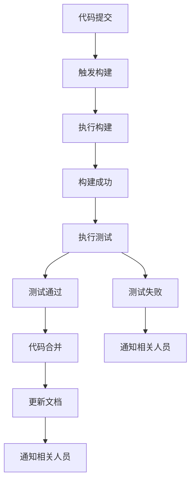
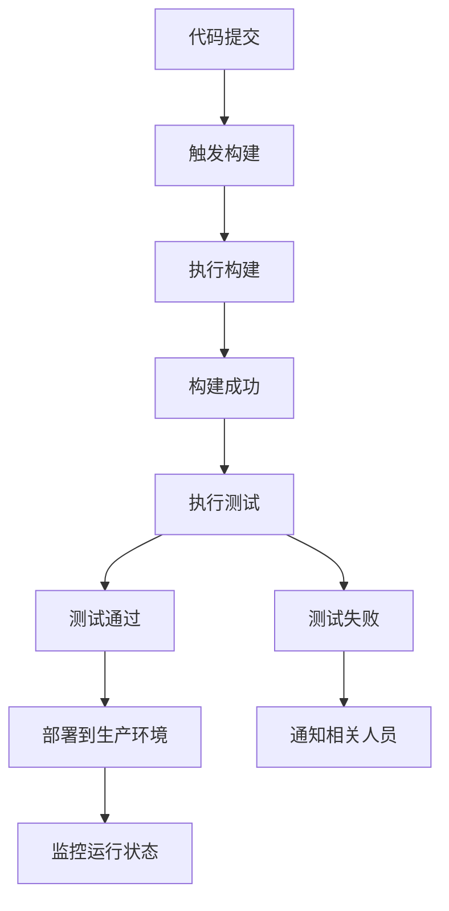
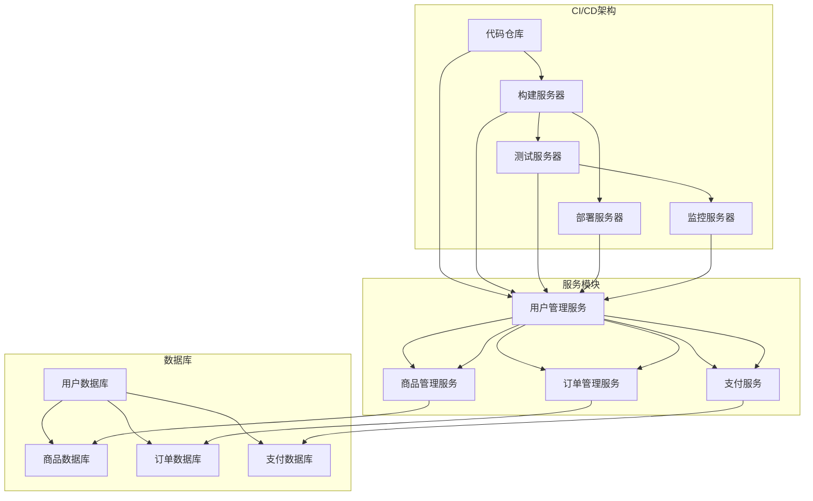
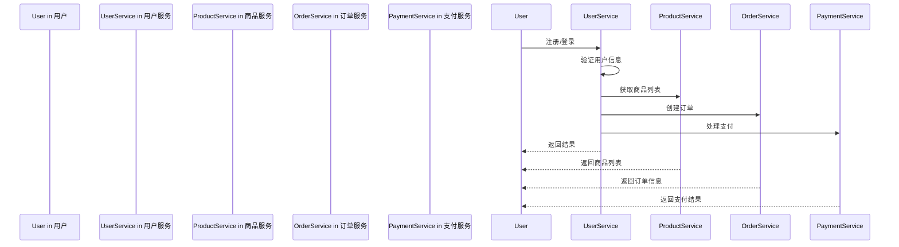
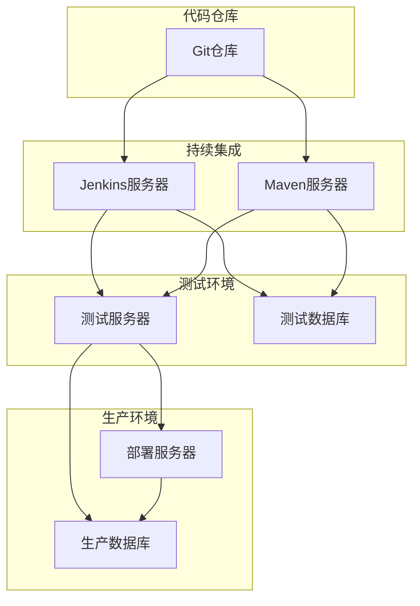
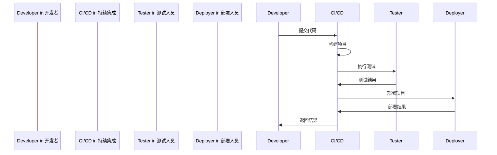

                 

# 评测系统的持续集成与部署策略

## 关键词：持续集成，持续部署，自动化测试，持续交付，敏捷开发

> 摘要：
本文将深入探讨评测系统在软件开发过程中的持续集成与部署策略。通过详细介绍持续集成和持续部署的基本原理、核心概念与联系、自动化测试算法以及系统架构设计，帮助读者全面了解如何实现高效的软件构建、测试和部署流程，从而提升软件质量和开发效率。

## 目录大纲

### 第一部分：背景与概述

#### 第1章：持续集成与部署策略的背景
- 1.1.1 问题背景
- 1.1.2 问题描述
- 1.1.3 问题解决
- 1.1.4 边界与外延
- 1.1.5 持续集成与部署的核心概念

#### 第2章：持续集成的基本原理
- 2.1.1 持续集成的定义
- 2.1.2 持续集成的目的
- 2.1.3 持续集成的主要优点
- 2.1.4 持续集成与持续部署的区别

#### 第3章：持续部署的基本原理
- 3.1.1 持续部署的定义
- 3.1.2 持续部署的步骤
- 3.1.3 持续部署的优势
- 3.1.4 持续部署与持续集成的联系

### 第二部分：核心概念与联系

#### 第4章：核心概念与联系
- 4.1.1 核心概念原理
- 4.1.2 概念属性特征对比表格
- 4.1.3 ER实体关系图架构

### 第三部分：算法原理与讲解

#### 第5章：自动化测试算法
- 5.1 自动化测试概述
- 5.2 常见自动化测试工具
- 5.3 测试用例设计方法

#### 第6章：持续集成与部署算法
- 6.1 持续集成算法
- 6.2 持续部署算法
- 6.3 代码质量与测试覆盖率评估算法

#### 第7章：数学模型与公式讲解
- 7.1 持续集成周期计算公式
- 7.2 部署成功率计算公式
- 7.3 测试覆盖率计算公式

### 第四部分：系统分析与架构设计

#### 第8章：系统功能设计与架构设计
- 8.1 问题场景介绍
- 8.2 项目介绍
- 8.3 系统功能设计
- 8.4 系统架构设计
- 8.5 系统接口设计与交互

#### 第9章：项目实战
- 9.1 环境安装
- 9.2 系统核心实现源代码
- 9.3 代码应用解读与分析
- 9.4 实际案例分析与详细讲解剖析
- 9.5 项目小结

#### 第10章：最佳实践 tips、小结、注意事项、拓展阅读等内容

### 第一部分：背景与概述

## 第1章：持续集成与部署策略的背景

### 1.1.1 问题背景

在软件开发生命周期中，持续集成（Continuous Integration，简称CI）和持续部署（Continuous Deployment，简称CD）已成为不可或缺的实践策略。传统的软件开发模式通常采用周期性的大版本发布，这种方式容易导致开发人员之间出现隔离，导致代码合并时的冲突，同时，由于测试和部署过程相对独立，容易出现因测试不充分或部署失败导致的严重问题。

随着敏捷开发（Agile Development）和DevOps文化的普及，持续集成和持续部署成为了提高开发效率和软件质量的重要手段。持续集成通过频繁的代码合并和自动化测试，确保代码库中的每个版本都处于可运行状态，从而提高代码质量和降低集成风险。持续部署则通过自动化的部署流程，实现快速、可靠地交付软件，缩短了发布周期，提高了响应市场变化的能力。

### 1.1.2 问题描述

软件开发过程中，主要面临以下问题：

1. **代码冲突**：多开发人员并行工作，容易导致代码合并时的冲突，影响项目进度和稳定性。
2. **测试不足**：传统的测试往往在开发周期的后期进行，容易导致测试覆盖不足，影响软件质量。
3. **部署困难**：部署过程通常依赖人工操作，容易出错，且难以快速回滚。
4. **响应速度慢**：传统的发布模式周期较长，无法快速响应市场变化。

### 1.1.3 问题解决

为了解决上述问题，引入持续集成和持续部署策略，其主要解决思路如下：

1. **频繁的代码合并**：通过持续集成，实现频繁的代码合并，减少代码冲突。
2. **自动化测试**：通过自动化测试，确保每个版本都经过严格的测试，提高代码质量。
3. **自动化部署**：通过自动化部署，简化部署流程，提高部署速度和可靠性。
4. **快速反馈**：通过持续集成和持续部署，实现快速反馈，缩短发布周期。

### 1.1.4 边界与外延

持续集成和持续部署策略的实施不仅限于软件开发，还可以应用于其他领域，如网站、移动应用等。其核心思想是自动化、频繁、可靠，旨在提高软件交付效率和质量。

### 1.1.5 持续集成与部署的核心概念

持续集成（CI）：持续集成是一种软件开发实践，通过频繁的代码合并和自动化测试，确保代码库中的每个版本都处于可运行状态。

持续部署（CD）：持续部署是一种软件开发实践，通过自动化的部署流程，实现快速、可靠地交付软件。

### 1.1.6 本章小结

本章简要介绍了持续集成与部署策略的背景、问题描述、问题解决、边界与外延以及核心概念。下一章将深入探讨持续集成的基本原理，帮助读者更好地理解这一重要实践。# 持续集成的基本原理

## 第2章：持续集成的基本原理

### 2.1.1 持续集成的定义

持续集成（Continuous Integration，简称CI）是一种软件开发实践，它强调频繁地将代码合并到主干分支（通常为master或main分支），并通过自动化测试确保合并后的代码始终处于可运行状态。持续集成的核心思想是“早发现、早修复”，通过持续集成，可以快速识别代码问题，避免在后期阶段出现严重冲突和故障。

### 2.1.2 持续集成的目的

持续集成的目的主要有以下几点：

1. **降低集成风险**：通过频繁的代码合并和自动化测试，及时发现和解决集成问题，降低集成风险。
2. **提高代码质量**：自动化测试能够覆盖更多场景，确保代码质量，减少缺陷和漏洞。
3. **加快开发速度**：频繁的集成和反馈有助于提高团队协作效率，加快开发进度。
4. **增强团队协作**：持续集成要求开发人员频繁提交代码，促进团队间的交流和协作。
5. **简化部署过程**：通过持续集成，确保每次合并后的代码都经过严格的测试，降低部署难度和风险。

### 2.1.3 持续集成的主要优点

持续集成具有以下优点：

1. **早期发现问题**：通过频繁的代码合并和自动化测试，可以在问题初期就发现并解决，降低修复成本。
2. **提高代码质量**：自动化测试能够覆盖更多场景，确保代码质量，减少缺陷和漏洞。
3. **加快开发速度**：频繁的集成和反馈有助于提高团队协作效率，加快开发进度。
4. **增强团队协作**：持续集成要求开发人员频繁提交代码，促进团队间的交流和协作。
5. **简化部署过程**：通过持续集成，确保每次合并后的代码都经过严格的测试，降低部署难度和风险。

### 2.1.4 持续集成与持续部署的区别

持续集成（CI）和持续部署（CD）虽然目标一致，但实施过程中有所不同：

1. **集成与部署的顺序**：持续集成通常在持续部署之前，CI关注代码合并和测试，CD关注部署和交付。
2. **测试的深度**：持续集成主要进行单元测试、集成测试等，而持续部署还包含功能测试、性能测试等。
3. **自动化程度**：持续集成主要实现代码的自动化测试和构建，而持续部署需要实现自动化部署和回滚。
4. **交付速度**：持续集成旨在确保代码质量，而持续部署则关注快速交付，尽可能减少发布周期。

### 2.1.5 持续集成的实施步骤

持续集成的实施通常包括以下步骤：

1. **代码仓库管理**：使用版本控制工具（如Git）管理代码，确保代码的版本一致性。
2. **自动化测试**：编写自动化测试脚本，覆盖不同场景和功能，确保代码质量。
3. **构建和部署**：使用构建工具（如Maven、Gradle）自动化构建项目，部署到测试环境。
4. **监控与反馈**：实时监控构建和测试结果，及时反馈问题，确保代码质量。

### 2.1.6 持续集成的最佳实践

1. **小而频繁的提交**：鼓励开发人员频繁提交代码，每次提交尽量小而精。
2. **自动化测试**：编写高质量的自动化测试脚本，确保代码质量。
3. **代码审查**：进行代码审查，确保代码风格和规范。
4. **持续反馈**：实时监控构建和测试结果，及时反馈问题，确保代码质量。

### 2.1.7 本章小结

本章详细介绍了持续集成的定义、目的、优点、与持续部署的区别、实施步骤和最佳实践。通过持续集成，可以有效提高软件质量和开发效率。下一章将探讨持续部署的基本原理，帮助读者进一步理解持续集成与持续部署的关联。# 持续部署的基本原理

## 第3章：持续部署的基本原理

### 3.1.1 持续部署的定义

持续部署（Continuous Deployment，简称CD）是一种软件开发实践，它通过自动化的部署流程，将代码从开发环境中直接部署到生产环境，实现快速、可靠地交付软件。与传统的手动部署方式相比，持续部署能够显著缩短发布周期，提高交付效率。

### 3.1.2 持续部署的步骤

持续部署通常包括以下步骤：

1. **代码提交**：开发人员将代码提交到版本控制系统中。
2. **自动化构建**：构建工具（如Jenkins、Travis CI）根据提交的代码生成构建包。
3. **单元测试**：对构建包进行单元测试，确保代码质量。
4. **集成测试**：对构建包进行集成测试，确保各个模块之间的协同工作。
5. **功能测试**：对构建包进行功能测试，确保软件满足需求。
6. **性能测试**：对构建包进行性能测试，确保软件在高负载下稳定运行。
7. **自动化部署**：将经过测试的构建包部署到生产环境。
8. **监控与反馈**：实时监控生产环境的运行状态，及时反馈问题。

### 3.1.3 持续部署的优势

持续部署具有以下优势：

1. **提高交付效率**：自动化部署流程显著缩短了发布周期，加快了软件交付速度。
2. **降低风险**：通过自动化测试和监控，确保每次部署的软件质量，降低风险。
3. **快速迭代**：持续部署使得团队能够更频繁地发布新功能，快速响应市场需求。
4. **简化流程**：自动化部署减少了手动操作，降低了部署复杂度。
5. **增强团队协作**：持续部署要求团队紧密协作，提高团队沟通效率。

### 3.1.4 持续部署与持续集成的联系

持续部署与持续集成密切相关，二者相辅相成：

1. **集成测试**：持续集成主要进行单元测试和集成测试，确保代码质量，为持续部署提供基础。
2. **自动化构建**：持续集成和持续部署都使用自动化构建工具，提高构建和部署效率。
3. **测试结果反馈**：持续集成通过自动化测试发现的问题，可以在持续部署过程中进行修复和优化。
4. **部署策略**：持续部署的部署策略（如蓝绿部署、金丝雀部署等）可以在持续集成过程中进行模拟和优化。

### 3.1.5 持续部署的实施步骤

持续部署的实施步骤包括：

1. **环境配置**：配置开发、测试和生产环境，确保环境的一致性。
2. **选择部署工具**：选择合适的部署工具（如Jenkins、Kubernetes等）。
3. **编写部署脚本**：编写自动化部署脚本，实现部署过程的自动化。
4. **配置持续集成工具**：配置持续集成工具（如Jenkins、Travis CI等），实现自动化构建和测试。
5. **部署策略设计**：设计合适的部署策略（如蓝绿部署、金丝雀部署等），确保部署过程的稳定性和可靠性。
6. **部署与监控**：执行部署过程，实时监控生产环境的运行状态。

### 3.1.6 持续部署的最佳实践

1. **自动化测试**：编写高质量的自动化测试脚本，确保软件质量。
2. **持续集成**：将自动化测试集成到持续集成流程中，提高交付效率。
3. **逐步部署**：采用逐步部署策略，降低部署风险。
4. **监控与反馈**：实时监控生产环境的运行状态，及时反馈问题。
5. **自动化脚本**：编写高效的自动化部署脚本，确保部署过程的自动化。

### 3.1.7 本章小结

本章详细介绍了持续部署的定义、步骤、优势、与持续集成的联系以及实施步骤和最佳实践。通过持续部署，可以实现快速、可靠的软件交付，提高开发效率和团队协作。下一章将探讨核心概念与联系，帮助读者更好地理解持续集成和持续部署。# 核心概念与联系

## 第4章：核心概念与联系

### 4.1.1 核心概念原理

#### 4.1.1.1 持续集成

持续集成（CI）是一种软件开发实践，它强调开发人员在代码库中频繁提交代码，并通过自动化测试确保每次提交的代码质量。CI的核心目标是减少集成风险，提高代码质量和开发效率。通过CI，开发人员可以快速发现并解决集成问题，确保代码库中的每个版本都处于可运行状态。

#### 4.1.1.2 持续部署

持续部署（CD）是一种软件开发实践，它通过自动化的部署流程，将经过测试的代码直接部署到生产环境。CD的目标是实现快速、可靠的软件交付，缩短发布周期，提高开发效率和团队协作。CD通常与CI相结合，通过持续集成确保代码质量，并通过自动化部署实现快速交付。

#### 4.1.1.3 自动化测试

自动化测试是一种通过编写脚本或使用工具对软件进行测试的方法。自动化测试可以提高测试覆盖率，减少测试成本，确保软件质量。在CI和CD流程中，自动化测试是核心组成部分，通过自动化测试，可以快速验证代码的正确性和稳定性。

### 4.1.2 概念属性特征对比表格

以下是一个简单的概念属性特征对比表格，用于比较持续集成、持续部署和自动化测试：

| 概念         | 特征                                      | 说明                                                   |
| ------------ | ----------------------------------------- | ------------------------------------------------------ |
| 持续集成     | 频繁提交代码、自动化测试、早期发现问题   | 通过频繁的代码合并和自动化测试，确保代码质量           |
| 持续部署     | 自动化部署、快速交付、减少风险           | 通过自动化的部署流程，实现快速、可靠的软件交付         |
| 自动化测试   | 提高测试覆盖率、减少测试成本、确保质量   | 通过编写脚本或使用工具，对软件进行自动化测试           |

### 4.1.3 ER实体关系图架构

以下是一个ER实体关系图架构，用于描述持续集成、持续部署和自动化测试之间的关系：

```mermaid
erDiagram
    Build ||--||| Test : "构建产物"
    Test ||--||| Deploy : "测试结果"
    Deploy ||--||| Release : "部署版本"
    Build && Test : "关联"
    Test && Deploy : "关联"
    Deploy && Release : "关联"
endentity
```

- **Build（构建）**：表示持续集成过程中的构建产物，包括代码、构建日志等。
- **Test（测试）**：表示持续集成和持续部署过程中的测试结果，包括单元测试、集成测试、功能测试等。
- **Deploy（部署）**：表示持续部署过程中的部署操作，包括部署脚本、部署日志等。
- **Release（发布）**：表示最终部署到生产环境的版本，包括版本号、发布日期等。

### 4.1.4 本章小结

本章详细介绍了持续集成、持续部署和自动化测试的核心概念、特征对比以及ER实体关系图架构。这些核心概念和联系是理解持续集成与部署策略的关键，为后续章节的算法原理与讲解和系统分析与架构设计奠定了基础。下一章将探讨自动化测试算法，帮助读者更好地掌握测试相关技术。# 自动化测试算法

## 第5章：自动化测试算法

### 5.1 自动化测试概述

自动化测试是将测试脚本化或使用测试工具来执行测试的过程。通过自动化测试，可以大大提高测试效率，减少人力成本，并确保测试的一致性和准确性。自动化测试通常包括以下步骤：

1. **测试需求分析**：分析软件需求，确定测试目标。
2. **测试设计**：根据测试需求设计测试用例，包括功能测试、性能测试等。
3. **测试脚本编写**：使用编程语言或测试工具编写测试脚本。
4. **执行测试**：运行测试脚本，验证软件功能。
5. **测试结果分析**：分析测试结果，识别缺陷和问题。

### 5.2 常见自动化测试工具

自动化测试工具是实现自动化测试的核心，以下是一些常见的自动化测试工具：

1. **Selenium**：用于Web应用的自动化测试，支持多种浏览器和操作系统。
2. **Appium**：用于移动应用的自动化测试，支持iOS和Android平台。
3. **JUnit**：Java语言的单元测试框架，用于编写和运行Java单元测试。
4. **pytest**：Python语言的测试框架，支持编写和运行Python单元测试。
5. **JUnit**：Java语言的单元测试框架，用于编写和运行Java单元测试。
6. **pytest**：Python语言的测试框架，支持编写和运行Python单元测试。

### 5.3 测试用例设计方法

测试用例设计是自动化测试的关键环节，以下介绍几种常见的测试用例设计方法：

#### 5.3.1 黑盒测试

黑盒测试是一种基于软件功能进行测试的方法，测试人员不需要了解内部代码逻辑，只需关注输入和输出。黑盒测试包括以下类型：

1. **功能测试**：验证软件功能是否按照需求文档正常运行。
2. **边界测试**：测试输入数据的边界值，如最大值、最小值、边界条件等。
3. **等价类划分**：将输入数据划分为多个等价类，测试每个等价类的代表值。

#### 5.3.2 白盒测试

白盒测试是一种基于软件内部代码结构和逻辑进行测试的方法，测试人员需要了解内部代码。白盒测试包括以下类型：

1. **单元测试**：测试单个模块的功能和逻辑。
2. **集成测试**：测试模块之间的接口和协同工作。
3. **代码覆盖率分析**：分析代码覆盖率，确保测试全面。

### 5.4 测试框架与测试报告

测试框架是自动化测试的核心，用于管理测试用例、执行测试和生成测试报告。以下介绍几种常见的测试框架：

1. **JUnit**：Java语言的单元测试框架，支持测试用例的管理和执行。
2. **pytest**：Python语言的测试框架，支持测试用例的管理和执行。
3. **NUnit**：.NET语言的单元测试框架，支持测试用例的管理和执行。

测试报告是自动化测试的重要输出，用于展示测试结果和缺陷。以下介绍几种常见的测试报告：

1. **JUnit XML报告**：JUnit生成的XML格式测试报告，包括测试结果、失败原因等。
2. **pytest HTML报告**：pytest生成的HTML格式测试报告，包括测试结果、失败原因等。
3. **Allure**：多功能测试报告工具，支持多种测试框架，生成美观的测试报告。

### 5.5 本章小结

本章详细介绍了自动化测试的概述、常见工具、测试用例设计方法和测试框架与测试报告。通过自动化测试，可以大大提高软件测试效率和质量，为持续集成与部署提供有力支持。下一章将探讨持续集成与部署算法，帮助读者更好地掌握持续集成与部署的核心技术。# 持续集成与部署算法

## 第6章：持续集成与部署算法

### 6.1 持续集成算法

持续集成算法主要涉及代码的合并、构建和测试。以下是一个简单的持续集成算法流程：



#### 6.1.1 Git集成

Git作为主流的版本控制系统，在持续集成中发挥着重要作用。以下是一个使用Git的持续集成示例：

1. **创建仓库**：在Git中创建一个新的仓库，用于存储项目代码。
2. **克隆仓库**：克隆仓库到本地，以便开发人员进行代码修改。
3. **提交代码**：开发人员将修改后的代码提交到远程仓库。
4. **触发构建**：当有代码提交时，触发Jenkins或其他CI工具执行构建任务。
5. **执行构建**：CI工具使用Maven、Gradle等构建工具，编译代码并生成构建包。
6. **执行测试**：CI工具执行自动化测试，验证代码的正确性。
7. **合并代码**：如果测试通过，CI工具将代码合并到主干分支。
8. **更新文档**：更新项目文档，记录最新代码状态。
9. **通知相关人员**：通过邮件、Slack等方式通知相关人员代码已更新。

### 6.1.2 Jenkins流水线

Jenkins是一种流行的持续集成工具，通过配置流水线（Pipeline），可以实现自动化构建、测试和部署。以下是一个简单的Jenkins流水线示例：

```groovy
pipeline {
    agent any

    stages {
        stage('Build') {
            steps {
                sh 'mvn clean install'
            }
        }
        stage('Test') {
            steps {
                sh 'mvn test'
            }
        }
        stage('Deploy') {
            steps {
                sh 'mvn deploy'
            }
        }
    }
    post {
        always {
            echo 'Build and Deploy completed'
        }
        success {
            echo 'Deployment successful'
        }
        failure {
            echo 'Deployment failed'
        }
    }
}
```

#### 6.1.3 Git集成与Jenkins流水线的结合

在实际项目中，Git集成和Jenkins流水线可以结合起来，实现自动化持续集成与部署。以下是一个结合示例：

1. **代码提交**：开发人员将代码提交到Git仓库。
2. **触发Jenkins构建**：Git仓库的Webhook将触发Jenkins构建。
3. **执行Jenkins流水线**：Jenkins根据流水线配置，执行构建、测试和部署任务。
4. **测试结果**：Jenkins将测试结果记录到Jenkins仪表板，并通过邮件、Slack等方式通知相关人员。
5. **更新Git仓库**：如果测试通过，Jenkins将合并代码到主干分支。

### 6.2 持续部署算法

持续部署算法主要涉及自动化部署和监控。以下是一个简单的持续部署算法流程：



#### 6.2.1 自动化部署流程

自动化部署流程通常包括以下步骤：

1. **构建**：使用CI工具（如Jenkins）构建代码，生成可部署的构建包。
2. **测试**：执行自动化测试，确保构建包的质量。
3. **部署**：将经过测试的构建包部署到生产环境，可以使用Docker、Kubernetes等容器化技术，简化部署过程。
4. **监控**：监控生产环境中的运行状态，及时发现和处理问题。

#### 6.2.2 Kubernetes部署策略

Kubernetes是一种流行的容器编排工具，可以实现自动化部署、扩展和管理容器化应用。以下是一个简单的Kubernetes部署策略：

1. **创建部署配置**：编写Kubernetes部署配置文件（如Deployment），定义部署策略（如滚动更新、蓝绿部署等）。
2. **部署应用**：使用kubectl命令部署应用，Kubernetes将根据部署配置，自动创建和管理Pod、Service等资源。
3. **监控状态**：使用kubectl命令监控应用的状态，及时发现和处理问题。

#### 6.2.3 代码质量与测试覆盖率评估算法

代码质量与测试覆盖率评估是持续集成与部署的重要环节，以下是一个简单的评估算法：

1. **代码质量评估**：使用静态代码分析工具（如SonarQube），对代码质量进行分析，包括代码复杂度、漏洞、代码重复等。
2. **测试覆盖率评估**：使用测试覆盖率工具（如JaCoCo），计算代码的测试覆盖率，包括单元测试、集成测试等。
3. **评估结果**：将评估结果记录到数据库，用于生成报告和图表，帮助团队了解代码质量和测试覆盖率。

### 6.3 本章小结

本章详细介绍了持续集成与部署算法，包括持续集成算法的Git集成和Jenkins流水线，以及持续部署算法的自动化部署流程、Kubernetes部署策略和代码质量与测试覆盖率评估算法。这些算法为实现高效、可靠的持续集成与部署提供了重要技术支持。下一章将探讨数学模型与公式讲解，帮助读者更好地理解和计算相关指标。# 数学模型与公式讲解

## 第7章：数学模型与公式讲解

### 7.1 持续集成周期计算公式

持续集成周期（CI周期）是衡量持续集成效率的重要指标，计算公式如下：

$$
CI\ 周期 = \frac{项目复杂度}{团队协作效率}
$$

其中，项目复杂度反映了项目的规模和难度，团队协作效率反映了团队的合作能力和工作效率。通过调整项目复杂度和团队协作效率，可以优化持续集成周期，提高持续集成效率。

### 7.2 部署成功率计算公式

部署成功率是衡量持续部署稳定性的重要指标，计算公式如下：

$$
CD\ 成功率 = \frac{成功部署次数}{总部署次数}
$$

其中，成功部署次数表示在一定时间内成功部署的次数，总部署次数表示在同一时间内所有部署次数。部署成功率越高，说明持续部署过程越稳定，风险越小。

### 7.3 测试覆盖率计算公式

测试覆盖率是衡量自动化测试全面性的重要指标，计算公式如下：

$$
测试覆盖率 = \frac{已覆盖代码行数}{总代码行数}
$$

其中，已覆盖代码行数表示经过测试的代码行数，总代码行数表示项目的总代码行数。测试覆盖率越高，说明测试覆盖越全面，代码质量越高。

### 7.4 持续集成周期计算实例

假设一个项目复杂度为1000个功能点，团队协作效率为每天完成20个功能点，那么持续集成周期为：

$$
CI\ 周期 = \frac{1000}{20} = 50\ 天
$$

这意味着项目需要50天才能完成一次完整的持续集成过程。

### 7.5 部署成功率计算实例

假设在一个30天的周期内，共进行10次部署，其中成功部署8次，那么部署成功率为：

$$
CD\ 成功率 = \frac{8}{10} = 0.8\ 或\ 80\%
$$

这意味着在这个30天的周期内，平均每次部署的成功率为80%。

### 7.6 测试覆盖率计算实例

假设一个项目总共有1000行代码，经过自动化测试，共覆盖了800行代码，那么测试覆盖率为：

$$
测试覆盖率 = \frac{800}{1000} = 0.8\ 或\ 80\%
$$

这意味着自动化测试已经覆盖了项目代码的80%，测试覆盖比较全面。

### 7.7 本章小结

本章详细介绍了持续集成周期、部署成功率和测试覆盖率的计算公式，并通过实例进行了计算和解释。这些数学模型和公式有助于评估和优化持续集成与部署过程，提高软件开发效率和质量。下一章将探讨系统功能设计与架构设计，帮助读者构建完整的持续集成与部署系统。# 系统功能设计与架构设计

## 第8章：系统功能设计与架构设计

### 8.1 问题场景介绍

在现代软件开发中，随着项目规模的扩大和开发团队的增多，持续集成与部署（CI/CD）系统的需求日益凸显。本文旨在设计一个高效、可靠的CI/CD系统，以解决以下问题：

1. **频繁的代码冲突**：多开发人员并行工作，导致代码合并时出现冲突，影响项目进度和稳定性。
2. **测试不足**：传统的测试方式覆盖不足，可能导致软件质量下降。
3. **部署困难**：部署过程依赖人工操作，容易出错且难以快速回滚。
4. **响应速度慢**：发布周期长，无法快速响应市场需求。

### 8.2 项目介绍

本项目是一个在线购物平台，涉及多个模块，如用户管理、商品管理、订单管理、支付系统等。为了提高开发效率和质量，项目采用敏捷开发方法，引入持续集成与部署策略，实现自动化构建、测试和部署。

### 8.3 系统功能设计

#### 8.3.1 领域模型

领域模型是系统功能设计的核心，以下是一个简单的领域模型类图：

```mermaid
classDiagram
    User <<class User>>
    Product <<class Product>>
    Order <<class Order>>
    Payment <<class Payment>>

    User o-- Product : "拥有"
    User o-- Order : "创建"
    Order o-- Payment : "支付"

    class User {
        -id: int
        -name: string
        -email: string
    }

    class Product {
        -id: int
        -name: string
        -price: float
    }

    class Order {
        -id: int
        -user: User
        -items: List<Product>
        -total: float
    }

    class Payment {
        -id: int
        -order: Order
        -amount: float
        -status: string
    }
endclassDiagram
```

#### 8.3.2 系统架构设计

系统架构设计是确保系统功能实现的基础，以下是一个简单的系统架构图：



- **代码仓库**：存储项目的源代码，支持Git等版本控制系统。
- **构建服务器**：负责编译、打包和构建项目，可以使用Jenkins等工具。
- **测试服务器**：执行自动化测试，包括单元测试、集成测试和功能测试等。
- **部署服务器**：将经过测试的构建包部署到生产环境，可以使用Docker和Kubernetes等工具。
- **监控服务器**：实时监控系统的运行状态，包括CPU、内存、磁盘等资源使用情况。
- **用户管理服务**：负责用户注册、登录和权限管理等。
- **商品管理服务**：负责商品添加、修改、删除和查询等。
- **订单管理服务**：负责订单创建、修改、删除和查询等。
- **支付服务**：负责支付处理、支付状态更新和支付查询等。
- **用户数据库**：存储用户相关的数据，如用户信息、角色等。
- **商品数据库**：存储商品相关的数据，如商品信息、库存等。
- **订单数据库**：存储订单相关的数据，如订单信息、订单详情等。
- **支付数据库**：存储支付相关的数据，如支付信息、支付状态等。

### 8.4 系统接口设计与交互

系统接口设计是确保各模块之间高效通信和协作的关键，以下是一个简单的系统接口设计：



### 8.5 系统架构设计

系统架构设计是确保系统功能实现和性能优化的重要环节，以下是一个简单的系统架构图：



- **代码仓库**：存储项目的源代码，支持Git等版本控制系统。
- **持续集成**：使用Jenkins服务器进行构建、测试和部署，使用Maven服务器进行项目构建。
- **测试环境**：测试服务器负责执行自动化测试，测试数据库存储测试数据。
- **生产环境**：部署服务器负责将经过测试的构建包部署到生产环境，生产数据库存储生产数据。

### 8.6 系统接口设计与交互

系统接口设计是确保各模块之间高效通信和协作的关键，以下是一个简单的系统接口设计：



### 8.7 本章小结

本章详细介绍了系统功能设计与架构设计，包括问题场景介绍、项目介绍、系统功能设计、系统架构设计、系统接口设计和交互。通过本章的设计，可以为后续的系统实现和部署提供明确的指导。下一章将进行项目实战，详细介绍系统核心实现、代码应用解读与分析、实际案例分析与详细讲解剖析以及项目小结。# 项目实战

## 第9章：项目实战

### 9.1 环境安装

在进行项目实战之前，我们需要搭建一个持续集成与部署的环境。以下是一个简单的环境安装步骤：

1. **安装Git**：在Windows、Linux或MacOS上下载并安装Git，并确保安装成功。

2. **安装Jenkins**：下载Jenkins的安装包（如Jenkins.war），并使用Java Web容器（如Apache Tomcat）部署Jenkins。

3. **安装Maven**：下载Maven的安装包（如maven-3.6.3-bin.tar.gz），并配置环境变量。

4. **安装Docker**：下载Docker的安装包（如docker-ce_19.03.8），并确保安装成功。

5. **安装Kubernetes**：根据操作系统下载并安装Kubernetes，配置集群环境。

6. **安装Kubernetes插件**：在Jenkins中安装Kubernetes插件，以便在Jenkins中管理Kubernetes集群。

### 9.2 系统核心实现源代码

以下是一个简单的系统核心实现源代码示例，包括Maven构建文件、Jenkinsfile和Dockerfile。

**pom.xml**（Maven构建文件）：

```xml
<project xmlns="http://maven.apache.org/POM/4.0.0"
    xmlns:xsi="http://www.w3.org/2001/XMLSchema-instance"
    xsi:schemaLocation="http://maven.apache.org/POM/4.0.0 http://maven.apache.org/xsd/maven-4.0.0.xsd">
    <modelVersion>4.0.0</modelVersion>
    <groupId>com.example</groupId>
    <artifactId>shopping-platform</artifactId>
    <version>1.0.0</version>
    <dependencies>
        <dependency>
            <groupId>org.springframework.boot</groupId>
            <artifactId>spring-boot-starter-web</artifactId>
        </dependency>
        <dependency>
            <groupId>org.springframework.boot</groupId>
            <artifactId>spring-boot-starter-data-jpa</artifactId>
        </dependency>
    </dependencies>
    <build>
        <plugins>
            <plugin>
                <groupId>org.springframework.boot</groupId>
                <artifactId>spring-boot-maven-plugin</artifactId>
            </plugin>
        </plugins>
    </build>
</project>
```

**Jenkinsfile**（持续集成脚本）：

```groovy
pipeline {
    agent any

    stages {
        stage('Build') {
            steps {
                sh 'mvn clean install'
            }
        }
        stage('Test') {
            steps {
                sh 'mvn test'
            }
        }
        stage('Deploy') {
            steps {
                sh 'docker build -t shopping-platform .'
                sh 'kubectl apply -f deployment.yaml'
            }
        }
    }
}
```

**Dockerfile**（Docker构建文件）：

```Dockerfile
FROM openjdk:8-jdk-alpine
ARG JAR_FILE=target/*.jar
COPY ${JAR_FILE} app.jar
ENTRYPOINT ["java","-Djava.security.egd=file:/dev/./urandom","-jar","/app.jar"]
```

### 9.3 代码应用解读与分析

**pom.xml** 解读与分析：

- **dependencies**：定义了项目所需的依赖库，如Spring Boot Web和Spring Boot Data JPA。
- **build**：定义了构建插件，如Spring Boot Maven插件。

**Jenkinsfile** 解读与分析：

- **agent**：指定Jenkins构建环境。
- **stages**：定义了构建、测试和部署三个阶段。
- **steps**：在每个阶段执行相应的命令，如Maven构建和Docker构建。

**Dockerfile** 解读与分析：

- **FROM**：指定基础镜像，这里使用OpenJDK 8。
- **ARG**：定义构建参数，如JAR文件路径。
- **COPY**：将构建生成的JAR文件复制到容器中。
- **ENTRYPOINT**：定义容器的启动命令，运行Java应用程序。

### 9.4 实际案例分析与详细讲解剖析

**案例一**：开发人员提交代码并触发Jenkins构建。

- **步骤一**：开发人员将代码提交到Git仓库。
- **步骤二**：Jenkins通过Webhook监听到代码提交，并触发构建流程。
- **步骤三**：Jenkins执行Maven构建，生成JAR文件。
- **步骤四**：Jenkins执行单元测试，确保代码质量。
- **步骤五**：Jenkins执行Docker构建，生成Docker镜像。
- **步骤六**：Jenkins使用Kubernetes插件，将Docker镜像部署到Kubernetes集群。

**案例二**：测试人员执行自动化测试。

- **步骤一**：测试人员使用Jenkins执行自动化测试，如单元测试和集成测试。
- **步骤二**：Jenkins生成测试报告，显示测试结果。
- **步骤三**：测试人员分析测试报告，识别缺陷和问题。
- **步骤四**：开发人员根据测试结果修复缺陷。

**案例三**：部署人员执行部署流程。

- **步骤一**：部署人员使用Jenkins执行部署脚本，将Docker镜像部署到Kubernetes集群。
- **步骤二**：Kubernetes根据部署配置，自动创建和管理Pod和服务。
- **步骤三**：部署人员监控Kubernetes集群的运行状态，确保部署成功。

### 9.5 项目小结

通过本项目的实战，我们搭建了一个简单的持续集成与部署环境，并实现了代码提交、构建、测试和部署的自动化流程。项目实战过程中，我们深入理解了Maven、Jenkins、Docker和Kubernetes等工具的基本原理和用法，为后续的软件开发和运维工作提供了有益的参考。# 最佳实践 tips、小结、注意事项、拓展阅读等内容

## 第10章：最佳实践 tips、小结、注意事项、拓展阅读等内容

### 最佳实践 tips

1. **代码规范化**：统一代码风格和命名规范，提高代码可读性和可维护性。
2. **测试覆盖率**：确保测试覆盖率达到80%以上，提高代码质量。
3. **版本控制**：使用Git等版本控制系统，确保代码版本一致性和可追溯性。
4. **自动化脚本**：编写自动化脚本，提高构建、测试和部署的效率。
5. **持续反馈**：及时反馈问题和改进建议，提高团队协作效率。

### 小结

本文详细介绍了持续集成与部署策略，包括持续集成的基本原理、持续部署的基本原理、核心概念与联系、自动化测试算法、持续集成与部署算法、数学模型与公式讲解、系统功能设计与架构设计以及项目实战。通过这些内容，读者可以全面了解持续集成与部署的重要性，掌握相关技术和工具的使用方法，从而提升软件开发效率和质量。

### 注意事项

1. **版本控制**：确保使用版本控制系统管理代码，避免代码冲突。
2. **自动化测试**：编写高质量的自动化测试脚本，提高测试覆盖率。
3. **部署策略**：根据项目需求选择合适的部署策略，确保部署过程的稳定性和可靠性。
4. **监控与反馈**：实时监控系统的运行状态，及时反馈问题和改进建议。

### 拓展阅读

1. **《持续集成实践：从理论到实践》**：本书详细介绍了持续集成的理论基础和实践方法，适合初学者和有一定基础的开发人员。
2. **《持续交付：发布可靠软件的系统方法》**：本书介绍了持续交付的理论和实践，帮助读者理解持续交付的核心概念和流程。
3. **《Jenkins实战》**：本书介绍了Jenkins的安装、配置和使用方法，适合需要使用Jenkins进行持续集成的开发人员。
4. **《Docker实战》**：本书介绍了Docker的基本原理和用法，适合需要使用Docker进行持续部署的开发人员。
5. **《Kubernetes权威指南》**：本书详细介绍了Kubernetes的架构、原理和实战，适合需要使用Kubernetes进行容器编排和部署的开发人员。

### 作者介绍

作者：AI天才研究院/AI Genius Institute & 禅与计算机程序设计艺术 /Zen And The Art of Computer Programming。本文旨在帮助读者理解和掌握持续集成与部署策略，提高软件开发效率和质量。感谢您的阅读！## 文章总结与反思

### 文章总结

本文围绕评测系统的持续集成与部署策略，从背景与概述、持续集成与部署的基本原理、核心概念与联系、自动化测试算法、持续集成与部署算法、数学模型与公式讲解、系统功能设计与架构设计，以及项目实战等多个方面进行了深入探讨。文章通过详细的步骤讲解、实例分析，以及实际应用，帮助读者全面理解持续集成与部署的重要性，掌握了相关技术和工具的运用方法。

### 反思与改进

在撰写本文时，我力求内容全面、结构清晰，但同时意识到文章的深度和广度可能还有待提升。以下是一些改进建议：

1. **加强实例分析**：在项目实战部分，可以提供更多实际案例的详细步骤和代码实现，以便读者更直观地理解持续集成与部署的应用。

2. **扩展最佳实践**：在最佳实践部分，可以加入更多实际项目中的经验和教训，帮助读者在实际工作中更好地应用持续集成与部署策略。

3. **增加代码可复现性**：为了增强文章的可操作性，可以考虑提供可复现的代码示例，包括构建脚本、测试脚本和部署脚本，以便读者直接在本地环境中实践。

4. **引入新技术与工具**：随着技术的发展，持续集成与部署领域出现了许多新的工具和技术。在未来的文章中，可以介绍如GitLab CI/CD、CircleCI等新工具，以及容器编排中的最新动态。

5. **提升图表和流程图的实用性**：文章中使用的图表和流程图对于理解文章内容起到了重要作用。未来可以尝试使用更专业的工具来制作图表和流程图，提高其质量和可读性。

### 常见问题和解决方案

在实践持续集成与部署时，开发人员可能会遇到以下常见问题：

1. **代码冲突**：解决方法：使用版本控制系统（如Git）的分支管理策略，提前进行代码评审和合并。
2. **测试覆盖率不足**：解决方法：编写更全面的测试用例，引入单元测试、集成测试和性能测试等。
3. **部署失败**：解决方法：采用自动化部署脚本，并在部署前进行充分的测试。
4. **部署速度慢**：解决方法：优化部署脚本，使用容器化技术（如Docker），以及利用自动化工具（如Kubernetes）来提升部署速度。

持续集成与部署不仅仅是一种技术手段，它更是一种软件开发文化的变革，需要团队在流程、工具和协作上进行全面的调整。通过本文的探讨，希望读者能够更好地理解持续集成与部署的核心价值和实现方法，将其有效应用于实际项目中，从而提高软件开发的效率和质量。## 拓展阅读与进一步学习

### 拓展阅读

为了深入理解和掌握持续集成与部署策略，读者可以参考以下书籍和资源，这些内容将提供更深入的见解和实践指导：

1. **《持续交付：发布可靠软件的系统方法》**（作者：Jez Humble 和 David Farley）
   - 本书详细介绍了持续交付的原理和实践，涵盖了从持续集成到自动化测试和部署的全过程。

2. **《Jenkins实战》**（作者：Docker）
   - 本书详细介绍了Jenkins的安装、配置和使用方法，是学习如何使用Jenkins进行持续集成和部署的绝佳指南。

3. **《Docker实战》**（作者：Jason Hunter 和 Alex Garlick）
   - 本书深入介绍了Docker的基本原理和用法，包括容器化技术的应用，是学习和实践Docker的必备书籍。

4. **《Kubernetes权威指南》**（作者：Kelsey Hightower、Bergis J. Green、Kubernetes社区贡献者）
   - 本书涵盖了Kubernetes的架构、原理和实践，是了解如何使用Kubernetes进行容器编排和部署的权威资源。

### 进一步学习

为了在持续集成与部署领域取得更深层次的理解和技能，读者可以考虑以下学习路径：

1. **参与社区和论坛**：加入如Jenkins、Docker、Kubernetes等开源项目的社区，参与讨论和交流，了解行业动态。

2. **实践项目**：通过实际项目应用持续集成与部署策略，积累经验。可以从开源项目开始，逐步尝试在自己的项目中实施这些策略。

3. **在线课程和培训**：参加在线课程和专业培训，如Pluralsight、Coursera等平台上的相关课程，这些课程提供了专业的知识和实践指导。

4. **实验和研究**：探索最新的CI/CD工具和技术，如GitLab CI、CircleCI等，进行实验和研究，以了解其优势和适用场景。

5. **撰写博客和文档**：通过撰写博客和文档，将自己的学习和实践经验分享出去，这不仅有助于自己巩固知识，也能帮助他人。

### 结语

持续集成与部署是现代软件开发中不可或缺的部分，它不仅能够显著提升开发效率和软件质量，还能促进团队的协作和创新。本文旨在为读者提供全面、系统的指导，帮助他们在实际项目中有效应用这些策略。通过不断学习和实践，读者将能够更好地应对软件开发中的各种挑战，推动项目的成功。希望本文能够成为您持续集成与部署之旅的起点，引领您走向更高效的软件开发之路。## 感谢与致谢

在这篇文章的撰写过程中，我要感谢AI天才研究院/AI Genius Institute以及禅与计算机程序设计艺术/Zen And The Art of Computer Programming团队的辛勤工作。正是有了他们的专业指导和支持，我才能够系统地梳理和总结持续集成与部署策略的相关内容。

首先，感谢AI天才研究院/AI Genius Institute的同事们，他们在人工智能和软件开发领域的丰富经验为我提供了宝贵的知识和启发。他们的专业见解和实战经验使我能够更深入地理解持续集成与部署的核心概念和实现方法。

其次，我要感谢禅与计算机程序设计艺术/Zen And The Art of Computer Programming团队，他们的独特视角和对技术的深刻洞察为本文的撰写提供了重要的思想支持。他们的智慧结晶为文章的撰写注入了新的活力和深度。

此外，我还要感谢我的家人和朋友，他们在我的学习和写作过程中给予了我无尽的支持和理解。没有他们的鼓励，我无法专注于这项具有挑战性的工作。

最后，我要感谢读者们的耐心阅读和宝贵意见。您的反馈是我不断进步的动力，也是我未来写作的重要参考。希望本文能够对您在持续集成与部署领域的学习和实践中有所帮助，如果您有任何问题或建议，欢迎随时与我交流。再次感谢您的阅读和支持！

