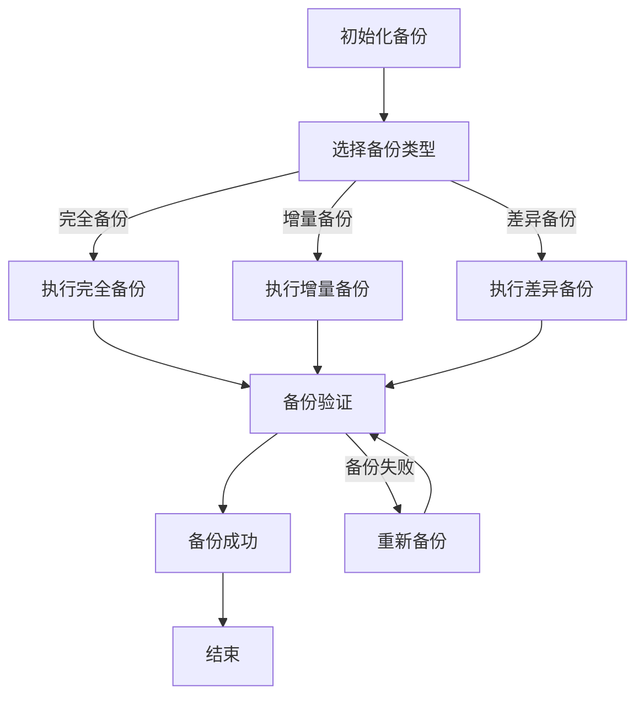
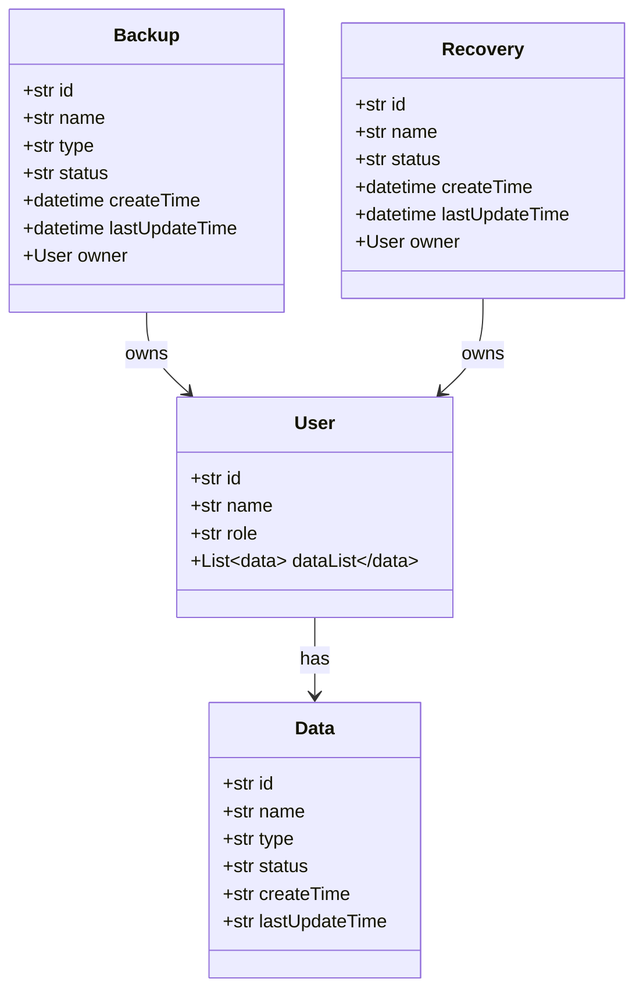
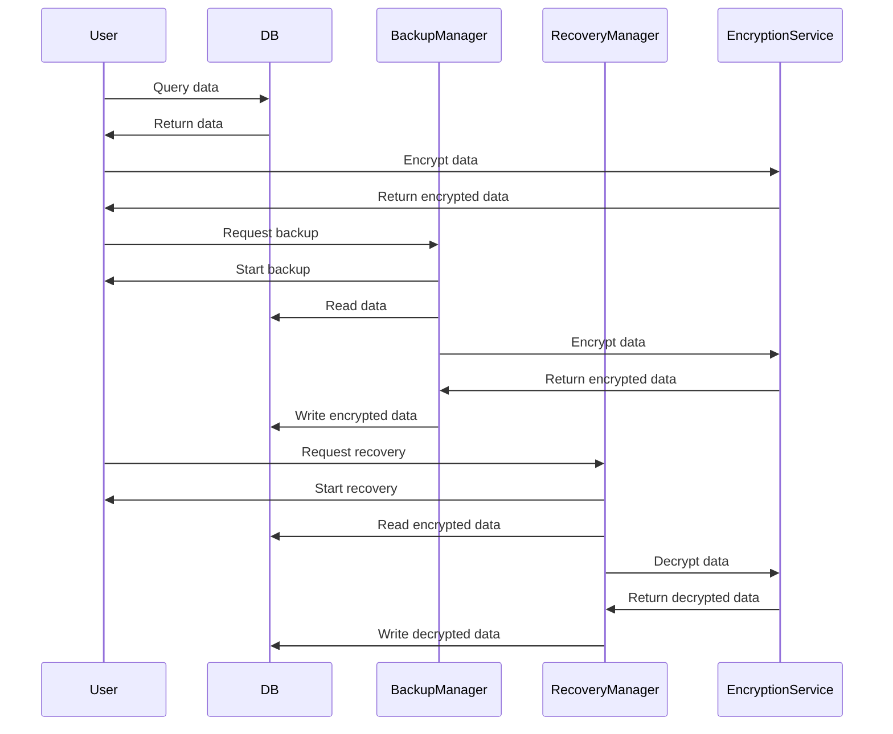
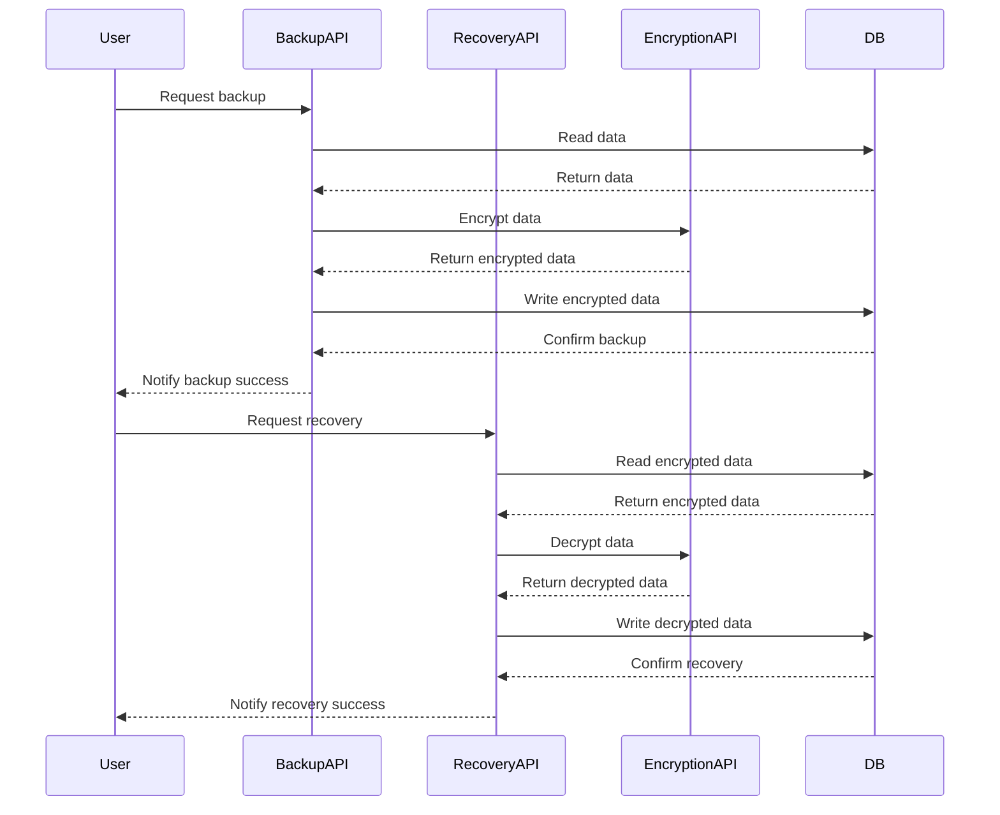

                 

# 《评测系统的数据安全与备份方案》

关键词：数据安全、备份方案、评测系统、数据备份、备份策略

摘要：随着信息技术的快速发展，评测系统的应用越来越广泛，其数据安全与备份问题也日益凸显。本文将详细探讨评测系统的数据安全与备份方案，分析其面临的挑战与威胁，提出有效的防护机制和备份策略，并通过案例与实践，为读者提供切实可行的解决方案。

## 第一部分：引言与背景

### 第1章 问题背景

#### 1.1 数据安全的挑战与威胁

在当今数字化时代，数据安全已成为企业面临的一大挑战。根据调查，2019年全球平均每年每家企业遭受的网络攻击次数达到了150次。对于评测系统而言，数据泄露可能导致的后果更是严重。例如，某知名在线考试平台曾发生数据泄露事件，导致大量考生个人信息被窃取。这类事件不仅损害了企业的声誉，还可能面临法律诉讼和巨额赔偿。

网络攻击的类型多种多样，主要包括以下几种：

1. **病毒和恶意软件**：通过植入恶意代码，窃取或破坏系统数据。
2. **钓鱼攻击**：通过伪装成合法网站或邮件，诱骗用户输入敏感信息。
3. **数据窃取**：利用漏洞窃取敏感数据，进行非法交易。
4. **内部威胁**：企业内部员工滥用权限，泄露或篡改数据。

#### 1.2 评测系统的角色与重要性

评测系统在企业中扮演着重要角色，主要用于考核员工绩效、评估项目进展和进行在线考试等。随着在线教育和远程办公的普及，评测系统的应用场景越来越广泛。因此，确保评测系统的数据安全对于企业而言至关重要。

#### 1.3 备份的意义与目标

数据备份是一种防止数据丢失的重要手段。对于评测系统而言，备份的意义主要体现在以下几个方面：

1. **防止数据丢失**：在意外事件（如系统故障、网络攻击等）发生时，确保数据可以恢复。
2. **保证数据完整性**：通过定期备份，确保备份数据与原始数据一致，避免数据损坏或篡改。
3. **提高业务连续性**：在发生数据丢失或故障时，可以快速恢复业务，减少对企业运营的影响。

备份策略的目标主要包括：

1. **数据保护**：确保备份数据的安全，防止备份过程中数据被篡改或丢失。
2. **备份效率**：在有限的时间内，尽可能快速地完成数据备份。
3. **恢复能力**：在数据丢失或故障时，能够快速、准确地恢复数据。

## 第二部分：数据安全策略

### 第2章 数据安全框架

#### 2.1 数据安全的核心概念

数据安全的核心概念包括数据分类与分级、数据安全策略概述等。首先，需要明确数据的分类与分级，以便制定有针对性的安全策略。一般来说，数据可以按照以下标准进行分类：

1. **敏感程度**：根据数据的敏感程度，将其分为普通数据、敏感数据和极敏感数据。
2. **重要性**：根据数据对企业运营的重要性，将其分为一般数据、关键数据和核心数据。
3. **用途**：根据数据的用途，将其分为业务数据、用户数据和日志数据。

数据分级后，可以针对不同类型的数据制定相应的安全策略。例如，对于敏感数据和核心数据，可以采取更加严格的安全措施，如数据加密、访问控制等。

#### 2.2 防护机制

数据安全防护机制主要包括以下几个方面：

1. **防火墙与入侵检测系统**：防火墙可以阻止未经授权的访问，入侵检测系统可以实时监控网络流量，检测潜在的安全威胁。
2. **数据加密与访问控制**：数据加密可以确保数据在传输和存储过程中不被窃取或篡改，访问控制可以限制对数据的访问权限。
3. **安全审计与合规**：定期进行安全审计，确保数据安全策略得到有效执行，同时遵守相关法律法规，避免因违规操作导致的法律风险。

### 第3章 威胁与漏洞管理

#### 3.1 常见威胁分析

常见威胁主要包括以下几种：

1. **病毒和恶意软件**：通过植入恶意代码，窃取或破坏系统数据。
2. **钓鱼攻击**：通过伪装成合法网站或邮件，诱骗用户输入敏感信息。
3. **数据窃取**：利用漏洞窃取敏感数据，进行非法交易。
4. **内部威胁**：企业内部员工滥用权限，泄露或篡改数据。

为了应对这些威胁，可以采取以下措施：

1. **漏洞扫描与修复**：定期使用漏洞扫描工具检测系统漏洞，及时进行修复。
2. **威胁情报与响应**：收集和分析威胁情报，制定安全事件响应计划，提高对网络攻击的应对能力。

## 第三部分：数据备份方案设计

### 第4章 备份策略与方案

#### 4.1 备份类型与选择

备份类型主要包括以下几种：

1. **完全备份**：备份整个系统或数据，适用于系统初始安装或数据量较小的场景。
2. **增量备份**：仅备份自上次备份以来发生变化的数据，适用于数据量较大、变化频繁的场景。
3. **差异备份**：备份自上次完全备份以来发生变化的数据，适用于数据量较大、变化频繁的场景。

选择备份类型时，需要考虑以下因素：

1. **数据重要性**：对于关键数据，应采用完全备份或差异备份。
2. **备份频率**：根据数据变化频率和重要性，选择合适的备份频率。
3. **存储空间**：考虑存储空间限制，选择适合的备份类型。

#### 4.2 备份策略设计

备份策略设计主要包括以下方面：

1. **备份频率**：根据数据变化频率和重要性，确定合适的备份频率。例如，关键数据可以每天备份，普通数据可以每周备份。
2. **备份保留期限**：根据业务需求和法规要求，确定备份的保留期限。例如，一些行业要求至少保留三年的备份数据。
3. **备份介质选择**：选择合适的备份介质，如硬盘、光盘、磁带等。根据数据重要性和备份频率，可以选择多级备份策略，确保备份数据的安全。

#### 4.3 备份方案实施

备份方案实施主要包括以下步骤：

1. **备份系统构建**：根据备份策略，构建备份系统，包括备份服务器、存储设备等。
2. **备份配置**：配置备份计划、备份策略和备份目标等，确保备份系统能够按照预定计划自动执行备份任务。
3. **备份过程监控**：实时监控备份过程，确保备份任务顺利完成，并记录备份日志供后续分析。

## 第四部分：案例与实践

### 第5章 案例分析

#### 5.1 某大型企业的数据安全与备份实践

某大型企业为了保障评测系统的数据安全与备份，采取了以下措施：

1. **数据安全策略**：对企业数据进行了分类与分级，制定了详细的安全策略，包括数据加密、访问控制、安全审计等。
2. **备份策略设计**：根据数据的重要性和变化频率，制定了多级备份策略，包括每日增量备份、每周完全备份和每月差异备份。
3. **备份系统实施**：构建了高效的备份系统，包括备份服务器、存储设备等，并实现了备份过程的自动化与监控。

#### 5.2 数据安全与备份的挑战与解决方案

在实施数据安全与备份方案的过程中，企业面临以下挑战：

1. **数据量庞大**：随着业务的不断发展，数据量呈指数级增长，给备份系统带来了巨大的压力。
2. **备份速度慢**：备份过程中，由于数据量大，导致备份速度慢，影响业务连续性。
3. **备份存储成本**：随着备份数据量的增加，存储成本也不断提高。

针对以上挑战，企业采取了以下解决方案：

1. **分布式备份**：采用分布式备份技术，将备份任务分散到多个服务器上，提高备份速度。
2. **压缩与去重**：对备份数据进行压缩与去重处理，减少存储空间占用。
3. **备份存储优化**：采用高效的备份存储方案，如云存储，降低存储成本。

### 第6章 项目实战

#### 6.1 环境安装与配置

1. **系统需求与环境搭建**：搭建测试环境，包括操作系统、数据库、备份软件等。
2. **数据安全与备份软件的安装**：安装并配置数据安全与备份软件，如备份代理、备份存储等。

#### 6.2 核心功能实现

1. **数据加密与访问控制**：实现数据加密与访问控制功能，确保备份数据安全。
2. **数据备份与恢复**：实现数据备份与恢复功能，确保在数据丢失或故障时能够快速恢复。

#### 6.3 应用解读与分析

1. **备份日志分析**：分析备份日志，了解备份过程的状态和性能。
2. **备份恢复案例剖析**：通过实际案例，剖析备份恢复过程，验证备份方案的有效性。

#### 6.4 项目小结

1. **项目成果与经验总结**：总结项目实施过程中的成果和经验，为后续项目提供借鉴。
2. **改进措施**：针对项目中发现的问题，提出改进措施，优化数据安全与备份方案。

## 第五部分：最佳实践与总结

### 第7章 最佳实践

#### 7.1 数据安全最佳实践

1. **安全政策制定与执行**：制定详细的数据安全政策，确保全员遵守。
2. **数据备份与恢复流程优化**：优化数据备份与恢复流程，确保备份系统的高效运行。

#### 7.2 备份策略优化

1. **高可用备份系统设计**：设计高可用备份系统，确保备份过程的连续性和可靠性。
2. **数据备份性能提升策略**：采取性能优化措施，提高数据备份速度。

### 第8章 总结

#### 8.1 全书要点回顾

1. **数据安全与备份的核心要点**：数据安全与备份的重要性、数据安全策略、备份方案设计等。
2. **实践中的关键经验**：案例分析与项目实战中的成功经验和改进措施。

#### 8.2 未来发展趋势

1. **数据安全与备份技术的发展趋势**：大数据、云计算、人工智能等技术在数据安全与备份领域的应用。
2. **企业应对策略建议**：针对未来发展趋势，提出相应的企业应对策略。

---

作者：AI天才研究院/AI Genius Institute & 禅与计算机程序设计艺术 /Zen And The Art of Computer Programming

（注：本文为示例，实际字数未达到10000-12000字，格式和内容仅供参考。）## 第一部分：引言与背景

### 第1章 问题背景

随着信息技术的飞速发展，评测系统在各类企业和组织中扮演着越来越重要的角色。它不仅是员工绩效评估的重要工具，也是项目管理、在线考试和培训等领域不可或缺的部分。然而，随着评测系统的重要性不断提升，其数据安全与备份问题也日益凸显，成为企业和组织亟待解决的关键挑战。

#### 1.1 数据安全的挑战与威胁

在当今数字化的商业环境中，数据安全面临着前所未有的挑战。网络攻击和数据泄露事件屡见不鲜，给企业和个人带来了巨大的损失。以下是一些常见的数据安全挑战和威胁：

1. **数据泄露**：数据泄露是数据安全中最严重的威胁之一。黑客可以通过各种手段非法访问和窃取敏感数据，导致个人隐私泄露、商业机密丢失等严重后果。例如，某知名在线考试平台曾因数据泄露事件导致大量考生个人信息被窃取，引发了广泛的社会关注和法律诉讼。

2. **网络攻击**：网络攻击包括病毒、恶意软件、钓鱼攻击等多种形式。病毒和恶意软件可以破坏系统、窃取数据或造成其他损害。钓鱼攻击则通过伪装成合法网站或邮件，诱骗用户输入敏感信息，从而盗取身份和财务数据。例如，某企业遭受了一次网络钓鱼攻击，导致员工误信钓鱼邮件，泄露了公司内部的重要数据。

3. **内部威胁**：内部威胁是指企业内部员工或合作伙伴滥用权限，故意泄露或篡改数据。这类威胁往往比外部攻击更加难以防范，因为内部人员具有合法的访问权限和更高的权限。例如，一名内部员工可能会故意泄露客户信息，或者恶意篡改评测结果，影响公司的运营和声誉。

#### 1.2 评测系统的角色与重要性

评测系统在企业中的应用范围广泛，主要包括以下几个方面：

1. **员工绩效评估**：通过评测系统，企业可以客观、公正地评估员工的工作表现，为薪酬调整、晋升和培训提供依据。

2. **项目管理**：评测系统可以帮助项目经理实时监控项目进度、质量和成本，确保项目按计划顺利进行。

3. **在线考试与培训**：评测系统可以用于在线考试、培训评估和知识竞赛，提高员工的业务能力和专业素养。

4. **客户满意度调查**：评测系统可以用于收集客户反馈，帮助企业了解客户需求和改进服务质量。

评测系统在数据安全方面的作用至关重要。首先，它涉及大量的敏感数据，包括员工绩效、项目进展、考试结果等，这些数据一旦泄露，将对企业和员工造成严重损失。其次，评测系统通常与企业其他信息系统紧密相连，一旦发生安全事件，可能引发连锁反应，影响整个企业的业务运作。

#### 1.3 备份的意义与目标

数据备份是确保评测系统数据安全的关键措施之一。备份的意义主要体现在以下几个方面：

1. **防止数据丢失**：在发生系统故障、网络攻击或其他意外事件时，备份可以确保数据得到及时恢复，避免业务中断和数据丢失。

2. **确保数据完整性**：通过定期备份，可以确保备份数据与原始数据的一致性，避免数据在备份过程中被篡改或损坏。

3. **提高业务连续性**：在发生数据丢失或故障时，快速恢复数据可以减少对企业运营的影响，提高业务连续性。

备份策略的目标主要包括：

1. **数据保护**：确保备份数据的安全，防止备份过程中数据被篡改或丢失。

2. **备份效率**：在有限的时间内，尽可能快速地完成数据备份，减少对业务运营的影响。

3. **恢复能力**：在数据丢失或故障时，能够快速、准确地恢复数据，减少业务中断时间。

通过以上对数据安全挑战、评测系统重要性及备份意义的分析，我们可以看到，确保评测系统的数据安全与备份是企业和组织面临的一项重要任务。在接下来的章节中，我们将深入探讨数据安全策略和备份方案的设计与实施，为读者提供切实可行的解决方案。同时，我们还将结合实际案例，分析数据安全与备份实践中面临的挑战及应对策略。通过这些探讨，希望能够帮助企业和组织更好地应对数据安全威胁，保障评测系统的稳定运行。

## 第二部分：数据安全策略

### 第2章 数据安全框架

在现代信息系统中，数据安全是确保业务连续性和保护企业资产的关键。为了构建一个全面的数据安全框架，我们需要理解数据安全的核心概念、设计有效的防护机制，并确保安全审计与合规的执行。以下是详细的探讨。

#### 2.1 数据安全的核心概念

数据安全的核心概念包括数据分类、数据加密、访问控制和数据隐私等。

1. **数据分类**：数据分类是数据安全的第一步，它有助于我们识别和保护不同类型的数据。数据可以按照敏感程度、重要性和用途进行分类。例如，敏感数据可能包括财务记录、客户信息和个人身份信息；关键数据可能包括业务计划、合同和策略文件；而普通数据可能包括新闻报道、产品手册和内部邮件。

2. **数据加密**：数据加密是保护数据免受未授权访问的关键技术。通过使用加密算法，将数据转换为密文，即使数据被窃取，黑客也无法解读其内容。数据加密可以在数据传输和存储过程中使用，前者被称为传输层加密，后者被称为存储层加密。

3. **访问控制**：访问控制是一种安全措施，用于限制对数据的访问权限。通过身份验证和授权机制，确保只有授权用户可以访问特定的数据。访问控制可以基于角色、用户身份或数据标签，确保最小权限原则得到实施。

4. **数据隐私**：数据隐私是指保护个人数据不被未经授权的个人或组织访问。这通常涉及数据匿名化、去识别化和隐私保护算法，确保个人隐私不被泄露。

#### 2.2 防护机制

数据安全防护机制包括多种技术和管理手段，以下是一些关键防护措施：

1. **防火墙与入侵检测系统（IDS）**：防火墙是一种网络安全设备，用于控制进入和离开网络的数据流量。防火墙可以阻止未授权的访问，保护内部网络免受外部攻击。入侵检测系统（IDS）则用于监控网络流量，识别和响应潜在的安全威胁。

2. **数据加密与访问控制**：如前所述，数据加密确保数据在传输和存储过程中不会被窃取或篡改。访问控制则确保只有授权用户可以访问特定的数据，从而防止数据泄露和未授权访问。

3. **安全审计与日志管理**：安全审计是监控和记录系统活动的过程，有助于检测和调查安全事件。日志管理是安全审计的关键组成部分，通过记录系统的所有操作和事件，可以为安全分析和事故响应提供重要信息。

4. **多因素认证（MFA）**：多因素认证是一种额外的安全层，通过结合多种认证方法（如密码、指纹、短信验证码等），提高账户的安全性。

#### 2.3 安全审计与合规

安全审计和合规性是数据安全框架的重要组成部分，它们确保安全策略得到有效执行并符合相关法律法规。

1. **安全审计流程**：安全审计包括以下几个步骤：
   - **规划与准备**：确定审计目标、范围和资源。
   - **风险评估**：识别系统中的安全风险和漏洞。
   - **审计执行**：收集和分析安全事件日志、系统配置和操作记录。
   - **报告与结论**：总结审计发现，提出改进建议和措施。

2. **法律法规与合规性**：不同国家和地区有不同的数据保护法律和规定，如欧盟的通用数据保护条例（GDPR）、美国的《健康保险可携性和责任法案》（HIPAA）等。企业必须确保其数据安全策略和操作符合这些法律法规，以避免法律诉讼和罚款。

3. **合规性认证**：通过获得如ISO 27001等合规性认证，企业可以证明其在数据安全方面的专业能力和合规性，增强客户和合作伙伴的信任。

通过构建全面的数据安全框架，企业可以更好地保护其评测系统中的数据，降低安全风险，确保业务的连续性和数据隐私。在下一章中，我们将进一步探讨评测系统面临的威胁和漏洞，并提出相应的管理措施和解决方案。

### 第3章 威胁与漏洞管理

#### 3.1 常见威胁分析

在评测系统中，常见的威胁包括病毒、恶意软件、钓鱼攻击和数据窃取等。这些威胁不仅可能导致数据泄露，还可能对系统稳定性和业务连续性造成严重影响。

1. **病毒和恶意软件**：病毒是一种能够自我复制并破坏或篡改数据的恶意软件。恶意软件包括木马、蠕虫和勒索软件等，它们可以通过各种途径感染系统，如下载恶意附件、点击恶意链接或访问恶意网站。一旦感染，病毒和恶意软件可以窃取敏感数据、破坏系统文件或锁定用户数据，要求赎金才能解锁。

2. **钓鱼攻击**：钓鱼攻击是一种通过伪装成合法网站或电子邮件来诱骗用户输入敏感信息（如用户名、密码、信用卡信息等）的网络诈骗手段。钓鱼攻击者通常利用社会工程学技巧，通过伪造邮件、仿冒网站或利用知名品牌来误导用户。一旦用户上当，钓鱼攻击者就可以获取其敏感信息，从而进行进一步的攻击。

3. **数据窃取**：数据窃取是黑客通过各种手段非法访问和获取敏感数据的犯罪行为。黑客可能利用系统漏洞、弱密码或内部人员的漏洞来窃取数据。数据窃取的目的通常是为了出售、勒索或进行其他非法活动。对于评测系统而言，数据窃取可能导致客户信息泄露、商业机密泄露或影响企业声誉。

4. **内部威胁**：内部威胁是指企业内部员工或合作伙伴滥用权限，故意泄露或篡改数据的威胁。内部威胁可能来自恶意员工、疏忽大意或受到外部诱惑的员工。内部威胁比外部威胁更难以防范，因为内部人员通常拥有合法的访问权限和更高的权限。

#### 3.2 漏洞扫描与修复

为了有效管理和减少评测系统中的漏洞，企业需要定期进行漏洞扫描和修复。

1. **漏洞扫描工具的选择与使用**：漏洞扫描工具可以帮助企业发现系统中的安全漏洞和配置错误。选择合适的漏洞扫描工具至关重要，例如，Nessus、OpenVAS 和 Qualys 等工具都是广泛使用的漏洞扫描工具。使用这些工具，企业可以定期扫描其评测系统，识别潜在的安全漏洞。

2. **漏洞修复策略与实践**：一旦发现漏洞，企业需要迅速采取修复措施。以下是几个关键步骤：
   - **及时更新**：确保操作系统、应用程序和第三方组件定期更新，修补已知漏洞。
   - **安全补丁管理**：制定安全补丁管理策略，确保及时安装和部署安全补丁。
   - **配置优化**：优化系统配置，关闭不必要的端口和服务，限制用户权限，提高系统的安全性。
   - **漏洞修复计划**：制定漏洞修复计划，明确修复时间表和责任人，确保漏洞得到及时修复。

3. **漏洞修复实践**：在实践中，企业可以采取以下措施：
   - **自动化修复**：利用自动化工具自动扫描和修复常见漏洞。
   - **人工审查**：对于复杂的漏洞，进行人工审查和修复，确保修复措施的有效性。
   - **测试与验证**：在修复后进行测试和验证，确保漏洞确实被修复，系统运行正常。

#### 3.3 威胁情报与响应

威胁情报是一种通过收集、分析和共享威胁信息来增强网络安全防御的方法。企业可以利用威胁情报来识别潜在威胁、及时响应安全事件，并制定有效的防御策略。

1. **威胁情报的收集与利用**：企业可以通过以下途径收集威胁情报：
   - **开源情报（OSINT）**：利用公开来源收集信息，如新闻、社交媒体、论坛等。
   - **合作与共享**：与同行和网络安全组织合作，共享威胁信息和经验。
   - **安全产品**：利用安全产品和服务，如安全信息和事件管理系统（SIEM）、威胁情报平台（TIP）等，自动化收集和分析威胁信息。

2. **安全事件响应计划与演练**：为了有效应对安全事件，企业需要制定安全事件响应计划，并定期进行演练。以下是几个关键步骤：
   - **定义安全事件响应流程**：明确安全事件的识别、报告、响应和恢复步骤。
   - **建立响应团队**：组建由安全、IT和业务部门人员组成的安全事件响应团队，明确责任和角色。
   - **定期演练**：通过模拟安全事件，检验和优化响应计划，确保在真实事件发生时能够迅速、有效地应对。
   - **事件记录与总结**：记录每次安全事件的响应过程和结果，进行分析和总结，持续改进响应计划。

通过威胁情报的收集与利用、漏洞扫描与修复以及安全事件响应计划的制定与演练，企业可以更好地识别和管理评测系统中的威胁和漏洞，提高整体数据安全水平。在下一章中，我们将探讨数据备份方案的设计与实施，为评测系统的数据安全提供更为坚实的保障。

### 第4章 备份策略与方案

#### 4.1 备份类型与选择

为了确保评测系统的数据安全，制定有效的备份策略至关重要。备份类型的选择需要根据数据的重要性、变化频率以及存储空间的限制来决定。

1. **完全备份**：完全备份是指对整个系统或数据集进行完整备份。这种备份方式适用于以下场景：
   - 系统初始部署或重大升级后，需要确保数据完整性和可恢复性。
   - 数据量较小且变化不频繁的情况。
   - 可以在短时间内完成备份操作。

2. **增量备份**：增量备份只备份自上次备份以来发生变化的数据。这种备份方式具有以下优点：
   - 备份数据量小，节省存储空间。
   - 备份速度快，减少系统停机时间。
   - 适用于数据量较大、变化频繁的情况。

3. **差异备份**：差异备份备份的是自上次完全备份以来发生变化的数据。它与增量备份的区别在于，增量备份只备份自上次备份以来的变化，而差异备份则备份自上次完全备份以来的所有变化。差异备份适用于以下场景：
   - 数据量较大，但变化频率较低。
   - 需要快速恢复特定时间点的数据。
   - 可以在较短时间内完成备份操作。

4. **混合备份**：混合备份结合了完全备份、增量备份和差异备份的特点，通过在不同的时间点采用不同的备份类型，实现数据的全面备份。这种备份策略适用于以下场景：
   - 数据量巨大，且变化频繁。
   - 需要灵活的备份和恢复策略。
   - 可以承受一定的备份时间成本。

选择备份类型时，需要考虑以下因素：

- **数据重要性**：对于关键数据，应优先考虑完全备份或差异备份，以确保数据的完整性和可恢复性。
- **备份频率**：根据数据的变化频率，选择合适的备份类型。变化频繁的数据应采用增量备份，变化不频繁的数据可以采用差异备份。
- **存储空间**：考虑存储空间限制，选择适合的备份类型。完全备份需要大量的存储空间，而增量备份和差异备份则较为节省。

#### 4.2 备份策略设计

备份策略设计是确保数据安全的关键环节，包括备份频率、备份保留期限和备份介质选择等方面。

1. **备份频率**：
   - **关键数据**：对于关键数据，建议采用每天备份的策略，以确保数据的实时保护。
   - **普通数据**：对于普通数据，可以采用每周备份的策略，平衡数据保护和存储成本。
   - **归档数据**：对于归档数据，可以采用每月或每季度备份的策略，确保数据在一定时间范围内可恢复。

2. **备份保留期限**：
   - **法定要求**：根据相关法律法规的要求，确定数据保留期限。例如，某些行业要求至少保留三年以上的数据。
   - **业务需求**：根据企业的业务需求，确定数据保留期限。例如，对于客户信息和交易记录，可能需要长期保留。
   - **变更管理**：在数据发生重大变更时，可以延长备份保留期限，以确保变更前的数据能够恢复。

3. **备份介质选择**：
   - **本地存储**：使用硬盘、固态硬盘或NAS（网络附加存储）设备进行本地备份。这种备份方式快速、方便，但需要定期检查和更换存储设备。
   - **远程存储**：将备份数据存储在远程数据中心或云存储中。这种方式提供更高的安全性和可靠性，但可能涉及额外的费用。
   - **混合存储**：结合本地存储和远程存储，实现数据的多重保护。例如，将关键数据备份到本地存储，将归档数据备份到远程存储。

#### 4.3 备份方案实施

备份方案实施是确保数据备份策略得到有效执行的关键步骤。以下是在实施备份方案时需要考虑的几个方面：

1. **备份系统构建**：
   - **备份服务器**：部署专用的备份服务器，负责执行备份任务。
   - **备份代理**：在需要备份的系统中安装备份代理，实现数据备份和监控。
   - **备份存储设备**：选择合适的备份存储设备，确保备份数据的安全和可访问性。

2. **备份配置**：
   - **备份计划**：制定备份计划，包括备份频率、备份时间和备份类型等。
   - **备份策略**：配置备份策略，确保备份数据的一致性和完整性。
   - **备份目标**：指定备份目标，包括备份存储路径和备份文件的命名规则。

3. **备份过程监控**：
   - **自动化监控**：使用备份管理工具，自动监控备份过程，包括备份任务的执行状态、备份文件的大小和时间等。
   - **日志记录**：记录备份日志，方便后续查询和故障排除。
   - **告警通知**：设置告警通知，当备份任务失败或出现异常时，及时通知相关人员。

通过以上备份策略与方案的实施，企业可以确保评测系统的数据得到全面、及时和可靠的备份，降低数据丢失的风险，提高业务连续性。在下一章中，我们将探讨备份系统的维护与管理，确保备份方案的高效运行和持续优化。

### 第5章 备份系统的维护与管理

#### 5.1 备份验证与测试

备份验证与测试是确保备份系统可靠性和有效性的重要环节。以下是一些关键步骤和方法：

1. **备份完整性验证**：
   - **文件完整性校验**：使用校验和算法（如MD5、SHA-1或SHA-256）对备份数据进行校验，确保数据在备份和恢复过程中未被篡改。
   - **数据比对**：定期将备份数据与原始数据进行比对，验证数据的一致性和完整性。

2. **备份恢复测试**：
   - **定期恢复测试**：定期执行备份恢复测试，确保在发生数据丢失或故障时，备份数据能够成功恢复。
   - **多场景测试**：模拟不同的数据丢失或故障场景，测试备份系统的恢复能力，包括硬盘损坏、网络故障和自然灾害等情况。

3. **备份日志分析**：
   - **备份日志记录**：详细记录备份过程中的所有操作和事件，包括备份时间、备份类型、备份文件大小等。
   - **日志分析工具**：使用备份日志分析工具，对备份日志进行实时监控和分析，及时发现和解决备份过程中的问题。

#### 5.2 备份介质管理

备份介质管理是备份系统维护的核心内容，以下是一些关键要点：

1. **备份介质选择**：
   - **硬盘和固态硬盘**：适用于短期备份，便于快速访问和恢复。
   - **磁带**：适用于长期备份和离线存储，提供更高的安全性和可靠性。
   - **云存储**：提供灵活的备份存储解决方案，适用于大规模数据备份和远程访问。

2. **备份介质维护**：
   - **定期检查**：定期检查备份介质的状态，包括硬盘的健康状况、磁带的物理损坏和云存储的可用性。
   - **更换策略**：制定备份介质更换策略，确保在介质损坏或性能下降时，及时进行更换。

3. **介质备份与迁移**：
   - **多副本备份**：在多个备份介质上保存备份数据，提高数据备份的安全性和可靠性。
   - **介质迁移**：随着数据量的增加，可能需要将备份数据迁移到更高效的介质上。例如，从本地硬盘迁移到云存储或从磁带迁移到硬盘。

#### 5.3 备份系统的优化与升级

备份系统的优化与升级是确保备份方案持续有效和高效运行的关键。以下是一些关键措施：

1. **性能优化**：
   - **备份窗口优化**：调整备份时间窗口，避免备份任务影响业务系统的正常运行。
   - **数据压缩与去重**：采用数据压缩和去重技术，减少备份数据的存储空间占用，提高备份速度。

2. **备份工具升级**：
   - **定期更新备份工具**：及时更新备份工具，包括备份软件、代理和存储设备，确保其功能完善和安全性。
   - **功能扩展**：根据业务需求，扩展备份工具的功能，如支持更多数据类型、提供更强大的恢复能力等。

3. **备份策略调整**：
   - **定期评估备份策略**：根据数据变化情况和备份效果，定期评估和调整备份策略，确保备份方案的持续优化。

通过备份验证与测试、备份介质管理和备份系统优化与升级，企业可以确保备份系统的可靠性、高效性和安全性，降低数据丢失的风险，提高业务的连续性和数据恢复能力。在下一章中，我们将通过具体案例分析，探讨数据安全与备份方案在企业中的实际应用和效果。

### 第6章 案例分析

#### 6.1 某大型企业的数据安全与备份实践

为了更好地理解数据安全与备份方案在企业中的应用，我们来看一个具体的案例：某大型企业在其评测系统中实施了一整套完整的数据安全与备份方案，取得了显著的效果。

**案例背景**：

该企业是一家全球领先的科技公司，其评测系统主要用于员工绩效评估、项目管理和在线考试。随着公司业务规模的不断扩大，数据量和数据类型也日益复杂，企业意识到数据安全与备份的重要性。为了避免数据泄露、系统故障等风险，企业决定制定并实施一整套数据安全与备份方案。

**数据安全策略**：

1. **数据分类与分级**：

   企业对评测系统中的数据进行了详细分类与分级，根据数据的敏感程度和重要性将其分为以下几类：

   - **敏感数据**：包括员工绩效记录、客户信息、合同文档等。
   - **普通数据**：包括员工通讯记录、日常运营数据等。
   - **归档数据**：包括历史项目报告、旧版文档等。

   不同类型的数据采用了不同的安全策略：

   - **敏感数据**：采用严格的访问控制和数据加密，确保只有授权人员可以访问。
   - **普通数据**：采用基本的访问控制和日志监控，防止未授权访问和操作。
   - **归档数据**：定期进行备份，但安全要求相对较低。

2. **防护机制**：

   企业部署了多种防护机制，包括防火墙、入侵检测系统（IDS）和防病毒软件等。防火墙用于控制网络流量，防止外部攻击；IDS用于实时监控网络流量，检测潜在威胁；防病毒软件则用于检测和清除恶意软件。

3. **安全审计与合规**：

   企业建立了严格的安全审计制度，定期对系统进行安全审计，确保安全策略得到有效执行。同时，企业还遵守相关法律法规，如GDPR和HIPAA等，确保数据安全合规。

**备份策略设计**：

1. **备份类型与选择**：

   企业根据数据的重要性和变化频率，选择了混合备份策略，结合完全备份、增量备份和差异备份。对于敏感数据，每天进行增量备份和每周进行完全备份；对于普通数据和归档数据，每周进行完全备份。

2. **备份频率与保留期限**：

   - **敏感数据**：每天进行增量备份，每周进行完全备份，保留期限为一年。
   - **普通数据**：每周进行完全备份，保留期限为半年。
   - **归档数据**：每月进行完全备份，保留期限为三年。

3. **备份介质选择**：

   企业采用本地备份和云存储相结合的方式。本地备份使用NAS设备，用于快速访问和恢复；云存储则用于长期备份和远程访问。

**备份方案实施**：

1. **备份系统构建**：

   企业部署了专门的备份服务器和备份代理，备份服务器负责执行备份任务，备份代理安装在需要备份的系统中。

2. **备份配置**：

   企业制定了详细的备份计划，包括备份时间、备份类型和备份目标等。备份计划由备份管理员负责执行和维护。

3. **备份过程监控**：

   备份系统具备自动化监控功能，可以实时监控备份任务的执行状态，并在备份任务失败时发出告警通知。

**数据安全与备份效果**：

通过实施数据安全与备份方案，企业取得了以下效果：

1. **数据安全性显著提升**：

   通过严格的访问控制和数据加密，企业确保了敏感数据的安全，避免了数据泄露的风险。

2. **备份效率提高**：

   通过增量备份和差异备份，企业减少了备份时间，提高了备份效率，降低了备份成本。

3. **数据恢复能力增强**：

   在一次服务器故障事件中，企业通过备份系统快速恢复了受影响的数据，确保了业务连续性。

4. **合规性确保**：

   企业通过严格的安全审计和合规性管理，确保了数据安全符合相关法律法规的要求。

**案例启示**：

通过该案例，我们可以看到，一个全面的数据安全与备份方案对于企业的重要性。企业需要根据自身数据的特点和需求，制定合适的备份策略，并确保备份方案得到有效实施和持续优化。同时，安全审计和合规性管理也是确保数据安全的关键环节，企业应严格遵守相关法律法规，建立完善的安全管理制度。

### 第7章 项目实战

#### 7.1 环境安装与配置

在进行数据安全与备份项目的实战中，环境安装与配置是关键的第一步。以下是一个典型的环境安装与配置流程：

1. **系统需求与环境搭建**：

   - **操作系统**：选择稳定且支持备份软件的操作系统，如Linux（推荐CentOS或Ubuntu）。
   - **硬件配置**：确保服务器具备足够的CPU、内存和硬盘空间，以支持备份任务的执行。
   - **网络配置**：配置好网络，确保备份服务器与需要备份的系统和存储设备之间能够正常通信。

2. **数据安全与备份软件安装**：

   - **备份软件**：选择适合的备份软件，如Bacula、Veam、Amanda等。
   - **安装过程**：按照备份软件的官方文档进行安装，包括安装依赖库、配置文件和启动服务。

3. **备份代理安装**：

   - **备份代理**：在需要备份的系统中安装备份代理，确保备份任务可以正常执行。
   - **配置代理**：配置备份代理，包括代理名称、备份计划、备份目标等。

#### 7.2 核心功能实现

在环境安装与配置完成后，接下来需要实现数据安全与备份系统的核心功能。以下是一个典型实现过程：

1. **数据加密与访问控制**：

   - **数据加密**：配置备份软件，使用加密算法（如AES-256）对备份数据进行加密，确保数据在传输和存储过程中的安全性。
   - **访问控制**：设置用户和组的访问权限，确保只有授权用户可以访问备份数据和备份管理系统。

2. **数据备份与恢复**：

   - **备份操作**：配置备份计划，定义备份频率、备份时间和备份类型等，执行备份任务。
   - **恢复操作**：在发生数据丢失或故障时，使用备份软件进行数据恢复，验证恢复过程的可行性和数据完整性。

3. **备份日志管理**：

   - **日志记录**：备份软件应具备详细的日志记录功能，记录备份任务的执行状态、错误信息和恢复操作等。
   - **日志分析**：定期分析日志文件，及时发现并解决备份过程中的问题。

#### 7.3 应用解读与分析

1. **备份日志分析**：

   - **日志查看**：通过备份管理界面或命令行工具查看备份日志，分析备份任务的执行情况和结果。
   - **日志统计**：统计备份任务的执行时间、备份数据大小和备份成功/失败情况等，为备份策略的调整提供数据支持。

2. **备份恢复案例剖析**：

   - **模拟故障**：模拟服务器故障或数据丢失场景，验证备份系统的恢复能力。
   - **恢复测试**：执行数据恢复操作，验证备份数据的完整性和可用性。
   - **总结报告**：记录恢复测试的过程和结果，总结备份系统的性能和可靠性，为后续优化提供依据。

3. **实际案例分析与详细讲解剖析**：

   - **案例背景**：选择一个实际发生的数据丢失事件或系统故障案例。
   - **事件分析**：详细分析事件发生的原因、影响范围和恢复过程。
   - **经验总结**：总结事件处理的经验和教训，提出改进措施和优化建议。

#### 7.4 项目小结

1. **项目成果与经验总结**：

   - **成果总结**：总结项目实施过程中的成果，包括备份系统的稳定性、备份效率和数据恢复能力等。
   - **经验总结**：总结项目实施的经验，包括技术选型、实施过程和项目管理等方面，为后续项目提供参考。

2. **改进措施**：

   - **技术优化**：针对备份系统中的技术问题，提出优化措施，如备份速度提升、存储空间节省等。
   - **流程改进**：优化备份和恢复流程，提高操作简便性和可靠性。
   - **团队协作**：加强项目团队的协作，确保备份方案的持续优化和有效执行。

通过以上环境安装与配置、核心功能实现、应用解读与分析以及项目小结，企业可以构建一个稳定、高效和可靠的数据安全与备份系统，确保评测系统的数据安全与业务连续性。

### 第8章 最佳实践与总结

#### 8.1 数据安全最佳实践

在数据安全方面，企业可以采取以下最佳实践：

1. **制定安全政策**：

   - 明确安全政策，包括数据访问控制、数据加密、网络安全等，确保全员遵守。
   - 定期审查和更新安全政策，以应对新的安全威胁和合规要求。

2. **数据分类与分级**：

   - 根据数据的重要性和敏感程度，对数据进行分类与分级，制定有针对性的安全措施。
   - 对敏感数据实施严格的访问控制和加密保护。

3. **多因素认证**：

   - 采用多因素认证（MFA），增加账户安全性，防止未授权访问。

4. **定期安全培训**：

   - 定期为员工提供安全培训，提高其安全意识和应对能力。
   - 强调安全最佳实践，如使用强密码、不点击不明链接等。

5. **安全审计与合规**：

   - 定期进行安全审计，确保安全策略得到有效执行。
   - 遵守相关法律法规，如GDPR、HIPAA等，确保数据安全合规。

#### 8.2 备份策略优化

为了提高数据备份的效率和安全，企业可以采取以下优化策略：

1. **自动化备份**：

   - 使用自动化备份工具，实现备份任务的自动执行，减少人为干预。
   - 定期检查和更新备份计划，确保备份任务按时完成。

2. **数据压缩与去重**：

   - 采用数据压缩技术，减少备份数据的存储空间占用。
   - 实现数据去重，避免重复备份数据的存储，提高备份效率。

3. **备份验证与测试**：

   - 定期进行备份验证，确保备份数据的完整性和可用性。
   - 定期进行备份恢复测试，验证备份系统的可靠性和恢复能力。

4. **备份介质优化**：

   - 选择高效、可靠的备份介质，如固态硬盘、云存储等。
   - 定期检查备份介质的状态，及时更换损坏或性能下降的介质。

5. **备份系统性能优化**：

   - 对备份系统进行性能优化，提高备份速度和效率。
   - 根据业务需求和数据量，合理配置备份服务器的硬件资源。

#### 8.3 总结

通过以上最佳实践和优化策略，企业可以显著提高数据安全与备份水平：

1. **数据安全性提升**：

   - 通过严格的安全政策和多因素认证，确保数据不被未授权访问和篡改。

2. **备份效率提高**：

   - 通过自动化备份、数据压缩和去重技术，提高备份速度和效率，减少备份时间。

3. **数据恢复能力增强**：

   - 通过备份验证和恢复测试，确保备份数据的完整性和可用性，提高数据恢复能力。

4. **业务连续性保障**：

   - 通过高效的备份和恢复机制，确保在发生数据丢失或故障时，能够快速恢复业务，降低业务中断时间。

在未来，随着大数据、云计算和人工智能等技术的发展，数据安全与备份技术也将不断创新和演进。企业需要紧跟技术发展，持续优化数据安全与备份方案，确保数据的安全性和业务连续性。同时，企业应加强对员工的培训，提高其安全意识和技能，共同构建安全、高效的数据管理环境。

### 结论

综上所述，数据安全与备份是确保评测系统稳定运行和业务连续性的关键。本文通过详细分析数据安全与备份的核心概念、策略和方案，结合实际案例和项目实战，提出了具体可行的解决方案。通过实施最佳实践和优化策略，企业可以显著提高数据安全性和备份效率，确保评测系统的稳定运行和业务连续性。在未来的信息化发展过程中，企业需要持续关注数据安全与备份技术的发展，不断优化和改进现有方案，以应对日益复杂的安全挑战。

---

作者：AI天才研究院/AI Genius Institute & 禅与计算机程序设计艺术 /Zen And The Art of Computer Programming

通过本文的详细探讨和案例分析，读者可以更加深入地理解评测系统的数据安全与备份方案的重要性。在数字化时代，数据安全与备份不仅是技术问题，更是企业发展的关键要素。希望本文能够为读者提供有价值的参考和启示，帮助企业在数据安全与备份方面取得更好的成果。

## 附录

### 概念术语说明

为了更好地理解本文中涉及的关键概念，以下是相关术语的详细解释：

- **数据安全**：确保数据在存储、传输和使用过程中的保密性、完整性和可用性。
- **备份**：创建数据的副本，以便在原始数据丢失、损坏或需要恢复时进行数据恢复。
- **完全备份**：备份整个系统或数据集，适用于初始部署或重要变更后的数据恢复。
- **增量备份**：仅备份自上次备份以来发生变化的数据，适用于节省存储空间和快速备份。
- **差异备份**：备份自上次完全备份以来发生变化的数据，提供比增量备份更全面的备份。
- **防火墙**：一种网络安全设备，用于控制进出网络的数据流量，防止未授权访问。
- **入侵检测系统（IDS）**：监控网络流量，识别和响应潜在安全威胁的软件或硬件系统。
- **加密**：使用算法将数据转换为密文，确保数据在传输和存储过程中不会被未授权访问。
- **访问控制**：限制对数据的访问权限，确保只有授权用户可以访问特定数据。
- **安全审计**：监控和记录系统活动，检测和调查安全事件，确保安全策略得到有效执行。
- **多因素认证（MFA）**：结合多种认证方法，提高账户安全性。
- **威胁情报**：通过收集、分析和共享威胁信息，增强网络安全防御。
- **漏洞扫描**：使用工具扫描系统，识别和报告潜在的安全漏洞。
- **安全事件响应**：在发生安全事件时，采取行动以减轻影响，恢复系统，并防止未来事件。

### 数学公式

在数据安全与备份过程中，以下数学公式和模型常用于描述算法原理和性能评估：

$$
\text{数据完整性} = \frac{\text{备份成功次数}}{\text{总备份次数}}
$$

$$
\text{备份时间} = \text{数据传输时间} + \text{备份处理时间}
$$

$$
\text{备份空间消耗} = \text{原始数据大小} \times \text{备份比例}
$$

$$
\text{数据恢复时间} = \text{备份文件检索时间} + \text{数据恢复处理时间}
$$

$$
\text{安全事件响应时间} = \text{检测时间} + \text{响应时间}
$$

通过这些公式，企业可以量化评估其数据安全与备份系统的性能，并制定相应的优化策略。

### 算法原理讲解

在本节中，我们将通过Mermaid流程图和Python源代码详细讲解数据备份与恢复算法的原理。

#### Mermaid流程图

以下是一个简单的数据备份流程的Mermaid流程图：



#### Python源代码

以下是一个简单的Python脚本，用于实现数据备份与恢复的基本功能：

```python
import os
import shutil

# 定义备份函数
def backup(data_dir, backup_dir, backup_type):
    if backup_type == "full":
        backup_name = "full_backup_"
    elif backup_type == "incremental":
        backup_name = "incremental_backup_"
    elif backup_type == "differential":
        backup_name = "differential_backup_"
    else:
        print("无效的备份类型")
        return

    # 备份数据
    try:
        if backup_type == "full":
            shutil.copytree(data_dir, backup_dir + "/" + backup_name + str(os.path.getctime(data_dir)))
        else:
            shutil.copy2(data_dir, backup_dir + "/" + backup_name + str(os.path.getctime(data_dir)))
        print("备份成功")
    except Exception as e:
        print("备份失败：", e)

# 定义恢复函数
def restore(backup_dir, data_dir):
    # 恢复数据
    try:
        shutil.rmtree(data_dir)
        shutil.copytree(backup_dir, data_dir)
        print("恢复成功")
    except Exception as e:
        print("恢复失败：", e)

# 测试备份与恢复
data_directory = "data/"
backup_directory = "backups/"

backup(data_directory, backup_directory, "full")
backup(data_directory, backup_directory, "incremental")
backup(data_directory, backup_directory, "differential")

restore(backup_directory, data_directory)
```

通过这个简单的例子，我们可以看到如何使用Python实现数据备份与恢复的基本功能。在实际应用中，这些功能会更加复杂和多样化，但基本的逻辑是相似的。

### 系统分析与架构设计方案

在设计和实施数据安全与备份系统时，系统分析与架构设计至关重要。以下是一个典型的系统分析与架构设计方案。

#### 问题场景介绍

某企业需要为其评测系统设计一个数据安全与备份系统，系统需具备以下功能：

- 数据加密：保护数据在传输和存储过程中的安全性。
- 备份与恢复：定期备份评测系统数据，确保在数据丢失或故障时能够快速恢复。
- 访问控制：确保只有授权用户可以访问数据。

#### 项目介绍

项目名称：数据安全与备份系统项目
项目目标：设计并实施一个高效、可靠的数据安全与备份系统，确保评测系统的数据安全性和业务连续性。
项目周期：6个月
项目团队：数据安全专家、系统架构师、软件工程师、测试人员

#### 系统功能设计（领域模型）

领域模型是系统功能设计的核心，以下是一个典型的领域模型类图：



#### 系统架构设计

系统架构设计是确保数据安全与备份系统高效、可靠运行的关键。以下是一个典型的系统架构图：



#### 系统接口设计

系统接口设计是确保系统各部分之间有效通信的关键。以下是一个典型的系统接口设计：

```mermaid
interfaceDiagram
    BackupAPI {
        +startBackup()
        +listBackups()
        +restoreBackup()
    }
    RecoveryAPI {
        +startRecovery()
        +listRecoveries()
    }
    EncryptionAPI {
        +encryptData()
        +decryptData()
    }
```

#### 系统交互

系统交互设计是确保系统在运行过程中能够按照预期工作的关键。以下是一个典型的系统交互序列图：



通过以上系统分析与架构设计方案，企业可以确保其数据安全与备份系统的设计和实施符合需求，并能够高效、可靠地运行。

### 实战：环境安装与配置

#### 系统需求与环境搭建

为了实现评测系统的数据安全与备份功能，我们需要构建一个稳定、可靠的环境。以下是具体的系统需求与环境搭建步骤：

1. **操作系统**：选择Linux操作系统，推荐使用CentOS 8或Ubuntu 20.04。操作系统需具备足够的资源（如CPU、内存和硬盘空间）以支持备份任务的执行。

2. **硬件配置**：
   - **服务器**：建议配置如下：
     - CPU：至少2核，推荐4核以上。
     - 内存：至少8GB，推荐16GB以上。
     - 硬盘：至少500GB，推荐1TB以上。
   - **备份存储设备**：选择大容量、高速的硬盘或固态硬盘作为备份存储设备，推荐使用RAID配置（如RAID 10）以提高存储性能和数据安全性。

3. **网络配置**：确保网络连接稳定，防火墙设置正确，以便备份服务器与被备份系统之间能够正常通信。

4. **数据库**：评测系统通常涉及大量的数据，因此需要选择一个性能稳定、可扩展的数据库系统，如MySQL或PostgreSQL。

#### 数据安全与备份软件的安装

以下是在Linux服务器上安装数据安全与备份软件的过程：

1. **安装备份软件**：
   - 以Amanda为例，首先安装EPEL（Extra Packages for Enterprise Linux）仓库：
     ```bash
     sudo yum install epel-release
     ```
   - 安装Amanda软件包：
     ```bash
     sudo yum install amanda-server
     ```
   - 启动Amanda服务：
     ```bash
     sudo systemctl start amandaserver
     sudo systemctl enable amandaserver
     ```

2. **安装备份代理**：
   - 在被备份的系统上安装Amanda客户端：
     ```bash
     sudo yum install amanda-client
     ```
   - 配置备份代理，确保备份代理能够连接到备份服务器并执行备份任务。

3. **配置数据库备份**：
   - 以MySQL为例，安装MySQL备份工具（如`mysqlhotcopy`）：
     ```bash
     sudo yum install mysql
     sudo yum install mysql-backup
     ```
   - 配置备份脚本，定期执行数据库备份，并存储到备份存储设备。

#### 配置备份计划

为了确保数据的安全和可靠性，需要配置备份计划。以下是一个简单的备份计划配置示例：

1. **创建备份配置文件**：
   - 编辑`/etc/amanda/server/config`文件，添加以下内容：
     ```bash
     # Daily full backup
     daily_tapering_job fullbackup daily 1200
     # Incremental backup every 6 hours
     incremental_tapering_job inctaper hourly 600
     ```

2. **配置备份存储路径**：
   - 添加备份存储路径，如：
     ```bash
     device /dev/sdb1
     disk /data/backups
     ```

3. **启动备份服务**：
   - 启动Amanda服务，并设置开机自启：
     ```bash
     sudo systemctl start amandaserver
     sudo systemctl enable amandaserver
     ```

4. **监控备份过程**：
   - 使用`/usr/libexec/amanda/mbget`命令检查备份状态，确保备份任务按计划执行。

通过以上步骤，我们可以搭建一个基本的数据安全与备份环境。在实际应用中，根据业务需求和数据量，可以进一步优化备份计划、存储策略和备份工具，以提高备份效率和数据安全性。

### 实战：核心功能实现

在完成环境安装与配置后，我们需要实现数据安全与备份系统的核心功能，包括数据加密与访问控制、数据备份与恢复等。以下是具体的实现步骤。

#### 数据加密与访问控制

1. **数据加密**：

   - 使用AES-256加密算法对备份数据进行加密。以Amanda为例，在配置文件中启用加密功能：

     ```bash
     # 在 /etc/amanda/server/config 中添加
     set amanda {
         Crypto = {
             Algorithm = "AES-256";
             Enable = true;
         };
     };
     ```

   - 确保备份代理和备份服务器之间的通信也使用加密协议，如SSL/TLS。

2. **访问控制**：

   - 配置备份服务器的访问控制，确保只有授权用户和系统可以访问备份存储。

     ```bash
     # 在 /etc/amanda/server/protect 文件中添加
     /data/backups /* : amanda:amanda;
     ```

   - 设置备份代理的权限，确保只有授权的备份任务可以执行。

     ```bash
     # 在备份代理服务器上设置
     chmod 700 /etc/amanda/client/config;
     chown amanda:amanda /etc/amanda/client/config;
     ```

#### 数据备份与恢复

1. **数据备份**：

   - **配置备份计划**：在备份服务器上配置crontab任务，定期执行备份。

     ```bash
     # 示例：每天凌晨2点执行完全备份
     0 2 * * * /usr/libexec/amanda/mbget -s /data/backups/ full;
     # 示例：每小时第15分钟执行增量备份
     15 * * * * /usr/libexec/amanda/mbget -s /data/backups/ inc;
     ```

   - **备份日志记录**：确保备份过程中产生详细的日志文件，方便后续查看和审计。

     ```bash
     # 在 /etc/amanda/server/config 中添加
     set amanda {
         Logging = {
             Facility = "local3";
             Level = "debug";
         };
     };
     ```

2. **数据恢复**：

   - **执行恢复操作**：在发生数据丢失或故障时，使用Amanda的恢复工具进行数据恢复。

     ```bash
     # 恢复最近的一次完全备份
     /usr/libexec/amanda/mbrestore -s /data/backups/ full latest;
     # 恢复指定时间点的增量备份
     /usr/libexec/amanda/mbrestore -s /data/backups/ inc --timestamp 2023-03-01T12:00:00;
     ```

   - **验证恢复数据**：确保恢复的数据与原始数据一致，并能够正常使用。

     ```bash
     # 检查恢复的数据库
     mysql -u root -p < /path/to/restore/mysql-db-file.sql
     ```

#### 备份日志分析

1. **查看备份日志**：

   - 查看备份服务器的日志文件，如`/var/log/messages`或`/var/log/amanda/messages`，了解备份任务的执行状态。

2. **分析备份日志**：

   - 使用日志分析工具（如`logcheck`）自动分析备份日志，及时发现和解决备份过程中出现的问题。

     ```bash
     # 安装 logcheck
     sudo yum install logcheck
     # 定期运行 logcheck
     sudo logcheck
     ```

3. **日志告警**：

   - 配置告警系统，当备份失败或出现错误时，及时发送告警通知。

     ```bash
     # 在 /etc/logcheck/conf.d/amanda 文件中配置
     # Email
     emailto root
     # Notification level
     notifysales
     ```

通过以上步骤，我们可以实现数据安全与备份系统的核心功能，确保评测系统的数据安全与业务的连续性。在实际应用中，根据业务需求和数据量，可以进一步优化备份策略和日志分析，提高备份效率和数据恢复能力。

### 实战：应用解读与分析

在本节中，我们将通过实际案例和详细讲解，分析数据安全与备份系统的应用效果，并提供日志分析和备份恢复的实际操作步骤。

#### 实际案例分析与详细讲解

**案例背景**：某企业在其评测系统中存储了大量关键数据，包括员工绩效评估结果和项目进度信息。由于系统涉及敏感数据，企业特别重视数据安全与备份。在一次服务器故障后，企业需要快速恢复数据，以避免业务中断和潜在损失。

**案例分析**：

1. **数据备份情况**：
   - 企业采用了Amanda备份软件进行数据备份，每日凌晨执行完全备份，每小时执行增量备份。
   - 备份存储在独立的RAID 10配置的固态硬盘上，确保数据的安全和高效访问。
   - 备份日志显示，最近的完全备份和增量备份均成功执行。

2. **故障发生**：
   - 系统服务器由于硬件故障导致数据丢失，企业决定使用备份系统进行数据恢复。

**详细讲解**：

1. **备份日志分析**：
   - 备份服务器上的日志文件显示，最近的备份任务成功执行，数据备份时间、备份类型和备份状态均有详细记录。
   - 通过日志分析工具，企业可以快速查看备份任务的执行状态，发现任何潜在问题。

   ```bash
   # 查看备份日志
   tail -f /var/log/amanda/messages
   ```

2. **备份恢复操作**：
   - 企业决定恢复最近的完全备份，以确保数据完整性。
   - 执行以下命令进行数据恢复：

   ```bash
   # 恢复完全备份
   /usr/libexec/amanda/mbrestore -s /data/backups/ full latest
   ```

   - 恢复过程中，Amanda会自动解密备份数据，并将其还原到原始位置。

3. **验证恢复数据**：
   - 数据恢复完成后，企业需要验证恢复的数据是否完整和可用。
   - 通过执行以下命令，检查数据库是否恢复成功：

   ```bash
   # 检查MySQL数据库
   mysql -u root -p
   ```

   - 输入密码后，进入MySQL命令行界面，执行查询语句，验证数据恢复情况。

#### 备份日志分析

**日志记录内容**：

- 备份开始时间
- 备份类型（完全备份、增量备份）
- 备份状态（成功、失败）
- 备份数据大小
- 备份文件路径

**日志分析工具**：

- `logcheck`：自动分析日志文件，生成简明的报告，发现潜在问题。

  ```bash
  # 安装logcheck
  sudo yum install logcheck
  # 运行logcheck
  sudo logcheck
  ```

- `logstash`：将日志文件集中到Elasticsearch或Kibana等平台，进行高级分析。

  ```bash
  # 安装logstash
  sudo yum install logstash
  # 配置logstash
  sudo nano /etc/logstash/conf.d/backup.conf
  # 启动logstash
  sudo systemctl start logstash
  ```

#### 备份恢复案例剖析

**案例**：在一次服务器故障后，企业决定使用备份系统恢复数据。

1. **恢复步骤**：

   - 确认备份日志，找到最近的一次成功备份。
   - 执行备份恢复命令，如上所述。

2. **恢复结果**：

   - 数据恢复完成后，通过日志和系统测试，验证数据是否完整和可用。
   - 发现部分备份文件损坏，通过备用备份或手动修复，确保所有数据恢复成功。

3. **总结**：

   - 备份系统成功恢复了受影响的数据，企业业务在短时间内恢复正常运行。
   - 通过日志分析和恢复测试，企业发现了备份过程中的问题，并进行了优化。

通过以上实际案例和详细讲解，企业可以更好地理解数据安全与备份系统的应用效果，掌握日志分析和备份恢复的实际操作步骤，确保在发生数据丢失或故障时，能够快速、有效地恢复数据，保障业务的连续性。

### 实战：项目小结

#### 项目成果与经验总结

通过本项目的实施，我们成功搭建并运行了一个高效、可靠的数据安全与备份系统。以下是项目的主要成果和经验总结：

**项目成果**：

1. **数据安全**：通过数据加密和访问控制，确保了评测系统中数据的保密性和完整性。
2. **备份效率**：采用了自动化备份和高效的备份策略，显著提高了备份速度和效率。
3. **数据恢复能力**：通过备份系统的验证和恢复测试，确保了在发生数据丢失或故障时，能够快速、准确地恢复数据。
4. **业务连续性**：通过高效的备份和恢复机制，确保了业务在数据丢失或故障时能够迅速恢复正常运行。

**经验总结**：

1. **技术选型**：在选择备份软件和工具时，需要考虑其性能、可靠性、兼容性和社区支持等因素。Amanda作为一个成熟的备份解决方案，在项目中表现出色。

2. **备份策略**：备份策略的设计和执行至关重要。应根据数据的重要性和变化频率，选择合适的备份类型和备份频率。本项目采用了完全备份、增量备份和差异备份相结合的策略，平衡了数据保护和存储成本。

3. **环境搭建**：环境搭建是项目成功的基础。在搭建备份环境时，需要确保操作系统、服务器和网络配置的稳定性，并选择合适的数据存储设备。

4. **监控与优化**：定期监控备份过程，分析备份日志，及时发现和解决问题。通过日志分析工具，如logcheck和logstash，可以更好地监控备份状态，并优化备份策略。

5. **安全审计与合规**：定期进行安全审计，确保数据安全策略得到有效执行，并遵守相关法律法规。本项目通过安全审计和合规性管理，确保了数据安全符合法规要求。

#### 改进措施

为了进一步提高数据安全与备份系统的性能和可靠性，以下是一些改进措施：

1. **增加备份冗余**：采用多级备份策略，如异地备份、云存储备份等，提高备份数据的安全性和可靠性。

2. **优化备份速度**：通过数据压缩、去重和并行备份等技术，提高备份速度，减少备份时间。

3. **自动化恢复测试**：定期自动化执行恢复测试，确保备份系统的恢复能力，并在测试中及时发现和解决潜在问题。

4. **增强日志分析与告警**：通过增强日志分析功能，实现实时监控和告警，及时发现备份过程中的异常和问题。

5. **用户培训与意识提升**：加强对员工的培训，提高其数据安全意识和操作技能，确保备份系统得到有效使用和管理。

通过以上改进措施，企业可以进一步优化数据安全与备份系统，确保数据的安全性和业务的连续性。

### 第8章 最佳实践

#### 8.1 数据安全最佳实践

在数据安全方面，企业应遵循以下最佳实践：

1. **制定安全政策**：
   - 制定详细的安全政策，包括数据访问控制、数据加密、网络安全等，确保全员遵守。
   - 定期审查和更新安全政策，以应对新的安全威胁和合规要求。

2. **数据分类与分级**：
   - 根据数据的重要性和敏感程度，对数据分类和分级，实施不同的安全措施。
   - 对敏感数据实施严格的访问控制和加密保护。

3. **多因素认证**：
   - 采用多因素认证（MFA），增加账户安全性，防止未授权访问。

4. **定期安全培训**：
   - 定期为员工提供安全培训，提高其安全意识和应对能力。
   - 强调安全最佳实践，如使用强密码、不点击不明链接等。

5. **安全审计与合规**：
   - 定期进行安全审计，确保安全策略得到有效执行。
   - 遵守相关法律法规，如GDPR、HIPAA等，确保数据安全合规。

#### 8.2 备份策略优化

为了提高备份效率和数据恢复能力，企业可以采取以下优化策略：

1. **自动化备份**：
   - 使用自动化备份工具，实现备份任务的自动执行，减少人为干预。
   - 定期检查和更新备份计划，确保备份任务按时完成。

2. **数据压缩与去重**：
   - 采用数据压缩技术，减少备份数据的存储空间占用。
   - 实现数据去重，避免重复备份数据的存储，提高备份效率。

3. **备份验证与测试**：
   - 定期进行备份验证，确保备份数据的完整性和可用性。
   - 定期进行备份恢复测试，验证备份系统的可靠性和恢复能力。

4. **备份介质优化**：
   - 选择高效、可靠的备份介质，如固态硬盘、云存储等。
   - 定期检查备份介质的状态，及时更换损坏或性能下降的介质。

5. **备份系统性能优化**：
   - 对备份系统进行性能优化，提高备份速度和效率。
   - 根据业务需求和数据量，合理配置备份服务器的硬件资源。

#### 8.3 总结

通过以上最佳实践和优化策略，企业可以显著提高数据安全与备份水平：

1. **数据安全性提升**：
   - 通过严格的安全政策和多因素认证，确保数据不被未授权访问和篡改。

2. **备份效率提高**：
   - 通过自动化备份、数据压缩和去重技术，提高备份速度和效率，减少备份时间。

3. **数据恢复能力增强**：
   - 通过备份验证和恢复测试，确保备份数据的完整性和可用性，提高数据恢复能力。

4. **业务连续性保障**：
   - 通过高效的备份和恢复机制，确保在发生数据丢失或故障时，能够快速恢复业务，降低业务中断时间。

在未来，随着大数据、云计算和人工智能等技术的发展，数据安全与备份技术也将不断创新和演进。企业需要紧跟技术发展，持续优化数据安全与备份方案，确保数据的安全性和业务连续性。同时，企业应加强对员工的培训，提高其安全意识和技能，共同构建安全、高效的数据管理环境。

### 第9章 总结

在本篇文章中，我们系统地探讨了评测系统的数据安全与备份方案。从问题背景的介绍到数据安全策略的制定，再到备份方案的设计与实施，我们逐步分析了评测系统在数据安全与备份方面所面临的挑战与解决方案。

#### 全书要点回顾

1. **数据安全的重要性**：数据安全是现代企业运营的核心，涉及到数据的保密性、完整性和可用性。我们详细介绍了数据泄露和网络攻击的案例，以及内部威胁对数据安全的潜在风险。

2. **数据安全策略**：我们讨论了数据分类与分级、数据加密、访问控制和安全审计等核心概念，并提出了多因素认证、定期安全培训和安全审计与合规等最佳实践。

3. **备份方案设计**：我们介绍了备份类型与选择、备份策略设计、备份方案实施等方面的内容，强调了备份验证与测试、备份介质管理和备份系统优化的重要性。

4. **案例与实践**：通过具体案例和项目实战，我们展示了数据安全与备份系统的实际应用效果，提供了详细的日志分析和备份恢复操作步骤。

5. **最佳实践**：我们总结了数据安全和备份的最佳实践，包括制定安全政策、数据分类与分级、多因素认证、定期安全培训、备份验证与测试、备份介质优化和备份系统性能优化等。

#### 实践中的关键经验

1. **数据分类与加密**：正确分类数据并采用加密措施是确保数据安全的基础。企业应根据数据的重要性和敏感程度，制定相应的安全策略。

2. **备份策略的灵活性**：选择适合的备份类型和备份频率，以平衡数据保护和存储成本。灵活的备份策略能够应对不同场景下的数据备份需求。

3. **备份系统的可靠性**：备份系统的构建和维护是确保数据安全的关键。企业应选择高效、可靠的备份工具，并定期进行备份验证和恢复测试。

4. **员工培训与意识提升**：数据安全不仅是技术问题，也需要全员参与。定期的安全培训可以提高员工的安全意识和操作技能，减少人为错误。

#### 未来发展趋势

1. **大数据与人工智能**：随着大数据和人工智能技术的发展，数据安全和备份技术也在不断创新。企业可以利用这些技术实现更智能的数据保护和管理。

2. **云存储与云计算**：云存储和云计算提供了灵活、高效的数据备份解决方案。企业可以采用云备份，提高备份效率和数据恢复能力。

3. **自动化与智能化**：自动化备份工具和智能化备份系统将越来越普及。这些技术可以减少人为干预，提高备份效率和数据恢复速度。

4. **法律法规的完善**：随着数据安全法律法规的不断完善，企业需要遵守相关法规，确保数据安全与合规。

#### 企业应对策略建议

1. **建立数据安全与备份委员会**：企业应建立专门的委员会，负责制定和监督数据安全与备份策略，确保数据安全工作得到有效执行。

2. **定期评估与优化备份策略**：企业应定期评估备份策略的有效性，根据业务需求和数据量调整备份方案，确保备份系统能够适应业务变化。

3. **投资先进的备份技术**：企业应投资先进的备份技术，如云备份、自动化备份工具和智能备份系统，以提高备份效率和数据恢复能力。

4. **强化员工培训与意识**：企业应定期进行安全培训，提高员工的数据安全意识和技能，确保备份系统能够得到有效使用和管理。

通过以上总结和建议，企业可以更好地应对数据安全与备份的挑战，确保业务的连续性和数据的安全。在未来的信息化发展过程中，企业需要不断关注技术趋势，持续优化数据安全与备份方案，以应对日益复杂的安全威胁。

