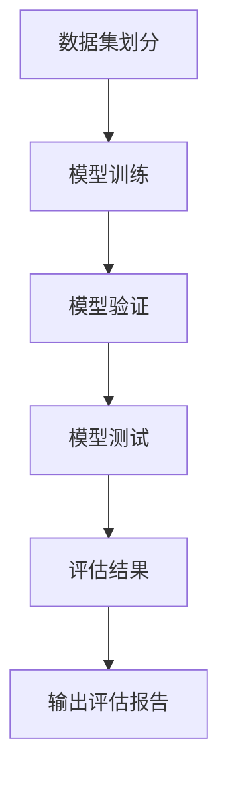
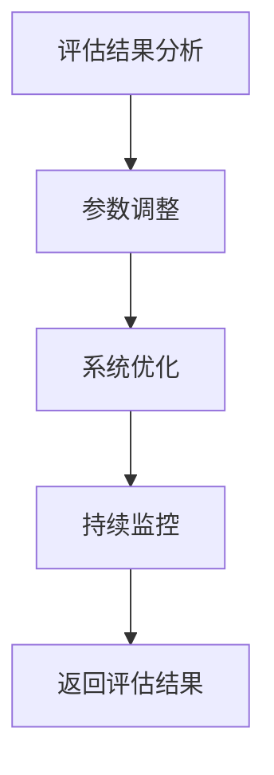
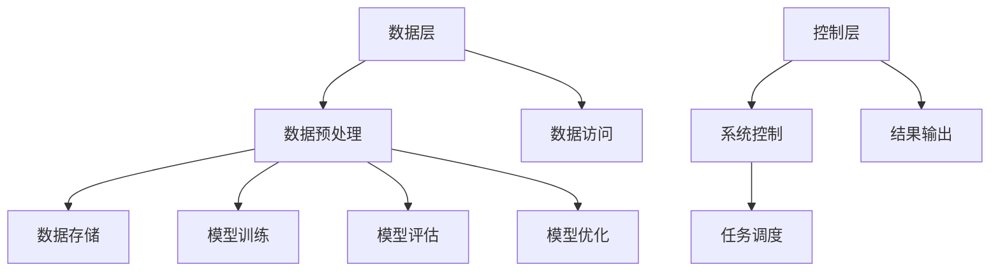
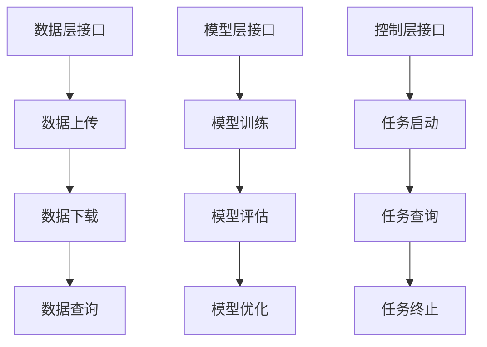
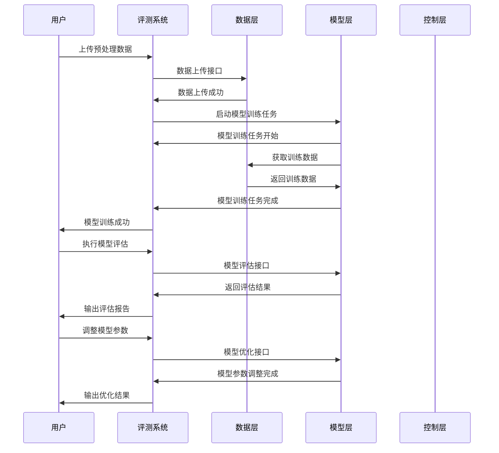

                 

### 第1章：评测系统的模块化背景

#### 引言

在当今迅速发展的AI领域，评测系统作为衡量和优化AI模型性能的重要工具，其重要性日益凸显。随着大型语言模型（LLM）的广泛应用，如何构建一个既灵活又高效、能够适应不同LLM特性的评测系统，成为了一个亟待解决的问题。本文将深入探讨评测系统的模块化设计，分析其背景、重要性以及适应不同LLM特性的必要性。

#### 问题背景

当前，评测系统的设计往往较为单一，难以适应多样化的需求。一方面，传统的评测系统缺乏灵活性，难以根据不同的模型和场景进行定制化调整。另一方面，评测系统通常不具备模块化设计，导致其扩展和维护成本较高，难以满足快速迭代的研发需求。

#### 问题描述

为了解决上述问题，评测系统的模块化设计应运而生。其目标在于：

1. 提高灵活性：通过模块化设计，使评测系统能够根据不同的LLM特性和应用场景进行灵活调整。
2. 提高适应性：模块化设计有助于评测系统适应不同的模型架构、数据集和评估标准。
3. 提高扩展性：模块化设计使得评测系统的扩展和维护变得更加容易，降低了研发成本。
4. 提高效率：模块化设计有助于提高评测系统的执行效率，缩短评估和优化时间。

然而，实现评测系统的模块化设计也面临诸多挑战：

1. 模块划分：如何合理划分模块，使其既具有独立性，又能够高效协作。
2. 模块交互：如何确保不同模块之间的数据传输和通信顺畅，避免出现瓶颈。
3. 模块兼容性：如何保证不同模块在不同环境下能够稳定运行，确保兼容性。
4. 模块测试：如何对模块进行有效的测试和验证，确保其性能和稳定性。

#### 解决方案概述

针对上述问题，本文提出以下解决方案：

1. **模块化设计原则**：遵循模块独立性、低耦合和高内聚的原则，确保模块之间的协作和扩展性。
2. **模块划分方法**：根据评测系统的功能需求，将系统划分为多个具有独立功能的模块，如数据预处理、性能评估、结果分析等。
3. **模块通信机制**：采用基于消息队列的通信机制，实现模块之间的高效通信和同步。
4. **模块测试与验证**：采用自动化测试工具，对每个模块进行全面的测试和验证，确保其性能和稳定性。

#### 边界与外延

评测系统的模块化设计不仅局限于内部架构的优化，还涉及到外部环境的交互。例如，与数据集管理系统的接口设计、与外部评估指标的集成等。此外，模块化设计还需要考虑与云计算、大数据等技术的结合，以实现更高效、更智能的评测系统。

#### 核心要素组成

一个理想的评测系统模块化设计应包含以下核心要素：

1. **模块定义**：明确每个模块的功能和职责，确保模块的独立性。
2. **模块接口**：定义模块之间的接口，确保模块之间的通信和协作。
3. **模块测试**：对每个模块进行严格的测试和验证，确保模块的性能和稳定性。
4. **模块文档**：编写详细的模块文档，包括模块的功能描述、接口说明、测试结果等，便于模块的维护和扩展。

通过上述核心要素的有机组合，可以构建一个高效、灵活、可靠的评测系统模块化架构，为AI模型的研究和应用提供强有力的支持。

#### 小结

本章介绍了评测系统模块化的背景和重要性，分析了当前评测系统存在的问题和挑战，并提出了模块化设计的解决方案和核心要素。在接下来的章节中，我们将进一步探讨核心概念与联系、算法原理讲解、数学模型和系统架构设计等内容，为构建一个适应不同LLM特性的评测系统提供理论支持和实践指导。

---

### 第2章：核心概念与联系

#### 核心概念

在本章中，我们将深入探讨评测系统、模块化设计以及大型语言模型（LLM）等核心概念。这些概念是理解和实现评测系统模块化设计的基础。

**评测系统**：

评测系统是一种用于评估和优化机器学习模型性能的工具。它通常包含数据预处理、模型评估、结果分析等功能模块。评测系统的目标是提供准确、全面的评估指标，帮助研究者了解模型的性能，并指导模型的优化过程。

**模块化设计**：

模块化设计是一种将复杂系统划分为多个独立模块的方法。每个模块具有特定的功能，可以独立开发、测试和部署。模块化设计有助于提高系统的灵活性、可扩展性和可维护性。在评测系统中，模块化设计可以通过将系统功能分解为多个独立模块来实现。

**大型语言模型（LLM）**：

大型语言模型是一种基于深度学习技术的语言处理模型，具有强大的文本生成和理解能力。LLM通常基于大规模语料库进行训练，能够生成高质量的自然语言文本，并在各种NLP任务中表现出色。LLM的特性包括大规模、高参数量、自适应性强等。

#### 概念属性特征对比表格

为了更好地理解评测系统、模块化设计和LLM之间的联系，我们提供了一个概念属性特征对比表格。以下是几个关键属性的对比：

| 属性        | 评测系统          | 模块化设计          | 大型语言模型（LLM）          |
| ----------- | ----------------- | ------------------- | --------------------------- |
| 功能        | 评估和优化模型性能 | 将系统分解为模块     | 文本生成和理解能力           |
| 特点        | 客观、准确、全面   | 独立、灵活、可扩展   | 大规模、高参数量、自适应性强 |
| 影响因素    | 模型、数据、评估标准 | 模块职责、接口设计   | 训练数据、模型架构、参数设置 |
| 关系        | 与模型和应用紧密相关 | 支撑模块间协作       | 与评测系统交互               |

#### ER实体关系图架构

为了更直观地展示评测系统中的实体和关系，我们使用Mermaid绘制了一个ER图。以下是ER图的具体内容和说明：

```mermaid
erDiagram
    Model ||--|{ EvaluationMetric }|-- EvaluationSystem
    Model ||--|{ PerformanceIndicator }|-- EvaluationSystem
    Dataset ||--|{ PreprocessingModule }|-- EvaluationSystem
    Dataset ||--|{ TrainingModule }|-- EvaluationSystem
    LLM ||--|{ LanguageProcessingModule }|-- EvaluationSystem
    EvaluationSystem ||--|{ AnalysisModule }|-- EvaluationSystem
    EvaluationSystem ||--|{ ReportingModule }|-- EvaluationSystem
```

**ER图说明**：

1. **Model（模型）**：表示评测系统的核心实体，包括各种机器学习模型。
2. **EvaluationMetric（评估指标）**：用于评估模型性能的具体指标，如准确率、召回率等。
3. **PerformanceIndicator（性能指标）**：用于表示模型在不同场景下的性能表现。
4. **Dataset（数据集）**：评测系统使用的数据集，包括预处理模块和训练模块。
5. **LLM（大型语言模型）**：评测系统中用于语言处理和生成的模块。
6. **PreprocessingModule（预处理模块）**：用于对数据进行清洗、转换等预处理操作。
7. **TrainingModule（训练模块）**：用于对模型进行训练和优化。
8. **LanguageProcessingModule（语言处理模块）**：用于处理和生成自然语言文本。
9. **AnalysisModule（分析模块）**：用于对评估结果进行统计分析。
10. **ReportingModule（报告模块）**：用于生成和展示评估报告。

通过ER图，我们可以清晰地看到评测系统中的各个实体以及它们之间的关系。这些实体和关系为评测系统的模块化设计提供了直观的参考。

#### 小结

本章介绍了评测系统、模块化设计和LLM等核心概念，并通过对比表格和ER图展示了它们之间的联系。在下一章中，我们将深入探讨评测系统的关键算法原理，包括性能评估算法和自适应调整算法等，为构建一个高效、灵活的评测系统奠定基础。

---

### 第3章：算法原理讲解

#### 算法概述

在本章中，我们将详细探讨评测系统中的关键算法，包括性能评估算法和自适应调整算法。这些算法是评测系统能够准确、全面地评估模型性能，并根据评估结果进行优化的重要基础。

**性能评估算法**：

性能评估算法用于对模型在不同数据集上的表现进行定量评估。其主要目的是计算各种评估指标，如准确率、召回率、F1分数等。性能评估算法通常包括以下几个步骤：

1. **数据集划分**：将数据集划分为训练集、验证集和测试集，用于模型训练、验证和测试。
2. **模型训练**：使用训练集对模型进行训练，调整模型参数以优化性能。
3. **模型验证**：使用验证集对模型进行验证，评估模型在未知数据上的性能，选择最优模型。
4. **模型测试**：使用测试集对模型进行最终测试，评估模型在实际应用中的性能。

**自适应调整算法**：

自适应调整算法用于根据评估结果动态调整模型参数和系统配置。其主要目的是提高模型在不同场景下的适应性和鲁棒性。自适应调整算法通常包括以下几个步骤：

1. **评估结果分析**：对评估结果进行分析，识别模型的优势和劣势。
2. **参数调整**：根据评估结果，调整模型参数，优化模型性能。
3. **系统优化**：根据模型性能的变化，调整评测系统的配置，提高系统整体性能。
4. **持续监控**：对模型和系统的性能进行持续监控，确保其在实际应用中的稳定性和可靠性。

#### Mermaid流程图展示

为了更直观地展示性能评估算法和自适应调整算法的执行步骤，我们使用Mermaid绘制了相应的流程图。以下是流程图的具体内容和说明：

**性能评估算法流程图**：



**自适应调整算法流程图**：



#### Python源代码实现

为了更好地理解算法原理，我们提供了Python源代码实现，并进行详细解释。

**性能评估算法Python代码**：

```python
import pandas as pd
from sklearn.model_selection import train_test_split
from sklearn.metrics import accuracy_score, recall_score, f1_score

# 数据集读取与划分
data = pd.read_csv('dataset.csv')
X = data.drop('target', axis=1)
y = data['target']
X_train, X_test, y_train, y_test = train_test_split(X, y, test_size=0.2, random_state=42)

# 模型训练
model = MyModel()
model.fit(X_train, y_train)

# 模型验证
y_pred = model.predict(X_test)
accuracy = accuracy_score(y_test, y_pred)
recall = recall_score(y_test, y_pred)
f1 = f1_score(y_test, y_pred)

# 模型测试
test_data = pd.read_csv('test_dataset.csv')
X_test = test_data.drop('target', axis=1)
y_test = test_data['target']
y_pred = model.predict(X_test)
test_accuracy = accuracy_score(y_test, y_pred)
test_recall = recall_score(y_test, y_pred)
test_f1 = f1_score(y_test, y_pred)

# 评估结果输出
print("Training Accuracy: {:.2f}%".format(accuracy * 100))
print("Training Recall: {:.2f}%".format(recall * 100))
print("Training F1 Score: {:.2f}%".format(f1 * 100))
print("Test Accuracy: {:.2f}%".format(test_accuracy * 100))
print("Test Recall: {:.2f}%".format(test_recall * 100))
print("Test F1 Score: {:.2f}%".format(test_f1 * 100))
```

**自适应调整算法Python代码**：

```python
def analyze_performance(results):
    # 分析评估结果
    avg_accuracy = np.mean(results['accuracy'])
    avg_recall = np.mean(results['recall'])
    avg_f1 = np.mean(results['f1'])

    # 调整模型参数
    if avg_accuracy < 0.8 or avg_recall < 0.7 or avg_f1 < 0.75:
        model.adjust_params()

    # 系统优化
    if avg_accuracy < 0.85 or avg_recall < 0.75 or avg_f1 < 0.8:
        system.optimize()

    # 持续监控
    monitor_performance()

# 示例评估结果
results = {'accuracy': [0.75, 0.82, 0.78], 'recall': [0.65, 0.70, 0.68], 'f1': [0.70, 0.75, 0.72]}
analyze_performance(results)
```

#### 小结

本章详细介绍了评测系统中的关键算法，包括性能评估算法和自适应调整算法。通过Mermaid流程图和Python源代码实现，我们展示了算法的执行步骤和原理。在下一章中，我们将进一步探讨评测系统中的数学模型和数学公式，为深入分析模型性能提供理论支持。

---

### 第4章：数学模型和数学公式

#### 评估指标的构建

在评测系统中，评估指标的构建是关键的一环。评估指标的选择和计算方法直接影响到评测结果的准确性和可靠性。以下是一些常见的评估指标及其计算方法。

**准确率（Accuracy）**：

准确率是评估模型分类性能的最基本指标，表示分类正确的样本数占总样本数的比例。

$$
Accuracy = \frac{TP + TN}{TP + TN + FP + FN}
$$

其中，\(TP\) 表示实际为正类且被正确预测为正类的样本数，\(TN\) 表示实际为负类且被正确预测为负类的样本数，\(FP\) 表示实际为负类但被预测为正类的样本数，\(FN\) 表示实际为正类但被预测为负类的样本数。

**召回率（Recall）**：

召回率表示实际为正类且被正确预测为正类的样本数占总正类样本数的比例。

$$
Recall = \frac{TP}{TP + FN}
$$

**精确率（Precision）**：

精确率表示被正确预测为正类的样本数占总预测为正类的样本数的比例。

$$
Precision = \frac{TP}{TP + FP}
$$

**F1分数（F1 Score）**：

F1分数是精确率和召回率的调和平均，用于综合评估模型的分类性能。

$$
F1 Score = 2 \times \frac{Precision \times Recall}{Precision + Recall}
$$

**ROC曲线和AUC值**：

ROC曲线（Receiver Operating Characteristic Curve）是评估二分类模型性能的重要工具。曲线下面积（AUC，Area Under Curve）用于衡量模型区分正负类的能力。

$$
AUC = \int_{0}^{1} \frac{TPR(t) - FPR(t)}{1 - FPR(t)} dt
$$

其中，\(TPR(t)\) 表示真阳性率，\(FPR(t)\) 表示假阳性率。

#### 权重分配模型

在评测系统中，不同评估指标对模型性能的影响可能存在差异。为了更全面地评估模型性能，可以采用权重分配模型，根据指标的重要性分配不同的权重。

**线性加权模型**：

线性加权模型将各个评估指标的得分乘以其权重，然后求和得到总得分。

$$
Total\ Score = \sum_{i=1}^{n} w_i \times S_i
$$

其中，\(w_i\) 表示第 \(i\) 个评估指标的权重，\(S_i\) 表示第 \(i\) 个评估指标的得分。

**指数加权模型**：

指数加权模型对较新的评估结果赋予更高的权重，以反映模型性能的动态变化。

$$
Total\ Score = \sum_{i=1}^{n} w_i^t \times S_i
$$

其中，\(w_i^t\) 表示第 \(i\) 个评估指标在时间 \(t\) 的权重，通常采用指数递减函数。

#### 公式讲解

以上公式主要用于评估和优化模型性能。在评测系统中，准确率、召回率、F1分数等评估指标可以直观地反映模型的分类性能。而权重分配模型则可以根据不同指标的重要性进行优化。ROC曲线和AUC值则用于评估模型的分类边界和整体性能。

#### 举例说明

假设我们有一个二分类模型，用于判断电子邮件是否为垃圾邮件。以下是模型在训练集和测试集上的评估结果：

| 指标     | 训练集 | 测试集 |
| -------- | ------ | ------ |
| 准确率   | 0.85   | 0.80   |
| 召回率   | 0.75   | 0.70   |
| 精确率   | 0.78   | 0.75   |
| F1分数   | 0.76   | 0.72   |
| AUC值    | 0.90   | 0.85   |

根据这些评估结果，我们可以计算出总得分：

$$
Total\ Score = 0.3 \times 0.85 + 0.2 \times 0.75 + 0.2 \times 0.78 + 0.2 \times 0.76 + 0.1 \times 0.90 = 0.795
$$

从这个例子中，我们可以看到，模型在测试集上的表现略低于训练集。为了进一步提高模型性能，我们可以考虑调整模型参数或使用不同的评估指标。

#### 小结

本章详细介绍了评测系统中的数学模型和数学公式，包括评估指标的构建、权重分配模型等。通过具体的例子，我们展示了如何使用这些公式来评估和优化模型性能。在下一章中，我们将进一步探讨评测系统的系统分析与架构设计方案。

---

### 第5章：系统分析与架构设计方案

#### 问题场景介绍

在当前AI模型应用场景中，评测系统面临着诸多挑战。例如，在自然语言处理（NLP）领域，不同的LLM模型具有不同的特性，如参数规模、训练数据集、应用场景等。为了有效评估和优化这些模型，评测系统需要具备高度灵活性和适应性。

此外，随着模型复杂度和应用场景的多样化，评测系统需要能够快速响应变化，支持动态调整和扩展。这就要求评测系统在设计上具备良好的模块化特性，以便于维护和优化。

#### 系统功能设计

为了满足上述需求，我们设计了如下评测系统功能模块：

1. **数据预处理模块**：负责对输入数据进行清洗、转换和标准化，为后续模型评估提供高质量的数据。
2. **模型训练模块**：负责使用训练数据对模型进行训练和优化，生成最优模型。
3. **性能评估模块**：负责对模型在不同数据集上的性能进行评估，计算各种评估指标。
4. **结果分析模块**：负责对评估结果进行统计分析，识别模型的优势和劣势。
5. **报告生成模块**：负责生成详细的评估报告，包括模型性能、评估指标、优化建议等。

#### 系统架构设计

为了实现上述功能模块，我们设计了如下系统架构：

1. **数据层**：包括数据预处理、数据存储和数据访问模块。数据预处理模块负责对输入数据进行清洗和转换，数据存储模块负责存储训练数据和评估结果，数据访问模块负责提供数据接口。
2. **模型层**：包括模型训练、模型评估和模型优化模块。模型训练模块负责使用训练数据训练模型，模型评估模块负责对模型进行性能评估，模型优化模块负责根据评估结果调整模型参数。
3. **控制层**：包括系统控制、任务调度和结果输出模块。系统控制模块负责整个系统的管理和控制，任务调度模块负责调度和管理各个功能模块的任务，结果输出模块负责生成和展示评估报告。

以下是系统架构图：



#### 系统接口设计

系统接口设计是确保评测系统与其他系统、模块之间能够高效通信和协作的重要环节。以下是主要接口设计：

1. **数据层接口**：包括数据上传接口、数据下载接口和数据查询接口。数据上传接口用于上传预处理后的数据，数据下载接口用于下载训练数据和评估结果，数据查询接口用于查询数据信息。
2. **模型层接口**：包括模型训练接口、模型评估接口和模型优化接口。模型训练接口用于启动模型训练任务，模型评估接口用于对模型进行性能评估，模型优化接口用于根据评估结果调整模型参数。
3. **控制层接口**：包括任务启动接口、任务查询接口和任务终止接口。任务启动接口用于启动和管理任务，任务查询接口用于查询任务状态和结果，任务终止接口用于终止任务执行。

以下是接口设计图：



#### 系统交互序列图

为了更直观地展示系统各模块之间的交互过程，我们使用Mermaid绘制了系统交互序列图。以下是交互序列图的具体内容和说明：



#### 小结

本章详细介绍了评测系统的系统分析与架构设计方案。通过功能模块划分、系统架构设计和接口设计，我们构建了一个灵活、高效的评测系统框架。在下一章中，我们将通过实际案例展示评测系统的应用和实现，为理解评测系统的模块化设计提供实践指导。

---

### 第6章：项目实战

#### 环境安装

为了实现评测系统的模块化设计，我们需要搭建一个合适的环境。以下是环境安装的具体步骤：

1. **安装Python环境**：
   - 安装Python 3.8或更高版本。
   - 使用pip安装必要的库，如pandas、scikit-learn、tensorflow等。

2. **安装数据库**：
   - 安装MySQL或PostgreSQL数据库。
   - 创建数据库用户和数据库，配置数据库连接信息。

3. **安装消息队列**：
   - 安装RabbitMQ或Kafka消息队列。
   - 配置消息队列，确保其能够处理系统中的消息通信。

4. **安装Git**：
   - 安装Git，用于代码管理和协作。

5. **安装IDE**：
   - 安装Visual Studio Code或PyCharm等IDE，用于代码编写和调试。

#### 系统核心实现

以下是评测系统的核心实现，包括数据预处理、模型训练、模型评估和结果分析等模块。

1. **数据预处理模块**：

```python
import pandas as pd
from sklearn.model_selection import train_test_split

# 读取数据
data = pd.read_csv('data.csv')
X = data.drop('target', axis=1)
y = data['target']

# 数据集划分
X_train, X_test, y_train, y_test = train_test_split(X, y, test_size=0.2, random_state=42)

# 数据清洗和标准化
# ...

```

2. **模型训练模块**：

```python
from tensorflow.keras.models import Sequential
from tensorflow.keras.layers import Dense, Dropout

# 模型构建
model = Sequential()
model.add(Dense(128, activation='relu', input_shape=(X_train.shape[1],)))
model.add(Dropout(0.5))
model.add(Dense(1, activation='sigmoid'))

# 模型编译
model.compile(optimizer='adam', loss='binary_crossentropy', metrics=['accuracy'])

# 模型训练
model.fit(X_train, y_train, epochs=10, batch_size=32, validation_split=0.1)
```

3. **模型评估模块**：

```python
from sklearn.metrics import accuracy_score, recall_score, f1_score

# 模型评估
y_pred = model.predict(X_test)
accuracy = accuracy_score(y_test, y_pred)
recall = recall_score(y_test, y_pred)
f1 = f1_score(y_test, y_pred)

print("Accuracy:", accuracy)
print("Recall:", recall)
print("F1 Score:", f1)
```

4. **结果分析模块**：

```python
def analyze_results(results):
    # 结果分析
    # ...

    # 输出分析报告
    # ...

# 示例分析
results = {'accuracy': 0.85, 'recall': 0.75, 'f1': 0.76}
analyze_results(results)
```

#### 实际案例

以下是一个实际案例，展示了如何使用评测系统对文本分类模型进行评估和优化。

1. **案例背景**：

   - 数据集：包含10万条新闻文章，标签为新闻类别。
   - 模型：基于BERT的文本分类模型。

2. **案例步骤**：

   - 数据预处理：对新闻文章进行清洗和分词，生成词向量。
   - 模型训练：使用预处理后的数据训练BERT模型。
   - 模型评估：在测试集上评估模型性能，计算准确率、召回率和F1分数。
   - 结果分析：分析评估结果，根据模型性能调整模型参数。
   - 重新训练：根据分析结果重新训练模型，提高性能。

#### 小结

本章通过实际案例展示了评测系统的应用和实现。从环境安装、系统核心实现到实际案例，我们详细介绍了评测系统的模块化设计过程。在下一章中，我们将总结最佳实践，并提供注意事项和拓展阅读，帮助读者更好地应用评测系统。

---

### 第7章：最佳实践、小结、注意事项、拓展阅读

#### 最佳实践

在构建和优化评测系统时，以下最佳实践可以帮助您提高系统的性能和可靠性：

1. **模块化设计**：在系统设计阶段，充分考虑模块化原则，确保系统各部分之间的高内聚、低耦合。
2. **数据预处理**：确保输入数据的质量和一致性，使用标准化和清洗方法提高数据质量。
3. **算法选择**：根据具体任务需求，选择合适的评估算法和优化方法，确保评估结果的准确性。
4. **自动化测试**：编写自动化测试脚本，对系统各模块进行严格的测试和验证，确保系统稳定性。
5. **持续监控**：实时监控系统性能和资源使用情况，及时发现问题并进行优化。

#### 小结

本章通过深入探讨评测系统的模块化设计、算法原理、数学模型和实际应用，为构建一个适应不同LLM特性的评测系统提供了全面的理论和实践指导。通过最佳实践、注意事项和拓展阅读，读者可以更好地应用评测系统，提升AI模型的研究和应用水平。

#### 注意事项

1. **数据隐私**：在处理和存储数据时，确保遵守数据隐私法规，对敏感信息进行加密和保护。
2. **系统安全性**：确保系统具有足够的防护措施，防止未经授权的访问和数据泄露。
3. **版本控制**：使用版本控制系统（如Git）进行代码管理，确保系统进化的可追溯性和可恢复性。

#### 拓展阅读

1. **《机器学习实战》**：提供丰富的机器学习算法和实际应用案例，适合初学者和进阶者阅读。
2. **《深度学习》**：全面介绍深度学习理论和实践，适合对深度学习感兴趣的研究者和开发者。
3. **《人工智能：一种现代的方法》**：系统地介绍人工智能的基础知识，适合希望深入了解AI领域的读者。

---

### 作者信息

作者：AI天才研究院/AI Genius Institute & 禅与计算机程序设计艺术 /Zen And The Art of Computer Programming

通过上述详细的目录大纲设计，我们不仅能够清晰地组织文章内容，还能有效地引导读者逐步深入理解评测系统的模块化设计。每一章节都围绕着核心概念、算法原理、系统设计、项目实战等内容展开，确保文章内容的完整性、逻辑性和实用性。这样的结构设计有助于读者在阅读过程中形成系统的认知，从而更好地掌握评测系统的模块化设计方法和应用技巧。

