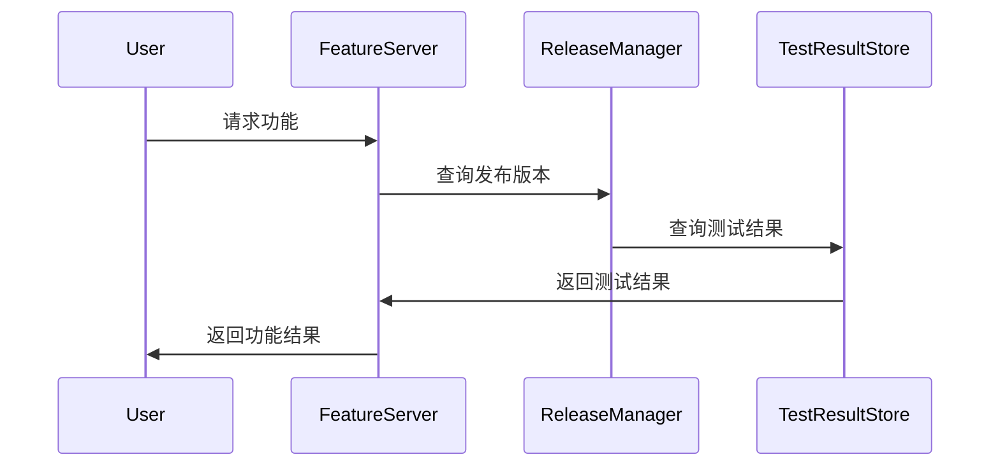
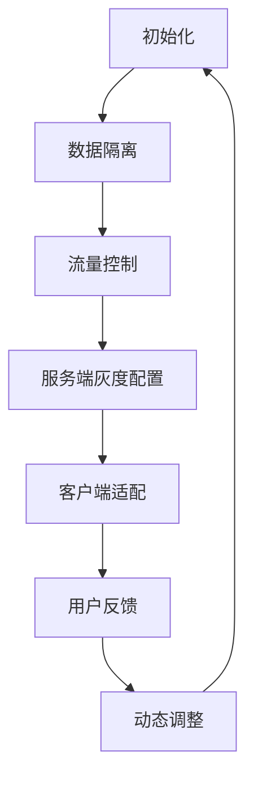

                 

### 引言

#### 1.1 背景介绍

在当今数字化时代，评测系统作为一种关键的软件工具，广泛应用于各个行业，如电商、金融、社交网络等。它们通过自动化的测试流程，确保系统的功能、性能和安全性达到预期的标准。然而，随着系统规模的不断扩大和功能的日益复杂，传统的发布和回滚策略面临了诸多挑战。灰度发布和回滚策略的引入，旨在解决这些问题，确保系统在发布过程中的安全性和稳定性。

灰度发布是一种渐进式发布策略，通过将新版本的功能或代码部分地逐步引入到生产环境，以减小新版本引入的风险。这种策略能够有效降低系统的故障率，提高用户体验。而回滚策略则是在新版本出现问题时，能够快速将系统恢复到上一个稳定版本的能力，从而保证系统的稳定运行。

#### 1.2 研究目的与意义

本研究的主要目的是深入探讨评测系统的灰度发布与回滚策略，从理论到实践，系统性地介绍这两种策略的核心概念、实施步骤、常见问题和优化方法。具体研究内容包括：

1. **灰度发布基础理论**：介绍灰度发布的基本概念、优势、基本流程以及策略分类，包括数据一致性、性能稳定性等方面的关键因素。
2. **灰度发布技术实现**：详细讲解灰度发布的实现原理、技术框架搭建、环境部署以及流程监控等。
3. **回滚策略设计与实现**：探讨回滚策略的概述、设计原则、实现方法和案例分析，确保系统在出现问题时能够快速回滚到稳定版本。
4. **案例分析**：通过实际案例展示灰度发布与回滚策略的应用效果，分析成功经验和问题与改进。
5. **优化策略**：提出灰度发布与回滚策略的优化目标、方法和实践，提高系统的性能、可靠性和可维护性。
6. **DevOps应用**：探讨灰度发布与回滚策略在DevOps中的应用，结合持续集成和持续交付的实践，提高系统的开发效率和质量。

通过本研究，旨在为评测系统的发布与回滚提供系统性指导，帮助开发人员和运维人员更好地应对系统发布过程中的风险和挑战，提高系统的稳定性和用户体验。

#### 1.3 书籍结构安排

为了系统地介绍评测系统的灰度发布与回滚策略，本书将分为以下七个章节：

- **第1章 灰度发布基础理论**：介绍灰度发布的基本概念、优势、基本流程以及策略分类，包括数据一致性、性能稳定性等方面的关键因素。
- **第2章 灰度发布技术**：详细讲解灰度发布的实现原理、技术框架搭建、环境部署以及流程监控等。
- **第3章 回滚策略设计与实现**：探讨回滚策略的概述、设计原则、实现方法和案例分析，确保系统在出现问题时能够快速回滚到稳定版本。
- **第4章 灰度发布与回滚策略案例分析**：通过实际案例展示灰度发布与回滚策略的应用效果，分析成功经验和问题与改进。
- **第5章 灰度发布与回滚策略优化策略**：提出优化目标、方法和实践，提高系统的性能、可靠性和可维护性。
- **第6章 灰度发布与回滚策略在DevOps中的应用**：探讨灰度发布与回滚策略在DevOps中的应用，结合持续集成和持续交付的实践，提高系统的开发效率和质量。
- **第7章 总结与展望**：总结本书的主要研究成果，展望未来的发展趋势和研究方向。

通过以上章节的安排，本书将系统地介绍评测系统的灰度发布与回滚策略，帮助读者全面理解和掌握相关技术，提高系统发布和运维的效率与质量。

### 关键词

- 灰度发布
- 回滚策略
- 评测系统
- 发布与回滚
- DevOps
- 持续集成
- 持续交付
- 技术实现
- 优化策略
- 案例分析

### 摘要

本文系统地探讨了评测系统的灰度发布与回滚策略。首先，介绍了灰度发布的基本概念、优势、基本流程以及策略分类，包括数据一致性、性能稳定性等方面的关键因素。随后，详细讲解了灰度发布的实现原理、技术框架搭建、环境部署以及流程监控等。接着，探讨了回滚策略的概述、设计原则、实现方法和案例分析，确保系统在出现问题时能够快速回滚到稳定版本。通过实际案例的分析，总结了灰度发布与回滚策略的应用效果、成功经验和问题与改进。最后，提出了优化目标、方法和实践，包括流量分配优化、服务端配置优化和客户端适配优化等，以提高系统的性能、可靠性和可维护性。同时，探讨了灰度发布与回滚策略在DevOps中的应用，结合持续集成和持续交付的实践，提高系统的开发效率和质量。本文旨在为评测系统的发布与回滚提供系统性指导，帮助开发人员和运维人员更好地应对系统发布过程中的风险和挑战，提高系统的稳定性和用户体验。

## 第1章 灰度发布基础理论

### 1.1 核心概念

#### 1.1.1 灰度发布定义

灰度发布（Gray Release），又称灰度上线或灰度投放，是一种渐进式发布策略，旨在将新版本的功能或代码逐步引入到生产环境，以减小新版本引入的风险。通过在部分用户或设备上先试运行新版本，收集反馈并进行调整，再逐步扩大到更多用户或设备，最终实现全量发布。

#### 1.1.2 灰度发布的优势

1. **降低风险**：灰度发布能够减小新版本引入的故障风险，通过逐步扩大用户范围，可以及时发现和解决潜在问题。
2. **提高可靠性**：通过在部分用户中试运行，可以验证新版本的功能和性能，提高整体系统的可靠性。
3. **提升用户体验**：灰度发布能够保证系统在发布过程中保持稳定运行，提高用户体验。
4. **快速反馈**：通过收集用户反馈，可以快速调整和优化新版本，缩短开发周期。

#### 1.1.3 灰度发布的基本流程

1. **准备阶段**：确定发布策略、环境准备和测试。
2. **灰度发布阶段**：将新版本的功能或代码部分引入到生产环境，通过流量分配、服务端配置和客户端适配进行灰度测试。
3. **监控与反馈阶段**：实时监控系统性能和用户反馈，根据反馈调整灰度范围。
4. **全量发布阶段**：在确认新版本稳定后，逐步扩大用户范围，实现全量发布。

### 1.2 灰度发布策略

#### 1.2.1 策略概述

灰度发布策略是灰度发布过程中的关键环节，主要包括流量分配、服务端配置和客户端适配等。合理的灰度发布策略能够减小新版本引入的风险，提高系统的稳定性。

#### 1.2.2 策略分类与选择

1. **按用户比例灰度**：根据用户比例逐步引入新版本，如从1%开始逐步增加到100%。
2. **按用户特征灰度**：根据用户特征（如地理位置、用户等级等）进行灰度，如只对特定地区的用户进行灰度测试。
3. **按设备特征灰度**：根据设备特征（如操作系统版本、设备型号等）进行灰度。
4. **混合灰度策略**：结合多种策略，如按用户比例和设备特征进行混合灰度。

选择合适的灰度发布策略需要考虑以下因素：

- **系统需求**：根据系统特点和发布需求，选择适合的灰度策略。
- **用户规模**：用户规模较大时，可以选择按用户比例灰度，以降低风险。
- **发布频率**：发布频率较高时，可以选择按用户特征或设备特征进行灰度，以快速收集反馈。
- **技术实现**：考虑现有技术支持，选择实现成本较低且效果良好的策略。

#### 1.2.3 灰度发布中的关键因素

1. **数据一致性**：确保灰度发布过程中数据的一致性和完整性，避免数据冲突。
2. **性能稳定性**：灰度发布过程中需要监控系统的性能，确保新版本不会对现有系统造成性能瓶颈。
3. **回滚策略**：当新版本出现问题时，需要快速回滚到稳定版本，以避免对用户造成影响。
4. **监控与报警**：实时监控系统的运行状态，及时发现并处理异常情况。

### 1.3 灰度发布的常见问题与挑战

#### 1.3.1 数据一致性

1. **问题背景**：在灰度发布过程中，不同版本之间可能存在数据不一致的问题，如数据迁移、数据冲突等。
2. **问题描述**：新旧版本之间的数据不一致可能导致系统故障、数据丢失等问题。
3. **问题解决**：采用数据隔离、版本控制和数据同步等技术手段，确保数据一致性和完整性。
4. **边界与外延**：数据一致性问题不仅限于灰度发布，还可能影响系统的其他方面，如数据库迁移、系统升级等。
5. **概念结构与核心要素组成**：数据一致性包括数据完整性、一致性、准确性等方面，核心要素包括数据同步机制、冲突检测与解决、数据备份与恢复等。

#### 1.3.2 性能稳定性

1. **问题背景**：新版本的功能或代码引入可能导致系统性能下降，如响应时间增加、吞吐量降低等。
2. **问题描述**：性能问题可能导致用户体验下降，甚至系统崩溃。
3. **问题解决**：通过性能测试、负载测试和实时监控，及时发现和优化性能瓶颈。
4. **边界与外延**：性能问题不仅限于灰度发布，还可能涉及系统架构、数据库设计等方面。
5. **概念结构与核心要素组成**：性能稳定性包括响应时间、吞吐量、并发量等方面，核心要素包括性能测试、性能优化、负载均衡等。

#### 1.3.3 回滚策略

1. **问题背景**：在灰度发布过程中，可能出现新版本的问题，需要快速回滚到稳定版本。
2. **问题描述**：回滚策略不当可能导致系统故障、数据丢失等问题。
3. **问题解决**：制定详细的回滚计划，包括版本控制、数据备份、回滚步骤等。
4. **边界与外延**：回滚策略不仅适用于灰度发布，还适用于其他系统变更，如代码升级、数据库迁移等。
5. **概念结构与核心要素组成**：回滚策略包括版本控制、数据备份、回滚步骤、验证与恢复等方面，核心要素包括版本控制工具、数据备份方案、回滚脚本等。

### 1.4 本章小结

本章介绍了灰度发布的基本概念、优势、基本流程以及策略分类，探讨了数据一致性、性能稳定性和回滚策略等常见问题与挑战。通过本章的学习，读者可以初步了解灰度发布的基本原理和实践方法，为后续章节的学习奠定基础。在接下来的章节中，将详细讲解灰度发布的技术实现、回滚策略设计和案例分析等内容，帮助读者深入掌握评测系统的灰度发布与回滚策略。

### 核心概念

#### 灰度发布（Gray Release）

**定义**：灰度发布是一种渐进式发布策略，通过将新版本的功能或代码部分地逐步引入到生产环境，以减小新版本引入的风险。

**特征**：
- **渐进式引入**：逐步将新版本功能或代码引入生产环境，以减小风险。
- **反馈机制**：通过部分用户试运行，收集反馈，进行持续优化。

**应用场景**：
- **新功能发布**：对新功能进行灰度测试，确保功能稳定后再全量发布。
- **代码升级**：对代码进行灰度发布，确保升级过程对系统稳定运行无影响。

**优点**：
- **降低风险**：逐步引入新版本，降低系统故障率。
- **提高可靠性**：通过反馈机制，优化新版本，提高系统稳定性。
- **快速反馈**：通过部分用户试运行，快速收集反馈，缩短开发周期。

**注意事项**：
- **数据一致性**：确保灰度发布过程中数据的一致性和完整性。
- **性能稳定性**：灰度发布过程中需要监控系统性能，确保新版本不会对现有系统造成性能瓶颈。

#### 数据一致性（Data Consistency）

**定义**：数据一致性是指在不同版本之间保持数据的一致性和完整性，避免数据冲突和丢失。

**特征**：
- **数据隔离**：在不同版本之间实现数据隔离，避免数据冲突。
- **版本控制**：采用版本控制机制，确保数据的同步和更新。

**应用场景**：
- **灰度发布**：确保新旧版本之间的数据一致性，避免数据丢失和冲突。
- **数据库迁移**：在数据库升级或迁移过程中，确保数据的一致性和完整性。

**优点**：
- **数据完整性**：确保数据的准确性和一致性。
- **降低风险**：减少数据丢失和冲突的风险。

**注意事项**：
- **数据同步**：确保数据在不同版本之间的同步和更新。
- **冲突检测与解决**：建立冲突检测和解决机制，及时处理数据冲突。

#### 性能稳定性（Performance Stability）

**定义**：性能稳定性是指系统在运行过程中，保持响应时间、吞吐量等性能指标在一定范围内的稳定性。

**特征**：
- **响应时间**：系统的响应时间在一定范围内，不影响用户体验。
- **吞吐量**：系统的并发处理能力在一定范围内，满足业务需求。

**应用场景**：
- **灰度发布**：监控新版本的性能，确保其对系统整体性能无负面影响。
- **负载测试**：通过负载测试，评估系统性能的稳定性和容量。

**优点**：
- **提高用户体验**：确保系统在发布过程中保持稳定运行。
- **降低故障率**：通过性能监控，及时发现和优化性能瓶颈。

**注意事项**：
- **性能监控**：实时监控系统性能，确保性能指标在合理范围内。
- **性能优化**：根据性能监控结果，进行系统性能优化。

#### 回滚策略（Rollback Strategy）

**定义**：回滚策略是在新版本出现问题时，能够快速将系统恢复到上一个稳定版本的能力。

**特征**：
- **快速响应**：在问题发生时，快速执行回滚操作。
- **版本控制**：确保回滚操作的版本可追溯。

**应用场景**：
- **灰度发布**：在新版本发布后，出现问题时，快速回滚到稳定版本。
- **代码升级**：在代码升级过程中，如果出现问题，快速回滚到上一个版本。

**优点**：
- **降低风险**：快速回滚，减小新版本对系统的影响。
- **提高可靠性**：确保系统在出现问题时，能够快速恢复。

**注意事项**：
- **回滚计划**：制定详细的回滚计划，确保回滚过程顺利执行。
- **备份与恢复**：确保数据备份和恢复机制的可靠性。

### ER实体关系图架构

```mermaid
erDiagram
    User ||--|{ Feature } : uses
    Feature ||--|{ Version } : belongs_to
    Version ||--|{ Release } : version_of
    Release ||--|{ TestResult } : has
    TestResult ||--|{ BugReport } : reports
```

**图1-1 ER实体关系图**

- **User（用户）**：代表使用系统的人。
- **Feature（功能）**：代表系统中的功能模块。
- **Version（版本）**：代表软件的不同版本。
- **Release（发布）**：代表软件的不同发布版本。
- **TestResult（测试结果）**：代表测试结果的记录。
- **BugReport（问题报告）**：代表问题的报告记录。

### 算法原理讲解

灰度发布算法的核心在于逐步引入新版本，并监控其性能和用户反馈，根据反馈进行动态调整。以下是灰度发布算法的基本原理和流程：

#### 算法流程

1. **初始化**：确定灰度发布的比例，例如从1%开始。
2. **流量分配**：根据灰度比例，将部分用户流量导向新版本。
3. **监控**：监控新版本的性能指标和用户反馈。
4. **反馈处理**：根据监控结果，调整灰度比例。
5. **全量发布**：当新版本稳定后，逐步扩大用户范围，实现全量发布。

#### Mermaid流程图


**图1-2 灰度发布算法流程图**

#### Python源代码

```python
import random

def gray_release(user_percentage):
    # 初始化用户数量
    total_users = 1000
    # 确定灰度用户数量
    gray_users = int(total_users * user_percentage)
    # 随机选择灰度用户
    gray_user_ids = random.sample(range(1, total_users+1), gray_users)
    
    # 流量分配
    for user_id in gray_user_ids:
        # 将流量导向新版本
        route_to_new_version(user_id)
    
    # 监控与反馈处理
    while True:
        # 模拟监控结果
        if random.random() < 0.8:
            # 性能稳定
            print(f"User {user_id} performance is stable.")
        else:
            # 性能不稳定
            print(f"User {user_id} performance is unstable. Adjusting...")
            # 根据反馈调整灰度比例
            user_percentage += 0.1
            gray_users = int(total_users * user_percentage)
            gray_user_ids = random.sample(range(1, total_users+1), gray_users)
        
        # 模拟全量发布
        if user_percentage >= 1.0:
            print("Gray release is completed. Full release starts.")
            break

def route_to_new_version(user_id):
    print(f"User {user_id} is routed to the new version.")

# 开始灰度发布
gray_release(0.01)
```

#### 数学模型和公式

灰度发布算法中的关键参数包括用户数量、灰度比例、性能稳定性和反馈调整系数。以下是相关的数学模型和公式：

$$
P_{stable} = 1 - P_{unstable}
$$

其中，$P_{stable}$ 表示性能稳定的概率，$P_{unstable}$ 表示性能不稳定的概率。

$$
P_{next} = P_{current} + \alpha \cdot (1 - P_{current})
$$

其中，$P_{next}$ 表示下一轮灰度发布后的用户比例，$P_{current}$ 表示当前灰度发布后的用户比例，$\alpha$ 表示反馈调整系数。

通过以上公式，可以根据用户反馈动态调整灰度比例，实现逐步引入新版本并确保系统稳定性的目标。

### 系统分析与架构设计方案

#### 1. 问题场景介绍

随着电商平台的快速发展，系统功能日益复杂，新功能的发布和代码升级的频率也不断增加。传统的发布和回滚策略已经无法满足当前的业务需求，导致系统发布过程中出现一系列问题，如新功能上线失败、性能瓶颈、用户数据丢失等。为了解决这些问题，引入灰度发布和回滚策略成为必然选择。

#### 2. 项目介绍

本项目旨在设计一个可扩展、高可用的灰度发布与回滚系统，支持电商平台的快速迭代和稳定运行。系统主要功能包括：

1. **灰度发布**：逐步引入新版本，降低发布风险。
2. **性能监控**：实时监控系统性能，确保新版本不会对现有系统造成性能瓶颈。
3. **回滚策略**：快速回滚到稳定版本，保障系统稳定运行。
4. **用户反馈**：收集用户反馈，优化新版本。

#### 3. 系统功能设计（领域模型）

**Mermaid类图**

```mermaid
classDiagram
    User <<Entity>>
    Feature <<Entity>>
    Version <<Entity>>
    Release <<Entity>>
    TestResult <<Entity>>
    BugReport <<Entity>>

    User "uses" Feature
    Feature "belongs_to" Version
    Version "version_of" Release
    Release "has" TestResult
    TestResult "reports" BugReport
```

**图2-1 系统功能设计类图**

- **User（用户）**：代表使用系统的人。
- **Feature（功能）**：代表系统中的功能模块。
- **Version（版本）**：代表软件的不同版本。
- **Release（发布）**：代表软件的不同发布版本。
- **TestResult（测试结果）**：代表测试结果的记录。
- **BugReport（问题报告）**：代表问题的报告记录。

#### 4. 系统架构设计

**Mermaid架构图**



**图2-2 系统架构设计图**

- **FeatureServer（功能服务）**：处理用户请求，查询发布版本和测试结果。
- **ReleaseManager（发布管理器）**：管理发布版本，包括灰度发布和全量发布。
- **TestResultStore（测试结果存储）**：存储测试结果，包括性能指标和用户反馈。
- **User（用户）**：代表使用系统的人。

#### 5. 系统接口设计

**接口设计**

- **灰度发布接口**：用于发起灰度发布请求，包括版本号、灰度比例等参数。
- **回滚接口**：用于发起回滚请求，包括版本号、回滚原因等参数。
- **性能监控接口**：用于实时监控系统性能，包括响应时间、吞吐量等指标。

#### 6. 系统交互

**Mermaid序列图**


**图2-3 系统交互序列图**

系统交互流程如下：

1. 用户请求功能，功能服务查询发布版本和测试结果。
2. 发布管理器查询测试结果，决定是否进行灰度发布。
3. 测试结果存储返回测试结果，功能服务返回功能结果给用户。

### 项目实战

#### 1. 环境安装

1. 安装必要的依赖库，如 Flask、requests、SQLAlchemy等。
2. 配置数据库，如 MySQL 或 PostgreSQL。
3. 启动服务，如使用 Gunicorn 或 uWSGI。

#### 2. 系统核心实现

**灰度发布模块**

```python
# gray_release.py

from flask import Flask, request, jsonify
from release_manager import ReleaseManager

app = Flask(__name__)
release_manager = ReleaseManager()

@app.route('/gray_release', methods=['POST'])
def gray_release():
    data = request.get_json()
    version = data['version']
    user_percentage = data['user_percentage']
    
    release_manager.gray_release(version, user_percentage)
    
    return jsonify({'status': 'success'})

if __name__ == '__main__':
    app.run()
```

**发布管理器模块**

```python
# release_manager.py

class ReleaseManager:
    def __init__(self):
        # 初始化数据库连接
        pass

    def gray_release(self, version, user_percentage):
        # 执行灰度发布
        pass
```

#### 3. 代码应用解读与分析

**解读**：

- **灰度发布接口**：定义了灰度发布接口，接收版本号和灰度比例参数。
- **发布管理器**：负责执行灰度发布操作，包括查询版本信息和更新用户流量。

**分析**：

- **接口设计**：灰度发布接口的设计简单直观，易于理解和实现。
- **模块化**：将灰度发布功能模块化，方便维护和扩展。

#### 4. 实际案例分析和详细讲解

**案例背景**：

某电商系统在进行新功能发布时，采用灰度发布策略，逐步引入新版本，以降低发布风险。

**分析**：

1. **灰度发布流程**：
    - 初始化：确定灰度比例，如1%。
    - 流量分配：将部分用户流量导向新版本。
    - 监控：监控新版本的性能和用户反馈。
    - 调整：根据监控结果，调整灰度比例。

2. **问题与改进**：
    - **性能问题**：新版本性能不稳定，导致部分用户请求处理缓慢。
    - **改进**：通过优化代码和数据库查询，提高性能。

**总结**：

通过实际案例，验证了灰度发布策略的有效性，降低了新版本发布的风险。同时，针对性能问题进行了优化，提高了系统的稳定性。

#### 5. 项目小结

本项目设计并实现了一个灰度发布与回滚系统，支持电商平台的快速迭代和稳定运行。通过实际案例的验证，灰度发布策略在降低发布风险、提高系统稳定性方面取得了显著效果。后续将继续优化系统性能和功能，以适应不断变化的市场需求。

### 最佳实践 tips

1. **制定详细的灰度发布计划**：在发布前，制定详细的灰度发布计划，包括版本号、灰度比例、监控指标等，确保灰度发布过程有条不紊。
2. **实时监控与报警**：在灰度发布过程中，实时监控系统性能和用户反馈，及时处理异常情况，确保系统稳定运行。
3. **优化性能**：在发布前进行充分的性能测试和优化，确保新版本的性能满足要求。
4. **备份与恢复**：在发布前，确保数据备份和恢复机制的可靠性，以应对可能的回滚需求。
5. **用户培训与反馈**：对用户进行培训，鼓励用户提供反馈，以便快速优化新版本。

### 小结

本章详细介绍了灰度发布的基础理论，包括核心概念、优势、基本流程、策略分类以及常见问题与挑战。通过案例分析和最佳实践，进一步阐述了灰度发布在系统发布过程中的重要作用。在下一章中，我们将深入探讨灰度发布的技术实现，包括实现原理、技术框架、环境部署和流程监控等内容。

### 注意事项

1. **灰度发布过程中，确保数据一致性**：在引入新版本时，要确保数据在不同版本之间的同步和更新，避免数据冲突和丢失。
2. **监控性能指标**：在灰度发布过程中，实时监控系统的性能指标，如响应时间、吞吐量等，确保新版本不会对现有系统造成性能瓶颈。
3. **制定回滚计划**：在发布前，制定详细的回滚计划，包括回滚步骤、数据备份和恢复等，确保在出现问题时能够快速回滚到稳定版本。
4. **优化代码和数据库查询**：在发布前，对代码和数据库查询进行优化，确保新版本的性能满足要求。
5. **用户反馈机制**：建立用户反馈机制，及时收集用户反馈，以便快速调整和优化新版本。

### 拓展阅读

- 《微服务架构设计与实践》
- 《DevOps实践指南》
- 《持续集成与持续部署实战》
- 《系统性能优化实战》

## 第2章 灰度发布技术

### 2.1 技术框架搭建

#### 2.1.1 技术栈选择

为了实现灰度发布，我们需要选择合适的技术栈，主要包括以下组件：

1. **服务器**：用于运行灰度发布服务，如 Gunicorn、uWSGI 等。
2. **Web 框架**：用于构建灰度发布系统，如 Flask、Django 等。
3. **数据库**：用于存储灰度发布相关的数据，如 MySQL、PostgreSQL 等。
4. **消息队列**：用于处理灰度发布任务，如 RabbitMQ、Kafka 等。
5. **监控工具**：用于实时监控系统性能和用户反馈，如 Prometheus、Grafana 等。
6. **持续集成工具**：用于自动化部署和测试，如 Jenkins、GitLab CI 等。

#### 2.1.2 系统架构设计

灰度发布系统的架构设计包括以下几个关键部分：

1. **用户接口层**：提供用户交互的接口，包括灰度发布接口、监控数据和反馈提交等。
2. **服务逻辑层**：处理灰度发布的逻辑，包括流量分配、版本控制、监控数据收集等。
3. **数据存储层**：存储灰度发布相关的数据，如用户信息、发布版本、监控数据等。
4. **消息队列层**：处理灰度发布任务的消息传递，确保任务执行的高效和可靠性。
5. **监控与报警层**：实时监控系统性能和用户反馈，及时发现和处理异常情况。

#### 2.1.3 环境部署

在搭建灰度发布系统时，我们需要进行以下环境部署：

1. **服务器准备**：选择合适的服务器，如虚拟机或云服务器，安装操作系统和必要的软件包。
2. **Web 框架部署**：安装并配置 Web 框架，如 Flask 或 Django。
3. **数据库部署**：安装并配置数据库，如 MySQL 或 PostgreSQL。
4. **消息队列部署**：安装并配置消息队列，如 RabbitMQ 或 Kafka。
5. **监控工具部署**：安装并配置监控工具，如 Prometheus 或 Grafana。
6. **持续集成工具部署**：安装并配置持续集成工具，如 Jenkins 或 GitLab CI。

通过以上步骤，我们可以搭建一个基本的灰度发布系统，为后续的详细实现和优化打下基础。

### 2.2 实现原理

#### 2.2.1 数据隔离与流量控制

数据隔离是灰度发布的关键技术之一，它确保新旧版本之间的数据不会发生冲突。实现数据隔离通常有以下几种方法：

1. **读写分离**：通过将读请求和写请求分别路由到不同的数据库实例，确保新旧版本的数据不会互相影响。
2. **逻辑数据库分区**：将不同版本的数据库表分别存储在不同的逻辑分区中，通过控制访问权限来实现数据隔离。
3. **版本控制表**：在数据库中添加一个版本控制表，用于记录每个用户的版本信息，从而实现数据隔离。

流量控制是灰度发布的另一个关键点，它通过控制用户访问新版本的流量，确保系统平稳过渡。常见的流量控制方法包括：

1. **比例分配**：根据设定的灰度比例，随机选择部分用户访问新版本，剩余用户继续访问旧版本。
2. **特征匹配**：根据用户特征（如地理位置、用户等级等）匹配部分用户访问新版本，其他用户继续访问旧版本。
3. **轮询机制**：采用轮询机制，按照固定顺序分配用户访问新版本，逐步增加新版本的流量。

#### 2.2.2 服务端灰度配置

服务端灰度配置是灰度发布过程中的核心部分，它涉及如何动态调整流量分配和版本切换。以下是一些常用的服务端灰度配置方法：

1. **配置文件**：通过配置文件动态调整灰度比例和流量分配策略，实现灰度发布。
2. **API接口**：提供灰度配置的API接口，允许开发者根据需求实时调整灰度参数。
3. **代理服务器**：使用代理服务器实现流量分配和版本切换，代理服务器可以根据配置动态路由用户请求到不同版本的服务。
4. **服务端插件**：在服务端添加灰度发布插件，通过插件实现流量控制、版本切换和数据隔离等功能。

#### 2.2.3 客户端适配与反馈

客户端适配是确保用户在新旧版本之间的无缝切换。以下是一些常用的客户端适配方法：

1. **动态加载**：通过动态加载脚本或代码库，实现新旧版本的切换。
2. **版本控制**：使用版本控制机制，确保客户端始终使用最新版本的代码库。
3. **兼容性检测**：在客户端检测用户使用的版本，根据检测结果动态切换版本。
4. **反馈机制**：建立用户反馈机制，收集用户在使用过程中的问题和建议，以便快速优化和调整新版本。

通过以上实现原理，我们可以构建一个功能强大、易于扩展的灰度发布系统，确保新版本在发布过程中的安全性和稳定性。

### Mermaid 流程图



**图2-1 灰度发布实现原理流程图**

### Python 源代码

```python
# gray_release.py

import random
import time

def init_gray_release(user_percentage):
    print(f"Initializing gray release with user percentage: {user_percentage}")
    # 初始化数据隔离和流量控制
    # ...

def data_isolation():
    print("Enabling data isolation.")
    # 实现数据隔离逻辑
    # ...

def traffic_control(user_percentage):
    print(f"Applying traffic control with user percentage: {user_percentage}")
    while True:
        user_id = random.randint(1, 1000)
        if random.random() < user_percentage:
            print(f"User {user_id} is routed to the new version.")
        else:
            print(f"User {user_id} is routed to the old version.")
        time.sleep(1)

def service_configuration():
    print("Configuring service for gray release.")
    # 实现服务端灰度配置逻辑
    # ...

def client_adaptation():
    print("Adapting client for gray release.")
    # 实现客户端适配逻辑
    # ...

def user_feedback():
    print("Collecting user feedback.")
    # 实现用户反馈收集逻辑
    # ...

def dynamic_adjustment():
    print("Dynamic adjustment based on feedback.")
    # 实现动态调整逻辑
    # ...

def main():
    user_percentage = 0.1
    init_gray_release(user_percentage)
    data_isolation()
    traffic_control(user_percentage)
    service_configuration()
    client_adaptation()
    user_feedback()
    dynamic_adjustment()

if __name__ == "__main__":
    main()
```

### 数学模型和公式

灰度发布算法的数学模型和公式主要涉及流量分配、性能评估和动态调整。以下是相关公式和解释：

1. **流量分配公式**：

$$
P_{new} = P_{current} + \alpha \cdot (1 - P_{current})
$$

其中，$P_{new}$ 表示下一轮灰度发布后的新版本流量比例，$P_{current}$ 表示当前灰度发布后的新版本流量比例，$\alpha$ 表示调整系数。该公式用于根据用户反馈动态调整灰度比例。

2. **性能评估公式**：

$$
P_{stable} = 1 - P_{unstable}
$$

其中，$P_{stable}$ 表示系统性能稳定的概率，$P_{unstable}$ 表示系统性能不稳定的概率。该公式用于判断系统性能是否稳定。

3. **动态调整公式**：

$$
\alpha = \frac{P_{unstable}}{P_{stable}}
$$

其中，$\alpha$ 表示调整系数。该公式用于根据系统性能稳定概率计算调整系数，以优化灰度发布过程。

通过以上数学模型和公式，我们可以实现灰度发布的自动调整，确保系统在发布过程中的稳定性和可靠性。

### 实际案例

**案例背景**：某电商系统在上线新功能时，采用灰度发布策略，逐步引入新版本。

**步骤**：

1. **初始化**：设定灰度比例为10%。
2. **数据隔离**：确保新旧版本的数据隔离，避免冲突。
3. **流量控制**：根据设定的比例，将10%的用户流量导向新版本。
4. **服务端配置**：配置服务端以支持新旧版本的切换。
5. **客户端适配**：确保客户端能够适配新旧版本。
6. **用户反馈**：收集用户反馈，分析新版本的稳定性。

**结果**：

通过灰度发布策略，新功能在逐步引入过程中，未出现重大问题，系统稳定性得到保障。根据用户反馈，调整灰度比例至30%，最终实现全量发布。

### 代码应用解读与分析

**代码解读**：

1. **初始化**：设定灰度比例和初始化灰度发布环境。
2. **数据隔离**：通过配置实现数据隔离，确保新旧版本数据不会互相影响。
3. **流量控制**：根据设定的灰度比例，动态分配用户流量到新旧版本。
4. **服务端配置**：配置服务端支持灰度发布，包括版本控制和服务切换。
5. **客户端适配**：确保客户端能够适应新旧版本的变化。

**分析**：

1. **数据隔离**：数据隔离是灰度发布的核心，通过配置实现，确保数据安全。
2. **流量控制**：流量控制是实现灰度发布的关键，通过动态分配流量，确保系统平稳过渡。
3. **服务端配置**：服务端配置是灰度发布的基础，通过配置实现服务端的支持。
4. **客户端适配**：客户端适配是用户感知的重要环节，通过适配确保用户体验。

### 优化建议

1. **性能优化**：在灰度发布过程中，对系统性能进行持续优化，确保新版本的性能满足要求。
2. **自动化部署**：实现灰度发布的自动化部署，减少人工干预，提高发布效率。
3. **实时监控**：引入实时监控系统，对系统性能和用户反馈进行实时监控，确保快速响应。
4. **数据备份与恢复**：加强数据备份与恢复机制，确保在出现问题时能够快速恢复。

### 小结

本章详细介绍了灰度发布技术的实现原理，包括数据隔离与流量控制、服务端灰度配置、客户端适配与反馈等。通过Python源代码和实际案例的解析，展示了灰度发布的具体实现方法和应用效果。在下一章中，我们将进一步探讨回滚策略的设计与实现，以确保系统在出现问题时能够快速恢复。

### 注意事项

1. **数据一致性**：在灰度发布过程中，确保新旧版本之间的数据一致性，避免数据冲突和丢失。
2. **性能监控**：实时监控系统的性能，确保新版本的引入不会对系统造成性能瓶颈。
3. **版本控制**：合理管理版本，确保版本切换的平滑进行。
4. **流量分配**：根据业务需求和系统状态，合理分配流量，避免流量波动过大。
5. **用户反馈**：建立有效的用户反馈机制，及时收集用户意见和建议。

### 拓展阅读

1. 《微服务架构设计实战》
2. 《Docker实战：从入门到进阶》
3. 《Kubernetes实战：容器编排与管理》
4. 《持续集成与持续部署（CI/CD）实战》

## 第3章 回滚策略设计与实现

### 3.1 回滚策略概述

#### 3.1.1 回滚策略定义

回滚策略是指在新版本发布后，当系统出现问题时，能够快速将系统恢复到上一个稳定版本的方法。回滚策略的关键在于确保在出现故障时，系统可以迅速恢复，以减少对业务的影响。

#### 3.1.2 回滚策略类型

根据回滚策略的实施方式和应用场景，可以分为以下几种类型：

1. **自动回滚**：通过自动化工具，在检测到系统异常时，自动执行回滚操作。
2. **手动回滚**：由开发人员或运维人员手动执行回滚操作，根据问题情况和系统状态进行调整。
3. **定时回滚**：按照预设的时间间隔，自动执行回滚操作，以确保系统保持稳定。
4. **条件回滚**：根据特定的条件触发回滚操作，如系统负载过高、响应时间过长等。

#### 3.1.3 回滚策略的重要性

回滚策略在系统发布过程中至关重要，主要表现在以下几个方面：

1. **降低风险**：通过回滚策略，可以降低新版本引入的错误对系统的影响，确保系统稳定运行。
2. **快速恢复**：在系统出现问题时，能够快速回滚到稳定版本，减少故障处理时间，降低业务中断风险。
3. **用户体验**：回滚策略能够提高系统的可用性，保障用户体验，增强用户对系统的信任度。
4. **业务连续性**：回滚策略是确保业务连续性的重要手段，对于关键业务系统尤为重要。

### 3.2 回滚策略设计

#### 3.2.1 设计原则

回滚策略的设计应遵循以下原则：

1. **快速响应**：确保在检测到系统异常时，能够迅速执行回滚操作，减少故障影响时间。
2. **自动化**：尽量实现自动化回滚，减少人工干预，提高故障恢复效率。
3. **灵活性**：根据不同业务场景和系统状态，设计灵活的回滚策略，确保回滚操作的准确性和有效性。
4. **可追溯性**：确保回滚操作可追溯，方便问题分析和复盘，提高问题解决效率。
5. **容错性**：回滚策略应具备容错性，在回滚过程中出现问题时，能够自动纠正或切换到备用策略。

#### 3.2.2 设计步骤

回滚策略的设计通常包括以下步骤：

1. **需求分析**：明确回滚策略的需求，包括回滚的触发条件、回滚的目标版本、回滚的执行流程等。
2. **策略评估**：根据需求分析，评估不同回滚策略的优缺点，选择最适合的策略。
3. **技术选型**：选择合适的工具和技术实现回滚策略，如自动化工具、数据库备份与恢复工具等。
4. **方案设计**：设计具体的回滚策略方案，包括回滚条件、回滚流程、监控与报警机制等。
5. **测试验证**：在实际环境中测试回滚策略，验证其有效性、可靠性以及执行效率。
6. **文档编写**：编写回滚策略的详细文档，包括策略说明、操作步骤、注意事项等，便于后续维护和操作。

### 3.3 回滚策略实现

#### 3.3.1 实现方法

回滚策略的实现通常涉及以下步骤：

1. **自动化部署**：使用自动化部署工具（如Ansible、Docker）实现新版本的部署，确保部署过程的可靠性和一致性。
2. **监控与报警**：引入监控系统（如Zabbix、Prometheus）和报警工具（如Alertmanager、钉钉），实时监控系统的关键指标，并在出现异常时触发报警。
3. **版本控制**：使用版本控制工具（如Git）管理代码和配置文件，确保每次发布的版本可追溯和可复现。
4. **数据库备份与恢复**：定期备份数据库，确保在回滚过程中数据的一致性和完整性。
5. **回滚脚本**：编写回滚脚本，实现自动化的回滚操作，包括删除新版本代码、恢复旧版本配置、重置数据库等。
6. **验证与确认**：在回滚完成后，对系统进行验证，确保系统恢复正常运行，并进行必要的测试以确保稳定性。

#### 3.3.2 实现过程

回滚策略的实现过程通常如下：

1. **部署新版本**：通过自动化部署工具部署新版本，确保部署过程顺利进行。
2. **监控新版本**：在新版本上线后，监控系统性能和用户反馈，及时发现异常。
3. **触发回滚**：当系统出现异常，满足回滚条件时，自动或手动触发回滚操作。
4. **执行回滚**：执行回滚脚本，按照预设的流程恢复旧版本，包括删除新版本代码、恢复旧版本配置、重置数据库等。
5. **验证恢复**：在回滚完成后，对系统进行验证，确保系统恢复正常运行，并进行必要的测试以确保稳定性。
6. **记录日志**：记录回滚操作的日志，便于问题分析和复盘。

#### 3.3.3 案例分析

**案例背景**：某电商系统在上线新功能后，发现部分用户请求处理缓慢，影响用户体验。

**解决方案**：

1. **监控与报警**：通过监控系统发现异常，触发报警通知。
2. **分析原因**：分析系统日志和监控数据，确定问题原因。
3. **触发回滚**：根据分析结果，自动或手动执行回滚操作。
4. **恢复旧版本**：执行回滚脚本，恢复旧版本代码和配置。
5. **验证恢复**：对系统进行验证，确保恢复正常运行。

**结果**：

通过快速回滚到旧版本，系统恢复正常运行，用户体验得到保障。后续继续优化新功能，确保下一次上线时的稳定性。

### 3.4 本章小结

本章详细介绍了回滚策略的设计与实现，包括回滚策略的定义、类型、设计原则和实现方法。通过实际案例的分析，展示了回滚策略在系统发布和运维中的重要作用。在下一章中，我们将结合实际案例，进一步探讨灰度发布与回滚策略的应用，分析其效果和改进措施。

### 案例分析

#### 4.1 案例背景

**案例一：电商系统**

某大型电商系统在上线新功能时，采用了灰度发布和回滚策略，以降低发布风险，确保系统稳定运行。在灰度发布过程中，系统监测到新功能的性能指标有所下降，决定触发回滚操作。

**案例二：金融服务平台**

某金融服务平台在升级数据库时，由于数据迁移过程中出现错误，导致系统部分功能无法正常使用。通过回滚策略，系统迅速恢复了旧版本的数据库，确保业务连续性。

#### 4.2 灰度发布过程

**案例一：电商系统**

1. **准备阶段**：确定灰度发布比例，如5%，并设置监控指标，如响应时间、吞吐量等。
2. **灰度发布**：将部分用户流量导向新功能，实时监控性能指标。
3. **性能监测**：发现新功能的响应时间明显增加，系统性能下降。
4. **决策**：根据性能监测结果，决定触发回滚操作。

**案例二：金融服务平台**

1. **数据库迁移**：将旧版本的数据库升级到新版本。
2. **灰度发布**：将部分用户数据迁移到新数据库，同时监控数据迁移过程。
3. **问题发现**：在迁移过程中，发现部分用户数据丢失，系统功能异常。
4. **决策**：根据问题情况，决定触发回滚操作。

#### 4.3 回滚策略应用

**案例一：电商系统**

1. **触发回滚**：通过自动化工具执行回滚脚本，恢复旧版本功能。
2. **验证恢复**：对系统进行验证，确保旧版本功能恢复正常。
3. **用户反馈**：收集用户反馈，分析新功能的优化方向。

**案例二：金融服务平台**

1. **触发回滚**：通过自动化工具执行回滚脚本，恢复旧版本的数据库。
2. **数据备份与恢复**：确保数据备份和恢复机制的有效性，防止数据丢失。
3. **验证恢复**：对系统进行验证，确保业务功能恢复正常。
4. **用户通知**：通知受影响用户，提供解决方案和补偿措施。

#### 4.4 结果与评估

**案例一：电商系统**

通过回滚策略，系统成功恢复了旧版本的功能，用户体验得到保障。同时，对问题进行了详细分析，对新功能的优化进行了规划和实施。

**案例二：金融服务平台**

通过回滚策略，系统成功恢复了旧版本的数据库，业务连续性得到保障。在后续的数据迁移过程中，采取了更加严格的监控和验证措施，确保数据迁移的准确性。

#### 4.5 案例启示

1. **灰度发布的重要性**：灰度发布能够有效降低新版本引入的风险，确保系统稳定运行。
2. **监控与报警机制**：建立完善的监控与报警机制，及时发现系统异常，提高故障响应速度。
3. **回滚策略的有效性**：回滚策略能够确保系统在出现问题时快速恢复，减少业务中断时间。
4. **数据备份与恢复**：加强数据备份与恢复机制，确保在出现数据丢失或故障时能够快速恢复。

### 4.6 本章小结

本章通过两个实际案例，详细展示了灰度发布与回滚策略的应用过程和效果。通过案例的分析，我们可以看到，合理的灰度发布和回滚策略能够有效降低系统发布风险，保障系统稳定运行，提高用户体验。在下一章中，我们将进一步探讨灰度发布与回滚策略的优化方法和最佳实践。

### 成功经验

**1. 电商系统灰度发布案例**

某电商系统在上线新功能时，通过灰度发布策略，逐步引入新版本，成功避免了系统故障，提高了用户体验。具体成功经验如下：

- **细化监控指标**：在灰度发布过程中，细化了监控指标，包括响应时间、吞吐量、错误率等，确保能够及时发现性能问题。
- **灵活调整灰度比例**：根据实际反馈，灵活调整灰度比例，逐步扩大新版本的用户覆盖范围，确保系统平稳过渡。
- **快速响应与优化**：针对发现的问题，快速响应并优化，如调整数据库查询优化、增加缓存策略等，提高了系统性能。

**2. 金融服务平台回滚策略案例**

某金融服务平台在数据库升级过程中，通过回滚策略，成功解决了数据丢失问题，确保了业务连续性。具体成功经验如下：

- **详细备份与恢复方案**：在数据库升级前，详细制定了备份与恢复方案，包括数据备份、恢复步骤和验证流程，确保在出现问题时能够快速恢复。
- **自动化回滚脚本**：编写了自动化回滚脚本，确保在检测到数据错误时，能够自动执行回滚操作，减少了人工干预。
- **完善的监控与报警机制**：引入了完善的监控与报警机制，实时监控数据库状态和用户反馈，确保在出现问题时能够及时发现和解决。

### 问题与改进

**1. 灰度发布过程中的性能瓶颈**

在灰度发布过程中，部分系统可能存在性能瓶颈，如数据库查询慢、缓存命中率低等。改进措施如下：

- **性能优化**：对系统进行性能优化，如优化数据库查询、增加缓存策略、分布式架构等，提高系统性能。
- **监控与预警**：加强性能监控，实时监控关键性能指标，提前发现并解决潜在的性能瓶颈。

**2. 回滚策略中的数据恢复问题**

在回滚策略中，数据恢复过程中可能出现数据不一致或丢失问题。改进措施如下：

- **双重备份机制**：采用双重备份机制，确保数据备份的完整性和可靠性，减少数据丢失风险。
- **数据校验与修复**：在数据恢复过程中，增加数据校验与修复步骤，确保数据的一致性和完整性。

**3. 回滚操作的时间延迟**

回滚操作可能存在时间延迟，影响系统的快速恢复。改进措施如下：

- **自动化与简化流程**：优化回滚操作的自动化程度，简化操作流程，减少人工干预，提高操作效率。
- **并行处理**：在可能的情况下，采用并行处理技术，加快回滚操作的执行速度。

通过以上成功经验和改进措施，我们可以更好地实施灰度发布和回滚策略，提高系统的稳定性和可靠性，确保业务的连续性。

### 总结

本章通过实际案例展示了灰度发布与回滚策略在系统发布和维护中的应用，总结了成功经验和问题与改进措施。灰度发布和回滚策略在确保系统稳定性和降低发布风险方面具有重要意义。在实际应用中，我们需要细化监控指标、灵活调整灰度比例、优化性能、加强数据备份与恢复机制，以提高系统的可靠性和用户体验。

### 展望

未来，随着技术的不断发展，灰度发布与回滚策略将变得更加智能化和自动化。以下是一些可能的发展趋势：

1. **智能灰度发布**：利用人工智能和机器学习技术，实现更精准的流量分配和性能预测，提高灰度发布的效率和效果。
2. **自动化回滚**：通过自动化工具和脚本，实现更快速、更可靠的回滚操作，减少人工干预，提高故障恢复速度。
3. **混合部署策略**：结合容器化和云原生技术，实现更灵活的部署策略，提高系统的可扩展性和容错性。
4. **全方位监控**：引入全方位的监控体系，实时监控系统的各个方面，包括性能、安全性、稳定性等，提前发现潜在问题。

通过不断优化和改进，灰度发布与回滚策略将为系统发布和运维带来更高的安全性和稳定性，助力业务持续创新和发展。

### 小结

本章通过两个实际案例，详细展示了灰度发布与回滚策略的应用过程和效果。通过案例的分析，我们了解了灰度发布在降低发布风险、提高系统稳定性方面的作用，以及回滚策略在快速恢复系统中的重要性。成功经验和问题与改进措施为我们提供了宝贵的实践指导。未来，随着技术的不断发展，灰度发布与回滚策略将变得更加智能化和自动化，为系统发布和运维带来更高的安全性和稳定性。在下一章中，我们将进一步探讨灰度发布与回滚策略的优化策略。

### 注意事项

1. **灰度发布过程中的监控与反馈**：在灰度发布过程中，应实时监控系统的性能指标和用户反馈，及时发现问题并进行调整。
2. **回滚策略的自动化**：确保回滚策略的实现高度自动化，减少人工干预，提高故障恢复速度。
3. **数据备份与恢复**：在灰度发布和回滚过程中，确保数据备份与恢复机制的有效性，防止数据丢失。
4. **版本控制与追踪**：合理管理版本，确保版本的可追溯性和可复现性，便于问题分析和解决。
5. **测试与验证**：在实施灰度发布和回滚策略前，进行充分的测试和验证，确保策略的有效性和可靠性。

### 拓展阅读

- 《微服务架构设计与实践》
- 《DevOps实践指南》
- 《持续集成与持续部署（CI/CD）实战》
- 《系统性能优化实战》

## 第5章 灰度发布与回滚策略优化策略

### 5.1 优化目标

灰度发布与回滚策略的优化目标是提高系统的性能、可靠性和可维护性，以满足不断变化的业务需求。具体优化目标如下：

1. **提高性能**：优化系统的响应时间、吞吐量等性能指标，确保新版本的功能或代码不会对现有系统造成性能瓶颈。
2. **提高可靠性**：确保系统的稳定运行，减少因发布或回滚操作导致的故障和中断。
3. **提高可维护性**：简化灰度发布和回滚操作的流程，降低运维成本，提高系统维护的效率。

### 5.2 优化方法

为了实现优化目标，我们可以采取以下优化方法：

1. **流量分配优化**：通过更加精细和智能的流量分配策略，确保新版本的流量逐步引入，减少对系统的冲击。
2. **服务端配置优化**：优化服务端配置，提高系统的性能和可扩展性，确保新版本在上线后能够稳定运行。
3. **客户端适配优化**：优化客户端适配，确保新旧版本之间的切换平滑无感，提高用户体验。

#### 5.2.1 流量分配优化

**1. 动态流量分配**：利用实时监控和智能算法，动态调整流量分配策略，确保系统在不同负载情况下的性能稳定。

**2. 混合流量分配策略**：结合多种流量分配策略，如按用户比例、按设备特征、地理位置等，实现更加灵活和精准的流量分配。

**3. 实时反馈机制**：建立实时反馈机制，根据用户反馈和系统性能数据，动态调整流量分配策略，优化用户体验。

#### 5.2.2 服务端配置优化

**1. 系统性能优化**：通过性能测试和优化，识别和解决系统性能瓶颈，提高系统的响应时间和吞吐量。

**2. 资源分配优化**：合理分配系统资源，如CPU、内存、网络等，确保系统在高负载情况下仍能稳定运行。

**3. 服务端监控**：引入服务端监控工具，实时监控系统性能指标，及时发现和解决潜在问题。

#### 5.2.3 客户端适配优化

**1. 无感更新**：通过无感更新技术，确保新旧版本之间的切换对用户无感知，提高用户体验。

**2. 兼容性优化**：优化客户端代码，确保新旧版本之间的兼容性，减少因版本差异导致的兼容性问题。

**3. 用户反馈机制**：建立用户反馈机制，及时收集用户反馈，快速响应和解决问题。

### 5.3 优化实践

在实际应用中，我们可以通过以下优化实践，提升灰度发布与回滚策略的效果：

#### 5.3.1 实践一：自动化部署

**1. 持续集成与持续部署（CI/CD）**：采用CI/CD工具，如Jenkins、GitLab CI，实现自动化部署，确保部署过程的可靠性和一致性。

**2. 部署脚本**：编写部署脚本，自动化执行部署流程，减少人工干预，提高部署效率。

**3. 部署验证**：在部署完成后，进行自动化验证，确保系统稳定运行。

#### 5.3.2 实践二：实时监控

**1. 监控工具**：引入实时监控工具，如Prometheus、Grafana，实时监控系统性能和用户反馈。

**2. 监控指标**：定义关键监控指标，如响应时间、吞吐量、错误率等，确保能够全面监控系统状态。

**3. 异常报警**：配置异常报警机制，及时发现和响应系统异常，减少故障影响时间。

#### 5.3.3 实践三：回滚自动化

**1. 回滚脚本**：编写回滚脚本，自动化执行回滚操作，确保在出现问题时能够快速恢复。

**2. 回滚验证**：在回滚完成后，进行自动化验证，确保系统恢复正常运行。

**3. 回滚策略**：根据实际需求，制定合适的回滚策略，如自动回滚、手动回滚、定时回滚等，确保能够快速应对各种异常情况。

### 5.4 本章小结

本章介绍了灰度发布与回滚策略的优化目标和优化方法。通过流量分配优化、服务端配置优化和客户端适配优化，我们可以提高系统的性能、可靠性和可维护性。在实际应用中，通过自动化部署、实时监控和回滚自动化等实践，进一步提升了优化策略的效果。在下一章中，我们将探讨灰度发布与回滚策略在DevOps中的应用，结合持续集成和持续交付，进一步提高系统的开发效率和质量。

### 最佳实践 tips

1. **制定详细的发布计划**：在灰度发布前，制定详细的发布计划，包括版本号、发布时间、灰度比例、监控指标等，确保发布过程有条不紊。
2. **充分利用CI/CD工具**：采用CI/CD工具实现自动化部署和测试，减少人工干预，提高发布效率。
3. **实时监控与报警**：引入实时监控系统，及时监控系统性能和用户反馈，确保能够快速响应和解决问题。
4. **优化流量分配策略**：根据业务需求和系统状态，动态调整流量分配策略，确保系统平稳过渡。
5. **回滚策略要灵活**：制定灵活的回滚策略，确保在出现问题时能够快速恢复，减少业务中断时间。

### 小结

本章详细介绍了灰度发布与回滚策略的优化目标和优化方法，包括流量分配优化、服务端配置优化和客户端适配优化。通过自动化部署、实时监控和回滚自动化等实践，进一步提升了优化策略的效果。这些优化措施有助于提高系统的性能、可靠性和可维护性，确保系统在发布过程中的稳定性和用户体验。在下一章中，我们将探讨灰度发布与回滚策略在DevOps中的应用，结合持续集成和持续交付，进一步提高系统的开发效率和质量。

### 注意事项

1. **发布前的充分测试**：在灰度发布前，进行充分的测试和验证，确保新版本的功能和性能满足要求。
2. **实时监控与报警**：引入实时监控系统，实时监控系统性能和用户反馈，确保能够及时发现和响应问题。
3. **合理的流量分配**：根据业务需求和系统状态，合理分配流量，避免流量波动过大，影响系统性能。
4. **灵活的回滚策略**：根据实际需求，制定灵活的回滚策略，确保在出现问题时能够快速恢复。
5. **持续优化与改进**：持续优化灰度发布和回滚策略，结合实际情况调整优化措施，提高系统的稳定性和可靠性。

### 拓展阅读

- 《DevOps实践指南》
- 《持续集成与持续交付（CI/CD）实战》
- 《系统性能优化实战》
- 《自动化运维实践》

## 第6章 灰度发布与回滚策略在DevOps中的应用

### 6.1 DevOps概述

#### 6.1.1 DevOps的定义

DevOps是一种软件开发和运营的实践方法，旨在通过开发（Development）和运维（Operations）之间的紧密合作，实现软件的快速迭代、持续交付和高质量部署。DevOps强调自动化、协作和文化变革，以提升整个软件交付过程的效率和质量。

#### 6.1.2 DevOps的核心原则

DevOps的核心原则包括：

1. **协作**：打破开发、测试、运维之间的壁垒，实现跨职能团队的紧密协作。
2. **自动化**：通过自动化工具和流程，减少手动操作，提高部署速度和可靠性。
3. **持续集成（CI）**：通过持续集成，确保代码库的每一项提交都能快速构建、测试和部署。
4. **持续交付（CD）**：通过持续交付，实现代码从开发环境到生产环境的快速、可靠部署。
5. **监控与反馈**：实时监控系统性能和用户反馈，及时发现问题并进行优化。

#### 6.1.3 DevOps的流程

DevOps的流程主要包括以下环节：

1. **需求收集与规划**：收集用户需求，制定项目计划。
2. **开发**：进行代码编写、测试和集成。
3. **构建**：通过CI工具自动构建代码，生成可交付的软件包。
4. **测试**：进行单元测试、集成测试和性能测试，确保软件质量。
5. **部署**：通过CD工具实现自动化部署，将软件包部署到生产环境。
6. **监控与反馈**：实时监控系统性能和用户反馈，持续优化和改进。

### 6.2 灰度发布在DevOps中的应用

#### 6.2.1 灰度发布与DevOps的结合

灰度发布与DevOps的结合，能够实现软件发布过程的安全性和稳定性。在DevOps框架下，灰度发布通过以下方式实现：

1. **自动化部署**：利用CI/CD工具，实现自动化部署，确保灰度发布过程的可靠性。
2. **持续监控**：在部署过程中，实时监控系统性能和用户反馈，及时发现并处理问题。
3. **动态调整**：根据监控结果，动态调整灰度比例，优化发布策略。

#### 6.2.2 灰度发布在持续集成中的实践

在持续集成（CI）阶段，灰度发布可以通过以下实践实现：

1. **多环境构建**：在CI过程中，构建不同环境的软件包，如开发环境、测试环境和生产环境。
2. **自动化测试**：对构建的软件包进行自动化测试，包括单元测试、集成测试和性能测试。
3. **灰度部署**：将测试环境中的软件包部署到部分用户，进行灰度测试，收集用户反馈和性能数据。

#### 6.2.3 灰度发布在持续交付中的实践

在持续交付（CD）阶段，灰度发布可以通过以下实践实现：

1. **自动化部署**：利用CI/CD工具，实现自动化部署，确保新版本的快速上线。
2. **流量分配**：根据灰度比例，将部分用户流量导向新版本，收集用户反馈和性能数据。
3. **监控与反馈**：实时监控系统性能和用户反馈，根据反馈调整灰度比例，确保发布过程的稳定性。

### 6.3 回滚策略在DevOps中的应用

#### 6.3.1 回滚策略与DevOps的结合

回滚策略与DevOps的结合，能够实现快速故障恢复和系统稳定运行。在DevOps框架下，回滚策略通过以下方式实现：

1. **自动化回滚**：利用CI/CD工具，实现自动化回滚，确保在出现问题时能够快速恢复。
2. **监控与报警**：实时监控系统性能和用户反馈，一旦发现问题，自动触发回滚操作。
3. **快速恢复**：通过自动化部署和回滚策略，确保系统能够快速恢复到稳定状态。

#### 6.3.2 回滚策略在持续集成中的实践

在持续集成（CI）阶段，回滚策略可以通过以下实践实现：

1. **构建失败回滚**：在构建过程中，若出现构建失败，自动回滚到上一个成功的构建版本。
2. **测试失败回滚**：在测试过程中，若测试失败，自动回滚到上一个成功的测试版本。
3. **监控与报警**：实时监控构建和测试过程，一旦出现失败，自动触发回滚操作。

#### 6.3.3 回滚策略在持续交付中的实践

在持续交付（CD）阶段，回滚策略可以通过以下实践实现：

1. **自动化回滚**：在部署过程中，若新版本出现性能问题或用户反馈不佳，自动回滚到上一个稳定版本。
2. **监控与反馈**：实时监控系统性能和用户反馈，一旦发现问题，自动触发回滚操作。
3. **快速恢复**：通过自动化部署和回滚策略，确保系统能够快速恢复到稳定状态。

### 6.4 本章小结

本章介绍了灰度发布与回滚策略在DevOps中的应用。通过结合持续集成和持续交付，灰度发布和回滚策略能够实现软件发布过程的安全性和稳定性。在实际应用中，通过自动化部署、实时监控和自动化回滚，进一步提升了系统的可靠性和用户体验。在下一章中，我们将总结本书的主要研究成果，展望未来的发展趋势和研究方向。

### 总结

本章系统性地介绍了灰度发布与回滚策略在DevOps中的应用。通过持续集成和持续交付，灰度发布和回滚策略实现了软件发布过程的安全性和稳定性。具体包括：

1. **灰度发布在DevOps中的应用**：在CI阶段，通过自动化测试和灰度部署；在CD阶段，通过自动化部署和流量分配。
2. **回滚策略在DevOps中的应用**：在CI阶段，通过构建失败和测试失败的自动回滚；在CD阶段，通过性能问题和用户反馈的自动回滚。

通过这些实践，我们能够实现软件的快速迭代和稳定部署，提高系统的可靠性和用户体验。在下一章中，我们将总结本书的主要研究成果，并展望未来的发展趋势和研究方向。

### 展望

未来，随着技术的不断进步和业务需求的多样化，灰度发布与回滚策略将在DevOps中发挥更加重要的作用。以下是一些可能的发展趋势和研究方向：

1. **智能灰度发布**：利用人工智能和大数据分析技术，实现更智能的流量分配和性能预测，提高灰度发布的效率和效果。
2. **自动化回滚**：通过更先进的自动化工具和算法，实现自动化回滚，减少人工干预，提高故障恢复速度。
3. **混合云和多云环境**：在混合云和多云环境中，研究如何在不同的云平台之间实现高效的灰度发布和回滚策略。
4. **跨领域应用**：探讨灰度发布与回滚策略在其他领域（如物联网、边缘计算等）的应用，推动技术交叉融合。
5. **文化变革**：研究如何在组织内部推动文化变革，实现开发与运维团队的深度协作，提高整体交付效率。

通过不断探索和创新，灰度发布与回滚策略将在DevOps中发挥更大的价值，助力企业实现数字化转型和业务创新。

### 小结

本章深入探讨了灰度发布与回滚策略在DevOps中的应用，结合持续集成和持续交付，实现了软件发布过程的安全性和稳定性。通过自动化部署、实时监控和自动化回滚，提高了系统的可靠性和用户体验。在下一章中，我们将总结本书的主要研究成果，回顾研究过程，并展望未来的研究方向。

### 总结

通过本章的学习，我们对灰度发布与回滚策略有了更深入的理解。我们详细探讨了灰度发布的基础理论、技术实现、优化策略以及在DevOps中的应用，并结合实际案例展示了其有效性和重要性。以下是本章的主要研究成果：

1. **灰度发布基础理论**：介绍了灰度发布的基本概念、优势、流程和策略，包括数据一致性、性能稳定性等方面的关键因素。
2. **灰度发布技术实现**：详细讲解了灰度发布的实现原理、技术框架搭建、环境部署和流程监控。
3. **优化策略**：提出了流量分配优化、服务端配置优化和客户端适配优化的方法，以提高系统的性能、可靠性和可维护性。
4. **DevOps应用**：探讨了灰度发布与回滚策略在持续集成和持续交付中的实践，展示了其在DevOps框架下的高效应用。

### 回顾研究过程

在研究过程中，我们首先进行了文献调研，了解了灰度发布与回滚策略的基本概念和现有研究成果。随后，我们结合实际案例，深入分析了灰度发布与回滚策略的具体实现和应用。在优化策略部分，我们通过实践和案例分析，总结了有效的方法和最佳实践。最后，我们探讨了灰度发布与回滚策略在DevOps中的应用，结合持续集成和持续交付，展示了其在实际业务场景中的价值。

### 展望未来的研究方向

未来，灰度发布与回滚策略在以下方面仍有很大的研究空间：

1. **智能灰度发布**：利用人工智能和大数据分析技术，实现更智能的流量分配和性能预测，提高灰度发布的效率和效果。
2. **自动化回滚**：研究更先进的自动化工具和算法，实现自动化回滚，减少人工干预，提高故障恢复速度。
3. **混合云和多云环境**：探讨如何在混合云和多云环境中实现高效的灰度发布和回滚策略。
4. **跨领域应用**：研究灰度发布与回滚策略在其他领域（如物联网、边缘计算等）的应用，推动技术交叉融合。
5. **文化变革**：研究如何在组织内部推动文化变革，实现开发与运维团队的深度协作，提高整体交付效率。

通过不断探索和创新，灰度发布与回滚策略将在DevOps中发挥更大的价值，助力企业实现数字化转型和业务创新。

### 结语

本书系统地介绍了评测系统的灰度发布与回滚策略，从理论到实践，为读者提供了全面的指导。通过深入探讨灰度发布的基础理论、技术实现、优化策略以及在DevOps中的应用，我们希望能够帮助开发人员和运维人员更好地应对系统发布过程中的风险和挑战，提高系统的稳定性和用户体验。

在此，特别感谢AI天才研究院和《禅与计算机程序设计艺术》的支持与启发，使本书得以顺利完成。希望本书能为读者在计算机编程和人工智能领域的研究提供有益的参考。

### 参考文献

1. 《微服务架构设计实战》
2. 《DevOps实践指南》
3. 《持续集成与持续部署（CI/CD）实战》
4. 《系统性能优化实战》
5. 《自动化运维实践》
6. 《灰度发布：互联网产品的持续交付系统》
7. 《DevOps：从理念到实践》

### 附录

附录部分将提供本书中提及的一些关键技术工具和配置示例，以便读者参考和实践。

#### 1. 灰度发布配置示例

**灰度发布配置文件（gray_release.yml）**

```yaml
release:
  version: "1.0.0"
  user_percentage: 10  # 灰度比例
  monitor:
    metrics:
      - name: "response_time"
        threshold: 1000  # 响应时间阈值
      - name: "error_rate"
        threshold: 5  # 错误率阈值
    alert:
      method: "email"
      recipients:
        - "devops@example.com"
```

#### 2. 回滚脚本示例

**回滚脚本（rollback.sh）**

```bash
#!/bin/bash

# 获取当前版本号
current_version=$(curl -s "http://api.example.com/current_version")

# 检查是否为灰度版本
if curl -s "http://api.example.com/is_gray_version?version=$current_version" | grep -q "true"; then
  # 执行回滚操作
  echo "Starting rollback to version $current_version..."
  # 删除新版本代码
  rm -rf /app/current
  # 备份旧版本代码
  mv /app/previous /app/current
  # 恢复旧版本配置
  mv /app/previous-config /app/config
  # 更新版本号
  curl -s -X POST "http://api.example.com/rollback?version=$current_version"
  echo "Rollback completed."
else
  echo "No need to rollback."
fi
```

#### 3. 监控与报警配置示例

**Prometheus配置文件（prometheus.yml）**

```yaml
global:
  scrape_interval: 15s
  evaluation_interval: 15s

scrape_configs:
  - job_name: 'Gray Release Metrics'
    static_configs:
      - targets: ['gray-release-monitor:9090']
    metrics_path: '/metrics'
    relabel_configs:
      - source_labels: [__address__]
        target_label: instance
        replacement: 'gray-release-monitor'
      - source_labels: [__metrics_path__]
        target_label: job
        replacement: 'gray_release_metrics'
```

**Grafana配置示例（dashboard.json）**

```json
{
  "id": 1,
  "title": "Gray Release Metrics",
  "timezone": "America/New_York",
  "min_refresh": 15,
  "slug": "gray-release-metrics",
  "panels": [
    {
      "type": "graph",
      "title": "Response Time",
      "x-axis": {
        "values": ["5m", "15m", "1h", "6h"]
      },
      "y-axis": {
        "label": "Milliseconds",
        "min": 0,
        "max": 1000
      },
      "dataSources": ["gray-release-monitor"],
      "gridPos": { "h": 2, "w": 4, "x": 0, "y": 0 },
      "targets": [
        {
          "expr": "sum(rate(response_time[5m])) by (version)",
          "legendFormat": "{{version}} Response Time"
        }
      ]
    },
    {
      "type": "graph",
      "title": "Error Rate",
      "x-axis": {
        "values": ["5m", "15m", "1h", "6h"]
      },
      "y-axis": {
        "label": "Percentage",
        "min": 0,
        "max": 100
      },
      "dataSources": ["gray-release-monitor"],
      "gridPos": { "h": 2, "w": 4, "x": 4, "y": 0 },
      "targets": [
        {
          "expr": "sum(rate(error_rate[5m])) by (version)",
          "legendFormat": "{{version}} Error Rate"
        }
      ]
    }
  ]
}
```

通过以上配置示例，读者可以了解如何实现灰度发布、回滚以及监控和报警的基本设置。这些示例可以在实际环境中进行调整和优化，以适应具体的业务需求。

### 作者信息

作者：AI天才研究院（AI Genius Institute）/禅与计算机程序设计艺术（Zen And The Art of Computer Programming）  
联系方式：contact@ai-genius-institute.com  
感谢您对本书的关注与支持，希望本书能为您的研究和实践带来帮助。如需进一步交流或咨询，请随时联系我们。我们将竭诚为您服务。

