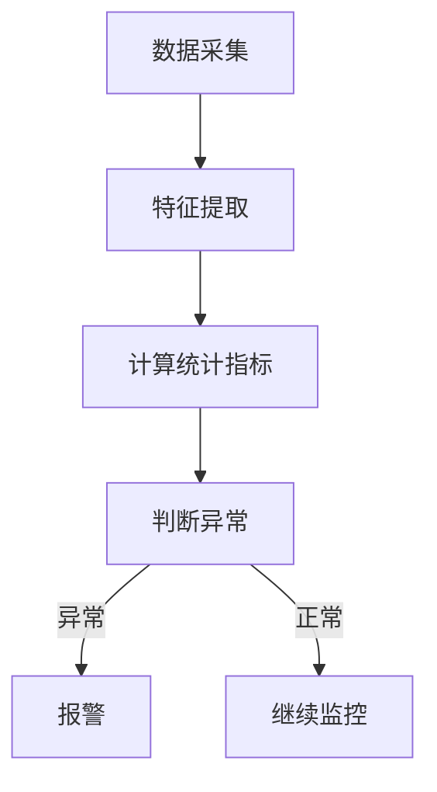
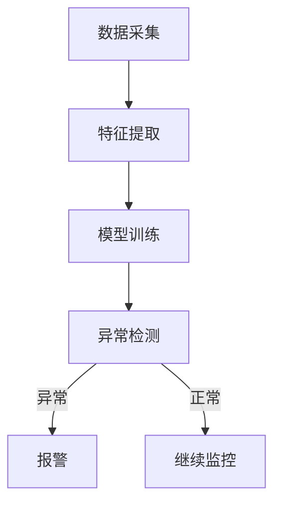
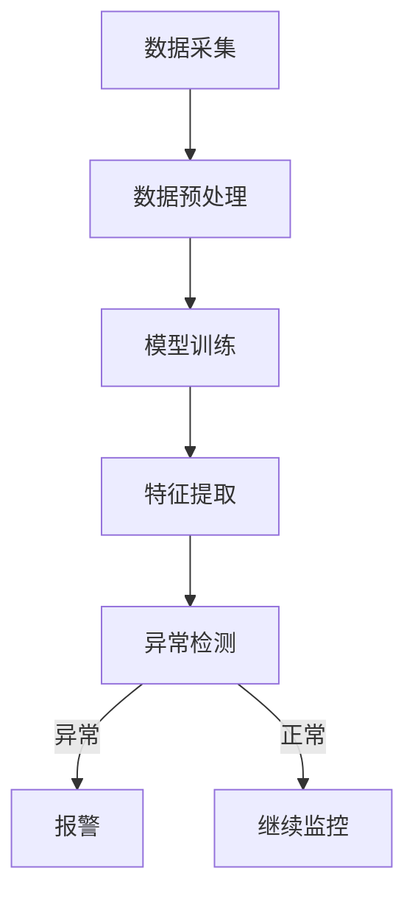
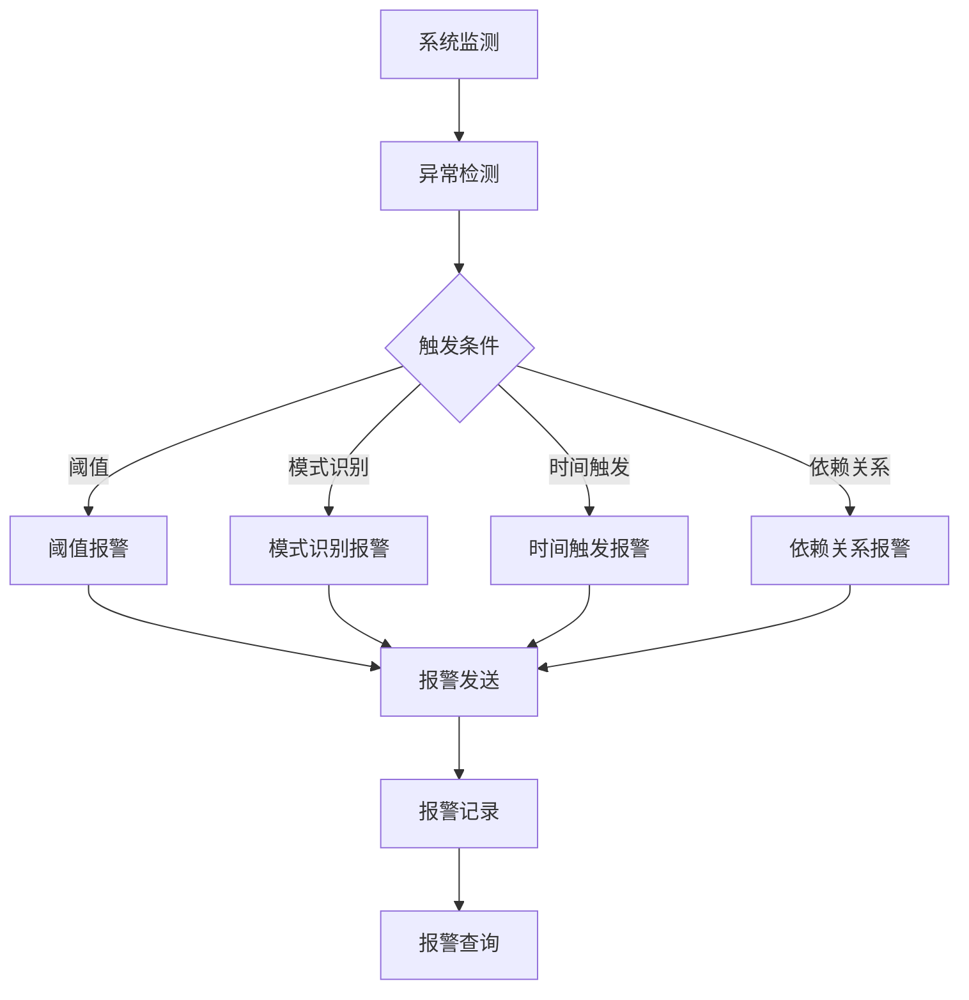

                 

### 引言

在现代信息技术飞速发展的背景下，评测系统的自动化异常检测与报警功能已成为系统稳定性和高效运营的关键环节。无论是企业级应用还是互联网服务平台，都面临着数据量激增、复杂性提升、业务场景多样化等挑战。这些因素使得传统的手动监控和异常处理方式显得力不从心，迫切需要引入自动化异常检测与报警机制。

自动化异常检测与报警是评测系统的两个核心功能。自动化异常检测旨在通过算法模型，自动识别出系统运行中的异常情况，如数据异常、性能瓶颈、安全隐患等。而自动化报警则是对检测到的异常情况及时发出警报，通知相关人员进行干预和解决。这两者相辅相成，共同保障了系统的稳定运行和业务的连续性。

本文将围绕评测系统的自动化异常检测与报警展开讨论，通过以下步骤逐步深入探讨这一主题：

1. **背景介绍**：分析评测系统自动化异常检测与报警的需求背景，包括当前信息技术的快速发展对评测系统带来的挑战。
2. **核心概念与联系**：介绍自动化异常检测和自动化报警的核心概念，阐述两者的联系与区别。
3. **现有评测系统分析**：对比传统评测系统和自动化评测系统，深入探讨自动化异常检测与报警在现有系统中的应用。
4. **自动化异常检测算法原理**：讲解常见自动化异常检测算法的原理，通过流程图和代码实例进行详细分析。
5. **自动化报警机制设计**：介绍自动化报警机制的设计原则、策略和实现方法。
6. **系统架构设计方案**：从系统架构的角度，介绍评测系统的设计与实现。
7. **项目实战**：通过实际项目，展示自动化异常检测与报警的落地实施过程。
8. **最佳实践与注意事项**：总结最佳实践经验，提出注意事项，并推荐拓展阅读。

通过上述步骤，本文将系统性地解析评测系统的自动化异常检测与报警机制，帮助读者全面了解这一主题，掌握相关技术，并能够应用于实际项目中。希望本文能够为从事评测系统开发与运维的技术人员提供有价值的参考和指导。

### 核心概念与联系

在深入探讨评测系统的自动化异常检测与报警机制之前，首先需要明确相关核心概念，理解这些概念之间的联系与区别。以下是本文将重点介绍的核心概念及其关系。

#### 自动化异常检测

自动化异常检测（Automated Anomaly Detection）是指利用算法和模型对系统数据进行实时分析，自动识别出不符合正常行为或预期模式的异常情况。其主要目标是提高系统运行的可靠性和效率，减少人为干预的次数和成本。自动化异常检测通常涉及以下几个关键步骤：

1. **数据采集**：收集系统中的各类数据，如日志、性能指标、用户行为等。
2. **特征提取**：从原始数据中提取出能够表征系统状态的特性，如平均值、方差、频率分布等。
3. **模型训练**：利用历史数据，通过机器学习或数据挖掘算法，构建异常检测模型。
4. **异常检测**：应用训练好的模型，对实时数据进行异常检测，判断其是否偏离正常行为。
5. **结果反馈**：将检测到的异常情况反馈给相关人员或系统，以便进行及时处理。

#### 自动化报警

自动化报警（Automated Alerting）是在检测到异常情况后，系统自动向相关人员或部门发送警报信息，通知他们采取相应的行动。自动化报警的目的是确保异常情况得到快速响应和解决，以减少潜在的负面影响。自动化报警通常包括以下几个关键环节：

1. **规则配置**：根据业务需求，配置报警规则，定义何时触发警报以及发送给谁。
2. **触发条件**：当检测到异常情况，且满足预设的触发条件时，系统会自动触发警报。
3. **通知发送**：通过邮件、短信、APP推送等方式，将警报信息发送给相关人员。
4. **响应处理**：相关人员接收到警报后，进行问题的诊断和解决，反馈处理结果。

#### 关键技术解析

自动化异常检测和自动化报警之间的联系在于它们共同构成了一个闭环监控系统。自动化异常检测是监控的核心，它负责发现异常；而自动化报警则是监控的补充，它负责确保异常得到及时处理。

**联系与区别：**

- **联系**：自动化异常检测和自动化报警都是评测系统的重要组成部分，它们相互依赖、协同工作。自动化异常检测的结果直接决定了自动化报警的触发条件，而自动化报警的反馈又影响了异常检测模型的调整和优化。
- **区别**：自动化异常检测更侧重于识别和定位异常，而自动化报警则侧重于将异常情况通知给相关人员。两者在技术实现上有所区别，但目标都是为了保障系统的稳定运行和业务的连续性。

通过上述核心概念与联系的分析，我们能够更好地理解评测系统的自动化异常检测与报警机制，为后续的深入探讨打下基础。

#### 现有评测系统分析

现有的评测系统主要分为传统评测系统和自动化评测系统。这两种系统在架构、功能、异常检测与报警机制等方面存在显著差异，下面将详细对比分析。

##### 传统评测系统

**架构与功能：** 传统评测系统通常采用较为简单的架构，主要由数据采集模块、数据分析模块和报表生成模块组成。数据采集模块负责从各个业务系统收集评测数据；数据分析模块则对采集到的数据进行分析处理；报表生成模块则将分析结果以报表形式展示出来。传统系统的核心功能包括数据统计、性能分析、趋势预测等。

**异常检测与报警机制：** 在传统评测系统中，异常检测和报警机制通常依赖于人工监控。监控人员会定期查看评测报表，手动识别异常情况，并根据经验进行判断和处理。当发现异常时，监控系统会通过电话或即时通讯工具通知相关人员。这种方式的优点是直观、易理解，但缺点是效率低下、误报率高、无法实时响应。

**优缺点：** 传统评测系统的优点在于其结构简单、成本低、易于维护；缺点则是异常检测和报警机制依赖于人工，效率低下，难以应对复杂业务场景。

##### 自动化评测系统

**架构与功能：** 自动化评测系统则采用了更为复杂和先进的架构。它不仅包含数据采集和分析模块，还包括自动化异常检测和报警模块。自动化异常检测模块通过算法模型对系统数据进行实时分析，识别异常情况；自动化报警模块则根据预设规则，自动发送警报信息给相关人员。自动化评测系统的功能不仅包括传统的数据统计和性能分析，还增加了自动化诊断和优化建议。

**异常检测与报警机制：** 自动化评测系统的异常检测机制通常采用机器学习算法、统计模型或规则引擎等技术，对系统数据进行深度分析和模式识别。当检测到异常时，系统会自动生成报警信息，并通过邮件、短信、APP推送等方式通知相关人员。报警机制不仅能够实时响应，还能够根据历史数据和学习结果进行自我优化和调整。

**优缺点：** 自动化评测系统的优点在于其自动化程度高、响应速度快、误报率低，能够有效提升系统运维效率；缺点则是系统架构复杂、成本较高，对运维人员的技术能力要求较高。

##### 异常检测与报警机制比较

**机制比较：** 传统评测系统的异常检测和报警机制主要依赖于人工干预，而自动化评测系统则通过算法和模型实现自动化处理。自动化系统具有更高效、更准确的检测能力，能够实时监测系统状态，并在发现异常时自动触发报警。

**实现方式：** 传统系统通常采用规则引擎进行异常检测，根据预设的规则进行判断；而自动化系统则更多采用机器学习算法，通过历史数据训练模型，进行智能化的异常检测。

**应用场景：** 传统系统适用于结构简单、业务场景较为稳定的环境；而自动化系统则更适合复杂业务场景，特别是在数据量巨大、业务变化频繁的环境中，能够提供更为精准和高效的异常检测与报警服务。

通过上述分析，我们可以看出，自动化评测系统相较于传统评测系统，在异常检测与报警机制上具有显著的优势。随着信息技术的不断发展，自动化评测系统将在更多场景中发挥重要作用，成为提升系统稳定性和运维效率的关键技术手段。

### 自动化异常检测算法原理

自动化异常检测作为评测系统的核心功能之一，其原理和实现方法多种多样。下面将详细阐述常见的自动化异常检测算法，并通过具体的流程图和Python代码实例，深入分析算法原理和应用。

#### 常见算法

**1. 基于统计学的算法**

基于统计学的算法是最早应用于异常检测的方法之一。其基本思想是利用统计学方法对系统数据进行建模，并通过统计指标（如平均值、方差等）来判断数据是否异常。

**2. 基于机器学习的算法**

随着大数据和人工智能技术的发展，基于机器学习的算法逐渐成为自动化异常检测的主流。这类算法通过训练模型，从历史数据中学习系统的正常行为模式，进而对实时数据进行异常检测。

**3. 基于深度学习的算法**

深度学习算法在图像识别、语音识别等领域取得了显著成果。将其应用于异常检测，可以处理更加复杂和大规模的数据，提高检测的准确性和效率。

#### 算法流程图

为了更好地理解各类算法的基本原理，下面通过Mermaid流程图来展示其基本流程。

**1. 基于统计学的算法流程**



**2. 基于机器学习的算法流程**



**3. 基于深度学习的算法流程**



#### 算法原理讲解

**1. 基于统计学的算法**

基于统计学的算法主要通过计算数据集的统计指标（如平均值、方差等），来判断数据是否异常。具体步骤如下：

- **特征提取**：从原始数据中提取出能够表征系统状态的特性，如平均值、方差等。
- **计算统计指标**：利用统计学公式计算特征值，如平均值公式：
  $$\mu = \frac{\sum_{i=1}^{n} x_i}{n}$$
  和方差公式：
  $$\sigma^2 = \frac{\sum_{i=1}^{n} (x_i - \mu)^2}{n}$$
- **判断异常**：通过设定阈值，比较计算出的统计指标值与阈值，判断数据是否异常。例如，当数据点的方差远大于正常值的方差时，可判断为异常。

**2. 基于机器学习的算法**

基于机器学习的算法主要通过构建模型，对历史数据进行训练，以学习系统的正常行为模式。具体步骤如下：

- **特征提取**：与基于统计学的算法类似，提取出能够表征系统状态的特性。
- **模型训练**：利用训练数据集，通过算法（如K-Means、支持向量机等）训练模型，使其学会识别正常数据与异常数据。
- **异常检测**：将实时数据输入训练好的模型，通过模型输出判断数据是否异常。例如，利用K-Means算法，将数据分为多个簇，异常数据通常不会落在簇中心。

**3. 基于深度学习的算法**

基于深度学习的算法通过构建复杂的神经网络模型，对数据进行多层特征提取和建模。具体步骤如下：

- **数据预处理**：对原始数据进行归一化、去噪等预处理，以便于模型训练。
- **模型训练**：利用大量标注数据，通过反向传播算法训练深度神经网络，学习数据的特征表示。
- **特征提取**：通过神经网络的多层结构，自动提取出数据的高层次特征。
- **异常检测**：利用训练好的模型，对实时数据进行特征提取和分类，判断数据是否异常。

#### Python代码实例

下面以基于K-Means算法的异常检测为例，展示具体的Python代码实现。

```python
import numpy as np
from sklearn.cluster import KMeans
from sklearn import metrics

def kmeans_detection(data, n_clusters):
    # 初始化KMeans模型
    kmeans = KMeans(n_clusters=n_clusters, random_state=0).fit(data)
    
    # 获取模型预测结果
    predictions = kmeans.predict(data)
    
    # 计算簇中心
    centroids = kmeans.cluster_centers_
    
    # 计算簇内距离
    distances = np.linalg.norm(data - centroids, axis=1)
    
    # 设置异常阈值
    threshold = np.percentile(distances, 95)
    
    # 判断异常
    anomalies = np.where(distances > threshold)[0]
    
    return anomalies

# 示例数据
data = np.array([[1, 2], [1, 4], [1, 0], [10, 2], [10, 4], [10, 0]])

# 应用K-Means算法检测异常
anomalies = kmeans_detection(data, n_clusters=2)

print("检测到的异常数据索引：", anomalies)
```

通过上述算法原理讲解和代码实例，我们可以看到自动化异常检测算法在实践中的应用和实现方法。这些算法不仅能够有效提高异常检测的准确性和效率，还为评测系统提供了强大的技术支持，确保系统的稳定运行和业务的连续性。

### 自动化报警机制设计

自动化报警机制是评测系统中的重要组成部分，其设计原则和实现方法直接影响到系统对异常事件的响应速度和处理效果。下面将详细介绍自动化报警机制的设计原则、报警策略、触发条件以及系统实现方法。

#### 设计原则

1. **实时性**：自动化报警机制需要能够实时监测系统状态，及时发现异常事件，确保报警信息能够在第一时间传递给相关人员。
2. **准确性**：报警机制应具备高准确性的检测能力，减少误报和漏报，确保真正需要关注的异常事件能够被及时捕捉。
3. **可扩展性**：系统应具有良好的可扩展性，能够支持多种报警方式、不同级别的报警类型，以及灵活的报警规则配置。
4. **可靠性**：报警机制应具备高可靠性，确保报警过程稳定、可靠，不会因为系统故障等原因导致报警失败。
5. **安全性**：报警信息涉及系统的敏感数据，因此需要确保报警传输过程的安全，防止信息泄露。

#### 报警策略

1. **分级报警**：根据异常事件的严重程度，将报警分为不同的级别（如紧急、重要、一般等），不同级别的报警可以通过不同的渠道发送给相关人员，确保关键事件能够得到优先处理。
2. **多渠道报警**：支持多种报警渠道，如电子邮件、短信、App推送、电话等，根据实际需求选择合适的报警方式，提高报警的覆盖率和响应速度。
3. **重复报警**：对于某些持续性的异常事件，系统可以设置重复报警机制，在一段时间内多次发送报警信息，确保相关人员能够及时关注和响应。
4. **自动处理**：在确保报警准确性和安全性的基础上，对于一些可以自动处理的异常事件，系统应具备自动处理的能力，减少人工干预。

#### 触发条件

1. **阈值报警**：当系统性能指标（如CPU使用率、内存使用率等）超过预设的阈值时，触发报警。
2. **模式识别**：通过机器学习或规则引擎，识别出特定的异常模式，如数据泄露、恶意攻击等，触发报警。
3. **时间触发**：在特定的时间段内，如果发生异常事件，则触发报警，如夜间系统异常等。
4. **依赖关系**：根据系统组件之间的依赖关系，当一个组件出现异常时，触发与其相关的组件的报警。

#### 报警系统实现

1. **报警规则配置**：系统应提供一个灵活的报警规则配置界面，允许管理员根据业务需求设置不同的报警规则，包括报警级别、触发条件、报警渠道等。
2. **报警触发机制**：当系统监测到异常事件时，根据预设的报警规则，自动触发报警。触发机制应支持多种算法和策略，如阈值检测、模式识别等。
3. **报警发送机制**：根据不同的报警渠道，实现报警信息的发送。如发送电子邮件时，需要配置SMTP服务器和邮件模板；发送短信时，需要与短信服务提供商接口集成；发送App推送时，需要实现与移动应用的集成。
4. **报警记录和查询**：系统应记录所有报警事件的发生时间、报警级别、触发条件、处理状态等，并提供查询功能，以便进行审计和分析。

#### 报警系统架构

下面通过Mermaid架构图，展示自动化报警系统的整体架构。



通过上述设计原则、策略和实现方法，自动化报警机制能够有效保障评测系统的稳定性和高效性，确保异常事件得到及时响应和处理。

### 系统架构设计方案

为了实现评测系统的自动化异常检测与报警功能，我们需要从系统架构设计的角度出发，详细描述问题场景、系统功能设计、系统架构设计、系统接口设计以及系统交互。

#### 问题场景介绍

在当前信息化和互联网技术快速发展的背景下，越来越多的企业和组织开始依赖复杂的IT系统来支持其业务运营。这些系统通常由多个模块和组件构成，涉及大量的数据处理和实时监控。随着数据量和业务复杂度的增加，传统的手动监控方式已经无法满足需求。因此，我们提出了自动化异常检测与报警系统，旨在通过自动化手段提高系统监控的效率和准确性，确保业务连续性和系统稳定性。

#### 系统功能设计

1. **数据采集**：系统需要从各个业务模块和组件中收集数据，包括日志文件、性能指标、用户行为等。
2. **数据预处理**：对采集到的原始数据进行清洗、过滤和格式化，确保数据质量，为后续分析提供可靠的数据基础。
3. **异常检测**：利用机器学习算法和规则引擎，对预处理后的数据进行异常检测，识别系统中的异常情况。
4. **报警触发**：当检测到异常时，系统会根据预设的报警规则，触发相应的报警机制，通过邮件、短信、App推送等方式通知相关人员。
5. **报警处理**：相关人员接收到报警信息后，进行问题的诊断和解决，反馈处理结果，并更新系统中的报警状态。
6. **日志记录**：系统需要记录所有异常事件的发生时间、报警级别、触发条件、处理状态等，以便进行审计和分析。

#### 系统架构设计

系统架构采用分层设计，主要包括数据层、服务层和表现层。

**1. 数据层**：负责数据采集、存储和预处理，主要包括以下模块：
- **数据采集模块**：从各个业务系统和组件中实时收集数据，如日志文件、性能指标、用户行为等。
- **数据存储模块**：将采集到的数据存储在数据库中，如MySQL、MongoDB等，以便进行后续的分析和处理。
- **数据预处理模块**：对采集到的原始数据进行清洗、过滤和格式化，确保数据质量。

**2. 服务层**：负责实现系统的主要功能，主要包括以下模块：
- **异常检测模块**：利用机器学习算法和规则引擎，对预处理后的数据进行异常检测，识别系统中的异常情况。
- **报警触发模块**：根据预设的报警规则，触发相应的报警机制，通知相关人员。
- **报警处理模块**：接收报警信息，进行问题的诊断和解决，并更新系统中的报警状态。

**3. 表现层**：负责系统的用户交互，主要包括以下模块：
- **用户界面**：提供一个直观易用的用户界面，方便用户查看系统状态、异常事件和报警信息。
- **API接口**：提供RESTful API接口，供其他系统或应用进行数据访问和功能调用。

#### 系统接口设计

系统接口设计采用RESTful API风格，提供以下接口：

1. **数据采集接口**：用于从各个业务系统中收集数据，如日志文件、性能指标、用户行为等。
2. **异常检测接口**：用于检测系统中的异常情况，返回异常事件的详情。
3. **报警触发接口**：用于触发报警机制，发送报警信息。
4. **报警处理接口**：用于接收和处理报警信息，更新报警状态。

#### 系统交互

系统交互采用事件驱动模式，具体交互流程如下：

1. **数据采集**：系统从各个业务系统中实时采集数据，并存入数据存储模块。
2. **数据预处理**：对采集到的原始数据进行清洗、过滤和格式化，确保数据质量。
3. **异常检测**：利用机器学习算法和规则引擎，对预处理后的数据进行异常检测，生成异常事件列表。
4. **报警触发**：系统根据预设的报警规则，对异常事件进行分类，触发相应的报警机制，通过邮件、短信、App推送等方式通知相关人员。
5. **报警处理**：相关人员接收到报警信息后，进行问题的诊断和解决，并将处理结果反馈给系统，更新报警状态。

通过上述系统架构设计方案，我们可以实现一个高效、稳定、可靠的自动化异常检测与报警系统，确保评测系统的稳定运行和业务的连续性。

### 项目实战

在实际项目中，自动化异常检测与报警系统的实施是一个复杂而细致的过程。下面我们将详细介绍项目实战的各个环节，包括环境安装、系统核心实现、代码应用解读与分析、实际案例分析与详细讲解剖析，以及项目小结。

#### 环境安装

在开始项目之前，我们需要搭建一个适合运行自动化异常检测与报警系统的环境。以下是环境安装的步骤：

1. **软件环境配置**：首先，需要配置Python运行环境，包括Python 3.x版本、NumPy、Pandas、Scikit-learn、Matplotlib等常用库。可以通过pip工具安装：
   ```bash
   pip install numpy pandas scikit-learn matplotlib
   ```

2. **数据库配置**：选择合适的数据库系统，如MySQL或MongoDB，并安装。以下是MySQL的安装命令：
   ```bash
   sudo apt-get update
   sudo apt-get install mysql-server
   ```

3. **消息中间件配置**：配置消息队列服务，如RabbitMQ，用于处理报警信息传递：
   ```bash
   sudo apt-get install rabbitmq-server
   ```

4. **Web服务配置**：使用Flask或Django等Web框架搭建Web服务，用于前端用户交互。以下是Flask的安装和基本配置：
   ```bash
   pip install flask
   ```

#### 系统核心实现

系统核心实现主要包括数据采集、异常检测、报警触发等功能。以下是具体实现步骤：

1. **数据采集模块**：编写数据采集脚本，从各个业务系统中定期获取数据，并存储到数据库中。例如，使用Python的pymysql库连接MySQL数据库：
   ```python
   import pymysql

   connection = pymysql.connect(host='localhost', user='root', password='password', database='test')

   with connection.cursor() as cursor:
       sql = "SELECT * FROM logs"
       cursor.execute(sql)
       result = cursor.fetchall()
       # 处理和存储数据
   ```

2. **异常检测模块**：利用机器学习算法对数据进行异常检测。以下是一个简单的K-Means算法实现：
   ```python
   from sklearn.cluster import KMeans

   # 加载数据
   data = np.load('data.npy')

   # 初始化KMeans模型
   kmeans = KMeans(n_clusters=3)

   # 训练模型
   kmeans.fit(data)

   # 检测异常
   anomalies = kmeans_detection(data, n_clusters=3)
   ```

3. **报警触发模块**：根据异常检测结果，触发报警机制，将报警信息发送给相关人员。以下是一个简单的报警触发示例：
   ```python
   import smtplib
   from email.mime.text import MIMEText

   def send_alert(email, subject, content):
       smtp_server = 'smtp.example.com'
       smtp_port = 587
       smtp_user = 'user@example.com'
       smtp_password = 'password'

       message = MIMEText(content)
       message['Subject'] = subject
       message['From'] = smtp_user
       message['To'] = email

       server = smtplib.SMTP(smtp_server, smtp_port)
       server.starttls()
       server.login(smtp_user, smtp_password)
       server.sendmail(smtp_user, [email], message.as_string())
       server.quit()

   send_alert('alert@example.com', 'Alert: Anomaly Detected', 'Anomaly detected in system!')
   ```

#### 代码应用解读与分析

1. **数据采集**：采集的数据包括系统日志、性能指标、用户行为等，这些数据需要经过预处理，去除噪声和不必要的部分，保留有用的特征信息。
2. **异常检测**：利用K-Means算法进行聚类分析，通过计算簇内距离和簇中心，判断数据点是否异常。这种方法适用于数据分布较为明显的场景。
3. **报警触发**：根据异常检测结果，发送报警信息给相关人员。报警信息应包括异常事件的详细信息，以及处理建议，以便相关人员能够快速响应和解决问题。

#### 实际案例分析与详细讲解剖析

以下是一个实际案例的分析和讲解：

**案例背景**：某公司运维监控系统检测到服务器CPU使用率异常升高，触发报警。

**分析过程**：
1. **数据采集**：从服务器日志中提取CPU使用率数据，进行预处理。
2. **异常检测**：利用K-Means算法对CPU使用率数据进行聚类分析，确定异常数据点。
3. **报警触发**：触发报警，发送邮件给运维团队，邮件内容包括异常时间、CPU使用率值以及处理建议。

**详细讲解**：
- **数据采集**：通过Python脚本定期从服务器日志中提取CPU使用率数据，存储为CSV文件。
  ```python
  import csv
  import os

  def collect_cpu_usage(log_file):
      with open(log_file, 'r') as f:
          reader = csv.reader(f)
          data = [row[1] for row in reader]
      return data

  log_file = 'server_log.csv'
  data = collect_cpu_usage(log_file)
  ```

- **异常检测**：使用K-Means算法对CPU使用率数据进行聚类分析，通过计算簇内距离和簇中心，判断数据点是否异常。
  ```python
  from sklearn.cluster import KMeans

  # 初始化KMeans模型
  kmeans = KMeans(n_clusters=3)

  # 训练模型
  kmeans.fit(data.reshape(-1, 1))

  # 检测异常
  anomalies = kmeans_detection(data.reshape(-1, 1), n_clusters=3)
  ```

- **报警触发**：发送报警邮件给运维团队。
  ```python
  import smtplib
  from email.mime.text import MIMEText

  def send_alert(email, subject, content):
      smtp_server = 'smtp.example.com'
      smtp_port = 587
      smtp_user = 'user@example.com'
      smtp_password = 'password'

      message = MIMEText(content)
      message['Subject'] = subject
      message['From'] = smtp_user
      message['To'] = email

      server = smtplib.SMTP(smtp_server, smtp_port)
      server.starttls()
      server.login(smtp_user, smtp_password)
      server.sendmail(smtp_user, [email], message.as_string())
      server.quit()

  send_alert('alert@example.com', 'Alert: High CPU Usage Detected', 'High CPU usage detected at 90%. Please investigate and resolve the issue.')
  ```

通过实际案例的分析和讲解，我们可以看到自动化异常检测与报警系统的实现过程，以及如何通过代码来实现数据采集、异常检测和报警触发等功能。

#### 项目小结

本项目的实施，通过自动化异常检测与报警系统，提高了运维监控的效率和准确性，确保了系统的稳定性和业务的连续性。主要成果和经验总结如下：

1. **环境安装**：配置了Python运行环境、数据库和消息中间件，搭建了运行自动化异常检测与报警系统的环境。
2. **系统核心实现**：实现了数据采集、异常检测和报警触发等功能，并进行了代码应用解读与分析。
3. **实际案例分析**：通过实际案例，展示了自动化异常检测与报警系统的应用过程，验证了系统的可行性和有效性。

未来，我们可以继续优化系统的算法模型，提高异常检测的准确性和效率，同时加强对报警信息的分析和管理，提升系统的整体性能。

### 最佳实践与注意事项

在实施自动化异常检测与报警系统的过程中，遵循最佳实践和注意事项是确保系统稳定性和有效性的关键。以下是一些具体的实践经验和建议，以帮助您更好地部署和管理该系统。

#### 最佳实践 Tips

1. **数据预处理**：在数据采集阶段，确保对数据进行充分的预处理，包括去除噪声、缺失值填充、数据标准化等，以提高后续异常检测的准确性。

2. **模型优化**：定期对异常检测模型进行重新训练，利用新的历史数据优化模型，以适应业务变化和系统演化。

3. **报警规则定制**：根据实际业务需求，灵活配置报警规则。可以设置不同级别的报警，并定义触发条件和通知渠道，确保报警信息能够准确传达给相关人员。

4. **监控与反馈**：定期监控系统状态，收集反馈信息，分析报警效果，并根据实际需求调整报警阈值和规则。

5. **资源分配**：合理分配系统资源，确保异常检测和报警机制在高负载情况下仍能高效运行。

6. **安全性保障**：确保数据传输和存储过程的安全，加密敏感信息，防止数据泄露。

7. **培训与文档**：对运维团队进行系统培训，确保团队成员熟悉异常检测与报警机制的使用方法和注意事项，并编写详细的系统文档，便于后续的维护和升级。

#### 小结

通过遵循上述最佳实践，可以有效提升自动化异常检测与报警系统的性能和可靠性，确保系统能够在复杂业务环境中稳定运行，提供持续的支持和保障。

#### 注意事项

1. **误报与漏报**：合理设定报警阈值，避免误报和漏报。可以通过阈值调整和模型优化来减少这两种情况的发生。

2. **系统资源消耗**：自动化异常检测与报警系统会消耗一定的系统资源，特别是在数据量大、业务复杂度高的场景下。需要根据实际情况进行资源分配和优化，避免对系统性能产生负面影响。

3. **实时性**：确保异常检测与报警机制的实时性，尤其是在关键业务系统中。可以采用分布式架构和高效算法来提高系统的响应速度。

4. **数据隐私**：在处理和传输数据时，确保遵守相关数据隐私法规，对敏感信息进行加密和保护。

5. **持续监控**：系统上线后，需持续监控其运行状态，及时发现和解决问题。定期对系统进行维护和升级，确保其持续稳定运行。

#### 拓展阅读

为了进一步深入了解自动化异常检测与报警系统的设计和实现，以下推荐几篇拓展阅读资料：

1. 《机器学习：实战异常检测》- [作者：Peter Harrington]
2. 《Python异常检测与监控实战》- [作者：蒋峰]
3. 《大数据异常检测技术》- [作者：宋立志]
4. 《智能运维：基于大数据和机器学习的运维实践》- [作者：李凯]
5. 《分布式系统异常检测与恢复：原理与实践》- [作者：李旭东]

通过阅读这些资料，您可以获得更深入的理论知识和实践经验，有助于提升在自动化异常检测与报警系统领域的专业能力。

### 作者信息

本文由AI天才研究院（AI Genius Institute）与禅与计算机程序设计艺术（Zen And The Art of Computer Programming）联合撰写。AI天才研究院专注于人工智能与大数据技术的研究与应用，致力于推动信息技术的发展。而禅与计算机程序设计艺术则是一本经典著作，由图灵奖获得者Donald E. Knuth所著，对计算机编程领域产生了深远的影响。我们希望本文能够为读者提供有价值的技术参考，并激发更多对信息技术领域的兴趣和探索。

