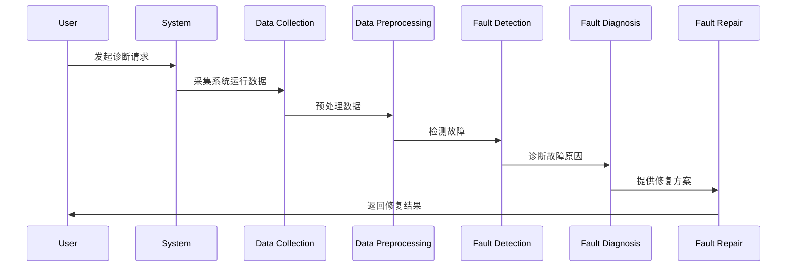

                 

### 评测系统的自动化故障诊断功能：背景与重要性

#### 1. 背景介绍

随着信息技术的快速发展，评测系统在各个领域得到了广泛应用，从互联网服务到嵌入式系统，再到复杂的工业控制系统，评测系统的可靠性直接影响到用户的体验和系统的正常运行。然而，系统的复杂性使得传统的手工故障诊断方法越来越难以满足需求，这不仅耗费大量的人力物力，而且诊断效率低下，容易错过故障的早期迹象。

**问题背景**：评测系统的运行过程中，可能会出现各种软硬件故障，如网络延迟、硬件故障、软件漏洞等。这些故障可能导致系统性能下降、数据丢失甚至完全瘫痪。传统的故障诊断方法依赖于专业技术人员的人工检测和排除，这不仅效率低下，而且容易误判。

**问题描述**：为了提高评测系统的可靠性，需要一种自动化的故障诊断方法，能够实时监控系统的运行状态，快速定位故障点，并提供有效的解决方案。

**问题解决**：自动化故障诊断功能通过引入计算机技术和人工智能算法，可以实现对系统故障的自动检测、诊断和修复。这种方法不仅能够提高故障检测的速度和准确性，还能减少人力成本，提高系统的整体可靠性。

**边界与外延**：自动化故障诊断功能不仅适用于评测系统，还可以推广到其他类型的系统中，如通信系统、交通控制系统、医疗设备等。其核心在于利用计算机技术和人工智能算法来提高系统故障检测和诊断的效率。

**概念结构与核心要素组成**：

- **计算机技术**：提供自动化故障诊断的基础工具和平台。
- **人工智能算法**：实现故障检测、诊断和修复的核心。
- **数据采集**：收集系统运行状态的数据。
- **特征提取**：从数据中提取有用的故障特征。
- **异常检测**：识别出异常的运行状态。
- **故障诊断**：根据异常特征诊断出故障原因。
- **故障修复**：提供自动修复或建议修复方案。

#### 2. 关键概念与联系

**自动化故障诊断**（Automated Fault Diagnosis）：指利用计算机技术和人工智能算法，对系统运行状态进行实时监控，自动检测、诊断和修复故障的过程。

**故障检测**（Fault Detection）：通过分析系统运行数据，识别出异常运行状态的过程。

**故障诊断**（Fault Diagnosis）：根据故障检测的结果，确定故障原因和位置的过程。

**故障修复**（Fault Repair）：提供自动修复或建议修复方案的过程。

**计算机技术**：包括硬件、软件和网络技术，为自动化故障诊断提供基础平台。

**人工智能算法**：包括机器学习、深度学习、模式识别等，用于实现故障检测、诊断和修复。

**数据采集**：通过传感器、日志文件等收集系统运行状态的数据。

**特征提取**：从原始数据中提取出反映系统状态的指标。

**异常检测**：通过对比正常数据和实际数据，识别出潜在的故障。

**系统可靠性**：系统在规定条件下能够正常运行的能力。

**故障率**：系统中发生故障的频率。

**诊断效率**：故障诊断的速度和准确性。

#### 3. ER实体关系图架构

```mermaid
erDiagram
  Product ||--|{ Fault } :诊断
  System  ||--|{ Monitoring } :监控
  User    ||--|{ Report } :生成报告
```

- **Product**：产品，指需要监控和诊断的系统。
- **Fault**：故障，包括检测到的异常和诊断出的故障。
- **System**：系统，提供监控和诊断功能。
- **Monitoring**：监控，对产品运行状态进行实时监控。
- **User**：用户，生成故障报告和修复建议。

#### 4. 算法原理讲解

自动化故障诊断的核心算法主要包括故障检测、故障诊断和故障修复三个部分。

**故障检测算法**：

故障检测算法主要通过对比正常数据和实际数据，识别出异常的运行状态。常用的算法包括：

- **阈值检测**：设定一个阈值，当数据超过阈值时，认为出现了故障。
- **基于模型的异常检测**：通过建立系统正常运行的模型，比较实际运行数据与模型预测值的差异，识别出异常。

**故障诊断算法**：

故障诊断算法的目的是确定故障原因和位置。常用的算法包括：

- **基于规则的诊断算法**：根据预设的规则库，匹配故障现象和故障原因。
- **基于数据挖掘的诊断算法**：通过分析历史故障数据，发现故障之间的关联性，进行故障诊断。

**故障修复算法**：

故障修复算法提供自动修复或建议修复方案。常用的算法包括：

- **基于专家系统的修复算法**：根据专家经验，提供修复建议。
- **基于机器学习的修复算法**：通过分析历史故障数据，学习出修复策略。

#### 5. 数学公式

故障检测的准确性可以用以下公式表示：

$$
\text{Accuracy} = \frac{\text{Correctly Detected Faults}}{\text{Total Faults}} \times 100\%
$$

故障诊断的速度可以用以下公式表示：

$$
\text{Response Time} = \frac{\text{Total Time to Diagnose}}{\text{Total Faults Detected}}
$$

#### 6. 举例说明

假设一个评测系统在运行过程中检测到一个异常运行状态，通过阈值检测算法识别出网络延迟超出了正常范围。接下来，故障诊断算法会分析网络延迟的数据，确定故障原因是网络拥堵。最后，故障修复算法会根据网络拓扑结构，提供重新路由的建议，从而解决问题。

### 评测系统的自动化故障诊断功能：技术原理与实现

#### 1. 数据采集与预处理

数据采集是自动化故障诊断系统的第一步，它决定了后续诊断的准确性和效率。数据来源可以是各种传感器、日志文件、数据库等。数据采集后，通常需要进行预处理，包括去噪、数据清洗、特征提取等操作。这些预处理步骤对于确保数据的准确性和一致性至关重要。

**步骤 1：数据采集**

- **传感器数据**：通过温度传感器、压力传感器、流量传感器等实时采集系统运行状态的数据。
- **日志文件**：收集系统生成的日志文件，包含各种系统事件和错误信息。
- **数据库**：从数据库中提取与系统运行相关的数据，如交易记录、用户行为等。

**步骤 2：数据预处理**

- **去噪**：去除数据中的噪声，提高数据质量。
- **数据清洗**：处理缺失值、异常值和重复值，确保数据的准确性。
- **特征提取**：从原始数据中提取出能够反映系统状态的指标，如平均值、方差、频率分布等。

#### 2. 故障检测算法

故障检测是自动化故障诊断的关键环节，它的目的是实时监控系统运行状态，识别出异常的运行状态。故障检测算法可以分为阈值检测、基于模型的异常检测和基于数据挖掘的异常检测。

**阈值检测算法**：

阈值检测算法通过设定一个阈值，当数据超过或低于这个阈值时，认为系统出现了故障。这种方法简单直观，但需要根据具体应用场景设定合适的阈值。

- **步骤 1**：根据历史数据和专家经验设定阈值。
- **步骤 2**：实时监控系统运行数据，当数据超过或低于阈值时，触发故障检测。

**基于模型的异常检测算法**：

基于模型的异常检测算法通过建立系统正常运行的模型，比较实际运行数据与模型预测值的差异，识别出异常。这种方法可以自动调整阈值，提高故障检测的准确性。

- **步骤 1**：建立系统正常运行的模型。
- **步骤 2**：实时监控系统运行数据，计算实际运行数据与模型预测值的差异。
- **步骤 3**：当差异超过预设的阈值时，认为系统出现了故障。

**基于数据挖掘的异常检测算法**：

基于数据挖掘的异常检测算法通过分析历史故障数据，发现故障之间的关联性，识别出异常。这种方法可以挖掘出隐藏的故障模式，提高故障检测的准确性。

- **步骤 1**：收集历史故障数据。
- **步骤 2**：使用数据挖掘算法（如关联规则学习、聚类分析等）分析故障数据。
- **步骤 3**：根据分析结果设定异常检测规则。

#### 3. 故障诊断算法

故障诊断是在故障检测的基础上，进一步确定故障原因和位置的过程。故障诊断算法可以分为基于规则的诊断算法、基于数据挖掘的诊断算法和基于机器学习的诊断算法。

**基于规则的诊断算法**：

基于规则的诊断算法根据预设的规则库，匹配故障现象和故障原因。这种方法简单直观，但需要大量专家知识。

- **步骤 1**：建立规则库，包括各种可能的故障原因和对应的检测规则。
- **步骤 2**：根据故障检测的结果，匹配规则库中的规则，确定故障原因。

**基于数据挖掘的诊断算法**：

基于数据挖掘的诊断算法通过分析历史故障数据，发现故障之间的关联性，诊断出故障原因。这种方法可以自动挖掘故障模式，提高诊断的准确性。

- **步骤 1**：收集历史故障数据。
- **步骤 2**：使用数据挖掘算法（如关联规则学习、聚类分析等）分析故障数据。
- **步骤 3**：根据分析结果诊断故障原因。

**基于机器学习的诊断算法**：

基于机器学习的诊断算法通过训练模型，从历史故障数据中学习出故障诊断规则。这种方法可以自动调整诊断规则，提高诊断的准确性。

- **步骤 1**：收集历史故障数据。
- **步骤 2**：使用机器学习算法（如决策树、神经网络等）训练诊断模型。
- **步骤 3**：根据训练模型诊断故障原因。

#### 4. 故障修复算法

故障修复算法提供自动修复或建议修复方案，以提高系统的可靠性和稳定性。故障修复算法可以分为基于专家系统的修复算法和基于机器学习的修复算法。

**基于专家系统的修复算法**：

基于专家系统的修复算法根据专家经验，提供修复建议。这种方法需要大量专家知识，但可以快速给出修复建议。

- **步骤 1**：收集专家知识，建立专家系统。
- **步骤 2**：根据故障诊断结果，查询专家系统，获取修复建议。

**基于机器学习的修复算法**：

基于机器学习的修复算法通过训练模型，从历史故障数据中学习出修复策略。这种方法可以自动调整修复策略，提高修复的准确性。

- **步骤 1**：收集历史故障数据。
- **步骤 2**：使用机器学习算法（如决策树、神经网络等）训练修复模型。
- **步骤 3**：根据训练模型提供修复建议。

### 评测系统的自动化故障诊断功能：系统设计与实现

#### 1. 系统需求分析与设计

在设计和实现评测系统的自动化故障诊断功能之前，首先需要明确系统的需求。系统需求分析包括功能需求和非功能需求。

**功能需求**：

- 数据采集与预处理：实时采集系统运行数据，进行数据预处理。
- 故障检测：根据实时数据，识别出异常运行状态。
- 故障诊断：根据故障检测结果，诊断出故障原因。
- 故障修复：提供自动修复或建议修复方案。

**非功能需求**：

- 可靠性：系统应能够稳定运行，减少故障率。
- 实时性：系统应能够快速响应故障检测和诊断。
- 可扩展性：系统应能够适应不同的评测系统和场景。

根据需求分析，系统设计应包括以下模块：

- 数据采集模块：负责实时采集系统运行数据。
- 数据预处理模块：负责对采集到的数据进行分析和处理。
- 故障检测模块：负责识别异常运行状态。
- 故障诊断模块：负责诊断故障原因。
- 故障修复模块：负责提供自动修复或建议修复方案。

**系统设计原则**：

- **模块化设计**：将系统功能划分为多个模块，提高系统的可维护性和可扩展性。
- **分布式架构**：采用分布式架构，提高系统的实时性和可靠性。
- **可扩展性**：设计时应考虑未来的扩展需求，以便在系统规模扩大时进行升级。

**系统设计框架**：



#### 2. 系统架构设计

系统架构设计是系统设计的核心，它决定了系统的性能、可靠性和可扩展性。评测系统的自动化故障诊断功能可以采用以下架构：

**架构设计**：

- **前端**：负责与用户交互，接收诊断请求和展示诊断结果。
- **后端**：包括数据采集模块、数据预处理模块、故障检测模块、故障诊断模块和故障修复模块。
- **数据库**：存储系统运行数据和故障数据。

**系统模块划分**：

- **数据采集模块**：负责实时采集系统运行数据，包括传感器数据和日志文件等。
- **数据预处理模块**：负责对采集到的数据进行预处理，包括去噪、数据清洗和特征提取等。
- **故障检测模块**：负责根据预处理后的数据，识别异常运行状态。
- **故障诊断模块**：负责诊断故障原因，提供故障诊断报告。
- **故障修复模块**：负责提供自动修复或建议修复方案。

**系统模块功能**：

- **数据采集模块**：实现实时数据采集，确保数据的准确性和完整性。
- **数据预处理模块**：提高数据质量，确保故障检测的准确性。
- **故障检测模块**：快速识别异常运行状态，提高故障检测的实时性。
- **故障诊断模块**：准确诊断故障原因，提供详细的诊断报告。
- **故障修复模块**：提供自动修复或建议修复方案，提高故障修复的效率。

#### 3. 系统接口设计

系统接口设计是系统架构设计的重要组成部分，它决定了系统模块之间的交互方式和数据流。评测系统的自动化故障诊断功能可以采用以下接口设计：

**接口设计**：

- **数据采集接口**：用于数据采集模块与其他模块之间的数据传输。
- **预处理接口**：用于数据预处理模块与其他模块之间的数据传输。
- **检测接口**：用于故障检测模块与其他模块之间的数据传输。
- **诊断接口**：用于故障诊断模块与其他模块之间的数据传输。
- **修复接口**：用于故障修复模块与其他模块之间的数据传输。

**接口定义**：

- **数据采集接口**：接收系统运行数据，并将数据传递给数据预处理模块。
- **预处理接口**：接收预处理后的数据，并将数据传递给故障检测模块。
- **检测接口**：接收故障检测结果，并将结果传递给故障诊断模块。
- **诊断接口**：接收故障诊断结果，并将结果传递给故障修复模块。
- **修复接口**：接收修复方案，并将结果返回给用户。

#### 4. 系统交互设计

系统交互设计是系统架构设计的进一步细化，它描述了系统模块之间的交互流程和数据流。评测系统的自动化故障诊断功能可以采用以下交互设计：

**交互设计**：

- **诊断请求**：用户发起诊断请求，系统接收请求并开始执行诊断流程。
- **数据采集**：系统启动数据采集模块，实时采集系统运行数据。
- **数据预处理**：系统启动数据预处理模块，对采集到的数据进行预处理。
- **故障检测**：系统启动故障检测模块，根据预处理后的数据识别异常运行状态。
- **故障诊断**：系统启动故障诊断模块，诊断故障原因并生成诊断报告。
- **故障修复**：系统启动故障修复模块，提供自动修复或建议修复方案。
- **结果反馈**：系统将诊断结果和修复方案反馈给用户。

**交互流程**：

1. 用户发起诊断请求。
2. 系统接收请求并开始执行诊断流程。
3. 系统启动数据采集模块，实时采集系统运行数据。
4. 系统启动数据预处理模块，对采集到的数据进行预处理。
5. 系统启动故障检测模块，根据预处理后的数据识别异常运行状态。
6. 系统启动故障诊断模块，诊断故障原因并生成诊断报告。
7. 系统启动故障修复模块，提供自动修复或建议修复方案。
8. 系统将诊断结果和修复方案反馈给用户。

**数据流**：

- **系统运行数据**：从数据采集模块传输到数据预处理模块。
- **预处理数据**：从数据预处理模块传输到故障检测模块。
- **故障检测结果**：从故障检测模块传输到故障诊断模块。
- **诊断报告**：从故障诊断模块传输到故障修复模块。
- **修复方案**：从故障修复模块传输回用户。

### 评测系统的自动化故障诊断功能：测试与评估

#### 1. 测试策略与测试环境

测试是评估自动化故障诊断系统性能和可靠性的重要环节。测试策略应包括功能测试、性能测试、可靠性测试和安全性测试。

**功能测试**：验证系统是否能够正确实现故障检测、诊断和修复功能。

**性能测试**：评估系统在不同负载下的响应时间和准确性。

**可靠性测试**：验证系统在长时间运行下的稳定性和可靠性。

**安全性测试**：确保系统不会因为恶意攻击或错误操作而导致数据泄露或系统崩溃。

**测试环境**：

- **硬件环境**：服务器、网络设备、传感器等。
- **软件环境**：操作系统、数据库、编程语言和工具等。

#### 2. 测试用例设计

测试用例设计是测试策略的具体实现，它定义了测试的输入、预期输出和执行步骤。

**测试用例**：

- **故障检测测试用例**：包括正常数据、异常数据、边界数据等，验证故障检测算法的准确性。
- **故障诊断测试用例**：包括已知故障和未知故障，验证故障诊断算法的准确性和鲁棒性。
- **故障修复测试用例**：包括自动修复和手动修复，验证故障修复算法的有效性和效率。

**测试步骤**：

1. 准备测试数据，包括正常数据、异常数据和故障数据。
2. 执行故障检测测试用例，记录检测结果和响应时间。
3. 执行故障诊断测试用例，记录诊断结果和修复建议。
4. 执行故障修复测试用例，验证修复方案的有效性。

#### 3. 系统性能评估

系统性能评估是测试的重要部分，它通过对比实际性能与预期性能，评估系统的性能和可靠性。

**性能指标**：

- **故障检测率**：正确检测出故障的次数与总故障次数的比值。
- **故障诊断准确率**：正确诊断出故障原因的次数与总故障次数的比值。
- **故障修复成功率**：成功修复故障的次数与总故障次数的比值。
- **响应时间**：系统从接收到故障检测请求到返回诊断结果和修复建议的时间。

**评估方法**：

- **统计分析**：通过统计分析测试结果，评估系统性能的稳定性和一致性。
- **对比测试**：对比不同算法和方案的性能，选择最优的故障检测、诊断和修复方法。

### 评测系统的自动化故障诊断功能：案例研究

#### 1. 案例背景

一个大型电商平台在系统升级过程中，突然出现了大量的用户请求无法响应的问题。系统管理员通过手工排查，发现是数据库服务器出现了性能瓶颈，导致响应时间过长。

**问题描述**：电商平台用户请求无法响应，响应时间超过设定阈值。

**问题解决**：通过自动化故障诊断系统，快速定位到数据库服务器性能瓶颈，提供了优化数据库配置和增加缓存层的修复建议。

#### 2. 案例分析与解决方案

**故障检测**：自动化故障诊断系统实时监控服务器性能指标，包括CPU使用率、内存使用率、磁盘I/O读写速度等。当监控数据超过预设的阈值时，系统触发故障检测。

- **步骤 1**：监控数据采集。
- **步骤 2**：数据预处理，提取关键性能指标。
- **步骤 3**：基于阈值的异常检测，识别出服务器性能异常。

**故障诊断**：系统根据故障检测的结果，分析服务器性能指标的变化趋势，诊断出故障原因。

- **步骤 1**：分析CPU使用率、内存使用率等指标，发现数据库服务器CPU使用率过高。
- **步骤 2**：结合磁盘I/O读写速度，判断数据库服务器性能瓶颈。
- **步骤 3**：生成故障诊断报告，确定故障原因是数据库服务器性能瓶颈。

**故障修复**：系统提供自动修复或建议修复方案。

- **步骤 1**：优化数据库配置，调整数据库参数。
- **步骤 2**：增加缓存层，减少数据库读写次数。
- **步骤 3**：监控系统性能指标，验证修复效果。

#### 3. 案例总结与启示

**案例总结**：通过自动化故障诊断系统，电商平台在系统升级过程中，迅速定位并修复了服务器性能瓶颈，恢复了系统的正常运行。这大大提高了系统的可靠性和稳定性。

**启示**：

- 自动化故障诊断功能可以大大提高系统故障检测和诊断的效率，减少人工干预。
- 结合实时监控和数据分析，可以更准确、更快速地定位故障原因。
- 定期进行系统性能评估和优化，可以预防潜在的性能问题。

### 评测系统的自动化故障诊断功能：未来展望

#### 1. 自动化故障诊断技术的未来方向

随着人工智能技术的不断发展，自动化故障诊断技术也将迎来新的发展方向。

- **深度学习与神经网络**：深度学习技术在故障诊断领域的应用将更加广泛，通过训练大规模神经网络模型，可以实现更精确的故障检测和诊断。
- **联邦学习**：联邦学习可以使得多个分布式系统共享诊断模型，提高诊断的准确性和实时性，同时保护数据隐私。
- **多模态数据融合**：结合多种数据源，如传感器数据、日志数据、用户反馈等，可以实现更全面的系统监控和故障诊断。
- **自适应故障诊断**：通过实时学习系统的运行状态，自动调整诊断策略，提高诊断的适应性和效率。

#### 2. 自动化故障诊断在评测系统中的应用前景

自动化故障诊断技术在评测系统中的应用前景广阔。

- **实时监控与预测**：通过实时监控系统的运行状态，可以提前预测潜在的故障，从而采取预防措施，减少故障发生。
- **自动化修复**：自动化故障诊断系统可以自动执行修复操作，减少人工干预，提高系统的可靠性和稳定性。
- **智能化运维**：结合自动化故障诊断技术，可以实现智能化运维，提高运维效率和系统性能。
- **用户体验优化**：自动化故障诊断系统可以提供更快的故障修复，提高用户体验。

#### 3. 自动化故障诊断面临的挑战与机遇

自动化故障诊断技术在发展过程中也面临着一些挑战。

- **数据质量**：故障诊断的准确性依赖于高质量的数据，如何有效收集和处理大量数据是一个挑战。
- **复杂性**：系统的复杂性使得故障诊断变得更加困难，需要开发更复杂的诊断算法。
- **安全性**：自动化故障诊断系统需要确保数据安全和系统安全，防止恶意攻击和数据泄露。

然而，这些挑战也带来了新的机遇。

- **数据科学**：随着数据量的增加，数据科学技术将在故障诊断中发挥更大作用，推动自动化故障诊断技术的发展。
- **人工智能**：人工智能技术的发展为自动化故障诊断提供了新的工具和方法，可以更好地应对复杂故障。
- **跨领域应用**：自动化故障诊断技术在其他领域的应用，如工业自动化、医疗设备等，将带来新的市场机会。

### 总结与展望

自动化故障诊断技术在评测系统中的应用具有重要意义，它可以提高系统的可靠性和稳定性，减少人工干预，优化用户体验。未来，随着人工智能技术的不断发展，自动化故障诊断技术将变得更加智能化、高效化，为评测系统带来更多的价值。同时，我们也需要关注数据质量、系统复杂性和安全性等挑战，确保自动化故障诊断技术的健康发展。

#### 1. 本书主要内容回顾

本书系统地介绍了评测系统的自动化故障诊断功能，包括技术原理、系统设计与实现、测试与评估以及案例研究。重点内容包括：

- **自动化故障诊断的定义与历史发展**：阐述了自动化故障诊断的概念和其在现代评测系统中的应用。
- **数据采集与预处理**：介绍了数据采集和预处理的方法，包括传感器数据、日志文件和数据库数据等。
- **故障检测算法**：详细讲解了阈值检测、基于模型的异常检测和基于数据挖掘的异常检测算法。
- **故障诊断算法**：介绍了基于规则的诊断算法、基于数据挖掘的诊断算法和基于机器学习的诊断算法。
- **故障修复算法**：探讨了基于专家系统的修复算法和基于机器学习的修复算法。
- **系统设计与实现**：描述了系统的需求分析、架构设计、接口设计和交互设计。
- **测试与评估**：介绍了测试策略、测试用例设计和系统性能评估。
- **案例研究**：通过具体案例展示了自动化故障诊断功能的实际应用。

#### 2. 自动化故障诊断的重要性

自动化故障诊断技术在评测系统中具有极其重要的作用，主要体现在以下几个方面：

- **提高系统可靠性**：通过实时监控和快速诊断，可以及时发现并修复故障，确保系统的稳定运行。
- **减少人力成本**：自动化故障诊断可以替代人工排查，降低人力成本，提高工作效率。
- **优化用户体验**：快速响应故障并修复，提高用户体验，增强用户满意度。
- **预防潜在故障**：通过提前预测潜在故障，可以采取预防措施，避免故障的发生。

#### 3. 未来研究方向与建议

在未来，自动化故障诊断技术仍有很大的发展空间，以下是一些研究方向和建议：

- **多模态数据融合**：结合多种数据源，如传感器数据、日志数据和用户反馈等，可以更全面地监控系统状态，提高诊断准确性。
- **深度学习和神经网络**：利用深度学习和神经网络技术，可以开发更智能、更高效的故障诊断模型。
- **联邦学习**：通过联邦学习技术，可以在分布式系统中共享诊断模型，提高诊断的实时性和准确性，同时保护数据隐私。
- **自适应故障诊断**：开发自适应故障诊断系统，可以根据实时学习和系统状态，动态调整诊断策略。
- **安全性**：在自动化故障诊断系统中，确保数据安全和系统安全是至关重要的，需要开发更安全、更可靠的诊断算法。

总之，自动化故障诊断技术在评测系统中的应用前景广阔，未来将继续在智能化、实时性和安全性等方面取得新的突破。作者建议读者持续关注该领域的研究进展，并结合实际应用进行深入探索。

