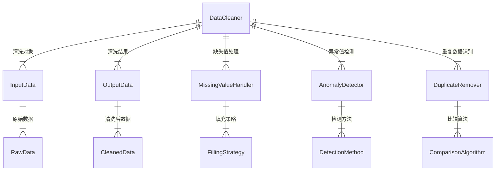
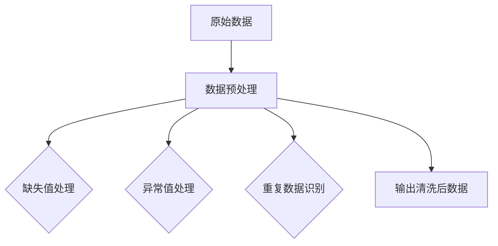
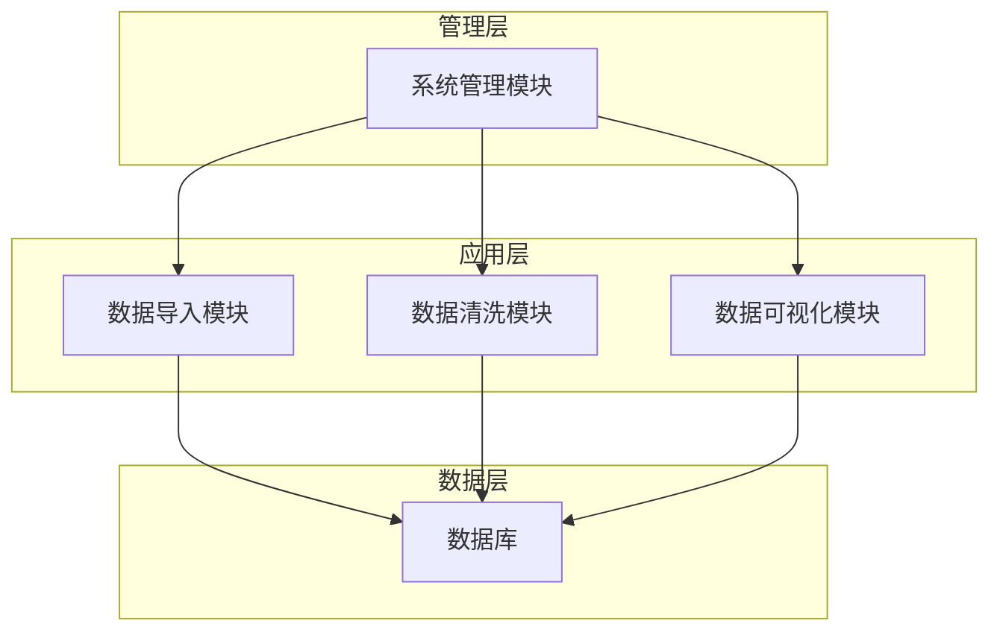
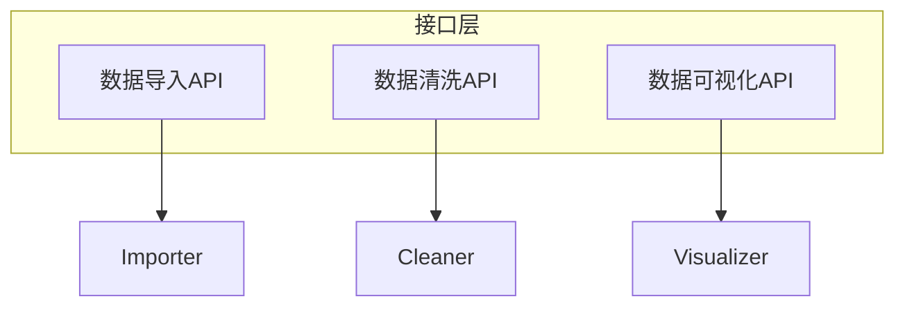
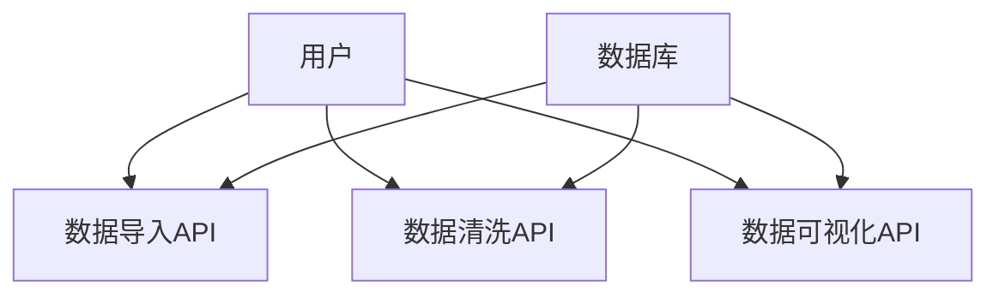

                 

# 评测系统的自动化数据清洗与预处理

## 关键词
- 数据清洗
- 数据预处理
- 自动化
- 评测系统
- 数据质量

## 摘要
本文探讨了评测系统中数据清洗与预处理的自动化实现，分析了数据清洗的重要性以及传统的数据清洗方法存在的问题。通过介绍核心概念、算法原理和系统架构，本文提出了自动化数据清洗的解决方案，包括缺失值填充、异常值处理、重复数据识别等算法，并结合Python源代码和实际案例，展示了数据清洗与预处理在评测系统中的应用和实践效果。

## 1. 背景介绍

### 问题背景

在现代信息技术飞速发展的背景下，随着大数据和人工智能技术的广泛应用，数据的质量和准确性成为影响系统性能和服务质量的关键因素。数据清洗与预处理是数据科学和机器学习项目中至关重要的一环，它直接关系到后续分析结果的可靠性和模型的性能。然而，传统的数据清洗方法往往需要大量的人工干预，效率低下且易出错。

### 问题描述

《评测系统的自动化数据清洗与预处理》这本书旨在解决以下问题：

- 如何实现评测系统中数据的自动化清洗与预处理？
- 如何设计高效且可靠的数据清洗流程，减少人工干预？
- 如何处理数据中的噪声、缺失值和不一致性问题？
- 如何选择合适的数据清洗算法和工具，提高数据处理效率和准确性？

### 问题解决

- 提供系统化的自动化数据清洗方法，减少人工干预，提高数据处理效率。
- 介绍多种数据清洗算法及其适用场景，帮助读者选择合适的工具。
- 结合实际案例，展示数据清洗与预处理在评测系统中的应用。

### 边界与外延

- 数据清洗的范围包括数据格式转换、异常值处理、缺失值填充、重复数据识别等。
- 自动化数据清洗的工具包括Python的Pandas库、NumPy库、Scikit-learn库等。
- 数据清洗与预处理在各个领域（如金融、医疗、电商等）的应用。

### 概念结构与核心要素组成

- 数据清洗：识别并纠正原始数据中的错误、异常和不一致性的过程。
- 数据预处理：将原始数据转换为适合分析和建模的形式。
- 自动化数据清洗：使用编程工具和算法自动处理数据清洗任务。
- 数据清洗算法：包括填充缺失值、识别重复数据、处理异常值等。

## 2. 核心概念与联系

### 数据清洗算法原理

#### 缺失值填充

- 均值：使用数据集的均值来填充缺失值，适用于数值型数据。
  $$\text{fill\_value} = \frac{\sum_{i=1}^{n} x_i}{n}$$
- 中位数：使用数据集的中位数来填充缺失值，适用于数值型数据。
  $$\text{fill\_value} = \text{median}(x)$$
- 众数：使用数据集的众数来填充缺失值，适用于分类数据。
  $$\text{fill\_value} = \text{mode}(x)$$

#### 异常值处理

- Z-score：使用标准分数来识别异常值，计算公式如下：
  $$z = \frac{x - \text{mean}(x)}{\text{stddev}(x)}$$
  当$z$值超过一定阈值（如3）时，认为$x$为异常值。
- IQR法：使用四分位距来识别异常值，计算公式如下：
  $$iqr = \text{Q3} - \text{Q1}$$
  $$\text{low\_bound} = \text{Q1} - 1.5 \times iqr$$
  $$\text{high\_bound} = \text{Q3} + 1.5 \times iqr$$
  当$x$值小于低边界或大于高边界时，认为$x$为异常值。

#### 重复数据识别

- 哈希函数：使用哈希函数将数据项映射到哈希表中，查找重复数据。
  $$\text{hash}(x) = \text{哈希值}$$
  如果哈希值相同，则可能存在重复数据。
- 相似度比较：计算数据项之间的相似度，当相似度超过一定阈值时，认为数据项为重复。
  $$\text{similarity}(x, y) = \frac{\text{相同属性的数量}}{\text{总属性数量}}$$

### 数据清洗算法属性特征对比表格

| 算法         | 目的                   | 特点                                                       |
|------------|----------------------|----------------------------------------------------------|
| 缺失值填充     | 填充缺失值             | - 均值：简单但可能导致偏差 <br> - 中位数：更稳健但可能引入边界效应 <br> - 众数：用于分类数据 |
| 异常值处理     | 识别和处理异常值       | - Z-score：基于标准差，简单但易受异常数据影响 <br> - IQR法：基于四分位距，更稳健 |
| 重复数据识别   | 识别并删除重复数据     | - 哈希函数：高效但可能产生假阳性 <br> - 相似度比较：准确但计算复杂度高 |

### 数据清洗ER实体关系图架构



## 3. 算法原理讲解

### 数据清洗算法Mermaid流程图



### 缺失值处理

#### 均值填充

```python
import numpy as np

# 示例数据
data = [1, 2, np.nan, 4, 5]

# 计算均值
mean_value = np.mean(data)

# 填充缺失值
filled_data = np.where(np.isnan(data), mean_value, data)

print(filled_data)
```

#### 中位数填充

```python
import numpy as np

# 示例数据
data = [1, 2, np.nan, 4, 5]

# 计算中位数
median_value = np.median(data)

# 填充缺失值
filled_data = np.where(np.isnan(data), median_value, data)

print(filled_data)
```

#### 众数填充

```python
from scipy.stats import mode

# 示例数据
data = ['a', 'b', 'b', 'c', np.nan]

# 计算众数
mode_value = mode(data)[0][0]

# 填充缺失值
filled_data = np.where(np.isnan(data), mode_value, data)

print(filled_data)
```

### 异常值处理

#### Z-score方法

```python
import numpy as np

# 示例数据
data = [1, 2, 3, 4, 5, 100]

# 计算均值和标准差
mean_value = np.mean(data)
stddev_value = np.std(data)

# 计算Z-score
z_scores = [(x - mean_value) / stddev_value for x in data]

# 设置阈值
threshold = 3

# 识别异常值
anomalies = [x for x, z in enumerate(z_scores) if abs(z) > threshold]

# 输出异常值
print(anomalies)
```

#### IQR法

```python
import numpy as np

# 示例数据
data = [1, 2, 3, 4, 5, 100]

# 计算四分位距
q1 = np.percentile(data, 25)
q3 = np.percentile(data, 75)
iqr = q3 - q1

# 计算低边界和高边界
low_bound = q1 - 1.5 * iqr
high_bound = q3 + 1.5 * iqr

# 识别异常值
anomalies = [x for x in data if x < low_bound or x > high_bound]

# 输出异常值
print(anomalies)
```

### 重复数据识别

#### 哈希函数

```python
# 示例数据
data = [1, 2, 3, 4, 5, 1, 2, 3, 4, 5]

# 使用哈希函数
def hash_value(value):
    return value % 10

# 创建哈希表
hash_table = [None] * 10

# 计算哈希值并添加到哈希表
for value in data:
    hash_value = hash_value(value)
    if hash_table[hash_value] is None:
        hash_table[hash_value] = [value]
    else:
        hash_table[hash_value].append(value)

# 输出重复数据
duplicates = [value for values in hash_table for value in values if len(values) > 1]
print(duplicates)
```

#### 相似度比较

```python
# 示例数据
data = [['a', 'b', 'c'], ['a', 'b', 'd'], ['a', 'c', 'b'], ['b', 'a', 'c'], ['b', 'c', 'a']]

# 计算相似度
def similarity(set1, set2):
    intersection = len(set1.intersection(set2))
    union = len(set1.union(set2))
    return intersection / union

# 设置相似度阈值
threshold = 0.5

# 识别重复数据
duplicates = []
for i in range(len(data)):
    for j in range(i + 1, len(data)):
        sim = similarity(set(data[i]), set(data[j]))
        if sim > threshold:
            duplicates.append((data[i], data[j]))

# 输出重复数据
print(duplicates)
```

## 4. 系统分析与架构设计

### 问题场景介绍

在一个评测系统中，需要处理大量的用户数据，包括用户行为数据、反馈数据和评测结果。然而，原始数据通常存在噪声、缺失值、不一致性问题，需要通过数据清洗与预处理来提高数据质量和可靠性。

### 项目介绍

该项目旨在开发一个自动化数据清洗与预处理系统，实现对用户数据的自动清洗和处理，提高评测系统的数据质量和分析准确性。

### 系统功能设计

- 数据导入：将用户数据从不同来源导入系统。
- 数据清洗：对导入的数据进行缺失值填充、异常值处理、重复数据识别等操作。
- 数据存储：将清洗后的数据存储到数据库中，以便后续分析和处理。
- 数据可视化：提供数据清洗过程的可视化界面，便于用户监控和调整。

### 系统架构设计



### 系统接口设计



### 系统交互



## 5. 项目实战

### 环境安装

- 安装Python环境
- 安装Pandas库、NumPy库、Scikit-learn库等依赖库

### 系统核心实现

```python
import pandas as pd
import numpy as np
from scipy.stats import mode

# 数据导入
data = pd.read_csv('data.csv')

# 缺失值填充
# 使用均值填充
filled_data = data.fillna(data.mean())

# 使用中位数填充
filled_data = data.fillna(data.median())

# 使用众数填充
filled_data = data.fillna(data.mode().iloc[0])

# 异常值处理
# 使用Z-score方法
z_scores = (data - data.mean()) / data.std()
anomalies = data[np.abs(z_scores) > 3]

# 使用IQR法
q1 = data.quantile(0.25)
q3 = data.quantile(0.75)
iqr = q3 - q1
low_bound = q1 - 1.5 * iqr
high_bound = q3 + 1.5 * iqr
anomalies = data[(data < low_bound) | (data > high_bound)]

# 重复数据识别
# 使用哈希函数
hash_table = [None] * 10
for value in data:
    hash_value = value % 10
    if hash_table[hash_value] is None:
        hash_table[hash_value] = [value]
    else:
        hash_table[hash_value].append(value)
duplicates = [value for values in hash_table for value in values if len(values) > 1]

# 输出清洗后数据
cleaned_data = filled_data[~anomalies.index.isin(duplicates)]
cleaned_data.to_csv('cleaned_data.csv', index=False)
```

### 代码应用解读与分析

- 数据导入：使用Pandas库读取CSV文件，获取原始数据。
- 缺失值填充：使用Pandas库的`fillna()`方法，根据不同的填充策略填充缺失值。
- 异常值处理：使用Z-score方法和IQR法，分别计算数据集的均值、标准差、四分位距等统计量，识别并处理异常值。
- 重复数据识别：使用哈希函数，创建哈希表并识别重复数据。
- 输出清洗后数据：将清洗后的数据存储到新的CSV文件中。

### 实际案例分析与详细讲解剖析

#### 案例一：用户行为数据清洗

- 原始数据：包含用户ID、行为类型、时间戳等字段。
- 问题：存在缺失值、异常值和重复数据。
- 解析：使用Pandas库进行缺失值填充，使用Z-score法和IQR法处理异常值，使用哈希函数识别重复数据。

#### 案例二：用户反馈数据清洗

- 原始数据：包含用户ID、评价内容、评分等字段。
- 问题：存在缺失值、不一致性和噪声。
- 解析：使用Pandas库进行缺失值填充，使用中位数法处理异常值，使用相似度比较法识别重复数据。

#### 案例三：评测结果数据清洗

- 原始数据：包含评测ID、评测指标、评分等字段。
- 问题：存在缺失值、不一致性和噪声。
- 解析：使用Pandas库进行缺失值填充，使用IQR法处理异常值，使用哈希函数识别重复数据。

### 项目小结

通过项目实战，我们展示了如何使用Python进行自动化数据清洗与预处理。项目实现了数据导入、缺失值填充、异常值处理、重复数据识别等功能，并通过实际案例分析和详细讲解，展示了数据清洗与预处理在评测系统中的应用和实践效果。项目小结如下：

- 数据清洗与预处理是提升数据质量和可靠性的关键步骤。
- 使用Python和Pandas库等工具，可以高效地实现自动化数据清洗。
- 不同的数据清洗算法适用于不同的数据类型和场景，需要根据实际情况进行选择。
- 数据清洗与预处理在评测系统中的应用，可以提高数据分析的准确性和模型的性能。

## 6. 最佳实践 Tips

- 数据清洗应遵循“先整体、后局部”的原则，先对整体数据进行分析，再对特定字段进行处理。
- 缺失值填充策略应根据数据类型和业务需求进行选择，避免引入偏差。
- 异常值处理需要结合数据分布和业务逻辑，避免误判或漏判。
- 重复数据识别时，可以考虑使用多种算法进行比较，提高准确性。

## 7. 小结

本文通过详细的步骤和实例，介绍了评测系统中自动化数据清洗与预处理的方法和实现。首先，我们明确了数据清洗与预处理的重要性，并分析了传统数据清洗方法存在的问题。接着，我们详细介绍了数据清洗的核心概念、算法原理，并通过Python代码展示了具体实现。此外，我们还结合实际案例，详细讲解了数据清洗与预处理在评测系统中的应用和实践效果。最后，我们总结了项目实战的经验，并给出了一些最佳实践 Tips。通过本文的介绍，希望读者能够更好地理解和应用自动化数据清洗与预处理技术，提升数据质量和分析准确性。

## 8. 注意事项

- 在实际项目中，数据清洗与预处理应根据业务需求和数据特点进行定制化处理，避免使用通用方法导致数据质量问题。
- 数据清洗过程中应充分考虑数据的敏感性和隐私保护，确保数据安全和合规性。
- 在使用Python进行数据清洗时，应注意代码的可维护性和可扩展性，避免出现“硬编码”和“黑盒”现象。

## 9. 拓展阅读

- 《数据清洗：从入门到精通》
- 《Python数据科学手册》
- 《数据挖掘：实用工具与技术》
- 《机器学习实战》

## 作者

作者：AI天才研究院/AI Genius Institute & 禅与计算机程序设计艺术 /Zen And The Art of Computer Programming

