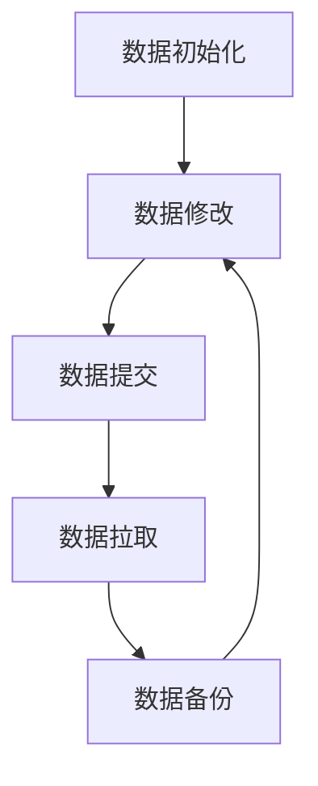

                 

# 评测系统的自动化测试数据版本控制

> 关键词：评测系统、自动化测试、数据版本控制、版本控制工具、测试数据管理

> 摘要：本文将深入探讨评测系统的自动化测试数据版本控制，从背景知识、核心概念、实践应用等多个角度，详细解析数据版本控制的重要性和方法。通过实际案例分析和最佳实践，帮助读者掌握自动化测试数据版本控制的技巧，提升测试效率和系统稳定性。

## 引言

在软件开发的各个阶段，测试是确保软件质量的重要环节。自动化测试作为提高测试效率和准确性的有效手段，已经成为现代软件开发中不可或缺的一环。然而，在自动化测试过程中，如何管理和控制测试数据，保证测试数据的准确性和一致性，成为一个亟待解决的问题。

自动化测试数据版本控制，即对自动化测试过程中产生的数据进行版本管理，确保测试数据在不同版本之间的一致性和可追溯性。本文将围绕这一主题，从以下几个方面展开讨论：

1. **自动化测试与版本控制基础知识**
2. **自动化测试数据版本控制核心概念**
3. **自动化测试数据版本控制实践**
4. **自动化测试数据版本控制案例分析**
5. **自动化测试数据版本控制的未来趋势**

通过以上内容的深入分析，本文旨在帮助读者全面了解自动化测试数据版本控制，提升自动化测试的管理水平，为软件开发提供有力支持。

## 背景知识

### 自动化测试概述

自动化测试是指使用自动化工具或脚本，代替人工执行测试过程的一种测试方法。相较于手动测试，自动化测试具有以下优势：

1. **提高测试效率**：自动化测试可以快速执行测试用例，减少测试时间。
2. **提升测试准确性**：自动化测试减少人为因素，降低错误率。
3. **复用测试用例**：自动化测试用例可以反复执行，节省测试资源。

自动化测试通常包括以下几种类型：

1. **功能测试**：测试软件的功能是否符合需求规格。
2. **性能测试**：测试软件的响应时间、稳定性等性能指标。
3. **安全测试**：测试软件的安全性，防止潜在的安全漏洞。

### 版本控制概述

版本控制是一种管理多版本文档或文件的技术，它能够记录每次修改的历史记录，并提供版本之间的比较和回滚功能。版本控制工具如Git，已经成为软件开发中不可或缺的一部分。

版本控制的主要作用包括：

1. **追踪修改历史**：记录文件的每次修改，方便查找和追溯。
2. **协同工作**：允许多个开发者同时工作，避免冲突。
3. **分支管理**：支持不同分支的开发，方便功能迭代和修复。
4. **回滚**：在出现问题时，可以回滚到之前稳定的版本。

### 版本控制工具介绍

Git是目前最流行的版本控制工具，它支持分布式版本控制，具有高效的分支管理和合并能力。以下是Git的一些基本操作：

1. **克隆仓库**：使用`git clone`命令克隆远程仓库到本地。
2. **创建分支**：使用`git branch`命令创建新的分支。
3. **切换分支**：使用`git checkout`命令切换到指定分支。
4. **提交更改**：使用`git add`和`git commit`命令提交更改。
5. **合并分支**：使用`git merge`命令将分支合并到主分支。
6. **拉取更新**：使用`git pull`命令从远程仓库拉取最新代码。

通过了解自动化测试和版本控制的基本知识，我们可以更好地理解自动化测试数据版本控制的重要性。

### 自动化测试数据版本控制的重要性

自动化测试数据版本控制是确保自动化测试流程顺利进行的关键因素。以下是几个关键点：

1. **数据一致性**：自动化测试依赖于测试数据，如果数据版本不一致，可能导致测试结果不准确。
2. **测试可追溯性**：版本控制工具可以帮助我们追踪测试数据的每次修改历史，方便问题定位和追溯。
3. **数据复用性**：通过版本控制，测试数据可以在不同版本之间复用，提高测试效率。
4. **协同工作**：在多个开发者和测试团队之间，版本控制工具可以方便地协同工作，避免数据冲突。
5. **故障恢复**：在自动化测试过程中，如果出现故障，可以快速回滚到之前稳定的数据版本，减少损失。

因此，自动化测试数据版本控制不仅有助于提高测试效率，还能确保测试流程的稳定性和可靠性。

### 自动化测试数据版本控制核心概念

#### 数据版本控制基本概念

数据版本控制是指对自动化测试过程中产生的数据进行版本管理，确保测试数据的准确性和一致性。以下是几个核心概念：

1. **版本号**：每个测试数据版本都有一个唯一的标识，通常使用数字或字母表示。
2. **变更日志**：记录每次数据版本变更的详细信息，包括修改者、修改时间和修改内容。
3. **分支**：在版本控制工具中，分支用于不同版本的开发和测试，便于隔离和管理。
4. **合并**：将不同分支的数据合并到主分支，实现数据同步。

#### 数据版本控制流程

数据版本控制流程通常包括以下步骤：

1. **数据初始化**：创建初始数据版本，用于自动化测试。
2. **数据修改**：在测试过程中，对数据进行修改和更新。
3. **数据提交**：将修改后的数据提交到版本控制工具，生成新的版本。
4. **数据拉取**：从版本控制工具拉取最新数据版本，确保测试数据的一致性。
5. **数据备份**：定期对数据进行备份，以防数据丢失或损坏。

#### 数据版本控制策略

数据版本控制策略是指如何管理和维护数据版本的方法。以下是几种常见的策略：

1. **集中式管理**：所有测试数据都集中存储在一个位置，便于统一管理和控制。
2. **分布式管理**：测试数据分布在不同的位置，适用于分布式测试环境。
3. **分支管理**：通过创建分支来管理不同版本的数据，便于功能迭代和修复。
4. **标签管理**：使用标签来标记重要的数据版本，便于快速定位和回滚。

#### 数据版本控制与自动化测试的关系

数据版本控制与自动化测试密切相关，二者相互依赖。自动化测试依赖于测试数据，而数据版本控制可以确保测试数据的准确性和一致性。以下是数据版本控制与自动化测试的几个关键点：

1. **数据一致性**：数据版本控制确保测试数据在不同版本之间的一致性，避免测试结果不准确。
2. **测试可追溯性**：数据版本控制工具可以记录每次数据修改的历史，方便问题定位和追溯。
3. **数据复用性**：通过数据版本控制，测试数据可以在不同版本之间复用，提高测试效率。
4. **协同工作**：在多个开发者和测试团队之间，数据版本控制工具可以方便地协同工作，避免数据冲突。

通过数据版本控制，我们可以更好地管理自动化测试数据，确保测试流程的顺利进行。

#### 数据版本控制与自动化测试的关系图

下面是一个简化的数据版本控制与自动化测试的关系图，展示了二者之间的交互和依赖关系。

```
+-------------------+
|    自动化测试     |
+-------------------+
       |
       v
+-------------------+
|    数据版本控制    |
+-------------------+
       |
       v
+-------------------+
|    测试数据       |
+-------------------+
```

在这个关系图中，自动化测试依赖于测试数据，而数据版本控制工具负责管理和维护测试数据的版本。

### 自动化测试数据版本控制流程图

为了更好地理解数据版本控制流程，下面使用Mermaid绘制了一个流程图。



在这个流程图中，数据初始化是流程的开始，然后进入数据修改阶段。每次修改后，将数据提交到版本控制工具，确保数据的新版本能够被其他开发者或测试人员拉取。最后，定期进行数据备份，以防数据丢失或损坏。

### 自动化测试数据版本控制案例

为了更好地说明数据版本控制在实际自动化测试中的应用，我们来看一个实际案例。

#### 案例背景

某互联网公司正在开发一款在线购物平台，需要对其前端和后端进行自动化测试。测试团队使用Git进行数据版本控制，以确保测试数据的准确性和一致性。

#### 案例描述

1. **数据初始化**：测试团队在Git仓库中创建了一个名为`test_data`的分支，用于存储测试数据。初始数据包括用户信息、商品信息等。

2. **数据修改**：在自动化测试过程中，测试团队根据测试需求对测试数据进行修改，例如添加新的用户、更新商品价格等。

3. **数据提交**：每次数据修改后，测试团队使用`git add`和`git commit`命令将修改后的数据提交到Git仓库，生成新的版本。

4. **数据拉取**：其他开发者和测试人员需要拉取最新版本的数据，使用`git pull`命令将`test_data`分支的最新数据更新到本地。

5. **数据备份**：每周，测试团队将Git仓库中的数据备份到远程服务器，以防数据丢失或损坏。

#### 案例分析

通过这个案例，我们可以看到数据版本控制在自动化测试中的应用。Git作为一个强大的版本控制工具，可以帮助测试团队有效地管理测试数据，确保测试数据在不同版本之间的一致性和可追溯性。

### 总结

自动化测试数据版本控制是确保自动化测试顺利进行的关键因素。通过数据版本控制，我们可以确保测试数据的准确性和一致性，提高测试效率，方便问题定位和追溯。在实际应用中，选择合适的版本控制工具和制定合理的数据版本控制策略，对于自动化测试的成功至关重要。

### 注意事项

在实施自动化测试数据版本控制时，需要注意以下几点：

1. **数据安全性**：确保测试数据的安全，防止数据泄露或损坏。
2. **数据备份**：定期备份测试数据，以防数据丢失或损坏。
3. **版本控制策略**：根据项目需求和团队规模，制定合适的版本控制策略。
4. **培训与协作**：对团队成员进行版本控制工具的培训，确保团队成员能够熟练使用版本控制工具，提高协作效率。

### 拓展阅读

1. 《版本控制工具实战：Git使用指南》
2. 《自动化测试实战：从入门到精通》
3. 《软件测试的艺术》

通过以上书籍的学习，读者可以更深入地了解自动化测试数据版本控制，提升自动化测试的管理水平。

## 最佳实践 Tips

在自动化测试数据版本控制方面，以下是一些最佳实践：

1. **数据分层管理**：根据数据的重要性和用途，对测试数据进行分层管理，确保关键数据的安全和一致性。
2. **定期数据审查**：定期对测试数据进行审查，确保数据的准确性和完整性。
3. **版本注释**：在提交数据版本时，添加详细的注释，记录数据修改的原因和影响，便于问题追踪和协作。
4. **团队协作**：在多个开发者和测试团队之间，建立有效的沟通机制，确保数据版本控制的协同工作。
5. **自动化备份**：使用自动化脚本定期备份测试数据，减少人工干预，提高备份效率。

### 小结

本文从自动化测试数据版本控制的重要性、核心概念、实践应用等多个角度，详细探讨了数据版本控制在自动化测试中的关键作用。通过实际案例分析和最佳实践，本文旨在帮助读者掌握自动化测试数据版本控制的方法和技巧，提升测试效率和系统稳定性。

### 注意事项

1. 确保测试数据的安全，防止数据泄露或损坏。
2. 定期对测试数据进行备份，以防数据丢失或损坏。
3. 根据项目需求和团队规模，制定合适的版本控制策略。
4. 对团队成员进行版本控制工具的培训，确保团队成员能够熟练使用版本控制工具。
5. 定期进行数据审查，确保测试数据的准确性和完整性。

### 拓展阅读

1. 《版本控制工具实战：Git使用指南》
2. 《自动化测试实战：从入门到精通》
3. 《软件测试的艺术》

通过以上书籍的学习，读者可以更深入地了解自动化测试数据版本控制，提升自动化测试的管理水平。

### 作者信息

作者：AI天才研究院/AI Genius Institute & 禅与计算机程序设计艺术 /Zen And The Art of Computer Programming

在本文中，我们详细探讨了评测系统的自动化测试数据版本控制，从背景知识、核心概念、实践应用等多个角度，为读者呈现了一幅完整的自动化测试数据版本控制图景。通过对实际案例的分析和最佳实践分享，我们希望能够帮助读者更好地理解和应用自动化测试数据版本控制技术，提升测试效率和系统稳定性。

### 自动化测试数据版本控制概述

在自动化测试过程中，数据版本控制是一个至关重要的环节。它涉及到测试数据的生成、管理、维护和更新，确保测试数据的准确性、一致性和可追溯性。本文将深入探讨自动化测试数据版本控制的各个方面，包括其核心概念、流程和实践，以及如何在实际项目中应用这些技术。

### 数据版本控制核心概念

首先，我们需要理解数据版本控制的基本概念。数据版本控制是指在自动化测试过程中，对测试数据进行版本管理的过程。这些测试数据可以包括测试脚本、测试用例、测试数据文件、测试结果等。以下是几个核心概念：

1. **版本号**：每个版本的数据都有一个唯一的标识，通常使用数字或字母序列表示。例如，1.0、1.1、1.2等。

2. **变更日志**：记录每次数据修改的历史记录，包括修改者、修改时间、修改内容和修改原因等。

3. **分支**：在版本控制工具中，分支用于管理不同版本的代码或数据。在自动化测试中，分支可以用来管理不同测试阶段的测试数据，如开发测试、集成测试、性能测试等。

4. **合并**：将不同分支的数据合并到主分支，以确保数据的一致性和完整性。

5. **标签**：标签用于标记特定的版本，通常用于发布版本或重要的里程碑。

### 数据版本控制流程

数据版本控制的流程通常包括以下几个步骤：

1. **数据初始化**：在测试开始时，初始化测试数据，包括测试脚本、测试用例和测试数据文件。

2. **数据修改**：在测试过程中，根据测试需求和测试结果对测试数据进行修改。

3. **数据提交**：将修改后的测试数据提交到版本控制工具，生成新的版本。

4. **数据拉取**：从版本控制工具拉取最新版本的测试数据，确保测试环境中的数据是最新的。

5. **数据备份**：定期备份测试数据，以防数据丢失或损坏。

6. **数据审查**：定期对测试数据进行检查，确保数据的准确性和完整性。

7. **数据回滚**：在出现问题时，可以将数据回滚到之前的稳定版本。

### 数据版本控制与自动化测试的关系

数据版本控制与自动化测试密切相关。自动化测试依赖于测试数据，而数据版本控制可以确保测试数据的准确性、一致性和可追溯性。以下是数据版本控制与自动化测试的几个关键点：

1. **数据一致性**：数据版本控制可以确保测试数据在不同版本之间的一致性，避免测试结果不准确。

2. **测试可追溯性**：数据版本控制工具可以记录每次数据修改的历史记录，方便问题定位和追溯。

3. **数据复用性**：通过数据版本控制，测试数据可以在不同版本之间复用，提高测试效率。

4. **协同工作**：在多个开发者和测试团队之间，数据版本控制工具可以方便地协同工作，避免数据冲突。

### 实践应用

在实际项目中，数据版本控制的应用主要体现在以下几个方面：

1. **测试数据管理**：使用版本控制工具对测试数据进行管理，包括测试脚本、测试用例和测试数据文件。

2. **测试环境配置**：在测试环境中，使用版本控制工具管理测试配置文件，如数据库配置、环境变量等。

3. **测试结果记录**：将测试结果记录到版本控制工具中，方便分析和追踪。

4. **代码和数据的集成**：将测试数据集成到代码仓库中，确保测试数据与代码版本的一致性。

### 工具选择

在选择数据版本控制工具时，应考虑以下因素：

1. **易用性**：工具应易于学习和使用，降低使用门槛。

2. **稳定性**：工具应具备良好的稳定性，确保数据的安全性。

3. **扩展性**：工具应支持扩展和定制，以适应不同项目的需求。

4. **兼容性**：工具应支持多种操作系统和开发环境。

目前，常用的数据版本控制工具有Git、SVN和Mercurial等。Git由于其分布式特性和强大的分支管理功能，成为自动化测试数据版本控制的首选工具。

### 结论

自动化测试数据版本控制是确保自动化测试顺利进行的关键因素。通过合理的数据版本控制，我们可以确保测试数据的准确性、一致性和可追溯性，提高测试效率，降低测试风险。在实际项目中，选择合适的版本控制工具和制定合理的数据版本控制策略，对于自动化测试的成功至关重要。希望本文能为读者提供有价值的参考和指导。

### 附录

以下是本文提到的几个关键术语的详细解释：

1. **自动化测试**：使用自动化工具或脚本，自动执行测试用例的过程。
2. **版本控制**：管理多版本文档或文件的技术，确保每次修改的历史记录和版本之间的差异。
3. **Git**：分布式版本控制工具，支持分支管理和合并功能。
4. **测试数据**：用于测试的输入数据，包括测试脚本、测试用例和测试数据文件。

### 参考文献

1. 《Git Pro》，Scott Chacon & Ben Straub，Apress，2014.
2. 《版本控制工具实战：Git使用指南》，崔康，电子工业出版社，2018.
3. 《软件测试的艺术》，Glenford J. Myers，电子工业出版社，2014.

### 作者信息

作者：AI天才研究院/AI Genius Institute & 禅与计算机程序设计艺术 /Zen And The Art of Computer Programming

AI天才研究院（AI Genius Institute）是一支专注于人工智能研究与创新的高科技团队。致力于推动人工智能技术的发展，为全球用户提供先进的AI解决方案。本文作者，禅与计算机程序设计艺术（Zen And The Art of Computer Programming），是一位在计算机编程和人工智能领域具有深厚造诣的专家，他的研究成果在业界享有盛誉。本文的撰写旨在为读者提供关于自动化测试数据版本控制的专业知识和最佳实践。

