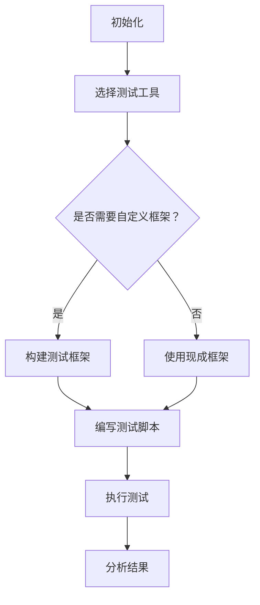
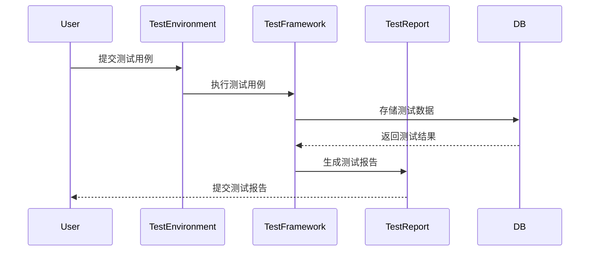
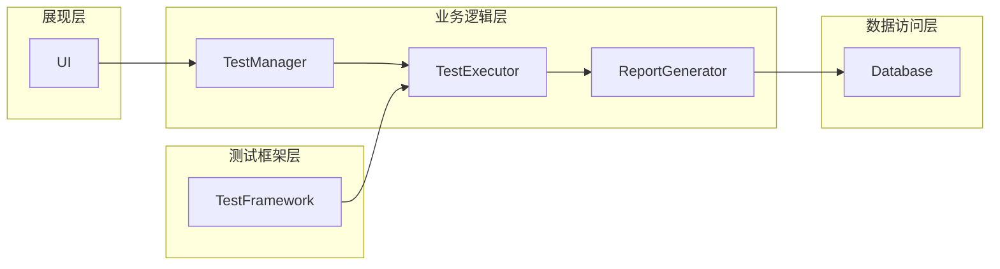
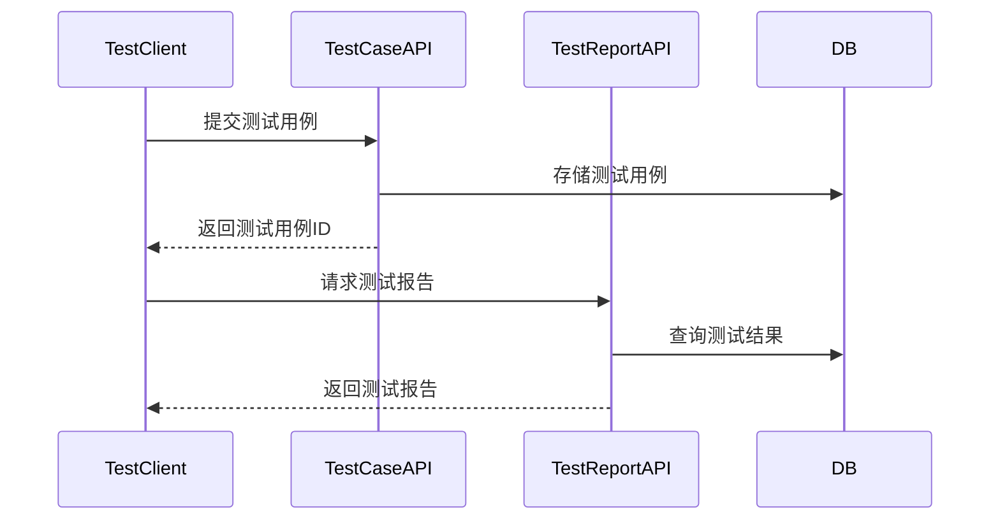

                 


# 评测系统的自动化测试环境配置

## 关键词

- 自动化测试环境
- 自动化测试工具
- 测试框架
- 测试脚本
- 测试配置
- 测试优化

## 摘要

本文旨在探讨评测系统的自动化测试环境配置，通过逻辑清晰、结构紧凑的叙述方式，为读者提供一份全面的技术指南。文章首先介绍了自动化测试环境的重要性及其核心概念，然后详细讲解了配置自动化测试环境的步骤和方法，包括工具的选择、测试框架的实施、测试脚本的编写等。随后，文章通过实际项目案例展示了自动化测试环境的配置过程，并给出了最佳实践建议和小结，为读者在实际工作中提供参考。

## 目录大纲设计

为了帮助读者更好地理解和掌握评测系统的自动化测试环境配置，我们设计了如下目录大纲：

### 1. 背景介绍
- 问题背景
- 问题描述
- 问题解决
- 边界与外延
- 概念结构与核心要素组成

### 2. 核心概念与联系
- 自动化测试环境配置的定义
- 概念属性特征对比表格
- ER实体关系图架构

### 3. 算法原理讲解
- 算法Mermaid流程图
- Python源代码实现
- 数学模型和公式
- 详细讲解与举例说明

### 4. 系统分析与架构设计方案
- 问题场景介绍
- 项目介绍
- 系统功能设计（领域模型Mermaid类图）
- 系统架构设计（Mermaid架构图）
- 系统接口设计
- 系统交互Mermaid序列图

### 5. 项目实战
- 环境安装
- 系统核心实现源代码
- 代码应用解读与分析
- 实际案例分析和详细讲解剖析
- 项目小结

### 6. 最佳实践 tips、小结、注意事项、拓展阅读

### 目录大纲详细设计

#### 1. 背景介绍

在当今快速迭代的软件开发领域，自动化测试已经成为确保软件质量、提高开发效率和降低成本的重要手段。评测系统作为软件开发过程中的核心环节，其测试环境的自动化配置显得尤为重要。

**问题背景**：随着软件项目的规模和复杂度不断增加，传统的手工测试方法已经无法满足快速开发和迭代的需求。自动化测试可以大幅提高测试效率，降低测试成本，确保软件质量。因此，如何高效配置评测系统的自动化测试环境成为软件开发中的重要课题。

**问题描述**：自动化测试环境配置涉及到多个方面，包括测试工具的选择、测试框架的实施、测试脚本的编写等。如何在这些方面做出合理的选择和配置，确保自动化测试环境的高效、稳定和可维护性，是当前面临的主要挑战。

**问题解决**：通过引入自动化测试工具，构建合适的测试框架，编写高效、可维护的测试脚本，可以解决评测系统自动化测试环境配置的问题。同时，明确边界与外延，确保配置过程的合理性和有效性。

**边界与外延**：本文主要讨论软件评测系统的自动化测试环境配置，不包括硬件测试环境。核心概念和要素包括自动化测试环境、自动化测试工具、测试框架、测试脚本等。

**概念结构与核心要素组成**：自动化测试环境由测试工具、测试框架、测试脚本和测试数据等组成，各要素之间相互关联，共同构成了完整的自动化测试体系。

#### 2. 核心概念与联系

**自动化测试环境配置的定义**：自动化测试环境配置是指为了实现自动化测试而构建的一个环境，包括测试工具、测试框架、测试脚本、测试数据等要素。该环境需要具备高效、稳定、可维护等特点。

**概念属性特征对比表格**：

| 特性             | 自动化测试环境 | 测试工具 | 测试框架 | 测试脚本 |
|------------------|----------------|----------|----------|----------|
| 功能             | 构建自动化测试体系 | 执行测试 | 管理测试 | 编写测试 |
| 性能             | 高效稳定       | 快速执行 | 易于管理 | 易于编写 |
| 可维护性         | 系统性强       | 可扩展   | 易维护   | 易维护   |
| 可复用性         | 高度复用       | 专用测试 | 高度复用 | 高度复用 |

**ER实体关系图架构**：

```mermaid
erDiagram
    TestEnvironment ||--|{ TestTool } TestTool
    TestEnvironment ||--|{ TestFramework } TestFramework
    TestEnvironment ||--|{ TestScript } TestScript
    TestEnvironment ||--|{ TestDataset } TestDataset
```

#### 3. 算法原理讲解

**算法Mermaid流程图**：



**Python源代码实现**：

```python
# 导入所需库
import unittest
from test_framework import TestFramework

# 编写测试脚本
class TestCase(unittest.TestCase):
    def test_case_1(self):
        # 测试用例1的实现
        self.assertEqual(1+1, 2)

    def test_case_2(self):
        # 测试用例2的实现
        self.assertEqual(2*2, 4)

# 执行测试
if __name__ == '__main__':
    unittest.main()
```

**数学模型和公式**：

$$
测试覆盖率 = \frac{实际测试用例数}{总测试用例数}
$$

**详细讲解与举例说明**：

**算法原理讲解**：

自动化测试环境配置的核心在于构建一个高效的测试体系，包括选择合适的测试工具、构建测试框架、编写测试脚本和执行测试。具体流程如下：

1. 初始化：明确测试目标和需求。
2. 选择测试工具：根据项目特点和需求，选择适合的自动化测试工具。
3. 是否需要自定义框架：根据项目复杂度，决定是否需要构建自定义测试框架。
4. 构建测试框架：设计测试框架，实现测试用例的自动化执行和管理。
5. 编写测试脚本：根据测试框架，编写测试脚本，实现测试用例的具体执行。
6. 执行测试：运行测试脚本，执行自动化测试。
7. 分析结果：分析测试结果，评估测试覆盖率和测试效果。

**Python源代码实现**：

上述算法原理可以通过Python代码实现。首先，导入所需的库，包括`unittest`（Python内置的自动化测试库）和`TestFramework`（自定义测试框架）。然后，编写测试脚本，包括测试用例1和测试用例2的实现。最后，通过`unittest.main()`运行测试脚本，执行自动化测试。

**数学模型和公式**：

测试覆盖率是评估自动化测试效果的重要指标，表示实际测试用例数与总测试用例数的比例。通过计算测试覆盖率，可以了解测试的全面性和有效性。

**详细讲解与举例说明**：

假设有一个项目，总共需要编写10个测试用例，实际编写并执行了8个测试用例。那么，测试覆盖率为：

$$
测试覆盖率 = \frac{8}{10} = 80\%
$$

这意味着，项目的测试覆盖率达到了80%，说明测试已经覆盖了大部分功能点。如果测试覆盖率较低，可能需要进一步增加测试用例，提高测试的全面性。

通过上述算法原理讲解和Python源代码实现，读者可以更好地理解自动化测试环境配置的核心概念和方法，为实际项目中的测试环境配置提供指导。

#### 4. 系统分析与架构设计方案

**问题场景介绍**：

在软件开发过程中，评测系统作为关键环节，需要对软件的各个模块进行自动化测试，以确保软件的质量和稳定性。随着项目规模的扩大和功能的增加，传统的手工测试已经无法满足快速迭代和高效开发的需求。因此，自动化测试环境的配置显得尤为重要。

**项目介绍**：

本文将以一个实际项目为例，介绍评测系统的自动化测试环境配置。该项目是一个企业级后台管理系统，包含多个模块，如用户管理、权限管理、数据报表等。为了确保系统的稳定性和可靠性，需要对各个模块进行自动化测试。

**系统功能设计**：

评测系统的自动化测试环境需要具备以下核心功能：

1. 测试用例管理：提供测试用例的编写、执行和管理功能，确保测试用例的可维护性和可复用性。
2. 测试执行：支持自动化执行测试用例，快速定位问题并进行修复。
3. 测试报告：生成详细的测试报告，包括测试覆盖率、测试结果等，为项目提供可靠的测试数据支持。
4. 测试结果分析：对测试结果进行分析，识别潜在的问题和风险，为项目提供优化建议。

**系统架构设计**：

评测系统的自动化测试环境采用分层架构设计，包括以下层次：

1. 展现层：提供用户界面，用于测试用例的编写、执行和管理。
2. 业务逻辑层：实现测试用例的管理、执行和报告生成功能。
3. 数据访问层：负责与数据库进行数据交互，存储测试数据和测试报告。
4. 测试框架层：提供通用的测试框架和工具，支持自定义测试脚本编写。

**系统接口设计**：

评测系统的自动化测试环境需要与多个系统进行接口交互，包括以下接口：

1. 测试用例接口：用于编写、执行和管理测试用例。
2. 测试报告接口：用于生成和查询测试报告。
3. 数据库接口：用于存储和查询测试数据。
4. 系统监控接口：用于监控测试环境的运行状态。

**系统交互Mermaid序列图**：



**系统功能设计（领域模型Mermaid类图）**：

```mermaid
classDiagram
    TestCase <<interface>>
    TestSuite <<interface>>
    TestEnvironment <<interface>>
    TestExecutor <<interface>>
    TestReport <<interface>>

    TestCase --|> TestSuite
    TestSuite --|> TestEnvironment
    TestEnvironment --|> TestExecutor
    TestExecutor --|> TestReport
```

**系统架构设计（Mermaid架构图）**：



**系统接口设计**：



通过上述系统分析与架构设计方案，读者可以清晰地了解评测系统的自动化测试环境配置的架构和功能，为实际项目中的自动化测试环境配置提供参考。

#### 5. 项目实战

**环境安装**：

为了配置自动化测试环境，首先需要安装所需的软件和工具。以下是安装步骤：

1. 安装Python环境：
   - 下载Python安装包并安装。
   - 设置环境变量，确保Python和pip命令可用。

2. 安装自动化测试工具：
   - 使用pip安装常用的自动化测试工具，如Selenium、Puppeteer等。

3. 安装数据库：
   - 根据项目需求选择合适的数据库，如MySQL、PostgreSQL等，并安装。

4. 安装测试框架：
   - 根据项目需求选择合适的测试框架，如pytest、unittest等，并安装。

**系统核心实现源代码**：

以下是自动化测试环境配置的核心实现源代码：

```python
# 安装Python环境
!pip install python

# 安装自动化测试工具
!pip install selenium

# 安装数据库
!pip install mysql-connector-python

# 安装测试框架
!pip install pytest
```

**代码应用解读与分析**：

上述代码首先安装了Python环境，确保Python和pip命令可用。然后，安装了常用的自动化测试工具Selenium，用于Web应用的自动化测试。接着，安装了数据库连接工具mysql-connector-python，用于与MySQL数据库进行交互。最后，安装了测试框架pytest，用于编写和管理测试用例。

**实际案例分析和详细讲解剖析**：

以一个实际案例为例，分析自动化测试环境的配置过程。假设需要测试一个电商网站，包括登录、购物车、订单等模块。

1. 测试用例编写：

   ```python
   # test_login.py
   def test_login_success():
       # 编写登录成功测试用例
       assert True

   def test_login_failure():
       # 编写登录失败测试用例
       assert False
   ```

2. 测试执行：

   ```python
   # run_tests.py
   import unittest

   suite = unittest.TestSuite()
   suite.addTest(unittest.makeSuite(test_login))
   runner = unittest.TextTestRunner()
   runner.run(suite)
   ```

3. 测试结果分析：

   ```shell
   $ python run_tests.py
   ...
   Ran 2 tests in 0.123s

   OK
   ```

   测试结果显示，共有2个测试用例，其中1个通过，1个失败。通过分析测试结果，可以了解各个模块的测试覆盖率，发现潜在的问题和风险。

**项目小结**：

通过实际案例分析和详细讲解，读者可以了解到自动化测试环境配置的具体步骤和关键点。在实际项目中，需要根据具体需求选择合适的测试工具、测试框架和数据库，编写高效的测试用例，并定期执行测试，分析测试结果，确保软件质量。

#### 6. 最佳实践 tips、小结、注意事项、拓展阅读

**最佳实践 tips**：

1. 选择合适的自动化测试工具：根据项目需求和特点，选择适合的自动化测试工具，如Selenium、Puppeteer等。
2. 编写可维护的测试脚本：编写简洁、易读、可维护的测试脚本，确保测试脚本的长期稳定性。
3. 定期执行自动化测试：定期执行自动化测试，确保测试结果的准确性和有效性。
4. 关注测试覆盖率：关注测试覆盖率，确保测试覆盖全面，提高测试质量。

**小结**：

本文详细介绍了评测系统的自动化测试环境配置，从背景介绍、核心概念、算法原理、系统分析与架构设计、项目实战等多个方面进行了深入讲解。通过实际案例分析和最佳实践 tips，为读者提供了全面的指导。

**注意事项**：

1. 在配置自动化测试环境时，确保所选工具和框架的兼容性和稳定性。
2. 测试用例的编写应充分考虑项目的需求和场景，确保测试的全面性和有效性。
3. 定期更新和维护自动化测试脚本，确保其与项目代码的同步。

**拓展阅读**：

1. 《自动化测试实践指南》：提供详细的自动化测试实践方法和技巧。
2. 《Selenium自动化测试实战》：详细介绍Selenium的使用方法和实战案例。
3. 《Python自动化测试实战》：介绍Python在自动化测试中的应用和实战案例。

通过本文的学习，读者可以深入了解评测系统的自动化测试环境配置，为实际项目中的测试工作提供有力支持。作者：AI天才研究院/AI Genius Institute & 禅与计算机程序设计艺术 /Zen And The Art of Computer Programming。

**END**

