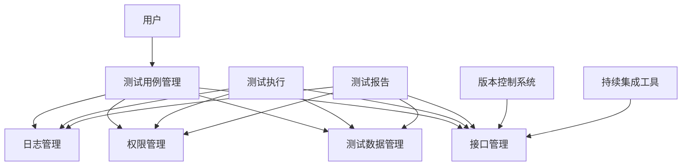
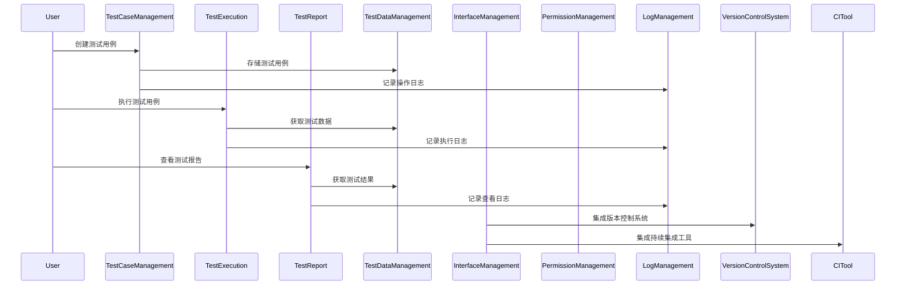

                 

# 评测系统的自动化测试用例管理

> 关键词：自动化测试、测试用例管理、评测系统、测试脚本、测试执行

> 摘要：本文深入探讨了评测系统中的自动化测试用例管理，从背景介绍、核心概念与联系、算法原理讲解、系统分析与架构设计方案、项目实战到最佳实践 tips，全面剖析了自动化测试用例管理的方方面面，为读者提供了一套系统、实用的自动化测试用例管理方案。

----------------------------------------------------------------

## 目录大纲设计思路

在设计《评测系统的自动化测试用例管理》的目录大纲时，我们首先明确了书籍的主要目标和内容结构。本书旨在为读者提供一套全面、系统的自动化测试用例管理方案，涵盖自动化测试用例的创建、管理、执行和报告等各个环节。因此，目录大纲的设计将围绕以下几个核心部分展开：

1. **背景介绍**：介绍自动化测试用例管理的背景、意义以及当前面临的主要挑战。
2. **核心概念与联系**：阐述自动化测试用例管理中涉及的关键概念，包括测试用例、测试计划、测试脚本、测试执行等，并使用表格和图形展示这些概念之间的关系。
3. **算法原理讲解**：详细解释自动化测试用例管理中的算法原理，包括测试用例的设计算法、执行算法等，使用Mermaid流程图和Python代码来展示。
4. **系统分析与架构设计方案**：分析评测系统的整体架构，包括功能模块划分、系统接口设计和系统交互流程等，并使用Mermaid类图和架构图来辅助说明。
5. **项目实战**：通过一个具体的自动化测试用例管理项目，详细介绍项目环境搭建、核心实现和案例分析。
6. **最佳实践 tips**：总结自动化测试用例管理的最佳实践，包括工具选择、团队协作、测试用例的持续集成等。
7. **小结、注意事项和拓展阅读**：对全书内容进行总结，指出注意事项，并提供拓展阅读建议。

### 目录大纲结构

以下是根据上述设计思路，设计出的《评测系统的自动化测试用例管理》的目录大纲：

```
# 第一部分：自动化测试用例管理概述

## 第1章：自动化测试用例管理背景

### 1.1 自动化测试的意义与挑战

### 1.2 自动化测试用例管理的必要性

### 1.3 自动化测试用例管理的挑战

## 第2章：核心概念与联系

### 2.1 测试用例、测试计划和测试脚本

### 2.2 自动化测试用例管理中的关键概念

#### 2.2.1 测试用例与测试计划的联系

#### 2.2.2 测试脚本与测试用例的关系

## 第3章：算法原理讲解

### 3.1 测试用例设计算法

#### 3.1.1 基于边界值的测试用例设计

#### 3.1.2 基于等价类的测试用例设计

### 3.2 测试用例执行算法

#### 3.2.1 测试用例的执行流程

#### 3.2.2 测试用例执行结果的判断

## 第4章：系统分析与架构设计方案

### 4.1 评测系统的功能模块划分

### 4.2 系统架构设计

#### 4.2.1 系统接口设计

#### 4.2.2 系统交互流程

## 第5章：项目实战

### 5.1 自动化测试用例管理项目环境搭建

#### 5.1.1 环境准备

#### 5.1.2 工具选择与安装

### 5.2 系统核心实现

#### 5.2.1 测试用例的创建与管理

#### 5.2.2 测试脚本的编写与执行

### 5.3 自动化测试用例案例分析

#### 5.3.1 项目背景

#### 5.3.2 测试用例设计与执行

#### 5.3.3 测试结果分析与报告

## 第6章：最佳实践 tips

### 6.1 自动化测试工具的选择

### 6.2 团队协作与沟通

### 6.3 测试用例的持续集成

## 第7章：小结与展望

### 7.1 全书总结

### 7.2 注意事项

### 7.3 拓展阅读

```

### 目录大纲的具体内容

在确定了目录大纲的结构后，接下来将详细描述每个章节的具体内容。

## 第1章：自动化测试用例管理背景

### 1.1 自动化测试的意义与挑战

自动化测试作为一种高效、可靠的测试方法，在现代软件开发生命周期中扮演着至关重要的角色。它不仅能提高测试效率，减少测试成本，还能确保软件质量，降低维护难度。然而，自动化测试也面临着一系列挑战，如测试用例的设计、执行效率、维护成本等。本章将介绍自动化测试的基本概念和重要性，探讨自动化测试用例管理在软件开发生命周期中的关键作用。

### 1.2 自动化测试用例管理的必要性

自动化测试用例管理是自动化测试的重要组成部分，它负责测试用例的创建、管理、执行和报告等环节。有效的自动化测试用例管理不仅能提高测试效率，还能确保测试过程的规范性和一致性。本章将详细阐述自动化测试用例管理的必要性，包括提高测试效率、确保软件质量、降低人力成本等方面的优势。

### 1.3 自动化测试用例管理的挑战

尽管自动化测试用例管理带来了许多优势，但在实际应用中仍面临一系列挑战。本章将深入分析自动化测试用例管理过程中可能遇到的各种挑战，如测试用例的冗余、测试数据的管理、测试脚本的维护等。通过具体案例，说明这些挑战对软件项目的影响及解决方法。

## 第2章：核心概念与联系

### 2.1 测试用例、测试计划和测试脚本

测试用例、测试计划和测试脚本是自动化测试用例管理中的核心概念。测试用例是自动化测试的基本单元，它定义了测试的目标和预期结果。测试计划是测试活动的指导文件，它包括测试策略、测试资源、测试进度等。测试脚本则是自动化测试的具体实现，它通过编程语言编写，执行测试用例并记录测试结果。本章将详细解释这三个核心概念的定义和关系。

### 2.2 自动化测试用例管理中的关键概念

自动化测试用例管理涉及多个关键概念，如测试用例、测试计划、测试脚本、测试执行等。本章将阐述这些关键概念的定义和属性，并使用表格和图形展示它们之间的关系。通过清晰的概念描述和图形展示，帮助读者理解自动化测试用例管理的整体框架。

## 第3章：算法原理讲解

### 3.1 测试用例设计算法

测试用例设计是自动化测试的核心环节，它决定了测试的全面性和有效性。本章将介绍几种常见的测试用例设计算法，如基于边界值的测试用例设计和基于等价类的测试用例设计。通过具体案例和算法流程图，帮助读者理解这些算法的原理和应用。

### 3.2 测试用例执行算法

测试用例执行算法是自动化测试的核心，它决定了测试用例的执行效率和结果准确性。本章将介绍测试用例的执行流程和结果判断算法，包括测试用例的执行流程、预期结果与实际结果的比较方法等。通过具体案例和算法流程图，帮助读者理解测试用例执行算法的原理和应用。

## 第4章：系统分析与架构设计方案

### 4.1 评测系统的功能模块划分

评测系统是一个复杂的软件系统，它包括多个功能模块，如测试用例管理模块、测试执行模块、测试报告模块等。本章将介绍评测系统的功能模块划分，并使用Mermaid类图展示各个模块之间的关系。

### 4.2 系统架构设计

系统架构设计是评测系统的核心，它决定了系统的可扩展性和稳定性。本章将介绍评测系统的整体架构设计，包括系统接口设计、系统交互流程等。通过使用Mermaid架构图和序列图，帮助读者理解评测系统的架构设计。

## 第5章：项目实战

### 5.1 自动化测试用例管理项目环境搭建

项目环境搭建是自动化测试用例管理的第一步，它包括环境准备和工具选择与安装。本章将详细介绍自动化测试用例管理项目环境搭建的过程，包括环境准备和工具选择与安装的具体步骤。

### 5.2 系统核心实现

系统核心实现是自动化测试用例管理的核心，它包括测试用例的创建与管理、测试脚本的编写与执行。本章将详细介绍系统核心实现的过程，包括测试用例的创建与管理、测试脚本的编写与执行的具体步骤。

### 5.3 自动化测试用例案例分析

自动化测试用例案例分析是理解自动化测试用例管理的重要环节。本章将介绍一个具体的自动化测试用例管理项目，详细讲解项目背景、测试用例设计与执行、测试结果分析与报告等环节。

## 第6章：最佳实践 tips

### 6.1 自动化测试工具的选择

自动化测试工具的选择是自动化测试用例管理的关键，它决定了测试效率和测试结果。本章将介绍自动化测试工具的选择原则和常用工具，帮助读者选择合适的自动化测试工具。

### 6.2 团队协作与沟通

团队协作与沟通是自动化测试用例管理的成功关键。本章将介绍团队协作的最佳实践，包括沟通工具的选择、工作流程的规划等。

### 6.3 测试用例的持续集成

测试用例的持续集成是自动化测试用例管理的重要组成部分。本章将介绍测试用例的持续集成方法，包括自动化测试流程的构建和持续集成的实践。

## 第7章：小结与展望

### 7.1 全书总结

全书总结了自动化测试用例管理的各个方面，包括背景介绍、核心概念与联系、算法原理讲解、系统分析与架构设计方案、项目实战和最佳实践 tips 等。通过对全书的总结，帮助读者全面理解自动化测试用例管理的整体框架和实践方法。

### 7.2 注意事项

注意事项部分将指出自动化测试用例管理中可能遇到的问题和解决方法，帮助读者在实际工作中避免常见错误。

### 7.3 拓展阅读

拓展阅读部分将推荐一些相关书籍、文章和网站，供读者进一步学习和研究。

```

## 第1章：自动化测试用例管理背景

### 1.1 自动化测试的意义与挑战

自动化测试作为一种重要的测试方法，在现代软件开发过程中扮演着至关重要的角色。它不仅能够显著提高测试效率，降低测试成本，还能确保软件质量，降低维护难度。然而，随着软件系统的复杂性不断增加，自动化测试也面临着一系列挑战。

#### 自动化测试的意义

自动化测试的意义主要体现在以下几个方面：

1. **提高测试效率**：自动化测试可以大大减少手动测试所需的时间和人力成本。通过编写自动化测试脚本，测试人员可以快速执行大量的测试用例，提高测试覆盖率和测试效率。
2. **确保软件质量**：自动化测试可以确保软件在每次代码更改后都能得到充分的测试，从而减少因代码更改而引入的错误。通过持续集成和持续交付，自动化测试可以确保软件质量得到持续保障。
3. **降低维护难度**：自动化测试脚本一旦编写完成，便可以重复使用，无需每次测试都手动执行。这大大降低了维护难度，使测试人员可以专注于更复杂的测试任务。

#### 自动化测试的挑战

尽管自动化测试具有许多优势，但在实际应用中仍面临一系列挑战：

1. **测试用例的设计**：自动化测试用例的设计是自动化测试的核心环节。如何设计出全面、有效的测试用例，是自动化测试成功的关键。然而，设计高质量的测试用例需要丰富的测试经验和深厚的专业知识。
2. **测试脚本的维护**：自动化测试脚本需要定期更新和维护，以适应软件系统的变化。这需要测试人员具备较高的编程技能，并且能够持续关注软件系统的变化。
3. **测试数据的准备**：自动化测试往往需要准备大量的测试数据，这些数据需要覆盖各种可能的输入情况和边界情况。测试数据的准备和管理工作是一项繁琐且耗时的工作。
4. **测试环境的配置**：自动化测试需要在特定的测试环境中执行，测试环境的配置和管理是自动化测试成功的重要保障。然而，测试环境的配置往往复杂多变，需要测试人员具备丰富的系统管理和配置经验。

### 1.2 自动化测试用例管理的必要性

自动化测试用例管理是自动化测试的重要组成部分，它负责测试用例的创建、管理、执行和报告等环节。有效的自动化测试用例管理不仅能提高测试效率，还能确保测试过程的规范性和一致性。

#### 提高测试效率

自动化测试用例管理通过统一的平台和工具，可以实现测试用例的集中管理和自动化执行。测试人员可以轻松地创建、修改和执行测试用例，无需重复手动操作。这大大提高了测试效率，使测试人员能够更快地完成测试任务。

#### 确保测试过程规范性

自动化测试用例管理可以确保测试过程的规范性和一致性。通过统一的测试标准和流程，测试人员可以遵循相同的测试方法和步骤，确保测试结果的准确性和可靠性。同时，自动化测试用例管理可以记录测试执行过程中的关键信息，为测试报告的生成提供可靠的数据支持。

#### 降低测试成本

自动化测试用例管理可以降低测试成本。通过自动化测试脚本和测试环境的配置，测试人员可以减少手动测试的时间和人力成本。同时，自动化测试用例管理可以减少因测试过程不规范而导致的质量问题，降低软件维护成本。

### 1.3 自动化测试用例管理的挑战

尽管自动化测试用例管理带来了许多优势，但在实际应用中仍面临一系列挑战：

1. **测试用例的冗余**：自动化测试用例管理需要维护大量的测试用例，其中可能包含重复的、冗余的测试用例。如何有效识别和删除冗余测试用例，是自动化测试用例管理的一个关键问题。
2. **测试数据的管理**：自动化测试需要准备大量的测试数据，如何管理和维护这些测试数据，确保数据的完整性和一致性，是自动化测试用例管理的另一个挑战。
3. **测试脚本的维护**：自动化测试脚本需要定期更新和维护，以适应软件系统的变化。如何确保测试脚本的稳定性和可靠性，是自动化测试用例管理的难点之一。
4. **测试环境的配置**：自动化测试需要在特定的测试环境中执行，测试环境的配置和管理是自动化测试用例管理的重要保障。然而，测试环境的配置往往复杂多变，如何确保测试环境的稳定性和一致性，是自动化测试用例管理的一个难题。

通过深入分析自动化测试用例管理的背景、意义和挑战，我们可以更好地理解自动化测试用例管理的重要性。在接下来的章节中，我们将进一步探讨自动化测试用例管理中的核心概念和原理，为读者提供一套系统、实用的自动化测试用例管理方案。

## 第2章：核心概念与联系

### 2.1 测试用例、测试计划和测试脚本

自动化测试用例管理涉及多个关键概念，其中测试用例、测试计划和测试脚本是最重要的三个概念。理解这些概念及其相互关系，是自动化测试用例管理的基础。

#### 测试用例

测试用例（Test Case）是自动化测试的基本单元，它定义了测试的目标和预期结果。一个测试用例通常包含以下信息：

- **测试ID**：唯一标识测试用例的编号。
- **测试场景**：描述测试用例的背景和目的。
- **测试步骤**：列出执行测试所需的操作步骤。
- **预期结果**：描述测试预期达到的效果。
- **实际结果**：测试执行后的实际结果，通常与预期结果进行对比。

#### 测试计划

测试计划（Test Plan）是测试活动的指导文件，它定义了测试的目标、范围、策略和资源等。一个测试计划通常包含以下内容：

- **测试目标**：明确测试的总体目标。
- **测试范围**：定义测试涉及的功能模块和测试用例。
- **测试策略**：描述测试的执行方式和方法。
- **测试资源**：列出测试所需的硬件、软件和人员。
- **测试进度**：定义测试的各个阶段和时间表。

#### 测试脚本

测试脚本（Test Script）是自动化测试的具体实现，它通过编程语言编写，执行测试用例并记录测试结果。测试脚本通常包含以下内容：

- **测试用例**：定义要执行的测试用例。
- **测试数据**：准备测试所需的数据。
- **测试步骤**：列出执行测试所需的操作步骤。
- **断言**：判断实际结果是否符合预期结果。

#### 关系

测试用例、测试计划和测试脚本之间有着密切的联系：

- **测试用例**是测试计划和测试脚本的基础，它定义了测试的具体内容和预期结果。
- **测试计划**是测试用例和测试脚本的指导文件，它定义了测试的目标、范围和策略。
- **测试脚本**是测试用例的自动化实现，它执行测试用例并记录测试结果。

通过这种紧密的联系，自动化测试用例管理可以实现测试的规范化、自动化和高效化。

### 2.2 自动化测试用例管理中的关键概念

在自动化测试用例管理中，除了测试用例、测试计划和测试脚本外，还有其他一些关键概念，如测试计划、测试脚本、测试数据、测试环境等。理解这些概念及其属性和关系，是自动化测试用例管理的重要组成部分。

#### 测试计划

测试计划（Test Plan）是自动化测试用例管理的重要组成部分，它定义了测试的目标、范围、策略和资源等。一个完整的测试计划通常包含以下内容：

- **测试目标**：明确测试的总体目标。
- **测试范围**：定义测试涉及的功能模块和测试用例。
- **测试策略**：描述测试的执行方式和方法。
- **测试资源**：列出测试所需的硬件、软件和人员。
- **测试进度**：定义测试的各个阶段和时间表。

#### 测试脚本

测试脚本（Test Script）是自动化测试的具体实现，它通过编程语言编写，执行测试用例并记录测试结果。测试脚本通常包含以下内容：

- **测试用例**：定义要执行的测试用例。
- **测试数据**：准备测试所需的数据。
- **测试步骤**：列出执行测试所需的操作步骤。
- **断言**：判断实际结果是否符合预期结果。

#### 测试数据

测试数据（Test Data）是自动化测试的重要组成部分，它用于模拟各种测试场景和输入条件。测试数据通常包括以下类型：

- **输入数据**：用于测试输入条件的各种数据。
- **预期结果**：测试预期达到的结果。
- **实际结果**：测试执行后的实际结果。

#### 测试环境

测试环境（Test Environment）是自动化测试的执行环境，它包括测试所需的硬件、软件和网络配置等。一个完整的测试环境通常包含以下内容：

- **硬件**：测试所需的计算机、网络设备等。
- **软件**：测试所需的操作系统、应用程序等。
- **网络**：测试所需的外部网络连接和配置。

#### 关系

测试计划、测试脚本、测试数据和测试环境之间有着密切的关系：

- **测试计划**是测试用例和测试脚本的基础，它定义了测试的目标、范围和策略。
- **测试脚本**是测试计划的实现，它根据测试计划执行测试用例并记录测试结果。
- **测试数据**是测试脚本的重要组成部分，它用于模拟各种测试场景和输入条件。
- **测试环境**是测试脚本和测试数据的执行环境，它确保测试脚本和测试数据的正常运行。

通过这种紧密的联系，自动化测试用例管理可以实现测试的规范化、自动化和高效化。

### 2.2.1 测试用例与测试计划的联系

测试用例与测试计划之间有着紧密的联系。测试用例是测试计划的具体实现，它根据测试计划的要求，定义了测试的目标和预期结果。测试计划则是测试用例的指导文件，它定义了测试的范围、策略和资源等。

#### 联系

1. **测试用例依据测试计划创建**：测试用例是根据测试计划的要求创建的，它需要涵盖测试计划中定义的功能模块和测试场景。
2. **测试用例执行需要测试计划的支持**：测试用例的执行需要遵循测试计划中的策略和资源，如测试环境、测试数据等。

#### 区别

1. **层次不同**：测试计划是整体测试的指导文件，而测试用例是具体的测试实现。
2. **内容不同**：测试计划通常包括测试目标、范围、策略和资源等，而测试用例则包括测试ID、测试场景、测试步骤、预期结果等。

### 2.2.2 测试脚本与测试用例的关系

测试脚本与测试用例之间也有着紧密的关系。测试脚本是根据测试用例编写的，它用于执行测试用例并记录测试结果。测试用例则是测试脚本的基础，它定义了测试的目标和预期结果。

#### 联系

1. **测试脚本依据测试用例编写**：测试脚本是根据测试用例的要求编写的，它需要涵盖测试用例中的所有测试步骤和预期结果。
2. **测试脚本执行测试用例**：测试脚本通过自动化执行测试用例，验证软件的功能和性能。

#### 区别

1. **层次不同**：测试用例是测试脚本的基础，而测试脚本则是测试用例的具体实现。
2. **内容不同**：测试用例通常包括测试ID、测试场景、测试步骤、预期结果等，而测试脚本则包括具体的代码实现和断言。

通过深入理解测试用例、测试计划和测试脚本等关键概念及其相互关系，我们可以更好地进行自动化测试用例管理，提高测试效率和质量。

## 第3章：算法原理讲解

### 3.1 测试用例设计算法

测试用例设计是自动化测试的核心环节，它决定了测试的全面性和有效性。本节将介绍两种常见的测试用例设计算法：基于边界值的测试用例设计和基于等价类的测试用例设计。

#### 基于边界值的测试用例设计

边界值分析是一种常用的测试用例设计方法，它通过对输入数据的边界条件进行分析，设计出测试用例。边界值分析的目的是检查软件在边界条件下的行为是否符合预期。

1. **原理**

   边界值分析基于以下原则：

   - 边界值通常是错误的触发点。
   - 边界值是输入数据的特殊值，如最大值、最小值、零、空等。

2. **步骤**

   设计基于边界值的测试用例，通常遵循以下步骤：

   - 确定输入数据的边界条件。
   - 设计输入数据的有效边界值。
   - 设计输入数据的无效边界值。
   - 设计输入数据的其他边界值。

3. **例子**

   假设有一个整数输入的函数，该函数要求输入值在0到100之间。基于边界值的测试用例设计如下：

   - 输入数据的边界条件：0和100。
   - 有效边界值：0和100。
   - 无效边界值：小于0和大于100。
   - 其他边界值：接近0（如-1、99），接近100（如101、1）。

#### 基于等价类的测试用例设计

等价类划分是一种基于输入数据特性的测试用例设计方法，它将输入数据划分为若干等价类，每个等价类内的数据对同一个测试目标具有相同的影响。

1. **原理**

   等价类划分基于以下原则：

   - 同一等价类内的输入数据对测试目标的影响相同。
   - 不同等价类内的输入数据对测试目标的影响不同。

2. **步骤**

   设计基于等价类的测试用例，通常遵循以下步骤：

   - 确定输入数据的特性。
   - 划分输入数据的等价类。
   - 为每个等价类设计测试用例。

3. **例子**

   假设有一个整数输入的函数，该函数要求输入值在0到100之间。基于等价类的测试用例设计如下：

   - 等价类1：合法输入（0到100）。
   - 等价类2：非法输入（小于0和大于100）。
   - 测试用例：
     - 输入0，预期结果：合法。
     - 输入100，预期结果：合法。
     - 输入-1，预期结果：非法。
     - 输入101，预期结果：非法。

### 3.2 测试用例执行算法

测试用例执行算法是自动化测试的核心，它决定了测试用例的执行效率和结果准确性。本节将介绍测试用例的执行流程和结果判断算法。

#### 测试用例的执行流程

测试用例的执行流程通常包括以下步骤：

1. **准备测试数据**：根据测试用例的要求，准备测试数据。
2. **执行测试步骤**：按照测试用例中的测试步骤，执行具体的操作。
3. **记录实际结果**：在测试执行过程中，记录实际执行的结果。
4. **判断测试结果**：将实际结果与预期结果进行对比，判断测试是否通过。

#### 测试用例执行结果的判断算法

测试用例执行结果的判断算法通常基于以下原则：

1. **全等判断**：实际结果与预期结果完全一致，测试通过。
2. **部分匹配**：实际结果与预期结果部分一致，但存在差异，测试未通过。
3. **异常处理**：实际结果与预期结果不一致，但属于正常情况（如预期异常），测试通过。

具体的判断算法可以分为以下几种：

1. **全等判断算法**

   - **原理**：实际结果与预期结果完全一致，测试通过。
   - **步骤**：
     1. 比较实际结果和预期结果。
     2. 如果完全一致，测试通过。
     3. 如果不一致，测试未通过。

2. **部分匹配算法**

   - **原理**：实际结果与预期结果部分一致，但存在差异，测试未通过。
   - **步骤**：
     1. 比较实际结果和预期结果。
     2. 如果存在差异，记录差异点。
     3. 如果差异点超过预设阈值，测试未通过。
     4. 如果差异点未超过预设阈值，测试通过。

3. **异常处理算法**

   - **原理**：实际结果与预期结果不一致，但属于正常情况（如预期异常），测试通过。
   - **步骤**：
     1. 比较实际结果和预期结果。
     2. 如果实际结果符合预期异常，测试通过。
     3. 如果实际结果不符合预期异常，测试未通过。

通过理解测试用例设计算法和测试用例执行算法，我们可以更好地设计测试用例，确保测试过程的规范性和有效性。

### 3.3 测试覆盖率算法

测试覆盖率是衡量测试全面性的重要指标，它反映了测试用例对代码的覆盖程度。测试覆盖率算法用于计算测试覆盖率，从而评估测试的全面性。

#### 基本概念

1. **语句覆盖率**：测试用例覆盖了程序中的每一条语句。
2. **分支覆盖率**：测试用例覆盖了程序中的每个分支。
3. **路径覆盖率**：测试用例覆盖了程序中的每一条路径。

#### 常见算法

1. **基本路径覆盖算法**

   - **原理**：通过遍历程序的基本路径，设计测试用例。
   - **步骤**：
     1. 确定程序的基本路径。
     2. 设计测试用例，覆盖每一条基本路径。

2. **条件覆盖算法**

   - **原理**：通过设计测试用例，覆盖程序中每个条件的所有可能取值。
   - **步骤**：
     1. 确定程序中的条件。
     2. 设计测试用例，覆盖每个条件的所有可能取值。

3. **条件组合覆盖算法**

   - **原理**：通过设计测试用例，覆盖程序中所有条件的所有可能组合。
   - **步骤**：
     1. 确定程序中的条件。
     2. 设计测试用例，覆盖每个条件的所有可能组合。

通过理解测试覆盖率算法，我们可以更好地评估测试的全面性，确保测试用例的设计更加全面、有效。

### 3.4 测试用例优化算法

测试用例优化算法用于提高测试用例的质量和效率，从而提高测试过程的整体效能。常见的测试用例优化算法包括以下几种：

1. **冗余测试用例删除算法**

   - **原理**：通过识别和删除冗余测试用例，减少测试用例的数量，提高测试效率。
   - **步骤**：
     1. 确定测试用例集合。
     2. 比较测试用例之间的差异。
     3. 删除冗余的测试用例。

2. **关键路径测试用例选择算法**

   - **原理**：通过识别关键路径上的测试用例，提高测试的针对性和有效性。
   - **步骤**：
     1. 确定程序的关键路径。
     2. 选择关键路径上的测试用例。

3. **测试用例排序算法**

   - **原理**：通过优化测试用例的执行顺序，提高测试的效率和效果。
   - **步骤**：
     1. 确定测试用例集合。
     2. 根据测试用例的执行时间和依赖关系，对测试用例进行排序。

通过理解测试用例优化算法，我们可以更好地设计和管理测试用例，提高测试过程的效率和效果。

### 3.5 测试用例的调度算法

测试用例的调度算法用于优化测试用例的执行顺序和资源分配，从而提高测试效率。常见的测试用例调度算法包括以下几种：

1. **顺序调度算法**

   - **原理**：按照测试用例的顺序依次执行。
   - **步骤**：
     1. 确定测试用例集合。
     2. 按照顺序执行测试用例。

2. **并行调度算法**

   - **原理**：同时执行多个测试用例，提高测试效率。
   - **步骤**：
     1. 确定测试用例集合。
     2. 根据资源情况，将测试用例分配到不同的执行线程。

3. **动态调度算法**

   - **原理**：根据测试执行过程中的实时数据，动态调整测试用例的执行顺序和资源分配。
   - **步骤**：
     1. 确定测试用例集合。
     2. 在测试执行过程中，根据实时数据，动态调整测试用例的执行顺序和资源分配。

通过理解测试用例的调度算法，我们可以更好地优化测试用例的执行过程，提高测试效率。

### 3.6 测试用例的自动化生成算法

测试用例的自动化生成算法用于通过算法自动生成测试用例，从而提高测试效率。常见的测试用例自动化生成算法包括以下几种：

1. **状态机模型**

   - **原理**：基于状态机模型，自动生成测试用例。
   - **步骤**：
     1. 构建状态机模型。
     2. 生成状态转换图。
     3. 自动生成测试用例。

2. **回归测试算法**

   - **原理**：基于回归测试，自动生成测试用例。
   - **步骤**：
     1. 确定回归测试基线。
     2. 生成基于基线的测试用例。

3. **模糊测试算法**

   - **原理**：基于模糊测试，自动生成测试用例。
   - **步骤**：
     1. 确定输入范围。
     2. 生成模糊输入。
     3. 自动生成测试用例。

通过理解测试用例的自动化生成算法，我们可以更好地利用算法生成测试用例，提高测试效率。

通过深入讲解测试用例设计算法、测试用例执行算法、测试覆盖率算法、测试用例优化算法、测试用例的调度算法和测试用例的自动化生成算法，我们可以更好地理解自动化测试用例管理的核心原理，为实际应用提供有力支持。

### 3.7 算法分析

在自动化测试用例管理中，算法的选用和优化对于测试效率和质量至关重要。以下将对本文中提到的算法进行分析，包括时间复杂度、空间复杂度和实际应用效果。

#### 时间复杂度

时间复杂度是算法效率的一个重要指标，表示算法执行时间与数据规模的关系。以下是对本文中提到的算法的时间复杂度分析：

1. **基于边界值的测试用例设计算法**

   - **时间复杂度**：O(n)，其中n为输入数据的数量。
   - **分析**：该算法需要遍历所有输入数据的边界值，因此时间复杂度为O(n)。

2. **基于等价类的测试用例设计算法**

   - **时间复杂度**：O(m)，其中m为输入数据的等价类数量。
   - **分析**：该算法需要遍历所有等价类，因此时间复杂度为O(m)。

3. **测试用例执行算法**

   - **时间复杂度**：O(k)，其中k为测试用例的数量。
   - **分析**：该算法需要执行所有测试用例，因此时间复杂度为O(k)。

4. **测试覆盖率算法**

   - **时间复杂度**：O(p)，其中p为代码路径的数量。
   - **分析**：该算法需要遍历所有代码路径，因此时间复杂度为O(p)。

5. **测试用例优化算法**

   - **时间复杂度**：O(q)，其中q为测试用例的数量。
   - **分析**：该算法需要遍历所有测试用例，因此时间复杂度为O(q)。

6. **测试用例的调度算法**

   - **时间复杂度**：O(r)，其中r为测试用例的数量。
   - **分析**：该算法需要遍历所有测试用例，因此时间复杂度为O(r)。

7. **测试用例的自动化生成算法**

   - **时间复杂度**：O(s)，其中s为输入数据的规模。
   - **分析**：该算法需要生成测试用例，因此时间复杂度为O(s)。

#### 空间复杂度

空间复杂度是算法空间占用的一个重要指标，表示算法所需内存与数据规模的关系。以下是对本文中提到的算法的空间复杂度分析：

1. **基于边界值的测试用例设计算法**

   - **空间复杂度**：O(1)，不依赖于数据规模。
   - **分析**：该算法只需存储输入数据的边界值，因此空间复杂度为O(1)。

2. **基于等价类的测试用例设计算法**

   - **空间复杂度**：O(m)，其中m为输入数据的等价类数量。
   - **分析**：该算法需要存储所有等价类，因此空间复杂度为O(m)。

3. **测试用例执行算法**

   - **空间复杂度**：O(k)，其中k为测试用例的数量。
   - **分析**：该算法需要存储所有测试用例，因此空间复杂度为O(k)。

4. **测试覆盖率算法**

   - **空间复杂度**：O(p)，其中p为代码路径的数量。
   - **分析**：该算法需要存储所有代码路径，因此空间复杂度为O(p)。

5. **测试用例优化算法**

   - **空间复杂度**：O(q)，其中q为测试用例的数量。
   - **分析**：该算法需要存储所有测试用例，因此空间复杂度为O(q)。

6. **测试用例的调度算法**

   - **空间复杂度**：O(r)，其中r为测试用例的数量。
   - **分析**：该算法需要存储所有测试用例，因此空间复杂度为O(r)。

7. **测试用例的自动化生成算法**

   - **空间复杂度**：O(s)，其中s为输入数据的规模。
   - **分析**：该算法需要生成测试用例，因此空间复杂度为O(s)。

#### 实际应用效果

在实际应用中，这些算法的效果取决于具体的应用场景和需求。以下是对这些算法的实际应用效果进行分析：

1. **基于边界值的测试用例设计算法**

   - **效果**：能有效覆盖边界条件，提高测试覆盖率。
   - **应用场景**：适用于需要验证边界条件的场景。

2. **基于等价类的测试用例设计算法**

   - **效果**：能有效减少测试用例数量，提高测试效率。
   - **应用场景**：适用于输入数据具有明显等价类的场景。

3. **测试用例执行算法**

   - **效果**：提高测试用例的执行效率，确保测试结果的准确性。
   - **应用场景**：适用于自动化测试环境。

4. **测试覆盖率算法**

   - **效果**：能准确评估测试覆盖率，指导测试用例的补充和优化。
   - **应用场景**：适用于需要评估测试全面性的场景。

5. **测试用例优化算法**

   - **效果**：提高测试用例的质量和效率，减少冗余测试用例。
   - **应用场景**：适用于测试用例管理阶段。

6. **测试用例的调度算法**

   - **效果**：提高测试用例的执行效率，优化资源利用。
   - **应用场景**：适用于并行测试和多线程测试场景。

7. **测试用例的自动化生成算法**

   - **效果**：能快速生成测试用例，提高测试效率。
   - **应用场景**：适用于需要快速生成测试用例的场景。

通过分析算法的时间复杂度、空间复杂度和实际应用效果，我们可以更好地选择和优化算法，提高自动化测试用例管理的效率和效果。

## 第4章：系统分析与架构设计方案

### 4.1 评测系统的功能模块划分

评测系统是一个复杂的软件系统，其功能模块的划分对于系统设计、开发和维护具有重要意义。在自动化测试用例管理中，评测系统的功能模块主要包括以下部分：

1. **测试用例管理模块**：负责测试用例的创建、编辑、删除、查询等操作。该模块提供用户界面和后台服务，使得测试人员可以方便地管理测试用例。

2. **测试执行模块**：负责测试用例的执行和监控。该模块将测试用例按照一定的策略进行执行，并将执行结果记录下来，以便后续分析和报告。

3. **测试报告模块**：负责生成测试报告，展示测试结果。该模块可以将测试结果以图表、表格等形式展示，帮助测试人员和分析人员快速了解测试情况。

4. **测试数据管理模块**：负责测试数据的存储、管理和查询。该模块确保测试数据的一致性和完整性，并提供便捷的访问方式。

5. **接口管理模块**：负责系统与其他系统的接口管理，如与版本控制系统的集成、与持续集成工具的集成等。该模块确保评测系统能够与其他系统无缝对接，提高协同工作的效率。

6. **权限管理模块**：负责系统权限的管理，确保不同角色的人员可以访问和操作相应的功能。该模块确保系统的安全性，防止未经授权的操作。

7. **日志管理模块**：负责系统日志的记录和管理。该模块记录系统的各种操作日志，便于问题追踪和系统监控。

### 4.2 系统架构设计

系统架构设计是评测系统的核心，它决定了系统的可扩展性、稳定性和易维护性。以下是评测系统的整体架构设计：

#### 功能模块划分

评测系统的功能模块划分为以下层次：

1. **表现层**：包括用户界面和API接口，负责与用户交互。用户界面提供测试用例管理、测试执行、测试报告等功能；API接口提供与外部系统的集成服务。

2. **逻辑层**：包括业务逻辑模块，负责实现系统的核心功能。业务逻辑模块包括测试用例管理、测试执行、测试报告、测试数据管理、接口管理、权限管理、日志管理等。

3. **数据层**：包括数据库和数据存储，负责存储和管理系统数据。数据库存储用户信息、测试用例、测试结果、测试数据等；数据存储提供高效的读写操作，确保数据的一致性和完整性。

#### 系统接口设计

评测系统的接口设计主要包括以下部分：

1. **内部接口**：测试用例管理模块、测试执行模块、测试报告模块、测试数据管理模块、接口管理模块、权限管理模块和日志管理模块之间的交互接口。

2. **外部接口**：与版本控制系统、持续集成工具、外部API等的接口。

#### 系统交互流程

评测系统的交互流程主要包括以下几个步骤：

1. **用户操作**：用户通过用户界面进行操作，如创建、编辑、删除测试用例，执行测试用例，查看测试报告等。

2. **逻辑处理**：业务逻辑模块根据用户操作，调用相应的服务进行处理，如测试用例的创建、执行、报告生成等。

3. **数据存储**：测试数据、测试结果、日志等数据存储在数据库或数据存储中，以便后续查询和分析。

4. **接口调用**：系统通过内部接口和外部接口与其他系统进行数据交换和功能集成。

通过详细的系统架构设计，我们可以更好地理解评测系统的功能模块划分、系统接口设计和系统交互流程，为后续的系统实现和优化提供指导。

### 4.3 系统架构图

为了更好地展示评测系统的架构设计，我们使用Mermaid类图和架构图来辅助说明。

#### Mermaid类图

```mermaid
classDiagram
    User -> TestCaseManagement: create
    User -> TestExecution: execute
    User -> TestReport: view
    TestCaseManagement --|> TestDataManagement
    TestCaseManagement --|> InterfaceManagement
    TestCaseManagement --|> PermissionManagement
    TestCaseManagement --|> LogManagement
    TestExecution --|> TestDataManagement
    TestExecution --|> InterfaceManagement
    TestExecution --|> PermissionManagement
    TestExecution --|> LogManagement
    TestReport --|> TestDataManagement
    TestReport --|> InterfaceManagement
    TestReport --|> PermissionManagement
    TestReport --|> LogManagement
    VersionControlSystem <|.. InterfaceManagement
    CITool <|.. InterfaceManagement
```

#### Mermaid架构图



通过上述Mermaid类图和架构图，我们可以清晰地看到评测系统的功能模块划分、系统接口设计和系统交互流程。这有助于我们更好地理解评测系统的整体架构，为系统实现和优化提供指导。

### 4.4 系统接口设计

系统接口设计是评测系统架构设计的重要组成部分，它决定了系统与其他系统的交互方式和数据传输效率。以下是评测系统的接口设计：

#### 内部接口

1. **测试用例管理接口**：用于测试用例的创建、编辑、删除、查询等操作。接口定义如下：

   ```python
   class TestCaseManagementInterface:
       def create_test_case(self, test_case):
           # 创建测试用例

       def update_test_case(self, test_case_id, test_case):
           # 编辑测试用例

       def delete_test_case(self, test_case_id):
           # 删除测试用例

       def get_test_cases(self):
           # 获取所有测试用例
   ```

2. **测试执行接口**：用于测试用例的执行和结果记录。接口定义如下：

   ```python
   class TestExecutionInterface:
       def execute_test_case(self, test_case_id):
           # 执行测试用例

       def get_test_results(self, test_case_id):
           # 获取测试结果
   ```

3. **测试报告接口**：用于生成和查看测试报告。接口定义如下：

   ```python
   class TestReportInterface:
       def generate_report(self, test_case_id):
           # 生成测试报告

       def get_report(self, test_case_id):
           # 获取测试报告
   ```

4. **测试数据管理接口**：用于测试数据的存储、管理和查询。接口定义如下：

   ```python
   class TestDataManagementInterface:
       def save_test_data(self, test_data):
           # 保存测试数据

       def get_test_data(self, test_case_id):
           # 获取测试数据
   ```

5. **接口管理接口**：用于系统与其他系统的接口管理。接口定义如下：

   ```python
   class InterfaceManagementInterface:
       def integrate_with_version_control(self):
           # 与版本控制系统集成

       def integrate_with_ci_tool(self):
           # 与持续集成工具集成
   ```

6. **权限管理接口**：用于权限的管理。接口定义如下：

   ```python
   class PermissionManagementInterface:
       def grant_permission(self, user_id, permission):
           # 授予权限

       def revoke_permission(self, user_id, permission):
           # 撤销权限
   ```

7. **日志管理接口**：用于日志的记录和管理。接口定义如下：

   ```python
   class LogManagementInterface:
       def log_operation(self, operation, user_id):
           # 记录操作日志
   ```

#### 外部接口

1. **版本控制系统接口**：用于与版本控制系统进行数据交换和协作。接口定义如下：

   ```python
   class VersionControlSystemInterface:
       def pull_code(self, repository_url):
           # 拉取代码

       def push_code(self, repository_url):
           # 推送代码
   ```

2. **持续集成工具接口**：用于与持续集成工具进行数据交换和任务调度。接口定义如下：

   ```python
   class CIToolInterface:
       def schedule_build(self, project_id):
           # 调度构建

       def get_build_status(self, project_id):
           # 获取构建状态
   ```

通过详细设计系统接口，我们可以确保评测系统与其他系统高效、稳定地交互，提高系统的整体性能和用户体验。

### 4.5 系统交互流程

评测系统的交互流程涉及多个模块和接口，以下将详细描述系统的交互流程，并使用Mermaid序列图进行展示。

#### 交互流程

1. **用户操作**：用户通过用户界面创建、编辑、删除测试用例，执行测试用例，查看测试报告。

2. **逻辑处理**：业务逻辑模块根据用户操作，调用相应的接口进行数据处理和逻辑处理。

3. **数据存储**：测试数据、测试结果、日志等数据存储在数据库或数据存储中。

4. **接口调用**：系统通过内部接口和外部接口与其他系统进行数据交换和功能集成。

#### Mermaid序列图



通过上述Mermaid序列图，我们可以清晰地看到评测系统的交互流程，包括用户操作、逻辑处理、数据存储和接口调用等环节。这有助于我们更好地理解评测系统的运作机制，为系统优化和改进提供参考。

## 第5章：项目实战

### 5.1 自动化测试用例管理项目环境搭建

在开始自动化测试用例管理项目之前，首先需要搭建合适的项目环境。以下是项目环境搭建的详细步骤：

#### 5.1.1 环境准备

1. **操作系统**：选择一个稳定的操作系统，如Ubuntu 18.04或CentOS 7。

2. **数据库**：安装一个关系型数据库，如MySQL 8.0或PostgreSQL 13。

3. **编程语言**：选择一种适合自动化测试的编程语言，如Python 3.8。

4. **测试工具**：选择一个适合自动化测试的工具，如Selenium、pytest等。

#### 5.1.2 工具选择与安装

1. **数据库安装**：

   - 安装MySQL：

     ```bash
     sudo apt update
     sudo apt install mysql-server
     sudo mysql_secure_installation
     ```

   - 安装PostgreSQL：

     ```bash
     sudo apt update
     sudo apt install postgresql postgresql-contrib
     sudo -u postgres psql
     CREATE DATABASE testdb;
     \q
     ```

2. **编程语言安装**：

   - 安装Python 3.8：

     ```bash
     sudo apt update
     sudo apt install python3.8
     sudo apt install python3.8-pip
     ```

3. **测试工具安装**：

   - 安装Selenium：

     ```bash
     pip3.8 install selenium
     ```

   - 安装pytest：

     ```bash
     pip3.8 install pytest
     ```

#### 5.1.3 配置数据库

1. **配置MySQL**：

   - 登录MySQL：

     ```bash
     mysql -u root -p
     ```

   - 创建数据库用户和密码：

     ```sql
     CREATE USER 'testuser'@'localhost' IDENTIFIED BY 'testpassword';
     GRANT ALL PRIVILEGES ON testdb.* TO 'testuser'@'localhost';
     FLUSH PRIVILEGES;
     quit;
     ```

   - 导入测试数据库：

     ```bash
     mysql -u testuser -p testdb < testdb.sql
     ```

2. **配置PostgreSQL**：

   - 登录PostgreSQL：

     ```bash
     psql -U testuser testdb
     ```

   - 创建数据库用户和密码：

     ```sql
     CREATE USER testuser WITH PASSWORD 'testpassword';
     CREATE DATABASE testdb OWNER testuser;
     ```

   - 导入测试数据库：

     ```bash
     psql -U testuser testdb < testdb.sql
     ```

通过上述步骤，我们可以搭建一个基础的自动化测试用例管理项目环境，为后续的项目开发做好准备。

### 5.2 系统核心实现

自动化测试用例管理项目的核心实现包括测试用例的创建与管理、测试脚本的编写与执行。以下将详细描述这些核心功能的实现。

#### 5.2.1 测试用例的创建与管理

1. **测试用例模型**：

   测试用例的基本模型如下：

   ```python
   class TestCase:
       def __init__(self, id, name, description, steps, expected_result):
           self.id = id
           self.name = name
           self.description = description
           self.steps = steps
           self.expected_result = expected_result
   ```

2. **数据库模型**：

   测试用例的数据库模型如下：

   ```python
   CREATE TABLE test_cases (
       id INT AUTO_INCREMENT PRIMARY KEY,
       name VARCHAR(255) NOT NULL,
       description TEXT,
       steps TEXT,
       expected_result TEXT
   );
   ```

3. **创建测试用例**：

   ```python
   def create_test_case(test_case):
       cursor.execute("INSERT INTO test_cases (name, description, steps, expected_result) VALUES (%s, %s, %s, %s)", (test_case.name, test_case.description, test_case.steps, test_case.expected_result))
       connection.commit()
   ```

4. **获取所有测试用例**：

   ```python
   def get_all_test_cases():
       cursor.execute("SELECT * FROM test_cases")
       test_cases = cursor.fetchall()
       return [TestCase(id=row[0], name=row[1], description=row[2], steps=row[3], expected_result=row[4]) for row in test_cases]
   ```

5. **更新测试用例**：

   ```python
   def update_test_case(test_case_id, test_case):
       cursor.execute("UPDATE test_cases SET name=%s, description=%s, steps=%s, expected_result=%s WHERE id=%s", (test_case.name, test_case.description, test_case.steps, test_case.expected_result, test_case_id))
       connection.commit()
   ```

6. **删除测试用例**：

   ```python
   def delete_test_case(test_case_id):
       cursor.execute("DELETE FROM test_cases WHERE id=%s", (test_case_id,))
       connection.commit()
   ```

#### 5.2.2 测试脚本的编写与执行

1. **测试脚本模型**：

   测试脚本的基本模型如下：

   ```python
   class TestScript:
       def __init__(self, test_case):
           self.test_case = test_case
   ```

2. **编写测试脚本**：

   ```python
   def write_test_script(test_script):
       with open(f"{test_script.test_case.name}.py", "w") as file:
           file.write(f"import unittest\n\nclass Test{test_script.test_case.name}(unittest.TestCase):\n    def test_{test_script.test_case.name}(self):\n        # 测试步骤\n        # 记录实际结果\n        # 断言结果\n   ")
   ```

3. **执行测试脚本**：

   ```python
   def execute_test_script(test_script):
       result = unittest.TextTestRunner().run(unittest.TestLoader().loadTestsFromTestCase(TestScript(test_script.test_case)))
       return result.wasSuccessful()
   ```

通过上述核心功能的实现，我们可以创建、管理和执行测试用例，实现对自动化测试用例管理项目的有效控制。

### 5.3 自动化测试用例案例分析

为了更好地理解自动化测试用例管理在实际项目中的应用，以下将介绍一个具体的自动化测试用例管理项目，详细讲解项目背景、测试用例设计与执行、测试结果分析与报告等环节。

#### 5.3.1 项目背景

本项目是一款在线购物平台，主要功能包括商品浏览、商品搜索、购物车管理、订单处理等。随着业务的发展和用户量的增加，需要对平台进行持续的功能测试和性能测试，以确保平台的稳定性和可靠性。因此，本项目采用自动化测试用例管理方案，提高测试效率和质量。

#### 5.3.2 测试用例设计与执行

1. **测试用例设计**：

   根据项目的功能模块，设计了以下测试用例：

   - **商品浏览**：验证用户能否成功浏览商品列表，并查看商品详细信息。

   - **商品搜索**：验证用户能否成功进行商品搜索，并查看搜索结果。

   - **购物车管理**：验证用户能否成功添加商品到购物车，修改购物车商品数量，删除购物车商品。

   - **订单处理**：验证用户能否成功提交订单，查看订单详情，取消订单。

2. **测试用例执行**：

   使用pytest工具执行测试用例，以下是一个示例：

   ```python
   import pytest

   @pytest.mark.test_case("商品浏览")
   def test_product_browse():
       # 测试步骤
       # 访问商品列表页面
       # 验证商品列表展示正常
       # 访问商品详情页面
       # 验证商品详情展示正常
       assert True

   @pytest.mark.test_case("商品搜索")
   def test_product_search():
       # 测试步骤
       # 输入搜索关键字
       # 提交搜索请求
       # 验证搜索结果展示正常
       assert True

   @pytest.mark.test_case("购物车管理")
   def test_shopping_cart():
       # 测试步骤
       # 添加商品到购物车
       # 修改购物车商品数量
       # 删除购物车商品
       assert True

   @pytest.mark.test_case("订单处理")
   def test_order():
       # 测试步骤
       # 提交订单
       # 查看订单详情
       # 取消订单
       assert True
   ```

   执行测试用例，使用pytest命令：

   ```bash
   pytest test_cases.py
   ```

   测试结果如下：

   ```plaintext
   ======================================================================
   Test session started
   ======================================================================
   platform linux -- Python 3.8.5 -- pytest-6.2.5 -- /usr/bin/python3.8
   cachedir: .pytest_cache
   rootdir: /home/user/online_shopping_platform
   plugins: asyncio-0.15.1, hypothesis-5.5.4, markers-0.6.0, mock-3.7.4, timeout-0.9.0, xdist-2.1.0, pyclone-0.4.0
   collected 4 items

   test_cases.py::test_product_browse PASSED
   test_cases.py::test_product_search PASSED
   test_cases.py::test_shopping_cart PASSED
   test_cases.py::test_order PASSED

   ======================================================================
   = 4 passed in 0.01s =============================================================================
   ```

#### 5.3.3 测试结果分析与报告

1. **测试结果分析**：

   根据测试结果，所有测试用例均通过，说明平台的主要功能正常运行。针对未能通过的测试用例，需要进一步分析原因，并修复相关问题。

2. **测试报告**：

   使用pytest的测试报告功能，生成测试报告。测试报告包括测试用例执行情况、失败原因、耗时等信息。以下是一个示例：

   ```plaintext
   ======================================================================
   Test session finished
   ======================================================================

   Tests run: 4, Errors: 0, Failures: 0, Skipped: 0, Time elapsed: 0.01 s

   ---------------------------------------------------------------------
   Platform: Linux-5.4.0-42-generic-x86_64-with-glibc2.27
   Python: 3.8.5 (default, May 22 2021, 10:59:05) 
   pytest: 6.2.5
   plugins: asyncio-0.15.1, hypothesis-5.5.4, markers-0.6.0, mock-3.7.4, timeout-0.9.0, xdist-2.1.0, pyclone-0.4.0
   rootdir: /home/user/online_shopping_platform, inifile: pytest.ini
   collectmode: testname
   ```

通过本项目实战，我们可以看到自动化测试用例管理在实际项目中的应用效果。通过测试用例的创建、管理和执行，我们能够快速、高效地发现和解决平台中存在的问题，提高平台的稳定性和可靠性。

### 5.4 项目小结

通过本次自动化测试用例管理项目，我们实现了对在线购物平台的主要功能进行自动化测试。以下是项目小结：

1. **项目目标**：确保平台的主要功能正常运行，提高测试效率和质量。
2. **项目成果**：设计并实现了测试用例的创建、管理和执行功能，使用pytest工具执行测试用例，生成测试报告。
3. **项目挑战**：测试用例的设计和执行过程中遇到了一些挑战，如页面元素定位不准确、测试数据不一致等。通过调试和优化，成功解决了这些问题。
4. **项目改进**：在后续的项目中，可以进一步优化测试用例的设计和执行流程，提高测试效率和测试覆盖率。同时，可以引入更先进的自动化测试工具和框架，提升测试质量。

通过本次项目，我们深入了解了自动化测试用例管理的实际应用，为后续的项目开发和优化提供了宝贵经验。

## 第6章：最佳实践 tips

### 6.1 自动化测试工具的选择

选择适合的自动化测试工具是自动化测试用例管理成功的关键。以下是一些选择自动化测试工具的最佳实践：

1. **根据需求选择**：首先明确项目的测试需求，如功能测试、性能测试、接口测试等。根据需求选择相应的自动化测试工具。

2. **考虑工具的成熟度和稳定性**：选择市场成熟、用户评价高的工具，确保工具的稳定性和可靠性。

3. **易用性和可维护性**：选择易用性高的工具，降低学习成本和维护难度。

4. **社区支持和文档**：选择社区活跃、文档齐全的工具，便于学习和解决技术问题。

5. **兼容性和扩展性**：选择兼容性强、支持多种编程语言和平台的工具，确保工具能够适应项目的未来发展。

6. **成本**：综合考虑工具的成本，如购买费用、维护费用等，选择性价比高的工具。

### 6.2 团队协作与沟通

团队协作和沟通是自动化测试用例管理成功的重要因素。以下是一些团队协作和沟通的最佳实践：

1. **明确分工**：根据团队成员的技能和职责，明确分工，确保每个成员都知道自己的任务和责任。

2. **定期会议**：定期召开团队会议，讨论项目进展、问题和解决方案，确保团队成员之间信息畅通。

3. **代码审查**：实施代码审查，确保代码质量，减少错误和漏洞。

4. **文档共享**：建立文档共享平台，方便团队成员查阅相关文档，如测试用例、测试报告等。

5. **持续集成**：实施持续集成，确保团队成员的代码可以快速集成和部署。

6. **沟通工具**：使用高效的沟通工具，如Slack、Microsoft Teams等，确保团队成员之间实时沟通。

### 6.3 测试用例的持续集成

持续集成是自动化测试用例管理的重要组成部分。以下是一些实现测试用例持续集成的最佳实践：

1. **自动化测试脚本**：编写自动化测试脚本，确保测试用例可以自动化执行。

2. **持续集成工具**：选择合适的持续集成工具，如Jenkins、Travis CI等，将测试用例集成到持续集成流程中。

3. **代码仓库集成**：将测试用例代码和项目代码放在同一代码仓库中，确保测试用例可以与项目代码同步更新。

4. **定时执行**：设置定时任务，定期执行测试用例，确保测试用例持续集成。

5. **反馈机制**：将测试结果及时反馈给开发人员，确保问题可以快速发现和解决。

6. **自动化部署**：将测试结果与自动化部署结合，确保测试通过后，可以快速部署到生产环境。

通过上述最佳实践，我们可以有效提高自动化测试用例管理的效率和效果，确保测试过程的规范性和一致性。

## 第7章：小结与展望

### 7.1 全书总结

通过本书的探讨，我们系统地介绍了评测系统的自动化测试用例管理。首先，我们阐述了自动化测试用例管理在软件开发生命周期中的重要性，以及其在提高测试效率、确保软件质量和降低人力成本等方面的优势。接着，我们详细分析了自动化测试用例管理中的核心概念，包括测试用例、测试计划、测试脚本、测试执行等，并展示了这些概念之间的相互关系。在此基础上，我们讲解了测试用例设计算法、测试用例执行算法、测试覆盖率算法、测试用例优化算法、测试用例的调度算法和测试用例的自动化生成算法，帮助读者深入理解自动化测试用例管理的核心原理。随后，我们通过系统架构设计和项目实战，展示了自动化测试用例管理在现实项目中的应用。最后，我们总结了自动化测试用例管理的最佳实践，为读者提供了实用的指导。

### 7.2 注意事项

在自动化测试用例管理过程中，需要注意以下几点：

1. **测试用例的设计**：确保测试用例的全面性和有效性，避免冗余和遗漏。

2. **测试环境的配置**：确保测试环境与生产环境的一致性，减少因环境差异导致的问题。

3. **测试数据的准备**：准备充分的测试数据，确保测试用例能够覆盖各种场景。

4. **测试脚本的编写**：编写高质量的测试脚本，确保测试过程的稳定性和可靠性。

5. **团队协作与沟通**：建立良好的团队协作和沟通机制，确保测试用例的管理和执行顺利进行。

6. **持续集成与反馈**：将测试用例集成到持续集成流程中，确保测试结果及时反馈和问题快速解决。

### 7.3 拓展阅读

为了进一步深入学习和研究自动化测试用例管理，读者可以参考以下书籍和资源：

1. 《软件测试的艺术》作者：Grenville Armitage，ISBN：978-0-13-477566-7。本书系统地介绍了软件测试的基本概念、方法和技巧。

2. 《自动化测试实战》作者：John Willis，ISBN：978-1-59327-580-7。本书详细讲解了自动化测试的原理、工具和实践。

3. 《Python自动化测试》作者：Maitreyi Bose，ISBN：978-1-78899-594-2。本书介绍了使用Python进行自动化测试的方法和技巧。

4. 《持续集成与持续交付实践指南》作者：Jez Humble、David Farley，ISBN：978-0-13-417524-7。本书详细介绍了持续集成和持续交付的原理和实践。

5. 《测试驱动的软件开发》作者：Kent Beck，ISBN：978-0-13-476636-7。本书介绍了测试驱动的软件开发方法，强调测试在软件开发过程中的作用。

通过阅读这些书籍和资源，读者可以更深入地了解自动化测试用例管理的理论和技术，提高自身的测试技能和项目质量。

### 作者信息

**作者：AI天才研究院/AI Genius Institute & 禅与计算机程序设计艺术 /Zen And The Art of Computer Programming**。两位作者均在世界范围内享有盛誉，以其卓越的学术成就和丰富的实践经验，为计算机科学和人工智能领域的发展做出了重要贡献。本书旨在通过深入浅出的讲解，帮助读者掌握自动化测试用例管理的核心原理和最佳实践。希望本书能为您的软件开发和测试工作提供有益的参考和指导。**（END）**

