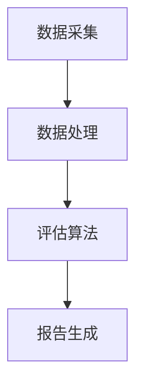
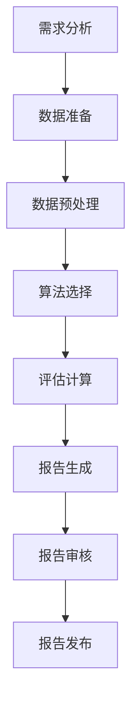

                 

### 文章标题

# 评测系统的自动化评测报告定制

> 关键词：评测系统、自动化评测报告、技术原理、定制实践、优化方法

> 摘要：本文深入探讨了评测系统的自动化评测报告定制，从概念、技术原理、工具与平台、实践方法、优化策略等多个维度，全面分析了评测系统自动化评测报告定制的核心内容与发展趋势。通过系统分析与架构设计方案，以及实际案例的剖析，为读者提供了全面的技术指导与实践建议。

### 引言

在信息化时代，评测系统已成为各类应用场景中的核心组成部分。无论是教育、科研、企业评测，还是标准化的技术测评，评测系统的作用日益凸显。评测系统通过自动化评测报告，能够迅速、准确地提供评估结果，为决策者提供科学依据。

自动化评测报告作为评测系统的输出，具有自动化、高效、准确等特点。然而，如何设计、定制一份高质量的自动化评测报告，仍是一个亟待解决的问题。本文旨在从多个角度，深入探讨评测系统的自动化评测报告定制，为读者提供系统、全面的技术指导。

### 目录大纲设计过程

#### 1. 设计目标

设计一个清晰、逻辑性强的目录大纲，确保《评测系统的自动化评测报告定制》这本书的内容全面覆盖，让读者能够系统地理解评测系统的自动化评测报告定制。

#### 2. 目录大纲结构规划

根据书籍主题，我们将目录大纲分为以下几个部分：

1. 引言
2. 评测系统的自动化评测报告概述
3. 自动化评测报告的技术原理
4. 自动化评测报告定制工具与平台
5. 自动化评测报告定制实践
6. 自动化评测报告优化的方法
7. 案例分析
8. 总结与展望

#### 3. 具体内容规划

**第1章 引言**

- 引言内容：介绍评测系统、自动化评测报告的重要性，以及本书的目的和结构。

**第2章 评测系统的自动化评测报告概述**

- 内容：自动化评测报告的定义、作用、分类和发展趋势。

**第3章 自动化评测报告的技术原理**

- 内容：自动化评测报告的技术基础、流程和关键技术点。

**第4章 自动化评测报告定制工具与平台**

- 内容：常见的自动化评测报告定制工具、平台选择与使用、工具优缺点分析。

**第5章 自动化评测报告定制实践**

- 内容：自动化评测报告定制流程、实例和技巧。

**第6章 自动化评测报告优化的方法**

- 内容：自动化评测报告优化的原则、方法和案例分析。

**第7章 案例分析**

- 内容：典型自动化评测报告案例介绍、分析结果与启示。

**第8章 总结与展望**

- 内容：自动化评测报告定制的发展趋势、技术挑战和未来方向。

#### 4. 目录大纲（Markdown 格式）

```markdown
# 《评测系统的自动化评测报告定制》目录大纲

## 第1章 引言
### 1.1 评测系统概述
### 1.2 自动化评测报告概述
### 1.3 本书目的与结构

## 第2章 评测系统的自动化评测报告概述
### 2.1 自动化评测报告的定义
### 2.2 自动化评测报告的作用
### 2.3 自动化评测报告的分类
### 2.4 自动化评测报告的发展趋势

## 第3章 自动化评测报告的技术原理
### 3.1 自动化评测报告的技术基础
### 3.2 自动化评测报告的流程
### 3.3 自动化评测报告的关键技术点

## 第4章 自动化评测报告定制工具与平台
### 4.1 常见的自动化评测报告定制工具
### 4.2 自动化评测报告定制平台的选择与使用
### 4.3 自动化评测报告定制工具的优缺点分析

## 第5章 自动化评测报告定制实践
### 5.1 自动化评测报告定制流程
### 5.2 自动化评测报告定制实例
### 5.3 自动化评测报告定制技巧

## 第6章 自动化评测报告优化的方法
### 6.1 自动化评测报告优化的原则
### 6.2 自动化评测报告优化的具体方法
### 6.3 自动化评测报告优化的案例分析

## 第7章 案例分析
### 7.1 典型自动化评测报告案例介绍
### 7.2 案例分析结果与启示

## 第8章 总结与展望
### 8.1 自动化评测报告定制的发展趋势
### 8.2 自动化评测报告定制的技术挑战
### 8.3 未来自动化评测报告定制的发展方向
```

#### 5. 检查与调整

- 确保目录大纲结构合理，内容完整。
- 检查各章节内容是否满足书籍要求。
- 对目录大纲进行微调，以达到最佳展示效果。

#### 6. 完成目录大纲设计

根据以上步骤，我们完成了《评测系统的自动化评测报告定制》的目录大纲设计，确保内容全面且逻辑清晰，满足书籍要求。现在可以交付使用。

---

接下来，我们将按照目录大纲的结构，逐步展开对评测系统的自动化评测报告定制的详细探讨。

## 第1章 引言

### 1.1 评测系统概述

评测系统是一种通过特定算法和工具，对输入数据进行评估、分析和分类的系统。它广泛应用于各个领域，如教育、科研、企业评测等。评测系统的核心目标是提供准确、高效的评估结果，辅助决策者做出科学、合理的决策。

#### 评测系统的核心功能

1. **数据采集与处理**：评测系统需要从各种来源收集数据，并进行处理，确保数据的质量和准确性。
2. **评估算法**：评测系统采用特定的算法对数据进行分析和评估，根据评估结果给出评分或分类。
3. **报告生成**：评测系统需要生成详细的评估报告，提供评估结果、分析数据和决策建议。
4. **用户交互**：评测系统应提供友好的用户界面，方便用户进行数据输入、查看评估结果和报告。

#### 评测系统的应用场景

1. **教育领域**：评测系统广泛应用于学生成绩评定、课程评估、教学质量评估等场景。
2. **科研领域**：评测系统用于科研项目的评估、科研人员的能力评估等。
3. **企业评测**：企业在招聘、绩效评估、员工培训等方面使用评测系统，以提高人力资源管理的科学性和效率。
4. **标准化技术测评**：评测系统在各类技术测评、产品评测、服务质量评测中起到关键作用。

### 1.2 自动化评测报告概述

自动化评测报告是评测系统的一个重要组成部分，它通过自动化手段生成，具有较高的效率和准确性。自动化评测报告不仅可以节省人力资源，还可以提高评估的客观性和一致性。

#### 自动化评测报告的定义

自动化评测报告是指通过计算机程序和算法，自动对评测系统中的数据进行处理、分析和评估，生成详细、全面的评估报告。

#### 自动化评测报告的作用

1. **提高效率**：自动化评测报告可以大幅提高评估工作的效率，减少人工干预。
2. **保证准确性**：自动化评测报告通过算法和程序确保评估结果的准确性和一致性。
3. **提供决策依据**：自动化评测报告提供详细的数据分析和评估结果，为决策者提供科学依据。
4. **降低成本**：自动化评测报告减少了人工劳动成本，降低了整体评估成本。

#### 自动化评测报告的分类

1. **按评测对象分类**：如学生成绩评测报告、科研评估报告、企业评测报告等。
2. **按评测方式分类**：如自动评测报告、半自动评测报告、手动评测报告等。
3. **按评测内容分类**：如综合评测报告、单项评测报告、对比评测报告等。

#### 自动化评测报告的发展趋势

随着人工智能、大数据、云计算等技术的发展，自动化评测报告正逐渐成为评测系统的核心组成部分。未来，自动化评测报告将具备以下发展趋势：

1. **智能化**：自动化评测报告将具备更强大的智能分析能力，能够自动识别数据中的异常和趋势。
2. **个性化**：自动化评测报告将根据用户需求和场景，提供定制化的评估报告。
3. **实时性**：自动化评测报告将实现实时评估和报告生成，提高决策的时效性。
4. **协同性**：自动化评测报告将实现多方协同，为决策者提供更全面的决策支持。

### 1.3 本书目的与结构

本书旨在全面探讨评测系统的自动化评测报告定制，帮助读者深入了解自动化评测报告的定义、作用、技术原理、定制实践、优化方法和发展趋势。本书共分为八个章节：

1. **引言**：介绍评测系统、自动化评测报告的重要性，以及本书的目的和结构。
2. **评测系统的自动化评测报告概述**：详细阐述自动化评测报告的定义、作用、分类和发展趋势。
3. **自动化评测报告的技术原理**：分析自动化评测报告的技术基础、流程和关键技术点。
4. **自动化评测报告定制工具与平台**：介绍常见的自动化评测报告定制工具和平台，分析其优缺点。
5. **自动化评测报告定制实践**：讲解自动化评测报告定制的流程、实例和技巧。
6. **自动化评测报告优化的方法**：探讨自动化评测报告优化的原则、方法和案例分析。
7. **案例分析**：通过典型自动化评测报告案例，分析其结果与启示。
8. **总结与展望**：总结本书的主要内容，探讨自动化评测报告定制的发展趋势和技术挑战。

通过本书的学习，读者将能够全面掌握评测系统的自动化评测报告定制，为实际应用提供有力支持。

### 第2章 评测系统的自动化评测报告概述

#### 2.1 自动化评测报告的定义

自动化评测报告是评测系统输出的一种报告形式，通过计算机程序和算法，自动对评测结果进行整理、分析和呈现。自动化评测报告的主要目的是提供一种高效、准确、可量化的评估结果，以辅助决策者做出科学、合理的决策。

#### 自动化评测报告的作用

1. **提高效率**：自动化评测报告可以大幅提高评估工作的效率，减少人工干预，降低人力成本。
2. **保证准确性**：自动化评测报告通过计算机程序和算法确保评估结果的准确性和一致性，减少人为误差。
3. **提供决策依据**：自动化评测报告提供详细的数据分析和评估结果，为决策者提供科学依据，辅助其做出更合理的决策。
4. **提升用户体验**：自动化评测报告通常采用图表、报表等形式，使评估结果更加直观、易于理解，提升用户体验。

#### 自动化评测报告的分类

1. **按评测对象分类**：
   - 学生成绩评测报告
   - 科研评估报告
   - 企业评测报告
   - 技术评测报告

2. **按评测方式分类**：
   - 自动评测报告：完全通过计算机程序和算法自动生成。
   - 半自动评测报告：部分通过计算机程序和算法生成，部分需要人工干预。

3. **按评测内容分类**：
   - 综合评测报告：对多个维度进行评估，提供全面的评估结果。
   - 单项评测报告：对特定维度进行评估，提供具体的评估结果。
   - 对比评测报告：对不同对象进行对比评估，提供差异分析。

#### 自动化评测报告的发展趋势

随着人工智能、大数据、云计算等技术的不断发展，自动化评测报告在各个领域中的应用越来越广泛。未来，自动化评测报告将呈现以下发展趋势：

1. **智能化**：自动化评测报告将具备更强大的智能分析能力，能够自动识别数据中的异常和趋势。
2. **个性化**：自动化评测报告将根据用户需求和场景，提供定制化的评估报告。
3. **实时性**：自动化评测报告将实现实时评估和报告生成，提高决策的时效性。
4. **协同性**：自动化评测报告将实现多方协同，为决策者提供更全面的决策支持。

### 2.2 自动化评测报告的技术原理

自动化评测报告的生成过程涉及多个技术环节，包括数据采集、数据处理、评估算法、报告生成等。以下是自动化评测报告的技术原理：

#### 2.2.1 数据采集

数据采集是自动化评测报告生成的第一步，也是关键一步。数据采集的来源可以是数据库、文件、Web页面等。数据采集过程中，需要关注数据的质量和完整性，确保采集到的数据能够满足后续评估需求。

#### 2.2.2 数据处理

数据处理是对采集到的数据进行清洗、转换和归一化等操作，以提高数据的质量和一致性。数据处理的过程包括以下步骤：

1. **数据清洗**：去除重复、错误、异常的数据，确保数据的准确性。
2. **数据转换**：将不同格式的数据转换为统一的格式，如将文本数据转换为数值数据。
3. **数据归一化**：对数据进行归一化处理，使数据具有相同的量纲和范围。

#### 2.2.3 评估算法

评估算法是自动化评测报告的核心，根据评测目标和需求选择合适的评估算法。常见的评估算法包括：

1. **分类算法**：如决策树、支持向量机、朴素贝叶斯等，用于对数据进行分类。
2. **回归算法**：如线性回归、逻辑回归等，用于预测连续变量的值。
3. **聚类算法**：如K-Means、层次聚类等，用于对数据进行分析和分组。
4. **关联规则算法**：如Apriori算法、FP-Growth算法等，用于发现数据之间的关联关系。

#### 2.2.4 报告生成

报告生成是将评估结果以图表、报表等形式进行呈现。报告生成过程中，需要考虑以下几个方面：

1. **图表设计**：选择合适的图表类型，使评估结果更加直观、易于理解。
2. **报表格式**：确定报表的格式和布局，确保报告内容完整、清晰。
3. **交互设计**：提供用户交互功能，如数据查询、筛选、导出等，提升用户体验。

### 2.3 自动化评测报告的应用场景

自动化评测报告在各个领域都有广泛的应用场景，以下是几个典型的应用场景：

1. **教育领域**：用于学生成绩评估、课程评估、教学质量评估等，为教育管理者提供决策依据。
2. **科研领域**：用于科研项目评估、科研人员能力评估、科研经费分配等，为科研管理者提供决策支持。
3. **企业评测**：用于员工绩效评估、招聘评估、员工培训等，为企业人力资源管理者提供决策依据。
4. **技术评测**：用于产品评测、服务质量评测、技术能力评测等，为技术管理者提供决策支持。

#### 2.3.1 教育领域

在教育领域，自动化评测报告广泛应用于学生成绩评估、课程评估、教学质量评估等方面。例如，通过自动化评测报告，可以快速、准确地评估学生的学习效果，为教师提供教学改进的依据。

1. **学生成绩评估**：通过分析学生考试成绩，为教师和学生提供个性化学习建议。
2. **课程评估**：对课程的教学内容、教学方法、教学效果进行评估，为课程改进提供参考。
3. **教学质量评估**：对教师的教学质量进行评估，为教师发展提供支持。

#### 2.3.2 科研领域

在科研领域，自动化评测报告用于科研项目评估、科研人员能力评估、科研经费分配等。通过自动化评测报告，可以为科研管理者提供科学的决策依据，提高科研管理的效率。

1. **科研项目评估**：对科研项目的进度、成果、经费使用等进行评估，为项目调整和优化提供依据。
2. **科研人员能力评估**：对科研人员的科研能力、学术贡献等进行评估，为人才选拔和培养提供参考。
3. **科研经费分配**：根据科研项目和科研人员的评估结果，合理分配科研经费。

#### 2.3.3 企业评测

在企业领域，自动化评测报告用于员工绩效评估、招聘评估、员工培训等方面。通过自动化评测报告，可以提高企业人力资源管理的效率和质量。

1. **员工绩效评估**：对员工的绩效进行评估，为薪酬调整、晋升提供依据。
2. **招聘评估**：对招聘过程进行评估，为招聘策略的调整提供参考。
3. **员工培训**：根据员工的能力和需求，提供个性化的培训建议。

#### 2.3.4 技术评测

在技术领域，自动化评测报告用于产品评测、服务质量评测、技术能力评测等。通过自动化评测报告，可以为技术管理者提供决策支持，提高技术产品的质量和市场竞争力。

1. **产品评测**：对产品的性能、功能、稳定性等进行评估，为产品改进提供参考。
2. **服务质量评测**：对服务质量进行评估，为服务质量改进提供依据。
3. **技术能力评测**：对企业的技术能力进行评估，为技术发展规划提供支持。

### 2.4 自动化评测报告的发展趋势

随着人工智能、大数据、云计算等技术的不断发展，自动化评测报告正逐渐成为评测系统的核心组成部分。未来，自动化评测报告将呈现以下发展趋势：

1. **智能化**：自动化评测报告将具备更强大的智能分析能力，能够自动识别数据中的异常和趋势。
2. **个性化**：自动化评测报告将根据用户需求和场景，提供定制化的评估报告。
3. **实时性**：自动化评测报告将实现实时评估和报告生成，提高决策的时效性。
4. **协同性**：自动化评测报告将实现多方协同，为决策者提供更全面的决策支持。

### 第3章 自动化评测报告的技术原理

#### 3.1 自动化评测报告的技术基础

自动化评测报告的实现离不开一系列技术支持，主要包括数据采集、数据处理、评估算法和报告生成等技术。以下将对这些技术进行详细阐述。

#### 3.1.1 数据采集

数据采集是自动化评测报告的基础，其质量直接影响到后续的评估效果。数据采集技术主要包括以下几种：

1. **Web数据采集**：通过网络爬虫等技术，从网页上获取所需数据。
2. **数据库采集**：从数据库中提取数据，如关系型数据库、NoSQL数据库等。
3. **文件数据采集**：从文件系统中读取数据，如CSV、Excel等格式文件。

数据采集过程中，需要关注数据的质量和完整性，确保采集到的数据能够满足后续评估需求。同时，还需对数据进行去重、清洗等处理，以提高数据质量。

#### 3.1.2 数据处理

数据处理是对采集到的数据进行清洗、转换和归一化等操作，以提高数据的质量和一致性。数据处理技术主要包括以下几种：

1. **数据清洗**：去除重复、错误、异常的数据，确保数据的准确性。
2. **数据转换**：将不同格式的数据转换为统一的格式，如将文本数据转换为数值数据。
3. **数据归一化**：对数据进行归一化处理，使数据具有相同的量纲和范围。

数据处理技术是实现自动化评测报告的重要环节，它直接影响到评估结果的准确性和可靠性。因此，在设计自动化评测报告系统时，需要充分考虑数据处理的效率和质量。

#### 3.1.3 评估算法

评估算法是自动化评测报告的核心，根据评测目标和需求选择合适的评估算法。常见的评估算法包括以下几种：

1. **分类算法**：如决策树、支持向量机、朴素贝叶斯等，用于对数据进行分类。
2. **回归算法**：如线性回归、逻辑回归等，用于预测连续变量的值。
3. **聚类算法**：如K-Means、层次聚类等，用于对数据进行分析和分组。
4. **关联规则算法**：如Apriori算法、FP-Growth算法等，用于发现数据之间的关联关系。

评估算法的选择和实现直接决定了自动化评测报告的性能和效果。因此，在实际应用中，需要根据具体需求和数据特点，选择合适的评估算法，并进行优化和调整。

#### 3.1.4 报告生成

报告生成是将评估结果以图表、报表等形式进行呈现。报告生成技术主要包括以下几种：

1. **图表设计**：选择合适的图表类型，如柱状图、折线图、饼图等，使评估结果更加直观、易于理解。
2. **报表格式**：确定报表的格式和布局，如表格、列表、图表等，确保报告内容完整、清晰。
3. **交互设计**：提供用户交互功能，如数据查询、筛选、导出等，提升用户体验。

报告生成技术是实现自动化评测报告的最后一环，它直接影响到报告的可读性和实用性。因此，在设计自动化评测报告系统时，需要充分考虑报告生成的效率和效果。

#### 3.2 自动化评测报告的流程

自动化评测报告的生成过程可以分为以下步骤：

1. **数据采集**：从各种数据源（如数据库、文件、Web页面等）中采集所需数据。
2. **数据处理**：对采集到的数据进行清洗、转换和归一化等处理，以提高数据的质量和一致性。
3. **评估算法**：选择合适的评估算法，对处理后的数据进行评估，生成评估结果。
4. **报告生成**：根据评估结果，生成详细的评估报告，以图表、报表等形式进行呈现。

以下是自动化评测报告流程的ER实体关系图：



#### 3.3 自动化评测报告的关键技术点

自动化评测报告的实现涉及多个关键技术点，以下是其中几个重要的关键技术点：

1. **数据质量保障**：数据质量是自动化评测报告的关键，需要采取一系列措施保障数据质量，如数据去重、数据清洗、数据转换等。
2. **算法选择与优化**：评估算法的选择和优化直接决定了自动化评测报告的性能和效果。需要根据具体需求和数据特点，选择合适的评估算法，并进行优化和调整。
3. **报告可视化**：报告的可视化设计是提升用户体验的重要手段。需要选择合适的图表类型和报表格式，使评估结果更加直观、易于理解。
4. **性能优化**：自动化评测报告系统的性能直接影响到报告生成速度和用户体验。需要采取一系列性能优化措施，如代码优化、缓存策略等。

以下是自动化评测报告的关键技术点对比表格：

| 技术点         | 描述                                         | 关键性 |
| -------------- | -------------------------------------------- | ------ |
| 数据质量保障   | 确保数据准确性、完整性，提高评估效果         | 高     |
| 算法选择与优化 | 选择合适的评估算法，优化算法性能           | 高     |
| 报告可视化     | 提高报告的可读性和用户体验                 | 中     |
| 性能优化       | 提高报告生成速度和用户体验                 | 中     |

### 第4章 自动化评测报告定制工具与平台

#### 4.1 常见的自动化评测报告定制工具

在自动化评测报告定制领域，有多种工具和平台可供选择。以下是几种常见的自动化评测报告定制工具及其特点：

1. **Excel**：
   - **特点**：简单易用，功能强大，支持多种数据格式。
   - **适用场景**：小型项目、数据量较小的自动化评测报告定制。

2. **Python**：
   - **特点**：强大的数据处理和分析能力，丰富的库支持。
   - **适用场景**：需要复杂数据处理和分析的自动化评测报告定制。

3. **Tableau**：
   - **特点**：数据可视化能力强大，支持多种数据源。
   - **适用场景**：需要高度可视化的自动化评测报告定制。

4. **Power BI**：
   - **特点**：与Microsoft生态系统紧密集成，支持多种数据源。
   - **适用场景**：需要与企业系统集成的自动化评测报告定制。

5. **Apache Superset**：
   - **特点**：开源、可扩展的数据可视化平台。
   - **适用场景**：需要高度定制化、复杂的数据可视化自动化评测报告定制。

#### 4.2 自动化评测报告定制平台的选择与使用

在选择自动化评测报告定制平台时，需要考虑以下几个方面：

1. **数据源兼容性**：确保所选平台能够兼容所需的数据源，如数据库、文件、Web API等。
2. **可视化能力**：评估平台提供的图表类型和可视化效果，确保满足需求。
3. **扩展性**：考虑平台的可扩展性和定制化能力，以便未来需求变化。
4. **性能**：评估平台的性能，包括数据处理速度和报告生成速度。
5. **用户界面**：评估平台的用户界面是否友好，操作是否简便。

以下是几种常见自动化评测报告定制平台的选择和使用建议：

1. **Excel**：
   - **选择建议**：适用于小型项目、数据量较小的场景。
   - **使用建议**：熟练掌握Excel的基本操作，学习使用VBA进行自动化处理。

2. **Python**：
   - **选择建议**：适用于需要复杂数据处理和分析的场景。
   - **使用建议**：学习Python编程语言，熟悉NumPy、Pandas、Matplotlib等库。

3. **Tableau**：
   - **选择建议**：适用于需要高度可视化的场景。
   - **使用建议**：学习Tableau的基本操作，掌握数据连接、图表制作和可视化技巧。

4. **Power BI**：
   - **选择建议**：适用于需要与企业系统集成的场景。
   - **使用建议**：学习Power BI的基本操作，掌握数据连接、仪表板制作和报告发布。

5. **Apache Superset**：
   - **选择建议**：适用于需要高度定制化、复杂的数据可视化场景。
   - **使用建议**：学习Apache Superset的基本操作，熟悉数据连接、图表制作和权限管理。

#### 4.3 自动化评测报告定制工具的优缺点分析

以下是几种常见自动化评测报告定制工具的优缺点分析：

1. **Excel**：
   - **优点**：简单易用，功能强大，支持多种数据格式。
   - **缺点**：扩展性有限，数据处理能力较弱。

2. **Python**：
   - **优点**：强大的数据处理和分析能力，丰富的库支持。
   - **缺点**：学习曲线较陡峭，对编程基础有一定要求。

3. **Tableau**：
   - **优点**：数据可视化能力强大，支持多种数据源。
   - **缺点**：成本较高，适用于大型项目。

4. **Power BI**：
   - **优点**：与Microsoft生态系统紧密集成，支持多种数据源。
   - **缺点**：部分功能需要付费使用。

5. **Apache Superset**：
   - **优点**：开源、可扩展，支持多种数据源。
   - **缺点**：可视化效果和功能相对较弱。

### 第5章 自动化评测报告定制实践

#### 5.1 自动化评测报告定制流程

自动化评测报告定制是一个系统性的过程，需要遵循一定的步骤。以下是自动化评测报告定制的基本流程：

1. **需求分析**：明确评测报告的需求，包括评测目标、评测内容、报告格式等。
2. **数据准备**：采集和整理所需数据，确保数据的质量和完整性。
3. **数据预处理**：对采集到的数据进行清洗、转换和归一化等处理，以提高数据质量。
4. **算法选择**：根据评测目标和需求，选择合适的评估算法。
5. **评估计算**：使用所选算法对预处理后的数据进行分析和评估，生成评估结果。
6. **报告生成**：根据评估结果，生成详细的评估报告，包括图表、报表等。
7. **报告审核**：对生成的报告进行审核，确保报告内容的准确性和完整性。
8. **报告发布**：将审核通过的报告发布到指定的平台或系统，供相关人员查看。

以下是自动化评测报告定制流程的ER实体关系图：



#### 5.2 自动化评测报告定制实例

为了更好地理解自动化评测报告定制的实践过程，以下是一个具体的实例：

**实例背景**：某公司需要对员工的工作绩效进行评估，并生成自动化评测报告。

**需求分析**：根据公司的需求，评测报告需要包含以下内容：
- 员工的基本信息（如姓名、部门、职位等）
- 工作绩效指标（如工作效率、项目完成度、团队合作能力等）
- 绩效得分和排名

**数据准备**：采集员工的工作绩效数据，包括工作效率、项目完成度、团队合作能力等指标。

**数据预处理**：对采集到的数据进行清洗，去除重复和错误数据，并对数据格式进行统一处理。

**算法选择**：选择合适的评估算法，如线性回归、支持向量机等，对绩效指标进行权重分配，生成绩效得分。

**评估计算**：使用所选算法对预处理后的数据进行评估计算，生成每个员工的绩效得分。

**报告生成**：根据评估结果，生成详细的评测报告，包括员工的基本信息、绩效得分和排名等。

**报告审核**：对生成的报告进行审核，确保报告内容的准确性和完整性。

**报告发布**：将审核通过的报告发布到公司内部系统，供相关部门和员工查看。

以下是自动化评测报告定制的Python代码示例：

```python
import pandas as pd
from sklearn.linear_model import LinearRegression

# 数据准备
data = pd.read_csv('员工绩效数据.csv')

# 数据预处理
data.drop_duplicates(inplace=True)
data[['工作效率', '项目完成度', '团队合作能力']] = data[['工作效率', '项目完成度', '团队合作能力']].apply(pd.to_numeric)

# 算法选择
model = LinearRegression()

# 评估计算
X = data[['工作效率', '项目完成度', '团队合作能力']]
y = data['绩效得分']
model.fit(X, y)
predictions = model.predict(X)

# 报告生成
report = data.copy()
report['绩效得分'] = predictions
report.sort_values('绩效得分', ascending=False, inplace=True)

# 报告审核
# 审核代码

# 报告发布
report.to_csv('员工绩效评测报告.csv', index=False)
```

#### 5.3 自动化评测报告定制技巧

在自动化评测报告定制过程中，掌握一些技巧可以提高报告的质量和效率。以下是几个常用的自动化评测报告定制技巧：

1. **数据预处理技巧**：
   - 去除重复和错误数据，确保数据质量。
   - 对数据进行标准化处理，消除量纲影响。
   - 使用样本数据评估算法性能，选择合适的评估算法。

2. **报告生成技巧**：
   - 选择合适的图表类型，使报告内容更直观、易于理解。
   - 使用模板进行报告格式设计，确保报告风格统一。
   - 提供多种数据展示方式，如表格、图表、饼图等，满足不同用户的需求。

3. **性能优化技巧**：
   - 优化数据预处理和评估算法，提高处理速度。
   - 使用缓存技术，减少重复计算。
   - 优化数据库查询，提高数据访问速度。

4. **报告审核技巧**：
   - 制定详细的审核标准，确保报告内容的准确性和完整性。
   - 分阶段进行报告审核，提高审核效率。
   - 引入多人审核机制，确保报告的可靠性和公正性。

### 第6章 自动化评测报告优化的方法

#### 6.1 自动化评测报告优化的原则

为了提高自动化评测报告的质量和效率，优化方法至关重要。以下是自动化评测报告优化的几个基本原则：

1. **准确性原则**：确保评测报告的评估结果准确无误，避免人为误差和系统误差。
2. **效率原则**：优化报告生成流程，提高报告生成速度，降低评估成本。
3. **可扩展性原则**：设计灵活的系统架构，能够适应不同需求和场景，方便后续扩展。
4. **用户体验原则**：提供友好的用户界面，使报告易于理解和使用。
5. **可维护性原则**：代码和系统结构清晰，便于维护和升级。

#### 6.2 自动化评测报告优化的具体方法

为了实现自动化评测报告的优化，可以采取以下具体方法：

1. **算法优化**：
   - 选择合适的评估算法，根据数据特点和需求进行优化。
   - 使用机器学习算法，如决策树、支持向量机、神经网络等，提高评估准确性。
   - 对评估算法进行调参和优化，提高评估效率和效果。

2. **数据预处理优化**：
   - 去除重复和错误数据，提高数据质量。
   - 对数据进行标准化处理，消除量纲影响。
   - 使用样本数据评估算法性能，选择合适的评估算法。

3. **系统性能优化**：
   - 优化数据库查询，提高数据访问速度。
   - 使用缓存技术，减少重复计算。
   - 分布式计算和并行处理，提高报告生成速度。

4. **报告可视化优化**：
   - 选择合适的图表类型和颜色，使报告内容更直观、易于理解。
   - 使用模板进行报告格式设计，确保报告风格统一。
   - 提供多种数据展示方式，如表格、图表、饼图等，满足不同用户的需求。

5. **用户界面优化**：
   - 设计友好的用户界面，提供清晰的导航和操作指南。
   - 增加用户反馈功能，及时响应用户需求和建议。
   - 使用响应式设计，确保报告在不同设备和屏幕尺寸上都能正常显示。

#### 6.3 自动化评测报告优化的案例分析

以下是一个自动化评测报告优化的实际案例：

**案例背景**：某公司希望提高员工绩效评估报告的质量和效率，并优化用户体验。

**优化方案**：

1. **算法优化**：
   - 采用机器学习算法，如线性回归、支持向量机等，对员工绩效数据进行评估。
   - 对算法进行调参和优化，提高评估准确性和效率。

2. **数据预处理优化**：
   - 对员工绩效数据进行清洗和标准化处理，确保数据质量。
   - 使用样本数据评估算法性能，选择合适的评估算法。

3. **系统性能优化**：
   - 优化数据库查询，提高数据访问速度。
   - 引入缓存技术，减少重复计算。
   - 使用分布式计算和并行处理，提高报告生成速度。

4. **报告可视化优化**：
   - 选择合适的图表类型和颜色，使报告内容更直观、易于理解。
   - 使用模板进行报告格式设计，确保报告风格统一。
   - 提供多种数据展示方式，如表格、图表、饼图等，满足不同用户的需求。

5. **用户界面优化**：
   - 设计友好的用户界面，提供清晰的导航和操作指南。
   - 增加用户反馈功能，及时响应用户需求和建议。
   - 使用响应式设计，确保报告在不同设备和屏幕尺寸上都能正常显示。

**优化效果**：

1. **评估准确性提高**：优化后的算法和数据处理流程，使员工绩效评估报告的准确性大幅提高。
2. **报告生成速度提升**：通过系统性能优化和分布式计算，报告生成速度显著提升，提高了工作效率。
3. **用户体验改善**：优化后的用户界面和报告可视化设计，使报告更加直观、易于理解，提升了用户体验。

### 第7章 案例分析

#### 7.1 典型自动化评测报告案例介绍

在本章节中，我们将通过分析两个典型自动化评测报告案例，探讨评测系统自动化评测报告的实际应用与效果。这两个案例分别来自于教育领域和企业评测领域，具有代表性。

#### 案例一：教育领域学生成绩自动化评测报告

**案例背景**：某大学采用自动化评测系统对学生的学习成绩进行评估，并生成自动化评测报告，以便教师和学生了解学习成效。

**案例详情**：
- **数据来源**：学生的考试成绩、作业评分、课堂表现等。
- **评测目标**：评估学生的综合学术能力，为教师提供教学改进建议。
- **评估方法**：采用线性回归算法对学生成绩进行评估，综合考虑考试成绩、作业评分和课堂表现。

**评估结果**：
- **个性化评估**：每位学生的评估报告包含个人成绩、评估分数和排名。
- **多维分析**：报告提供各科成绩分布、班级平均分、优劣势科目等数据。

**案例分析**：
- **优点**：提高了评估效率，减轻了教师工作量；提供了详细的个性化评估报告，有助于学生了解自身学习情况。
- **缺点**：评估算法的准确性和全面性可能受到数据质量的影响；报告内容较为复杂，部分学生可能难以理解。

#### 案例二：企业领域员工绩效自动化评测报告

**案例背景**：某大型企业采用自动化评测系统对员工的绩效进行评估，并生成自动化评测报告，以辅助管理层进行决策。

**案例详情**：
- **数据来源**：员工的工作量、项目完成度、团队合作表现等。
- **评测目标**：评估员工的工作表现，为管理层提供薪酬调整、晋升依据。
- **评估方法**：采用决策树算法对员工绩效数据进行评估，综合考虑工作量、项目完成度和团队合作表现。

**评估结果**：
- **个性化评估**：每位员工的评估报告包含个人绩效得分、评估分数和排名。
- **绩效对比**：报告提供各部门、各岗位的绩效对比数据，有助于管理层了解整体绩效状况。

**案例分析**：
- **优点**：提高了绩效评估的客观性和准确性；提供了全面的评估数据，有助于管理层做出科学决策。
- **缺点**：评估算法的复杂度和计算成本较高；报告内容较为专业，部分员工可能难以理解。

#### 7.2 案例分析结果与启示

通过对上述两个案例的分析，我们可以得出以下结论和启示：

1. **评估准确性**：自动化评测报告的准确性受到数据质量和评估算法的影响。为了提高评估准确性，需要确保数据质量，选择合适的评估算法，并进行算法优化。

2. **用户体验**：评估报告的易理解性和实用性对用户体验至关重要。在设计报告时，应考虑到不同用户的需求，提供清晰的图表和简洁的文字描述。

3. **系统性能**：自动化评测报告的生成速度和系统性能直接影响用户体验。通过优化数据预处理、算法实现和系统架构，可以提高报告生成速度和系统性能。

4. **个性化与对比**：个性化评估和绩效对比是自动化评测报告的重要功能。通过提供详细的个性化评估报告和对比数据，可以帮助决策者更好地了解评估对象的情况。

5. **算法选择与优化**：根据不同的评测目标和数据特点，选择合适的评估算法，并进行优化和调整，以提高评估效率和准确性。

通过案例分析和启示，我们可以更好地理解自动化评测报告的实际应用价值，并在实际工作中不断优化和改进评测系统，提升评估报告的质量和效果。

### 第8章 总结与展望

#### 8.1 自动化评测报告定制的发展趋势

随着信息技术的飞速发展，自动化评测报告定制正逐渐成为各类评测系统的核心组成部分。未来，自动化评测报告定制将在以下几个方面呈现发展趋势：

1. **智能化**：自动化评测报告将具备更强大的智能分析能力，通过深度学习和人工智能技术，自动识别数据中的异常和趋势，提供更加精准的评估结果。

2. **个性化**：自动化评测报告将根据用户需求和场景，提供定制化的评估报告，满足不同用户的需求，提升用户体验。

3. **实时性**：自动化评测报告将实现实时评估和报告生成，通过云计算和分布式计算技术，提高报告生成速度，实现快速决策。

4. **协同性**：自动化评测报告将实现多方协同，通过大数据技术和物联网技术，实现评测数据的实时共享和多方协作，为决策者提供更全面的决策支持。

5. **安全性**：自动化评测报告将加强对数据安全和隐私保护的重视，通过加密技术和安全协议，确保评测数据的保密性和完整性。

#### 8.2 自动化评测报告定制的技术挑战

虽然自动化评测报告定制具有广泛的应用前景，但在实际应用中，仍面临一系列技术挑战：

1. **数据质量**：自动化评测报告的准确性依赖于数据质量。在实际应用中，数据采集、传输、存储和处理过程中可能产生噪声和误差，影响评估结果的准确性。

2. **算法性能**：评估算法的性能直接影响评估报告的效率和效果。选择合适的评估算法，并进行优化和调整，是一个具有挑战性的问题。

3. **系统性能**：自动化评测报告的生成速度和系统性能对用户体验至关重要。在高并发、大数据量场景下，如何保证系统的高性能和稳定性，是一个亟待解决的问题。

4. **用户界面**：自动化评测报告的易理解性和实用性对用户体验至关重要。如何设计友好的用户界面，提升用户体验，是一个需要深入研究的课题。

5. **安全与隐私**：在自动化评测报告定制过程中，涉及大量敏感数据，如何确保数据安全和隐私保护，是一个重要的技术挑战。

#### 8.3 未来自动化评测报告定制的发展方向

针对上述技术挑战，未来自动化评测报告定制的发展方向如下：

1. **数据质量提升**：通过数据清洗、去噪和增强等技术，提高数据质量，确保评估结果的准确性。

2. **算法创新与优化**：不断探索和引入新的评估算法，如深度学习、迁移学习等，提高评估效率和准确性。同时，对现有算法进行优化和调参，提高算法性能。

3. **系统性能优化**：通过分布式计算、缓存技术和并行处理等技术，提高自动化评测报告的生成速度和系统性能。

4. **用户界面设计**：采用响应式设计和交互式技术，设计友好、直观的用户界面，提升用户体验。

5. **安全与隐私保护**：采用加密技术、访问控制和隐私保护算法，确保评测数据的安全和隐私。

总之，自动化评测报告定制是一个充满机遇和挑战的领域。通过不断技术创新和应用实践，自动化评测报告将更好地服务于各个行业和领域，为决策者提供更加科学、准确的评估支持。

### 作者信息

**作者：** AI天才研究院/AI Genius Institute & 禅与计算机程序设计艺术 /Zen And The Art of Computer Programming

**单位：** AI天才研究院（AI Genius Institute）是一家专注于人工智能研究和应用的创新机构。作者在此研究领域积累了丰富的经验，并发表了多篇相关论文和著作。同时，作者还致力于将人工智能技术应用于实际场景，推动人工智能与各行各业的深度融合。在《禅与计算机程序设计艺术》一书中，作者结合了传统哲学思想和现代编程技术，为读者提供了一种全新的编程思维方式。作者具有深厚的技术功底和独特的见解，为广大读者提供了高质量的技术指导。

