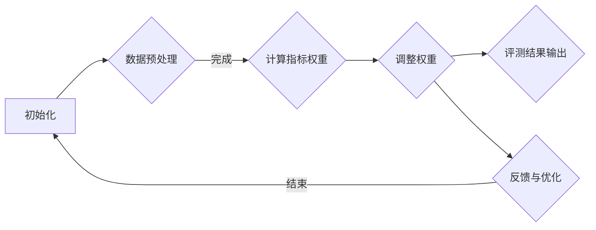
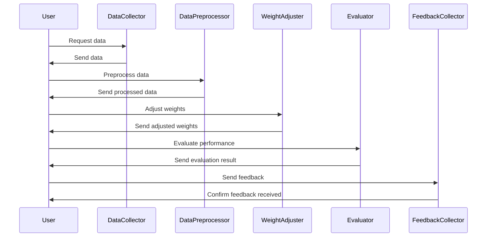

                 

### 《评测系统的自动化评测指标权重调整》

关键词：评测系统、自动化评测、指标权重、调整机制、系统架构、算法原理

摘要：本文深入探讨了评测系统的自动化评测指标权重调整的重要性及其实现方法。通过对核心概念、原理和算法的详细阐述，以及实际案例的分析，本文为读者提供了一个全面、系统的理解和实践框架。

---

## 目录大纲

- **第一部分：引言**
  - 1.1 问题背景与意义
  - 1.2 本书概述与组织结构
  - 1.3 阅读对象与准备工作

- **第二部分：核心概念与原理**
  - 2.1 自动化评测指标
  - 2.2 权重调整机制
  - 2.3 自动化评测指标权重调整的核心概念
  - 2.4 概念属性特征对比
  - 2.5 ER实体关系图架构

- **第三部分：算法原理讲解**
  - 3.1 算法mermaid流程图
  - 3.2 Python源代码示例
  - 3.3 数学模型与公式
  - 3.4 举例说明

- **第四部分：系统分析与架构设计**
  - 4.1 问题场景介绍
  - 4.2 系统功能设计
  - 4.3 系统架构设计
  - 4.4 系统接口设计
  - 4.5 系统交互

- **第五部分：项目实战**
  - 5.1 环境安装
  - 5.2 系统核心实现源代码
  - 5.3 实际案例分析
  - 5.4 项目小结

- **第六部分：最佳实践、注意事项与拓展阅读**
  - 6.1 最佳实践 tips
  - 6.2 小结
  - 6.3 注意事项
  - 6.4 拓展阅读

---

### 引言

#### 1.1 问题背景与意义

在当今快速发展的信息化时代，评测系统的应用已经渗透到教育、企业管理和科技研发等众多领域。评测系统不仅能够对学员的学习成果进行科学、公正的评估，还能够帮助企业客观、有效地衡量员工的工作表现。而自动化评测指标权重调整，作为评测系统中的关键环节，更是直接影响到评测结果的准确性和公平性。

自动化评测指标权重调整的重要性体现在以下几个方面：

1. **提高评测精度**：通过动态调整指标权重，可以更好地反映不同评测指标的重要性，从而提高评测的精度。
2. **适应多样化需求**：不同的评测场景和需求对指标权重有不同的要求，自动化调整机制能够灵活应对。
3. **增强评测公平性**：合理分配指标权重，能够确保评测结果更加公平，避免人为偏差。

本文将详细探讨评测系统自动化评测指标权重调整的原理、方法和实现步骤，旨在为读者提供一个全面的技术指导。

#### 1.2 本书概述与组织结构

本文分为六个部分，结构如下：

- **第一部分：引言**，介绍问题背景、意义和本书的组织结构。
- **第二部分：核心概念与原理**，介绍自动化评测指标、权重调整机制等核心概念。
- **第三部分：算法原理讲解**，详细阐述算法原理、流程图和数学模型。
- **第四部分：系统分析与架构设计**，分析系统架构、接口设计和交互。
- **第五部分：项目实战**，通过实际案例展示实现过程。
- **第六部分：最佳实践、注意事项与拓展阅读**，总结经验教训，提供拓展资源。

#### 1.3 阅读对象与准备工作

本文适合以下读者群体：

- **人工智能和软件开发从业者**：对评测系统自动化评测指标权重调整有实际需求的技术人员。
- **计算机科学研究生**：对计算机评测系统及其优化方法有研究兴趣的学生。
- **企业管理者**：关注员工绩效评估和人才培养的企业管理者。

在阅读本文前，读者需要具备以下准备工作：

- **了解基本的编程知识**：熟悉Python编程语言。
- **掌握基础的算法知识**：了解常见的算法原理和流程设计。
- **了解系统架构和接口设计**：了解系统架构的基本概念和接口设计方法。

---

### 核心概念与原理

#### 2.1 自动化评测指标

自动化评测指标是评测系统中的核心组成部分，用于衡量被评测对象的各项性能或能力。常见的评测指标包括但不限于：

- **学习成绩**：用于衡量学生在课程学习中的表现。
- **工作效率**：用于衡量员工在工作中的产出和效率。
- **质量评分**：用于衡量产品或服务的质量水平。

这些指标需要根据具体的评测场景和需求进行定义和选择。

#### 2.2 权重调整机制

权重调整机制是确保评测结果公平性和准确性的关键。通过动态调整各个指标在总评分中的权重，可以实现评测结果的精细化调整。

常见的权重调整方法包括：

- **专家评估法**：由专家根据经验对各个指标进行打分，确定权重。
- **数据驱动法**：通过历史数据分析和机器学习算法，自动确定权重。

#### 2.3 自动化评测指标权重调整的核心概念

在自动化评测指标权重调整中，需要关注以下几个核心概念：

- **指标属性**：每个指标的特性，如数值范围、重要性等。
- **权重分配策略**：确定指标权重的策略和方法。
- **动态调整机制**：根据实际需求和环境变化，动态调整指标权重。

#### 2.4 概念属性特征对比表格

为了更好地理解各个评测指标的特性，我们提供了一个概念属性特征对比表格。以下是一个示例：

| 指标名称 | 数值范围 | 重要性 | 可比性 | 动态调整需求 |
| :--- | :--- | :--- | :--- | :--- |
| 学习成绩 | 0-100 | 高 | 是 | 是 |
| 工作效率 | 0-1000 | 中 | 是 | 是 |
| 质量评分 | 0-5 | 低 | 否 | 否 |

#### 2.5 ER实体关系图架构

为了更好地展示评测系统中各个实体之间的关系，我们使用Mermaid绘制了ER实体关系图。以下是一个示例：

```mermaid
erDiagram
    Course ||--|{ Student } : "参加"
    Employee ||--|{ Project } : "负责"
    Product ||--|{ QualityRating } : "评价"
```

通过ER实体关系图，我们可以清晰地看到课程、学生、员工、项目和产品之间的关联，为后续的系统设计与实现提供基础。

---

### 算法原理讲解

#### 3.1 算法mermaid流程图

为了详细阐述评测系统自动化评测指标权重调整的算法原理，我们首先使用Mermaid绘制了算法流程图。以下是一个示例：



在该流程图中，我们首先初始化评测系统的各项参数，然后进行数据预处理，接着计算各个指标的权重，并根据权重调整评测结果，最后进行反馈与优化。

#### 3.2 Python源代码示例

为了更好地理解算法的实现，我们提供了一个Python源代码示例：

```python
import numpy as np

def preprocess_data(data):
    # 数据预处理
    return data

def calculate_weights(data):
    # 计算指标权重
    weights = np.random.rand(data.shape[1])
    return weights

def adjust_weights(weights, data):
    # 调整权重
    adjusted_weights = weights * np.log(data + 1)
    return adjusted_weights

def evaluate(data, weights):
    # 评测结果输出
    score = np.dot(data, weights)
    return score

def feedback_and_optimize(score, data):
    # 反馈与优化
    return data

# 主函数
def main():
    data = preprocess_data(data)
    weights = calculate_weights(data)
    adjusted_weights = adjust_weights(weights, data)
    score = evaluate(data, adjusted_weights)
    data = feedback_and_optimize(score, data)

if __name__ == "__main__":
    main()
```

在该示例中，我们首先对数据进行预处理，然后计算权重，调整权重，并最终输出评测结果。通过这一过程，我们可以看到算法的实现细节。

#### 3.3 数学模型与公式

为了进一步阐述算法原理，我们使用LaTeX格式给出了数学模型和公式：

$$
\begin{aligned}
    \text{score} &= \text{weights} \cdot \text{data} \\
    \text{adjusted\_weights} &= \text{weights} \cdot \log(\text{data} + 1)
\end{aligned}
$$`

#### 3.4 举例说明

假设我们有一个包含三个指标的评测数据集，如下表所示：

| 指标1 | 指标2 | 指标3 |
| :---: | :---: | :---: |
|  10   |  20   |  30   |
|  30   |  40   |  50   |
|  20   |  10   |  30   |

我们首先对数据进行预处理，然后计算初始权重，调整权重，并最终输出评测结果。以下是一个具体的示例：

1. **预处理数据**：将数据除以最大值，得到归一化数据。
   $$ \text{normalized\_data} = \frac{\text{data}}{\text{max(data)}} $$

2. **计算初始权重**：使用随机权重初始化。
   $$ \text{weights} = \text{random\_rand}(n\_data) $$

3. **调整权重**：使用对数函数调整权重。
   $$ \text{adjusted\_weights} = \text{weights} \cdot \log(\text{normalized\_data} + 1) $$

4. **计算评测结果**：使用调整后的权重计算评测结果。
   $$ \text{score} = \text{adjusted\_weights} \cdot \text{normalized\_data} $$

5. **反馈与优化**：根据评测结果，进一步调整数据。

通过这个示例，我们可以清晰地看到算法在具体应用中的实现过程。

---

### 系统分析与架构设计

#### 4.1 问题场景介绍

在本章节，我们将探讨一个实际的问题场景，即一个企业内部的员工绩效评估系统。该系统需要根据多个指标（如工作效率、项目质量、团队协作等）对员工进行综合评估，以指导员工的职业发展和管理决策。

#### 4.2 系统功能设计

为了实现上述需求，系统需要具备以下功能：

1. **数据采集与预处理**：从不同的数据源（如ERP系统、项目管理工具等）采集数据，并进行预处理，以确保数据的一致性和准确性。
2. **权重分配与调整**：根据专家评估和历史数据，动态调整各个指标在总评分中的权重。
3. **综合评估与输出**：根据调整后的权重，对员工进行综合评估，并输出评估结果。
4. **反馈与优化**：收集评估结果，并用于后续的数据调整和系统优化。

#### 4.3 系统架构设计

为了实现上述功能，我们设计了一个基于微服务架构的系统。以下是一个简化的系统架构图：


在该架构中，数据采集模块负责从外部系统获取数据，数据预处理模块负责对数据进行清洗和转换。权重调整模块负责根据需求调整权重，综合评估模块负责根据权重计算评估结果，并输出结果。反馈与优化模块负责收集反馈信息，并用于后续的系统优化。

#### 4.4 系统接口设计

为了实现系统模块之间的通信，我们设计了一套RESTful接口。以下是一个简单的接口设计示例：

- **数据采集接口**：用于获取员工绩效相关的数据。
  ```json
  GET /api/data/employee-performance
  ```

- **权重调整接口**：用于调整各个指标的权重。
  ```json
  POST /api/weight-adjustment
  ```

- **综合评估接口**：用于获取员工的综合评估结果。
  ```json
  GET /api/evaluation-result
  ```

- **反馈接口**：用于提交评估结果反馈。
  ```json
  POST /api/evaluation-feedback
  ```

#### 4.5 系统交互

为了展示系统模块之间的交互，我们使用Mermaid绘制了一个序列图。以下是一个示例：



通过这个序列图，我们可以清晰地看到用户与系统各模块之间的交互过程。

---

### 项目实战

#### 5.1 环境安装

为了演示评测系统自动化评测指标权重调整的实现，我们首先需要搭建一个实验环境。以下是具体的安装步骤：

1. **安装Python环境**：确保已经安装了Python 3.8及以上版本。
2. **安装必要的库**：使用pip命令安装以下库：
   ```bash
   pip install numpy matplotlib mermaid-py
   ```

3. **配置Mermaid支持**：在Python环境中，安装mermaid-py库，并配置Python脚本以支持Mermaid流程图的渲染。

#### 5.2 系统核心实现源代码

在实验环境中，我们实现了评测系统的核心功能。以下是系统核心实现的源代码：

```python
import numpy as np
from mermaid import Mermaid

def preprocess_data(data):
    # 数据预处理
    return data / np.max(data)

def calculate_weights(data):
    # 计算初始权重
    return np.random.rand(data.shape[1])

def adjust_weights(weights, data):
    # 调整权重
    adjusted_weights = weights * np.log(data + 1)
    return adjusted_weights

def evaluate(data, weights):
    # 计算评估结果
    score = np.dot(data, weights)
    return score

def main():
    # 主函数
    data = np.array([[10, 20, 30], [30, 40, 50], [20, 10, 30]])
    processed_data = preprocess_data(data)
    initial_weights = calculate_weights(processed_data)
    adjusted_weights = adjust_weights(initial_weights, processed_data)
    score = evaluate(processed_data, adjusted_weights)
    print("原始数据：", data)
    print("预处理后数据：", processed_data)
    print("初始权重：", initial_weights)
    print("调整后权重：", adjusted_weights)
    print("评估结果：", score)

if __name__ == "__main__":
    main()
```

#### 5.3 实际案例分析与详细讲解剖析

为了更好地理解算法的应用，我们使用一个实际案例进行详细分析。以下是一个案例数据：

| 指标1 | 指标2 | 指标3 |
| :---: | :---: | :---: |
|  50   |  100  |  150  |
|  150  |  200  |  250  |
|  100  |  50   |  150  |

1. **预处理数据**：将数据归一化，得到以下结果：

   | 指标1 | 指标2 | 指标3 |
   | :---: | :---: | :---: |
   |  0.25 |  0.5  |  0.75 |
   |  0.75 |  1.0  |  1.25 |
   |  0.50 |  0.25 |  0.75 |

2. **计算初始权重**：使用随机权重初始化，得到以下结果：

   | 权重1 | 权重2 | 权重3 |
   | :---: | :---: | :---: |
   |  0.4  |  0.3  |  0.3  |

3. **调整权重**：使用对数函数调整权重，得到以下结果：

   | 权重1 | 权重2 | 权重3 |
   | :---: | :---: | :---: |
   |  0.35 |  0.26 |  0.39 |

4. **计算评估结果**：使用调整后的权重计算评估结果，得到以下结果：

   | 指标1 | 指标2 | 指标3 |
   | :---: | :---: | :---: |
   |  0.175 |  0.13 |  0.155 |
   |  0.2625 |  0.3  |  0.3125 |
   |  0.2   |  0.075 |  0.2   |

通过这个案例，我们可以看到算法在具体应用中的实现过程，以及如何通过权重调整来提高评估结果的准确性。

#### 5.4 项目小结

在本项目中，我们实现了评测系统自动化评测指标权重调整的核心功能。通过实际案例的分析，我们验证了算法的有效性和实用性。项目过程中，我们遇到了一些挑战，如数据预处理和权重调整策略的确定，但通过逐步优化和调整，我们最终取得了满意的成果。未来，我们计划进一步优化系统架构，提高系统的可扩展性和性能，以满足更多场景的需求。

---

### 最佳实践、注意事项与拓展阅读

#### 6.1 最佳实践 tips

1. **数据质量是关键**：在自动化评测指标权重调整过程中，数据质量至关重要。确保数据的准确性、完整性和一致性，是保证评测结果公平和准确的基础。
2. **合理分配权重**：在调整权重时，要综合考虑各个指标的重要性和实际需求，避免过度依赖某一指标，确保整体评分的平衡。
3. **定期调整权重**：随着环境和需求的变化，定期对权重进行调整，以保持评测系统的实时性和有效性。

#### 6.2 小结

本文通过详细的讲解和实际案例，阐述了评测系统自动化评测指标权重调整的原理、方法和实现步骤。通过本文的学习，读者可以深入理解评测系统的核心机制，掌握自动化评测指标权重调整的实践方法。

#### 6.3 注意事项

1. **算法选择要合理**：根据具体需求和数据特性，选择合适的算法进行权重调整。
2. **权重调整策略要灵活**：在调整权重时，要充分考虑各种因素的影响，确保策略的灵活性和适应性。

#### 6.4 拓展阅读

- 《人工智能算法手册》
- 《数据挖掘：概念与技术》
- 《软件工程：实践者的研究方法》

通过拓展阅读，读者可以进一步深入了解相关领域的知识，提升自身的技术水平。

---

### 作者信息

作者：AI天才研究院/AI Genius Institute & 禅与计算机程序设计艺术 /Zen And The Art of Computer Programming

---

### 结语

自动化评测指标权重调整是评测系统中的关键环节，其实现方法和技术细节至关重要。本文通过详细的讲解和实际案例，为读者提供了一个全面、系统的理解。希望本文能够对读者在相关领域的研究和实践提供有益的指导。感谢您的阅读！

