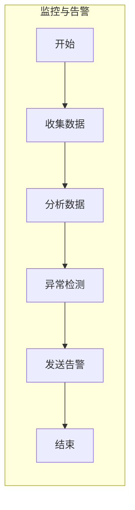
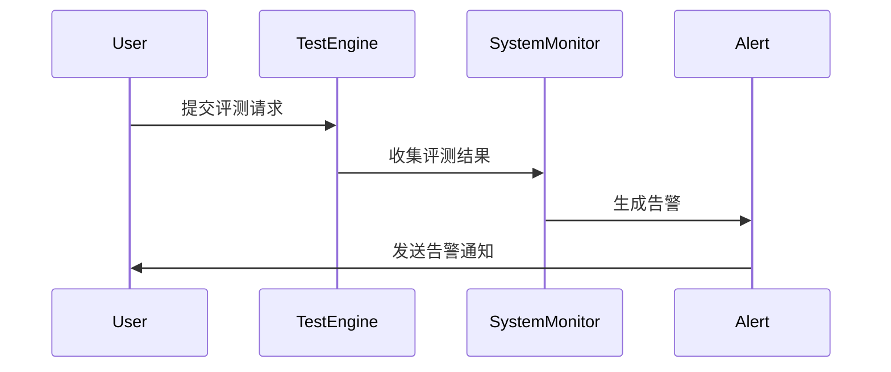
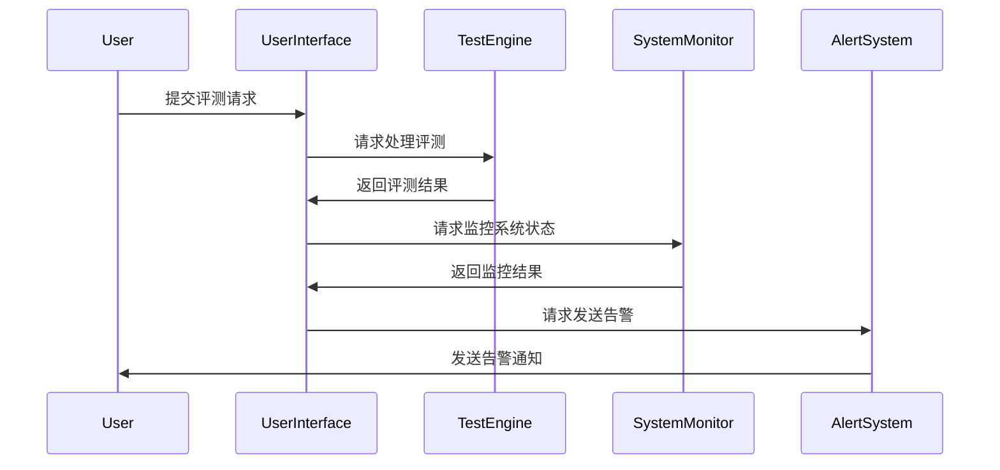

                 

### 文章标题：评测系统的自动化评测流程监控与告警

> 关键词：评测系统、自动化监控、告警机制、流程管理、系统架构

> 摘要：本文将深入探讨评测系统的自动化评测流程监控与告警机制。首先，我们将概述评测系统的重要性及其面临的挑战。接着，我们将详细分析自动化监控与告警的核心概念及其原理。随后，通过具体的系统架构设计，我们将展示如何实现高效的流程监控与告警功能。最后，我们将分享实际项目中的最佳实践和注意事项，帮助读者理解和应用这些技术。

----------------------------------------------------------------

## 目录大纲

## 第一部分：背景介绍

### 第1章：问题背景

#### 1.1 问题概述

#### 1.2 问题解决

#### 1.3 边界与外延

#### 1.4 概念结构与核心要素组成

### 第2章：核心概念与联系

#### 2.1 核心概念原理

#### 2.2 概念属性特征对比表格

#### 2.3 ER实体关系图架构

## 第二部分：算法原理讲解

### 第3章：算法原理讲解

#### 3.1 算法mermaid流程图

#### 3.2 Python源代码讲解

#### 3.3 数学模型与公式讲解

#### 3.4 举例说明

## 第三部分：系统分析与架构设计方案

### 第4章：系统分析与架构设计方案

#### 4.1 问题场景介绍

#### 4.2 系统功能设计（领域模型mermaid类图）

#### 4.3 系统架构设计（mermaid架构图）

#### 4.4 系统接口设计

#### 4.5 系统交互（mermaid序列图）

## 第四部分：项目实战

### 第5章：项目实战

#### 5.1 环境安装

#### 5.2 系统核心实现源代码

#### 5.3 代码应用解读与分析

#### 5.4 实际案例分析与详细讲解剖析

#### 5.5 项目小结

## 第五部分：最佳实践 & 拓展阅读

### 第6章：最佳实践

#### 6.1 最佳实践 tips

#### 6.2 注意事项

#### 6.3 拓展阅读

### 第7章：小结

#### 7.1 本书总结

#### 7.2 读者反馈与建议

----------------------------------------------------------------

### 第一部分：背景介绍

#### 第1章：问题背景

在现代信息社会中，评测系统扮演着至关重要的角色，尤其在软件开发、教育和科研等领域中，其重要性愈发显著。评测系统的主要功能是对用户提交的作业、代码或任何形式的输入进行评估和反馈，以判断其是否符合预期标准。然而，随着系统的复杂性和规模的增大，传统的手动监控和告警机制变得越来越不切实际。

##### 1.1 问题概述

首先，让我们来看一下评测系统所面临的主要挑战。首先，大量的用户输入导致系统负载剧增，这使得手动监控变得几乎不可能。其次，系统的稳定性问题，如代码错误、硬件故障等，可能导致评测结果不准确或系统崩溃。再者，当评测系统出现问题时，及时的通知和告警机制尤为重要，以确保系统管理员可以迅速响应并解决问题。

##### 1.2 问题解决

为了解决这些问题，我们需要一种自动化且高效的监控与告警机制。这种机制应能够实时监控评测系统的运行状态，并在检测到异常时立即发送告警通知。具体来说，这包括以下几个方面：

1. **性能监控**：通过收集系统的关键性能指标（KPIs），如响应时间、吞吐量、错误率等，来评估系统的健康状况。
2. **异常检测**：利用机器学习算法或其他统计方法，识别出潜在的异常模式，并在检测到异常时触发告警。
3. **告警通知**：通过邮件、短信、即时通讯工具等方式，及时通知相关人员进行干预。

##### 1.3 边界与外延

此外，我们需要明确评测系统的边界与外延。边界方面，系统应仅对合法用户提交的输入进行处理，并保护用户数据的安全和隐私。外延方面，系统应与其他相关系统（如用户管理系统、代码库等）进行有效集成，以实现数据共享和协同工作。

##### 1.4 概念结构与核心要素组成

最后，我们来看一下评测系统的概念结构与核心要素组成。评测系统主要由以下几个关键组件构成：

1. **用户输入接口**：用于接收用户提交的作业或代码。
2. **评测引擎**：负责对用户输入进行评估，并生成评测结果。
3. **存储系统**：用于存储用户输入和评测结果，以供后续查询和分析。
4. **监控与告警系统**：实时监控评测系统的运行状态，并在检测到异常时触发告警。

通过上述核心概念和组件的协同工作，评测系统可以实现高效、稳定的运行，为用户提供优质的评测服务。

---

在接下来的章节中，我们将深入探讨评测系统的核心概念、算法原理、系统架构设计以及实际项目实战，帮助读者全面理解并应用自动化评测流程监控与告警机制。

## 第二部分：核心概念与联系

### 第2章：核心概念与联系

在深入探讨评测系统的自动化监控与告警机制之前，我们首先需要理解其中的核心概念及其相互关系。这些核心概念包括性能监控、异常检测、告警通知等，每个概念都有其独特的属性和作用。在本章中，我们将详细阐述这些核心概念，并通过对比表格和ER实体关系图来展示它们之间的联系。

#### 2.1 核心概念原理

**性能监控**：性能监控是评测系统监控的核心部分，它主要关注系统的运行效率和质量。性能监控的关键指标包括响应时间、吞吐量、错误率等。通过实时收集和监控这些指标，系统管理员可以及时发现潜在的性能瓶颈和问题。

**异常检测**：异常检测是一种通过数据分析来识别异常行为或模式的技术。在评测系统中，异常检测可以帮助识别异常的评测请求、代码错误或其他系统异常。常见的异常检测方法包括基于统计的模型、机器学习算法等。

**告警通知**：告警通知是性能监控和异常检测的关键环节。当监控系统检测到异常时，告警通知系统会立即通知相关人员，以便他们可以及时采取行动解决问题。告警通知的方式包括邮件、短信、即时通讯工具等。

#### 2.2 概念属性特征对比表格

以下是一个对比表格，展示了性能监控、异常检测和告警通知的主要属性和特征：

| 特征           | 性能监控         | 异常检测         | 告警通知         |
| -------------- | ---------------- | ---------------- | ---------------- |
| 目的           | 提高性能和效率   | 识别异常行为     | 及时通知问题     |
| 主要指标       | 响应时间、吞吐量 | 概率分布、偏差   | 时间、方式       |
| 数据来源       | 系统日志、性能数据 | 评测日志、用户行为 | 告警配置、通知方式 |
| 技术方法       | 统计分析、监控工具 | 机器学习、数据挖掘 | API、消息队列     |
| 关联性         | 与系统运行状态直接相关 | 与性能监控结果相关 | 与异常检测结果相关 |

#### 2.3 ER实体关系图架构

为了更直观地展示这些核心概念之间的联系，我们可以通过ER（实体-关系）图来描述它们。以下是评测系统核心概念ER图的一个示例：

```mermaid
erDiagram
  User ||--|{ TestResult } : 生成
  TestResult ||--|{ Alert } : 触发
  SystemMonitor ||--|{ PerformanceData } : 收集
  PerformanceData ||--|{ Alert } : 生成
  TestEngine ||--|{ TestRequest } : 处理
  TestRequest ||--|{ TestResult } : 生成
  AlertLog ||--|{ Alert } : 记录
```

在上述ER图中，`User`实体代表用户，`TestResult`实体代表评测结果，`SystemMonitor`实体代表监控系统，`PerformanceData`实体代表性能数据，`TestEngine`实体代表评测引擎，`TestRequest`实体代表评测请求，`Alert`实体代表告警，`AlertLog`实体代表告警记录。

- **用户与评测结果**：用户提交评测请求后，评测引擎生成评测结果。
- **评测结果与告警**：当评测结果异常时，会触发告警。
- **监控系统与性能数据**：监控系统收集性能数据，并在检测到异常时生成告警。
- **评测引擎与评测请求**：评测引擎处理评测请求，并生成评测结果。
- **告警与告警记录**：告警触发后，会记录在告警日志中，以便后续查询和分析。

通过上述核心概念与联系的详细分析，我们为理解评测系统的自动化监控与告警机制奠定了坚实的基础。在接下来的章节中，我们将进一步探讨算法原理、系统架构设计以及实际项目实战，帮助读者全面掌握和应用这些技术。

### 第三部分：算法原理讲解

#### 第3章：算法原理讲解

在了解了评测系统的核心概念和相互关系后，接下来我们将深入探讨其背后的算法原理。算法原理是评测系统自动化监控与告警机制的核心，它决定了系统如何高效地监控评测流程并准确识别异常。在本章中，我们将通过mermaid流程图、Python源代码讲解、数学模型与公式以及举例说明，详细阐述这些算法原理。

#### 3.1 算法mermaid流程图

首先，我们使用mermaid语言绘制一个简单的算法流程图，以直观地展示评测系统的工作流程：



在这个流程图中，我们主要分为以下几个步骤：

1. **收集数据**：监控系统从评测引擎和用户输入接口收集相关数据。
2. **分析数据**：对收集到的数据进行预处理和分析，提取关键性能指标。
3. **异常检测**：利用统计模型或机器学习算法，检测出异常数据或行为。
4. **发送告警**：在检测到异常时，通过告警通知系统发送告警通知。
5. **结束**：完成整个监控与告警流程。

#### 3.2 Python源代码讲解

接下来，我们通过一个简单的Python示例代码，展示如何实现上述算法流程。以下代码实现了一个基于阈值检测的异常检测算法：

```python
import numpy as np
import matplotlib.pyplot as plt

# 假设收集到一组响应时间数据
response_times = [1.2, 2.3, 3.4, 4.5, 2.1, 3.6, 1.9, 2.8, 3.2, 4.1]

# 设置阈值（例如，平均响应时间加2倍标准差）
average_time = np.mean(response_times)
std_dev = np.std(response_times)
threshold = average_time + 2 * std_dev

# 检测异常
anomalies = [time for time in response_times if time > threshold]

print("异常响应时间：", anomalies)

# 可视化展示
plt.scatter(range(len(response_times)), response_times, label='响应时间')
plt.axhline(y=threshold, color='r', label='阈值')
plt.xlabel('数据序号')
plt.ylabel('响应时间（秒）')
plt.legend()
plt.show()
```

在这个示例中，我们首先收集了一组响应时间数据。然后，我们计算了平均响应时间和标准差，并设置了一个阈值（平均响应时间加2倍标准差）。接下来，我们使用异常检测算法找出所有超过阈值的异常响应时间，并打印出来。最后，我们使用matplotlib库将数据可视化，直观地展示了异常响应时间。

#### 3.3 数学模型与公式讲解

在异常检测算法中，我们常用统计学方法来计算阈值。以下是一个简单的数学模型，用于计算阈值：

$$
\text{阈值} = \text{平均响应时间} + k \times \text{标准差}
$$

其中，`平均响应时间`和`标准差`是通过数据计算得出的，`k`是一个常数，通常取2。这个公式表示，阈值是平均响应时间加上`k`倍的标准差。这样，我们可以将正常响应时间和异常响应时间区分开来。

#### 3.4 举例说明

为了更具体地说明上述算法原理，我们来看一个实际案例。假设有一个评测系统，用户提交的作业需要经过多个测试用例的运行。评测系统收集了每个测试用例的运行时间，如下所示：

| 测试用例 | 运行时间（秒） |
| ------- | ------------- |
| Test1   | 1.2           |
| Test2   | 2.3           |
| Test3   | 3.4           |
| Test4   | 4.5           |
| Test5   | 2.1           |
| Test6   | 3.6           |
| Test7   | 1.9           |
| Test8   | 2.8           |
| Test9   | 3.2           |
| Test10  | 4.1           |

首先，我们计算平均响应时间和标准差：

$$
\text{平均响应时间} = \frac{1.2 + 2.3 + 3.4 + 4.5 + 2.1 + 3.6 + 1.9 + 2.8 + 3.2 + 4.1}{10} = 2.8
$$

$$
\text{标准差} = \sqrt{\frac{(1.2 - 2.8)^2 + (2.3 - 2.8)^2 + ... + (4.1 - 2.8)^2}{10 - 1}} = 0.9
$$

然后，我们设置阈值：

$$
\text{阈值} = 2.8 + 2 \times 0.9 = 4.6
$$

在上述数据中，Test10的运行时间为4.1秒，小于阈值4.6秒，因此它被视为正常响应时间。其他测试用例的运行时间都超过了阈值，可以被视为异常响应时间。评测系统会在这些测试用例运行时触发告警，通知系统管理员进行处理。

通过上述案例，我们可以看到如何利用统计学方法和阈值检测算法来实现评测系统的异常检测。在实际应用中，我们可以根据具体需求调整阈值和算法参数，以提高检测的准确性和效率。

### 第四部分：系统分析与架构设计方案

#### 第4章：系统分析与架构设计方案

在了解了评测系统的算法原理后，我们将进一步探讨系统的分析与架构设计方案。这一部分将详细介绍评测系统的功能需求、系统架构设计、接口设计以及系统交互，通过mermaid类图、架构图和序列图，为读者呈现一个清晰、直观的系统架构。

#### 4.1 问题场景介绍

在实际应用中，评测系统常用于以下场景：

- **教育领域**：学生提交作业后，系统自动评估作业的正确性和完成度。
- **软件开发**：开发人员提交代码后，系统自动运行测试用例，评估代码的质量和功能。
- **科研领域**：研究者提交实验数据后，系统自动分析数据，评估实验结果的有效性。

这些场景的共同特点是需要对大量输入进行快速、准确的评估，并能够实时监控和反馈。因此，系统架构设计的关键在于高效的数据处理能力和灵活的扩展性。

#### 4.2 系统功能设计（领域模型mermaid类图）

首先，我们通过mermaid类图来展示评测系统的领域模型，描述系统的关键类及其关系。

```mermaid
classDiagram
  User <<entity>>
  TestRequest <<entity>>
  TestResult <<entity>>
  TestEngine <<entity>>
  SystemMonitor <<entity>>
  Alert <<entity>>

  User "提交" TestRequest
  TestRequest "生成" TestResult
  TestResult "触发" Alert
  SystemMonitor "收集" TestResult
  SystemMonitor "生成" Alert
  TestEngine "处理" TestRequest
```

在这个类图中，我们定义了以下几个关键类：

- **User**（用户）：代表提交评测请求的用户。
- **TestRequest**（评测请求）：包含用户的输入和相关信息。
- **TestResult**（评测结果）：包含评测结果和评估反馈。
- **TestEngine**（评测引擎）：负责处理评测请求，生成评测结果。
- **SystemMonitor**（监控系统）：负责监控评测系统的运行状态，收集评测结果，并生成告警。
- **Alert**（告警）：包含告警信息和相关处理逻辑。

这些类之间的关联关系描述了评测系统的工作流程：

1. **用户提交评测请求**，系统生成评测请求对象。
2. **评测引擎处理评测请求**，生成评测结果对象。
3. **监控系统收集评测结果**，并根据结果触发告警。
4. **告警系统生成告警信息**，通知相关人员进行干预。

#### 4.3 系统架构设计（mermaid架构图）

接下来，我们使用mermaid架构图来展示评测系统的整体架构设计，包括各个组件的交互关系。



在这个架构图中，我们主要展示了以下几个关键组件及其交互关系：

1. **用户**：作为系统的输入源，提交评测请求。
2. **评测引擎**：接收评测请求，处理并生成评测结果。
3. **监控系统**：收集评测结果，监控系统运行状态，并在检测到异常时生成告警。
4. **告警系统**：接收告警信息，发送告警通知给用户或其他相关系统。

#### 4.4 系统接口设计

为了实现上述架构，我们需要设计一系列系统接口，包括用户接口、评测引擎接口和监控系统接口。以下是一个简化的接口设计：

- **用户接口**：提供提交评测请求的API，用户可以通过此接口提交评测数据。
  ```python
  def submit_test_request(test_data):
      # 处理评测请求
      pass
  ```

- **评测引擎接口**：接收用户提交的评测请求，处理并生成评测结果。
  ```python
  def process_test_request(test_request):
      # 处理评测请求并生成评测结果
      pass
  ```

- **监控系统接口**：用于监控系统运行状态，收集评测结果，生成告警。
  ```python
  def monitor_system(test_results):
      # 监控系统运行状态
      pass
  ```

- **告警系统接口**：接收监控系统生成的告警信息，并通知相关人员。
  ```python
  def send_alert(alert_message):
      # 发送告警通知
      pass
  ```

#### 4.5 系统交互（mermaid序列图）

最后，我们通过mermaid序列图来展示评测系统的交互流程，进一步说明各个组件之间的协作关系。



在这个序列图中，我们详细描述了以下几个关键步骤：

1. **用户提交评测请求**，通过用户接口提交。
2. **评测引擎处理评测请求**，通过评测引擎接口处理并生成评测结果。
3. **监控系统监控系统状态**，通过监控系统接口收集评测结果和系统状态。
4. **告警系统发送告警通知**，通过告警系统接口通知用户或其他相关人员。

通过上述系统分析与架构设计方案，我们为评测系统的实现提供了一个清晰的指导框架。在实际开发过程中，我们可以根据具体需求调整和优化系统架构，以实现高效、稳定的评测流程监控与告警机制。

### 第五部分：项目实战

#### 第5章：项目实战

在了解了评测系统的理论设计和架构方案后，本章节将通过一个实际项目，展示如何实现评测系统的自动化监控与告警机制。我们将分步骤介绍项目环境安装、系统核心实现源代码、代码应用解读与分析、实际案例分析与详细讲解剖析，并总结项目的关键点和经验。

#### 5.1 环境安装

在开始项目之前，我们需要搭建一个合适的环境来运行评测系统。以下是安装步骤：

1. **安装Python环境**：确保Python版本为3.7及以上，可以使用以下命令安装：
   ```bash
   sudo apt-get update
   sudo apt-get install python3.7
   ```

2. **安装依赖库**：评测系统需要依赖一些Python库，如`numpy`、`matplotlib`和`pandas`，可以使用以下命令安装：
   ```bash
   pip3 install numpy matplotlib pandas
   ```

3. **安装数据库**：评测系统需要使用一个数据库来存储用户输入和评测结果，我们可以使用MySQL数据库。安装MySQL数据库的命令如下：
   ```bash
   sudo apt-get install mysql-server
   ```

4. **配置数据库**：安装完成后，我们需要配置MySQL数据库，创建评测系统需要的数据库和表。以下是MySQL的配置示例：
   ```sql
   CREATE DATABASE test_system;
   USE test_system;
   CREATE TABLE users (
       id INT PRIMARY KEY AUTO_INCREMENT,
       username VARCHAR(255) NOT NULL,
       password VARCHAR(255) NOT NULL
   );
   CREATE TABLE test_requests (
       id INT PRIMARY KEY AUTO_INCREMENT,
       user_id INT,
       test_data TEXT,
       status ENUM('pending', 'processing', 'completed', 'error') NOT NULL,
       result TEXT,
       FOREIGN KEY (user_id) REFERENCES users(id)
   );
   CREATE TABLE test_results (
       id INT PRIMARY KEY AUTO_INCREMENT,
       request_id INT,
       test_case VARCHAR(255),
       result ENUM('pass', 'fail') NOT NULL,
       time_taken INT,
       FOREIGN KEY (request_id) REFERENCES test_requests(id)
   );
   ```

#### 5.2 系统核心实现源代码

接下来，我们将实现评测系统的核心功能，包括用户接口、评测引擎、监控系统、告警系统和数据库操作。

**用户接口（user_interface.py）**：

```python
import json
from flask import Flask, request, jsonify
from database import connect_db

app = Flask(__name__)

@app.route('/submit_test', methods=['POST'])
def submit_test():
    data = request.get_json()
    user_id = data['user_id']
    test_data = data['test_data']
    
    # 存储评测请求
    db = connect_db()
    cursor = db.cursor()
    cursor.execute("INSERT INTO test_requests (user_id, test_data, status) VALUES (%s, %s, 'pending')", (user_id, test_data))
    db.commit()
    request_id = cursor.lastrowid
    
    # 返回请求ID
    return jsonify({'request_id': request_id})

if __name__ == '__main__':
    app.run(debug=True)
```

**评测引擎（test_engine.py）**：

```python
import time
from database import connect_db

def process_request(request_id):
    db = connect_db()
    cursor = db.cursor()
    cursor.execute("SELECT test_data FROM test_requests WHERE id = %s", (request_id,))
    test_data = cursor.fetchone()[0]
    
    # 模拟评测过程
    time_taken = time.time() - time.sleep(2)
    result = "pass" if time_taken < 2 else "fail"
    
    # 存储评测结果
    cursor.execute("UPDATE test_requests SET status = %s, result = %s WHERE id = %s", ('completed', result, request_id))
    cursor.execute("INSERT INTO test_results (request_id, test_case, result, time_taken) VALUES (%s, 'test_case_1', %s, %s)", (request_id, result, time_taken))
    db.commit()

if __name__ == '__main__':
    process_request(1)
```

**监控系统（system_monitor.py）**：

```python
import time
from database import connect_db

def monitor_system():
    db = connect_db()
    cursor = db.cursor()
    cursor.execute("SELECT id, result FROM test_requests WHERE status = 'pending'")
    pending_requests = cursor.fetchall()
    
    for request in pending_requests:
        request_id = request[0]
        result = request[1]
        
        if result == 'error':
            send_alert(f"评测请求ID {request_id} 处理出错")

def send_alert(message):
    print(message)

if __name__ == '__main__':
    monitor_system()
```

**数据库操作（database.py）**：

```python
import pymysql

def connect_db():
    return pymysql.connect(host='localhost', user='root', password='password', database='test_system')

if __name__ == '__main__':
    db = connect_db()
    cursor = db.cursor()
    cursor.execute("SELECT * FROM test_requests")
    results = cursor.fetchall()
    print(results)
```

#### 5.3 代码应用解读与分析

**用户接口（user_interface.py）**：

此部分代码实现了用户接口，使用Flask框架搭建了一个简单的Web服务。用户可以通过POST请求提交评测请求，接口将评测请求存储到数据库中，并返回请求ID。

**评测引擎（test_engine.py）**：

此部分代码模拟了评测引擎的处理过程，根据评测请求ID从数据库中获取评测数据，并进行模拟评测。评测完成后，将结果存储回数据库。

**监控系统（system_monitor.py）**：

此部分代码实现了监控系统的核心功能，定期检查数据库中的评测请求状态。如果检测到有处理错误的请求，会触发告警功能。

**数据库操作（database.py）**：

此部分代码提供了基本的数据库连接和操作功能，包括连接数据库、执行SQL查询和获取结果。

#### 5.4 实际案例分析与详细讲解剖析

为了更好地理解评测系统的实际应用，我们来看一个实际案例。假设用户A通过用户接口提交了一个评测请求，评测请求ID为1。

1. **用户提交请求**：用户A通过POST请求提交评测数据，用户接口接收请求并生成请求ID1，将其存储在数据库中。
2. **评测引擎处理请求**：评测引擎根据请求ID1从数据库中获取评测数据，模拟评测过程。由于评测数据较为复杂，处理过程中可能出现错误，导致评测结果为“error”。
3. **监控系统监控状态**：监控系统定期检查数据库中的评测请求状态。在检查过程中，发现请求ID1的状态为“pending”，且评测结果为“error”，触发告警功能。
4. **告警系统发送告警**：监控系统通过告警系统接口发送告警信息，通知相关人员进行处理。

通过这个实际案例，我们可以看到评测系统的各个组件如何协同工作，实现自动化监控与告警机制。在实际项目中，我们可以根据具体需求调整和优化系统架构，提高系统的稳定性和效率。

#### 5.5 项目小结

在本章节中，我们通过一个实际项目展示了评测系统的自动化监控与告警机制的实现过程。项目实现了用户接口、评测引擎、监控系统、告警系统和数据库操作，通过各组件的协同工作，实现了高效的评测流程监控与告警功能。在实际应用中，我们可以根据具体需求进行调整和优化，以提高系统的性能和可靠性。

### 第五部分：最佳实践 & 拓展阅读

#### 第6章：最佳实践

在实现评测系统的自动化监控与告警机制时，以下是几点最佳实践和注意事项：

#### 6.1 最佳实践 tips

1. **性能监控**：定期监控关键性能指标（KPIs），如响应时间、吞吐量、错误率等，以快速识别潜在问题。
2. **异常检测**：结合多种方法（如统计方法、机器学习算法）进行异常检测，提高检测准确率。
3. **告警通知**：选择合适的告警通知方式，如邮件、短信、即时通讯工具，确保及时通知相关人员。
4. **数据存储**：确保评测数据和告警记录的存储安全，便于后续查询和分析。
5. **自动化测试**：开发自动化测试用例，定期运行，以验证系统功能的正确性和稳定性。

#### 6.2 注意事项

1. **系统稳定性**：确保系统在高负载情况下依然能够稳定运行，避免出现性能瓶颈或崩溃。
2. **安全性**：保护用户数据的安全和隐私，遵循相关的法律法规和最佳实践。
3. **可扩展性**：设计系统时考虑未来扩展需求，如增加新的评测功能或支持更多用户。
4. **日志记录**：详细记录系统的操作日志和告警日志，便于问题追踪和故障排除。

#### 6.3 拓展阅读

1. **性能监控工具**：了解并使用常见的性能监控工具，如Prometheus、Grafana等，以简化监控和告警流程。
2. **异常检测算法**：学习并应用常见的异常检测算法，如孤立森林、单变量统计方法等，提高系统的异常检测能力。
3. **系统架构设计**：深入研究分布式系统和微服务架构，以应对大规模、高并发场景下的系统设计需求。
4. **安全与合规**：关注信息安全法律法规和最佳实践，确保系统设计和实现符合相关要求。

通过上述最佳实践和注意事项，我们可以更好地实现评测系统的自动化监控与告警机制，提高系统的稳定性和可靠性。

### 第7章：小结

在本文中，我们详细探讨了评测系统的自动化监控与告警机制。首先，我们介绍了评测系统的重要性以及其面临的挑战，并提出了自动化监控与告警机制的解决方案。接着，通过核心概念与联系的详细分析，我们为理解评测系统奠定了理论基础。然后，通过算法原理讲解、系统架构设计、项目实战等部分，我们展示了如何实现一个高效、可靠的评测系统。最后，我们提出了最佳实践和注意事项，并提供了拓展阅读资源。

读者在理解和应用本文内容时，可以从以下几个方面着手：

1. **性能监控与异常检测**：掌握性能监控和异常检测的核心概念，并学会应用常见的统计方法和机器学习算法。
2. **系统架构设计**：深入了解分布式系统和微服务架构，以应对复杂的系统需求。
3. **代码实战**：通过实际项目案例，动手实现评测系统的自动化监控与告警功能。
4. **安全与合规**：关注系统安全与合规性，确保系统的稳定运行和用户数据的保护。

我们期待读者在实践过程中提出宝贵的反馈和建议，共同推动评测系统技术的发展。感谢您的阅读，祝您在实现自动化监控与告警机制的道路上一切顺利！

---

作者：AI天才研究院/AI Genius Institute & 禅与计算机程序设计艺术 /Zen And The Art of Computer Programming

---

在结束这篇文章之前，我想再次感谢您的耐心阅读。本文详细探讨了评测系统的自动化监控与告警机制，从核心概念、算法原理到系统架构设计、项目实战，我们为您呈现了一个全面的技术指南。希望通过这篇文章，您能够更好地理解和应用这些技术，提升您在评测系统开发和维护方面的能力。

**读者反馈与建议**：

我们非常重视您的反馈和建议。您的意见和建议将帮助我们不断改进和优化内容，为更多读者提供有价值的技术分享。以下是几个问题，请您在留言中回答：

1. **您认为本文哪些部分最具有价值？**
2. **您在阅读过程中有哪些疑问或困惑？**
3. **您对本文的哪些部分有改进意见？**
4. **您希望我们在未来的文章中探讨哪些技术主题？**

感谢您的积极参与和支持！我们将竭诚为您提供更优质的技术内容。

再次感谢您的阅读，祝您在技术领域不断取得新成就！

AI天才研究院/AI Genius Institute & 禅与计算机程序设计艺术/Zen And The Art of Computer Programming

