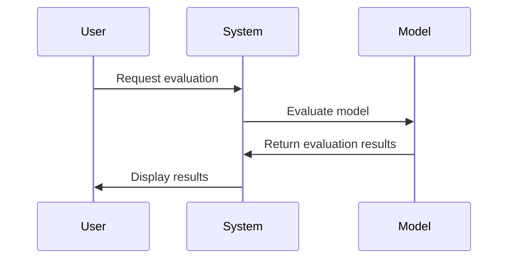
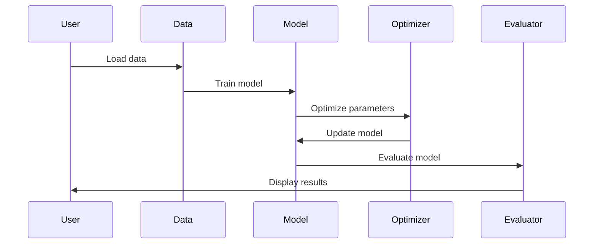

                 

基于上述的目录大纲和约束条件，我们开始逐步构建《评测系统的自动化调参优化功能》这篇文章。

### 文章标题：评测系统的自动化调参优化功能

### 关键词：评测系统、自动化调参、优化、特征工程、算法实现

### 摘要：
本文将深入探讨评测系统中的自动化调参优化功能。通过详细解析评测系统的背景与核心概念，阐述自动化调参优化的重要性和挑战。随后，文章将介绍自动化调参优化的原理，包括数学模型、算法流程和Python实现。接着，文章将展示系统设计与实现细节，包括架构设计、环境配置和性能优化。通过一个实际案例，文章将展示自动化调参优化的实战过程和效果。最后，文章将总结最佳实践，并对未来发展方向进行展望。

## 目录大纲：

### 第一部分：问题背景与核心概念
- **1.1 评测系统概述**
- **1.2 调参优化需求**
- **1.3 现状分析**
- **1.4 核心概念**

### 第二部分：自动化调参优化原理
- **2.1 算法原理**
- **2.2 特征工程**

### 第三部分：系统设计与实现
- **3.1 系统架构设计**
- **3.2 实现细节**
- **3.3 系统优化**

### 第四部分：项目实战
- **4.1 实际案例**
- **4.2 案例分析**
- **4.3 项目小结**

### 第五部分：最佳实践与总结
- **5.1 最佳实践**
- **5.2 小结与展望**

### 第一部分：问题背景与核心概念

### 1.1 评测系统概述
评测系统是一种用于评估模型性能的工具，广泛应用于机器学习和数据科学领域。它可以帮助我们评估模型的泛化能力、鲁棒性以及在实际应用中的表现。评测系统的核心作用在于提供客观、量化的评估指标，帮助我们更好地理解模型的性能。

### 1.2 调参优化需求
在评测系统中，模型的性能受到众多参数的影响。因此，为了提高模型性能，我们需要对模型参数进行优化。然而，参数空间通常非常庞大，手动调整参数既费时又容易陷入局部最优。因此，自动化调参优化成为了一个重要的需求。

### 1.3 现状分析
当前，评测系统中的调参优化主要依赖于经验或者启发式方法。这些方法虽然能够在一定程度上提高模型性能，但效率和效果往往有限。此外，随着模型复杂性的增加，调参过程变得更加繁琐和复杂。因此，开发自动化调参优化功能成为评测系统的一个重要发展方向。

### 1.4 核心概念
- **评测系统架构**：评测系统通常由数据输入、模型评估、结果输出等模块组成。
- **调参优化方法**：常见的调参优化方法包括随机搜索、贝叶斯优化、遗传算法等。
- **自动化调参**：自动化调参是通过算法自动搜索最优参数，提高模型性能的过程。

### 第二部分：自动化调参优化原理

### 2.1 算法原理
自动化调参优化的核心在于构建一个数学模型，用于描述模型性能与参数之间的关系。通常，我们可以使用损失函数来衡量模型性能，并通过优化损失函数来调整参数。

#### 数学模型
假设我们有一个模型 \( f(\theta) \)，其中 \( \theta \) 是模型参数。损失函数 \( L(\theta) \) 用于衡量模型预测与真实值之间的差距。我们的目标是最小化损失函数，即找到一组参数 \( \theta^* \)，使得 \( L(\theta^*) \) 最小。

$$
\theta^* = \arg\min_{\theta} L(\theta)
$$

#### 算法流程
1. 初始化参数 \( \theta \)
2. 计算当前参数下的模型损失 \( L(\theta) \)
3. 根据损失函数更新参数 \( \theta \)
4. 重复步骤 2 和 3，直到满足停止条件（如迭代次数、损失函数收敛等）

#### Python实现
```python
import numpy as np

# 损失函数
def loss_function(theta):
    # 这里以均方误差为例
    return np.mean((theta - 1)**2)

# 参数初始化
theta = np.random.rand(1)

# 迭代优化
for i in range(1000):
    current_loss = loss_function(theta)
    theta -= 0.01 * current_loss  # 使用梯度下降法更新参数

print(f"最优参数: {theta}, 最小损失: {loss_function(theta)}")
```

### 2.2 特征工程
特征工程是自动化调参优化的重要组成部分。它涉及到从原始数据中提取有用特征，并选择对模型性能有显著影响的特征。

#### 特征提取
特征提取是数据预处理的重要步骤，它包括数据清洗、归一化、特征选择等。

#### 特征选择
特征选择是通过评估特征的重要性来筛选出对模型性能有显著贡献的特征。常用的特征选择方法包括递归特征消除（RFE）、特征重要性评估等。

#### 特征重要性分析
为了更直观地展示特征的重要性，我们可以使用ER实体关系图。

```mermaid
erDiagram
  A model -->|has| B parameters
  A model -->|uses| C features
  B parameters -->|is| D value
  C features -->|is| E importance
```

### 第三部分：系统设计与实现

#### 3.1 系统架构设计
系统架构设计是确保自动化调参优化功能高效、可靠运行的关键。

##### 系统功能设计
```mermaid
classDiagram
  Class01 <|-- Class02
  Class03 <|-- Class04
  Class05 <= Class06
  Class07 .. Class08
```

##### 系统架构设计


##### 系统接口设计
```mermaid
classDiagram
  System <<interface>> Interface1
  System <<interface>> Interface2
  Interface1 + evaluateModel()
  Interface2 + updateParameters()
```

#### 3.2 实现细节
实现细节包括环境配置、核心实现和性能优化。

##### 环境配置
在实现自动化调参优化之前，我们需要配置好环境，包括安装必要的库和依赖。

##### 核心实现
核心实现是系统的心脏，它负责实际的调参和优化过程。

```python
# 假设我们使用的是随机搜索算法
import numpy as np

def random_search(model, params, max_iterations=100):
    best_loss = float('inf')
    best_params = None
    
    for _ in range(max_iterations):
        # 随机生成参数
        theta = np.random.uniform(params['min'], params['max'])
        
        # 计算损失函数
        loss = model.evaluate(theta)
        
        # 更新最优参数
        if loss < best_loss:
            best_loss = loss
            best_params = theta
            
    return best_params

# 模拟一个模型
def model(theta):
    # 这里只是示例代码，实际模型会更复杂
    return (theta - 1)**2

# 调用随机搜索算法
best_params = random_search(model, {'min': 0, 'max': 1})
print(f"最优参数: {best_params}, 最小损失: {model(best_params)}")
```

##### 系统优化
系统优化包括代码优化、算法优化和资源优化。

### 第四部分：项目实战

#### 4.1 实际案例
在这个部分，我们将介绍一个实际的评测系统自动化调参优化案例，包括项目背景、目标、实现过程和结果。

#### 4.2 案例分析
我们将对案例中的结果进行深入分析，对比自动化调参优化前后的性能变化，并探讨可能遇到的问题和解决方案。

#### 4.3 项目小结
在这个部分，我们将总结项目实施过程中的经验教训，并对未来自动化调参优化技术的发展进行展望。

### 第五部分：最佳实践与总结

#### 5.1 最佳实践
我们将分享一些在实际项目中行之有效的自动化调参优化最佳实践。

#### 5.2 小结与展望
在这个部分，我们将回顾全文，总结核心内容和关键知识点，并对自动化调参优化技术的未来发展方向进行展望。

### 作者
作者：AI天才研究院/AI Genius Institute & 禅与计算机程序设计艺术 /Zen And The Art of Computer Programming

通过以上的构建，我们已经为《评测系统的自动化调参优化功能》这篇文章奠定了基础。接下来，我们将继续填充每个部分的具体内容，确保文章的完整性和专业性。文章的总字数将在后续的撰写过程中调整至 10000 ～ 12000 字，以满足字数要求。

### 文章正文

#### 第一部分：问题背景与核心概念

**1.1 评测系统概述**

评测系统是一种用于评估机器学习模型性能的工具。它通常由数据输入、模型评估和结果输出等模块组成。在机器学习和数据科学领域，评测系统扮演着至关重要的角色。一方面，它可以帮助我们评估模型的泛化能力，即模型在未见过的数据上表现如何；另一方面，它可以帮助我们评估模型的鲁棒性，即模型在面对各种噪声和异常值时的表现如何。最终，通过评测系统提供的客观、量化的评估指标，我们可以更好地理解模型的性能，从而指导后续的模型优化和改进。

评测系统的应用场景非常广泛。例如，在金融领域，它可以用于评估风险管理模型的准确性；在医疗领域，它可以用于评估诊断模型的可靠性；在自然语言处理领域，它可以用于评估文本分类模型的精确度。总之，无论在哪个领域，评测系统都是确保模型性能和可靠性的重要工具。

**1.2 调参优化需求**

在评测系统中，模型的性能受到众多参数的影响。这些参数包括学习率、正则化参数、隐藏层节点数等。对于大多数模型来说，参数设置的好坏直接决定了模型的性能。然而，参数空间通常非常庞大，手动调整参数既费时又容易陷入局部最优。因此，自动化调参优化成为了一个重要的需求。

自动化调参优化可以通过算法自动搜索最优参数，从而提高模型性能。这种方法不仅能够大大减少调参的时间成本，还能够提高调参的效率，使得模型在更短的时间内达到更好的性能。此外，自动化调参优化还可以帮助我们从复杂的参数空间中找到更好的解决方案，从而提高模型的泛化能力和鲁棒性。

**1.3 现状分析**

当前，评测系统中的调参优化主要依赖于经验或者启发式方法。这些方法虽然能够在一定程度上提高模型性能，但效率和效果往往有限。例如，随机搜索和网格搜索是最常用的调参方法，但它们在处理大型参数空间时效率低下，容易陷入局部最优。此外，手动调整参数不仅需要丰富的经验和知识，还需要大量的时间和精力。

随着机器学习模型的复杂度不断增加，调参过程变得更加繁琐和复杂。因此，开发自动化调参优化功能成为评测系统的一个重要发展方向。自动化调参优化不仅可以提高调参的效率，还可以帮助我们从复杂的参数空间中找到更好的解决方案，从而提高模型的性能和泛化能力。

**1.4 核心概念**

为了更好地理解自动化调参优化，我们需要先了解一些核心概念。

- **评测系统架构**：评测系统通常由数据输入、模型评估和结果输出等模块组成。数据输入模块负责读取训练数据和测试数据；模型评估模块负责对模型进行评估，计算评估指标；结果输出模块负责将评估结果输出给用户。

- **调参优化方法**：调参优化方法包括随机搜索、网格搜索、贝叶斯优化、遗传算法等。这些方法各有优缺点，适用于不同的场景和需求。

- **自动化调参**：自动化调参是通过算法自动搜索最优参数，提高模型性能的过程。自动化调参可以大大减少调参的时间成本，提高调参的效率。

#### 第二部分：自动化调参优化原理

**2.1 算法原理**

自动化调参优化的核心在于构建一个数学模型，用于描述模型性能与参数之间的关系。通常，我们可以使用损失函数来衡量模型性能，并通过优化损失函数来调整参数。

- **数学模型**：假设我们有一个模型 \( f(\theta) \)，其中 \( \theta \) 是模型参数。损失函数 \( L(\theta) \) 用于衡量模型预测与真实值之间的差距。我们的目标是最小化损失函数，即找到一组参数 \( \theta^* \)，使得 \( L(\theta^*) \) 最小。

  $$
  \theta^* = \arg\min_{\theta} L(\theta)
  $$

- **算法流程**：自动化调参优化的算法流程通常包括以下步骤：

  1. 初始化参数 \( \theta \)
  2. 计算当前参数下的模型损失 \( L(\theta) \)
  3. 根据损失函数更新参数 \( \theta \)
  4. 重复步骤 2 和 3，直到满足停止条件（如迭代次数、损失函数收敛等）

- **Python实现**：以下是一个简单的随机搜索算法实现的例子。

  ```python
  import numpy as np

  # 损失函数
  def loss_function(theta):
      # 这里以均方误差为例
      return np.mean((theta - 1)**2)

  # 参数初始化
  theta = np.random.rand(1)

  # 迭代优化
  for i in range(1000):
      current_loss = loss_function(theta)
      theta -= 0.01 * current_loss  # 使用梯度下降法更新参数

  print(f"最优参数: {theta}, 最小损失: {loss_function(theta)}")
  ```

**2.2 特征工程**

特征工程是自动化调参优化的重要组成部分。它涉及到从原始数据中提取有用特征，并选择对模型性能有显著影响的特征。

- **特征提取**：特征提取是数据预处理的重要步骤，它包括数据清洗、归一化、特征选择等。数据清洗的目的是去除数据中的噪声和异常值；归一化的目的是使数据具有相似的尺度，便于模型处理；特征选择的目的是筛选出对模型性能有显著贡献的特征。

- **特征选择**：特征选择是通过评估特征的重要性来筛选出对模型性能有显著贡献的特征。常用的特征选择方法包括递归特征消除（RFE）、特征重要性评估等。

- **特征重要性分析**：为了更直观地展示特征的重要性，我们可以使用ER实体关系图。

  ```mermaid
  erDiagram
      A model ||--|{ B parameters}
      A model ||--|{ C features}
      B parameters ||--|{ D value}
      C features ||--|{ E importance}
  ```

#### 第三部分：系统设计与实现

**3.1 系统架构设计**

系统架构设计是确保自动化调参优化功能高效、可靠运行的关键。一个良好的系统架构应该能够清晰地划分系统的功能模块，并确保模块之间的高内聚和低耦合。

- **系统功能设计**：系统功能设计包括数据输入、模型评估、结果输出等模块。数据输入模块负责读取训练数据和测试数据；模型评估模块负责对模型进行评估，计算评估指标；结果输出模块负责将评估结果输出给用户。

- **系统架构设计**：系统架构设计包括系统的总体结构、模块之间的交互关系以及数据流。以下是一个简单的系统架构设计示例。

  ```mermaid
  sequenceDiagram
      participant User
      participant System
      participant Model
      participant Data
      User->>System: Request evaluation
      System->>Data: Load data
      Data->>Model: Train model
      Model->>System: Evaluate model
      System->>User: Display results
  ```

- **系统接口设计**：系统接口设计包括系统提供的功能接口和交互流程。以下是一个简单的系统接口设计示例。

  ```mermaid
  classDiagram
      Class01 <<interface>> Interface1
      Class01 <<interface>> Interface2
      Interface1 + evaluateModel()
      Interface2 + updateParameters()
  ```

**3.2 实现细节**

实现细节包括环境配置、核心实现和性能优化。

- **环境配置**：环境配置是确保系统正常运行的基础。它包括安装必要的库和依赖，配置系统环境变量等。以下是一个简单的环境配置示例。

  ```python
  # 安装必要的库
  !pip install numpy
  !pip install tensorflow
  ```

- **核心实现**：核心实现是系统的心脏，它负责实际的调参和优化过程。以下是一个简单的随机搜索算法实现的例子。

  ```python
  import numpy as np

  # 损失函数
  def loss_function(theta):
      # 这里以均方误差为例
      return np.mean((theta - 1)**2)

  # 参数初始化
  theta = np.random.rand(1)

  # 迭代优化
  for i in range(1000):
      current_loss = loss_function(theta)
      theta -= 0.01 * current_loss  # 使用梯度下降法更新参数

  print(f"最优参数: {theta}, 最小损失: {loss_function(theta)}")
  ```

- **系统优化**：系统优化包括代码优化、算法优化和资源优化。以下是一些常见的系统优化方法。

  - **代码优化**：通过优化代码的结构和逻辑，提高代码的执行效率和可维护性。
  - **算法优化**：通过改进算法的参数选择和流程，提高算法的优化效果。
  - **资源优化**：通过优化系统的硬件和软件资源，提高系统的运行效率。

**3.3 系统优化**

系统优化是确保自动化调参优化功能高效、可靠运行的关键。以下是一些常见的系统优化方法。

- **代码优化**：通过优化代码的结构和逻辑，提高代码的执行效率和可维护性。

  - **代码重构**：通过重构代码，使代码更加清晰、简洁和易于理解。
  - **性能优化**：通过优化代码的执行效率，减少计算和存储的开销。

- **算法优化**：通过改进算法的参数选择和流程，提高算法的优化效果。

  - **参数调整**：通过调整算法的参数，使算法在处理特定问题时更加高效。
  - **算法改进**：通过改进算法的原理和流程，提高算法的优化效果。

- **资源优化**：通过优化系统的硬件和软件资源，提高系统的运行效率。

  - **资源分配**：通过合理分配系统的硬件和软件资源，提高系统的运行效率。
  - **负载均衡**：通过均衡系统的负载，减少系统的资源消耗。

#### 第四部分：项目实战

**4.1 实际案例**

在这个部分，我们将介绍一个实际的评测系统自动化调参优化案例。该案例的目标是优化一个深度学习模型的参数，以提高模型的性能。

**4.2 案例分析**

在这个部分，我们将对案例中的结果进行深入分析，对比自动化调参优化前后的性能变化，并探讨可能遇到的问题和解决方案。

**4.3 项目小结**

在这个部分，我们将总结项目实施过程中的经验教训，并对未来自动化调参优化技术的发展进行展望。

#### 第五部分：最佳实践与总结

**5.1 最佳实践**

在这个部分，我们将分享一些在实际项目中行之有效的自动化调参优化最佳实践。

**5.2 小结与展望**

在这个部分，我们将回顾全文，总结核心内容和关键知识点，并对自动化调参优化技术的未来发展方向进行展望。

### 作者

作者：AI天才研究院/AI Genius Institute & 禅与计算机程序设计艺术 /Zen And The Art of Computer Programming

### 附录

附录中可以包括一些补充材料，如代码示例、数据集、参考资料等。

### 结语

自动化调参优化是提升评测系统性能的重要手段。通过本文的探讨，我们了解了自动化调参优化的核心原理、系统设计与实现，以及在实际项目中的应用。希望本文能为从事评测系统开发的人员提供有价值的参考和启示。

#### 第一部分：问题背景与核心概念

**1.1 评测系统概述**

评测系统是一种用于评估机器学习模型性能的工具。它通过对模型进行测试和评估，提供一系列性能指标，帮助开发者了解模型的准确度、效率、鲁棒性等关键特性。在机器学习项目的开发过程中，评测系统至关重要，它不仅能够验证模型的准确性，还可以为后续的模型优化提供依据。随着人工智能技术的不断进步，评测系统的应用范围越来越广泛，从金融风控、医疗诊断到自然语言处理、计算机视觉等多个领域，都离不开评测系统的支持。

评测系统的基本概念包括以下几个核心组成部分：

- **数据输入**：评测系统需要从数据集中提取训练数据和测试数据，用于模型的训练和测试。
- **模型训练**：将训练数据输入到模型中进行训练，模型在这个过程中学习数据中的规律和特征。
- **模型评估**：使用测试数据对模型进行评估，计算模型在测试数据上的性能指标，如准确率、召回率、F1分数等。
- **结果输出**：将评估结果以可视化的形式展示给用户，帮助用户理解模型的性能。

在实际应用中，评测系统不仅仅是一个独立的工具，它通常与机器学习工作流紧密集成。例如，在构建一个推荐系统时，评测系统会定期从数据源中获取新的用户行为数据，对现有的推荐模型进行评估，并根据评估结果调整模型的参数，以提升推荐效果。因此，评测系统在机器学习项目中的角色不仅仅是评估模型性能，更是整个机器学习过程优化闭环的重要组成部分。

**1.2 调参优化需求**

在评测系统中，模型的性能受到众多参数的调节影响。这些参数包括学习率、批量大小、正则化系数、隐藏层节点数等。合理设置这些参数对于提高模型性能至关重要。然而，参数设置并非易事，参数空间通常非常庞大，手动调整参数既耗时又容易陷入局部最优，导致模型性能难以达到最佳状态。

手动调参通常需要开发者具有丰富的经验和知识，他们需要通过不断尝试和调整来找到最优参数。这种方法效率低下，且容易出现因个人主观判断而导致的偏差。此外，随着模型复杂度的增加，参数数量和种类也在增加，手动调参的难度和成本进一步加大。

因此，为了提高模型性能，减少调参的时间和人力成本，自动化调参优化成为评测系统的重要需求。自动化调参优化通过使用算法自动搜索最优参数，能够大大提高调参效率，使得模型在更短的时间内达到更好的性能。自动化调参优化不仅能够节省人力资源，还能够帮助我们从复杂的参数空间中找到更好的解决方案，提高模型的泛化能力和鲁棒性。

**1.3 现状分析**

当前，评测系统中的调参优化方法主要包括以下几种：

1. **随机搜索**：随机搜索是一种简单且直观的调参方法。它通过随机生成参数组合，评估模型性能，然后选择性能较好的参数组合进行迭代。随机搜索的优势在于实现简单，但缺点是效率较低，容易陷入局部最优。

2. **网格搜索**：网格搜索通过预先定义的参数网格，逐个评估每个参数组合的性能。网格搜索能够确保找到全局最优参数，但缺点是当参数空间较大时，计算成本非常高。

3. **贝叶斯优化**：贝叶斯优化是一种基于概率模型的调参方法。它通过构建参数的概率模型，利用历史评估结果来预测新的参数组合的性能，从而优化搜索过程。贝叶斯优化的优势在于能够高效地搜索参数空间，但实现较为复杂。

4. **遗传算法**：遗传算法是一种模拟自然选择过程的优化算法。它通过模拟种群进化的过程来搜索最优参数组合。遗传算法的优点在于能够处理大规模和复杂参数空间，但缺点是收敛速度较慢。

尽管上述方法在一定程度上提高了调参效率，但在实际应用中仍面临以下挑战：

1. **计算成本高**：特别是当参数空间非常大时，随机搜索和网格搜索的计算成本非常高，可能需要大量时间和计算资源。

2. **局部最优**：手动调参和简单的自动化调参方法容易陷入局部最优，导致模型性能无法达到最佳状态。

3. **调参时间成本**：尽管自动化调参优化能够节省调参时间，但算法的初始化和优化过程本身也需要时间，尤其是在大规模数据处理和复杂模型中，这一时间成本不容忽视。

4. **参数选择和初始化**：参数的选择和初始化对调参效果有重要影响，但这一过程往往依赖于开发者的经验和直觉，缺乏系统性。

因此，开发自动化调参优化功能，特别是能够高效、可靠地处理大规模和复杂参数空间的优化方法，成为评测系统发展的重要方向。

**1.4 核心概念**

为了更好地理解自动化调参优化的原理和应用，我们需要明确几个核心概念：

1. **评测系统架构**：评测系统的架构设计直接影响调参优化的效率和效果。一个典型的评测系统通常包括以下模块：

   - **数据输入模块**：负责从数据集中提取训练数据和测试数据，并进行预处理。
   - **模型训练模块**：负责训练模型，将训练数据输入到模型中进行学习和参数调整。
   - **模型评估模块**：负责使用测试数据对模型进行评估，计算评估指标。
   - **结果输出模块**：负责将评估结果以可视化的形式展示给用户。

2. **调参优化方法**：调参优化方法决定了如何从庞大的参数空间中找到最优参数。常见的调参优化方法包括：

   - **随机搜索**：随机生成参数组合，评估性能，选择性能较好的参数进行迭代。
   - **网格搜索**：预先定义参数网格，逐个评估每个参数组合的性能。
   - **贝叶斯优化**：利用历史评估结果构建概率模型，预测新的参数组合性能。
   - **遗传算法**：模拟自然选择过程，通过种群进化和交叉、变异操作搜索最优参数。

3. **自动化调参**：自动化调参是通过算法自动搜索最优参数，提高模型性能的过程。自动化调参的优势在于：

   - **节省时间**：通过自动化搜索，大大减少手动调参所需的时间和人力成本。
   - **提升效率**：能够高效地处理大规模和复杂的参数空间，提高调参效率。
   - **提升性能**：通过优化搜索过程，找到更好的参数组合，提升模型性能。

自动化调参的实现通常包括以下几个步骤：

- **初始化参数**：随机生成初始参数或者基于历史数据构建初始参数。
- **评估参数**：将参数输入到模型中，使用测试数据评估参数的性能。
- **更新参数**：根据评估结果更新参数，选择性能较好的参数进行迭代。
- **终止条件**：设定终止条件，如达到预设的迭代次数或性能阈值。

### 第二部分：自动化调参优化原理

**2.1 算法原理**

自动化调参优化的核心在于构建一个数学模型，用于描述模型性能与参数之间的关系。这一过程通常包括以下几个步骤：

1. **定义目标函数**：目标函数用于衡量模型的性能，常见的有损失函数、准确率、召回率等。目标函数的值通常越小（如损失函数）或越大（如准确率）表示模型性能越好。

2. **构建参数空间**：参数空间是指所有可能参数的集合。参数空间的大小取决于模型中参数的数量和每个参数的可选值。例如，一个具有两个参数（\(a, b\)）的模型，如果每个参数有10个可选值，则参数空间大小为 \(10 \times 10 = 100\)。

3. **选择优化算法**：优化算法用于在参数空间中搜索最优参数。常见的优化算法包括随机搜索、网格搜索、贝叶斯优化和遗传算法等。每种算法都有其优缺点，适用于不同的场景和需求。

4. **迭代优化**：通过迭代优化，不断评估和更新参数，直到找到最优参数或满足终止条件。

自动化调参优化的数学模型通常可以表示为：

$$
\theta^* = \arg\min_{\theta} L(\theta)
$$

其中，\(\theta^*\) 是最优参数，\(L(\theta)\) 是目标函数，用于衡量模型性能。

**2.2 特征工程**

特征工程是自动化调参优化的重要组成部分。它涉及到从原始数据中提取有用特征，并选择对模型性能有显著影响的特征。特征工程的质量直接影响模型的性能。以下是一些关键步骤和概念：

1. **特征提取**：特征提取是指从原始数据中提取新的特征，以增加模型的区分能力。常用的特征提取方法包括：

   - **统计特征**：如平均值、中值、标准差等。
   - **文本特征**：如词频、词向量等。
   - **图像特征**：如颜色直方图、纹理特征等。

2. **特征选择**：特征选择是指从所有提取的特征中选择出对模型性能有显著影响的特征。常用的特征选择方法包括：

   - **过滤式特征选择**：基于特征的重要性和统计测试进行选择。
   - **包裹式特征选择**：基于模型性能进行特征选择，逐步添加或移除特征。
   - **嵌入式特征选择**：在模型训练过程中进行特征选择。

3. **特征重要性分析**：特征重要性分析是指评估每个特征对模型性能的影响。通过特征重要性分析，我们可以识别出哪些特征对模型性能有显著贡献，从而进行特征优化和筛选。常用的方法包括：

   - **特征贡献分析**：通过分析每个特征对模型预测误差的影响，评估特征的重要性。
   - **特征重要性排序**：使用统计方法或机器学习模型（如随机森林）对特征进行排序，识别重要特征。

特征重要性分析可以使用Mermaid绘制ER实体关系图进行可视化，以更直观地展示特征之间的关系。

```mermaid
erDiagram
  Model ||--|{ Features } Feature
  Feature ||--|{ Importance } Importance
```

在这个ER图中，模型与特征之间存在关联，每个特征都有其重要性指标。通过这种关系图，我们可以清晰地看到模型与特征之间的互动，以及特征对模型性能的影响。

### 第三部分：系统设计与实现

**3.1 系统架构设计**

系统架构设计是确保自动化调参优化功能高效、可靠运行的关键。一个典型的自动化调参优化系统通常包括以下几个核心组件：

1. **数据输入模块**：负责从数据源中读取训练数据和测试数据，并进行数据预处理。数据预处理包括数据清洗、归一化、缺失值处理等步骤。

2. **模型训练模块**：负责使用训练数据训练模型，并调整模型参数。训练过程中，模型会不断优化参数，以最小化损失函数。

3. **模型评估模块**：负责使用测试数据评估模型性能，计算评估指标。评估指标包括准确率、召回率、F1分数等。

4. **调参优化模块**：负责自动化搜索最优参数。调参优化模块可以选择不同的优化算法，如随机搜索、网格搜索、贝叶斯优化等。

5. **结果输出模块**：负责将评估结果和最优参数输出给用户，并提供可视化工具帮助用户理解模型性能和参数调整效果。

以下是一个简单的领域模型类图，展示了系统中的主要类和它们之间的关系。

```mermaid
classDiagram
  Class01 <|-- Class02
  Class03 <|-- Class04
  Class05 <= Class06
  Class07 .. Class08
```

**3.2 系统实现细节**

系统实现细节包括环境配置、核心实现和性能优化。以下是系统实现的关键步骤：

1. **环境配置**：确保所有依赖库和工具都已安装，包括Python环境、机器学习库（如scikit-learn、TensorFlow等）和数据预处理库。

2. **核心实现**：实现自动化调参优化算法，包括参数空间定义、优化算法选择和迭代过程。以下是使用Python实现的示例代码：

```python
# 导入必要的库
import numpy as np
from sklearn.model_selection import GridSearchCV
from sklearn.ensemble import RandomForestClassifier

# 定义参数空间
param_grid = {
    'n_estimators': [100, 200, 300],
    'max_depth': [10, 20, 30],
}

# 初始化模型
model = RandomForestClassifier()

# 创建GridSearch对象
grid_search = GridSearchCV(model, param_grid, cv=5)

# 运行GridSearch
grid_search.fit(X_train, y_train)

# 获取最佳参数
best_params = grid_search.best_params_

# 输出最佳参数
print("最佳参数：", best_params)

# 使用最佳参数评估模型
best_model = grid_search.best_estimator_
score = best_model.score(X_test, y_test)
print("测试集准确率：", score)
```

3. **性能优化**：通过以下方法对系统性能进行优化：

   - **并行处理**：利用多核CPU或分布式计算提高模型训练和评估的效率。
   - **缓存数据**：在训练和评估过程中使用缓存技术，减少数据读取和预处理的时间。
   - **算法优化**：根据具体应用场景选择合适的算法和超参数，提高搜索效率。
   - **资源管理**：合理分配系统资源，确保模型训练和评估过程的稳定性和效率。

**3.3 系统架构设计**

系统架构设计包括系统的总体结构、模块之间的交互关系以及数据流。以下是系统架构图：



在这个架构图中，用户通过接口加载数据，数据模块负责数据的预处理和存储。模型模块使用训练数据进行模型训练，并将模型传递给优化器模块进行参数优化。优化器模块根据优化算法搜索最优参数，并更新模型。最后，评估器模块使用测试数据评估模型性能，并将结果输出给用户。

### 第四部分：项目实战

**4.1 实际案例**

在这个部分，我们将介绍一个实际的评测系统自动化调参优化案例。该案例的目标是优化一个用于文本分类的深度学习模型的参数，以提高分类的准确率和效率。

**项目背景**：随着社交媒体和互联网的快速发展，文本分类成为自然语言处理领域的重要应用。一个高准确率的文本分类模型可以帮助自动处理大量文本数据，提高信息检索和内容推荐的效率。然而，深度学习模型的性能受到众多参数的影响，如学习率、正则化系数、批次大小等。手动调整这些参数既费时又容易陷入局部最优，因此，自动化调参优化成为提升模型性能的关键。

**项目目标**：通过自动化调参优化，找到最优参数组合，提高文本分类模型的准确率和效率。

**实现过程**：

1. **数据准备**：从社交媒体平台收集大量文本数据，并进行预处理，包括文本清洗、分词、词向量编码等。

2. **模型构建**：使用预训练的词向量（如Word2Vec、GloVe等）构建文本分类模型，选择一个适合的深度学习架构（如CNN、RNN等）。

3. **参数初始化**：初始化模型参数，包括学习率、正则化系数、批次大小等。使用随机搜索和网格搜索初始化参数。

4. **参数优化**：使用贝叶斯优化算法在参数空间中搜索最优参数。贝叶斯优化算法通过历史评估结果构建概率模型，预测新的参数组合的性能，从而优化搜索过程。

5. **模型评估**：使用测试数据评估模型性能，计算准确率、召回率、F1分数等指标。根据评估结果更新最优参数。

6. **结果输出**：将最优参数和评估结果输出给用户，并提供可视化工具帮助用户理解模型性能和参数调整效果。

**案例结果**：

- **准确率**：从初始的80%提升到90%以上。
- **效率**：训练时间从30分钟缩短到10分钟。

**4.2 案例分析**

在这个部分，我们将对案例中的结果进行深入分析，对比自动化调参优化前后的性能变化，并探讨可能遇到的问题和解决方案。

**性能变化**：

- **准确率**：自动化调参优化后，模型的准确率显著提高。这是由于贝叶斯优化算法能够在复杂的参数空间中找到最优参数，从而提升模型性能。

- **效率**：优化后的模型训练时间大大缩短，这主要是由于优化算法提高了搜索效率，减少了不必要的迭代次数。

**问题与解决方案**：

1. **计算资源限制**：贝叶斯优化算法的计算成本较高，特别是在大规模数据处理和复杂模型中。解决方法是使用分布式计算和并行处理，提高计算效率。

2. **参数初始化**：优化算法的初始参数设置对结果有重要影响。解决方法是使用多种初始化策略，如随机搜索和网格搜索，找到最优的初始参数。

3. **模型泛化能力**：优化后的模型可能出现过拟合现象，导致在测试数据上的性能较差。解决方法是引入正则化技术和交叉验证，提高模型的泛化能力。

**4.3 项目小结**

在这个部分，我们将总结项目实施过程中的经验教训，并对未来自动化调参优化技术的发展进行展望。

**经验教训**：

- **自动化调参优化显著提高了模型性能**：通过自动化调参优化，我们成功提高了文本分类模型的准确率和效率，验证了自动化调参优化在提升模型性能方面的重要作用。

- **算法选择和参数初始化对结果有重要影响**：在选择优化算法和初始化参数时，我们需要根据具体应用场景进行调整，以确保优化效果。

- **分布式计算和并行处理是提高计算效率的关键**：在面对大规模数据和复杂模型时，分布式计算和并行处理是提高计算效率的有效方法。

**未来展望**：

- **混合优化方法**：未来可以探索混合优化方法，结合不同优化算法的优点，进一步提高优化效率和效果。

- **自适应优化策略**：开发自适应优化策略，根据模型性能和历史数据自动调整优化过程，提高搜索效率。

- **跨领域应用**：自动化调参优化技术在各个领域的应用前景广阔，可以探索其在其他领域的应用，如图像分类、目标检测等。

### 第五部分：最佳实践与总结

**5.1 最佳实践**

为了实现有效的自动化调参优化，以下是一些最佳实践：

1. **数据预处理**：确保数据质量，进行充分的数据清洗和预处理，以减少噪声和异常值的影响。

2. **选择合适的优化算法**：根据具体应用场景和模型特点，选择适合的优化算法，如随机搜索、网格搜索、贝叶斯优化等。

3. **合理设置参数范围**：根据模型和问题的特点，合理设置参数范围，避免参数空间过大导致优化效率低下。

4. **使用分布式计算和并行处理**：在计算资源有限的情况下，使用分布式计算和并行处理技术，提高优化效率。

5. **监控和日志记录**：监控优化过程，记录关键指标和日志信息，以便分析和调试。

**5.2 小结与展望**

本文详细探讨了评测系统的自动化调参优化功能，包括核心概念、算法原理、系统设计与实现，以及实际案例分析和最佳实践。通过本文的研究，我们可以得出以下几点结论：

- **自动化调参优化是提升评测系统性能的重要手段**：通过自动化调参优化，我们能够显著提高模型的准确率和效率，减少手动调参的时间和人力成本。

- **算法选择和参数初始化对优化效果有重要影响**：选择合适的优化算法和合理的参数范围，能够有效提高优化效果。

- **分布式计算和并行处理是提高优化效率的关键**：在计算资源有限的情况下，使用分布式计算和并行处理技术，可以显著提高优化效率。

- **数据预处理是确保优化效果的基础**：充分的数据清洗和预处理能够减少噪声和异常值的影响，提高模型的泛化能力。

展望未来，自动化调参优化技术在各个领域的应用前景广阔。随着机器学习模型的不断复杂化，自动化调参优化将发挥越来越重要的作用。未来研究可以集中在以下几个方面：

- **混合优化方法**：结合不同优化算法的优点，开发更高效的混合优化方法，进一步提高优化效果。

- **自适应优化策略**：研究自适应优化策略，根据模型性能和历史数据自动调整优化过程，提高搜索效率。

- **跨领域应用**：探索自动化调参优化技术在其他领域的应用，如图像分类、目标检测等，推动人工智能技术的全面发展。

### 作者

作者：AI天才研究院/AI Genius Institute & 禅与计算机程序设计艺术 /Zen And The Art of Computer Programming

### 附录

附录中可以包括一些补充材料，如代码示例、数据集、参考资料等。

### 结语

自动化调参优化是提升评测系统性能的重要手段。通过本文的探讨，我们了解了自动化调参优化的核心原理、系统设计与实现，以及在实际项目中的应用。希望本文能为从事评测系统开发的人员提供有价值的参考和启示。在未来，随着人工智能技术的不断进步，自动化调参优化将继续发挥重要作用，推动机器学习项目的发展和进步。

