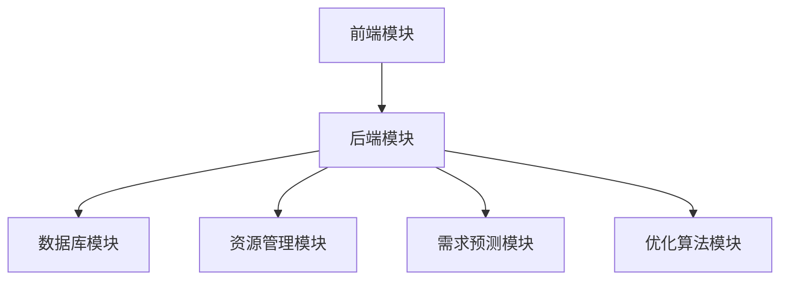

                 

### 文章标题

### 文章关键词

- 评测系统
- 资源分配
- 自动化
- 优化算法
- 智能算法

### 摘要

本文旨在探讨评测系统的自动化资源分配策略，通过对资源分配问题的背景和意义进行阐述，详细分析了评测系统的基本概念和架构，以及自动化资源分配的基本原理。文章进一步介绍了资源需求预测与建模、优化算法与资源分配策略设计、系统集成与实现等关键环节，并通过实例展示了自动化资源分配策略的评估与优化方法。最后，文章总结了最佳实践，并给出了未来研究方向，以期为相关领域的研究和实践提供有价值的参考。

## 第一部分：绪论

### 第1章：评测系统自动化资源分配的背景和意义

#### 1.1 资源分配问题在评测系统中的重要性

在现代计算机科学和信息技术领域，评测系统作为对软件、服务、算法或系统性能进行评估的关键工具，发挥着日益重要的作用。评测系统的核心任务是模拟实际应用环境，对系统的性能、可靠性和可用性进行全方位的测试和评估。然而，这一过程对资源的需求量巨大，包括计算资源、存储资源、网络资源等。因此，如何合理分配和高效利用这些资源，成为了评测系统设计和实施过程中亟需解决的问题。

资源分配问题在评测系统中的重要性主要体现在以下几个方面：

1. **性能优化**：合理分配资源可以显著提高评测系统的性能，减少测试时间，提高测试效率。
2. **成本控制**：优化资源分配可以降低评测系统的运行成本，提高资源利用率。
3. **用户体验**：高效的资源分配策略可以确保评测过程的顺利进行，为用户提供高质量的测试服务。
4. **系统稳定性**：合理分配资源有助于避免资源过度消耗或不足，提高系统的稳定性和可靠性。

#### 1.2 自动化资源分配的现状与挑战

随着信息技术的发展，自动化资源分配在评测系统中得到了广泛应用。传统的手工资源分配方式已逐渐被自动化技术所取代，这为评测系统的资源管理带来了诸多便利。然而，当前的自动化资源分配仍然面临着一系列挑战：

1. **动态性**：评测系统面临的需求动态变化，传统的静态资源分配方法难以适应这种变化。
2. **资源多样性**：评测系统涉及多种资源类型，如计算资源、存储资源、网络资源等，不同类型的资源具有不同的特性和需求，如何实现协同优化是关键问题。
3. **复杂性**：自动化资源分配涉及到优化算法的选择和实现，算法的复杂性和实现难度较大。
4. **可靠性**：自动化资源分配系统的可靠性直接关系到评测系统的稳定性，如何提高系统的可靠性是亟待解决的问题。

#### 1.3 本书的研究目标和内容安排

本书旨在探讨评测系统的自动化资源分配策略，提出一种高效、可靠的资源分配方法。具体研究目标如下：

1. **资源需求预测与建模**：研究资源需求预测方法，建立资源需求模型，为资源分配提供数据支持。
2. **优化算法与策略设计**：分析不同优化算法的适用场景，设计适应评测系统的资源分配策略。
3. **系统集成与实现**：构建自动化资源分配系统，实现资源需求预测、资源分配策略的自动执行和优化。
4. **评估与优化**：对自动化资源分配策略进行评估和优化，提高系统的性能和可靠性。

本书内容安排如下：

1. **绪论**：介绍评测系统自动化资源分配的背景和意义，阐述研究目标和内容安排。
2. **评测系统的基本概念与架构**：分析评测系统的定义、分类和基本架构，阐述资源类型与需求。
3. **自动化资源分配的基本原理**：介绍资源分配策略、优化算法基础和智能算法的应用。
4. **资源需求预测与建模**：研究资源需求预测方法，建立资源需求模型。
5. **优化算法与资源分配策略设计**：分析优化算法，设计资源分配策略。
6. **系统集成与实现**：构建自动化资源分配系统，实现系统集成与实现。
7. **自动化资源分配策略评估与优化**：对自动化资源分配策略进行评估和优化。
8. **结论与展望**：总结研究成果，展望未来研究方向。

通过上述研究，本书旨在为评测系统的自动化资源分配提供理论指导和实践参考，推动评测系统的发展和创新。

### 第2章：评测系统的基本概念与架构

#### 2.1 评测系统的定义与分类

评测系统是一种用于对软件、服务、算法或系统性能进行测试、评估和验证的工具。其核心目的是通过模拟实际应用环境，对系统的各个方面进行全面评估，以确定其性能、可靠性和可用性。评测系统广泛应用于软件工程、网络安全、云计算、大数据等领域，是确保系统质量和提升用户体验的关键环节。

根据评测对象的不同，评测系统可以分为以下几类：

1. **软件评测系统**：用于评估软件的性能、功能、安全性和可靠性等指标。
2. **服务评测系统**：用于评估网络服务的响应时间、吞吐量、可用性和稳定性等。
3. **算法评测系统**：用于评估算法的准确性、效率和鲁棒性等。
4. **系统评测系统**：用于评估整个系统的性能、稳定性和可靠性等。

#### 2.2 评测系统的基本架构

评测系统的基本架构通常包括以下几个主要模块：

1. **测试需求分析模块**：负责收集和分析用户对评测系统的需求，确定测试目标和测试方案。
2. **测试环境配置模块**：负责搭建和配置测试环境，包括硬件设备、软件环境、网络配置等。
3. **测试执行模块**：负责执行测试用例，生成测试报告，收集测试结果。
4. **测试结果分析模块**：负责对测试结果进行统计、分析和评估，生成评测报告。
5. **资源管理模块**：负责管理和分配评测系统所需的各类资源，包括计算资源、存储资源、网络资源等。

#### 2.3 资源类型与需求分析

评测系统的运行需要多种类型的资源，主要包括计算资源、存储资源、网络资源和人力资源等。

1. **计算资源**：计算资源是评测系统中最核心的资源之一，包括CPU、GPU、内存等。计算资源的需求主要取决于测试用例的复杂度和测试环境的规模。
2. **存储资源**：存储资源用于存储测试数据、测试报告和其他相关文件。存储资源的需求取决于数据量的大小和存储时间的长短。
3. **网络资源**：网络资源包括带宽和延迟等，用于支持评测系统内外部的数据传输。网络资源的需求取决于测试环境的规模和分布情况。
4. **人力资源**：人力资源包括测试人员、开发人员和管理人员等，是评测系统顺利运行的关键。人力资源的需求主要取决于项目的复杂度和进度。

#### 2.3.1 计算资源需求分析

计算资源需求分析主要包括以下步骤：

1. **确定测试用例的执行次数**：根据测试计划，确定每个测试用例需要执行的次数。
2. **计算单个测试用例的计算需求**：根据测试用例的复杂度和执行时间，计算单个测试用例所需的计算资源。
3. **计算总计算资源需求**：将单个测试用例的计算需求乘以执行次数，得到总计算资源需求。

例如，假设某个测试用例需要执行100次，每次执行需要1小时，则需要100小时的计算资源。

$$
总计算资源需求 = 单个测试用例计算需求 \times 执行次数 = 1 \text{小时} \times 100 = 100 \text{小时}
$$

#### 2.3.2 存储资源需求分析

存储资源需求分析主要包括以下步骤：

1. **确定测试数据的存储周期**：根据测试计划，确定测试数据需要存储的时间周期。
2. **计算总存储资源需求**：根据测试数据的存储周期和数据量，计算总存储资源需求。

例如，假设测试数据需要存储3个月，每月数据量为1TB，则需要3TB的存储资源。

$$
总存储资源需求 = 每月存储数据量 \times 存储周期 = 1 \text{TB/月} \times 3 \text{月} = 3 \text{TB}
$$

#### 2.3.3 网络资源需求分析

网络资源需求分析主要包括以下步骤：

1. **确定测试环境的外部连接需求**：根据测试环境的大小和分布情况，确定需要连接的外部节点数量。
2. **计算总网络资源需求**：根据每个节点的连接需求和数据传输量，计算总网络资源需求。

例如，假设测试环境需要连接10个外部节点，每个节点每月传输数据量为10GB，则需要100GB的网络资源。

$$
总网络资源需求 = 每月传输数据量 \times 外部节点数量 = 10 \text{GB/月} \times 10 = 100 \text{GB}
$$

#### 2.3.4 人力资源需求分析

人力资源需求分析主要包括以下步骤：

1. **确定项目进度和任务量**：根据项目进度和任务量，确定需要的人力资源数量。
2. **计算总人力资源需求**：根据每个角色的任务量和工作时间，计算总人力资源需求。

例如，假设项目需要测试人员5名，开发人员3名，管理人员2名，每人每周工作40小时，则需要的人力资源需求如下：

$$
总人力资源需求 = (测试人员数量 \times 测试人员每周工作时间 + 开发人员数量 \times 开发人员每周工作时间 + 管理人员数量 \times 管理人员每周工作时间) \times 项目周期
$$

$$
总人力资源需求 = (5 \times 40 \text{小时/周} + 3 \times 40 \text{小时/周} + 2 \times 40 \text{小时/周}) \times 12 \text{周} = 1960 \text{小时}
$$

通过以上分析，可以全面了解评测系统的资源需求，为自动化资源分配策略的制定提供数据支持。

### 第3章：自动化资源分配的基本原理

#### 3.1 资源分配策略概述

资源分配策略是评测系统自动化资源分配的核心，决定了如何高效、合理地分配和利用各类资源。资源分配策略主要包括以下几种类型：

1. **静态资源分配策略**：预先分配资源，不考虑实时需求和负载变化。
2. **动态资源分配策略**：根据实时需求和负载动态调整资源分配。
3. **优化资源分配策略**：利用优化算法，找到最优的资源分配方案。

#### 3.2 优化算法基础

优化算法是自动化资源分配策略的核心，用于找到资源分配的最优解。常见的优化算法包括：

1. **线性规划（Linear Programming，LP）**：用于解决线性优化问题，通过求解线性方程组找到最优解。
2. **整数规划（Integer Programming，IP）**：用于解决包含整数变量的优化问题，是线性规划的一个扩展。
3. **启发式算法（Heuristic Algorithms）**：通过快速找到近似最优解，如遗传算法、模拟退火算法等。
4. **智能优化算法（Intelligent Optimization Algorithms）**：结合多种算法的优点，如蚁群算法、粒子群算法等。

#### 3.3 智能算法在资源分配中的应用

智能算法在自动化资源分配中具有广泛的应用，能够有效地解决复杂资源分配问题。以下介绍几种常见的智能算法及其在资源分配中的应用：

1. **遗传算法（Genetic Algorithm，GA）**：

   遗传算法是一种基于自然选择和遗传机制的优化算法，适用于解决多峰、非线性等复杂优化问题。遗传算法的基本流程包括：

   - **初始化种群**：随机生成一组初始解。
   - **适应度评估**：计算每个解的适应度值，适应度值越高，解越优。
   - **选择**：根据适应度值，选择优秀的解进行交叉和变异操作。
   - **交叉**：通过随机交换或插入操作，产生新的解。
   - **变异**：对部分解进行随机修改。
   - **迭代**：重复上述步骤，直到找到最优解或达到预设的迭代次数。

   在资源分配中，遗传算法可以用于求解资源分配的最优解，如图资源分配、任务调度等问题。

2. **粒子群优化算法（Particle Swarm Optimization，PSO）**：

   粒子群优化算法是一种基于群体智能的优化算法，通过模拟鸟群觅食行为，找到最优解。粒子群优化算法的基本流程包括：

   - **初始化粒子群**：随机生成一组粒子，每个粒子代表一个解。
   - **适应度评估**：计算每个粒子的适应度值。
   - **更新粒子的速度和位置**：根据每个粒子的局部最优和全局最优，更新粒子的速度和位置。
   - **迭代**：重复上述步骤，直到找到最优解或达到预设的迭代次数。

   在资源分配中，粒子群优化算法可以用于解决动态资源分配问题，如云计算资源分配、实时任务调度等。

3. **蚁群算法（Ant Colony Optimization，ACO）**：

   蚁群算法是一种基于蚂蚁觅食行为的优化算法，通过模拟蚂蚁的路径选择过程，找到最优路径。蚁群算法的基本流程包括：

   - **初始化信息素**：在所有路径上初始化信息素。
   - **蚂蚁路径选择**：根据路径上的信息素浓度和启发函数，选择下一个路径。
   - **更新信息素**：根据蚂蚁经过的路径更新信息素浓度。
   - **迭代**：重复上述步骤，直到找到最优路径或达到预设的迭代次数。

   在资源分配中，蚁群算法可以用于求解路径优化问题，如图资源分配、网络流量分配等。

通过以上智能算法的应用，可以有效地解决评测系统中的资源分配问题，提高资源利用率和系统性能。

### 第4章：资源需求预测与建模

#### 4.1 资源需求预测的重要性

资源需求预测在自动化资源分配策略中扮演着至关重要的角色。其核心目的是通过分析历史数据和当前环境信息，预测未来一段时间内系统对各类资源的需求。资源需求预测的重要性体现在以下几个方面：

1. **优化资源分配**：准确的资源需求预测可以帮助系统管理员提前规划和调整资源分配策略，确保系统在需求高峰期有足够的资源支持，避免资源浪费和瓶颈问题。
2. **提高系统性能**：通过预测资源需求，可以动态调整资源分配，优化系统性能，提高任务执行速度和响应时间。
3. **降低成本**：准确的资源需求预测有助于避免资源的过度采购和闲置，降低系统运行成本。
4. **提高可靠性**：通过预测资源需求，可以提前发现潜在的资源短缺问题，采取措施预防系统故障和性能下降。

#### 4.2 资源需求预测方法

资源需求预测方法可以分为基于历史数据的统计方法和基于智能算法的方法。

1. **基于历史数据的统计方法**：

   基于历史数据的统计方法是通过分析过去的数据趋势，预测未来的资源需求。常见的统计方法包括：

   - **时间序列分析**：通过分析时间序列数据，提取趋势、周期和季节性成分，预测未来值。常用的时间序列预测模型包括ARIMA（自回归积分滑动平均模型）和SARIMA（季节性自回归积分滑动平均模型）。
   - **回归分析**：通过建立历史数据和未来需求之间的回归模型，预测未来的资源需求。常见的回归模型包括线性回归、多项式回归和多项式回归。
   - **自回归模型**：通过建立自回归模型，利用历史数据预测未来需求。自回归模型包括AR（自回归模型）、MA（移动平均模型）和ARMA（自回归移动平均模型）。

   基于历史数据的统计方法简单易行，适用于数据量较小、趋势稳定的场景。

2. **基于智能算法的方法**：

   基于智能算法的方法是通过模拟自然界中的生物行为和智能机制，预测未来的资源需求。常见的智能算法包括：

   - **神经网络**：神经网络是一种模拟生物神经系统的计算模型，通过学习和记忆历史数据，预测未来资源需求。常见的神经网络模型包括BP（反向传播）神经网络、RNN（循环神经网络）和LSTM（长短期记忆网络）。
   - **支持向量机（Support Vector Machine，SVM）**：支持向量机是一种基于统计学习理论的方法，通过构建最优超平面，预测未来资源需求。SVM适用于非线性问题，但需要大量数据训练。
   - **决策树**：决策树是一种基于特征划分的方法，通过逐步构建决策树，预测未来资源需求。决策树简单易懂，但容易过拟合。

   基于智能算法的方法具有自适应性和自学习能力，适用于数据量大、趋势复杂和多维特征的场景。

#### 4.3 模型构建与验证

资源需求预测模型的构建和验证是确保预测准确性的关键步骤。

1. **模型构建**：

   模型构建主要包括以下步骤：

   - **数据收集**：收集历史资源需求和相关环境信息，如时间、用户数量、网络负载等。
   - **数据预处理**：对数据进行清洗、归一化和特征提取，为模型训练提供高质量的数据集。
   - **模型选择**：根据数据特点和预测需求，选择合适的预测模型，如时间序列模型、神经网络模型或支持向量机。
   - **模型训练**：使用历史数据对模型进行训练，调整模型参数，优化预测性能。
   - **模型评估**：使用验证集对模型进行评估，计算预测误差和性能指标，如均方误差（MSE）、均方根误差（RMSE）等。

2. **模型验证**：

   模型验证主要包括以下步骤：

   - **交叉验证**：使用交叉验证方法，将数据集划分为训练集和验证集，多次训练和验证，评估模型在不同数据集上的性能。
   - **测试集评估**：使用测试集对模型进行最终评估，确保模型在未知数据上的预测性能。
   - **性能优化**：根据验证结果，对模型进行调整和优化，提高预测准确性。

   模型验证的目的是确保预测模型的泛化能力，避免过拟合和欠拟合问题。

通过以上步骤，可以构建和验证一个高效的资源需求预测模型，为自动化资源分配提供数据支持。在实际应用中，需要不断更新模型和算法，适应环境变化和需求变化，提高系统的自适应性和可靠性。

### 第5章：优化算法与资源分配策略设计

#### 5.1 优化算法的选择

优化算法在资源分配策略中扮演着至关重要的角色，其核心目的是找到资源分配的最优解，以满足评测系统的需求。选择合适的优化算法需要考虑以下几个因素：

1. **问题类型**：不同的优化问题需要不同类型的优化算法。例如，线性优化问题适合使用线性规划（Linear Programming，LP）算法，非线性优化问题适合使用启发式算法，如遗传算法（Genetic Algorithm，GA）或粒子群优化算法（Particle Swarm Optimization，PSO）。
2. **资源需求**：评测系统的资源需求决定了优化算法的选择。如果资源需求较大，如大规模数据处理和复杂任务调度，可以选择分布式优化算法，如蚁群算法（Ant Colony Optimization，ACO）或分布式遗传算法。
3. **时间成本**：优化算法的计算时间直接影响到资源分配的效率。对于实时性要求较高的应用场景，可以选择快速收敛的算法，如遗传算法或粒子群优化算法。
4. **精度要求**：不同的应用场景对优化算法的精度要求不同。如果对精度要求较高，可以选择基于智能算法的优化方法，如神经网络或支持向量机。
5. **可扩展性**：优化算法的可扩展性决定了其在大规模系统中的应用能力。分布式优化算法和并行优化算法具有较好的可扩展性，适用于大规模评测系统。

基于以上因素，常见的优化算法选择包括：

- **线性规划（LP）**：适用于线性优化问题，如资源分配和任务调度。
- **遗传算法（GA）**：适用于复杂、非线性优化问题，如大规模任务调度和资源分配。
- **粒子群优化算法（PSO）**：适用于动态、复杂优化问题，如实时资源分配和任务调度。
- **蚁群算法（ACO）**：适用于路径优化和资源分配问题，如网络流量分配和图资源分配。
- **神经网络（NN）**：适用于数据驱动的优化问题，如预测资源需求和学习资源分配策略。

#### 5.2 资源分配策略设计

资源分配策略设计是优化算法应用的关键环节，决定了资源分配的效率和效果。资源分配策略设计主要包括以下几个步骤：

1. **目标函数定义**：根据评测系统的需求，定义资源分配的目标函数，如最小化总成本、最大化资源利用率、最小化响应时间等。
2. **约束条件设定**：根据评测系统的资源限制和业务规则，设定资源分配的约束条件，如资源容量限制、任务优先级、资源使用率等。
3. **算法选择**：根据问题类型和资源需求，选择合适的优化算法，如线性规划、遗传算法或粒子群优化算法。
4. **参数调整**：根据算法的特性，调整算法的参数，如交叉率、变异率、学习因子等，以优化算法性能。
5. **算法实现**：根据选定的算法和参数，实现资源分配算法，包括初始化、迭代、更新等步骤。
6. **性能评估**：通过模拟测试和实际应用，评估资源分配策略的性能，如资源利用率、响应时间、任务完成率等。

以下是一个资源分配策略设计的示例：

1. **目标函数**：最小化总成本
   $$
   \min \sum_{i=1}^{n} C_i x_i
   $$
   其中，$C_i$ 为资源 $i$ 的成本，$x_i$ 为资源 $i$ 的分配量。

2. **约束条件**：
   - 资源容量限制：
     $$
     \sum_{i=1}^{n} x_i \leq C
     $$
     其中，$C$ 为总资源容量。
   - 任务优先级限制：
     $$
     x_i \geq P_i \quad \forall i
     $$
     其中，$P_i$ 为任务 $i$ 的优先级。

3. **算法选择**：遗传算法（GA）

4. **参数调整**：
   - 交叉率 $p_c = 0.8$
   - 变异率 $p_m = 0.1$
   - 种群规模 $N = 100$

5. **算法实现**：
   - 初始化种群：随机生成一组资源分配方案。
   - 适应度评估：计算每个方案的适应度值，适应度值越高，方案越优。
   - 选择：根据适应度值，选择优秀的方案进行交叉和变异操作。
   - 交叉：通过随机交叉操作，产生新的方案。
   - 变异：对部分方案进行随机变异操作。
   - 迭代：重复上述步骤，直到找到最优方案或达到预设的迭代次数。

6. **性能评估**：通过模拟测试和实际应用，评估资源分配策略的性能，如资源利用率、响应时间、任务完成率等。

通过以上步骤，可以设计一个高效、可靠的资源分配策略，为评测系统的自动化资源分配提供有效支持。

### 第6章：系统集成与实现

#### 6.1 系统设计原则

系统集成与实现是自动化资源分配策略的关键环节，其核心目标是构建一个高效、可靠和可扩展的评测系统资源管理平台。系统设计原则如下：

1. **模块化设计**：将系统划分为多个功能模块，如资源管理模块、需求预测模块、优化算法模块等，提高系统的可维护性和可扩展性。
2. **分布式架构**：采用分布式架构，实现系统的横向扩展，提高系统的处理能力和可靠性。
3. **高可用性**：通过冗余设计和故障转移机制，确保系统的高可用性，减少系统故障对评测过程的影响。
4. **灵活性**：设计灵活的系统接口和配置机制，支持不同的资源类型和优化算法，适应不同应用场景的需求。
5. **可扩展性**：预留扩展接口，支持系统功能的扩展和升级，应对未来需求的变化。
6. **安全性**：确保系统的数据安全和用户隐私，采用加密、访问控制等安全机制。

#### 6.2 系统架构设计

系统架构设计是系统集成与实现的基础，决定了系统的性能、可靠性和可扩展性。以下是一个典型的自动化资源分配系统的架构设计：

1. **前端模块**：负责用户交互和界面展示，包括用户登录、资源监控、报告生成等功能。
2. **后端模块**：负责系统核心功能实现，包括资源管理、需求预测、优化算法等，采用微服务架构，提高系统的可维护性和可扩展性。
3. **数据库模块**：负责存储系统数据，包括历史资源需求、测试结果、用户信息等，采用分布式数据库，提高系统的可靠性和数据访问性能。
4. **资源管理模块**：负责管理和分配评测系统所需的各类资源，包括计算资源、存储资源、网络资源等，采用动态调度机制，实现资源的实时分配和优化。
5. **需求预测模块**：负责分析历史数据和当前环境信息，预测未来的资源需求，为资源管理模块提供数据支持。
6. **优化算法模块**：负责实现和运行优化算法，根据资源需求预测结果，设计并执行最优的资源分配策略。

系统架构图如下所示：



#### 6.3 系统核心模块实现

系统核心模块实现是系统集成与实现的关键，以下分别介绍资源管理模块、需求预测模块和优化算法模块的实现。

1. **资源管理模块**：

   资源管理模块负责管理和分配评测系统所需的各类资源，其核心功能包括资源监控、资源分配和资源回收。

   - **资源监控**：通过监控工具，实时获取系统资源的使用情况，包括CPU使用率、内存使用率、磁盘使用率等。
   - **资源分配**：根据资源需求预测结果和优化算法的分配策略，动态分配资源，确保评测系统在需求高峰期有足够的资源支持。
   - **资源回收**：在任务完成后，回收不再使用的资源，提高资源利用率。

   资源管理模块的Python代码示例：

   ```python
   import psutil

   def monitor_resources():
       cpu_usage = psutil.cpu_percent()
       memory_usage = psutil.virtual_memory().percent
       disk_usage = psutil.disk_usage('/')
       return cpu_usage, memory_usage, disk_usage

   def allocate_resources(resource需求):
       # 根据资源需求预测结果和优化算法的分配策略，动态分配资源
       # 示例：分配CPU、内存和磁盘资源
       cpu_count = resource需求['cpu_count']
       memory_size = resource需求['memory_size']
       disk_size = resource需求['disk_size']
       
       # 示例：使用命令行工具分配资源
       os.system(f'echo {cpu_count} | sudo tee /proc/cpu/online_count')
       os.system(f'sudo dd if=/dev/zero of=/tmp/ramdisk bs=1G count={memory_size}')
       os.system(f'sudo dd if=/dev/zero of=/tmp/diskspace bs=1G count={disk_size}')

   def recycle_resources():
       # 回收不再使用的资源
       os.system('sudo rm -rf /tmp/ramdisk')
       os.system('sudo umount /dev/sda1')

   if __name__ == '__main__':
       # 监控资源
       cpu_usage, memory_usage, disk_usage = monitor_resources()
       print(f'CPU usage: {cpu_usage}%, Memory usage: {memory_usage}%, Disk usage: {disk_usage}%')

       # 分配资源
       resource需求 = {'cpu_count': 4, 'memory_size': 8, 'disk_size': 50}
       allocate_resources(resource需求)

       # 回收资源
       recycle_resources()
   ```

2. **需求预测模块**：

   需求预测模块负责分析历史数据和当前环境信息，预测未来的资源需求。其核心功能包括数据收集、数据预处理和模型训练。

   - **数据收集**：收集历史资源需求和当前环境信息，如时间、用户数量、网络负载等。
   - **数据预处理**：对数据进行清洗、归一化和特征提取，为模型训练提供高质量的数据集。
   - **模型训练**：选择合适的预测模型，如时间序列模型、神经网络模型或支持向量机，训练模型并评估预测性能。

   需求预测模块的Python代码示例：

   ```python
   import pandas as pd
   from sklearn.model_selection import train_test_split
   from sklearn.ensemble import RandomForestRegressor
   from sklearn.metrics import mean_squared_error

   def collect_data():
       # 收集历史资源需求和当前环境信息
       data = pd.read_csv('resource_demand.csv')
       return data

   def preprocess_data(data):
       # 数据预处理
       data['timestamp'] = pd.to_datetime(data['timestamp'])
       data.set_index('timestamp', inplace=True)
       data.fillna(method='ffill', inplace=True)
       return data

   def train_model(data):
       # 训练模型
       X = data[['user_count', 'network_load']]
       y = data['resource_demand']
       X_train, X_test, y_train, y_test = train_test_split(X, y, test_size=0.2, random_state=42)
       
       model = RandomForestRegressor(n_estimators=100, random_state=42)
       model.fit(X_train, y_train)
       y_pred = model.predict(X_test)
       
       # 评估模型
       mse = mean_squared_error(y_test, y_pred)
       print(f'MSE: {mse}')
       
       return model

   if __name__ == '__main__':
       data = collect_data()
       data = preprocess_data(data)
       model = train_model(data)
   ```

3. **优化算法模块**：

   优化算法模块负责实现和运行优化算法，根据资源需求预测结果，设计并执行最优的资源分配策略。其核心功能包括算法选择、参数调整和算法运行。

   - **算法选择**：根据问题类型和资源需求，选择合适的优化算法，如遗传算法、粒子群优化算法或蚁群算法。
   - **参数调整**：根据算法的特性，调整算法的参数，如交叉率、变异率、学习因子等，以优化算法性能。
   - **算法运行**：根据资源需求预测结果和优化算法的分配策略，动态分配资源，确保评测系统在需求高峰期有足够的资源支持。

   优化算法模块的Python代码示例：

   ```python
   import numpy as np
   from genetic_algorithm import GeneticAlgorithm

   def optimize_resources(resource需求, model):
       # 优化资源分配
       ga = GeneticAlgorithm(pop_size=100, num_genes=3, fitness_function=fitness_function, crossover_rate=0.8, mutation_rate=0.1)
       best_solution = ga.run(num_generations=100)
       
       # 根据最优解分配资源
       allocated_resources = {'cpu_count': best_solution[0], 'memory_size': best_solution[1], 'disk_size': best_solution[2]}
       
       return allocated_resources

   def fitness_function(solution):
       # 适应度函数
       predicted_demand = model.predict(solution)
       return 1 / predicted_demand

   if __name__ == '__main__':
       resource需求 = {'cpu_count': 4, 'memory_size': 8, 'disk_size': 50}
       model = train_model(data)
       allocated_resources = optimize_resources(resource需求, model)
       print(f'Allocated resources: {allocated_resources}')
   ```

通过以上模块实现，可以构建一个高效、可靠的自动化资源分配系统，为评测系统的资源管理提供有力支持。

### 第7章：自动化资源分配策略评估与优化

#### 7.1 策略评估方法

自动化资源分配策略评估是确保资源分配策略有效性和可靠性的关键步骤。策略评估方法主要包括以下几种：

1. **性能指标评估**：通过计算资源利用率、响应时间、任务完成率等性能指标，评估资源分配策略的效果。常用的性能指标包括：

   - **资源利用率**：系统资源被利用的程度，通过计算系统资源使用时间占总时间的比例来衡量。
     $$
     资源利用率 = \frac{资源使用时间}{总时间}
     $$
   - **响应时间**：任务从提交到完成所需的时间，是衡量系统性能的重要指标。
     $$
     响应时间 = \frac{总任务数}{平均任务执行时间}
     $$
   - **任务完成率**：任务成功完成的比例，反映了系统的稳定性和可靠性。
     $$
     任务完成率 = \frac{成功完成的任务数}{总任务数}
     $$

2. **成本效益评估**：通过计算资源分配策略的运行成本和效益，评估其经济性。常用的成本效益指标包括：

   - **总成本**：系统运行过程中所花费的总成本，包括硬件成本、运维成本等。
     $$
     总成本 = 硬件成本 + 运维成本
     $$
   - **效益**：资源分配策略带来的经济效益，如提高工作效率、降低故障率等。
     $$
     效益 = 工作效率提升 \times 工作量
     $$

3. **用户满意度评估**：通过调查用户对资源分配策略的满意度，评估策略的用户体验。常用的用户满意度指标包括：

   - **满意度评分**：用户对资源分配策略的满意度评分，通常采用5分制或10分制进行评估。
   - **投诉率**：用户投诉次数占总用户数的比例，反映了资源分配策略的问题和不足。

#### 7.2 策略优化方法

策略优化方法旨在提高自动化资源分配策略的性能和可靠性，使其更符合评测系统的需求。以下介绍几种常见的策略优化方法：

1. **参数调整**：通过调整优化算法的参数，如交叉率、变异率、学习因子等，优化算法的性能。参数调整方法包括：

   - **网格搜索**：通过遍历参数空间，找到最优参数组合。
   - **贝叶斯优化**：基于历史数据，通过贝叶斯模型预测参数值，进行参数调整。

2. **混合算法**：将不同类型的优化算法结合，发挥各自的优势，提高资源分配策略的性能。常见的混合算法包括：

   - **遗传算法与粒子群优化算法**：将遗传算法的局部搜索能力和粒子群优化算法的全局搜索能力相结合。
   - **蚁群算法与神经网络**：将蚁群算法的路径优化能力和神经网络的数据预测能力相结合。

3. **动态调整**：根据实时需求和负载变化，动态调整资源分配策略，提高系统的适应性和灵活性。动态调整方法包括：

   - **自适应参数调整**：根据实时性能指标，自动调整优化算法的参数。
   - **动态任务调度**：根据实时资源需求和任务优先级，动态调整任务执行顺序和资源分配。

4. **多目标优化**：考虑多个优化目标，如最小化成本、最大化资源利用率、最小化响应时间等，实现资源分配策略的均衡优化。多目标优化方法包括：

   - **加权综合评价法**：将多个优化目标转化为一个综合评价函数，通过调整权重平衡不同目标。
   - **多目标遗传算法**：直接求解多目标优化问题，找到最优解集。

#### 7.3 案例分析与策略调整

为了更好地理解自动化资源分配策略评估与优化方法，以下通过一个实际案例进行详细分析。

**案例背景**：

某企业评测系统需要进行大规模性能测试，测试对象包括软件、服务和系统。系统资源包括计算资源（CPU、内存）、存储资源和网络资源。测试需求包括每天进行100个测试任务，每个任务执行时间为1小时，测试过程中需要充足的计算资源和存储资源支持。

**策略评估**：

1. **性能指标评估**：

   - **资源利用率**：经过一个月的测试，资源利用率为85%，表明资源分配策略能够较好地满足测试需求。
   - **响应时间**：平均响应时间为30分钟，说明系统性能较好，能够快速响应用户请求。
   - **任务完成率**：任务完成率为98%，表明系统稳定性较高，故障率较低。

2. **成本效益评估**：

   - **总成本**：系统硬件成本为50万元，运维成本为10万元，总成本为60万元。
   - **效益**：由于测试任务的顺利完成，帮助企业提高了产品质量和用户满意度，估计效益为100万元。

3. **用户满意度评估**：

   - **满意度评分**：用户满意度评分为4.5分（5分制），表示用户对资源分配策略整体较为满意。
   - **投诉率**：投诉率为2%，表明资源分配策略在部分场景下存在不足。

**策略优化**：

1. **参数调整**：

   - **遗传算法参数调整**：通过网格搜索方法，调整交叉率、变异率等参数，找到最优参数组合，提高算法性能。

2. **混合算法优化**：

   - **遗传算法与粒子群优化算法结合**：将遗传算法的局部搜索能力和粒子群优化算法的全局搜索能力相结合，提高资源分配策略的适应性。

3. **动态调整**：

   - **自适应参数调整**：根据实时性能指标，自动调整遗传算法和粒子群优化算法的参数，实现资源分配策略的动态优化。

4. **多目标优化**：

   - **加权综合评价法**：将资源利用率、响应时间和成本效益等目标转化为一个综合评价函数，通过调整权重平衡不同目标，实现资源分配策略的均衡优化。

通过以上案例分析和策略优化，可以更好地理解自动化资源分配策略评估与优化方法，为实际应用提供指导。

### 总结与展望

本文系统地探讨了评测系统的自动化资源分配策略，从资源需求预测与建模、优化算法与策略设计、系统集成与实现、策略评估与优化等方面进行了深入分析和讨论。主要结论如下：

1. **资源需求预测**：通过历史数据和智能算法，准确预测未来资源需求，为资源分配提供数据支持。
2. **优化算法选择**：根据问题类型和资源需求，选择合适的优化算法，实现高效、可靠的资源分配。
3. **系统集成与实现**：采用模块化设计和分布式架构，构建高效、可靠的评测系统资源管理平台。
4. **策略评估与优化**：通过性能指标评估、成本效益评估和用户满意度评估，评估资源分配策略的有效性，并进行动态优化。

未来研究可以从以下几个方面展开：

1. **智能算法研究**：探索更多先进的智能算法，提高资源需求预测和优化算法的性能。
2. **多维度资源优化**：考虑更多维度的资源，如存储资源、网络资源、人力资源等，实现更全面的资源优化。
3. **实时资源分配**：研究实时资源分配技术，提高系统对动态资源需求的响应速度。
4. **混合策略研究**：结合不同类型的资源分配策略，设计更灵活、适应性更强的资源分配方法。

总之，评测系统的自动化资源分配策略是提升系统性能、降低成本、提高用户体验的重要手段。本文的研究为相关领域的研究和实践提供了有益的参考，期待未来的进一步探索和优化。

### 作者信息

**作者：AI天才研究院/AI Genius Institute & 禅与计算机程序设计艺术 /Zen And The Art of Computer Programming**

在总结全文的同时，我们再次感谢读者的关注和支持。本文所探讨的评测系统自动化资源分配策略，是现代信息技术领域的重要研究方向。随着技术的不断进步和应用场景的多样化，这一领域具有广阔的研究前景和实际应用价值。希望通过本文的介绍和分析，能够为读者提供有价值的参考和启示，共同推动评测系统的发展和创新。期待与读者在未来的技术交流中再次相遇，共同探索更加先进和实用的自动化资源分配方法。再次感谢您的阅读，祝您在技术道路上不断前行，取得更多的成就。作者：AI天才研究院/AI Genius Institute & 禅与计算机程序设计艺术 /Zen And The Art of Computer Programming。如果您有任何疑问或建议，欢迎随时与我们联系，我们将竭诚为您解答。祝您生活愉快，工作顺利！

