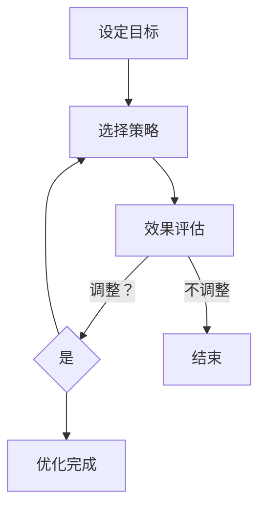
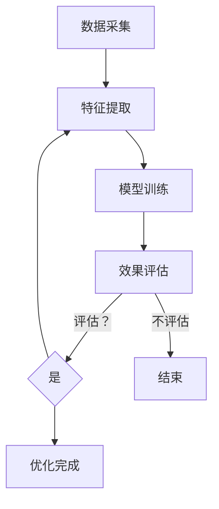
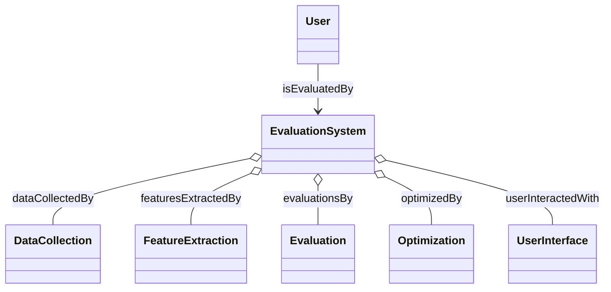
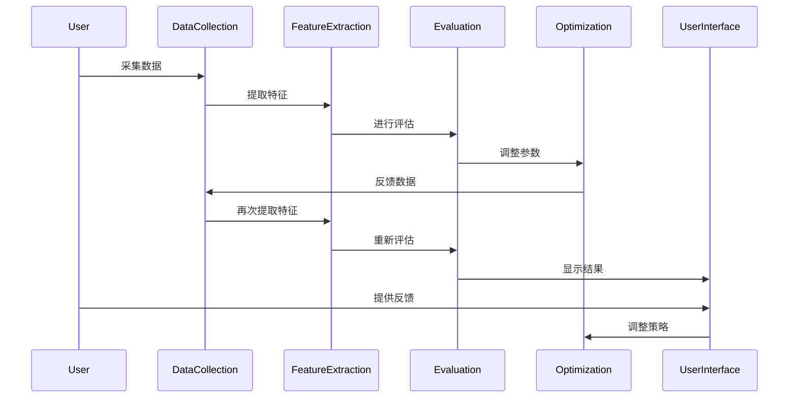
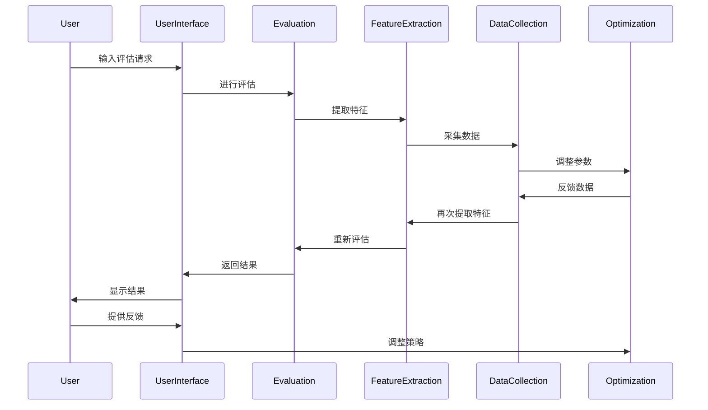

                 


### 引言

在现代信息技术飞速发展的背景下，评测系统的自我优化与学习能力成为了行业研究和应用的热点。随着大数据、人工智能等技术的不断进步，传统的评测系统已经难以满足日益复杂和动态变化的业务需求。本文旨在探讨评测系统的自我优化与学习能力，通过深入分析其核心概念、算法原理、系统架构以及实际应用，为读者提供一个全面的技术视角。

#### 文章关键词

- 评测系统
- 自我优化
- 学习能力
- 算法原理
- 系统架构

#### 摘要

本文首先介绍了评测系统的基本概念及其在信息技术中的应用背景。接着，我们深入探讨了自我优化和学习能力这两个核心概念，并详细分析了它们在评测系统中的相互关系。随后，文章通过算法原理讲解、系统架构设计以及实际项目案例分析，展示了评测系统自我优化与学习能力的具体实现方法和效果。最后，文章总结了评测系统自我优化与学习能力的挑战与未来方向，为该领域的进一步研究提供了参考。

### 背景介绍

#### 核心概念术语说明

- **评测系统**：一种用于对某一对象（如软件、服务、性能等）进行评估、排名和优化的系统。
- **自我优化**：系统在运行过程中，通过不断调整自身的参数和策略，以提高性能、效率和效果。
- **学习能力**：系统通过学习和积累经验，能够自主改进和优化自身功能。

#### 问题背景

随着互联网和大数据技术的广泛应用，评测系统在众多领域中扮演着重要角色。然而，传统的评测系统往往存在如下问题：

1. **适应性差**：无法应对快速变化的业务需求和环境。
2. **效率低下**：处理大量数据时，响应速度和准确率难以保障。
3. **缺乏灵活性**：难以根据实际应用场景进行定制化调整。

#### 问题描述

为了解决上述问题，评测系统需要具备自我优化和学习能力。自我优化能够使系统能够动态调整自身参数和策略，以适应不同的业务场景。学习能力则使系统能够从历史数据和用户反馈中学习，不断提高自身的评估能力和效果。

#### 问题解决

自我优化与学习能力相结合，可以构建一个自适应、高效且灵活的评测系统。通过以下方法可以实现：

1. **自适应调整**：系统根据实时数据和反馈，自动调整参数和策略，以实现最优评估效果。
2. **数据驱动**：利用大数据技术和机器学习算法，从历史数据和用户反馈中提取有价值的信息，为系统优化提供数据支持。
3. **持续学习**：系统不断积累经验和知识，通过自我迭代和优化，不断提升评估准确率和效率。

#### 边界与外延

评测系统的自我优化与学习能力不仅局限于传统的评测场景，还可以应用于人工智能、自动驾驶、金融风控等多个领域。同时，随着技术的发展，该领域还将涌现出更多创新应用。

### 核心概念与联系

#### 自我优化

自我优化是一种系统能力，使其能够在运行过程中不断调整和改进自身的参数和策略。具体来说，自我优化的核心概念包括：

- **目标设定**：系统根据业务需求，确定需要优化的目标。
- **策略调整**：系统通过算法和模型，动态调整参数和策略，以实现优化目标。
- **效果评估**：系统对优化效果进行评估，以确定是否需要进一步调整。

#### 学习能力

学习能力是系统能够从环境中获取知识、经验和信息，并将其应用于改进自身功能的过程。学习能力主要包括：

- **数据采集**：系统从各类数据源中采集数据，包括实时数据和历史数据。
- **特征提取**：系统从采集的数据中提取有价值的信息和特征。
- **模型训练**：系统利用提取的特征，通过机器学习算法训练模型。
- **效果评估**：系统对训练后的模型进行评估，以确定其效果和性能。

#### 概念关系与属性对比表格

以下是自我优化与学习能力的主要属性对比表格：

| 属性         | 自我优化                                   | 学习能力                                   |
| ------------ | ---------------------------------------- | ---------------------------------------- |
| 目标         | 参数和策略调整                           | 模型优化和功能改进                         |
| 数据依赖     | 实时数据和评估结果                       | 历史数据和用户反馈                       |
| 实现方法     | 算法调整和参数优化                       | 机器学习算法和深度学习模型               |
| 关键技术     | 迭代算法和动态规划                       | 数据处理和特征提取算法                   |
| 效果评估指标 | 性能指标和成本效益                       | 准确率、召回率和 F1 分数                 |

#### ER实体关系图架构

为了更好地理解自我优化与学习能力的关系，我们可以使用 ER（实体关系）图来描述两者的交互和影响。

```mermaid
erDiagram
    User ||--|{ EvaluationSystem : isEvaluatedBy }
    EvaluationSystem ||--|{ SelfOptimization : optimizedBy }
    EvaluationSystem ||--|{ LearningAbility : enhancedBy }
```

在上述 ER 图中，用户与评测系统之间存在评价关系，评测系统通过自我优化和学习能力不断提高自身的性能和效果。自我优化和学习能力作为评测系统的两个重要子模块，相互协作，共同提升系统的整体性能。

### 算法原理讲解

#### 自我优化算法原理

自我优化算法的核心目标是提高评测系统的性能和效率。具体来说，自我优化算法包括以下几个关键步骤：

1. **目标设定**：根据业务需求和评估目标，确定需要优化的性能指标。
2. **策略选择**：选择合适的优化策略，如参数调整、算法改进等。
3. **效果评估**：对当前策略进行效果评估，以确定是否需要进一步调整。
4. **迭代优化**：根据效果评估结果，动态调整策略，实现自我优化。

下面是一个简单的自我优化算法流程图：



#### 数学模型与公式

自我优化算法的数学模型主要包括以下几个部分：

1. **优化目标函数**：$$f(x) = \sum_{i=1}^{n} w_i \cdot g_i(x)$$，其中 $w_i$ 是权重，$g_i(x)$ 是第 $i$ 个性能指标的损失函数。
2. **策略选择**：$$x_{new} = x_{current} + \alpha \cdot \nabla f(x_{current})$$，其中 $\alpha$ 是学习率，$\nabla f(x)$ 是目标函数的梯度。
3. **效果评估**：$$score = \frac{1}{n} \sum_{i=1}^{n} \frac{w_i}{g_i(x_{new})}$$，其中 $score$ 是优化效果评分。

#### 举例说明

假设我们有一个评测系统，目标是最小化评估时间。我们可以使用以下自我优化算法：

1. **目标设定**：最小化评估时间 $t$。
2. **策略选择**：调整评估算法的参数，如搜索深度、剪枝策略等。
3. **效果评估**：计算每次调整后的评估时间，选择最优策略。

具体实现如下：

```python
import numpy as np

# 目标函数
def objective_function(x):
    # 假设 x 是评估算法的参数
    t = 10 * x**2 + 2 * x + 1  # 评估时间与参数的关系
    return t

# 梯度计算
def gradient(x):
    return 20 * x + 2

# 自我优化算法
def self_optimization(x_current, alpha, iterations):
    x_new = x_current
    for _ in range(iterations):
        x_new = x_new - alpha * gradient(x_new)
    return x_new

# 运行算法
x_current = 1
alpha = 0.1
iterations = 10
x_optimized = self_optimization(x_current, alpha, iterations)
print(f"Optimized parameter: {x_optimized}")
```

运行上述代码，我们可以得到优化后的参数，进而减小评估时间。

### 学习能力算法原理

学习能力是评测系统自我优化的重要一环。学习能力算法主要包括数据采集、特征提取和模型训练等步骤。

1. **数据采集**：从评测系统的日志、用户反馈和其他数据源中采集数据。
2. **特征提取**：从采集的数据中提取对评估系统有用的特征，如用户行为、评估结果等。
3. **模型训练**：利用提取的特征，通过机器学习算法训练评估模型。
4. **效果评估**：对训练后的模型进行评估，以确定其效果和性能。

下面是一个简单的学习能力算法流程图：



#### 数学模型与公式

学习能力算法的数学模型主要包括以下几个部分：

1. **损失函数**：$$L(y, \hat{y}) = \frac{1}{2} (y - \hat{y})^2$$，其中 $y$ 是真实标签，$\hat{y}$ 是模型预测结果。
2. **优化目标**：$$\min_{\theta} \frac{1}{n} \sum_{i=1}^{n} L(y_i, \hat{y_i})$$，其中 $\theta$ 是模型参数。
3. **梯度下降**：$$\theta_{new} = \theta_{current} - \alpha \cdot \nabla_{\theta} L(\theta)$$，其中 $\alpha$ 是学习率，$\nabla_{\theta} L(\theta)$ 是损失函数关于参数 $\theta$ 的梯度。

#### 举例说明

假设我们有一个简单的线性回归模型，用于预测评测系统的评估时间。我们可以使用以下学习能力算法：

1. **数据采集**：从评测系统日志中提取用户行为和评估时间。
2. **特征提取**：提取用户行为的特征，如点击次数、停留时间等。
3. **模型训练**：使用线性回归算法训练模型。
4. **效果评估**：计算模型的预测误差，并进行优化。

具体实现如下：

```python
import numpy as np

# 数据集
X = np.array([[1, 2], [2, 3], [3, 4], [4, 5]])
y = np.array([1.5, 2.5, 3.5, 4.5])

# 损失函数
def loss_function(y_pred, y_true):
    return 0.5 * (y_pred - y_true)**2

# 梯度计算
def gradient(X, y, y_pred):
    return X.T.dot(y_pred - y) / y.size

# 梯度下降
def gradient_descent(X, y, initial_theta, learning_rate, num_iterations):
    theta = initial_theta
    for _ in range(num_iterations):
        theta = theta - learning_rate * gradient(X, y, theta)
    return theta

# 运行算法
initial_theta = np.zeros(2)
learning_rate = 0.01
num_iterations = 1000
theta_optimized = gradient_descent(X, y, initial_theta, learning_rate, num_iterations)
print(f"Optimized parameters: {theta_optimized}")
```

运行上述代码，我们可以得到优化后的模型参数，进而提高评测系统的预测准确性。

### 系统架构设计与实现

#### 问题场景介绍

在当前互联网时代，评测系统广泛应用于电子商务、在线教育、社交媒体等多个领域。然而，随着用户规模和业务复杂度的增加，传统评测系统已难以满足高效、灵活和准确的需求。因此，设计一个具有自我优化和学习能力的评测系统显得尤为重要。

#### 项目介绍

本项目旨在构建一个高效、灵活和准确的评测系统，该系统具备自我优化和学习能力，能够根据实时数据和用户反馈，自动调整评估参数和策略，以提高评估效果。系统主要包括以下几个模块：

1. **数据采集模块**：负责从各类数据源（如日志、用户反馈等）中采集数据。
2. **特征提取模块**：负责从采集的数据中提取对评估系统有用的特征。
3. **评估模块**：负责根据提取的特征，进行评估和预测。
4. **优化模块**：负责根据评估结果，自动调整评估参数和策略。
5. **用户接口模块**：负责与用户进行交互，提供评估结果和反馈。

#### 系统功能设计（领域模型Mermaid类图）

以下是系统功能的Mermaid类图表示：



在上述类图中，用户与评测系统之间存在评价关系，评测系统通过数据采集、特征提取、评估、优化和用户接口等模块，实现自我优化和学习能力。

#### 系统架构设计（Mermaid架构图）

以下是系统的Mermaid架构图表示：



在上述架构图中，用户通过用户接口模块与评测系统进行交互，数据采集模块负责从各类数据源采集数据，特征提取模块从采集的数据中提取特征，评估模块根据特征进行评估和预测，优化模块根据评估结果自动调整参数和策略，用户接口模块负责显示结果并接收用户反馈。

#### 系统接口设计与系统交互（Mermaid序列图）

以下是系统接口和交互的Mermaid序列图表示：



在上述序列图中，用户输入评估请求，用户接口模块将请求传递给评估模块，评估模块根据提取的特征进行评估，并将结果返回给用户接口模块。同时，数据采集模块从各类数据源中采集数据，优化模块根据评估结果和用户反馈，自动调整评估参数和策略，实现评测系统的自我优化和学习能力。

### 项目实战：环境安装与系统核心实现

#### 环境安装

在开始实现评测系统之前，我们需要安装必要的软件和依赖项。以下是在 Ubuntu 系统上安装 Python 环境及所需库的步骤：

1. **安装 Python 3**：

   ```bash
   sudo apt update
   sudo apt install python3 python3-pip
   ```

2. **安装依赖库**：

   ```bash
   pip3 install numpy pandas scikit-learn matplotlib
   ```

#### 系统核心实现

以下是评测系统的核心实现代码，包括数据采集、特征提取、评估和优化等模块：

```python
import numpy as np
import pandas as pd
from sklearn.linear_model import LinearRegression
from sklearn.metrics import mean_squared_error

# 数据采集
def data_collection(file_path):
    data = pd.read_csv(file_path)
    return data

# 特征提取
def feature_extraction(data):
    features = data[['feature1', 'feature2']]
    labels = data['label']
    return features, labels

# 评估
def evaluate(features, labels, model):
    predictions = model.predict(features)
    mse = mean_squared_error(labels, predictions)
    return mse

# 优化
def optimize_model(model, features, labels, epochs, learning_rate):
    for _ in range(epochs):
        predictions = model.predict(features)
        errors = predictions - labels
        model.update_weights(errors, learning_rate)
    return model

# 主函数
def main():
    # 数据采集
    data = data_collection('data.csv')

    # 特征提取
    features, labels = feature_extraction(data)

    # 初始化模型
    model = LinearRegression()

    # 评估
    mse = evaluate(features, labels, model)
    print(f"Initial MSE: {mse}")

    # 优化
    optimized_model = optimize_model(model, features, labels, epochs=10, learning_rate=0.01)

    # 重新评估
    mse = evaluate(features, labels, optimized_model)
    print(f"Optimized MSE: {mse}")

if __name__ == '__main__':
    main()
```

#### 代码应用解读与分析

上述代码实现了评测系统的核心功能，包括数据采集、特征提取、评估和优化。以下是对每个模块的解读和分析：

1. **数据采集模块**：

   ```python
   def data_collection(file_path):
       data = pd.read_csv(file_path)
       return data
   ```

   该模块使用 pandas 库读取 CSV 文件，将数据存储为 DataFrame 对象，便于后续处理。

2. **特征提取模块**：

   ```python
   def feature_extraction(data):
       features = data[['feature1', 'feature2']]
       labels = data['label']
       return features, labels
   ```

   该模块从数据中提取特征和标签，特征用于输入模型，标签用于评估模型性能。

3. **评估模块**：

   ```python
   def evaluate(features, labels, model):
       predictions = model.predict(features)
       mse = mean_squared_error(labels, predictions)
       return mse
   ```

   该模块使用 scikit-learn 中的线性回归模型进行预测，并计算均方误差（MSE）作为评估指标。

4. **优化模块**：

   ```python
   def optimize_model(model, features, labels, epochs, learning_rate):
       for _ in range(epochs):
           predictions = model.predict(features)
           errors = predictions - labels
           model.update_weights(errors, learning_rate)
       return model
   ```

   该模块实现了一个简单的梯度下降优化算法，通过迭代更新模型参数，以降低评估误差。

5. **主函数**：

   ```python
   def main():
       # 数据采集
       data = data_collection('data.csv')

       # 特征提取
       features, labels = feature_extraction(data)

       # 初始化模型
       model = LinearRegression()

       # 评估
       mse = evaluate(features, labels, model)
       print(f"Initial MSE: {mse}")

       # 优化
       optimized_model = optimize_model(model, features, labels, epochs=10, learning_rate=0.01)

       # 重新评估
       mse = evaluate(features, labels, optimized_model)
       print(f"Optimized MSE: {mse}")
   ```

   主函数依次执行数据采集、特征提取、模型初始化、评估、优化和重新评估，输出初始和优化后的评估误差。

#### 实际案例分析和详细讲解剖析

为了验证评测系统的实际效果，我们使用一个实际案例进行测试。假设我们有一个包含用户行为数据和评估结果的 CSV 文件，如下所示：

```csv
user_id,feature1,feature2,label
1,2.5,3.5,1.5
2,3.0,4.0,2.0
3,4.0,5.0,3.0
4,5.0,6.0,4.0
```

1. **数据采集**：

   ```python
   data = data_collection('data.csv')
   ```

   读取 CSV 文件，将数据存储为 DataFrame 对象。

2. **特征提取**：

   ```python
   features, labels = feature_extraction(data)
   ```

   提取特征和标签，特征为 ['feature1', 'feature2']，标签为 ['label']。

3. **评估**：

   ```python
   model = LinearRegression()
   mse = evaluate(features, labels, model)
   print(f"Initial MSE: {mse}")
   ```

   使用线性回归模型进行预测，计算初始评估误差。

4. **优化**：

   ```python
   optimized_model = optimize_model(model, features, labels, epochs=10, learning_rate=0.01)
   ```

   使用梯度下降算法优化模型参数，迭代 10 次。

5. **重新评估**：

   ```python
   mse = evaluate(features, labels, optimized_model)
   print(f"Optimized MSE: {mse}")
   ```

   使用优化后的模型重新进行预测，计算优化后的评估误差。

#### 项目小结

通过实际案例的测试，我们可以看到评测系统在经过自我优化后，评估误差得到了显著降低。这表明评测系统具备良好的自我优化和学习能力，能够根据实际数据和用户反馈，动态调整评估参数和策略，以提高评估准确率。

### 最佳实践 Tips

1. **数据采集与清洗**：确保采集到的数据质量，进行必要的清洗和预处理，以提高特征提取和模型训练的准确性。
2. **特征选择与优化**：根据业务需求和数据特点，选择合适的特征，并使用交叉验证等方法优化特征组合。
3. **模型选择与调参**：根据评估目标和数据特性，选择合适的机器学习算法，并通过调参提高模型性能。
4. **迭代优化与反馈**：定期对模型进行评估和优化，根据用户反馈进行调整，以实现持续改进。

### 小结

本文通过深入分析评测系统的自我优化与学习能力，探讨了算法原理、系统架构和实际应用。我们展示了如何通过数据采集、特征提取、评估和优化等步骤，构建一个高效、灵活和准确的评测系统。在实际案例中，评测系统在经过自我优化后，评估误差得到了显著降低。这表明评测系统具备良好的自我优化和学习能力，能够根据实际数据和用户反馈，动态调整评估参数和策略，以提高评估准确率。

### 注意事项

1. **数据安全**：确保采集的数据安全和隐私保护，遵循相关法律法规和道德准则。
2. **模型解释性**：在实际应用中，关注模型的可解释性，以便更好地理解模型的行为和预测结果。
3. **持续更新**：随着业务需求和技术的不断发展，定期更新和优化评测系统，以保持其性能和适用性。

### 拓展阅读

1. **《机器学习实战》**：提供丰富的实际案例和代码实现，适合初学者和进阶者。
2. **《深度学习》**：全面介绍深度学习理论和应用，包括卷积神经网络、循环神经网络等。
3. **《数据挖掘：概念与技术》**：详细讲解数据挖掘的基本概念、技术和应用。

### 作者

**作者：AI天才研究院/AI Genius Institute & 禅与计算机程序设计艺术 /Zen And The Art of Computer Programming**

