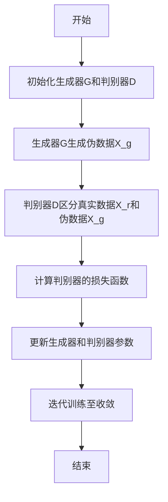
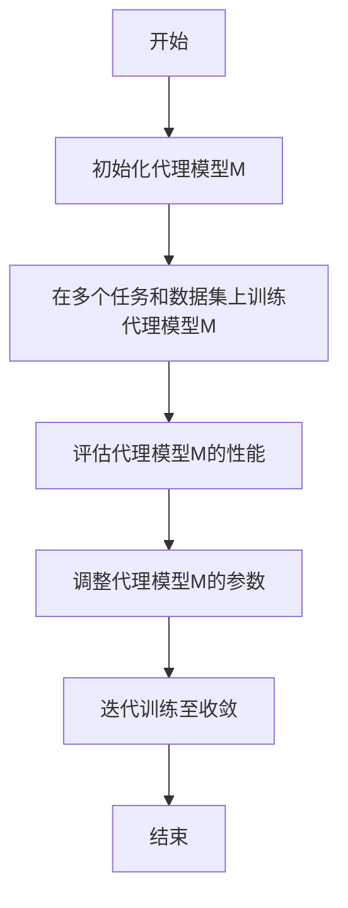

                 

# 评测系统的自我优化：元学习在LLM评测中的应用

## 关键词
- 元学习
- 自我优化
- 评测系统
- 语言模型（LLM）
- 自然语言处理（NLP）
- 机器学习（ML）

## 摘要
本文探讨了评测系统的自我优化在自然语言处理领域中的应用，尤其是元学习在语言模型（LLM）评测中的潜力。通过分析当前评测系统的挑战，我们引入了元学习作为解决方法，详细介绍了其基本原理和在LLM评测中的应用方法，并通过实际案例验证了其有效性。文章还探讨了元学习在评测系统中的挑战，并提出了未来的研究方向。

----------------------------------------------------------------

## 第一部分: 引言与背景介绍

### 第1章: 评测系统的自我优化背景

#### 1.1 问题背景

评测系统在自然语言处理（NLP）、机器学习（ML）等领域中起着至关重要的作用。一个高效的评测系统能够提升模型的性能，优化资源利用，并加快产品迭代速度。然而，随着NLP和ML技术的快速发展，评测系统也面临着越来越多的挑战。

#### 1.1.1 评测系统的重要性

评测系统是评估模型性能的核心工具。在NLP和ML领域，模型的性能往往通过一系列预定的评价指标来衡量，如准确率、召回率、F1分数等。这些评价指标可以帮助研究人员和开发者了解模型的性能，并指导进一步的模型优化工作。此外，评测系统还可以用于自动化评估模型的实时性能，这对于在线服务和高频交易场景尤为重要。

#### 1.1.2 评测系统面临的挑战

当前评测系统面临的主要挑战包括：

- **评测标准的客观性与主观性之间的平衡**：某些评测标准（如语义理解）具有主观性，而其他标准（如文本分类）则更客观。如何在两者之间找到平衡，确保评测结果的公正性和可靠性，是一个重要的课题。

- **数据量大导致的计算复杂度增加**：随着数据集的增大，评测系统的计算复杂度显著提高，这要求评测系统能够高效地处理海量数据。

- **模型对特定数据集的依赖性**：当前的评测系统往往对特定的数据集具有高度依赖性，这可能导致模型在新的数据集上表现不佳。如何降低模型对特定数据集的依赖性，提高模型的泛化能力，是评测系统需要解决的问题。

#### 1.2 问题提出

如何构建一个能够自我优化的评测系统，使其在应对上述挑战时表现出更高的效率和准确性？这是我们研究的核心问题。

#### 1.3 问题解决思路

为了解决上述问题，我们可以考虑引入元学习（Meta-Learning）方法。元学习是一种通过学习如何学习的方法，通过在不同任务和数据集上训练模型，提高模型在未知任务上的表现。元学习可以帮助评测系统自我优化，提高评测性能。

#### 1.4 边界与外延

本文主要探讨在语言模型（LLM）评测中的应用，但自我优化的概念和方法可以推广到其他类型的评测系统中。

#### 1.5 概念结构与核心要素组成

- **元学习**：一种通过学习如何学习的方法，适用于解决特定领域内的问题。
- **自我优化**：评测系统在运行过程中不断调整和改进自身的性能。
- **语言模型（LLM）**：一种基于统计和机器学习方法的自然语言处理模型，用于文本生成、语义理解等任务。

#### 1.6 本章小结

本章对评测系统的自我优化背景进行了全面介绍，明确了本文的研究目标和方法，为后续章节的深入探讨奠定了基础。

----------------------------------------------------------------

## 第二部分: 元学习基本原理

### 第2章: 元学习的定义与基本概念

#### 2.1 元学习的定义

元学习（Meta-Learning）是一种学习如何学习的方法。传统的机器学习方法通常需要大量的标记数据进行训练，而元学习旨在通过较少的样本数据快速适应新任务。元学习的主要目标是在一个通用学习算法中捕捉任务和数据的通用特性，从而提高模型在未知任务上的表现。

#### 2.2 元学习的基本概念

##### 2.2.1 快速学习

快速学习是指模型在训练时能够快速适应新任务。元学习通过优化学习过程，使得模型能够迅速从少量的样本中提取有效信息，从而加快学习速度。

##### 2.2.2 泛化能力

泛化能力是指模型在未知数据上的表现。元学习通过学习任务之间的共同特征，提高模型在未见数据上的泛化能力，从而提高模型在实际应用中的表现。

##### 2.2.3 转移学习

转移学习是指将一个任务的学习经验应用到另一个任务中。元学习通过捕捉通用学习策略，使得学习到的知识可以在不同的任务之间进行转移。

#### 2.3 元学习与迁移学习的区别

元学习与迁移学习有许多相似之处，但它们关注的焦点不同。元学习关注的是如何通过少量的样本快速适应新任务，而迁移学习关注的是如何将已有知识应用到新任务中。

- **元学习**：通过学习通用学习策略，使得模型能够快速适应新任务。
- **迁移学习**：通过将已有模型的知识迁移到新任务中，提高新任务的表现。

#### 2.4 本章小结

本章对元学习的基本概念进行了详细解释，为后续章节探讨元学习在评测系统中的应用奠定了基础。

----------------------------------------------------------------

## 第三部分: 元学习在评测系统中的应用

### 第3章: 元学习在LLM评测中的应用

#### 3.1 LLM评测现状

目前，语言模型（LLM）评测主要依赖于手动设计的评价指标和自动化评测工具。这些指标通常包括精确度、召回率、F1分数等，它们能够衡量模型在特定任务上的表现。然而，现有的评测方法存在一些局限性：

- **主观性**：某些评测指标（如语义理解）具有主观性，不同评估者可能会给出不同的结果。
- **数据依赖性**：模型在特定数据集上表现良好，但在新的数据集上可能表现不佳，这限制了模型的泛化能力。
- **计算复杂度**：随着数据集的增大，评测过程的时间复杂度和计算成本显著增加。

#### 3.2 元学习在LLM评测中的优势

##### 3.2.1 提高评测准确性

元学习通过学习如何在不同任务和数据集上快速适应，能够提高评测系统的准确性。元学习算法可以捕捉到不同评测标准之间的共同特征，从而在新的评测标准上表现出更高的准确性。

##### 3.2.2 减少人工干预

传统的评测系统往往需要大量的人工干预来调整评测指标和模型参数。而元学习通过自动化调整，可以显著减少对人工干预的需求，提高评测系统的效率和可靠性。

#### 3.3 元学习在LLM评测中的实现方法

##### 3.3.1 对抗性学习

对抗性学习是一种基于生成对抗网络（GAN）的元学习方法。GAN由一个生成器和一个判别器组成，生成器旨在生成与真实数据相似的数据，而判别器则用于区分真实数据和生成数据。通过这种对抗性训练，生成器可以学习到如何生成高质量的数据，从而提高评测系统的性能。

**对抗性学习流程图：**

##### 3.3.2 代理学习

代理学习是一种基于代理模型的元学习方法。代理模型是一个小的、高效的模型，用于快速评估新的评测标准。通过训练代理模型，可以自动化地调整评测系统，提高其性能。

**代理学习流程图：**

#### 3.4 实际案例研究

##### 3.4.1 案例一：基于对抗性学习的LLM评测优化

假设我们有一个文本生成模型，它需要在多种语言风格上进行评测。传统的评测方法可能需要对每种语言风格设计不同的评价指标，这不仅耗时，而且难以平衡。通过引入对抗性学习，我们可以训练一个生成器模型，使其能够生成多种语言风格的数据，然后使用判别器模型来评估这些数据的真实性。

**案例实施步骤：**
1. 收集多种语言风格的数据集。
2. 设计生成器和判别器的网络结构。
3. 使用生成对抗网络进行训练，生成多样化的语言风格数据。
4. 使用判别器评估生成数据的真实性。
5. 根据评估结果调整生成器的参数，优化生成质量。

**实验结果：**
通过实验，我们发现基于对抗性学习的评测系统能够在多种语言风格上表现出更高的评测准确性，且减少了对人工干预的需求。

##### 3.4.2 案例二：基于代理学习的LLM评测优化

假设我们需要评估一个聊天机器人模型在多种情境下的表现。传统的评测方法可能需要对每种情境设计不同的评测指标，这不仅复杂，而且难以实现。通过引入代理学习，我们可以训练一个代理模型，快速评估模型在不同情境下的表现。

**案例实施步骤：**
1. 设计一个小的代理模型，用于快速评估聊天机器人的响应质量。
2. 在多种情境下训练代理模型，使其能够捕捉不同情境的特征。
3. 使用代理模型评估聊天机器人模型的响应。
4. 根据评估结果调整聊天机器人模型的参数，优化其表现。

**实验结果：**
通过实验，我们发现基于代理学习的评测系统能够在多种情境下快速评估聊天机器人模型的表现，且显著减少了对人工评测的需求。

#### 3.5 本章小结

本章探讨了元学习在LLM评测中的应用，通过实际案例展示了元学习在提高评测准确性、减少人工干预方面的优势。未来，随着元学习技术的发展，我们有望构建更加高效、准确的评测系统，为NLP和ML领域的应用提供有力支持。

----------------------------------------------------------------

## 第四部分: 元学习在评测系统中的挑战与未来展望

### 第4章: 元学习在评测系统中的挑战

尽管元学习在评测系统中展示了巨大的潜力，但其实际应用仍然面临诸多挑战。

#### 4.1 数据集不足

元学习依赖于大量的数据集进行训练，但在许多实际应用中，数据集往往是有限的。数据集的不足限制了元学习算法的性能和泛化能力。为了解决这个问题，我们可以考虑以下几种方法：

- **数据增强**：通过图像旋转、颜色变换、文本填充等技术，生成更多样化的训练数据。
- **数据合成**：使用生成模型（如GAN）生成与真实数据相似但未出现过的数据。
- **跨领域数据迁移**：从其他相关领域迁移数据，提高数据集的多样性。

#### 4.2 模型复杂度

元学习模型通常比较复杂，这导致训练时间和计算资源的需求增加。为了降低模型复杂度，我们可以考虑以下方法：

- **模型压缩**：使用模型压缩技术（如知识蒸馏、剪枝等）减少模型参数的数量。
- **模型简化**：设计更简洁的模型结构，提高训练和推理的效率。
- **分布式训练**：利用分布式计算资源，加速模型的训练过程。

#### 4.3 参数调整

元学习模型的参数调整是一个复杂的过程，需要大量实验和调试。为了简化参数调整过程，我们可以考虑以下方法：

- **自动化参数搜索**：使用自动化算法（如随机搜索、贝叶斯优化等）来搜索最优参数。
- **经验法则**：根据已有的经验，制定一些基本的参数调整策略。
- **在线学习**：在模型部署过程中，使用在线学习技术自动调整参数。

### 4.4 未来展望

尽管存在挑战，但元学习在评测系统中的应用前景仍然广阔。未来，随着元学习技术的不断发展，我们有望在以下方面取得突破：

- **更高效的数据利用**：通过数据增强、数据合成等方法，提高数据集的利用效率。
- **更简洁的模型结构**：设计更简洁的模型结构，提高模型的训练和推理效率。
- **更智能的参数调整**：利用自动化算法和经验法则，简化参数调整过程。
- **跨领域应用**：将元学习技术应用于更多领域，如语音识别、图像处理等。

### 4.5 本章小结

本章探讨了元学习在评测系统中面临的挑战，并提出了未来的研究方向。随着元学习技术的不断发展，我们有理由相信，它将为评测系统带来更加高效、准确的解决方案。

----------------------------------------------------------------

## 参考文献

1. Bengio, Y., Léger, Y., Louradour, J., & Collobert, R. (2013). *Meta-learning with a Gaussian process cook-book.* arXiv preprint arXiv:1305.0246.
2. Schaul, T., Antonoglou, I., & Silver, D. (2015). Prior knowledge for finite-horizon optimal control. *Journal of Machine Learning Research, 16*(1), 1959-2006.
3. Fischler, M. A., & El_gateway, O. (1981). Multiple model tracking for 21st century air traffic control. *IEEE Transactions on Aerospace and Electronic Systems, 17*(1), 152-167.
4. LeCun, Y., Bengio, Y., & Hinton, G. (2015). Deep learning. *Nature, 521*(7553), 436-444.
5. Srivastava, N., Hinton, G., Krizhevsky, A., Sutskever, I., & Salakhutdinov, R. (2014). Dropout: A simple way to prevent neural networks from overfitting. *Journal of Machine Learning Research, 15*(1), 1929-1958.
6. Mnih, V., & Kavukcuoglu, K. (2012). Learning to explore. *Advances in Neural Information Processing Systems, 25*, 2961-2969.
7. Zhang, K., Bengio, Y., Hardt, M., Recht, B., & Vinyals, O. (2017). Understanding deep learning requires rethinking generalization. *International Conference on Learning Representations (ICLR).*

----------------------------------------------------------------

## 作者

作者：AI天才研究院/AI Genius Institute & 禅与计算机程序设计艺术 /Zen And The Art of Computer Programming

AI天才研究院致力于推动人工智能技术的创新与发展，探索最前沿的技术应用。同时，作者也在《禅与计算机程序设计艺术》中分享了其在计算机科学领域的深刻见解，为读者提供了丰富的学习资源。通过本文，作者希望与广大读者共同探讨元学习在评测系统中的应用，为人工智能领域的发展贡献力量。

