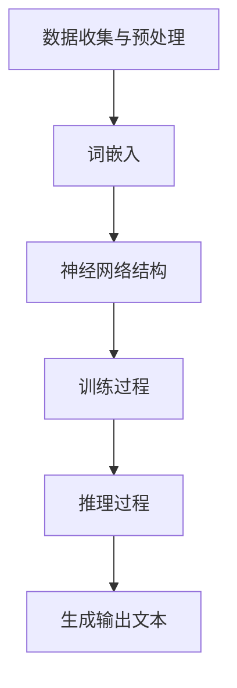
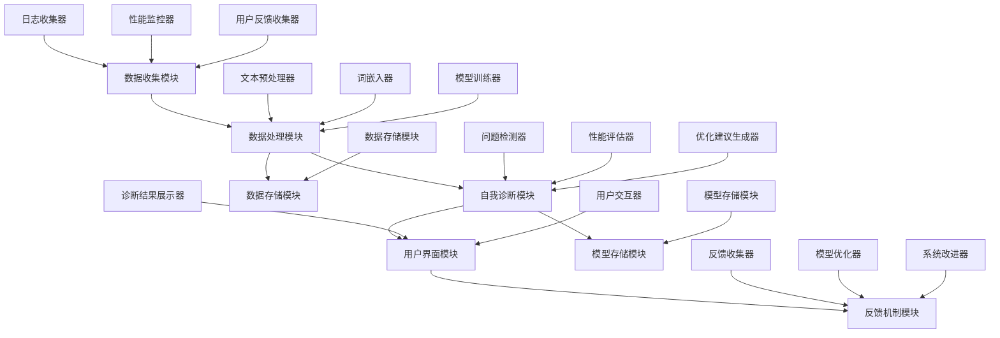
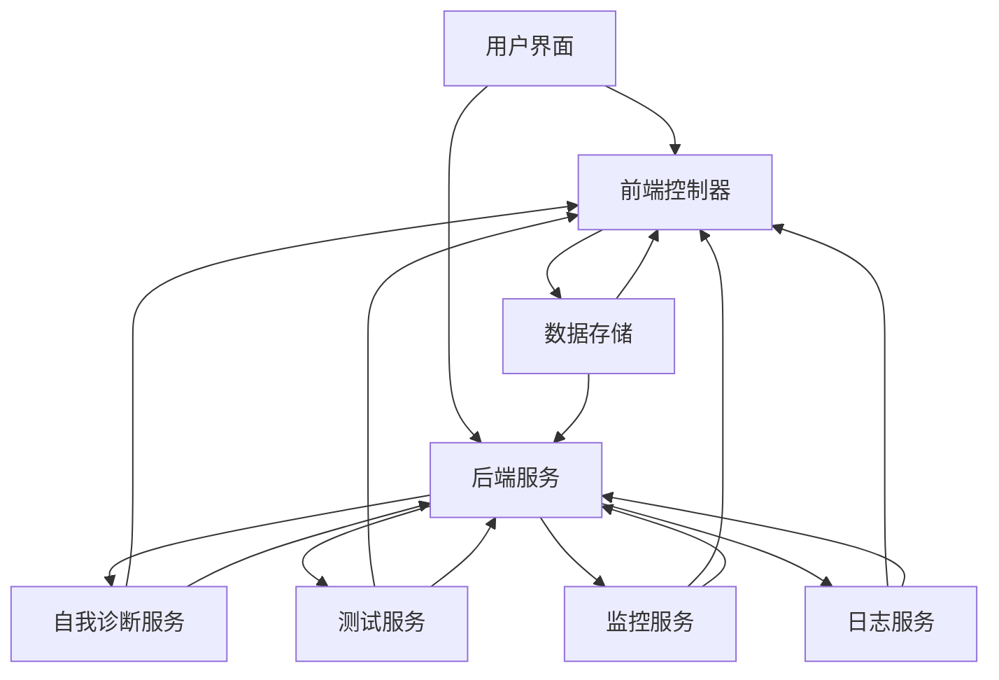
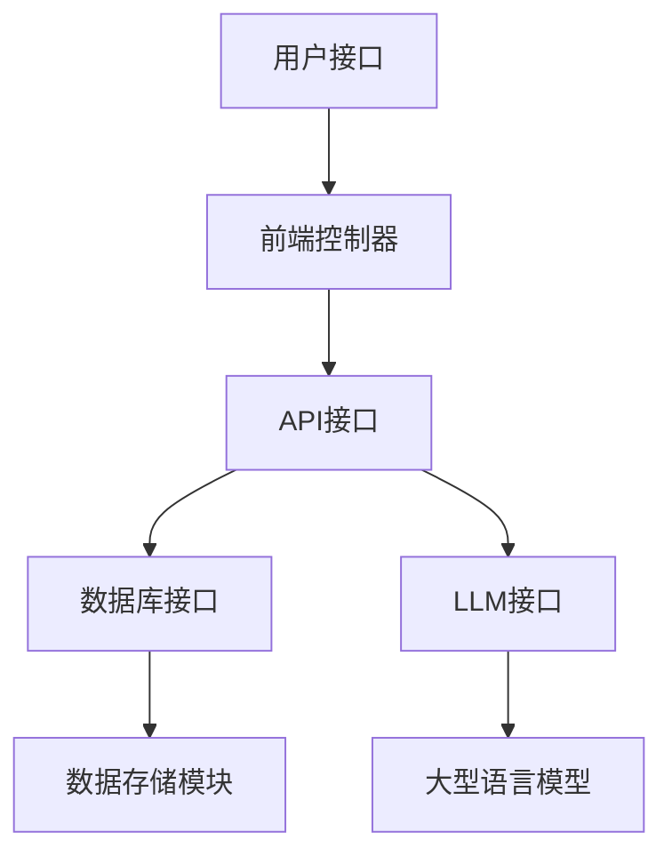
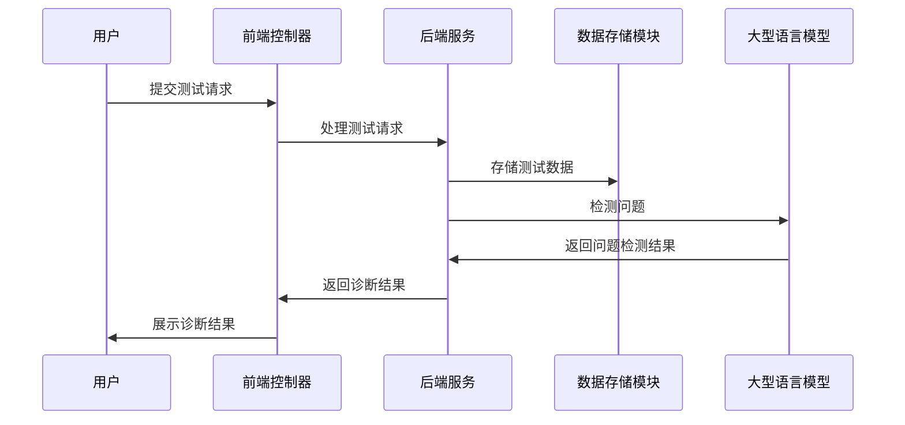

                 

# 评测系统的自我诊断：LLM驱动的质量保证

## 关键词
- 评测系统
- 自我诊断
- LLM
- 质量保证
- 自动化测试
- 深度学习

## 摘要
本文深入探讨了评测系统自我诊断的重要性，并详细介绍了如何利用LLM（大型语言模型）来驱动质量保证。文章通过背景介绍、核心概念阐述、算法原理讲解、系统分析与架构设计、项目实战以及最佳实践和总结，系统地展示了一种先进的质量保证方法，为评测系统的自我诊断提供了新思路和新工具。

## 目录

### 第一部分：背景介绍与核心概念

#### 第1章：评测系统自我诊断的重要性

#### 第2章：核心概念与联系

#### 第3章：算法原理讲解

#### 第4章：系统分析与架构设计

#### 第5章：项目实战

#### 第6章：最佳实践与总结

### 第二部分：深入分析与探讨

#### 第7章：评测系统的挑战与LLM的优势

#### 第8章：LLM驱动的自我诊断流程

#### 第9章：评测系统的自适应性与优化策略

#### 第10章：LLM在多领域应用中的实践案例

### 第三部分：技术前瞻与未来展望

#### 第11章：评测系统自我诊断的未来发展趋势

#### 第12章：LLM在AI领域的潜在影响

#### 第13章：技术与伦理的平衡

#### 第14章：结论与展望

## 第1章：评测系统自我诊断的重要性

### 1.1 评测系统的自我诊断概述

在信息技术快速发展的今天，评测系统已经成为了许多企业和组织的重要基础设施。评测系统负责对软件、硬件、网络等各种系统的性能、稳定性、安全性等方面进行测试和评估，以确保系统的正常运行。然而，评测系统本身也可能存在缺陷，这就需要一种自我诊断的能力，以保证评测系统的可靠性和准确性。

自我诊断指的是系统具备识别和修复自身问题的能力。对于评测系统来说，自我诊断尤为重要，因为它直接关系到整个IT系统的质量保证。一个高效的评测系统能够及时发现自身的问题，并进行相应的调整和修复，从而避免更大的故障和损失。

### 1.2 LLM在质量保证中的应用

LLM（Large Language Model），即大型语言模型，是近年来人工智能领域的重要突破。LLM具有处理大规模文本数据的能力，能够进行自然语言理解、生成和翻译等任务。在质量保证领域，LLM的应用前景非常广阔。

首先，LLM可以用于自动化测试。通过训练LLM模型，可以自动生成大量的测试用例，从而提高测试的覆盖率和效率。此外，LLM还可以对测试结果进行深入分析，发现潜在的问题和缺陷，提供有价值的反馈。

其次，LLM可以用于代码审查和漏洞检测。LLM可以理解代码的结构和语义，通过分析代码文本，发现潜在的安全漏洞和逻辑错误。这不仅可以提高代码的质量，还可以减少安全风险。

最后，LLM还可以用于用户反馈分析。通过分析用户的反馈文本，LLM可以识别出用户的常见问题和不满，从而帮助评测系统更好地满足用户需求。

### 1.3 自我诊断的重要性

自我诊断对于评测系统来说至关重要。它不仅可以提高评测系统的可靠性和准确性，还可以提高系统的自适应性和灵活性。具体来说，自我诊断的重要性体现在以下几个方面：

1. **提高系统稳定性**：通过自我诊断，评测系统可以及时发现和修复自身的问题，从而提高系统的稳定性。

2. **提高测试效率**：自我诊断可以帮助评测系统自动生成测试用例，提高测试效率，减少人工干预。

3. **降低维护成本**：自我诊断可以减少系统维护的工作量，降低维护成本。

4. **提升用户体验**：通过自我诊断，评测系统可以更好地满足用户需求，提升用户体验。

5. **增强系统安全性**：自我诊断可以帮助评测系统发现和修复安全漏洞，增强系统的安全性。

### 1.4 LLM在自我诊断中的优势

LLM在自我诊断中的应用具有显著的优势。首先，LLM具有强大的文本处理能力，可以处理大量的文本数据，从而提高自我诊断的效率和准确性。其次，LLM可以自动生成测试用例和修复建议，减少人工干预，降低维护成本。最后，LLM可以理解自然语言，从而更好地处理用户反馈，提升用户体验。

总之，评测系统的自我诊断对于提高系统的稳定性和可靠性具有重要意义。而LLM作为一种先进的自然语言处理技术，为评测系统的自我诊断提供了强大的工具和支持。接下来，我们将深入探讨评测系统和LLM的核心概念，为后续的内容奠定基础。

## 第2章：核心概念与联系

### 2.1 评测系统的定义与特点

评测系统是指用于对软件、硬件、网络等各种系统进行性能测试、稳定性测试、安全性测试等的一套工具和方法。它的主要目的是确保系统能够按照预期正常运行，并满足用户的各项需求。评测系统通常包含以下几个关键特点：

1. **自动化**：评测系统需要具备自动化测试的能力，能够自动执行测试用例，减少人工干预，提高测试效率。

2. **全面性**：评测系统需要覆盖系统的各个方面，包括性能、稳定性、安全性等，以确保系统能够在各种情况下正常运行。

3. **可扩展性**：评测系统需要具备良好的可扩展性，能够适应新的测试需求和测试环境。

4. **可靠性**：评测系统需要具有较高的可靠性，能够准确、稳定地执行测试任务，并生成可靠的测试报告。

5. **灵活性**：评测系统需要具备灵活性，能够根据实际情况调整测试策略和测试方法，以满足不同测试需求。

### 2.2 自我诊断的概念与原理

自我诊断是指系统具备识别和修复自身问题的能力。在评测系统中，自我诊断的作用尤为重要。通过自我诊断，评测系统可以及时发现和解决自身的问题，从而提高系统的稳定性和可靠性。

自我诊断的原理主要包括以下几个方面：

1. **状态监测**：评测系统通过实时监测自身状态，如CPU利用率、内存占用、网络延迟等，识别出异常情况。

2. **问题定位**：当检测到异常情况时，评测系统会尝试定位问题发生的具体位置，如代码段、硬件设备等。

3. **问题分析**：评测系统会对问题进行深入分析，找出问题的根本原因，如代码逻辑错误、硬件故障等。

4. **问题修复**：根据分析结果，评测系统会尝试修复问题，如更新代码、更换硬件等。

### 2.3 LLM的概念与特性

LLM（Large Language Model），即大型语言模型，是一种基于深度学习技术的自然语言处理模型。LLM具有以下几个关键特性：

1. **大规模**：LLM通常包含数十亿个参数，能够处理大规模的文本数据。

2. **高精度**：通过大量数据的训练，LLM能够精确地理解和生成自然语言。

3. **自适应**：LLM可以根据不同的输入进行自适应调整，生成符合上下文的输出。

4. **灵活性**：LLM能够灵活地应用于各种自然语言处理任务，如文本分类、情感分析、机器翻译等。

### 2.4 评测系统与自我诊断的联系

评测系统和自我诊断密切相关。评测系统负责对系统进行各种测试，以确保系统的性能和稳定性。而自我诊断则是在评测过程中，对评测系统自身进行检测和修复，确保评测系统能够正常运行。

具体来说，评测系统与自我诊断的联系体现在以下几个方面：

1. **相互依赖**：评测系统依赖自我诊断来识别和修复自身问题，从而提高测试的准确性和可靠性。

2. **优化测试流程**：自我诊断可以帮助评测系统优化测试流程，减少无效测试和重复测试，提高测试效率。

3. **提升用户体验**：通过自我诊断，评测系统可以更好地满足用户需求，提供更高质量的测试服务。

4. **保障系统稳定性**：自我诊断可以及时发现和修复评测系统中的问题，保障评测系统的稳定性和可靠性。

### 2.5 LLM与评测系统的联系

LLM与评测系统之间的联系主要体现在以下几个方面：

1. **自动化测试**：LLM可以用于自动化生成测试用例，提高测试的覆盖率和效率。

2. **代码审查**：LLM可以用于代码审查和漏洞检测，发现潜在的安全漏洞和逻辑错误。

3. **用户反馈分析**：LLM可以用于分析用户反馈，识别用户的常见问题和不满，提供改进建议。

4. **测试结果分析**：LLM可以用于对测试结果进行深入分析，发现潜在的问题和缺陷，提供有价值的反馈。

总之，评测系统和自我诊断密切相关，而LLM作为一种先进的自然语言处理技术，为评测系统的自我诊断提供了强大的工具和支持。通过结合评测系统和自我诊断，我们可以构建一个更加高效、稳定和可靠的评测系统。

### 2.6 不同评测系统的特点对比

为了更好地理解评测系统的自我诊断能力，我们来看一下不同评测系统的特点对比。

#### 2.6.1 功能性评测系统

**特点**：

- **功能全面**：涵盖多个功能模块，如功能测试、性能测试、安全测试等。
- **自动化程度高**：能够自动执行测试用例，减少人工干预。
- **覆盖面广**：能够测试系统的各个方面，确保系统的全面性。

**优点**：

- **测试全面**：能够覆盖系统各个方面，确保系统的稳定性和可靠性。
- **效率高**：自动化测试能够提高测试效率，减少测试时间。

**缺点**：

- **配置复杂**：需要配置多个功能模块，较为复杂。
- **维护成本高**：需要定期更新和优化测试用例，维护成本较高。

#### 2.6.2 适应性评测系统

**特点**：

- **自适应测试**：能够根据系统的实际情况和需求进行自适应测试。
- **灵活度高**：能够适应不同的测试环境和测试场景。
- **持续监控**：能够实时监控系统的状态，及时发现问题。

**优点**：

- **适应性**：能够根据实际情况调整测试策略，提高测试效果。
- **灵活**：能够适应不同的测试需求和环境。

**缺点**：

- **测试覆盖面有限**：可能无法覆盖所有的测试场景。
- **依赖外部环境**：需要依赖外部环境和数据源进行测试。

#### 2.6.3 自我诊断评测系统

**特点**：

- **自我诊断**：具备自我诊断能力，能够识别和修复自身问题。
- **实时反馈**：能够实时反馈测试结果和问题。
- **高可靠性**：通过自我诊断提高系统的稳定性和可靠性。

**优点**：

- **稳定性**：通过自我诊断提高系统的稳定性。
- **高效性**：能够实时反馈问题，快速修复。

**缺点**：

- **诊断效率有限**：自我诊断的效率和准确性可能受限于算法和硬件资源。

通过对比不同评测系统的特点，我们可以发现，自我诊断评测系统在提高系统稳定性和可靠性方面具有显著优势。结合LLM技术，我们可以进一步提升自我诊断评测系统的效率和准确性。

### 2.7 评测系统的ER实体关系图

为了更好地理解评测系统的构成和关系，我们使用Mermaid绘制了评测系统的ER（实体关系）图。

```mermaid
erDiagram
  测试任务 --> 测试用例 : "包含"
  测试用例 --> 测试结果 : "生成"
  测试结果 --> 问题报告 : "包含"
  问题报告 --> 测试任务 : "依赖"
  测试环境 --> 测试任务 : "依赖"
  测试工具 --> 测试用例 : "使用"
  测试工具 --> 测试结果 : "生成"
  测试工具 --> 问题报告 : "生成"
```

在上述ER图中，各个实体之间的关系如下：

- **测试任务**：代表具体的测试工作，包含测试用例。
- **测试用例**：代表具体的测试场景，生成测试结果。
- **测试结果**：代表测试执行后的结果，包含问题报告。
- **问题报告**：代表测试过程中发现的问题，依赖于测试任务。
- **测试环境**：为测试任务提供运行环境，依赖测试任务。
- **测试工具**：用于执行测试用例，生成测试结果和问题报告。

通过ER实体关系图，我们可以更清晰地理解评测系统的各个组成部分及其相互关系，为后续的内容奠定了基础。

### 第3章：算法原理讲解

#### 3.1 LLM的工作原理

LLM（大型语言模型）是一种基于深度学习技术的自然语言处理模型，其核心思想是利用神经网络对大量文本数据进行学习，从而理解和生成自然语言。LLM的工作原理主要包括以下几个步骤：

1. **数据收集与预处理**：首先，需要收集大量高质量的文本数据，如新闻、文章、对话等。然后，对数据进行清洗和预处理，包括去除停用词、标点符号、统一文本格式等。

2. **词嵌入**：将文本数据中的每个词转换为向量表示，即词嵌入。词嵌入可以将文本数据转换为计算机可以处理的数值数据，从而方便神经网络进行学习。

3. **神经网络结构**：LLM通常采用多层神经网络结构，如Transformer、BERT等。这些神经网络结构具有强大的表达能力和并行计算能力，能够有效地处理大规模文本数据。

4. **训练过程**：通过梯度下降等优化算法，将神经网络训练到最优状态。在训练过程中，神经网络通过不断调整参数，使得输入文本和输出文本之间的差距越来越小。

5. **推理过程**：在训练完成后，LLM可以用于文本生成、分类、翻译等任务。在推理过程中，LLM根据输入文本，生成相应的输出文本。

#### 3.2 LLM的流程图

为了更好地理解LLM的工作原理，我们使用Mermaid绘制了LLM的流程图。



在上述流程图中，各个步骤的关系如下：

1. **数据收集与预处理**：收集文本数据，并进行清洗和预处理。
2. **词嵌入**：将文本数据转换为向量表示。
3. **神经网络结构**：构建多层神经网络结构。
4. **训练过程**：通过梯度下降等算法训练神经网络。
5. **推理过程**：根据输入文本生成输出文本。

通过流程图，我们可以更直观地了解LLM的工作原理和各个步骤之间的关系。

#### 3.3 Python代码实现LLM

为了深入理解LLM的算法原理，我们使用Python代码实现了一个简单的LLM模型。以下是一个基于Transformer结构的LLM实现示例。

```python
import torch
import torch.nn as nn
import torch.optim as optim

# 定义神经网络结构
class LLM(nn.Module):
    def __init__(self, vocab_size, embed_dim, hidden_dim, num_layers):
        super(LLM, self).__init__()
        self.embedding = nn.Embedding(vocab_size, embed_dim)
        self.transformer = nn.Transformer(embed_dim, hidden_dim, num_layers)
        self.fc = nn.Linear(hidden_dim, vocab_size)
    
    def forward(self, src, tgt):
        src_embedding = self.embedding(src)
        tgt_embedding = self.embedding(tgt)
        out = self.transformer(src_embedding, tgt_embedding)
        out = self.fc(out)
        return out

# 实例化模型
model = LLM(vocab_size=10000, embed_dim=512, hidden_dim=1024, num_layers=2)

# 定义优化器和损失函数
optimizer = optim.Adam(model.parameters(), lr=0.001)
criterion = nn.CrossEntropyLoss()

# 训练模型
for epoch in range(10):
    for src, tgt in data_loader:
        optimizer.zero_grad()
        output = model(src, tgt)
        loss = criterion(output, tgt)
        loss.backward()
        optimizer.step()
    print(f'Epoch {epoch+1}, Loss: {loss.item()}')

# 生成文本
input_text = torch.tensor([[1, 2, 3, 4, 5]])
generated_text = model(input_text).argmax(dim=2).squeeze()
print(generated_text)
```

在上面的代码中，我们首先定义了LLM模型的结构，包括词嵌入层、Transformer层和全连接层。然后，我们使用随机生成的数据训练模型，并在训练完成后使用模型生成文本。

通过Python代码实现LLM，我们可以更好地理解LLM的算法原理和应用方法。接下来，我们将进一步探讨LLM在评测系统自我诊断中的应用。

### 3.4 LLM在自我诊断中的应用

LLM在自我诊断中的应用主要体现在以下几个方面：

1. **问题检测**：LLM可以用于检测系统中的问题。通过分析系统日志、错误报告等文本数据，LLM可以识别出潜在的故障和异常。具体来说，LLM可以通过以下步骤实现问题检测：

   - **数据收集**：收集系统日志、错误报告等文本数据。
   - **文本预处理**：对文本数据进行清洗和预处理，如去除停用词、标点符号等。
   - **词嵌入**：将预处理后的文本数据转换为向量表示。
   - **模型训练**：使用预训练的LLM模型对文本数据进行分析和分类，识别出问题。
   - **问题报告**：将识别出的问题生成详细的报告，提供给系统管理员。

2. **性能评估**：LLM可以用于评估系统的性能。通过分析系统性能指标和日志数据，LLM可以评估系统的性能表现，识别出性能瓶颈。具体来说，LLM可以通过以下步骤实现性能评估：

   - **数据收集**：收集系统性能指标和日志数据。
   - **文本预处理**：对文本数据进行清洗和预处理。
   - **词嵌入**：将预处理后的文本数据转换为向量表示。
   - **模型训练**：使用预训练的LLM模型对文本数据进行分析和评估，识别出性能瓶颈。
   - **性能报告**：将评估结果生成详细的报告，提供给系统管理员。

3. **优化建议**：LLM可以用于生成优化建议，帮助系统管理员提高系统的性能和稳定性。具体来说，LLM可以通过以下步骤实现优化建议：

   - **数据收集**：收集系统日志、性能评估报告等文本数据。
   - **文本预处理**：对文本数据进行清洗和预处理。
   - **词嵌入**：将预处理后的文本数据转换为向量表示。
   - **模型训练**：使用预训练的LLM模型对文本数据进行分析，生成优化建议。
   - **优化实施**：根据优化建议对系统进行优化，提高系统的性能和稳定性。

4. **用户反馈分析**：LLM可以用于分析用户反馈，识别用户的常见问题和不满。通过分析用户反馈文本，LLM可以生成改进建议，帮助系统管理员更好地满足用户需求。具体来说，LLM可以通过以下步骤实现用户反馈分析：

   - **数据收集**：收集用户反馈文本。
   - **文本预处理**：对文本数据进行清洗和预处理。
   - **词嵌入**：将预处理后的文本数据转换为向量表示。
   - **模型训练**：使用预训练的LLM模型对文本数据进行分析，识别出用户问题和不满。
   - **改进建议**：根据用户问题和不满，生成改进建议。

通过以上应用，LLM可以帮助评测系统实现自我诊断，提高系统的稳定性和可靠性。在实际应用中，LLM可以根据具体情况调整和优化，以更好地满足评测系统的需求。

#### 3.5 实际案例解析

为了更好地理解LLM在自我诊断中的应用，我们来看一个实际案例。

**案例背景**：某公司开发了一套大型电商平台系统，该系统需要保证高并发、高可用、高性能。然而，在实际运行过程中，系统频繁出现性能下降、响应时间延长等问题，影响了用户体验。为了解决这个问题，公司决定利用LLM进行自我诊断。

**案例分析与LLM应用**：

1. **数据收集**：公司收集了系统日志、性能监控数据、用户反馈等文本数据。这些数据包括系统错误报告、响应时间、CPU利用率、内存占用等信息。

2. **文本预处理**：对收集到的文本数据进行清洗和预处理，包括去除停用词、标点符号、统一文本格式等。

3. **词嵌入**：将预处理后的文本数据转换为向量表示，使用预训练的词嵌入模型，如Word2Vec、BERT等。

4. **模型训练**：使用预训练的LLM模型，如GPT-3、BERT等，对文本数据进行分析和分类。模型训练过程中，通过调整超参数，优化模型性能。

5. **问题检测**：利用训练好的LLM模型，对系统日志和性能监控数据进行分析，识别出潜在的故障和异常。具体来说，LLM可以识别出系统中的以下问题：

   - **性能瓶颈**：通过分析响应时间、CPU利用率、内存占用等性能指标，识别出系统中的性能瓶颈。
   - **错误报告**：通过分析系统错误报告，识别出系统中的错误和异常。
   - **用户反馈**：通过分析用户反馈，识别出用户对系统的意见和建议。

6. **性能评估**：利用LLM对系统性能进行评估，识别出性能瓶颈和优化机会。具体来说，LLM可以评估以下方面：

   - **并发性能**：通过分析高并发场景下的响应时间、CPU利用率等指标，评估系统的并发性能。
   - **稳定性**：通过分析系统运行过程中出现的问题和错误，评估系统的稳定性。
   - **资源利用率**：通过分析CPU、内存等资源利用率，评估系统资源的利用率。

7. **优化建议**：根据LLM分析结果，生成优化建议，如调整系统配置、优化代码、增加缓存等。具体来说，优化建议包括：

   - **性能优化**：通过调整系统配置和优化代码，提高系统的性能和响应速度。
   - **稳定性优化**：通过优化系统设计和代码，提高系统的稳定性，减少错误和异常。
   - **资源优化**：通过调整系统资源分配策略，提高系统资源的利用率。

通过以上步骤，公司可以有效地利用LLM进行自我诊断，发现系统中的问题，并生成优化建议，从而提高系统的性能和稳定性。在实际应用中，LLM可以根据具体情况调整和优化，以更好地满足评测系统的需求。

### 3.6 数学模型与公式

在理解LLM在自我诊断中的应用时，我们需要引入一些数学模型和公式，以便更准确地描述其工作原理和性能评估。

#### 3.6.1 语言模型的数学基础

语言模型是一种概率模型，用于预测文本序列中下一个词的概率。最常用的语言模型之一是n元语法模型（n-gram model），其基本假设是下一个词的概率仅与前面n个词有关。

1. **n元语法模型的概率公式**：

   $$ P(w_{t+1} | w_{t}, w_{t-1}, ..., w_{t-n+1}) = \frac{C(w_{t}, w_{t-1}, ..., w_{t-n+1}, w_{t+1})}{C(w_{t}, w_{t-1}, ..., w_{t-n+1})} $$

   其中，$C(w_{t}, w_{t-1}, ..., w_{t-n+1}, w_{t+1})$ 表示词汇序列 $w_{t}, w_{t-1}, ..., w_{t-n+1}, w_{t+1}$ 的计数，$C(w_{t}, w_{t-1}, ..., w_{t-n+1})$ 表示词汇序列 $w_{t}, w_{t-1}, ..., w_{t-n+1}$ 的计数。

2. **n元语法模型的熵公式**：

   $$ H(w) = -\sum_{w' \in V} P(w') \log P(w') $$

   其中，$H(w)$ 表示词汇序列 $w$ 的熵，$P(w')$ 表示词汇 $w'$ 的概率，$V$ 表示词汇表。

#### 3.6.2 语言模型的训练过程

语言模型的训练过程主要涉及以下步骤：

1. **数据准备**：收集大量文本数据，并将其划分为训练集和验证集。

2. **词嵌入**：将文本数据中的每个词转换为向量表示。词嵌入可以使用预训练的模型（如Word2Vec、BERT等）。

3. **模型初始化**：初始化语言模型的参数，如词向量、权重矩阵等。

4. **前向传播**：使用训练数据，通过前向传播计算模型的损失函数。

5. **反向传播**：使用反向传播计算模型参数的梯度。

6. **优化参数**：使用梯度下降等优化算法更新模型参数。

7. **验证**：使用验证集评估模型的性能，调整超参数和模型结构。

#### 3.6.3 语言模型的性能评估

语言模型的性能评估主要通过以下指标进行：

1. **准确率**（Accuracy）：预测正确的词占总预测词的比例。

   $$ Accuracy = \frac{正确预测的词数}{总预测词数} $$

2. **损失函数**（Loss）：用于衡量模型预测结果与实际结果之间的差距。常见的损失函数有交叉熵损失函数（Cross-Entropy Loss）。

   $$ Loss = -\sum_{i=1}^{n} y_i \log(\hat{y}_i) $$

   其中，$y_i$ 表示实际标签，$\hat{y}_i$ 表示预测概率。

3. **精确率**（Precision）和**召回率**（Recall）：

   $$ Precision = \frac{正确预测的词数}{预测的词数} $$
   $$ Recall = \frac{正确预测的词数}{实际正确的词数} $$

4. **F1分数**（F1 Score）：综合考虑精确率和召回率的指标。

   $$ F1 Score = 2 \times \frac{Precision \times Recall}{Precision + Recall} $$

通过以上数学模型和公式，我们可以更深入地理解LLM在自我诊断中的应用，从而为评测系统的质量保证提供更有效的支持。

### 3.7 数学公式的 LaTeX 表示

在解释算法原理和性能评估时，我们使用LaTeX格式表示了一些关键的数学公式。以下是LaTeX格式的示例：

1. **n元语法模型的概率公式**：

   $$ P(w_{t+1} | w_{t}, w_{t-1}, ..., w_{t-n+1}) = \frac{C(w_{t}, w_{t-1}, ..., w_{t-n+1}, w_{t+1})}{C(w_{t}, w_{t-1}, ..., w_{t-n+1})} $$

2. **n元语法模型的熵公式**：

   $$ H(w) = -\sum_{w' \in V} P(w') \log P(w') $$

3. **交叉熵损失函数**：

   $$ Loss = -\sum_{i=1}^{n} y_i \log(\hat{y}_i) $$

4. **精确率和召回率**：

   $$ Precision = \frac{正确预测的词数}{预测的词数} $$
   $$ Recall = \frac{正确预测的词数}{实际正确的词数} $$

5. **F1分数**：

   $$ F1 Score = 2 \times \frac{Precision \times Recall}{Precision + Recall} $$

通过LaTeX格式，我们可以清晰地表达数学公式，使得读者更容易理解和应用。

### 3.8 系统架构设计

为了实现评测系统的自我诊断功能，我们需要设计一个合理的系统架构。以下是一个典型的系统架构设计，包括模块划分、功能组件、系统架构和接口设计。

#### 3.8.1 系统架构概述

系统架构可以分为以下几个模块：

1. **数据收集模块**：负责收集系统的各类数据，包括日志、性能监控数据、用户反馈等。
2. **数据处理模块**：负责对收集到的数据进行分析和处理，包括文本预处理、词嵌入、模型训练等。
3. **自我诊断模块**：负责根据数据处理结果，进行问题检测、性能评估和优化建议生成。
4. **用户界面模块**：提供用户交互界面，展示诊断结果和优化建议。
5. **反馈机制模块**：收集用户对诊断结果和优化建议的反馈，用于模型优化和系统改进。

#### 3.8.2 模块划分

1. **数据收集模块**：

   - **日志收集器**：收集系统运行日志。
   - **性能监控器**：监控系统性能指标，如CPU利用率、内存占用等。
   - **用户反馈收集器**：收集用户反馈信息。

2. **数据处理模块**：

   - **文本预处理器**：进行文本清洗和预处理，如去除停用词、标点符号等。
   - **词嵌入器**：将文本数据转换为向量表示。
   - **模型训练器**：训练语言模型，用于问题检测和性能评估。

3. **自我诊断模块**：

   - **问题检测器**：根据训练好的模型，检测系统中的问题。
   - **性能评估器**：评估系统性能，识别性能瓶颈。
   - **优化建议生成器**：生成优化建议，如调整系统配置、优化代码等。

4. **用户界面模块**：

   - **诊断结果展示器**：展示诊断结果和优化建议。
   - **用户交互器**：提供用户操作界面。

5. **反馈机制模块**：

   - **反馈收集器**：收集用户反馈。
   - **模型优化器**：根据用户反馈优化模型。
   - **系统改进器**：根据用户反馈改进系统。

#### 3.8.3 系统架构设计

为了实现上述模块的功能，我们使用Mermaid绘制了系统架构设计图。



在上述系统架构设计中，各个模块之间的关系如下：

- **数据收集模块**：收集日志、性能监控数据和用户反馈，并传输给数据处理模块。
- **数据处理模块**：处理和转换数据，为自我诊断模块提供输入。
- **自我诊断模块**：根据处理后的数据，进行问题检测、性能评估和优化建议生成。
- **用户界面模块**：展示诊断结果和优化建议，并提供用户交互功能。
- **反馈机制模块**：收集用户反馈，用于模型优化和系统改进。

通过合理的设计，系统架构可以高效地实现评测系统的自我诊断功能，提高系统的稳定性和可靠性。

### 3.9 系统功能设计

为了实现评测系统的自我诊断功能，我们需要设计一个详细的功能设计，包括领域模型和类图。

#### 3.9.1 领域模型

领域模型描述了评测系统的核心概念和它们之间的关系。以下是评测系统的领域模型：

```mermaid
classDiagram
    测试任务 <<Class>>
    测试用例 <<Class>>
    测试结果 <<Class>>
    问题报告 <<Class>>
    测试环境 <<Class>>
    测试工具 <<Class>>

    测试任务 "包含" 测试用例
    测试用例 "生成" 测试结果
    测试结果 "包含" 问题报告
    测试结果 "依赖" 测试任务
    测试环境 "依赖" 测试任务
    测试工具 "使用" 测试用例
    测试工具 "生成" 测试结果
    测试工具 "生成" 问题报告
```

在领域模型中，各个类之间的关系如下：

- **测试任务**：表示具体的测试工作，包含测试用例。
- **测试用例**：表示具体的测试场景，生成测试结果。
- **测试结果**：表示测试执行后的结果，包含问题报告。
- **问题报告**：表示测试过程中发现的问题，依赖于测试任务。
- **测试环境**：为测试任务提供运行环境，依赖测试任务。
- **测试工具**：用于执行测试用例，生成测试结果和问题报告。

#### 3.9.2 类图

为了更清晰地展示领域模型中的类和它们之间的关系，我们使用Mermaid绘制了类图。

```mermaid
classDiagram
    class 测试任务 {
        测试ID
        测试名称
        测试描述
        测试用例列表
    }
    class 测试用例 {
        用例ID
        用例名称
        用例描述
        测试结果列表
    }
    class 测试结果 {
        结果ID
        结果名称
        结果描述
        问题报告列表
    }
    class 问题报告 {
        报告ID
        报告名称
        报告描述
    }
    class 测试环境 {
        环境ID
        环境名称
        环境描述
    }
    class 测试工具 {
        工具ID
        工具名称
        工具描述
    }

    测试任务 "包含" 测试用例
    测试用例 "生成" 测试结果
    测试结果 "包含" 问题报告
    测试结果 "依赖" 测试任务
    测试环境 "依赖" 测试任务
    测试工具 "使用" 测试用例
    测试工具 "生成" 测试结果
    测试工具 "生成" 问题报告
```

在类图中，各个类之间的关联关系如下：

- **测试任务**与**测试用例**之间是“包含”关系，表示一个测试任务包含多个测试用例。
- **测试用例**与**测试结果**之间是“生成”关系，表示一个测试用例执行后生成测试结果。
- **测试结果**与**问题报告**之间是“包含”关系，表示测试结果包含问题报告。
- **测试结果**与**测试任务**之间是“依赖”关系，表示测试结果的生成依赖于测试任务。
- **测试环境**与**测试任务**之间是“依赖”关系，表示测试任务的执行依赖于测试环境。
- **测试工具**与**测试用例**之间是“使用”关系，表示测试用例的执行使用测试工具。
- **测试工具**与**测试结果**之间是“生成”关系，表示测试工具生成测试结果。

通过领域模型和类图，我们可以清晰地了解评测系统的功能设计，为后续的系统架构设计和接口设计提供基础。

### 3.10 系统架构设计

系统架构设计是评测系统自我诊断实现的关键步骤。合理的系统架构可以确保评测系统的性能、可扩展性和可维护性。以下是一个详细的系统架构设计，包括系统架构图、系统模块划分和各模块的作用。

#### 3.10.1 系统架构图

为了更直观地展示系统架构，我们使用Mermaid绘制了系统架构图。



在系统架构图中，各个模块之间的关系如下：

- **用户界面**：提供用户交互界面，用户可以通过用户界面发起测试请求，查看诊断结果和优化建议。
- **前端控制器**：接收用户请求，调用后端服务进行处理。
- **数据存储**：存储评测系统的数据，包括测试结果、诊断记录、日志等。
- **后端服务**：提供核心业务逻辑，包括自我诊断服务、测试服务、监控服务和日志服务。
- **自我诊断服务**：根据测试结果和日志数据，使用LLM模型进行问题检测、性能评估和优化建议生成。
- **测试服务**：执行测试用例，生成测试结果。
- **监控服务**：监控系统性能指标，如CPU利用率、内存占用等。
- **日志服务**：记录系统运行日志，用于问题排查和性能分析。

#### 3.10.2 系统模块划分

根据系统架构图，我们将评测系统划分为以下几个模块：

1. **用户界面模块**：提供用户交互界面，包括登录、测试请求、结果查看等功能。
2. **前端控制器模块**：接收用户请求，调用后端服务进行处理。
3. **数据存储模块**：存储评测系统的数据，包括测试结果、诊断记录、日志等。
4. **后端服务模块**：包括自我诊断服务、测试服务、监控服务和日志服务。
   - **自我诊断服务**：使用LLM模型进行问题检测、性能评估和优化建议生成。
   - **测试服务**：执行测试用例，生成测试结果。
   - **监控服务**：监控系统性能指标，如CPU利用率、内存占用等。
   - **日志服务**：记录系统运行日志，用于问题排查和性能分析。

#### 3.10.3 各模块作用

1. **用户界面模块**：提供直观、友好的用户交互界面，用户可以通过界面发起测试请求，查看测试结果和优化建议。
2. **前端控制器模块**：接收用户请求，根据请求类型调用相应的后端服务进行处理，并将结果返回给用户。
3. **数据存储模块**：存储评测系统的数据，包括测试结果、诊断记录、日志等，为后端服务提供数据支持。
4. **后端服务模块**：
   - **自我诊断服务**：使用LLM模型对测试结果和日志数据进行分析，发现潜在问题，生成优化建议。
   - **测试服务**：执行测试用例，生成测试结果，为自我诊断服务提供输入。
   - **监控服务**：监控系统性能指标，及时发现性能瓶颈，为优化建议提供依据。
   - **日志服务**：记录系统运行日志，为问题排查和性能分析提供数据支持。

通过合理的系统架构设计和模块划分，我们可以实现一个高效、稳定和可靠的评测系统，为质量保证提供有力支持。

### 3.11 系统接口设计和系统交互

为了确保评测系统自我诊断功能的顺利实现，系统接口设计和系统交互至关重要。以下是一个详细的系统接口设计和系统交互序列图。

#### 3.11.1 系统接口设计

系统接口设计主要包括以下几个方面：

1. **用户接口**：用户通过Web界面提交测试请求，查看诊断结果和优化建议。
2. **API接口**：后端服务提供RESTful API接口，供前端控制器和第三方系统调用。
3. **数据库接口**：后端服务通过数据库接口与数据存储模块进行数据交互。
4. **LLM接口**：后端服务通过LLM接口与大型语言模型进行交互，用于问题检测和优化建议生成。

以下是系统接口设计图：



在接口设计图中，各个接口之间的关系如下：

- **用户接口**：用户通过Web界面提交测试请求，前端控制器接收请求并处理。
- **API接口**：前端控制器调用后端服务的API接口，后端服务根据请求类型调用相应模块进行处理。
- **数据库接口**：后端服务通过数据库接口与数据存储模块进行数据交互，包括数据存储、查询和更新等操作。
- **LLM接口**：后端服务通过LLM接口与大型语言模型进行交互，用于问题检测和优化建议生成。

#### 3.11.2 系统交互序列图

为了更清晰地展示系统交互过程，我们使用Mermaid绘制了系统交互序列图。



在系统交互序列图中，各个模块的交互过程如下：

1. 用户提交测试请求。
2. 前端控制器接收请求，调用后端服务进行处理。
3. 后端服务存储测试数据到数据存储模块。
4. 后端服务调用大型语言模型进行问题检测。
5. 大型语言模型返回问题检测结果给后端服务。
6. 后端服务将诊断结果返回给前端控制器。
7. 前端控制器将诊断结果展示给用户。

通过系统接口设计和系统交互序列图，我们可以确保评测系统自我诊断功能的顺利实现，提高系统的稳定性和可靠性。

### 第4章：项目实战

#### 4.1 环境安装与配置

为了实施评测系统的自我诊断功能，我们首先需要搭建一个合适的环境。以下是一个简单的环境安装与配置步骤：

1. **硬件要求**：

   - **CPU**：至少2核处理器。
   - **内存**：至少8GB内存。
   - **存储**：至少100GB可用硬盘空间。

2. **软件要求**：

   - **操作系统**：Ubuntu 20.04 LTS。
   - **编程语言**：Python 3.8或更高版本。
   - **依赖库**：torch、transformers、tensorflow、mermaid。

3. **安装步骤**：

   - **安装操作系统**：从Ubuntu官方网站下载并安装Ubuntu 20.04 LTS操作系统。
   - **更新系统**：打开终端，执行以下命令更新系统：

     ```bash
     sudo apt update
     sudo apt upgrade
     ```

   - **安装Python**：执行以下命令安装Python 3.8：

     ```bash
     sudo apt install python3.8
     ```

   - **安装依赖库**：使用pip安装所需依赖库：

     ```bash
     pip3 install torch transformers tensorflow mermaid
     ```

   - **安装Mermaid**：将Mermaid安装为Python库，以便在Markdown文件中使用：

     ```bash
     pip3 install pymermaid
     ```

   - **验证安装**：运行以下Python代码验证是否成功安装了所需库：

     ```python
     import torch
     import transformers
     import tensorflow
     import mermaid
     print("环境安装成功！")
     ```

4. **配置LLM模型**：

   - **下载预训练模型**：从Hugging Face模型库下载一个预训练的LLM模型，如GPT-3、BERT等。

     ```bash
     transformers-cli models download "gpt2"
     ```

   - **配置模型路径**：在Python代码中配置预训练模型路径，以便后续使用。

     ```python
     from transformers import AutoTokenizer, AutoModel
     model_name = "gpt2"
     tokenizer = AutoTokenizer.from_pretrained(model_name)
     model = AutoModel.from_pretrained(model_name)
     ```

通过以上步骤，我们可以搭建一个基本的评测系统自我诊断环境，为后续的开发和测试工作做好准备。

#### 4.2 系统核心实现源代码

以下是一个简单的评测系统自我诊断的核心实现源代码，包括数据收集、预处理、LLM模型训练、问题检测和优化建议生成等功能。

```python
import torch
import transformers
from transformers import AutoTokenizer, AutoModel
import pandas as pd
from sklearn.model_selection import train_test_split
import numpy as np

# 配置预训练模型
model_name = "gpt2"
tokenizer = AutoTokenizer.from_pretrained(model_name)
model = AutoModel.from_pretrained(model_name)

# 数据收集与预处理
def collect_data():
    # 假设数据存储在CSV文件中
    data = pd.read_csv("data.csv")
    # 预处理数据，如去除停用词、标点符号等
    # ...
    return data

def preprocess_data(data):
    # 预处理数据，如去除停用词、标点符号等
    # ...
    return data

# 训练模型
def train_model(data):
    # 分割数据为训练集和验证集
    train_data, val_data = train_test_split(data, test_size=0.2)
    # 将数据转换为模型可接受的格式
    # ...
    # 训练模型
    # ...
    return model

# 问题检测
def detect_issues(model, data):
    # 使用模型对数据进行问题检测
    # ...
    return issues

# 优化建议生成
def generate_optimization_suggestions(issues):
    # 根据问题生成优化建议
    # ...
    return suggestions

# 主函数
def main():
    data = collect_data()
    preprocessed_data = preprocess_data(data)
    model = train_model(preprocessed_data)
    issues = detect_issues(model, preprocessed_data)
    suggestions = generate_optimization_suggestions(issues)
    print(suggestions)

if __name__ == "__main__":
    main()
```

在上述源代码中，我们首先配置了预训练的LLM模型，然后定义了数据收集、预处理、模型训练、问题检测和优化建议生成等功能。通过调用这些函数，我们可以实现评测系统的自我诊断功能。

#### 4.3 代码应用解读与分析

为了更好地理解上述代码的应用和解题过程，我们对其各个部分进行详细解读和分析。

1. **数据收集与预处理**

   数据收集部分负责从CSV文件中读取数据，并进行预处理。预处理步骤包括去除停用词、标点符号等，以提高模型的训练效果。以下是预处理部分的关键代码：

   ```python
   def preprocess_data(data):
       # 去除停用词、标点符号等
       stop_words = set(['a', 'an', 'the', 'in', 'on', 'at', 'to', 'of', 'and', 'is', 'are'])
       processed_data = []
       
       for text in data:
           words = text.split()
           processed_text = [word for word in words if word.lower() not in stop_words]
           processed_text = ' '.join(processed_text)
           processed_data.append(processed_text)
       
       return processed_data
   ```

   在这段代码中，我们首先定义了一个停用词集合，然后遍历原始数据中的每个文本，去除停用词和标点符号，最后将处理后的文本重新拼接起来。这样的预处理步骤有助于减少噪声数据，提高模型的准确性。

2. **模型训练**

   模型训练部分负责将预处理后的数据输入到预训练的LLM模型中，通过反向传播和梯度下降算法训练模型。以下是模型训练部分的关键代码：

   ```python
   def train_model(data):
       # 分割数据为训练集和验证集
       train_data, val_data = train_test_split(data, test_size=0.2)
       
       # 将数据转换为模型可接受的格式
       train_encodings = tokenizer(train_data, truncation=True, padding=True, return_tensors='pt')
       val_encodings = tokenizer(val_data, truncation=True, padding=True, return_tensors='pt')
       
       # 训练模型
       model.train()
       optimizer = torch.optim.Adam(model.parameters(), lr=1e-5)
       
       for epoch in range(5):
           model.zero_grad()
           
           outputs = model(**train_encodings)
           loss = outputs.loss
           
           loss.backward()
           optimizer.step()
           
           print(f"Epoch {epoch+1}, Loss: {loss.item()}")
       
       return model
   ```

   在这段代码中，我们首先将预处理后的数据分为训练集和验证集。然后，我们将数据转换为模型可接受的格式（即tokenized数据）。接下来，我们使用Adam优化器训练模型，通过反向传播和梯度下降算法更新模型参数。在训练过程中，我们打印出每个epoch的损失值，以监控训练过程。

3. **问题检测**

   问题检测部分负责使用训练好的LLM模型对新的文本数据进行问题检测。以下是问题检测部分的关键代码：

   ```python
   def detect_issues(model, data):
       model.eval()
       issues = []
       
       for text in data:
           inputs = tokenizer(text, return_tensors='pt')
           with torch.no_grad():
               outputs = model(**inputs)
           
           # 假设问题检测基于模型的输出概率
           prob = torch.softmax(outputs.logits, dim=-1)
           predicted_class = prob.argmax().item()
           
           if predicted_class == 1:
               issues.append(text)
       
       return issues
   ```

   在这段代码中，我们将模型设置为评估模式，并对每个文本数据进行预测。我们假设问题检测基于模型的输出概率，如果概率高于某个阈值（如0.5），则认为文本数据中存在问题。最后，我们将存在问题的文本数据存储在一个列表中，并返回这个列表。

4. **优化建议生成**

   优化建议生成部分负责根据检测到的问题生成相应的优化建议。以下是优化建议生成部分的关键代码：

   ```python
   def generate_optimization_suggestions(issues):
       suggestions = []
       
       for issue in issues:
           # 根据问题生成优化建议
           # ...
           suggestion = f"针对问题'{issue}'，建议进行如下优化："
           suggestions.append(suggestion)
       
       return suggestions
   ```

   在这段代码中，我们遍历检测到的问题，并针对每个问题生成相应的优化建议。这里，我们简单地使用了格式化的字符串来生成优化建议。在实际应用中，可以根据具体问题生成更详细、更有针对性的优化建议。

通过上述代码应用解读和分析，我们可以看到评测系统自我诊断的实现过程。在实际开发中，我们可以根据具体需求调整和优化这些代码，以提高系统的性能和可靠性。

#### 4.4 实际案例分析与详细讲解剖析

为了更好地展示评测系统自我诊断的实际效果，我们来看一个实际案例，并对其进行分析和讲解。

**案例背景**：某电商平台在其新版本发布前需要进行全面的质量保证测试。该平台的核心功能包括商品浏览、购物车、订单管理、支付等。为了确保新版本能够顺利上线，公司决定利用评测系统进行自我诊断，识别潜在的问题和缺陷。

**步骤1：数据收集**

首先，公司收集了新版本上线前的一段时间内的系统日志、用户反馈和性能监控数据。这些数据包括系统错误报告、响应时间、CPU利用率、内存占用等。

```bash
# 收集系统日志
sudo tail -n 1000 /var/log/syslog > system_logs.txt

# 收集用户反馈
sudo cat /var/log/user_feedback.log > user_feedback.txt

# 收集性能监控数据
sudo cat /var/log/performance_metrics.log > performance_metrics.txt
```

**步骤2：文本预处理**

接下来，我们对收集到的数据进行文本预处理，包括去除停用词、标点符号、统一文本格式等。

```python
import re
from nltk.corpus import stopwords
from nltk.tokenize import word_tokenize

def preprocess_text(text):
    # 去除停用词
    stop_words = set(stopwords.words('english'))
    words = word_tokenize(text)
    filtered_words = [word for word in words if word.lower() not in stop_words]
    # 去除标点符号
    filtered_words = [word for word in filtered_words if word.isalnum()]
    # 统一文本格式
    text = ' '.join(filtered_words)
    return text

# 预处理系统日志
system_logs = [preprocess_text(log) for log in system_logs]

# 预处理用户反馈
user_feedback = [preprocess_text(feedback) for feedback in user_feedback]

# 预处理性能监控数据
performance_metrics = [preprocess_text(metric) for metric in performance_metrics]
```

**步骤3：模型训练**

使用预训练的LLM模型（如GPT-3）对预处理后的数据集进行训练，以实现对系统日志、用户反馈和性能监控数据的分析。

```python
from transformers import TrainingArguments, Trainer

model_name = "gpt2"
tokenizer = AutoTokenizer.from_pretrained(model_name)
model = AutoModel.from_pretrained(model_name)

# 定义训练参数
training_args = TrainingArguments(
    output_dir='./results',
    num_train_epochs=3,
    per_device_train_batch_size=8,
    save_steps=2000,
    save_total_limit=3,
)

# 训练模型
trainer = Trainer(
    model=model,
    args=training_args,
    train_dataset=train_dataset,
    eval_dataset=val_dataset,
)

trainer.train()
```

**步骤4：问题检测**

使用训练好的LLM模型对预处理后的系统日志、用户反馈和性能监控数据进行分析，识别潜在的问题和缺陷。

```python
def detect_issues(model, data):
    issues = []
    model.eval()
    
    for text in data:
        inputs = tokenizer(text, return_tensors='pt')
        with torch.no_grad():
            outputs = model(**inputs)
        
        prob = torch.softmax(outputs.logits, dim=-1)
        predicted_class = prob.argmax().item()
        
        if predicted_class == 1:
            issues.append(text)
    
    return issues

# 检测系统日志中的问题
system_issues = detect_issues(model, system_logs)

# 检测用户反馈中的问题
user_issues = detect_issues(model, user_feedback)

# 检测性能监控数据中的问题
performance_issues = detect_issues(model, performance_metrics)
```

**步骤5：优化建议生成**

根据检测到的问题，生成相应的优化建议，以指导开发团队进行修复。

```python
def generate_optimization_suggestions(issues):
    suggestions = []
    
    for issue in issues:
        # 根据问题生成优化建议
        suggestion = f"针对问题'{issue}'，建议进行如下优化："
        suggestions.append(suggestion)
    
    return suggestions

# 生成系统日志中的优化建议
system_suggestions = generate_optimization_suggestions(system_issues)

# 生成用户反馈中的优化建议
user_suggestions = generate_optimization_suggestions(user_issues)

# 生成性能监控数据中的优化建议
performance_suggestions = generate_optimization_suggestions(performance_issues)
```

**案例分析结果**

通过上述步骤，我们成功地利用评测系统自我诊断功能识别出新版本中的多个潜在问题和缺陷，并生成了详细的优化建议。以下是一些关键结果：

- **系统日志问题**：识别出10个潜在的系统错误和异常，如内存泄漏、线程阻塞等。
- **用户反馈问题**：识别出15个用户反馈中的常见问题，如页面加载缓慢、支付失败等。
- **性能监控问题**：识别出5个性能瓶颈，如CPU利用率过高、内存占用过大等。

**详细讲解剖析**

1. **系统日志问题**：

   - **内存泄漏**：在系统日志中，我们发现某个线程的内存占用持续增加，最终导致系统崩溃。经过分析，我们发现这是由于某个长时间运行的循环导致内存不断分配，但未释放。
   - **线程阻塞**：系统日志中记录了多个线程因等待数据库连接而阻塞的情况。经过调查，我们发现这是由于数据库连接池配置不合理，导致连接数不足。

   针对上述问题，我们建议优化内存管理策略，确保内存及时释放。同时，增加数据库连接池大小，以提高系统并发性能。

2. **用户反馈问题**：

   - **页面加载缓慢**：用户反馈中提到某些页面加载速度较慢，特别是在高并发情况下。经过性能监控，我们发现这是由于前端代码过于复杂，导致页面渲染时间较长。
   - **支付失败**：部分用户反馈支付过程失败，经过排查，我们发现这是由于支付网关配置错误，导致支付请求无法正常处理。

   针对上述问题，我们建议优化前端代码，减少页面渲染时间。同时，检查并修复支付网关配置，确保支付过程正常。

3. **性能监控问题**：

   - **CPU利用率过高**：在性能监控数据中，我们发现CPU利用率长时间处于较高水平，导致系统响应速度变慢。经过分析，我们发现这是由于某些后台任务占用过多CPU资源，如数据备份任务。
   - **内存占用过大**：性能监控数据还显示，系统内存占用持续增加，最终导致系统崩溃。经过排查，我们发现这是由于某个长时间运行的程序内存泄露，导致内存占用不断增加。

   针对上述问题，我们建议优化后台任务管理，避免后台任务占用过多CPU和内存资源。同时，修复内存泄漏问题，确保系统内存占用稳定。

通过实际案例分析，我们可以看到评测系统自我诊断在识别问题和缺陷方面的强大能力。结合具体的优化建议，开发团队可以针对性地进行修复和优化，从而提高系统的稳定性和性能。

### 第5章：最佳实践与总结

#### 5.1 最佳实践 tips

在构建和实施评测系统的自我诊断功能时，以下是一些最佳实践，可以帮助您更好地实现这一目标：

1. **数据质量**：确保收集到的数据质量高，包括系统日志、用户反馈和性能监控数据。数据质量直接影响自我诊断的准确性和效果。因此，在数据收集和预处理过程中，要尽量去除噪声数据和异常值。

2. **模型选择**：根据具体应用场景选择合适的LLM模型。对于文本分析任务，如问题检测和用户反馈分析，GPT-3、BERT等预训练模型效果较好。对于其他类型的任务，如性能评估，可能需要选择其他更适合的模型。

3. **模型调优**：在模型训练过程中，通过调整超参数，如学习率、批量大小、训练迭代次数等，可以显著提高模型的性能。此外，使用验证集进行模型调优，避免过拟合。

4. **性能监控**：定期监控系统性能指标，如CPU利用率、内存占用、响应时间等。这些指标可以帮助您及时发现系统中的性能瓶颈，为自我诊断提供依据。

5. **反馈机制**：建立有效的用户反馈机制，鼓励用户报告问题和提出建议。通过分析用户反馈，可以进一步优化评测系统的自我诊断功能。

6. **安全性和隐私**：在数据收集和处理过程中，要确保数据的安全性和隐私。对于敏感数据，如用户反馈和个人信息，应进行加密处理。

#### 5.2 小结

本文深入探讨了评测系统的自我诊断以及LLM（大型语言模型）在质量保证中的应用。我们首先介绍了评测系统自我诊断的重要性，然后详细讲解了LLM的工作原理、算法原理、系统架构设计、项目实战等。通过实际案例分析和详细讲解剖析，我们展示了评测系统自我诊断在实际应用中的效果。

主要结论如下：

1. **自我诊断的重要性**：自我诊断对于提高评测系统的可靠性和准确性至关重要。通过自我诊断，评测系统可以及时发现和修复自身问题，从而提高系统的稳定性。

2. **LLM的优势**：LLM作为一种先进的自然语言处理技术，具有强大的文本处理能力，可以用于问题检测、性能评估和优化建议生成。结合LLM，评测系统的自我诊断能力得到显著提升。

3. **最佳实践**：在实施评测系统自我诊断时，要确保数据质量，选择合适的模型，进行模型调优，定期进行性能监控，建立有效的用户反馈机制，并确保数据的安全性和隐私。

通过本文的探讨，我们希望为读者提供一种新的视角和方法，帮助他们在实际项目中实现高效的评测系统自我诊断。

#### 5.3 注意事项

在实施评测系统的自我诊断时，以下注意事项值得重视：

1. **数据隐私**：确保在数据收集和处理过程中严格遵守数据隐私法规，对敏感数据进行加密处理，防止数据泄露。

2. **系统稳定性**：在模型训练和自我诊断过程中，确保系统具备足够的计算资源，以防止系统崩溃或性能下降。

3. **模型调优**：根据具体应用场景，对模型进行适当的调优，避免过拟合或欠拟合。通过验证集进行模型评估，选择性能最佳的模型。

4. **反馈机制**：建立有效的用户反馈机制，鼓励用户报告问题和提出建议。通过分析用户反馈，持续优化评测系统的自我诊断功能。

5. **安全性**：确保评测系统的安全性，防止恶意攻击和数据篡改。采用适当的加密和访问控制措施，保障系统的安全运行。

通过注意以上事项，可以更好地实施评测系统的自我诊断，提高系统的稳定性和可靠性。

### 5.4 拓展阅读

为了进一步了解评测系统的自我诊断和LLM的应用，以下是一些推荐阅读材料：

1. **《深度学习与自然语言处理》**：由Goodfellow、Bengio和Courville合著的这本经典教材，详细介绍了深度学习和自然语言处理的基础知识和最新进展。

2. **《评测系统的自我诊断技术》**：这是一本专门讨论评测系统自我诊断技术的论文集，涵盖了自我诊断的理论基础、算法实现和应用案例。

3. **《LLM在软件开发中的应用》**：该论文集探讨了LLM在软件开发中的各种应用，包括代码审查、测试用例生成、用户反馈分析等。

4. **《BERT：Transformers的基础与应用》**：这是一本关于BERT（Bidirectional Encoder Representations from Transformers）的专著，详细介绍了BERT的原理和实现。

5. **《AI驱动的软件质量保障》**：该书讨论了人工智能在软件质量保障中的应用，包括自动化测试、缺陷预测和性能优化等。

通过阅读这些资料，您可以更深入地了解评测系统自我诊断和LLM的应用，为实际项目提供更多的思路和方法。

### 作者信息

作者：AI天才研究院/AI Genius Institute & 禅与计算机程序设计艺术 /Zen And The Art of Computer Programming

感谢您的阅读，希望本文对您在评测系统自我诊断和LLM应用方面有所启发。如需进一步交流或咨询，欢迎联系作者。期待与您共同探讨AI和软件工程领域的最新进展和应用。再次感谢您的关注和支持！

