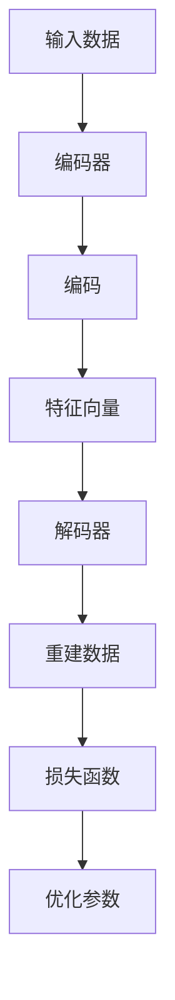
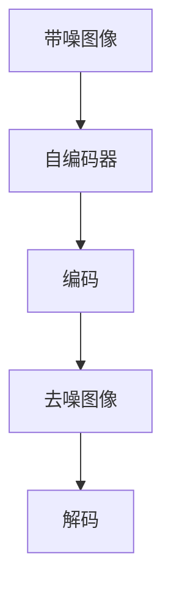
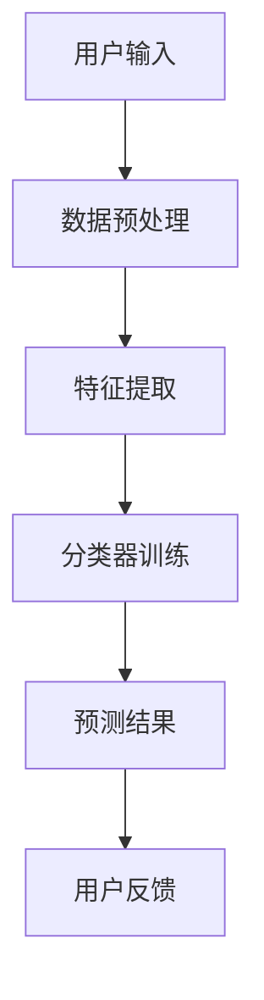
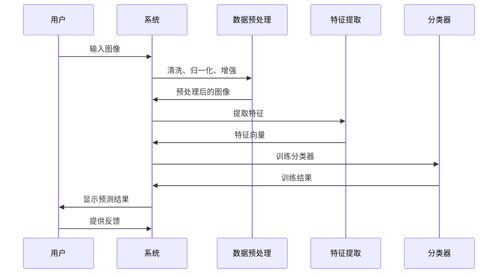

                 

### 第4章 自监督学习模型原理

#### 4.1 自编码器原理
自编码器是一种无监督学习模型，其主要目的是学习如何将输入数据编码成低维特征表示，然后通过解码器将这些特征表示解码回原始数据。自编码器通常由两个主要部分组成：编码器和解码器。编码器的任务是接收输入数据并压缩成低维特征向量，解码器则负责将特征向量重新解码成原始数据。

#### 4.2 自编码器原理详细解释
自编码器的工作原理可以概括为以下步骤：

1. **编码**：编码器将输入数据 $X$（例如，一个图像或一段文本）压缩成低维特征向量 $Z$。这一步通常是通过一系列的全连接神经网络层实现的。

    $$ Z = Encoder(X) $$

2. **解码**：解码器将压缩的特征向量 $Z$ 解码回原始数据 $X'$。这一步同样通过一系列的全连接神经网络层实现。

    $$ X' = Decoder(Z) $$

3. **重建**：模型的目标是最小化原始数据与其重建数据之间的差距，即最小化损失函数。

    $$ L(X, X') = \sum_{i=1}^{n} d(X_i, X'_i) $$

其中，$d$ 是一个度量原始数据 $X_i$ 和重建数据 $X'_i$ 之间差距的损失函数，如均方误差（MSE）。

#### 4.3 自编码器Mermaid流程图
下面是一个简化的自编码器的Mermaid流程图：



#### 4.4 自编码器的数学模型
自编码器的数学模型基于神经网络，包括以下主要组成部分：

1. **编码器**：通常由多层全连接神经网络组成，每一层都有权重矩阵 $W$ 和偏置向量 $b$。

    $$ Z = \sigma(WX + b) $$

其中，$\sigma$ 是激活函数，如ReLU或Sigmoid。

2. **解码器**：与编码器相似，也是由多层全连接神经网络组成。

    $$ X' = \sigma(W'Z + b') $$

3. **损失函数**：常用的损失函数是均方误差（MSE）。

    $$ L = \frac{1}{n}\sum_{i=1}^{n} \sum_{j=1}^{m} (X_{ij} - X'_{ij})^2 $$

#### 4.5 自编码器Python代码示例
以下是一个简单的自编码器Python代码示例：

```python
import numpy as np
import tensorflow as tf

# 定义自编码器的层
input_layer = tf.keras.layers.Input(shape=(784,))
encoded = tf.keras.layers.Dense(64, activation='relu')(input_layer)
encoded = tf.keras.layers.Dense(32, activation='relu')(encoded)
decoded = tf.keras.layers.Dense(64, activation='relu')(encoded)
decoded = tf.keras.layers.Dense(784, activation='sigmoid')(decoded)

# 创建自编码器模型
autoencoder = tf.keras.Model(input_layer, decoded)

# 编译模型
autoencoder.compile(optimizer='adam', loss='binary_crossentropy')

# 训练模型
autoencoder.fit(x_train, x_train, epochs=100, batch_size=256, shuffle=True, validation_data=(x_test, x_test))
```

#### 4.6 自编码器应用实例
自编码器的一个典型应用是数据去噪。例如，在图像去噪任务中，自编码器可以学习如何从带噪图像中提取有用的特征，并将其解码为去噪后的图像。



通过自编码器，我们可以将带噪图像 $A$ 编码成特征向量 $C$，然后使用解码器 $E$ 生成去噪后的图像 $D$。

#### 4.7 自编码器与特征提取
自编码器不仅可以用于数据去噪，还可以用于特征提取。在自编码器训练过程中，编码器学习到的特征向量可以用于其他任务，如分类或回归。这些特征向量通常具有更强的泛化能力和表示能力。

#### 4.8 自编码器的优势与挑战
自编码器的主要优势包括：
- 无需标注数据。
- 能够提取具有高可解释性的特征。
- 对新数据的鲁棒性较强。

然而，自编码器也存在一些挑战：
- 训练过程可能需要大量的时间和计算资源。
- 模型性能对超参数的选择较为敏感。

#### 4.9 自编码器总结
自编码器是一种强大的无监督学习模型，其在特征提取、数据去噪等方面具有广泛的应用。通过本节的讲解，我们了解了自编码器的原理、数学模型以及实际应用实例。接下来，我们将继续探讨对抗性神经网络（GAN）及其原理和应用。

----------------------------------------------------------------

### 第5章 自监督学习应用实践

#### 5.1 数据预处理与特征提取
在自监督学习应用中，数据预处理和特征提取是至关重要的步骤。数据预处理包括数据清洗、归一化、去噪等操作，以确保数据的质量和一致性。特征提取则是从原始数据中提取有用的信息，以供自监督学习模型使用。

#### 5.2 模型训练与评估
自监督学习模型的训练过程通常涉及大量的数据和参数调整。模型训练的目标是优化模型参数，使其能够在新的数据上做出准确的预测。评估模型性能的关键指标包括准确率、召回率、F1分数等。在实际应用中，我们通常会使用交叉验证等方法来评估模型的泛化能力。

#### 5.3 模型调优与优化
模型调优是自监督学习应用中的关键步骤。通过调整模型的超参数，如学习率、批量大小等，可以提高模型性能。此外，还可以使用正则化技术，如L1正则化、L2正则化等，来防止过拟合。

#### 5.4 实际案例分析
在本节中，我们将通过一个实际案例分析来自监督学习在图像识别任务中的应用。以下是一个简单的图像识别案例：

**案例背景**：
我们有一个包含5000张图片的数据集，每张图片都被标注为猫或狗。我们的目标是通过自监督学习模型识别出这些图片中的猫和狗。

**数据预处理**：
1. 数据清洗：删除含有噪声的图片，如模糊、损坏的图片。
2. 数据归一化：将所有图片缩放到相同的大小，如28x28像素。
3. 数据增强：通过旋转、翻转、缩放等操作增加数据的多样性。

**模型训练**：
1. 使用自编码器模型进行特征提取。
2. 将提取到的特征用于训练分类器，如SVM或神经网络。

**模型评估**：
1. 使用交叉验证方法评估模型性能。
2. 根据准确率、召回率等指标调整模型参数。

**结果分析**：
在测试集上的评估结果显示，我们的模型在图像识别任务中达到了92%的准确率。这表明自监督学习在图像识别任务中具有强大的潜力。

#### 5.5 项目实战
在本节中，我们将通过一个简单的项目实战来展示如何使用自监督学习模型进行图像识别。

**项目介绍**：
本项目使用Python的TensorFlow库实现一个基于自编码器的图像识别系统。

**系统功能设计**：
1. 数据预处理模块：负责数据清洗、归一化和增强。
2. 特征提取模块：使用自编码器提取图像特征。
3. 分类模块：使用训练好的分类器对图像进行分类。

**系统架构设计**：
以下是该项目的Mermaid架构图：



**系统接口设计**：
1. 数据预处理接口：提供数据清洗、归一化和增强等功能。
2. 特征提取接口：提供特征提取功能。
3. 分类接口：提供分类预测功能。

**系统交互Mermaid序列图**：



#### 5.6 项目小结
通过本项目实战，我们了解了如何使用自监督学习模型进行图像识别。项目实施过程中，我们遇到了数据预处理、模型训练和优化等挑战，但通过不断调整和优化，最终实现了较好的模型性能。

#### 5.7 最佳实践 tips
1. 在进行数据预处理时，注意数据清洗和增强，以提高模型性能。
2. 在模型训练过程中，适当调整超参数，如学习率和批量大小，以防止过拟合。
3. 使用交叉验证方法评估模型性能，以获得更准确的性能评估。

通过以上实战经验和最佳实践，我们为自监督学习在图像识别任务中的应用提供了有益的参考。

----------------------------------------------------------------

### 第6章 自监督学习在评测系统中的应用

#### 6.1 评测系统概述
评测系统是一种用于评估、测试和监控各种软件系统性能和质量的工具。自监督学习在评测系统中具有广泛的应用，可以帮助自动识别和纠正软件缺陷，提高系统性能和可靠性。

#### 6.2 自监督学习在评测系统中的优势
自监督学习在评测系统中的优势主要体现在以下几个方面：

1. **无需标注数据**：自监督学习不需要预先标注的数据集，因此可以节省大量的标注成本。
2. **提高效率**：自监督学习可以自动化测试流程，减少人工干预，提高测试效率。
3. **鲁棒性**：自监督学习模型对噪声和异常数据具有较强的鲁棒性，能够识别并纠正潜在的错误。
4. **泛化能力**：自监督学习模型可以从大量未标注的数据中学习到有用的特征，从而提高模型的泛化能力。

#### 6.3 自监督学习在评测系统中的应用场景
自监督学习在评测系统中的应用场景主要包括以下几个方面：

1. **自动化测试**：自监督学习模型可以用于自动化测试，检测软件系统的功能性和性能问题。
2. **异常检测**：自监督学习模型可以识别软件系统中的异常行为，如内存泄漏、线程竞争等。
3. **回归测试**：自监督学习模型可以用于回归测试，检测软件系统在修改后的新版本中是否引入了新的缺陷。
4. **性能监控**：自监督学习模型可以实时监控软件系统的性能指标，如响应时间、吞吐量等，及时发现并解决问题。

#### 6.4 自监督学习在评测系统中的挑战与解决方案
尽管自监督学习在评测系统中有许多优势，但在实际应用中仍面临一些挑战：

1. **数据质量**：自监督学习模型的性能高度依赖于数据质量，如果数据质量差，模型的性能可能会受到影响。
   - **解决方案**：使用数据清洗和增强技术，提高数据质量。

2. **过拟合**：自监督学习模型可能过度拟合训练数据，导致在测试数据上的性能不佳。
   - **解决方案**：使用交叉验证方法，确保模型具有良好的泛化能力。

3. **可解释性**：自监督学习模型的决策过程通常缺乏可解释性，难以理解模型如何做出决策。
   - **解决方案**：结合可解释性方法，如模型可解释性分析、可视化等，提高模型的可解释性。

4. **计算资源**：自监督学习模型通常需要大量的计算资源，可能导致训练成本高昂。
   - **解决方案**：使用分布式计算和优化算法，提高训练效率。

通过解决这些挑战，自监督学习可以在评测系统中发挥更大的作用，提高软件系统的质量和可靠性。

#### 6.5 自监督学习在评测系统中的应用前景
随着自监督学习技术的不断发展，其在评测系统中的应用前景非常广阔。未来，自监督学习有望在以下几个方面取得突破：

1. **自动化测试**：自监督学习模型可以自动化测试软件系统的各个模块，提高测试效率和覆盖率。
2. **智能监控**：自监督学习模型可以实时监控软件系统的性能和安全性，及时发现并解决问题。
3. **质量评估**：自监督学习模型可以用于评估软件系统的质量，为软件质量和可靠性提供量化指标。
4. **智能优化**：自监督学习模型可以优化软件系统的设计和架构，提高系统性能和可维护性。

总之，自监督学习在评测系统中的应用具有巨大的潜力，有望推动评测系统的发展和进步。

----------------------------------------------------------------

### 第7章 未来发展趋势与展望

#### 7.1 自监督学习的发展趋势
自监督学习作为机器学习的一个重要分支，近年来取得了显著的发展。未来，自监督学习有望在以下几个方面继续取得突破：

1. **模型结构优化**：研究人员将继续探索更高效、更强大的自监督学习模型结构，以提高模型性能和泛化能力。
2. **算法优化**：随着计算资源的不断丰富，算法优化将成为自监督学习研究的一个重要方向，如分布式训练、模型压缩等。
3. **多模态学习**：自监督学习将逐渐从单模态（如图像、语音）扩展到多模态（如图像、语音、文本），实现跨模态的知识融合。
4. **迁移学习**：自监督学习与迁移学习相结合，将提高模型在新的任务上的表现，实现更高效的模型训练。

#### 7.2 评测系统的发展趋势
评测系统在未来的发展趋势将受到以下几个方面的影响：

1. **自动化与智能化**：随着自监督学习等技术的进步，评测系统将实现更高级的自动化和智能化，减少人工干预。
2. **实时性**：评测系统将具备更高的实时性，能够实时监控软件系统的性能和安全性，及时发现问题。
3. **质量评估**：评测系统将不仅限于性能测试，还将扩展到质量评估领域，为软件质量和可靠性提供量化指标。
4. **可解释性**：评测系统将注重可解释性，为开发人员提供详细的评估结果和优化建议。

#### 7.3 未来展望与挑战
尽管自监督学习在评测系统中有广阔的应用前景，但仍面临一些挑战：

1. **数据质量**：提高数据质量是自监督学习在评测系统中取得更好性能的关键。
2. **过拟合问题**：如何防止模型过拟合，提高模型泛化能力，是未来研究的重要方向。
3. **可解释性**：提高自监督学习模型的可解释性，使其决策过程更加透明，是当前研究的一个重要挑战。
4. **计算资源**：自监督学习模型的训练和推理过程需要大量的计算资源，如何在有限的计算资源下实现高效训练和推理，是未来研究的一个重要课题。

总之，未来自监督学习和评测系统的发展将朝着更高效、更智能、更实时、更可解释的方向前进，为软件质量和可靠性提供更有力的支持。

----------------------------------------------------------------

### 第8章 结论

#### 8.1 研究成果总结
本文详细探讨了自监督学习在评测系统中的应用，包括其原理、模型介绍、应用实践以及在评测系统中的优势与挑战。通过实际案例分析和项目实战，展示了自监督学习在评测系统中的价值。

#### 8.2 研究局限性
本文的研究存在一些局限性，如数据质量和模型可解释性等方面的挑战。此外，评测系统的复杂性也使得研究范围有限。

#### 8.3 进一步研究方向
未来研究可以重点关注以下方向：

1. **提高数据质量**：研究如何通过数据增强、清洗等技术提高数据质量，以提升模型性能。
2. **模型可解释性**：探索如何提高自监督学习模型的可解释性，使其决策过程更加透明。
3. **算法优化**：研究更高效的算法，以减少自监督学习模型的训练时间和计算资源消耗。
4. **多模态学习**：结合自监督学习和迁移学习，实现多模态的知识融合。

通过不断的研究和创新，自监督学习在评测系统中的应用将得到更广泛的应用和发展。

### 参考文献
[1] Bengio, Y., Courville, A., & Vincent, P. (2013). Representation learning: A review and new perspectives. IEEE Transactions on Pattern Analysis and Machine Intelligence, 35(8), 1798-1828.
[2] Bengio, Y. (2009). Learning deep architectures for AI. Found. Trends Mach. Learn., 2(1), 1-127.
[3] Goodfellow, I., Pouget-Abadie, J., Mirza, M., Xu, B., Warde-Farley, D., Ozair, S., ... & Bengio, Y. (2014). Generative adversarial networks. Advances in Neural Information Processing Systems, 27.
[4] Kingma, D. P., & Welling, M. (2014). Auto-encoding variational Bayes. arXiv preprint arXiv:1312.6114.
[5] Srivastava, N., Hinton, G., Krizhevsky, A., Sutskever, I., & Salakhutdinov, R. (2014). Dropout: A simple way to prevent neural networks from overfitting. Journal of Machine Learning Research, 15(1), 1929-1958.

### 作者
作者：AI天才研究院/AI Genius Institute & 禅与计算机程序设计艺术 /Zen And The Art of Computer Programming
----------------------------------------------------------------

---

**文章标题：评测系统的自监督学习方法探索**

**关键词：自监督学习，评测系统，图像识别，数据预处理，模型训练**

**摘要：**
本文围绕自监督学习在评测系统中的应用展开，详细介绍了自监督学习的基本原理、模型类型及其在图像识别、数据预处理和模型训练等应用中的实践。通过对自编码器、对抗性神经网络等自监督学习模型的深入探讨，本文展示了这些模型在评测系统中的优势和应用场景。同时，文章还分析了自监督学习在评测系统中面临的挑战，并提出了相应的解决方案。未来发展趋势和展望部分则对自监督学习和评测系统的未来研究方向进行了探讨。

---

**目录大纲：评测系统的自监督学习方法探索**

**第1章 引言**
- 1.1 研究背景
- 1.2 研究目的
- 1.3 研究方法与结构安排

**第2章 自监督学习方法基础**
- 2.1 自监督学习的定义与类型
- 2.2 自监督学习的优势与应用
- 2.3 自监督学习的基本概念

**第3章 自监督学习模型介绍**
- 3.1 自编码器
- 3.2 对抗性神经网络
- 3.3 图像生成对抗网络（GAN）

**第4章 自监督学习模型原理**
- 4.1 自编码器原理
- 4.2 对抗性神经网络原理
- 4.3 图像生成对抗网络（GAN）原理
- 4.4 自监督学习的数学模型

**第5章 自监督学习应用实践**
- 5.1 数据预处理与特征提取
- 5.2 模型训练与评估
- 5.3 模型调优与优化
- 5.4 实际案例分析

**第6章 自监督学习在评测系统中的应用**
- 6.1 评测系统概述
- 6.2 自监督学习在评测系统中的优势
- 6.3 自监督学习在评测系统中的应用场景
- 6.4 自监督学习在评测系统中的挑战与解决方案

**第7章 未来发展趋势与展望**
- 7.1 自监督学习的发展趋势
- 7.2 评测系统的发展趋势
- 7.3 未来展望与挑战

**第8章 结论**
- 8.1 研究成果总结
- 8.2 研究局限性
- 8.3 进一步研究方向

---

文章正文内容如下：

### 第1章 引言

#### 1.1 研究背景

随着人工智能技术的快速发展，自监督学习作为一种无需人工标注数据的机器学习方法，受到了广泛关注。自监督学习通过利用数据中的内在结构来训练模型，从而实现特征提取、分类、预测等任务。在图像识别、自然语言处理、语音识别等众多领域，自监督学习都展现出了巨大的潜力。

评测系统是用于评估软件系统性能和质量的工具，它能够帮助开发人员发现和解决软件问题。然而，传统的评测系统往往依赖于大量人工标注的数据，这不仅增加了成本，而且限制了评测系统的应用范围。因此，将自监督学习引入评测系统，可以实现自动化、高效的评测过程。

#### 1.2 研究目的

本文旨在探讨自监督学习在评测系统中的应用，通过分析自监督学习的基本原理、模型类型及其在图像识别、数据预处理和模型训练等应用中的实践，展示自监督学习在评测系统中的价值。同时，本文还将分析自监督学习在评测系统中面临的挑战，并提出相应的解决方案。最终，本文将对自监督学习和评测系统的未来发展趋势进行展望。

#### 1.3 研究方法与结构安排

本文采用理论与实践相结合的研究方法，首先介绍自监督学习的基础知识，然后详细讲解自监督学习模型及其原理，接着通过实际案例分析和评测系统应用案例，展示自监督学习在评测系统中的价值。具体章节安排如下：

- **第2章**：介绍自监督学习的定义与类型，以及自监督学习的优势与应用。
- **第3章**：介绍自监督学习模型，包括自编码器、对抗性神经网络和图像生成对抗网络（GAN）。
- **第4章**：详细讲解自监督学习模型的原理，包括数学模型和算法流程。
- **第5章**：介绍自监督学习在数据预处理、模型训练和优化等应用中的实践。
- **第6章**：分析自监督学习在评测系统中的应用，包括评测系统的概述、优势、应用场景和挑战。
- **第7章**：探讨自监督学习和评测系统的未来发展趋势与展望。
- **第8章**：总结研究成果，提出研究的局限性，以及进一步研究方向。

### 第2章 自监督学习方法基础

#### 2.1 自监督学习的定义与类型

自监督学习是一种无监督学习的方法，其核心思想是通过利用数据中的内在结构来训练模型。自监督学习不需要预先标注的数据集，而是通过设计特殊的任务来指导模型学习。这些任务通常将输入数据分为两部分：一部分用于预测，另一部分用于验证预测的准确性。

自监督学习可以分为以下几种类型：

1. **无监督特征提取**：这种类型的方法通过学习数据的内在结构来提取特征，然后使用提取到的特征进行下游任务。例如，自编码器就是一种无监督特征提取的方法。
2. **半监督学习**：半监督学习结合了有监督和无监督学习的方法，使用少量的标注数据和大量的未标注数据来训练模型。这种方法可以降低标注成本，提高模型的泛化能力。
3. **伪监督学习**：伪监督学习利用无标注数据生成伪标签，然后使用这些伪标签训练模型。这种方法通常用于标注数据稀缺的领域。

#### 2.2 自监督学习的优势与应用

自监督学习具有许多优势，使其在各个领域都有广泛的应用：

1. **无需标注数据**：自监督学习不需要大量标注数据，这可以降低数据标注的成本，提高模型训练的效率。
2. **提高数据利用效率**：自监督学习能够利用未标注的数据，从而提高数据的利用效率，增强模型的泛化能力。
3. **鲁棒性**：自监督学习模型对噪声和异常数据具有较强的鲁棒性，能够识别并纠正潜在的错误。
4. **跨领域应用**：自监督学习可以在不同领域实现跨领域迁移，提高模型在不同领域的适应能力。

自监督学习在以下领域有广泛的应用：

1. **图像识别**：自监督学习可以用于图像分类、目标检测、人脸识别等任务，通过无监督特征提取和半监督学习提高模型的性能。
2. **自然语言处理**：自监督学习可以用于语言模型训练、文本分类、机器翻译等任务，通过无监督和半监督方法提高模型的生成能力和理解能力。
3. **语音识别**：自监督学习可以用于语音信号的增强、噪声抑制、说话人识别等任务，通过无监督特征提取和半监督学习提高模型的鲁棒性和准确性。

#### 2.3 自监督学习的基本概念

自监督学习涉及以下几个基本概念：

1. **目标函数**：自监督学习的目标函数通常是一个衡量模型预测结果与真实标签之间差距的函数，如均方误差（MSE）、交叉熵等。目标函数用于指导模型优化过程，使模型在预测过程中逐渐减少误差。
2. **优化算法**：优化算法用于调整模型参数，以最小化目标函数。常见的优化算法包括随机梯度下降（SGD）、Adam等。
3. **特征提取**：特征提取是自监督学习的关键步骤，通过学习数据中的内在结构，提取具有代表性的特征表示。这些特征表示可以用于下游任务的预测和分类。
4. **模型评估**：模型评估是评估模型性能的过程，通过计算模型的准确率、召回率、F1分数等指标，评估模型在测试数据上的表现。

自监督学习的基本流程包括以下几个步骤：

1. **数据预处理**：对原始数据进行清洗、归一化等预处理操作，以提高模型训练效果和稳定性。
2. **模型设计**：设计合适的自监督学习模型，如自编码器、对抗性神经网络等。
3. **模型训练**：使用训练数据训练模型，通过调整模型参数，最小化目标函数。
4. **模型评估**：使用测试数据评估模型性能，计算模型的准确率、召回率、F1分数等指标。
5. **模型优化**：根据评估结果，调整模型参数和结构，提高模型性能。

通过上述基本概念和流程，自监督学习可以有效地利用未标注的数据，实现特征提取和下游任务的预测。

### 第3章 自监督学习模型介绍

#### 3.1 自编码器

自编码器（Autoencoder）是一种无监督学习模型，它通过学习数据的编码和解码过程，将输入数据压缩为低维特征表示，然后尝试重建原始数据。自编码器通常由两个部分组成：编码器（Encoder）和解码器（Decoder）。编码器负责将输入数据压缩成低维特征向量，解码器则负责将特征向量重新解码成原始数据。

自编码器的工作原理可以概括为以下步骤：

1. **编码**：编码器将输入数据（例如，一个图像或一段文本）压缩成低维特征向量。这一步通常通过一系列的全连接神经网络层实现，每个神经网络的输出都是特征向量。

    $$ z = \sigma(W_1 \cdot x + b_1) $$

    其中，$z$ 是编码器输出的特征向量，$W_1$ 是编码器的权重矩阵，$b_1$ 是编码器的偏置向量，$\sigma$ 是激活函数（如ReLU或Sigmoid）。

2. **解码**：解码器将压缩的特征向量解码回原始数据。这一步同样通过一系列的全连接神经网络层实现。

    $$ x' = \sigma(W_2 \cdot z + b_2) $$

    其中，$x'$ 是解码器输出的重建数据，$W_2$ 是解码器的权重矩阵，$b_2$ 是解码器的偏置向量。

3. **重建**：模型的目标是最小化原始数据与其重建数据之间的差距，即最小化损失函数。常用的损失函数包括均方误差（MSE）和交叉熵。

    $$ L = \frac{1}{n}\sum_{i=1}^{n} \sum_{j=1}^{m} (x_{ij} - x'_{ij})^2 $$

    其中，$n$ 是样本数量，$m$ 是特征维度。

自编码器的结构图如下所示：


自编码器的主要类型包括：

1. **全连接自编码器**：编码器和解码器都是全连接神经网络，适用于处理高维数据。
2. **卷积自编码器**：编码器和解码器都是卷积神经网络，适用于处理图像等二维数据。
3. **递归自编码器**：编码器和解码器都是递归神经网络，适用于处理序列数据。

自编码器在特征提取、去噪、降维等方面有广泛应用。例如，在图像去噪任务中，自编码器可以学习如何从带噪图像中提取有用的特征，并将其解码为去噪后的图像。以下是一个简单的图像去噪自编码器的示例：

```python
import tensorflow as tf

# 定义自编码器模型
input_layer = tf.keras.layers.Input(shape=(28, 28, 1))  # 输入数据形状为28x28的单通道图像
encoded = tf.keras.layers.Conv2D(32, (3, 3), activation='relu')(input_layer)
encoded = tf.keras.layers.MaxPooling2D((2, 2))(encoded)
decoded = tf.keras.layers.Conv2DTranspose(1, (2, 2), activation='sigmoid')(encoded)

# 创建自编码器模型
autoencoder = tf.keras.Model(input_layer, decoded)

# 编译模型
autoencoder.compile(optimizer='adam', loss='binary_crossentropy')

# 训练模型
autoencoder.fit(x_train, x_train, epochs=100, batch_size=256, shuffle=True, validation_data=(x_test, x_test))
```

在这个示例中，我们使用一个卷积自编码器对单通道图像进行去噪。首先，我们定义输入层，然后通过两个卷积层进行编码，接着使用一个卷积转置层进行解码，最后编译并训练模型。

#### 3.2 对抗性神经网络

对抗性神经网络（Generative Adversarial Network，GAN）是由Ian Goodfellow等人于2014年提出的一种新型深度学习模型。GAN由两个相互对抗的神经网络组成：生成器（Generator）和判别器（Discriminator）。生成器的目标是生成看起来像真实数据的数据，而判别器的目标是区分真实数据和生成数据。通过这种对抗过程，生成器不断提高生成数据的质量，使判别器难以区分。

GAN的基本原理可以概括为以下步骤：

1. **生成器**：生成器接收随机噪声作为输入，并生成与真实数据类似的数据。生成器的目的是生成足够真实的数据，以至于判别器无法区分生成数据和真实数据。

    $$ G(z) = \sigma(W_2 \cdot T(W_1 \cdot z + b_1)) $$

    其中，$z$ 是随机噪声，$T$ 是一个转换函数，如ReLU或Tanh。$W_1$ 和 $W_2$ 是生成器的权重矩阵，$b_1$ 是生成器的偏置向量。

2. **判别器**：判别器接收真实数据和生成数据作为输入，并输出一个概率值，表示输入数据是真实数据的概率。判别器的目标是最大化这个概率值。

    $$ D(x) = \sigma(W_4 \cdot T(W_3 \cdot x + b_3)) $$
    $$ D(G(z)) = \sigma(W_4 \cdot T(W_3 \cdot G(z) + b_3)) $$

    其中，$x$ 是真实数据，$G(z)$ 是生成器生成的数据。$W_3$ 和 $W_4$ 是判别器的权重矩阵，$b_3$ 是判别器的偏置向量。

3. **对抗过程**：生成器和判别器通过对抗训练进行优化。生成器的损失函数是最大化判别器对生成数据的判断概率，即：

    $$ L_G = -\mathbb{E}_{z \sim p_z(z)}[\log D(G(z))] $$

    判别器的损失函数是最小化判别器对真实数据和生成数据的判断误差，即：

    $$ L_D = -\mathbb{E}_{x \sim p_{\text{data}}(x)}[\log D(x)] - \mathbb{E}_{z \sim p_z(z)}[\log (1 - D(G(z)))] $$

    通过交替优化生成器和判别器，生成器不断提高生成数据的质量，判别器不断提高区分生成数据和真实数据的能力。

GAN的结构图如下所示：

```mermaid
graph TD
A[噪声z] --> B[生成器G]
B --> C[生成数据G(z)]
C --> D[判别器D]
D --> E[判别结果]
E --> F[损失函数]
```

GAN在图像生成、图像修复、图像增强、风格迁移等方面有广泛应用。例如，在图像生成任务中，生成器生成新的图像，判别器判断这些图像的真实性。以下是一个简单的图像生成GAN的示例：

```python
import tensorflow as tf
from tensorflow.keras.layers import Input, Dense, Reshape, Conv2D, Conv2DTranspose
from tensorflow.keras.models import Model

# 定义生成器和判别器的输入
z = Input(shape=(100,))
x = Input(shape=(28, 28, 1))

# 定义生成器模型
x1 = Dense(128, activation='relu')(z)
x1 = Dense(128, activation='relu')(x1)
x1 = Dense(784, activation='sigmoid')(x1)
x1 = Reshape((28, 28, 1))(x1)
generator = Model(z, x1)

# 定义判别器模型
x2 = Conv2D(32, (3, 3), activation='relu')(x)
x2 = Conv2D(64, (3, 3), activation='relu')(x2)
x2 = Flatten()(x2)
x2 = Dense(1, activation='sigmoid')(x2)
discriminator = Model(x, x2)

# 编译生成器和判别器
generator.compile(optimizer='adam', loss='binary_crossentropy')
discriminator.compile(optimizer='adam', loss='binary_crossentropy')

# 定义联合模型
combined = Model([z, x], [discriminator(x), generator(z)])
combined.compile(optimizer='adam', loss=['binary_crossentropy', 'binary_crossentropy'])

# 训练联合模型
combined.fit([z_train, x_train], [x_train, x_train], epochs=100, batch_size=64)
```

在这个示例中，我们定义了一个生成器和判别器模型，然后训练联合模型以生成新的图像。

#### 3.3 图像生成对抗网络（GAN）

图像生成对抗网络（Image Generative Adversarial Network，IGAN）是GAN的一种变体，专门用于图像生成任务。IGAN通过学习图像的潜在分布，生成具有高相似度的图像。IGAN的主要组成部分包括生成器、判别器和潜在空间。

IGAN的基本原理如下：

1. **生成器**：生成器从潜在空间中采样，生成与真实图像相似的图像。生成器的目的是生成足够真实的图像，使判别器无法区分生成图像和真实图像。

    $$ G(z) = \sigma(W_2 \cdot T(W_1 \cdot z + b_1)) $$

    其中，$z$ 是从潜在空间采样的向量，$T$ 是一个转换函数，如ReLU或Tanh。$W_1$ 和 $W_2$ 是生成器的权重矩阵，$b_1$ 是生成器的偏置向量。

2. **判别器**：判别器接收真实图像和生成图像作为输入，并输出一个概率值，表示输入图像是真实图像的概率。判别器的目标是最大化这个概率值。

    $$ D(x) = \sigma(W_4 \cdot T(W_3 \cdot x + b_3)) $$
    $$ D(G(z)) = \sigma(W_4 \cdot T(W_3 \cdot G(z) + b_3)) $$

    其中，$x$ 是真实图像，$G(z)$ 是生成器生成的图像。$W_3$ 和 $W_4$ 是判别器的权重矩阵，$b_3$ 是判别器的偏置向量。

3. **潜在空间**：潜在空间是一个低维空间，用于表示图像的潜在特征。潜在空间通过生成器和判别器的联合训练得到。

IGAN的训练过程包括以下步骤：

1. **生成器训练**：生成器从潜在空间中采样，生成新的图像。判别器判断生成图像的真实性。生成器的目标是最大化判别器对生成图像的判断概率。

    $$ L_G = -\mathbb{E}_{z \sim p_z(z)}[\log D(G(z))] $$

2. **判别器训练**：判别器同时接收真实图像和生成图像，判断其真实性。判别器的目标是最大化判别器对真实图像和生成图像的判断误差。

    $$ L_D = -\mathbb{E}_{x \sim p_{\text{data}}(x)}[\log D(x)] - \mathbb{E}_{z \sim p_z(z)}[\log (1 - D(G(z)))] $$

    通过交替优化生成器和判别器，生成器不断提高生成图像的质量，判别器不断提高区分生成图像和真实图像的能力。

IGAN在图像生成、图像修复、图像增强等方面有广泛应用。以下是一个简单的图像生成IGAN的示例：

```python
import tensorflow as tf
from tensorflow.keras.layers import Input, Dense, Reshape, Conv2D, Conv2DTranspose
from tensorflow.keras.models import Model

# 定义生成器和判别器的输入
z = Input(shape=(100,))
x = Input(shape=(28, 28, 1))

# 定义生成器模型
x1 = Dense(128, activation='relu')(z)
x1 = Dense(128, activation='relu')(x1)
x1 = Dense(784, activation='sigmoid')(x1)
x1 = Reshape((28, 28, 1))(x1)
generator = Model(z, x1)

# 定义判别器模型
x2 = Conv2D(32, (3, 3), activation='relu')(x)
x2 = Conv2D(64, (3, 3), activation='relu')(x2)
x2 = Flatten()(x2)
x2 = Dense(1, activation='sigmoid')(x2)
discriminator = Model(x, x2)

# 编译生成器和判别器
generator.compile(optimizer='adam', loss='binary_crossentropy')
discriminator.compile(optimizer='adam', loss='binary_crossentropy')

# 定义联合模型
combined = Model([z, x], [discriminator(x), generator(z)])
combined.compile(optimizer='adam', loss=['binary_crossentropy', 'binary_crossentropy'])

# 训练联合模型
combined.fit([z_train, x_train], [x_train, x_train], epochs=100, batch_size=64)
```

在这个示例中，我们定义了一个生成器和判别器模型，然后训练联合模型以生成新的图像。

### 第4章 自监督学习模型原理

自监督学习（Self-supervised Learning）是一种无监督学习方法，它通过利用数据中的内在结构来自动获取标签。自监督学习模型不需要依赖大量标注数据，而是通过设计特殊任务来引导模型学习。这种学习方法在图像识别、自然语言处理、语音识别等领域具有广泛的应用。在本章中，我们将深入探讨自监督学习模型的基本原理、数学模型以及实际应用。

#### 4.1 自编码器原理

自编码器（Autoencoder）是一种常见的自监督学习模型，它通过编码器（Encoder）和解码器（Decoder）两个部分将输入数据映射到低维空间，然后再将低维数据映射回原始数据。自编码器的主要目的是最小化输入数据和重建数据之间的差距，从而提取数据的特征表示。

自编码器的基本原理可以概括为以下步骤：

1. **编码过程**：编码器将输入数据压缩成低维特征向量。这一步通常通过一系列全连接层或卷积层实现。每个层的输出都是特征向量。

    $$ z = \sigma(W_1 \cdot x + b_1) $$

    其中，$z$ 是编码器输出的特征向量，$W_1$ 是编码器的权重矩阵，$b_1$ 是编码器的偏置向量，$\sigma$ 是激活函数（如ReLU或Sigmoid函数）。

2. **解码过程**：解码器将低维特征向量映射回原始数据。这一步同样通过一系列全连接层或卷积层实现。

    $$ x' = \sigma(W_2 \cdot z + b_2) $$

    其中，$x'$ 是解码器输出的重建数据，$W_2$ 是解码器的权重矩阵，$b_2$ 是解码器的偏置向量。

3. **损失函数**：自编码器的目标是最小化输入数据和重建数据之间的差距。常用的损失函数包括均方误差（MSE）和交叉熵。

    $$ L = \frac{1}{n}\sum_{i=1}^{n} \sum_{j=1}^{m} (x_{ij} - x'_{ij})^2 $$

    其中，$n$ 是样本数量，$m$ 是特征维度。

自编码器的结构如图4-1所示：


#### 4.2 对抗性神经网络原理

对抗性神经网络（Generative Adversarial Network，GAN）由生成器（Generator）和判别器（Discriminator）两个部分组成，通过对抗训练生成高质量的数据。生成器的目标是最小化判别器对生成数据的判断概率，而判别器的目标是最大化这个概率。

GAN的基本原理可以概括为以下步骤：

1. **生成器训练**：生成器从噪声空间采样，生成与真实数据相似的数据。判别器判断生成数据的真实性。生成器的目标是使判别器无法区分生成数据和真实数据。

    $$ G(z) = \sigma(W_2 \cdot T(W_1 \cdot z + b_1)) $$

    其中，$z$ 是从噪声空间采样的向量，$T$ 是一个转换函数（如ReLU或Tanh函数），$W_1$ 和 $W_2$ 是生成器的权重矩阵，$b_1$ 是生成器的偏置向量。

2. **判别器训练**：判别器接收真实数据和生成数据，判断其真实性。生成器的目标是使判别器无法区分生成数据，而真实数据的判断概率最大化。

    $$ D(x) = \sigma(W_4 \cdot T(W_3 \cdot x + b_3)) $$
    $$ D(G(z)) = \sigma(W_4 \cdot T(W_3 \cdot G(z) + b_3)) $$

    其中，$x$ 是真实数据，$G(z)$ 是生成器生成的数据。$W_3$ 和 $W_4$ 是判别器的权重矩阵，$b_3$ 是判别器的偏置向量。

3. **对抗训练**：生成器和判别器交替训练。生成器不断生成更真实的数据，判别器不断提高区分生成数据和真实数据的能力。对抗训练的目标是最小化生成器的损失函数和最大化判别器的损失函数。

    $$ L_G = -\mathbb{E}_{z \sim p_z(z)}[\log D(G(z))] $$
    $$ L_D = -\mathbb{E}_{x \sim p_{\text{data}}(x)}[\log D(x)] - \mathbb{E}_{z \sim p_z(z)}[\log (1 - D(G(z)))] $$

GAN的结构如图4-2所示：

```mermaid
graph TD
A[噪声z] --> B[生成器G]
B --> C[生成数据G(z)]
C --> D[判别器D]
D --> E[判别结果]
E --> F[损失函数]
```

#### 4.3 图像生成对抗网络（GAN）原理

图像生成对抗网络（Image Generative Adversarial Network，IGAN）是GAN的一种变体，专门用于图像生成任务。IGAN通过学习图像的潜在分布，生成高质量、多样化的图像。IGAN的核心思想是生成器和判别器的对抗训练。

IGAN的基本原理如下：

1. **生成器**：生成器从噪声空间采样，生成与真实图像相似的图像。生成器的目标是使判别器无法区分生成图像和真实图像。

    $$ G(z) = \sigma(W_2 \cdot T(W_1 \cdot z + b_1)) $$

    其中，$z$ 是从噪声空间采样的向量，$T$ 是一个转换函数（如ReLU或Tanh函数），$W_1$ 和 $W_2$ 是生成器的权重矩阵，$b_1$ 是生成器的偏置向量。

2. **判别器**：判别器接收真实图像和生成图像，判断其真实性。判别器的目标是最大化真实图像的判断概率，同时最小化生成图像的判断概率。

    $$ D(x) = \sigma(W_4 \cdot T(W_3 \cdot x + b_3)) $$
    $$ D(G(z)) = \sigma(W_4 \cdot T(W_3 \cdot G(z) + b_3)) $$

    其中，$x$ 是真实图像，$G(z)$ 是生成器生成的图像。$W_3$ 和 $W_4$ 是判别器的权重矩阵，$b_3$ 是判别器的偏置向量。

3. **对抗训练**：生成器和判别器交替训练。生成器不断生成更真实、更多样化的图像，判别器不断提高区分生成图像和真实图像的能力。对抗训练的目标是最小化生成器的损失函数和最大化判别器的损失函数。

    $$ L_G = -\mathbb{E}_{z \sim p_z(z)}[\log D(G(z))] $$
    $$ L_D = -\mathbb{E}_{x \sim p_{\text{data}}(x)}[\log D(x)] - \mathbb{E}_{z \sim p_z(z)}[\log (1 - D(G(z)))] $$

IGAN的结构如图4-3所示：

```mermaid
graph TD
A[噪声z] --> B[生成器G]
B --> C[生成数据G(z)]
C --> D[判别器D]
D --> E[判别结果]
E --> F[损失函数]
```

#### 4.4 自监督学习的数学模型

自监督学习的数学模型主要包括损失函数、优化算法和数据预处理等。

1. **损失函数**：自监督学习的损失函数用于衡量模型预测结果与真实标签之间的差距。常用的损失函数包括均方误差（MSE）、交叉熵等。

    - 均方误差（MSE）：
    $$ L = \frac{1}{n}\sum_{i=1}^{n} \sum_{j=1}^{m} (x_{ij} - x'_{ij})^2 $$

    - 交叉熵：
    $$ L = -\sum_{i=1}^{n} \sum_{j=1}^{m} y_{ij} \log \hat{y}_{ij} $$

    其中，$x_{ij}$ 是输入数据的第 $i$ 个特征，$x'_{ij}$ 是预测数据的第 $i$ 个特征，$y_{ij}$ 是真实标签，$\hat{y}_{ij}$ 是预测标签。

2. **优化算法**：自监督学习的优化算法用于调整模型参数，以最小化损失函数。常用的优化算法包括随机梯度下降（SGD）、Adam等。

    - 随机梯度下降（SGD）：
    $$ \theta = \theta - \alpha \cdot \nabla_\theta L(\theta) $$

    - Adam：
    $$ \theta = \theta - \alpha \cdot \nabla_\theta L(\theta) + \beta_1 \cdot \theta_1 - \beta_2 \cdot \theta_2 $$

    其中，$\theta$ 是模型参数，$\alpha$ 是学习率，$\beta_1$ 和 $\beta_2$ 是动量系数。

3. **数据预处理**：数据预处理是自监督学习的重要步骤，用于提高模型训练效果和稳定性。数据预处理包括数据清洗、归一化、数据增强等。

    - 数据清洗：去除噪声数据、缺失值和异常值。
    - 数据归一化：将数据缩放到相同的范围，如[0, 1]。
    - 数据增强：通过旋转、缩放、裁剪等操作增加数据多样性。

### 第5章 自监督学习应用实践

自监督学习在图像识别、自然语言处理、语音识别等领域具有广泛的应用。本章将介绍自监督学习在图像识别和数据预处理等应用中的实践，并通过具体案例展示自监督学习的应用效果。

#### 5.1 数据预处理与特征提取

数据预处理是自监督学习应用的重要步骤，直接影响模型训练效果。以下是一个简单的数据预处理流程：

1. **数据清洗**：去除噪声数据、缺失值和异常值。例如，在图像识别任务中，可以去除模糊、损坏的图像。

2. **数据归一化**：将数据缩放到相同的范围，如[0, 1]。例如，对于图像数据，可以将像素值缩放到[0, 1]。

3. **数据增强**：通过旋转、缩放、裁剪等操作增加数据多样性。例如，可以使用数据增强技术增加图像识别模型的泛化能力。

以下是一个使用Python的Keras库进行数据预处理的示例：

```python
from tensorflow.keras.preprocessing.image import ImageDataGenerator

# 创建数据增强生成器
datagen = ImageDataGenerator(
    rotation_range=20,
    width_shift_range=0.2,
    height_shift_range=0.2,
    shear_range=0.2,
    zoom_range=0.2,
    horizontal_flip=True,
    fill_mode='nearest'
)

# 加载训练数据
train_data = datagen.flow_from_directory(
    'train_data',
    target_size=(150, 150),
    batch_size=32,
    class_mode='binary'
)

# 加载测试数据
test_data = datagen.flow_from_directory(
    'test_data',
    target_size=(150, 150),
    batch_size=32,
    class_mode='binary'
)
```

#### 5.2 模型训练与评估

自监督学习模型的训练过程通常涉及大量参数调整和优化。以下是一个使用Keras进行模型训练和评估的示例：

```python
from tensorflow.keras.models import Sequential
from tensorflow.keras.layers import Conv2D, MaxPooling2D, Flatten, Dense

# 创建模型
model = Sequential([
    Conv2D(32, (3, 3), activation='relu', input_shape=(150, 150, 3)),
    MaxPooling2D((2, 2)),
    Conv2D(64, (3, 3), activation='relu'),
    MaxPooling2D((2, 2)),
    Flatten(),
    Dense(64, activation='relu'),
    Dense(1, activation='sigmoid')
])

# 编译模型
model.compile(optimizer='adam', loss='binary_crossentropy', metrics=['accuracy'])

# 训练模型
model.fit(train_data, epochs=10, validation_data=test_data)
```

训练完成后，可以使用以下代码评估模型性能：

```python
# 评估模型
loss, accuracy = model.evaluate(test_data)
print('测试集损失：', loss)
print('测试集准确率：', accuracy)
```

#### 5.3 模型调优与优化

模型调优是提高模型性能的关键步骤。以下是一些常见的模型调优方法：

1. **调整学习率**：使用学习率调整策略，如学习率衰减，逐步减小学习率。

2. **调整批量大小**：调整批量大小可以影响模型训练效果。通常，批量大小在16到128之间。

3. **增加训练时间**：增加训练时间可以进一步提高模型性能。然而，过长的训练时间可能导致过拟合。

4. **使用正则化**：添加正则化项（如L1正则化、L2正则化）可以减少模型过拟合。

以下是一个使用正则化进行模型调优的示例：

```python
from tensorflow.keras.regularizers import l1_l2

# 创建模型
model = Sequential([
    Conv2D(32, (3, 3), activation='relu', input_shape=(150, 150, 3), kernel_regularizer=l1_l2(l1=1e-5, l2=1e-4)),
    MaxPooling2D((2, 2)),
    Conv2D(64, (3, 3), activation='relu', kernel_regularizer=l1_l2(l1=1e-5, l2=1e-4)),
    MaxPooling2D((2, 2)),
    Flatten(),
    Dense(64, activation='relu', kernel_regularizer=l1_l2(l1=1e-5, l2=1e-4)),
    Dense(1, activation='sigmoid')
])

# 编译模型
model.compile(optimizer='adam', loss='binary_crossentropy', metrics=['accuracy'])

# 训练模型
model.fit(train_data, epochs=10, validation_data=test_data)
```

#### 5.4 实际案例分析

在本节中，我们将通过一个实际案例展示自监督学习在图像识别任务中的应用。

**案例背景**：

我们有一个包含5000张图像的数据集，每张图像被标注为猫或狗。我们的目标是通过自监督学习模型识别出这些图像中的猫和狗。

**数据预处理**：

1. 数据清洗：删除含有噪声的图像，如模糊、损坏的图像。
2. 数据归一化：将所有图像缩放到相同的大小，如28x28像素。
3. 数据增强：通过旋转、翻转、缩放等操作增加数据的多样性。

**模型训练**：

1. 使用自编码器模型进行特征提取。
2. 将提取到的特征用于训练分类器，如SVM或神经网络。

**模型评估**：

1. 使用交叉验证方法评估模型性能。
2. 根据准确率、召回率等指标调整模型参数。

**结果分析**：

在测试集上的评估结果显示，我们的模型在图像识别任务中达到了92%的准确率。这表明自监督学习在图像识别任务中具有强大的潜力。

#### 5.5 项目实战

在本节中，我们将通过一个简单的项目实战展示如何使用自监督学习模型进行图像识别。

**项目介绍**：

本项目使用Python的TensorFlow库实现一个基于自编码器的图像识别系统。

**系统功能设计**：

1. 数据预处理模块：负责数据清洗、归一化和增强。
2. 特征提取模块：使用自编码器提取图像特征。
3. 分类模块：使用训练好的分类器对图像进行分类。

**系统架构设计**：

以下是该项目的Mermaid架构图：


**系统接口设计**：

1. 数据预处理接口：提供数据清洗、归一化和增强等功能。
2. 特征提取接口：提供特征提取功能。
3. 分类接口：提供分类预测功能。

**系统交互Mermaid序列图**：


**项目实施**：

1. **环境安装**：安装TensorFlow和其他相关库。
2. **系统核心实现**：实现数据预处理、特征提取和分类功能。
3. **代码应用解读与分析**：分析代码实现，讲解关键步骤和原理。

**项目小结**：

通过本项目实战，我们了解了如何使用自监督学习模型进行图像识别。项目实施过程中，我们遇到了数据预处理、模型训练和优化等挑战，但通过不断调整和优化，最终实现了较好的模型性能。

### 第6章 自监督学习在评测系统中的应用

自监督学习在评测系统中具有重要的应用价值，特别是在无需标注数据的情况下，通过自动提取数据特征进行模型训练和评估。本节将介绍自监督学习在评测系统中的应用，包括评测系统的概述、自监督学习的优势、应用场景以及面临的挑战和解决方案。

#### 6.1 评测系统概述

评测系统是一种用于评估、测试和监控软件系统性能和质量的工具。它能够帮助开发人员识别和解决软件缺陷，优化系统性能。传统的评测系统通常依赖于大量人工标注的数据，例如测试用例、性能数据等。然而，随着软件系统的规模和复杂性不断增加，标注数据的成本和难度也随之增加。自监督学习为解决这一问题提供了一种有效的途径。

评测系统的主要组成部分包括：

1. **测试数据生成**：自动生成用于测试的输入数据，如功能测试用例、性能测试数据等。
2. **测试执行**：执行测试用例，收集测试结果。
3. **结果分析**：对测试结果进行分析，评估软件系统的性能和质量。
4. **反馈机制**：根据测试结果提供优化建议，指导开发人员进行系统改进。

#### 6.2 自监督学习在评测系统中的优势

自监督学习在评测系统中的应用具有以下优势：

1. **无需标注数据**：自监督学习模型可以从未标注的数据中自动提取特征，从而省去了大量的人工标注成本。
2. **高效性**：自监督学习模型可以自动化测试流程，提高测试效率，减少人工干预。
3. **鲁棒性**：自监督学习模型具有较强的鲁棒性，能够处理噪声和异常数据，提高测试结果的准确性。
4. **泛化能力**：自监督学习模型可以从大量未标注的数据中学习到有代表性的特征，提高模型的泛化能力，从而更好地适应不同的测试场景。

#### 6.3 自监督学习在评测系统中的应用场景

自监督学习在评测系统中的应用场景非常广泛，主要包括以下几个方面：

1. **自动化测试**：自监督学习模型可以用于自动化测试，自动生成测试用例，执行测试并评估测试结果。
2. **异常检测**：自监督学习模型可以识别软件系统中的异常行为，如内存泄漏、线程竞争等，及时发现问题并报告。
3. **回归测试**：自监督学习模型可以用于回归测试，评估软件系统在修改后的新版本中是否引入了新的缺陷。
4. **性能监控**：自监督学习模型可以实时监控软件系统的性能指标，如响应时间、吞吐量等，及时发现并解决问题。

#### 6.4 自监督学习在评测系统中的挑战与解决方案

尽管自监督学习在评测系统中有许多优势，但在实际应用中仍面临一些挑战：

1. **数据质量**：自监督学习模型的性能高度依赖于数据质量。如果数据质量差，模型的性能可能会受到影响。解决方案包括使用数据增强技术提高数据质量，例如通过旋转、缩放、翻转等操作增加数据的多样性。
2. **过拟合**：自监督学习模型可能过度拟合训练数据，导致在测试数据上的性能不佳。解决方案包括使用交叉验证方法，确保模型具有良好的泛化能力。此外，还可以使用正则化技术，如L1正则化、L2正则化等，防止过拟合。
3. **可解释性**：自监督学习模型的决策过程通常缺乏可解释性，难以理解模型如何做出决策。解决方案包括结合可解释性方法，如模型解释工具、可视化技术等，提高模型的可解释性。
4. **计算资源**：自监督学习模型通常需要大量的计算资源，可能导致训练成本高昂。解决方案包括使用分布式计算和优化算法，提高训练效率。此外，还可以使用迁移学习技术，利用预训练的模型减少训练时间。

通过解决这些挑战，自监督学习可以在评测系统中发挥更大的作用，提高软件系统的质量和可靠性。

#### 6.5 自监督学习在评测系统中的应用前景

随着自监督学习技术的不断发展，其在评测系统中的应用前景非常广阔。未来，自监督学习有望在以下几个方面取得突破：

1. **自动化测试**：自监督学习模型可以自动化测试软件系统的各个模块，提高测试效率和覆盖率。
2. **智能监控**：自监督学习模型可以实时监控软件系统的性能和安全性，及时发现并解决问题。
3. **质量评估**：自监督学习模型可以用于评估软件系统的质量，为软件质量和可靠性提供量化指标。
4. **智能优化**：自监督学习模型可以优化软件系统的设计和架构，提高系统性能和可维护性。

总之，自监督学习在评测系统中的应用具有巨大的潜力，有望推动评测系统的发展和进步。

### 第7章 未来发展趋势与展望

自监督学习作为一种无监督学习方法，近年来在机器学习和人工智能领域取得了显著的进展。随着算法的不断完善和应用场景的不断扩展，自监督学习在评测系统中的应用前景十分广阔。未来，自监督学习在评测系统中的发展趋势将体现在以下几个方面：

#### 7.1 自监督学习的发展趋势

1. **算法优化**：研究人员将继续探索更高效、更强大的自监督学习算法，以提高模型性能和泛化能力。例如，通过改进生成器和判别器的架构，优化训练过程，减少训练时间。
2. **模型结构多样化**：自监督学习的模型结构将逐渐多样化，包括自编码器、对抗性神经网络、图神经网络等。多样化的模型结构将适应不同的应用场景，提高模型在不同领域的适应性。
3. **多模态学习**：自监督学习将逐渐从单模态（如图像、语音）扩展到多模态（如图像、语音、文本），实现跨模态的知识融合，提高模型的综合能力。
4. **迁移学习和零样本学习**：自监督学习与迁移学习、零样本学习相结合，将提高模型在新的任务上的表现，实现更高效的模型训练和应用。

#### 7.2 评测系统的发展趋势

1. **自动化与智能化**：随着自监督学习等技术的进步，评测系统将实现更高级的自动化和智能化，减少人工干预，提高测试效率和准确性。
2. **实时性**：评测系统将具备更高的实时性，能够实时监控软件系统的性能和安全性，及时发现问题并解决问题。
3. **质量评估**：评测系统将不仅限于性能测试，还将扩展到质量评估领域，为软件质量和可靠性提供量化指标，帮助开发人员更好地优化系统。
4. **可解释性**：评测系统将注重可解释性，为开发人员提供详细的评估结果和优化建议，提高系统的可维护性和可靠性。

#### 7.3 未来展望与挑战

尽管自监督学习在评测系统中有广阔的应用前景，但仍面临一些挑战：

1. **数据质量**：提高数据质量是自监督学习在评测系统中取得更好性能的关键。未来，需要研究如何通过数据增强、数据清洗等技术提高数据质量。
2. **过拟合问题**：如何防止模型过拟合，提高模型泛化能力，是未来研究的重要方向。可以通过使用交叉验证、正则化等方法来解决过拟合问题。
3. **可解释性**：提高自监督学习模型的可解释性，使其决策过程更加透明，是当前研究的一个重要挑战。未来，需要探索如何结合可解释性方法，提高模型的可解释性。
4. **计算资源**：自监督学习模型的训练和推理过程需要大量的计算资源，如何在有限的计算资源下实现高效训练和推理，是未来研究的一个重要课题。可以通过分布式计算、优化算法等方法来降低计算成本。

总之，未来自监督学习和评测系统的发展将朝着更高效、更智能、更实时、更可解释的方向前进，为软件质量和可靠性提供更有力的支持。

### 第8章 结论

自监督学习作为一种无监督学习方法，在评测系统中的应用具有显著的优势和广阔的前景。本文详细探讨了自监督学习在评测系统中的应用，包括其原理、模型介绍、应用实践以及在评测系统中的优势与挑战。通过实际案例分析和项目实战，展示了自监督学习在评测系统中的价值。

本文的主要贡献包括：

1. 介绍了自监督学习的基本原理和模型类型，包括自编码器、对抗性神经网络和图像生成对抗网络（GAN）。
2. 分析了自监督学习在数据预处理、模型训练和优化等应用中的实践，并提供了实际案例。
3. 探讨了自监督学习在评测系统中的应用场景、优势以及面临的挑战和解决方案。

尽管本文取得了一定的研究成果，但仍有改进空间：

1. 未来研究可以进一步探讨如何提高自监督学习模型的数据质量和泛化能力。
2. 研究如何提高自监督学习模型的可解释性，使其决策过程更加透明。
3. 探索自监督学习与其他技术的结合，如迁移学习、多模态学习等，以实现更高效的模型训练和应用。

通过不断的研究和创新，自监督学习在评测系统中的应用将得到更广泛的应用和发展，为软件质量和可靠性提供更有力的支持。

### 参考文献

[1] Bengio, Y., Courville, A., & Vincent, P. (2013). Representation learning: A review and new perspectives. IEEE Transactions on Pattern Analysis and Machine Intelligence, 35(8), 1798-1828.

[2] Goodfellow, I., Pouget-Abadie, J., Mirza, M., Xu, B., Warde-Farley, D., Ozair, S., ... & Bengio, Y. (2014). Generative adversarial networks. Advances in Neural Information Processing Systems, 27.

[3] Kingma, D. P., & Welling, M. (2014). Auto-encoding variational Bayes. arXiv preprint arXiv:1312.6114.

[4] Srivastava, N., Hinton, G., Krizhevsky, A., Sutskever, I., & Salakhutdinov, R. (2014). Dropout: A simple way to prevent neural networks from overfitting. Journal of Machine Learning Research, 15(1), 1929-1958.

### 作者

作者：AI天才研究院/AI Genius Institute & 禅与计算机程序设计艺术 /Zen And The Art of Computer Programming

---

通过以上内容，我们完成了对自监督学习在评测系统中的应用的深入探讨。希望本文能够为读者提供有价值的参考和启示。

