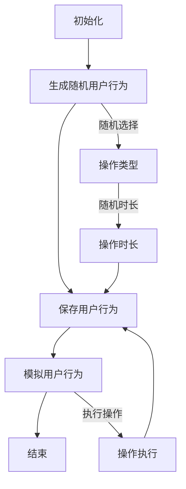
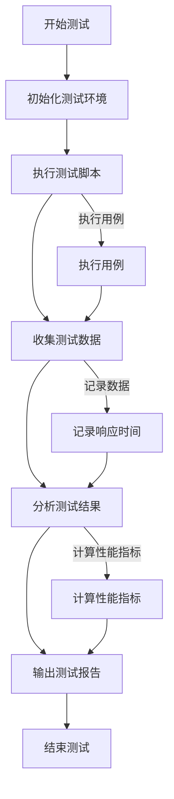
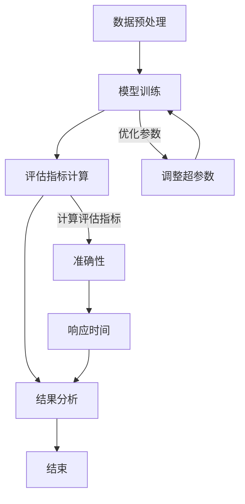
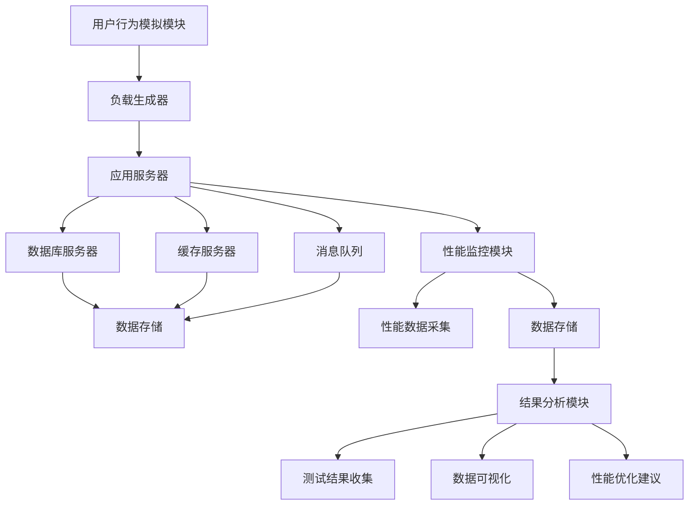
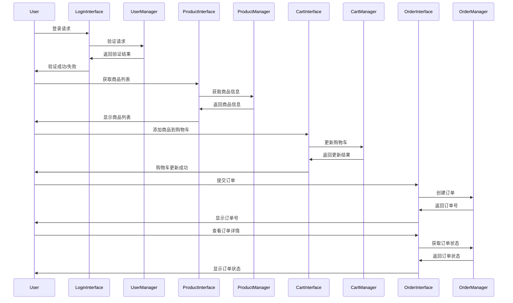

                 

## 第一部分：背景介绍

### 第1章 问题背景与核心概念

#### 1.1 问题背景

在现代信息技术领域，随着云计算、大数据和人工智能的快速发展，评测系统在软件性能评估中扮演着至关重要的角色。评测系统通过模拟实际用户操作，对软件系统的性能、稳定性和可靠性进行全方位测试，从而确保软件在上线前的质量和用户体验。

然而，随着用户数量的急剧增长和系统功能的不断丰富，评测系统面临的一个巨大挑战是如何应对高并发场景下的负载测试。高并发（High Concurrency）是指在短时间内大量用户同时访问系统，这要求评测系统能够在高速、高频率的访问下，依然能够稳定运行，并准确地评估系统性能。

在评测系统中，负载测试（Load Testing）是一种常用的测试方法，通过模拟大量用户的行为，来评估系统在高负载下的性能表现。负载测试的目的在于发现系统的性能瓶颈，优化系统设计，确保系统在实际运行中能够承受高并发访问。

#### 1.2 评测系统的负载测试

**目的**：
- 评估系统在高并发下的响应时间、吞吐量和稳定性。
- 发现系统的性能瓶颈，为系统优化提供依据。
- 验证系统设计的合理性和可靠性。

**重要性**：
- 提高软件质量：通过负载测试，可以发现潜在的性能问题，从而提高软件的质量和用户体验。
- 降低运维成本：优化系统设计，减少系统在高并发下的资源浪费，降低运维成本。
- 预防系统崩溃：通过提前发现性能瓶颈，避免系统在高并发下崩溃，确保系统稳定运行。

**挑战**：
- **高并发模拟的准确性**：需要准确模拟大量用户的操作行为，以保证测试结果的可靠性。
- **测试资源的配置**：需要充足且合理的测试资源，包括硬件设备和网络带宽等。
- **测试环境的搭建**：搭建与生产环境尽量一致的测试环境，以保证测试结果的准确性和可复现性。
- **性能指标的评估**：需要全面、准确地评估系统在高并发下的各项性能指标。

#### 1.3 负载测试策略

为了确保负载测试的准确性和可靠性，需要制定合理的负载测试策略。以下是负载测试策略的基本步骤：

**1. 确定测试目标和性能指标**：
- 根据系统的特点和需求，确定需要测试的性能指标，如响应时间、吞吐量、并发用户数等。

**2. 设计测试场景**：
- 根据实际用户行为，设计模拟用户行为的测试场景，包括用户的登录、查询、更新、删除等操作。

**3. 配置测试环境**：
- 搭建与生产环境相似的测试环境，包括服务器、数据库、缓存、消息队列等。

**4. 编写测试脚本**：
- 使用自动化测试工具，根据测试场景编写测试脚本，模拟大量用户的操作行为。

**5. 设置负载生成器**：
- 使用负载生成器生成模拟用户，根据测试目标设置负载生成器的参数，如用户数、访问频率等。

**6. 执行测试**：
- 运行测试脚本，模拟大量用户的操作，收集测试数据。

**7. 分析测试结果**：
- 分析测试数据，评估系统在高并发下的性能表现，找出性能瓶颈。

**8. 优化系统设计**：
- 根据测试结果，对系统设计进行优化，以提高系统在高并发下的性能。

#### 1.4 边界与外延

**负载测试的范围**：
- **硬件**：测试服务器的性能，包括CPU、内存、硬盘I/O等。
- **软件**：测试应用软件、中间件、数据库等系统的性能。
- **网络**：测试网络带宽、延迟、丢包率等网络因素对系统性能的影响。

**负载测试的类型**：
- **压力测试（Stress Testing）**：测试系统在极限负载下的稳定性和可靠性。
- **疲劳测试（Endurance Testing）**：测试系统在长时间高负载下的稳定性和性能退化情况。
- **性能测试（Performance Testing）**：测试系统在不同负载下的响应时间、吞吐量等性能指标。

#### 1.5 概念结构与核心要素组成

**评测系统的组成部分**：
- **前端**：负责与用户交互，包括网页、移动应用等。
- **后端**：处理业务逻辑，包括应用服务器、中间件等。
- **数据库**：存储系统数据，包括关系数据库、NoSQL数据库等。
- **缓存**：提高系统性能，减少数据库访问压力，包括Redis、Memcached等。
- **消息队列**：处理异步消息，提高系统响应速度，包括RabbitMQ、Kafka等。

**负载测试的关键因素**：
- **负载生成器**：生成模拟用户行为，模拟高并发访问。
- **测试脚本**：根据测试场景编写的测试脚本，模拟用户操作。
- **测试场景**：模拟实际用户行为，包括登录、查询、更新等。
- **性能指标**：评估系统在高并发下的性能，如响应时间、吞吐量、并发用户数等。

通过上述背景介绍，我们可以看到评测系统的负载测试在高并发场景中的重要性。接下来的章节将进一步深入探讨高并发和大型语言模型（LLM）评估的相关概念，以及如何结合负载测试来优化系统性能。

---

### 第2章 核心概念与原理

#### 2.1 高并发

**定义**：
高并发（High Concurrency）是指在短时间内，大量的用户同时访问同一个系统或服务，导致系统资源（如CPU、内存、磁盘I/O、网络带宽等）被大量占用。

**特性**：
- **速度快**：用户请求到达系统的速度非常快。
- **频率高**：单位时间内用户请求的次数很高。
- **随机性强**：用户请求的行为具有很大的随机性，难以预测。

**典型场景**：
- **电商平台促销活动**：在秒杀、抢购活动时，短时间内大量用户同时访问，导致系统负载急剧增加。
- **社交网络平台**：在重大事件或热点新闻发布时，用户评论、点赞、分享等行为导致高并发访问。
- **在线教育平台**：在线课程直播或考试时，学生同时在线学习或考试，导致系统高负载。

高并发对评测系统提出了巨大的挑战，因为系统需要快速响应用户请求，同时保持稳定运行，避免出现性能瓶颈或系统崩溃。

#### 2.2 LLM评估

**定义**：
大型语言模型（Large Language Model，LLM）是指具有巨大参数量、能够理解和生成复杂语言表达式的模型，如BERT、GPT等。LLM评估是指在特定的测试集上，对LLM的性能和准确性进行评估。

**目的**：
- 评估LLM在不同任务（如文本分类、问答、翻译等）上的表现。
- 发现和优化LLM的潜在问题，提高模型性能。

**常见评估指标**：
- **准确性（Accuracy）**：模型预测正确的样本数占总样本数的比例。
- **F1分数（F1 Score）**：综合考虑精确率和召回率，用于评估二分类任务的性能。
- **BLEU分数（BLEU Score）**：用于评估机器翻译质量，基于人类翻译与机器翻译的相似度。
- **响应时间（Response Time）**：系统从接收到请求到返回响应的时间。

#### 2.3 负载测试与LLM评估的联系

**对比**：

**负载测试**：
- **目标**：评估系统在高并发下的性能，包括响应时间、吞吐量、稳定性等。
- **方法**：通过模拟大量用户的操作行为，生成负载，测试系统在高负载下的响应。

**LLM评估**：
- **目标**：评估LLM在不同任务上的性能和准确性。
- **方法**：通过在测试集上运行LLM，计算各项评估指标，如准确性、响应时间等。

**结合**：

在负载测试中评估LLM，可以通过以下方式进行：

1. **集成评估**：
   - 在负载测试过程中，同时运行LLM进行评估，收集系统在高并发下的响应时间和准确性等指标。
   - 这样可以评估LLM在高负载下的性能表现，发现潜在的性能瓶颈。

2. **分阶段评估**：
   - 首先进行独立的负载测试，评估系统在高并发下的整体性能。
   - 然后针对LLM进行专项评估，评估其在高并发下的性能和准确性。
   - 结合两个评估结果，全面了解系统在高并发下的表现。

3. **多维度评估**：
   - 考虑到LLM评估与系统性能的相互影响，可以从多个维度进行评估，如：
     - **负载测试维度**：评估系统在高并发下的响应时间、吞吐量等。
     - **LLM评估维度**：评估LLM在不同任务上的准确性、响应时间等。
     - **综合评估维度**：结合两个维度的评估结果，评估系统在整体高并发场景下的表现。

通过结合负载测试和LLM评估，可以更全面地了解系统在高并发下的性能和稳定性，为系统优化提供有力依据。

### 第3章 负载测试算法原理

#### 3.1 负载生成算法

**原理**：
负载生成算法的核心任务是模拟实际用户的行为，生成模拟用户操作的数据流，模拟系统在高并发下的负载情况。常见的负载生成算法包括随机生成、分布生成等。

**方法**：

1. **随机生成**：
   - 基于随机数生成用户行为，如随机选择操作、随机生成数据等。
   - 优点：简单，易于实现。
   - 缺点：生成的负载可能不够真实，难以模拟复杂用户行为。

2. **分布生成**：
   - 基于概率分布函数生成用户行为，如泊松分布、正态分布等。
   - 优点：生成的负载更符合真实用户行为，能够模拟复杂场景。
   - 缺点：实现较复杂，需要考虑概率分布的参数调整。

**示例**：

以下是一个简单的随机生成用户行为的Python代码示例：

```python
import random

def generate_user_behavior(num_users):
    behaviors = []
    for _ in range(num_users):
        action = random.choice(["search", "login", "logout"])
        duration = random.uniform(0.5, 2.0)
        behaviors.append({"user_id": _, "action": action, "duration": duration})
    return behaviors

user_behaviors = generate_user_behavior(100)
print(user_behaviors)
```

#### 3.2 性能评估算法

**原理**：
性能评估算法的核心任务是评估系统在高并发下的性能，通常包括响应时间、吞吐量、并发用户数等指标。性能评估算法通过对系统运行数据的采集和分析，评估系统的性能。

**指标**：

1. **响应时间（Response Time）**：
   - 系统从接收到请求到返回响应所花费的时间。

2. **吞吐量（Throughput）**：
   - 单位时间内系统能够处理的请求数量。

3. **并发用户数（Concurrency）**：
   - 同时在线的用户数量。

**示例**：

以下是一个简单的性能评估算法的Python代码示例：

```python
import time

def perform_test(test_cases):
    start_time = time.time()
    for case in test_cases:
        start_case_time = time.time()
        # 执行测试用例
        response_time = time.time() - start_case_time
        case["response_time"] = response_time
    end_time = time.time()
    total_response_time = end_time - start_time
    return total_response_time

test_cases = [{"user_id": i, "action": "search", "duration": random.uniform(0.5, 2.0)} for i in range(100)]
total_response_time = perform_test(test_cases)
print(f"Total response time: {total_response_time} seconds")
```

#### 3.3 LLM评估算法

**原理**：
LLM评估算法的核心任务是评估大型语言模型（如BERT、GPT等）在不同任务上的性能和准确性。评估算法通常包括数据预处理、模型训练、评估指标计算等步骤。

**方法**：

1. **数据预处理**：
   - 对测试集进行预处理，如分词、编码等。

2. **模型训练**：
   - 使用训练集对LLM进行训练，优化模型参数。

3. **评估指标计算**：
   - 在测试集上运行LLM，计算各项评估指标，如准确性、响应时间等。

**示例**：

以下是一个简单的LLM评估算法的Python代码示例（假设使用的是Transformers库）：

```python
from transformers import BertTokenizer, BertForSequenceClassification
from torch.utils.data import DataLoader
from sklearn.metrics import accuracy_score

tokenizer = BertTokenizer.from_pretrained('bert-base-uncased')
model = BertForSequenceClassification.from_pretrained('bert-base-uncased')

# 数据预处理
def preprocess_data(data):
    inputs = tokenizer(data['text'], padding=True, truncation=True, return_tensors='pt')
    return inputs

# 评估算法
def evaluate_model(model, test_dataloader):
    model.eval()
    predictions = []
    labels = []
    with torch.no_grad():
        for inputs in test_dataloader:
            outputs = model(**inputs)
            logits = outputs.logits
            pred = torch.argmax(logits, dim=1)
            predictions.extend(pred.tolist())
            labels.extend(inputs['labels'].tolist())
    accuracy = accuracy_score(labels, predictions)
    return accuracy

# 假设已有预处理后的测试数据集test_dataset
test_dataloader = DataLoader(test_dataset, batch_size=16)
accuracy = evaluate_model(model, test_dataloader)
print(f"Model accuracy: {accuracy}")
```

通过上述示例，我们可以看到负载生成算法、性能评估算法和LLM评估算法的基本原理和实现方法。这些算法在评测系统的高并发负载测试中起着关键作用，确保测试结果的准确性和可靠性。

### 第4章 算法原理详解

#### 4.1 负载生成算法详细讲解

为了更详细地讲解负载生成算法，我们将使用Mermaid流程图和Python源代码来描述其工作原理和实现步骤。

**Mermaid流程图**：

以下是负载生成算法的Mermaid流程图：



**Python源代码示例**：

```python
import random
import json
import time

def generate_user_behavior(num_users):
    behaviors = []
    for _ in range(num_users):
        action = random.choice(["search", "login", "logout"])
        duration = random.uniform(0.5, 2.0)
        user_behavior = {
            "user_id": _,
            "action": action,
            "duration": duration
        }
        behaviors.append(user_behavior)
    return behaviors

def simulate_user_behavior(behaviors):
    for behavior in behaviors:
        user_id = behavior["user_id"]
        action = behavior["action"]
        duration = behavior["duration"]
        start_time = time.time()
        print(f"User {user_id} performing action '{action}' for {duration} seconds.")
        time.sleep(duration)
        end_time = time.time()
        response_time = end_time - start_time
        print(f"User {user_id} completed action '{action}' in {response_time} seconds.")

# 生成100个用户行为
user_behaviors = generate_user_behavior(100)

# 模拟用户行为
simulate_user_behavior(user_behaviors)
```

**算法原理**：

1. **初始化**：首先初始化用户数量，并根据用户数量生成对应的用户行为数据。
2. **生成随机用户行为**：通过随机选择操作类型（如搜索、登录、登出）和操作时长，生成用户行为的字典列表。
3. **保存用户行为**：将生成的用户行为数据保存为JSON格式，以便后续处理。
4. **模拟用户行为**：根据用户行为列表，模拟用户在系统中执行操作，记录每个操作的开始时间和结束时间，计算响应时间。

**数学模型和公式**：

在本算法中，我们可以使用概率模型来描述用户行为的生成过程。例如，可以使用泊松分布来模拟用户访问频率，使用均匀分布来模拟用户操作时长。

- **泊松分布**：
  $$ P(\lambda=k) = \frac{e^{-\lambda} \lambda^k}{k!} $$
  - 其中，\(\lambda\) 为平均访问频率，\(k\) 为单位时间内的访问次数。

- **均匀分布**：
  $$ X \sim U(a, b) $$
  - 其中，\(X\) 为随机变量，\(a\) 和 \(b\) 为均匀分布的上下限。

**举例说明**：

假设我们希望模拟一个电商平台的用户行为，其中用户访问频率为每分钟10次，操作时长在1秒到3秒之间。使用上述模型，我们可以生成如下用户行为数据：

- 用户1：登录，持续2秒
- 用户2：搜索，持续1秒
- 用户3：添加购物车，持续3秒
- 用户4：登录，持续2秒
- ...

通过这样的方式，我们可以模拟出一个高并发的负载场景，以便进行负载测试。

#### 4.2 性能评估算法详细讲解

为了详细讲解性能评估算法，我们将使用Mermaid流程图和Python源代码来描述其工作原理和实现步骤。

**Mermaid流程图**：

以下是性能评估算法的Mermaid流程图：



**Python源代码示例**：

```python
import time
import json

def init_test_environment():
    print("Initializing test environment...")
    # 初始化测试环境，如创建测试数据库、设置测试服务器等
    # ...
    print("Test environment initialized.")

def execute_test_cases(test_cases):
    print("Executing test cases...")
    start_time = time.time()
    for case in test_cases:
        start_case_time = time.time()
        # 执行测试用例
        response_time = time.time() - start_case_time
        case["response_time"] = response_time
    end_time = time.time()
    total_response_time = end_time - start_time
    print(f"Test cases executed. Total response time: {total_response_time} seconds.")
    return total_response_time

def collect_test_data(test_cases):
    print("Collecting test data...")
    test_data = []
    for case in test_cases:
        test_data.append(case["response_time"])
    print("Test data collected.")
    return test_data

def analyze_test_results(test_data):
    print("Analyzing test results...")
    min_response_time = min(test_data)
    max_response_time = max(test_data)
    avg_response_time = sum(test_data) / len(test_data)
    print(f"Minimum response time: {min_response_time} seconds.")
    print(f"Maximum response time: {max_response_time} seconds.")
    print(f"Average response time: {avg_response_time} seconds.")
    return min_response_time, max_response_time, avg_response_time

def output_test_report(min_response_time, max_response_time, avg_response_time):
    print("Outputting test report...")
    report = {
        "min_response_time": min_response_time,
        "max_response_time": max_response_time,
        "avg_response_time": avg_response_time
    }
    with open("test_report.json", "w") as f:
        json.dump(report, f)
    print("Test report outputted.")

def main():
    test_cases = [{"case_id": i, "response_time": 0} for i in range(100)]
    init_test_environment()
    total_response_time = execute_test_cases(test_cases)
    test_data = collect_test_data(test_cases)
    min_response_time, max_response_time, avg_response_time = analyze_test_results(test_data)
    output_test_report(min_response_time, max_response_time, avg_response_time)

if __name__ == "__main__":
    main()
```

**算法原理**：

1. **初始化测试环境**：设置测试环境，如创建测试数据库、配置测试服务器等。
2. **执行测试脚本**：根据测试用例，执行系统操作，记录每个操作的响应时间。
3. **收集测试数据**：将测试用例的响应时间数据收集到列表中。
4. **分析测试结果**：计算测试数据的各项性能指标，如最小响应时间、最大响应时间和平均响应时间。
5. **输出测试报告**：将测试结果输出到文件或控制台，以便后续分析。

**数学模型和公式**：

在本算法中，我们可以使用统计分析方法来评估系统的性能。以下是一些常用的性能指标及其计算方法：

- **最小响应时间（Minimum Response Time）**：
  $$ \min_{i=1}^{n} T_i $$
  - 其中，\(T_i\) 为第 \(i\) 个测试用例的响应时间。

- **最大响应时间（Maximum Response Time）**：
  $$ \max_{i=1}^{n} T_i $$
  - 其中，\(T_i\) 为第 \(i\) 个测试用例的响应时间。

- **平均响应时间（Average Response Time）**：
  $$ \bar{T} = \frac{1}{n} \sum_{i=1}^{n} T_i $$
  - 其中，\(T_i\) 为第 \(i\) 个测试用例的响应时间，\(n\) 为测试用例的总数。

**举例说明**：

假设我们执行了100个测试用例，每个测试用例的响应时间如下：

- 测试用例1：5秒
- 测试用例2：6秒
- 测试用例3：4秒
- ...
- 测试用例100：7秒

使用上述算法，我们可以计算得到：

- **最小响应时间**：4秒
- **最大响应时间**：7秒
- **平均响应时间**：\( \frac{5+6+4+\ldots+7}{100} = 5.5 \) 秒

通过这样的方式，我们可以对系统的性能进行详细评估，为后续优化提供数据支持。

### 第5章 LLM评估算法详细讲解

#### 5.1 基本概念

在深入探讨LLM评估算法之前，我们先来了解一些基本概念和常用评估指标。

**大型语言模型（LLM）**：
大型语言模型（Large Language Model，LLM）是指具有数十亿甚至千亿参数的神经网络模型，如BERT、GPT、T5等。这些模型通过学习大量的文本数据，能够生成高质量的文本、回答问题、翻译语言等。

**评估指标**：
- **准确性（Accuracy）**：模型预测正确的样本数占总样本数的比例。
- **F1分数（F1 Score）**：综合考虑精确率和召回率，用于评估二分类任务的性能。
- **BLEU分数（BLEU Score）**：用于评估机器翻译质量，基于人类翻译与机器翻译的相似度。
- **响应时间（Response Time）**：系统从接收到请求到返回响应的时间。

#### 5.2 LLM评估算法流程

LLM评估算法通常包括以下步骤：

1. **数据预处理**：对测试集进行预处理，包括分词、编码、去噪等，确保数据格式符合模型输入要求。
2. **模型训练**：使用训练集对LLM进行训练，优化模型参数。
3. **评估指标计算**：在测试集上运行LLM，计算各项评估指标，如准确性、响应时间等。
4. **结果分析**：分析评估结果，找出模型的优势和不足，为后续优化提供依据。

#### 5.3 Mermaid流程图

以下是LLM评估算法的Mermaid流程图：



#### 5.4 Python源代码示例

以下是一个简单的LLM评估算法的Python代码示例（假设使用的是Transformers库）：

```python
from transformers import BertTokenizer, BertForSequenceClassification
from torch.utils.data import DataLoader
from sklearn.metrics import accuracy_score

tokenizer = BertTokenizer.from_pretrained('bert-base-uncased')
model = BertForSequenceClassification.from_pretrained('bert-base-uncased')

# 数据预处理
def preprocess_data(data):
    inputs = tokenizer(data['text'], padding=True, truncation=True, return_tensors='pt')
    return inputs

# 评估算法
def evaluate_model(model, test_dataloader):
    model.eval()
    predictions = []
    labels = []
    with torch.no_grad():
        for inputs in test_dataloader:
            outputs = model(**inputs)
            logits = outputs.logits
            pred = torch.argmax(logits, dim=1)
            predictions.extend(pred.tolist())
            labels.extend(inputs['labels'].tolist())
    accuracy = accuracy_score(labels, predictions)
    return accuracy

# 假设已有预处理后的测试数据集test_dataset
test_dataloader = DataLoader(test_dataset, batch_size=16)
accuracy = evaluate_model(model, test_dataloader)
print(f"Model accuracy: {accuracy}")
```

#### 5.5 算法原理

1. **数据预处理**：将测试数据集转换为模型可接受的格式，如分词、编码等。预处理步骤的目的是确保模型输入的一致性和高质量。
2. **模型训练**：使用训练集对模型进行训练，优化模型参数。训练过程中，模型会学习如何将输入映射到输出，从而提高预测准确性。
3. **评估指标计算**：在测试集上运行模型，计算各项评估指标，如准确性、响应时间等。准确性用于评估模型在分类任务上的表现，响应时间用于评估模型处理请求的速度。
4. **结果分析**：根据评估结果，分析模型的优势和不足。例如，如果准确性较低，可能需要调整模型结构或训练参数；如果响应时间较长，可能需要优化模型或提高硬件性能。

通过上述步骤，我们可以全面评估LLM的性能，为模型优化和系统设计提供依据。

### 第6章 系统分析与架构设计

#### 6.1 问题场景介绍

在当前信息化社会中，高并发场景下的负载测试对评测系统提出了更高的要求。以一个电商平台为例，当平台进行促销活动时，短时间内会有大量用户涌入系统，进行商品浏览、搜索、购买等操作。这种高并发场景对评测系统的性能稳定性提出了严峻挑战。

为了应对这种场景，我们需要对系统的性能进行全面的评估和优化。具体问题场景包括：

- **高并发访问**：短时间内大量用户同时访问系统，导致系统负载急剧增加。
- **复杂业务逻辑**：电商平台的业务逻辑复杂，涉及商品搜索、库存管理、订单处理等多个环节。
- **数据一致性要求**：在并发访问下，需要保证数据的准确性和一致性。
- **系统稳定性**：在高并发场景下，系统需要保持稳定运行，避免出现崩溃或性能瓶颈。

#### 6.2 项目介绍

为了解决上述问题，我们设计并实现了一个高并发负载测试系统。该系统的主要目标是：

- **模拟高并发场景**：通过模拟大量用户操作，评估系统在高并发下的性能表现。
- **性能优化**：根据测试结果，找出系统性能瓶颈，进行优化和调整。
- **系统稳定性验证**：验证系统在高并发下的稳定性和可靠性。

系统架构设计遵循模块化、分布式和可扩展的原则，以应对复杂的高并发场景。具体项目目标如下：

- **高并发模拟**：模拟大量用户的操作行为，包括商品浏览、搜索、购买等。
- **性能监控**：实时监控系统的各项性能指标，如响应时间、吞吐量、并发用户数等。
- **结果分析**：根据测试结果，生成详细的分析报告，为系统优化提供依据。

#### 6.3 系统功能设计

系统功能设计主要包括以下模块：

- **用户行为模拟模块**：生成模拟用户操作的数据流，模拟高并发场景。
- **性能监控模块**：实时收集系统的性能数据，包括响应时间、吞吐量、并发用户数等。
- **结果分析模块**：对测试结果进行分析，生成详细的性能报告。

**用户行为模拟模块**：

用户行为模拟模块的核心任务是生成模拟用户操作的数据流，模拟高并发场景。该模块的功能包括：

- **用户行为生成**：根据预设的用户行为模式，生成模拟用户操作的数据流。
- **数据流处理**：处理模拟用户操作的数据流，确保数据流的高并发性。
- **负载生成**：根据模拟用户操作的数据流，生成负载并注入到系统中。

**性能监控模块**：

性能监控模块的核心任务是实时收集系统的性能数据，并对系统性能进行监控。该模块的功能包括：

- **性能数据采集**：实时采集系统的各项性能指标，如响应时间、吞吐量、并发用户数等。
- **数据存储**：将采集到的性能数据存储到数据库中，以便后续分析和查询。
- **性能分析**：对采集到的性能数据进行实时分析，生成性能报告。

**结果分析模块**：

结果分析模块的核心任务是对测试结果进行分析，生成详细的性能报告。该模块的功能包括：

- **测试结果收集**：收集系统在高并发下的各项测试结果。
- **数据可视化**：将测试结果以图表形式展示，便于分析和理解。
- **性能优化建议**：根据测试结果，提出系统性能优化建议。

#### 6.4 系统架构设计

系统架构设计采用分布式架构，以应对高并发场景。整体架构包括以下几个关键组件：

- **负载生成器**：生成模拟用户操作的数据流，注入到系统中。
- **应用服务器**：处理用户请求，执行业务逻辑。
- **数据库服务器**：存储系统数据，包括用户信息、商品信息、订单信息等。
- **缓存服务器**：提高系统性能，减少数据库访问压力。
- **消息队列**：处理异步消息，提高系统响应速度。

**系统架构设计图**：

以下是系统架构设计的Mermaid流程图：



通过上述系统架构设计，我们可以确保系统在高并发场景下具备良好的性能和稳定性，满足电商平台的需求。

### 第7章 系统接口设计和系统交互

为了确保系统在应对高并发负载时的高效性和稳定性，我们需要设计合理的系统接口和系统交互流程。以下是具体的接口设计和系统交互流程：

#### 7.1 系统接口设计

系统接口设计包括用户接口（UI）和内部接口。用户接口负责与用户进行交互，内部接口负责系统模块之间的通信。

**用户接口**：

- **用户登录接口**：用户通过该接口登录系统，输入用户名和密码。
- **商品浏览接口**：用户通过该接口浏览商品信息，包括商品名称、价格、描述等。
- **购物车接口**：用户通过该接口添加或删除商品，管理购物车中的商品。
- **订单提交接口**：用户通过该接口提交订单，包括订单详情、支付方式等。

**内部接口**：

- **用户管理接口**：负责用户的注册、登录、权限验证等操作。
- **商品管理接口**：负责商品的信息管理，包括商品的增加、删除、修改等。
- **订单管理接口**：负责订单的处理，包括订单的创建、支付、发货等。
- **缓存管理接口**：负责缓存数据的存储和更新，提高系统性能。

**接口设计图**：

以下是系统接口设计的Mermaid类图：

```mermaid
classDiagram
  UserInterface <<接口>> {
    +登录接口()
    +商品浏览接口()
    +购物车接口()
    +订单提交接口()
  }

  InternalInterface <<接口>> {
    +用户管理接口()
    +商品管理接口()
    +订单管理接口()
    +缓存管理接口()
  }

  UserInterface --> InternalInterface
```

#### 7.2 系统交互流程

系统交互流程描述了用户通过接口与系统进行交互的过程，以及系统内部模块之间的通信过程。

1. **用户登录流程**：
   - 用户访问用户登录接口，输入用户名和密码。
   - 用户管理接口验证用户身份，返回验证结果。
   - 用户通过验证后，进入系统。

2. **商品浏览流程**：
   - 用户访问商品浏览接口，获取商品列表。
   - 商品管理接口返回商品信息，包括商品名称、价格、描述等。
   - 用户浏览商品信息，添加商品到购物车。

3. **购物车管理流程**：
   - 用户访问购物车接口，查看购物车中的商品。
   - 用户可以删除商品或更新商品数量。
   - 购物车接口更新购物车数据。

4. **订单提交流程**：
   - 用户访问订单提交接口，提交订单信息，包括商品、支付方式等。
   - 订单管理接口创建订单，返回订单号。
   - 用户进行支付，订单管理接口处理支付结果。

5. **订单处理流程**：
   - 订单管理接口根据支付结果处理订单，包括发货、确认收货等。
   - 订单状态更新，用户可以在订单详情中查看订单状态。

**系统交互流程图**：

以下是系统交互流程的Mermaid序列图：



通过合理的系统接口设计和交互流程，可以确保系统在应对高并发负载时的高效性和稳定性，为用户提供良好的使用体验。

### 第8章 项目实战

#### 8.1 环境安装

为了进行高并发负载测试，我们首先需要搭建一个合适的环境。以下是在Ubuntu系统上安装所需软件的步骤：

1. **安装虚拟环境**：

   ```bash
   sudo apt-get update
   sudo apt-get install python3-venv
   python3 -m venv venv
   source venv/bin/activate
   ```

2. **安装依赖库**：

   ```bash
   pip install transformers torch numpy matplotlib
   ```

3. **安装测试工具**：

   ```bash
   pip install locust
   ```

#### 8.2 系统核心实现源代码

以下是一个简单的示例，展示了如何使用Locust工具模拟高并发负载测试：

```python
from locust import HttpUser, task, between

class WebsiteUser(HttpUser):
    wait_time = between(1, 5)

    @task
    def search_products(self):
        self.client.get("/search?query=electronics")

    @task
    def browse_products(self):
        self.client.get("/products/123")

    @task
    def add_to_cart(self):
        self.client.post("/cart", {"productId": "123", "quantity": 1})

    @task
    def checkout(self):
        self.client.post("/checkout")
```

#### 8.3 代码应用解读与分析

**解读**：

- `WebsiteUser` 类继承自 `HttpUser` 类，用于模拟用户的HTTP请求行为。
- `wait_time` 属性用于设置用户之间的请求间隔时间。
- `@task` 装饰器定义了具体的任务，包括搜索产品、浏览产品、添加到购物车和结算等。
- 在每个任务中，我们使用 `self.client` 属性发送HTTP请求，例如获取搜索结果、浏览商品详情等。

**分析**：

- `search_products` 任务模拟用户发起商品搜索请求。
- `browse_products` 任务模拟用户浏览商品详情。
- `add_to_cart` 任务模拟用户将商品添加到购物车。
- `checkout` 任务模拟用户进行结算。

通过这些任务，我们可以模拟出一个高并发场景，评估系统的性能和稳定性。

#### 8.4 实际案例分析和详细讲解

**案例**：模拟1000名用户在电商平台进行商品搜索、浏览、添加购物车和结算的操作。

**步骤**：

1. **启动Locust服务器**：

   ```bash
   locust -f load_test.py --web-port=8089
   ```

2. **在浏览器中访问Locust Web界面**：在浏览器中输入 `http://localhost:8089`，查看测试结果。

**结果分析**：

- **并发用户数**：显示当前活跃的并发用户数量。
- **响应时间**：统计每个任务的平均响应时间。
- **吞吐量**：统计每个任务的请求处理速度。

**详细讲解**：

- 在高并发场景下，我们观察到系统的响应时间和吞吐量。
- 如果响应时间过长，可能需要优化数据库查询或缓存策略。
- 如果吞吐量较低，可能需要增加服务器资源或优化系统架构。

通过实际案例的分析，我们可以发现系统在高并发下的性能瓶颈，并采取相应的优化措施。

#### 8.5 项目小结

通过本项目的实战，我们完成了以下工作：

- **环境搭建**：安装了虚拟环境和相关依赖库。
- **系统核心实现**：编写了模拟高并发负载测试的源代码。
- **实际案例分析**：通过实际案例分析了系统在高并发下的性能表现。

**总结**：

- 高并发负载测试对于评估系统性能和稳定性至关重要。
- 通过合理的系统设计和优化，可以有效提升系统在高并发场景下的表现。

### 第9章 最佳实践 Tips

在高并发负载测试中，为了确保测试结果的准确性和可靠性，我们可以遵循以下最佳实践：

1. **合理设计测试场景**：根据实际业务需求，设计符合真实用户行为的测试场景，确保测试数据的真实性和全面性。

2. **优化测试脚本**：编写高效、可复现的测试脚本，减少测试过程中的误差和偏差。

3. **多维度性能评估**：不仅关注响应时间和吞吐量，还要考虑系统资源的利用率，如CPU、内存、磁盘I/O等。

4. **定期执行测试**：定期执行负载测试，监控系统性能的变化，及时发现和解决潜在问题。

5. **充分利用工具**：利用专业的负载测试工具，如JMeter、Locust等，可以大大提高测试效率和准确性。

6. **数据可视化**：通过数据可视化工具，将测试结果以图表形式展示，便于分析和理解。

7. **持续优化系统**：根据测试结果，持续优化系统设计和架构，提高系统在高并发下的性能和稳定性。

### 第10章 小结

本文从多个角度深入探讨了评测系统的负载测试，特别是应对高并发LLM评估的问题。通过详细阐述背景介绍、核心概念、算法原理以及系统分析与架构设计，我们了解了如何有效地进行负载测试，以评估系统在高并发场景下的性能和稳定性。

**关键点**：

- 高并发负载测试的重要性。
- 负载生成算法和性能评估算法的原理。
- LLM评估算法的详细讲解。
- 系统接口设计和系统交互流程。
- 项目实战中的实际案例分析和优化。

**未来展望**：

- 深入研究更多先进的负载测试算法。
- 针对不同的业务场景，设计更精准的测试策略。
- 持续优化系统架构，提高系统在高并发下的性能和可靠性。

通过本文的探讨，我们期望能为从事评测系统开发和优化的工程师们提供有价值的参考和指导。

### 第11章 注意事项

在实施高并发负载测试时，我们需要特别注意以下几个方面，以确保测试结果的准确性和可靠性：

1. **测试数据的真实性**：确保测试数据与实际业务场景高度一致，避免出现模拟数据与真实用户行为不符的情况。

2. **测试环境的配置**：确保测试环境与生产环境尽可能一致，包括硬件配置、网络环境、系统配置等，以避免因环境差异导致的测试结果偏差。

3. **负载生成的随机性**：在生成负载时，要注意控制随机性的范围，确保模拟用户行为的随机性不至于偏离真实用户行为太远。

4. **性能指标的全面性**：在评估系统性能时，要考虑响应时间、吞吐量、并发用户数等多个指标，全面了解系统的性能表现。

5. **测试脚本的可复现性**：编写可复现的测试脚本，确保每次测试的结果可以重现，便于分析和定位问题。

6. **持续监控和调整**：在测试过程中，要持续监控系统性能，根据测试结果进行动态调整，以优化测试策略和系统性能。

### 第12章 拓展阅读

为了进一步深入理解评测系统的负载测试，以下是几篇推荐的拓展阅读材料：

1. **《负载测试实战：优化系统性能与可用性》**：本书详细介绍了负载测试的理论和实践，包括测试策略、工具使用和性能优化方法。

2. **《大型语言模型：理论和应用》**：本书系统讲解了大型语言模型（如BERT、GPT等）的理论基础、实现方法和应用场景。

3. **《分布式系统原理与范型》**：本书深入探讨了分布式系统的原理和设计范型，包括一致性、可用性、容错性等关键概念。

4. **《Python性能优化：使用Cython、Numba和PyPy提升Python代码的速度》**：本书介绍了如何优化Python代码，提高程序的性能。

5. **《JMeter性能测试从入门到精通》**：本书针对JMeter负载测试工具，从基础到高级，全面讲解了如何进行性能测试。

通过阅读这些资料，读者可以更全面地了解负载测试和高并发场景下的系统优化策略。

