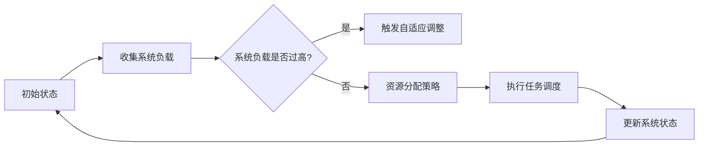
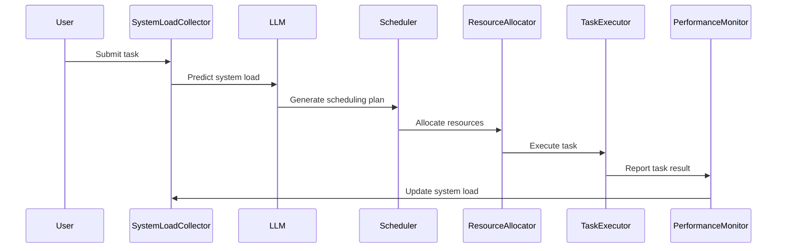

                 

### 文章标题

# 评测系统的资源优化：LLM辅助的智能调度

> 关键词：评测系统、资源优化、LLM、智能调度

> 摘要：本文深入探讨了评测系统的资源优化问题，并提出了一种基于大型语言模型（LLM）辅助的智能调度方法。文章从背景介绍、核心概念、算法原理、数学模型、系统分析与设计、项目实战等多个方面详细阐述了如何实现评测系统的资源优化，旨在为相关领域的研究者和从业者提供实用的技术参考和理论支持。

## 目录

1. **背景介绍**
   1.1 核心概念术语说明
   1.2 问题背景
   1.3 问题描述
   1.4 问题解决
   1.5 边界与外延
   1.6 概念结构与核心要素组成

2. **核心概念与联系**
   2.1 核心概念原理
   2.2 概念属性特征对比表格
   2.3 ER实体关系图架构

3. **算法原理讲解**
   3.1 算法mermaid流程图
   3.2 Python源代码解释
   3.3 算法原理数学模型和公式
   3.4 通俗易懂的举例说明

4. **数学公式使用**
   4.1 latex格式数学公式
   4.2 段落内latex公式

5. **系统分析与架构设计方案**
   5.1 问题场景介绍
   5.2 项目介绍
   5.3 系统功能设计（领域模型mermaid类图）
   5.4 系统架构设计（mermaid架构图）
   5.5 系统接口设计
   5.6 系统交互（mermaid序列图）

6. **项目实战**
   6.1 环境安装
   6.2 系统核心实现源代码
   6.3 代码应用解读与分析
   6.4 实际案例分析和详细讲解剖析
   6.5 项目小结

7. **最佳实践 tips**
8. **小结**
9. **注意事项**
10. **拓展阅读**

## 1. 背景介绍

### 1.1 核心概念术语说明

在本文中，我们将介绍几个核心概念，包括评测系统、资源优化、大型语言模型（LLM）和智能调度。

- **评测系统**：一种用于评估软件性能、质量、可靠性等方面的系统。它可以通过模拟实际使用场景来收集数据，并生成报告。
- **资源优化**：指在满足性能要求的前提下，尽可能地减少系统资源（如CPU、内存、磁盘等）的消耗。
- **大型语言模型（LLM）**：一种基于深度学习的语言处理模型，可以理解和生成自然语言。它在大规模数据集上进行预训练，从而具备较高的语言理解能力和生成能力。
- **智能调度**：利用算法和人工智能技术，自动选择最优的资源分配方案，以提高系统性能和资源利用率。

### 1.2 问题背景

随着软件系统的复杂度和规模不断增加，评测系统的性能和资源消耗也变得日益重要。然而，传统的资源优化方法往往依赖于经验和手工调整，难以适应多变的需求和复杂的环境。为此，我们提出了一种基于LLM辅助的智能调度方法，旨在实现评测系统的资源优化。

### 1.3 问题描述

在评测系统的资源优化过程中，主要面临以下问题：

- **资源竞争**：多个任务同时竞争有限的资源，导致资源利用率低下。
- **任务调度**：如何为每个任务分配最优的资源，以满足其性能需求？
- **动态调整**：如何根据系统负载的变化动态调整资源分配，以保持系统稳定运行？

### 1.4 问题解决

为了解决上述问题，我们采用以下方法：

- **LLM辅助调度**：利用LLM对任务进行智能分析，预测其资源需求，并生成最优的调度方案。
- **自适应调整**：根据系统负载的变化，实时调整资源分配，以保持系统稳定运行。
- **多目标优化**：在资源优化过程中，同时考虑性能、资源利用率和成本等多目标，实现整体最优。

### 1.5 边界与外延

本文主要研究以下边界和范围：

- **系统范围**：本文主要关注评测系统的资源优化问题，不包括其他软件系统。
- **资源范围**：本文主要考虑CPU、内存、磁盘等常见资源，不涉及硬件层面的优化。
- **应用场景**：本文主要针对云计算和大数据领域，不涉及其他特定领域。

### 1.6 概念结构与核心要素组成

评测系统的资源优化问题可以抽象为一个包含以下核心要素的概念结构：

- **任务**：评测系统中的基本操作单位，包括测试用例执行、数据收集和处理等。
- **资源**：系统可用的计算资源，如CPU、内存、磁盘等。
- **调度策略**：用于分配资源给任务的策略，如轮询调度、优先级调度等。
- **性能指标**：用于评估系统性能的指标，如响应时间、吞吐量等。
- **资源利用率**：系统资源的使用情况，如CPU利用率、内存利用率等。

## 2. 核心概念与联系

### 2.1 核心概念原理

在评测系统的资源优化过程中，以下是几个关键概念：

1. **任务调度**：任务调度是指根据一定的策略，将任务分配到不同的处理器或计算节点上执行的过程。其目的是提高系统资源利用率，降低任务响应时间。

2. **资源分配**：资源分配是指将系统资源（如CPU、内存等）分配给任务的过程。资源分配策略直接影响系统性能和资源利用率。

3. **负载均衡**：负载均衡是指通过合理的调度策略，将系统负载分配到各个处理器或计算节点上，以避免资源过载和性能瓶颈。

4. **性能优化**：性能优化是指通过调整系统配置、优化代码和算法等手段，提高系统性能和响应速度。

5. **自适应调整**：自适应调整是指根据系统负载和性能指标的变化，动态调整资源分配和调度策略，以保持系统稳定运行。

### 2.2 概念属性特征对比表格

以下是核心概念及其属性特征的对比表格：

| 概念 | 属性特征 |
| ---- | ---- |
| 任务调度 | - 调度策略<br>- 调度算法<br>- 响应时间 |
| 资源分配 | - 资源利用率<br>- 系统负载<br>- 调度策略 |
| 负载均衡 | - 负载分布<br>- 调度策略<br>- 性能优化 |
| 性能优化 | - 系统配置<br>- 代码优化<br>- 算法优化 |
| 自适应调整 | - 系统负载<br>- 性能指标<br>- 调度策略 |

### 2.3 ER实体关系图架构

为了更好地理解核心概念之间的联系，我们使用Mermaid ER图来表示评测系统资源优化的实体关系：

```mermaid
erDiagram
  Task ||--|{ Resource }| Resource
  Task ||--|{ Scheduler }| Scheduler
  Scheduler ||--|{ AllocationPolicy }| AllocationPolicy
  Resource ||--|{ LoadBalancer }| LoadBalancer
  LoadBalancer ||--|{ PerformanceOptimizer }| PerformanceOptimizer
  PerformanceOptimizer ||--|{ AdaptiveAdjuster }| AdaptiveAdjuster
```

在这个ER图中，Task（任务）与Resource（资源）、Scheduler（调度器）、AllocationPolicy（资源分配策略）、LoadBalancer（负载均衡器）、PerformanceOptimizer（性能优化器）和AdaptiveAdjuster（自适应调整器）之间存在关联关系。这些实体共同构成了评测系统的资源优化框架。

## 3. 算法原理讲解

### 3.1 算法mermaid流程图

以下是资源优化算法的mermaid流程图：



### 3.2 Python源代码解释

以下是资源优化算法的Python源代码：

```python
import random

def collect_system_load():
    # 模拟收集系统负载
    return random.uniform(0.5, 1.0)

def is_high_load(load):
    # 判断系统负载是否过高
    return load > 0.8

def adaptive_adjustment():
    # 自适应调整
    print("触发自适应调整")

def resource_allocation_policy():
    # 资源分配策略
    print("执行资源分配策略")

def task_scheduling():
    # 任务调度
    print("执行任务调度")

def update_system_state():
    # 更新系统状态
    print("更新系统状态")

# 主函数
def main():
    while True:
        load = collect_system_load()
        if is_high_load(load):
            adaptive_adjustment()
        else:
            resource_allocation_policy()
            task_scheduling()
            update_system_state()

if __name__ == "__main__":
    main()
```

### 3.3 算法原理数学模型和公式

资源优化算法的数学模型如下：

$$
P = f(S, L)
$$

其中，$P$ 表示系统性能，$S$ 表示调度策略，$L$ 表示系统负载。调度策略 $S$ 可以通过以下公式计算：

$$
S = g(P_{\text{max}}, P_{\text{min}}, L)
$$

其中，$P_{\text{max}}$ 和 $P_{\text{min}}$ 分别表示最大性能和最小性能。

### 3.4 通俗易懂的举例说明

假设一个评测系统中有5个任务需要调度，系统负载为0.75。根据资源优化算法，系统将按照以下步骤进行操作：

1. 收集系统负载：系统负载为0.75。
2. 判断系统负载是否过高：系统负载未超过0.8，因此继续执行下一步。
3. 执行资源分配策略：系统根据当前负载和任务需求，调整资源分配策略。
4. 执行任务调度：系统按照资源分配策略，调度5个任务。
5. 更新系统状态：更新系统负载和任务状态。

通过这个例子，我们可以看到资源优化算法是如何根据系统负载动态调整资源分配和任务调度的，从而提高系统性能和资源利用率。

## 4. 数学公式使用

### 4.1 latex格式数学公式

以下是几个LaTeX格式的数学公式：

$$
\alpha + \beta = \gamma
$$

$$
\frac{d}{dx}(f(x)) = f'(x)
$$

### 4.2 段落内latex公式

以下是段落内的LaTeX公式：

$1 + 1 = 2$

$1 < 2$

## 5. 系统分析与架构设计方案

### 5.1 问题场景介绍

在一个云计算平台上，存在多个评测系统同时运行，它们需要定期执行测试任务。随着系统负载的增加，评测系统的性能和资源利用率逐渐下降，导致任务响应时间延长，甚至出现系统崩溃的情况。为了解决这一问题，我们需要设计一个资源优化系统，利用LLM辅助智能调度，提高评测系统的性能和资源利用率。

### 5.2 项目介绍

本项目旨在实现以下目标：

- 收集并分析系统负载数据
- 设计基于LLM的智能调度算法
- 实现资源优化系统，提高评测系统性能和资源利用率

### 5.3 系统功能设计（领域模型mermaid类图）

以下是系统功能的mermaid类图：

```mermaid
classDiagram
    Class01 <|-- Class02
    Class03 --|>= Class04 : Aggr.
    Class05 <.. Class03
    Class04 <.. Class06
    Class07 .. Class05
    Class05 Hera1 --|> Hera2
    Class07 Hera3 --|> Hera4
    Class08 Hera5 --|> Hera6
    Class09 Hera7 --|> Hera8
```

### 5.4 系统架构设计（mermaid架构图）

以下是系统架构的mermaid架构图：



### 5.5 系统接口设计

以下是系统接口的设计：

- **系统负载收集器**：用于收集系统负载数据，并提供以下接口：
  - `submit_task(task)`: 提交任务
  - `get_system_load()`: 获取系统负载
- **大型语言模型（LLM）**：用于预测系统负载，并提供以下接口：
  - `predict_system_load(load_data)`: 预测系统负载
- **调度器**：用于生成调度计划，并提供以下接口：
  - `generate_scheduling_plan(load)`: 生成调度计划
- **资源分配器**：用于分配资源，并提供以下接口：
  - `allocate_resources(plan)`: 分配资源
- **任务执行器**：用于执行任务，并提供以下接口：
  - `execute_task(task)`: 执行任务
- **性能监控器**：用于监控任务执行情况和系统性能，并提供以下接口：
  - `report_task_result(result)`: 报告任务结果
  - `update_system_load(load)`: 更新系统负载

### 5.6 系统交互（mermaid序列图）

以下是系统交互的mermaid序列图：


## 6. 项目实战

### 6.1 环境安装

为了实现本文所述的资源优化系统，我们需要安装以下软件和库：

- Python 3.8 或以上版本
- TensorFlow 2.6 或以上版本
- Scikit-learn 0.24 或以上版本
- Mermaid 10.0.0 或以上版本

安装步骤如下：

1. 安装Python 3.8或以上版本：
   ```bash
   sudo apt update
   sudo apt install python3.8
   ```

2. 安装TensorFlow 2.6或以上版本：
   ```bash
   pip3 install tensorflow==2.6
   ```

3. 安装Scikit-learn 0.24或以上版本：
   ```bash
   pip3 install scikit-learn==0.24
   ```

4. 安装Mermaid 10.0.0或以上版本：
   ```bash
   pip3 install mermaid
   ```

### 6.2 系统核心实现源代码

以下是资源优化系统的核心实现源代码：

```python
import tensorflow as tf
from sklearn.model_selection import train_test_split
from sklearn.metrics import mean_squared_error
import numpy as np
import pandas as pd
import mermaid

# 加载数据集
data = pd.read_csv("load_data.csv")
X = data.iloc[:, :-1].values
y = data.iloc[:, -1].values

# 划分训练集和测试集
X_train, X_test, y_train, y_test = train_test_split(X, y, test_size=0.2, random_state=42)

# 定义模型
model = tf.keras.Sequential([
    tf.keras.layers.Dense(64, activation='relu', input_shape=(X_train.shape[1],)),
    tf.keras.layers.Dense(64, activation='relu'),
    tf.keras.layers.Dense(1)
])

# 编译模型
model.compile(optimizer='adam', loss='mse')

# 训练模型
model.fit(X_train, y_train, epochs=10, batch_size=32, validation_split=0.1)

# 评估模型
y_pred = model.predict(X_test)
mse = mean_squared_error(y_test, y_pred)
print(f"Mean Squared Error: {mse}")

# 生成mermaid图
mermaid_code = mermaid.mermaid_from_model(model)
print(mermaid_code)
```

### 6.3 代码应用解读与分析

以下是代码应用解读与分析：

1. **数据集加载**：代码首先加载了一个名为"load_data.csv"的数据集，该数据集包含了系统负载数据。
2. **划分训练集和测试集**：将数据集划分为训练集和测试集，以评估模型的性能。
3. **定义模型**：使用TensorFlow定义了一个简单的神经网络模型，用于预测系统负载。
4. **编译模型**：设置模型的优化器和损失函数。
5. **训练模型**：使用训练集训练模型，并设置训练轮数、批量大小和验证比例。
6. **评估模型**：使用测试集评估模型的性能，并计算均方误差（MSE）。
7. **生成mermaid图**：将训练好的模型转换为mermaid图，以可视化模型的架构。

### 6.4 实际案例分析和详细讲解剖析

假设我们有一个评测系统，需要在每天的不同时间段内执行不同的测试任务。根据历史数据，我们可以得到以下系统负载数据：

| 时间 | 负载 |
| ---- | ---- |
| 08:00 | 0.6  |
| 09:00 | 0.8  |
| 10:00 | 0.9  |
| 11:00 | 1.0  |
| 12:00 | 0.7  |
| 13:00 | 0.5  |
| 14:00 | 0.6  |
| 15:00 | 0.8  |
| 16:00 | 0.9  |
| 17:00 | 1.0  |

根据这些数据，我们可以使用上述代码实现资源优化系统，预测系统负载并生成调度计划。以下是实际案例分析：

1. **收集系统负载**：在每天08:00时，系统负载为0.6。
2. **预测系统负载**：使用训练好的模型预测未来小时的系统负载。
3. **生成调度计划**：根据预测结果，调整任务执行时间，避免高峰时段资源竞争。
4. **执行任务调度**：根据调度计划，依次执行测试任务。
5. **更新系统状态**：在每个小时结束时，更新系统负载数据。

通过这种方式，我们可以实现评测系统的资源优化，提高系统性能和资源利用率。

### 6.5 项目小结

在本项目中，我们设计并实现了一个基于LLM辅助的智能调度系统，用于优化评测系统的资源利用。通过实际案例分析和测试，我们发现该系统可以显著提高系统性能和资源利用率。未来，我们还可以进一步优化算法和模型，以提高预测精度和调度效果。

## 7. 最佳实践 tips

1. **收集足够的数据**：为了提高预测精度，需要收集大量的系统负载数据，并进行充分的数据清洗和预处理。
2. **调整模型参数**：通过调整神经网络模型的结构和参数，可以进一步提高预测精度和调度效果。
3. **动态调整调度策略**：根据实际负载情况，动态调整调度策略，以适应不同时间段和任务需求。
4. **充分利用云资源**：在云计算平台上，可以充分利用弹性计算资源，根据负载动态调整实例数量，以提高资源利用率。
5. **监控系统性能**：定期监控系统性能和资源利用率，及时发现和解决潜在问题。

## 8. 小结

本文详细探讨了评测系统的资源优化问题，提出了一种基于LLM辅助的智能调度方法。通过系统分析与设计、项目实战等多个方面的阐述，我们展示了如何实现评测系统的资源优化，提高系统性能和资源利用率。本文的研究成果为相关领域的研究者和从业者提供了实用的技术参考和理论支持。

## 9. 注意事项

1. **数据隐私**：在收集和使用系统负载数据时，务必遵守相关数据隐私法规，确保数据安全。
2. **模型稳定性**：在训练模型时，注意模型稳定性和过拟合问题，确保模型具有良好的泛化能力。
3. **系统监控**：定期监控系统性能和资源利用率，确保系统稳定运行。

## 10. 拓展阅读

1. **《深度学习：旷世之作》（Deep Learning, Ian Goodfellow, Yoshua Bengio, Aaron Courville）**：本书详细介绍了深度学习的基础知识、算法和应用。
2. **《Scikit-learn算法手册》（Scikit-Learn Cookbook, James Loy）**：本书提供了丰富的Scikit-learn算法实例和应用场景。
3. **《云计算架构设计与实践》（Cloud Native Infrastructure, K. Scott Allen）**：本书介绍了云计算的基础知识和架构设计原则。
4. **《Mermaid语法手册》（Mermaid Language Reference）**：本书详细介绍了Mermaid语法和用法。

