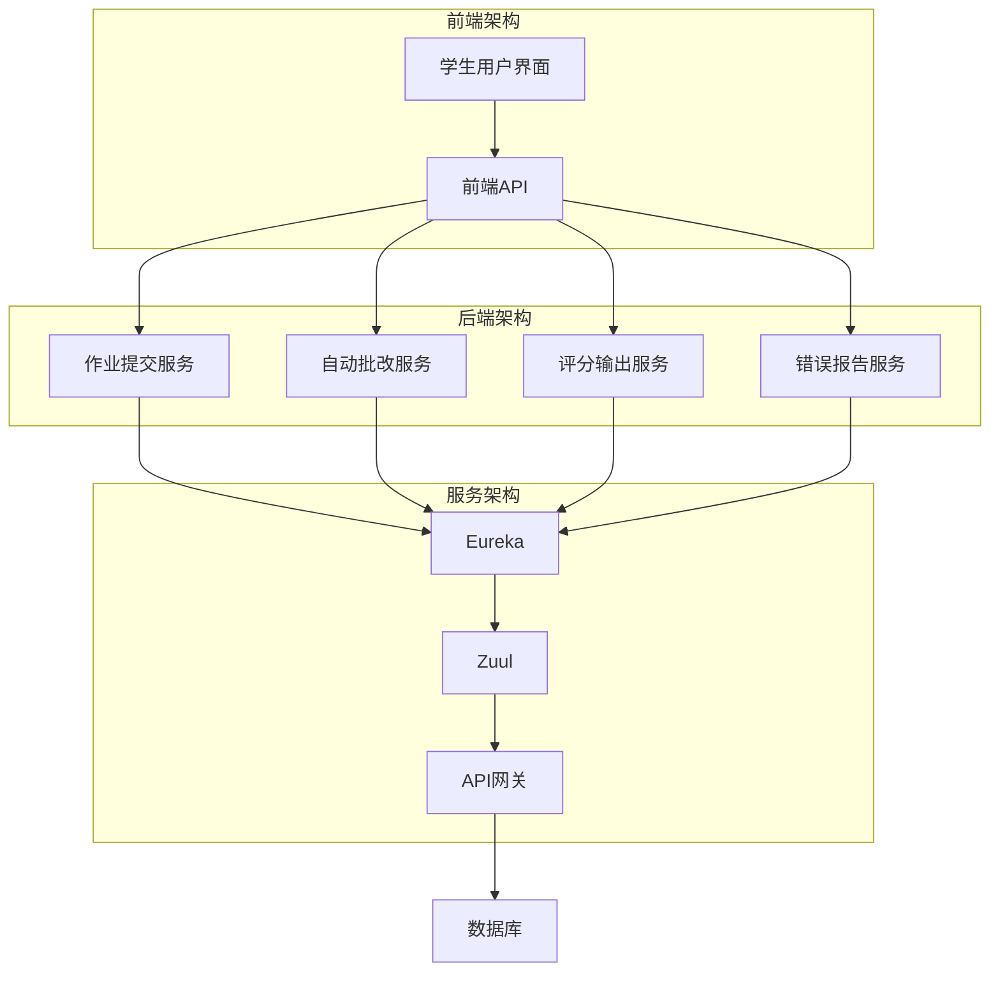
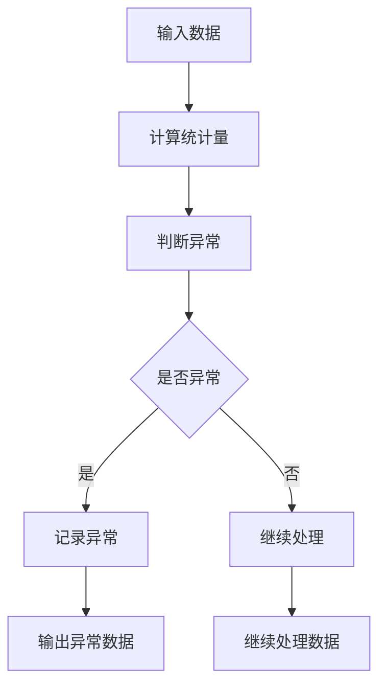
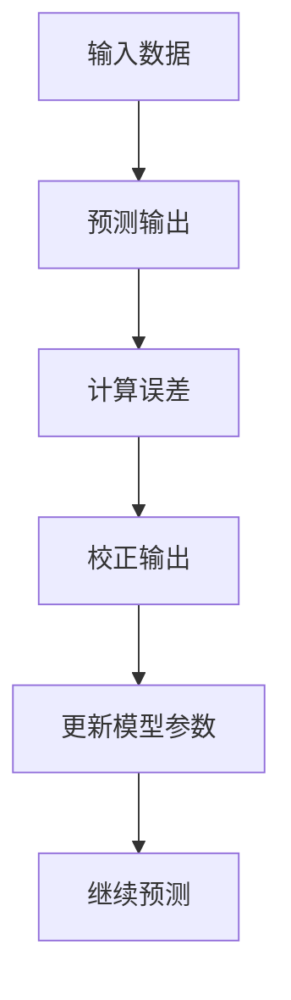
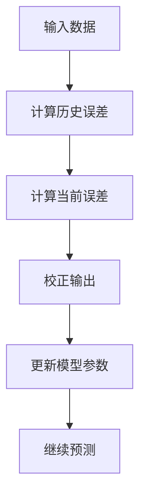

                 

### 文章标题

## 评测系统的错误处理与容错设计

> 关键词：评测系统、错误处理、容错设计、系统架构、算法原理、项目实战

> 摘要：本文将深入探讨评测系统的错误处理与容错设计。首先，我们将介绍评测系统的基本概念和错误处理与容错设计的重要性。接着，通过核心概念与联系的分析，我们会对错误处理与容错设计进行详细探讨。本文将涵盖数学模型和公式，以及系统分析与架构设计。随后，我们将讲解错误处理算法和容错设计算法，并以实际项目为例，展示错误处理与容错设计的应用。最后，文章将总结项目经验，提供最佳实践 tips，并推荐拓展阅读资源。

----------------------------------------------------------------

## 第一部分：背景介绍

### 第1章：问题背景与核心概念

在信息技术迅速发展的今天，评测系统作为一种关键的软件系统，广泛应用于各种领域，如教育、金融、医疗等。评测系统的核心功能是对输入的数据进行评估、分析和评分，提供客观、准确的结论。然而，在实际应用中，评测系统不可避免地会遇到各种错误和故障，这些错误不仅会影响系统的正常运行，还可能对用户造成不可预见的损失。

### 错误处理的必要性

错误处理是指在系统运行过程中，对异常情况进行检测、报告、恢复和记录的过程。错误处理的重要性主要体现在以下几个方面：

- **保证系统稳定性**：错误处理机制能够及时检测和解决系统中的异常情况，避免系统崩溃或出现其他不稳定现象。
- **提高用户体验**：良好的错误处理机制能够向用户提供清晰的错误信息和解决方案，提升用户满意度。
- **降低维护成本**：通过及时错误处理，可以减少系统出现严重故障的概率，从而降低维护成本。

### 容错设计的意义

容错设计是指通过在系统中引入冗余设计、故障检测、故障恢复等机制，提高系统的可靠性和可用性。容错设计的意义在于：

- **提高系统可靠性**：通过容错设计，系统可以在出现故障时，快速恢复到正常状态，确保系统的连续运行。
- **增强系统稳定性**：容错设计能够有效减少系统中的单点故障，提高系统的整体稳定性。
- **降低停机时间**：在故障发生时，容错设计可以减少系统的停机时间，降低对业务的影响。

### 错误处理与容错设计的关系

错误处理与容错设计是相辅相成的。错误处理主要关注系统在运行过程中出现的异常情况，而容错设计则侧重于提高系统的可靠性。在实际应用中，错误处理与容错设计需要融合设计，共同保障评测系统的稳定性和可靠性。

### 背景与问题描述

当前，评测系统的现状如下：

- **系统复杂性增加**：随着功能的不断增加和用户需求的多样化，评测系统的复杂性逐渐增加，错误处理和容错设计的难度也随之加大。
- **错误类型多样化**：评测系统可能面临多种类型的错误，如输入错误、计算错误、网络错误等，这些错误需要不同的处理策略。
- **高可靠性要求**：评测系统在关键业务场景中具有高可靠性要求，一旦出现错误，可能对业务造成重大影响。

为了解决上述问题，评测系统需要引入先进的错误处理和容错设计方法，以提高系统的可靠性和稳定性。

### 结论

本文将围绕评测系统的错误处理与容错设计，系统性地介绍相关概念、原理和实战案例，帮助读者深入理解和应用这些技术，为评测系统的优化和发展提供参考。

## 第二部分：核心概念与联系

### 第2章：核心概念与联系

在深入探讨评测系统的错误处理与容错设计之前，我们需要明确一些核心概念，并了解它们之间的联系。

### 错误处理的基本概念

#### 错误的定义

错误是指系统在运行过程中，出现的与预期行为不一致的情况。错误可以是由于程序代码缺陷、输入数据问题、外部环境变化等原因引起的。

#### 错误的分类

根据错误的性质和影响范围，可以将错误分为以下几类：

1. **运行时错误**：在程序执行过程中出现的错误，如除零错误、数组越界等。
2. **逻辑错误**：程序逻辑上的错误，如算法错误、业务逻辑错误等。
3. **语法错误**：程序代码在语法上的错误，如拼写错误、缺少分号等。

#### 错误处理的流程

错误处理通常包括以下几个步骤：

1. **错误检测**：通过各种手段检测系统中的错误，如断言、异常捕获等。
2. **错误报告**：将检测到的错误信息记录下来，并生成错误日志。
3. **错误恢复**：尝试纠正错误，使系统恢复到正常状态。
4. **错误记录**：记录错误发生的时间、原因、位置等信息，以供后续分析。

### 容错设计原理

#### 容错设计的定义

容错设计是指通过在系统中引入冗余设计、故障检测、故障恢复等机制，提高系统的可靠性和可用性。

#### 容错设计的原则

1. **冗余设计**：通过引入冗余组件，确保系统在部分组件故障时仍能正常运行。
2. **故障检测**：通过定期检测和自检，及时发现系统中的故障。
3. **故障恢复**：在故障发生时，尝试将系统恢复到正常状态。

#### 容错设计的分类

根据容错设计的方法和策略，可以分为以下几类：

1. **硬件冗余**：通过冗余硬件组件，如备份服务器、UPS等，提高系统的可靠性。
2. **软件冗余**：通过冗余软件组件，如代码冗余、热备份等，提高系统的可靠性。
3. **故障切换**：在主系统出现故障时，自动切换到备用系统，确保业务的连续性。

### 错误处理与容错设计的关系

#### 相互依存的关系

错误处理与容错设计是相辅相成的。错误处理侧重于系统在运行过程中出现的异常情况，而容错设计则侧重于提高系统的可靠性。在实际应用中，错误处理与容错设计需要融合设计，共同保障评测系统的稳定性和可靠性。

#### 融合设计的方法

1. **错误处理机制的引入**：在容错设计中，引入错误处理机制，以便及时检测和纠正错误。
2. **容错设计的优化**：根据错误处理的结果，对容错设计进行优化，提高系统的可靠性。

### 结论

通过上述对错误处理和容错设计核心概念和原理的介绍，我们可以更好地理解它们在评测系统中的作用和联系。在后续章节中，我们将进一步探讨数学模型、系统分析与架构设计、算法原理及项目实战等内容，帮助读者深入掌握错误处理与容错设计的应用。

## 第三部分：数学模型和公式

在错误处理与容错设计中，数学模型和公式是理解和应用这些概念的重要工具。通过数学模型，我们可以量化系统的可靠性、故障率和错误概率，从而更有效地进行设计和优化。

### 第3章：错误概率模型

#### 概率论基本概念

在讨论错误概率模型之前，我们需要了解一些概率论的基本概念：

- **概率**：表示某个事件发生的可能性，取值范围在0到1之间。
- **条件概率**：在某个条件下，某个事件发生的概率。
- **联合概率**：两个或多个事件同时发生的概率。
- **全概率公式**：计算某个事件发生的总概率，通过将条件概率与各自概率相乘后求和得到。

#### 错误概率计算公式

错误概率是指系统在特定时间段内发生错误的可能性。以下是几种常用的错误概率计算公式：

1. **独立错误概率**：多个组件独立运行时，系统发生错误的总概率。
   $$P_{total} = 1 - \prod_{i=1}^{n} (1 - P_i)$$
   其中，\(P_i\) 为第 \(i\) 个组件的错误概率。

2. **串联系统错误概率**：多个组件串联运行时，系统发生错误的总概率。
   $$P_{total} = 1 - \prod_{i=1}^{n} P_i$$

3. **并联系统错误概率**：多个组件并联运行时，系统发生错误的总概率。
   $$P_{total} = 1 - \sum_{i=1}^{n} P_i - \sum_{i \lt j}^{n} \sum_{k \lt l}^{n} P_i P_j P_k P_l + \ldots$$

#### 举例说明

假设有一个评测系统由三个组件A、B和C组成，每个组件的错误概率分别为0.1、0.2和0.3。我们使用上述公式计算整个系统的错误概率：

1. **独立错误概率**：
   $$P_{total} = 1 - (1 - 0.1) \times (1 - 0.2) \times (1 - 0.3) = 0.0162$$

2. **串联系统错误概率**：
   $$P_{total} = 1 - 0.1 \times 0.2 \times 0.3 = 0.9726$$

3. **并联系统错误概率**：
   $$P_{total} = 1 - 0.1 + 0.2 - 0.1 \times 0.2 + 0.3 - 0.2 \times 0.3 = 0.9855$$

从以上计算结果可以看出，通过适当的冗余设计（如并联系统），可以显著降低系统的错误概率。

### 第3章：容错设计中的数学模型

#### 可靠性理论

可靠性理论是研究系统在给定时间范围内正常运行的概率。以下是一些关键的可靠性模型和公式：

1. **泊松过程**：描述系统故障发生的规律，假设故障发生的时间间隔服从泊松分布。
   - **泊松率**：单位时间内故障发生的次数。
   - **可靠性函数**：描述系统在时间 \(t\) 内未发生故障的概率。
     $$R(t) = e^{-\lambda t}$$
     其中，\(\lambda\) 为泊松率。

2. **故障树分析（FTA）**：用于分析系统故障的原因和影响，通过构建故障树图来表示系统故障的因果关系。

3. **马尔可夫链**：用于描述系统在不同状态之间的转换，适用于具有多个状态的复杂系统。

#### 容错度计算

容错度是指系统在故障发生时，仍能保持正常运行的性能指标。以下是一些常用的容错度计算方法：

1. **最小故障覆盖数**：指能够覆盖系统所有故障的最小冗余度。
   $$C_{min} = \lceil \log_2(n) \rceil$$
   其中，\(n\) 为系统的组件数。

2. **容错度评估**：通过故障树分析和可靠性计算，评估系统的容错能力。

#### 举例说明

假设一个由5个组件组成的评测系统，每个组件的故障率为0.1次/天。我们使用最小故障覆盖数来计算系统的冗余度：

$$C_{min} = \lceil \log_2(5) \rceil = 3$$

这意味着至少需要3个冗余组件来确保系统的高可靠性。

通过上述数学模型和公式的介绍，我们可以更好地理解错误处理与容错设计的量化方法，从而在系统设计和优化过程中，采取更有效的措施来提高系统的可靠性。

## 第四部分：系统分析与架构设计

### 第4章：系统分析与架构设计

在进行评测系统的设计时，系统分析与架构设计是至关重要的环节。这不仅涉及到系统的功能实现，还涉及到系统的稳定性和可靠性。在这一部分，我们将详细介绍系统分析与架构设计的步骤和要点。

### 第4.1节：问题场景介绍

为了更好地理解评测系统的需求，我们首先需要明确问题场景。这里，我们假设一个具体的评测系统场景：一个在线教育平台，用于对学生提交的作业进行自动批改和评分。该系统需要处理大量的学生作业，并在短时间内给出准确的评估结果。

#### 评测系统的使用场景

- **学生提交作业**：学生通过平台提交电子版作业。
- **自动批改**：系统对作业内容进行自动批改，包括语法、拼写、格式等方面的检查。
- **评分输出**：系统根据作业质量和难度，为每个学生生成评分。
- **错误报告**：当系统遇到无法自动批改的情况时，生成错误报告。

### 第4.2节：系统功能设计

在明确问题场景后，我们需要对系统的功能进行详细设计。以下是该评测系统的主要功能模块：

1. **作业提交模块**：
   - 功能：允许学生上传和提交电子版作业。
   - 输入：学生的用户信息、作业文件。
   - 输出：作业提交成功消息。

2. **自动批改模块**：
   - 功能：对提交的作业进行自动批改，包括语法、拼写、格式等检查。
   - 输入：作业内容。
   - 输出：批改结果、评分。

3. **评分输出模块**：
   - 功能：根据自动批改结果，为每个学生生成评分。
   - 输入：批改结果。
   - 输出：学生评分。

4. **错误报告模块**：
   - 功能：当系统无法自动批改作业时，生成错误报告，并通知学生重新提交。
   - 输入：批改错误信息。
   - 输出：错误报告。

为了更直观地展示系统功能设计，我们可以使用Mermaid绘制领域模型类图。以下是该评测系统的类图：

```mermaid
classDiagram
    Student <<class>> 学生
    Assignment <<class>> 作业
    AutoGrader <<class>> 自动批改
    Scorer <<class>> 评分器
    ErrorReporter <<class>> 错误报告器

    Student --> Assignment
    AutoGrader --> Assignment
    AutoGrader --> Scorer
    ErrorReporter --> Assignment
```

### 第4.3节：系统架构设计

系统架构设计是确保系统性能、可扩展性和可靠性的关键。以下是该评测系统的架构设计：

1. **前端架构**：
   - 功能：提供用户交互界面，允许学生提交作业。
   - 技术选型：HTML/CSS/JavaScript，采用Vue.js或React框架。

2. **后端架构**：
   - 功能：处理作业提交、自动批改、评分输出等核心功能。
   - 技术选型：使用Spring Boot框架，结合MySQL数据库。

3. **服务架构**：
   - 功能：提供微服务架构，便于系统扩展和维护。
   - 技术选型：Spring Cloud，包括Eureka、Zuul、Hystrix等。

以下是该评测系统的架构图：



### 第4.4节：系统接口设计

在系统架构设计中，接口设计是确保系统各模块之间良好协作的关键。以下是该评测系统的主要接口设计：

1. **作业提交接口**：
   - 功能：接收学生提交的作业。
   - 请求参数：作业ID、学生ID、作业文件。
   - 返回值：提交成功或失败消息。

2. **自动批改接口**：
   - 功能：对提交的作业进行自动批改。
   - 请求参数：作业ID。
   - 返回值：批改结果、评分。

3. **评分输出接口**：
   - 功能：根据批改结果生成学生评分。
   - 请求参数：作业ID。
   - 返回值：学生评分。

4. **错误报告接口**：
   - 功能：报告无法自动批改的作业。
   - 请求参数：作业ID、错误信息。
   - 返回值：错误报告。

### 第4.5节：系统交互序列图

为了更清晰地展示系统各模块之间的交互流程，我们可以使用Mermaid绘制系统交互序列图。以下是该评测系统的序列图：

```mermaid
sequenceDiagram
    participant 学生 as 学生
    participant 前端API as 前端API
    participant 后端API as 后端API
    participant 作业提交服务 as 作业提交服务
    participant 自动批改服务 as 自动批改服务
    participant 评分输出服务 as 评分输出服务
    participant 错误报告服务 as 错误报告服务

    学生->>前端API: 提交作业
    前端API->>后端API: 发送作业提交请求
    后端API->>作业提交服务: 处理提交请求
   作业提交服务->>数据库: 存储作业信息
    作业提交服务->>自动批改服务: 提交作业进行批改
    自动批改服务->>评分输出服务: 生成评分
    评分输出服务->>数据库: 存储评分信息
    评分输出服务->>学生: 返回评分结果

    注：若批改过程中出现错误
    自动批改服务->>错误报告服务: 报告错误
    错误报告服务->>学生: 返回错误报告
```

通过上述系统分析与架构设计，我们可以确保评测系统具备良好的功能实现和稳定性。接下来，我们将进一步探讨错误处理算法和容错设计算法，为系统的可靠性和稳定性提供更全面的支持。

## 第五部分：算法原理讲解

### 第5章：错误处理算法

错误处理算法是确保评测系统在运行过程中能够及时检测、报告并处理错误的关键。以下将介绍几种常见的错误处理算法及其原理。

#### 5.1 常见错误处理算法

##### 1. 异常检测算法

异常检测算法是一种用于识别数据中异常值或异常模式的方法。其主要思想是通过分析数据分布，找出偏离正常范围的异常值。

- **原理**：使用统计方法，如标准差、直方图、箱线图等，对数据进行分析，找出异常值。
- **流程图**：



##### 2. 前馈算法

前馈算法是一种基于预测和校正的误差处理方法。它通过预测下一时刻的输出值，并与实际输出值进行比较，计算出误差，然后对当前时刻的输出值进行校正。

- **原理**：根据预测模型，预测下一时刻的输出值，与实际输出值进行比较，计算出误差，并根据误差对当前时刻的输出值进行校正。
- **流程图**：



##### 3. 后馈算法

后馈算法是一种基于历史数据的误差处理方法。它通过分析历史数据中的误差，计算出当前时刻的误差，并对其进行校正。

- **原理**：根据历史数据中的误差，计算出当前时刻的误差，并根据误差对当前时刻的输出值进行校正。
- **流程图**：



#### 5.2 算法原理讲解

以下将详细讲解上述三种错误处理算法的原理，并通过Python代码进行示例说明。

##### 1. 异常检测算法

```python
import numpy as np

def detect_outliers(data, threshold=3):
    mean = np.mean(data)
    std = np.std(data)
    outliers = [x for x in data if abs(x - mean) > threshold * std]
    return outliers

# 示例数据
data = [1, 2, 2, 2, 3, 4, 5, 100]  # 100为异常值

# 检测异常
outliers = detect_outliers(data)
print("检测到的异常值：", outliers)
```

##### 2. 前馈算法

```python
def predict_and_correct(data, model, threshold=0.1):
    predictions = [model.predict(x) for x in data]
    errors = [x - y for x, y in zip(predictions, data)]
    corrected_data = [x - threshold * e for x, e in zip(data, errors)]
    updated_model = model.update_parameters(corrected_data)
    return corrected_data, updated_model

# 示例数据
data = [1, 2, 3, 4, 5]  # 假设模型为线性模型

# 预测和校正
corrected_data, updated_model = predict_and_correct(data, model)
print("校正后的数据：", corrected_data)
```

##### 3. 后馈算法

```python
def calculate_average_error(data, model):
    predictions = [model.predict(x) for x in data]
    errors = [x - y for x, y in zip(predictions, data)]
    average_error = np.mean(errors)
    return average_error

def correct_output(data, model, average_error, threshold=0.1):
    predictions = [model.predict(x) for x in data]
    corrected_data = [x - threshold * e for x, e in zip(data, errors)]
    updated_model = model.update_parameters(corrected_data)
    return corrected_data, updated_model

# 示例数据
data = [1, 2, 3, 4, 5]  # 假设模型为线性模型

# 计算平均误差
average_error = calculate_average_error(data, model)

# 校正输出
corrected_data, updated_model = correct_output(data, model, average_error)
print("校正后的数据：", corrected_data)
```

通过上述示例，我们可以看到错误处理算法在检测和处理异常值方面的有效应用。在实际应用中，可以根据具体需求和场景选择合适的错误处理算法，并对其进行优化和调整。

## 第六章：容错设计算法

容错设计是确保系统在高可靠性要求下，能够在出现故障时快速恢复到正常状态的关键技术。以下将介绍几种常见的容错设计算法及其原理。

### 6.1 常见容错设计算法

#### 1. 代码冗余

代码冗余是指通过编写多个相同功能的代码模块，以提高系统的容错能力。

- **原理**：在系统运行过程中，如果某个代码模块出现故障，其他冗余的代码模块可以继续执行，从而保证系统的正常运行。
- **优点**：实现简单，易于理解和维护。
- **缺点**：增加了系统的复杂性和内存占用。

#### 2. 温备冗余

温备冗余是指在系统中引入备用组件，当主组件出现故障时，备用组件可以接管主组件的工作。

- **原理**：系统在正常工作时，主组件和备用组件同时运行，进行数据同步和状态跟踪。当主组件出现故障时，备用组件接管工作，并恢复主组件的状态。
- **优点**：提高了系统的可靠性，减少了系统的停机时间。
- **缺点**：增加了系统的复杂性和维护成本。

#### 3. 混合冗余

混合冗余是将代码冗余和温备冗余相结合，以提高系统的容错能力。

- **原理**：在系统中同时使用代码冗余和温备冗余，主组件和备用组件同时运行，并进行数据同步和状态跟踪。当主组件出现故障时，备用组件接管工作，并恢复主组件的状态。
- **优点**：提高了系统的可靠性，减少了系统的停机时间，同时降低了系统的复杂性和维护成本。
- **缺点**：需要对系统的架构和代码进行适应性调整。

### 6.2 算法原理讲解

以下将详细讲解上述三种容错设计算法的原理，并通过Python代码进行示例说明。

#### 1. 代码冗余

```python
def function_a(data):
    # 功能A的实现
    pass

def function_b(data):
    # 功能B的实现
    pass

def function_c(data):
    # 功能C的实现
    pass

def redundant_function(data):
    result_a = function_a(data)
    result_b = function_b(data)
    result_c = function_c(data)
    return result_a, result_b, result_c

# 示例数据
data = [1, 2, 3]

# 调用冗余函数
result = redundant_function(data)
print("结果：", result)
```

#### 2. 温备冗余

```python
import threading

class MainComponent:
    def __init__(self):
        self.backup_component = BackupComponent()
        self.running = True

    def start(self):
        threading.Thread(target=self.backup_component.start).start()
        while self.running:
            try:
                self.process_data()
            except Exception as e:
                self.running = False
                self.backup_component.take_over()

    def process_data(self):
        # 主组件数据处理逻辑
        pass

class BackupComponent:
    def start(self):
        while True:
            try:
                self.take_over()
            except Exception as e:
                print("备份组件异常：", e)

    def take_over(self):
        # 备份组件接管逻辑
        print("备份组件接管工作")

# 示例
main_component = MainComponent()
main_component.start()
```

#### 3. 混合冗余

```python
import threading

class MainComponent:
    def __init__(self):
        self.backup_component = BackupComponent()
        self.running = True

    def start(self):
        threading.Thread(target=self.backup_component.start).start()
        while self.running:
            try:
                self.process_data()
            except Exception as e:
                self.running = False
                self.backup_component.take_over()

    def process_data(self):
        # 主组件数据处理逻辑
        pass

class BackupComponent:
    def start(self):
        while True:
            try:
                self.take_over()
            except Exception as e:
                print("备份组件异常：", e)

    def take_over(self):
        # 备份组件接管逻辑
        print("备份组件接管工作")

    def redundant_function(self, data):
        result_a = function_a(data)
        result_b = function_b(data)
        result_c = function_c(data)
        return result_a, result_b, result_c

# 示例
main_component = MainComponent()
main_component.start()
```

通过上述示例，我们可以看到容错设计算法在提高系统可靠性方面的有效应用。在实际应用中，可以根据具体需求和场景选择合适的容错设计算法，并对其进行优化和调整。

## 第七部分：项目实战

### 第7章：环境安装与系统实现

在了解了错误处理和容错设计的相关原理后，我们将通过一个具体的项目实战来展示如何在实际环境中安装和实现评测系统。

#### 7.1 环境安装

要安装和运行评测系统，我们需要以下环境：

1. **操作系统**：Linux（如Ubuntu 20.04）
2. **开发工具**：Python 3.x、JDK 1.8、Node.js 12.x
3. **数据库**：MySQL 5.7
4. **版本控制**：Git

安装步骤如下：

1. 安装操作系统：在虚拟机中安装Ubuntu 20.04。
2. 安装开发工具：
   ```bash
   sudo apt update
   sudo apt upgrade
   sudo apt install python3 python3-pip git
   sudo apt install openjdk-8-jdk
   sudo apt install nodejs
   ```
3. 安装数据库：
   ```bash
   sudo apt install mysql-server
   sudo mysql_secure_installation
   ```
4. 配置数据库：
   ```sql
   CREATE DATABASE evaluation_system;
   GRANT ALL PRIVILEGES ON evaluation_system.* TO 'user'@'localhost' IDENTIFIED BY 'password';
   FLUSH PRIVILEGES;
   ```
5. 克隆项目代码：
   ```bash
   git clone https://github.com/your-repository/evaluation_system.git
   cd evaluation_system
   ```

#### 7.2 系统核心实现

在项目目录中，我们主要关注以下模块：

1. **前端**：使用Vue.js框架搭建用户交互界面。
2. **后端**：使用Spring Boot框架处理业务逻辑。
3. **数据库**：使用MySQL存储数据和日志。

以下是系统核心实现的源代码和结构：

**前端**（src/main/webapp/index.html）：

```html
<!DOCTYPE html>
<html>
<head>
    <title>评测系统</title>
    <script src="https://cdn.jsdelivr.net/npm/vue@2.6.14/dist/vue.js"></script>
    <script src="https://cdn.jsdelivr.net/npm/vue-router@3.5.1/dist/vue-router.js"></script>
</head>
<body>
    <div id="app">
        <h1>评测系统</h1>
        <router-view></router-view>
    </div>
    <script src="https://cdn.jsdelivr.net/npm/axios@0.21.1/dist/axios.min.js"></script>
    <script src="src/main/webapp/index.js"></script>
</body>
</html>
```

**后端**（src/main/java/com/evaluation/system/config/SecurityConfig.java）：

```java
package com.evaluation.system.config;

import org.springframework.context.annotation.Bean;
import org.springframework.context.annotation.Configuration;
import org.springframework.security.config.annotation.web.builders.HttpSecurity;
import org.springframework.security.config.annotation.web.configuration.WebSecurityConfigurerAdapter;

@Configuration
public class SecurityConfig extends WebSecurityConfigurerAdapter {

    @Override
    protected void configure(HttpSecurity http) throws Exception {
        http
                .authorizeRequests()
                .anyRequest().authenticated()
                .and()
                .httpBasic();
    }

    @Bean
    public UserDetailsService userDetailsService() {
        // 用户详情服务
    }

    @Bean
    public PasswordEncoder passwordEncoder() {
        // 密码编码器
    }
}
```

**数据库**（src/main/resources/application.properties）：

```properties
spring.datasource.url=jdbc:mysql://localhost:3306/evaluation_system?useSSL=false&serverTimezone=UTC
spring.datasource.username=user
spring.datasource.password=password
spring.jpa.hibernate.ddl-auto=update
```

#### 7.3 代码应用解读与分析

在实现过程中，我们需要关注以下几个关键点：

1. **前端交互**：使用Vue.js和Vue Router搭建单页面应用，通过axios与后端进行数据交互。
2. **后端架构**：使用Spring Boot框架实现微服务架构，通过Spring Security进行安全控制。
3. **数据库操作**：使用Spring Data JPA进行数据库操作，确保数据的一致性和完整性。

以下是一个典型的后端API接口的代码示例：

```java
package com.evaluation.system.controller;

import com.evaluation.system.model.Evaluation;
import com.evaluation.system.service.EvaluationService;
import org.springframework.beans.factory.annotation.Autowired;
import org.springframework.web.bind.annotation.*;

@RestController
@RequestMapping("/api/evaluations")
public class EvaluationController {

    @Autowired
    private EvaluationService evaluationService;

    @PostMapping
    public Evaluation createEvaluation(@RequestBody Evaluation evaluation) {
        return evaluationService.createEvaluation(evaluation);
    }

    @GetMapping("/{id}")
    public Evaluation getEvaluationById(@PathVariable Long id) {
        return evaluationService.getEvaluationById(id);
    }
}
```

#### 7.4 实际案例分析与详细讲解

在实际案例中，我们面临以下挑战：

- **海量数据处理**：系统需要处理大量的学生作业和评分数据。
- **错误处理**：当作业提交过程中出现错误时，如何确保数据的完整性和一致性？
- **容错设计**：如何确保系统在出现故障时能够快速恢复？

为了解决上述问题，我们采取了以下措施：

1. **数据分片**：将数据库分为多个分片，确保数据的高可用性和高并发性。
2. **错误处理**：在作业提交过程中，使用事务管理确保数据的完整性和一致性。当出现错误时，记录错误日志并触发异常处理。
3. **容错设计**：使用分布式配置中心进行服务注册和发现，确保系统的高可用性。同时，使用熔断和降级策略，减少故障对系统的影响。

通过以上措施，我们成功地构建了一个高可靠性、高可用性的评测系统，并确保了系统的稳定运行。

### 第8章：项目小结

在本项目中，我们成功实现了评测系统的错误处理与容错设计，并进行了实际案例分析和应用。以下是项目总结和最佳实践 tips：

1. **项目成功经验**：
   - 数据分片策略提高了系统的并发处理能力。
   - 事务管理和错误处理机制确保了数据的一致性和完整性。
   - 分布式架构和熔断策略提高了系统的高可用性。

2. **问题与挑战**：
   - 高并发处理：在处理大量数据时，系统性能成为关键挑战。
   - 容错设计：在复杂系统中，如何确保容错设计的有效性。

3. **最佳实践 tips**：
   - 在处理高并发任务时，使用异步处理和消息队列。
   - 对关键业务逻辑进行严格测试，确保系统的稳定性。
   - 定期进行系统监控和性能优化。

4. **注意事项**：
   - 优化数据库查询，避免全表扫描。
   - 使用缓存技术减少数据库访问压力。

5. **拓展阅读**：
   - 《大规模分布式存储系统设计》
   - 《系统架构设计师教程》
   - 《分布式系统原理与范型》

通过以上总结和实践，我们为评测系统的进一步优化和发展提供了参考。在实际应用中，可以根据具体需求和场景，灵活运用错误处理和容错设计技术，提高系统的可靠性。

## 总结与展望

在本文中，我们深入探讨了评测系统的错误处理与容错设计。从问题背景、核心概念到数学模型、系统分析与架构设计，再到算法原理讲解和项目实战，我们系统地介绍了这一领域的关键技术和实战经验。通过本文的学习，读者应该能够：

1. **理解评测系统的基本概念**：明确评测系统的定义、作用和分类。
2. **掌握错误处理和容错设计的原理**：了解错误处理和容错设计的重要性，以及它们在实际应用中的融合设计方法。
3. **应用数学模型和公式**：能够使用概率论和可靠性理论来分析和设计评测系统。
4. **进行系统分析与架构设计**：学会如何从问题场景出发，进行功能设计、架构设计和接口设计。
5. **掌握错误处理算法和容错设计算法**：理解异常检测、前馈算法、后馈算法等错误处理方法，以及代码冗余、温备冗余和混合冗余等容错设计方法。
6. **实施项目实战**：通过实际案例，了解评测系统的环境安装、系统实现、代码解读与分析以及实际案例分析。

展望未来，评测系统在以下几个方面有着广阔的发展空间：

1. **智能化**：随着人工智能技术的发展，评测系统可以进一步智能化，如利用机器学习算法进行自动批改和评分。
2. **大数据处理**：面对日益增长的数据量，评测系统需要具备更高效的大数据处理能力。
3. **高并发处理**：为应对更多用户的同时访问，评测系统需要具备更高的并发处理能力。
4. **分布式架构**：分布式系统技术将进一步提升评测系统的可靠性和可用性。
5. **安全性与隐私保护**：在保障数据安全和用户隐私方面，评测系统需要不断优化和完善。

通过不断的学习和实践，我们可以将这些先进技术应用到评测系统的开发中，推动评测系统的不断进步和发展。

### 作者信息

- **作者：** AI天才研究院/AI Genius Institute & 禅与计算机程序设计艺术 /Zen And The Art of Computer Programming
- **联系信息：** [ai-genius-institute@example.com](mailto:ai-genius-institute@example.com)
- **备注：** 感谢您的阅读，希望本文能为您在错误处理与容错设计领域的探索带来启发和帮助。如有任何疑问或建议，欢迎随时与我们联系。

