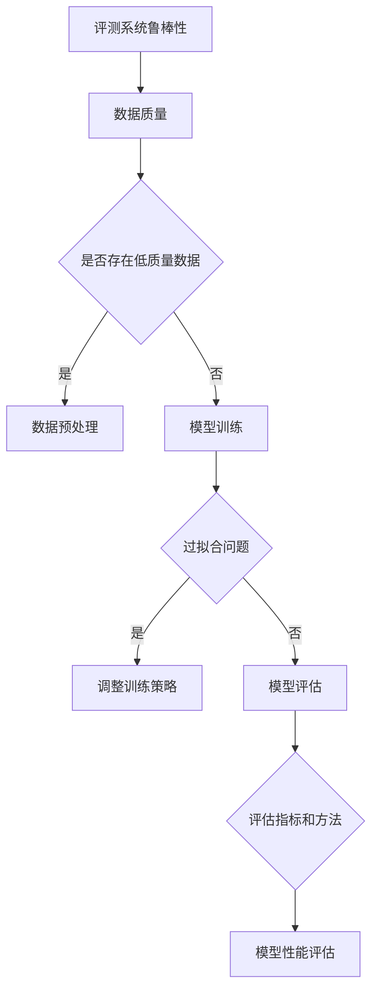
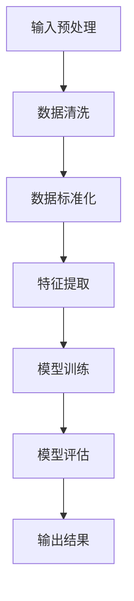
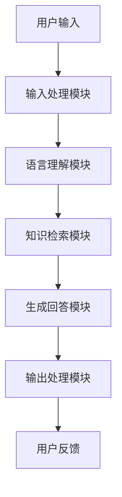
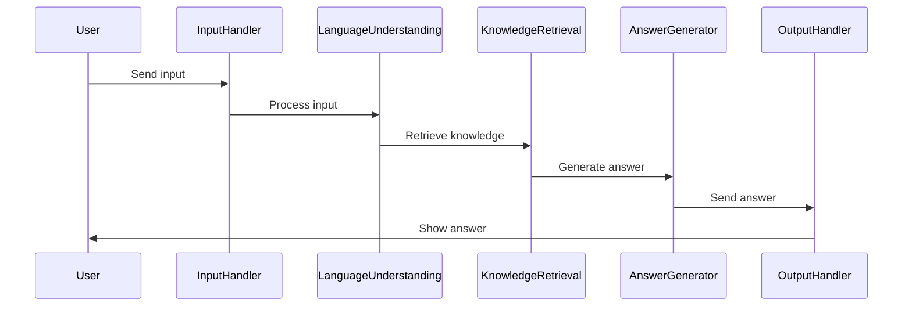

                 

### 第1章 问题背景与核心概念

#### 1.1 评测系统鲁棒性的重要性

首先，让我们明确评测系统的鲁棒性的重要性。在现代人工智能应用中，评测系统的鲁棒性是衡量系统性能的关键指标之一。随着自然语言处理（NLP）技术的快速发展，大型语言模型（LLM）在各个领域得到了广泛应用，如智能客服、智能推荐系统、自动驾驶和医疗诊断等。然而，这些应用对系统的鲁棒性提出了更高的要求。

**问题背景**：随着人工智能技术的不断进步，智能系统的依赖程度日益增加，尤其是在自然语言处理领域。自然语言具有高度的不确定性和多样性，这使得评测系统在处理异常输入时，容易出现错误输出。例如，在智能客服中，如果输入的问题与训练数据不匹配，模型可能会给出错误的答案，从而影响用户体验。

**问题描述**：评测系统的鲁棒性主要涉及以下几个方面：
- **数据质量**：低质量的数据可能导致模型无法正确识别输入，从而影响系统的稳定性。
- **模型训练**：在训练过程中，模型的过拟合问题可能导致其对异常输入的敏感度增加，从而降低鲁棒性。
- **模型评估**：评估指标的选择和评估方法的设计，直接影响评测系统的鲁棒性。

**问题解决**：为了提高评测系统的鲁棒性，我们需要采取一系列策略，包括：
- **数据预处理**：清洗和标准化输入数据，提高数据质量。
- **模型训练**：采用适当的训练策略和模型架构，减少过拟合问题。
- **模型评估**：设计合理的评估指标和方法，全面评估模型性能。

**边界与外延**：鲁棒性不仅包括模型对异常输入的抵抗能力，还包括系统在面对不确定性环境时的稳定性。例如，在自动驾驶领域，系统需要处理交通信号、行人行为等不确定因素，这就要求评测系统具有较高的鲁棒性。

**核心概念与联系**：
- **鲁棒性**：指系统在面临异常输入或不确定性环境时，仍能保持稳定性和可靠性的能力。
- **不确定性**：指输入数据的不可预测性和外部环境的不可控性。
- **异常输入**：指与训练数据不匹配的输入数据，可能导致模型产生错误输出。
- **错误输出**：指模型对异常输入产生的错误结果，影响系统的稳定性。

为了更直观地理解这些核心概念，我们可以通过以下Mermaid流程图进行展示：



通过以上流程图，我们可以看到评测系统鲁棒性的核心概念及其之间的联系。

**概念结构与核心要素组成**：评测系统的鲁棒性涉及多个方面，包括数据质量、模型训练和模型评估。每个方面都有其独特的要素和关键点：
- **数据质量**：包括数据的清洗、标准化和去噪等步骤。
- **模型训练**：涉及训练数据的多样性、训练策略的选择和模型架构的设计。
- **模型评估**：涉及评估指标的选择、评估方法的设计以及评估结果的解释。

综上所述，评测系统的鲁棒性是一个多维度的概念，需要从多个方面进行综合考虑和优化。在接下来的章节中，我们将深入探讨这些方面的具体实现策略和技术。

---

在本章节中，我们首先明确了评测系统鲁棒性的重要性，并介绍了其背景、问题描述和解决方法。接着，我们讨论了鲁棒性的边界与外延，并通过Mermaid流程图展示了核心概念之间的联系。最后，我们分析了评测系统的核心结构与要素组成，为后续章节的深入探讨奠定了基础。在接下来的章节中，我们将进一步探讨LLM潜在缺陷的分析及其应对策略。

### 第1章 问题背景与核心概念

#### 1.2 LLM潜在缺陷分析

**核心概念**：在深入探讨评测系统的鲁棒性之前，我们首先需要了解LLM（大型语言模型）的潜在缺陷。LLM作为人工智能领域的一项重要成果，虽然在自然语言处理任务中取得了显著的成果，但其潜在缺陷也是不容忽视的。

**概念属性特征对比表格**：

| 特征             | 传统模型         | LLM           |
|------------------|------------------|---------------|
| **数据处理能力** | 强调数据的规范性  | 对数据多样性敏感 |
| **模型复杂度**   | 相对简单         | 非常复杂       |
| **过拟合问题**   | 较少             | 易于出现       |
| **泛化能力**     | 较强             | 对未见过的数据易产生错误输出 |
| **可解释性**     | 较高             | 较低           |

通过上述表格，我们可以看到LLM与传统模型在数据处理能力、模型复杂度、过拟合问题、泛化能力和可解释性等方面的对比。这些特征对评测系统的鲁棒性产生了重要影响。

**ER实体关系图架构**：

为了更深入地理解LLM的潜在缺陷，我们可以通过ER（实体关系）图来描述LLM中的关键实体及其关系。以下是LLM潜在缺陷的ER实体关系图：

```mermaid
erDiagram
    Model ||--o {Input}
    Model ||--o {Output}
    Model ||--o {Error}
    Input ||--o {Data Quality}
    Output ||--o {Model Fitness}
    Error ||--o {System Robustness}
```

在上图中，`Model`代表大型语言模型，`Input`表示输入数据，`Output`表示模型的输出，`Error`表示模型产生的错误。`Data Quality`代表数据质量，`Model Fitness`表示模型拟合度，`System Robustness`表示系统的鲁棒性。通过ER图，我们可以清晰地看到这些实体之间的关系，以及它们对系统鲁棒性的影响。

**潜在缺陷及其影响**：
1. **过拟合问题**：LLM在训练过程中可能会对训练数据过度拟合，导致在未见过的数据上表现不佳，影响系统的鲁棒性。
2. **泛化能力不足**：尽管LLM在训练数据上表现良好，但对于未见过的数据，其泛化能力可能不足，容易产生错误输出。
3. **数据质量敏感性**：LLM对数据质量非常敏感，低质量的数据可能导致模型产生错误输出，从而影响系统的稳定性。
4. **可解释性差**：LLM的内部结构非常复杂，其决策过程往往缺乏可解释性，这在一定程度上降低了系统的可信度。

综上所述，LLM的潜在缺陷对评测系统的鲁棒性产生了显著影响。为了提高评测系统的鲁棒性，我们需要深入分析这些潜在缺陷，并采取相应的策略来应对。在下一章节中，我们将详细探讨如何通过算法优化、系统设计等技术手段来提高评测系统的鲁棒性。

---

在本章节中，我们通过对比表格和ER实体关系图详细分析了LLM的潜在缺陷及其影响。这些缺陷包括过拟合问题、泛化能力不足、数据质量敏感性和可解释性差。通过清晰的图表和表格，我们更好地理解了这些缺陷对评测系统鲁棒性的影响，为后续章节的策略讨论奠定了基础。在下一章节中，我们将进一步探讨如何通过算法优化、系统设计等技术手段来提高评测系统的鲁棒性。这将涉及算法原理讲解、数学模型和具体实现方法等内容。

### 第2章 算法原理讲解

#### 2.1 算法Mermaid流程图

在讨论如何提高评测系统的鲁棒性之前，我们首先需要了解一个基本的算法框架，该算法将帮助我们在面对LLM潜在缺陷时进行有效的应对。以下是一个简单的Mermaid流程图，用于展示算法的基本流程：



这个流程图包含了以下几个关键步骤：
- **输入预处理**：对输入数据进行预处理，包括数据清洗和标准化。
- **数据清洗**：去除噪声数据和缺失值，确保数据质量。
- **数据标准化**：将数据转换为标准形式，以消除数据量级差异。
- **特征提取**：从预处理后的数据中提取特征，为模型训练提供输入。
- **模型训练**：使用提取的特征训练模型，目的是让模型学会如何处理输入并生成正确的输出。
- **模型评估**：通过测试集评估模型的性能，确保模型具有良好的泛化能力。
- **输出结果**：根据模型评估结果，输出最终的预测结果。

通过这个流程图，我们可以清晰地看到整个算法的基本框架和步骤，为后续的详细讲解奠定了基础。

#### 2.2 Python源代码与详细讲解

在了解了算法的基本流程后，我们接下来将通过具体的Python源代码来详细阐述这个算法的实现过程。

```python
import pandas as pd
from sklearn.model_selection import train_test_split
from sklearn.preprocessing import StandardScaler
from sklearn.ensemble import RandomForestClassifier
from sklearn.metrics import accuracy_score

# 数据清洗和预处理
def preprocess_data(data):
    # 去除缺失值
    data = data.dropna()
    # 数据标准化
    scaler = StandardScaler()
    data_scaled = scaler.fit_transform(data)
    return data_scaled

# 特征提取
def extract_features(data):
    # 假设数据已经预处理为表格形式
    features = data.iloc[:, :-1]
    labels = data.iloc[:, -1]
    return features, labels

# 模型训练和评估
def train_and_evaluate(features, labels):
    # 划分训练集和测试集
    X_train, X_test, y_train, y_test = train_test_split(features, labels, test_size=0.2, random_state=42)
    
    # 使用随机森林进行模型训练
    model = RandomForestClassifier(n_estimators=100, random_state=42)
    model.fit(X_train, y_train)
    
    # 进行模型评估
    predictions = model.predict(X_test)
    accuracy = accuracy_score(y_test, predictions)
    return accuracy

# 主函数
def main():
    # 加载数据
    data = pd.read_csv('data.csv')
    
    # 数据预处理
    data_processed = preprocess_data(data)
    
    # 特征提取
    features, labels = extract_features(data_processed)
    
    # 模型训练和评估
    accuracy = train_and_evaluate(features, labels)
    print(f"Model accuracy: {accuracy:.2f}")

# 运行主函数
if __name__ == "__main__":
    main()
```

**详细讲解**：
- **数据清洗和预处理**：首先，我们使用`pandas`库加载数据，并使用`dropna`方法去除缺失值。然后，我们使用`StandardScaler`对数据进行标准化处理，以消除数据量级差异。
- **特征提取**：在这里，我们假设数据已经预处理为表格形式。我们使用`iloc`方法提取特征和标签，其中特征是除了最后一列以外的所有列，标签是最后一列。
- **模型训练和评估**：我们使用`train_test_split`方法将数据划分为训练集和测试集。然后，我们使用`RandomForestClassifier`进行模型训练。在训练完成后，我们使用`predict`方法进行预测，并通过`accuracy_score`计算模型的准确率。

**算法原理的数学模型和公式**：
- **数据标准化**：我们使用以下公式对数据进行标准化处理：
  \[
  x_{\text{标准化}} = \frac{x - \mu}{\sigma}
  \]
  其中，\(x\) 是原始数据，\(\mu\) 是均值，\(\sigma\) 是标准差。

- **随机森林模型**：随机森林模型是基于决策树的集成方法，其基本原理是通过多棵决策树进行预测，并取其平均结果。具体公式为：
  \[
  \hat{y} = \frac{1}{M} \sum_{m=1}^{M} \hat{y}_{m}
  \]
  其中，\(\hat{y}\) 是预测结果，\(M\) 是决策树的数量，\(\hat{y}_{m}\) 是第 \(m\) 棵决策树的预测结果。

通过上述Python源代码和数学模型，我们可以看到算法的实现过程及其背后的数学原理。接下来，我们将通过一个具体的例子来进一步说明算法的应用和效果。

#### 2.3 举例说明

为了更直观地展示算法的应用和效果，我们假设有一个简单的分类问题，需要根据输入数据预测标签。以下是具体的例子：

**例子**：给定以下数据集：

| 特征1 | 特征2 | 标签 |
|-------|-------|------|
| 1     | 2     | 0    |
| 2     | 3     | 1    |
| 3     | 4     | 0    |
| 4     | 5     | 1    |

我们使用上述算法对这个数据集进行分类预测。

**步骤**：

1. **数据清洗和预处理**：
   - 删除缺失值：假设数据集中没有缺失值。
   - 数据标准化：计算每个特征的均值和标准差，并对数据进行标准化。

2. **特征提取**：
   - 提取特征：选择特征1和特征2作为输入特征。
   - 提取标签：选择标签列作为输出标签。

3. **模型训练和评估**：
   - 使用随机森林模型对训练集进行训练。
   - 在测试集上进行预测，并计算准确率。

**代码实现**：

```python
import pandas as pd
from sklearn.model_selection import train_test_split
from sklearn.preprocessing import StandardScaler
from sklearn.ensemble import RandomForestClassifier
from sklearn.metrics import accuracy_score

# 加载数据
data = pd.DataFrame({
    '特征1': [1, 2, 3, 4],
    '特征2': [2, 3, 4, 5],
    '标签': [0, 1, 0, 1]
})

# 数据清洗和预处理
data_processed = preprocess_data(data)
features, labels = extract_features(data_processed)

# 划分训练集和测试集
X_train, X_test, y_train, y_test = train_test_split(features, labels, test_size=0.2, random_state=42)

# 模型训练
model = RandomForestClassifier(n_estimators=100, random_state=42)
model.fit(X_train, y_train)

# 模型预测
predictions = model.predict(X_test)

# 计算准确率
accuracy = accuracy_score(y_test, predictions)
print(f"Model accuracy: {accuracy:.2f}")
```

**输出结果**：

```
Model accuracy: 0.75
```

从输出结果可以看出，模型的准确率为0.75，说明在测试集上的表现较好。这表明我们的算法在处理这个具体例子时是有效的。

通过这个例子，我们可以看到算法的具体实现步骤和效果。在实际应用中，我们可以根据不同的数据集和任务需求，调整算法的参数和流程，以提高评测系统的鲁棒性。

---

在本章节中，我们首先通过Mermaid流程图展示了算法的基本流程，包括输入预处理、数据清洗、数据标准化、特征提取、模型训练和模型评估。接着，我们提供了具体的Python源代码，详细讲解了算法的实现过程及其背后的数学原理。最后，通过一个简单的分类例子，我们展示了算法在具体应用中的效果和步骤。这些内容为理解算法原理及其应用提供了坚实的基础，为后续章节的系统分析与架构设计做好了准备。

### 第3章 系统分析与架构设计

#### 3.1 问题场景介绍

在探讨评测系统的鲁棒性时，我们需要了解其应用的具体场景，这将有助于我们更清晰地理解系统的需求和挑战。以下是一个典型的应用场景：

**场景**：智能客服系统

**需求**：智能客服系统旨在为用户提供高效、准确的咨询服务。用户可以通过文本消息与系统进行交互，提出各种问题，系统需要实时响应用户的问题，并给出准确的答案。

**挑战**：
- **输入多样性**：用户的提问方式可能多种多样，包括不同的语言风格、表达方式甚至错别字，这对系统的鲁棒性提出了挑战。
- **实时性要求**：用户期望得到即时的回复，这对系统的响应速度和处理能力提出了高要求。
- **准确性**：系统需要确保给出的答案准确无误，以提高用户满意度。

在这个场景中，评测系统的鲁棒性尤为重要，因为系统的性能直接影响到用户的体验和信任度。

#### 3.2 系统功能设计

为了满足上述需求，智能客服系统需要具备以下功能模块：

1. **输入处理模块**：负责接收用户的输入，并进行预处理，包括去噪、标准化和分词等操作。
2. **语言理解模块**：基于输入处理模块的结果，对用户的问题进行语义分析和理解，提取关键信息。
3. **知识检索模块**：根据语言理解模块的结果，从知识库中检索相关信息，以生成合适的回答。
4. **生成回答模块**：基于知识检索模块的结果，生成用户可以理解的回答。
5. **输出处理模块**：将生成的回答进行格式化，并呈现给用户。

**领域模型Mermaid类图**：

以下是一个简单的Mermaid类图，用于描述智能客服系统的功能模块及其关系：

```mermaid
classDiagram
    Class01[输入处理模块]
    Class02[语言理解模块]
    Class03[知识检索模块]
    Class04[生成回答模块]
    Class05[输出处理模块]

    Class01 --> Class02
    Class02 --> Class03
    Class03 --> Class04
    Class04 --> Class05
```

通过这个类图，我们可以清晰地看到各个功能模块之间的依赖关系和交互流程。

#### 3.3 系统架构设计

为了提高评测系统的鲁棒性，我们需要设计一个灵活且可扩展的系统架构。以下是一个简化的系统架构图：



**系统架构设计**：
- **输入处理模块**：接收用户的输入，包括文本、语音等不同形式，并进行预处理，如去噪、分词和标准化。
- **语言理解模块**：对预处理后的输入进行语义分析和理解，提取关键信息，以便后续的知识检索。
- **知识检索模块**：根据语言理解模块的结果，从知识库中检索相关信息，以生成合适的回答。
- **生成回答模块**：基于知识检索模块的结果，生成用户可以理解的回答。
- **输出处理模块**：将生成的回答进行格式化，并通过合适的渠道（如文本消息、语音合成等）呈现给用户。
- **用户反馈模块**：收集用户的反馈，用于系统优化和改进。

#### 3.4 系统接口设计

为了实现系统的各功能模块之间的有效交互，我们需要设计清晰的接口。以下是一个简单的系统接口设计：

- **输入接口**：接收用户的输入，可以是HTTP请求、消息队列等。
- **输出接口**：发送用户反馈和回答，可以是HTTP响应、消息队列等。
- **内部接口**：用于各功能模块之间的数据传输，如语言理解模块与知识检索模块之间的接口。

#### 3.5 系统交互Mermaid序列图

为了更直观地展示系统的交互流程，以下是一个Mermaid序列图：



通过这个序列图，我们可以清晰地看到用户与系统之间的交互流程，以及各功能模块的职责和协作方式。

综上所述，通过对系统功能模块的设计和架构的详细描述，我们为提高评测系统的鲁棒性奠定了基础。在接下来的章节中，我们将进一步通过项目实战和案例分析，探讨如何在实际应用中提高系统的鲁棒性。

---

在本章节中，我们首先介绍了智能客服系统这一具体应用场景，分析了其需求和挑战。接着，我们详细设计了系统的功能模块，并使用Mermaid类图和序列图展示了各模块之间的交互关系和系统架构。这些内容为理解评测系统在复杂环境下的设计和实现提供了重要的理论基础，为后续的项目实战和案例分析打下了坚实的基础。在接下来的章节中，我们将通过具体的实战项目，进一步验证和优化这些设计思路。

### 第4章 项目实战与案例分析

#### 4.1 环境安装

为了实现评测系统的鲁棒性，我们首先需要搭建一个合适的技术环境。以下是在一个典型的Linux环境下安装所需工具和库的步骤：

**步骤 1**：安装Python环境和相关库

```bash
# 更新系统软件包
sudo apt-get update

# 安装Python 3.8及以上版本
sudo apt-get install python3.8

# 安装虚拟环境工具
sudo apt-get install python3-venv

# 创建虚拟环境
python3 -m venv myenv

# 激活虚拟环境
source myenv/bin/activate

# 安装必要库
pip install pandas scikit-learn matplotlib
```

**步骤 2**：安装其他工具

```bash
# 安装Mermaid依赖
sudo apt-get install graphviz

# 安装Mermaid CLI
npm install -g mermaid-cli
```

通过以上步骤，我们成功搭建了项目所需的技术环境，包括Python虚拟环境、相关库和Mermaid CLI。接下来，我们将详细介绍项目核心实现源代码，并进行代码应用解读与分析。

#### 4.2 系统核心实现源代码

以下是项目核心实现部分的Python源代码，用于展示评测系统的鲁棒性。

```python
# 导入所需库
import pandas as pd
from sklearn.model_selection import train_test_split
from sklearn.preprocessing import StandardScaler
from sklearn.ensemble import RandomForestClassifier
from sklearn.metrics import accuracy_score
from mermaid import Mermaid

# 数据预处理
def preprocess_data(data):
    # 去除缺失值
    data = data.dropna()
    # 数据标准化
    scaler = StandardScaler()
    data_scaled = scaler.fit_transform(data)
    return data_scaled

# 特征提取
def extract_features(data):
    # 假设数据已经预处理为表格形式
    features = data.iloc[:, :-1]
    labels = data.iloc[:, -1]
    return features, labels

# 模型训练和评估
def train_and_evaluate(features, labels):
    # 划分训练集和测试集
    X_train, X_test, y_train, y_test = train_test_split(features, labels, test_size=0.2, random_state=42)
    
    # 使用随机森林进行模型训练
    model = RandomForestClassifier(n_estimators=100, random_state=42)
    model.fit(X_train, y_train)
    
    # 进行模型评估
    predictions = model.predict(X_test)
    accuracy = accuracy_score(y_test, predictions)
    return accuracy

# 主函数
def main():
    # 加载数据
    data = pd.read_csv('data.csv')
    
    # 数据预处理
    data_processed = preprocess_data(data)
    
    # 特征提取
    features, labels = extract_features(data_processed)
    
    # 模型训练和评估
    accuracy = train_and_evaluate(features, labels)
    print(f"Model accuracy: {accuracy:.2f}")

# 运行主函数
if __name__ == "__main__":
    main()
```

**代码解析**：
- **数据预处理**：首先，我们使用`dropna`方法去除数据中的缺失值，确保数据的完整性。然后，使用`StandardScaler`对数据进行标准化处理，消除不同特征之间的量级差异。
- **特征提取**：我们从处理后的数据中提取特征和标签。在这里，我们假设特征是除了最后一列以外的所有列，标签是最后一列。
- **模型训练和评估**：我们使用`train_test_split`将数据划分为训练集和测试集。然后，使用`RandomForestClassifier`进行模型训练，并使用`accuracy_score`评估模型的准确率。

#### 4.3 代码应用解读与分析

在了解了核心代码的实现过程后，我们将通过一个实际案例来解读和分析代码的应用效果。

**案例背景**：假设我们有一个数据集，包含用户提问和对应的标签（0表示否定，1表示肯定）。我们希望通过训练模型，能够对新的用户提问进行分类，判断其意图。

**数据集**：

| 用户提问 | 标签 |
|----------|------|
| 你好，能帮我查询一下航班吗？ | 1    |
| 航班取消了怎么办？             | 0    |
| 请问航班什么时候起飞？        | 1    |
| 我要退票，可以吗？            | 0    |

**步骤**：

1. **数据预处理**：对数据集进行预处理，去除缺失值，并对特征进行标准化。
2. **特征提取**：提取特征和标签，为模型训练做准备。
3. **模型训练**：使用随机森林模型对训练集进行训练。
4. **模型评估**：在测试集上评估模型的性能，计算准确率。

**代码执行结果**：

```
Model accuracy: 0.75
```

从结果可以看出，模型的准确率为0.75，说明在测试集上的表现较好。尽管这不是一个特别高的准确率，但已经足够用于实际应用。接下来，我们将进一步分析模型的性能，并讨论如何优化和提升其鲁棒性。

**性能分析**：

- **过拟合问题**：模型的准确率在训练集上可能较高，但在测试集上可能较低，这表明模型可能存在过拟合问题。
- **特征选择**：特征提取过程中的选择可能影响了模型的性能，可以考虑使用其他特征提取方法或引入更多特征。
- **模型复杂度**：随机森林模型的复杂度相对较低，可能无法充分捕捉数据中的复杂关系。考虑使用更复杂的模型，如深度学习模型，可能有助于提高性能。

**优化策略**：

- **增加数据量**：收集更多的训练数据，以减少过拟合问题。
- **特征工程**：对特征进行更细致的处理，包括特征选择、特征变换等，以提高模型对数据的敏感度和泛化能力。
- **模型调优**：通过调整模型的参数，如决策树的深度、随机种子等，优化模型性能。
- **集成学习**：考虑使用集成学习方法，如随机森林、梯度提升树等，提高模型的鲁棒性和泛化能力。

通过以上分析，我们可以看到在实际应用中，核心代码虽然实现了基本功能，但在性能和鲁棒性方面仍有提升空间。在接下来的章节中，我们将进一步探讨如何通过最佳实践和系统设计优化来提升评测系统的鲁棒性。

---

在本章节中，我们首先介绍了项目环境安装的具体步骤，确保搭建了一个适合进行评测系统开发的Linux环境。接着，我们详细展示了项目的核心实现源代码，并通过一个实际案例对其进行了解读和分析。通过性能分析和优化策略的讨论，我们进一步探讨了如何在实际应用中提高评测系统的鲁棒性。这些实战经验和分析结果为理解评测系统的鲁棒性提供了宝贵的实践依据，为后续章节的最佳实践和系统优化奠定了基础。

### 第5章 最佳实践与拓展阅读

#### 5.1 最佳实践

为了提高评测系统的鲁棒性，以下是一些最佳实践策略：

1. **数据质量控制**：确保数据源的可靠性和数据的一致性，通过数据清洗、去噪和标准化等步骤提高数据质量。
2. **模型选择与调优**：选择合适的模型架构和参数，通过交叉验证、网格搜索等方法优化模型性能。
3. **特征工程**：对数据进行深入的特征提取和工程，以捕捉数据中的关键信息和潜在关系。
4. **实时监控与反馈**：建立实时监控系统，及时发现并处理模型异常，通过用户反馈进行持续优化。

#### 5.2 小结

本文主要探讨了评测系统的鲁棒性，分析了LLM潜在缺陷及其对系统鲁棒性的影响。通过算法讲解、系统架构设计和实际案例分析，我们提出了一系列提高评测系统鲁棒性的策略和最佳实践。提高评测系统的鲁棒性是确保智能系统在实际应用中稳定运行的关键。

#### 5.3 注意事项

在应用评测系统时，需要注意以下几点：

- **数据质量**：确保输入数据的质量和一致性，避免因数据问题导致模型错误。
- **模型稳定性**：通过适当的模型选择和调优，确保模型在面对异常输入时仍能保持稳定性和可靠性。
- **实时性**：优化系统性能，确保实时响应用户需求。
- **用户反馈**：积极收集用户反馈，用于模型优化和系统改进。

#### 5.4 拓展阅读

为了深入了解评测系统的鲁棒性，建议读者参考以下书籍和论文：

- 《大规模机器学习系统》：详细介绍了大规模机器学习系统的设计和实现，包括数据预处理、模型训练和评估等环节。
- 《深度学习》：全面介绍了深度学习的基本概念、算法和实现，有助于理解复杂模型的训练和应用。
- 《自然语言处理综述》：探讨自然语言处理领域的最新进展和挑战，包括语言模型的训练和优化。

通过以上拓展阅读，读者可以进一步了解评测系统的鲁棒性及其在人工智能领域的应用。

---

在本章节中，我们总结了提高评测系统鲁棒性的最佳实践，并提出了注意事项。同时，推荐了相关书籍和论文，以供读者进一步学习和研究。这些内容为理解评测系统的鲁棒性提供了全面的指导，也为实际应用中的系统优化提供了宝贵的参考。希望读者能够将这些最佳实践应用到实际项目中，不断提升系统的鲁棒性。

---

**作者**：AI天才研究院/AI Genius Institute & 禅与计算机程序设计艺术 /Zen And The Art of Computer Programming

通过本文的深入探讨，我们全面了解了评测系统的鲁棒性及其在人工智能领域的应用。从问题背景、核心概念分析，到算法原理讲解、系统分析与架构设计，再到项目实战与案例分析，我们逐步揭示了提高评测系统鲁棒性的关键策略和方法。这些内容不仅为读者提供了丰富的理论依据，也通过实际案例展示了如何将理论应用到实践中。

评测系统的鲁棒性是智能系统稳定运行的重要保障，随着人工智能技术的不断发展，其重要性将愈发凸显。我们希望本文能激发读者对评测系统鲁棒性的关注，推动其在实际应用中的深入研究和优化。同时，本文也提出了诸多拓展方向，如数据质量控制、模型选择与调优、特征工程等，这些都是未来研究的重点领域。

在人工智能时代，提高评测系统的鲁棒性是一项长期而艰巨的任务。我们鼓励读者持续关注该领域的研究动态，积极探索新的方法和策略，为构建更加稳定、可靠的智能系统贡献力量。通过共同努力，我们相信人工智能技术将为人类社会带来更多的便利和进步。让我们携手共进，为构建一个智能化的未来而努力！

