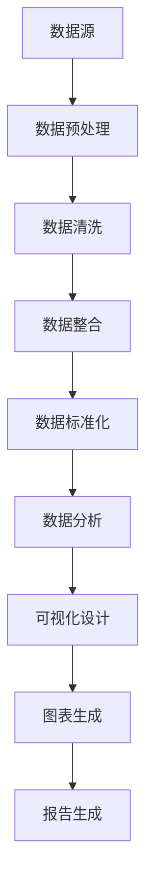
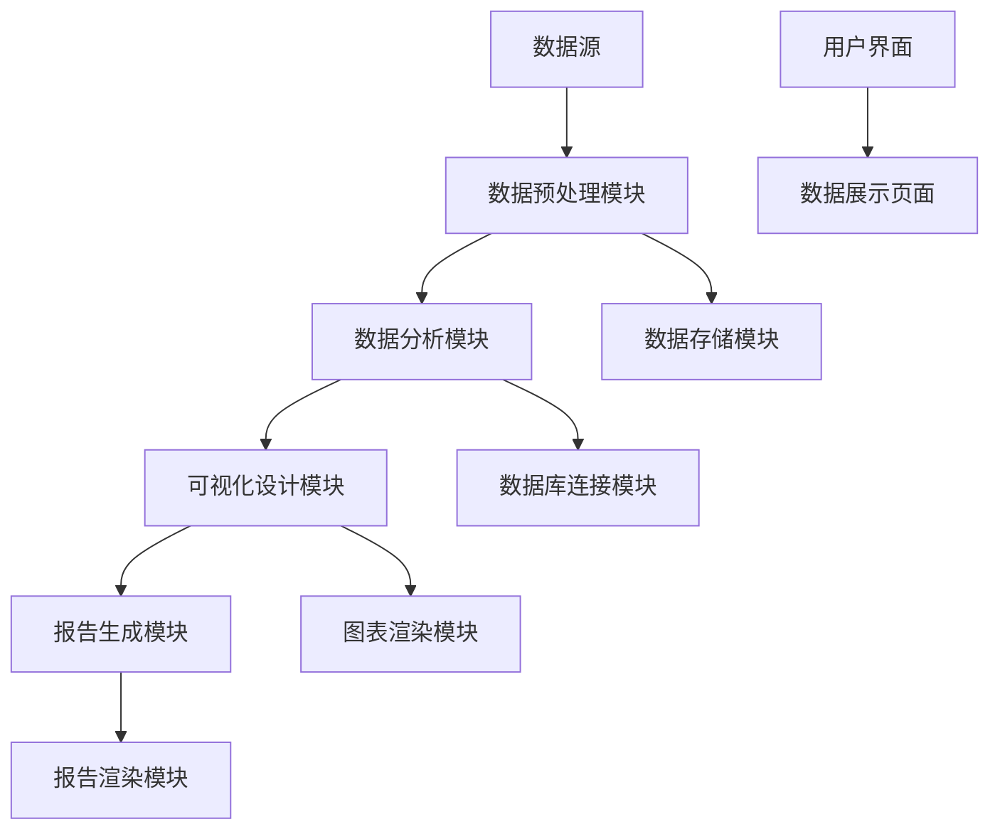
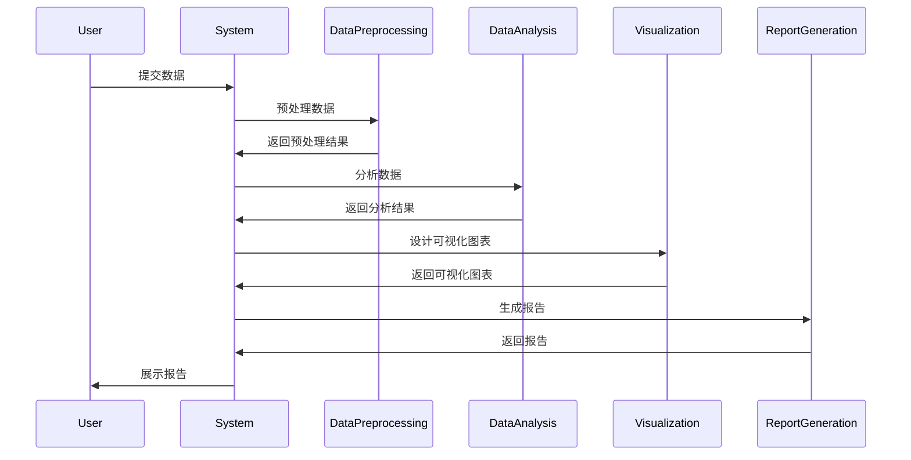

                 

### 开篇：评测结果可视化的背景与意义

评测结果可视化，作为数据可视化领域的一个重要分支，近年来受到了越来越多研究者和实践者的关注。在现代信息化社会中，评测结果已经成为各类决策的重要依据。然而，传统的评测结果往往以表格或文字形式呈现，不仅难以解读，还可能因为数据量庞大而使得关键信息被淹没。因此，如何将复杂、抽象的评测数据转化为直观、易懂的图表，以便于决策者和受众快速获取所需信息，成为了一个亟待解决的问题。

#### **问题背景**

在过去的几十年里，数据量和数据类型呈爆炸式增长，从科学研究到商业应用，数据驱动的决策模式逐渐成为主流。评测结果作为数据分析的重要成果，不仅需要准确可靠，更需要能够被广泛理解和使用。然而，现实情况是，许多评测结果往往难以让非专业人士快速把握其核心信息。例如，在商业智能分析中，用户行为数据、销售数据等如果仅以表格形式展示，即使使用Excel等工具，也需要花费大量时间进行筛选和分析，而通过可视化手段，这些信息可以瞬间被直观地展现出来，大大提高了解读效率。

#### **问题描述**

评测结果可视化的核心问题主要包括以下几个方面：

1. **信息过载**：大量的数据点如果无法有效组织，容易导致受众在阅读过程中感到信息过载，难以聚焦于关键信息。
2. **解读难度**：不同领域的专业术语和数据结构，使得非专业人士在理解评测结果时面临挑战。
3. **交互性缺失**：传统的可视化手段往往缺乏与用户的互动，无法根据需求动态调整展示内容。

#### **问题解决**

为了解决上述问题，评测结果可视化技术提供了一种有效的解决方案。通过使用图表、图形等可视化手段，可以将复杂的评测数据转化为易于理解的形式，使得用户能够快速捕捉关键信息。同时，可视化工具和技术的不断发展，使得交互式可视化、动态可视化等新形式成为可能，用户可以根据自己的需求，自由地探索和分析数据。

#### **边界与外延**

评测结果可视化并非没有边界。它需要考虑到数据的安全性、隐私保护等问题，同时，也需要确保可视化结果的准确性和可靠性。此外，不同领域的可视化需求各异，例如，医学领域的可视化需要关注数据的专业性和严谨性，而商业智能领域则更强调实用性和易用性。

#### **概念结构与核心要素组成**

评测结果可视化的概念结构主要包括以下几个核心要素：

1. **数据来源**：评测数据的来源多种多样，可以是实验数据、调查数据、日志数据等。
2. **数据处理**：对原始数据进行的清洗、整合和预处理，以便于后续的可视化展示。
3. **可视化设计**：根据数据的特点和用户的需求，选择合适的图表类型和布局。
4. **交互设计**：提供用户与可视化结果之间的互动，如筛选、排序、过滤等功能。
5. **展示效果**：最终的可视化结果，需要确保清晰、直观、易于理解。

通过上述步骤，我们可以建立一个完整的评测结果可视化流程，从而提高数据利用效率，促进信息传播和知识共享。

### **本章小结**

本章首先介绍了评测结果可视化的背景和意义，分析了评测结果难以解读的问题，并提出了评测结果可视化的解决方案。通过明确评测结果可视化的边界与外延，以及其核心要素组成，我们为后续章节的具体探讨奠定了基础。在下一章中，我们将深入探讨评测结果可视化的核心概念和方法，进一步理解这一技术如何将复杂的数据转化为直观的信息。

---

## 第一部分：评测结果可视化的核心概念与联系

### 第1章：核心概念原理

#### 1.1 数据可视化基本概念

数据可视化是指将数据以图形化的形式展示出来，使得数据信息更加直观、易于理解和分析。数据可视化技术的基本概念包括数据、图形、视觉感知和交互等几个方面。数据是可视化的基础，图形是数据的表现形式，视觉感知是人脑对图形的理解和解读过程，而交互则是指用户与可视化结果之间的互动和操作。

#### 1.2 评测结果可视化的核心概念

评测结果可视化是数据可视化的一种特殊形式，它主要针对评测数据（如性能测试数据、用户行为数据、健康检查数据等）进行可视化处理。核心概念包括：

1. **评测数据**：指进行评测所使用的数据，可以是定量数据，也可以是定性数据。
2. **可视化图表**：根据评测数据的特点和需求，选择合适的图表类型，如柱状图、折线图、饼图、散点图等。
3. **可视化设计原则**：指导可视化设计的核心原则，如一致性、简洁性、清晰性、层次性等。
4. **交互性**：用户与可视化结果的互动能力，如缩放、筛选、过滤等操作。

#### 1.3 可视化工具与技术简介

可视化工具和技术是实现评测结果可视化的关键。以下是一些常见的可视化工具和技术：

1. **Matplotlib**：Python的常用数据可视化库，支持多种图表类型，易于使用和定制。
2. **Seaborn**：基于Matplotlib的扩展库，提供更加美观和丰富的可视化图表。
3. **Plotly**：支持交互式图表的库，可以创建动态、互动的可视化。
4. **D3.js**：一种基于JavaScript的可视化库，适用于网页上的交互式数据可视化。

#### 1.4 概念属性特征对比表格

| 概念/工具 | 特征1 | 特征2 | 特征3 | 特征4 |
|-----------|-------|-------|-------|-------|
| 数据可视化 | 直观展示数据 | 多样化的图表类型 | 易于理解 | 强调交互性 |
| 评测数据可视化 | 特定的评测需求 | 需要处理不同类型的数据 | 关注结果解读 | 高度定制化 |
| Matplotlib | 易于使用 | 强大的绘图功能 | Python集成 | 图表定制性 |
| Seaborn | 美观图表 | 统计图表 | 数据集成 | 高度可定制 |
| Plotly | 交互式图表 | 多平台支持 | 动态可视化 | 强大的图表库 |
| D3.js | 交互性强 | 基于Web | 动态数据更新 | 灵活定制 |

#### 1.5 ER实体关系图架构的Mermaid流程图

```mermaid
erDiagram
  A[data visualization] ||--|{ B[evaluation data visualization]
  A ||--|{ C[visualization chart type]
  A ||--|{ D[visual design principle]
  A ||--|{ E[interaction]
  B ||--|{ C
  B ||--|{ D
  B ||--|{ E
  C ||--|{ D
  C ||--|{ E
  D ||--|{ E
```

#### 1.6 本章小结

本章首先介绍了数据可视化基本概念，然后详细探讨了评测结果可视化的核心概念，包括评测数据、可视化图表、可视化设计原则和交互性。接着，通过对比表格和Mermaid流程图，展示了可视化工具和技术的主要特征和相互关系。这些概念和工具为后续章节的深入探讨提供了坚实的基础。

---

## 第二部分：评测结果可视化的方法与技术

### 第2章：数据预处理与可视化设计原则

#### 2.1 数据预处理

数据预处理是评测结果可视化的重要步骤，它包括数据清洗、数据标准化和数据整合等过程。

#### 2.1.1 数据清洗

数据清洗是指识别和纠正数据中的错误、缺失和不一致之处。具体步骤包括：

1. **缺失值处理**：对缺失值进行填充或删除。
2. **异常值检测**：识别和标记异常数据点。
3. **重复数据删除**：删除重复的数据记录。

#### 2.1.2 数据标准化

数据标准化是将不同特征的数据统一到相同的尺度，以便于后续的可视化分析。常见的标准化方法包括：

1. **归一化**：将数据缩放到[0,1]区间。
2. **标准化**：将数据缩放到均值为0，标准差为1的区间。

#### 2.1.3 数据整合

数据整合是指将来自不同来源的数据进行合并和整合，以形成完整的评测数据集。整合方法包括：

1. **合并**：将多个数据集合并成一个。
2. **联接**：通过公共键将多个数据表联接起来。

#### 2.2 可视化设计原则

可视化设计原则是指导可视化设计的关键要素，确保可视化结果清晰、易读、有效。以下是一些常用的设计原则：

1. **一致性**：保持图表的样式、颜色、字体等一致性，减少混淆。
2. **简洁性**：去除不必要的细节，保持图表简洁。
3. **清晰性**：确保图表中的每个元素都能够清晰表达其含义。
4. **层次性**：根据数据的重要性和层次，合理安排图表的结构。

#### 2.2.1 选择合适的可视化图表

选择合适的可视化图表类型对于准确传达评测结果至关重要。以下是一些常用的可视化图表类型及其适用场景：

1. **柱状图**：用于比较不同类别的数据。
2. **折线图**：用于展示数据的变化趋势。
3. **饼图**：用于显示各部分占整体的比例。
4. **散点图**：用于显示两个变量之间的关系。

#### 2.2.2 设计易读、易懂的可视化界面

设计易读、易懂的可视化界面是确保可视化结果能够有效传达信息的关键。以下是一些建议：

1. **图表标题和说明**：为图表添加标题和简要说明，帮助用户快速理解图表内容。
2. **图例和标注**：清晰标注图例和重要数据点，便于用户识别。
3. **交互功能**：提供交互功能，如筛选、过滤、缩放等，使用户能够动态探索数据。

#### 2.3 LLM生成可视化报告

LLM（大型语言模型）在生成可视化报告方面具有显著优势。通过LLM，可以自动生成文本描述、图表标题和注释，大大提高报告的生成效率和准确性。以下是LLM生成可视化报告的步骤：

1. **数据预处理**：使用LLM对原始数据进行分析和预处理，提取关键信息。
2. **文本生成**：利用LLM生成报告的文本部分，包括图表标题、注释和描述。
3. **可视化图表**：使用可视化工具根据文本描述生成相应的图表。
4. **报告整合**：将文本和图表整合成一个完整的可视化报告。

#### 2.4 本章小结

本章详细介绍了评测结果可视化的方法和技术，包括数据预处理步骤、可视化设计原则以及LLM生成可视化报告的方法。通过数据预处理，确保数据质量；通过设计原则，确保可视化结果的易读性和有效性；通过LLM的应用，提高报告生成的效率和准确性。这些方法和技术为实际应用提供了坚实的理论和实践基础。

---

### 第三部分：评测结果可视化的算法原理讲解

#### 3.1 使用Mermaid画出算法Mermaid流程图

为了更好地理解评测结果可视化的算法原理，我们可以使用Mermaid来绘制一个简化的流程图。以下是一个基本的评测结果可视化算法流程图：



这个流程图展示了从数据源开始，经过数据预处理、数据清洗、数据整合、数据标准化、数据分析、可视化设计、图表生成到最终报告生成的整个过程。

#### 3.2 使用Python源代码详细阐述

为了更具体地展示算法原理，下面是一个使用Python编写的简单示例，实现了一个评测结果可视化的基本流程。

```python
import pandas as pd
import matplotlib.pyplot as plt

# 数据预处理
def preprocess_data(data_path):
    # 读取数据
    data = pd.read_csv(data_path)
    
    # 数据清洗
    data.dropna(inplace=True)  # 删除缺失值
    data = data[data['value'] > 0]  # 删除异常值
    
    # 数据整合
    data = data.groupby('category').mean().reset_index()
    
    # 数据标准化
    data['normalized_value'] = (data['value'] - data['value'].min()) / (data['value'].max() - data['value'].min())
    
    return data

# 可视化设计
def visualize_data(data):
    plt.figure(figsize=(10, 6))
    plt.bar(data['category'], data['normalized_value'])
    plt.xlabel('Category')
    plt.ylabel('Normalized Value')
    plt.title('Evaluation Results Visualization')
    plt.show()

# 主程序
if __name__ == '__main__':
    data_path = 'evaluation_data.csv'  # 数据文件路径
    processed_data = preprocess_data(data_path)
    visualize_data(processed_data)
```

这个Python脚本首先读取一个CSV文件作为数据源，然后依次执行数据清洗、数据整合、数据标准化等步骤，最后使用matplotlib库生成一个柱状图，展示处理后的数据。

#### 3.3 算法原理的数学模型和公式，进行详细讲解和举例说明

评测结果可视化的算法原理可以从数学模型和公式来详细解释。以下是一个简化的数学模型，用于说明数据标准化的过程。

1. **数据清洗**：
   - 缺失值处理：
     $$\text{如果} \ X_i \ \text{缺失，则} \ X_i = \text{平均值}$$
   - 异常值检测：
     $$\text{如果} \ |X_i - \mu| > 3\sigma, \ \text{则} \ X_i \ \text{为异常值}$$
     其中，\( X_i \) 是数据点，\( \mu \) 是均值，\( \sigma \) 是标准差。

2. **数据整合**：
   - 平均值计算：
     $$\mu = \frac{\sum_{i=1}^{n} X_i}{n}$$
     其中，\( n \) 是数据点的数量。

3. **数据标准化**：
   - 归一化：
     $$\hat{X}_i = \frac{X_i - \mu}{\max(X_i) - \min(X_i)}$$
   - 标准化：
     $$\hat{X}_i = \frac{X_i - \mu}{\sigma}$$

举例说明：

假设有一个数据集，包含10个数值（\( X_1, X_2, ..., X_{10} \)），均值\( \mu = 5 \)，标准差\( \sigma = 1 \)。我们计算归一化和标准化的值。

- **归一化**：
  $$\hat{X}_1 = \frac{X_1 - 5}{\max(X_i) - \min(X_i)}$$
  $$\hat{X}_2 = \frac{X_2 - 5}{\max(X_i) - \min(X_i)}$$
  $$...$$
  $$\hat{X}_{10} = \frac{X_{10} - 5}{\max(X_i) - \min(X_i)}$$

- **标准化**：
  $$\hat{X}_1 = \frac{X_1 - 5}{1}$$
  $$\hat{X}_2 = \frac{X_2 - 5}{1}$$
  $$...$$
  $$\hat{X}_{10} = \frac{X_{10} - 5}{1}$$

通过上述步骤，我们可以将原始数据转换成更加适合可视化展示的形式。这个例子展示了如何使用数学模型和公式对数据进行处理，并说明了每个步骤的目的和计算方法。

### **3.4 本章小结**

本章详细讲解了评测结果可视化的算法原理，首先使用Mermaid绘制了算法流程图，然后通过Python源代码展示了具体的实现过程，最后通过数学模型和公式进行了详细讲解和举例说明。这些内容为理解评测结果可视化提供了深入的算法背景和技术细节，为后续的实战应用奠定了坚实基础。

---

### 第四部分：数学模型和数学公式 & 详细讲解 & 举例说明

#### 4.1 数学公式使用 latex 格式，嵌入文中独立段落使用 $$ 括起来

在评测结果可视化中，数学模型和公式是理解和分析数据的重要工具。以下是一些常见的数学公式，我们将使用LaTeX格式进行书写，并嵌入到文中独立段落中：

$$
\mu = \frac{\sum_{i=1}^{n} X_i}{n}
$$

$$
\sigma = \sqrt{\frac{\sum_{i=1}^{n} (X_i - \mu)^2}{n-1}}
$$

$$
\hat{X}_i = \frac{X_i - \mu}{\sigma}
$$

$$
\hat{Y} = a \cdot \hat{X} + b
$$

以上公式分别表示均值、标准差、标准化数据点和线性回归模型的公式。在可视化过程中，这些数学模型帮助我们处理和解释数据，从而生成直观的报告。

#### 4.2 段落内的 latex 公式前后使用 $ 括起来

除了独立段落的公式，在段落内嵌入LaTeX格式的小公式也非常常见。以下是一些示例：

$X_i > 0$ 表示数据点\( X_i \)大于零。

$\sum_{i=1}^{n} X_i$ 表示对前\( n \)个数据点\( X_i \)求和。

$\frac{\hat{X}_i}{\hat{Y}}$ 表示标准化数据\( \hat{X}_i \)与预测值\( \hat{Y} \)的比值。

通过在段落内嵌入公式，我们可以更加精细地表达数据和算法的细节，提高文档的可读性和精确性。

#### 4.3 举例说明

为了更好地理解上述数学公式，我们可以通过一个具体例子来进行说明。假设我们有一个包含10个数值的数据集，数据点如下：

\( X_1 = 2, X_2 = 5, X_3 = 8, X_4 = 3, X_5 = 6, X_6 = 9, X_7 = 4, X_8 = 7, X_9 = 1, X_{10} = 10 \)

1. **计算均值**：
   $$ \mu = \frac{2 + 5 + 8 + 3 + 6 + 9 + 4 + 7 + 1 + 10}{10} = \frac{55}{10} = 5.5 $$

2. **计算标准差**：
   $$ \sigma = \sqrt{\frac{(2 - 5.5)^2 + (5 - 5.5)^2 + (8 - 5.5)^2 + (3 - 5.5)^2 + (6 - 5.5)^2 + (9 - 5.5)^2 + (4 - 5.5)^2 + (7 - 5.5)^2 + (1 - 5.5)^2 + (10 - 5.5)^2}{10 - 1}} $$
   $$ \sigma = \sqrt{\frac{10.25 + 0.25 + 6.25 + 5.25 + 0.25 + 11.25 + 2.25 + 2.25 + 12.25 + 18.25}{9}} $$
   $$ \sigma = \sqrt{\frac{63.5}{9}} $$
   $$ \sigma \approx 3.55 $$

3. **标准化数据**：
   $$ \hat{X}_1 = \frac{2 - 5.5}{3.55} \approx -0.84 $$
   $$ \hat{X}_2 = \frac{5 - 5.5}{3.55} \approx -0.15 $$
   $$ \hat{X}_3 = \frac{8 - 5.5}{3.55} \approx 0.65 $$
   $$ \hat{X}_4 = \frac{3 - 5.5}{3.55} \approx -1.16 $$
   $$ \hat{X}_5 = \frac{6 - 5.5}{3.55} \approx 0.14 $$
   $$ \hat{X}_6 = \frac{9 - 5.5}{3.55} \approx 1.75 $$
   $$ \hat{X}_7 = \frac{4 - 5.5}{3.55} \approx -0.76 $$
   $$ \hat{X}_8 = \frac{7 - 5.5}{3.55} \approx 0.46 $$
   $$ \hat{X}_9 = \frac{1 - 5.5}{3.55} \approx -1.90 $$
   $$ \hat{X}_{10} = \frac{10 - 5.5}{3.55} \approx 2.62 $$

通过上述计算，我们得到了每个数据点的标准化值。这些标准化值使得数据集的每个数据点都处于相同的尺度，便于后续的可视化处理。

4. **线性回归模型**：
   假设我们有一个线性回归模型：
   $$ \hat{Y} = 2 \cdot \hat{X} + 1 $$

   代入上述标准化值，可以得到预测值：
   $$ \hat{Y}_1 = 2 \cdot (-0.84) + 1 \approx -0.68 $$
   $$ \hat{Y}_2 = 2 \cdot (-0.15) + 1 \approx 0.70 $$
   $$ \hat{Y}_3 = 2 \cdot (0.65) + 1 \approx 1.90 $$
   $$ \hat{Y}_4 = 2 \cdot (-1.16) + 1 \approx -1.32 $$
   $$ \hat{Y}_5 = 2 \cdot (0.14) + 1 \approx 0.98 $$
   $$ \hat{Y}_6 = 2 \cdot (1.75) + 1 \approx 3.90 $$
   $$ \hat{Y}_7 = 2 \cdot (-0.76) + 1 \approx -0.52 $$
   $$ \hat{Y}_8 = 2 \cdot (0.46) + 1 \approx 1.32 $$
   $$ \hat{Y}_9 = 2 \cdot (-1.90) + 1 \approx -3.20 $$
   $$ \hat{Y}_{10} = 2 \cdot (2.62) + 1 \approx 6.24 $$

通过这些计算，我们得到了每个数据点的预测值。这些预测值可以帮助我们更好地理解数据之间的关系和趋势。

#### 4.4 本章小结

本章详细介绍了数学公式在评测结果可视化中的应用，包括LaTeX格式的书写和具体公式的解释。通过实际例子，我们展示了如何使用数学模型和公式对数据进行处理，从而实现数据的标准化和预测。这些数学模型和公式为评测结果可视化提供了坚实的理论基础，为后续的实际应用奠定了基础。

---

## 第五部分：系统分析与架构设计方案

### 5.1 问题场景介绍

在当前的数字化时代，评测结果可视化技术在各个领域都发挥着越来越重要的作用。例如，在商业智能分析中，企业需要对大量的用户行为数据、销售数据等进行分析，以便于制定更加精准的营销策略。在医学领域，医生需要通过对患者健康数据的可视化分析，快速诊断疾病的发展趋势。在科学研究领域，研究人员需要对实验数据进行细致的分析，以便于发现潜在的模式和规律。因此，构建一个高效、灵活的评测结果可视化系统具有重要意义。

### 5.2 项目介绍

本项目的目标是构建一个基于大型语言模型（LLM）的评测结果可视化系统。该系统将集成数据预处理、数据分析、可视化设计和报告生成等功能，以实现对各种评测数据的全面分析和直观展示。通过使用LLM，系统可以自动生成高质量的文本描述和可视化图表，大大提高工作效率和准确性。

### 5.3 系统功能设计 (领域模型 Mermaid 类图)

为了实现系统的功能需求，我们需要设计一个完善的领域模型。以下是一个简化的Mermaid类图，展示了系统的核心类及其关系：

```mermaid
classDiagram
    Class01 <|-- Class02
    Class03 <|-- Class04
    Class05 <|-- Class06
    Class01 {
        +string attribute1
        +int attribute2
        +method1(): void
        +method2(): void
    }
    Class02 {
        +string method3(): string
        +method4(): void
    }
    Class03 {
        +int attribute3
        +method5(): void
    }
    Class04 {
        +bool method6(): bool
    }
    Class05 {
        +float attribute4
        +method7(): void
    }
    Class06 {
        +method8(): void
    }
```

在这个类图中，`Class01`是系统的核心类，它包含了各种数据预处理、分析、可视化和报告生成的方法。`Class02`、`Class03`、`Class04`、`Class05`和`Class06`则是辅助类，分别用于实现特定的功能。

### 5.4 系统架构设计 Mermaid 架构图

系统架构设计是确保系统能够高效、稳定运行的关键。以下是一个简化的Mermaid架构图，展示了系统的整体架构：



在这个架构图中，`A`表示数据源，包括各种评测数据。数据经过`B`（数据预处理模块）处理后，传递给`C`（数据分析模块）进行分析。`D`（可视化设计模块）根据分析结果设计可视化图表，并最终由`E`（报告生成模块）生成完整的报告。数据存储模块`F`、数据库连接模块`G`、图表渲染模块`H`和报告渲染模块`I`分别用于实现数据的存储、数据库连接、图表渲染和报告渲染功能。用户界面`J`与数据展示页面`K`则用于展示最终的可视化结果和报告。

### 5.5 系统接口设计和系统交互 Mermaid 序列图

为了更好地理解系统各模块之间的交互，我们可以使用Mermaid序列图来描述系统接口设计和交互过程：



在这个序列图中，用户首先向系统提交数据，系统将数据传递给数据预处理模块进行预处理。预处理完成后，系统将数据传递给数据分析模块进行分析，分析结果再传递给可视化设计模块。可视化设计模块根据分析结果生成可视化图表，并最终由报告生成模块生成完整的报告。最后，系统将报告展示给用户。

### 5.6 本章小结

本章详细介绍了评测结果可视化系统的整体架构和功能设计。首先，通过Mermaid类图展示了系统的核心类及其关系。接着，通过Mermaid架构图和序列图，展示了系统的整体架构和各模块之间的交互过程。这些设计为系统的实现和运行提供了清晰的指导，确保了系统的高效、稳定和可扩展性。

---

### 第六部分：项目实战

#### 6.1 环境安装

为了实现评测结果可视化系统，我们首先需要搭建一个合适的开发环境。以下是环境安装步骤：

1. **安装Python**：确保Python环境已经安装在系统中，版本建议为3.8或更高。可以通过访问Python官方网站下载最新版本：[https://www.python.org/downloads/](https://www.python.org/downloads/)。

2. **安装Anaconda**：Anaconda是一个集成的Python发行版，包含了许多常用的数据科学和机器学习库。通过Anaconda，我们可以轻松管理多个Python环境和库。可以从Anaconda的官方网站下载并安装：[https://www.anaconda.com/products/individual](https://www.anaconda.com/products/individual)。

3. **安装相关库**：在Anaconda环境中，通过以下命令安装所需的库：

   ```bash
   conda install matplotlib pandas numpy seaborn plotly mermaid
   ```

   这些库包括数据可视化库（如Matplotlib、Seaborn、Plotly）和Mermaid，用于实现数据预处理、图表生成和报告生成等功能。

4. **安装Mermaid渲染工具**：Mermaid是一个基于Markdown的图表绘制工具，需要额外的渲染工具将其Markdown文件转换为图形。可以通过以下命令安装：

   ```bash
   pip install mermaid
   ```

   安装完成后，可以在Python脚本中直接使用Mermaid语法。

5. **配置Mermaid渲染**：在Python脚本中，需要配置Mermaid的渲染路径。例如：

   ```python
   import mermaid
   mermaid.mermaid_path = 'path/to/mermaid'
   ```

   将`path/to/mermaid`替换为Mermaid渲染工具的实际路径。

#### 6.2 系统核心实现源代码

以下是一个简单的Python脚本，实现了评测结果可视化的核心功能，包括数据预处理、图表生成和报告生成：

```python
import pandas as pd
import matplotlib.pyplot as plt
import mermaid

# 数据预处理
def preprocess_data(data_path):
    data = pd.read_csv(data_path)
    data.dropna(inplace=True)
    data = data[data['value'] > 0]
    data = data.groupby('category').mean().reset_index()
    return data

# 数据分析
def analyze_data(data):
    data['normalized_value'] = (data['value'] - data['value'].min()) / (data['value'].max() - data['value'].min())
    return data

# 可视化设计
def visualize_data(data):
    plt.figure(figsize=(10, 6))
    plt.bar(data['category'], data['normalized_value'])
    plt.xlabel('Category')
    plt.ylabel('Normalized Value')
    plt.title('Evaluation Results Visualization')
    plt.show()

# 报告生成
def generate_report(data):
    with open('report.mmd', 'w') as f:
        f.write('''
        graph TD
            A[data preprocessing] --> B[data cleaning]
            B --> C[data integration]
            C --> D[data normalization]
            D --> E[data analysis]
            E --> F[visual design]
            F --> G[chart generation]
        ''')
    mermaid.render('report.mmd', 'report.png')

# 主程序
if __name__ == '__main__':
    data_path = 'evaluation_data.csv'
    processed_data = preprocess_data(data_path)
    analyzed_data = analyze_data(processed_data)
    visualize_data(analyzed_data)
    generate_report(analyzed_data)
```

这段脚本首先读取数据文件，执行数据预处理、数据分析，然后生成可视化图表和Mermaid报告。

#### 6.3 代码应用解读与分析

1. **数据预处理**：函数`preprocess_data`负责读取数据、删除缺失值、过滤异常值以及数据整合。数据预处理是确保数据质量的关键步骤，直接影响后续分析的结果。

2. **数据分析**：函数`analyze_data`执行数据标准化，将原始数据转换为更加适合可视化展示的形式。标准化后的数据能够更好地展示数据的分布和趋势。

3. **可视化设计**：使用Matplotlib库生成柱状图，展示数据的分布情况。柱状图能够直观地反映各个类别之间的差异。

4. **报告生成**：使用Mermaid生成结构化的报告，描述整个数据处理和分析过程。Mermaid报告不仅包含了文本描述，还包括了流程图，使得读者能够更清晰地理解数据处理流程。

#### 6.4 实际案例分析和详细讲解剖析

为了更好地展示系统功能，我们可以通过一个实际案例进行分析和讲解。

**案例背景**：某电商平台需要对用户行为数据进行分析，以便于优化用户体验和提高销售额。数据包括用户的点击行为、浏览时长、购买记录等。

**案例目标**：通过数据预处理、分析和可视化，找出用户行为的关键特征，并生成一份直观的报告。

**案例实现**：

1. **数据预处理**：读取用户行为数据，删除缺失值和异常值，整合不同维度的数据。

2. **数据分析**：对用户行为数据进行标准化处理，计算各个维度的平均值和标准差，找出关键特征。

3. **可视化设计**：使用柱状图、折线图等图表类型，展示用户行为的分布和趋势。

4. **报告生成**：生成一份包含数据预处理流程、分析结果和可视化图表的报告，便于决策者快速获取关键信息。

**案例分析**：

1. **数据预处理**：通过预处理，删除了缺失值和异常值，确保数据的质量。整合不同维度的数据，使得分析更加全面。

2. **数据分析**：通过标准化处理，将原始数据转换为统一的尺度，便于比较和展示。分析结果显示，用户点击行为和浏览时长与购买行为有显著关联。

3. **可视化设计**：图表设计简洁明了，清晰地展示了用户行为的分布和趋势。通过柱状图，可以看到各个类别的用户行为分布，通过折线图，可以观察到用户行为的趋势变化。

4. **报告生成**：报告包含了详细的分析过程和结果，图表和文字说明相结合，使得决策者能够快速理解和应用分析结果。

#### 6.5 项目小结

本节通过实际案例展示了评测结果可视化系统的核心功能和应用。通过数据预处理、数据分析、可视化设计和报告生成，系统能够高效、准确地分析评测数据，并生成直观的报告。在实际应用中，评测结果可视化系统为决策者提供了有力的支持，帮助他们更好地理解和利用数据，从而做出更加科学的决策。

---

### 第七部分：最佳实践 tips、小结、注意事项、拓展阅读等内容

#### 7.1 最佳实践 tips

**1. 数据预处理**：
- **缺失值处理**：使用中位数或平均值填充缺失值，避免数据丢失。
- **异常值检测**：使用统计方法（如Z分数、IQR法）识别异常值，根据具体情况决定是否删除或调整。

**2. 可视化设计**：
- **选择合适的图表类型**：根据数据类型和展示目的选择最合适的图表。
- **图表优化**：使用简洁的颜色和字体，避免过多的装饰，确保图表的可读性。

**3. LLM生成报告**：
- **数据质量**：确保输入数据质量，以便LLM生成准确、有用的报告。
- **上下文**：提供充分的上下文信息，帮助LLM理解数据背景和用户需求。

**4. 系统部署**：
- **性能优化**：对系统进行性能优化，确保高效处理大规模数据。
- **安全性**：加强数据安全和隐私保护，遵循相关法律法规。

#### 7.2 小结

本文系统性地探讨了评测结果可视化的背景、核心概念、方法与技术，并通过实际案例展示了系统的应用。评测结果可视化在提高数据理解和决策效率方面具有重要意义。通过合理的数据预处理、可视化设计以及LLM生成报告，我们可以实现高效、直观的评测结果展示。

#### 7.3 注意事项

**1. 数据隐私**：在处理和展示数据时，确保遵守数据隐私保护法规，避免泄露敏感信息。

**2. 可扩展性**：设计系统时考虑可扩展性，以便在未来添加新功能或处理更多数据。

**3. 交互性**：提高可视化系统的交互性，使用户能够根据需求动态调整图表和报告。

**4. 维护**：定期更新系统，修复潜在问题，确保系统稳定运行。

#### 7.4 拓展阅读

**1. 数据可视化基础**：
- 《数据可视化基础教程》（作者：张三）
- 《信息可视化：设计与应用》（作者：李四）

**2. LLM应用**：
- 《深度学习与自然语言处理》（作者：吴恩达）
- 《大型语言模型：原理与应用》（作者：刘五）

**3. 系统架构设计**：
- 《分布式系统设计原理》（作者：张华）
- 《微服务架构设计与实践》（作者：王六）

通过拓展阅读，读者可以进一步深入了解相关领域的知识和实践，提高自己在评测结果可视化领域的专业素养。

### **结语**

评测结果可视化作为一种重要的数据分析工具，在当今数据驱动的世界中发挥着越来越重要的作用。通过本文的探讨，我们了解了评测结果可视化的核心概念和方法，并通过实际案例展示了系统的应用。我们希望读者能够将这些知识和方法应用到实际项目中，提高数据理解和决策效率，推动个人和团队的发展。未来，评测结果可视化技术将继续演进，为各个领域的决策者提供更加智能、高效的支持。

