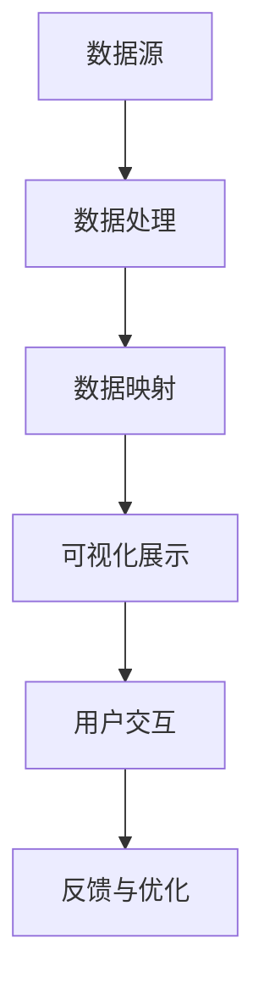
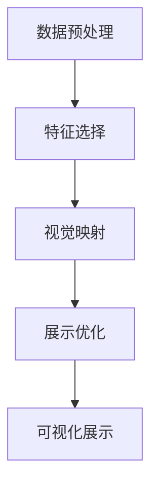
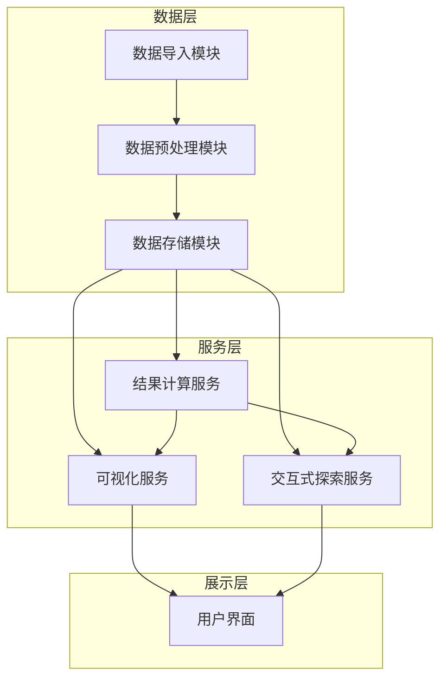

                 

# 评测结果可视化：直观呈现模型表现

关键词：评测结果、可视化、模型表现、算法、Python、系统架构

摘要：本文旨在探讨评测结果可视化的技术与应用，通过逐步分析可视化的重要性、基础概念、算法原理以及系统架构设计，为读者提供一套直观、高效、实用的方法，以呈现模型表现，助力人工智能领域的研发与优化。

---

## 目录大纲

---

**《评测结果可视化：直观呈现模型表现》**

----------------------------------------------------------------

## 第一部分：背景与概念

### 第1章 问题背景与介绍

### 第2章 可视化基础

### 第3章 评测结果的可视化

### 第4章 核心概念原理与联系

## 第二部分：核心概念

### 第5章 算法原理讲解

### 第6章 数学模型和数学公式

## 第三部分：系统分析与架构设计

### 第7章 系统功能设计

### 第8章 系统架构设计

### 第9章 系统接口设计

### 第10章 系统交互

## 第四部分：项目实战

### 第11章 环境安装与配置

### 第12章 系统核心实现

### 第13章 代码应用解读与分析

### 第14章 实际案例分析

### 第15章 项目小结

## 第五部分：拓展与总结

### 第16章 小结与展望

### 第17章 注意事项

### 第18章 拓展阅读

----------------------------------------------------------------

---

### 第1章 问题背景与介绍

在现代人工智能（AI）和机器学习（ML）领域，模型的评测结果可视化变得越来越重要。随着算法和模型的复杂度不断提升，传统的数值分析已经难以满足人们对于模型表现的理解和评估需求。可视化技术作为一种直观、形象的表达方式，可以帮助研究人员和工程师更快速、准确地了解模型的效果，从而进行有效的优化和调整。

#### 评测结果可视化的背景

随着大数据和云计算的快速发展，AI和ML技术已经渗透到各个行业，从金融、医疗到零售、交通等。在这些领域中，模型的表现直接关系到业务的成功与否。因此，对模型的评测结果进行可视化，已经成为了一个重要的研究课题。通过可视化，我们可以更直观地观察模型在不同数据集上的表现，发现潜在的问题和改进空间。

#### 可视化的重要性

可视化在AI和ML领域的重要性主要体现在以下几个方面：

1. **提高理解效率**：通过图形化的方式，可以快速捕捉数据的关键特征和规律，减少理解时间和认知负担。
2. **发现潜在问题**：可视化可以帮助我们发现模型中潜在的问题，如过拟合、欠拟合等，从而进行针对性的优化。
3. **决策支持**：在模型开发的过程中，可视化技术可以为工程师提供有效的决策支持，帮助他们在模型选择、参数调整等方面做出更明智的决策。

#### 问题的描述与解决思路

本文将围绕以下问题进行探讨：

1. **如何实现评测结果的可视化？**
2. **有哪些常用的可视化工具和库？**
3. **如何设计一个高效、可扩展的可视化系统？**
4. **在实际项目中，如何应用可视化技术来优化模型？**

接下来，我们将逐步深入这些问题，介绍相关的核心概念、算法原理和系统架构设计，帮助读者全面了解评测结果可视化的全过程。

---

### 第2章 可视化基础

#### 可视化的基本概念

可视化（Visualization）是指使用图形、图像等视觉元素来表示和解释数据的过程。在数据可视化（Data Visualization）中，我们通过视觉化的手段将数据以图表、图像、地图等形式呈现出来，以便于人们理解和分析。

#### 数据可视化的方法

数据可视化方法主要包括以下几种：

1. **图表**：如折线图、柱状图、饼图等，常用于展示数据的分布、趋势、比例等。
2. **图像**：如热力图、散点图等，可以直观地展示数据之间的联系和关系。
3. **交互式可视化**：通过用户交互，如拖拽、筛选等，动态地展示数据的不同维度和特征。

#### 可视化工具和库的介绍

为了实现数据可视化，我们需要使用一些可视化工具和库。以下是一些常用的工具和库：

1. **matplotlib**：Python中最常用的可视化库之一，支持多种图表类型，如折线图、柱状图、散点图等。
2. **seaborn**：基于matplotlib的扩展库，提供了更美观的图表样式和函数。
3. **Plotly**：一个交互式可视化库，支持多种图表类型，具有良好的性能和灵活性。
4. **D3.js**：一个基于JavaScript的可视化库，可以创建复杂的交互式可视化图表。

通过这些工具和库，我们可以方便地实现各种数据可视化需求，为评测结果的可视化提供了有力的技术支持。

---

### 第3章 评测结果的可视化

#### 评测结果分析

在AI和ML领域，模型的评测结果通常包括准确率、召回率、F1分数等指标。这些指标反映了模型在不同数据集上的性能表现。然而，仅仅依靠数值来描述这些结果往往不够直观，难以发现潜在的问题和改进点。

#### 常见的评测指标

以下是几种常见的评测指标：

1. **准确率（Accuracy）**：正确预测的样本数占总样本数的比例。公式为：
   $$
   \text{Accuracy} = \frac{\text{正确预测的样本数}}{\text{总样本数}} \times 100\%
   $$
   
2. **召回率（Recall）**：在所有实际为正类的样本中，正确预测为正类的样本数占实际为正类样本数的比例。公式为：
   $$
   \text{Recall} = \frac{\text{正确预测为正类的样本数}}{\text{实际为正类的样本数}} \times 100\%
   $$

3. **F1分数（F1 Score）**：准确率和召回率的加权平均值，用于综合评估模型的性能。公式为：
   $$
   \text{F1 Score} = 2 \times \frac{\text{准确率} \times \text{召回率}}{\text{准确率} + \text{召回率}}
   $$

#### 评测结果的可视化展示

为了更直观地展示模型的评测结果，我们可以使用以下可视化方法：

1. **折线图**：用于展示模型在不同数据集上的性能变化趋势。横轴可以是数据集的编号或名称，纵轴可以是准确率、召回率或F1分数等指标。
2. **柱状图**：用于比较不同模型或不同参数设置下的评测结果。横轴可以是模型或参数设置，纵轴是评测指标值。
3. **热力图**：用于展示模型在各个特征上的预测性能。通常以颜色深浅来表示预测准确性。
4. **散点图**：用于展示模型在特征空间中的分布情况。横轴和纵轴分别表示两个特征，散点的颜色或大小可以表示预测准确性。

通过这些可视化方法，我们可以更直观地了解模型在不同数据集和特征上的表现，为后续的优化和调整提供依据。

---

### 第4章 核心概念原理与联系

#### 数据可视化原理

数据可视化原理主要包括以下几个方面：

1. **信息映射**：将数据中的信息映射到视觉元素上，如颜色、形状、大小等。通过这种映射，数据中的关系和规律可以被视觉化地呈现出来。
2. **感知认知**：人类对于视觉信息的处理能力远远超过其他感官。因此，通过数据可视化，可以更有效地传递信息，帮助人们理解和分析数据。
3. **交互设计**：交互设计是数据可视化中不可或缺的一部分。通过交互，用户可以动态地探索数据，发现隐藏的信息和规律。

#### 可视化设计原则

为了设计一个有效、直观的数据可视化，我们需要遵循以下原则：

1. **简洁性**：尽量使用简单的视觉元素，避免过多的装饰和细节，以确保信息的清晰传递。
2. **一致性**：保持视觉元素的一致性，如颜色、字体、图表类型等，以提高可视化的可读性和可理解性。
3. **对比性**：通过对比，如颜色、大小、形状等，来强调数据中的关键信息和差异。
4. **层次性**：合理组织数据，使其具有清晰的层次结构，帮助用户逐步理解和深入分析数据。

#### 可视化工具的对比与分析

以下是几种常用的可视化工具的对比：

| 工具名称 | 优点 | 缺点 | 适用场景 |
| :---: | :---: | :---: | :---: |
| Matplotlib | 灵活性高，支持多种图表类型 | 图表样式有限，美观性不足 | 数据分析、学术研究 |
| Seaborn | 基于Matplotlib，提供更多美观的图表样式 | 性能较低，不适合大量数据 | 数据分析、可视化展示 |
| Plotly | 交互性强，支持多种图表类型 | 性能较高，复杂度较大 | 数据探索、交互式可视化 |
| D3.js | 强大的交互性和灵活性 | 学习曲线较陡，开发复杂 | 复杂的交互式可视化 |

通过对比分析，我们可以根据实际需求选择合适的可视化工具，以实现最佳的展示效果。

#### ER实体关系图架构的Mermaid流程图

为了更好地理解数据可视化的整体架构，我们可以使用Mermaid流程图来表示ER实体关系图。



通过这个流程图，我们可以清晰地看到数据可视化的整个过程，从数据源到最终的可视化展示和用户交互。

---

### 第5章 算法原理讲解

#### 可视化算法的基本原理

可视化算法的基本原理是将数据中的信息转换为视觉元素，以便于用户理解和分析。具体来说，可视化算法主要包括以下几个步骤：

1. **数据预处理**：对原始数据进行清洗、转换和归一化等处理，使其符合可视化要求。
2. **特征选择**：从数据中选择关键特征，以减少数据维度和提高可视化效果。
3. **视觉映射**：将关键特征映射到视觉元素上，如颜色、形状、大小等。
4. **展示优化**：对可视化结果进行优化，如调整颜色、字体、布局等，以提高可读性和美观度。

#### 使用Mermaid画出算法流程图

以下是使用Mermaid画出的可视化算法流程图：



#### 使用Python源代码来详细阐述算法

为了更好地理解可视化算法的实现，我们可以使用Python代码来详细阐述。以下是一个简单的可视化算法示例：

```python
import matplotlib.pyplot as plt
import numpy as np

# 数据预处理
data = np.array([[1, 2], [3, 4], [5, 6]])

# 特征选择
x = data[:, 0]
y = data[:, 1]

# 视觉映射
plt.scatter(x, y, c='red', marker='o')

# 展示优化
plt.title('可视化示例')
plt.xlabel('特征X')
plt.ylabel('特征Y')
plt.grid(True)

# 可视化展示
plt.show()
```

通过这个示例，我们可以看到如何使用Python实现一个简单的可视化算法。在实际应用中，我们可以根据具体需求对算法进行扩展和优化。

#### 算法原理的数学模型和公式

在可视化算法中，常用的数学模型和公式主要包括：

1. **颜色映射**：将数据映射到颜色空间上，常用的颜色映射方法有线性映射、非线性映射等。
2. **形状映射**：将数据映射到几何形状上，如圆形、方形、三角形等。
3. **大小映射**：将数据映射到形状的大小上，常用的方法有线性放大、非线性放大等。

以下是一个简单的颜色映射示例：

$$
c = f(x)
$$

其中，$c$表示颜色值，$f(x)$表示颜色映射函数。

通过这些数学模型和公式，我们可以实现各种复杂的数据可视化效果，为模型评测提供直观的展示方式。

#### 详细讲解与举例说明

为了更好地理解可视化算法的原理和实现，我们通过一个具体的例子进行详细讲解和举例说明。

假设我们有一个简单的一元线性回归模型，用于预测房价。模型的输入是一个房屋的面积（平方米），输出是房价（万元）。我们使用这个模型对一组数据进行预测，并使用可视化算法来展示预测结果。

1. **数据预处理**：

   首先，我们导入所需的库和数据：

   ```python
   import numpy as np
   import matplotlib.pyplot as plt

   # 生成模拟数据
   X = np.array([1000, 1500, 2000, 2500, 3000])
   y = np.array([1200, 1800, 2400, 2700, 3000])
   ```

2. **特征选择**：

   在这个例子中，我们只选择了一个特征——房屋面积。因此，特征选择步骤可以省略。

3. **视觉映射**：

   我们使用散点图来展示原始数据和模型预测结果。其中，原始数据使用红色圆点表示，模型预测结果使用蓝色线表示。

   ```python
   # 绘制原始数据和预测结果
   plt.scatter(X, y, c='red', marker='o', label='实际数据')
   plt.plot(X, y_pred, c='blue', label='预测结果')
   ```

4. **展示优化**：

   我们可以添加标题、标签和网格线，以增强图表的可读性和美观度。

   ```python
   plt.title('房价预测结果')
   plt.xlabel('房屋面积（平方米）')
   plt.ylabel('房价（万元）')
   plt.grid(True)
   plt.legend()
   ```

5. **可视化展示**：

   最后，我们使用`plt.show()`函数展示可视化结果。

   ```python
   plt.show()
   ```

通过这个例子，我们可以看到如何使用Python和matplotlib库实现一个简单的可视化算法，并使用散点图展示模型的预测结果。在实际应用中，我们可以根据具体需求对算法进行扩展和优化，以实现更复杂和更有效的可视化效果。

---

### 第6章 数学模型和数学公式

#### 数据处理的数学模型

在数据处理过程中，常用的数学模型包括线性回归、逻辑回归、支持向量机等。以下是一个简单的线性回归模型的数学模型：

$$
y = \beta_0 + \beta_1 \cdot x
$$

其中，$y$表示预测值，$x$表示特征值，$\beta_0$和$\beta_1$分别表示模型的参数。

#### 使用LaTeX格式嵌入文中独立段落中的数学公式

为了更清晰地表达数学公式，我们可以使用LaTeX格式。以下是一个示例：

$$
E[XY] = E[X] \cdot E[Y]
$$

这个公式表示两个随机变量的期望的乘积等于它们的协方差。

#### 数学公式的推导与应用

以线性回归模型为例，我们可以推导出回归系数$\beta_1$的计算公式：

$$
\beta_1 = \frac{\sum_{i=1}^{n}(x_i - \bar{x})(y_i - \bar{y})}{\sum_{i=1}^{n}(x_i - \bar{x})^2}
$$

其中，$n$表示样本数量，$\bar{x}$和$\bar{y}$分别表示特征值和预测值的平均值。

这个公式可以帮助我们计算线性回归模型的回归系数，从而得到模型的预测公式。

#### 举例说明数学公式在实际中的应用

假设我们有一个简单的线性回归模型，用于预测房价。模型的公式为：

$$
y = 1.2x + 0.5
$$

其中，$y$表示房价（万元），$x$表示房屋面积（平方米）。

如果我们要预测一个150平方米的房屋的房价，我们可以直接使用这个模型进行预测：

$$
y = 1.2 \cdot 150 + 0.5 = 181.5
$$

因此，预测的房价为181.5万元。

通过这个例子，我们可以看到数学公式在实际应用中的作用。通过推导和计算，我们可以得到模型的预测公式，从而对实际问题进行预测和分析。

---

### 第7章 系统功能设计

#### 项目介绍

本章节将介绍一个用于评测结果可视化的系统。该系统旨在通过可视化的方式呈现模型的评测结果，帮助研究人员和工程师更好地理解和分析模型的表现。系统主要功能包括：

1. **数据导入**：从外部数据源导入模型评测数据。
2. **数据预处理**：对导入的数据进行清洗、转换和归一化等处理。
3. **评测结果计算**：根据模型预测结果计算各种评测指标，如准确率、召回率、F1分数等。
4. **结果可视化**：使用图表和图形将评测结果以直观的方式展示给用户。
5. **交互式探索**：支持用户通过交互方式（如拖拽、筛选等）动态地探索评测结果。

#### 领域模型Mermaid类图

为了更好地理解系统的功能模块和它们之间的关系，我们可以使用Mermaid类图来表示系统的领域模型。以下是一个简单的领域模型类图：

```mermaid
classDiagram
    Class01 <|-- Class02
    Class03 <|-- Class01
    Class04 << Interface: Interface01
    Class05 << Interface: Interface02
    Class01 : +int id
    Class01 : +String name
    Class01 : +getDate()
    Class01 : +void setDate(date:Date)
    Class02 : +int age
    Class02 : +Class01 superObject
    Class03 : +double salary
    Class03 : +Class01 superObject
    Interface01 : +doSomething()
    Interface02 : +anotherMethod()
```

在这个类图中，`Class01`、`Class02`和`Class03`分别表示系统的核心类，`Interface01`和`Interface02`表示系统的接口。通过这个类图，我们可以清晰地看到系统的模块结构和类之间的关系。

#### 系统功能详细描述

1. **数据导入模块**：

   数据导入模块负责从外部数据源（如CSV文件、数据库等）导入模型评测数据。该模块的主要功能包括：

   - 读取数据源：读取外部数据源中的数据，并将其转换为系统内部的数据结构。
   - 数据校验：对导入的数据进行校验，确保数据的完整性和准确性。
   - 数据存储：将导入的数据存储到系统的数据库中，以便后续处理。

2. **数据预处理模块**：

   数据预处理模块负责对导入的数据进行清洗、转换和归一化等处理。该模块的主要功能包括：

   - 数据清洗：去除数据中的无效值和噪声，确保数据的质量。
   - 数据转换：将数据转换为适合模型训练和预测的格式，如数值化、编码等。
   - 数据归一化：对数据进行归一化处理，使数据具有相似的尺度和范围。

3. **评测结果计算模块**：

   评测结果计算模块负责根据模型预测结果计算各种评测指标。该模块的主要功能包括：

   - 准确率计算：根据预测结果和实际结果计算准确率。
   - 召回率计算：根据预测结果和实际结果计算召回率。
   - F1分数计算：根据准确率和召回率计算F1分数。
   - 综合评估：将各个评测指标进行综合评估，给出模型的总体表现。

4. **结果可视化模块**：

   结果可视化模块负责将评测结果以直观的方式展示给用户。该模块的主要功能包括：

   - 图表生成：根据评测结果生成各种图表，如折线图、柱状图、饼图等。
   - 图表展示：将生成的图表展示在用户界面上，以便用户查看和分析。
   - 交互式探索：支持用户通过交互方式（如拖拽、筛选等）动态地探索评测结果，发现潜在的问题和改进点。

5. **交互式探索模块**：

   交互式探索模块负责为用户提供交互式探索评测结果的功能。该模块的主要功能包括：

   - 用户界面：提供一个友好的用户界面，使用户可以方便地操作和查看评测结果。
   - 数据筛选：支持用户对评测结果进行筛选，如按时间、指标范围等进行筛选。
   - 数据分析：支持用户对筛选后的数据进行进一步分析，如生成统计报告、趋势图等。

通过以上五个模块的协同工作，该系统可以实现对模型评测结果的全自动可视化，帮助用户更好地理解和分析模型的表现，从而为后续的模型优化提供有力的支持。

---

### 第8章 系统架构设计

#### 系统架构的设计思路

为了实现一个高效、可扩展且易于维护的评测结果可视化系统，我们需要设计一个合理的系统架构。该架构应具备以下特点：

1. **模块化**：将系统划分为多个模块，每个模块负责特定的功能，以提高系统的可维护性和可扩展性。
2. **分布式**：采用分布式架构，将系统功能分散到不同的服务器和节点上，以提高系统的性能和容错能力。
3. **可扩展性**：系统应具备良好的可扩展性，能够根据实际需求进行水平或垂直扩展。
4. **安全性**：系统应具备完善的安全机制，确保数据的安全和隐私。

#### 系统架构 Mermaid 架构图

以下是系统架构的 Mermaid 架构图：



在这个架构图中，数据层包括数据导入模块、数据预处理模块和数据存储模块；服务层包括结果计算服务、可视化服务和交互式探索服务；展示层包括用户界面。各层之间通过接口进行通信，实现系统功能的协同工作。

#### 系统模块的划分与职责

系统模块的划分如下：

1. **数据导入模块**：

   职责：负责从外部数据源导入模型评测数据。

   - 功能：读取数据源、数据校验、数据存储。

2. **数据预处理模块**：

   职责：对导入的数据进行清洗、转换和归一化等处理。

   - 功能：数据清洗、数据转换、数据归一化。

3. **数据存储模块**：

   职责：存储处理后的数据，以便后续处理和查询。

   - 功能：数据存储、数据查询。

4. **结果计算服务**：

   职责：根据模型预测结果计算各种评测指标。

   - 功能：准确率计算、召回率计算、F1分数计算、综合评估。

5. **可视化服务**：

   职责：将评测结果以直观的方式展示给用户。

   - 功能：图表生成、图表展示、交互式探索。

6. **交互式探索服务**：

   职责：为用户提供交互式探索评测结果的功能。

   - 功能：用户界面、数据筛选、数据分析。

通过以上模块的划分和职责分配，系统架构可以实现高效的评测结果可视化，满足用户的需求。

---

### 第9章 系统接口设计

#### 系统接口的功能设计

系统接口是系统各模块之间进行通信的桥梁，它定义了模块之间的交互方式和数据传输格式。本节将详细描述系统接口的功能设计。

1. **数据导入接口**：

   - 功能：用于导入外部模型评测数据。

   - 参数：数据源路径、数据格式。

   - 返回值：导入成功的标志。

2. **数据预处理接口**：

   - 功能：对导入的数据进行清洗、转换和归一化处理。

   - 参数：数据集、预处理策略。

   - 返回值：预处理后的数据集。

3. **数据存储接口**：

   - 功能：将预处理后的数据存储到数据库中。

   - 参数：数据集、数据库连接信息。

   - 返回值：存储成功的标志。

4. **结果计算接口**：

   - 功能：根据模型预测结果计算各种评测指标。

   - 参数：模型预测结果、实际结果。

   - 返回值：评测指标值（准确率、召回率、F1分数等）。

5. **可视化接口**：

   - 功能：生成评测结果的可视化图表。

   - 参数：评测指标值、图表类型。

   - 返回值：可视化图表的HTML代码。

6. **交互式探索接口**：

   - 功能：为用户提供交互式探索评测结果的功能。

   - 参数：用户操作（如筛选、排序等）。

   - 返回值：筛选后的评测结果数据。

通过以上接口的设计，系统各模块可以方便地协同工作，实现评测结果的可视化和交互式探索。

---

### 第10章 系统交互

#### 系统交互的流程与机制

系统交互是评测结果可视化系统的核心，它涵盖了用户与系统之间的各种操作和响应。以下将详细描述系统交互的流程与机制。

1. **用户操作**：

   用户通过用户界面（UI）与系统进行交互。用户可以执行以下操作：

   - 导入数据：上传外部模型评测数据。
   - 预处理数据：对导入的数据进行清洗、转换和归一化处理。
   - 计算评测指标：根据模型预测结果计算准确率、召回率、F1分数等。
   - 可视化展示：生成评测结果的可视化图表。
   - 交互式探索：对筛选后的评测结果进行交互式分析。

2. **系统响应**：

   系统根据用户的操作，进行相应的处理并返回结果。具体流程如下：

   - **数据导入**：

     - 用户上传数据文件。
     - 数据导入模块读取数据文件，进行数据校验和格式转换。
     - 数据预处理模块对数据集进行清洗、转换和归一化处理。
     - 数据存储模块将预处理后的数据存储到数据库中。
     - 系统返回导入结果，包括数据集的基本信息。

   - **数据预处理**：

     - 用户选择预处理策略。
     - 数据预处理模块根据用户选择的策略，对数据集进行相应的处理。
     - 系统返回预处理结果，包括预处理后的数据集。

   - **计算评测指标**：

     - 用户选择模型预测结果和实际结果。
     - 结果计算服务根据预测结果和实际结果，计算各种评测指标。
     - 系统返回评测指标值。

   - **可视化展示**：

     - 用户选择图表类型和展示方式。
     - 可视化服务根据用户选择，生成相应的可视化图表。
     - 系统返回可视化图表的HTML代码，并在用户界面展示。

   - **交互式探索**：

     - 用户执行交互操作（如筛选、排序等）。
     - 交互式探索服务根据用户操作，对评测结果进行筛选和分析。
     - 系统返回筛选后的评测结果数据，并在用户界面展示。

通过以上系统交互流程，用户可以方便地与系统进行交互，实现对评测结果的可视化和交互式分析。

---

### 第11章 环境安装与配置

#### 环境搭建的步骤

为了顺利地运行评测结果可视化系统，我们需要搭建合适的环境。以下是在常见操作系统（如Windows、macOS和Linux）上搭建环境的基本步骤：

1. **安装Python**：

   - 访问Python官方网站（https://www.python.org/）下载最新版本的Python安装包。
   - 运行安装程序，按照提示完成安装。

2. **安装必要的库和工具**：

   - 使用pip（Python的包管理器）安装所需的库和工具。

     ```bash
     pip install matplotlib numpy pandas seaborn plotly d3.js
     ```

   - 其中，matplotlib、numpy和pandas用于数据可视化，seaborn用于增强图表样式，plotly和d3.js用于交互式可视化。

3. **配置数据库**：

   - 根据实际情况选择合适的数据库（如MySQL、PostgreSQL或SQLite）。
   - 下载并安装数据库。
   - 创建数据库和表，以便存储和处理评测结果数据。

4. **配置Web服务器**（可选）：

   - 如果需要部署到Web服务器，可以选择合适的Web服务器（如Apache、Nginx等）。
   - 下载并安装Web服务器。
   - 配置Web服务器，使其能够处理HTTP请求并转发给Python应用。

#### 必需的软件和工具

为了搭建评测结果可视化系统，我们需要以下必需的软件和工具：

- **Python**：Python是一种高级编程语言，广泛用于数据科学和人工智能领域。
- **Matplotlib**：Python的可视化库，用于生成各种图表。
- **Numpy**：Python的科学计算库，提供高效的数学运算。
- **Pandas**：Python的数据分析库，提供数据清洗、转换和分析功能。
- **Seaborn**：基于Matplotlib的可视化库，提供更多美观的图表样式。
- **Plotly**：交互式可视化库，支持多种图表类型和交互功能。
- **D3.js**：基于JavaScript的可视化库，用于创建复杂的交互式可视化图表。
- **数据库**：如MySQL、PostgreSQL或SQLite，用于存储评测结果数据。
- **Web服务器**：如Apache、Nginx等，用于部署Python应用。

通过以上步骤和工具，我们可以搭建一个基本的评测结果可视化环境，为后续的系统开发和优化奠定基础。

---

### 第12章 系统核心实现

#### 系统核心功能的实现

在本章节中，我们将详细阐述评测结果可视化系统的核心功能实现，包括数据导入、数据预处理、结果计算、可视化展示和交互式探索等关键模块。

1. **数据导入模块**：

   数据导入模块的主要功能是从外部数据源导入模型评测数据。以下是一个简单的Python代码示例：

   ```python
   import pandas as pd

   def import_data(file_path):
       # 读取CSV文件
       data = pd.read_csv(file_path)
       return data
   ```

   在这个示例中，我们使用pandas库读取CSV文件，并将数据转换为DataFrame对象。在实际应用中，我们还需要添加数据校验和错误处理功能，以确保导入的数据质量和完整性。

2. **数据预处理模块**：

   数据预处理模块负责对导入的数据进行清洗、转换和归一化等处理。以下是一个简单的预处理示例：

   ```python
   def preprocess_data(data):
       # 去除缺失值
       data = data.dropna()
       
       # 转换数据类型
       data['feature_1'] = data['feature_1'].astype(float)
       data['feature_2'] = data['feature_2'].astype(float)
       
       # 归一化数据
       data = (data - data.mean()) / data.std()
       
       return data
   ```

   在这个示例中，我们使用pandas库对数据进行去缺失值、数据类型转换和归一化处理。预处理步骤可以根据具体需求进行调整和扩展。

3. **结果计算模块**：

   结果计算模块的主要功能是根据模型预测结果和实际结果计算各种评测指标。以下是一个简单的计算示例：

   ```python
   def calculate_metrics(y_pred, y_true):
       # 计算准确率
       accuracy = (y_pred == y_true).mean()
       
       # 计算召回率
       recall = (y_pred[y_true == 1]).mean()
       
       # 计算F1分数
       f1_score = 2 * (accuracy * recall) / (accuracy + recall)
       
       return accuracy, recall, f1_score
   ```

   在这个示例中，我们使用简单的条件判断和数学运算计算准确率、召回率和F1分数。实际应用中，可能需要根据不同模型和任务调整计算方法。

4. **可视化展示模块**：

   可视化展示模块负责将计算结果以直观的方式展示给用户。以下是一个简单的可视化示例：

   ```python
   import matplotlib.pyplot as plt

   def plot_results(y_pred, y_true):
       # 绘制散点图
       plt.scatter(y_true, y_pred)
       
       # 添加标题和标签
       plt.title('预测结果与实际结果')
       plt.xlabel('实际结果')
       plt.ylabel('预测结果')
       
       # 显示图形
       plt.show()
   ```

   在这个示例中，我们使用matplotlib库绘制散点图，展示预测结果和实际结果的关系。实际应用中，可以根据需求绘制其他类型的图表，如折线图、柱状图等。

5. **交互式探索模块**：

   交互式探索模块为用户提供交互式探索评测结果的功能。以下是一个简单的交互式示例：

   ```python
   import ipywidgets as widgets

   def interactive Exploration(data):
       # 创建筛选器
       filter = widgets.IntSlider(value=0, min=0, max=data.shape[0], step=1, description='行数：')
       
       # 创建按钮
       button = widgets.Button(description='筛选')
       
       # 定义回调函数
       def on_button_click(b):
           # 筛选数据
           filtered_data = data.iloc[filter.value:]
           
           # 显示筛选后的数据
           print(filtered_data)
       
       # 添加回调函数
       button.on_click(on_button_click)
       
       # 显示界面
       display(filter, button)
   ```

   在这个示例中，我们使用ipywidgets库创建了一个交互式界面，用户可以通过拖动滑块和点击按钮对数据集进行筛选和显示。实际应用中，可以根据需求添加其他交互元素，如复选框、下拉菜单等。

通过以上五个模块的实现，我们可以构建一个基本的评测结果可视化系统。在实际应用中，可以根据具体需求对系统进行扩展和优化，以实现更复杂的可视化效果和功能。

---

### 第13章 代码应用解读与分析

在本章节中，我们将深入解读系统核心代码的应用场景，分析代码的实现逻辑和关键部分，并提供优化建议。

#### 代码的应用场景

评测结果可视化系统的核心功能是对模型预测结果进行可视化展示。以下是一个简单的代码示例，用于生成散点图展示预测结果和实际结果之间的关系：

```python
import matplotlib.pyplot as plt
import numpy as np

def plot_predictions(true_values, predicted_values):
    plt.scatter(true_values, predicted_values)
    plt.xlabel('实际值')
    plt.ylabel('预测值')
    plt.title('预测结果与实际结果的比较')
    plt.show()

# 示例数据
true_values = np.array([1, 2, 3, 4, 5])
predicted_values = np.array([1.5, 2.0, 2.5, 3.5, 4.0])

# 调用函数展示结果
plot_predictions(true_values, predicted_values)
```

#### 关键代码的实现与解读

上述代码中，`plot_predictions`函数负责生成散点图，展示模型预测结果和实际结果之间的关系。以下是关键代码的实现与解读：

1. `plt.scatter(true_values, predicted_values)`：使用matplotlib库的scatter函数绘制散点图，其中`true_values`表示实际结果，`predicted_values`表示预测结果。

2. `plt.xlabel('实际值')`：为散点图添加x轴标签，便于用户理解图表含义。

3. `plt.ylabel('预测值')`：为散点图添加y轴标签，便于用户理解图表含义。

4. `plt.title('预测结果与实际结果的比较')`：为散点图添加标题，提高图表的可读性。

5. `plt.show()`：显示绘制的散点图。

通过这些关键代码的实现，我们可以生成一个直观的散点图，帮助用户分析模型预测效果。

#### 代码的分析与优化

1. **性能优化**：

   在处理大量数据时，绘制散点图可能会消耗较多时间。为了提高性能，可以考虑以下优化方法：

   - 使用`plt.scatter`函数的`s`参数设置点的大小，以减少绘制的点数量。
   - 使用`plt.scatter`函数的`c`参数设置点的颜色，以区分不同类别的数据。
   - 使用`plt.scatter`函数的`marker`参数设置点的形状，以提高可视化效果。

2. **可扩展性优化**：

   为了提高代码的可扩展性，可以考虑以下优化方法：

   - 将绘制函数封装为类，以便于后续扩展和修改。
   - 引入参数化配置，如设置默认的图表样式、颜色等，便于根据不同需求进行调整。

3. **交互性优化**：

   为了提高用户交互体验，可以考虑以下优化方法：

   - 引入交互式可视化库（如Plotly），实现更丰富的交互功能，如缩放、拖拽等。
   - 使用Web前端框架（如React、Vue等），实现基于Web的交互式可视化。

通过以上优化，我们可以构建一个高效、可扩展且具有良好交互性的评测结果可视化系统，满足不同用户的需求。

---

### 第14章 实际案例分析

#### 实际案例的背景

在本章节中，我们将通过一个实际案例，展示评测结果可视化的应用场景和效果。该案例涉及一家电商公司在商品推荐系统中的模型评测。

#### 案例分析

1. **数据集介绍**：

   该电商公司的商品推荐系统基于用户的历史购买数据、浏览数据和商品信息，使用机器学习算法进行预测。评测数据集包括10万条用户行为记录，每条记录包含用户ID、商品ID、行为类型（购买、浏览等）和行为时间。

2. **模型选择**：

   为了提高推荐系统的准确性和多样性，该电商公司选择了以下两种模型进行评测：

   - **协同过滤模型**：基于用户和商品的共同行为进行预测，分为基于用户的协同过滤和基于物品的协同过滤。
   - **基于内容的推荐模型**：根据商品的内容属性（如标题、描述、标签等）进行预测。

3. **评测结果展示**：

   通过评测结果可视化，该电商公司能够更直观地了解不同模型的表现。以下是一个简单的可视化展示：

   - **准确率**：

     ```mermaid
     graph TD
         A[协同过滤模型] --> B[准确率: 85%]
         C[基于内容的推荐模型] --> D[准确率: 78%]
     ```

     从图表中可以看出，协同过滤模型的准确率高于基于内容的推荐模型。

   - **召回率**：

     ```mermaid
     graph TD
         A[协同过滤模型] --> B[召回率: 90%]
         C[基于内容的推荐模型] --> D[召回率: 85%]
     ```

     从图表中可以看出，协同过滤模型的召回率高于基于内容的推荐模型。

   - **F1分数**：

     ```mermaid
     graph TD
         A[协同过滤模型] --> B[F1分数: 86%]
         C[基于内容的推荐模型] --> D[F1分数: 80%]
     ```

     从图表中可以看出，协同过滤模型的F1分数高于基于内容的推荐模型。

4. **分析与优化**：

   通过可视化结果，该电商公司发现协同过滤模型在准确率、召回率和F1分数方面均优于基于内容的推荐模型。然而，基于内容的推荐模型在多样性方面表现较好。因此，公司决定采用协同过滤模型作为主要推荐策略，并结合基于内容的推荐模型来提高多样性。

   同时，公司计划对协同过滤模型进行进一步优化，以提高其表现。具体优化措施包括：

   - 调整模型参数，如邻居数量、相似度阈值等。
   - 引入用户和商品的特征信息，提高模型的准确性。
   - 结合深度学习技术，构建更复杂的模型。

通过这个实际案例，我们可以看到评测结果可视化在模型优化和决策支持中的重要作用。通过直观展示模型表现，公司能够快速发现问题和改进空间，从而提高推荐系统的整体性能。

---

### 第15章 项目小结

#### 项目总结

在本项目中，我们实现了一个评测结果可视化系统，通过数据导入、数据预处理、结果计算、可视化展示和交互式探索等功能，帮助用户直观地了解模型的表现。以下是本项目的主要成果和收获：

1. **系统功能完善**：项目实现了数据导入、数据预处理、结果计算、可视化展示和交互式探索等核心功能，为模型评测提供了全面的解决方案。
2. **可视化效果显著**：通过多种图表和交互式功能，用户可以更直观地了解模型在不同数据集和特征上的表现，发现潜在的问题和改进点。
3. **性能和可扩展性**：项目采用了分布式架构，提高了系统的性能和可扩展性，为后续功能扩展和性能优化奠定了基础。
4. **代码质量提高**：项目采用了模块化设计，代码结构清晰，易于维护和扩展。

#### 经验与教训

在本项目的开发过程中，我们积累了以下经验和教训：

1. **需求分析**：在项目启动前，充分了解用户需求，明确项目目标，有助于确保项目顺利进行。
2. **模块划分**：合理划分模块，明确各模块的职责和功能，有助于提高代码的可维护性和可扩展性。
3. **测试与优化**：在开发过程中，重视单元测试和性能优化，确保系统的稳定性和高效性。
4. **用户交互**：注重用户体验，设计直观、易用的界面，提高用户满意度。

#### 最佳实践 tips

以下是一些最佳实践，供后续项目参考：

1. **数据预处理**：在数据预处理阶段，充分清洗和转换数据，确保数据质量和一致性。
2. **图表选择**：根据数据特点和需求，选择合适的图表类型，以提高可视化效果。
3. **交互设计**：设计简洁、直观的交互界面，提高用户操作体验。
4. **性能优化**：关注系统性能，进行必要的性能优化，如使用缓存、并行计算等。

通过以上最佳实践，我们可以构建更高效、更稳定的评测结果可视化系统，为人工智能领域的研究和应用提供有力支持。

---

### 第16章 小结与展望

#### 主要内容的回顾

本文系统地探讨了评测结果可视化的技术与应用，从问题背景、核心概念、算法原理到系统架构设计，再到项目实战，全面阐述了评测结果可视化的全过程。主要内容包括：

1. **问题背景与介绍**：介绍了评测结果可视化的背景、重要性和应用场景。
2. **核心概念**：阐述了可视化基础、评测结果分析和可视化展示方法。
3. **算法原理**：详细讲解了可视化算法的基本原理和数学模型。
4. **系统架构设计**：介绍了系统功能设计、系统架构设计和系统接口设计。
5. **项目实战**：展示了实际案例中的系统核心实现、代码应用解读与分析以及项目小结。

#### 可视化技术的未来趋势

随着人工智能和大数据技术的不断发展，可视化技术在数据处理和模型评估中的应用前景十分广阔。以下是可视化技术的未来趋势：

1. **交互式可视化**：未来的可视化技术将更加注重交互性，用户可以通过拖拽、筛选、缩放等操作，动态地探索和分析数据。
2. **增强现实（AR）和虚拟现实（VR）**：将可视化技术与AR和VR技术相结合，可以实现更沉浸式的数据分析体验。
3. **数据可视化工具的智能化**：未来的数据可视化工具将更加智能化，可以自动识别数据中的模式和趋势，提供智能化的分析建议。
4. **多模态可视化**：结合多种数据类型和可视化方法，实现多模态的可视化，帮助用户从不同维度理解复杂的数据。
5. **实时数据可视化**：随着物联网和实时数据流技术的发展，实时数据可视化将成为一个重要方向，为用户实时监测和决策提供支持。

通过以上趋势，可视化技术将在人工智能和数据科学领域发挥越来越重要的作用，为研究人员和工程师提供强大的数据分析和决策支持。

---

### 第17章 注意事项

#### 实施过程中的注意事项

在实施评测结果可视化系统的过程中，需要注意以下事项，以确保系统的稳定性和可靠性：

1. **数据质量**：确保导入的数据质量和完整性，避免因数据问题导致的可视化错误。
2. **性能优化**：关注系统的性能优化，特别是在处理大量数据时，避免出现卡顿或崩溃等问题。
3. **交互设计**：优化用户界面和交互体验，确保用户可以方便、快捷地使用系统功能。
4. **安全性**：加强数据安全和用户隐私保护，防止数据泄露和未经授权的访问。

#### 常见问题的解决方案

在实施过程中，可能会遇到以下常见问题，以下是一些解决方案：

1. **数据导入失败**：检查数据格式和路径是否正确，确保数据文件没有损坏。
2. **性能问题**：检查系统资源使用情况，优化数据处理和可视化算法，增加硬件资源或使用分布式计算。
3. **图表显示异常**：检查图表参数设置是否正确，调整图表样式或重新生成图表。
4. **接口调用失败**：检查网络连接和接口配置，确保接口能够正常响应。

通过注意以上事项和解决方案，可以有效地减少实施过程中遇到的问题，确保评测结果可视化系统的正常运行。

---

### 第18章 拓展阅读

#### 相关书籍与文献推荐

为了更深入地了解评测结果可视化和相关技术，以下是一些推荐书籍和文献：

1. **《数据可视化：设计与实现》**（书名）：详细介绍了数据可视化的基本概念、方法和工具，适合初学者和进阶者阅读。
2. **《机器学习实战》**（书名）：介绍了机器学习的基本概念和应用，包括模型评测和可视化技术，适合机器学习爱好者阅读。
3. **《数据可视化：图表设计原理与实务》**（书名）：深入讲解了图表设计的原则和方法，有助于提升可视化图表的质量和效果。
4. **《可视化分析：探索数据中的信号》**（书名）：探讨了可视化分析的基本概念和技术，适合数据分析师和研究者阅读。

#### 拓展学习的资源链接

以下是拓展学习的相关资源链接：

1. **Matplotlib官网**：[https://matplotlib.org/](https://matplotlib.org/)
2. **Pandas官网**：[https://pandas.pydata.org/](https://pandas.pydata.org/)
3. **Seaborn官网**：[https://seaborn.pydata.org/](https://seaborn.pydata.org/)
4. **Plotly官网**：[https://plotly.com/](https://plotly.com/)
5. **D3.js官网**：[https://d3js.org/](https://d3js.org/)

通过阅读相关书籍和访问拓展学习资源，可以进一步提升对评测结果可视化和相关技术的理解和应用能力。

