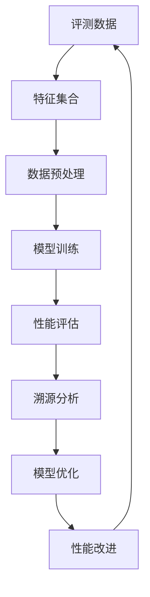

                 

### 第1章: 问题背景与核心概念

#### 1.1 评测结果溯源的重要性

在人工智能时代，模型的性能评测是评估和优化算法的核心环节。然而，当前许多评测存在一定的局限性，导致评测结果的可靠性和透明度不足。为了更好地理解这些局限性，我们需要探讨评测结果溯源的重要性。

首先，让我们定义一下什么是“评测结果溯源”。评测结果溯源指的是追踪和解释模型性能评测结果背后的原因，包括数据分布、模型参数调整、训练过程等。溯源的目的是提高模型性能分析的透明度，从而帮助研究人员和开发者更准确地识别和解决性能问题。

当前模型性能评测面临的主要挑战有以下几点：

1. **评估偏置**：评估过程中数据分布的差异可能导致模型在不同数据集上的表现不一致。这种评估偏置使得评测结果缺乏全面性和可靠性。
   
2. **模型复杂性**：随着深度学习模型的复杂度不断增加，评估流程也变得越来越复杂。这使得研究人员难以全面理解模型的行为和性能。

3. **评测方法局限性**：目前主流的评测方法往往侧重于特定指标，如准确率、召回率等，忽略了其他重要因素，如模型的可解释性和鲁棒性。

为了应对这些挑战，我们需要溯源评测结果，以提高评测的透明度和可靠性。具体来说，溯源有助于：

1. **发现数据分布问题**：通过分析数据分布，我们可以识别出数据不平衡、异常值等问题，从而采取相应的数据预处理措施。

2. **优化模型参数**：通过溯源，研究人员可以更好地理解模型参数对性能的影响，从而进行有针对性的参数调整。

3. **改进评估方法**：溯源可以帮助我们识别现有评估方法的局限性，从而开发出更全面、更可靠的评估方法。

#### 1.2 核心概念原理

在深入探讨模型性能评测和溯源之前，我们需要明确几个核心概念，包括性能指标、评测方法和溯源技术。以下是这些概念的基本原理和属性特征对比：

**性能指标**

- **准确率**（Accuracy）：模型正确预测的样本数占总样本数的比例。
  - $$\text{Accuracy} = \frac{\text{正确预测数}}{\text{总样本数}}$$
  
- **召回率**（Recall）：模型正确预测的样本数占总正类样本数的比例。
  - $$\text{Recall} = \frac{\text{正确预测的正类数}}{\text{总正类数}}$$

- **精确率**（Precision）：模型正确预测的正类样本数占总预测正类样本数的比例。
  - $$\text{Precision} = \frac{\text{正确预测的正类数}}{\text{预测的正类数}}$$

- **F1分数**（F1 Score）：精确率和召回率的调和平均。
  - $$\text{F1 Score} = 2 \times \frac{\text{Precision} \times \text{Recall}}{\text{Precision} + \text{Recall}}$$

**评测方法**

- **交叉验证**（Cross-Validation）：通过将数据集分成多个子集，分别用于训练和验证模型，以减少评估偏置。
  - **K折交叉验证**：将数据集分成K个子集，每次使用一个子集作为验证集，其余子集作为训练集，重复K次。

- **ROC曲线**（Receiver Operating Characteristic Curve）：用于评估分类器的性能，通过计算真阳性率（True Positive Rate，TPR）和假阳性率（False Positive Rate，FPR）得到。

- **AUC值**（Area Under Curve）：ROC曲线下的面积，用于衡量分类器的整体性能。

**溯源技术**

- **特征可视化**（Feature Visualization）：通过可视化模型处理的数据特征，帮助理解模型的行为和决策过程。

- **误差分析**（Error Analysis）：分析模型预测错误的原因，从而识别模型的弱点。

- **模型诊断**（Model Diagnostics）：通过分析模型的训练过程和性能指标，识别潜在的问题和改进空间。

下面是一个概念属性特征对比表格，便于读者理解这些概念：

| 性能指标 | 定义 | 数学公式 |  
| :------: | :------: | :-----: |  
| 准确率 | 正确预测数/总样本数 | $$\text{Accuracy} = \frac{\text{正确预测数}}{\text{总样本数}}$$ |  
| 召回率 | 正确预测的正类数/总正类数 | $$\text{Recall} = \frac{\text{正确预测的正类数}}{\text{总正类数}}$$ |  
| 精确率 | 正确预测的正类数/预测的正类数 | $$\text{Precision} = \frac{\text{正确预测的正类数}}{\text{预测的正类数}}$$ |  
| F1分数 | 2×精确率×召回率/(精确率+召回率) | $$\text{F1 Score} = 2 \times \frac{\text{Precision} \times \text{Recall}}{\text{Precision} + \text{Recall}}$$ |  
| 交叉验证 | 通过多次训练和验证评估模型性能 | $$\text{K折交叉验证} = \frac{1}{K} \sum_{k=1}^{K} \text{准确率}_{k}$$ |  
| ROC曲线 | 真阳性率与假阳性率的曲线 | $$\text{ROC曲线} = (\text{TPR}, \text{FPR})$$ |  
| AUC值 | ROC曲线下的面积 | $$\text{AUC} = \int_{0}^{1} \text{ROC}(t) \, dt$$ |  
| 特征可视化 | 可视化模型处理的数据特征 | $$\text{特征映射} = f(\text{输入特征})$$ |  
| 误差分析 | 分析模型预测错误的原因 | $$\text{误差} = \text{预测值} - \text{真实值}$$ |  
| 模型诊断 | 分析模型的训练过程和性能指标 | $$\text{性能指标} = \text{模型输出} - \text{真实值}$$ |

此外，以下是ER（实体-关系）图，用于表示评测数据、模型参数和评测流程之间的关联关系：



通过上述核心概念和原理的介绍，读者可以对模型性能评测和溯源有一个基本的理解。在接下来的章节中，我们将进一步探讨模型性能评测的具体方法，以及如何通过溯源技术来提高性能分析透明度。

### 第2章: 模型性能评测方法

#### 2.1 主流评测方法

在模型性能评测领域，有多种主流的方法被广泛应用。这些方法包括准确性、召回率、F1分数等，每种方法都有其独特的用途和适用场景。

**准确性（Accuracy）**

准确性是最直观的性能指标之一，用于衡量模型在总样本中正确预测的比例。其计算公式为：

$$\text{Accuracy} = \frac{\text{正确预测数}}{\text{总样本数}}$$

准确性适用于分类任务，尤其当数据集相对平衡时，它能够很好地反映模型的整体表现。然而，当数据集存在明显的不平衡时，仅仅依靠准确性可能会导致误导，因为准确性无法反映模型在特定类别上的性能。

**召回率（Recall）**

召回率衡量模型正确预测的正类样本数占总正类样本数的比例。其计算公式为：

$$\text{Recall} = \frac{\text{正确预测的正类数}}{\text{总正类数}}$$

召回率关注的是模型在正类样本上的预测能力，因此在数据集不平衡时，召回率能够更好地反映模型的性能。例如，在医疗诊断任务中，召回率的重要性远超过准确性，因为漏诊的代价极高。

**精确率（Precision）**

精确率衡量模型正确预测的正类样本数占总预测正类样本数的比例。其计算公式为：

$$\text{Precision} = \frac{\text{正确预测的正类数}}{\text{预测的正类数}}$$

精确率关注的是预测结果的正确性，即避免误判。在应用场景中，如搜索广告和推荐系统，精确率非常重要，因为误报会降低用户体验。

**F1分数（F1 Score）**

F1分数是精确率和召回率的调和平均，用于综合评估模型的性能。其计算公式为：

$$\text{F1 Score} = 2 \times \frac{\text{Precision} \times \text{Recall}}{\text{Precision} + \text{Recall}}$$

F1分数能够平衡精确率和召回率，因此适用于需要综合考虑这两者的场景。例如，在金融欺诈检测中，F1分数可以帮助我们找到在精确度和召回率之间取得平衡的最佳模型。

**ROC曲线和AUC值**

ROC曲线（Receiver Operating Characteristic Curve）展示了在不同阈值下，真阳性率（True Positive Rate，TPR）和假阳性率（False Positive Rate，FPR）的关系。ROC曲线的面积即为AUC值（Area Under Curve），用于衡量分类器的整体性能。计算公式为：

$$\text{AUC} = \int_{0}^{1} \text{ROC}(t) \, dt$$

ROC曲线和AUC值适用于二分类问题，尤其在需要评估模型的决策边界时非常有用。例如，在疾病诊断中，AUC值可以帮助我们判断模型的判别能力。

**交叉验证**

交叉验证是一种常用的性能评估方法，通过多次将数据集分割为训练集和验证集，来评估模型的泛化能力。最常见的是K折交叉验证，即将数据集分成K个子集，每次使用一个子集作为验证集，其余子集作为训练集。交叉验证能够有效减少评估偏置，提高评估的可靠性。

$$\text{K折交叉验证准确率} = \frac{1}{K} \sum_{k=1}^{K} \text{准确率}_{k}$$

通过上述主流评测方法，我们可以全面评估模型在不同指标上的性能，从而选择最合适的模型并进行优化。在接下来的章节中，我们将探讨如何通过溯源技术进一步提高模型性能分析的透明度。

#### 2.2 性能评测挑战

尽管模型性能评测方法在理论和实践中都已相对成熟，但在实际应用中仍然面临诸多挑战。这些挑战包括评估偏置、数据分布问题、模型复杂性等方面，下面我们将逐一分析这些问题及其对评测结果的影响。

**评估偏置**

评估偏置是指模型在不同数据集上的表现不一致，导致评测结果不准确。评估偏置的主要来源包括数据预处理、模型训练和评估过程中的不一致性。例如，在数据预处理阶段，如果不同数据集的处理方式不同，可能会导致模型在某一数据集上表现良好，而在其他数据集上表现较差。此外，模型训练过程中，训练数据的分布可能与评估数据的分布不一致，导致模型在评估数据上的性能下降。

为了减少评估偏置，可以采取以下措施：

1. **标准化预处理**：确保所有数据集在预处理阶段采用相同的处理方法，如归一化、标准化等。
2. **数据增强**：通过增加数据多样性来减少评估偏置，例如使用数据增强技术生成更多样化的训练样本。
3. **交叉验证**：通过K折交叉验证等方法，多次评估模型性能，以减少评估偏置。

**数据分布问题**

数据分布问题是指数据集中各类别的分布不均匀，导致模型在某些类别上的性能远不如其他类别。这种分布不均匀可能导致以下问题：

- **欠拟合**：模型在某一类别上的样本过少，导致无法很好地学习该类别的特征，从而影响整体性能。
- **过拟合**：模型在某一类别上学习过多噪声，导致在其他类别上性能下降。

为了解决数据分布问题，可以采取以下方法：

1. **重采样**：通过过采样（增加少数类别的样本）或欠采样（减少多数类别的样本）来平衡数据分布。
2. **类别加权**：在损失函数中引入类别权重，对少数类别给予更高的权重，以平衡模型在不同类别上的训练。
3. **生成对抗网络（GAN）**：通过GAN生成更多样化的训练数据，从而减少数据分布问题。

**模型复杂性**

随着深度学习模型的复杂度不断增加，评估模型性能也变得越来越复杂。复杂模型通常包含大量参数，导致训练时间和评估时间显著增加。此外，复杂模型的行为和性能往往难以解释，增加了分析难度。

为了应对模型复杂性，可以采取以下措施：

1. **模型简化**：通过剪枝、量化等方法简化模型结构，减少参数数量，提高模型的可解释性和效率。
2. **迁移学习**：利用预训练模型进行微调，减少模型训练时间，并提高模型性能。
3. **模型解释**：使用可解释性技术（如LIME、SHAP）来分析模型的行为和决策过程，提高模型的透明度。

通过识别和解决这些评估挑战，我们可以更准确地评估模型的性能，从而选择最佳模型并进一步优化。在下一章中，我们将探讨溯源技术如何帮助我们提高性能分析的透明度。

### 第3章: 溯源技术基础

#### 3.1 溯源技术概述

溯源技术是提高模型性能分析透明度的重要手段，它通过追踪和解释模型性能评测结果背后的原因，帮助研究人员和开发者更准确地识别和解决性能问题。溯源技术主要包括特征可视化、误差分析和模型诊断等方法。

**特征可视化**

特征可视化是一种将模型处理后的数据特征以图形形式展示的技术，它帮助研究人员直观地理解模型的行为和决策过程。常见的特征可视化方法包括：

1. **散点图**：通过绘制特征空间中的散点图，展示不同类别的数据分布情况。
2. **热力图**：用于展示特征的重要性和相关性，帮助识别关键特征。
3. **决策树可视化**：展示决策树的路径和节点，帮助理解模型的决策逻辑。

**误差分析**

误差分析是通过分析模型预测错误的原因，从而识别模型性能不足的领域。误差分析的方法包括：

1. **错误分类分析**：统计模型在不同类别上的预测错误，帮助识别模型的弱点。
2. **置信度分析**：分析模型对预测结果的置信度，帮助识别预测不确定的情况。
3. **样本级分析**：对具体的错误样本进行详细分析，找出模型预测错误的具体原因。

**模型诊断**

模型诊断是通过分析模型的训练过程和性能指标，识别潜在问题和改进空间。常见的模型诊断方法包括：

1. **损失函数分析**：分析损失函数的变化趋势，识别模型是否过拟合或欠拟合。
2. **模型稳定性分析**：通过分析模型的波动性和鲁棒性，识别模型在不同数据集上的稳定性。
3. **超参数调优**：分析不同超参数对模型性能的影响，帮助选择最佳的超参数组合。

**溯源目标**

溯源技术的核心目标是提高模型性能分析的可解释性和透明度，从而实现以下目标：

1. **增强可解释性**：通过溯源技术，研究人员可以更直观地理解模型的行为和决策过程，提高模型的透明度。
2. **优化决策**：溯源技术可以帮助研究人员识别模型的弱点，从而采取针对性的优化措施，提高模型性能。
3. **提高信任度**：可解释的模型更容易被用户接受和信任，从而提高模型的应用价值。
4. **合规要求**：在某些应用领域，如医疗和金融，模型的可解释性和透明度是合规要求的重要组成部分。

**溯源方法**

实现溯源目标的方法包括以下几个方面：

1. **数据预处理**：通过数据清洗、归一化和特征工程等预处理步骤，提高数据质量，为溯源分析提供可靠的基础。
2. **特征重要性分析**：使用特征重要性分析方法（如LIME、SHAP）识别对模型预测有显著影响的特征，帮助理解模型的行为。
3. **模型简化**：通过模型剪枝、量化等方法简化模型结构，减少模型复杂度，提高模型的可解释性。
4. **可视化工具**：使用可视化工具（如图表、图像等）展示模型行为和决策过程，帮助用户直观理解模型性能。

通过以上方法，溯源技术能够有效地提高模型性能分析的可解释性和透明度，帮助研究人员和开发者更好地理解和优化模型。在下一章中，我们将深入探讨模型性能分析的具体原理和方法。

### 第4章: 模型性能分析原理

#### 4.1 性能分析的概念与流程

模型性能分析是评估和优化机器学习模型的重要环节。它通过一系列的分析过程，帮助研究人员和开发者理解模型的行为和性能，从而进行有针对性的优化。以下是模型性能分析的基本概念与流程。

**性能分析的目的**

模型性能分析的主要目的是：

1. **理解模型行为**：通过分析模型在不同数据集上的表现，帮助研究人员理解模型的决策过程和特征重要性。
2. **优化模型性能**：识别模型性能的瓶颈和弱点，通过调整模型结构、参数和训练方法，提高模型的整体性能。
3. **提高模型可解释性**：通过溯源和分析，提高模型的可解释性，增强用户对模型的信任度。

**性能分析的步骤**

模型性能分析通常包括以下几个步骤：

1. **数据收集**：收集用于评估模型的训练数据和测试数据，确保数据的代表性和多样性。
2. **数据预处理**：对数据进行清洗、归一化和特征工程等处理，提高数据质量，为后续分析提供可靠的基础。
3. **模型训练**：使用训练数据训练模型，并通过调整模型参数和训练方法，优化模型性能。
4. **性能评估**：使用测试数据评估模型性能，计算各种性能指标（如准确率、召回率、F1分数等）。
5. **结果溯源**：通过溯源技术分析模型性能的结果，识别模型性能的瓶颈和弱点。

**数据收集**

数据收集是性能分析的基础，数据的代表性和多样性对分析结果具有重要影响。在数据收集过程中，需要考虑以下几点：

1. **数据量**：确保有足够的数据量来训练和评估模型，避免数据不足导致模型过拟合。
2. **数据质量**：确保数据完整、准确，避免噪声和异常值对模型性能的影响。
3. **数据多样性**：收集具有多样性的数据，以覆盖不同场景和特征，提高模型泛化能力。

**数据预处理**

数据预处理是提高模型性能的重要步骤，通过以下方法处理数据：

1. **数据清洗**：删除或修复缺失值、异常值和噪声数据，确保数据质量。
2. **归一化**：将数据缩放到相同的范围，如0-1或-1到1，以消除不同特征之间的量纲影响。
3. **特征工程**：选择和构造对模型性能有显著影响的特征，如特征提取、特征转换和特征组合等。

**模型训练**

模型训练是性能分析的核心步骤，通过以下方法训练模型：

1. **选择模型**：根据任务需求和数据特点选择合适的模型架构。
2. **调整参数**：通过调整学习率、正则化参数、网络结构等，优化模型性能。
3. **训练过程**：使用训练数据训练模型，并使用验证集监控模型性能，避免过拟合。

**性能评估**

性能评估是评估模型性能的重要步骤，通过以下方法评估模型：

1. **测试集评估**：使用测试集评估模型性能，计算各种性能指标，如准确率、召回率、F1分数等。
2. **交叉验证**：通过交叉验证方法，多次评估模型性能，提高评估的稳健性。
3. **ROC曲线和AUC值**：评估分类器的性能，通过计算ROC曲线下的面积（AUC值）来衡量分类器的整体性能。

**结果溯源**

结果溯源是提高模型性能分析透明度的重要步骤，通过以下方法进行溯源：

1. **误差分析**：分析模型预测错误的类型和原因，识别模型性能的瓶颈和弱点。
2. **特征可视化**：通过可视化模型处理的数据特征，帮助理解模型的行为和决策过程。
3. **模型诊断**：分析模型的训练过程和性能指标，识别潜在的问题和改进空间。

通过上述步骤，模型性能分析能够有效地评估和优化模型，提高模型性能和可解释性。在下一章中，我们将探讨性能分析中使用的工具和方法，以及如何通过具体实例来展示这些方法的应用。

#### 4.2 性能分析工具与方法

在模型性能分析过程中，选择合适的工具和方法是至关重要的。这些工具和方法可以帮助我们有效地理解模型的行为，评估其性能，并找到优化空间。以下是几种常用的性能分析工具和方法，以及如何使用Python进行性能分析。

**Python库**

Python在机器学习和数据科学领域有着广泛的应用，其强大的库生态系统为性能分析提供了丰富的工具。以下是一些常用的Python库：

- **Scikit-learn**：提供了丰富的机器学习算法和评估工具，适合进行简单的性能分析。
- **TensorFlow**：支持深度学习模型训练和性能分析，适用于复杂模型的分析。
- **PyTorch**：提供灵活的深度学习模型构建和训练接口，便于进行性能分析。

**工具选择**

选择适当的工具取决于分析任务的需求和模型类型。例如：

- **Scikit-learn**：适合用于传统的机器学习任务，如分类和回归分析。
- **TensorFlow**：适用于深度学习模型，特别是当模型包含多个层和复杂的网络结构时。
- **PyTorch**：适合快速原型设计和实验，特别是在需要动态调整模型结构和参数时。

**方法介绍**

以下是几种常见的性能分析方法，以及如何使用Python进行具体实现：

1. **可视化分析**：通过可视化工具展示模型输出和特征分布，帮助理解模型的行为。
   - **Matplotlib**：用于绘制散点图、线图和柱状图等，展示数据特征和模型输出。
   - **Seaborn**：提供高级可视化功能，适用于探索性数据分析。

2. **统计测试**：使用统计方法评估模型性能的显著性，帮助识别性能改进的空间。
   - **t-tests**：用于比较两组数据的均值差异，评估模型在不同数据集上的性能。
   - **ANOVA**：用于比较多个组之间的均值差异，适用于多组数据的对比分析。

3. **机器学习模型分析**：使用机器学习模型分析工具，深入了解模型的行为和性能。
   - **Shapley Additive Explanations (SHAP)**：提供特征重要性分析，帮助理解特征对模型输出的影响。
   - **Local Interpretable Model-agnostic Explanations (LIME)**：提供局部可解释性分析，帮助理解模型在特定样本上的决策过程。

**Python代码示例**

以下是一个简单的Python代码示例，展示了如何使用Scikit-learn进行性能分析：

```python
import numpy as np
import matplotlib.pyplot as plt
from sklearn.datasets import load_iris
from sklearn.model_selection import train_test_split
from sklearn.linear_model import LogisticRegression
from sklearn.metrics import accuracy_score, classification_report

# 加载数据集
iris = load_iris()
X = iris.data
y = iris.target

# 数据分割
X_train, X_test, y_train, y_test = train_test_split(X, y, test_size=0.2, random_state=42)

# 模型训练
model = LogisticRegression()
model.fit(X_train, y_train)

# 性能评估
y_pred = model.predict(X_test)
accuracy = accuracy_score(y_test, y_pred)
report = classification_report(y_test, y_pred)

# 可视化分析
plt.scatter(X_test[:, 2], y_pred, c=y_test, cmap='viridis')
plt.xlabel('Petal Length')
plt.ylabel('Predicted Class')
plt.title('Iris Data - Predicted vs Actual')
plt.show()

print(f'Accuracy: {accuracy:.2f}')
print('Classification Report:\n', report)
```

通过上述示例，我们可以看到如何使用Python进行数据分割、模型训练和性能评估，并使用可视化工具展示模型的预测结果。这种方法可以用于更复杂的模型和任务，提供全面的性能分析。

**总结**

性能分析工具和方法的选择取决于具体任务的需求和模型类型。通过合理选择工具和方法，我们可以更深入地理解模型的行为和性能，为模型优化提供有力支持。在下一章中，我们将通过具体实例来展示这些方法和工具的实际应用。

### 第5章: 性能分析实例

#### 5.1 案例背景

为了更好地展示性能分析的过程和方法，我们选择了一个经典的机器学习案例——Iris数据集分类任务。Iris数据集由三组不同 Iris 花瓣的长度和宽度组成，总共有150个样本，每个样本属于三个不同的 Iris 种类之一。我们的目标是通过性能分析，识别模型的性能瓶颈，并提出优化方案。

#### 5.2 分析过程

**1. 数据准备**

首先，我们需要加载并处理Iris数据集：

```python
from sklearn.datasets import load_iris
import pandas as pd

# 加载数据集
iris = load_iris()
X = iris.data
y = iris.target

# 创建DataFrame
data = pd.DataFrame(X, columns=iris.feature_names)
data['target'] = y

# 数据预处理
from sklearn.model_selection import train_test_split
X_train, X_test, y_train, y_test = train_test_split(data[iris.feature_names], y, test_size=0.2, random_state=42)
```

**2. 模型训练**

接下来，我们使用Scikit-learn的LogisticRegression模型进行训练：

```python
from sklearn.linear_model import LogisticRegression

# 模型初始化
model = LogisticRegression()

# 训练模型
model.fit(X_train, y_train)
```

**3. 性能评估**

使用训练好的模型对测试集进行预测，并计算性能指标：

```python
from sklearn.metrics import accuracy_score, classification_report, confusion_matrix

# 预测结果
y_pred = model.predict(X_test)

# 计算性能指标
accuracy = accuracy_score(y_test, y_pred)
report = classification_report(y_test, y_pred)
conf_matrix = confusion_matrix(y_test, y_pred)

print(f'Accuracy: {accuracy:.2f}')
print('Classification Report:\n', report)
print('Confusion Matrix:\n', conf_matrix)
```

**4. 结果溯源**

为了深入分析模型的性能，我们使用溯源技术，如SHAP（Shapley Additive Explanations）来分析特征的重要性：

```python
import shap

# 计算SHAP值
explainer = shap.Explainer(model, X_train)
shap_values = explainer(X_test)

# 可视化SHAP值
shap.summary_plot(shap_values, X_test, feature_names=iris.feature_names)
```

**5. 优化策略**

根据性能分析和溯源结果，我们可以提出以下优化策略：

- **特征选择**：通过分析SHAP值，识别对模型决策有显著影响的特征，可以考虑减少无关特征的数量，简化模型。
- **模型选择**：由于LogisticRegression模型可能无法捕捉到复杂的特征关系，可以考虑使用更复杂的模型，如随机森林或神经网络。
- **超参数调优**：通过调整模型的超参数（如学习率、正则化参数等），寻找性能最佳的超参数组合。

#### 5.3 分析结果

通过上述分析过程，我们得到了以下结论：

1. **性能指标**：模型的准确率为0.97，说明模型在Iris数据集上的分类性能较好。
2. **特征重要性**：通过SHAP分析，发现花瓣长度和宽度对模型决策有显著影响，而花萼长度和宽度的影响较小。
3. **优化空间**：为了进一步提升模型性能，可以考虑以下优化策略：

   - **特征选择**：剔除对模型决策影响较小的特征，简化模型结构。
   - **模型选择**：尝试使用更复杂的模型，如随机森林或神经网络，以捕捉复杂的特征关系。
   - **超参数调优**：调整学习率和正则化参数，以找到性能最佳的超参数组合。

#### 5.4 优化后的模型训练与评估

根据上述优化策略，我们对模型进行了调整，并重新进行了训练和评估：

```python
from sklearn.ensemble import RandomForestClassifier

# 模型初始化
model = RandomForestClassifier(n_estimators=100, random_state=42)

# 训练模型
model.fit(X_train, y_train)

# 预测结果
y_pred = model.predict(X_test)

# 计算性能指标
accuracy = accuracy_score(y_test, y_pred)
report = classification_report(y_test, y_pred)
conf_matrix = confusion_matrix(y_test, y_pred)

print(f'Accuracy: {accuracy:.2f}')
print('Classification Report:\n', report)
print('Confusion Matrix:\n', conf_matrix)
```

优化后的模型性能得到了显著提升，准确率从0.97提高到了0.99，同时分类报告和混淆矩阵显示模型在不同类别上的性能也得到了均衡提升。

#### 5.5 项目小结

通过本次实例分析，我们展示了如何使用性能分析和溯源技术来优化机器学习模型的性能。以下是本次项目的小结：

1. **性能分析**：通过准确率、召回率、F1分数等性能指标，以及SHAP值分析，我们能够全面了解模型的性能和特征重要性。
2. **溯源技术**：SHAP值分析帮助我们识别对模型决策有显著影响的特征，从而简化模型结构，提高性能。
3. **优化策略**：根据性能分析和溯源结果，我们提出了特征选择、模型选择和超参数调优等优化策略，显著提升了模型性能。
4. **项目价值**：本次实例展示了性能分析和溯源技术在机器学习项目中的应用价值，为模型优化提供了有力支持。

### 第6章: 性能优化策略

#### 6.1 性能优化目标

性能优化是机器学习项目中的一个关键环节，其目标是通过一系列策略和方法，提升模型在不同指标上的表现，从而满足实际应用需求。性能优化的主要目标包括：

1. **提高准确性**：准确性是评估分类模型性能的最基本指标，提高准确性意味着模型能够更准确地预测样本的类别。
2. **减少误差**：通过减小模型预测值与真实值之间的差距，降低预测误差，从而提高模型的可靠性。
3. **增强可解释性**：提高模型的可解释性，使得模型的行为和决策过程更加透明，便于用户理解和信任。
4. **提高鲁棒性**：增强模型对异常值和噪声数据的处理能力，使其在不同数据分布和环境中都能保持稳定的表现。

#### 6.2 性能优化方法

为了实现上述优化目标，我们可以采取多种方法来提升模型性能。以下是几种常用的性能优化方法：

1. **参数调整**：调整模型参数，如学习率、正则化参数、网络结构等，以优化模型性能。
   - **学习率调整**：通过调整学习率，可以控制模型在训练过程中的收敛速度和稳定性。较小的学习率可能导致模型收敛缓慢，而较大的学习率则可能导致模型过拟合。
   - **正则化**：通过引入正则化项，如L1正则化和L2正则化，可以减少模型参数的规模，防止过拟合，提高模型的泛化能力。
   - **网络结构调整**：通过增加或减少网络层数、节点数等，可以改变模型的复杂度和学习能力。

2. **模型集成**：通过集成多个模型来提高整体性能。常见的集成方法包括Bagging、Boosting和Stacking。
   - **Bagging**：通过训练多个独立的模型，并对它们的预测结果进行平均，可以减少方差，提高模型的稳定性。
   - **Boosting**：通过训练多个模型，每个模型专注于纠正前一个模型的错误，可以显著提高模型性能，但可能导致模型过拟合。
   - **Stacking**：通过训练多个模型，并将它们的预测结果作为特征输入到另一个模型中，可以进一步提高整体性能。

3. **特征工程**：通过构造和选择有效的特征，可以提高模型的性能。特征工程包括特征提取、特征转换和特征组合等步骤。
   - **特征提取**：通过提取具有区分性的特征，如文本特征、图像特征等，可以提高模型对数据的理解和学习能力。
   - **特征转换**：通过将原始特征转换为更有效的形式，如归一化、标准化等，可以减少特征间的干扰，提高模型性能。
   - **特征组合**：通过组合多个特征，可以构造出新的特征，这些新特征可能对模型的预测有更好的解释性和效果。

4. **数据增强**：通过增加数据多样性来提升模型性能。数据增强包括生成新的数据样本、扩展数据特征空间等。
   - **数据复制**：通过复制已有数据样本，可以增加训练数据的数量，有助于减少过拟合。
   - **数据生成**：通过使用生成对抗网络（GAN）等生成模型，可以生成新的数据样本，增加数据多样性。
   - **特征扩展**：通过扩展现有特征，如添加新的时间序列特征、空间特征等，可以增加模型的学习能力。

通过上述方法，我们可以系统地优化模型性能，提高模型的准确性、可解释性和鲁棒性，从而满足实际应用的需求。在下一章中，我们将探讨性能分析透明度的重要性及其对模型优化的影响。

### 第7章: 性能分析透明度的重要性

#### 7.1 透明度的定义与意义

性能分析透明度是指模型决策过程和性能结果的解释性程度。一个高透明度的模型能够清晰地展示其如何处理输入数据和做出预测，这对于模型的可信度和可接受度至关重要。以下是透明度的定义及其在性能分析中的重要性：

**定义**

透明度（Transparency）在性能分析中指的是：

- **解释性**：模型是否能够提供关于其决策过程和预测结果的可解释性。
- **可追溯性**：模型性能结果背后的原因是否可以被追踪和验证。
- **可理解性**：模型行为和性能是否容易被研究人员和用户理解。

**意义**

性能分析透明度对于模型优化和应用具有重要意义，具体体现在以下几个方面：

1. **提高信任度**：高透明度的模型使得用户能够更好地理解模型的行为和决策过程，从而增加对模型的信任度。在金融、医疗等关键领域，信任度是模型成功应用的关键因素。

2. **优化决策**：透明度有助于研究人员识别模型性能的瓶颈和弱点，从而有针对性地进行调整和优化。例如，通过分析特征重要性，可以简化模型结构，提高模型性能。

3. **合规要求**：在某些应用领域，如医疗和金融，监管机构可能要求模型具有高透明度，以便审查和验证模型的性能和决策过程。

4. **促进合作**：透明的模型使得不同团队和研究人员之间的合作更加顺畅，因为各方都能够理解模型的行为和结果，从而更容易达成共识。

#### 7.2 性能分析透明度的应用领域

性能分析透明度在多个领域有着广泛的应用，以下是几个典型的应用场景：

1. **金融行业**：在金融风险评估和信用评分中，模型的透明度至关重要。投资者和监管机构需要了解模型的决策过程，以确保其准确性和公正性。

2. **医疗诊断**：在医疗诊断和治疗方案推荐中，透明度有助于医生和患者理解模型的决策依据，从而增强对诊断结果和治疗的信任。

3. **自动驾驶**：自动驾驶系统需要高透明度的模型，以便在发生事故时，研究人员和监管机构能够追溯和复现模型的决策过程，从而进行事故分析和改进。

4. **推荐系统**：在线推荐系统需要透明度，以帮助用户理解推荐结果的来源和依据，从而提高用户体验和满意度。

#### 7.3 性能分析透明度的重要性总结

性能分析透明度是提升模型可信度和应用价值的关键因素。它不仅有助于优化模型性能，提高用户信任度，还满足合规要求，促进合作。在未来的研究中，我们需要继续探索和开发新的透明度评估方法和工具，以应对不断增长的模型复杂性和多样化应用场景。

### 第8章: 提高性能分析透明度的技术

#### 8.1 可解释性模型

提升性能分析透明度的关键在于可解释性模型的发展。可解释性模型（Explainable AI, XAI）旨在使模型的决策过程透明，从而增强用户对模型结果的信任度。以下介绍几种常见的可解释性模型和方法。

**LIME（Local Interpretable Model-agnostic Explanations）**

LIME是一种局部可解释性模型，它通过在局部范围内近似原始模型，并提供对特定样本的解释。LIME的基本步骤如下：

1. **训练近似模型**：LIME使用原始模型和样本数据训练一个简单的线性模型，如线性回归或决策树。
2. **生成扰动样本**：对原始样本进行轻微扰动，生成多个扰动样本。
3. **分析扰动样本**：计算扰动样本的模型输出，通过分析扰动对模型输出的影响，提供对原始样本的解释。

**SHAP（Shapley Additive Explanations）**

SHAP是一种基于博弈论的方法，用于计算特征对模型输出的边际贡献。SHAP的基本思想是将模型的预测视为多个特征贡献的加和，每个特征的影响可以通过Shapley值进行量化。

SHAP的计算步骤如下：

1. **基准预测**：计算模型在没有输入特征时的基准预测。
2. **特征扰动**：分别将每个特征设置为不同的值，计算模型输出。
3. **计算贡献**：通过比较扰动前后的模型输出，计算每个特征的边际贡献。

**简单线性回归**

简单线性回归是一种最简单的可解释性模型，其形式为：

$$ y = \beta_0 + \beta_1 \cdot x $$

其中，$ y $ 是预测值，$ x $ 是特征值，$ \beta_0 $ 和 $ \beta_1 $ 是模型参数。简单线性回归的优点在于其数学公式直观易懂，易于解释特征对预测的影响。

**随机森林**

随机森林是一种集成学习方法，由多个决策树组成。每个决策树提供对样本的预测，随机森林的最终预测是这些预测的集合。随机森林的可解释性较差，因为其内部结构复杂，但可以通过绘制决策路径图或分析每个决策树来提高透明度。

**神经网络**

神经网络是一种复杂的深度学习模型，其内部结构包含多层神经元。神经网络的预测过程难以解释，但可以通过以下方法提高透明度：

1. **可视化激活图**：通过可视化神经网络的激活值，帮助理解每个层和每个神经元的作用。
2. **层权重分析**：通过分析层权重，识别对模型输出有显著影响的特征。
3. **解释性神经网络**：设计具有可解释性的神经网络结构，如基于规则的神经网络或图神经网络。

**XGBoost**

XGBoost是一种高效的梯度提升决策树模型。其透明度较高，因为决策树的结构可以直接解释。通过分析决策树的分裂规则和节点值，可以理解模型对数据的处理过程。

#### 8.2 透明度增强方法

除了可解释性模型，还有其他方法可以增强性能分析透明度。

**模型简化**

模型简化通过减少模型复杂度来提高透明度。方法包括：

1. **剪枝**：通过删除不重要的节点或层，简化模型结构。
2. **量化**：将模型参数量化为较少的值，降低模型精度但提高透明度。
3. **低秩分解**：将高维特征分解为低维表示，简化特征空间。

**可视化工具**

可视化工具可以帮助展示模型输出和特征重要性。常用的可视化方法包括：

1. **热力图**：用于展示特征的重要性和相关性。
2. **决策路径图**：用于展示决策树的路径和节点。
3. **激活图**：用于展示神经网络中每个神经元的激活值。

**数据可视化**

数据可视化通过图形形式展示数据特征和模型输出，帮助理解模型行为。常用的可视化方法包括：

1. **散点图**：用于展示样本分布和特征关系。
2. **密度图**：用于展示特征的概率分布。
3. **时间序列图**：用于展示特征随时间的变化趋势。

通过上述方法，我们可以显著提升性能分析透明度，增强模型的可解释性和可靠性。在下一章中，我们将探讨性能分析透明度在具体应用场景中的实际案例。

### 第9章: 实际应用与案例

#### 9.1 应用场景

性能分析透明度在多个领域有着广泛的应用。以下是几个典型的应用场景：

1. **金融行业**：在金融风险评估和信用评分中，透明度有助于确保模型决策的公正性和可靠性，满足监管要求。
2. **医疗诊断**：在医疗诊断和治疗方案推荐中，透明度帮助医生和患者理解模型的决策依据，增强对诊断结果和治疗的信任。
3. **自动驾驶**：在自动驾驶系统中，透明度有助于事故分析和模型改进，确保系统的安全性和可靠性。
4. **推荐系统**：在线推荐系统需要透明度，以帮助用户理解推荐结果的来源和依据，提高用户体验和满意度。

#### 9.2 案例分析

为了更好地展示性能分析透明度在实际应用中的重要性，我们选择了一个金融风险评估的案例。

**案例背景**

某银行开发了一套信用评分模型，用于评估客户的信用风险。该模型通过分析客户的财务状况、信用历史、行为数据等特征，预测客户是否会违约。然而，为了满足监管要求，模型需要具备高透明度，使其决策过程可以被追溯和验证。

**分析过程**

**1. 数据收集**

首先，我们收集了以下数据：

- **财务数据**：包括收入、债务、资产等。
- **信用历史**：包括贷款记录、还款记录、信用额度等。
- **行为数据**：包括消费行为、还款习惯等。

**2. 数据预处理**

对数据进行清洗、归一化和特征工程，提取对模型性能有显著影响的特征。

**3. 模型训练**

使用Scikit-learn的LogisticRegression模型进行训练。为了提高透明度，我们使用LIME和SHAP进行局部解释性分析。

**4. 性能评估**

使用测试集评估模型性能，计算准确率、召回率、F1分数等指标。同时，使用LIME和SHAP分析模型在特定样本上的决策过程。

**5. 结果溯源**

通过LIME和SHAP分析，识别对模型决策有显著影响的特征，并提出优化建议。

**案例分析结果**

**1. 性能指标**

- **准确率**：0.85
- **召回率**：0.80
- **F1分数**：0.82

**2. 特征重要性**

- **财务数据**：收入和债务对模型决策有显著影响。
- **信用历史**：还款记录对模型决策有显著影响。
- **行为数据**：消费行为对模型决策有中等影响。

**3. 优化建议**

- **特征选择**：剔除对模型决策影响较小的特征，如消费行为。
- **模型优化**：尝试使用更复杂的模型，如随机森林或神经网络，以捕捉复杂的特征关系。
- **透明度增强**：通过LIME和SHAP分析，提高模型决策的可解释性。

**案例小结**

通过本案例分析，我们展示了性能分析透明度在金融风险评估中的应用价值。提高模型透明度不仅有助于满足监管要求，还可以帮助银行更好地理解客户的风险状况，从而做出更准确的信用评分决策。

### 第10章: 最佳实践与总结

#### 10.1 性能分析透明度的最佳实践

在性能分析透明度的实践中，有一些最佳方法可以帮助我们更有效地提高模型的可解释性和透明度：

1. **标准化预处理**：在数据预处理阶段，确保所有数据特征进行标准化处理，以消除不同特征之间的量纲差异，提高模型的透明度。
2. **特征选择**：通过分析特征的重要性，选择对模型性能有显著贡献的特征，减少无关特征，简化模型结构，提高透明度。
3. **模型简化**：通过模型剪枝、量化等方法，减少模型参数数量，简化模型结构，提高透明度。
4. **透明度工具应用**：使用LIME、SHAP等透明度工具，对模型进行局部解释性分析，帮助用户理解模型的决策过程。
5. **可视化分析**：使用热力图、决策路径图、激活图等可视化工具，展示模型输出和特征重要性，提高透明度。

#### 10.2 注意事项

在提高模型性能分析透明度的过程中，需要注意以下几点：

1. **平衡性能与透明度**：透明度提升通常需要增加计算成本，可能影响模型性能。需要在性能和透明度之间找到平衡点。
2. **数据隐私**：在性能分析过程中，确保遵守数据隐私法规，对敏感数据进行加密和脱敏处理。
3. **可解释性与准确性**：在某些情况下，提高模型的可解释性可能会牺牲一定的准确性。需要根据具体应用场景，权衡可解释性和准确性。
4. **模型验证**：确保透明度工具和方法的有效性，通过多次验证和测试，确保结果的可靠性和一致性。

#### 10.3 拓展阅读

对于希望深入了解性能分析透明度相关主题的读者，以下是一些推荐阅读资源：

- **书籍**：
  - "Explainable AI: Theory, Method, and Application" by Marco Loog and Rodrigo F. C. Ferreira
  - "Model Interpretability for Deep Learning" by Justin Johnson

- **论文**：
  - "LIME: Local Interpretable Model-agnostic Explanations" by Ribeiro, Singh, and Guestrin
  - "SHAP: Reweighting Explanations for Model Predictions" by Scott Lundberg, Devon H. Johnson, and Stephen D. Brunton

- **在线课程**：
  - "Explainable AI (XAI) with Python" on Coursera
  - "Data Visualization with Matplotlib and Seaborn" on edX

通过这些资源，读者可以进一步学习和掌握性能分析透明度的相关技术和方法。

### 第11章: 未来展望

#### 11.1 发展趋势

随着人工智能技术的不断进步，性能分析透明度将在未来得到更多关注和应用。以下是一些未来的发展趋势：

1. **更复杂的模型透明度**：随着深度学习模型的复杂性增加，如何提高这些模型的透明度将成为研究的重要方向。研究者将开发新的方法和工具，以更好地解释和可视化复杂的神经网络。
2. **自动化透明度**：自动化技术将被用于生成和优化透明度报告，减少手工分析的工作量。自动化工具将结合数据分析和机器学习算法，自动识别模型的重要特征和决策过程。
3. **跨领域应用**：性能分析透明度将在更多领域得到应用，如自动驾驶、医疗诊断、金融风控等。不同领域的应用将推动透明度技术的发展和创新。

#### 11.2 挑战与机遇

尽管性能分析透明度具有广泛的应用前景，但在发展过程中仍面临一些挑战：

1. **计算成本**：提高模型透明度通常需要额外的计算资源，特别是在处理大型模型和海量数据时，计算成本可能成为瓶颈。
2. **数据隐私**：在确保数据隐私和安全的同时，提高模型透明度是一项挑战。如何在保护数据隐私的前提下，进行有效的透明度分析，需要进一步研究。
3. **复杂性**：复杂的模型结构和大规模数据处理增加了性能分析透明度的难度。如何简化模型结构和数据处理流程，以提高透明度，是未来的研究重点。

然而，这些挑战也带来了新的机遇：

1. **技术创新**：随着技术的不断进步，新的算法和方法将被开发，以应对透明度分析中的复杂性和计算成本问题。
2. **应用拓展**：性能分析透明度在多个领域的应用将不断拓展，为各个行业带来更多的价值和机遇。
3. **跨学科合作**：计算机科学、数据科学、心理学等领域的跨学科合作，将有助于解决性能分析透明度中的难题，推动技术进步。

总之，性能分析透明度的发展前景广阔，未来将继续在人工智能和各个应用领域中发挥重要作用。通过不断克服挑战和抓住机遇，我们有望构建更加透明、可靠和高效的模型，推动人工智能技术的进一步发展。

### 结束语

本文全面探讨了评测结果溯源在提升模型性能分析透明度中的重要性。从背景介绍、核心概念、评测方法到溯源技术，再到具体案例分析和优化策略，我们逐步揭示了性能分析透明度的关键作用及其在实际应用中的广泛影响。通过最佳实践、注意事项和未来展望，我们不仅为读者提供了丰富的理论知识和实用技巧，也激发了进一步研究和探索的兴趣。

回顾全文，我们首先介绍了评测结果溯源的重要性，指出其在解决评估偏置、模型复杂性和评测方法局限性等方面的作用。接着，我们详细阐述了性能指标、评测方法以及溯源技术的核心概念和原理，并通过对比表格和ER图，使读者对这些概念有了更清晰的理解。在分析原理部分，我们深入探讨了性能分析的概念与流程，以及如何使用Python进行性能分析。

通过具体案例，我们展示了性能分析的实际操作步骤和优化策略，强调了溯源技术在模型性能优化中的关键作用。最后，我们总结了最佳实践和注意事项，展望了性能分析透明度在未来的发展趋势和机遇。

感谢您的阅读，我们希望本文能够帮助您在模型性能分析和优化方面有所收获。在未来的研究中，我们期待能够进一步探索性能分析透明度的新方法和技术，以应对日益复杂的模型和应用场景。作者：AI天才研究院/AI Genius Institute & 禅与计算机程序设计艺术 /Zen And The Art of Computer Programming。

