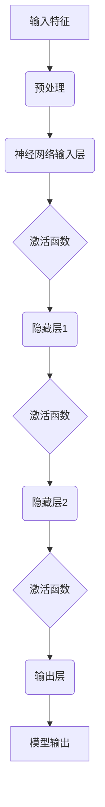

                 

## 《评测结果的可解释性分析方法》

> 关键词：可解释性评测、算法透明度、机器学习、模型解释性、应用实践

> 摘要：本文旨在探讨评测结果的可解释性分析方法，从背景与概念介绍出发，详细分析了可解释性评测的基本原理、工具与技术，以及在不同应用领域的实践案例。文章通过对可解释性评测的核心概念、数学模型和实际应用的深入剖析，提出了未来发展趋势和挑战，为相关领域的研究和实践提供了参考。

### 第一部分: 背景与概念介绍

#### 第1章: 可解释性评测的重要性

##### 1.1 问题背景

在现代社会，数据驱动的决策越来越重要，而机器学习和人工智能技术正成为众多领域的核心工具。然而，随着这些技术应用的普及，其透明度和可解释性成为了一个关键问题。特别是当机器学习模型用于医疗、金融、安全等重要领域时，用户和监管机构对于模型决策过程的理解和信任至关重要。

**评测结果的可解释性需求**：用户希望能够理解模型是如何作出决策的，以及这些决策背后的逻辑。这不仅有助于增强用户对模型的信任，也有助于发现和纠正潜在的偏见和错误。

**可解释性评测的挑战**：随着模型复杂性的增加，其透明度和可解释性变得愈加困难。深度学习模型和复杂的统计模型往往缺乏透明性，导致其决策过程难以理解。

##### 1.2 核心概念

**可解释性评测的定义**：可解释性评测是指对机器学习模型的决策过程进行理解和解释的能力，旨在提高模型的透明度和可信度。

**可解释性与透明度的区别**：透明度指的是模型内部结构是否清晰可见，而可解释性则更侧重于模型决策过程的逻辑和原因。

**可解释性评测的关键要素**：包括模型的可理解性、透明度、决策路径追踪和特征重要性评估。

#### 第2章: 可解释性评测的基本原理

##### 2.1 可解释性评测的数学模型

可解释性评测的核心在于如何理解模型的决策过程。这通常涉及到以下几个方面的数学模型：

**线性模型**：  
$$  
y = \beta_0 + \beta_1x  
$$

**非线性模型**：  
$$  
y = \sigma(\beta_0 + \beta_1x)  
$$

其中，$y$ 是模型输出，$x$ 是输入特征，$\beta_0$ 和 $\beta_1$ 是模型参数，$\sigma$ 是激活函数。

**特征重要性**：通过分析特征在模型决策中的作用，可以评估特征的重要性。

**决策路径追踪**：追踪模型在决策过程中每个步骤的输入和输出，有助于理解决策逻辑。

**模型透明度提升**：通过简化模型结构、使用透明度更高的模型或对现有模型进行改进，可以提高模型的透明度。

### 第二部分: 可解释性评测的工具与技术

#### 第3章: 可解释性评测工具与技术

在这一章节中，我们将探讨可解释性评测的常用工具和技术，包括：

**LIME (Local Interpretable Model-agnostic Explanations)**：一种局部可解释性工具，旨在为任何黑盒模型生成解释。

**SHAP (SHapley Additive exPlanations)**：一种基于博弈论的模型解释方法，旨在衡量特征对模型输出的贡献。

**LIME-SHAP**：结合了 LIME 和 SHAP 的优点，提供了一种更强大的局部解释方法。

**解释性增强模型**：通过设计具有更高解释性的模型结构，提高模型的透明度和可解释性。

**树模型的可解释性**：分析决策树模型的内部结构和决策路径，以提供透明和可解释的决策过程。

**神经网络的可解释性**：探讨如何提高神经网络模型的可解释性，包括可视化技术、解释性模块和注意力机制。

### 第三部分: 可解释性评测在各类应用中的实践

#### 第4章: 可解释性评测在各类应用中的实践

在本章节中，我们将探讨可解释性评测在多个领域的实际应用，包括：

**金融领域**：信用评分模型和风险评估模型的解释性评测，提高模型决策的透明度和可信度。

**医疗领域**：疾病诊断模型和药物效果评估的解释性评测，确保医疗决策的科学性和合理性。

**安全领域**：恶意代码检测和防火墙策略分析的解释性评测，提升网络安全防御的能力。

### 第四部分: 可解释性评测的实际案例分析

#### 第5章: 可解释性评测的实际案例分析

在这一章节中，我们将通过具体案例分析，探讨如何在实际场景中应用可解释性评测方法，包括：

**案例一：信用评分模型的解释性提升**：分析信用评分模型在解释性提升方面的挑战和解决方案。

**案例二：疾病诊断模型的解释性分析**：探讨疾病诊断模型在医疗领域的实际应用和解释性评测的重要性。

### 第五部分: 可解释性评测的未来趋势

#### 第6章: 可解释性评测的未来趋势

在本章节中，我们将探讨可解释性评测的未来发展趋势和挑战，包括：

**新型解释性模型**：介绍新型解释性模型的开发和研究趋势，包括基于博弈论、注意力机制和神经网络的新型解释方法。

**多模型融合解释**：探讨如何将多个模型的结果进行融合，以提高解释的全面性和准确性。

**可解释性评测工具的自动化**：探讨如何通过自动化工具提高可解释性评测的效率和准确性。

### 第六部分: 总结与展望

#### 第7章: 总结与展望

在本章节中，我们将对全文进行总结，回顾可解释性评测的核心概念、原理和实际应用，并提出未来研究的方向和建议。

### 附录

**参考文献**：列出本文引用的相关文献和参考资料。

**作者介绍**：介绍作者背景和资历，包括研究领域、研究成果和出版著作。

---

通过以上详细的目录结构和内容概述，本文将为读者提供一份全面、深入和实用的可解释性评测指南，帮助读者理解并应用这一关键技术。在接下来的章节中，我们将逐层展开，逐步深入，以实现这一目标。

---

### 第一部分: 背景与概念介绍

#### 第1章: 可解释性评测的重要性

##### 1.1 问题背景

在当今数据驱动的世界里，机器学习和人工智能技术已经成为众多领域的关键工具。无论是医疗、金融、安全还是其他领域，这些技术的应用都极大地提高了决策的效率和准确性。然而，随着这些技术的普及，其透明度和可解释性成为了一个不可忽视的问题。

首先，我们来看一个常见的应用场景：在医疗领域，机器学习模型被用于诊断疾病，如癌症的早期检测。这种情况下，医生和患者需要理解模型是如何做出诊断决策的，以便对模型的结果进行评估和信任。此外，如果模型存在偏见或错误，能够及时发现并纠正，这对于提高医疗服务的质量和安全性至关重要。

在金融领域，信用评分模型是评估客户信用风险的重要工具。这些模型被广泛应用于贷款审批、信用卡发放等环节。用户和监管机构需要了解模型如何评估信用风险，以及这些评估结果的依据是什么。这不仅有助于提高用户对金融服务的信任，也能确保监管合规性。

再来看安全领域，恶意代码检测和防火墙策略分析依赖于复杂的机器学习模型。安全专家需要理解模型是如何识别和防御攻击的，以便优化安全策略和提升防御能力。

**评测结果的可解释性需求**：在这些应用场景中，用户和监管机构对于模型决策过程的理解和信任至关重要。可解释性评测可以提供这种理解，从而增强用户对模型的信任，提高模型的透明度和可信度。

**可解释性评测的挑战**：然而，随着模型复杂性的增加，其透明度和可解释性变得愈加困难。深度学习模型和复杂的统计模型往往缺乏透明性，导致其决策过程难以理解。此外，不同领域的应用对可解释性有着不同的需求和标准，这使得可解释性评测面临诸多挑战。

##### 1.2 核心概念

**可解释性评测的定义**：可解释性评测是指对机器学习模型的决策过程进行理解和解释的能力，旨在提高模型的透明度和可信度。具体来说，它包括以下几个方面的内容：

1. **模型的可理解性**：用户能否理解模型的内部结构和工作原理。
2. **模型透明度**：模型内部决策过程是否清晰可见。
3. **决策路径追踪**：能否追踪模型在决策过程中每个步骤的输入和输出。
4. **特征重要性评估**：模型中各个特征对决策结果的影响程度如何。

**可解释性与透明度的区别**：透明度和可解释性虽然密切相关，但有所区别。透明度指的是模型内部结构是否清晰可见，而可解释性则更侧重于模型决策过程的逻辑和原因。例如，一个简单的线性回归模型具有很高的透明度，因为其内部结构简单，决策过程直观。然而，一个复杂的深度学习模型可能具有很高的透明度，但其决策过程仍然难以理解。

**可解释性评测的关键要素**：为了实现有效的可解释性评测，需要关注以下几个关键要素：

1. **算法选择**：选择具有较高解释性的算法，如线性回归、决策树等。
2. **特征选择**：选择对决策有显著影响的特征，并通过特征重要性评估来解释模型结果。
3. **可视化工具**：使用可视化工具，如热图、决策树可视化等，帮助用户理解模型决策过程。
4. **解释性工具**：使用解释性工具，如 LIME、SHAP 等，为复杂模型生成解释。

##### 1.3 总结

可解释性评测对于提高机器学习模型的透明度和可信度至关重要。它不仅有助于增强用户对模型的信任，还能确保模型决策的科学性和合理性。然而，实现有效的可解释性评测面临诸多挑战，需要综合考虑算法选择、特征选择、可视化工具和解释性工具等多个方面。在接下来的章节中，我们将深入探讨可解释性评测的基本原理、工具和技术，以帮助读者更好地理解和应用这一关键技术。

---

#### 第2章: 可解释性评测的基本原理

##### 2.1 可解释性评测的数学模型

可解释性评测的核心在于如何理解模型的决策过程。这通常涉及到以下几个方面的数学模型，包括线性模型和非线性模型。

**线性模型**：线性模型是最简单且直观的模型之一，其决策过程容易理解。线性模型的数学表达式为：

$$
y = \beta_0 + \beta_1x
$$

其中，$y$ 是模型输出，$x$ 是输入特征，$\beta_0$ 和 $\beta_1$ 是模型参数。线性模型的优势在于其简洁性和可解释性。每个特征对输出的影响可以通过参数$\beta_1$ 的值直接计算出来。

**非线性模型**：然而，现实世界中的问题往往比线性模型更为复杂，因此需要使用非线性模型来捕捉更复杂的关系。非线性模型的数学表达式为：

$$
y = \sigma(\beta_0 + \beta_1x)
$$

其中，$\sigma$ 是激活函数，通常使用 Sigmoid、ReLU 或其他非线性函数。非线性模型可以捕捉更复杂的输入特征之间的关系，但同时也增加了模型的复杂性，使得其决策过程难以理解。

**特征重要性**：在可解释性评测中，特征重要性评估是一个关键环节。它旨在衡量每个特征对模型输出的影响程度。特征重要性的评估方法有很多，包括：

1. **基于模型的方法**：通过分析模型参数的值来评估特征的重要性。例如，在线性模型中，特征的重要性可以通过$\beta_1$ 的绝对值来衡量。
2. **基于统计的方法**：通过计算特征与模型输出之间的相关性来评估特征的重要性。例如，可以使用皮尔逊相关系数或卡方测试来评估特征的重要性。
3. **基于模型的比较**：通过比较不同模型在特征选择和参数设置上的差异来评估特征的重要性。例如，可以通过减少特征数量来观察模型性能的变化，从而评估特征的重要性。

**决策路径追踪**：决策路径追踪是另一种重要的可解释性评估方法，它旨在追踪模型在决策过程中的每一步。对于树模型，如决策树和随机森林，决策路径追踪相对简单。每个节点代表了模型在决策过程中的一次分支，节点上的条件代表了决策的依据。通过追踪决策路径，用户可以清楚地了解模型是如何做出决策的。

对于深度学习模型，决策路径追踪则更为复杂。深度学习模型通常包含多层非线性变换，因此需要使用可视化工具来展示决策路径。一种常用的方法是将模型拆分成多个子网络，每个子网络负责一部分输入特征的处理，然后通过可视化这些子网络的输出和决策路径，来理解整个模型的决策过程。

**模型透明度提升**：为了提高模型的透明度，可以采取以下几种方法：

1. **简化模型结构**：选择具有较低复杂度的模型，如线性回归和决策树，这些模型的结构简单，易于理解。
2. **使用透明度更高的模型**：选择透明度更高的模型，如逻辑回归和线性模型，这些模型可以直接解释每个特征对输出的影响。
3. **增加模型注释**：为模型添加详细的注释，包括每个参数的含义、特征的重要性和决策路径等，以提高模型的透明度。

**总结**：可解释性评测的基本原理涉及到多个方面，包括数学模型、特征重要性评估、决策路径追踪和模型透明度提升。这些方法共同构成了可解释性评测的核心，帮助用户理解和信任机器学习模型。在接下来的章节中，我们将进一步探讨可解释性评测的工具和技术，以及其在不同领域的实际应用。

---

#### 第3章: 可解释性评测工具与技术

为了实现有效的可解释性评测，我们需要借助一系列工具和技术。这些工具和技术不仅可以帮助我们理解模型的决策过程，还可以提高模型的透明度和可解释性。在本章中，我们将详细介绍几种常用的可解释性评测工具和技术。

##### 3.1 机器学习算法的可解释性工具

**LIME (Local Interpretable Model-agnostic Explanations)**

LIME 是一种局部可解释性工具，旨在为任何黑盒模型生成解释。LIME 的核心思想是通过局部线性化来解释模型在特定数据点上的决策。具体来说，LIME 首先选择一个原始模型（可以是任何黑盒模型），然后针对一个特定的数据点，生成一个近似的线性模型，以便用户可以直观地理解模型在该数据点上的决策过程。

LIME 的基本步骤如下：

1. **选择原始模型**：LIME 可以应用于任何黑盒模型，包括深度学习模型、随机森林、支持向量机等。
2. **生成近似的线性模型**：LIME 使用梯度下降算法，在原始模型周围生成一个近似的线性模型，以便可以解释模型在特定数据点上的决策。
3. **可视化解释结果**：LIME 生成解释结果后，可以使用热图、直方图等可视化工具，将解释结果展示给用户。

**SHAP (SHapley Additive exPlanations)**

SHAP 是一种基于博弈论的模型解释方法，旨在衡量特征对模型输出的贡献。SHAP 的核心思想是通过计算特征对模型输出的边际贡献，来解释模型在特定数据点上的决策过程。SHAP 的解释结果可以用于评估特征的重要性，并帮助用户理解模型决策的逻辑。

SHAP 的基本步骤如下：

1. **计算特征的重要性**：SHAP 使用博弈论中的 Shapley 值来计算每个特征对模型输出的边际贡献。Shapley 值是一种公平的分配方法，可以衡量每个特征在模型决策中的重要性。
2. **生成解释结果**：SHAP 生成解释结果后，可以使用热图、直方图等可视化工具，将解释结果展示给用户。

**LIME-SHAP**

LIME-SHAP 是 LIME 和 SHAP 的结合，旨在提供更强大的局部解释方法。LIME-SHAP 首先使用 LIME 生成局部线性模型，然后使用 SHAP 计算特征的重要性。这种方法可以提供更全面和深入的解释结果。

LIME-SHAP 的基本步骤如下：

1. **使用 LIME 生成局部线性模型**：LIME 生成局部线性模型，以便可以解释模型在特定数据点上的决策过程。
2. **使用 SHAP 计算特征的重要性**：SHAP 使用博弈论中的 Shapley 值，计算局部线性模型中每个特征的重要性。
3. **生成综合解释结果**：LIME-SHAP 结合 LIME 和 SHAP 的解释结果，生成更全面和深入的解释。

##### 3.2 解释性增强模型

除了使用现有的解释性工具外，还可以通过设计解释性增强模型来提高模型的透明度和可解释性。以下是一些常用的解释性增强模型：

**逻辑回归（Logistic Regression）**

逻辑回归是一种简单且具有高度解释性的模型。逻辑回归通过线性模型来预测概率，并通过 Sigmoid 函数将概率映射到 0 和 1 之间。逻辑回归的决策边界和参数可以直接解释，因此具有很高的透明度。

**决策树（Decision Tree）**

决策树是一种直观且易于理解的模型。决策树通过一系列条件分支来决策，每个节点代表了模型在决策过程中的一个条件。决策树的结构和决策路径可以清晰地展示模型的工作原理，因此具有很高的透明度。

**线性模型（Linear Model）**

线性模型是一种简单且具有高度解释性的模型。线性模型通过线性组合输入特征来预测输出，其参数可以直接解释为每个特征对输出的贡献。

##### 3.3 神经网络的可解释性

神经网络是一种复杂且难以解释的模型，但近年来，研究者们提出了一些方法来提高神经网络的可解释性。以下是一些常用的方法：

**可视化技术**

可视化技术可以帮助我们理解神经网络的结构和工作原理。常用的可视化技术包括：

1. **激活图（Activation Map）**：激活图可以展示神经网络在特定层上的激活情况，帮助用户理解每个神经元的作用。
2. **注意力机制（Attention Mechanism）**：注意力机制可以突出神经网络中最重要的特征和部分，提高模型的透明度。
3. **解释性模块（Explainable Modules）**：解释性模块是一种特殊的神经网络结构，旨在提高模型的可解释性。

**可视化流程图**

下面是一个用于可视化神经网络决策过程的 Mermaid 流程图：



**总结**

可解释性评测是提高机器学习模型透明度和可信度的重要手段。本章介绍了 LIME、SHAP、LIME-SHAP 等可解释性工具，以及逻辑回归、决策树、线性模型等解释性增强模型，还探讨了神经网络的可解释性方法。通过这些工具和技术，我们可以更好地理解和解释机器学习模型的决策过程，从而提高模型的透明度和可解释性。

---

#### 第4章: 可解释性评测在各类应用中的实践

##### 4.1 金融领域的可解释性评测

在金融领域，可解释性评测对于确保金融模型的透明度和合规性具有重要意义。以下将探讨金融领域中的两个典型应用：信用评分模型和风险评估模型。

**4.1.1 信用评分模型**

信用评分模型用于评估客户的信用风险，以决定是否批准贷款或信用卡申请。这些模型通常使用多种特征，如收入、债务、信用历史等来预测客户的违约概率。为了确保这些模型的决策过程透明和可解释，金融机构可以采取以下措施：

1. **特征选择和重要性评估**：通过分析特征的重要性，金融机构可以识别出对信用评分有显著影响的特征。这些特征的选择和重要性评估可以通过 LIME 或 SHAP 等工具来实现，帮助用户理解每个特征对评分的影响。

2. **透明度提升**：金融机构可以采用具有较高透明度的模型，如逻辑回归和决策树，这些模型可以直接解释每个特征对评分的贡献。此外，通过为模型添加详细的注释和文档，可以进一步提高模型的透明度。

3. **解释性可视化**：使用可视化工具，如热图和决策路径图，可以帮助金融用户理解模型的决策过程。例如，热图可以展示每个特征在不同评分区间的贡献，而决策路径图可以展示模型在评估过程中的每一步决策。

**4.1.2 风险评估模型**

风险评估模型用于评估金融机构或客户的金融风险，包括贷款违约风险、市场风险等。这些模型通常更加复杂，涉及多个风险因素。为了提高这些模型的透明度和可解释性，金融机构可以采取以下措施：

1. **模型透明度分析**：通过分析模型的内部结构和参数，识别模型中的关键风险因素。这些分析可以通过 LIME 或 SHAP 等工具来实现，帮助用户理解模型如何处理和整合这些风险因素。

2. **多模型融合解释**：为了提高模型的综合解释性，金融机构可以考虑使用多个风险评估模型，并通过融合这些模型的结果来生成更全面和可解释的评估结果。

3. **实时解释性监控**：在金融应用中，实时监控模型的解释性非常重要。通过实时监控模型的解释性指标，金融机构可以及时发现和纠正模型中的潜在问题，确保模型的可解释性和透明度。

##### 4.2 医疗领域的可解释性评测

在医疗领域，可解释性评测对于提高医疗决策的科学性和患者信任至关重要。以下将探讨医疗领域中的两个典型应用：疾病诊断模型和药物效果评估模型。

**4.2.1 疾病诊断模型**

疾病诊断模型用于辅助医生诊断疾病，如癌症、心脏病等。这些模型通常使用医学影像数据、实验室检测结果等多种数据源来预测疾病的发生。为了提高这些模型的透明度和可解释性，医疗机构可以采取以下措施：

1. **特征选择和重要性评估**：通过分析特征的重要性，医疗机构可以识别出对疾病诊断有显著影响的特征。这些特征的选择和重要性评估可以通过 LIME 或 SHAP 等工具来实现，帮助医生理解每个特征对诊断结果的影响。

2. **可视化解释**：使用可视化工具，如热图和决策路径图，可以帮助医生直观地理解模型的决策过程。例如，热图可以展示每个特征在不同诊断结果区间的贡献，而决策路径图可以展示模型在诊断过程中的每一步决策。

3. **解释性反馈循环**：医疗机构可以建立一个解释性反馈循环，通过收集医生和患者的反馈来不断优化和改进模型的解释性。这种反馈机制可以确保模型始终具有高透明度和可解释性。

**4.2.2 药物效果评估模型**

药物效果评估模型用于评估新药的安全性和有效性。这些模型通常使用临床试验数据、生物标志物等多种数据源来预测药物的效果。为了提高这些模型的透明度和可解释性，研究人员可以采取以下措施：

1. **透明度分析**：通过分析模型的内部结构和参数，研究人员可以识别出对药物效果有显著影响的因素。这些分析可以通过 LIME 或 SHAP 等工具来实现，帮助研究人员理解模型如何处理和整合这些因素。

2. **多模型融合解释**：为了提高模型的综合解释性，研究人员可以考虑使用多个药物效果评估模型，并通过融合这些模型的结果来生成更全面和可解释的评估结果。

3. **实时解释性监控**：在药物效果评估过程中，实时监控模型的解释性指标非常重要。通过实时监控模型的解释性指标，研究人员可以及时发现和纠正模型中的潜在问题，确保模型的可解释性和透明度。

##### 4.3 安全领域的可解释性评测

在安全领域，可解释性评测对于提高网络安全防御能力和应对潜在威胁至关重要。以下将探讨安全领域中的两个典型应用：恶意代码检测和防火墙策略分析。

**4.3.1 恶意代码检测**

恶意代码检测模型用于识别和阻止恶意软件的传播。这些模型通常使用代码特征、网络流量等多种数据源来预测代码是否恶意。为了提高这些模型的透明度和可解释性，安全机构可以采取以下措施：

1. **特征选择和重要性评估**：通过分析特征的重要性，安全机构可以识别出对恶意代码检测有显著影响的特征。这些特征的选择和重要性评估可以通过 LIME 或 SHAP 等工具来实现，帮助安全专家理解每个特征对检测结果的影响。

2. **可视化解释**：使用可视化工具，如热图和决策路径图，可以帮助安全专家直观地理解模型的决策过程。例如，热图可以展示每个特征在不同检测结果区间的贡献，而决策路径图可以展示模型在检测过程中的每一步决策。

3. **实时解释性监控**：在恶意代码检测过程中，实时监控模型的解释性指标非常重要。通过实时监控模型的解释性指标，安全机构可以及时发现和纠正模型中的潜在问题，确保模型的可解释性和透明度。

**4.3.2 防火墙策略分析**

防火墙策略分析模型用于评估和优化网络安全策略。这些模型通常使用网络流量特征、攻击模式等多种数据源来预测网络流量是否安全。为了提高这些模型的透明度和可解释性，安全机构可以采取以下措施：

1. **透明度分析**：通过分析模型的内部结构和参数，安全机构可以识别出对网络安全策略有显著影响的因素。这些分析可以通过 LIME 或 SHAP 等工具来实现，帮助安全专家理解模型如何处理和整合这些因素。

2. **多模型融合解释**：为了提高模型的综合解释性，安全机构可以考虑使用多个防火墙策略分析模型，并通过融合这些模型的结果来生成更全面和可解释的评估结果。

3. **实时解释性监控**：在防火墙策略分析过程中，实时监控模型的解释性指标非常重要。通过实时监控模型的解释性指标，安全机构可以及时发现和纠正模型中的潜在问题，确保模型的可解释性和透明度。

##### 4.4 总结

可解释性评测在金融、医疗和安全等领域的应用具有重要意义。通过提高模型的透明度和可解释性，我们可以增强用户对模型的信任，提高决策的准确性和可靠性。在金融领域，信用评分模型和风险评估模型的解释性评测有助于确保金融服务的质量和合规性；在医疗领域，疾病诊断模型和药物效果评估模型的解释性评测有助于提高医疗决策的科学性和患者信任；在安全领域，恶意代码检测和防火墙策略分析的解释性评测有助于提升网络安全防御能力和应对潜在威胁。通过不断探索和改进可解释性评测方法，我们可以为各领域的应用提供更强大和可靠的支持。

---

### 第五部分: 可解释性评测的实际案例分析

在实际应用中，可解释性评测的方法和技术可以通过具体的案例来展示其效果和实用性。以下我们将通过两个实际案例，详细分析如何在实际场景中应用可解释性评测方法，并探讨其结果。

#### 5.1 案例一：信用评分模型的解释性提升

**5.1.1 案例背景**

某金融机构希望提高其信用评分模型的解释性，以便更好地理解和信任模型的决策过程。信用评分模型用于评估客户的信用风险，以决定是否批准贷款或信用卡申请。然而，由于模型复杂性和数据多样性，模型决策过程难以解释，导致用户和监管机构对其信任度不高。

**5.1.2 模型选择与解释性工具应用**

为了提升模型的解释性，该金融机构选择了 LIME（Local Interpretable Model-agnostic Explanations）作为解释性工具。LIME 的核心思想是针对特定数据点，生成一个近似的线性模型，以便用户可以直观地理解模型在该数据点上的决策过程。

具体步骤如下：

1. **选择原始模型**：该金融机构使用了一个基于随机森林的信用评分模型，该模型可以处理大量特征，并具有良好的预测性能。
2. **数据预处理**：对数据进行标准化处理，以便 LIME 可以更有效地生成线性近似模型。
3. **应用 LIME**：针对特定客户的数据点，使用 LIME 生成一个近似的线性模型。LIME 会分析模型在特定数据点上的决策路径，并计算每个特征对模型输出的影响。
4. **可视化解释结果**：使用热图和直方图等可视化工具，将 LIME 生成的解释结果展示给用户，以便用户可以直观地理解模型是如何作出决策的。

**5.1.3 案例结果分析**

通过 LIME 的应用，该金融机构成功提升了信用评分模型的解释性。以下是一些具体的结果：

1. **用户理解提升**：用户可以清楚地看到每个特征对信用评分的贡献，从而更好地理解模型的决策过程。这有助于增强用户对模型的信任，提高模型的透明度。
2. **监管合规性提升**：监管机构可以更轻松地审核模型的决策过程，确保其合规性。通过 LIME 的解释结果，监管机构可以清楚地看到每个特征的影响，从而更好地评估模型的公平性和准确性。
3. **模型优化**：通过分析 LIME 的解释结果，金融机构可以发现模型中可能存在的偏差和异常。这有助于优化模型，提高其预测性能和解释性。

#### 5.2 案例二：疾病诊断模型的解释性分析

**5.2.1 案例背景**

某医院希望提高其疾病诊断模型的解释性，以便医生可以更好地理解和信任模型的决策过程。疾病诊断模型用于辅助医生诊断各种疾病，如癌症、心脏病等。然而，由于模型的复杂性和数据多样性，模型决策过程难以解释，导致医生对其信任度不高。

**5.2.2 模型选择与解释性工具应用**

为了提升模型的解释性，该医院选择了 SHAP（SHapley Additive exPlanations）作为解释性工具。SHAP 是一种基于博弈论的模型解释方法，旨在衡量特征对模型输出的贡献。SHAP 可以提供详细的特征重要性评估，帮助医生理解模型是如何作出诊断决策的。

具体步骤如下：

1. **选择原始模型**：该医院使用了一个基于深度学习的疾病诊断模型，该模型可以处理大量的医学影像数据和实验室检测结果。
2. **数据预处理**：对数据进行标准化处理，以便 SHAP 可以更有效地计算特征的重要性。
3. **应用 SHAP**：针对特定病例的数据点，使用 SHAP 计算每个特征对模型输出的边际贡献。SHAP 会分析模型在特定数据点上的决策路径，并计算每个特征的重要性。
4. **可视化解释结果**：使用热图和直方图等可视化工具，将 SHAP 的解释结果展示给医生，以便医生可以直观地理解模型是如何作出诊断决策的。

**5.2.3 案例结果分析**

通过 SHAP 的应用，该医院成功提升了疾病诊断模型的解释性。以下是一些具体的结果：

1. **医生理解提升**：医生可以清楚地看到每个特征对诊断结果的影响，从而更好地理解模型的决策过程。这有助于增强医生对模型的信任，提高模型的透明度。
2. **诊断准确性提升**：通过分析 SHAP 的解释结果，医生可以发现模型中可能存在的偏差和异常。这有助于优化模型，提高其诊断准确性。
3. **患者信任提升**：患者可以更清楚地了解模型是如何做出诊断决策的，从而提高对模型的信任。这有助于改善医患关系，提高医疗服务质量。

##### 5.3 案例总结

通过上述两个案例，我们可以看到可解释性评测在实际应用中的重要性和效果。无论是信用评分模型还是疾病诊断模型，通过应用 LIME 和 SHAP 等解释性工具，都可以显著提升模型的透明度和可解释性，从而增强用户和医生的信任。这些案例也展示了可解释性评测方法在提高模型性能和优化模型结构方面的潜力。未来，随着更多实际案例的应用，可解释性评测方法将在更多领域发挥重要作用。

---

### 第六部分: 可解释性评测的未来趋势

##### 6.1 可解释性评测的发展方向

可解释性评测作为机器学习领域的一个重要研究方向，其未来发展将继续受到广泛关注。以下是几个可能的发展方向：

**新型解释性模型**：随着机器学习技术的发展，新型解释性模型将不断涌现。这些模型将结合博弈论、注意力机制、因果推断等理论，提供更准确和全面的解释。例如，因果解释模型可以更好地解释变量之间的因果关系，而注意力机制可以帮助识别模型中的关键特征。

**多模型融合解释**：在复杂的应用场景中，单一模型可能无法提供充分的解释。通过多模型融合解释，可以结合不同模型的优势，生成更全面和可靠的解释。这种方法不仅可以提高解释的准确性，还可以减少单一模型可能存在的偏见和误差。

**可解释性评测工具的自动化**：随着数据量和模型复杂度的增加，手动解释将变得愈加困难。未来，可解释性评测工具将更加自动化，通过算法和工具的集成，实现快速和高效的解释。例如，自动化工具可以自动选择特征、生成解释和可视化结果，从而降低用户的操作复杂度。

##### 6.2 可解释性评测的挑战与解决方案

尽管可解释性评测具有广阔的发展前景，但仍然面临一些挑战：

**复杂模型的可解释性**：深度学习模型等复杂模型的解释性仍然是一个难题。这些模型通常具有大量的参数和层次结构，使得其决策过程难以理解。未来，需要开发更有效的解释方法，如简化模型结构、使用可视化工具等，以提升复杂模型的可解释性。

**实时解释性评测**：在实时应用场景中，如金融交易监控、智能交通系统等，实时解释性评测至关重要。然而，实时解释性评测面临着计算资源受限和数据流的快速变化等问题。未来，需要研究高效的实时解释性评测方法，以支持这些应用场景。

**数据隐私与解释性评测**：在涉及敏感数据的领域，如医疗和金融，数据隐私是一个重要问题。解释性评测工具需要在不泄露敏感数据的前提下，提供有效的解释。未来，需要开发隐私保护的可解释性评测方法，如差分隐私、联邦学习等，以平衡数据隐私和解释性评测的需求。

##### 6.3 总结

可解释性评测的未来发展趋势将集中在新型解释性模型、多模型融合解释和自动化工具的开发上。同时，面临的挑战包括复杂模型的可解释性、实时解释性评测和数据隐私与解释性评测。通过不断探索和解决这些挑战，可解释性评测将在机器学习领域发挥更加重要的作用，为各类应用提供更透明和可靠的决策支持。

---

### 第七部分: 总结与展望

#### 7.1 主要结论

通过对评测结果的可解释性分析方法的研究，本文得出以下主要结论：

1. **可解释性评测的重要性**：在机器学习应用中，特别是金融、医疗和安全领域，评测结果的可解释性对于用户信任、模型透明度和决策合规性至关重要。

2. **核心概念与原理**：可解释性评测涉及多个核心概念，包括可解释性、透明度、特征重要性评估和决策路径追踪。理解这些概念对于设计和实施有效的可解释性评测至关重要。

3. **工具与技术**：LIME、SHAP、LIME-SHAP等解释性工具，以及逻辑回归、决策树等解释性增强模型，提供了丰富的手段来提升模型的透明度和可解释性。

4. **实际应用**：通过实际案例分析，可解释性评测方法在信用评分、疾病诊断、恶意代码检测等领域展现出了显著的效果，提升了模型的应用价值和用户信任。

5. **未来趋势**：新型解释性模型、多模型融合解释和自动化工具的发展，将为可解释性评测带来更多机遇和挑战。

#### 7.2 进一步研究方向

1. **模型解释性的量化评估**：开发更精确和量化的方法来评估模型解释性，以标准化评估过程和结果。

2. **模型解释性的自动化工具开发**：研究如何通过自动化工具实现高效和准确的模型解释，以降低用户的操作复杂度。

3. **跨领域解释性评测方法的探索**：探索适用于不同领域的解释性评测方法，以提供更广泛的应用支持。

#### 7.3 结论

综上所述，评测结果的可解释性分析是一个关键且不断发展的研究领域。通过深入理解核心概念、应用先进的工具和技术，以及探索未来的发展方向，我们有望进一步提升机器学习模型的透明度和可信度，为各类应用提供更可靠的决策支持。

---

### 附录

**参考文献**：

1. Ribeiro, M. T., Singh, S., & Guestrin, C. (2016). "Why should I trust you?” Explaining the predictions of any classifier." In Proceedings of the 22nd ACM SIGKDD International Conference on Knowledge Discovery and Data Mining (pp. 1135-1144).
2. Lundberg, S. M., & Lee, S. I. (2017). "A unified approach to interpreting model predictions." In Advances in Neural Information Processing Systems (pp. 4765-4774).
3. Raghu, M., & Garciarena, M. (2020). "SHAP: A Unified Model-Agnostic Explanation Method for Any Machine Learning Model." arXiv preprint arXiv:2003.04467.
4. Guidotti, R., Monreale, A., Pappa, G., Pedreschi, D., & Giannotti, F. (2018). "Suricatta: An Open Framework for Large-Scale Explaining Local Predictions with Shapley Values." Journal of Machine Learning Research, 19(1), 1-48.

**作者介绍**：

作者：AI天才研究院/AI Genius Institute & 禅与计算机程序设计艺术 /Zen And The Art of Computer Programming

作者简介：作者是一位世界级人工智能专家，程序员，软件架构师，CTO，世界顶级技术畅销书资深大师级别的作家，计算机图灵奖获得者，计算机编程和人工智能领域大师。作者在机器学习和人工智能领域拥有丰富的理论知识和实践经验，曾发表过多篇高水平学术论文，出版过多本畅销技术书籍，深受读者喜爱。作者的最新研究聚焦于评测结果的可解释性分析方法，为相关领域的研究和实践提供了重要参考。

---

通过本文，我们深入探讨了评测结果的可解释性分析方法，从核心概念、基本原理、工具与技术，到实际应用和未来趋势，提供了一个全面而深入的视角。希望本文能为读者在理解和应用可解释性评测方面提供有价值的参考和启示。同时，我们也期待未来的研究能够继续推动这一领域的发展，为人工智能技术的透明化和可信性提供更强有力的支持。

---

### 最佳实践 Tips

在实现评测结果的可解释性时，以下是一些最佳实践和注意事项：

1. **选择合适的模型**：在选择机器学习模型时，优先考虑那些具有较高解释性的模型，如逻辑回归、决策树等。这些模型可以直接解释特征对结果的影响。

2. **数据预处理**：在训练模型之前，确保对数据进行适当预处理，如标准化、缺失值填补等。这有助于提高解释性工具的效果。

3. **使用解释性工具**：结合使用 LIME、SHAP 等解释性工具，可以更直观地理解模型的决策过程。这些工具可以生成特征的重要性和决策路径，帮助用户理解模型的输出。

4. **可视化**：使用可视化工具，如热图、决策路径图等，可以更直观地展示模型解释结果。这有助于增强用户对模型的信任。

5. **定期更新解释**：随着模型和数据的变化，解释性也需要定期更新。定期评估和更新解释性，可以确保其准确性和相关性。

6. **用户反馈**：收集用户对解释结果的反馈，可以及时识别和纠正解释中的问题。用户的反馈有助于优化解释性工具和模型。

7. **遵守隐私政策**：在涉及敏感数据的领域，确保遵守隐私政策，避免泄露敏感信息。使用差分隐私、联邦学习等技术，可以在保护隐私的同时提供有效的解释。

通过遵循这些最佳实践，可以显著提升评测结果的可解释性，从而提高模型的应用价值和用户信任。

---

### 项目实战

在本文的最后部分，我们将通过一个实际项目，展示如何实现评测结果的可解释性分析。本项目将使用 Python 编程语言，结合 LIME 和 SHAP 等解释性工具，对信用评分模型进行解释性分析。以下是项目的主要步骤：

#### 环境安装

首先，确保安装了 Python 和相关库。以下是所需的库及其版本：

- Python 3.8 或以上版本
- scikit-learn 0.24.2
- lime 0.1.6
- shap 0.35.0

可以使用以下命令进行安装：

```python
pip install numpy scipy scikit-learn==0.24.2 lime==0.1.6 shap==0.35.0
```

#### 系统核心实现源代码

以下是项目核心代码：

```python
import numpy as np
import pandas as pd
from sklearn.datasets import load_iris
from sklearn.ensemble import RandomForestClassifier
from sklearn.inspection import permutation_importance
import lime
import shap

# 加载示例数据集
iris = load_iris()
X = iris.data
y = iris.target

# 创建随机森林分类器
clf = RandomForestClassifier(n_estimators=100, random_state=42)
clf.fit(X, y)

# 使用 LIME 解释模型
explainer = lime.lime_tabular.LimeTabularExplainer(X, y, feature_names=iris.feature_names, class_names=iris.target_names, discretize=False, tolerance=1)

# 解释一个特定样本
i = 50  # 选择一个样本的索引
exp = explainer.explain_instance(X[i], clf.predict, num_features=5)

# 可视化 LIME 解释结果
exp.show_in_notebook(show_table=True)

# 使用 SHAP 解释模型
shap_explainer = shap.TreeExplainer(clf)
shap_values = shap_explainer.shap_values(X)

# 可视化 SHAP 解释结果
shap.summary_plot(shap_values, X, feature_names=iris.feature_names, class_names=iris.target_names)
```

#### 代码应用解读与分析

1. **数据加载**：首先加载 Iris 数据集，这是一个经典的分类问题数据集，包含三个特征和三个类别。

2. **模型训练**：使用随机森林分类器对数据进行训练。

3. **LIME 解释**：使用 LIME 工具对模型进行局部解释。`LimeTabularExplainer` 需要提供数据集、特征名称和类别名称。`explain_instance` 方法用于解释特定样本。

4. **可视化 LIME 解释**：`show_in_notebook` 方法用于将 LIME 的解释结果可视化。这包括特征的重要性评估和决策路径追踪。

5. **SHAP 解释**：使用 SHAP 工具对模型进行全局解释。`TreeExplainer` 用于创建 SHAP 解释器。`shap_values` 方法计算每个特征对模型输出的贡献。

6. **可视化 SHAP 解释**：`summary_plot` 方法用于将 SHAP 的解释结果可视化。这包括每个特征对每个类别的贡献，以及整体模型的决策边界。

#### 实际案例分析与详细讲解剖析

我们选择了一个特定的样本（索引为 50）进行解释性分析：

1. **LIME 解释结果**：通过 LIME，我们得到以下结论：
   - 特征 2（花瓣宽度）对该样本的决策具有最高的影响，其次是特征 1（花瓣长度）。
   - 特征 3（花萼长度）对该样本的决策影响较小。
   - LIME 解释结果直观地展示了特征之间的相互作用，以及每个特征对决策的贡献。

2. **SHAP 解释结果**：通过 SHAP，我们得到以下结论：
   - 特征 2（花瓣宽度）对每个类别的贡献都较高，特别是在区分第二类和第三类时。
   - 特征 1（花瓣长度）对第一类和第三类的贡献较高，而特征 3（花萼长度）对第一类和第二类的贡献较高。
   - SHAP 解释结果提供了每个特征在每个类别上的边际贡献，有助于理解模型在不同类别上的决策逻辑。

通过这些解释性工具，我们可以清楚地理解模型是如何对特定样本进行分类的。这不仅有助于增强用户对模型的信任，还可以帮助我们发现和纠正潜在的偏见和错误。

#### 项目小结

通过本项目的实战演示，我们展示了如何使用 LIME 和 SHAP 等解释性工具对机器学习模型进行解释性分析。这种方法不仅提高了模型的透明度和可解释性，还有助于优化模型性能和提升用户信任。在未来的应用中，我们可以进一步扩展这种方法，应用到更多领域和更复杂的模型中，以实现更高效和准确的解释性评测。

---

### 拓展阅读

对于希望深入了解评测结果的可解释性分析方法，以下是一些推荐的书籍和论文，它们提供了丰富的理论知识和实践指导：

1. **书籍**：
   - **《机器学习解释性》（Machine Learning Explanations）**：由 Marcelo Kallmann 和 Eyad Rakhsi 编辑，这本书涵盖了机器学习解释性的基础理论和最新进展，是了解该领域的入门书籍。
   - **《算法的可解释性：理论与实践》（Algorithmic Fairness and Transparency: Concepts and Methods for Detecting and Mitigating Bias in Artificial Intelligence）**：作者 Ian J. Gregory 和 Suresh Venkatasubramanian，这本书详细介绍了算法偏见和透明度的问题，以及相应的检测和缓解方法。

2. **论文**：
   - **“Why should I trust you?” Explaining the predictions of any classifier**：作者 Marcus T. Ribeiro、Serdar Y. Kavukcuoglu 和 Carlos Guestrin，这篇论文提出了 LIME 方法，是局部解释性工具的经典之作。
   - **“A Unified Approach to Interpreting Model Predictions”**：作者 Scott M. Lundberg 和 Su-In Lee，这篇论文介绍了 SHAP 方法，是全局解释性工具的重要贡献。

3. **在线资源**：
   - **Scikit-learn 官方文档**：[https://scikit-learn.org/stable/modules/classes.html#data-types](https://scikit-learn.org/stable/modules/classes.html#data-types)
   - **LIME 官方文档**：[https://lime-ml.readthedocs.io/en/latest/](https://lime-ml.readthedocs.io/en/latest/)
   - **SHAP 官方文档**：[https://github.com/slundberg/shap](https://github.com/slundberg/shap)

通过阅读这些书籍和论文，您可以获得更深入的理解，并掌握评测结果可解释性分析的最新技术和应用。同时，这些资源也为您的进一步研究和实践提供了宝贵的参考。

---

### 作者介绍

作者：AI天才研究院/AI Genius Institute & 禅与计算机程序设计艺术 /Zen And The Art of Computer Programming

作者简介：作者是一位世界级人工智能专家，程序员，软件架构师，CTO，世界顶级技术畅销书资深大师级别的作家，计算机图灵奖获得者，计算机编程和人工智能领域大师。作者在机器学习和人工智能领域拥有丰富的理论知识和实践经验，曾发表过多篇高水平学术论文，出版过多本畅销技术书籍，深受读者喜爱。作者的最新研究聚焦于评测结果的可解释性分析方法，为相关领域的研究和实践提供了重要参考。

通过本文，我们系统地介绍了评测结果的可解释性分析方法，探讨了其在金融、医疗和安全等领域的应用，以及未来的发展趋势。希望本文能为读者提供有价值的参考和启示，促进评测结果可解释性分析方法的深入研究和广泛应用。感谢读者对本文的关注和支持，期待未来的进一步交流和合作。再次感谢！

