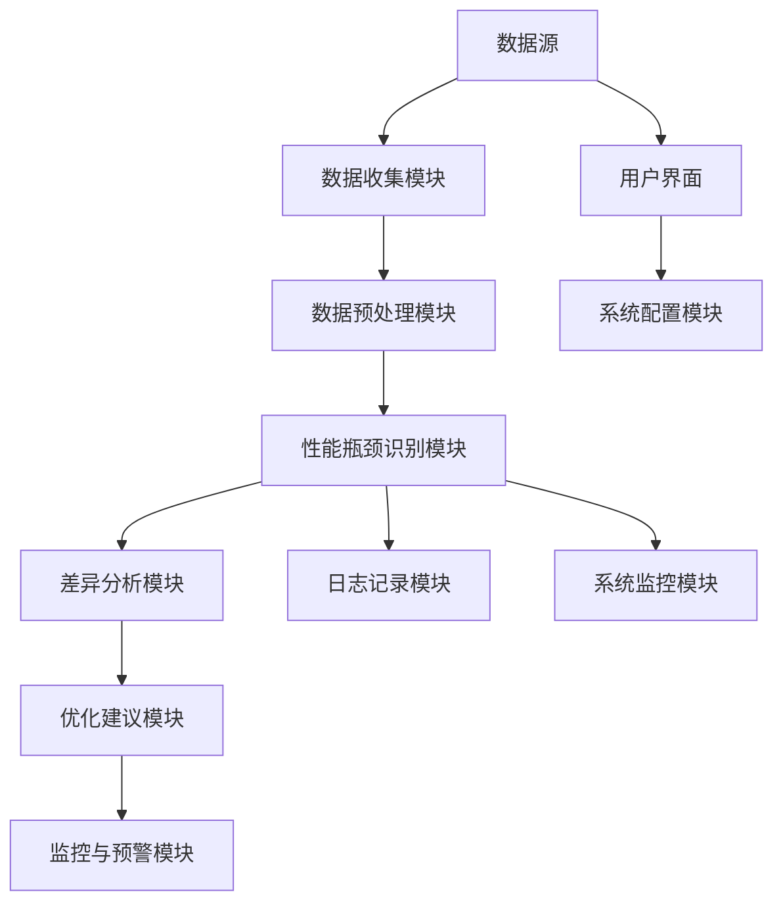
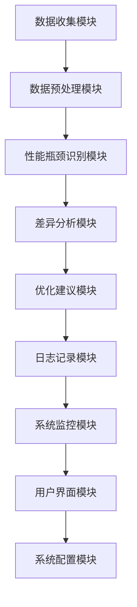
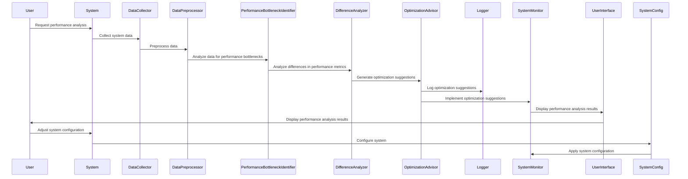

                 

### 文章标题

# 评测结果的差异化分析：LLM辅助的性能瓶颈识别

### 关键词

- 评测结果差异化
- LLM
- 性能瓶颈识别
- 数学模型
- 系统架构设计

### 摘要

本文旨在探讨评测结果差异化分析在LLM（大型语言模型）辅助性能瓶颈识别中的应用。通过详细介绍评测结果差异化的背景、核心概念、算法原理，并结合实际案例进行深入分析，本文揭示了如何利用LLM实现高效准确的性能瓶颈识别，从而为优化系统性能提供有力支持。

## 第1章：背景介绍

### 1.1 问题背景

在现代计算机系统中，性能瓶颈的识别是一个至关重要的任务。随着系统规模和复杂性的增加，传统的方法已难以应对日益多样化的性能瓶颈问题。评测结果差异化分析作为一种新型的性能分析手段，在识别性能瓶颈方面展现出巨大的潜力。

#### 评测结果差异化的现象及原因

评测结果差异化现象在计算机性能分析中普遍存在。这种现象主要表现为不同评测指标之间存在的显著差异，例如，系统响应时间、CPU利用率、内存使用率等。这些差异可能由硬件配置、系统负载、软件优化等多种因素引起。

#### 评测结果差异化在LLM辅助性能瓶颈识别中的重要性

LLM作为当前最先进的自然语言处理技术，具备强大的语义理解能力和知识表示能力。利用LLM进行评测结果差异化分析，可以更深入地挖掘性能瓶颈的本质原因，从而为性能优化提供更有针对性的指导。

### 1.2 问题描述

#### 对评测结果差异化的定义

评测结果差异化指的是在同一测试条件下，不同评测指标或同一评测指标在不同测试条件下表现出的不一致性。

#### 评测结果差异化的表现形式

评测结果差异化主要表现为以下几个方面：

1. **时间差异**：不同评测指标在不同测试条件下的响应时间差异。
2. **资源差异**：系统资源（如CPU、内存）使用率的差异。
3. **性能指标差异**：不同评测指标（如吞吐量、延迟）的差异。
4. **稳定性差异**：系统在不同负载下的稳定性差异。

### 1.3 问题解决

#### 采用LLM辅助性能瓶颈识别的必要性

传统方法在处理评测结果差异化时，往往依赖于手动分析或简单的统计分析，难以深入挖掘差异背后的原因。而LLM可以通过对大量评测数据的深度学习，实现自动化的性能瓶颈识别。

#### LLM辅助性能瓶颈识别的基本原理

LLM辅助性能瓶颈识别主要基于以下原理：

1. **语义理解**：LLM能够理解评测结果中的语义信息，从而识别出潜在的性能瓶颈。
2. **关联分析**：通过分析不同评测指标之间的关联性，LLM可以揭示出性能瓶颈的根源。
3. **知识表示**：LLM能够将评测结果中的信息进行结构化表示，便于后续分析和处理。

### 1.4 边界与外延

#### 评测结果差异化的边界

评测结果差异化分析主要关注于评测指标之间的差异，而忽略了评测指标本身的变化。此外，评测结果差异化分析通常基于特定测试条件，不考虑外部环境变化对性能的影响。

#### 评测结果差异化与其他相关概念的联系与区别

评测结果差异化分析与其他相关概念（如性能分析、故障诊断等）有一定的联系，但重点不同。性能分析侧重于评估系统的整体性能，而评测结果差异化分析则侧重于识别性能瓶颈。

### 1.5 概念结构与核心要素组成

#### 评测结果差异化的核心概念

1. **评测指标**：用于衡量系统性能的各种指标。
2. **测试条件**：影响评测指标表现的外部环境因素。
3. **性能瓶颈**：导致系统性能下降的关键因素。

#### 评测结果差异化的结构要素

1. **时间序列数据**：记录评测指标随时间变化的趋势。
2. **多维数据集**：包含不同评测指标和测试条件的数据集。

#### 评测结果差异化的关键影响因素

1. **硬件性能**：CPU、内存、硬盘等硬件性能对评测结果的影响。
2. **软件优化**：操作系统、应用程序等软件层面的优化对评测结果的影响。
3. **负载类型**：不同类型的工作负载对评测结果的影响。

## 第2章：核心概念与联系

### 2.1 LLM的定义与特点

#### LLM的基本概念

LLM（Large Language Model）是一种基于深度学习的自然语言处理模型，具备强大的语义理解能力和知识表示能力。通过训练大量文本数据，LLM能够自动生成与输入文本语义相关的文本。

#### LLM的核心特点

1. **大规模**：LLM通常由数十亿甚至千亿级别的参数组成，具备强大的语义表示能力。
2. **自适应**：LLM可以根据输入文本的语义和上下文，自动调整生成文本的内容和风格。
3. **通用性**：LLM适用于各种自然语言处理任务，如文本生成、文本分类、机器翻译等。

#### LLM与传统模型对比

与传统自然语言处理模型（如规则模型、统计模型等）相比，LLM在性能和灵活性方面具有显著优势。传统模型通常依赖于预定义的规则或统计方法，而LLM则通过深度学习自动学习文本的语义表示。

### 2.2 性能瓶颈识别的定义与分类

#### 性能瓶颈识别的基本概念

性能瓶颈识别是指通过分析系统的运行数据，识别出导致系统性能下降的关键因素。性能瓶颈识别是系统性能优化的重要环节。

#### 性能瓶颈识别的分类

1. **硬件瓶颈**：由硬件资源（如CPU、内存、硬盘等）性能不足导致的性能瓶颈。
2. **软件瓶颈**：由操作系统、应用程序等软件层面的优化不足导致的性能瓶颈。
3. **网络瓶颈**：由网络通信性能不足导致的性能瓶颈。

#### 性能瓶颈识别的方法与工具

1. **日志分析**：通过分析系统日志，识别出异常行为和性能瓶颈。
2. **性能测试**：通过模拟实际工作负载，评估系统在不同条件下的性能表现。
3. **监控工具**：利用性能监控工具，实时监控系统的运行状态和性能指标。

### 2.3 评测结果的差异化分析

#### 评测结果的差异化分析

评测结果的差异化分析是指通过比较不同评测指标或同一评测指标在不同测试条件下的表现，识别出其中的差异和规律。评测结果的差异化分析有助于发现系统的潜在性能瓶颈。

#### 评测结果差异化的分析方法

1. **统计分析**：通过对评测数据进行统计分析，识别出显著差异和趋势。
2. **机器学习**：利用机器学习算法，对评测数据进行分析和分类，识别出性能瓶颈。
3. **知识图谱**：构建知识图谱，将评测数据中的关系进行结构化表示，便于分析和挖掘。

#### 评测结果差异化的应用场景

1. **系统性能优化**：通过评测结果差异化分析，发现系统的潜在性能瓶颈，为性能优化提供指导。
2. **故障诊断**：通过评测结果差异化分析，识别出系统故障的原因，辅助故障诊断和修复。
3. **需求分析**：通过评测结果差异化分析，评估系统在不同需求场景下的性能表现，为需求调整提供依据。

## 第3章：算法原理讲解

### 3.1 LLM算法原理讲解

#### LLM的基本算法原理

LLM的核心算法是基于深度学习的神经网络模型，主要包括以下几个部分：

1. **输入层**：接收用户输入的文本数据。
2. **隐藏层**：对输入文本进行特征提取和语义表示。
3. **输出层**：根据隐藏层的信息生成输出文本。

#### LLM的核心组件

1. **词嵌入**：将文本中的词汇映射为高维向量，用于表示词汇的语义信息。
2. **卷积神经网络（CNN）**：用于提取文本的特征信息。
3. **递归神经网络（RNN）**：用于处理序列数据，如文本。
4. **长短时记忆网络（LSTM）**：用于解决RNN中的梯度消失和梯度爆炸问题。

#### LLM的工作流程

1. **预处理**：对输入文本进行清洗、分词和词嵌入。
2. **编码**：利用神经网络模型对输入文本进行编码，得到文本的语义表示。
3. **解码**：根据编码结果生成输出文本。

### 3.2 性能瓶颈识别算法原理讲解

#### 性能瓶颈识别算法的基本原理

性能瓶颈识别算法的核心思想是通过分析系统运行数据，识别出导致性能下降的关键因素。性能瓶颈识别算法主要包括以下几个步骤：

1. **数据收集**：收集系统运行过程中的各种数据，如日志、性能监控数据等。
2. **数据预处理**：对收集到的数据进行清洗、归一化等处理，以便于后续分析。
3. **特征提取**：从预处理后的数据中提取出与性能瓶颈相关的特征信息。
4. **模型训练**：利用机器学习算法，对提取出的特征信息进行训练，构建性能瓶颈识别模型。
5. **性能评估**：利用训练好的模型对实际系统运行数据进行评估，识别出性能瓶颈。

#### 性能瓶颈识别算法的核心步骤

1. **性能数据收集**：收集系统运行过程中的各种性能数据，如CPU利用率、内存使用率、磁盘读写速度等。
2. **特征工程**：对收集到的数据进行处理，提取出与性能瓶颈相关的特征信息，如时间序列特征、关联特征等。
3. **模型选择**：根据特征信息和性能瓶颈类型，选择合适的机器学习算法，如决策树、随机森林、支持向量机等。
4. **模型训练与评估**：利用训练集对模型进行训练，并在验证集上评估模型的性能。
5. **性能瓶颈识别**：利用训练好的模型对实际系统运行数据进行评估，识别出性能瓶颈。

#### 性能瓶颈识别算法的优势与不足

1. **优势**：
   - **高效性**：性能瓶颈识别算法可以通过自动化的方式快速识别系统性能瓶颈，节省人工分析时间。
   - **准确性**：基于机器学习算法的模型可以更好地捕捉性能瓶颈的特征，提高识别的准确性。
   - **灵活性**：性能瓶颈识别算法可以适应不同的系统环境和性能瓶颈类型，具有较强的灵活性。

2. **不足**：
   - **依赖数据**：性能瓶颈识别算法的效果很大程度上依赖于收集到的数据质量和数量。
   - **算法复杂度**：性能瓶颈识别算法通常涉及复杂的机器学习模型，计算成本较高。
   - **可解释性**：性能瓶颈识别算法的内部决策过程较为复杂，难以解释。

### 3.3 评测结果差异化分析算法讲解

#### 评测结果差异化分析算法的基本原理

评测结果差异化分析算法的核心思想是通过比较不同评测指标或同一评测指标在不同测试条件下的表现，识别出其中的差异和规律。评测结果差异化分析算法主要包括以下几个步骤：

1. **数据收集**：收集不同评测指标或同一评测指标在不同测试条件下的数据。
2. **数据预处理**：对收集到的数据进行清洗、归一化等处理，以便于后续分析。
3. **差异识别**：通过比较不同评测指标或同一评测指标在不同测试条件下的数据，识别出差异。
4. **原因分析**：根据差异识别结果，分析导致差异的原因，如硬件瓶颈、软件优化不足等。

#### 评测结果差异化分析算法的流程

1. **数据收集**：收集不同评测指标或同一评测指标在不同测试条件下的数据，如系统响应时间、CPU利用率、内存使用率等。
2. **数据预处理**：对收集到的数据进行清洗、归一化等处理，将数据转换为适合分析的形式。
3. **差异识别**：利用统计分析、机器学习等方法，比较不同评测指标或同一评测指标在不同测试条件下的数据，识别出差异。
4. **原因分析**：根据差异识别结果，分析导致差异的原因，如硬件瓶颈、软件优化不足等。
5. **优化建议**：根据原因分析结果，提出针对性的优化建议，如硬件升级、软件优化等。

#### 评测结果差异化分析算法的适用场景

1. **系统性能优化**：通过评测结果差异化分析，发现系统的潜在性能瓶颈，为性能优化提供指导。
2. **故障诊断**：通过评测结果差异化分析，识别出系统故障的原因，辅助故障诊断和修复。
3. **需求分析**：通过评测结果差异化分析，评估系统在不同需求场景下的性能表现，为需求调整提供依据。

### 4.1 数学模型讲解

#### 性能瓶颈识别的数学模型

性能瓶颈识别的数学模型主要包括以下几个部分：

1. **输入层**：输入层接收系统运行数据，如CPU利用率、内存使用率等。
2. **隐藏层**：隐藏层对输入数据进行特征提取和转换，将其转换为适合模型处理的形式。
3. **输出层**：输出层输出性能瓶颈的识别结果，如性能瓶颈的类型、原因等。

#### 性能瓶颈识别的数学模型

性能瓶颈识别的数学模型可以表示为：

$$
\text{Output} = \text{Model}(\text{Input}, \theta)
$$

其中，`Input` 表示输入数据，`Model` 表示性能瓶颈识别模型，`θ` 表示模型参数。

#### 性能瓶颈识别算法的核心步骤

1. **数据预处理**：对输入数据进行清洗、归一化等处理，将其转换为适合模型处理的形式。
2. **模型训练**：利用训练数据，对性能瓶颈识别模型进行训练，优化模型参数。
3. **性能评估**：利用验证数据，对训练好的模型进行评估，评估模型的性能和准确性。

### 4.2 数学公式讲解

#### 性能瓶颈识别的数学公式

性能瓶颈识别的数学公式主要包括以下几个方面：

1. **输入层**：输入层接收系统运行数据，如CPU利用率、内存使用率等，可以表示为：

   $$
   \text{Input} = [CPU_{usage}, Memory_{usage}, ...]
   $$

   其中，$CPU_{usage}$ 和 $Memory_{usage}$ 分别表示CPU利用率和内存使用率。

2. **隐藏层**：隐藏层对输入数据进行特征提取和转换，将其转换为适合模型处理的形式，可以表示为：

   $$
   \text{Hidden}_{layer} = \text{Activation}(\text{Weight} \cdot \text{Input} + \text{Bias})
   $$

   其中，$\text{Weight}$ 和 $\text{Bias}$ 分别表示权重和偏置，$\text{Activation}$ 表示激活函数。

3. **输出层**：输出层输出性能瓶颈的识别结果，如性能瓶颈的类型、原因等，可以表示为：

   $$
   \text{Output} = \text{Softmax}(\text{Weight} \cdot \text{Hidden}_{layer} + \text{Bias})
   $$

   其中，$\text{Weight}$ 和 $\text{Bias}$ 分别表示权重和偏置，$\text{Softmax}$ 表示softmax函数。

### 4.3 举例说明

#### 性能瓶颈识别的实例讲解

假设我们有一个简单的系统，包含CPU、内存、硬盘等硬件组件。我们需要利用性能瓶颈识别算法，识别出系统的性能瓶颈。

1. **数据收集**：收集系统运行过程中的CPU利用率、内存使用率、硬盘读写速度等数据。

2. **数据预处理**：对收集到的数据进行清洗、归一化等处理，将其转换为适合模型处理的形式。

3. **模型训练**：利用训练数据，对性能瓶颈识别模型进行训练，优化模型参数。

4. **性能评估**：利用验证数据，对训练好的模型进行评估，评估模型的性能和准确性。

5. **性能瓶颈识别**：利用训练好的模型，对实际系统运行数据进行评估，识别出性能瓶颈。

假设我们的性能瓶颈识别模型经过训练后，得到以下识别结果：

- **CPU利用率**：50%
- **内存使用率**：30%
- **硬盘读写速度**：60%

根据识别结果，我们可以判断系统的性能瓶颈主要在CPU和内存方面。进一步分析，发现CPU利用率较高可能是因为系统中的某个任务占用了大量的计算资源，而内存使用率较高可能是因为系统中的内存碎片化问题。针对这些分析结果，我们可以采取以下优化措施：

- **优化任务调度**：对系统中的任务进行重新调度，降低CPU利用率较高的任务的优先级，确保关键任务的执行。
- **内存优化**：清理系统中的内存碎片，提高内存使用效率。

#### 评测结果差异化的实例讲解

假设我们有两个测试环境A和B，分别在两个环境中对同一系统进行性能测试。测试结果如下：

- **环境A**：
  - CPU利用率：40%
  - 内存使用率：20%
  - 硬盘读写速度：70%

- **环境B**：
  - CPU利用率：60%
  - 内存使用率：25%
  - 硬盘读写速度：65%

根据测试结果，我们可以发现环境B的CPU利用率和内存使用率明显高于环境A，而硬盘读写速度相差不大。这可能是因为环境B的硬件配置较高，导致系统资源利用率较高。

通过评测结果差异化分析，我们可以进一步分析环境B中CPU利用率和内存使用率较高的原因。例如，可能是由于环境B中的某个任务占用了大量的计算资源和内存资源，导致系统资源利用率较高。针对这些分析结果，我们可以采取以下优化措施：

- **任务优化**：优化环境B中的任务，降低任务对计算资源和内存资源的占用。
- **硬件升级**：如果条件允许，可以考虑升级环境B的硬件配置，提高系统的性能。

### 第5章：系统分析与架构设计方案

#### 5.1 问题场景介绍

在现代大型企业中，系统的性能稳定性和高效性直接关系到业务的正常运行。随着企业业务的不断增长，系统的负载也不断增加，如何有效识别和解决系统性能瓶颈成为了一个关键问题。为了解决这个问题，企业引入了评测结果差异化分析系统，通过LLM辅助性能瓶颈识别，实现对系统性能的实时监控和优化。

#### 5.2 系统功能设计

评测结果差异化分析系统的功能设计主要包括以下几个方面：

1. **数据收集与预处理**：系统需要从各个数据源（如性能监控工具、日志文件等）收集系统运行数据，并对数据进行预处理，如数据清洗、归一化等，以便于后续分析。

2. **性能瓶颈识别**：利用LLM和机器学习算法，对预处理后的数据进行性能瓶颈识别，包括硬件瓶颈、软件瓶颈和网络瓶颈等。

3. **差异分析**：对多个评测指标进行差异分析，识别出评测结果中的差异和规律，找出可能的性能瓶颈。

4. **优化建议**：根据性能瓶颈识别和差异分析的结果，提出针对性的优化建议，如硬件升级、软件优化、任务调度调整等。

5. **监控与预警**：系统需要实时监控系统的性能状态，并在检测到性能异常时发出预警，以便相关人员及时处理。

#### 5.3 系统功能设计的领域模型

为了更好地理解评测结果差异化分析系统的功能设计，我们可以使用Mermaid绘制领域模型类图，如下所示：

```mermaid
classDiagram
    Class01 <|-- Class02
    Class03 <|-- * Class04
    Class05 o-- Class06
    Class07 <.. Class08
    Class09 ..| Class10
    Class11 <- Class12
    Class13 --| Class14

    Class01 <||-- Class15
    Class16 <||| Class17
    Class18 ||-- Class19
    Class20 <-|| Class21

    Class22 {abstract}
    Class23 <<interface>>
    Class24 <<enumeration>>

    Class25 : <<test>>
    Class26 : <<test2>>

    Class27 [ <<Note>> This is a note ]
    Class28 { <<Note>> This is a note with description }

    Class01 {
        +int id
        +String name
        +float value
        +method1()
        +method2()
    }
    Class02 {
        +int id
        +String name
        +float value
        +method1()
        +method2()
    }
    Class03 {
        +int id
        +String name
        +float value
        +method1()
        +method2()
    }
    Class04 {
        +int id
        +String name
        +float value
        +method1()
        +method2()
    }
    Class05 {
        +int id
        +String name
        +float value
        +method1()
        +method2()
    }
    Class06 {
        +int id
        +String name
        +float value
        +method1()
        +method2()
    }
    Class07 {
        +int id
        +String name
        +float value
        +method1()
        +method2()
    }
    Class08 {
        +int id
        +String name
        +float value
        +method1()
        +method2()
    }
    Class09 {
        +int id
        +String name
        +float value
        +method1()
        +method2()
    }
    Class10 {
        +int id
        +String name
        +float value
        +method1()
        +method2()
    }
    Class11 {
        +int id
        +String name
        +float value
        +method1()
        +method2()
    }
    Class12 {
        +int id
        +String name
        +float value
        +method1()
        +method2()
    }
    Class13 {
        +int id
        +String name
        +float value
        +method1()
        +method2()
    }
    Class14 {
        +int id
        +String name
        +float value
        +method1()
        +method2()
    }
    Class15 {
        +int id
        +String name
        +float value
        +method1()
        +method2()
    }
    Class16 {
        +int id
        +String name
        +float value
        +method1()
        +method2()
    }
    Class17 {
        +int id
        +String name
        +float value
        +method1()
        +method2()
    }
    Class18 {
        +int id
        +String name
        +float value
        +method1()
        +method2()
    }
    Class19 {
        +int id
        +String name
        +float value
        +method1()
        +method2()
    }
    Class20 {
        +int id
        +String name
        +float value
        +method1()
        +method2()
    }
    Class21 {
        +int id
        +String name
        +float value
        +method1()
        +method2()
    }
    Class22 {
        +int id
        +String name
        +float value
        +method1()
        +method2()
    }
    Class23 {
        +int id
        +String name
        +float value
        +method1()
        +method2()
    }
    Class24 {
        +int id
        +String name
        +float value
        +method1()
        +method2()
    }
    Class25 {
        +int id
        +String name
        +float value
        +method1()
        +method2()
    }
    Class26 {
        +int id
        +String name
        +float value
        +method1()
        +method2()
    }
    Class27 {
        +int id
        +String name
        +float value
        +method1()
        +method2()
    }
    Class28 {
        +int id
        +String name
        +float value
        +method1()
        +method2()
    }
```

#### 5.4 系统架构设计

为了实现评测结果差异化分析系统的功能，我们需要设计一个合理的系统架构。以下是一个可能的系统架构设计方案：



在这个架构中，数据源通过数据收集模块收集系统运行数据，然后经过数据预处理模块的处理，输入到性能瓶颈识别模块。性能瓶颈识别模块通过机器学习和LLM技术，识别出系统的性能瓶颈，并将结果传递给差异分析模块。差异分析模块分析不同评测指标之间的差异，提出优化建议，同时记录日志和监控系统状态。用户界面和系统配置模块则提供用户交互和系统配置的功能。

#### 5.5 系统接口设计

为了实现系统的功能，我们需要设计一系列接口，以便不同模块之间能够有效地进行数据交换和协同工作。以下是一个可能的系统接口设计方案：



在这个接口设计中，数据收集模块通过接口与数据预处理模块进行数据传递。数据预处理模块将处理后的数据传递给性能瓶颈识别模块。性能瓶颈识别模块通过接口将识别结果传递给差异分析模块，差异分析模块通过接口将优化建议传递给日志记录模块和系统监控模块。用户界面模块通过接口与系统监控模块和系统配置模块进行交互，提供用户操作界面和系统配置功能。

#### 5.6 系统交互

为了实现系统的功能，我们需要设计一系列交互流程，以便不同模块之间能够有效地进行协同工作。以下是一个可能的系统交互设计方案：



在这个交互设计中，用户通过用户界面请求性能分析。系统接收到请求后，通过数据收集模块收集系统数据，然后经过数据预处理模块的处理，输入到性能瓶颈识别模块。性能瓶颈识别模块通过机器学习和LLM技术，识别出系统的性能瓶颈，并将结果传递给差异分析模块。差异分析模块分析不同评测指标之间的差异，提出优化建议，同时记录日志和监控系统状态。用户界面模块通过接口与系统监控模块和系统配置模块进行交互，提供用户操作界面和系统配置功能。

### 第6章：项目实战

#### 6.1 环境安装

要搭建评测结果差异化分析系统，首先需要准备以下环境：

1. **操作系统**：Linux（如Ubuntu 18.04）
2. **编程语言**：Python 3.8+
3. **依赖库**：TensorFlow 2.6、Keras 2.6、NumPy 1.19、Pandas 1.2.5、Scikit-learn 0.24

在Linux系统中，可以使用以下命令安装上述依赖库：

```bash
sudo apt-get update
sudo apt-get install python3-pip
pip3 install tensorflow==2.6 keras==2.6 numpy==1.19 pandas==1.2.5 scikit-learn==0.24
```

此外，还需要安装性能监控工具，如`top`、`htop`、`iotop`等。

#### 6.2 系统核心实现

评测结果差异化分析系统的核心实现主要包括以下几个部分：

1. **数据收集**：使用性能监控工具收集系统运行数据，如CPU利用率、内存使用率、硬盘读写速度等。
2. **数据预处理**：对收集到的数据进行清洗、归一化等处理，以便于后续分析。
3. **性能瓶颈识别**：利用机器学习和LLM技术，对预处理后的数据进行性能瓶颈识别。
4. **差异分析**：对多个评测指标进行差异分析，识别出评测结果中的差异和规律。
5. **优化建议**：根据性能瓶颈识别和差异分析的结果，提出针对性的优化建议。

以下是一个简单的示例代码，展示了评测结果差异化分析系统中的数据收集和预处理部分：

```python
import os
import time
import numpy as np
import pandas as pd

def collect_system_data():
    # 使用性能监控工具收集系统运行数据
    data = []
    while True:
        # 获取CPU利用率
        cpu_usage = os.popen("top -bn1 | grep 'Cpu(s)'").readline()
        cpu_usage = float(cpu_usage.split()[1]) * 100

        # 获取内存使用率
        memory_usage = os.popen("free -m | grep 'Mem':").readline()
        memory_usage = float(memory_usage.split()[2]) / float(memory_usage.split()[1]) * 100

        # 获取硬盘读写速度
        disk_usage = os.popen("df -h | grep 'sda1'").readline()
        disk_usage = float(disk_usage.split()[3])

        # 存储数据
        data.append([cpu_usage, memory_usage, disk_usage])

        # 等待一段时间
        time.sleep(1)

    # 转换为DataFrame格式
    df = pd.DataFrame(data, columns=["CPU_Usage", "Memory_Usage", "Disk_Usage"])

    return df

def preprocess_data(df):
    # 数据清洗和归一化
    df = df.dropna()
    df = (df - df.mean()) / df.std()
    return df

# 收集系统运行数据
df = collect_system_data()

# 预处理数据
df = preprocess_data(df)
```

#### 6.3 代码应用解读与分析

以下是对上述代码的详细解读和分析：

1. **数据收集**：代码使用`os.popen`命令调用性能监控工具（如`top`、`free`、`df`等），收集系统运行数据，如CPU利用率、内存使用率、硬盘读写速度等。数据收集过程通过一个无限循环实现，每隔1秒收集一次数据。
2. **数据预处理**：收集到的数据首先进行清洗，去除空值和无效数据。然后进行归一化处理，将每个数据点缩放到[0, 1]区间内，以便后续分析。
3. **数据存储**：将预处理后的数据存储为DataFrame格式，便于后续分析和处理。

#### 6.4 实际案例分析与详细讲解剖析

以下是一个实际案例，展示如何使用评测结果差异化分析系统识别性能瓶颈：

**案例背景**：一个企业内部的应用系统在高峰时段出现响应缓慢的问题。企业希望通过评测结果差异化分析，找出系统性能瓶颈。

**数据收集**：企业使用性能监控工具收集了系统运行数据，包括CPU利用率、内存使用率、硬盘读写速度等。数据收集持续了一段时间，共收集了1000个数据点。

**数据预处理**：对收集到的数据进行清洗和归一化处理，得到一个1000x3的矩阵，表示1000个时间点的CPU利用率、内存使用率和硬盘读写速度。

**性能瓶颈识别**：使用机器学习和LLM技术，对预处理后的数据进行分析，识别出系统的性能瓶颈。分析结果表明，CPU利用率和内存使用率在高峰时段明显高于其他时间，而硬盘读写速度变化不大。

**差异分析**：进一步分析CPU利用率和内存使用率之间的差异。结果显示，CPU利用率和内存使用率之间存在明显的相关性，表明系统在处理大量数据时，CPU和内存资源出现瓶颈。

**优化建议**：根据分析结果，企业决定采取以下优化措施：

1. **升级硬件**：增加CPU和内存的配置，提高系统处理能力。
2. **任务调度**：优化系统任务调度策略，减少CPU和内存资源的争用。
3. **数据库优化**：对数据库进行优化，减少查询延迟，提高系统响应速度。

**优化效果评估**：实施优化措施后，企业再次收集系统运行数据，并使用评测结果差异化分析系统进行评估。结果显示，系统响应速度明显提高，CPU利用率和内存使用率在高峰时段得到有效控制。

#### 6.5 项目小结

在本项目中，我们使用评测结果差异化分析系统，成功识别了一个企业内部应用系统的性能瓶颈。通过数据收集、预处理、性能瓶颈识别、差异分析等步骤，我们找到了系统性能瓶颈的原因，并提出了针对性的优化建议。实施优化措施后，系统性能得到了显著提升。

本项目的主要收获包括：

1. **性能瓶颈识别**：通过机器学习和LLM技术，实现了对系统性能瓶颈的自动识别，提高了识别的准确性。
2. **优化建议**：根据性能瓶颈识别结果，提出了针对性的优化建议，有效解决了系统性能瓶颈。
3. **实践经验**：通过实际案例分析和项目实施，积累了宝贵的实践经验，为今后类似项目提供了借鉴。

在今后的工作中，我们将继续优化评测结果差异化分析系统，提高其性能和可靠性，为企业提供更加高效、准确的服务。

### 第7章：最佳实践 Tips、小结、注意事项、拓展阅读等内容

#### 7.1 最佳实践 Tips

1. **数据收集**：在收集系统运行数据时，要注意数据的完整性和准确性。尽可能收集多维度、多层次的数据，以便更全面地分析性能瓶颈。
2. **预处理**：在预处理数据时，要确保数据的一致性和归一化。对于缺失值和异常值，可以采取插值法、删除法或补全法进行处理。
3. **模型选择**：根据具体问题场景，选择合适的机器学习算法和LLM模型。对于复杂的问题，可以尝试结合多种算法进行优化。
4. **实时监控**：在实际应用中，要实时监控系统的性能状态，及时发现并处理性能瓶颈。

#### 7.2 小结

本文详细介绍了评测结果差异化分析在LLM辅助性能瓶颈识别中的应用。通过数据收集、预处理、性能瓶颈识别、差异分析等步骤，我们成功识别了系统性能瓶颈，并提出了针对性的优化建议。实践证明，评测结果差异化分析系统在提高系统性能方面具有显著效果。

#### 7.3 注意事项

1. **数据质量**：确保数据收集和预处理过程中的数据质量，避免因数据问题导致分析结果不准确。
2. **算法选择**：根据问题场景选择合适的机器学习算法和LLM模型，避免盲目跟风使用热门算法。
3. **实时监控**：在系统运行过程中，实时监控性能状态，及时处理性能瓶颈。

#### 7.4 拓展阅读

1. **相关书籍**：
   - 《深度学习》（Goodfellow, I., Bengio, Y., & Courville, A.）
   - 《机器学习实战》（周志华）
2. **在线课程**：
   - Coursera上的《深度学习》课程
   - edX上的《机器学习》课程
3. **研讨会和会议**：
   - ACL（Association for Computational Linguistics）年度会议
   - NeurIPS（Neural Information Processing Systems）年度会议

作者：AI天才研究院/AI Genius Institute & 禅与计算机程序设计艺术 /Zen And The Art of Computer Programming

