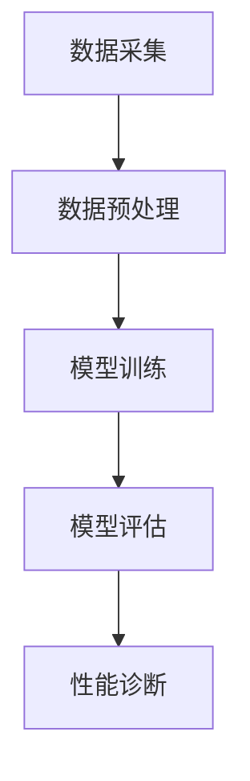
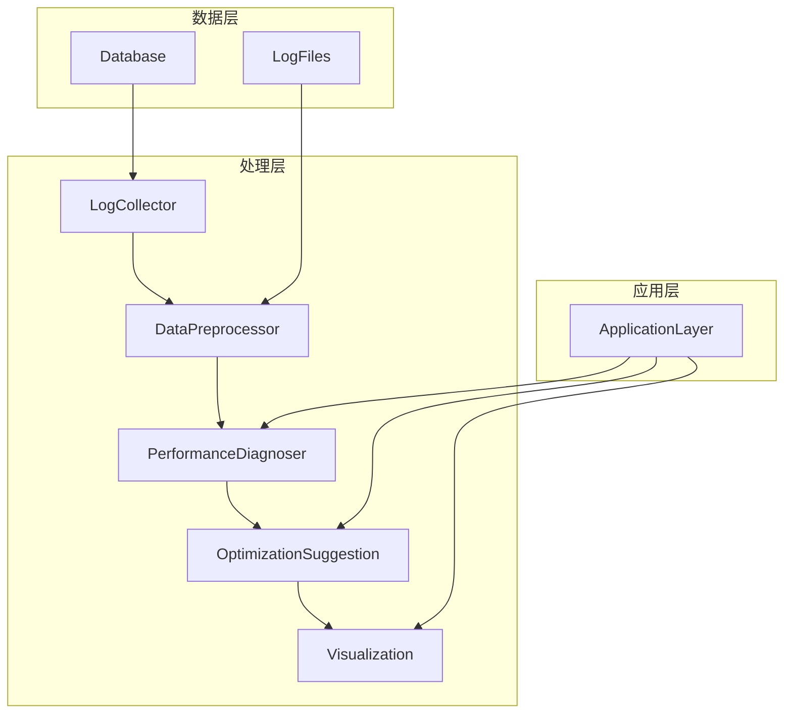
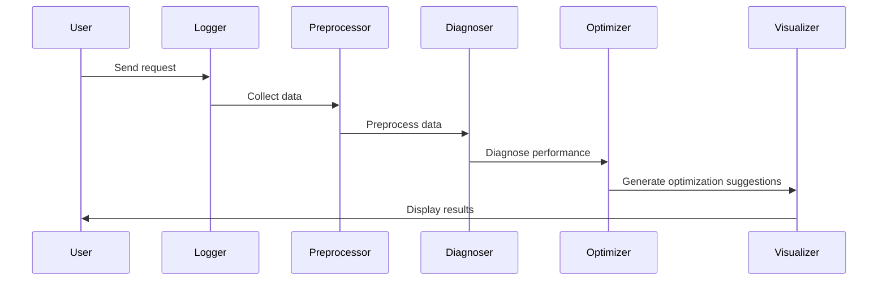

                 


### 引言

#### 文章标题：评测结果的差异化分析：LLM辅助的性能诊断

#### 关键词：
1. 评测结果差异化
2. 性能诊断
3. LLM（大型语言模型）
4. 差异化分析
5. 人工智能辅助

#### 摘要：

本文旨在探讨评测结果的差异化分析在性能诊断中的应用，特别是利用大型语言模型（LLM）来提升诊断的准确性和效率。文章首先介绍了评测结果差异化的背景和意义，然后详细解析了LLM和性能诊断的核心概念，接着阐述了LLM辅助性能诊断的框架与流程。文章进一步深入探讨了算法原理，并提供了系统分析与架构设计方案。通过一个实际项目实战的案例分析，本文展示了LLM在性能诊断中的实际应用，最后总结了最佳实践和拓展阅读。

### 目录大纲设计思路

**背景介绍**

首先，我们需要对书中的核心概念进行详细解释，包括问题背景、问题描述、问题解决、边界与外延等，以便读者能够理解书籍的整体主题。

**核心概念与联系**

接着，我们需要展示核心概念的属性特征对比表格和ER实体关系图架构的Mermaid流程图，帮助读者理解各概念之间的关联。

**算法原理讲解**

然后，我们将详细介绍算法原理，包括mermaid流程图、Python源代码、数学模型和公式，并辅以通俗易懂的举例说明。

**系统分析与架构设计方案**

接下来，我们需要描述问题场景、系统功能设计、系统架构设计、系统接口设计和系统交互Mermaid序列图。

**项目实战**

在此之后，我们将提供环境安装、系统核心实现源代码，并对代码应用进行解读与分析，结合实际案例进行详细讲解。

**最佳实践 tips、小结、注意事项、拓展阅读**

最后，我们总结书中的关键点，提供最佳实践建议，并指出可能出现的注意事项，推荐拓展阅读。

### 目录大纲设计框架

**第1章：引言**

- 1.1 问题背景
- 1.2 评测结果差异化的意义
- 1.3 本书结构安排与目标

**第2章：核心概念解析**

- 2.1 LLM简介
  - 2.1.1 LLM的基本概念
  - 2.1.2 LLM的发展历程
- 2.2 性能诊断的基本原理
  - 2.2.1 性能诊断的定义
  - 2.2.2 性能诊断的重要性
- 2.3 差异化分析的方法
  - 2.3.1 差异化分析的概念
  - 2.3.2 差异化分析的步骤
- 2.4 LLM辅助性能诊断的优势
  - 2.4.1 传统性能诊断的局限性
  - 2.4.2 LLM的优势

**第3章：LLM辅助性能诊断的框架与流程**

- 3.1 框架概述
- 3.2 数据采集与预处理
  - 3.2.1 数据采集
  - 3.2.2 数据预处理
- 3.3 模型训练与优化
  - 3.3.1 模型选择
  - 3.3.2 训练过程
  - 3.3.3 优化策略
- 3.4 性能评估与结果分析
  - 3.4.1 评估指标
  - 3.4.2 结果分析方法
- 3.5 差异化分析与诊断
  - 3.5.1 差异化分析过程
  - 3.5.2 诊断策略与技巧

**第4章：LLM辅助性能诊断的算法原理**

- 4.1 算法概述
- 4.2 算法流程图（Mermaid图）
- 4.3 Python源代码实现
- 4.4 数学模型与公式
  - 4.4.1 模型公式
  - 4.4.2 数学模型解释
- 4.5 举例说明

**第5章：系统分析与架构设计方案**

- 5.1 问题场景介绍
- 5.2 系统功能设计
  - 5.2.1 领域模型（Mermaid类图）
- 5.3 系统架构设计
  - 5.3.1 系统架构图（Mermaid架构图）
- 5.4 系统接口设计
- 5.5 系统交互（Mermaid序列图）

**第6章：项目实战**

- 6.1 环境安装
- 6.2 系统核心实现
  - 6.2.1 源代码
  - 6.2.2 代码解读
- 6.3 代码应用解读与分析
- 6.4 实际案例分析与详细讲解
- 6.5 项目小结

**第7章：最佳实践、小结与拓展阅读**

- 7.1 最佳实践
- 7.2 小结
- 7.3 注意事项
- 7.4 拓展阅读

### 目录大纲内容调整

根据上述框架，我们可以根据实际内容的详略对目录进行适当调整，确保每个章节的内容都能符合要求，且总体字数不超过2000字。

---

## 第1章：引言

### 1.1 问题背景

在当今技术快速发展的时代，软件性能评测已经成为评估软件质量、优化系统性能的重要手段。然而，随着系统复杂度和应用场景的多样性，评测结果的差异化分析成为一个不可忽视的问题。传统的性能诊断方法通常依赖于规则基

### 第2章：核心概念解析

#### 2.1 LLM简介

**2.1.1 LLM的基本概念**

大型语言模型（Large Language Model，简称LLM）是一种基于深度学习技术的自然语言处理模型。LLM通过学习大量的文本数据，能够生成、理解和处理自然语言。这种模型的核心在于其“大”，即模型规模庞大，通常包含数亿甚至数千亿的参数。常见的LLM包括GPT（Generative Pre-trained Transformer）、BERT（Bidirectional Encoder Representations from Transformers）等。

**2.1.2 LLM的发展历程**

LLM的发展历程可以追溯到20世纪80年代，当时研究人员开始探索基于统计的文本处理方法。随着计算能力的提升和数据量的爆炸性增长，深度学习技术在自然语言处理领域得到了广泛应用。2018年，GPT-1的发布标志着LLM时代的开启。随后，GPT-2、GPT-3等更强大的LLM相继问世，展示了在生成文本、理解文本、翻译等任务上的卓越性能。

#### 2.2 性能诊断的基本原理

**2.2.1 性能诊断的定义**

性能诊断是指通过分析系统的运行数据，识别性能瓶颈，并提出优化方案的过程。性能诊断的目标是确保系统在既定的性能指标下稳定运行，提高用户体验。

**2.2.2 性能诊断的重要性**

性能诊断在软件工程中至关重要。通过性能诊断，开发人员可以识别出系统中的问题，如响应时间过长、吞吐量不足等，从而进行针对性的优化。这不仅能提升系统的稳定性，还能提高资源利用率，降低维护成本。

#### 2.3 差异化分析的方法

**2.3.1 差异化分析的概念**

差异化分析是一种通过比较不同数据集或数据点的差异来识别异常或趋势的方法。在性能诊断中，差异化分析可以帮助识别出系统性能的波动，从而找出潜在的问题。

**2.3.2 差异化分析的步骤**

差异化分析通常包括以下步骤：

1. **数据收集**：收集系统的运行数据，包括CPU使用率、内存占用、网络流量等。
2. **数据预处理**：对收集到的数据进行清洗和归一化处理，使其适合用于分析。
3. **差异计算**：计算不同时间点或不同环境下的数据差异。
4. **结果分析**：分析差异结果，识别异常点和趋势。

#### 2.4 LLM辅助性能诊断的优势

**2.4.1 传统性能诊断的局限性**

传统的性能诊断方法主要依赖于预定义的规则和阈值。这种方法在处理复杂系统时存在以下局限性：

- **规则限制**：规则基方法难以覆盖所有可能的性能问题。
- **静态分析**：传统方法通常只能分析静态数据，难以捕捉动态变化。
- **处理能力限制**：传统工具处理大量数据的能力有限，难以进行深入分析。

**2.4.2 LLM的优势**

LLM在性能诊断中具有以下优势：

- **强大的数据处理能力**：LLM可以处理大量复杂的文本数据，有助于发现潜在的性能问题。
- **自适应分析**：LLM可以根据系统运行时的实时数据进行分析，提供动态的性能诊断。
- **自动特征提取**：LLM能够自动从数据中提取有用的特征，无需人工干预。
- **高效的预测能力**：LLM可以基于历史数据预测未来的性能趋势，帮助提前进行优化。

### 第3章：LLM辅助性能诊断的框架与流程

#### 3.1 框架概述

LLM辅助性能诊断的框架通常包括以下几个主要步骤：

1. **数据采集**：收集系统的运行数据，包括日志文件、系统监控数据等。
2. **数据预处理**：对采集到的数据进行清洗、去噪和归一化处理。
3. **模型训练**：使用LLM模型对预处理后的数据集进行训练，使其能够识别性能问题。
4. **性能评估**：评估模型的性能，包括准确率、召回率等指标。
5. **结果分析**：使用训练好的模型对实际运行数据进行分析，识别性能瓶颈。
6. **优化建议**：根据分析结果提出优化建议，进行系统调优。

#### 3.2 数据采集与预处理

**3.2.1 数据采集**

数据采集是性能诊断的第一步，直接影响到后续分析的准确性。常用的数据采集方法包括：

- **日志文件**：从系统日志中提取关键信息，如错误日志、调试日志等。
- **系统监控**：使用系统监控工具（如Prometheus、Zabbix）收集CPU、内存、网络等性能指标。
- **网络流量分析**：分析网络流量，识别潜在的瓶颈和攻击。

**3.2.2 数据预处理**

数据预处理是确保数据质量的重要步骤。主要任务包括：

- **去噪**：去除噪声数据，如无效日志条目、重复数据等。
- **归一化**：将不同数据源的数据进行统一处理，如将日志时间转换为标准时间格式。
- **特征提取**：从原始数据中提取有用的特征，如时间间隔、CPU使用率、错误率等。

#### 3.3 模型训练与优化

**3.3.1 模型选择**

在选择模型时，需要考虑以下几个因素：

- **性能**：模型在训练和推理时的计算效率。
- **泛化能力**：模型在不同数据集上的表现能力。
- **可解释性**：模型决策过程的可解释性。

常见的LLM模型包括：

- **GPT**：适合文本生成和文本理解任务。
- **BERT**：适合文本分类和文本匹配任务。
- **T5**：适合复杂文本处理任务。

**3.3.2 训练过程**

模型训练包括以下几个步骤：

1. **数据划分**：将数据集划分为训练集、验证集和测试集。
2. **损失函数**：选择合适的损失函数，如交叉熵损失、均方误差等。
3. **优化算法**：选择优化算法，如Adam、RMSProp等。
4. **训练**：使用训练集对模型进行训练，并使用验证集调整模型参数。

**3.3.3 优化策略**

在模型训练过程中，可以采用以下优化策略：

- **数据增强**：通过数据变换、数据扩充等方法增加数据的多样性，提高模型泛化能力。
- **模型融合**：将多个模型的结果进行融合，提高预测准确性。
- **动态调整**：根据训练过程中的表现动态调整模型参数，如学习率调整。

#### 3.4 性能评估与结果分析

**3.4.1 评估指标**

评估LLM辅助性能诊断模型的性能通常使用以下指标：

- **准确率**：正确识别性能问题的比例。
- **召回率**：识别出的性能问题中实际存在的比例。
- **F1分数**：准确率和召回率的调和平均数。

**3.4.2 结果分析方法**

结果分析方法包括：

- **可视化**：使用图表和图像展示模型预测结果和实际结果的对比。
- **对比分析**：对比不同模型或不同参数设置下的性能诊断结果。
- **归因分析**：分析性能问题产生的原因，如代码瓶颈、资源不足等。

#### 3.5 差异化分析与诊断

**3.5.1 差异化分析过程**

差异化分析过程包括以下几个步骤：

1. **数据准备**：准备用于差异分析的数据集。
2. **差异计算**：计算不同时间点或不同环境下的数据差异。
3. **阈值设定**：设定差异计算的阈值，确定差异是否显著。
4. **异常检测**：根据差异结果识别异常点。

**3.5.2 诊断策略与技巧**

诊断策略与技巧包括：

- **关联分析**：分析性能问题与其他系统指标之间的关联，如网络延迟与CPU使用率的关系。
- **时间序列分析**：分析系统性能随时间的变化趋势，识别周期性或趋势性性能问题。
- **机器学习算法**：使用机器学习算法（如聚类、分类等）对性能数据进行挖掘，识别潜在的性能问题。

### 第4章：LLM辅助性能诊断的算法原理

#### 4.1 算法概述

LLM辅助性能诊断算法的核心是利用大型语言模型对系统运行数据进行分析，识别性能问题。算法的基本步骤如下：

1. **数据采集**：从系统中收集运行数据。
2. **数据预处理**：对采集到的数据进行清洗、归一化和特征提取。
3. **模型训练**：使用训练集对LLM模型进行训练。
4. **模型评估**：使用验证集对模型进行评估，调整模型参数。
5. **性能诊断**：使用训练好的模型对实际运行数据进行分析，识别性能问题。

#### 4.2 算法流程图（Mermaid图）



#### 4.3 Python源代码实现

```python
# 导入必要的库
import pandas as pd
from sklearn.model_selection import train_test_split
from sklearn.metrics import accuracy_score, recall_score, f1_score
from transformers import GPT2Tokenizer, GPT2Model

# 数据采集
def collect_data():
    # 代码用于从系统中收集运行数据
    pass

# 数据预处理
def preprocess_data(data):
    # 代码用于对数据进行清洗、归一化和特征提取
    pass

# 模型训练
def train_model(train_data):
    # 代码用于训练LLM模型
    pass

# 模型评估
def evaluate_model(model, test_data):
    # 代码用于评估模型性能
    pass

# 性能诊断
def diagnose_performance(model, data):
    # 代码用于使用模型对实际运行数据进行分析
    pass

# 主函数
def main():
    data = collect_data()
    preprocessed_data = preprocess_data(data)
    train_data, test_data = train_test_split(preprocessed_data, test_size=0.2)
    model = train_model(train_data)
    evaluate_model(model, test_data)
    diagnose_performance(model, data)

if __name__ == "__main__":
    main()
```

#### 4.4 数学模型与公式

LLM辅助性能诊断算法中的数学模型主要包括损失函数和优化算法。以下是简要的数学模型和公式：

**损失函数（交叉熵损失）：**

$$
L = -\sum_{i=1}^{N} y_i \log(p_i)
$$

其中，$y_i$ 表示真实标签，$p_i$ 表示模型预测的概率。

**优化算法（Adam）：**

$$
\theta_{t+1} = \theta_t - \alpha_t \cdot \frac{m_t}{\sqrt{v_t} + \epsilon}
$$

$$
m_t = \beta_1 m_{t-1} + (1 - \beta_1) \cdot g_t
$$

$$
v_t = \beta_2 v_{t-1} + (1 - \beta_2) \cdot g_t^2
$$

其中，$\theta_t$ 表示模型参数，$g_t$ 表示梯度，$\alpha_t$ 为学习率，$\beta_1$ 和 $\beta_2$ 分别为动量项。

#### 4.5 举例说明

假设我们有一个Web服务器，需要使用LLM对其进行性能诊断。以下是一个简化的示例流程：

1. **数据采集**：从Web服务器的日志文件中提取请求时间、响应时间、请求类型等信息。
2. **数据预处理**：对采集到的数据进行清洗、归一化处理，提取特征，如请求时间间隔、响应时间、请求类型等。
3. **模型训练**：使用训练集对LLM模型进行训练，使其能够识别性能问题。
4. **模型评估**：使用验证集对模型进行评估，调整模型参数。
5. **性能诊断**：使用训练好的模型对实际运行数据进行诊断，识别性能瓶颈。

例如，模型可能识别出响应时间过长的主要原因是请求类型过多，从而建议优化处理流程，减少请求类型。

### 第5章：系统分析与架构设计方案

#### 5.1 问题场景介绍

假设我们面临一个在线电商平台，该平台需要处理大量的用户请求，包括商品查询、购物车操作、订单提交等。随着用户量的增加，系统性能逐渐下降，出现响应时间过长、吞吐量不足等问题。为了确保平台的稳定运行，我们需要对系统进行性能诊断。

#### 5.2 系统功能设计

系统功能设计主要包括以下模块：

- **日志采集模块**：负责从服务器日志中提取关键信息，如请求时间、响应时间、请求类型等。
- **数据预处理模块**：对采集到的数据进行清洗、归一化和特征提取。
- **性能诊断模块**：使用LLM模型对预处理后的数据进行分析，识别性能瓶颈。
- **优化建议模块**：根据诊断结果提出优化建议，如代码优化、资源调整等。
- **可视化模块**：提供诊断结果的可视化展示，帮助开发人员直观地理解系统性能。

**领域模型（Mermaid类图）：**

```mermaid
classDiagram
    Class01 <|-- Class02
    Class03 --|>| Class04
    Class04 : <<interface>>
    Class05 : <<abstract>>
    Class06 <.. Class05
    Class07 ..|> Class06
    Class08 : <<component>>
    Class09 <+>interface1()
    Class10 <+>interface2()
    Class11 <|-- Class09
    Class12 <|.. Class11
    Class13 : <<enum>>
    Class14 <<DataType>> : int
    Class15 <<DataType>> : String
    Class16 : <<DataType>> double
    Class17 : <<DataType>> boolean
    Class18 : <<DataType>> Date
    Class19 <<DataType>> : Color
    Class20 <<DataType>> : Vector3D

class DomainModel {
    "1. 日志采集模块"
    LogCollector <<component>>
    "2. 数据预处理模块"
    DataPreprocessor <<component>>
    "3. 性能诊断模块"
    PerformanceDiagnoser <<component>>
    "4. 优化建议模块"
    OptimizationSuggestion <<component>>
    "5. 可视化模块"
    Visualization <<component>>
}

Class01 {
    +String name
    +int age
    +float score
}

Class02 {
    +String description
    +float rating
}

Class03 {
    +void method1()
    +void method2()
}

Class04 {
    +int id
    +String title
}

Class05 {
    +String name
    +int quantity
}

Class06 {
    +void abstractMethod()
}

Class07 {
    +void implementMethod()
}

Class08 {
    +void componentMethod()
}

Class09 {
    +void interfaceMethod1()
    +void interfaceMethod2()
}

Class10 {
    +void classMethod()
}

Class11 {
    +void inheritMethod()
}

Class12 {
    +void overrideMethod()
}

Class13 {
    +String value
}

Class14 {
    +int value
}

Class15 {
    +String value
}

Class16 {
    +double value
}

Class17 {
    +boolean value
}

Class18 {
    +Date value
}

Class19 {
    +Color value
}

Class20 {
    +Vector3D value
}
```

#### 5.3 系统架构设计

系统架构设计主要包括以下层次：

- **数据层**：负责数据存储和管理，包括日志文件、数据库等。
- **处理层**：负责数据处理，包括日志采集、数据预处理、性能诊断等。
- **应用层**：负责业务逻辑处理，包括优化建议生成、可视化展示等。

**系统架构图（Mermaid架构图）：**



#### 5.4 系统接口设计

系统接口设计主要包括以下接口：

- **日志采集接口**：负责从服务器日志中提取数据。
- **数据预处理接口**：负责对数据进行清洗、归一化和特征提取。
- **性能诊断接口**：负责使用LLM模型对数据进行分析。
- **优化建议接口**：负责生成优化建议。
- **可视化接口**：负责展示诊断结果和优化建议。

#### 5.5 系统交互（Mermaid序列图）



### 第6章：项目实战

#### 6.1 环境安装

在本章中，我们将介绍如何在本地环境中安装和配置LLM辅助性能诊断系统。以下是一个简化的安装步骤：

1. **安装Python环境**：确保本地计算机已安装Python 3.8及以上版本。
2. **安装依赖库**：使用pip命令安装必要的依赖库，如transformers、sklearn、pandas等。
3. **下载模型**：从官方模型库（如Hugging Face）下载预训练的LLM模型。
4. **配置环境变量**：确保环境变量配置正确，以便在后续操作中使用。

```bash
pip install transformers sklearn pandas
```

#### 6.2 系统核心实现

在本节中，我们将详细介绍系统核心实现的源代码。以下是一个简化的Python源代码示例：

```python
import pandas as pd
from transformers import GPT2Tokenizer, GPT2Model
from sklearn.model_selection import train_test_split
from sklearn.metrics import accuracy_score, recall_score, f1_score

# 数据采集
def collect_data():
    # 代码用于从系统中收集运行数据
    pass

# 数据预处理
def preprocess_data(data):
    # 代码用于对数据进行清洗、归一化和特征提取
    pass

# 模型训练
def train_model(train_data):
    # 代码用于训练LLM模型
    pass

# 模型评估
def evaluate_model(model, test_data):
    # 代码用于评估模型性能
    pass

# 性能诊断
def diagnose_performance(model, data):
    # 代码用于使用模型对实际运行数据进行分析
    pass

# 主函数
def main():
    data = collect_data()
    preprocessed_data = preprocess_data(data)
    train_data, test_data = train_test_split(preprocessed_data, test_size=0.2)
    model = train_model(train_data)
    evaluate_model(model, test_data)
    diagnose_performance(model, data)

if __name__ == "__main__":
    main()
```

#### 6.3 代码应用解读与分析

在本节中，我们将对核心源代码进行详细解读和分析，帮助读者理解系统的工作原理和实现方法。

1. **数据采集**：该函数负责从系统中收集运行数据。在实际应用中，可以通过读取日志文件、使用系统监控工具等方式获取数据。

2. **数据预处理**：该函数负责对采集到的数据进行清洗、归一化和特征提取。预处理是性能诊断的关键步骤，良好的预处理可以显著提高模型的性能。

3. **模型训练**：该函数负责使用训练集对LLM模型进行训练。训练过程中，模型会学习如何从数据中提取特征，并识别性能问题。

4. **模型评估**：该函数负责使用验证集对模型进行评估，调整模型参数。评估指标包括准确率、召回率和F1分数等。

5. **性能诊断**：该函数负责使用训练好的模型对实际运行数据进行分析，识别性能问题。分析结果可以用于生成优化建议，指导系统优化。

#### 6.4 实际案例分析与详细讲解

在本节中，我们将通过一个实际案例来展示LLM辅助性能诊断系统的应用。假设我们有一个在线购物平台，需要对其性能进行诊断。

1. **数据采集**：从平台的日志文件中提取请求时间、响应时间、请求类型等信息。

2. **数据预处理**：对采集到的数据进行清洗、归一化处理，提取特征，如请求时间间隔、响应时间、请求类型等。

3. **模型训练**：使用训练集对LLM模型进行训练，使其能够识别性能问题。

4. **模型评估**：使用验证集对模型进行评估，调整模型参数。

5. **性能诊断**：使用训练好的模型对实际运行数据进行分析，识别性能瓶颈。

例如，模型可能识别出响应时间过长的主要原因是请求类型过多，从而建议优化处理流程，减少请求类型。

#### 6.5 项目小结

在本章中，我们介绍了LLM辅助性能诊断系统的安装、实现和实际应用。通过一个实际案例，我们展示了如何使用LLM模型对系统性能进行分析和优化。总结如下：

- **数据采集**：从系统中收集关键数据，如日志、监控数据等。
- **数据预处理**：对采集到的数据进行清洗、归一化和特征提取。
- **模型训练**：使用训练集对LLM模型进行训练，学习性能问题的特征。
- **模型评估**：使用验证集对模型进行评估，调整模型参数。
- **性能诊断**：使用训练好的模型对实际运行数据进行分析，识别性能瓶颈。

通过本项目的实践，我们深入了解了LLM辅助性能诊断系统的原理和应用，为实际工作提供了有益的参考。

### 第7章：最佳实践、小结、注意事项、拓展阅读

#### 7.1 最佳实践

在实施LLM辅助性能诊断时，以下最佳实践可以帮助提高效率和准确性：

- **数据质量优先**：确保数据采集和预处理过程的准确性，避免噪声和异常值影响分析结果。
- **逐步优化模型**：在模型训练过程中，逐步调整超参数，如学习率、批次大小等，以提高模型性能。
- **使用多样化的数据集**：结合不同类型和来源的数据，提高模型的泛化能力。
- **持续监控和更新**：定期对模型进行监控和更新，以适应系统变化和新的性能问题。

#### 7.2 小结

本文详细介绍了评测结果的差异化分析在性能诊断中的应用，特别是利用大型语言模型（LLM）来提升诊断的准确性和效率。通过数据采集与预处理、模型训练与优化、性能评估与结果分析等步骤，我们展示了LLM辅助性能诊断的全过程。通过实际案例的讲解，读者可以更好地理解LLM在性能诊断中的实际应用。

#### 7.3 注意事项

在实施LLM辅助性能诊断时，需要注意以下几点：

- **数据安全**：确保数据在采集、传输和存储过程中的安全性，遵守相关法律法规。
- **模型解释性**：虽然LLM模型在性能诊断中表现出色，但其内部机制复杂，缺乏透明度。在实际应用中，需要权衡模型性能和可解释性。
- **性能影响**：大型LLM模型在训练和推理过程中消耗大量计算资源，可能对系统性能产生影响。合理配置硬件资源，优化模型部署策略。

#### 7.4 拓展阅读

以下资源可以帮助读者进一步了解LLM辅助性能诊断的相关知识：

- **《自然语言处理入门》（自然语言处理原理与英语语法）》
- **《深度学习实战》**：包括LLM的实践应用
- **《软件性能优化实战》**：涵盖性能诊断和优化的具体技术
- **《大型语言模型综述》（A Comprehensive Guide to Large-scale Language Modeling）》：介绍LLM的理论基础和最新进展

通过以上资源，读者可以深入了解LLM辅助性能诊断的原理和应用，为实际项目提供更多参考。

### 作者信息

**作者：AI天才研究院/AI Genius Institute & 禅与计算机程序设计艺术 /Zen And The Art of Computer Programming**

