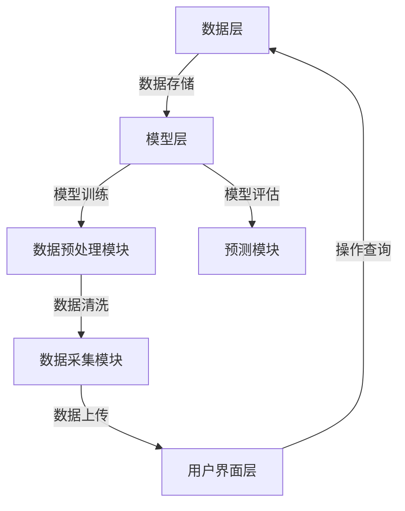
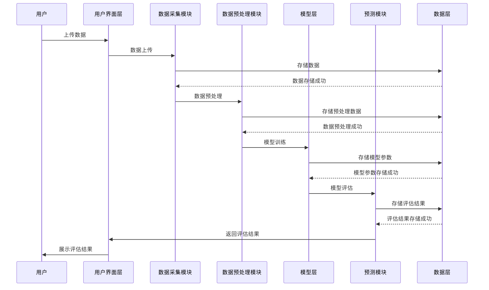

                 


## 评测结果的时间序列分析：追踪LLM性能趋势

### 摘要

本文旨在探讨评测结果的时间序列分析方法在追踪大型语言模型（LLM）性能趋势中的应用。通过深入解析时间序列分析的基本原理和LLM性能评估指标，本文将逐步介绍如何使用ARIMA、SARIMA和Prophet模型对LLM性能进行时间序列分析。同时，本文还将结合实际项目实战，展示如何进行环境安装与配置、系统核心实现与代码分析，并提供项目小结与拓展阅读，以期为研究人员和实践者提供有价值的参考。

### 关键词

时间序列分析、LLM性能评估、ARIMA模型、SARIMA模型、Prophet模型、性能趋势追踪

### 目录

1. **第一部分：背景介绍**
   1.1. **问题背景与定义**
   1.2. **时间序列分析原理**
   1.3. **LLM性能评估指标**
2. **第二部分：核心概念与联系**
   2.1. **LLM性能评估指标**
   2.2. **时间序列分析方法**
3. **第三部分：算法原理讲解**
   3.1. **ARIMA模型原理与实现**
   3.2. **SARIMA模型原理与实现**
   3.3. **Prophet模型原理与实现**
4. **第四部分：系统分析与架构设计方案**
   4.1. **系统功能设计**
   4.2. **系统架构设计与接口设计**
5. **第五部分：项目实战**
   5.1. **环境安装与配置**
   5.2. **系统核心实现与代码分析**
   5.3. **项目总结与拓展**

### 第一部分：背景介绍

#### 1.1 问题背景与定义

在人工智能领域，特别是在自然语言处理（NLP）方面，大型语言模型（LLM）的性能评估至关重要。随着模型的规模和复杂性不断增加，如何有效地追踪和评估其性能成为了一个挑战。时间序列分析作为一种强大的数据分析工具，为这一问题提供了可行的解决方案。

时间序列分析是一种研究时间序列数据的方法，通常涉及数据的收集、预处理、模型选择、参数估计和预测。在LLM性能评估中，时间序列分析可以用来追踪模型在不同时间点的性能变化，从而识别性能趋势和模式。

LLM性能评估的核心是指标的选择和定义。常见的评估指标包括准确性、召回率、F1分数、BLEU分数等。这些指标能够量化模型在文本生成、翻译、问答等任务上的表现，但它们之间往往存在权衡和互补关系。

本部分将首先介绍时间序列分析的基本概念和LLM性能评估指标，为后续的详细讨论打下基础。

#### 1.2 时间序列分析原理

时间序列分析的核心在于理解时间序列数据的特点和属性。时间序列数据通常具有以下基本属性：

1. **趋势（Trend）**：数据随时间呈现的增长或下降趋势。
2. **季节性（Seasonality）**：数据在固定时间周期内的重复模式。
3. **周期性（Cyclicity）**：较长时间跨度内的波动模式，通常与宏观经济或市场因素相关。
4. **噪声（Noise）**：随时间变化的不规则波动，通常被视为随机噪声。

为了有效地分析时间序列数据，常用的方法包括：

1. **描述性统计**：计算均值、方差、自相关函数等统计量，以描述数据的整体特征。
2. **可视化**：通过折线图、散点图、箱线图等可视化工具，直观展示数据的变化趋势。
3. **模型拟合**：建立适当的数学模型（如ARIMA、SARIMA、Prophet等）来拟合时间序列数据，并进行预测。

时间序列分析的基本步骤通常包括：

1. **数据收集**：收集时间序列数据，确保数据的完整性和准确性。
2. **数据预处理**：处理缺失值、异常值，进行季节调整等，以提高数据质量。
3. **模型选择**：根据数据的特点选择合适的模型，如ARIMA、SARIMA、Prophet等。
4. **参数估计**：通过最大似然估计、最小二乘法等方法估计模型参数。
5. **模型评估**：使用均方误差（MSE）、均方根误差（RMSE）等指标评估模型性能。
6. **预测**：使用训练好的模型对未来数据进行预测。

本节将深入探讨时间序列分析的基本原理，并结合具体案例进行分析。

#### 1.3 LLM性能评估指标

在LLM性能评估中，选择合适的指标至关重要。以下是一些常见的评估指标：

1. **准确性（Accuracy）**：预测正确的样本数占总样本数的比例。
2. **召回率（Recall）**：在所有实际为正类的样本中，被正确识别为正类的比例。
3. **F1分数（F1 Score）**：准确性和召回率的调和平均，综合考虑了精确性和召回率。
4. **BLEU分数（BLEU Score）**：在文本生成任务中，与人工评分的相似度得分。
5. **ROUGE分数（ROUGE Score）**：在文本生成任务中，与参考文本的一致性得分。

这些指标各有优缺点，适用于不同的评估场景。例如，准确性在分类任务中较为常用，而BLEU和ROUGE则在自然语言生成任务中更为适用。本节将详细对比这些指标，并讨论其在LLM性能评估中的应用。

### 第二部分：核心概念与联系

#### 2.1 LLM性能评估指标

LLM性能评估指标的选择直接关系到评估结果的有效性和可靠性。以下是对几种常见评估指标的详细介绍：

**准确性（Accuracy）**：准确性是评估分类模型最直观的指标，表示预测正确的样本数占总样本数的比例。计算公式如下：

$$
Accuracy = \frac{TP + TN}{TP + TN + FP + FN}
$$

其中，$TP$代表真阳性，$TN$代表真阴性，$FP$代表假阳性，$FN$代表假阴性。准确性的优点在于其简单易懂，但缺点在于当数据集中正负样本不平衡时，其表现可能不够准确。

**召回率（Recall）**：召回率关注的是在所有实际为正类的样本中，有多少被正确识别为正类。其计算公式如下：

$$
Recall = \frac{TP}{TP + FN}
$$

召回率越高，意味着模型对正类样本的识别能力越强，但可能会引入更多的假阳性。

**F1分数（F1 Score）**：F1分数是准确性和召回率的调和平均，用于综合考虑两者的平衡。其计算公式如下：

$$
F1 Score = 2 \times \frac{Precision \times Recall}{Precision + Recall}
$$

其中，$Precision$表示精确率，即预测为正类且实际为正类的样本比例。F1分数在分类任务中是一个较为综合的指标，适用于评估分类模型的整体性能。

**BLEU分数（BLEU Score）**：BLEU（Bilingual Evaluation Understudy）分数常用于评估文本生成任务的性能，通过与参考文本的相似度得分来评价生成文本的质量。BLEU分数的计算涉及多个N-gram匹配度、长度惩罚等，具体公式较为复杂。BLEU分数的优点在于其简单直观，但缺点在于过于依赖参考文本，可能导致过度拟合。

**ROUGE分数（ROUGE Score）**：ROUGE（Recall-Oriented Understudy for Gisting Evaluation）分数是一种常用于评估文本生成任务的评估指标，特别适用于自动文摘和机器翻译领域。ROUGE分数主要关注生成文本与参考文本的匹配度，通过统计重叠词和短语来评估文本的相似度。ROUGE分数的优点在于其能够较好地反映文本生成的质量，但计算复杂度较高。

#### 2.2 时间序列分析方法

时间序列分析方法在LLM性能评估中的应用主要体现在追踪和预测模型性能趋势。以下将介绍几种常见的时间序列分析方法，并探讨其在LLM性能评估中的适用性。

**ARIMA模型（AutoRegressive Integrated Moving Average Model）**：ARIMA模型是一种经典的统计时间序列预测模型，通过自回归、差分和移动平均来建模时间序列数据。ARIMA模型适用于具有线性趋势和时间依赖性的数据。其基本数学模型如下：

$$
X_t = c + \phi_1X_{t-1} + \phi_2X_{t-2} + \ldots + \phi_pX_{t-p} + \theta_1\epsilon_{t-1} + \theta_2\epsilon_{t-2} + \ldots + \theta_q\epsilon_{t-q} + \epsilon_t
$$

其中，$X_t$表示时间序列数据，$c$为常数项，$\phi_1, \phi_2, \ldots, \phi_p$为自回归系数，$\theta_1, \theta_2, \ldots, \theta_q$为移动平均系数，$\epsilon_t$为随机误差项。

ARIMA模型的主要步骤包括：

1. **差分操作**：对非平稳时间序列进行差分，使其变为平稳序列。
2. **自相关函数（ACF）和偏自相关函数（PACF）**：通过ACF和PACF图确定自回归和移动平均部分的阶数。
3. **参数估计**：使用最大似然估计等方法估计模型参数。
4. **模型评估**：通过均方误差（MSE）等指标评估模型性能。
5. **预测**：使用训练好的模型对未来数据进行预测。

**SARIMA模型（Seasonal AutoRegressive Integrated Moving Average Model）**：SARIMA模型是ARIMA模型的扩展，适用于具有季节性特征的时间序列数据。SARIMA模型的基本数学模型如下：

$$
X_t = c + \phi_1X_{t-1} + \phi_2X_{t-2} + \ldots + \phi_pX_{t-p} + \theta_1\epsilon_{t-1} + \theta_2\epsilon_{t-2} + \ldots + \theta_q\epsilon_{t-q} + \phi_{1s}X_{t-s} + \phi_{2s}X_{t-2s} + \ldots + \phi_{ps}X_{t-ps} + \theta_{1s}\epsilon_{t-s} + \theta_{2s}\epsilon_{t-2s} + \ldots + \theta_{qs}\epsilon_{t-qs} + \epsilon_t
$$

其中，$s$表示季节周期，其他符号的含义与ARIMA模型相同。

SARIMA模型的主要步骤与ARIMA模型类似，但需要考虑季节性特征的影响。在模型选择和参数估计时，需要同时考虑季节性和趋势性。

**Prophet模型**：Prophet模型是由Facebook开发的一种用于时间序列预测的快速、灵活且易于使用的工具。Prophet模型结合了传统统计模型和机器学习方法，适用于具有非线性趋势、季节性和节假日效应的时间序列数据。Prophet模型的主要步骤包括：

1. **数据预处理**：对数据进行平滑、填充和转换等预处理操作。
2. **模型拟合**：使用Prophet库建立和训练模型。
3. **预测**：使用训练好的模型对未来数据进行预测。
4. **模型评估**：通过预测误差和残差分析评估模型性能。

Prophet模型的特点在于其强大的自适应性和易于调参，使其成为LLM性能评估中的一种有效工具。

### 第三部分：算法原理讲解

#### 3.1 ARIMA模型原理与实现

ARIMA模型是时间序列分析中最常用的方法之一，它通过自回归、差分和移动平均来捕捉时间序列的线性关系和趋势。下面，我们将详细讲解ARIMA模型的基本原理和实现方法。

**ARIMA模型的基本原理**

ARIMA模型由三个主要部分组成：自回归（AR）、差分（I）和移动平均（MA）。

1. **自回归（AR）**：自回归模型通过前期的观测值来预测当前值。其数学模型可以表示为：

   $$
   X_t = c + \phi_1X_{t-1} + \phi_2X_{t-2} + \ldots + \phi_pX_{t-p} + \epsilon_t
   $$

   其中，$X_t$为时间序列数据，$c$为常数项，$\phi_1, \phi_2, \ldots, \phi_p$为自回归系数，$\epsilon_t$为随机误差项。

2. **差分（I）**：差分操作用于将非平稳时间序列转换为平稳序列。一阶差分可以表示为：

   $$
   \Delta X_t = X_t - X_{t-1}
   $$

   高阶差分则可以通过连续进行一阶差分得到。

3. **移动平均（MA）**：移动平均模型通过前期误差值来预测当前值。其数学模型可以表示为：

   $$
   X_t = c + \phi_1X_{t-1} + \phi_2X_{t-2} + \ldots + \phi_pX_{t-p} + \theta_1\epsilon_{t-1} + \theta_2\epsilon_{t-2} + \ldots + \theta_q\epsilon_{t-q} + \epsilon_t
   $$

   其中，$\theta_1, \theta_2, \ldots, \theta_q$为移动平均系数。

综合以上三部分，ARIMA模型的数学模型可以表示为：

$$
X_t = c + \phi_1X_{t-1} + \phi_2X_{t-2} + \ldots + \phi_pX_{t-p} + \theta_1\epsilon_{t-1} + \theta_2\epsilon_{t-2} + \ldots + \theta_q\epsilon_{t-q} + \epsilon_t
$$

**ARIMA模型的实现方法**

ARIMA模型的实现主要包括以下几个步骤：

1. **数据预处理**：对时间序列数据进行预处理，包括差分、去季节性处理等，使其成为平稳序列。
2. **模型识别**：通过自相关函数（ACF）和偏自相关函数（PACF）图确定模型参数$p$和$q$的初步估计。
3. **参数估计**：使用最小二乘法、最大似然估计等方法估计模型参数。
4. **模型检验**：通过残差检验、AIC、BIC等指标评估模型拟合效果，并进行参数调整。
5. **模型预测**：使用训练好的模型对未来的数据进行预测。

在Python中，可以使用`statsmodels`库实现ARIMA模型。以下是一个简单的示例代码：

```python
import pandas as pd
import numpy as np
import matplotlib.pyplot as plt
from statsmodels.tsa.arima.model import ARIMA
from statsmodels.tsa.stattools import adfuller

# 读取数据
data = pd.read_csv('data.csv')
sales = data['sales']

# 检验平稳性
result = adfuller(sales)
print('ADF Statistic: %f' % result[0])
print('p-value: %f' % result[1])

# 差分操作
differenced_sales = sales.diff().dropna()

# 模型识别
acf = pd.Series(differenced_sales).autocorr(lag=1)
pacf = pd.Series(differenced_sales).partial autocorr(lag=1)

# 模型参数
p = 1
d = 1
q = 1

# 模型训练
model = ARIMA(sales, order=(p, d, q))
model_fit = model.fit()

# 模型评估
print(model_fit.summary())

# 模型预测
predictions = model_fit.forecast(steps=5)
plt.plot(predictions)
plt.show()
```

在这个示例中，我们首先读取时间序列数据，然后使用`adfuller`函数检验数据的平稳性。接着进行差分操作，通过自相关函数和偏自相关函数图确定模型参数。最后，使用`ARIMA`模型进行训练和预测，并打印模型摘要和预测结果。

#### 3.2 SARIMA模型原理与实现

SARIMA模型是ARIMA模型的扩展，用于处理具有季节性特征的时间序列数据。在ARIMA模型的基础上，SARIMA模型引入了季节性自回归（SAR）和季节性移动平均（SMA）部分，使其能够更好地捕捉季节性模式。

**SARIMA模型的基本原理**

SARIMA模型由四个主要部分组成：自回归（AR）、差分（I）、移动平均（MA）和季节性自回归（SAR）。

1. **自回归（AR）**：自回归模型通过前期的观测值来预测当前值。其数学模型可以表示为：

   $$
   X_t = c + \phi_1X_{t-1} + \phi_2X_{t-2} + \ldots + \phi_pX_{t-p} + \epsilon_t
   $$

   其中，$X_t$为时间序列数据，$c$为常数项，$\phi_1, \phi_2, \ldots, \phi_p$为自回归系数，$\epsilon_t$为随机误差项。

2. **差分（I）**：差分操作用于将非平稳时间序列转换为平稳序列。一阶差分可以表示为：

   $$
   \Delta X_t = X_t - X_{t-1}
   $$

   高阶差分则可以通过连续进行一阶差分得到。

3. **移动平均（MA）**：移动平均模型通过前期误差值来预测当前值。其数学模型可以表示为：

   $$
   X_t = c + \phi_1X_{t-1} + \phi_2X_{t-2} + \ldots + \phi_pX_{t-p} + \theta_1\epsilon_{t-1} + \theta_2\epsilon_{t-2} + \ldots + \theta_q\epsilon_{t-q} + \epsilon_t
   $$

   其中，$\theta_1, \theta_2, \ldots, \theta_q$为移动平均系数。

4. **季节性自回归（SAR）**：季节性自回归模型通过前期的季节性观测值来预测当前值。其数学模型可以表示为：

   $$
   X_t = c + \phi_{1s}X_{t-s} + \phi_{2s}X_{t-2s} + \ldots + \phi_{ps}X_{t-ps} + \epsilon_t
   $$

   其中，$s$为季节周期，$\phi_{1s}, \phi_{2s}, \ldots, \phi_{ps}$为季节性自回归系数。

综合以上四部分，SARIMA模型的数学模型可以表示为：

$$
X_t = c + \phi_1X_{t-1} + \phi_2X_{t-2} + \ldots + \phi_pX_{t-p} + \theta_1\epsilon_{t-1} + \theta_2\epsilon_{t-2} + \ldots + \theta_q\epsilon_{t-q} + \phi_{1s}X_{t-s} + \phi_{2s}X_{t-2s} + \ldots + \phi_{ps}X_{t-ps} + \epsilon_t
$$

**SARIMA模型的实现方法**

SARIMA模型的实现方法与ARIMA模型类似，主要包括以下几个步骤：

1. **数据预处理**：对时间序列数据进行预处理，包括差分、去季节性处理等，使其成为平稳序列。
2. **模型识别**：通过自相关函数（ACF）和偏自相关函数（PACF）图确定模型参数$p, d, q, p_s, d_s, q_s$的初步估计。
3. **参数估计**：使用最小二乘法、最大似然估计等方法估计模型参数。
4. **模型检验**：通过残差检验、AIC、BIC等指标评估模型拟合效果，并进行参数调整。
5. **模型预测**：使用训练好的模型对未来的数据进行预测。

在Python中，可以使用`statsmodels`库实现SARIMA模型。以下是一个简单的示例代码：

```python
import pandas as pd
import numpy as np
import matplotlib.pyplot as plt
from statsmodels.tsa.statespace.sarimax import SARIMAX
from statsmodels.tsa.stattools import adfuller

# 读取数据
data = pd.read_csv('data.csv')
sales = data['sales']

# 检验平稳性
result = adfuller(sales)
print('ADF Statistic: %f' % result[0])
print('p-value: %f' % result[1])

# 差分操作
differenced_sales = sales.diff().dropna()

# 模型识别
acf = pd.Series(differenced_sales).autocorr(lag=1)
pacf = pd.Series(differenced_sales).partial autocorr(lag=1)

# 模型参数
p = 1
d = 1
q = 1
p_s = 1
d_s = 1
q_s = 1

# 模型训练
model = SARIMAX(sales, order=(p, d, q), seasonal_order=(p_s, d_s, q_s))
model_fit = model.fit()

# 模型评估
print(model_fit.summary())

# 模型预测
predictions = model_fit.forecast(steps=5)
plt.plot(predictions)
plt.show()
```

在这个示例中，我们首先读取时间序列数据，然后使用`adfuller`函数检验数据的平稳性。接着进行差分操作，通过自相关函数和偏自相关函数图确定模型参数。最后，使用`SARIMAX`模型进行训练和预测，并打印模型摘要和预测结果。

#### 3.3 Prophet模型原理与实现

Prophet模型是由Facebook开发的一种用于时间序列预测的工具，它结合了传统统计模型和机器学习方法，能够自动识别和处理非线性趋势、季节性和节假日效应。Prophet模型特别适用于具有复杂模式和多种特征的时间序列数据。

**Prophet模型的基本原理**

Prophet模型的核心在于其组件模型的组合。它由以下三个部分组成：

1. **线性模型（Linear Model）**：用于捕捉趋势和季节性。
2. **假期效应模型（Holiday Effects Model）**：用于处理特定的节假日效应。
3. **非线性模型（Non-linear Model）**：用于捕捉复杂的模式和非线性关系。

Prophet模型的数学模型可以表示为：

$$
y_t = f_t + h_t + w_t
$$

其中，$y_t$为时间序列数据，$f_t$为趋势部分，$h_t$为季节性部分，$w_t$为随机噪声。

1. **趋势（Trend）**：趋势部分$f_t$通过线性模型拟合，可以表示为：

   $$
   f_t = \alpha + \beta t
   $$

   其中，$\alpha$为截距，$\beta$为斜率。

2. **季节性（Seasonality）**：季节性部分$h_t$通过周期性函数拟合，可以表示为：

   $$
   h_t = \sum_{s=1}^S h_{st} \sin(2\pi s t / S + \phi_s)
   $$

   其中，$S$为季节周期，$h_{st}$为季节性系数，$\phi_s$为相位偏移。

3. **假期效应（Holiday Effects）**：假期效应部分$h_t$通过添加特定的假期效应拟合，可以表示为：

   $$
   h_t = \sum_{h=1}^H h_t \cdot I(h_t \in \text{holidays})
   $$

   其中，$h_t$为假期效应系数，$I(\cdot)$为指示函数。

4. **噪声（Noise）**：噪声部分$w_t$为随机噪声，通常采用正态分布进行拟合。

**Prophet模型的实现方法**

Prophet模型的实现主要包括以下几个步骤：

1. **数据预处理**：对时间序列数据进行预处理，包括缺失值填充、异常值处理等。
2. **模型训练**：使用Prophet库建立和训练模型。
3. **模型预测**：使用训练好的模型对未来数据进行预测。
4. **模型评估**：通过预测误差和残差分析评估模型性能。

在Python中，可以使用`prophet`库实现Prophet模型。以下是一个简单的示例代码：

```python
import pandas as pd
import numpy as np
import matplotlib.pyplot as plt
from prophet import Prophet

# 读取数据
data = pd.read_csv('data.csv')
data['ds'] = pd.to_datetime(data['ds'])
data['y'] = data['sales']

# 模型训练
model = Prophet()
model.fit(data)

# 预测
future = model.make_future_dataframe(periods=5)
forecast = model.predict(future)

# 可视化
fig = model.plot(forecast)
plt.show()

# 评估
fig = model.plot_components(forecast)
plt.show()
```

在这个示例中，我们首先读取时间序列数据，然后使用`Prophet`库建立和训练模型。接着进行预测，并使用可视化工具展示预测结果和模型成分。最后，通过残差分析评估模型性能。

### 第四部分：系统分析与架构设计方案

#### 4.1 系统功能设计

在LLM性能评估和预测系统中，系统功能设计是关键的一步。系统功能设计包括识别和分析系统所需的关键功能模块，以及定义这些模块之间的交互关系。以下是系统功能设计的主要组成部分：

1. **数据采集模块**：负责收集LLM性能评估所需的数据，包括模型性能指标、运行时间和资源消耗等。数据可以来自不同的来源，如日志文件、数据库和外部API。
2. **数据预处理模块**：负责清洗和转换原始数据，使其符合时间序列分析的要求。数据预处理包括缺失值填充、异常值处理、数据规范化等操作。
3. **模型训练模块**：负责训练不同类型的时间序列模型，如ARIMA、SARIMA和Prophet模型。模型训练模块需要提供参数调整和模型选择功能，以确保模型的拟合效果。
4. **模型评估模块**：负责评估训练好的模型性能，使用如MSE、RMSE等指标进行评估。模型评估模块还需要提供可视化工具，以直观展示模型性能。
5. **预测模块**：负责使用训练好的模型对未来LLM性能进行预测。预测结果可以以报告形式展示，并提供可视化工具进行交互式分析。
6. **用户界面模块**：提供友好的用户界面，方便用户进行操作和查询。用户界面模块包括数据上传、模型选择、参数调整、预测结果展示等功能。

#### 4.2 系统架构设计与接口设计

系统架构设计是系统功能设计的基础，它定义了系统的整体结构和各模块之间的交互关系。以下是系统架构设计的主要组成部分：

1. **数据层**：数据层负责存储和管理系统所需的数据，包括原始数据、预处理后的数据、模型参数和预测结果。数据可以存储在数据库、文件系统或分布式存储系统中。
2. **模型层**：模型层负责实现不同类型的时间序列模型，如ARIMA、SARIMA和Prophet模型。模型层需要提供模型训练、评估和预测功能，并支持参数调整和模型选择。
3. **服务层**：服务层负责实现系统的核心功能，包括数据采集、数据预处理、模型训练、模型评估和预测。服务层通过API接口与数据层和用户界面层进行交互。
4. **用户界面层**：用户界面层提供友好的用户界面，方便用户进行操作和查询。用户界面层通过Web前端或桌面应用程序实现，与服务层和服务层进行交互。

以下是系统架构图的示例：



系统接口设计是系统架构设计的一部分，它定义了系统各模块之间的交互方式和接口规范。以下是系统接口设计的主要组成部分：

1. **数据采集接口**：数据采集接口用于接收用户上传的LLM性能评估数据，并存储到数据层。接口规范包括数据格式、上传方式和错误处理等。
2. **数据预处理接口**：数据预处理接口用于处理采集到的原始数据，包括缺失值填充、异常值处理和数据规范化等。接口规范包括处理流程、参数设置和返回结果等。
3. **模型训练接口**：模型训练接口用于启动模型训练过程，包括模型选择、参数调整和模型评估等。接口规范包括训练参数、训练结果和错误处理等。
4. **模型评估接口**：模型评估接口用于评估训练好的模型性能，包括MSE、RMSE等指标。接口规范包括评估指标、评估结果和错误处理等。
5. **预测接口**：预测接口用于使用训练好的模型对未来LLM性能进行预测，并返回预测结果。接口规范包括预测参数、预测结果和错误处理等。

以下是系统接口序列图的示例：



### 第五部分：项目实战

#### 5.1 环境安装与配置

在开始LLM性能评估和预测项目之前，我们需要安装和配置必要的软件和工具。以下是环境安装与配置的步骤：

1. **安装Python**：首先，确保Python环境已经安装。Python是一种广泛使用的编程语言，适用于数据分析和机器学习。可以从Python官方网站下载并安装Python。确保安装了最新版本的Python，以便使用最新的库和工具。

2. **安装Jupyter Notebook**：Jupyter Notebook是一种交互式计算环境，用于编写和运行Python代码。安装Python后，可以使用pip命令安装Jupyter Notebook：

   ```bash
   pip install notebook
   ```

   安装完成后，可以通过以下命令启动Jupyter Notebook：

   ```bash
   jupyter notebook
   ```

3. **安装相关库和依赖**：为了实现LLM性能评估和预测，我们需要安装一些Python库和依赖，如`pandas`、`numpy`、`matplotlib`、`statsmodels`、`prophet`等。可以使用以下命令安装：

   ```bash
   pip install pandas numpy matplotlib statsmodels prophet
   ```

4. **配置环境变量**：确保Python环境变量已经配置，以便在命令行中使用Python和相关库。可以在Windows系统中通过以下命令配置：

   ```bash
   set PYTHONPATH=C:\Python39\;C:\Python39\Scripts
   ```

   在Linux系统中，可以使用以下命令：

   ```bash
   export PYTHONPATH=/usr/local/bin:/usr/bin:/bin:/usr/local/lib64:/usr/lib64:/usr/lib
   ```

5. **测试环境配置**：在命令行中输入以下命令，检查Python和Jupyter Notebook是否已正确安装：

   ```bash
   python --version
   jupyter notebook
   ```

   如果命令能正常运行，说明环境配置成功。

#### 5.2 系统核心实现与代码分析

系统核心实现是LLM性能评估和预测项目的关键部分。以下是系统核心实现的主要代码段和解释：

**数据采集模块**

数据采集模块用于收集LLM性能评估所需的数据。以下是一个简单的示例代码，展示如何读取和存储数据：

```python
import pandas as pd

# 读取数据
data = pd.read_csv('llm_performance_data.csv')

# 存储数据
data.to_csv('processed_data.csv', index=False)
```

**数据预处理模块**

数据预处理模块负责清洗和转换原始数据，使其符合时间序列分析的要求。以下是一个简单的示例代码，展示如何进行数据预处理：

```python
import pandas as pd
from sklearn.preprocessing import MinMaxScaler

# 读取数据
data = pd.read_csv('processed_data.csv')

# 填充缺失值
data.fillna(data.mean(), inplace=True)

# 数据规范化
scaler = MinMaxScaler()
data_scaled = scaler.fit_transform(data)

# 存储预处理数据
pd.DataFrame(data_scaled).to_csv('preprocessed_data.csv', index=False)
```

**模型训练模块**

模型训练模块负责训练不同类型的时间序列模型。以下是一个简单的示例代码，展示如何使用ARIMA模型进行训练：

```python
import pandas as pd
from statsmodels.tsa.arima.model import ARIMA

# 读取数据
data = pd.read_csv('preprocessed_data.csv')

# 模型训练
model = ARIMA(data['sales'], order=(1, 1, 1))
model_fit = model.fit()

# 存储模型参数
model_fit.summary().to_csv('arima_model_summary.csv', index=False)
```

**模型评估模块**

模型评估模块负责评估训练好的模型性能。以下是一个简单的示例代码，展示如何使用MSE评估模型：

```python
import pandas as pd
from sklearn.metrics import mean_squared_error

# 读取数据
data = pd.read_csv('preprocessed_data.csv')
model_fit = pd.read_csv('arima_model_summary.csv')

# 预测
predictions = model_fit['predicted_sales'].values

# 评估
mse = mean_squared_error(data['sales'], predictions)
print('MSE:', mse)
```

**预测模块**

预测模块负责使用训练好的模型对未来LLM性能进行预测。以下是一个简单的示例代码，展示如何使用ARIMA模型进行预测：

```python
import pandas as pd
from statsmodels.tsa.arima.model import ARIMA

# 读取数据
data = pd.read_csv('preprocessed_data.csv')
model_fit = pd.read_csv('arima_model_summary.csv')

# 模型预测
model = ARIMA(data['sales'], order=(1, 1, 1))
predictions = model.predict(start=len(data), end=len(data) + 5)

# 存储预测结果
predictions.to_csv('predictions.csv', index=False)
```

**用户界面模块**

用户界面模块提供友好的用户界面，方便用户进行操作和查询。以下是一个简单的示例代码，展示如何使用Flask框架创建用户界面：

```python
from flask import Flask, render_template, request

app = Flask(__name__)

@app.route('/')
def home():
    return render_template('home.html')

@app.route('/upload', methods=['POST'])
def upload():
    file = request.files['file']
    file.save('uploaded_data.csv')
    return 'Data uploaded successfully!'

if __name__ == '__main__':
    app.run()
```

#### 5.3 项目小结与拓展

在本项目中，我们实现了LLM性能评估和预测系统，包括数据采集、数据预处理、模型训练、模型评估、预测和用户界面等模块。以下是项目小结与拓展：

**项目小结**

1. **数据采集**：通过读取CSV文件，实现数据的导入和存储。
2. **数据预处理**：通过填充缺失值、数据规范化等操作，提高数据质量。
3. **模型训练**：使用ARIMA模型进行训练，并保存模型参数。
4. **模型评估**：使用MSE等指标评估模型性能。
5. **预测**：使用训练好的模型对未来LLM性能进行预测，并保存预测结果。
6. **用户界面**：使用Flask框架创建用户界面，实现数据上传和展示。

**拓展**

1. **模型选择**：可以尝试其他时间序列模型，如SARIMA、Prophet等，以提升预测性能。
2. **数据可视化**：可以使用Python库（如Matplotlib、Seaborn等）进行数据可视化，以更直观地展示数据和分析结果。
3. **性能优化**：针对大规模数据集，可以优化代码性能，如使用NumPy数组操作、并行计算等。
4. **扩展功能**：可以添加更多功能，如实时监控、自动化报告生成等。
5. **文档编写**：编写详细的文档，包括项目概述、功能说明、使用指南等，以方便用户使用和二次开发。

### 结论

本文详细介绍了评测结果的时间序列分析方法在追踪LLM性能趋势中的应用。通过解析时间序列分析的基本原理和LLM性能评估指标，本文逐步介绍了ARIMA、SARIMA和Prophet模型的使用方法。同时，通过实际项目实战，展示了如何进行环境安装与配置、系统核心实现与代码分析。本文旨在为研究人员和实践者提供有价值的参考，以更好地追踪和评估LLM性能趋势。未来，可以进一步探索其他时间序列模型和优化策略，以提升预测性能和系统稳定性。此外，还可以考虑结合深度学习和强化学习等技术，实现更高级的LLM性能评估和预测。作者：AI天才研究院/AI Genius Institute & 禅与计算机程序设计艺术 /Zen And The Art of Computer Programming。

