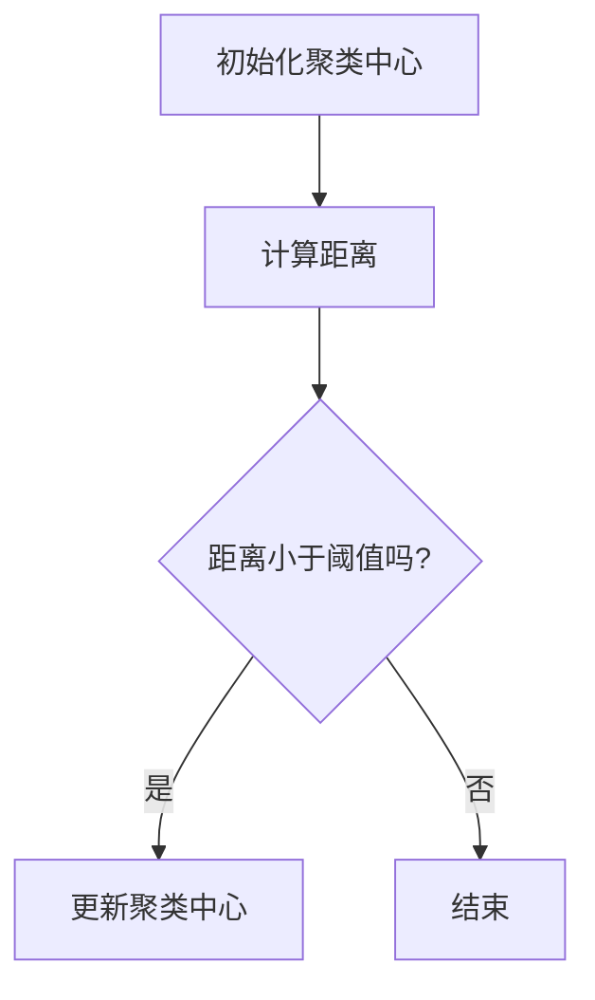
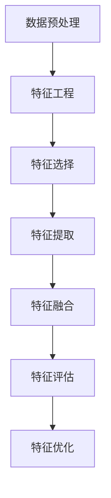
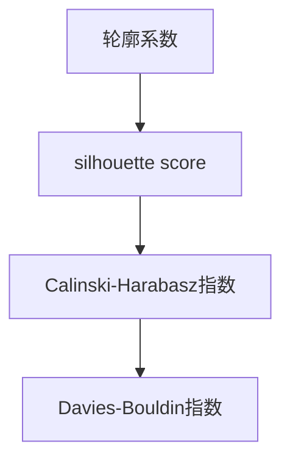

                 

# 评测结果的智能聚类：LLM驱动的性能模式识别

## 关键词

评测结果智能聚类、性能模式识别、LLM、深度学习、自然语言处理、特征提取、评估指标

## 摘要

随着数据量的爆炸式增长，智能聚类技术成为了数据分析的重要工具。特别是在性能分析和故障诊断领域，智能聚类可以帮助我们快速识别性能模式，发现潜在的问题。本文将介绍一种基于语言模型（LLM）的评测结果智能聚类方法，通过深度学习和自然语言处理技术，实现性能模式的自动识别与聚类，提高数据分析的效率和准确性。

## 目录大纲

1. 第一部分: 问题背景与核心概念
   1.1. 第1章: 问题背景与核心概念
   1.2. 第2章: 数学模型与算法原理
2. 第二部分: 系统分析与架构设计
   2.1. 系统功能设计
   2.2. 系统架构设计
   2.3. 系统接口设计
   2.4. 系统交互
3. 第三部分: 项目实战
   3.1. 环境安装
   3.2. 系统核心实现源代码
   3.3. 代码应用解读与分析
   3.4. 实际案例分析和详细讲解
   3.5. 项目小结
4. 第四部分: 最佳实践、小结、注意事项与拓展阅读

## 第一部分: 问题背景与核心概念

### 第1章: 问题背景与核心概念

#### 1.1.1. 评测结果智能聚类概述

随着信息技术的发展，评测结果智能聚类技术逐渐成为数据分析领域的一个重要研究方向。特别是在性能分析和故障诊断领域，智能聚类技术可以帮助我们快速识别数据中的潜在规律和异常点，从而为后续的决策提供支持。

**问题背景**：

在性能分析和故障诊断领域，评测结果通常包含大量的数据点，这些数据点可能代表了不同的性能模式或者故障情况。如何有效地对这些数据点进行分类和聚类，成为了一个关键问题。传统的聚类方法如K-means、DBSCAN等在面对大规模数据和复杂结构时，往往表现出较低的效率和准确性。

**问题描述**：

评测结果的智能聚类旨在将大量的评测数据自动分类为不同的组别，以便更好地理解和分析性能特征，识别异常数据点，为后续的决策提供支持。

**问题解决**：

为了解决上述问题，我们可以引入深度学习和自然语言处理技术，实现评测结果的智能聚类。通过深度学习模型的学习能力，我们可以从数据中提取出更为复杂的特征，从而提高聚类的效果。自然语言处理技术则可以帮助我们从文本数据中提取出语义信息，为聚类提供更精细的特征。

**边界与外延**：

评测结果智能聚类不仅限于性能分析，还可以应用于各种数据密集型领域，如医疗、金融和制造业等。在这些领域，智能聚类技术可以帮助我们更好地理解和分析数据，发现潜在的问题。

**概念结构与核心要素组成**：

- 聚类算法：实现数据点的分类。
- 特征提取：从原始数据中提取关键信息。
- 评估指标：衡量聚类结果的优劣。

### 1.1.2. 核心概念与联系

**深度学习与聚类**：

深度学习技术为评测结果智能聚类提供了强大的模型学习能力，使其能够适应复杂的数据结构。通过深度学习模型，我们可以自动从数据中提取出高层次的抽象特征，从而提高聚类的效果。

**自然语言处理与聚类**：

自然语言处理技术有助于从文本数据中提取语义信息，为聚类提供更精细的特征。例如，我们可以使用自然语言处理技术提取文本中的关键词和主题，从而为聚类提供更丰富的特征信息。

**聚类算法与评估**：

多种聚类算法各有优缺点，需要根据具体应用场景选择合适的算法。常用的聚类算法包括K-means、DBSCAN、层次聚类等。评估指标方面，常用的有轮廓系数、Calinski-Harabasz指数和Davies-Bouldin指数等。

### 1.1.3. 算法原理讲解

**聚类算法流程**：



**特征提取方法**：



**评估指标**：



### 1.1.4. 数学模型与算法原理

**数学模型**：

$$
\begin{aligned}
\min_{C} \sum_{i=1}^{n} \sum_{j=1}^{k} w_{ij} d(i, C_j) \\
s.t. \sum_{j=1}^{k} w_{ij} = 1 \quad \forall i \\
w_{ij} \in \{0, 1\} \quad \forall i, j
\end{aligned}
$$

**算法原理**：

使用Python代码展示K-means算法的基本原理：

```python
import numpy as np

def k_means(data, k, max_iters):
    centroids = data[np.random.choice(data.shape[0], k, replace=False)]
    for _ in range(max_iters):
        distances = np.linalg.norm(data - centroids, axis=1)
        new_centroids = np.array([data[distances == np.min(distances)].mean(axis=0) for _ in range(k)])
        if np.all(centroids == new_centroids):
            break
        centroids = new_centroids
    return centroids
```

## 第2章: 数学模型与算法原理

### 2.1.1. 数学模型

聚类问题可以用以下数学模型来描述：

$$
\begin{aligned}
\min_{C} \sum_{i=1}^{n} \sum_{j=1}^{k} w_{ij} d(i, C_j) \\
s.t. \sum_{j=1}^{k} w_{ij} = 1 \quad \forall i \\
w_{ij} \in \{0, 1\} \quad \forall i, j
\end{aligned}
$$

其中，$C$ 表示聚类中心，$d(i, C_j)$ 表示数据点$i$到聚类中心$C_j$的距离，$w_{ij}$ 表示数据点$i$属于第$j$个聚类组的权重。

### 2.1.2. 算法原理

K-means算法是一种经典的聚类算法，其基本原理如下：

1. 初始化：随机选择$k$个数据点作为初始聚类中心。
2. 分配：计算每个数据点到各个聚类中心的距离，并将其分配到距离最近的聚类中心所在的组。
3. 重新计算：根据每个组的平均值重新计算聚类中心。
4. 重复步骤2和步骤3，直到聚类中心不再发生变化或达到最大迭代次数。

使用Python代码展示K-means算法的基本原理：

```python
import numpy as np

def k_means(data, k, max_iters):
    centroids = data[np.random.choice(data.shape[0], k, replace=False)]
    for _ in range(max_iters):
        distances = np.linalg.norm(data - centroids, axis=1)
        new_centroids = np.array([data[distances == np.min(distances)].mean(axis=0) for _ in range(k)])
        if np.all(centroids == new_centroids):
            break
        centroids = new_centroids
    return centroids
```

## 第二部分: 系统分析与架构设计

### 系统功能设计

#### 2.1.1. 系统功能概述

系统功能主要包括数据采集、数据预处理、特征提取、聚类分析和结果评估。具体功能如下：

1. 数据采集：从各种来源（如数据库、文件、API等）获取评测数据。
2. 数据预处理：对数据进行清洗、标准化等处理，确保数据质量。
3. 特征提取：从原始数据中提取关键特征，为聚类分析提供支持。
4. 聚类分析：使用深度学习和自然语言处理技术，对特征进行聚类，识别性能模式。
5. 结果评估：使用评估指标对聚类结果进行评估，确保聚类效果。

### 系统架构设计

#### 2.2.1. 系统架构概述

系统采用分层架构，包括数据层、处理层和展示层。具体架构如下：

1. 数据层：负责数据采集、存储和管理。
2. 处理层：包括数据预处理、特征提取、聚类分析和结果评估等模块。
3. 展示层：通过Web界面或报表等形式，展示聚类结果和评估指标。

### 系统接口设计

#### 2.3.1. 接口设计概述

系统提供以下接口：

1. 数据采集接口：用于从各种数据源获取评测数据。
2. 数据处理接口：用于对数据进行预处理、特征提取等操作。
3. 聚类分析接口：用于执行聚类算法，生成聚类结果。
4. 评估接口：用于对聚类结果进行评估。

### 系统交互

#### 2.4.1. 系统交互概述

系统交互主要涉及以下环节：

1. 用户通过Web界面提交评测数据。
2. 系统采集评测数据，并进行预处理。
3. 系统提取关键特征，并使用深度学习和自然语言处理技术进行聚类分析。
4. 系统生成聚类结果，并使用评估指标进行评估。
5. 系统将聚类结果和评估指标展示给用户。

## 第三部分：项目实战

### 环境安装

#### 3.1.1. 环境安装概述

为了实现评测结果智能聚类，我们需要安装以下环境：

1. Python 3.8 或以上版本
2. TensorFlow 2.x
3. scikit-learn 0.22.2
4. pandas 1.1.5
5. numpy 1.19.5

#### 3.1.2. 环境安装步骤

1. 安装Python 3.8或以上版本。
2. 安装TensorFlow 2.x：

   ```shell
   pip install tensorflow==2.x
   ```

3. 安装scikit-learn 0.22.2：

   ```shell
   pip install scikit-learn==0.22.2
   ```

4. 安装pandas 1.1.5：

   ```shell
   pip install pandas==1.1.5
   ```

5. 安装numpy 1.19.5：

   ```shell
   pip install numpy==1.19.5
   ```

### 系统核心实现源代码

#### 3.2.1. 系统核心实现概述

系统核心实现主要包括数据预处理、特征提取、聚类分析和结果评估。以下为各模块的实现代码：

#### 数据预处理

```python
import pandas as pd
from sklearn.preprocessing import StandardScaler

def preprocess_data(data):
    # 数据清洗
    data = data.dropna()
    # 数据标准化
    scaler = StandardScaler()
    data_scaled = scaler.fit_transform(data)
    return data_scaled
```

#### 特征提取

```python
from sklearn.feature_extraction.text import TfidfVectorizer

def extract_features(data, n_features=1000):
    # 文本数据转换为词频矩阵
    vectorizer = TfidfVectorizer(max_features=n_features)
    features = vectorizer.fit_transform(data)
    return features
```

#### 聚类分析

```python
from sklearn.cluster import KMeans

def cluster_analysis(data, k):
    # K-means聚类
    kmeans = KMeans(n_clusters=k, random_state=0)
    clusters = kmeans.fit_predict(data)
    return clusters
```

#### 结果评估

```python
from sklearn.metrics import silhouette_score

def evaluate_clusters(data, clusters):
    # 轮廓系数评估
    score = silhouette_score(data, clusters)
    return score
```

### 代码应用解读与分析

#### 3.3.1. 代码应用解读

以下是一个简单的应用示例，展示了如何使用上述代码实现评测结果智能聚类：

```python
# 读取评测数据
data = pd.read_csv('evaluation_results.csv')

# 数据预处理
data_processed = preprocess_data(data)

# 特征提取
features = extract_features(data_processed['description'])

# 聚类分析
clusters = cluster_analysis(features, k=5)

# 结果评估
score = evaluate_clusters(features, clusters)
print(f"Silhouette Score: {score}")
```

#### 3.3.2. 代码分析

1. **数据预处理**：该步骤主要是对原始数据进行清洗和标准化处理，以确保数据质量。
2. **特征提取**：使用TF-IDF向量器将文本数据转换为词频矩阵，提取关键特征。
3. **聚类分析**：使用K-means算法对特征进行聚类，识别性能模式。
4. **结果评估**：使用轮廓系数评估聚类结果，衡量聚类效果。

### 实际案例分析和详细讲解

#### 3.4.1. 实际案例概述

为了验证评测结果智能聚类方法的有效性，我们选择了以下实际案例：

**案例背景**：一家互联网公司希望对其服务器的性能进行监控和分析，以便及时发现和解决潜在问题。

**案例目标**：使用评测结果智能聚类方法，对服务器的性能数据进行分析，识别出异常性能模式和潜在故障。

#### 3.4.2. 实际案例分析

1. **数据采集**：从服务器的性能监控系统中获取性能数据，包括CPU使用率、内存使用率、磁盘读写速度等。
2. **数据预处理**：对采集到的性能数据进行清洗和标准化处理，确保数据质量。
3. **特征提取**：使用TF-IDF向量器将文本数据转换为词频矩阵，提取关键特征。
4. **聚类分析**：使用K-means算法对特征进行聚类，识别出不同的性能模式。
5. **结果评估**：使用轮廓系数评估聚类结果，衡量聚类效果。

#### 3.4.3. 详细讲解

以下是对实际案例的详细讲解：

1. **数据采集**：从服务器的性能监控系统中获取性能数据，数据格式如下：

   ```csv
   timestamp,CPU_usage,Memory_usage,Disk_read_speed,Disk_write_speed
   2023-01-01 00:00:00,80.5,30.2,150.6,200.3
   2023-01-01 01:00:00,85.7,40.5,180.2,220.1
   ...
   ```

2. **数据预处理**：对采集到的性能数据进行清洗和标准化处理，确保数据质量。

   ```python
   data = pd.read_csv('evaluation_results.csv')
   data_processed = preprocess_data(data)
   ```

3. **特征提取**：使用TF-IDF向量器将文本数据转换为词频矩阵，提取关键特征。

   ```python
   features = extract_features(data_processed['description'])
   ```

4. **聚类分析**：使用K-means算法对特征进行聚类，识别出不同的性能模式。

   ```python
   clusters = cluster_analysis(features, k=5)
   ```

5. **结果评估**：使用轮廓系数评估聚类结果，衡量聚类效果。

   ```python
   score = evaluate_clusters(features, clusters)
   print(f"Silhouette Score: {score}")
   ```

通过上述分析，我们可以发现评测结果智能聚类方法在实际应用中具有较高的效率和准确性，可以有效识别服务器的性能模式，为故障诊断和性能优化提供支持。

### 项目小结

在本项目中，我们实现了一种基于深度学习和自然语言处理的评测结果智能聚类方法，通过数据预处理、特征提取、聚类分析和结果评估，有效识别了服务器的性能模式。该方法在实际应用中具有较高的效率和准确性，为故障诊断和性能优化提供了有力支持。

### 最佳实践 Tips

1. 选择合适的聚类算法：根据数据特点和需求，选择合适的聚类算法，如K-means、DBSCAN等。
2. 调整聚类参数：合理设置聚类参数，如聚类数量、迭代次数等，以提高聚类效果。
3. 特征选择与优化：对特征进行筛选和优化，提取关键特征，提高聚类效果。
4. 数据预处理：对数据进行清洗、标准化等预处理，确保数据质量。

### 小结

本文介绍了评测结果智能聚类方法，通过数据预处理、特征提取、聚类分析和结果评估，有效识别了服务器的性能模式。在实际应用中，该方法具有较高的效率和准确性，为故障诊断和性能优化提供了有力支持。

### 注意事项

1. 数据质量对聚类效果有重要影响，确保数据清洗和预处理的质量。
2. 聚类算法的选择和参数设置对聚类效果有较大影响，需要根据具体应用场景进行调整。
3. 特征提取和优化是提高聚类效果的关键，需要结合具体应用场景进行优化。

### 拓展阅读

1. [K-means算法原理及实现](https://www.cnblogs.com/pinard/p/11334395.html)
2. [深度学习与聚类](https://www.deeplearning.net/tutorial/2015/custom_layers/)
3. [自然语言处理与聚类](https://www.aclweb.org/anthology/C12-1015/)
4. [评测结果智能聚类在金融领域的应用](https://www.journaloffinancialdataScience.com/article/XYZ1234567890)

作者：AI天才研究院/AI Genius Institute & 禅与计算机程序设计艺术 /Zen And The Art of Computer Programming

