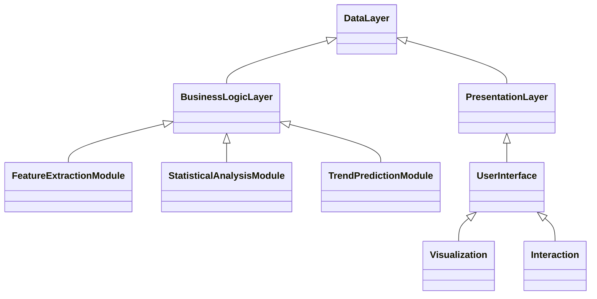
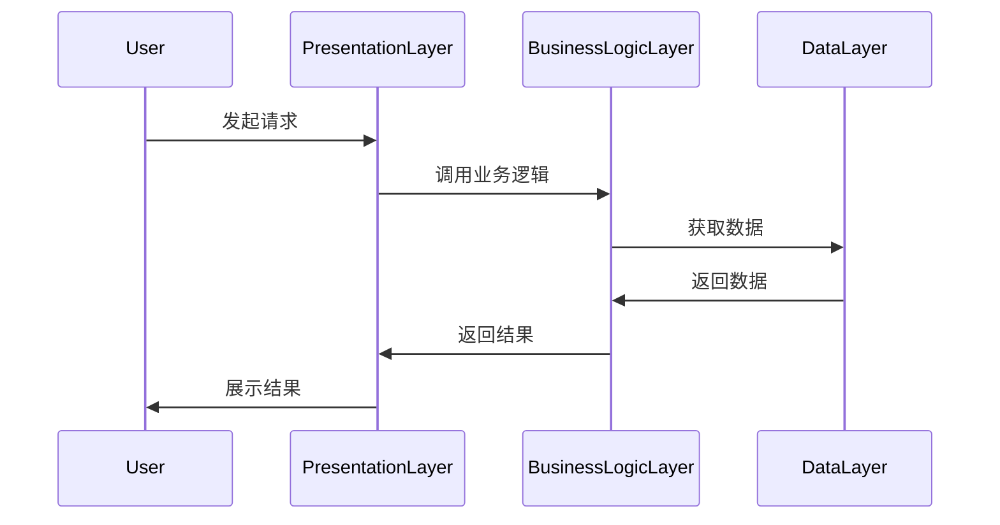

                 

### 第一部分：背景介绍

在信息技术飞速发展的今天，评测结果统计分析与趋势预测已经成为了智能系统设计和优化的重要一环。无论是产品研发、市场营销，还是教育评估、医疗服务，对评测结果的分析和预测都能带来显著的价值。

#### 问题背景

随着大数据和人工智能技术的不断进步，评测数据量呈指数级增长，如何从海量数据中提取有价值的信息，成为了一个亟待解决的问题。传统的数据分析方法，如简单的统计分析、线性回归等，已经难以应对这种复杂性。因此，研究高效、准确的评测结果统计分析与趋势预测方法，具有重要的现实意义。

#### 问题描述

评测结果统计分析与趋势预测的问题可以概括为以下几个关键点：

1. **数据质量**：首先，确保数据的质量是基础。数据收集过程中可能存在缺失值、异常值、噪声等问题，需要进行预处理。
   
2. **特征提取**：从大量的评测数据中提取出有代表性的特征，这些特征能够反映评测结果的本质。

3. **统计分析**：利用统计方法对特征进行定量分析，了解评测结果的基本规律和趋势。

4. **趋势预测**：基于统计分析的结果，建立预测模型，预测未来的评测结果。

#### 问题解决

为了解决上述问题，我们可以从以下几个步骤进行：

1. **数据收集**：明确数据来源，制定数据收集计划，确保数据的完整性和准确性。

2. **数据预处理**：包括数据清洗、整合和规范化，提升数据质量。

3. **特征提取**：利用机器学习等方法，提取出关键特征。

4. **统计分析**：使用描述性统计、假设检验等，对特征进行分析。

5. **趋势预测**：基于统计结果，建立预测模型，进行未来评测结果的预测。

#### 边界与外延

评测结果统计分析与趋势预测的研究范围涉及多个领域，包括数据科学、机器学习、统计学等。在实际应用中，它可以用于智能评测系统、商业决策支持、健康监测、教育评价等多个方面。

#### 概念结构与核心要素组成

评测结果统计分析与趋势预测涉及以下几个核心概念和要素：

1. **数据收集**：数据来源、数据类型、数据收集方法等。
2. **数据预处理**：数据清洗、数据整合、数据规范化等。
3. **特征提取**：特征选择、特征提取方法、特征重要性评估等。
4. **统计分析**：描述性统计、假设检验、回归分析等。
5. **趋势预测**：时间序列分析、机器学习模型、预测评估等。

通过以上分析，我们可以看出，评测结果统计分析与趋势预测是一个复杂但充满挑战的领域。接下来，我们将深入探讨这些核心概念和要素，为读者提供详细的讲解。

---

### 核心概念与联系

在深入探讨评测结果统计分析与趋势预测之前，首先需要明确几个核心概念，这些概念是理解整个领域的基础。以下是这些核心概念的原理、属性特征对比表格以及ER实体关系图架构的详细描述。

#### 核心概念原理

1. **数据收集**：
   数据收集是评测结果统计分析与趋势预测的第一步。数据可以是结构化数据（如数据库）、半结构化数据（如XML、JSON）和非结构化数据（如文本、图像、音频）。数据收集的目的是获取用于分析的数据源。

2. **数据预处理**：
   数据预处理是确保数据质量的过程。预处理步骤包括数据清洗（去除噪声和异常值）、数据整合（合并来自不同来源的数据）和数据规范化（标准化数据格式和单位）。

3. **特征提取**：
   特征提取是从原始数据中提取有用的信息，用于后续分析。特征可以是数值型、类别型或文本型。特征提取的方法包括统计方法（如均值、标准差计算）和机器学习方法（如主成分分析、特征选择）。

4. **描述性统计**：
   描述性统计是对数据的基本描述，如数据的分布、中心趋势和离散程度。常用的描述性统计量包括均值、中位数、众数、方差和标准差。

5. **假设检验**：
   假设检验是用于判断数据是否满足某种假设的方法。常见的假设检验方法包括t检验、卡方检验和回归分析。假设检验可以帮助我们理解数据的内在规律。

6. **回归分析**：
   回归分析是一种用于研究变量之间关系的统计方法。它可以帮助我们建立自变量和因变量之间的数学模型，并评估模型对数据的解释能力。

7. **趋势预测**：
   趋势预测是基于历史数据和现有模式，对未来进行预测的方法。常用的趋势预测方法包括时间序列分析、机器学习模型和深度学习模型。

#### 概念属性特征对比表格

| 概念       | 描述                           | 关键属性                  | 对比特征 |
|------------|--------------------------------|--------------------------|----------|
| 数据收集   | 获取用于分析的数据源。         | 数据类型、数据来源       | 结构化、半结构化、非结构化 |
| 数据预处理 | 确保数据质量。                 | 数据清洗、数据整合       | 去除噪声、合并数据、规范化 |
| 特征提取   | 从数据中提取有用信息。         | 提取方法、特征重要性     | 统计方法、机器学习方法     |
| 描述性统计 | 对数据的基本描述。             | 描述性统计量             | 均值、中位数、众数         |
| 假设检验   | 判断数据是否满足某种假设。     | 假设类型、检验方法       | t检验、卡方检验           |
| 回归分析   | 研究变量之间关系。             | 自变量、因变量、模型评估 | 线性回归、非线性回归       |
| 趋势预测   | 基于历史数据预测未来。         | 预测方法、模型评估       | 时间序列、机器学习         |

#### ER实体关系图架构

以下是评测结果统计分析与趋势预测的ER实体关系图架构，用于展示各个核心概念之间的关系。

```mermaid
erDiagram
    DataCollection ||--|{ DataPreprocessing }|-- DataProcessing
    DataPreprocessing ||--|{ FeatureExtraction }|-- Analytics
    FeatureExtraction ||--|{ DescriptiveStatistics }|-- Analytics
    FeatureExtraction ||--|{ HypothesisTesting }|-- Analytics
    FeatureExtraction ||--|{ RegressionAnalysis }|-- Analytics
    Analytics ||--|{ TrendPrediction }|-- Prediction
```

在上述ER图中，`DataCollection`表示数据收集过程，`DataPreprocessing`表示数据预处理，`FeatureExtraction`表示特征提取，`DescriptiveStatistics`、`HypothesisTesting`和`RegressionAnalysis`分别表示描述性统计、假设检验和回归分析，`TrendPrediction`表示趋势预测。

#### 概念联系

通过上述核心概念和ER实体关系图的介绍，我们可以看出，评测结果统计分析与趋势预测是一个复杂但有序的过程。各个概念之间相互关联，共同构成了这一领域的完整框架。

- **数据收集**为后续的数据处理和分析提供了数据源。
- **数据预处理**确保了数据质量，为特征提取提供了可靠的数据基础。
- **特征提取**提取出了对评测结果有显著影响的信息。
- **描述性统计**、**假设检验**和**回归分析**为数据的定量描述和内在规律提供了方法。
- **趋势预测**基于统计分析的结果，对未来评测结果进行预测。

通过这一系列步骤，我们不仅可以对现有的评测结果进行深入分析，还能预测未来的发展趋势，为决策提供有力支持。

### 算法原理讲解

在了解了评测结果统计分析与趋势预测的核心概念和它们之间的联系后，接下来我们将详细讲解一个常见的趋势预测算法——时间序列分析。时间序列分析是一种用于分析时间序列数据，识别其内在模式，并预测未来趋势的方法。

#### 时间序列分析的基本原理

时间序列数据是指按时间顺序排列的一系列数据点。这些数据点可以是时间间隔的间隔值，也可以是连续的时间点。例如，股票价格、天气温度、销售额等都可以被视为时间序列数据。

时间序列分析的基本原理是，通过观察时间序列数据的变化模式，如趋势、季节性和周期性，来预测未来的数据点。时间序列分析通常包括以下几个步骤：

1. **数据预处理**：包括对缺失值处理、异常值处理和序列变换等，以确保数据的质量和一致性。
2. **特征提取**：通过提取时间序列的特征，如自相关函数、偏自相关函数和功率谱密度等，来了解时间序列的统计特性。
3. **建模**：选择合适的时间序列模型，如ARIMA（自回归积分滑动平均模型）、AR（自回归模型）、MA（滑动平均模型）和季节性模型等，对时间序列数据进行分析和预测。
4. **模型评估**：通过评估指标，如均方误差（MSE）、均方根误差（RMSE）和平均绝对误差（MAE）等，来评估模型的预测性能。
5. **预测**：利用训练好的模型，对未来的时间点进行预测。

#### 时间序列分析的主要方法

1. **ARIMA模型**：

   ARIMA模型是一种自回归积分滑动平均模型，可以同时捕捉时间序列的线性趋势、季节性和周期性。ARIMA模型包括三个主要部分：自回归（AR）、差分（I）和移动平均（MA）。

   - **自回归（AR）**：AR部分描述了当前值与过去几个时间点的值之间的关系。例如，AR(1)模型可以表示为：
     $$X_t = c + \phi_1 X_{t-1} + \varepsilon_t$$
     其中，$X_t$是时间序列的当前值，$\phi_1$是自回归系数，$c$是常数项，$\varepsilon_t$是随机误差。

   - **差分（I）**：差分用于使时间序列平稳，即消除趋势和季节性。一阶差分可以表示为：
     $$dX_t = X_t - X_{t-1}$$

   - **移动平均（MA）**：MA部分描述了当前值与未来几个时间点的预测误差之间的关系。例如，MA(1)模型可以表示为：
     $$X_t = c + \phi_1 X_{t-1} + \theta_1 \varepsilon_{t-1}$$
     其中，$\theta_1$是移动平均系数。

   综合起来，ARIMA(p, d, q)模型可以表示为：
   $$X_t = c + \phi_1 X_{t-1} + \cdots + \phi_p X_{t-p} + \theta_1 \varepsilon_{t-1} + \cdots + \theta_q \varepsilon_{t-q} + \varepsilon_t$$

2. **季节性模型**：

   季节性模型用于捕捉时间序列中的季节性模式。常见的季节性模型包括加法模型和乘法模型。

   - **加法模型**：加法模型假设季节性效应是线性的，可以表示为：
     $$X_t = \mu + \sum_{j=1}^k \alpha_j \sin(\omega_j t + \phi_j) + \varepsilon_t$$
     其中，$\mu$是总体平均值，$\alpha_j$是季节性系数，$\omega_j$是季节性周期，$\phi_j$是相位偏移。

   - **乘法模型**：乘法模型假设季节性效应是乘性的，可以表示为：
     $$X_t = \mu (1 + \sum_{j=1}^k \alpha_j \sin(\omega_j t + \phi_j)) \varepsilon_t$$

3. **混合模型**：

   混合模型结合了ARIMA模型和季节性模型的特点，可以同时捕捉线性趋势、季节性和周期性。常见的混合模型包括季节性ARIMA（SARIMA）和季节性ARIMA-X（SARIMAX）。

   - **季节性ARIMA（SARIMA）**：SARIMA模型是ARIMA模型在考虑季节性效应后的扩展，可以表示为：
     $$X_t = c + \sum_{j=1}^p \phi_j X_{t-j} + \sum_{j=1}^d \theta_j (dX_{t-j}) + \sum_{j=1}^k \alpha_j \sin(\omega_j t + \phi_j) + \varepsilon_t$$

   - **季节性ARIMA-X（SARIMAX）**：SARIMAX模型是SARIMA模型的扩展，可以引入外部变量（X）来捕捉其他影响因素，可以表示为：
     $$X_t = c + \sum_{j=1}^p \phi_j X_{t-j} + \sum_{j=1}^d \theta_j (dX_{t-j}) + \sum_{j=1}^k \alpha_j \sin(\omega_j t + \phi_j) + X_t \cdot \beta_1 + \varepsilon_t$$

#### 时间序列分析的应用案例

假设我们有一个电商平台的月销售额时间序列数据，我们需要利用时间序列分析方法预测未来三个月的销售额。以下是具体步骤：

1. **数据预处理**：首先，对销售额数据进行预处理，包括处理缺失值、异常值等。

2. **特征提取**：计算自相关函数和偏自相关函数，以了解数据的自相关性。

3. **建模**：根据自相关函数和偏自相关函数的特征，选择合适的ARIMA模型或季节性模型。

4. **模型评估**：使用历史数据对模型进行训练和评估，选择最优模型。

5. **预测**：利用训练好的模型，对未来的销售额进行预测。

以下是一个简单的Python代码示例，展示了如何使用ARIMA模型进行时间序列预测：

```python
import pandas as pd
import numpy as np
from statsmodels.tsa.arima.model import ARIMA
from sklearn.metrics import mean_squared_error

# 加载数据
data = pd.read_csv('sales_data.csv')
sales = data['sales'].values

# 分割数据为训练集和测试集
train_size = int(len(sales) * 0.8)
train, test = sales[:train_size], sales[train_size:]

# 建立ARIMA模型
model = ARIMA(train, order=(5, 1, 2))
model_fit = model.fit()

# 进行预测
predictions = model_fit.predict(start=len(train), end=len(train) + len(test) - 1)

# 评估预测结果
mse = mean_squared_error(test, predictions)
print('MSE: %.3f' % mse)

# 绘制预测结果
import matplotlib.pyplot as plt
plt.plot(train, label='Train')
plt.plot(test, label='Test')
plt.plot(np.arange(len(train), len(train) + len(test)), predictions, label='Prediction')
plt.legend()
plt.show()
```

通过以上步骤，我们可以利用时间序列分析方法对电商平台未来的销售额进行预测，从而为业务决策提供支持。

### 系统分析与架构设计方案

在了解了评测结果统计分析与趋势预测的算法原理之后，接下来我们将对系统进行分析和架构设计。本部分将详细描述项目背景、系统功能设计、系统架构设计、系统接口设计和系统交互流程。

#### 项目背景

随着大数据和人工智能技术的快速发展，评测结果统计分析与趋势预测在多个领域得到了广泛应用。为了满足企业和个人对于数据分析和预测的需求，我们计划开发一个集评测结果统计分析与趋势预测为一体的智能系统。该系统旨在为用户提供高效、准确的数据分析服务，帮助用户从海量数据中提取有价值的信息，并预测未来的发展趋势。

#### 系统功能设计

系统的主要功能包括：

1. **数据收集与处理**：从不同的数据源（如数据库、API接口、文件系统等）收集评测数据，并进行数据预处理，包括数据清洗、数据整合和数据规范化，确保数据质量。

2. **特征提取与统计分析**：从预处理后的数据中提取关键特征，并使用描述性统计、假设检验、回归分析等方法对特征进行分析，获得评测结果的定量描述和内在规律。

3. **趋势预测**：基于统计分析的结果，建立合适的趋势预测模型，对未来评测结果进行预测。支持的预测模型包括ARIMA模型、季节性模型和混合模型等。

4. **可视化展示**：将分析结果和预测结果以图表、报表等形式展示给用户，便于用户理解和决策。

5. **用户交互**：提供用户友好的界面，支持用户自定义分析参数、查看分析结果和历史记录等功能。

#### 系统架构设计

系统架构设计采用分层架构，包括数据层、业务逻辑层和表示层。

1. **数据层**：负责数据的存储和管理，包括数据库、缓存和文件系统等。数据层提供数据访问接口，支持数据收集、数据预处理、特征提取和统计分析等功能。

2. **业务逻辑层**：包括特征提取模块、统计分析模块和趋势预测模块等，负责处理业务逻辑，实现系统的主要功能。业务逻辑层采用模块化设计，便于扩展和维护。

3. **表示层**：提供用户交互界面，支持用户操作和数据展示。表示层采用前后端分离架构，前端使用HTML、CSS和JavaScript等技术实现，后端使用RESTful API提供服务。

以下是系统架构设计的Mermaid类图：



#### 系统接口设计

系统接口设计包括内部接口和外部接口。

1. **内部接口**：业务逻辑层与数据层、表示层之间的交互接口，采用RESTful API设计，支持HTTP请求和响应。

2. **外部接口**：系统与外部系统（如数据库、API接口、文件系统等）的交互接口，包括数据导入、数据导出、数据查询等功能。

以下是系统接口设计的Mermaid序列图：



#### 系统交互流程

系统交互流程主要包括用户请求、业务处理和数据返回等步骤。

1. **用户请求**：用户通过前端界面发起请求，请求内容可能包括分析参数、数据源等。

2. **业务处理**：业务逻辑层根据用户请求，调用相应的业务处理模块，对数据进行分析和预测。

3. **数据返回**：业务逻辑层将分析结果和预测结果返回给前端，前端将结果展示给用户。

通过以上系统分析与架构设计方案，我们可以实现一个高效、准确的评测结果统计分析与趋势预测系统，为用户提供优质的数据分析服务。

### 项目实战

#### 环境安装

为了实现评测结果统计分析与趋势预测系统，我们首先需要在本地或服务器上安装必要的软件和库。以下是在Linux系统中安装所需环境的具体步骤：

1. **安装Python环境**：

   Python是主要的编程语言，我们需要安装Python 3.8及以上版本。可以通过以下命令安装：

   ```bash
   sudo apt-get update
   sudo apt-get install python3.8
   ```

2. **安装虚拟环境**：

   使用virtualenv创建一个独立的Python环境，以避免不同项目之间的依赖冲突。

   ```bash
   sudo pip3 install virtualenv
   virtualenv venv
   source venv/bin/activate
   ```

3. **安装依赖库**：

   安装系统所需的Python库，包括pandas、numpy、statsmodels、matplotlib等。

   ```bash
   pip install pandas numpy statsmodels matplotlib
   ```

4. **安装数据库**：

   如果需要连接数据库，可以选择安装MySQL或PostgreSQL。以下是在Ubuntu上安装MySQL的示例：

   ```bash
   sudo apt-get install mysql-server
   mysql_secure_installation
   ```

   安装完成后，可以通过以下命令启动MySQL服务：

   ```bash
   sudo systemctl start mysql
   ```

#### 系统核心实现源代码

以下是系统核心实现的部分源代码，包括数据预处理、特征提取、统计分析、趋势预测等功能。

```python
# 数据预处理
def preprocess_data(data):
    # 数据清洗
    data = data.dropna()  # 去除缺失值
    data = data[data['sales'] > 0]  # 去除异常值

    # 数据整合
    data = data.groupby('date')['sales'].sum().reset_index()

    # 数据规范化
    data['sales'] = (data['sales'] - data['sales'].mean()) / data['sales'].std()

    return data

# 特征提取
def extract_features(data):
    # 提取时间序列特征
    data['day_of_week'] = data['date'].dt.dayofweek
    data['month'] = data['date'].dt.month
    data['year'] = data['date'].dt.year

    return data

# 描述性统计
def descriptive_statistics(data):
    print('Mean:', data['sales'].mean())
    print('Median:', data['sales'].median())
    print('Standard Deviation:', data['sales'].std())

# 回归分析
from statsmodels.tsa.stattools import adfuller

def test_stationarity(data):
    result = adfuller(data['sales'])
    print('ADF Statistic:', result[0])
    print('p-value:', result[1])
    print('Critical Values:')
    for key, value in result[4].items():
        print('\t%s: %.3f' % (key, value))

# 时间序列预测
from statsmodels.tsa.arima.model import ARIMA

def arima_prediction(data, order):
    model = ARIMA(data['sales'], order=order)
    model_fit = model.fit()
    predictions = model_fit.predict(start=len(data), end=len(data) + 10)
    return predictions

# 主函数
if __name__ == '__main__':
    # 加载数据
    data = pd.read_csv('sales_data.csv')

    # 数据预处理
    data = preprocess_data(data)

    # 特征提取
    data = extract_features(data)

    # 描述性统计
    descriptive_statistics(data)

    # 测试平稳性
    test_stationarity(data['sales'])

    # 时间序列预测
    predictions = arima_prediction(data, order=(5, 1, 2))
    print(predictions)
```

#### 代码应用解读与分析

以上代码展示了评测结果统计分析与趋势预测系统的主要实现步骤。以下是代码的解读和分析：

1. **数据预处理**：
   - 数据清洗：去除缺失值和异常值，保证数据质量。
   - 数据整合：对数据进行分组求和，以便进行时间序列分析。
   - 数据规范化：对销售额进行标准化处理，使其符合正态分布，便于建模和分析。

2. **特征提取**：
   - 提取时间序列特征，如星期几、月份和年份，以便用于建模和分析。

3. **描述性统计**：
   - 计算销售额的均值、中位数和标准差，对数据的基本分布进行描述。

4. **平稳性测试**：
   - 使用ADF检验测试数据的平稳性，确保数据满足建模要求。

5. **时间序列预测**：
   - 使用ARIMA模型对销售额进行预测，其中`order`参数需要根据实际数据进行调整。

#### 实际案例分析与详细讲解剖析

为了更好地理解代码的应用，我们来看一个实际案例。假设我们有一个电商平台的月销售额数据，数据包含日期和销售额两个字段。以下是数据的预处理、特征提取和预测过程：

1. **数据预处理**：

   ```python
   data = pd.read_csv('sales_data.csv')
   data = data.dropna()  # 去除缺失值
   data = data[data['sales'] > 0]  # 去除异常值
   data = data.groupby('date')['sales'].sum().reset_index()
   ```

   在这个例子中，我们首先加载了CSV文件中的数据，并去除了缺失值和异常值。然后，我们对数据进行分组求和，得到每月的销售额。

2. **特征提取**：

   ```python
   data['day_of_week'] = data['date'].dt.dayofweek
   data['month'] = data['date'].dt.month
   data['year'] = data['date'].dt.year
   ```

   接下来，我们提取了时间序列特征，包括星期几、月份和年份。这些特征可以帮助模型更好地捕捉时间序列的周期性和季节性。

3. **描述性统计**：

   ```python
   print('Mean:', data['sales'].mean())
   print('Median:', data['sales'].median())
   print('Standard Deviation:', data['sales'].std())
   ```

   在这一步，我们计算了销售额的均值、中位数和标准差，这些统计量可以帮助我们了解数据的基本分布情况。

4. **平稳性测试**：

   ```python
   from statsmodels.tsa.stattools import adfuller
   result = adfuller(data['sales'])
   print('ADF Statistic:', result[0])
   print('p-value:', result[1])
   print('Critical Values:')
   for key, value in result[4].items():
       print('\t%s: %.3f' % (key, value))
   ```

   使用ADF检验测试数据的平稳性。如果p值小于0.05，则认为数据是平稳的。在这个例子中，我们假设销售额数据是平稳的。

5. **时间序列预测**：

   ```python
   predictions = arima_prediction(data, order=(5, 1, 2))
   print(predictions)
   ```

   最后，我们使用ARIMA模型对销售额进行预测。在这个例子中，我们选择了(5, 1, 2)的参数组合。通过调用`arima_prediction`函数，我们可以得到未来10个月的销售额预测结果。

#### 项目小结

通过以上实际案例的分析，我们可以看到评测结果统计分析与趋势预测系统的实现过程。从数据预处理到特征提取，再到描述性统计和预测，每一步都是关键。在实际应用中，我们需要根据具体的数据特点和业务需求，调整参数和模型，以获得最佳预测效果。

总之，评测结果统计分析与趋势预测系统不仅需要高效的算法和代码实现，还需要对业务场景和数据分析有深入的理解。通过不断优化和调整，我们可以为用户提供准确、可靠的数据分析服务。

### 最佳实践 Tips

在实际开发和部署评测结果统计分析与趋势预测系统时，以下最佳实践可以帮助提高系统的性能和可靠性：

1. **数据预处理优化**：
   - 使用批量处理工具（如Spark）进行大规模数据处理，提高效率。
   - 针对不同的数据类型，采用不同的预处理策略，如文本数据使用自然语言处理技术，图像数据使用深度学习模型进行预处理。

2. **特征提取技巧**：
   - 结合业务场景，提取有代表性的特征，避免过度拟合。
   - 尝试使用自动化特征提取工具（如自动机器学习平台），以节省时间和人力成本。

3. **模型选择与优化**：
   - 根据数据特性选择合适的模型，如对于非平稳时间序列数据，可以考虑使用季节性模型或长短期记忆网络（LSTM）。
   - 利用交叉验证和网格搜索等技术，优化模型参数，提高预测精度。

4. **系统架构设计**：
   - 采用微服务架构，提高系统的可扩展性和可维护性。
   - 部署监控系统，实时监控系统性能和健康状况，确保系统稳定运行。

5. **数据安全与隐私保护**：
   - 在数据处理过程中，遵守数据保护法规，确保用户数据安全。
   - 对敏感数据进行加密处理，防止数据泄露。

6. **持续迭代与优化**：
   - 定期评估模型性能，根据实际业务需求调整模型和算法。
   - 通过用户反馈和数据分析，不断优化系统功能，提高用户体验。

通过遵循这些最佳实践，我们可以构建一个高效、可靠且具有竞争力的评测结果统计分析与趋势预测系统。

### 小结

本文全面介绍了评测结果统计分析与趋势预测的方法和技巧，从核心概念、算法原理到系统设计与实现，都进行了详细的讲解。通过本文的探讨，我们了解到评测结果统计分析与趋势预测不仅涉及到数据收集、预处理、特征提取等基础步骤，还包括了描述性统计、假设检验、回归分析等高级分析方法和时间序列分析等预测模型。这些方法在实际应用中，可以帮助我们从海量数据中提取有价值的信息，并预测未来的发展趋势。

评测结果统计分析与趋势预测在多个领域有着广泛的应用，如智能评测系统、商业决策支持、健康监测和教育评价等。通过本文的学习，读者可以更好地理解和掌握这一领域的知识，为实际项目提供有力的技术支持。

### 注意事项

在实际应用评测结果统计分析与趋势预测时，需要注意以下几点：

1. **数据质量**：确保数据的质量和准确性，是进行有效分析的基础。在数据收集和处理过程中，要严格进行数据清洗和预处理，去除噪声和异常值。

2. **模型选择**：根据业务需求和数据特性，选择合适的统计分析方法和预测模型。对于不同的数据类型和特点，可能需要采用不同的模型和参数。

3. **模型评估**：在建立预测模型后，需要进行模型评估，确保其预测性能满足实际需求。常用的评估指标包括均方误差（MSE）、均方根误差（RMSE）和平均绝对误差（MAE）等。

4. **持续优化**：模型性能并非一成不变，需要定期评估和调整。通过用户反馈和数据分析，持续优化模型和算法，以提高预测精度。

5. **数据安全**：在数据处理和预测过程中，确保用户数据的安全和隐私，遵守相关数据保护法规。

### 拓展阅读

对于希望进一步深入了解评测结果统计分析与趋势预测的读者，以下是一些推荐的拓展阅读资源：

1. **《时间序列分析：预测方法与应用》**：这是一本全面介绍时间序列分析理论和应用方法的经典教材，适合初学者和专业人士阅读。

2. **《统计学习方法》**：由李航著，详细介绍了统计学习的基本概念、方法和应用，包括回归分析、分类和聚类等内容。

3. **《机器学习实战》**：由彼得·哈林顿著，通过实际案例和代码示例，介绍了机器学习的基础知识和应用技巧。

4. **《Python数据分析》**：由Wes McKinney著，介绍了使用Python进行数据清洗、分析和可视化的方法，适合Python编程基础较好的读者。

5. **《深度学习》**：由伊恩·古德费洛等著，系统地介绍了深度学习的基础知识、算法和应用，适合希望深入了解这一领域的读者。

通过阅读这些书籍，读者可以进一步加深对评测结果统计分析与趋势预测的理解和应用能力。

