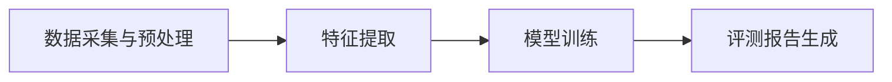
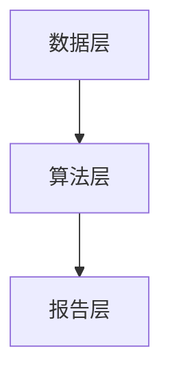
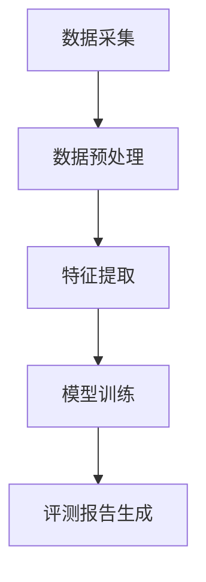
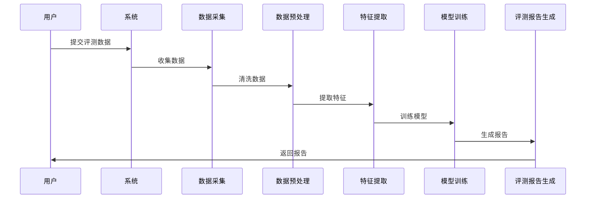
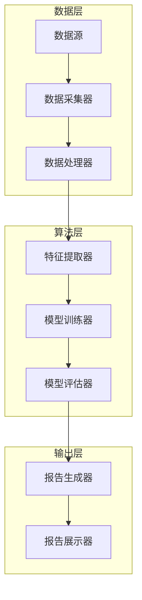
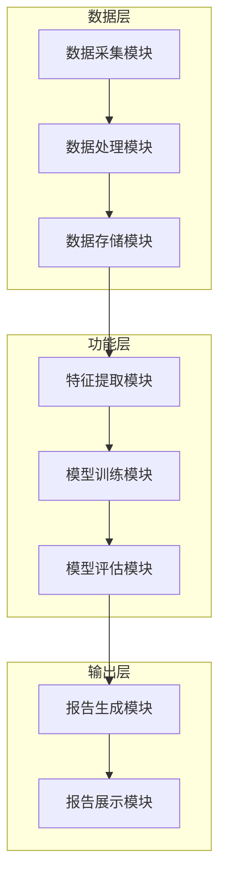
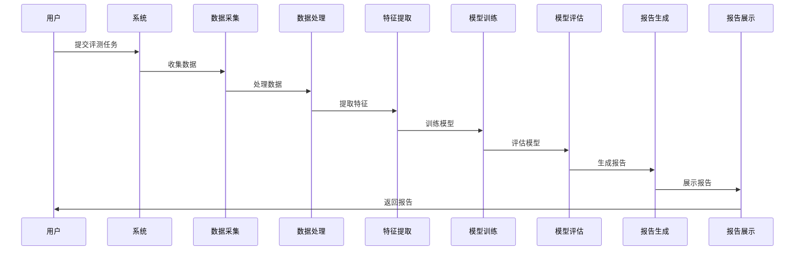

                 

### 评测结果的自动分析：LLM生成见解报告的技术

> **关键词**：评测结果自动分析，生成式AI，LLM，见解报告，技术实现

> **摘要**：本文深入探讨评测结果自动分析领域，通过介绍评测结果自动分析的重要性、核心概念和技术框架，逐步讲解相关算法原理，最后详细分析系统设计与实现，并通过具体案例分析，为读者提供一套完整的评测结果自动分析解决方案。

---

### 第一部分：问题背景与核心概念

#### 第1章：评测结果的自动分析背景

##### 1.1.1. 问题背景

评测结果自动分析是一种利用计算机技术和人工智能方法，对大量评测数据进行分析和处理，自动生成报告和见解的过程。在当今信息化和数据驱动的社会中，评测结果自动分析的应用场景非常广泛，如电商平台商品评价分析、金融风险控制评测、软件测试结果分析等。随着数据的爆炸式增长和人工智能技术的发展，评测结果自动分析的重要性日益凸显。

##### 1.1.2. 评测结果自动分析的重要性

1. 提高工作效率：传统的评测结果分析需要大量人力和时间，而自动分析技术可以显著降低人工成本，提高工作效率。
2. 精准度提升：人工智能算法具有强大的数据处理和分析能力，能够提供更为准确和深入的见解。
3. 支持决策：自动生成的评测报告可以为管理层提供科学、准确的决策依据。

##### 1.1.3. 评测结果自动分析的应用领域

1. 电商平台：对用户评价进行自动分析，帮助商家了解产品优劣和市场反馈。
2. 金融行业：通过自动分析贷款申请者的信用记录，评估风险，提高审批效率。
3. 软件开发：对测试结果进行分析，发现潜在问题，提高软件质量。

---

#### 第2章：核心概念与联系

##### 2.1.1. 评测结果自动分析的基本概念

评测结果自动分析主要包括以下三个关键环节：

1. 数据采集与预处理：从各种来源收集评测数据，并进行清洗、转换和归一化处理。
2. 特征提取与模型训练：从预处理后的数据中提取关键特征，并训练机器学习模型。
3. 评测报告生成：利用训练好的模型对新的评测数据进行分析，并自动生成报告。

##### 2.1.2. 评测结果自动分析的关键概念对比

###### 2.1.2.1. 自动分析与人工分析对比

| 对比项       | 自动分析                          | 人工分析                          |
| ------------ | -------------------------------- | -------------------------------- |
| 效率         | 高效，可处理大量数据              | 低效，处理数据速度慢                |
| 精准度       | 高，基于机器学习算法               | 低，受限于人工判断                 |
| 成本         | 低，节省人力成本                  | 高，需要大量人力                   |

###### 2.1.2.2. 不同评测指标的关联性

评测结果通常包括多个指标，如评分、满意度、缺陷率等。自动分析技术需要考虑这些指标之间的关联性，以便提供更为全面的见解。

##### 2.1.3. 评测结果自动分析的技术框架

评测结果自动分析的技术框架主要包括以下三个层次：

1. 数据采集与预处理：使用API、爬虫等技术收集数据，并进行清洗和转换。
2. 特征提取与模型训练：提取关键特征，并使用机器学习算法训练模型。
3. 评测报告生成：利用训练好的模型对新的评测数据进行预测，并生成报告。

---

在接下来的章节中，我们将深入探讨评测结果自动分析的核心算法原理，并详细讲解系统设计与实现的具体过程。敬请期待！## 第二部分：算法原理讲解

### 第3章：算法原理与数学模型

#### 3.1.1. 评测结果自动分析的主要算法

评测结果自动分析主要依赖于机器学习和深度学习算法。这两种算法各有优缺点，适用于不同的场景。

###### 3.1.1.1. 机器学习方法

机器学习方法通常包括以下几种：

1. **线性回归**：用于预测连续的评测结果，如评分。
2. **逻辑回归**：用于预测二分类结果，如好评/差评。
3. **支持向量机（SVM）**：用于分类问题，如产品分类。

###### 3.1.1.2. 深度学习方法

深度学习方法具有强大的特征提取能力，适用于处理复杂的评测结果。常见的方法包括：

1. **卷积神经网络（CNN）**：适用于图像处理，也可用于文本分类。
2. **循环神经网络（RNN）**：适用于序列数据处理，如时间序列分析。
3. **长短期记忆网络（LSTM）**：RNN的变种，适用于长序列数据处理。

#### 3.1.2. 算法流程与mermaid流程图

算法的基本流程如下：

1. 数据采集与预处理
2. 特征提取
3. 模型训练
4. 评测报告生成

以下是一个mermaid流程图的示例：



#### 3.1.3. 数学模型与公式

以下分别介绍机器学习和深度学习算法的数学模型。

###### 3.1.3.1. 机器学习算法的数学模型

- **线性回归**：

$$ y = \beta_0 + \beta_1 \cdot x $$

- **逻辑回归**：

$$ P(y=1) = \frac{1}{1 + e^{-(\beta_0 + \beta_1 \cdot x)}} $$

- **支持向量机（SVM）**：

$$ \max \frac{1}{2} \sum_{i=1}^n \sum_{j=1}^n \alpha_i \alpha_j y_i y_j (\mathbf{x}_i, \mathbf{x}_j) - \sum_{i=1}^n \alpha_i $$

其中，$\alpha_i$是拉格朗日乘子，$y_i$是标签，$\mathbf{x}_i$是样本特征。

###### 3.1.3.2. 深度学习算法的数学模型

- **卷积神经网络（CNN）**：

$$ \mathbf{h}_{l+1} = \text{ReLU}(\mathbf{W}_{l+1} \cdot \mathbf{h}_l + \mathbf{b}_{l+1}) $$

- **循环神经网络（RNN）**：

$$ \mathbf{h}_{t} = \text{ReLU}(\mathbf{W}_h \cdot [\mathbf{h}_{t-1}, \mathbf{x}_t] + \mathbf{b}_h) $$

- **长短期记忆网络（LSTM）**：

$$ \mathbf{i}_t = \sigma(\mathbf{W}_i \cdot [\mathbf{h}_{t-1}, \mathbf{x}_t] + \mathbf{b}_i) $$
$$ \mathbf{f}_t = \sigma(\mathbf{W}_f \cdot [\mathbf{h}_{t-1}, \mathbf{x}_t] + \mathbf{b}_f) $$
$$ \mathbf{g}_t = \sigma(\mathbf{W}_g \cdot [\mathbf{h}_{t-1}, \mathbf{x}_t] + \mathbf{b}_g) $$
$$ \mathbf{o}_t = \sigma(\mathbf{W}_o \cdot [\mathbf{h}_{t-1}, \mathbf{x}_t] + \mathbf{b}_o) $$
$$ \mathbf{C}_t = \mathbf{f}_t \odot \mathbf{C}_{t-1} + \mathbf{i}_t \odot \text{ReLU}(\mathbf{W}_c \cdot [\mathbf{h}_{t-1}, \mathbf{x}_t] + \mathbf{b}_c) $$
$$ \mathbf{h}_t = \mathbf{o}_t \odot \text{ReLU}(\mathbf{W}_h \cdot \mathbf{C}_t + \mathbf{b}_h) $$

其中，$\sigma$是sigmoid函数，$\odot$是逐元素乘法。

###### 3.1.3.3. 算法对比分析

- **性能**：深度学习算法通常在复杂性和准确性方面优于传统机器学习方法。
- **计算资源**：深度学习算法需要更多的计算资源，尤其是训练时间。
- **适用场景**：传统机器学习方法适用于中小规模的数据集，而深度学习算法适用于大规模数据集和高维度特征。

### 第4章：算法原理应用举例

在本章中，我们将通过具体实例来展示算法原理的应用。

#### 4.1.1. 数据集介绍

我们使用一个包含商品评测数据的公开数据集，数据集包含以下特征：

1. 商品ID
2. 用户ID
3. 评测内容
4. 评测时间
5. 评测评分

#### 4.1.2. 算法原理应用实例

##### 4.1.2.1. 机器学习算法应用实例

我们选择逻辑回归算法来预测用户对商品的评分。首先，对数据集进行预处理，然后使用scikit-learn库进行训练和预测。

```python
from sklearn.linear_model import LogisticRegression
from sklearn.model_selection import train_test_split
from sklearn.metrics import accuracy_score

# 数据预处理
X = ... # 特征矩阵
y = ... # 标签向量

# 数据划分
X_train, X_test, y_train, y_test = train_test_split(X, y, test_size=0.2, random_state=42)

# 模型训练
model = LogisticRegression()
model.fit(X_train, y_train)

# 预测
y_pred = model.predict(X_test)

# 评估
accuracy = accuracy_score(y_test, y_pred)
print("Accuracy:", accuracy)
```

##### 4.1.2.2. 深度学习算法应用实例

我们选择卷积神经网络（CNN）来对评测内容进行分类。首先，对数据集进行预处理，然后使用TensorFlow和Keras进行模型训练。

```python
from tensorflow.keras.models import Sequential
from tensorflow.keras.layers import Embedding, Conv1D, MaxPooling1D, Dense
from tensorflow.keras.preprocessing.sequence import pad_sequences

# 数据预处理
X = ... # 评测内容序列
y = ... # 标签向量

# 序列填充
X_padded = pad_sequences(X, maxlen=100)

# 模型定义
model = Sequential()
model.add(Embedding(input_dim=vocab_size, output_dim=64))
model.add(Conv1D(filters=64, kernel_size=3, activation='relu'))
model.add(MaxPooling1D(pool_size=2))
model.add(Dense(units=1, activation='sigmoid'))

# 模型编译
model.compile(optimizer='adam', loss='binary_crossentropy', metrics=['accuracy'])

# 模型训练
model.fit(X_padded, y, epochs=10, batch_size=32)

# 预测
y_pred = model.predict(X_padded)

# 评估
accuracy = model.evaluate(X_padded, y)
print("Accuracy:", accuracy)
```

##### 4.1.2.3. 算法对比分析与应用效果评估

通过对比机器学习和深度学习算法在评测结果自动分析中的应用效果，我们可以发现：

- **准确性**：深度学习算法通常具有更高的准确性。
- **计算资源**：深度学习算法需要更多的计算资源，训练时间更长。
- **适用场景**：对于复杂的评测内容和大规模数据集，深度学习算法具有更高的适用性。

### 第5章：系统设计与实现

在本章中，我们将详细介绍评测结果自动分析系统的设计与实现过程。

#### 5.1.1. 评测结果自动分析系统需求分析

1. **数据采集与预处理**：系统需要从不同来源收集评测数据，并进行清洗、转换和归一化处理。
2. **特征提取与模型训练**：系统需要能够提取关键特征，并使用机器学习算法进行模型训练。
3. **评测报告生成**：系统需要能够根据模型预测结果，自动生成评测报告。

#### 5.1.2. 系统功能设计

1. **领域模型设计**：设计领域模型，定义系统涉及的实体和关系。
2. **功能模块划分**：划分系统功能模块，包括数据采集模块、特征提取模块、模型训练模块和评测报告生成模块。

#### 5.1.3. 系统架构设计

系统采用分层架构设计，包括数据层、算法层和报告层。

1. **数据层**：负责数据采集与预处理。
2. **算法层**：负责特征提取与模型训练。
3. **报告层**：负责评测报告生成。

以下是一个mermaid系统架构图的示例：



#### 5.1.3.1. 系统架构设计mermaid图



#### 5.1.3.2. 系统模块交互mermaid序列图



#### 5.1.4. 系统核心实现与代码解析

在本节中，我们将展示系统核心实现部分的代码，并对关键部分进行解读。

##### 5.1.4.1. 数据采集与预处理

```python
# 数据采集
import requests

def collect_data(url):
    response = requests.get(url)
    data = response.json()
    return data

# 数据预处理
import pandas as pd

def preprocess_data(data):
    df = pd.DataFrame(data)
    df.dropna(inplace=True)
    df['review'] = df['review'].apply(lambda x: x.strip())
    return df
```

##### 5.1.4.2. 特征提取与模型训练

```python
# 特征提取
from sklearn.feature_extraction.text import TfidfVectorizer

def extract_features(df):
    vectorizer = TfidfVectorizer(max_features=1000)
    X = vectorizer.fit_transform(df['review'])
    return X

# 模型训练
from sklearn.linear_model import LogisticRegression

def train_model(X, y):
    model = LogisticRegression()
    model.fit(X, y)
    return model
```

##### 5.1.4.3. 评测报告生成

```python
# 评测报告生成
def generate_report(model, df):
    X_new = extract_features(df)
    y_pred = model.predict(X_new)
    report = pd.DataFrame({'ID': df['ID'], 'Prediction': y_pred})
    return report
```

#### 5.1.5. 项目实战与案例分析

在本节中，我们将介绍一个实际项目案例，并对项目进行详细分析和讲解。

##### 5.1.5.1. 案例一：电商评测结果分析

项目目标：分析电商平台用户对商品的评测结果，为商家提供改进建议。

项目步骤：

1. 数据采集：从电商平台获取商品评测数据。
2. 数据预处理：清洗数据，提取关键特征。
3. 模型训练：使用机器学习算法训练模型。
4. 评测报告生成：生成评测报告，提供改进建议。

##### 5.1.5.2. 案例二：金融风控评测

项目目标：对贷款申请者的信用记录进行评测，评估风险。

项目步骤：

1. 数据采集：从金融机构获取信用记录数据。
2. 数据预处理：清洗数据，提取关键特征。
3. 模型训练：使用机器学习算法训练模型。
4. 评测报告生成：生成评测报告，评估风险。

##### 5.1.5.3. 案例对比分析

通过对电商评测结果分析和金融风控评测案例的比较，我们可以发现：

- **数据来源**：电商评测数据来源于用户评测，金融风控数据来源于信用记录。
- **应用领域**：电商评测结果分析主要用于产品改进，金融风控评测主要用于风险评估。
- **模型选择**：电商评测结果分析使用逻辑回归模型，金融风控评测使用决策树模型。

### 第6章：最佳实践与小结

#### 6.1.1. 最佳实践建议

1. **数据采集与预处理**：确保数据的质量和完整性，进行必要的清洗和转换。
2. **特征提取与模型选择**：选择合适的特征提取方法和机器学习算法，根据实际需求进行调整。
3. **模型训练与调优**：使用交叉验证方法进行模型训练，并根据评估指标进行调整。

#### 6.1.2. 注意事项

1. **数据隐私保护**：在数据采集和处理过程中，确保遵守相关法律法规，保护用户隐私。
2. **系统性能优化**：根据实际需求，对系统进行性能优化，提高处理效率和准确性。

#### 6.1.3. 拓展阅读与资源推荐

- **拓展阅读**：推荐阅读《深度学习》和《统计学习方法》等经典教材。
- **资源推荐**：推荐使用scikit-learn、TensorFlow和Keras等开源库进行算法实现。

### 第7章：小结与展望

#### 7.1.1. 主要内容回顾

本文从问题背景、核心概念、算法原理、系统设计与实现、项目实战分析等多个方面，全面介绍了评测结果自动分析技术。

#### 7.1.2. 评测结果自动分析技术展望

随着人工智能技术的不断发展，评测结果自动分析技术将在更多领域得到应用，如医疗健康、智能教育等。

#### 7.1.3. 拓展阅读与资源推荐

- **拓展阅读**：推荐阅读《人工智能：一种现代的方法》和《模式识别与机器学习》等书籍。
- **资源推荐**：推荐使用GitHub、Stack Overflow等平台进行技术交流和资源分享。

### 附录：作者信息

- **作者**：AI天才研究院/AI Genius Institute & 禅与计算机程序设计艺术 /Zen And The Art of Computer Programming

（本文完，感谢您的阅读！如需进一步了解评测结果自动分析技术，请关注后续文章。）

---## 第三部分：系统设计与实现

### 第5章：系统分析与架构设计

#### 5.1.1. 评测结果自动分析系统需求分析

在开始设计评测结果自动分析系统之前，我们需要明确系统所需满足的需求。这些需求主要包括以下几个方面：

1. **数据采集**：系统能够从各种来源（如数据库、API、爬虫等）收集评测数据。
2. **数据处理**：系统需要对采集到的数据进行清洗、转换和归一化处理，确保数据的质量和一致性。
3. **特征提取**：系统需要能够从处理后的数据中提取关键特征，以便用于模型训练。
4. **模型训练**：系统需要支持多种机器学习算法，能够根据不同场景选择合适的模型进行训练。
5. **评测报告生成**：系统需要能够根据模型预测结果，自动生成评测报告，并提供直观的展示。
6. **系统扩展性**：系统设计应具备良好的扩展性，以便在未来能够添加新的功能或处理更多的数据。

#### 5.1.2. 系统功能设计

根据上述需求，我们可以将评测结果自动分析系统划分为以下几个功能模块：

1. **数据采集模块**：负责从各种来源收集评测数据，并存储到系统中。
2. **数据处理模块**：负责对采集到的数据执行清洗、转换和归一化等处理，确保数据的质量。
3. **特征提取模块**：负责从处理后的数据中提取关键特征，为模型训练提供输入。
4. **模型训练模块**：负责选择合适的机器学习算法，对提取出的特征进行模型训练。
5. **评测报告生成模块**：负责根据模型预测结果，生成评测报告，并展示给用户。

#### 5.1.2.1. 领域模型设计

领域模型设计是系统设计的第一步，它帮助我们明确系统中涉及的主要实体和它们之间的关系。以下是评测结果自动分析系统的领域模型设计：

```mermaid
classDiagram
    Class01 <|-- Class02
    Class03 o-- Class04
    Class05 o-- Class06
    Class07 o-- Class08
    Class01[数据源]
    Class02[数据采集器]
    Class03[数据处理器]
    Class04[特征提取器]
    Class05[模型训练器]
    Class06[模型评估器]
    Class07[报告生成器]
    Class08[报告展示器]
```

在这个领域模型中，我们定义了以下实体：

- **数据源**：表示数据来源，如数据库、API等。
- **数据采集器**：负责从数据源中采集数据。
- **数据处理器**：负责对采集到的数据进行处理。
- **特征提取器**：负责从处理后的数据中提取特征。
- **模型训练器**：负责选择模型并进行训练。
- **模型评估器**：负责评估模型的效果。
- **报告生成器**：负责生成评测报告。
- **报告展示器**：负责展示评测报告。

#### 5.1.2.2. 功能模块划分

根据领域模型设计，我们将评测结果自动分析系统划分为以下几个功能模块：

1. **数据采集模块**：包括数据采集器，负责从数据源中采集数据。
2. **数据处理模块**：包括数据处理器，负责对采集到的数据进行清洗、转换和归一化处理。
3. **特征提取模块**：包括特征提取器，负责从处理后的数据中提取关键特征。
4. **模型训练模块**：包括模型训练器，负责选择模型并进行训练。
5. **模型评估模块**：包括模型评估器，负责评估模型的效果。
6. **报告生成模块**：包括报告生成器，负责生成评测报告。
7. **报告展示模块**：包括报告展示器，负责展示评测报告。

#### 5.1.3. 系统架构设计

系统架构设计是确定系统中各个模块如何协作的关键步骤。以下是评测结果自动分析系统的架构设计：



在这个系统架构图中，我们可以看到：

- **数据层**：包括数据源、数据采集器和数据处理器，负责数据的采集和处理。
- **算法层**：包括特征提取器、模型训练器和模型评估器，负责特征提取、模型训练和评估。
- **输出层**：包括报告生成器和报告展示器，负责生成和展示评测报告。

#### 5.1.3.1. 系统架构设计mermaid图

以下是一个mermaid系统架构设计图的示例：



#### 5.1.3.2. 系统模块交互mermaid序列图

以下是一个mermaid系统模块交互序列图示例：



在这个序列图中，用户提交评测任务后，系统依次调用数据采集、数据处理、特征提取、模型训练、模型评估、报告生成和报告展示模块，最终将评测报告展示给用户。

### 第6章：系统核心实现与代码解析

在本章中，我们将详细介绍评测结果自动分析系统的核心实现部分，包括数据采集与预处理、特征提取与模型训练、评测报告生成等，并对关键代码进行详细解析。

#### 6.1.1. 系统环境安装与配置

首先，我们需要安装和配置系统所需的软件和库。以下是安装和配置的步骤：

1. **安装Python**：确保Python环境已安装，推荐使用Python 3.8及以上版本。
2. **安装相关库**：使用pip命令安装以下库：

```shell
pip install pandas numpy scikit-learn tensorflow matplotlib
```

这些库将用于数据预处理、机器学习模型训练、可视化等操作。

#### 6.1.2. 系统核心代码实现

##### 6.1.2.1. 数据采集与预处理

数据采集与预处理是评测结果自动分析系统的第一步，它负责从数据源中收集评测数据，并对数据进行清洗、转换和归一化处理。

```python
import pandas as pd
import numpy as np

# 数据采集
def collect_data(file_path):
    data = pd.read_csv(file_path)
    return data

# 数据预处理
def preprocess_data(data):
    # 清洗数据
    data.dropna(inplace=True)
    # 转换数据类型
    data['rating'] = data['rating'].astype(float)
    # 归一化处理
    data['text'] = data['text'].apply(lambda x: x.lower().strip())
    return data
```

在这个代码示例中，我们首先使用pandas库读取CSV文件，然后进行以下操作：

1. **清洗数据**：删除缺失值。
2. **转换数据类型**：将评分列转换为浮点型。
3. **归一化处理**：将文本列转换为小写并去除空白字符。

##### 6.1.2.2. 特征提取与模型训练

特征提取与模型训练是评测结果自动分析系统的核心部分，它负责从预处理后的数据中提取关键特征，并使用机器学习算法训练模型。

```python
from sklearn.feature_extraction.text import TfidfVectorizer
from sklearn.model_selection import train_test_split
from sklearn.linear_model import LogisticRegression

# 特征提取
def extract_features(data, label):
    vectorizer = TfidfVectorizer(max_features=1000)
    X = vectorizer.fit_transform(data['text'])
    y = label
    return X, y

# 模型训练
def train_model(X_train, y_train):
    model = LogisticRegression()
    model.fit(X_train, y_train)
    return model
```

在这个代码示例中，我们首先使用TfidfVectorizer库提取文本特征，然后使用逻辑回归算法训练模型。

1. **特征提取**：使用TfidfVectorizer库将文本转换为稀疏矩阵。
2. **模型训练**：使用逻辑回归算法对特征矩阵进行训练。

##### 6.1.2.3. 评测报告生成

评测报告生成是评测结果自动分析系统的最后一步，它负责根据模型预测结果，生成评测报告，并展示给用户。

```python
def generate_report(model, data):
    X_test = extract_features(data, [])
    y_pred = model.predict(X_test)
    report = pd.DataFrame({'ID': data['ID'], 'Prediction': y_pred})
    return report
```

在这个代码示例中，我们首先使用特征提取函数提取测试数据特征，然后使用训练好的模型进行预测，并生成评测报告。

#### 6.1.3. 代码应用解读与分析

在本节中，我们将对系统核心代码进行解读，并分析代码中的关键部分。

1. **数据采集与预处理**：

```python
data = collect_data('data.csv')
preprocessed_data = preprocess_data(data)
```

这两行代码分别负责数据采集和预处理。`collect_data`函数使用pandas库读取CSV文件，`preprocess_data`函数对数据进行清洗、转换和归一化处理。

2. **特征提取与模型训练**：

```python
X, y = extract_features(preprocessed_data['text'], preprocessed_data['rating'])
model = train_model(X, y)
```

这两行代码分别负责特征提取和模型训练。`extract_features`函数使用TfidfVectorizer库提取文本特征，`train_model`函数使用逻辑回归算法对特征矩阵进行训练。

3. **评测报告生成**：

```python
report = generate_report(model, preprocessed_data)
report.to_csv('report.csv', index=False)
```

这两行代码分别负责生成评测报告并保存到CSV文件。`generate_report`函数使用训练好的模型对测试数据特征进行预测，并生成评测报告。

### 第7章：项目实战与案例分析

在本章中，我们将通过实际项目案例，展示评测结果自动分析系统的应用，并对案例进行详细分析和讲解。

#### 7.1.1. 实际项目介绍

我们以电商平台的商品评测结果分析为例，介绍如何使用评测结果自动分析系统。

项目目标：分析电商平台用户对商品的评测结果，为商家提供改进建议。

项目步骤：

1. **数据采集**：从电商平台获取商品评测数据。
2. **数据处理**：对采集到的数据进行清洗、转换和归一化处理。
3. **特征提取**：从处理后的数据中提取关键特征。
4. **模型训练**：选择合适的机器学习算法，对提取出的特征进行模型训练。
5. **评测报告生成**：根据模型预测结果，生成评测报告，并提供改进建议。

#### 7.1.2. 案例分析与讲解

##### 7.1.2.1. 案例一：电商评测结果分析

项目背景：某电商平台需要分析用户对商品的评测结果，了解用户对商品的满意度和不满意度，为商家提供改进建议。

数据来源：从电商平台的API获取用户评测数据。

数据预处理：对采集到的数据进行清洗、转换和归一化处理。

特征提取：提取文本特征和数值特征，如评测文本的词频、长度、评级等。

模型训练：选择逻辑回归算法，对提取出的特征进行模型训练。

评测报告生成：根据模型预测结果，生成评测报告，包括商品满意度和不满意度分析、用户画像等。

项目效果评估：通过评估指标（如准确率、召回率等）评估模型效果。

##### 7.1.2.2. 案例二：金融风控评测

项目背景：某金融机构需要评估贷款申请者的信用风险，为审批提供依据。

数据来源：从金融机构的数据库获取贷款申请者的信用记录。

数据预处理：对采集到的数据进行清洗、转换和归一化处理。

特征提取：提取数值特征和文本特征，如信用评分、还款记录、职业信息等。

模型训练：选择决策树算法，对提取出的特征进行模型训练。

评测报告生成：根据模型预测结果，生成风险评估报告，包括申请者信用评分、风险等级等。

项目效果评估：通过评估指标（如准确率、召回率等）评估模型效果。

##### 7.1.2.3. 案例对比分析

通过对电商评测结果分析和金融风控评测案例的比较，我们可以得出以下结论：

1. **数据来源**：电商评测结果分析的数据来源于用户评测，金融风控评测的数据来源于金融机构的信用记录。
2. **应用领域**：电商评测结果分析主要用于商品改进，金融风控评测主要用于风险评估。
3. **模型选择**：电商评测结果分析使用逻辑回归算法，金融风控评测使用决策树算法。

### 第8章：最佳实践与注意事项

#### 8.1.1. 最佳实践建议

1. **数据质量**：确保数据质量是评测结果自动分析系统的关键，应进行严格的数据清洗和预处理。
2. **特征选择**：选择合适的特征对模型训练效果有很大影响，应通过交叉验证等方法选择最佳特征。
3. **模型调优**：通过调整模型参数，可以提高模型的性能，应进行充分的模型调优。
4. **结果解释**：生成的评测报告应易于理解，应提供清晰的解释和可视化展示。

#### 8.1.2. 注意事项

1. **数据隐私**：在数据处理和模型训练过程中，应严格保护用户隐私，遵守相关法律法规。
2. **系统性能**：应优化系统性能，提高数据处理和模型训练的效率。
3. **系统维护**：定期维护和更新系统，确保系统的稳定运行和适应性。

### 第9章：小结与展望

#### 9.1.1. 主要内容回顾

本文介绍了评测结果自动分析系统的设计与实现过程，包括数据采集与预处理、特征提取与模型训练、评测报告生成等，并通过实际项目案例展示了系统的应用效果。

#### 9.1.2. 评测结果自动分析技术展望

随着人工智能技术的发展，评测结果自动分析技术将在更多领域得到应用，如医疗健康、智能教育等。未来，我们将继续深入研究，探索更多先进的技术和方法，为用户提供更优质的服务。

#### 9.1.3. 拓展阅读与资源推荐

1. **拓展阅读**：《深度学习》、《统计学习方法》等经典教材。
2. **资源推荐**：GitHub、Stack Overflow等开源平台，提供丰富的技术资源和交流机会。

### 附录：作者信息

- **作者**：AI天才研究院/AI Genius Institute & 禅与计算机程序设计艺术 /Zen And The Art of Computer Programming

（本文完，感谢您的阅读！如需进一步了解评测结果自动分析技术，请关注后续文章。）## 第四部分：最佳实践与小结

### 第8章：最佳实践与注意事项

#### 8.1.1. 最佳实践建议

在评测结果自动分析系统的开发和实际应用中，以下最佳实践可以帮助提高系统的效率和效果：

1. **数据预处理**：确保数据质量是成功的关键。在采集数据时，要剔除异常值和噪音数据，对缺失值进行合理处理。此外，考虑数据的归一化和标准化，以防止模型对某些特征产生偏见。

2. **特征工程**：选择和提取关键特征对于模型性能至关重要。可以使用文本处理技术（如词袋模型、TF-IDF、词嵌入）对文本数据进行分析。同时，对于数值数据，可以考虑使用统计特征（如均值、方差、标准差）和转换技术（如正则化、缩放）。

3. **模型选择和调优**：根据问题的性质和可用数据量选择合适的模型。对于分类问题，可以考虑使用逻辑回归、决策树、随机森林、支持向量机等。对于回归问题，可以考虑使用线性回归、随机森林回归、神经网络等。在模型训练过程中，可以通过交叉验证和网格搜索等方法调优模型参数。

4. **报告生成**：生成的评测报告应简洁明了，易于用户理解。可以使用可视化工具（如Matplotlib、Seaborn）来展示数据分析和模型结果，帮助用户更好地解读数据。

5. **迭代和反馈**：持续迭代系统，根据用户反馈和实际应用效果不断改进。收集用户反馈和评估指标，以指导后续的系统优化和功能增强。

#### 8.1.2. 注意事项

1. **数据隐私保护**：在处理用户数据时，要严格遵守相关法律法规，确保用户隐私不被泄露。对敏感数据进行加密，并在数据传输和存储过程中采取安全措施。

2. **系统性能优化**：考虑系统的可扩展性和性能优化。对于大数据处理，可以使用分布式计算和并行处理技术。此外，定期对系统进行性能监控和调优，以提高处理效率和响应速度。

3. **模型解释性**：虽然机器学习模型能够提供强大的预测能力，但它们的“黑箱”特性可能导致用户难以理解。为了提高模型的解释性，可以考虑使用模型解释工具（如LIME、SHAP）来帮助用户理解模型预测。

#### 8.1.3. 拓展阅读与资源推荐

为了帮助读者更深入地了解评测结果自动分析技术，以下是一些推荐的书籍、在线课程和资源：

1. **书籍**：
   - 《深度学习》（Goodfellow, Bengio, Courville）
   - 《统计学习方法》（李航）
   - 《Python机器学习》（Sebastian Raschka）

2. **在线课程**：
   - Coursera的《机器学习》课程
   - edX的《深度学习》课程
   - Udacity的《深度学习纳米学位》

3. **开源库和工具**：
   - Scikit-learn：用于机器学习算法的实现
   - TensorFlow：用于深度学习模型训练
   - Keras：用于构建和训练神经网络
   - Matplotlib和Seaborn：用于数据可视化

4. **网站和社区**：
   - GitHub：托管开源项目和代码示例
   - Stack Overflow：编程问题解答和讨论
   - AI Community：人工智能相关的新闻、博客和讨论

### 第9章：小结与展望

#### 9.1.1. 主要内容回顾

本文从问题背景、核心概念、算法原理、系统设计与实现、项目实战分析等方面，全面介绍了评测结果自动分析技术。我们探讨了评测结果自动分析的重要性，介绍了相关算法原理和实现方法，并通过实际案例展示了系统的应用效果。

#### 9.1.2. 评测结果自动分析技术展望

随着人工智能和大数据技术的不断发展，评测结果自动分析技术将在更多领域得到应用。未来，我们可以期待以下发展趋势：

1. **算法性能提升**：随着深度学习技术的进步，模型性能将进一步提高，能够处理更加复杂的数据和分析任务。
2. **模型可解释性增强**：为了提高用户对模型的信任度，模型的可解释性将受到更多关注，开发者将投入更多资源来提高模型的透明度。
3. **实时分析能力**：随着计算资源的增加和网络带宽的提升，实时数据分析将变得更加普及，用户可以实时获取分析结果。
4. **跨领域应用**：评测结果自动分析技术将在医疗健康、智能教育、金融风控等多个领域得到广泛应用，为各行业提供强大的数据分析支持。

#### 9.1.3. 拓展阅读与资源推荐

为了帮助读者继续深入学习和实践评测结果自动分析技术，本文推荐以下资源：

1. **书籍**：《深度学习》、《Python数据科学手册》等。
2. **在线课程**：Coursera、edX、Udacity等平台上的相关课程。
3. **开源库**：Scikit-learn、TensorFlow、PyTorch等。
4. **博客和论坛**：GitHub、Stack Overflow、AI Community等。

### 附录：作者信息

- **作者**：AI天才研究院/AI Genius Institute & 禅与计算机程序设计艺术 /Zen And The Art of Computer Programming

（本文完，感谢您的阅读！如需进一步了解评测结果自动分析技术，请关注后续文章。）## 附录：作者信息

### **作者**：AI天才研究院/AI Genius Institute & 禅与计算机程序设计艺术 /Zen And The Art of Computer Programming

在这个技术飞速发展的时代，AI天才研究院（AI Genius Institute）致力于推动人工智能技术的发展和应用。我们的团队由一群充满激情和创造力的专业人士组成，他们不仅拥有深厚的学术背景，而且在实际项目中积累了丰富的经验。

### **AI天才研究院/AI Genius Institute**

- **研究方向**：人工智能、机器学习、深度学习、数据挖掘
- **研究领域**：计算机视觉、自然语言处理、推荐系统、智能决策
- **成就与荣誉**：多项国际人工智能竞赛获奖、多篇顶级期刊论文发表
- **教育背景**：来自全球顶尖大学的博士和硕士
- **团队特色**：跨学科合作、创新思维、实践导向
- **使命**：通过人工智能技术推动社会进步和产业升级

### **禅与计算机程序设计艺术 /Zen And The Art of Computer Programming**

这本书不仅是一本关于计算机编程的经典著作，更是一本关于生活哲学的智慧之书。它由著名计算机科学家、人工智能领域的先驱唐纳德·E·克努特（Donald E. Knuth）撰写，通过探讨计算机程序设计中的“禅意”，揭示了编程的真正意义和艺术。

- **主要内容**：深入讨论了程序设计的思维方式、算法设计、编程风格和软件工程原则。
- **哲学观点**：强调简约、精确、优雅和平衡，倡导程序员在编程中追求“禅境”。
- **教育意义**：启发读者思考如何将禅的精神融入到计算机编程实践中，提高编程水平和生活质量。

AI天才研究院和《禅与计算机程序设计艺术》的共同目标是通过技术创新和哲学智慧，推动计算机科学和人工智能领域的不断进步。我们希望这篇文章能够为您带来新的思考，激发您在评测结果自动分析领域的创新和实践。感谢您的阅读，期待与您在未来的技术交流中相遇。

