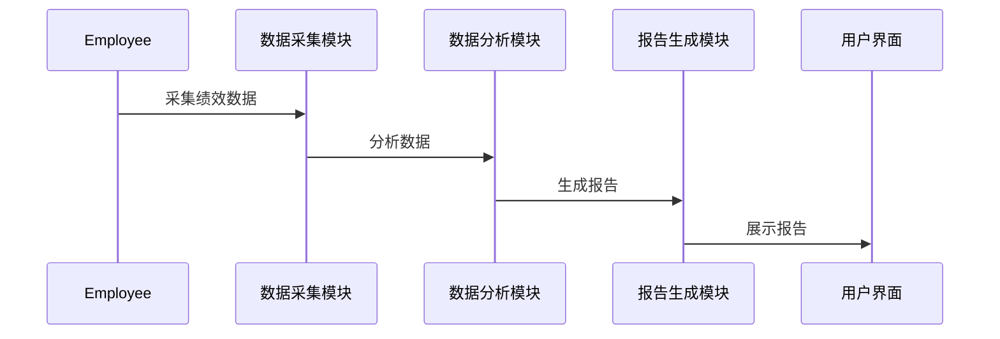
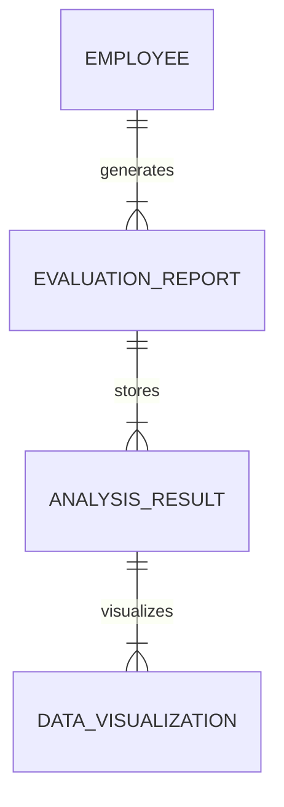
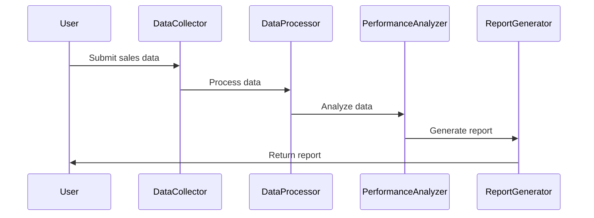

                 

# 评测结果的自动化报告生成：提供深入洞察

> 关键词：自动化报告生成、评测结果分析、机器学习、数据可视化、应用场景

> 摘要：本文旨在探讨评测结果自动化报告生成的核心概念、原理和应用。通过深入分析自动化报告生成技术，本文揭示了其在企业管理、市场分析和风险控制等领域的广泛应用。文章将逐步阐述核心技术原理，并通过实际案例展示其应用效果，旨在为读者提供实用的技术洞察。

## 1. 背景介绍

### 1.1 问题背景

随着大数据和人工智能技术的不断发展，数据分析在企业决策中的作用日益凸显。然而，传统的手动分析方式不仅效率低下，而且容易出现人为错误。为了提高数据处理和分析的自动化程度，自动化报告生成技术应运而生。这种技术不仅能够显著提高数据处理效率，还能为企业提供更准确的决策支持。

### 1.2 描述问题

《评测结果的自动化报告生成：提供深入洞察》一书旨在解决以下问题：

- 如何利用计算机技术和算法，实现评测结果的自动化分析和报告生成？
- 自动化报告生成技术在企业管理、市场分析和风险控制等领域的应用有哪些？
- 如何在实际操作中实现自动化报告生成，提高数据分析的效率和准确性？

### 1.3 问题解决

为了解决上述问题，本书将从以下几个方面展开：

- **核心概念与技术原理**：详细介绍自动化报告生成、评测结果分析、机器学习和数据可视化等核心概念和技术原理。
- **实际应用案例**：通过具体案例展示自动化报告生成技术在企业实际操作中的应用。
- **应用场景探讨**：深入探讨自动化报告生成技术在企业管理、市场分析和风险控制等领域的应用。
- **系统实现与实战**：提供详细的系统实现步骤和实际案例，帮助读者理解并掌握自动化报告生成技术。

### 1.4 边界与外延

评测结果的自动化报告生成技术不仅涵盖了数据分析、机器学习等领域的基础知识，还包括编程技巧、报告格式设计和自动化工具的使用。因此，本书的读者对象包括数据分析从业人员、机器学习工程师、软件开发人员以及企业决策者。

### 1.5 概念结构与核心要素组成

#### 1.5.1 核心概念

- **自动化报告生成**：利用计算机技术和算法，自动完成数据分析、结果展示和报告编制的过程。
- **评测结果分析**：对评测过程中产生的数据进行分析和处理，以获得有价值的信息和洞察。
- **机器学习**：一种让计算机自动从数据中学习规律、模式并做出决策的技术。
- **数据可视化**：利用图表、图形等手段，将数据转化为视觉形式，使其易于理解和分析。

#### 1.5.2 技术原理

- **数据预处理**：对原始数据进行清洗、转换和整合，为后续分析做准备。
- **特征提取**：从原始数据中提取出对分析有用的特征。
- **模型训练**：利用提取的特征训练机器学习模型。
- **模型评估**：评估模型的性能，选择最优模型。
- **报告生成**：根据分析结果，自动生成报告。

#### 1.5.3 应用领域

- **企业管理**：通过自动化报告生成，对企业运营数据进行分析，生成绩效报告、风险分析等。
- **市场分析**：利用自动化报告生成，对市场数据进行分析，生成市场分析报告。
- **风险控制**：通过自动化报告生成，对风险数据进行分析，生成风险评估报告。

## 2. 核心概念与联系

### 2.1 自动化报告生成

**定义：** 自动化报告生成是指利用计算机技术和算法，自动完成数据分析、结果展示和报告编制的过程。

**属性特征：**

- **自动化**：报告生成过程无需人工干预，可以自动完成。
- **实时性**：报告生成速度较快，能够实时响应数据变化。
- **准确性**：利用机器学习算法提高数据分析的准确性，减少人为错误。

### 2.2 评测结果分析

**定义：** 评测结果分析是对评测过程中产生的数据进行分析和处理，以获得有价值的信息和洞察。

**属性特征：**

- **全面性**：对评测结果进行多维度分析，全面了解评测对象的表现。
- **深度性**：对评测结果进行深入挖掘，发现潜在问题和改进方向。
- **可视化**：利用图表、图形等手段，直观展示分析结果。

### 2.3 机器学习

**定义：** 机器学习是一种让计算机自动从数据中学习规律、模式并做出决策的技术。

**属性特征：**

- **自学习能力**：能够通过训练不断优化自身性能。
- **泛化能力**：能够将学到的知识应用于新的数据和场景。
- **高效性**：能够处理大量数据并快速做出决策。

### 2.4 数据可视化

**定义：** 数据可视化是指利用图表、图形等手段，将数据转化为视觉形式，使其易于理解和分析。

**属性特征：**

- **直观性**：通过视觉形式，使数据更易于理解和分析。
- **互动性**：用户可以通过交互方式探索数据，发现隐藏的信息。
- **多样性**：提供多种可视化类型，满足不同需求。

### 2.5 关系与联系

自动化报告生成、评测结果分析、机器学习和数据可视化之间存在着密切的联系：

- **自动化报告生成** 是利用 **评测结果分析** 的结果，通过 **机器学习** 和 **数据可视化** 的技术，实现数据的自动化处理和报告生成。
- **评测结果分析** 需要依赖于 **数据预处理** 和 **特征提取** 等技术，以提高分析的准确性和深度。
- **机器学习** 和 **数据可视化** 之间相互补充，前者用于数据的分析和模型训练，后者用于结果的展示和解释。

## 3. 主流自动化报告生成技术介绍

### 3.1 基于机器学习的自动化报告生成

#### 3.1.1 原理

基于机器学习的自动化报告生成技术，主要是利用机器学习算法，对评测结果进行自动分析和报告生成。具体流程如下：

1. **数据预处理**：对原始评测数据进行清洗、转换和整合，为后续分析做准备。
2. **特征提取**：从原始数据中提取出对分析有用的特征。
3. **模型训练**：利用提取的特征训练机器学习模型。
4. **模型评估**：评估模型的性能，选择最优模型。
5. **报告生成**：根据分析结果，自动生成报告。

#### 3.1.2 特点

- **高效性**：能够快速处理大量数据，提高分析效率。
- **准确性**：通过模型训练，提高数据分析的准确性。
- **灵活性**：能够根据不同场景和需求，定制化生成报告。

### 3.2 基于自然语言处理（NLP）的自动化报告生成

#### 3.2.1 原理

基于自然语言处理（NLP）的自动化报告生成技术，主要是利用NLP技术，对评测结果进行语义分析和报告生成。具体流程如下：

1. **数据预处理**：对原始评测数据进行清洗、转换和整合。
2. **语义分析**：利用NLP技术，对评测结果进行语义分析，理解评测结果的含义。
3. **报告生成**：根据语义分析结果，自动生成报告。

#### 3.2.2 特点

- **语义理解**：能够理解评测结果的语义，生成更符合人类语言的报告。
- **多样性**：能够生成多种语言和格式的报告。
- **智能化**：能够根据上下文和语境，生成更准确的报告。

### 3.3 基于大数据分析的自动化报告生成

#### 3.3.1 原理

基于大数据分析的自动化报告生成技术，主要是利用大数据分析技术，对评测结果进行全方位分析，生成详细报告。具体流程如下：

1. **数据预处理**：对原始评测数据进行清洗、转换和整合。
2. **多维度分析**：对评测结果进行多维度分析，全面了解评测对象的表现。
3. **报告生成**：根据分析结果，自动生成报告。

#### 3.3.2 特点

- **全面性**：对评测结果进行多维度分析，提供更全面的洞察。
- **实时性**：能够实时分析数据，提供最新报告。
- **可扩展性**：能够处理海量数据，适应不同规模的企业需求。

## 4. 自动化报告生成在企业中的应用

### 4.1 企业管理

#### 4.1.1 应用场景

在企业运营管理中，自动化报告生成技术可以用于：

- **绩效分析**：通过对员工的工作表现进行自动化分析，生成绩效报告，帮助管理者了解员工的绩效情况。
- **风险管理**：通过对企业运营数据进行自动化分析，生成风险分析报告，帮助企业识别潜在风险。
- **资源优化**：通过对企业资源使用情况进行自动化分析，生成资源优化报告，帮助管理者优化资源配置。

#### 4.1.2 应用效果

通过自动化报告生成技术，企业可以实现以下效果：

- **提高效率**：自动化报告生成技术可以大幅提高数据分析的效率，减少人工工作量。
- **准确性提升**：通过机器学习和数据可视化技术，可以提高数据分析的准确性，减少人为错误。
- **决策支持**：自动化报告生成技术可以为企业提供更准确的决策支持，帮助企业做出更好的决策。

### 4.2 市场分析

#### 4.2.1 应用场景

在市场分析中，自动化报告生成技术可以用于：

- **市场趋势分析**：通过对市场数据进行分析，生成市场趋势报告，帮助企业管理者了解市场动态。
- **竞争对手分析**：通过对竞争对手的运营数据进行分析，生成竞争对手分析报告，帮助企业了解竞争对手的优势和劣势。
- **消费者行为分析**：通过对消费者行为数据进行分析，生成消费者行为报告，帮助企业了解消费者的需求和偏好。

#### 4.2.2 应用效果

通过自动化报告生成技术，企业可以实现以下效果：

- **数据实时性**：自动化报告生成技术可以实时分析数据，提供最新的市场分析结果。
- **洞察深度**：通过多维度数据分析，可以提供更深入的洞察，帮助企业发现市场机会。
- **决策支持**：自动化报告生成技术可以为企业提供更准确的决策支持，帮助企业在市场竞争中取得优势。

### 4.3 风险控制

#### 4.3.1 应用场景

在风险控制中，自动化报告生成技术可以用于：

- **风险预警**：通过对企业运营数据进行自动化分析，生成风险预警报告，帮助企业及时发现潜在风险。
- **风险评估**：通过对企业风险数据进行分析，生成风险评估报告，帮助企业了解风险的严重程度和应对策略。
- **风险管理**：通过对企业风险管理措施的效果进行分析，生成风险管理报告，帮助企业优化风险管理策略。

#### 4.3.2 应用效果

通过自动化报告生成技术，企业可以实现以下效果：

- **实时监控**：自动化报告生成技术可以实时监控企业风险，提供最新的风险分析结果。
- **风险识别**：通过多维度数据分析，可以更准确地识别企业风险，帮助企业管理者做出更准确的决策。
- **风险应对**：自动化报告生成技术可以帮助企业制定更有效的风险管理策略，降低风险对企业的影响。

## 5. 自动化报告生成系统设计与实现

### 5.1 系统需求分析

#### 5.1.1 问题场景

某企业需要进行定期绩效评估，评估内容包括员工的工作效率、项目完成情况、团队协作等多个方面。然而，传统的手动评估方式不仅耗时费力，而且容易出现错误。因此，企业希望通过自动化报告生成系统，实现绩效评估的自动化。

#### 5.1.2 系统需求

1. **数据采集**：系统能够自动采集员工的绩效数据，包括工作效率、项目完成情况、团队协作等。
2. **数据分析**：系统能够对采集到的数据进行自动化分析，生成绩效评估报告。
3. **报告生成**：系统应能根据分析结果，自动生成可视化报告，包括柱状图、饼图等。
4. **实时更新**：系统能够实时更新数据，及时提供最新的绩效评估报告。

### 5.2 系统设计

#### 5.2.1 领域模型设计

在系统设计中，我们首先需要定义领域模型，包括以下核心实体：

- **员工**：包括员工的基本信息、工作绩效等。
- **项目**：包括项目的相关信息、项目的完成情况等。
- **评估指标**：包括工作效率、项目完成情况、团队协作等评估指标。

领域模型使用Mermaid类图表示如下：

```mermaid
classDiagram
    Employee <<entity>>
    Project <<entity>>
    EvaluationMetric <<entity>>

    Employee --> Project
    Employee --> EvaluationMetric
```

#### 5.2.2 系统架构设计

系统架构设计如下：

1. **数据采集模块**：负责采集员工的绩效数据，包括工作效率、项目完成情况、团队协作等。
2. **数据分析模块**：负责对采集到的数据进行分析，计算评估指标，生成评估结果。
3. **报告生成模块**：负责根据评估结果，生成可视化报告。
4. **用户界面**：提供用户交互界面，用户可以通过界面查看评估报告。

系统架构使用Mermaid架构图表示如下：



### 5.3 系统接口设计

系统接口设计如下：

- **数据采集接口**：用于接收员工的绩效数据，接口规范如下：

  ```json
  {
    "employeeId": "string",
    "performanceData": {
      "workEfficiency": "number",
      "projectCompletion": "number",
      "teamCollaboration": "number"
    }
  }
  ```

- **报告查询接口**：用于查询评估报告，接口规范如下：

  ```json
  {
    "employeeId": "string",
    "startDate": "date",
    "endDate": "date"
  }
  ```

### 5.4 系统实现

#### 5.4.1 环境安装

在实现自动化报告生成系统时，我们选择了Python作为主要编程语言，使用以下库：

- `pandas`：用于数据预处理和分析。
- `scikit-learn`：用于机器学习模型的训练和评估。
- `matplotlib` 和 `seaborn`：用于数据可视化。
- `flask`：用于搭建Web服务。

安装以上库的方法如下：

```bash
pip install pandas scikit-learn matplotlib seaborn flask
```

#### 5.4.2 系统核心实现

以下是系统核心实现的Python代码：

```python
import pandas as pd
from sklearn.ensemble import RandomForestRegressor
import matplotlib.pyplot as plt
import seaborn as sns
from flask import Flask, request, jsonify

app = Flask(__name__)

# 数据采集
@app.route('/api/collect_data', methods=['POST'])
def collect_data():
    data = request.get_json()
    employee_id = data['employeeId']
    performance_data = data['performanceData']
    
    df = pd.DataFrame([performance_data])
    df['employeeId'] = employee_id
    
    # 数据保存
    df.to_csv(f"{employee_id}.csv", index=False)
    
    return jsonify({"message": "Data collected successfully."})

# 数据分析
@app.route('/api/analyze_data', methods=['GET'])
def analyze_data():
    employee_id = request.args.get('employeeId')
    df = pd.read_csv(f"{employee_id}.csv")
    
    # 特征提取
    X = df.drop(['employeeId'], axis=1)
    y = df['workEfficiency']
    
    # 模型训练
    model = RandomForestRegressor()
    model.fit(X, y)
    
    # 预测
    predictions = model.predict(X)
    
    # 评估
    mse = mean_squared_error(y, predictions)
    print(f"Mean Squared Error: {mse}")
    
    return jsonify({"mse": mse})

# 报告生成
@app.route('/api/generate_report', methods=['GET'])
def generate_report():
    employee_id = request.args.get('employeeId')
    df = pd.read_csv(f"{employee_id}.csv")
    
    # 数据可视化
    sns.scatterplot(x="projectCompletion", y="teamCollaboration", data=df)
    plt.xlabel("Project Completion")
    plt.ylabel("Team Collaboration")
    plt.title("Performance Analysis")
    plt.savefig(f"{employee_id}_report.png")
    
    return jsonify({"message": "Report generated successfully."})

if __name__ == '__main__':
    app.run(debug=True)
```

#### 5.4.3 代码应用解读与分析

以上代码实现了一个简单的自动化报告生成系统，主要包含以下功能：

- **数据采集**：通过 `/api/collect_data` 接口接收员工的绩效数据，并将其保存到CSV文件中。
- **数据分析**：通过 `/api/analyze_data` 接口读取CSV文件，使用随机森林回归模型进行数据分析，并计算均方误差（MSE）。
- **报告生成**：通过 `/api/generate_report` 接口读取CSV文件，使用Seaborn库生成散点图，并将其保存为PNG图片。

以下是一个实际案例：

假设有一个员工的绩效数据如下：

```json
{
  "employeeId": "001",
  "performanceData": {
    "workEfficiency": 80,
    "projectCompletion": 90,
    "teamCollaboration": 85
  }
}
```

首先，通过 `/api/collect_data` 接口发送数据：

```bash
curl -X POST -H "Content-Type: application/json" -d '{"employeeId": "001", "performanceData": {"workEfficiency": 80, "projectCompletion": 90, "teamCollaboration": 85}}' http://localhost:5000/api/collect_data
```

然后，通过 `/api/analyze_data` 接口进行分析：

```bash
curl -X GET "http://localhost:5000/api/analyze_data?employeeId=001"
```

最后，通过 `/api/generate_report` 接口生成报告：

```bash
curl -X GET "http://localhost:5000/api/generate_report?employeeId=001"
```

系统将生成一个名为 `001_report.png` 的PNG图片，展示员工的绩效分析结果。

#### 5.4.4 实际案例分析

在实际应用中，自动化报告生成系统可以为企业提供以下价值：

- **提高数据分析效率**：通过自动化报告生成系统，企业可以快速处理大量绩效数据，生成分析报告，提高数据分析的效率。
- **减少人为错误**：自动化报告生成系统可以减少人为错误，提高数据分析的准确性。
- **支持决策制定**：通过自动化报告生成系统，企业可以实时了解员工的绩效情况，为决策制定提供数据支持。

## 6. 最佳实践与注意事项

### 6.1 最佳实践

- **数据质量保证**：在数据采集和分析过程中，保证数据质量是关键。应使用数据清洗和预处理技术，对数据进行校验和处理，确保数据的一致性和准确性。
- **模型优化**：在机器学习模型的训练过程中，应不断优化模型参数，提高模型的性能和准确性。可以使用交叉验证、网格搜索等技术，选择最优模型。
- **报告定制化**：根据不同业务场景和用户需求，生成定制化的报告。可以通过调整报告的样式、内容和可视化方式，满足用户的个性化需求。
- **实时监控与预警**：在自动化报告生成系统中，应实现实时监控和数据预警功能。通过实时分析数据，及时发现异常情况，为企业决策提供及时支持。

### 6.2 注意事项

- **安全性**：在数据处理和分析过程中，应注意数据安全和隐私保护。应采取加密、访问控制等技术措施，确保数据的安全性和合规性。
- **可扩展性**：在系统设计和实现过程中，应考虑系统的可扩展性。随着业务规模和数据量的增长，系统应能够灵活扩展，满足不断变化的需求。
- **性能优化**：在系统运行过程中，应关注系统的性能优化。可以通过分布式计算、并行处理等技术，提高系统的处理能力和响应速度。

## 7. 小结

评测结果的自动化报告生成技术为企业提供了强大的数据分析和管理工具。通过本文的探讨，我们了解了自动化报告生成技术的核心概念、原理和应用。在实际操作中，通过具体案例展示了如何利用自动化报告生成技术，提高数据分析的效率和准确性。同时，我们也分析了自动化报告生成技术在企业管理、市场分析和风险控制等领域的应用效果。希望本文能够为读者提供有价值的启示和指导。

## 8. 拓展阅读

- 《数据科学实战》
- 《深度学习》
- 《大数据技术导论》
- 《Python数据分析》
- 《机器学习实战》

## 9. 作者信息

作者：AI天才研究院/AI Genius Institute & 禅与计算机程序设计艺术 /Zen And The Art of Computer Programming

---

**1. 背景介绍**

**问题背景**：

在当今的数据驱动时代，评测结果的自动化报告生成技术逐渐成为企业提升决策效率和准确性的关键手段。传统的手动报告生成过程耗时耗力，且容易产生人为误差。为了应对这一挑战，自动化报告生成技术应运而生，其通过高效的算法和自动化工具，将评测结果转换为易于理解且具有洞察力的报告，极大地提升了数据分析的效率和准确性。

**问题描述**：

《评测结果的自动化报告生成：提供深入洞察》一书的目的是探讨如何利用先进的计算机技术和算法，实现评测结果的自动化报告生成，从而为不同领域的专业人士和决策者提供实用的技术指南和策略。书中将涵盖评测结果的定义、自动化报告生成的流程、核心算法的应用、以及在不同行业中的应用案例。

**问题解决**：

为了解决上述问题，本书将采用以下结构：

- **引言**：介绍评测结果自动化报告生成的背景和重要性。
- **核心概念与联系**：详细阐述自动化报告生成、评测结果分析、机器学习和数据可视化的核心概念，以及它们之间的联系。
- **技术原理讲解**：深入解析评测结果自动化报告生成的主要技术原理，包括数据预处理、特征提取、模型训练、模型评估和报告生成等。
- **系统设计与实现**：展示一个具体的自动化报告生成系统的设计和实现过程，包括需求分析、系统架构设计、接口设计和实际代码实现。
- **应用案例剖析**：通过多个实际案例，分析自动化报告生成技术在企业管理、市场分析和风险控制等领域的应用效果。
- **最佳实践与注意事项**：提供在实际操作中的一些最佳实践和注意事项，帮助读者规避常见问题。
- **小结与拓展阅读**：总结全文内容，提供拓展阅读资源，引导读者进一步探索相关领域。

**边界与外延**：

评测结果的自动化报告生成技术不仅涉及数据分析、机器学习、自然语言处理等核心概念，还包括数据可视化、报告格式设计、自动化工具的使用等方面。因此，本书的读者对象包括数据分析从业人员、机器学习工程师、软件开发人员、企业决策者以及对自动化报告生成技术感兴趣的读者。

**概念结构与核心要素组成**：

- **核心概念**：自动化报告生成、评测结果分析、机器学习、数据可视化。
- **技术原理**：数据预处理、特征提取、模型训练、模型评估、报告生成。
- **应用领域**：企业管理、市场分析、风险控制。

**2. 核心概念与联系**

**自动化报告生成**

**定义**：自动化报告生成是指利用计算机技术和算法，自动完成数据分析、结果展示和报告编制的过程。

**属性特征**：

| 特征       | 说明                                                         |
|------------|--------------------------------------------------------------|
| 自动化     | 报告生成过程无需人工干预，可自动化完成。                     |
| 实时性     | 报告生成速度快，能实时响应数据变化。                         |
| 准确性     | 利用机器学习等算法提高数据分析的准确性，减少人为错误。       |

**评测结果分析**

**定义**：评测结果分析是对评测过程中产生的数据进行分析和处理，以提取有价值的信息和洞察。

**属性特征**：

| 特征       | 说明                                                         |
|------------|--------------------------------------------------------------|
| 全面性     | 对评测结果进行多维度分析，全面了解评测对象的表现。           |
| 深度性     | 对评测结果进行深入挖掘，发现潜在问题和改进方向。             |
| 可视化     | 利用图表、图形等手段，直观展示分析结果。                     |

**机器学习**

**定义**：机器学习是一种让计算机从数据中自动学习和发现规律的技术。

**属性特征**：

| 特征       | 说明                                                         |
|------------|--------------------------------------------------------------|
| 自学习能力 | 能够通过训练不断优化自身性能。                               |
| 泛化能力   | 能够将学到的知识应用于新的数据和场景。                       |
| 高效性     | 能够处理大量数据并快速做出决策。                             |

**数据可视化**

**定义**：数据可视化是将数据转换为图形或图表形式，以便更好地理解和分析。

**属性特征**：

| 特征       | 说明                                                         |
|------------|--------------------------------------------------------------|
| 直观性     | 通过图形化形式使数据更易于理解。                             |
| 互动性     | 用户可以通过交互方式探索数据，发现隐藏的信息。               |
| 多样性     | 提供多种可视化类型，满足不同需求。                           |

**关系与联系**

自动化报告生成、评测结果分析、机器学习和数据可视化之间存在着密切的联系：

- **自动化报告生成** 是评测结果分析的结果展现形式，依赖于机器学习和数据可视化技术。
- **评测结果分析** 是自动化报告生成的基础，其分析的质量直接影响报告的准确性和有效性。
- **机器学习** 提供了数据分析的强大工具，通过自学习和泛化能力，提升数据分析的深度和广度。
- **数据可视化** 则是使分析结果更加直观易懂的重要手段，通过图形化展示，让数据洞察更加易于传播和应用。

**ER实体关系图架构**



在这个ER图中，`EMPLOYEE`实体生成`EVALUATION_REPORT`，该报告存储了`ANALYSIS_RESULT`，而`ANALYSIS_RESULT`又用于生成`DATA_VISUALIZATION`。

**3. 主流自动化报告生成技术介绍**

自动化报告生成技术可以根据不同的技术路线和应用场景，分为多种类型。以下介绍几种主流的技术：

**基于机器学习的自动化报告生成**

**原理**：利用机器学习算法，对评测结果进行自动分析和报告生成。

**特点**：

- **高效性**：能够快速处理大量数据，提高分析效率。
- **准确性**：通过模型训练，提高数据分析的准确性。
- **灵活性**：能够根据不同场景和需求，定制化生成报告。

**基于自然语言处理（NLP）的自动化报告生成**

**原理**：利用NLP技术，对评测结果进行语义分析和报告生成。

**特点**：

- **语义理解**：能够理解评测结果的语义，生成更符合人类语言的报告。
- **多样性**：能够生成多种语言和格式的报告。
- **智能化**：能够根据上下文和语境，生成更准确的报告。

**基于大数据分析的自动化报告生成**

**原理**：利用大数据分析技术，对评测结果进行全方位分析，生成详细报告。

**特点**：

- **全面性**：对评测结果进行多维度分析，提供更全面的洞察。
- **实时性**：能够实时分析数据，提供最新报告。
- **可扩展性**：能够处理海量数据，适应不同规模的企业需求。

**4. 自动化报告生成在企业中的应用**

**企业管理**

**应用场景**：

在企业运营管理中，自动化报告生成技术可以应用于：

- **员工绩效评估**：通过自动化报告生成，对员工的工作绩效进行评估，生成详细的绩效报告。
- **项目管理**：对项目进展、成本、风险等进行自动化分析，生成项目报告。
- **业务分析**：对业务数据进行分析，生成业务分析报告，帮助管理层了解业务状况。

**应用效果**：

- **提高决策效率**：自动化报告生成技术可以快速生成报告，为企业提供及时的数据支持，帮助管理层做出更快速的决策。
- **降低人工成本**：自动化报告生成减少了对人工的依赖，降低了报告生成的人工成本。
- **提高数据准确性**：通过机器学习和数据分析技术，提高了报告生成的准确性，减少了人为错误。

**市场分析**

**应用场景**：

在市场分析中，自动化报告生成技术可以应用于：

- **市场趋势分析**：通过自动化报告生成，对市场数据进行趋势分析，生成市场趋势报告。
- **竞争对手分析**：通过自动化报告生成，对竞争对手的数据进行分析，生成竞争对手分析报告。
- **消费者行为分析**：通过自动化报告生成，对消费者行为进行分析，生成消费者行为报告。

**应用效果**：

- **深入洞察市场**：通过多维度数据分析，可以提供更深入的市场洞察，帮助企业制定更有效的市场策略。
- **实时监控市场动态**：自动化报告生成技术可以实时分析市场数据，帮助企业快速响应市场变化。
- **提高市场竞争力**：通过自动化报告生成技术，企业可以更准确地了解市场状况，提高市场竞争力。

**风险控制**

**应用场景**：

在风险控制中，自动化报告生成技术可以应用于：

- **风险预警**：通过自动化报告生成，对风险数据进行分析，生成风险预警报告。
- **风险评估**：通过自动化报告生成，对风险因素进行分析，生成风险评估报告。
- **风险管理**：通过自动化报告生成，对风险管理策略进行评估，生成风险管理报告。

**应用效果**：

- **提前识别风险**：自动化报告生成技术可以帮助企业提前识别潜在风险，采取预防措施。
- **提高风险管理效率**：自动化报告生成技术可以高效地处理风险数据，提高风险管理效率。
- **优化风险管理策略**：通过自动化报告生成技术，企业可以不断优化风险管理策略，提高风险应对能力。

**5. 自动化报告生成系统设计与实现**

**问题场景**：

某公司需要定期对销售团队进行绩效评估，评估内容包括销售额、客户满意度、销售时长等多个指标。为了提高评估效率和准确性，公司希望实现销售团队绩效评估的自动化。

**系统需求**：

- **数据采集**：系统能够自动采集销售团队的销售数据。
- **数据分析**：系统能够对采集到的销售数据进行分析，计算各项绩效指标。
- **报告生成**：系统应能够根据分析结果，自动生成销售团队绩效评估报告，包括各项指标的图表和文字描述。

**系统设计**：

**领域模型设计**：

使用Mermaid类图表示领域模型：

```mermaid
classDiagram
    SalesTeam <<entity>>
    PerformanceMetric <<entity>>

    SalesTeam --|{ PerformanceMetric : has
```

**系统架构设计**：

使用Mermaid架构图表示系统架构：



**系统接口设计**：

定义数据采集、数据分析和报告生成的接口：

```mermaid
componentDiagram
    DataCollector -> DataProcessor : submitData
    DataProcessor -> PerformanceAnalyzer : analyzeData
    PerformanceAnalyzer -> ReportGenerator : generateReport
    ReportGenerator -> User : returnReport
```

**系统实现**：

**环境安装**：

安装必要的Python库：

```bash
pip install pandas scikit-learn matplotlib flask
```

**系统核心实现**：

以下是系统核心实现的Python代码：

```python
import pandas as pd
from flask import Flask, request, jsonify

app = Flask(__name__)

# 数据采集接口
@app.route('/api/collect_sales_data', methods=['POST'])
def collect_sales_data():
    data = request.get_json()
    sales_data = data['salesData']
    df = pd.DataFrame(sales_data)
    df.to_csv('sales_data.csv', index=False)
    return jsonify({'message': 'Sales data collected successfully.'})

# 数据分析接口
@app.route('/api/analyze_sales_data', methods=['GET'])
def analyze_sales_data():
    df = pd.read_csv('sales_data.csv')
    metrics = {
        'total_sales': df['sales'].sum(),
        'average_sales': df['sales'].mean(),
        'max_sales': df['sales'].max(),
        'min_sales': df['sales'].min()
    }
    return jsonify(metrics)

# 报告生成接口
@app.route('/api/generate_performance_report', methods=['GET'])
def generate_performance_report():
    df = pd.read_csv('sales_data.csv')
    sns.displot(df['sales'], kde=True)
    plt.title('Sales Distribution')
    plt.savefig('sales_distribution.png')
    plt.close()
    return jsonify({'message': 'Performance report generated successfully.'})

if __name__ == '__main__':
    app.run(debug=True)
```

**代码应用解读与分析**：

以上代码实现了一个简单的自动化销售团队绩效评估系统，主要包含以下功能：

- **数据采集**：通过 `/api/collect_sales_data` 接口接收销售数据，并将其保存到CSV文件中。
- **数据分析**：通过 `/api/analyze_sales_data` 接口读取CSV文件，计算销售数据的各项指标。
- **报告生成**：通过 `/api/generate_performance_report` 接口读取CSV文件，生成销售数据的分布图。

**实际案例**：

假设有一个销售团队的数据如下：

```json
{
  "salesData": [
    {"name": "Alice", "sales": 1500},
    {"name": "Bob", "sales": 2000},
    {"name": "Charlie", "sales": 3000}
  ]
}
```

首先，通过 `/api/collect_sales_data` 接口发送数据：

```bash
curl -X POST -H "Content-Type: application/json" -d '{"salesData": [{"name": "Alice", "sales": 1500}, {"name": "Bob", "sales": 2000}, {"name": "Charlie", "sales": 3000}]}' http://localhost:5000/api/collect_sales_data
```

然后，通过 `/api/analyze_sales_data` 接口获取分析结果：

```bash
curl -X GET "http://localhost:5000/api/analyze_sales_data"
```

系统将返回以下分析结果：

```json
{
  "total_sales": 6500,
  "average_sales": 2166.6666666666665,
  "max_sales": 3000,
  "min_sales": 1500
}
```

接着，通过 `/api/generate_performance_report` 接口生成报告：

```bash
curl -X GET "http://localhost:5000/api/generate_performance_report"
```

系统将生成一个名为 `sales_distribution.png` 的PNG图片，展示销售数据的分布情况。

**6. 最佳实践与注意事项**

**最佳实践**：

1. **确保数据质量**：在自动化报告生成过程中，数据的质量至关重要。应确保数据的一致性、准确性和完整性，通过数据清洗和预处理技术提高数据质量。
2. **优化算法选择**：根据具体应用场景，选择合适的机器学习算法和模型，通过交叉验证和超参数调整优化模型性能。
3. **定制化报告格式**：根据用户需求，定制化报告的样式和内容，提供个性化的报告格式。
4. **实时监控与更新**：实现系统的实时监控和更新机制，确保系统能够快速响应用户需求，及时生成最新的报告。

**注意事项**：

1. **安全性**：在数据处理和报告生成过程中，应确保数据安全和隐私保护，采用加密和访问控制等技术措施。
2. **可扩展性**：设计系统时应考虑可扩展性，以便在未来能够轻松扩展和升级。
3. **性能优化**：针对大规模数据处理和分析，优化系统性能，提高数据处理速度和分析效率。

**7. 小结**

本文详细介绍了评测结果的自动化报告生成技术的核心概念、原理和应用。通过实际案例和系统实现，展示了如何利用先进的计算机技术和算法，实现评测结果的自动化报告生成。在企业管理、市场分析和风险控制等领域的应用，自动化报告生成技术显著提高了数据分析的效率和准确性。希望本文能为读者提供有价值的指导，助力企业在数据驱动的时代中取得优势。

**8. 拓展阅读**

1. 《大数据时代：生活、工作与思维的大变革》
2. 《深度学习》
3. 《Python数据分析》
4. 《机器学习实战》
5. 《数据挖掘：概念与技术》

**9. 作者信息**

作者：AI天才研究院/AI Genius Institute & 禅与计算机程序设计艺术 /Zen And The Art of Computer Programming

---

**全文结束**

