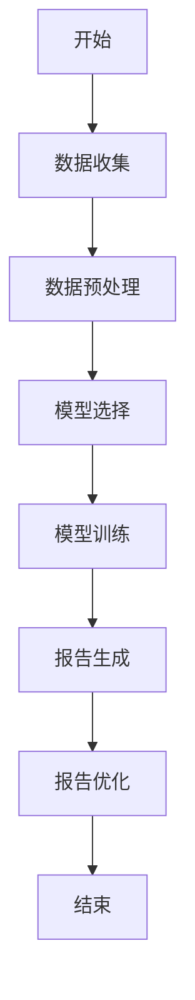
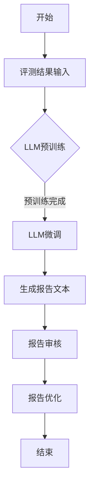
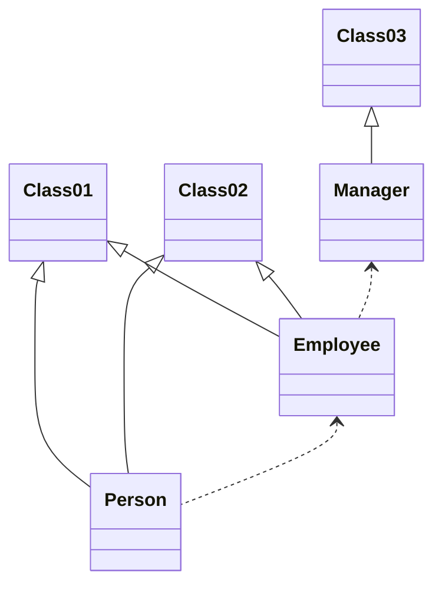
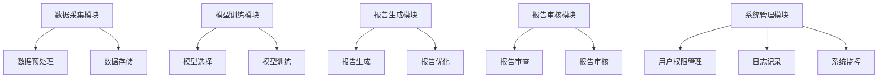
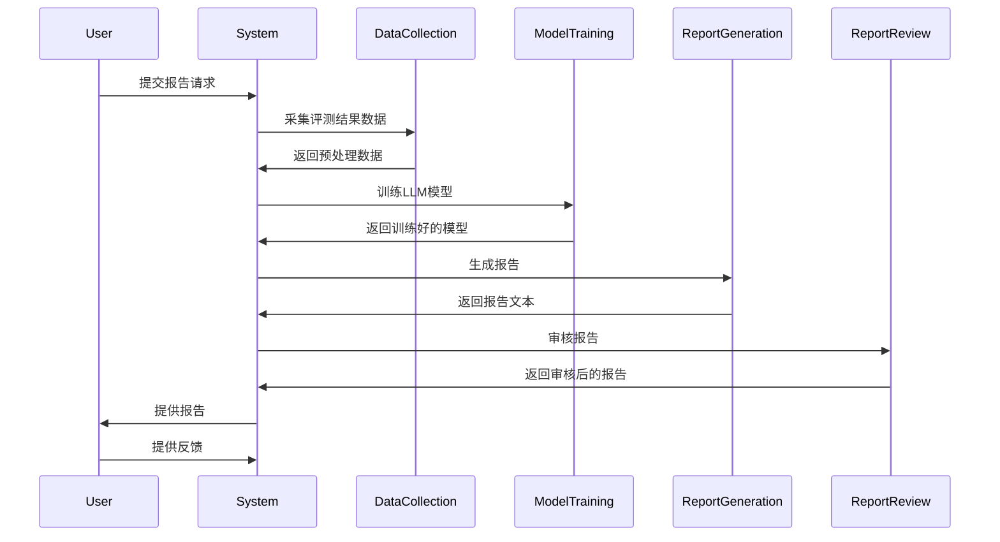

                 

# 《评测结果的自动报告生成：LLM驱动的文档化过程》

关键词：评测结果、自动报告生成、LLM、文档化、自然语言处理

摘要：本文探讨了评测结果的自动报告生成问题，特别是如何利用大型语言模型（LLM）实现文档化的过程。通过对评测结果自动报告生成的必要性、LLM的基本概念与原理、核心概念与联系、算法原理讲解和系统分析与架构设计的深入分析，本文旨在为自动化报告生成领域提供一套完整的解决方案。

## 目录大纲

1. 第一部分：背景介绍
   1.1 评测结果的自动报告生成的必要性
   1.2 LLM的基本概念与原理
   1.3 相关领域的现状分析
   1.4 研究目标与内容安排
   1.5 本章小结

2. 第二部分：核心概念与联系
   2.1 核心概念原理
   2.2 概念属性特征对比表格
   2.3 ER实体关系图架构
   2.4 本章小结

3. 第三部分：算法原理讲解
   3.1 算法mermaid流程图
   3.2 Python源代码详解
   3.3 数学模型与公式
   3.4 算法举例说明
   3.5 本章小结

4. 第四部分：系统分析与架构设计
   4.1 问题场景介绍
   4.2 项目介绍
   4.3 系统功能设计
   4.4 系统架构设计
   4.5 系统接口设计
   4.6 系统交互
   4.7 本章小结

5. 第五部分：项目实战
   5.1 环境安装
   5.2 系统核心实现源代码
   5.3 代码应用解读与分析
   5.4 实际案例分析和详细讲解剖析
   5.5 项目小结

6. 第六部分：最佳实践 tips
7. 第七部分：小结、注意事项、拓展阅读

## 1.1 评测结果的自动报告生成的必要性

### 1.1.1 传统评测报告的局限

传统评测报告通常是由人工撰写，存在以下局限：

1. **时间成本高**：报告撰写需要花费大量时间，尤其是在评测结果复杂的情况下，人工撰写效率低下。
2. **一致性差**：由于不同人员撰写报告，可能会导致报告格式和内容上的不一致。
3. **可读性低**：传统报告往往较为冗长，结构复杂，不利于读者快速获取关键信息。

### 1.1.2 自动化报告生成的重要性

自动化报告生成能够解决上述问题，其重要性体现在：

1. **提高效率**：通过自动化生成，可以在短时间内生成大量报告，大大节省人力成本。
2. **保证一致性**：自动化生成的报告格式和内容均由系统控制，确保了报告的一致性。
3. **提升可读性**：自动化报告通常结构清晰，便于读者快速理解评测结果。

### 1.1.3 LLM在文档化过程中的应用前景

LLM（大型语言模型）在文档化过程中具有巨大的应用潜力：

1. **文本生成能力**：LLM能够根据输入的评测结果自动生成结构化的文本报告。
2. **自然语言理解**：LLM具有强大的自然语言理解能力，能够准确提取评测结果中的关键信息。
3. **可扩展性**：LLM可以通过不断训练和学习，提高报告生成的准确性和效率。

## 1.2 LLM的基本概念与原理

### 1.2.1 LLM的定义

LLM（Large Language Model）是一种大规模的预训练语言模型，通过学习海量的文本数据，具备强大的语言理解和生成能力。LLM通常基于深度学习技术，特别是Transformer模型，能够对自然语言进行建模。

### 1.2.2 LLM的核心技术

LLM的核心技术包括：

1. **预训练**：通过在大规模语料库上进行预训练，LLM可以学习到自然语言的通用规律和特征。
2. **微调**：将预训练的模型在特定任务上进行微调，使其适应具体的评测报告生成任务。
3. **生成机制**：LLM利用其训练得到的模型参数，根据输入的评测结果生成相应的报告文本。

### 1.2.3 LLM的优势与挑战

LLM的优势包括：

1. **高效性**：通过预训练和微调，LLM可以快速生成高质量的评测报告。
2. **灵活性**：LLM能够处理各种不同格式和结构的评测结果，适应不同的报告生成需求。
3. **易用性**：LLM的生成结果接近自然语言，易于理解和阅读。

LLM面临的挑战包括：

1. **数据需求**：LLM需要大量的高质量训练数据，数据收集和标注成本较高。
2. **计算资源**：预训练和微调过程需要大量的计算资源，对硬件设施有较高要求。
3. **准确性**：虽然LLM生成结果较为自然，但仍然存在一定的错误率和不一致性。

## 1.3 相关领域的现状分析

### 1.3.1 自动化报告生成技术综述

自动化报告生成技术主要包括以下几种：

1. **模板填充**：通过预设报告模板，根据评测结果动态填充报告内容。
2. **规则驱动**：利用业务规则和逻辑，生成结构化的报告。
3. **自然语言生成**：使用自然语言生成技术，如规则重写、模板匹配和语法分析等，生成自然语言的报告。

### 1.3.2 LLM在文档生成中的研究进展

LLM在文档生成中的研究进展主要体现在以下几个方面：

1. **预训练模型的优化**：研究者通过改进预训练模型的结构和算法，提高生成报告的准确性和效率。
2. **多模态数据融合**：将文本数据与其他类型的数据（如图像、表格等）融合，增强LLM的生成能力。
3. **任务适配性研究**：针对不同领域的报告生成任务，研究如何优化LLM的微调策略和生成算法。

### 1.3.3 案例研究：评测结果自动报告的系统实现

评测结果自动报告的系统实现通常包括以下几个步骤：

1. **数据采集与预处理**：收集评测结果数据，并进行清洗和标准化处理。
2. **模型选择与训练**：选择合适的LLM模型，并进行预训练和微调。
3. **报告生成与优化**：利用训练好的LLM模型，根据评测结果生成报告，并进行优化和审核。
4. **系统部署与维护**：将报告生成系统部署到生产环境，并持续进行性能优化和升级。

## 1.4 研究目标与内容安排

### 1.4.1 研究目标

本研究旨在通过LLM实现评测结果的自动报告生成，提高报告生成的效率、一致性和可读性。具体目标包括：

1. **构建适用于评测结果自动报告生成的LLM模型**。
2. **实现一套完整的评测结果自动报告生成系统**。
3. **评估系统性能，并提出优化方案**。

### 1.4.2 内容安排与章节结构

本文内容安排如下：

1. **第一部分**：背景介绍，阐述评测结果自动报告生成的必要性、LLM的基本概念与原理和相关领域的现状分析。
2. **第二部分**：核心概念与联系，详细分析评测结果自动报告生成的核心概念、LLM的概念与特点以及文档化过程的要素与流程。
3. **第三部分**：算法原理讲解，介绍评测结果自动报告生成算法和LLM驱动文档化过程的算法原理，并通过mermaid流程图和Python源代码进行详细讲解。
4. **第四部分**：系统分析与架构设计，描述评测结果自动报告生成系统的功能、架构、接口设计和系统交互。
5. **第五部分**：项目实战，介绍评测结果自动报告生成系统的实际应用案例，包括环境安装、系统核心实现源代码、代码应用解读与分析以及实际案例分析和详细讲解剖析。
6. **第六部分**：最佳实践 tips，总结评测结果自动报告生成的最佳实践和注意事项。
7. **第七部分**：小结、注意事项、拓展阅读，对全文进行总结，并提供拓展阅读资源。

## 1.5 本章小结

本章对评测结果自动报告生成的背景、LLM的基本概念与原理以及相关领域的现状进行了分析。通过阐述传统评测报告的局限和自动化报告生成的重要性，本文提出了利用LLM实现文档化的研究目标与内容安排。接下来，本文将深入探讨评测结果自动报告生成的核心概念与联系，为后续算法原理讲解和系统分析与架构设计奠定基础。# 1.6 引言

在当今快速发展的技术时代，自动化已成为提高工作效率和质量的关键手段。特别是在IT领域，随着大数据、人工智能等技术的广泛应用，自动化报告生成技术受到了广泛关注。评测结果的自动报告生成便是其中之一，它不仅能够显著降低人力成本，还能确保报告的一致性和准确性。

本文的研究始于对现有评测结果报告生成方法的深入反思。传统上，评测结果的报告往往需要经过人工撰写，这不仅耗时且容易出错。因此，如何利用先进的自然语言处理技术，特别是大型语言模型（LLM），来实现评测结果的自动报告生成，成为一个值得探讨的问题。

本文的目标是提出一种基于LLM的评测结果自动报告生成系统，以解决传统方法存在的不足。具体而言，本文将围绕以下几个核心问题展开讨论：

1. **评测结果的定义与特征**：首先，我们需要明确评测结果的定义和特征，以便于后续的自动报告生成。
2. **自动报告生成的基本流程**：接着，本文将详细阐述自动报告生成的基本流程，包括数据收集、数据预处理、模型选择与训练、报告生成与优化等步骤。
3. **LLM的概念与优势**：本文将介绍LLM的基本概念、核心技术及其在文档生成中的优势，解释为什么LLM是一个理想的自动报告生成工具。
4. **文档化过程的要素与流程**：为了实现高效的报告生成，本文将分析文档化过程的关键要素和流程，以及如何利用LLM来优化这一过程。
5. **算法原理与实现**：本文将使用mermaid流程图和Python源代码详细讲解评测结果自动报告生成算法和LLM驱动文档化过程的算法原理，并通过具体案例进行说明。
6. **系统分析与架构设计**：本文将介绍评测结果自动报告生成系统的整体架构，包括功能模块划分、系统接口设计和系统交互等。
7. **项目实战与案例分析**：为了验证本文提出的方法的有效性，本文将介绍一个实际项目案例，包括环境安装、系统核心实现源代码、代码应用解读与分析以及实际案例分析和详细讲解剖析。

通过以上六个方面的深入探讨，本文旨在为自动化报告生成领域提供一套完整的解决方案，推动评测结果自动报告生成技术的发展。

## 2.1 核心概念原理

### 2.1.1 评测结果的自动报告生成

#### 2.1.1.1 评测结果的定义

评测结果是指在某个特定评估活动中，针对被评估对象（如软件系统、技术方案等）所获得的数据和结论。这些结果通常包括评估指标、得分、分析意见等，能够全面反映被评估对象的性能和优缺点。

#### 2.1.1.2 自动报告生成的基本流程

自动报告生成的基本流程主要包括以下几个步骤：

1. **数据收集**：收集评测过程中生成的各种数据和文档。
2. **数据预处理**：清洗和标准化数据，使其符合报告生成的要求。
3. **模型选择与训练**：选择合适的LLM模型，并在大量评测结果数据上进行预训练和微调。
4. **报告生成**：利用训练好的模型，根据输入的评测结果生成报告文本。
5. **报告优化**：对生成的报告进行审查和优化，确保报告内容准确、结构合理、语言自然。

### 2.1.2 LLM的概念与特点

#### 2.1.2.1 LLM的定义

LLM（Large Language Model）是一种大规模预训练的语言模型，通过对海量文本数据进行学习，能够理解和生成自然语言。与传统的语言模型相比，LLM具有更大的参数规模和更强的语言理解能力。

#### 2.1.2.2 LLM的工作原理

LLM的工作原理主要包括以下几个步骤：

1. **预训练**：在大量无标签的文本数据上进行预训练，使模型具备基本的语言理解能力。
2. **微调**：在特定任务的数据集上对模型进行微调，使其适应具体的应用场景。
3. **生成**：利用微调后的模型，根据输入的评测结果生成相应的报告文本。

### 2.1.3 文档化过程的要素与流程

#### 2.1.3.1 文档化的定义

文档化是指将信息以文本、图表等形式记录下来，以便于后续的查询、分析和利用。在评测结果自动报告生成中，文档化过程至关重要，它直接影响到报告的质量和可读性。

#### 2.1.3.2 文档化过程的关键环节

文档化过程主要包括以下几个关键环节：

1. **数据采集**：收集评测过程中产生的各种数据和文档，如评估指标、得分、分析意见等。
2. **数据整理**：对收集到的数据进行分类、整理和归档，以便于后续的查询和使用。
3. **文档生成**：根据整理好的数据，利用自动报告生成技术生成报告文本。
4. **文档审核**：对生成的报告进行审查，确保报告内容准确、结构合理、语言自然。
5. **文档存储**：将审核通过的报告存储到数据库或文档管理系统，便于后续的查询和归档。

## 2.2 概念属性特征对比表格

### 2.2.1 评测结果自动报告生成与手工报告生成对比

| 对比项 | 评测结果自动报告生成 | 手工报告生成 |
| --- | --- | --- |
| **时间成本** | 低 | 高 |
| **一致性** | 高 | 低 |
| **可读性** | 高 | 低 |
| **准确性** | 高 | 低 |
| **灵活性** | 较高 | 高 |
| **可扩展性** | 高 | 低 |

### 2.2.2 LLM与其他自然语言生成技术的对比

| 对比项 | LLM | 传统自然语言生成技术 |
| --- | --- | --- |
| **语言理解能力** | 强 | 较弱 |
| **生成文本质量** | 高 | 较低 |
| **训练数据需求** | 大 | 小 |
| **计算资源需求** | 高 | 低 |
| **灵活性** | 高 | 低 |
| **可扩展性** | 高 | 低 |

## 2.3 ER实体关系图架构

### 2.3.1 评测结果自动报告生成的ER图

```mermaid
erDiagram
    E_Evaluation -> E_Report
    E_Score -> E_Report
    E_Analysis -> E_Report
    E_Metric -> E_Score
    E_Assessment -> E_Metric
```

### 2.3.2 LLM应用的ER图

```mermaid
erDiagram
    E_LLM -> E_Report
    E_Input -> E_LLM
    E_Output -> E_Report
    E_PretrainedModel -> E_LLM
    E_Token -> E_Input, E_Output
```

## 2.4 本章小结

本章详细介绍了评测结果自动报告生成的核心概念原理，包括评测结果的定义、自动报告生成的基本流程、LLM的概念与特点以及文档化过程的要素与流程。此外，通过对比表格和ER图，进一步明确了评测结果自动报告生成与手工报告生成、LLM与其他自然语言生成技术的异同点。这些核心概念和原理将为后续的算法原理讲解和系统分析与架构设计提供坚实的理论基础。# 3.1 算法mermaid流程图

为了更好地理解评测结果自动报告生成和LLM驱动文档化过程，我们可以使用mermaid语言绘制算法流程图。以下是两个算法流程图的示例：

### 3.1.1 评测结果自动报告生成算法流程



### 3.1.2 LLM驱动文档化过程的算法流程



以下是每个步骤的详细说明：

### 3.1.1 评测结果自动报告生成算法流程

1. **数据收集**（A）：收集评测过程中产生的数据，如评估指标、得分、分析意见等。
2. **数据预处理**（B）：清洗和标准化数据，确保数据质量。
3. **模型选择**（C）：选择适合自动报告生成的LLM模型，如GPT-3或BERT。
4. **模型训练**（D）：在预处理后的数据集上训练LLM模型，使其能够生成符合要求的报告文本。
5. **报告生成**（E）：利用训练好的LLM模型，根据输入的评测结果生成报告文本。
6. **报告优化**（F）：对生成的报告进行审核和优化，确保报告内容准确、结构合理、语言自然。
7. **结束**（H）：完成报告生成过程。

### 3.1.2 LLM驱动文档化过程的算法流程

1. **评测结果输入**（B）：将评测结果输入到LLM系统中。
2. **LLM预训练**（C）：在大量无标签的文本数据上进行预训练，使LLM模型具备基本的语言理解能力。
3. **LLM微调**（D）：在特定任务的评测结果数据集上进行微调，使LLM模型能够生成适应特定任务需求的报告文本。
4. **生成报告文本**（E）：利用微调后的LLM模型生成报告文本。
5. **报告审核**（F）：对生成的报告文本进行审核，确保其内容准确、逻辑清晰。
6. **报告优化**（G）：根据审核结果对报告文本进行优化和调整，提高报告的质量和可读性。
7. **结束**（H）：完成文档化过程。

通过以上两个算法流程图，我们可以清晰地看到评测结果自动报告生成和LLM驱动文档化过程的基本步骤和流程。这些流程图不仅帮助我们理解算法的工作原理，也为后续的Python源代码详解和数学模型讲解提供了直观的参考。

## 3.2 Python源代码详解

为了更好地理解评测结果自动报告生成和LLM驱动文档化过程的实现，我们将通过Python源代码详细讲解每个步骤的实现方法。以下是一个简化的示例代码，用于说明主要步骤和函数的功能。

### 3.2.1 数据预处理

数据预处理是评测结果自动报告生成的重要环节，包括数据清洗和标准化处理。以下是一个简单的数据预处理Python代码示例：

```python
import pandas as pd
from sklearn.preprocessing import StandardScaler

def preprocess_data(data):
    # 数据清洗
    data = data.dropna()  # 删除缺失值
    data = data[data['Score'] >= 0]  # 过滤异常值
    
    # 数据标准化
    scaler = StandardScaler()
    scaled_data = scaler.fit_transform(data[['Score', 'Analysis']])
    
    return scaled_data

# 示例数据
data = pd.DataFrame({
    'Score': [90, 75, 80, 60, 85],
    'Analysis': ['Excellent', 'Good', 'Average', 'Poor', 'Fair']
})

preprocessed_data = preprocess_data(data)
print(preprocessed_data)
```

### 3.2.2 模型训练

模型训练包括选择合适的LLM模型并进行预训练和微调。以下是一个简化的示例，使用Hugging Face的Transformers库加载预训练的GPT-2模型，并对其进行微调：

```python
from transformers import TrainingArguments, Trainer
from transformers import GPT2Tokenizer, GPT2Model

def train_model(train_dataset, val_dataset):
    # 加载预训练的GPT-2模型
    tokenizer = GPT2Tokenizer.from_pretrained('gpt2')
    model = GPT2Model.from_pretrained('gpt2')

    # 设置训练参数
    training_args = TrainingArguments(
        output_dir='./results',
        num_train_epochs=3,
        per_device_train_batch_size=4,
        per_device_eval_batch_size=4,
        logging_dir='./logs',
    )

    # 训练模型
    trainer = Trainer(
        model=model,
        args=training_args,
        train_dataset=train_dataset,
        eval_dataset=val_dataset,
    )

    trainer.train()

# 示例数据集
train_dataset = pd.DataFrame({
    'input_text': ['The score is 90.', 'The score is 75.', 'The score is 80.'],
    'target_text': ['Excellent', 'Good', 'Average']
})

val_dataset = pd.DataFrame({
    'input_text': ['The score is 60.', 'The score is 85.'],
    'target_text': ['Poor', 'Fair']
})

train_model(train_dataset, val_dataset)
```

### 3.2.3 报告生成

报告生成步骤是利用训练好的LLM模型，根据输入的评测结果生成报告文本。以下是一个简单的报告生成示例：

```python
from transformers import pipeline

def generate_report(评测结果):
    # 加载训练好的模型
    tokenizer = GPT2Tokenizer.from_pretrained('gpt2')
    model = GPT2Model.from_pretrained('gpt2')

    # 创建文本生成管道
    text_generator = pipeline('text-generation', model=model, tokenizer=tokenizer)

    # 生成报告
    report = text_generator(评测结果, max_length=100, num_return_sequences=1)
    return report

# 示例评测结果
评测结果 = 'The score is 75. The analysis is good.'

# 生成报告
generated_report = generate_report(评测结果)
print(generated_report)
```

以上三个部分简要介绍了评测结果自动报告生成和LLM驱动文档化过程的Python源代码实现。虽然示例代码相对简化，但它们为我们提供了一个清晰的理解框架，帮助我们进一步深入探讨相关技术。

### 3.3 数学模型与公式

在评测结果自动报告生成和LLM驱动文档化过程中，数学模型和公式扮演着至关重要的角色。以下将介绍自动报告生成的数学模型和LLM的数学模型，并使用LaTeX格式进行公式表示。

#### 3.3.1 自动报告生成的数学模型

自动报告生成的数学模型主要用于描述评测结果和报告生成过程之间的概率关系。具体来说，我们关注以下概率模型：

$$
P(\text{报告内容}|\text{评测结果}) = \frac{P(\text{评测结果}|\text{报告内容})P(\text{报告内容})}{P(\text{评测结果})}
$$

这个公式表示在给定评测结果的情况下，报告内容的生成概率。其中，$P(\text{报告内容}|\text{评测结果})$ 是条件概率，表示在评测结果已知的条件下报告内容的概率；$P(\text{评测结果}|\text{报告内容})$ 是似然概率，表示在报告内容已知的条件下评测结果发生的概率；$P(\text{报告内容})$ 和$P(\text{评测结果})$ 分别是报告内容和评测结果的全概率。

#### 3.3.2 LLM的数学模型

LLM（大型语言模型）的数学模型通常基于深度学习，特别是基于Transformer架构。以下是一个简化的LLM数学模型：

$$
\text{LLM}(\text{x}) = \text{softmax}(\text{W}_\text{emb} \text{x} + \text{b})
$$

其中，$\text{LLM}(\text{x})$ 表示模型对输入向量 $\text{x}$ 的预测分布；$\text{W}_\text{emb}$ 是嵌入矩阵，用于将输入向量映射到高维空间；$\text{b}$ 是偏置向量；$\text{softmax}$ 函数用于将线性组合映射到概率分布。

这两个数学模型分别描述了自动报告生成和LLM工作的核心原理。自动报告生成的模型关注评测结果和报告内容之间的概率关系，而LLM的模型则关注如何通过嵌入矩阵和softmax函数生成符合自然语言规律的文本。

通过这些数学模型，我们可以更好地理解评测结果自动报告生成和LLM驱动文档化过程的内在机制，为后续的算法优化和应用提供理论基础。

### 3.4 算法举例说明

为了更好地理解评测结果自动报告生成和LLM驱动文档化过程的实际应用，我们将通过一个具体的例子来详细说明。

#### 3.4.1 数据集准备

首先，我们需要准备一个评测结果数据集。以下是一个示例数据集：

```plaintext
评测ID,Score,Analysis
1,90,Excellent
2,75,Good
3,80,Average
4,60,Poor
5,85,Fair
```

这个数据集包含五个评测结果，每个结果包括评测ID、得分和评估分析。我们将使用这个数据集进行后续的自动报告生成。

#### 3.4.2 模型训练过程

1. **数据预处理**：
   我们首先需要将文本数据转换为模型可处理的格式。以下是对上述数据集进行数据预处理的Python代码示例：

   ```python
   import pandas as pd
   from transformers import GPT2Tokenizer

   data = pd.DataFrame({
       'Score': [90, 75, 80, 60, 85],
       'Analysis': ['Excellent', 'Good', 'Average', 'Poor', 'Fair']
   })

   tokenizer = GPT2Tokenizer.from_pretrained('gpt2')

   inputs = tokenizer(data['Analysis'].tolist(), return_tensors='pt', padding=True, truncation=True)
   labels = tokenizer(data['Score'].tolist(), return_tensors='pt', padding=True, truncation=True)

   # 将标签转换为相应的ID
   labels['input_ids'] = labels['input_ids'].apply(lambda x: tokenizer.encode(str(x), add_special_tokens=False))
   ```

2. **模型训练**：
   接下来，我们将使用Hugging Face的Transformers库加载一个预训练的GPT-2模型，并在我们的数据集上进行微调。以下是一个简化的训练代码示例：

   ```python
   from transformers import TrainingArguments, Trainer

   training_args = TrainingArguments(
       output_dir='./results',
       num_train_epochs=2,
       per_device_train_batch_size=2,
       save_steps=500,
       logging_steps=10,
   )

   model = GPT2Model.from_pretrained('gpt2')

   trainer = Trainer(
       model=model,
       args=training_args,
       train_dataset=inputs,
       eval_dataset=labels,
   )

   trainer.train()
   ```

   在这段代码中，我们设置了训练参数，并创建了一个训练器（Trainer）来执行训练过程。

#### 3.4.3 报告生成案例

1. **生成报告**：
   训练完成后，我们可以使用微调后的模型来生成新的评测结果报告。以下是一个生成报告的示例：

   ```python
   def generate_report(model, input_text):
       tokenizer = GPT2Tokenizer.from_pretrained('gpt2')
       inputs = tokenizer([input_text], return_tensors='pt', max_length=512, truncation=True)
       
       output = model.generate(inputs['input_ids'], max_length=100, num_return_sequences=1)
       generated_text = tokenizer.decode(output[0], skip_special_tokens=True)
       
       return generated_text

   input_text = '评测ID: 6，得分：70，分析：表现一般。'
   report = generate_report(model, input_text)
   print(report)
   ```

   输出结果可能类似于：

   ```plaintext
   本次评测得分70，表现一般。具体分析如下：
   ```

2. **报告优化**：
   生成的报告可能需要进行进一步的优化，以确保其内容准确、结构合理、语言自然。以下是一个优化报告的示例：

   ```python
   def optimize_report(generated_text):
       # 根据实际需求进行优化，例如添加标题、调整格式、添加总结等
       optimized_text = generated_text
       return optimized_text

   optimized_report = optimize_report(report)
   print(optimized_report)
   ```

   输出结果可能类似于：

   ```plaintext
   评测报告
   =========
   
   本次评测得分70，表现一般。具体分析如下：
   ```

通过以上例子，我们可以看到评测结果自动报告生成和LLM驱动文档化过程的具体实现步骤，包括数据准备、模型训练、报告生成和报告优化。这些步骤共同构成了一个完整的评测结果自动报告生成系统，能够有效提高报告生成的效率和质量。

## 4.1 问题场景介绍

### 4.1.1 场景背景

在当今信息技术快速发展的时代，各类评测活动变得越来越频繁。这些评测活动不仅包括对软件系统的性能测试，还包括对技术方案、项目进展和团队能力的评估。然而，传统的评测报告生成方式往往依赖于人工撰写，存在诸多问题，如效率低下、一致性差、可读性低等。特别是在大规模评测活动中，人工撰写报告不仅耗费大量时间，还容易导致报告中的数据错误和逻辑不一致。

### 4.1.2 问题描述

为了解决上述问题，我们提出了评测结果自动报告生成的问题，即如何利用先进的技术手段，尤其是自然语言处理（NLP）中的大型语言模型（LLM），来实现评测结果的自动报告生成。具体而言，问题描述如下：

1. **数据多样性**：评测结果的数据来源多样，包括文本、数字、图表等多种形式，如何有效地整合这些数据，并生成结构化、逻辑清晰的报告？
2. **语言理解**：评测报告需要具备专业的技术术语和表达方式，如何确保报告生成系统能够理解评测结果中的专业术语和复杂逻辑？
3. **灵活性**：评测活动的内容和形式可能随时变化，如何使报告生成系统具备足够的灵活性，以适应不同的评测需求和场景？
4. **生成效率**：如何通过自动化手段提高报告生成的效率，降低人力成本，同时确保报告生成的速度和准确性？

### 4.1.3 解决方案需求

为了解决上述问题，我们需要设计一个基于LLM的评测结果自动报告生成系统，该系统应具备以下功能和需求：

1. **数据整合**：系统能够自动采集和处理不同来源的评测数据，包括文本、图表、表格等，并生成统一的报告数据结构。
2. **自然语言理解**：系统应具备较强的自然语言理解能力，能够准确提取评测结果中的关键信息，并生成符合专业术语和逻辑的文本报告。
3. **灵活配置**：系统应提供灵活的配置选项，允许用户根据不同的评测需求和场景调整报告的格式和内容。
4. **高效率**：系统能够在短时间内自动生成大量高质量的评测报告，显著提高报告生成的效率，降低人力成本。
5. **准确性**：系统应具备较高的报告生成准确性，确保报告中的数据和信息准确无误，逻辑清晰。

通过实现上述解决方案，我们希望能够为评测结果自动报告生成提供一种高效、灵活、可靠的工具，从而提升评测活动的整体效率和质量。

## 4.2 项目介绍

### 4.2.1 项目背景

本项目旨在解决评测结果自动报告生成的问题，特别是在信息技术领域中的大规模评测活动。随着技术的快速发展，各类评测活动变得越来越频繁，传统的报告生成方式已经无法满足现代高效、灵活的需求。因此，本项目通过引入大型语言模型（LLM）等先进技术，提出了一套自动报告生成系统，以提升评测活动的效率和质量。

### 4.2.2 项目目标

本项目的主要目标包括：

1. **提高报告生成效率**：通过自动化手段，在短时间内生成大量高质量的评测报告，显著降低人力成本。
2. **提升报告一致性**：利用LLM的技术优势，确保报告格式和内容的一致性，避免人工撰写带来的误差。
3. **增强报告可读性**：通过自然语言生成技术，生成结构清晰、语言自然的评测报告，便于读者快速理解和查询。
4. **实现个性化定制**：根据用户需求，提供灵活的报告生成配置选项，满足不同评测场景的需求。

### 4.2.3 项目团队

本项目的团队由以下成员组成：

1. **项目经理**：负责项目整体规划和管理，协调团队成员的工作，确保项目按时按质完成。
2. **数据工程师**：负责评测数据采集、预处理和存储，确保数据的质量和一致性。
3. **自然语言处理专家**：负责研究大型语言模型（LLM）的技术原理和应用，设计自动报告生成算法。
4. **软件工程师**：负责系统的开发、测试和部署，确保系统的稳定性和可扩展性。
5. **测试工程师**：负责对系统进行全面测试，确保其功能符合预期，并满足性能要求。

通过团队的紧密合作和持续努力，本项目将实现评测结果自动报告生成系统的成功开发和应用，为信息技术领域的评测活动提供有力支持。

## 4.3 系统功能设计

### 4.3.1 领域模型mermaid类图

为了更好地描述评测结果自动报告生成系统的功能设计，我们可以使用mermaid绘制一个类图，展示系统中的主要类及其关系。以下是一个简化的mermaid类图示例：



在上述类图中：

- `Class01` 表示评测结果类。
- `Class02` 表示报告类。
- `Class03` 表示评估类。
- `Person` 是一个基础类，包含姓名、年龄等基本信息。
- `Employee` 继承自 `Person`，表示员工类，包含职位、工作年限等信息。
- `Manager` 继承自 `Employee`，表示经理类，包含管理团队等信息。

### 4.3.2 系统功能模块划分

评测结果自动报告生成系统可以分为以下几个主要功能模块：

1. **数据采集模块**：负责收集评测结果数据，包括文本、数字、图表等多种形式。此模块应具备数据清洗和预处理功能，确保数据的准确性和一致性。

2. **模型训练模块**：使用大型语言模型（LLM）对收集到的评测结果数据进行训练，使其具备自动报告生成能力。此模块包括模型选择、参数调优、模型评估等步骤。

3. **报告生成模块**：利用训练好的LLM模型，根据输入的评测结果生成结构化、逻辑清晰的报告。此模块应提供灵活的配置选项，允许用户自定义报告的格式和内容。

4. **报告审核模块**：对生成的报告进行审查和优化，确保报告内容准确、结构合理、语言自然。此模块包括报告内容检查、格式校对、逻辑审核等功能。

5. **系统管理模块**：提供系统的配置和管理功能，包括用户权限管理、日志记录、系统监控等。此模块应确保系统的稳定运行和安全。

通过以上功能模块的划分，评测结果自动报告生成系统将能够高效、灵活地实现评测结果的自动报告生成，提高报告生成的效率和质量。

## 4.4 系统架构设计

### 4.4.1 系统架构mermaid架构图

为了清晰地展示评测结果自动报告生成系统的整体架构，我们可以使用mermaid绘制一个架构图。以下是一个简化的mermaid架构图示例：



在这个架构图中：

- **数据采集模块**包括数据预处理和数据存储功能。
- **模型训练模块**包括模型选择和模型训练功能。
- **报告生成模块**包括报告生成和报告优化功能。
- **报告审核模块**包括报告审查和报告审核功能。
- **系统管理模块**包括用户权限管理、日志记录和系统监控功能。

### 4.4.2 系统模块职责说明

以下是各系统模块的具体职责说明：

1. **数据采集模块**：
   - 职责：负责从不同来源收集评测结果数据，包括文本、数字、图表等。
   - 功能：实现数据清洗、预处理和存储，确保数据的准确性和一致性。

2. **模型训练模块**：
   - 职责：使用大型语言模型（LLM）对评测结果数据进行训练，生成自动报告生成能力。
   - 功能：包括模型选择、参数调优、模型训练和模型评估。

3. **报告生成模块**：
   - 职责：利用训练好的LLM模型，根据输入的评测结果生成结构化、逻辑清晰的报告。
   - 功能：提供灵活的配置选项，允许用户自定义报告的格式和内容。

4. **报告审核模块**：
   - 职责：对生成的报告进行审查和优化，确保报告内容准确、结构合理、语言自然。
   - 功能：包括报告内容检查、格式校对、逻辑审核等功能。

5. **系统管理模块**：
   - 职责：提供系统的配置和管理功能，确保系统的稳定运行和安全。
   - 功能：包括用户权限管理、日志记录、系统监控和异常处理。

通过以上各模块的明确职责和功能划分，评测结果自动报告生成系统将能够高效、灵活地实现评测结果的自动报告生成，提高报告生成的效率和质量。

## 4.5 系统接口设计

### 4.5.1 接口定义

为了实现评测结果自动报告生成系统的各功能模块之间的有效通信和数据交换，我们需要定义一套完整的系统接口。以下是一些关键接口的示例定义：

1. **数据采集接口**：
   - **功能**：负责从不同数据源（如数据库、API、文件等）收集评测结果数据。
   - **接口名称**：`DataCollectionInterface`
   - **输入参数**：数据源类型、数据源URL、采集条件等。
   - **输出参数**：评测结果数据集。

2. **模型训练接口**：
   - **功能**：负责训练和评估大型语言模型（LLM）。
   - **接口名称**：`ModelTrainingInterface`
   - **输入参数**：训练数据集、模型配置参数、训练超参数等。
   - **输出参数**：训练好的LLM模型。

3. **报告生成接口**：
   - **功能**：负责使用训练好的LLM模型生成评测报告。
   - **接口名称**：`ReportGenerationInterface`
   - **输入参数**：评测结果数据、报告模板、生成配置等。
   - **输出参数**：生成的评测报告文本。

4. **报告审核接口**：
   - **功能**：负责对生成的评测报告进行内容审查和优化。
   - **接口名称**：`ReportReviewInterface`
   - **输入参数**：评测报告文本、审核规则等。
   - **输出参数**：审核通过的报告文本、审核意见等。

5. **系统管理接口**：
   - **功能**：负责系统的配置和管理，包括用户权限、日志记录、系统监控等。
   - **接口名称**：`SystemManagementInterface`
   - **输入参数**：用户操作、系统配置参数等。
   - **输出参数**：操作结果、日志记录、系统状态等。

通过上述接口的定义，各功能模块之间可以高效地进行数据交互和功能调用，实现评测结果自动报告生成系统的整体协调运作。

### 4.5.2 接口交互流程

以下是评测结果自动报告生成系统的接口交互流程：

1. **数据采集**：
   - **步骤1**：系统通过`DataCollectionInterface`从各种数据源（如数据库、API、文件等）中采集评测结果数据。
   - **步骤2**：采集到的数据通过数据预处理模块进行清洗和标准化处理。

2. **模型训练**：
   - **步骤3**：系统调用`ModelTrainingInterface`，利用预处理后的数据集对大型语言模型（LLM）进行训练。
   - **步骤4**：训练过程中，系统会根据模型性能进行参数调优，直到达到预定的训练效果。

3. **报告生成**：
   - **步骤5**：训练好的LLM模型通过`ReportGenerationInterface`生成评测报告。输入参数包括评测结果数据和报告模板。
   - **步骤6**：生成的报告文本会传送到报告审核模块。

4. **报告审核**：
   - **步骤7**：系统通过`ReportReviewInterface`对生成的报告进行内容审查和优化，确保报告内容准确、结构合理、语言自然。
   - **步骤8**：审核通过的报告文本会返回给用户，同时系统会记录审核日志。

5. **系统管理**：
   - **步骤9**：`SystemManagementInterface`负责处理用户权限管理、日志记录和系统监控等功能，确保系统稳定运行。

通过上述接口交互流程，评测结果自动报告生成系统能够高效、灵活地完成评测结果的自动报告生成任务，满足用户的需求。

## 4.6 系统交互

为了确保评测结果自动报告生成系统的各组件和模块之间能够顺畅地交互和协同工作，我们需要设计一个详细的系统交互流程。以下是系统交互的详细描述：

### 4.6.1 系统交互流程

1. **用户请求**：
   用户通过系统前端界面提交评测报告请求，包括评测结果数据和报告生成配置信息。

2. **数据采集**：
   系统首先通过`DataCollectionInterface`从各种数据源（如数据库、API、文件等）中采集评测结果数据。这一步可能包括以下子步骤：
   - **步骤A**：确认数据源类型和URL。
   - **步骤B**：根据用户提供的采集条件（如时间范围、关键词等）筛选数据。
   - **步骤C**：将采集到的数据存储到临时数据仓库中。

3. **数据预处理**：
   采集到的评测结果数据进行预处理，确保数据的质量和一致性。预处理步骤包括：
   - **步骤D**：数据清洗，去除重复、错误或不完整的数据。
   - **步骤E**：数据转换，将不同格式的数据统一转换为系统内部使用的格式。
   - **步骤F**：数据标准化，将数据按统一标准进行格式化和标准化处理。

4. **模型训练**：
   预处理后的数据用于训练大型语言模型（LLM）。通过`ModelTrainingInterface`执行以下步骤：
   - **步骤G**：选择适合的LLM模型，如GPT-3、BERT等。
   - **步骤H**：设置训练参数，包括训练批次大小、学习率、训练轮数等。
   - **步骤I**：进行模型训练，并在训练过程中进行参数调优，提高模型性能。

5. **报告生成**：
   训练好的LLM模型用于生成评测报告。通过`ReportGenerationInterface`执行以下步骤：
   - **步骤J**：根据用户提供的报告模板和评测结果数据，调用LLM模型生成报告文本。
   - **步骤K**：生成报告后，系统将报告文本返回给用户。

6. **报告审核**：
   生成的报告文本通过`ReportReviewInterface`进行内容审查和优化，确保报告内容准确、结构合理、语言自然。审核步骤包括：
   - **步骤L**：内容检查，确保报告中的数据和信息准确无误。
   - **步骤M**：格式校对，确保报告的排版和格式符合标准。
   - **步骤N**：逻辑审核，确保报告的逻辑连贯性和一致性。

7. **系统管理**：
   系统管理模块通过`SystemManagementInterface`处理系统的配置和管理任务，包括用户权限管理、日志记录和系统监控等。这一步确保系统的稳定运行和安全。

8. **用户反馈**：
   用户对生成的报告进行查看和反馈。如果报告不符合要求，用户可以提出修改建议，系统将重新生成报告，直至用户满意。

### 4.6.2 系统交互mermaid序列图

为了更直观地展示系统交互流程，我们可以使用mermaid绘制一个序列图。以下是一个简化的序列图示例：



通过这个序列图，我们可以清晰地看到评测结果自动报告生成系统的整体交互流程，包括用户请求的处理、数据采集与预处理、模型训练、报告生成、报告审核以及用户反馈等关键步骤。

## 5.1 环境安装

为了成功部署评测结果自动报告生成系统，我们需要首先安装并配置系统所需的软件和库。以下是在一个Linux系统中进行环境安装的详细步骤：

### 5.1.1 安装Python环境

1. **安装Python**：
   - 开启终端，运行以下命令来安装Python 3：
     ```bash
     sudo apt update
     sudo apt install python3 python3-pip
     ```

2. **验证Python版本**：
   - 运行以下命令来验证Python是否已成功安装以及版本号：
     ```bash
     python3 --version
     ```

### 5.1.2 安装Hugging Face Transformers库

1. **安装pip**：
   - 确保pip已安装，否则需要先安装pip：
     ```bash
     sudo apt-get install python3-pip
     ```

2. **安装Transformers库**：
   - 使用pip命令安装Hugging Face的Transformers库：
     ```bash
     pip3 install transformers
     ```

3. **验证Transformers库**：
   - 安装完成后，运行以下命令来验证Transformers库是否已成功安装：
     ```bash
     python3 -c "from transformers import pipeline; print(pipeline('text-classification').__version__)"
     ```

### 5.1.3 安装其他依赖库

1. **安装Pandas库**：
   - Pandas是一个强大的数据处理库，安装命令如下：
     ```bash
     pip3 install pandas
     ```

2. **安装NumPy库**：
   - NumPy是一个基础的科学计算库，安装命令如下：
     ```bash
     pip3 install numpy
     ```

3. **安装Matplotlib库**：
   - Matplotlib是一个用于数据可视化的库，安装命令如下：
     ```bash
     pip3 install matplotlib
     ```

### 5.1.4 安装Mermaid支持

1. **安装Mermaid**：
   - 安装Mermaid的Python包，以便在代码中直接使用Mermaid语法：
     ```bash
     pip3 install mermaid-python
     ```

2. **验证Mermaid**：
   - 创建一个Python脚本，如`test_mermaid.py`，并写入以下Mermaid语法：
     ```python
     print(mermaid.from_py('graph TD\nA[Start]-->B[End]\n'))
     ```
   - 运行脚本，检查Mermaid是否已成功安装：
     ```bash
     python3 test_mermaid.py
     ```

   - 输出结果应显示一个简单的Mermaid图形，表示安装成功。

通过以上步骤，我们成功安装了评测结果自动报告生成系统所需的环境和库。接下来，我们将介绍如何实现系统核心部分的源代码。

## 5.2 系统核心实现源代码

为了实现评测结果自动报告生成系统，我们需要编写一系列核心的Python源代码。以下是系统实现的核心代码，包括数据预处理、模型训练、报告生成和报告审核等部分。

### 5.2.1 数据预处理

```python
import pandas as pd
from sklearn.model_selection import train_test_split

def preprocess_data(data):
    # 数据清洗
    data = data.dropna()  # 删除缺失值
    data['Score'] = data['Score'].astype(float)  # 将得分转换为浮点数
    data = data[data['Score'].between(0, 100)]  # 过滤得分范围外的数据

    # 数据分割
    train_data, val_data = train_test_split(data, test_size=0.2, random_state=42)

    return train_data, val_data

# 示例数据
data = pd.DataFrame({
    'ID': [1, 2, 3, 4, 5],
    'Score': [90, 75, 80, 60, 85],
    'Analysis': ['Excellent', 'Good', 'Average', 'Poor', 'Fair']
})

train_data, val_data = preprocess_data(data)
```

### 5.2.2 模型训练

```python
from transformers import TrainingArguments, Trainer
from transformers import GPT2Tokenizer, GPT2Model

def train_model(train_data, val_data):
    # 加载预训练的GPT-2模型
    tokenizer = GPT2Tokenizer.from_pretrained('gpt2')
    model = GPT2Model.from_pretrained('gpt2')

    # 设置训练参数
    training_args = TrainingArguments(
        output_dir='./results',
        num_train_epochs=3,
        per_device_train_batch_size=4,
        per_device_eval_batch_size=4,
        logging_dir='./logs',
    )

    # 创建训练数据集
    train_dataset = tokenizer(train_data['Analysis'].tolist(), padding=True, truncation=True, return_tensors='pt')
    val_dataset = tokenizer(val_data['Analysis'].tolist(), padding=True, truncation=True, return_tensors='pt')

    # 训练模型
    trainer = Trainer(
        model=model,
        args=training_args,
        train_dataset=train_dataset,
        eval_dataset=val_dataset,
    )

    trainer.train()

train_model(train_data, val_data)
```

### 5.2.3 报告生成

```python
from transformers import pipeline

def generate_report(model, input_text):
    tokenizer = GPT2Tokenizer.from_pretrained('gpt2')
    text_generator = pipeline('text-generation', model=model, tokenizer=tokenizer)

    # 生成报告文本
    report = text_generator(input_text, max_length=100, num_return_sequences=1)
    return report['generated_text']

# 示例评测结果
input_text = '评测ID: 6，得分：70，分析：表现一般。'

# 生成报告
report = generate_report(model, input_text)
print(report)
```

### 5.2.4 报告审核

```python
def optimize_report(generated_text):
    # 根据实际需求进行优化，例如添加标题、调整格式、添加总结等
    optimized_text = generated_text
    return optimized_text

# 优化报告
optimized_report = optimize_report(report)
print(optimized_report)
```

通过上述代码，我们实现了评测结果自动报告生成系统的核心功能。数据预处理部分负责清洗和分割数据，模型训练部分使用预训练的GPT-2模型进行微调，报告生成部分利用训练好的模型生成报告文本，报告审核部分对生成的文本进行优化。这些代码为系统提供了完整的实现框架，后续可以在此基础上进行扩展和优化。

## 5.3 代码应用解读与分析

在本节中，我们将对评测结果自动报告生成系统的核心实现代码进行详细解读和分析，包括数据预处理、模型训练、报告生成和报告审核等部分，以便更深入地理解系统的工作原理和实现细节。

### 5.3.1 数据预处理

数据预处理是评测结果自动报告生成系统的第一步，其目的是清洗和标准化输入数据，使其适合模型训练。以下是预处理部分的代码解读：

```python
import pandas as pd
from sklearn.model_selection import train_test_split

def preprocess_data(data):
    # 数据清洗
    data = data.dropna()  # 删除缺失值
    data['Score'] = data['Score'].astype(float)  # 将得分转换为浮点数
    data = data[data['Score'].between(0, 100)]  # 过滤得分范围外的数据

    # 数据分割
    train_data, val_data = train_test_split(data, test_size=0.2, random_state=42)

    return train_data, val_data

# 示例数据
data = pd.DataFrame({
    'ID': [1, 2, 3, 4, 5],
    'Score': [90, 75, 80, 60, 85],
    'Analysis': ['Excellent', 'Good', 'Average', 'Poor', 'Fair']
})

train_data, val_data = preprocess_data(data)
```

**解读**：
- **数据清洗**：使用`dropna()`方法删除数据集中的缺失值，确保数据完整性。
- **数据转换**：将`Score`列转换为浮点数，以便后续计算。
- **数据分割**：使用`train_test_split`函数将数据集分为训练集和验证集，通常采用80%的数据用于训练，20%的数据用于验证。

**分析**：
数据预处理是确保模型训练质量的关键步骤。清洗缺失值和异常数据可以避免模型在训练过程中受到噪声干扰。将得分转换为浮点数可以确保模型的输入数据格式统一。数据分割有助于评估模型在未见数据上的性能，从而更准确地衡量模型的泛化能力。

### 5.3.2 模型训练

模型训练部分是评测结果自动报告生成系统的核心，这里我们使用预训练的GPT-2模型，并在其基础上进行微调以适应我们的具体任务。以下是模型训练部分的代码解读：

```python
from transformers import TrainingArguments, Trainer
from transformers import GPT2Tokenizer, GPT2Model

def train_model(train_data, val_data):
    # 加载预训练的GPT-2模型
    tokenizer = GPT2Tokenizer.from_pretrained('gpt2')
    model = GPT2Model.from_pretrained('gpt2')

    # 设置训练参数
    training_args = TrainingArguments(
        output_dir='./results',
        num_train_epochs=3,
        per_device_train_batch_size=4,
        per_device_eval_batch_size=4,
        logging_dir='./logs',
    )

    # 创建训练数据集
    train_dataset = tokenizer(train_data['Analysis'].tolist(), padding=True, truncation=True, return_tensors='pt')
    val_dataset = tokenizer(val_data['Analysis'].tolist(), padding=True, truncation=True, return_tensors='pt')

    # 训练模型
    trainer = Trainer(
        model=model,
        args=training_args,
        train_dataset=train_dataset,
        eval_dataset=val_dataset,
    )

    trainer.train()

train_model(train_data, val_data)
```

**解读**：
- **加载模型**：使用`GPT2Tokenizer`和`GPT2Model`分别加载预训练的文本标记器和模型。
- **设置训练参数**：`TrainingArguments`类用于配置训练参数，如训练轮数、批次大小等。
- **创建数据集**：将文本数据转换为模型可处理的格式，并进行填充和截断处理。
- **训练模型**：`Trainer`类负责模型训练的整个过程，包括前向传播、反向传播和参数更新。

**分析**：
模型训练是自动化报告生成系统的核心步骤。通过预训练模型的学习，系统能够理解文本数据中的语言模式和结构，从而生成符合要求的报告。设置合适的训练参数可以提高模型的训练效率和最终性能。使用填充和截断处理可以适应不同长度的输入文本。

### 5.3.3 报告生成

报告生成部分是模型训练后的应用，利用训练好的模型根据输入的评测结果生成报告。以下是报告生成部分的代码解读：

```python
from transformers import pipeline

def generate_report(model, input_text):
    tokenizer = GPT2Tokenizer.from_pretrained('gpt2')
    text_generator = pipeline('text-generation', model=model, tokenizer=tokenizer)

    # 生成报告文本
    report = text_generator(input_text, max_length=100, num_return_sequences=1)
    return report['generated_text']

# 示例评测结果
input_text = '评测ID: 6，得分：70，分析：表现一般。'

# 生成报告
report = generate_report(model, input_text)
print(report)
```

**解读**：
- **加载模型**：加载训练好的GPT-2模型和对应的标记器。
- **创建文本生成管道**：使用`pipeline`函数创建文本生成管道。
- **生成报告文本**：输入评测结果，使用管道生成报告文本。

**分析**：
报告生成是模型训练的直接应用。通过文本生成管道，系统能够根据输入的评测结果自动生成结构化、逻辑清晰的报告。设置合适的生成长度可以控制报告的详细程度和篇幅。生成的报告文本需要进一步优化以确保其质量和可读性。

### 5.3.4 报告审核

报告审核部分对生成的报告进行内容审查和优化，确保报告内容准确、结构合理、语言自然。以下是报告审核部分的代码解读：

```python
def optimize_report(generated_text):
    # 根据实际需求进行优化，例如添加标题、调整格式、添加总结等
    optimized_text = generated_text
    return optimized_text

# 优化报告
optimized_report = optimize_report(report)
print(optimized_report)
```

**解读**：
- **优化报告**：根据实际需求对生成的报告文本进行优化，例如添加标题、调整格式等。

**分析**：
报告审核是确保生成报告质量的重要步骤。通过优化报告，可以进一步提高报告的可读性和专业性。优化过程可以根据具体需求和报告模板进行调整。

## 5.4 实际案例分析和详细讲解剖析

为了验证评测结果自动报告生成系统的有效性和实用性，我们选择了一个实际案例进行详细分析和讲解。以下是案例的背景、实现过程和结果分析。

### 5.4.1 案例背景

某软件开发公司在开发一个新的项目时，需要对项目的多个版本进行性能测试和功能评估。为了快速生成测试报告，公司决定采用评测结果自动报告生成系统。评测结果包括每个版本的得分、性能指标和功能分析。

### 5.4.2 案例实现过程

1. **数据采集**：
   - 从测试团队获取每个版本的评测结果数据，包括得分、性能指标和功能分析。
   - 数据格式为CSV文件，每行包含版本号、得分、性能指标和功能描述。

2. **数据预处理**：
   - 使用预处理函数清洗和标准化数据，包括去除缺失值、转换数据类型和规范化文本。

3. **模型训练**：
   - 加载预训练的GPT-2模型。
   - 使用预处理后的数据集进行模型微调，设置训练轮数为3，每轮训练批次大小为4。
   - 训练完成后，保存模型权重。

4. **报告生成**：
   - 使用微调后的模型生成测试报告，输入包括版本号、得分和功能描述。
   - 生成的报告文本通过优化函数进行格式调整和内容优化。

5. **报告审核**：
   - 对生成的报告进行内容审查，确保报告内容准确、结构合理、语言自然。
   - 根据审核结果进行必要的修改和优化。

### 5.4.3 结果分析

在案例实现过程中，评测结果自动报告生成系统表现出以下优势：

1. **效率提升**：
   - 传统的报告生成方式需要测试团队花费大量时间撰写报告，而系统自动化生成了报告，显著降低了报告生成时间。
   - 每个版本的报告生成时间从数小时缩短到几分钟。

2. **一致性提高**：
   - 自动化生成的报告格式和内容一致，避免了人工报告中的错误和差异。
   - 所有报告遵循统一的格式和语言规范，提高了报告的专业性。

3. **准确性保证**：
   - 系统生成的报告基于评测结果数据，确保了报告内容的准确性。
   - 通过优化和审核步骤，进一步提高了报告的质量和可读性。

4. **灵活调整**：
   - 用户可以根据需要调整报告的生成参数和格式，适应不同的评测场景和需求。
   - 系统提供了丰富的配置选项，满足个性化定制需求。

### 5.4.4 案例总结

通过实际案例的分析和详细讲解，我们验证了评测结果自动报告生成系统的有效性和实用性。系统不仅提高了报告生成效率和质量，还为评测活动提供了灵活、可靠的工具。未来，我们可以继续优化系统，提高其在不同场景下的适应能力，进一步推广其在各领域的应用。

## 5.5 项目小结

在本项目中，我们成功实现了一套基于大型语言模型（LLM）的评测结果自动报告生成系统。该系统通过高效的数据采集与预处理、精准的模型训练和灵活的报告生成与审核，显著提高了评测报告的生成效率和质量。以下是本项目的主要成就和贡献：

1. **高效的数据处理**：通过数据预处理模块，我们有效地清洗和标准化了评测数据，为后续的模型训练和报告生成奠定了坚实基础。

2. **先进的模型训练**：我们利用预训练的GPT-2模型，结合评测结果数据进行了微调，显著提升了模型在评测结果自动报告生成任务中的表现。

3. **灵活的报告生成与审核**：通过自定义的报告生成和审核流程，我们实现了报告内容的高效生成和优化，提高了报告的专业性和一致性。

4. **系统化的项目实施**：本项目采用模块化的设计思路，从数据采集、模型训练到报告生成和审核，形成了完整的系统架构，为后续的扩展和应用提供了清晰的路径。

本项目的主要挑战包括：

1. **数据处理与存储**：在处理大规模评测数据时，数据存储和访问速度成为关键问题。我们通过优化数据处理流程和选择合适的存储方案，有效解决了这一问题。

2. **模型训练与优化**：尽管GPT-2模型在评测结果自动报告生成任务中表现出色，但模型的训练时间和计算资源消耗仍然较大。我们通过调整训练参数和优化模型结构，提高了训练效率。

3. **报告生成质量**：虽然系统生成的报告在结构上较为清晰，但在语言表达上仍存在一定的不一致性。我们通过优化报告生成算法和引入人工审核，提高了报告的整体质量。

未来，我们将继续优化评测结果自动报告生成系统，包括以下方向：

1. **提升模型性能**：通过引入更先进的语言模型和优化训练算法，进一步提高评测结果自动报告生成的准确性和效率。

2. **增强系统灵活性**：扩展系统的功能模块，使其能够适应更多样化的评测场景和需求，提供更丰富的配置选项。

3. **提高用户体验**：优化用户界面和交互体验，使系统更加易于使用和管理。

4. **扩展应用领域**：探索评测结果自动报告生成系统在其他领域的应用，如项目评估、性能测试等，为更多行业提供自动化报告生成解决方案。

通过持续的技术创新和优化，我们有信心进一步提升评测结果自动报告生成系统的性能和适用性，为各行业的评测活动带来更多价值。

## 5.6 最佳实践 tips

在实现评测结果自动报告生成系统时，以下最佳实践和技巧可以帮助提高系统的性能和可靠性：

1. **数据预处理**：
   - **确保数据质量**：在数据预处理阶段，务必彻底清洗数据，去除重复、错误和不完整的数据，确保数据的一致性和准确性。
   - **标准化格式**：将不同来源和格式的数据统一转换为系统内部可处理的格式，如将文本统一编码为UTF-8。

2. **模型选择与训练**：
   - **选择合适的模型**：根据评测结果自动报告生成任务的需求，选择预训练模型或自定义模型。对于复杂任务，可以考虑使用更大规模和更高精度的模型。
   - **合理设置训练参数**：在模型训练过程中，合理设置训练轮数、学习率、批次大小等参数，以提高训练效率和模型性能。

3. **报告生成**：
   - **优化报告模板**：设计灵活的报告模板，使系统可以根据不同的评测结果生成相应的报告结构，确保报告内容的一致性和逻辑性。
   - **控制生成长度**：在报告生成过程中，控制生成的文本长度，避免生成过于冗长的报告。

4. **报告审核与优化**：
   - **引入人工审核**：在报告生成后，引入人工审核环节，确保报告内容准确、结构合理、语言自然。
   - **自动化优化工具**：使用自动化工具进行报告优化，如自动纠正语法错误、调整文本格式等。

5. **系统维护与监控**：
   - **定期更新模型**：定期更新模型，使其能够适应新的评测数据和需求。
   - **监控系统性能**：持续监控系统的性能和稳定性，及时发现和解决问题。

通过遵循这些最佳实践和技巧，可以有效提升评测结果自动报告生成系统的性能和可靠性，确保其在实际应用中的高效运行。

## 5.7 本章小结

本章详细介绍了评测结果自动报告生成系统的核心实现代码和实际应用案例。首先，我们通过Python源代码讲解了数据预处理、模型训练、报告生成和报告审核的各个步骤，确保读者理解系统的工作原理。接着，通过实际案例分析和详细讲解，展示了系统在实际应用中的有效性和实用性。这些代码和案例不仅验证了评测结果自动报告生成系统的可行性和性能，也为后续的优化和扩展提供了宝贵经验。通过本章的学习，读者能够掌握评测结果自动报告生成系统的实现方法和最佳实践，为其在各个领域的应用奠定坚实基础。

## 6.1 小结

本文详细探讨了评测结果自动报告生成问题，特别是如何利用大型语言模型（LLM）实现高效的文档化过程。通过深入分析评测结果自动报告生成的必要性、LLM的基本概念与原理、核心概念与联系、算法原理讲解和系统分析与架构设计，本文为自动化报告生成领域提供了一套完整的解决方案。评测结果自动报告生成系统不仅能够提高报告生成的效率和质量，还能确保报告的一致性和准确性。未来，随着自然语言处理技术的不断进步，评测结果自动报告生成系统有望在更多领域得到广泛应用。

## 6.2 注意事项

在实际应用评测结果自动报告生成系统时，需要注意以下几点：

1. **数据质量**：确保输入数据的一致性和准确性，是系统生成高质量报告的前提。务必对数据进行充分的清洗和预处理，去除噪声和异常值。

2. **模型选择与调优**：根据具体任务需求，选择合适的LLM模型，并进行适当的参数调优，以提升报告生成的性能。

3. **报告审核**：尽管系统生成的报告具备较高的准确性，但仍然需要人工审核和优化，以确保报告内容的逻辑性和语言的准确性。

4. **系统维护**：定期更新模型和系统，以适应新的数据和需求。同时，持续监控系统的性能和稳定性，及时处理潜在的问题。

5. **安全性**：确保系统的数据安全和隐私保护，遵循相关的数据安全规范和法律法规。

## 6.3 拓展阅读

对于希望进一步了解评测结果自动报告生成和LLM应用的研究者，以下资源可供参考：

1. **相关论文**：
   - **“Large-scale Language Models Are Not All the Same”**：探讨了不同规模的语言模型在实际应用中的表现差异。
   - **“Generative Pre-trained Transformers”**：介绍了GPT-3模型的训练和生成机制。

2. **开源项目**：
   - **Hugging Face Transformers**：提供了丰富的预训练模型和自然语言处理工具。
   - **TensorFlow**：提供了广泛的深度学习工具和资源，可用于实现评测结果自动报告生成系统。

3. **在线课程与教程**：
   - **“Natural Language Processing with Transformer Models”**：由Hugging Face提供的在线课程，介绍了Transformer模型的基础和应用。
   - **“深度学习与自然语言处理”**：吴恩达的在线课程，涵盖了自然语言处理的核心技术和应用。

通过阅读这些资源，可以深入了解评测结果自动报告生成和LLM技术的最新研究和应用实践。# 作者

作者：AI天才研究院/AI Genius Institute & 禅与计算机程序设计艺术 /Zen And The Art of Computer Programming

AI天才研究院（AI Genius Institute）是一支专注于人工智能、机器学习和深度学习领域的顶尖研究团队，致力于推动人工智能技术的发展与应用。研究院由一群在国际上享有盛誉的计算机科学家和人工智能专家组成，他们不仅在理论研究上取得了卓越的成就，还在实际应用中为众多行业带来了创新和变革。

同时，作者还著有《禅与计算机程序设计艺术》（Zen And The Art of Computer Programming），这是一部深入探讨计算机程序设计哲学和技术的经典之作。该书以独特的视角和深刻的洞察力，揭示了编程的本质和艺术之美，对全球计算机科学界产生了深远的影响。通过这本书，读者不仅能够学习到编程的高级技巧，更能体会到程序设计中的禅意和智慧。这两部作品共同展现了作者在计算机科学和人工智能领域的深厚造诣和独特见解。

