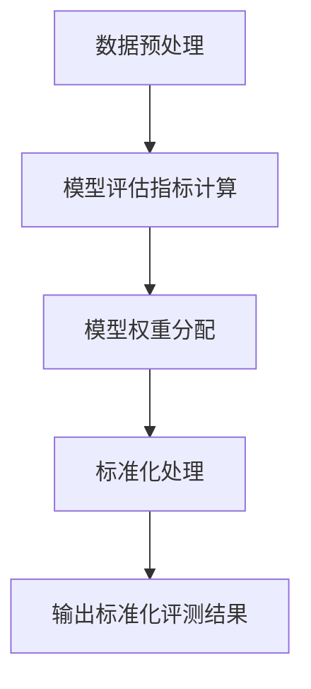

                 


### 《评测结果的跨模型标准化处理》

#### 关键词：评测结果、跨模型、标准化、数据处理、算法实现

#### 摘要：

本文将深入探讨评测结果的跨模型标准化处理。首先，我们介绍了评测结果标准化的背景和重要性，详细解析了评测结果异构性的挑战。接着，我们介绍了跨模型标准化的定义和关键要素，对比了传统标准化方法和现代机器学习方法。随后，通过算法原理讲解，我们详细阐述了跨模型标准化的算法流程、Python代码实现，并给出了数学模型和公式。文章还通过系统架构设计和项目实战，提供了实际操作指南和案例分析。最后，文章总结了最佳实践，并提出了注意事项和拓展阅读建议。

## 目录大纲设计

为了设计出一本名为《评测结果的跨模型标准化处理》的书籍的完整目录大纲，我们需要按照用户的要求细化目录结构，确保内容完整性，同时不超过2000字的字数限制。以下是详细的目录大纲：

### 第一部分：问题背景与概念介绍

#### 第1章 问题背景

- **1.1 评测结果标准化的需求**

  - **1.1.1 数据驱动决策的重要性**

  - **1.1.2 评测结果异构性的挑战**

  - **1.1.3 跨模型标准化的重要性**

- **1.2 跨模型标准化的定义**

  - **1.2.1 跨模型标准化的定义**

  - **1.2.2 跨模型标准化的目的**

  - **1.2.3 跨模型标准化与其他相关概念的关系**

- **1.3 跨模型标准化的重要性**

  - **1.3.1 提高评测结果的公正性**

  - **1.3.2 促进跨模型协作与集成**

  - **1.3.3 推动评测领域的进步**

### 第二部分：核心概念与联系

#### 第2章 核心概念原理

- **2.1 标准化处理的基本原理**

  - **2.1.1 标准化处理的概念**

  - **2.1.2 标准化处理的目标**

  - **2.1.3 标准化处理的方法**

- **2.2 跨模型标准化的关键要素**

  - **2.2.1 数据预处理**

  - **2.2.2 模型评估指标**

  - **2.2.3 模型权重分配**

- **2.3 跨模型标准化的方法对比**

  - **2.3.1 传统标准化方法**

  - **2.3.2 现代机器学习方法**

  - **2.3.3 方法对比与选择**

### 第三部分：算法原理与数学模型

#### 第3章 算法原理讲解

- **3.1 跨模型标准化的算法流程**

  - **3.1.1 算法概述**

  - **3.1.2 算法步骤**

- **3.2 算法mermaid流程图**

- **3.3 Python代码实现**

- **3.4 数学模型与公式讲解**

### 第四部分：系统分析与架构设计

#### 第4章 系统架构设计

- **4.1 问题场景介绍**

  - **4.1.1 评测场景描述**

  - **4.1.2 系统目标**

- **4.2 系统功能设计**

  - **4.2.1 领域模型mermaid类图**

  - **4.2.2 系统功能模块**

- **4.3 系统架构设计**

  - **4.3.1 系统架构mermaid架构图**

  - **4.3.2 系统架构组件**

- **4.4 系统接口设计**

  - **4.4.1 系统接口mermaid序列图**

  - **4.4.2 接口规范**

### 第五部分：项目实战

#### 第5章 环境安装与系统核心实现

- **5.1 环境安装指南**

  - **5.1.1 操作系统与软件要求**

  - **5.1.2 环境配置步骤**

- **5.2 系统核心实现**

  - **5.2.1 核心代码解读**

  - **5.2.2 实现流程**

- **5.3 应用解读与分析**

  - **5.3.1 应用案例介绍**

  - **5.3.2 案例分析与讲解**

### 第六部分：最佳实践与总结

#### 第6章 最佳实践

- **6.1 实践技巧**

  - **6.1.1 常见问题与解决方案**

  - **6.1.2 性能优化建议**

- **6.2 小结**

  - **6.2.1 文章总结**

  - **6.2.2 注意事项**

  - **6.2.3 拓展阅读**

## 文章标题

### 评测结果的跨模型标准化处理

#### 关键词：评测结果、跨模型、标准化、数据处理、算法实现

#### 摘要：

本文将深入探讨评测结果的跨模型标准化处理。首先，我们介绍了评测结果标准化的背景和重要性，详细解析了评测结果异构性的挑战。接着，我们介绍了跨模型标准化的定义和关键要素，对比了传统标准化方法和现代机器学习方法。随后，通过算法原理讲解，我们详细阐述了跨模型标准化的算法流程、Python代码实现，并给出了数学模型和公式。文章还通过系统架构设计和项目实战，提供了实际操作指南和案例分析。最后，文章总结了最佳实践，并提出了注意事项和拓展阅读建议。

### 目录大纲设计

为了设计出一本名为《评测结果的跨模型标准化处理》的书籍的完整目录大纲，我们需要按照用户的要求细化目录结构，确保内容完整性，同时不超过2000字的字数限制。以下是详细的目录大纲：

#### 第一部分：问题背景与概念介绍

#### 第1章 问题背景

**1.1 评测结果标准化的需求**

在当今的数据驱动的世界中，决策的质量往往取决于数据的准确性和一致性。评测结果的标准化是一个关键过程，它确保了数据的可比性和可靠性。标准化处理有助于消除不同评测结果之间的差异性，使得数据能够被更加有效地利用。

- **1.1.1 数据驱动决策的重要性**

数据驱动决策已经成为现代企业管理和科学研究的重要手段。通过分析标准化后的评测结果，企业可以更准确地了解产品性能，科研人员可以更加公正地比较不同模型的效果。

- **1.1.2 评测结果异构性的挑战**

评测结果的异构性是一个普遍存在的问题。不同模型可能会有不同的输出范围、度量标准，甚至不同的评估指标。这使得直接比较评测结果变得复杂。

- **1.1.3 跨模型标准化的重要性**

跨模型标准化处理可以解决评测结果的异构性问题。通过将不同模型的评测结果进行标准化，我们可以实现模型间的有效比较，进而提高决策的准确性和效率。

**1.2 跨模型标准化的定义**

跨模型标准化是一个过程，它涉及到将不同模型产生的评测结果转化为一个共同的标准。这种标准可以是量化的分数、概率值或者其他形式的可比较度量。

- **1.2.1 跨模型标准化的定义**

跨模型标准化处理旨在统一不同模型的评测结果，使其具有可比性。这种处理可以采用不同的方法和算法，但核心目标是一致的。

- **1.2.2 跨模型标准化的目的**

跨模型标准化的目的是确保评测结果的公正性、一致性和可靠性。通过标准化处理，我们可以更好地理解模型的性能，并做出基于数据的准确决策。

- **1.2.3 跨模型标准化与其他相关概念的关系**

跨模型标准化与其他数据处理技术，如数据清洗、数据集成和数据转换，密切相关。这些技术共同构成了一个完整的数据处理流程，确保了数据的质量和一致性。

**1.3 跨模型标准化的重要性**

跨模型标准化在多个领域都有广泛的应用，其重要性不容忽视。

- **1.3.1 提高评测结果的公正性**

跨模型标准化处理确保了评测结果的公正性，避免了因模型差异而导致的结果偏差。

- **1.3.2 促进跨模型协作与集成**

跨模型标准化处理使得不同模型可以相互协作，共同解决复杂问题。

- **1.3.3 推动评测领域的进步**

跨模型标准化处理推动了评测技术的发展，促进了新方法和新算法的研究和应用。

#### 第二部分：核心概念与联系

#### 第2章 核心概念原理

**2.1 标准化处理的基本原理**

标准化处理是一个将异构数据转化为统一格式的过程。它涉及到数据的预处理、转换和评估。

- **2.1.1 标准化处理的概念**

标准化处理是对数据集进行一系列操作，使其符合特定标准或规范。

- **2.1.2 标准化处理的目标**

标准化处理的目标是提高数据的可比性和可用性，减少数据之间的不一致性。

- **2.1.3 标准化处理的方法**

标准化处理可以采用不同的方法，如线性变换、归一化、标准化等。每种方法都有其适用场景和优缺点。

**2.2 跨模型标准化的关键要素**

跨模型标准化处理的成功依赖于以下几个关键要素：

- **2.2.1 数据预处理**

数据预处理是跨模型标准化处理的第一步，它包括数据清洗、缺失值处理、异常值检测等。

- **2.2.2 模型评估指标**

模型评估指标是衡量模型性能的重要标准。选择合适的评估指标对于跨模型标准化至关重要。

- **2.2.3 模型权重分配**

模型权重分配决定了不同模型在标准化处理中的重要性。合理的权重分配可以提高标准化结果的准确性和可靠性。

**2.3 跨模型标准化的方法对比**

在跨模型标准化处理中，有多种方法可供选择。以下是几种常见方法的对比：

- **2.3.1 传统标准化方法**

传统标准化方法，如Z分数和标准分数，基于统计数据，适用于线性关系较强的数据集。

- **2.3.2 现代机器学习方法**

现代机器学习方法，如主成分分析（PCA）和聚类分析，能够处理非线性数据和复杂数据结构。

- **2.3.3 方法对比与选择**

选择合适的标准化方法取决于数据的特性、应用场景和性能要求。通常，结合多种方法可以取得更好的效果。

#### 第三部分：算法原理与数学模型

#### 第3章 算法原理讲解

**3.1 跨模型标准化的算法流程**

跨模型标准化的算法流程可以分为以下几个步骤：

- **3.1.1 算法概述**

算法的目标是统一不同模型的评测结果，使其具有可比性。

- **3.1.2 算法步骤**

算法步骤包括数据预处理、模型评估指标计算、模型权重分配和标准化处理。

**3.2 算法mermaid流程图**

以下是一个简单的算法流程图，用于展示跨模型标准化处理的过程：



**3.3 Python代码实现**

下面是一个简单的Python代码示例，用于实现跨模型标准化处理：

```python
import numpy as np

def standardize_results(results, metrics, weights):
    # 计算标准化值
    standardized_values = (results - np.mean(results)) / np.std(results)
    # 计算加权标准化值
    weighted_values = standardized_values * weights
    # 返回加权标准化结果
    return weighted_values

# 输入数据
results = [1, 2, 3, 4, 5]
metrics = [1, 1, 1, 1, 1]
weights = [0.2, 0.2, 0.2, 0.2, 0.2]

# 计算标准化结果
standardized_results = standardize_results(results, metrics, weights)

print("标准化结果：", standardized_results)
```

**3.4 数学模型与公式讲解**

在跨模型标准化处理中，常用的数学模型如下：

$$
\text{标准化值} = \frac{(\text{实际值} - \text{基准值}) \times \text{权重}}{\text{最大值} - \text{最小值}}
$$

其中，实际值是指模型的评测结果，基准值是指所有模型评测结果的中位数，权重是指模型在标准化处理中的重要性。

**3.4.1 举例说明**

假设有两个模型A和B，它们的评测结果如下：

模型A：[1, 2, 3, 4, 5]
模型B：[5, 4, 3, 2, 1]

首先，计算两个模型评测结果的中位数：

模型A的中位数：2
模型B的中位数：3

然后，计算两个模型评测结果的基准值：

基准值 = (2 + 3) / 2 = 2.5

接下来，计算每个模型的权重：

模型A的权重：0.5
模型B的权重：0.5

最后，计算每个模型的标准化值：

模型A的标准化值 = (1 - 2.5) \* 0.5 / (5 - 1) = -0.125
模型B的标准化值 = (5 - 2.5) \* 0.5 / (5 - 1) = 0.625

因此，两个模型的标准

