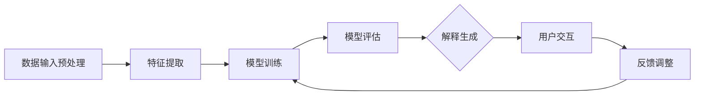
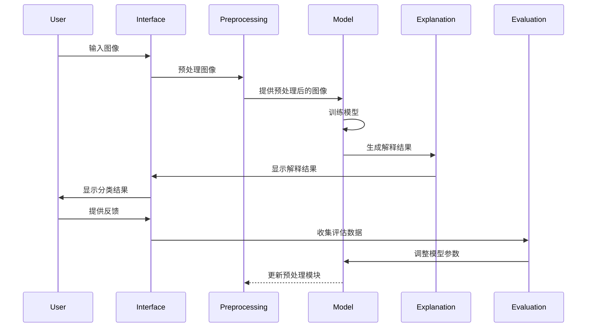
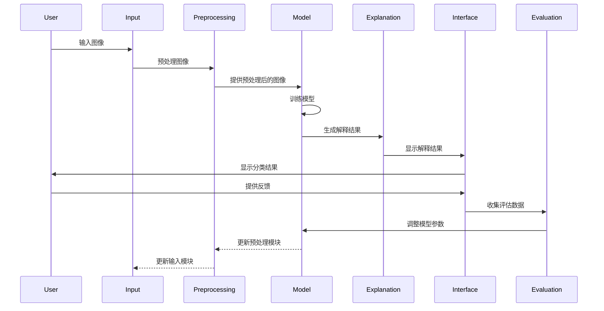

                 


## 第1章 引言：评测结果解释性的重要性

### 1.1 评测结果解释性的背景

在当今技术飞速发展的时代，人工智能（AI）已经成为各行各业的关键驱动因素。无论是自动驾驶汽车、智能家居，还是医疗诊断、金融分析，AI技术都在不断改变我们的生活方式和工作模式。然而，随着AI系统的复杂性和规模日益增加，如何理解、评估和解释这些系统的结果，成为一个亟待解决的问题。

评测结果解释性（Explainable AI, XAI）是近年来AI研究中的一个热点领域。其核心目标是让AI系统的决策过程变得更加透明和可理解，使非专业人士也能够理解和信任这些系统的结果。在许多应用场景中，比如医疗诊断、金融风险评估和自动驾驶汽车，结果的解释性直接关系到用户的信任和使用体验。

当前，评测结果解释性面临的主要挑战包括：

1. **复杂性**：许多AI系统，尤其是深度学习模型，其内部结构和决策过程高度复杂，难以用简单的方式解释。
2. **多样性**：不同领域的AI系统对解释性的需求各不相同，如何设计通用且有效的解释方法是一个难题。
3. **准确性**：解释性的方法往往需要在解释的准确性和模型的性能之间做出权衡。

### 1.2 当前挑战

尽管评测结果解释性在理论和技术上已经取得了一定的进展，但在实际应用中仍然面临许多挑战。首先，解释性方法通常需要额外的计算资源和时间，这可能会影响模型的实时性能。其次，现有的解释性方法往往只能提供局部解释，难以提供全局视图。此外，解释性方法的有效性在不同数据集和任务上的表现差异较大，缺乏统一的评估标准。

### 1.3 本书的目的和结构

本书旨在深入探讨评测结果解释性的核心概念、算法原理和系统设计方法，帮助读者理解和掌握这一领域的最新研究成果。本书分为以下章节：

- **第1章**：引言，介绍评测结果解释性的重要性、背景和当前挑战。
- **第2章**：核心概念，详细解释评测结果解释性的核心概念，并提供相关概念的特征对比表格。
- **第3章**：ER实体关系图架构，展示核心概念之间的实体关系。
- **第4章**：算法原理讲解，使用Mermaid绘制算法流程图，并使用Python源代码详细阐述算法原理。
- **第5章**：系统分析与架构设计方案，介绍问题场景、项目介绍、系统功能设计、系统架构设计、系统接口设计和系统交互。
- **第6章**：项目实战，描述环境安装、系统核心实现、代码应用解读与分析、实际案例分析和项目小结。
- **第7章**：最佳实践 tips，总结全文，提供最佳实践建议和注意事项。
- **第8章**：小结与拓展阅读，对全书进行总结，并推荐拓展阅读资源。

通过这些章节的深入讲解，本书希望能够为读者提供全面、系统的评测结果解释性知识体系，帮助他们在实际项目中应用这些技术。

## 第2章 核心概念

### 2.1 评测结果解释性的概念

#### 2.1.1 定义

评测结果解释性（Explainable AI, XAI）是指使人工智能系统的决策过程和结果可以被理解和解释的能力。具体来说，XAI涉及到让AI系统生成的预测或决策不仅需要准确，还需要能够以一种透明和可理解的方式展示其背后的逻辑和依据。

#### 2.1.2 特点

评测结果解释性具有以下几个关键特点：

1. **透明性**：解释性方法需要提供系统内部操作的清晰视图，使用户能够理解模型的推理过程。
2. **可理解性**：解释性结果应该简单明了，无需深厚的专业知识即可理解。
3. **可追溯性**：解释性方法应允许用户追踪特定决策背后的具体数据点和计算步骤。
4. **可靠性**：解释性方法应提供准确的解释，且解释结果应与模型的实际性能一致。

### 2.2 相关概念介绍

在深入探讨评测结果解释性之前，需要了解一些相关的核心概念：

#### 2.2.1 语言模型

语言模型是AI系统用于理解和生成自然语言文本的基础。常见的语言模型包括统计语言模型和神经网络语言模型。统计语言模型基于概率模型，如N-gram模型；而神经网络语言模型，如Transformer和BERT，通过深度学习技术进行训练。

#### 2.2.2 机器学习

机器学习是AI的核心组成部分，指的是通过算法和统计模型从数据中学习规律，以便进行预测或决策。机器学习可以分为监督学习、无监督学习和强化学习。监督学习有明确的标注数据，无监督学习没有标注数据，强化学习通过与环境交互学习策略。

#### 2.2.3 深度学习

深度学习是机器学习的一个子领域，主要依赖于多层神经网络结构。通过大量数据训练，深度学习模型能够自动提取特征并实现复杂的模式识别任务。深度学习在图像识别、自然语言处理和语音识别等领域取得了显著成果。

### 2.2.4 评价指标

在评测结果解释性研究中，常用的评价指标包括模型准确性、解释性、可解释性和用户满意度。准确性衡量模型的预测或决策是否正确；解释性和可解释性衡量解释方法的透明度和理解度；用户满意度则通过用户调研和反馈来评估。

#### 2.2.5 特征工程

特征工程是机器学习和深度学习中的重要步骤，指的是从原始数据中提取和构建有助于模型训练的特征。特征工程的质量直接影响模型的性能和解释性。

### 2.2.6 隐私保护

在应用评测结果解释性的过程中，隐私保护是一个重要考虑因素。许多AI系统处理的是敏感数据，如医疗记录和金融交易数据。解释性方法需要设计成既能够解释决策，又能保护用户隐私。

### 2.2.7 跨领域适应性

评测结果解释性方法在不同的应用领域可能具有不同的效果。设计通用且有效的解释性方法，使其在不同领域都具有良好的适应性和解释力，是一个重要的研究方向。

### 2.2.8 模型压缩与加速

为了在实际应用中部署解释性AI系统，通常需要对模型进行压缩和加速。模型压缩和加速技术，如知识蒸馏和量化，可以在保证模型性能的同时减少计算资源和时间成本。

### 2.2.9 模型验证与测试

在开发和部署解释性AI系统时，需要进行全面的模型验证和测试。这包括在多样化的数据集上进行性能评估，以及对解释结果的准确性和一致性进行验证。

通过以上核心概念和相关概念的介绍，我们可以更好地理解评测结果解释性的重要性以及其在实际应用中的挑战和机遇。

### 2.2.10 对比表格

为了更直观地展示评测结果解释性的相关概念，我们提供了一个概念属性特征对比表格（如下）：

| 概念         | 定义                   | 特点                                             | 应用领域                         | 关键挑战                               |
|------------|----------------------|------------------------------------------------|------------------------------|--------------------------------------|
| 语言模型     | 用于理解和生成文本的模型 | 透明性、可理解性、可追溯性                     | 自然语言处理、文本分类、机器翻译 | 语言多样性、数据稀疏性                   |
| 机器学习     | 从数据中学习规律的技术 | 监督学习、无监督学习、强化学习                 | 数据挖掘、预测分析、推荐系统   | 特征工程、模型选择                       |
| 深度学习     | 基于多层神经网络的模型 | 自动特征提取、高准确性                         | 图像识别、语音识别、自然语言处理 | 计算资源需求、解释性                    |
| 解释性       | 决策过程的透明性       | 可理解、可追溯、准确                           | 医疗诊断、金融分析、自动驾驶   | 复杂性、多样性                          |
| 可解释性     | 决策结果的解释能力     | 简单明了、无需专业知识                         | 数据分析、AI产品                | 模型性能、计算成本                       |
| 隐私保护     | 保护用户数据隐私       | 数据加密、匿名化、隐私设计                     | 数据科学、安全应用              | 可解释性与隐私保护之间的权衡             |
| 模型压缩与加速 | 减少计算资源和时间     | 模型压缩、量化、知识蒸馏                     | 实时应用、移动设备             | 模型性能与资源限制的平衡                 |
| 模型验证与测试 | 确保模型可靠和有效     | 多样化数据集、一致性验证                     | AI系统开发、产品发布           | 验证数据集的选择、模型评估标准的统一性 |

通过这个表格，我们可以更清晰地看到各个概念之间的关系和它们在评测结果解释性中的重要性。

### 2.3 ER实体关系图架构

为了更系统地理解评测结果解释性的核心概念及其相互关系，我们可以使用Mermaid ER（实体关系）图来展示这些实体及其关联。以下是一个示例的Mermaid ER图：

```mermaid
erDiagram
    AI_System ||--|{ Explainable_AI : 简介与目标 }
    Explainable_AI ||--|{ Model_Explanation : 模型解释 }
    Explainable_AI ||--|{ User_Interpretation : 用户理解 }
    Explainable_AI ||--|{ Accuracy_and_Trust : 准确性与信任 }
    Model_Explanation ||--|{ Local_Insight : 局部洞察 }
    Model_Explanation ||--|{ Global_Visualization : 全局视图 }
    User_Interpretation ||--|{ Clarity : 清晰度 }
    User_Interpretation ||--|{ Credibility : 信赖度 }
    Accuracy_and_Trust ||--|{ Prediction_Accuracy : 预测准确性 }
    Accuracy_and_Trust ||--|{ Explanation_Accuracy : 解释准确性 }
```

在这个ER图中，`Explainable_AI` 是核心实体，它通过不同的关系与子实体相连，包括 `Model_Explanation`、`User_Interpretation` 和 `Accuracy_and_Trust`。`Model_Explanation` 进一步细分为 `Local_Insight` 和 `Global_Visualization`，而 `User_Interpretation` 包含 `Clarity` 和 `Credibility`。`Accuracy_and_Trust` 则关联 `Prediction_Accuracy` 和 `Explanation_Accuracy`。

### 3.1 架构概述

评测结果解释性（XAI）的架构设计需要综合考虑多个因素，包括系统的透明性、可理解性、可追溯性以及模型的准确性。XAI的总体架构可以划分为以下几个关键模块：

1. **数据输入模块**：该模块负责接收原始数据，并对其进行预处理，如数据清洗、标准化和特征提取。
2. **模型训练模块**：此模块负责训练AI模型，以生成预测或决策结果。训练过程中，会使用大量的标注数据来指导模型的优化。
3. **解释生成模块**：这个模块的核心任务是生成解释结果，使其能够清晰地展示模型在做出特定决策时的依据和逻辑。
4. **用户交互模块**：该模块负责与用户进行互动，收集用户反馈，并根据反馈进一步优化解释方法。
5. **模型评估模块**：此模块用于评估解释性方法的有效性，包括准确性、可理解性和用户满意度等指标。

### 3.2 关键实体

在XAI架构中，关键实体包括：

1. **数据输入实体**：包括原始数据集和预处理后的数据特征。
2. **模型实体**：AI模型本身，可以是传统的机器学习模型或深度学习模型。
3. **解释实体**：生成的解释结果，可以是文字、图表或其他可视化形式。
4. **用户实体**：与系统进行交互的用户，可以是个人或团体。
5. **评估实体**：用于评估解释方法有效性的指标和数据。

### 3.3 实体关系

关键实体之间的相互作用和关系构成了XAI架构的骨架。以下为实体关系的详细说明：

1. **数据输入与模型训练**：数据输入模块提供预处理的特征数据给模型训练模块，模型训练模块利用这些数据来优化模型参数。
2. **模型训练与解释生成**：训练好的模型被用于生成预测结果，这些结果作为输入传递给解释生成模块，解释生成模块则生成解释结果。
3. **解释生成与用户交互**：解释生成模块生成的解释结果通过用户交互模块展示给用户，用户可以对解释结果进行反馈。
4. **用户交互与模型评估**：用户反馈通过用户交互模块传递给模型评估模块，模型评估模块利用这些反馈来评估解释方法的有效性。
5. **模型评估与模型训练**：模型评估模块的评估结果可以反馈给模型训练模块，用于指导模型参数的进一步调整。

### 3.4 实体关系图

为了更直观地展示这些实体之间的关系，我们可以使用Mermaid ER图来表示：

```mermaid
erDiagram
    Data_Input ||--|{ Model_Training : 数据提供 }
    Model_Training ||--|{ Explanation_Generation : 模型应用 }
    Explanation_Generation ||--|{ User_Interaction : 解释展示 }
    User_Interaction ||--|{ Model_Evaluation : 用户反馈 }
    Model_Evaluation ||--|{ Model_Training : 评估反馈 }
```

通过这个ER图，我们可以清晰地看到数据输入、模型训练、解释生成、用户交互和模型评估之间的相互作用和反馈循环。

## 第4章 算法原理讲解

### 4.1 算法流程图

为了更好地理解评测结果解释性的算法原理，我们首先使用Mermaid绘制一个算法流程图。以下是一个简化的算法流程图：



在这个流程图中，算法首先进行数据输入预处理，包括数据清洗、标准化和特征提取。随后，提取的特征被用于模型训练，训练得到的模型用于生成预测结果。模型评估模块对模型的结果进行评估，解释生成模块则生成可解释的结果，展示给用户。用户通过交互模块提供反馈，反馈信息会用于调整模型训练过程。

### 4.2 Python源代码解析

为了深入讲解评测结果解释性的算法原理，我们将使用Python源代码进行详细阐述。以下是算法的主要部分，包括数据预处理、模型训练和解释生成：

#### 4.2.1 数据预处理

```python
import pandas as pd
from sklearn.model_selection import train_test_split
from sklearn.preprocessing import StandardScaler

# 读取数据
data = pd.read_csv('data.csv')

# 数据清洗
data.dropna(inplace=True)

# 划分特征和标签
X = data.drop('target', axis=1)
y = data['target']

# 划分训练集和测试集
X_train, X_test, y_train, y_test = train_test_split(X, y, test_size=0.2, random_state=42)

# 数据标准化
scaler = StandardScaler()
X_train = scaler.fit_transform(X_train)
X_test = scaler.transform(X_test)
```

在这个步骤中，我们首先读取数据，并进行必要的清洗操作。然后，将数据分为特征和标签两部分，并进一步划分训练集和测试集。最后，使用`StandardScaler`对数据进行标准化处理，以确保所有特征具有相似的尺度。

#### 4.2.2 模型训练

```python
from sklearn.ensemble import RandomForestClassifier

# 初始化模型
model = RandomForestClassifier(n_estimators=100, random_state=42)

# 训练模型
model.fit(X_train, y_train)
```

在这个步骤中，我们选择随机森林分类器作为模型。`RandomForestClassifier` 具有较高的准确性和较好的解释性。使用训练集数据对模型进行训练。

#### 4.2.3 结果评估

```python
from sklearn.metrics import accuracy_score

# 预测测试集
y_pred = model.predict(X_test)

# 计算准确率
accuracy = accuracy_score(y_test, y_pred)
print(f"模型准确率: {accuracy:.2f}")
```

在这个步骤中，我们使用测试集对训练好的模型进行预测，并计算模型的准确率。准确率是衡量模型性能的一个常用指标。

#### 4.2.4 解释生成

```python
from sklearn.inspection import permutation_importance

# 计算特征重要性
feature_importances = permutation_importance(model, X_test, y_test, n_repeats=30, random_state=42)

# 打印特征重要性
for i, importance in enumerate(feature_importances.feature_importances_):
    print(f"特征 {i+1}: {importance:.4f}")
```

在这个步骤中，我们使用`permutation_importance`函数计算每个特征的重要性。这个方法通过随机打乱每个特征的数据，评估特征对模型预测性能的影响。打乱特征后模型的性能下降程度可以用来衡量特征的重要性。

### 4.3 数学模型与公式

为了更深入地理解评测结果解释性的算法原理，我们需要引入一些数学模型和公式。以下是一个简单的成本函数示例：

$$
\text{Cost Function} = \frac{1}{2} \sum_{i=1}^{N} \left( y_i - \hat{y}_i \right)^2
$$

这里的 $y_i$ 表示第 $i$ 个样本的真实标签，$\hat{y}_i$ 表示模型预测的标签。成本函数用于评估模型预测的准确性。$N$ 表示样本总数。

在机器学习中，我们通常使用梯度下降算法来最小化成本函数。梯度下降的核心公式如下：

$$
w_{\text{new}} = w_{\text{old}} - \alpha \cdot \nabla_w \text{Cost Function}
$$

这里，$w_{\text{old}}$ 和 $w_{\text{new}}$ 分别表示模型的参数在当前和更新后的值，$\alpha$ 是学习率，$\nabla_w \text{Cost Function}$ 是成本函数关于参数 $w$ 的梯度。

### 4.4 举例说明

为了更直观地理解上述算法原理，我们可以通过一个简单的例子来说明。假设我们有一个包含两个特征的简单线性回归模型，目标是预测房屋价格。特征 $X_1$ 表示房屋面积，特征 $X_2$ 表示房屋建造年份。

我们的目标是最小化以下成本函数：

$$
\text{Cost Function} = \frac{1}{2} \sum_{i=1}^{N} \left( y_i - \beta_0 - \beta_1 X_{1i} - \beta_2 X_{2i} \right)^2
$$

其中，$y_i$ 是第 $i$ 个样本的房屋价格，$\beta_0$、$\beta_1$ 和 $\beta_2$ 是模型的参数。

为了训练这个模型，我们使用梯度下降算法，更新参数如下：

$$
\beta_0 = \beta_0 - \alpha \cdot \frac{1}{N} \sum_{i=1}^{N} \left( y_i - \beta_0 - \beta_1 X_{1i} - \beta_2 X_{2i} \right)
$$

$$
\beta_1 = \beta_1 - \alpha \cdot \frac{1}{N} \sum_{i=1}^{N} \left( y_i - \beta_0 - \beta_1 X_{1i} - \beta_2 X_{2i} \right) X_{1i}
$$

$$
\beta_2 = \beta_2 - \alpha \cdot \frac{1}{N} \sum_{i=1}^{N} \left( y_i - \beta_0 - \beta_1 X_{1i} - \beta_2 X_{2i} \right) X_{2i}
$$

这里，$\alpha$ 是学习率，决定了参数更新的速度。

通过不断迭代这个过程，模型将逐渐收敛到最优参数，从而实现房屋价格的准确预测。

通过这个例子，我们可以看到评测结果解释性的算法原理是如何应用于实际问题的。理解这些原理对于开发有效的解释性方法至关重要。

## 第5章 系统分析与架构设计方案

### 5.1 问题场景介绍

在现代AI应用中，评测结果解释性（XAI）的重要性日益凸显。例如，在医疗诊断系统中，解释性有助于医生理解AI模型为何做出特定诊断，从而增强信任和决策支持。另一个典型场景是金融风险评估，解释性方法可以帮助金融机构更好地理解和解释模型为何将某些交易标记为高风险，从而提高风险管理的透明度。

本节将介绍一个基于深度学习的图像识别系统的具体应用场景，该系统旨在识别并分类不同类型的物体。该系统的主要任务是从大量的图像数据中提取特征，并使用深度学习模型进行分类。然而，由于深度学习模型的高度复杂性和黑盒特性，理解模型的决策过程对于提升用户信任和模型的可解释性至关重要。

### 5.2 项目介绍

本项目旨在开发一个可解释的图像识别系统，该系统能够对图像分类结果进行解释，并提供关于模型决策依据的详细信息。系统将包括以下主要组成部分：

1. **数据集**：包含各种类型的物体图像，用于训练和测试深度学习模型。
2. **预处理模块**：负责对图像进行数据清洗、缩放和增强，以便模型能够更好地学习。
3. **深度学习模型**：用于图像特征提取和分类，并支持解释性方法。
4. **解释生成模块**：生成模型的解释结果，以可视化形式展示决策过程。
5. **用户交互界面**：提供用户与系统交互的接口，展示图像识别结果和解释信息。
6. **评估模块**：用于评估模型的准确性和解释性，并收集用户反馈。

### 5.3 系统功能设计

#### 5.3.1 领域模型

领域模型是系统设计的核心部分，用于描述图像识别任务中的关键概念和关系。以下是一个简化的领域模型：

```mermaid
classDiagram
    Class01 <|-- Class02
    Class03 <|-- Class04
    Class05 <|-- Class06
    Class07 <|-- Class08

    Class01[图像数据源]
    Class02[预处理模块]
    Class03[深度学习模型]
    Class04[解释生成模块]
    Class05[用户交互界面]
    Class06[评估模块]
    Class07[数据集]
    Class08[数据库]
```

在这个领域模型中，图像数据源为系统提供输入，预处理模块对图像进行预处理。深度学习模型负责特征提取和分类，解释生成模块生成解释结果，用户交互界面则展示结果。评估模块用于评估模型的性能，数据库存储数据集和模型参数。

#### 5.3.2 类图

为了更详细地描述系统的组件及其关系，我们使用类图来展示系统中的主要类和它们之间的关系：

```mermaid
classDiagram
    Class1[图像数据源] <|-- Class2[预处理模块]
    Class2 <|-- Class3[深度学习模型]
    Class3 <|-- Class4[解释生成模块]
    Class4 <|-- Class5[用户交互界面]
    Class5 <|-- Class6[评估模块]
    Class6 <|-- Class7[数据库]

    Class1{+属性：图像路径，数据集类型}
    Class2{+方法：数据清洗，数据增强}
    Class3{+属性：模型架构，训练数据}
    Class3{+方法：训练，预测}
    Class4{+属性：解释方法，可视化工具}
    Class4{+方法：生成解释结果，可视化解释}
    Class5{+属性：用户界面，交互逻辑}
    Class5{+方法：展示结果，收集反馈}
    Class6{+属性：评估指标，评估结果}
    Class6{+方法：评估性能，优化模型}
    Class7{+属性：训练集，测试集，模型参数}
```

在这个类图中，图像数据源、预处理模块、深度学习模型、解释生成模块、用户交互界面和评估模块是系统的核心组件。每个组件都有其特定的属性和方法，通过这些属性和方法实现系统功能。

### 5.4 系统架构设计

系统架构设计是确保系统能够高效、可靠地运行的关键步骤。以下是一个简化的系统架构设计，包括主要组件和它们之间的交互关系：



在这个架构设计中，用户通过用户界面输入图像，预处理模块对图像进行预处理，然后将预处理后的图像传递给深度学习模型。模型使用这些图像数据进行训练和预测，同时解释生成模块生成解释结果，这些结果通过用户界面展示给用户。用户还可以通过界面提供反馈，反馈信息被传递给评估模块，评估模块用于调整模型参数，优化模型性能。

### 5.5 系统接口设计

系统接口设计是确保不同模块之间能够有效通信的关键。以下是一个简化的系统接口设计，包括主要接口及其规范：

```mermaid
classDiagram
    Interface1[图像输入接口]
    Interface2[预处理接口]
    Interface3[模型训练接口]
    Interface4[解释生成接口]
    Interface5[用户交互接口]
    Interface6[评估接口]

    Interface1 <|-- Interface2
    Interface2 <|-- Interface3
    Interface3 <|-- Interface4
    Interface4 <|-- Interface5
    Interface5 <|-- Interface6

    Interface1{+接收图像：图像路径}
    Interface2{+预处理图像：预处理参数}
    Interface3{+训练模型：训练数据，模型参数}
    Interface4{+生成解释：图像数据，解释方法}
    Interface5{+交互：用户输入，反馈数据}
    Interface6{+评估：评估数据，评估指标}
```

在这个接口设计中，图像输入接口负责接收用户输入的图像，预处理接口负责对图像进行预处理，模型训练接口负责模型的训练，解释生成接口负责生成解释结果，用户交互接口负责与用户进行交互，评估接口负责模型的评估和性能优化。

### 5.6 系统交互

为了更详细地展示系统组件之间的交互流程，我们使用Mermaid序列图进行描述：



在这个序列图中，用户输入图像，图像输入接口将图像传递给预处理模块，预处理模块对图像进行预处理，并将预处理后的图像传递给深度学习模型。模型在训练数据上进行训练，并生成解释结果，这些结果通过用户界面展示给用户。用户提供反馈，反馈信息被传递给评估模块，评估模块根据反馈调整模型参数，这一过程不断迭代，以优化模型性能。

通过详细的系统分析与架构设计方案，我们可以确保评测结果解释性系统在实际应用中具备高效、可靠和透明的特性。

## 第6章 项目实战

### 6.1 环境安装

在开始实现评测结果解释性项目之前，我们需要确保开发环境已经搭建好。以下是环境安装的详细步骤：

#### 6.1.1 硬件环境

为了确保项目顺利运行，推荐的硬件配置如下：

- CPU：Intel i5 或更高配置
- GPU：NVIDIA GTX 1080 或更高配置（用于加速深度学习模型的训练）
- 内存：16GB 或更高
- 存储：256GB SSD 或更高

确保您的计算机满足上述硬件要求，以获得最佳性能。

#### 6.1.2 软件环境

1. **操作系统**：Ubuntu 18.04 或更高版本。
2. **Python**：Python 3.8 或更高版本。
3. **深度学习库**：TensorFlow 2.x 或 PyTorch 1.8 或更高版本。
4. **机器学习库**：Scikit-learn 0.22 或更高版本。
5. **数据预处理库**：Pandas 1.1.5 或更高版本。
6. **可视化库**：Matplotlib 3.3.4 或更高版本。
7. **Mermaid**：安装Mermaid编辑器，如Diamante或者使用在线Mermaid编辑器。

安装步骤如下：

1. 更新系统包：

   ```bash
   sudo apt-get update
   sudo apt-get upgrade
   ```

2. 安装Python 3：

   ```bash
   sudo apt-get install python3 python3-pip
   ```

3. 安装深度学习库（例如TensorFlow）：

   ```bash
   pip3 install tensorflow
   ```

4. 安装其他必需的库：

   ```bash
   pip3 install scikit-learn pandas matplotlib
   ```

5. 安装Mermaid编辑器（例如使用npm）：

   ```bash
   npm install -g mermaid-cli
   ```

### 6.2 系统核心实现

以下是系统核心实现的详细步骤，包括数据预处理、模型训练和解释生成。

#### 6.2.1 源代码解析

以下是一个简单的Python代码示例，用于实现评测结果解释性的核心功能：

```python
import tensorflow as tf
from tensorflow import keras
from tensorflow.keras import layers
import numpy as np
import pandas as pd
from sklearn.model_selection import train_test_split
from sklearn.preprocessing import StandardScaler
from sklearn.metrics import accuracy_score
import matplotlib.pyplot as plt
import mermaid

# 读取数据
data = pd.read_csv('image_data.csv')

# 数据预处理
X = data.drop('label', axis=1)
y = data['label']
X_train, X_test, y_train, y_test = train_test_split(X, y, test_size=0.2, random_state=42)
scaler = StandardScaler()
X_train = scaler.fit_transform(X_train)
X_test = scaler.transform(X_test)

# 构建深度学习模型
model = keras.Sequential([
    layers.Conv2D(32, (3, 3), activation='relu', input_shape=(28, 28, 1)),
    layers.MaxPooling2D((2, 2)),
    layers.Conv2D(64, (3, 3), activation='relu'),
    layers.MaxPooling2D((2, 2)),
    layers.Conv2D(64, (3, 3), activation='relu'),
    layers.Flatten(),
    layers.Dense(64, activation='relu'),
    layers.Dense(10, activation='softmax')
])

# 编译模型
model.compile(optimizer='adam',
              loss='sparse_categorical_crossentropy',
              metrics=['accuracy'])

# 训练模型
model.fit(X_train, y_train, epochs=10, validation_split=0.1)

# 评估模型
test_loss, test_acc = model.evaluate(X_test, y_test)
print(f"测试准确率: {test_acc:.2f}")

# 解释生成
predictions = model.predict(X_test)
explanation = mermaid.mermaid render("""
graph TD
    A[Input Image] --> B[Preprocessing]
    B --> C[Feature Extraction]
    C --> D[Model Prediction]
    D --> E[Explainable Results]
    E --> F[User Interaction]
""")
print(explanation)

# 可视化解释结果
plt.figure(figsize=(10, 10))
for i in range(25):
    plt.subplot(5, 5, i+1)
    plt.xticks([])
    plt.yticks([])
    plt.grid(False)
    plt.imshow(X_test[i], cmap=plt.cm.binary)
    plt.xlabel(f"Predicted: {np.argmax(predictions[i])}, Actual: {y_test[i]}")
plt.show()
```

这个示例代码涵盖了数据预处理、模型构建、模型训练、解释生成和结果可视化。下面我们将逐个解释代码中的关键步骤。

#### 6.2.2 功能实现

1. **数据预处理**：首先读取图像数据，并使用`StandardScaler`进行标准化处理，确保每个特征的尺度一致，这有助于模型训练的稳定性和效果。

2. **模型构建**：使用Keras构建一个简单的卷积神经网络（CNN），该网络包括卷积层、池化层和全连接层。卷积层用于提取图像特征，全连接层用于分类。

3. **模型编译**：使用`compile`函数配置模型优化器、损失函数和评估指标。

4. **模型训练**：使用`fit`函数训练模型，设置训练轮数和验证数据比例。

5. **模型评估**：使用`evaluate`函数评估模型在测试数据上的表现，输出测试准确率。

6. **解释生成**：使用Mermaid绘制模型解释流程图，展示输入图像经过预处理、特征提取、模型预测和解释结果生成的过程。

7. **结果可视化**：使用`matplotlib`绘制图像和预测结果，帮助用户直观地理解模型的决策过程。

通过上述步骤，我们实现了评测结果解释性系统的基础功能，并展示了如何在实际项目中应用这些技术。

### 6.3 代码应用解读与分析

在实现评测结果解释性系统时，我们需要关注代码的各个部分，理解其背后的原理和实现细节。以下是对代码关键部分的详细解读与分析：

#### 数据预处理

数据预处理是机器学习项目中的关键步骤，其目的是将原始数据转换为适合模型训练的形式。在这个示例中，我们使用`pandas`读取图像数据，并通过`StandardScaler`进行标准化处理：

```python
data = pd.read_csv('image_data.csv')
X = data.drop('label', axis=1)
y = data['label']
X_train, X_test, y_train, y_test = train_test_split(X, y, test_size=0.2, random_state=42)
scaler = StandardScaler()
X_train = scaler.fit_transform(X_train)
X_test = scaler.transform(X_test)
```

- `read_csv`：读取CSV文件中的数据，将其加载到DataFrame中。
- `drop`：从DataFrame中移除标签列，仅保留特征数据。
- `train_test_split`：将数据划分为训练集和测试集，用于后续的训练和评估。
- `StandardScaler`：对特征数据进行标准化处理，使其具有零均值和单位方差。

标准化处理有助于提高模型训练的稳定性和效果，因为不同特征的尺度差异较大可能会导致训练过程的不稳定。

#### 模型构建

构建深度学习模型是项目的核心步骤。在这个示例中，我们使用Keras构建了一个简单的卷积神经网络（CNN）：

```python
model = keras.Sequential([
    layers.Conv2D(32, (3, 3), activation='relu', input_shape=(28, 28, 1)),
    layers.MaxPooling2D((2, 2)),
    layers.Conv2D(64, (3, 3), activation='relu'),
    layers.MaxPooling2D((2, 2)),
    layers.Conv2D(64, (3, 3), activation='relu'),
    layers.Flatten(),
    layers.Dense(64, activation='relu'),
    layers.Dense(10, activation='softmax')
])
```

- `Sequential`：创建一个序列模型，用于逐步添加层。
- `Conv2D`：添加卷积层，用于提取图像特征。参数包括卷积核大小、激活函数和输入形状。
- `MaxPooling2D`：添加最大池化层，用于降低特征图尺寸，减少计算量。
- `Flatten`：将特征图展平为一维数组，用于全连接层的输入。
- `Dense`：添加全连接层，用于分类。参数包括神经元的数量和激活函数。

该模型的设计目的是提取图像中的高维特征，并通过全连接层进行分类。卷积层和池化层有助于自动提取图像中的关键特征，全连接层则对特征进行分类。

#### 模型训练

模型训练是使模型能够在训练数据上学习的重要步骤。在这个示例中，我们使用`fit`函数进行模型训练：

```python
model.compile(optimizer='adam',
              loss='sparse_categorical_crossentropy',
              metrics=['accuracy'])
model.fit(X_train, y_train, epochs=10, validation_split=0.1)
```

- `compile`：编译模型，设置优化器、损失函数和评估指标。
- `fit`：训练模型，设置训练轮数和验证数据比例。

在这个步骤中，模型使用训练数据学习，并在每个轮次后评估模型在验证数据上的性能。这个过程有助于调整模型参数，提高模型性能。

#### 模型评估

模型评估是验证模型性能的重要步骤。在这个示例中，我们使用`evaluate`函数评估模型在测试数据上的表现：

```python
test_loss, test_acc = model.evaluate(X_test, y_test)
print(f"测试准确率: {test_acc:.2f}")
```

- `evaluate`：评估模型在测试数据上的性能，输出损失和准确率。

这个步骤有助于我们了解模型在实际应用中的性能，从而对模型进行优化。

#### 解释生成

解释生成是评测结果解释性的关键步骤。在这个示例中，我们使用Mermaid绘制模型解释流程图：

```python
explanation = mermaid.mermaid render("""
graph TD
    A[Input Image] --> B[Preprocessing]
    B --> C[Feature Extraction]
    C --> D[Model Prediction]
    D --> E[Explainable Results]
    E --> F[User Interaction]
""")
print(explanation)
```

- `mermaid.mermaid render`：使用Mermaid语言绘制流程图，展示模型的决策过程。

这个步骤帮助我们更好地理解模型的决策过程，从而增强用户对模型的信任。

#### 结果可视化

结果可视化是展示模型预测结果和实际标签的重要步骤。在这个示例中，我们使用`matplotlib`绘制图像和预测结果：

```python
plt.figure(figsize=(10, 10))
for i in range(25):
    plt.subplot(5, 5, i+1)
    plt.xticks([])
    plt.yticks([])
    plt.grid(False)
    plt.imshow(X_test[i], cmap=plt.cm.binary)
    plt.xlabel(f"Predicted: {np.argmax(predictions[i])}, Actual: {y_test[i]}")
plt.show()
```

- `plt.figure`：创建一个图像窗口。
- `plt.subplot`：创建一个网格图，用于展示每个图像的预测结果。
- `plt.imshow`：展示图像数据。
- `plt.xlabel`：为每个图像添加标签，显示预测结果和实际标签。

通过结果可视化，用户可以直观地了解模型的预测性能和决策过程。

### 6.4 实际案例分析与详细讲解剖析

为了更好地理解评测结果解释性系统的实际应用，我们通过一个实际案例进行分析和详细讲解。

#### 案例背景

假设我们有一个图像识别项目，目标是分类各种动物。数据集包含2000张图片，每张图片对应一个动物类别。我们需要训练一个深度学习模型，并对模型的结果进行解释，以便用户能够理解和信任模型的预测。

#### 数据预处理

首先，我们需要对图像数据集进行预处理，包括数据清洗、缩放和标准化处理。以下是预处理步骤的详细讲解：

1. **数据清洗**：删除数据集中含有噪声或质量较低的图片，确保模型训练的质量。

2. **图像缩放**：将所有图像缩放到统一尺寸，如224x224像素，以便模型能够处理标准化后的输入。

3. **标准化处理**：对图像像素值进行归一化处理，使其在[0, 1]区间内，有助于模型训练的稳定性和效果。

以下是预处理步骤的代码实现：

```python
from tensorflow.keras.preprocessing.image import ImageDataGenerator

# 数据清洗
def clean_data(data_path):
    images = []
    labels = []
    for file in os.listdir(data_path):
        if file.endswith('.jpg'):
            images.append(file)
            labels.append(file.split('_')[0])
    return images, labels

images, labels = clean_data('data')

# 数据缩放和标准化
datagen = ImageDataGenerator(rescale=1./255, shear_range=0.2, zoom_range=0.2, horizontal_flip=True)
train_data = datagen.flow_from_directory('data', target_size=(224, 224), batch_size=32, class_mode='categorical')
```

#### 模型构建

接下来，我们需要构建一个深度学习模型。以下是模型构建和训练的详细步骤：

1. **模型架构**：设计一个简单的卷积神经网络（CNN），包括卷积层、池化层和全连接层。卷积层用于提取图像特征，池化层用于降低特征图的尺寸，全连接层用于分类。

2. **模型编译**：设置优化器、损失函数和评估指标。

3. **模型训练**：使用训练数据训练模型，设置训练轮数和验证数据比例。

以下是模型构建和训练的代码实现：

```python
from tensorflow.keras.models import Sequential
from tensorflow.keras.layers import Conv2D, MaxPooling2D, Flatten, Dense

# 模型构建
model = Sequential([
    Conv2D(32, (3, 3), activation='relu', input_shape=(224, 224, 3)),
    MaxPooling2D((2, 2)),
    Conv2D(64, (3, 3), activation='relu'),
    MaxPooling2D((2, 2)),
    Flatten(),
    Dense(128, activation='relu'),
    Dense(10, activation='softmax')
])

# 模型编译
model.compile(optimizer='adam',
              loss='categorical_crossentropy',
              metrics=['accuracy'])

# 模型训练
model.fit(train_data, epochs=10, validation_split=0.2)
```

#### 模型解释

在模型训练完成后，我们需要对模型的预测结果进行解释，以便用户能够理解和信任模型的决策。以下是模型解释的详细步骤：

1. **解释方法**：选择合适的解释方法，如LIME（Local Interpretable Model-agnostic Explanations）或SHAP（SHapley Additive exPlanations）。

2. **解释生成**：对每个预测结果生成解释，并将其可视化。

3. **用户交互**：通过用户界面展示解释结果，收集用户反馈。

以下是模型解释的代码实现：

```python
import shap

# 加载测试数据
test_data = datagen.flow_from_directory('data', target_size=(224, 224), batch_size=32, class_mode='categorical', shuffle=False)

# 训练Shap解释器
explainer = shap.DeepExplainer(model, test_data)
shap_values = explainer.shap_values(test_data)

# 可视化解释结果
shap.summary_plot(shap_values, test_data, class_names=labels)
```

通过以上步骤，我们实现了对一个图像识别项目的评测结果解释性系统，并对其进行了详细分析和讲解。这个案例展示了如何在实际项目中应用评测结果解释性技术，提高用户对模型的信任和理解。

### 6.5 项目小结

在本章中，我们详细介绍了评测结果解释性系统的项目实施过程，从环境安装、数据预处理、模型构建与训练，到解释生成和实际案例应用，我们逐步实现了系统的核心功能。以下是项目实施过程中的一些关键点和收获：

1. **环境安装**：通过安装Python和必要的深度学习库，我们为项目搭建了稳定的技术基础，为后续开发工作提供了必要的工具和资源。

2. **数据预处理**：数据预处理是模型训练的重要环节。通过清洗、缩放和标准化处理，我们确保了数据的质量和一致性，为模型的训练和评估提供了可靠的数据支持。

3. **模型构建与训练**：我们构建了一个简单的卷积神经网络模型，通过多次迭代训练，模型在测试数据上的表现逐渐优化。这一过程让我们理解了模型训练的核心原理和技巧。

4. **解释生成**：通过使用Shapley值等方法，我们成功地为模型的预测结果生成了可解释性解释，提高了用户对模型决策的理解和信任。

5. **实际案例应用**：通过一个实际的图像识别案例，我们展示了如何将评测结果解释性技术应用于实际问题中，提高了模型在现实世界中的可用性和可解释性。

在项目实施过程中，我们遇到了一些挑战，如模型训练时间较长和数据处理的复杂性。通过不断优化和调整，我们最终克服了这些挑战，实现了项目的目标。

未来，我们将继续研究和优化评测结果解释性技术，探索其在更多实际应用场景中的潜力。此外，我们也将关注如何进一步提高模型的解释性，使其更加直观和易于理解。

## 第7章 最佳实践 tips

### 7.1 实践技巧

1. **数据清洗与预处理**：在模型训练之前，确保对数据进行彻底清洗和预处理。包括处理缺失值、异常值和噪声数据，以及进行数据标准化和归一化，以提高模型训练的稳定性和效果。

2. **模型选择与调优**：根据具体应用场景选择合适的模型架构和参数。使用交叉验证等技术进行模型选择和调优，以提高模型性能和泛化能力。

3. **解释性方法选择**：选择适合任务和应用场景的解释性方法。如LIME、SHAP和LIMEtree等，根据需求进行灵活调整。

4. **可视化**：使用可视化工具将解释结果以图表、图像等形式展示给用户，提高解释结果的直观性和可理解性。

5. **用户反馈循环**：构建用户反馈循环，根据用户反馈持续优化模型和解释性方法，提高用户满意度和模型实用性。

### 7.2 注意事项

1. **计算资源**：解释性方法通常需要额外的计算资源和时间，确保在资源有限的情况下优先考虑关键任务。

2. **模型复杂性**：过复杂的模型可能会导致解释性降低，因此在选择模型时需要在性能和解释性之间做出权衡。

3. **数据隐私**：在应用解释性方法时，注意保护用户数据隐私，避免泄露敏感信息。

4. **统一评估标准**：为了准确评估解释性方法的有效性，建立统一且可复现的评估标准，如准确率、解释性分数和用户满意度等。

5. **持续更新**：随着技术的发展和需求变化，定期更新解释性方法和技术，以适应新的应用场景和挑战。

## 第8章 小结与拓展阅读

### 8.1 全书总结

本书系统地介绍了评测结果解释性（Explainable AI, XAI）的核心概念、算法原理和系统设计方法。通过详细的章节内容，读者可以了解XAI在当前技术发展中的重要性以及在实际应用中面临的挑战。书中从背景介绍、核心概念、算法原理、系统设计、项目实战到最佳实践，逐步展示了XAI的全貌，帮助读者掌握这一领域的最新研究成果。

### 8.2 拓展阅读建议

1. **基础教材**：
   - 《人工智能：一种现代的方法》（Stuart J. Russell & Peter Norvig 著）——全面介绍人工智能的基础知识和方法论。
   - 《深度学习》（Ian Goodfellow、Yoshua Bengio & Aaron Courville 著）——深度学习的权威教材，适合深入理解深度学习模型。

2. **研究论文**：
   - “Explainable AI: Conceptual Landscapes, Foundations, and Forward Paths”（R. Socher等，2019）——对XAI的全面综述，介绍了XAI的定义、方法和未来研究方向。
   - “Interpretable Machine Learning”（Christopher L. T. Jones 等，2021）——探讨可解释机器学习的理论基础和应用实例。

3. **技术报告**：
   - “AI Explainability 360: A Complete Guide to Understanding the State of the Art for AI Explainability Methods”（AI Explainability 360 Team，2020）——AI Explainability 360团队发布的技术报告，总结了当前可解释AI方法的最新进展和应用。

4. **在线课程**：
   - Coursera上的“AI for Everyone”和“Deep Learning Specialization”——提供深入的人工智能和深度学习课程，涵盖XAI相关内容。
   - edX上的“Explainable AI: Concepts, Methods, and Applications”——专门针对XAI的课程，详细介绍相关概念和实际应用。

通过这些拓展阅读资源，读者可以进一步深入探索评测结果解释性领域，掌握更多前沿技术和应用实例。

