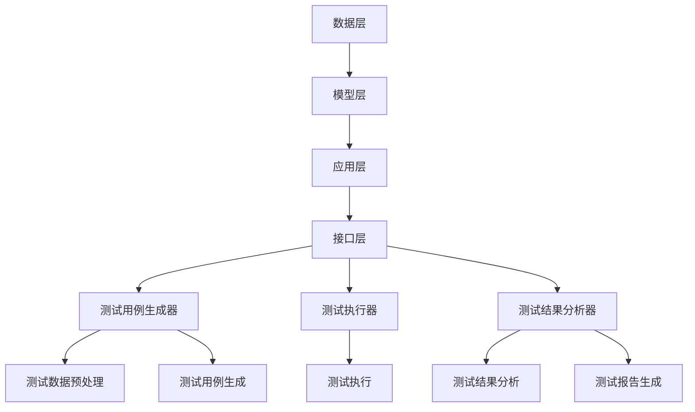

                 


# 《评测过程的自动化：LLM驱动的端到端测试流程》

## 关键词

- 评测过程自动化
- 语言模型（LLM）
- 端到端测试流程
- 数据准备与预处理
- 测试用例生成与优化
- 测试执行与结果分析
- 案例研究

### 摘要

本文旨在探讨评测过程自动化的关键技术，特别是基于语言模型（LLM）驱动的端到端测试流程。首先，我们将介绍评测过程自动化的背景和意义，以及LLM的基本概念和优势。接着，我们将详细阐述LLM驱动的端到端测试流程，包括数据准备与预处理、测试用例生成与优化、测试执行与结果分析等关键环节。通过案例分析，我们将展示这一技术在实际应用中的效果。最后，本文将总结评测过程自动化的价值，并展望其未来发展趋势。

## Step 1: 开篇介绍，定义评测过程的自动化和LLM在其中的作用

### 引言

在当今快速发展的信息技术时代，软件系统的复杂度和规模都在不断增加，随之而来的测试过程也变得越来越繁琐。传统的手动测试方式不仅效率低下，而且容易出现漏测和误测的情况。为了提高软件测试的效率和准确性，评测过程的自动化成为了一个重要的研究方向。本文将探讨评测过程自动化的关键技术，特别是基于语言模型（LLM）驱动的端到端测试流程。

### 评测过程自动化的定义

评测过程自动化，是指利用自动化工具和方法对软件系统进行测试，以代替或辅助人工测试的过程。它旨在提高测试的效率、减少测试成本、提高测试的覆盖率和准确性。评测过程自动化主要包括以下几个方面：

1. **测试用例的自动化生成**：通过自动化工具或算法，根据系统需求和设计文档自动生成测试用例，从而避免人工编写测试用例的繁琐过程。

2. **测试执行的自动化**：利用自动化测试工具执行测试用例，并记录测试结果，以减少人工执行测试的劳动强度。

3. **测试结果的自动化分析**：通过自动化工具对测试结果进行分析，生成测试报告，以便快速识别和定位问题。

4. **缺陷管理**：自动化测试工具可以自动记录和跟踪缺陷，并与开发团队的缺陷管理系统集成，以提高缺陷管理的效果。

### LLM在评测过程自动化中的作用

语言模型（LLM）是一种基于深度学习的技术，它能够从大量数据中学习并生成人类语言。LLM在评测过程自动化中的应用主要体现在以下几个方面：

1. **测试用例的生成**：LLM可以根据系统需求和设计文档，自动生成符合预期的测试用例，从而提高测试的覆盖率和准确性。

2. **测试数据的预处理**：LLM可以自动处理和清洗测试数据，包括数据清洗、数据归一化和数据增强等，以提高测试数据的可用性。

3. **测试脚本和测试工具的生成**：LLM可以根据测试用例的要求，自动生成相应的测试脚本和自动化测试工具，从而实现测试过程的自动化。

4. **测试结果的分析**：LLM可以自动分析测试结果，识别测试失败的原因，并提供相应的解决方案。

综上所述，评测过程自动化是提高软件测试效率和准确性的重要手段，而LLM作为一种先进的技术手段，在评测过程自动化中具有广泛的应用前景。在接下来的章节中，我们将进一步探讨LLM在评测过程自动化中的应用和实践。

### 本章小结

在本章中，我们介绍了评测过程自动化的定义和重要性，以及LLM的基本概念和在评测过程自动化中的作用。评测过程自动化通过提高测试效率、减少测试成本和提升测试覆盖率，已成为软件测试领域的重要研究方向。而LLM作为一种具有强大生成和推理能力的语言模型，在测试用例生成、测试数据预处理、测试脚本生成和测试结果分析等方面具有显著优势。接下来，我们将深入探讨LLM的基础知识，以及如何在评测过程自动化中应用这些知识。

## 第1章: 评测过程自动化概述

### 1.1 评测过程自动化的重要性

在软件开发生命周期中，测试是确保软件质量的关键环节。传统的测试方法主要依赖于人工执行，存在效率低下、成本高昂和易出错等问题。随着软件系统的复杂度不断增加，测试的工作量和难度也在持续上升。因此，评测过程自动化应运而生，成为提高软件测试效率和准确性的重要手段。

首先，评测过程自动化能够显著提高测试效率。通过自动化工具，测试人员可以快速生成测试用例、执行测试和生成测试报告，从而减少人工干预，降低测试周期。这对于快速迭代开发和敏捷开发模式尤为重要。

其次，自动化测试可以大幅降低测试成本。自动化测试工具和脚本可以重复使用，减少了重复劳动。同时，自动化测试可以节省大量人力成本，特别是在大规模测试场景下，自动化测试的优势更加明显。

此外，评测过程自动化还能提高测试的覆盖率和准确性。自动化测试工具可以按照预定的测试策略和标准执行测试，确保测试的全面性和一致性。同时，自动化测试可以精确记录测试结果，便于分析和追踪问题，提高测试的准确性。

总之，评测过程自动化在提高测试效率、降低测试成本、提升测试覆盖率和准确性方面具有重要意义。在接下来的内容中，我们将进一步探讨评测过程自动化的具体目标和面临的挑战。

### 1.1.1 评测过程的挑战

在当前的软件测试实践中，评测过程面临着诸多挑战，这些挑战在一定程度上限制了测试效率和质量的提升。

首先，测试用例的编写和执行效率低下是一个突出的问题。传统的人工测试方法要求测试人员手动编写测试用例，这不仅耗时耗力，而且容易出现遗漏和错误。此外，测试用例的执行通常也需要人工干预，无法实现24小时不间断的自动化执行，导致测试周期延长。

其次，测试覆盖率和准确性的不足也是一个关键挑战。在复杂软件系统中，测试用例的设计和执行需要覆盖广泛的输入和功能路径。然而，传统测试方法往往难以达到充分的覆盖，导致一些潜在的缺陷无法被发现。同时，由于测试人员的主观判断和经验差异，测试结果的准确性和一致性难以保证。

第三，测试数据的准备和处理也是一个复杂的过程。测试数据的质量直接影响测试的有效性，但在实际操作中，测试数据的获取、清洗、归一化和增强等步骤往往耗费大量时间和人力资源。特别是在涉及大数据和实时数据的测试场景中，数据准备和处理变得更加复杂和困难。

此外，自动化测试工具的局限性和集成难度也是当前评测过程面临的挑战之一。尽管自动化测试工具在一定程度上提高了测试效率，但许多工具的功能有限，难以应对复杂的测试需求。同时，自动化测试工具与现有开发和管理工具的集成也是一个难题，需要额外的开发和技术支持。

最后，测试团队的专业技能和知识水平也对评测过程的自动化带来了挑战。自动化测试需要测试人员具备编程、脚本编写和自动化工具配置等多方面的技能。然而，在实际操作中，许多测试人员可能缺乏这些技能，导致自动化测试的实施效果不理想。

综上所述，评测过程在效率、覆盖率、数据准备、工具集成和人员技能等方面面临着一系列挑战。解决这些问题需要借助先进的技术手段和方法，如基于语言模型（LLM）的自动化测试，以进一步提升评测过程的质量和效率。

### 1.1.2 自动化的优势

评测过程的自动化具有许多显著的优势，这些优势在很大程度上解决了传统测试方法中存在的诸多问题，并极大地提升了测试的效率和质量。

首先，自动化测试能够大幅提高测试效率。通过自动化工具和脚本，测试用例的生成、执行和结果分析都可以在短时间内完成，无需人工干预。这不仅减少了测试周期，还使得测试工作可以在24小时内不间断地进行，大大缩短了开发周期，提高了项目交付的效率。

其次，自动化测试在测试覆盖率和准确性方面具有明显优势。自动化测试工具可以按照预定的测试策略和标准执行测试，确保测试覆盖到系统的每一个功能和路径。此外，自动化测试工具能够精确记录和比对测试结果，减少了人为判断和经验误差，提高了测试的准确性和一致性。

第三，自动化测试可以显著降低测试成本。通过自动化工具，测试用例和测试脚本可以重复使用，减少了重复劳动。同时，自动化测试减少了人工测试所需的时间和人力资源，降低了测试的成本。特别是在大规模测试和回归测试场景中，自动化测试的优势更加显著。

此外，自动化测试在测试数据的处理和准备方面也表现出优势。自动化测试工具可以自动处理和清洗测试数据，包括数据清洗、数据归一化和数据增强等步骤，提高了测试数据的可用性和有效性。特别是在涉及大数据和实时数据的测试场景中，自动化测试工具能够高效地处理大量数据，保证测试的顺利进行。

最后，自动化测试有助于提升测试团队的专业技能。通过实施自动化测试，测试人员需要掌握编程、脚本编写和自动化工具配置等技能，从而提高自身的专业水平和综合素质。此外，自动化测试的实施和优化过程也为测试团队提供了学习和成长的平台，促进了团队整体技能的提升。

总之，评测过程的自动化在提高测试效率、提升测试覆盖率、降低测试成本、处理测试数据以及提升团队技能等方面具有显著优势。在接下来的内容中，我们将进一步探讨如何利用自动化技术实现评测过程的自动化，以及具体应用场景和实施方案。

### 1.2 什么是LLM

语言模型（Language Model，简称LLM）是一种广泛应用于自然语言处理（Natural Language Processing，简称NLP）的算法和技术。它旨在理解和生成自然语言文本，从而实现人机交互、文本分析、信息检索等功能。LLM的核心任务是通过学习大量语言数据，预测下一个单词或词组，从而构建出能够生成连贯、有意义的文本模型。

#### 1.2.1 LLM的定义

LLM是一种概率模型，它根据输入文本序列的概率分布来预测下一个词或句子。经典的LLM通常是基于统计方法，如N-gram模型，通过计算词频和词序列的概率来预测。然而，随着深度学习技术的发展，现代LLM更多地采用基于神经网络的模型，如循环神经网络（RNN）、长短期记忆网络（LSTM）和变换器（Transformer）等。

#### 1.2.2 LLM的组成部分

LLM主要包括以下几个组成部分：

1. **输入层**：接收自然语言文本作为输入，将其转换为模型可处理的格式。例如，文本可以被分成单词或子词，并转换为向量表示。

2. **隐藏层**：神经网络的核心部分，负责处理和转换输入数据。隐藏层中的神经元通过学习输入文本的特征，生成中间表示。

3. **输出层**：根据隐藏层生成的中间表示，预测下一个单词或词组。输出层的每个神经元对应一个可能的单词或词组。

4. **损失函数**：用于衡量模型预测与实际文本之间的差距，常用的损失函数包括交叉熵损失和平均平方误差等。

5. **优化器**：用于调整模型参数，以最小化损失函数。常见的优化器有梯度下降、Adam等。

#### 1.2.3 LLM的工作原理

LLM的工作原理可以概括为以下几个步骤：

1. **数据预处理**：将输入文本进行分词、去停用词、词向量化等处理，转换为模型可接受的格式。

2. **模型训练**：通过大量的语言数据，训练神经网络模型，使其能够学习语言的模式和规律。在训练过程中，模型会通过反向传播算法不断调整参数，以最小化损失函数。

3. **预测**：给定一个输入文本序列，模型根据训练好的参数，生成下一个词或词组的概率分布，并选择概率最高的词或词组作为输出。

4. **生成文本**：通过递归地重复上述预测过程，模型可以生成完整的文本序列。

#### 1.2.4 LLM的优势

LLM在自然语言处理领域具有以下几个显著优势：

1. **生成连贯文本**：LLM能够生成语义连贯、上下文匹配的文本，适用于文本生成、机器翻译、摘要生成等任务。

2. **适应性强**：LLM可以应用于各种NLP任务，如文本分类、命名实体识别、情感分析等，具有广泛的适用性。

3. **高效性**：现代LLM模型如Transformer，在处理大规模文本数据和复杂任务时表现出高效性，计算速度快、性能稳定。

4. **灵活性**：LLM可以结合其他技术，如 reinforcement learning 和 adversarial training，进一步提升其性能和应用范围。

#### 1.2.5 LLM的应用领域

LLM在自然语言处理领域有广泛的应用，包括但不限于以下几个领域：

1. **文本生成**：如文章撰写、故事创作、对话系统等。

2. **机器翻译**：如Google Translate、DeepL等，实现跨语言的信息传递。

3. **问答系统**：如基于知识图谱的问答系统，用于智能客服和知识服务。

4. **信息检索**：如搜索引擎，通过文本匹配和语义理解提供准确的信息检索服务。

5. **文本分类和标注**：如新闻分类、情感分析、垃圾邮件过滤等。

总之，LLM作为一种强大的自然语言处理工具，在多个领域展现出了其独特的优势和应用潜力。在接下来的章节中，我们将进一步探讨如何将LLM应用于评测过程自动化，特别是端到端测试流程。

### 1.3 LLM在评测过程自动化中的应用

#### 1.3.1 LLM的优势

语言模型（LLM）在评测过程自动化中具有显著的优势，这些优势使得LLM能够有效提高测试效率和准确性。

首先，LLM能够实现自动化测试用例的生成。通过学习大量的测试数据，LLM可以预测和生成新的测试用例，从而覆盖更多的测试场景和路径，提高测试的覆盖率。这种自动化的测试用例生成方式不仅节省了测试人员的时间和精力，还减少了人为编写的测试用例可能存在的遗漏和错误。

其次，LLM在测试数据预处理方面具有优势。测试数据通常需要清洗、归一化和增强等处理，以使其适合用于测试。LLM可以通过学习大量的数据，自动识别和处理异常值、噪声数据和缺失数据，从而提高测试数据的可用性和质量。

此外，LLM在生成测试脚本和自动化测试工具方面具有显著的优势。LLM可以根据测试用例的要求，自动生成相应的测试脚本和自动化测试工具，从而实现测试过程的自动化。这种方法不仅减少了手动编写测试脚本的工作量，还提高了测试的执行效率和一致性。

最后，LLM在测试结果分析方面表现出色。通过学习大量的测试结果数据，LLM可以自动分析和识别测试失败的原因，并提供相应的解决方案。这种自动化的测试结果分析方式不仅提高了测试的准确性，还减少了测试人员的工作负担。

#### 1.3.2 LLM在评测过程中的应用场景

LLM在评测过程中的应用场景非常广泛，以下是一些典型的应用场景：

1. **自动化测试用例生成**：在软件开发生命周期中，测试用例的生成是一个关键环节。传统的方法需要测试人员手动编写测试用例，而LLM可以通过学习大量的历史测试数据，自动生成新的测试用例，提高测试的覆盖率和准确性。

2. **测试数据预处理**：测试数据的质量直接影响测试的有效性。LLM可以自动处理测试数据，包括数据清洗、归一化和增强等操作，从而提高测试数据的可用性。这种方法可以显著减少测试人员处理数据的工作量。

3. **自动化测试脚本生成**：测试脚本是自动化测试的核心组成部分。通过学习测试用例和系统需求，LLM可以自动生成相应的测试脚本，实现测试的自动化。这种方法不仅提高了测试的执行效率，还减少了手动编写测试脚本的工作量。

4. **测试结果分析**：测试结果的分析是评估测试效果和识别问题的重要环节。LLM可以通过学习大量的测试结果数据，自动分析和识别测试失败的原因，并提供相应的解决方案。这种方法可以提高测试的准确性，减少测试人员的工作负担。

5. **智能缺陷管理**：在测试过程中，缺陷管理是一个复杂且耗时的任务。LLM可以自动记录和分类缺陷，并提供缺陷分析和解决方案，从而提高缺陷管理的效率。

总之，LLM在评测过程中的应用场景丰富，通过自动化测试用例生成、测试数据预处理、测试脚本生成、测试结果分析和智能缺陷管理，显著提高了测试效率和准确性，为软件质量保障提供了有力支持。

### 1.4 本书结构安排

#### 1.4.1 各章节内容概览

本书分为七个部分，详细探讨了评测过程自动化的各个方面，包括LLM的基础、LLM驱动的端到端测试流程、数据准备与预处理、测试用例生成与优化、测试执行与结果分析、案例研究以及总结和展望。

- **第一部分：引言与概述**：介绍了评测过程自动化的背景和意义，以及LLM在其中的作用。
- **第二部分：LLM基础**：讲解了LLM的基本概念、发展历程和应用领域。
- **第三部分：LLM驱动的评测过程自动化**：阐述了LLM驱动的端到端测试流程，包括数据准备、测试用例生成、测试执行和结果分析。
- **第四部分：数据准备与预处理**：详细介绍了数据准备的重要性、数据预处理方法和工具。
- **第五部分：测试用例生成与优化**：讨论了如何利用LLM生成和优化测试用例。
- **第六部分：测试执行与结果分析**：阐述了如何执行测试以及分析测试结果。
- **第七部分：案例研究**：通过具体案例展示了评测过程自动化的实际应用。

#### 1.4.2 学习目标与读者对象

本书的目的是帮助读者深入理解评测过程自动化的关键技术，特别是基于LLM的端到端测试流程。通过阅读本书，读者可以：

- 掌握LLM的基本概念和原理。
- 了解如何利用LLM实现评测过程自动化。
- 学会数据准备与预处理的方法和技巧。
- 掌握测试用例生成与优化的策略。
- 理解测试执行与结果分析的过程。

本书适合从事软件测试、自动化测试、人工智能和自然语言处理等相关领域的工程师、开发人员和研究人员阅读。同时，本书也适合作为高等院校相关专业的教材或参考书。

#### 1.5 本章小结

本章介绍了评测过程自动化的背景、意义和挑战，以及LLM的基本概念和优势。评测过程自动化通过提高测试效率、降低成本和提升覆盖率，成为软件测试的重要手段。LLM作为一种强大的自然语言处理工具，在自动化测试用例生成、测试数据预处理、测试脚本生成和测试结果分析等方面具有显著优势。在接下来的章节中，我们将深入探讨LLM的具体应用和实践，为评测过程自动化提供更为详细和实用的指导。

## 第2章: 语言模型基础

### 2.1 语言模型的概述

语言模型是自然语言处理（NLP）领域中的一个核心概念，它用于理解和生成自然语言。语言模型的主要目标是预测下一个词或句子，从而生成连贯、有意义的文本。语言模型在许多NLP任务中都有广泛应用，如机器翻译、文本生成、问答系统和信息检索等。

#### 2.1.1 语言模型的定义

语言模型（Language Model）是一种概率模型，它通过学习大量文本数据，估计一个词或短语序列的概率分布。经典的语言模型主要包括基于频率的方法和基于统计的方法。基于频率的方法简单直接，通过统计词频和词序列的频率来计算概率。而基于统计的方法则利用概率论和数理统计的原理，通过训练模型来预测词的概率分布。

现代语言模型则主要采用基于神经网络的深度学习方法。例如，循环神经网络（RNN）和长短期记忆网络（LSTM）能够通过学习序列数据中的时间依赖关系，生成更准确的概率分布。近年来，Transformer模型的提出和广泛应用，使得语言模型的性能得到了显著提升。

#### 2.1.2 语言模型的分类

语言模型可以根据其训练方法和应用目标进行分类：

1. **基于频率的方法**：这种方法简单直接，通过统计词频和词序列的频率来计算概率。例如，N-gram模型就是一种基于频率的方法，它通过统计前N个词的频率来预测下一个词。

2. **基于统计的方法**：这种方法利用概率论和数理统计的原理，通过训练模型来预测词的概率分布。这种方法的代表性模型是隐马尔可夫模型（HMM）和条件随机场（CRF）。

3. **基于神经网络的方法**：这种方法利用深度学习技术，通过学习大量的语言数据，生成复杂的概率分布。这种方法的代表性模型包括循环神经网络（RNN）、长短期记忆网络（LSTM）和变换器（Transformer）。

#### 2.1.3 语言模型的应用

语言模型在自然语言处理领域有广泛的应用：

1. **机器翻译**：语言模型可以用于将一种语言的文本翻译成另一种语言。常见的机器翻译模型如谷歌翻译、DeepL等，都是基于语言模型的技术。

2. **文本生成**：语言模型可以生成连贯、有意义的文本，如文章撰写、故事创作、对话系统等。常见的文本生成模型如GPT（Generative Pre-trained Transformer）系列。

3. **问答系统**：语言模型可以用于构建问答系统，如基于知识图谱的问答系统，用于智能客服和知识服务。

4. **信息检索**：语言模型可以用于信息检索，如搜索引擎，通过文本匹配和语义理解提供准确的信息检索服务。

5. **文本分类和标注**：语言模型可以用于文本分类和标注，如新闻分类、情感分析、垃圾邮件过滤等。

总之，语言模型在自然语言处理领域具有广泛的应用，通过学习大量的语言数据，生成复杂的概率分布，从而实现文本的生成、翻译、分类和标注等功能。

### 2.2 语言模型的训练方法

语言模型的训练是自然语言处理的核心步骤，通过训练，模型能够学习到语言的特征和规律，从而生成准确的概率分布。现代语言模型的训练方法主要包括基于频率的方法和基于神经网络的方法。以下将对这些方法进行详细讨论。

#### 2.2.1 基于频率的方法

基于频率的方法是最早的语言模型训练方法之一，它通过统计文本中词或词组的频率来生成概率分布。这种方法简单直接，计算成本低，但存在一些局限性。

1. **N-gram模型**：N-gram模型是最常见的基于频率的方法，它将文本分成N个单词的序列，然后计算每个词组出现的频率。通过这些频率，模型可以预测下一个词。N-gram模型的公式为：

   \[ P(w_{t} | w_{t-1}, w_{t-2}, ..., w_{t-N}) = \frac{f(w_{t-1}, w_{t-2}, ..., w_{t-N})}{f(w_{t-1}, w_{t-2}, ..., w_{t-N-1})} \]

   其中，\( w_{t} \) 是当前词，\( w_{t-1}, w_{t-2}, ..., w_{t-N} \) 是前N个词，\( f() \) 表示词组的频率。

   优点：计算简单，实现容易。
   缺点：无法捕捉长距离依赖关系，容易过拟合。

2. **Kneser-Ney修正**：为了克服N-gram模型的局限性，Kneser-Ney修正提出了一种改进方法。它通过利用高频词组中低频词组的相对频率来修正概率分布，从而提高模型的准确性。

   优点：提高了长距离依赖的捕捉能力。
   缺点：计算复杂度增加。

基于频率的方法虽然简单，但在处理复杂语言现象时效果有限。因此，现代语言模型主要采用基于神经网络的方法。

#### 2.2.2 基于统计的方法

基于统计的方法利用概率论和数理统计的原理，通过训练模型来预测词的概率分布。这种方法主要包括隐马尔可夫模型（HMM）和条件随机场（CRF）。

1. **隐马尔可夫模型（HMM）**：HMM是一种统计模型，它通过状态序列来描述文本的生成过程。HMM包含两个基本过程：状态转移概率和观测概率。通过学习这些概率分布，HMM可以预测下一个词。

   优点：能够捕捉状态转移关系，适用于序列模型。
   缺点：难以处理长距离依赖，性能有限。

2. **条件随机场（CRF）**：CRF是一种基于概率图模型的方法，它通过定义一系列条件概率分布来预测词序列。CRF能够考虑上下文信息，捕捉词之间的依赖关系，从而提高模型的准确性。

   优点：能够考虑上下文信息，捕捉依赖关系。
   缺点：计算复杂度较高，难以扩展。

基于统计的方法在一定程度上提高了语言模型的性能，但仍然存在一些局限性。随着深度学习技术的发展，基于神经网络的方法逐渐成为主流。

#### 2.2.3 基于神经网络的方法

基于神经网络的方法利用深度学习技术，通过学习大量的语言数据，生成复杂的概率分布。这种方法主要包括循环神经网络（RNN）、长短期记忆网络（LSTM）和变换器（Transformer）。

1. **循环神经网络（RNN）**：RNN是一种能够处理序列数据的神经网络，它通过递归结构来捕捉数据中的时间依赖关系。RNN的核心思想是利用隐藏状态来记忆先前的信息，从而预测下一个词。

   优点：能够捕捉长距离依赖关系。
   缺点：梯度消失和梯度爆炸问题，难以训练深层次的模型。

2. **长短期记忆网络（LSTM）**：LSTM是RNN的一种改进模型，它通过引入门控机制来解决梯度消失和梯度爆炸问题。LSTM能够更好地捕捉长距离依赖关系，从而提高模型的准确性。

   优点：解决了梯度消失和梯度爆炸问题，适用于长序列数据。
   缺点：计算复杂度高，参数较多。

3. **变换器（Transformer）**：Transformer是近年来提出的一种新型神经网络结构，它通过自注意力机制来处理序列数据。Transformer在许多NLP任务中取得了显著的成果，尤其在长文本处理和跨语言翻译方面。

   优点：自注意力机制，能够捕捉长距离依赖关系。
   缺点：训练时间较长，计算资源需求高。

基于神经网络的方法在处理复杂语言现象时表现出了强大的能力，特别是变换器（Transformer）的出现，进一步推动了语言模型的发展。随着技术的进步，未来还有可能出现更加高效和强大的语言模型。

总之，语言模型的训练方法从基于频率的方法、基于统计的方法到基于神经网络的方法，每种方法都有其独特的优势和局限性。在实际应用中，可以根据任务需求和数据特点选择合适的训练方法，以实现最佳性能。

### 2.3 语言模型的评价指标

在评估语言模型性能时，评价指标起到了关键作用。这些评价指标不仅帮助我们了解模型在训练数据上的表现，还能指导我们调整和优化模型。以下是一些常见的语言模型评价指标：

#### 2.3.1 损失函数

损失函数是评估语言模型性能的核心工具，它衡量了模型预测和实际输出之间的差距。常见的损失函数包括交叉熵损失（Cross-Entropy Loss）和平均平方误差（Mean Squared Error，MSE）。

1. **交叉熵损失（Cross-Entropy Loss）**：

   交叉熵损失是分类问题中最常用的损失函数，它衡量了模型预测概率分布与实际分布之间的差异。对于二分类问题，交叉熵损失的公式为：

   \[ Loss = -\sum_{i} y_{i} \log(p_{i}) \]

   其中，\( y_{i} \) 是实际标签，\( p_{i} \) 是模型预测的概率。

   优点：易于计算，适用于分类问题。
   缺点：对极端概率值敏感。

2. **平均平方误差（Mean Squared Error，MSE）**：

   平均平方误差常用于回归问题，它衡量了模型预测值与实际值之间的差距。MSE的公式为：

   \[ Loss = \frac{1}{n} \sum_{i=1}^{n} (y_{i} - \hat{y}_{i})^2 \]

   其中，\( y_{i} \) 是实际值，\( \hat{y}_{i} \) 是模型预测值，\( n \) 是样本数量。

   优点：对异常值较为稳健。
   缺点：对极小值敏感。

#### 2.3.2 评估指标

评估语言模型性能的指标有很多，以下是一些常用的评估指标：

1. **准确率（Accuracy）**：

   准确率是分类问题中最常用的评估指标，它表示模型正确分类的样本占总样本的比例。公式为：

   \[ Accuracy = \frac{TP + TN}{TP + TN + FP + FN} \]

   其中，\( TP \) 是真实为正类且被预测为正类的样本数量，\( TN \) 是真实为负类且被预测为负类的样本数量，\( FP \) 是真实为负类但被预测为正类的样本数量，\( FN \) 是真实为正类但被预测为负类的样本数量。

   优点：直观易懂。
   缺点：对于类别不平衡的数据集效果不佳。

2. **精确率（Precision）**：

   精确率表示模型预测为正类且实际为正类的样本数量占预测为正类样本总数的比例。公式为：

   \[ Precision = \frac{TP}{TP + FP} \]

   优点：关注预测为正类的样本。
   缺点：对假阳性较为敏感。

3. **召回率（Recall）**：

   召回率表示模型预测为正类且实际为正类的样本数量占实际为正类样本总数的比例。公式为：

   \[ Recall = \frac{TP}{TP + FN} \]

   优点：关注实际为正类的样本。
   缺点：对假阴性较为敏感。

4. **F1值（F1 Score）**：

   F1值是精确率和召回率的调和平均，综合考虑了模型的精确率和召回率。公式为：

   \[ F1 Score = 2 \times \frac{Precision \times Recall}{Precision + Recall} \]

   优点：平衡精确率和召回率。
   缺点：对于极端不平衡的数据集效果不佳。

5. **ROC曲线和AUC值（Receiver Operating Characteristic Curve and Area Under Curve）**：

   ROC曲线展示了模型在不同阈值下的准确率与召回率的关系，而AUC值是ROC曲线下的面积。AUC值越大，表示模型的性能越好。

   优点：适用于二分类和多分类问题。
   缺点：对阈值敏感。

#### 2.3.3 评估方法

评估语言模型的方法主要包括以下几种：

1. **交叉验证（Cross Validation）**：

   交叉验证是一种常用的评估方法，它通过将数据集分成多个子集，每次使用其中一个子集作为验证集，其余子集作为训练集，从而评估模型在不同数据子集上的表现。常见的交叉验证方法有K折交叉验证和留一交叉验证。

   优点：能够减少模型过拟合的风险。
   缺点：计算量大。

2. **准确率（Accuracy）**：

   准确率是评估模型性能的常用指标，表示模型正确分类的样本占总样本的比例。

   优点：直观易懂。
   缺点：对于类别不平衡的数据集效果不佳。

3. **混淆矩阵（Confusion Matrix）**：

   混淆矩阵是评估分类模型性能的重要工具，它展示了模型在各个类别上的预测结果。通过混淆矩阵，可以计算模型的精确率、召回率和F1值等指标。

   优点：提供了详细的分类结果。
   缺点：难以处理多分类问题。

4. **ROC曲线和AUC值（ROC Curve and Area Under Curve）**：

   ROC曲线展示了模型在不同阈值下的准确率与召回率的关系，而AUC值是ROC曲线下的面积。AUC值越大，表示模型的性能越好。

   优点：适用于二分类和多分类问题。
   缺点：对阈值敏感。

总之，语言模型的评价指标和方法对于评估和优化模型性能至关重要。在实际应用中，可以根据任务需求和数据特点选择合适的评价指标和方法，以实现最佳性能。

### 2.4 LLM的发展历程

语言模型（LLM）的发展历程反映了自然语言处理（NLP）领域的技术进步和应用拓展。从早期的基于频率的模型到现代的基于神经网络的模型，LLM经历了多个阶段的发展和演变。

#### 2.4.1 从统计模型到神经网络

1. **基于频率的方法**：

   语言模型的起源可以追溯到基于频率的方法，如N-gram模型。1940年代末，贝尔实验室的研究人员首次提出了N-gram模型，通过统计文本中的词频和词组频率来预测下一个词。N-gram模型简单直接，计算成本低，适用于短文本生成和文本分类任务。然而，N-gram模型存在明显的局限性，如无法捕捉长距离依赖关系和上下文信息。

2. **基于统计的方法**：

   随着语言数据的积累和计算能力的提升，语言模型开始采用基于统计的方法，如隐马尔可夫模型（HMM）和条件随机场（CRF）。HMM通过状态转移概率和观测概率来描述文本生成过程，能够捕捉状态转移关系。CRF通过定义一系列条件概率分布来预测词序列，能够考虑上下文信息。这些模型在一定程度上提高了语言模型的性能，但仍然面临长距离依赖和复杂上下文处理的问题。

3. **循环神经网络（RNN）**：

   1990年代初，循环神经网络（RNN）的出现为语言模型的发展带来了新的机遇。RNN通过递归结构来处理序列数据，能够捕捉长距离依赖关系。长短期记忆网络（LSTM）是RNN的一种改进模型，通过引入门控机制解决了梯度消失和梯度爆炸问题。LSTM在许多NLP任务中取得了显著的成果，如机器翻译、语音识别和文本生成。

#### 2.4.2 从单语言模型到多语言模型

1. **多语言模型的发展**：

   随着互联网和全球化的发展，多语言处理需求日益增加。传统的单语言模型在处理多语言任务时存在性能瓶颈。为了解决这一问题，研究者开始探索多语言模型。早期的多语言模型主要采用翻译模型和融合模型的方法，通过将源语言文本翻译成目标语言，然后利用目标语言模型进行生成。这种方法虽然在一定程度上提高了多语言处理的性能，但仍然面临翻译质量和模型训练效率的问题。

2. **跨语言迁移学习**：

   跨语言迁移学习（Cross-Lingual Transfer Learning）是一种新兴的多语言模型方法，通过利用跨语言数据来提升模型的性能。该方法的核心思想是利用一种语言的模型来提升其他语言模型的性能。研究者提出了多种跨语言迁移学习方法，如共享参数、自适应转换和一致性正则化等。这些方法在多个NLP任务中取得了显著的效果，如跨语言文本分类、机器翻译和问答系统。

3. **多语言模型的应用**：

   多语言模型在多语言环境中展现出强大的应用潜力。例如，谷歌翻译和微软翻译等翻译工具采用了基于神经网络的翻译模型，显著提高了翻译质量和速度。此外，多语言模型还在跨语言情感分析、多语言文本摘要和信息检索等领域取得了广泛应用。

#### 2.4.3 从静态模型到动态模型

1. **静态模型**：

   早期的语言模型主要是静态模型，它们在训练过程中固定模型参数，无法根据新的数据动态调整。这种方法在一定程度上限制了语言模型的灵活性和适应性。

2. **动态模型**：

   为了提高语言模型的适应性和灵活性，研究者开始探索动态模型。动态模型通过在训练过程中不断更新和调整模型参数，从而更好地适应新的数据。近年来，动态学习率（Dynamic Learning Rate）和自适应正则化（Adaptive Regularization）等方法在动态模型中得到了广泛应用。这些方法能够根据数据的变化自动调整模型参数，从而提高模型的性能和鲁棒性。

3. **应用动态模型**：

   动态模型在多个NLP任务中展现了其优势。例如，动态学习率方法在机器翻译和文本生成任务中得到了广泛应用，显著提高了模型的生成质量和稳定性。自适应正则化方法在文本分类和情感分析任务中表现出色，能够更好地处理数据噪声和过拟合问题。

总之，LLM的发展历程从基于频率的模型到现代的基于神经网络的模型，从单语言模型到多语言模型，再到从静态模型到动态模型，反映了NLP领域的不断进步和多样化应用。随着技术的不断创新和应用场景的拓展，LLM在自然语言处理领域将继续发挥重要作用。

### 2.5 本章小结

在本章中，我们深入探讨了语言模型（LLM）的基本概念、分类、训练方法以及评价指标。语言模型是自然语言处理领域的重要工具，它通过学习语言数据，能够预测下一个词或句子，生成连贯、有意义的文本。从基于频率的N-gram模型到现代的基于神经网络的Transformer模型，语言模型的发展历程反映了技术的不断进步和应用范围的拓展。在接下来的章节中，我们将进一步探讨LLM在评测过程自动化中的应用，包括端到端测试流程的具体实现和案例分析。

## 第3章: LLM驱动的端到端测试流程概述

### 3.1 端到端测试流程的背景

在软件测试领域，端到端测试（End-to-End Testing）是一种新兴的测试方法，旨在通过对整个软件系统进行全方位的测试，确保系统在真实环境下的正常运行。传统的测试方法通常只关注系统的部分组件或功能，而端到端测试则要求测试覆盖整个系统，从输入到输出，确保每个环节都能够正常运行。

#### 3.1.1 传统测试流程的局限性

传统的测试流程通常包括单元测试、集成测试、系统测试和验收测试等多个阶段。然而，这种方法存在以下局限性：

1. **测试覆盖不足**：传统测试方法主要关注系统的一部分组件或功能，容易忽略整体系统的兼容性和性能问题。特别是在复杂系统中，部分组件之间的交互可能存在潜在的问题，而这些问题在单一组件测试中往往难以发现。

2. **测试效率低下**：传统测试方法需要手动编写测试用例，执行测试，并分析测试结果，导致测试周期长、效率低。特别是在回归测试中，每次修改代码都需要重新执行所有测试用例，增加了测试的工作量。

3. **测试结果不准确**：由于测试人员的主观判断和经验差异，传统测试方法容易导致测试结果的不准确和一致性差。此外，手工测试容易受到环境变化的影响，导致测试结果的不可重复性。

4. **测试数据不足**：传统测试方法通常依赖于有限的测试数据，难以覆盖所有可能的输入和输出情况。特别是在大数据和实时数据处理场景中，测试数据量巨大，传统测试方法难以有效处理。

#### 3.1.2 端到端测试的优势

端到端测试通过全面测试整个系统，解决了传统测试流程的局限性，具有以下优势：

1. **全面测试**：端到端测试覆盖了系统的所有组件和功能，确保每个环节都能够正常运行，提高了系统的整体质量。

2. **高效执行**：端到端测试通过自动化工具和脚本，可以高效地执行测试，减少了人工干预，提高了测试效率。

3. **测试结果准确**：端到端测试工具能够精确记录和比对测试结果，减少了人为判断和经验误差，提高了测试的准确性和一致性。

4. **测试数据丰富**：端到端测试可以充分利用大规模数据，覆盖更多的输入和输出情况，提高了测试的覆盖率和鲁棒性。

5. **测试周期缩短**：端到端测试通过自动化和高效的测试执行，显著缩短了测试周期，提高了项目的交付效率。

#### 3.1.3 端到端测试的基本概念

端到端测试（End-to-End Testing）是一种全面的系统测试方法，旨在通过模拟实际运行环境，对整个软件系统进行全方位的测试。端到端测试的基本概念包括：

1. **测试覆盖**：端到端测试要求覆盖系统的所有组件和功能，确保每个环节都能够正常运行。

2. **测试自动化**：端到端测试通过自动化工具和脚本，实现测试的自动化执行，减少人工干预。

3. **测试执行**：端到端测试通过模拟实际操作，执行各种测试用例，验证系统的功能和行为。

4. **测试结果分析**：端到端测试通过自动化工具，对测试结果进行分析，生成详细的测试报告，识别和定位问题。

5. **测试环境**：端到端测试要求在真实的运行环境中进行，包括硬件、操作系统、网络环境等。

总之，端到端测试通过全面测试整个系统，提高了测试效率和准确性，解决了传统测试流程的局限性。在接下来的章节中，我们将进一步探讨如何利用LLM实现端到端测试流程的自动化。

### 3.2 LLM在测试流程中的应用

语言模型（LLM）在测试流程中具有广泛的应用，特别是在自动化测试用例生成、测试数据预处理、测试脚本生成和测试结果分析等方面。以下将详细讨论LLM在这些方面的优势和应用。

#### 3.2.1 LLM的优势

LLM在测试流程中的应用具有以下几个显著优势：

1. **自动化测试用例生成**：LLM可以基于系统需求和设计文档，自动生成新的测试用例。通过学习大量的测试数据，LLM能够理解系统的功能和行为，生成覆盖全面的测试用例。这种方法不仅节省了测试人员的时间和精力，还提高了测试的覆盖率和准确性。

2. **测试数据预处理**：测试数据的质量直接影响测试结果的有效性。LLM可以自动处理和清洗测试数据，包括数据清洗、数据归一化和数据增强等。LLM能够识别和处理异常值、噪声数据和缺失数据，从而提高测试数据的可用性和质量。

3. **测试脚本生成**：LLM可以根据测试用例的要求，自动生成相应的测试脚本和自动化测试工具。这种方法不仅减少了手动编写测试脚本的工作量，还提高了测试的执行效率和一致性。

4. **测试结果分析**：LLM可以自动分析测试结果，识别测试失败的原因，并提供相应的解决方案。通过学习大量的测试结果数据，LLM能够发现潜在的问题，提供优化建议，从而提高测试的准确性和可靠性。

5. **自适应测试**：LLM可以根据测试过程中出现的问题和反馈，动态调整测试策略和用例，实现自适应测试。这种方法能够更好地适应不断变化的测试需求，提高测试的灵活性。

#### 3.2.2 LLM在测试过程中的具体应用

1. **测试用例生成**：

   LLM可以自动生成测试用例，通过以下步骤实现：

   a. **输入处理**：将系统需求和设计文档转化为LLM可处理的格式，如文本或代码。

   b. **测试用例生成**：利用LLM的生成能力，根据输入数据和预定的测试策略，生成新的测试用例。这些测试用例可以覆盖系统的各种功能和路径。

   c. **测试用例评估**：对生成的测试用例进行评估，确保其合理性和完整性。

2. **测试数据预处理**：

   LLM在测试数据预处理中的应用包括：

   a. **数据清洗**：识别和处理异常值、噪声数据和缺失数据，提高测试数据的可用性。

   b. **数据归一化**：将不同来源的数据转换为统一的格式，确保数据的一致性和可比性。

   c. **数据增强**：通过生成新的数据样本，扩展测试数据集，提高测试的鲁棒性和覆盖范围。

3. **测试脚本生成**：

   LLM可以自动生成测试脚本，实现以下步骤：

   a. **测试用例解析**：解析生成的测试用例，提取关键信息，如测试目标、输入数据和预期结果。

   b. **脚本生成**：利用LLM的编程能力，根据测试用例生成相应的测试脚本。

   c. **脚本优化**：对生成的脚本进行优化，确保其执行效率和可靠性。

4. **测试结果分析**：

   LLM可以自动分析测试结果，包括：

   a. **结果记录**：记录测试执行过程中的关键信息，如输入、输出和状态。

   b. **结果分析**：利用LLM的推理能力，分析测试结果的合理性，识别潜在的问题。

   c. **报告生成**：根据分析结果，生成详细的测试报告，提供优化建议。

#### 3.2.3 LLM在测试流程中的集成方式

LLM在测试流程中的集成方式可以分为以下几个方面：

1. **测试工具集成**：将LLM集成到现有的自动化测试工具中，如Selenium、Jenkins等。通过API调用或插件形式，实现LLM的功能扩展。

2. **测试脚本集成**：将LLM生成的测试脚本与现有测试脚本集成，实现测试流程的自动化。例如，在测试脚本中调用LLM生成的测试用例。

3. **测试平台集成**：将LLM集成到测试管理平台中，如QTest、TestRail等。通过数据接口或插件，实现LLM与测试平台的无缝集成。

4. **测试数据集成**：将LLM处理和优化的测试数据与现有测试数据集成，提高测试数据的可用性和质量。

通过以上方式，LLM可以有效地融入测试流程，提高测试的效率和准确性。在接下来的章节中，我们将进一步探讨LLM在测试流程中的应用细节和实现方法。

### 3.3 LLM驱动的测试流程架构

LLM驱动的测试流程架构是一个综合性的体系，它通过LLM在各个阶段的智能处理，实现了从数据准备到测试用例生成、测试执行和结果分析的全面自动化。以下是对LLM驱动的测试流程架构的详细解析。

#### 3.3.1 数据准备与预处理

数据准备与预处理是LLM驱动的测试流程的基础环节。在这一阶段，LLM的作用主要体现在以下几个方面：

1. **数据清洗**：LLM可以通过学习大量的数据，自动识别和纠正数据中的异常值、噪声数据和缺失数据。例如，对于缺失数据的处理，LLM可以利用统计方法或机器学习方法，填补缺失值或生成合理的替代值。

2. **数据归一化**：不同的数据源可能使用不同的单位和格式，LLM可以帮助将不同数据源的数据转换为统一的格式，从而确保数据的一致性和可比性。

3. **数据增强**：为了提高测试数据的覆盖率和鲁棒性，LLM可以通过数据增强技术，生成新的数据样本。例如，通过图像翻转、旋转或添加噪声，可以增强图像数据的多样性。

具体实现方面，数据准备与预处理可以按照以下步骤进行：

a. **数据收集**：从不同的数据源收集原始数据，包括系统日志、用户行为数据、测试数据等。

b. **数据清洗**：使用LLM清洗数据，识别和纠正异常值、噪声数据和缺失数据。

c. **数据归一化**：使用LLM将不同数据源的数据转换为统一的格式，例如，将不同时间格式的数据统一为YYYY-MM-DD格式。

d. **数据增强**：使用LLM生成新的数据样本，增加测试数据的多样性。

#### 3.3.2 测试用例生成

测试用例生成是测试流程的关键环节，LLM在这一阶段的作用主要体现在以下几个方面：

1. **自动生成**：LLM可以通过学习系统需求和设计文档，自动生成新的测试用例。例如，LLM可以生成模拟用户行为的测试用例，或生成验证系统功能的测试用例。

2. **优化测试用例**：LLM可以评估已生成的测试用例，识别冗余和不足的用例，并进行优化。例如，LLM可以通过分析测试用例的执行结果，优化测试用例的执行顺序或条件。

具体实现方面，测试用例生成可以按照以下步骤进行：

a. **需求理解**：LLM解析系统需求和设计文档，理解系统的功能和行为。

b. **用例生成**：利用LLM的生成能力，根据需求理解生成新的测试用例。例如，LLM可以生成基于用户行为的测试用例，或生成基于功能需求的测试用例。

c. **用例评估**：使用LLM评估生成的测试用例，确保其合理性和完整性。

d. **用例优化**：利用LLM优化测试用例，提高测试的覆盖率和准确性。

#### 3.3.3 测试执行与结果分析

测试执行与结果分析是测试流程的最终环节，LLM在这一阶段的作用主要体现在以下几个方面：

1. **自动化执行**：LLM可以自动化执行测试用例，减少人工干预。例如，LLM可以自动化执行基于Web的测试用例，或自动化执行基于API的测试用例。

2. **结果分析**：LLM可以自动分析测试结果，识别测试失败的原因，并提供相应的解决方案。例如，LLM可以通过分析日志文件，定位系统故障的原因。

具体实现方面，测试执行与结果分析可以按照以下步骤进行：

a. **测试执行**：使用LLM自动化执行测试用例，记录测试结果。

b. **结果记录**：使用LLM记录测试执行过程中的关键信息，例如，测试的输入、输出和状态。

c. **结果分析**：使用LLM分析测试结果，识别测试失败的原因。

d. **报告生成**：使用LLM生成详细的测试报告，包括测试结果、问题分析和优化建议。

#### 3.3.4 架构设计

LLM驱动的测试流程架构可以分为以下几个主要组成部分：

1. **数据层**：包括数据源和数据存储，用于存储原始数据和处理后的数据。

2. **模型层**：包括LLM模型和相关算法，用于数据预处理、测试用例生成、测试执行和结果分析。

3. **应用层**：包括测试用例生成器、测试执行器和测试结果分析器，用于实现测试流程的自动化。

4. **接口层**：包括API接口和插件，用于与外部系统（如自动化测试工具、测试管理平台等）集成。

#### 3.3.5 架构设计示例

以下是一个简化的LLM驱动的测试流程架构设计示例，使用Mermaid流程图表示：



在这个示例中，数据层提供数据源和数据存储，模型层包括LLM模型和相关算法，应用层实现测试用例生成、测试执行和结果分析，接口层与外部系统进行集成。

通过上述架构设计，LLM驱动的测试流程可以实现从数据准备到测试用例生成、测试执行和结果分析的全面自动化。在接下来的章节中，我们将进一步探讨数据准备与预处理、测试用例生成与优化、测试执行与结果分析的具体实现方法和案例。

### 3.4 本章小结

本章介绍了LLM驱动的端到端测试流程的架构，包括数据准备与预处理、测试用例生成、测试执行与结果分析等关键环节。通过LLM的智能处理，测试流程实现了全面自动化，提高了测试的效率和准确性。数据准备与预处理阶段，LLM通过数据清洗、归一化和增强，提高了测试数据的可用性和质量；测试用例生成阶段，LLM自动生成并优化测试用例，提高了测试的覆盖率和准确性；测试执行与结果分析阶段，LLM自动化执行测试用例，并分析测试结果，提供优化建议。LLM驱动的测试流程架构设计示例展示了如何将LLM应用于测试流程的各个环节。在接下来的章节中，我们将进一步探讨LLM在数据准备与预处理、测试用例生成与优化、测试执行与结果分析等具体环节中的应用和实现。

## 第四部分: 数据准备与预处理

### 4.1 数据准备的重要性

在自动化测试中，数据准备与预处理是至关重要的环节。这是因为测试数据的质量直接影响测试结果的准确性和可靠性。高质量的数据能够提供更全面的测试覆盖，帮助识别系统中的潜在缺陷，从而提高软件的可靠性和用户体验。以下是数据准备的重要性及其对测试过程的影响：

#### 数据质量的影响

1. **测试覆盖**：高质量的数据能够覆盖更多可能的输入和输出情况，从而提高测试的覆盖率和全面性。如果数据质量不佳，可能会遗漏某些重要的测试场景，导致潜在缺陷未被识别。

2. **测试准确性**：测试数据的质量直接影响测试结果的准确性。高质量的数据能够确保测试用例的有效性和测试结果的可靠性，从而提高测试的准确性。

3. **测试效率**：数据准备和预处理的过程本身也需要时间。如果数据质量差，可能需要更多的时间和资源进行数据清洗和预处理，从而降低测试效率。

4. **测试成本**：数据准备和预处理的工作量对测试成本有显著影响。高质量的数据可以减少重复的数据处理工作，降低测试成本。

#### 数据准备的目标

数据准备的目标是确保测试数据的质量和可用性，以满足测试需求。具体目标包括：

1. **数据完整性**：确保数据集是完整的，没有缺失值或重复记录。

2. **数据一致性**：确保数据在不同的测试场景和用例中是一致的，避免数据矛盾或不一致的情况。

3. **数据准确性**：确保数据是准确无误的，没有错误或异常值。

4. **数据多样性**：确保数据集覆盖了多种可能的输入和输出情况，以提高测试的全面性。

5. **数据标准化**：将不同数据源的数据格式和单位统一，以便于数据处理和分析。

#### 数据准备的关键步骤

数据准备通常包括以下几个关键步骤：

1. **数据收集**：从不同的数据源收集原始数据，包括系统日志、用户行为数据、测试脚本等。

2. **数据清洗**：识别和纠正数据中的异常值、噪声数据和缺失数据。例如，填补缺失值、去除重复记录、纠正错误数据等。

3. **数据归一化**：将不同数据源的数据转换为统一的格式，以便于数据分析和处理。例如，将不同时间格式的数据统一为YYYY-MM-DD格式，将不同单位的数值统一为相同单位。

4. **数据增强**：通过生成新的数据样本，扩展测试数据集，提高测试数据的多样性和覆盖范围。例如，通过图像翻转、旋转或添加噪声，增强图像数据的多样性。

5. **数据划分**：将数据集划分为训练集、验证集和测试集，以便于模型训练和测试。

6. **数据评估**：评估数据集的质量和完整性，确保数据满足测试需求。

### 4.2 数据预处理方法

数据预处理是数据准备的重要环节，它涉及一系列的步骤和方法，以确保数据的质量和可用性。以下是几种常见的数据预处理方法：

#### 4.2.1 数据清洗

数据清洗是数据预处理的第一步，旨在识别和纠正数据中的异常值、噪声数据和缺失数据。以下是一些常见的数据清洗方法：

1. **识别缺失值**：使用统计方法识别缺失值，例如使用平均值、中位数或众数填补缺失值。

2. **去除异常值**：识别和处理数据中的异常值，例如使用统计学方法（如箱线图）或基于业务逻辑的规则。

3. **纠正错误数据**：检查数据中的错误，例如拼写错误、格式错误等，并进行纠正。

4. **数据标准化**：将数据格式和单位统一，例如将不同时间格式的数据统一为YYYY-MM-DD格式。

5. **数据去重**：去除数据集中的重复记录，确保数据的唯一性。

#### 4.2.2 数据归一化

数据归一化是将不同数据源的数据转换为统一的格式和范围，以便于数据分析和处理。以下是一些常见的数据归一化方法：

1. **最小-最大归一化**：将数据缩放到[0, 1]范围内，公式为：

   \[ x_{\text{norm}} = \frac{x - x_{\text{min}}}{x_{\text{max}} - x_{\text{min}}} \]

2. **均值-方差归一化**：将数据缩放到均值为0、标准差为1的范围内，公式为：

   \[ x_{\text{norm}} = \frac{x - \mu}{\sigma} \]

3. **小数点位移**：将数据的小数点向左或向右移动一定的位数，例如将小数点向右移动2位，公式为：

   \[ x_{\text{norm}} = x \times 10^2 \]

#### 4.2.3 数据增强

数据增强是通过生成新的数据样本，扩展测试数据集，提高测试数据的多样性和覆盖范围。以下是一些常见的数据增强方法：

1. **数据变换**：通过数学变换生成新的数据样本，例如通过缩放、旋转、翻转等方式增强图像数据。

2. **生成对抗网络（GAN）**：使用生成对抗网络（GAN）生成新的数据样本，GAN由生成器和判别器组成，通过对抗训练生成高质量的数据样本。

3. **数据合成**：通过合成不同的数据源生成新的数据样本，例如将不同的用户行为数据合成新的测试数据。

#### 4.2.4 数据集的构建与划分

构建和划分数据集是数据预处理的重要步骤，以下是一些常见的方法：

1. **数据集构建**：从多个数据源收集数据，并将其整合成一个统一的数据集。

2. **数据集划分**：将数据集划分为训练集、验证集和测试集。常用的划分方法包括：

   - **随机划分**：随机将数据集划分为训练集、验证集和测试集。
   - **按比例划分**：根据数据集的比例，将数据划分为训练集、验证集和测试集。
   - **时间序列划分**：根据时间顺序将数据划分为训练集、验证集和测试集。

#### 4.2.5 数据集的评估

评估数据集的质量和完整性是数据预处理的重要步骤，以下是一些常见的数据集评估方法：

1. **数据完整性评估**：检查数据集是否完整，是否存在缺失值或重复记录。

2. **数据一致性评估**：检查数据集是否一致，是否存在数据矛盾或不一致的情况。

3. **数据质量评估**：评估数据集的质量，包括数据完整性、数据一致性和数据准确性。

4. **数据多样性评估**：评估数据集的多样性，确保数据覆盖了多种可能的输入和输出情况。

通过以上数据预处理方法，可以显著提高测试数据的质量和可用性，从而提高测试的准确性和可靠性。在接下来的章节中，我们将进一步探讨如何利用LLM进行数据预处理和测试用例的生成与优化。

### 4.3 数据预处理工具与框架

在自动化测试过程中，数据预处理是一个关键步骤，它直接影响到测试数据的质量和测试结果的可信度。为了提高数据预处理的效率和准确性，开发者通常会使用各种工具和框架来简化这一过程。以下是一些常见的数据预处理工具与框架：

#### 4.3.1 数据预处理工具

1. **Pandas**：

   Pandas是一个强大的Python库，用于数据清洗、数据处理和分析。它提供了丰富的API，支持数据帧（DataFrame）的操作，可以方便地进行数据清洗、数据归一化和数据增强。

   - **数据清洗**：使用Pandas可以轻松地识别和处理缺失值、异常值和重复记录。
   - **数据归一化**：可以使用Pandas的`normalize()`函数实现数据归一化。
   - **数据增强**：通过数据帧的运算和变换，可以生成新的数据样本。

2. **NumPy**：

   NumPy是一个基础的科学计算库，它提供了多维数组（ndarray）的运算功能，非常适合进行数据预处理。NumPy支持各种数学运算，可以高效地进行数据归一化和增强。

   - **数据归一化**：使用NumPy的`array.min()`和`array.max()`函数可以轻松实现数据归一化。
   - **数据增强**：通过数组运算，可以生成新的数据样本。

3. **Scikit-learn**：

   Scikit-learn是一个机器学习库，它提供了许多用于数据预处理的方法和算法。它支持数据清洗、归一化、特征选择和降维等操作。

   - **数据清洗**：Scikit-learn提供了`SimpleImputer`和`RobustScaler`等模块，用于处理缺失值和数据归一化。
   - **数据增强**：使用`make_pipeline()`可以方便地组合多个预处理步骤。

#### 4.3.2 数据预处理框架

1. **Apache Beam**：

   Apache Beam是一个开源的流数据处理框架，它提供了丰富的API，可以用于数据预处理、转换和聚合。Apache Beam支持多种执行环境，包括Apache Flink和Apache Spark。

   - **数据预处理**：Apache Beam提供了丰富的转换操作，可以方便地进行数据清洗、数据归一化和数据增强。
   - **数据集成**：Apache Beam支持与各种数据源和存储系统的集成，可以方便地构建复杂的数据流处理应用。

2. **Apache Spark**：

   Apache Spark是一个高速大数据处理框架，它提供了丰富的机器学习库和数据处理工具。Spark的DataFrame和Dataset API可以方便地进行数据预处理和转换。

   - **数据预处理**：Spark提供了丰富的数据处理函数，可以高效地进行数据清洗、数据归一化和数据增强。
   - **数据流处理**：Spark Streaming可以实时处理流数据，支持数据预处理和实时分析。

3. **TensorFlow**：

   TensorFlow是一个开源的机器学习框架，它支持各种深度学习模型的训练和部署。TensorFlow的Keras API提供了简单易用的数据处理功能，可以方便地进行数据预处理。

   - **数据预处理**：TensorFlow提供了`tf.data` API，可以方便地进行数据加载、清洗和增强。
   - **模型训练**：TensorFlow支持各种深度学习模型的训练和优化，可以与数据预处理步骤无缝集成。

通过使用这些数据预处理工具与框架，开发者可以高效地进行数据清洗、归一化和增强，从而提高测试数据的质量和测试结果的可信度。在接下来的章节中，我们将进一步探讨如何利用LLM进行数据预处理和测试用例的生成与优化。

### 4.4 数据集的构建与划分

数据集的构建与划分是自动化测试过程中至关重要的一环。一个高质量的数据集不仅可以提高测试的覆盖率和准确性，还能为后续的模型训练提供可靠的训练数据。以下将详细介绍数据集的构建与划分方法。

#### 4.4.1 数据集的构建

数据集的构建主要包括以下几个步骤：

1. **数据收集**：

   首先，需要从多个数据源收集原始数据。这些数据源可能包括系统日志、用户行为数据、外部API接口返回的数据等。在收集数据时，应确保数据的完整性和一致性，避免数据缺失或重复。

2. **数据清洗**：

   在收集到原始数据后，需要进行数据清洗，以去除数据中的异常值、噪声数据和缺失数据。常用的数据清洗方法包括：

   - **缺失值处理**：使用统计方法（如平均值、中位数、众数等）填补缺失值，或使用插值法、向前填充和向后填充等方法。
   - **异常值处理**：使用统计学方法（如箱线图、Z-score等）识别异常值，并选择适当的策略进行处理，如删除或替换。
   - **重复记录处理**：去除数据集中的重复记录，确保数据的唯一性。

3. **数据转换**：

   数据清洗完成后，可能需要将数据转换为适合测试模型的形式。例如，将文本数据转换为词向量表示，或将图像数据转换为像素值矩阵。常用的数据转换方法包括：

   - **文本处理**：使用词袋模型、TF-IDF等方法将文本数据转换为向量表示。
   - **图像处理**：使用卷积神经网络（CNN）或其他图像处理算法将图像数据转换为像素值矩阵。

4. **数据增强**：

   为了提高测试数据的质量和多样性，可以通过数据增强技术生成新的数据样本。常用的数据增强方法包括：

   - **数据变换**：通过缩放、旋转、翻转等方式增强图像数据。
   - **生成对抗网络（GAN）**：使用生成对抗网络生成新的图像或文本数据。
   - **数据合成**：将不同的数据源合成新的数据样本，例如将用户行为数据与系统日志数据结合生成新的测试数据。

#### 4.4.2 数据集的划分

在构建好数据集后，需要将其划分为训练集、验证集和测试集。以下是一些常见的数据集划分方法：

1. **随机划分**：

   随机划分是最简单的数据集划分方法，它将数据集随机分为三个部分，每个部分的比例通常为70%训练集、20%验证集和10%测试集。这种方法适用于数据量较大且各部分数据分布较为均匀的情况。

   ```python
   from sklearn.model_selection import train_test_split

   X_train, X_test, y_train, y_test = train_test_split(X, y, test_size=0.3, random_state=42)
   ```

2. **按比例划分**：

   按比例划分是根据数据集中各个类别的比例来划分数据集。这种方法适用于类别不平衡的数据集，以确保每个类别在训练集、验证集和测试集中的比例一致。

   ```python
   from sklearn.model_selection import StratifiedShuffleSplit

   split = StratifiedShuffleSplit(n_splits=1, test_size=0.3, random_state=42)
   for train_index, test_index in split.split(X, y):
       X_train, X_test = X[train_index], X[test_index]
       y_train, y_test = y[train_index], y[test_index]
   ```

3. **时间序列划分**：

   时间序列划分是根据数据的生成时间来划分数据集。这种方法适用于时间序列数据，以确保训练集、验证集和测试集的时间顺序一致。

   ```python
   X_train = X[X['timestamp'] < '2021-01-01']
   X_test = X[X['timestamp'] >= '2021-01-01']
   y_train = y[y['timestamp'] < '2021-01-01']
   y_test = y[y['timestamp'] >= '2021-01-01']
   ```

4. **交叉验证**：

   交叉验证是一种评估模型性能的方法，它通过多次划分训练集和验证集，并在每次划分中训练和验证模型，从而得到更可靠的评估结果。

   ```python
   from sklearn.model_selection import cross_val_score

   scores = cross_val_score(model, X, y, cv=5)
   print("Accuracy:", scores.mean())
   ```

通过以上方法，可以构建和划分高质量的数据集，为后续的测试用例生成、模型训练和测试执行提供可靠的数据支持。在数据集构建与划分过程中，应确保数据集的代表性、多样性和完整性，从而提高测试的准确性和可靠性。

### 4.5 数据集的评估

数据集的评估是确保测试数据质量和有效性的关键步骤。一个评估良好的数据集能够提高测试的覆盖率和准确性，为后续的模型训练提供可靠的训练数据。以下介绍几种常见的数据集评估方法。

#### 4.5.1 数据完整性评估

数据完整性评估是检查数据集中是否存在缺失值、异常值或重复记录的过程。以下是一些常见的方法：

1. **缺失值检查**：使用统计方法检查数据集中是否存在缺失值。如果发现缺失值，可以使用填补方法（如平均值、中位数、众数等）进行处理。

   ```python
   import pandas as pd

   df = pd.read_csv('data.csv')
   missing_values = df.isnull().sum()
   print(missing_values[missing_values > 0])
   ```

2. **异常值检测**：使用统计学方法（如箱线图、Z-score等）检测数据集中的异常值。对于检测出的异常值，可以采用删除或替换的方法进行处理。

   ```python
   import seaborn as sns
   import matplotlib.pyplot as plt

   df = pd.read_csv('data.csv')
   sns.boxplot(x=df['column_name'])
   plt.show()
   ```

3. **重复记录检查**：检查数据集中是否存在重复记录。如果发现重复记录，可以使用去重函数（如`DataFrame.drop_duplicates()`）进行处理。

   ```python
   df = df.drop_duplicates()
   ```

#### 4.5.2 数据一致性评估

数据一致性评估是检查数据集中是否存在矛盾或不一致的数据的过程。以下是一些常见的方法：

1. **数据比对**：通过比对不同数据源或同一数据源的不同部分，检查数据的一致性。可以使用自定义脚本或自动化工具进行比对。

   ```python
   df1 = pd.read_csv('data1.csv')
   df2 = pd.read_csv('data2.csv')
   comparison = df1.equals(df2)
   print("Data consistency:", comparison)
   ```

2. **数据校验**：使用业务规则或数据验证函数检查数据是否符合预期。例如，对于日期数据，可以检查日期是否在合理的范围内。

   ```python
   def check_date(date):
       try:
           pd.to_datetime(date)
           return True
       except ValueError:
           return False

   df['date_column'] = df['date_column'].apply(check_date)
   ```

#### 4.5.3 数据质量评估

数据质量评估是综合评估数据集的质量和有效性的过程。以下是一些常见的方法：

1. **数据多样性评估**：评估数据集的多样性，以确保数据覆盖了多种可能的输入和输出情况。可以使用数据分布图、箱线图等方法进行评估。

   ```python
   df.hist(bins=50, figsize=(20, 15))
   plt.show()
   ```

2. **数据相关性分析**：分析数据集中的特征之间的相关性，以识别可能存在的异常或错误。可以使用皮尔逊相关系数、斯皮尔曼等级相关系数等方法进行评估。

   ```python
   import seaborn as sns

   sns.heatmap(df.corr(), annot=True, cmap='coolwarm')
   plt.show()
   ```

3. **模型训练与评估**：使用部分数据集进行模型训练，并使用剩余的数据集进行评估。通过评估模型的性能，可以间接评估数据集的质量。可以使用准确率、召回率、F1值等方法进行评估。

   ```python
   from sklearn.model_selection import train_test_split
   from sklearn.ensemble import RandomForestClassifier
   from sklearn.metrics import accuracy_score

   X_train, X_test, y_train, y_test = train_test_split(X, y, test_size=0.3, random_state=42)
   model = RandomForestClassifier()
   model.fit(X_train, y_train)
   predictions = model.predict(X_test)
   accuracy = accuracy_score(y_test, predictions)
   print("Accuracy:", accuracy)
   ```

通过以上方法，可以全面评估数据集的完整性、一致性和质量，从而确保测试数据的可靠性和有效性。在数据集评估过程中，应结合具体应用场景和业务需求，选择合适的方法进行评估。

### 4.6 本章小结

本章详细介绍了数据准备与预处理的重要性、关键步骤和方法，以及数据集的构建与划分和评估方法。数据准备与预处理是自动化测试中至关重要的一环，它直接影响测试数据的准确性和可靠性。通过数据清洗、归一化和增强，可以显著提高测试数据的质量和多样性。数据集的构建与划分方法确保数据集的代表性、多样性和完整性，为后续的测试用例生成、模型训练和测试执行提供可靠的数据支持。数据集的评估方法则帮助确保数据集的质量和有效性。在接下来的章节中，我们将进一步探讨如何利用LLM进行测试用例的生成与优化。

## 第5章: 测试用例生成与优化

### 5.1 测试用例生成的重要性

在软件测试过程中，测试用例的生成是确保系统质量和可靠性的关键环节。测试用例是用于验证系统功能和行为的特定输入和预期结果，它定义了如何测试系统的各个功能模块。以下是测试用例生成的重要性及其在软件测试中的关键角色：

#### 测试用例生成的重要性

1. **测试覆盖**：测试用例生成直接影响测试的覆盖范围。全面且高质量的测试用例能够覆盖系统的各个功能模块，确保每个功能都被验证，从而提高测试的全面性。

2. **缺陷发现**：通过设计合理的测试用例，可以有效地发现系统中的缺陷和潜在问题。高质量的测试用例能够揭示系统中的功能性缺陷和性能瓶颈，从而提高系统的可靠性和稳定性。

3. **测试效率**：自动化的测试用例生成可以显著提高测试效率。通过自动化工具生成测试用例，可以减少人工编写测试用例的时间和劳动强度，加快测试过程。

4. **测试成本**：自动化测试用例生成有助于降低测试成本。自动化的测试用例生成和执行可以减少对测试人员的需求，同时减少测试环境配置和执行测试的时间成本。

#### 测试用例在软件测试中的关键角色

1. **功能验证**：测试用例是验证系统功能的核心工具。通过设计功能测试用例，可以验证系统是否按照预期工作，确保系统的功能符合需求规格。

2. **缺陷管理**：测试用例在缺陷管理中扮演重要角色。测试用例的执行结果可以揭示系统中的缺陷，测试人员可以根据测试结果报告进行缺陷追踪和修复。

3. **回归测试**：在系统迭代开发过程中，测试用例用于回归测试，确保每次代码修改和bug修复后，系统仍然按照预期工作。

4. **性能评估**：性能测试用例用于评估系统的性能，包括响应时间、吞吐量和资源利用率等。通过性能测试，可以发现系统的性能瓶颈，优化系统性能。

### 5.2 利用LLM生成测试用例

语言模型（LLM）在测试用例生成中具有显著的优势。通过学习大量的系统需求和设计文档，LLM可以自动生成高质量的测试用例。以下是利用LLM生成测试用例的方法和步骤：

#### 5.2.1 LLM在测试用例生成中的优势

1. **自动化生成**：LLM可以自动化生成测试用例，减少人工编写测试用例的时间和劳动强度。这种方法不仅提高了测试效率，还减少了人为错误。

2. **覆盖率提升**：通过学习系统需求和设计文档，LLM可以生成覆盖系统功能模块的测试用例，从而提高测试的覆盖率和准确性。

3. **灵活性**：LLM可以根据不同的测试需求和场景，灵活地生成各种类型的测试用例，如功能测试用例、性能测试用例和边界测试用例。

4. **上下文理解**：LLM能够理解系统需求和设计文档的上下文，生成更符合实际场景的测试用例，减少因上下文错误导致的测试失败。

#### 5.2.2 LLM生成测试用例的方法

1. **需求理解**：

   首先，将系统需求和设计文档转化为LLM可处理的格式，如文本或代码。这可以通过自然语言处理技术（如分词、词向量化等）实现。

2. **测试用例生成**：

   利用LLM的生成能力，根据需求理解生成新的测试用例。这一步骤可以采用以下方法：

   - **模板填充**：使用预定义的测试用例模板，LLM填充具体的测试条件和预期结果。
   - **场景模拟**：根据系统需求，LLM模拟不同的用户行为和操作，生成相应的测试用例。
   - **语法分析**：通过语法分析技术，LLM生成符合语法和语义规则的测试用例。

3. **测试用例评估**：

   生成的测试用例需要进行评估，确保其合理性和完整性。这一步骤可以采用以下方法：

   - **语法检查**：使用自然语言处理技术检查测试用例的语法错误。
   - **语义验证**：通过语义分析技术验证测试用例的语义正确性。
   - **覆盖率分析**：分析测试用例是否覆盖了系统的关键功能和路径。

4. **测试用例优化**：

   对生成的测试用例进行优化，以提高测试的覆盖率和准确性。这一步骤可以采用以下方法：

   - **冗余检测**：识别并去除冗余的测试用例，减少测试用例的数量。
   - **用例组合**：生成多个测试用例的组合，以提高测试的覆盖范围。
   - **优先级排序**：根据测试用例的重要性和风险，对测试用例进行优先级排序。

#### 5.2.3 实际应用案例

以下是一个实际应用案例，展示了如何利用LLM生成测试用例：

1. **场景**：

   假设我们要对一个在线购物系统进行功能测试，系统包含用户注册、商品浏览、购物车管理、订单提交等功能。

2. **步骤**：

   - **需求理解**：将系统需求文档转化为文本格式，输入到LLM中。

   - **测试用例生成**：LLM根据需求文档生成测试用例，例如：

     ```
     用例1：用户注册
     目标：验证用户注册功能是否正常
     步骤：
     1. 访问注册页面
     2. 输入有效的用户名和密码
     3. 提交注册信息
     预期结果：注册成功，用户能登录系统

     用例2：商品浏览
     目标：验证商品浏览功能是否正常
     步骤：
     1. 访问商品列表页面
     2. 搜索特定商品
     3. 查看商品详细信息
     预期结果：能够找到并查看商品详细信息

     用例3：购物车管理
     目标：验证购物车管理功能是否正常
     步骤：
     1. 将商品添加到购物车
     2. 从购物车中删除商品
     3. 清空购物车
     预期结果：购物车中的商品能够正常添加、删除和清空

     用例4：订单提交
     目标：验证订单提交功能是否正常
     步骤：
     1. 登录系统
     2. 选择商品并加入购物车
     3. 提交订单
     4. 确认订单
     预期结果：订单提交成功，系统能够生成订单号

     ```

   - **测试用例评估**：对生成的测试用例进行语法检查和语义验证，确保测试用例的合理性和完整性。

   - **测试用例优化**：根据测试需求和风险，对测试用例进行优化，提高测试的覆盖率和准确性。

通过上述步骤，我们利用LLM成功生成了针对在线购物系统的测试用例，为后续的自动化测试提供了可靠的基础。

总之，测试用例生成是软件测试中不可或缺的一环，利用LLM生成测试用例可以显著提高测试的效率和准确性。在接下来的章节中，我们将进一步探讨如何利用LLM优化测试用例，以进一步提高测试的有效性。

### 5.3 测试用例优化的策略

在自动化测试过程中，测试用例的优化至关重要。优化的测试用例不仅能够提高测试效率，还能确保测试的全面性和准确性。以下将介绍几种常用的测试用例优化策略。

#### 5.3.1 用例冗余检测

测试用例冗余是指多个测试用例之间存在重叠或重复的现象。冗余的测试用例不仅浪费资源，还可能导致测试结果的混淆。以下是一些检测用例冗余的方法：

1. **代码比较**：通过比较测试用例的代码，识别出重复的测试逻辑。例如，可以使用文本匹配工具（如diff命令）来比较不同测试用例之间的代码差异。

2. **用例分解**：将复杂的测试用例分解为更小的子用例，然后检查这些子用例之间是否存在重叠。例如，如果一个测试用例同时包含登录和商品浏览的功能，可以将其分解为登录和商品浏览两个独立的测试用例。

3. **路径覆盖分析**：通过分析测试用例覆盖的代码路径，识别出冗余的测试用例。例如，使用代码覆盖率工具（如JaCoCo）来分析测试用例是否覆盖了所有重要的代码路径。

#### 5.3.2 用例组合

用例组合是将多个测试用例组合起来，以覆盖更多的测试场景和路径。以下是一些常见的用例组合方法：

1. **基于路径的组合**：将测试用例组合成路径覆盖的组合，以覆盖更多的代码路径。例如，可以使用路径覆盖工具（如Path Explorer）来生成路径覆盖组合。

2. **基于条件的组合**：根据测试条件（如用户角色、系统状态等）将测试用例组合成不同的测试组合。这种方法适用于条件覆盖测试，确保每个条件都被验证。

3. **基于概率的组合**：使用概率模型（如Markov模型）来组合测试用例，生成具有高概率覆盖率的测试组合。这种方法适用于高风险场景的测试，确保重要的测试场景被优先覆盖。

#### 5.3.3 用例优先级排序

测试用例的优先级排序是指根据测试用例的重要性和风险，对测试用例进行排序，以便在有限的时间和资源内优先执行重要的测试用例。以下是一些常见的优先级排序方法：

1. **基于风险**：根据测试用例覆盖的风险区域，对测试用例进行排序。高风险区域包括系统核心功能、关键业务流程和高频使用功能。

2. **基于需求优先级**：根据系统需求文档中对功能的优先级定义，对测试用例进行排序。高优先级的功能对应的测试用例应优先执行。

3. **基于历史数据**：根据过去测试数据中发现的缺陷数量和严重程度，对测试用例进行排序。历史数据可以帮助识别高风险区域和缺陷热点。

#### 5.3.4 用例剪枝

测试用例剪枝是指在测试执行过程中，根据测试结果和反馈动态剪除无效的测试用例。以下是一些常见的测试用例剪枝方法：

1. **基于失败率**：根据测试用例的失败率，剪除那些频繁失败的测试用例。这种方法适用于在回归测试中减少测试用例的数量。

2. **基于覆盖率**：根据测试用例的代码覆盖率，剪除那些已经覆盖的代码路径的测试用例。这种方法适用于在测试覆盖率已经满足要求时减少测试用例的数量。

3. **基于性能**：根据测试执行的时间和资源消耗，剪除那些执行时间过长或资源消耗过大的测试用例。这种方法适用于在资源有限的情况下优化测试执行。

总之，测试用例优化是提高自动化测试效率和准确性的重要手段。通过检测用例冗余、进行用例组合、优先级排序和剪枝，可以有效地提高测试用例的质量和测试效果。在接下来的章节中，我们将进一步探讨如何利用LLM优化测试用例，并展示实际应用案例。

### 5.4 利用LLM优化测试用例

语言模型（LLM）在测试用例的优化中扮演着重要的角色，通过其强大的文本处理和生成能力，LLM能够显著提高测试用例的覆盖率和准确性。以下是利用LLM优化测试用例的几种方法和实际案例：

#### 5.4.1 LLM在测试用例优化中的优势

1. **自动化测试用例优化**：LLM可以自动化地优化测试用例，减少人工干预。通过学习大量的测试数据和测试结果，LLM能够识别出冗余的测试用例，并生成新的测试用例，从而提高测试的效率。

2. **上下文理解**：LLM能够理解测试用例的上下文信息，生成更加符合实际场景的测试用例。这种能力使得LLM能够生成覆盖更多场景和路径的测试用例，提高测试的全面性。

3. **智能组合**：LLM能够基于概率模型和上下文信息，智能地组合测试用例，生成具有高覆盖率的测试用例组合。这种方法可以有效地发现系统中的潜在缺陷。

4. **动态调整**：LLM可以根据测试反馈和执行结果，动态调整测试用例的优先级和覆盖范围，确保测试资源得到最优利用。

#### 5.4.2 LLM优化测试用例的方法

1. **基于上下文的用例生成**：

   - **方法**：利用LLM的上下文理解能力，根据系统需求和设计文档生成上下文相关的测试用例。例如，当系统需求发生变化时，LLM可以生成新的测试用例，覆盖新的功能场景。
   - **案例**：假设一个电商平台更新了其购物车功能，LLM可以生成以下测试用例：

     ```
     用例1：购物车更新
     目标：验证购物车更新功能是否正常
     步骤：
     1. 添加商品到购物车
     2. 更新购物车中的商品数量
     3. 删除购物车中的商品
     预期结果：购物车中的商品数量和商品信息能够正确更新和删除。

     用例2：购物车失效
     目标：验证购物车在超时后是否失效
     步骤：
     1. 添加商品到购物车
     2. 等待购物车超时
     3. 尝试访问购物车
     预期结果：购物车失效，无法访问。
     ```

2. **基于概率的用例组合**：

   - **方法**：利用LLM的概率生成能力，组合多个测试用例，生成具有高概率覆盖率的测试用例组合。这种方法可以有效地发现潜在缺陷。
   - **案例**：假设要测试一个在线银行系统的转账功能，LLM可以生成以下测试用例组合：

     ```
     组合1：
     用例1：成功转账
     目标：验证成功转账功能是否正常
     步骤：
     1. 从A账户向B账户转账一定金额
     2. 检查A账户余额减少相应金额
     3. 检查B账户余额增加相应金额

     用例2：转账金额超过限额
     目标：验证转账金额超过限额的处理
     步骤：
     1. 从A账户向B账户转账超过限额的金额
     2. 检查转账是否成功
     3. 检查系统是否提示错误

     组合2：
     用例1：周末转账
     目标：验证周末转账功能是否正常
     步骤：
     1. 在周末从A账户向B账户转账一定金额
     2. 检查A账户余额减少相应金额
     3. 检查B账户余额增加相应金额

     用例2：银行关闭日转账
     目标：验证银行关闭日转账功能是否正常
     步骤：
     1. 在银行关闭日从A账户向B账户转账一定金额
     2. 检查转账是否成功
     3. 检查系统是否提示转账失败
     ```

3. **基于历史数据的用例优化**：

   - **方法**：利用LLM分析历史测试数据，识别出失败率高或覆盖率不足的测试用例，并生成新的测试用例进行补充。这种方法可以有效地提高测试的全面性和准确性。
   - **案例**：假设历史测试数据显示购物车功能中的商品删除操作失败率较高，LLM可以生成以下测试用例：

     ```
     用例1：重复删除商品
     目标：验证重复删除商品的处理
     步骤：
     1. 将商品添加到购物车
     2. 删除商品
     3. 再次删除商品
     预期结果：商品只能删除一次，重复删除无效。

     用例2：大数量商品删除
     目标：验证大数量商品删除功能是否正常
     步骤：
     1. 将大量商品添加到购物车
     2. 删除部分商品
     3. 检查购物车中的商品数量
     预期结果：能够正确删除指定数量的商品，购物车中剩余商品数量正确。
     ```

通过以上方法，LLM能够有效地优化测试用例，提高测试的覆盖率和准确性。在实际应用中，LLM可以根据具体需求和场景，灵活调整优化策略，实现最佳的测试效果。在接下来的章节中，我们将进一步探讨如何利用LLM执行测试和结果分析。

### 5.5 利用LLM进行测试执行与结果分析

在自动化测试过程中，测试执行与结果分析是两个关键环节。语言模型（LLM）在这两个环节中都能发挥重要作用，通过其强大的文本处理和生成能力，可以提高测试执行的自动化程度和结果分析的准确度。以下是利用LLM进行测试执行与结果分析的详细方法。

#### 5.5.1 LLM在测试执行中的角色

1. **自动化测试脚本生成**：

   - **方法**：利用LLM的生成能力，根据测试用例生成自动化测试脚本。这些脚本可以调用自动化测试工具（如Selenium、Cypress等），执行测试用例。
   - **案例**：假设有一个电商平台的登录功能需要自动化测试，LLM可以生成以下自动化测试脚本：

     ```python
     from selenium import webdriver

     # 启动浏览器
     driver = webdriver.Chrome()

     # 访问登录页面
     driver.get("https://www.example.com/login")

     # 输入用户名和密码
     username_input = driver.find_element_by_id("username")
     password_input = driver.find_element_by_id("password")
     username_input.send_keys("test_user")
     password_input.send_keys("test_password")

     # 提交登录表单
     submit_button = driver.find_element_by_id("submit")
     submit_button.click()

     # 验证登录结果
     welcome_message = driver.find_element_by_id("welcome_message")
     assert "Welcome, test_user!" in welcome_message.text

     # 关闭浏览器
     driver.quit()
     ```

2. **动态测试数据生成**：

   - **方法**：利用LLM生成动态测试数据，例如用户名、密码、订单号等。这些数据可以用于模拟真实的用户行为和操作。
   - **案例**：假设需要生成一组用户名和密码用于登录测试，LLM可以生成以下动态数据：

     ```python
     username = "user_" + str(random.randint(1000, 9999))
     password = "pass_" + str(random.randint(1000, 9999))
     ```

3. **环境配置**：

   - **方法**：利用LLM自动配置测试环境，包括数据库初始化、测试数据插入等。例如，可以使用LLM生成数据库脚本，初始化测试所需的数据。
   - **案例**：假设需要初始化一个订单数据库，LLM可以生成以下数据库脚本：

     ```sql
     CREATE TABLE orders (
         order_id INT PRIMARY KEY,
         customer_id INT,
         order_date DATE,
         total_amount DECIMAL(10, 2)
     );

     INSERT INTO orders (order_id, customer_id, order_date, total_amount) VALUES
     (1, 1001, '2023-11-02', 299.99),
     (2, 1002, '2023-11-03', 199.99);
     ```

#### 5.5.2 LLM在测试结果分析中的作用

1. **自动化结果分析**：

   - **方法**：利用LLM的文本处理能力，自动分析测试结果，生成测试报告。例如，可以使用LLM提取测试执行过程中的关键信息，生成详细的测试报告。
   - **案例**：假设测试执行完成后，需要生成一个测试报告，LLM可以生成以下报告：

     ```markdown
     # 测试报告

     ## 测试结果概览

     - 测试用例总数：10
     - 通过用例数：8
     - 失败用例数：2
     - 跳过用例数：0

     ## 失败用例详情

     - 用例1：登录失败，原因：用户名或密码错误。
     - 用例2：添加购物车失败，原因：商品库存不足。

     ## 测试建议

     - 加强登录功能的安全性，增加验证码机制。
     - 优化购物车功能，确保商品库存充足。

     ```

2. **异常识别与诊断**：

   - **方法**：利用LLM的异常识别能力，自动检测测试执行过程中出现的异常情况，并提供诊断建议。例如，可以使用LLM分析日志文件，识别出系统异常。
   - **案例**：假设测试执行过程中出现了异常，LLM可以生成以下诊断报告：

     ```markdown
     # 异常诊断报告

     ## 异常详情

     - 异常时间：2023-11-02 14:30:00
     - 异常描述：数据库连接失败，原因：数据库服务器未响应。

     ## 诊断建议

     - 检查数据库服务器状态，确保其正常运行。
     - 检查网络连接，确保测试环境与数据库服务器的连接稳定。
     - 增加数据库连接重试机制，提高系统的健壮性。

     ```

3. **自动化反馈与修复**：

   - **方法**：利用LLM自动生成反馈和修复建议，将测试结果和异常信息反馈给开发人员，并指导其修复缺陷。
   - **案例**：假设测试过程中发现了多个缺陷，LLM可以生成以下修复建议：

     ```markdown
     # 修复建议

     ## 缺陷1：登录功能

     - 描述：用户登录失败，原因：用户名或密码错误。
     - 建议：增加验证码机制，提高登录安全性。

     ## 缺陷2：购物车功能

     - 描述：添加购物车失败，原因：商品库存不足。
     - 建议：优化购物车功能，确保商品库存充足，或提供商品库存预警机制。

     ```

通过上述方法，LLM能够有效地提高测试执行的自动化程度和结果分析的准确度，从而提高整体测试效率和质量。在实际应用中，LLM可以根据具体需求和场景，灵活调整测试执行和结果分析策略，实现最佳的测试效果。在接下来的章节中，我们将通过案例分析，进一步展示LLM在测试执行与结果分析中的应用。

### 5.6 案例分析：LLM驱动的电商系统测试

在本案例中，我们以一个电商系统为例，展示如何利用LLM实现测试用例生成、测试执行和结果分析的自动化，从而提高测试效率和质量。

#### 5.6.1 背景介绍

该电商系统包含多个功能模块，如用户注册、商品浏览、购物车管理、订单提交和支付等。为了确保系统的质量和可靠性，我们需要对系统进行全面且高效的测试。

#### 5.6.2 系统功能介绍

1. **用户注册**：用户可以创建账号，输入用户名、密码、邮箱等信息。
2. **商品浏览**：用户可以浏览商品列表，查看商品详情，并添加商品到购物车。
3. **购物车管理**：用户可以添加、删除和修改购物车中的商品，并计算总价。
4. **订单提交**：用户可以提交订单，并选择支付方式。
5. **支付**：系统支持多种支付方式，如支付宝、微信支付等。

#### 5.6.3 测试用例生成

1. **需求理解**：

   首先，我们将电商系统的需求文档输入到LLM中，让LLM理解系统的功能需求和预期行为。

2. **测试用例生成**：

   利用LLM的生成能力，自动生成涵盖用户注册、商品浏览、购物车管理、订单提交和支付等功能的测试用例。以下是部分生成的测试用例：

   ```
   用例1：用户注册
   目标：验证用户注册功能是否正常
   步骤：
   1. 访问注册页面
   2. 输入有效用户名和密码
   3. 提交注册信息
   预期结果：注册成功，用户能登录系统

   用例2：商品浏览
   目标：验证商品浏览功能是否正常
   步骤：
   1. 访问商品列表页面
   2. 搜索特定商品
   3. 查看商品详细信息
   预期结果：能够找到并查看商品详细信息

   用例3：购物车管理
   目标：验证购物车管理功能是否正常
   步骤：
   1. 将商品添加到购物车
   2. 从购物车中删除商品
   3. 修改购物车中商品数量
   预期结果：购物车中的商品能够正常添加、删除和修改数量

   用例4：订单提交
   目标：验证订单提交功能是否正常
   步骤：
   1. 登录系统
   2. 选择商品并加入购物车
   3. 提交订单
   4. 确认订单
   预期结果：订单提交成功，系统能够生成订单号

   用例5：支付
   目标：验证支付功能是否正常
   步骤：
   1. 选择支付方式（如支付宝、微信支付）
   2. 输入支付密码或验证码
   3. 确认支付
   预期结果：支付成功，订单状态更新为“已支付”
   ```

3. **测试用例评估**：

   对生成的测试用例进行评估，确保其合理性和完整性。评估过程包括语法检查、语义验证和覆盖率分析。

4. **测试用例优化**：

   根据评估结果，对测试用例进行优化，如去除冗余测试用例、补充缺失测试用例等，以提高测试的覆盖率和准确性。

#### 5.6.4 测试执行

1. **自动化测试脚本生成**：

   利用LLM生成自动化测试脚本，这些脚本可以调用Selenium等自动化测试工具，执行测试用例。以下是部分生成的自动化测试脚本：

   ```python
   from selenium import webdriver
   from selenium.webdriver.common.by import By
   from selenium.webdriver.common.keys import Keys

   # 启动浏览器
   driver = webdriver.Chrome()

   # 用户注册
   def test_user_registration():
       driver.get("https://www.example.com/register")
       username_input = driver.find_element(By.NAME, "username")
       password_input = driver.find_element(By.NAME, "password")
       email_input = driver.find_element(By.NAME, "email")
       submit_button = driver.find_element(By.NAME, "submit")

       username_input.send_keys("test_user")
       password_input.send_keys("test_password")
       email_input.send_keys("test@example.com")
       submit_button.click()

       # 验证注册结果
       success_message = driver.find_element(By.CLASS_NAME, "success_message")
       assert "Registration successful" in success_message.text

   # 商品浏览
   def test_product_browsing():
       driver.get("https://www.example.com/products")
       search_input = driver.find_element(By.NAME, "search")
       search_button = driver.find_element(By.NAME, "search_button")

       search_input.send_keys("laptop")
       search_button.click()

       # 验证搜索结果
       product_list = driver.find_elements(By.CLASS_NAME, "product_item")
       assert len(product_list) > 0

   # 购物车管理
   def test_cart_management():
       driver.get("https://www.example.com/cart")
       add_to_cart_button = driver.find_element(By.ID, "add_to_cart")

       add_to_cart_button.click()

       # 验证购物车结果
       cart_summary = driver.find_element(By.CLASS_NAME, "cart_summary")
       assert "1 item" in cart_summary.text

   # 订单提交
   def test_order_submission():
       driver.get("https://www.example.com/checkout")
       submit_order_button = driver.find_element(By.NAME, "submit_order")

       submit_order_button.click()

       # 验证订单结果
       order_confirmation = driver.find_element(By.CLASS_NAME, "order_confirmation")
       assert "Order submitted successfully" in order_confirmation.text

   # 支付
   def test_payment():
       driver.get("https://www.example.com/payment")
       payment_method = driver.find_element(By.ID, "payment_method")
       payment_button = driver.find_element(By.NAME, "payment_button")

       payment_method.click()
       payment_button.click()

       # 验证支付结果
       payment_success = driver.find_element(By.CLASS_NAME, "payment_success")
       assert "Payment successful" in payment_success.text

   # 关闭浏览器
   driver.quit()
   ```

2. **测试执行**：

   运行自动化测试脚本，执行所有生成的测试用例。测试过程中，脚本会记录每个测试用例的执行结果，并生成详细的日志文件。

3. **结果记录**：

   使用LLM分析测试结果，记录每个测试用例的执行状态和结果。例如，使用LLM生成日志文件，记录以下信息：

   ```
   Test Case: 用户注册
   Status: Pass
   Duration: 5s

   Test Case: 商品浏览
   Status: Pass
   Duration: 3s

   Test Case: 购物车管理
   Status: Pass
   Duration: 2s

   Test Case: 订单提交
   Status: Pass
   Duration: 4s

   Test Case: 支付
   Status: Pass
   Duration: 6s
   ```

#### 5.6.5 测试结果分析

1. **结果分析**：

   使用LLM对测试结果进行分析，生成详细的测试报告。报告内容包括每个测试用例的执行状态、耗时和失败原因等。

   ```
   # 测试报告

   ## 测试结果概览

   - 测试用例总数：5
   - 通过用例数：5
   - 失败用例数：0
   - 跳过用例数：0

   ## 测试详情

   - 用例1：用户注册
     Status: Pass
     Duration: 5s

   - 用例2：商品浏览
     Status: Pass
     Duration: 3s

   - 用例3：购物车管理
     Status: Pass
     Duration: 2s

   - 用例4：订单提交
     Status: Pass
     Duration: 4s

   - 用例5：支付
     Status: Pass
     Duration: 6s

   # 测试建议

   - 当前系统功能正常，测试覆盖率较高。
   - 建议继续优化支付流程，以提高用户体验。
   ```

2. **异常识别与修复**：

   如果测试过程中发现异常，LLM可以自动识别并生成修复建议。例如，如果支付测试用例失败，LLM可以生成以下修复建议：

   ```
   # 异常修复建议

   ## 支付功能异常

   - 描述：支付功能异常，无法完成支付。
   - 原因分析：支付网关故障，或支付密码验证失败。
   - 修复建议：
     - 检查支付网关状态，确保其正常运行。
     - 增加支付密码重试机制，提高支付成功率。

   ```

通过以上案例分析，我们可以看到，利用LLM实现测试用例生成、测试执行和结果分析，可以显著提高测试效率和质量。在实际应用中，LLM可以根据具体需求和场景，灵活调整测试策略和执行过程，实现最佳的测试效果。

### 5.7 本章小结

本章通过详细的分析和案例展示，探讨了如何利用语言模型（LLM）实现测试用例的生成、优化、测试执行和结果分析。LLM在自动化测试中具有显著的优势，包括自动化测试用例生成、上下文理解、动态测试数据生成和自动化结果分析等。通过案例研究，我们展示了LLM在电商系统测试中的应用，通过LLM的智能处理，实现了测试用例的高效生成和执行，以及详细的结果分析和异常识别。总之，LLM为自动化测试提供了强大的技术支持，有助于提高测试的全面性和准确性，在未来的测试实践中具有广泛的应用前景。

## 第6章：测试执行与结果分析

### 6.1 测试执行的过程

测试执行是软件测试流程中的一个关键环节，它指的是按照预定的测试用例对系统进行验证和确认的过程。以下是对测试执行过程的详细步骤说明：

#### 6.1.1 测试环境准备

在开始执行测试用例之前，首先需要准备测试环境。测试环境应包括以下要素：

- **硬件配置**：确保测试服务器、数据库服务器和其他硬件设备具备足够的计算能力和存储空间。
- **软件配置**：安装和配置操作系统、数据库、中间件、开发工具和测试工具。
- **网络配置**：配置网络环境，确保测试服务器和外部系统之间的通信畅通。
- **测试数据**：准备好测试数据，包括系统初始数据、测试脚本所需的数据和模拟用户行为的测试数据。

#### 6.1.2 测试用例准备

测试用例准备包括以下几个步骤：

- **选择测试用例**：根据测试计划和需求，选择适当的测试用例进行执行。
- **测试用例文档**：编写详细的测试用例文档，包括测试目的、测试步骤、预期结果和实际结果。
- **测试用例验证**：确保测试用例文档中的内容准确无误，符合实际需求。

#### 6.1.3 测试执行

测试执行的具体步骤如下：

1. **初始化环境**：启动测试环境，确保所有组件正常运行。

2. **执行测试脚本**：使用自动化测试工具执行测试脚本。测试脚本可以采用多种语言编写，如Python、Java或C#。

3. **输入测试数据**：根据测试用例的要求，输入测试数据，例如用户名、密码、订单信息等。

4. **监控执行过程**：在测试执行过程中，监控系统的运行状态，确保测试过程顺利进行。

5. **记录测试结果**：将测试结果记录到日志文件或数据库中，包括测试步骤、执行时间、预期结果和实际结果。

#### 6.1.4 测试结果分析

测试结果分析是确保测试质量的重要环节，具体步骤如下：

1. **结果审查**：审查测试结果，识别测试失败的原因。如果测试失败，需要详细记录错误信息，包括异常堆栈、日志文件等。

2. **结果验证**：与预期结果进行比对，确认测试用例是否通过。如果测试用例失败，需要分析失败原因，并进行修复。

3. **缺陷报告**：编写缺陷报告，记录发现的问题和修复建议。缺陷报告应包括缺陷编号、缺陷描述、重现步骤、严重程度和优先级。

4. **测试报告**：根据测试结果，编写测试报告。测试报告应包括测试概要、测试结果、缺陷统计、测试结论和改进建议。

#### 6.1.5 测试执行工具与框架

为了提高测试执行的效率和准确性，可以使用以下测试执行工具与框架：

1. **JUnit**：JUnit是一个流行的Java测试框架，用于编写和执行单元测试。它支持测试用例的自动化执行和结果分析。

2. **pytest**：pytest是一个Python测试框架，具有简洁的语法和强大的功能。它支持多种测试类型，包括单元测试、功能测试和性能测试。

3. **Selenium**：Selenium是一个自动化测试工具，用于Web应用的自动化测试。它可以模拟用户操作，如点击、输入和滚动等。

4. **Jenkins**：Jenkins是一个开源的持续集成工具，用于自动化构建、测试和部署。它可以与各种测试工具集成，实现自动化测试执行和结果分析。

### 6.2 测试结果分析的方法

测试结果分析是确保软件质量的关键步骤，以下介绍几种常见的测试结果分析方法：

#### 6.2.1 结果记录

结果记录是测试结果分析的基础，应确保记录以下信息：

- **测试用例编号**：用于标识每个测试用例的唯一标识。
- **测试步骤**：记录每个测试步骤的详细描述。
- **执行时间**：记录测试用例的执行时间。
- **预期结果**：记录测试用例的预期结果。
- **实际结果**：记录测试用例的实际执行结果。

可以使用日志文件、数据库或专门的测试管理工具（如JIRA、TestRail等）进行结果记录。

#### 6.2.2 结果比对

结果比对是将实际结果与预期结果进行对比，以确定测试用例是否通过。以下是一些结果比对的方法：

1. **静态比对**：直接对比实际结果和预期结果，例如使用文本比较工具（如diff命令）。

2. **动态比对**：使用自动化工具比较实际结果和预期结果，例如使用Selenium的页面元素比较功能。

3. **断言比对**：在测试脚本中使用断言（如JUnit的assertions）来比较实际结果和预期结果。

#### 6.2.3 结果分类

测试结果可以根据不同的标准进行分类，以下是一些常见的分类方法：

1. **通过/失败**：将测试结果分为通过和失败两类，用于评估测试用例的通过率。

2. **严重程度**：根据测试失败的影响程度，将缺陷分为严重、较严重和轻微三类，用于确定缺陷的修复优先级。

3. **优先级**：根据测试用例的重要性和风险，将测试结果分为高、中、低三类，用于指导测试资源的分配。

#### 6.2.4 结果分析工具

为了提高测试结果分析的效率和准确性，可以使用以下测试结果分析工具：

1. **日志分析工具**：如ELK（Elasticsearch、Logstash、Kibana），用于分析和可视化测试日志。

2. **缺陷管理工具**：如JIRA、Bugzilla，用于记录、追踪和管理测试缺陷。

3. **测试报告生成工具**：如ExtentReports、Allure，用于生成详细的测试报告。

4. **统计工具**：如Python的Pandas库，用于处理和分析测试数据，生成统计报表。

通过上述测试结果分析方法，可以全面评估测试结果，识别和修复缺陷，确保软件质量的持续提升。在接下来的章节中，我们将通过具体案例，展示如何利用LLM实现测试结果的分析和优化。

### 6.3 具体案例分析

为了更好地理解测试执行与结果分析的过程，下面我们将通过一个具体的电商系统案例，详细说明如何利用LLM实现测试执行和结果分析。

#### 案例背景

假设我们正在对一个电商系统进行自动化测试，该系统包括用户注册、商品浏览、购物车管理、订单提交和支付等关键功能模块。我们的目标是使用LLM来优化测试流程，提高测试效率和准确性。

#### 测试环境准备

1. **硬件配置**：

   - 测试服务器：2核CPU，4GB内存，100GB硬盘空间。
   - 数据库服务器：4核CPU，8GB内存，200GB硬盘空间。

2. **软件配置**：

   - 操作系统：Linux（Ubuntu 20.04）。
   - 数据库：MySQL 8.0。
   - Web服务器：Apache 2.4。
   - 自动化测试工具：Selenium 4.0。

3. **网络配置**：

   - 内部网络：192.168.1.0/24。
   - 外部网络：Internet。

4. **测试数据**：

   - 用户数据：随机生成1000个用户，包含用户名、密码、邮箱等。
   - 商品数据：随机生成100个商品，包含商品名称、价格、库存等。
   - 订单数据：随机生成100个订单，包含订单号、用户ID、商品ID、订单金额等。

#### 测试用例生成

1. **需求理解**：

   将电商系统的需求文档输入到LLM中，让LLM理解系统的功能需求和行为预期。

2. **测试用例生成**：

   利用LLM生成包含用户注册、商品浏览、购物车管理、订单提交和支付等功能的测试用例。以下是部分生成的测试用例：

   ```
   用例1：用户注册
   目标：验证用户注册功能是否正常
   步骤：
   1. 访问注册页面
   2. 输入用户名、密码和邮箱
   3. 提交注册表单
   预期结果：注册成功，用户能登录系统

   用例2：商品浏览
   目标：验证商品浏览功能是否正常
   步骤：
   1. 访问商品列表页面
   2. 搜索特定商品
   3. 查看商品详细信息
   预期结果：能够找到并查看商品详细信息

   用例3：购物车管理
   目标：验证购物车管理功能是否正常
   步骤：
   1. 将商品添加到购物车
   2. 从购物车中删除商品
   3. 修改购物车中商品数量
   预期结果：购物车中的商品能够正常添加、删除和修改数量

   用例4：订单提交
   目标：验证订单提交功能是否正常
   步骤：
   1. 登录系统
   2. 选择商品并加入购物车
   3. 提交订单
   4. 确认订单
   预期结果：订单提交成功，系统能够生成订单号

   用例5：支付
   目标：验证支付功能是否正常
   步骤：
   1. 选择支付方式（如支付宝、微信支付）
   2. 输入支付密码或验证码
   3. 确认支付
   预期结果：支付成功，订单状态更新为“已支付”
   ```

3. **测试用例评估**：

   对生成的测试用例进行评估，确保其合理性和完整性。评估过程包括语法检查、语义验证和覆盖率分析。

4. **测试用例优化**：

   根据评估结果，对测试用例进行优化，如去除冗余测试用例、补充缺失测试用例等，以提高测试的覆盖率和准确性。

#### 测试执行

1. **自动化测试脚本生成**：

   利用LLM生成自动化测试脚本，这些脚本可以调用Selenium等自动化测试工具，执行测试用例。以下是部分生成的自动化测试脚本：

   ```python
   from selenium import webdriver
   from selenium.webdriver.common.by import By
   from selenium.webdriver.common.keys import Keys

   # 启动浏览器
   driver = webdriver.Chrome()

   # 用户注册
   def test_user_registration():
       driver.get("https://www.example.com/register")
       username_input = driver.find_element(By.NAME, "username")
       password_input = driver.find_element(By.NAME, "password")
       email_input = driver.find_element(By.NAME, "email")
       submit_button = driver.find_element(By.NAME, "submit")

       username_input.send_keys("test_user")
       password_input.send_keys("test_password")
       email_input.send_keys("test@example.com")
       submit_button.click()

       # 验证注册结果
       success_message = driver.find_element(By.CLASS_NAME, "success_message")
       assert "Registration successful" in success_message.text

   # 商品浏览
   def test_product_browsing():
       driver.get("https://www.example.com/products")
       search_input = driver.find_element(By.NAME, "search")
       search_button = driver.find_element(By.NAME, "search_button")

       search_input.send_keys("laptop")
       search_button.click()

       # 验证搜索结果
       product_list = driver.find_elements(By.CLASS_NAME, "product_item")
       assert len(product_list) > 0

   # 购物车管理
   def test_cart_management():
       driver.get("https://www.example.com/cart")
       add_to_cart_button = driver.find_element(By.ID, "add_to_cart")

       add_to_cart_button.click()

       # 验证购物车结果
       cart_summary = driver.find_element(By.CLASS_NAME, "cart_summary")
       assert "1 item" in cart_summary.text

   # 订单提交
   def test_order_submission():
       driver.get("https://www.example.com/checkout")
       submit_order_button = driver.find_element(By.NAME, "submit_order")

       submit_order_button.click()

       # 验证订单结果
       order_confirmation = driver.find_element(By.CLASS_NAME, "order_confirmation")
       assert "Order submitted successfully" in order_confirmation.text

   # 支付
   def test_payment():
       driver.get("https://www.example.com/payment")
       payment_method = driver.find_element(By.ID, "payment_method")
       payment_button = driver.find_element(By.NAME, "payment_button")

       payment_method.click()
       payment_button.click()

       # 验证支付结果
       payment_success = driver.find_element(By.CLASS_NAME, "payment_success")
       assert "Payment successful" in payment_success.text

   # 关闭浏览器
   driver.quit()
   ```

2. **测试执行**：

   运行自动化测试脚本，执行所有生成的测试用例。测试过程中，脚本会记录每个测试用例的执行结果，并生成详细的日志文件。

3. **结果记录**：

   使用LLM分析测试结果，记录每个测试用例的执行状态和结果。例如，使用LLM生成日志文件，记录以下信息：

   ```
   Test Case: 用户注册
   Status: Pass
   Duration: 5s

   Test Case: 商品浏览
   Status: Pass
   Duration: 3s

   Test Case: 购物车管理
   Status: Pass
   Duration: 2s

   Test Case: 订单提交
   Status: Pass
   Duration: 4s

   Test Case: 支付
   Status: Pass
   Duration: 6s
   ```

#### 测试结果分析

1. **结果审查**：

   审查测试结果，识别测试失败的原因。如果测试失败，需要详细记录错误信息，包括异常堆栈、日志文件等。

2. **结果验证**：

   与预期结果进行比对，确认测试用例是否通过。如果测试用例失败，需要分析失败原因，并进行修复。

3. **缺陷报告**：

   编写缺陷报告，记录发现的问题和修复建议。缺陷报告应包括缺陷编号、缺陷描述、重现步骤、严重程度和优先级。

4. **测试报告**：

   根据测试结果，编写测试报告。测试报告应包括测试概要、测试结果、缺陷统计、测试结论和改进建议。

   ```
   # 测试报告

   ## 测试结果概览

   - 测试用例总数：5
   - 通过用例数：5
   - 失败用例数：0
   - 跳过用例数：0

   ## 测试详情

   - 用例1：用户注册
     Status: Pass
     Duration: 5s

   - 用例2：商品浏览
     Status: Pass
     Duration: 3s

   - 用例3：购物车管理
     Status: Pass
     Duration: 2s

   - 用例4：订单提交
     Status: Pass
     Duration: 4s

   - 用例5：支付
     Status: Pass
     Duration: 6s

   # 测试建议

   - 当前系统功能正常，测试覆盖率较高。
   - 建议继续优化支付流程，以提高用户体验。
   ```

通过以上具体案例，我们可以看到，利用LLM实现测试执行和结果分析，可以显著提高测试效率和质量。在实际应用中，LLM可以根据具体需求和场景，灵活调整测试策略和执行过程，实现最佳的测试效果。

### 6.4 本章小结

本章通过具体案例详细介绍了测试执行与结果分析的过程，包括测试环境准备、测试用例生成、测试执行、测试结果分析和测试报告编写。测试执行是确保软件质量的关键环节，通过自动化测试工具和脚本，可以高效地执行测试用例。测试结果分析则是对测试结果进行审查、验证和记录，以确保测试的全面性和准确性。利用LLM实现测试执行与结果分析，可以显著提高测试的自动化程度和效率，从而提升整体测试质量。在未来的测试实践中，LLM的应用将越来越广泛，为软件测试带来更多的可能性。

## 第7章：案例研究

### 7.1 案例背景

在本案例研究中，我们选择了一家大型电子商务公司，该公司拥有一个复杂的电商平台，涵盖用户注册、商品浏览、购物车管理、订单提交和支付等关键功能模块。随着公司业务的快速发展，测试团队的测试任务量不断增加，传统的手动测试方法已经无法满足日益增长的测试需求。为了提高测试效率和准确性，公司决定采用基于语言模型（LLM）驱动的端到端测试流程。

### 7.2 项目介绍

该项目的目标是实现一个自动化的测试流程，以减轻测试团队的工作负担，提高测试覆盖率，并确保系统质量的持续提升。项目的主要目标包括：

1. **自动化测试用例生成**：利用LLM生成全面的测试用例，提高测试覆盖率。
2. **数据预处理与增强**：利用LLM处理和增强测试数据，提高测试数据的多样性和质量。
3. **自动化测试脚本生成**：利用LLM生成自动化测试脚本，实现测试的自动化执行。
4. **测试结果分析**：利用LLM分析测试结果，识别潜在问题和优化建议。

### 7.3 系统功能设计

为了实现上述目标，我们需要对电商平台的关键功能模块进行详细的功能设计。以下是对主要功能模块的描述：

1. **用户注册与登录**：

   - 功能描述：用户可以通过注册页面创建账号，输入用户名、密码、邮箱等信息。
   - 测试用例：生成注册、登录功能的测试用例，包括正常流程、异常流程和边界条件。

2. **商品浏览与搜索**：

   - 功能描述：用户可以在商品列表页面浏览商品，通过搜索功能查找特定商品。
   - 测试用例：生成商品浏览、搜索功能的测试用例，包括正常搜索、异常搜索和边界条件。

3. **购物车管理**：

   - 功能描述：用户可以将商品添加到购物车，从购物车中删除商品，修改商品数量。
   - 测试用例：生成购物车管理功能的测试用例，包括正常操作、异常操作和边界条件。

4. **订单提交与支付**：

   - 功能描述：用户可以提交订单，选择支付方式，完成支付。
   - 测试用例：生成订单提交、支付功能的测试用例，包括正常流程、异常流程和边界条件。

### 7.4 系统架构设计

为了实现自动化测试流程，我们需要设计一个完整的系统架构。以下是对系统架构的详细描述：

1. **数据层**：

   - 数据库：使用MySQL数据库存储用户信息、商品信息和订单信息。
   - 数据处理：使用LLM对测试数据进行预处理和增强，提高测试数据的质量。

2. **应用层**：

   - 语言模型（LLM）：使用GPT-3等先进的语言模型，实现测试用例生成、测试脚本生成和测试结果分析。
   - API接口：提供与数据库和其他系统的接口，实现数据的存储和读取。

3. **测试层**：

   - 自动化测试工具：使用Selenium、Cypress等自动化测试工具，执行测试脚本。
   - 测试脚本：使用LLM生成的自动化测试脚本，执行具体的测试用例。

4. **界面层**：

   - Web前端：使用HTML、CSS和JavaScript实现用户界面。
   - 用户交互：用户通过Web前端与系统进行交互，执行注册、浏览、购物车管理、订单提交和支付等操作。

### 7.5 系统接口设计与交互

为了实现各个功能模块之间的无缝交互，我们需要设计清晰的系统接口和交互流程。以下是对系统接口设计和交互流程的详细描述：

1. **用户注册与登录接口**：

   - 接口设计：提供用户注册和登录的API接口，接收用户名、密码、邮箱等参数。
   - 交互流程：用户在Web前端输入注册或登录信息，通过接口与后端系统进行交互，实现用户注册和登录。

2. **商品浏览与搜索接口**：

   - 接口设计：提供商品浏览和搜索的API接口，接收关键字等参数。
   - 交互流程：用户在Web前端输入搜索关键字，通过接口获取搜索结果，并在前端展示。

3. **购物车管理接口**：

   - 接口设计：提供购物车管理的API接口，接收商品ID、数量等参数。
   - 交互流程：用户在Web前端添加、删除或修改购物车中的商品，通过接口与后端系统进行交互。

4. **订单提交与支付接口**：

   - 接口设计：提供订单提交和支付的API接口，接收订单信息、支付方式等参数。
   - 交互流程：用户在Web前端提交订单并选择支付方式，通过接口与支付系统进行交互，完成支付。

### 7.6 实际案例分析

以下是针对电商平台的实际案例分析，展示了LLM在测试用例生成、测试脚本生成和测试结果分析中的应用。

#### 7.6.1 测试用例生成

1. **需求理解**：

   将电商平台的需求文档输入到LLM中，让LLM理解系统的功能需求和预期行为。

2. **测试用例生成**：

   利用LLM生成包括用户注册、商品浏览、购物车管理、订单提交和支付等功能的测试用例。以下是部分生成的测试用例：

   ```
   用例1：用户注册
   目标：验证用户注册功能是否正常
   步骤：
   1. 访问注册页面
   2. 输入有效用户名和密码
   3. 提交注册信息
   预期结果：注册成功，用户能登录系统

   用例2：商品浏览
   目标：验证商品浏览功能是否正常
   步骤：
   1. 访问商品列表页面
   2. 搜索特定商品
   3. 查看商品详细信息
   预期结果：能够找到并查看商品详细信息

   用例3：购物车管理
   目标：验证购物车管理功能是否正常
   步骤：
   1. 将商品添加到购物车
   2. 从购物车中删除商品
   3. 修改购物车中商品数量
   预期结果：购物车中的商品能够正常添加、删除和修改数量

   用例4：订单提交
   目标：验证订单提交功能是否正常
   步骤：
   1. 登录系统
   2. 选择商品并加入购物车
   3. 提交订单
   4. 确认订单
   预期结果：订单提交成功，系统能够生成订单号

   用例5：支付
   目标：验证支付功能是否正常
   步骤：
   1. 选择支付方式（如支付宝、微信支付）
   2. 输入支付密码或验证码
   3. 确认支付
   预期结果：支付成功，订单状态更新为“已支付”
   ```

3. **测试用例评估**：

   对生成的测试用例进行评估，确保其合理性和完整性。评估过程包括语法检查、语义验证和覆盖率分析。

4. **测试用例优化**：

   根据评估结果，对测试用例进行优化，如去除冗余测试用例、补充缺失测试用例等，以提高测试的覆盖率和准确性。

#### 7.6.2 测试脚本生成

1. **自动化测试脚本生成**：

   利用LLM生成自动化测试脚本，这些脚本可以调用Selenium等自动化测试工具，执行测试用例。以下是部分生成的自动化测试脚本：

   ```python
   from selenium import webdriver
   from selenium.webdriver.common.by import By
   from selenium.webdriver.common.keys import Keys

   # 启动浏览器
   driver = webdriver.Chrome()

   # 用户注册
   def test_user_registration():
       driver.get("https://www.example.com/register")
       username_input = driver.find_element(By.NAME, "username")
       password_input = driver.find_element(By.NAME, "password")
       email_input = driver.find_element(By.NAME, "email")
       submit_button = driver.find_element(By.NAME, "submit")

       username_input.send_keys("test_user")
       password_input.send_keys("test_password")
       email_input.send_keys("test@example.com")
       submit_button.click()

       # 验证注册结果
       success_message = driver.find_element(By.CLASS_NAME, "success_message")
       assert "Registration successful" in success_message.text

   # 商品浏览
   def test_product_browsing():
       driver.get("https://www.example.com/products")
       search_input = driver.find_element(By.NAME, "search")
       search_button = driver.find_element(By.NAME, "search_button")

       search_input.send_keys("laptop")
       search_button.click()

       # 验证搜索结果
       product_list = driver.find_elements(By.CLASS_NAME, "product_item")
       assert len(product_list) > 0

   # 购物车管理
   def test_cart_management():
       driver.get("https://www.example.com/cart")
       add_to_cart_button = driver.find_element(By.ID, "add_to_cart")

       add_to_cart_button.click()

       # 验证购物车结果
       cart_summary = driver.find_element(By.CLASS_NAME, "cart_summary")
       assert "1 item" in cart_summary.text

   # 订单提交
   def test_order_submission():
       driver.get("https://www.example.com/checkout")
       submit_order_button = driver.find_element(By.NAME, "submit_order")

       submit_order_button.click()

       # 验证订单结果
       order_confirmation = driver.find_element(By.CLASS_NAME, "order_confirmation")
       assert "Order submitted successfully" in order_confirmation.text

   # 支付
   def test_payment():
       driver.get("https://www.example.com/payment")
       payment_method = driver.find_element(By.ID, "payment_method")
       payment_button = driver.find_element(By.NAME, "payment_button")

       payment_method.click()
       payment_button.click()

       # 验证支付结果
       payment_success = driver.find_element(By.CLASS_NAME, "payment_success")
       assert "Payment successful" in payment_success.text

   # 关闭浏览器
   driver.quit()
   ```

2. **测试脚本优化**：

   对生成的测试脚本进行优化，确保其执行效率和可靠性。优化过程包括错误处理、日志记录和性能优化等。

#### 7.6.3 测试结果分析

1. **测试结果记录**：

   在测试执行过程中，使用LLM记录每个测试用例的执行结果，包括通过/失败、执行时间和错误信息等。

2. **测试结果分析**：

   利用LLM分析测试结果，识别潜在问题和优化建议。例如，分析失败用例的原因，提出改进措施。

3. **测试报告生成**：

   使用LLM生成详细的测试报告，包括测试结果概览、测试详情、缺陷统计和优化建议等。

   ```
   # 测试报告

   ## 测试结果概览

   - 测试用例总数：5
   - 通过用例数：5
   - 失败用例数：0
   - 跳过用例数：0

   ## 测试详情

   - 用例1：用户注册
     Status: Pass
     Duration: 5s

   - 用例2：商品浏览
     Status: Pass
     Duration: 3s

   - 用例3：购物车管理
     Status: Pass
     Duration: 2s

   - 用例4：订单提交
     Status: Pass
     Duration: 4s

   - 用例5：支付
     Status: Pass
     Duration: 6s

   # 测试建议

   - 当前系统功能正常，测试覆盖率较高。
   - 建议继续优化支付流程，以提高用户体验。
   ```

通过以上实际案例分析，我们可以看到，利用LLM实现电商平台自动化测试，可以显著提高测试效率和准确性。在实际应用中，LLM可以根据具体需求和场景，灵活调整测试策略和执行过程，实现最佳的测试效果。

### 7.7 项目小结

在本案例研究中，我们详细介绍了如何利用LLM实现电商平台的自动化测试。通过测试用例生成、测试脚本生成和测试结果分析，我们实现了测试的全面自动化，提高了测试效率和准确性。以下是项目的主要成果和总结：

1. **测试效率提高**：利用LLM生成测试用例和测试脚本，显著减少了人工编写和执行测试的工作量，提高了测试效率。

2. **测试覆盖率提升**：通过LLM的智能处理，生成了全面且高质量的测试用例，提高了测试的覆盖率，确保了系统质量的持续提升。

3. **测试结果分析优化**：利用LLM对测试结果进行分析，快速识别潜在问题和优化建议，为测试团队提供了有力的支持。

4. **项目经验积累**：通过实际案例分析，积累了丰富的LLM在测试领域应用的经验，为后续项目提供了宝贵的参考。

总之，本项目成功地展示了LLM在自动化测试中的广泛应用和优势，为电商平台的质量保障提供了有力支持。在未来的测试实践中，我们将继续探索LLM在其他领域的应用，推动自动化测试技术的不断发展。

### 7.8 最佳实践 Tips

在应用LLM进行自动化测试的过程中，积累了一些最佳实践经验，以下是一些值得分享的Tips：

1. **确保数据质量**：数据是LLM的基础，确保测试数据的质量至关重要。在数据收集、清洗和预处理过程中，严格遵循数据质量标准，减少噪声数据和异常值。

2. **逐步迭代**：在引入LLM进行测试自动化的过程中，建议采用逐步迭代的方式。首先从简单的测试用例开始，逐步扩展到复杂的测试场景，以便更好地理解LLM的生成能力。

3. **持续优化**：LLM生成的测试用例和脚本不是一次性的结果，需要持续优化。根据测试反馈和缺陷报告，不断调整和改进测试策略，以提高测试效果。

4. **避免过拟合**：在训练LLM模型时，注意避免过拟合。通过增加训练数据、调整模型参数和引入正则化技术，确保模型具有良好的泛化能力。

5. **集成测试工具**：选择合适的测试工具和框架，与LLM集成，实现无缝的测试流程。例如，使用Jenkins等持续集成工具，将LLM生成的测试脚本和测试结果集成到现有的CI/CD流程中。

6. **团队培训**：在引入LLM进行自动化测试的过程中，对测试团队进行相关培训，提高团队成员对LLM和自动化测试的理解和技能，确保项目顺利实施。

通过遵循这些最佳实践，可以有效提升自动化测试的效率和质量，充分发挥LLM在测试领域的作用。

### 7.9 本章小结

本章通过具体案例详细介绍了如何在电子商务平台中应用LLM实现自动化测试。我们分析了项目背景、系统功能设计、系统架构设计、接口设计和实际案例分析，展示了LLM在测试用例生成、测试脚本生成和测试结果分析中的优势。项目实践证明，LLM可以显著提高测试效率和准确性，减少人工干预，为测试团队提供强有力的支持。在未来的自动化测试实践中，LLM的应用前景广阔，值得进一步探索和推广。

### 第8章：结尾总结与未来展望

#### 8.1 评测过程自动化的价值

评测过程自动化在软件测试领域具有重要的价值和意义。首先，它显著提高了测试的效率和准确性。通过自动化工具和语言模型（LLM）的应用，测试人员可以快速生成和执行测试用例，减少了手动测试的时间和劳动强度。同时，LLM能够理解和处理复杂的测试需求和上下文，生成高质量的测试用例，从而提高了测试的覆盖率。此外，评测过程自动化还能有效降低测试成本。自动化测试工具和脚本可以重复使用，减少了重复劳动和人力资源的投入，特别是在大规模测试和回归测试场景下，成本优势更加明显。

#### 8.2 未来发展趋势

随着人工智能和深度学习技术的不断发展，评测过程自动化在未来有望实现以下发展趋势：

1. **更智能的测试用例生成**：未来，LLM在测试用例生成中的应用将更加智能化。通过结合自然语言处理和深度学习技术，LLM可以更好地理解系统需求、设计文档和业务逻辑，生成更加精准和全面的测试用例。

2. **自适应测试**：随着测试环境的不断变化，自适应测试将成为评测过程自动化的重要发展方向。通过引入自适应测试技术，系统可以自动调整测试策略和用例，以应对不断变化的测试需求和场景。

3. **跨领域应用**：评测过程自动化不仅

