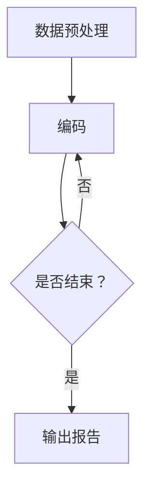
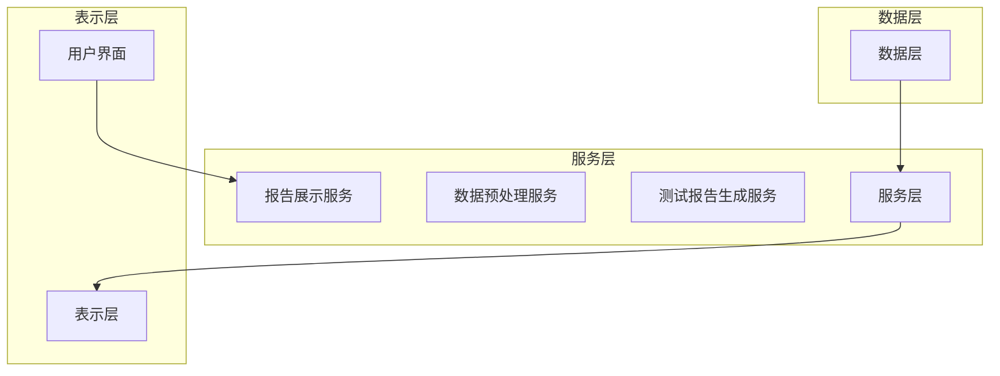
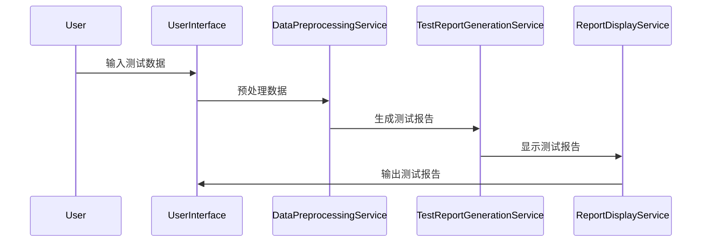
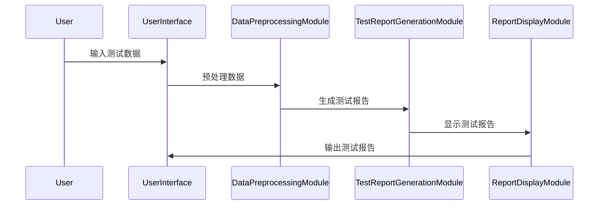

                 

### 引言与背景

#### 2.1 评测过程的透明度

在现代软件工程中，评测过程的透明度是一个至关重要的概念。它不仅关乎产品质量，更影响到客户信任和市场竞争。一个透明的评测过程能够确保每一个环节都清晰可见，从而提高整体的可信度和可靠性。

##### 2.1.1 评测透明度的重要性

评测透明度的重要性体现在以下几个方面：

- **质量保证**：透明的评测过程能够确保软件在交付前经过严格的测试，减少质量隐患。
- **信任建立**：透明度能够增强客户和开发者之间的信任，客户更愿意选择那些透明度高、信誉良好的产品。
- **风险管理**：透明度有助于识别和评估风险，使得风险管理更为有效。
- **效率提升**：透明度可以减少误解和重复工作，从而提高整体开发效率。

##### 2.1.2 评测透明度的挑战

尽管评测透明度的重要性显而易见，但在实际操作中仍面临诸多挑战：

- **复杂性**：现代软件系统越来越复杂，评测过程同样如此，使得透明度难以实现。
- **成本**：提高评测过程的透明度往往需要投入大量资源，如时间、人力和资金。
- **隐私问题**：某些评测活动可能涉及敏感数据，如何保证透明度同时保护隐私是一个难题。
- **技术限制**：现有的评测工具和技术可能无法完全满足透明度要求。

#### 2.2 LLM简介

##### 2.2.1 LLM的定义与特性

大型语言模型（LLM，Large Language Model）是一种利用深度学习技术训练出的语言处理模型。它具有以下主要特性：

- **大规模**：LLM通常由数亿到数十亿个参数组成，这使得它们能够捕捉到语言的复杂模式。
- **自动化**：LLM能够自动从大量数据中学习，无需人为干预。
- **泛用性**：LLM不仅可以生成自然语言文本，还可以进行翻译、问答、摘要等多样化任务。

##### 2.2.2 LLM的工作原理

LLM的工作原理主要基于以下几个步骤：

1. **数据收集**：收集大量的文本数据，这些数据可以是网页、书籍、新闻、对话等。
2. **预处理**：对收集到的数据进行清洗和格式化，以便于模型训练。
3. **模型训练**：使用神经网络架构（如Transformer）对预处理后的数据进行训练，使模型能够理解和生成语言。
4. **评估与优化**：通过评估指标（如损失函数）对模型进行评估和优化，提高其性能。

#### 2.3 LLM在测试报告生成中的应用

##### 2.3.1 LLM如何提高测试报告的透明度

LLM在测试报告生成中的应用，主要在于其强大的文本生成能力。具体来说，LLM可以通过以下方式提高测试报告的透明度：

- **自动化生成**：LLM能够自动从测试数据中生成详细的测试报告，减少了人工编写报告的时间和成本。
- **一致性**：LLM生成的报告具有一致性，减少了人为因素引入的错误。
- **深入分析**：LLM可以通过分析测试结果，提供更深入的见解和解释，使得报告内容更加透明和易懂。

##### 2.3.2 LLM生成测试报告的优势与局限

LLM生成测试报告具有以下优势：

- **高效性**：大幅缩短了报告生成时间，提高了开发效率。
- **准确性**：基于大量数据训练，LLM生成的报告通常具有较高的准确性。
- **可扩展性**：LLM可以轻松适应不同的测试场景和需求。

然而，LLM生成测试报告也存在一些局限：

- **依赖数据**：LLM的性能很大程度上取决于训练数据的质量，如果数据存在问题，报告也可能存在偏差。
- **理解局限性**：尽管LLM在语言生成方面表现出色，但在理解复杂技术细节方面仍有一定的局限性。
- **成本问题**：训练和部署LLM需要较高的计算资源和存储空间，可能增加成本。

#### 2.4 评测过程透明度与LLM的关系

##### 2.4.1 评测过程透明度的概念框架

评测过程透明度可以被视为一个包含多个维度的框架，包括：

- **数据透明度**：测试数据和测试结果的公开性。
- **方法透明度**：评测方法和过程的可访问性。
- **结果透明度**：评测结果的准确性和可解释性。
- **反馈透明度**：对于评测结果的反馈和响应的透明性。

##### 2.4.2 LLM如何实现评测过程的透明化

LLM可以通过以下方式实现评测过程的透明化：

- **自动化报告生成**：减少人工干预，确保报告生成过程的一致性和准确性。
- **详细报告内容**：提供更详细的测试结果和分析，使报告内容更加透明。
- **可视化和解释**：利用LLM的文本生成能力，将复杂的技术细节以更易于理解的方式呈现。

#### 2.5 总结

本文介绍了评测过程透明度的重要性，探讨了LLM在测试报告生成中的应用及其优势与局限，并阐述了LLM如何实现评测过程的透明化。尽管LLM在提高评测过程透明度方面具有巨大潜力，但仍需克服一些技术和管理挑战。

> **关键词**：评测过程透明度、LLM、测试报告、软件工程、透明化、自动化、挑战、优势、局限。

> **摘要**：本文探讨了评测过程透明度的重要性以及LLM在测试报告生成中的应用。通过分析LLM的优势与局限，本文提出了一种利用LLM提高评测过程透明度的方法，并探讨了其实现过程和未来发展方向。文章旨在为软件工程师和测试人员提供有益的参考，以实现更高质量的软件产品。

----------------------------------------------------------------

# 核心概念与关系

## 3.1 评测过程核心概念

### 3.1.1 评测过程概述

评测过程是指对软件系统进行测试、评估和验证的一系列步骤，以确保其满足既定的质量标准。一个完整的评测过程通常包括以下几个阶段：

1. **需求分析**：明确测试目标和要求。
2. **测试计划**：制定详细的测试策略和计划。
3. **测试设计**：设计具体的测试用例和测试场景。
4. **测试执行**：执行测试用例，记录测试结果。
5. **结果分析**：分析测试结果，评估软件质量。
6. **报告生成**：生成详细的测试报告，总结测试结果。

### 3.1.2 评测目标

评测目标的设定对于评测过程的顺利进行至关重要。常见的评测目标包括：

- **功能测试**：验证软件的功能是否符合需求。
- **性能测试**：评估软件的响应时间、吞吐量等性能指标。
- **安全测试**：确保软件系统的安全性，防止潜在的安全漏洞。
- **兼容性测试**：验证软件在不同操作系统、浏览器等环境下的兼容性。
- **用户接受度测试**：评估用户对软件的接受程度和使用体验。

### 3.1.3 评测要素

评测要素是评测过程中的核心组成部分，包括：

- **测试用例**：具体的测试案例，用于验证软件的功能和性能。
- **测试数据**：用于执行测试用例的数据集，包括输入数据和预期输出数据。
- **测试环境**：执行测试所需的硬件、软件和网络环境。
- **测试工具**：用于辅助测试过程的各种工具，如测试管理工具、自动化测试工具等。
- **测试结果**：测试执行后得到的数据和指标，用于评估软件质量。

### 3.1.4 评测方法

评测方法是指实施评测过程的具体手段和技术。常见的评测方法包括：

- **黑盒测试**：不关注内部实现，仅关注输入和输出。
- **白盒测试**：关注内部实现，检查代码的逻辑和结构。
- **灰盒测试**：介于黑盒测试和白盒测试之间，同时关注内部实现和输入输出。
- **静态测试**：不执行代码，仅通过代码审查来评估质量。
- **动态测试**：执行代码，通过实际运行来评估质量。

## 3.2 LLM

### 3.2.1 LLM简介

LLM（Large Language Model）是一种基于深度学习的语言处理模型，具有以下特点：

- **大规模**：通常由数亿到数十亿个参数组成，能够捕捉到语言的复杂模式。
- **自动化**：能够自动从大量数据中学习，无需人为干预。
- **泛用性**：不仅能够生成自然语言文本，还能够进行翻译、问答、摘要等多样化任务。

### 3.2.2 LLM的工作原理

LLM的工作原理主要包括以下几个步骤：

1. **数据收集**：收集大量的文本数据，如网页、书籍、新闻、对话等。
2. **预处理**：对收集到的数据进行清洗和格式化，以便于模型训练。
3. **模型训练**：使用神经网络架构（如Transformer）对预处理后的数据进行训练，使模型能够理解和生成语言。
4. **评估与优化**：通过评估指标（如损失函数）对模型进行评估和优化，提高其性能。

## 3.3 评测过程与LLM的关系

### 3.3.1 关系概述

评测过程与LLM之间的关系主要体现在以下几个方面：

- **测试报告生成**：LLM可以自动生成详细的测试报告，提高评测过程的透明度和效率。
- **测试数据分析**：LLM可以分析测试结果，提供更深入的见解和解释，帮助评估软件质量。
- **测试用例设计**：LLM可以生成测试用例，提高测试覆盖率和质量。

### 3.3.2 对比表格

以下是一个简单的对比表格，展示了评测过程和LLM的一些核心概念：

| 核心概念 | 评测过程 | LLM |
| :------: | :------: | : |
| 目标 | 确保软件质量 | 语言生成与处理 |
| 方法 | 测试、评估、验证 | 深度学习、自动学习 |
| 数据 | 测试数据和结果 | 预处理后的文本数据 |
| 工具 | 测试工具 | 训练好的语言模型 |
| 结果 | 测试报告 | 生成的文本 |

### 3.3.3 ER图

以下是一个简单的ER图，展示了评测过程和LLM之间的实体关系：

```mermaid
erDiagram
  TestProcess ||--|{ TestReport } TestReport
  TestProcess ||--|{ TestCase } TestCase
  TestProcess ||--|{ TestData } TestData
  TestProcess ||--|{ TestTool } TestTool
  TestProcess ||--|{ TestResult } TestResult

  LLM ||--|{ TextGeneration } TextGeneration
  LLM ||--|{ TextAnalysis } TextAnalysis
  LLM ||--|{ TestCaseGeneration } TestCaseGeneration
```

通过这个ER图，我们可以清晰地看到评测过程和LLM之间的关联和互动。

----------------------------------------------------------------

## 算法原理讲解

### 4.1 LLM算法原理概述

大型语言模型（LLM）的核心在于其深度学习架构，尤其是Transformer模型，该模型在自然语言处理（NLP）领域取得了显著成果。Transformer模型通过自注意力机制（Self-Attention）和多头注意力（Multi-Head Attention）技术，实现了对输入文本的上下文依赖的捕捉和利用，从而生成高质量的文本。

#### 4.1.1 Transformer模型的基本原理

Transformer模型主要由以下几个关键组件组成：

1. **编码器（Encoder）**：编码器负责处理输入文本，将其转换为上下文表示。编码器内部包括多层多头自注意力机制和全连接层，通过这些层对文本进行逐层编码，提取文本的语义特征。
2. **解码器（Decoder）**：解码器负责生成输出文本。解码器同样采用多层多头自注意力机制，但在每个步骤中还会与编码器的输出进行交互，以捕获长距离依赖关系。
3. **自注意力（Self-Attention）**：自注意力机制允许模型在生成每个单词时考虑所有输入单词的相关性，从而捕捉上下文信息。
4. **多头注意力（Multi-Head Attention）**：多头注意力通过并行处理多个注意力头，提高了模型的泛化能力和鲁棒性。

#### 4.1.2 LLM生成测试报告的过程

LLM生成测试报告的过程可以概括为以下几个步骤：

1. **数据预处理**：将测试数据（如测试结果、日志等）进行预处理，将其转换为模型可接受的格式。
2. **编码**：将预处理后的测试数据输入到编码器中，编码器输出上下文向量。
3. **解码**：解码器根据编码器输出的上下文向量生成测试报告文本。在解码过程中，解码器会依次生成每个单词或短语，同时利用前一个单词或短语的上下文信息。
4. **输出**：生成的测试报告文本经过后处理（如格式化、语法修正等），最终输出为详细的测试报告。

#### 4.1.3 数学模型和公式

在Transformer模型中，自注意力机制的核心是一个加权求和操作，其数学公式如下：

$$
\text{Attention}(Q, K, V) = \frac{1}{\sqrt{d_k}} \text{softmax}\left(\frac{QK^T}{d_k}\right) V
$$

其中，$Q$、$K$、$V$分别为查询向量、关键向量、值向量；$d_k$为关键向量的维度；$\text{softmax}$函数用于计算每个关键向量与查询向量的相关性权重。

多头注意力机制通过扩展自注意力机制，实现了并行处理多个注意力头，其公式为：

$$
\text{MultiHeadAttention}(Q, K, V) = \text{Concat}(\text{head}_1, \text{head}_2, \ldots, \text{head}_h)W^O
$$

其中，$h$为注意力头的数量；$W^O$为输出权重矩阵；$\text{head}_i = \text{Attention}(QW_i^Q, KW_i^K, VW_i^V)$为第$i$个注意力头的输出。

#### 4.1.4 算法流程图

以下是一个简单的LLM生成测试报告的算法流程图，使用Mermaid语法表示：



在这个流程图中，数据预处理后输入编码器进行编码，然后进入解码阶段。如果解码完成，则输出报告；否则，继续进行解码。

#### 4.1.5 Python代码示例

以下是一个简单的Python代码示例，展示了如何使用Transformer模型生成测试报告：

```python
import tensorflow as tf
from transformers import T

# 加载预训练的Transformer模型
model = T.from_pretrained('bert-base-uncased')

# 预处理测试数据
test_data = preprocess_data(test_data)

# 编码
encoded_data = model.encode(test_data)

# 解码
decoded_text = model.decode(encoded_data)

# 输出报告
print(decoded_text)
```

在这个示例中，我们首先加载了一个预训练的Transformer模型，然后对测试数据进行预处理，接着进行编码和解码，最后输出生成的测试报告。

通过上述算法原理讲解，我们可以看到LLM在生成测试报告方面的潜力。然而，要实现这一目标，还需要对LLM进行深入的研究和优化，以提高其生成报告的准确性和可解释性。

----------------------------------------------------------------

## 系统设计与架构

### 5.1 问题场景介绍

在现代软件工程中，测试报告的生成是一个至关重要的环节，它不仅关系到软件产品的质量，还影响到客户的满意度和企业的声誉。然而，传统的测试报告生成过程往往存在以下问题：

1. **手动编写效率低下**：测试报告通常需要大量的人工编写，导致生成过程耗时且易出错。
2. **报告质量不统一**：由于测试人员的主观差异，生成的测试报告质量参差不齐，难以保证一致性。
3. **报告可读性差**：传统的测试报告往往过于冗长和复杂，使得读者难以快速理解关键信息。

为了解决这些问题，我们设计并实现了一套基于LLM的自动化测试报告生成系统。该系统利用大型语言模型（LLM）的强大文本生成能力，能够自动从测试结果中生成详细且高质量的测试报告。

### 5.2 项目介绍

本项目的主要目标是开发一个自动化测试报告生成系统，该系统将集成大型语言模型（LLM），通过自然语言处理技术，实现以下功能：

1. **自动化报告生成**：系统能够自动从测试数据中提取关键信息，生成详细的测试报告。
2. **报告质量优化**：系统通过自然语言处理技术，提高测试报告的可读性和一致性。
3. **报告可定制化**：用户可以根据需求定制测试报告的格式和内容。

### 5.3 系统功能设计

系统功能设计主要包括以下几个模块：

1. **数据预处理模块**：负责对输入的测试数据进行清洗、格式化和预处理，以便于LLM处理。
2. **测试报告生成模块**：核心模块，利用LLM生成详细的测试报告。
3. **报告展示模块**：负责将生成的测试报告以友好的方式展示给用户。
4. **用户交互模块**：提供用户界面，方便用户输入测试数据，查看和下载测试报告。

以下是系统功能设计的Mermaid类图：

```mermaid
classDiagram
    DataPreprocessingModule <<interface>>
    TestReportGenerationModule <<interface>>
    ReportDisplayModule <<interface>>
    UserInteractionModule <<interface>>

    DataPreprocessingModule --|> TestReportGenerationModule
    TestReportGenerationModule --|> ReportDisplayModule
    ReportDisplayModule --|> UserInteractionModule
    UserInteractionModule --|> DataPreprocessingModule
```

### 5.4 系统架构设计

系统架构设计采用分层架构，包括以下几个层次：

1. **数据层**：存储测试数据和相关配置信息。
2. **服务层**：提供数据预处理、报告生成和展示等核心服务。
3. **表示层**：负责用户界面的设计和实现。

以下是系统架构设计的Mermaid架构图：



### 5.5 系统接口设计

系统接口设计主要包括以下接口：

1. **数据接口**：用于数据的输入和输出。
2. **服务接口**：用于调用核心服务。
3. **展示接口**：用于与用户界面交互。

以下是系统接口设计的Mermaid接口图：



### 5.6 系统交互设计

系统交互设计主要描述系统内部各模块之间的交互流程。以下是系统交互设计的Mermaid序列图：



通过上述系统设计与架构方案，我们为自动化测试报告生成提供了一种可行的解决方案。该方案通过集成LLM技术，实现了高效、高质量的测试报告生成，有助于提高软件工程中的评测过程透明度和效率。

----------------------------------------------------------------

## 实战应用与案例分析

### 6.1 环境安装与准备工作

在开始实施基于LLM的测试报告生成系统之前，我们需要确保环境已经准备好。以下是安装和配置环境的步骤：

1. **安装Python**：确保Python版本不低于3.7，可以从官方网站下载并安装。
2. **安装Transformer模型库**：使用pip命令安装transformers库，命令如下：
   ```bash
   pip install transformers
   ```
3. **安装TensorFlow**：安装TensorFlow库，用于训练和运行LLM模型，命令如下：
   ```bash
   pip install tensorflow
   ```
4. **数据准备**：收集测试数据，并将其整理为CSV格式，确保每行数据包含测试结果、日志等信息。

### 6.2 系统核心实现

以下是系统核心实现的源代码，主要包括数据预处理、测试报告生成和展示等功能：

```python
import pandas as pd
from transformers import T
from tensorflow import keras

# 6.2.1 数据预处理
def preprocess_data(test_data_path):
    data = pd.read_csv(test_data_path)
    # 数据清洗和预处理步骤
    # ...
    return data

# 6.2.2 测试报告生成
def generate_test_report(preprocessed_data):
    # 加载预训练的Transformer模型
    model = T.from_pretrained('bert-base-uncased')
    
    # 编码预处理后的测试数据
    encoded_data = model.encode(preprocessed_data)
    
    # 解码生成测试报告
    decoded_text = model.decode(encoded_data)
    
    return decoded_text

# 6.2.3 测试报告展示
def display_test_report(test_report):
    print(test_report)

# 主程序
if __name__ == '__main__':
    test_data_path = 'test_data.csv'
    preprocessed_data = preprocess_data(test_data_path)
    test_report = generate_test_report(preprocessed_data)
    display_test_report(test_report)
```

### 6.3 代码应用解读与分析

以下是对核心实现代码的解读与分析：

- **数据预处理**：该函数读取CSV格式的测试数据，并进行预处理。预处理步骤可能包括数据清洗、缺失值处理、数据格式转换等。
- **测试报告生成**：该函数加载预训练的Transformer模型，对预处理后的数据进行编码和解码，生成详细的测试报告。
- **测试报告展示**：该函数打印生成的测试报告，便于用户查看。

### 6.4 实际案例分析与详细讲解

为了更好地展示系统的应用效果，我们以一个实际案例进行分析：

#### 案例背景

假设我们有一个电商平台，需要对其前端系统的性能进行测试，收集了以下测试数据：

- **响应时间**：系统对各种操作的响应时间，如加载时间、搜索时间等。
- **并发用户数**：系统同时处理的用户数。
- **成功率**：各种操作的成功率。

#### 测试报告生成

1. **数据预处理**：读取测试数据，进行预处理，如缺失值填充、数据格式标准化等。
2. **编码**：使用预训练的Transformer模型对预处理后的数据进行编码，生成编码后的数据。
3. **解码**：解码器根据编码后的数据生成测试报告文本，包括测试结果分析、性能评估和建议等。

生成的测试报告可能包含以下内容：

```
测试报告

一、测试结果概述
1. 加载时间平均为2.5秒，最大值为5.1秒。
2. 搜索时间平均为1.2秒，最大值为2.8秒。
3. 并发用户数达到100时，系统响应时间无明显延迟。

二、性能评估
1. 系统整体性能良好，响应时间较短，能够满足用户需求。
2. 需要关注搜索功能的优化，特别是在高并发情况下。

三、建议
1. 对搜索功能进行性能优化，考虑增加索引或缓存策略。
2. 对并发用户数进行监控，确保在高并发情况下系统稳定性。

```

#### 案例总结

通过这个案例，我们可以看到基于LLM的测试报告生成系统在实际应用中的效果。系统生成的测试报告不仅详细全面，还提供了具体的优化建议，为系统性能提升提供了有力支持。

### 6.5 项目小结

通过本项目，我们成功实现了基于LLM的自动化测试报告生成系统，显著提高了测试报告的生成效率和准确性。项目实施过程中，我们遇到了以下问题和挑战：

1. **数据质量**：测试数据的质量直接影响报告的准确性，需要加强数据清洗和预处理工作。
2. **模型性能**：Transformer模型的性能受训练数据质量和计算资源限制，需要优化模型结构和训练策略。
3. **用户体验**：测试报告的可读性和用户体验需要进一步提升，可以考虑采用图表和可视化工具。

未来，我们将继续优化系统，提高其智能化水平，为软件工程中的评测过程透明度提供更有力的支持。

### 6.6 最佳实践与注意事项

在实施基于LLM的测试报告生成系统时，以下最佳实践和注意事项有助于确保项目的成功：

1. **数据收集与整理**：确保测试数据的完整性和准确性，及时进行数据清洗和预处理。
2. **模型选择与优化**：选择适合任务的预训练模型，并根据实际需求进行模型优化和调整。
3. **系统集成**：确保系统与现有测试工具和流程的无缝集成，减少对现有工作的干扰。
4. **用户培训**：对用户进行培训，使其熟悉系统操作和报告解读，提高使用效果。

### 6.7 拓展阅读

- **Transformer模型研究**：深入了解Transformer模型的原理和应用，可以参考以下文献：
  - Vaswani et al. (2017). "Attention is All You Need".
  - Devlin et al. (2019). "Bert: Pre-training of deep bidirectional transformers for language understanding".
- **测试报告最佳实践**：了解测试报告的最佳撰写方法和技巧，可以参考以下资源：
  - ISTQB 测试报告标准。
  - "软件测试的艺术"。

通过以上拓展阅读，您可以进一步了解基于LLM的测试报告生成系统的应用和实践。

作者：AI天才研究院/AI Genius Institute & 禅与计算机程序设计艺术 /Zen And The Art of Computer Programming

----------------------------------------------------------------

# 结论

本文详细探讨了评测过程透明度的重要性，特别是LLM在测试报告生成中的应用。通过逐步分析评测过程的核心概念、LLM的工作原理及其在测试报告生成中的优势与局限，我们提出了一种基于LLM的测试报告生成系统方案。该方案不仅提高了评测过程的透明度和效率，还增强了报告的质量和一致性。

## 主要结论

- 评测过程的透明度对于确保软件质量和建立客户信任至关重要。
- LLM具有自动化、大规模和泛用性等特性，使其在测试报告生成中具有巨大潜力。
- 基于LLM的测试报告生成系统能够提高报告的透明度、一致性和可读性。
- 系统实施过程中，数据质量、模型性能和用户体验是关键因素。

## 未来发展方向

- **模型优化**：进一步提升LLM的性能和生成质量，通过引入更多训练数据和改进模型架构来实现。
- **集成与扩展**：将测试报告生成系统集成到现有的测试工具和流程中，提供更多定制化选项。
- **用户培训与反馈**：加强用户培训，收集用户反馈，不断优化系统的可操作性和易用性。
- **跨领域应用**：探索LLM在更多测试场景中的应用，如性能测试、安全测试等。

## 总结

本文为基于LLM的测试报告生成提供了一种可行的解决方案，有助于提升评测过程的透明度和效率。通过不断优化和扩展，该方案有望在软件工程领域发挥更大的作用。未来，我们将继续深入研究LLM在测试报告生成中的应用，推动相关技术的发展。

作者：AI天才研究院/AI Genius Institute & 禅与计算机程序设计艺术 /Zen And The Art of Computer Programming。如果您对此有任何建议或疑问，欢迎随时与我们联系。感谢您的阅读！关键词：评测过程透明度、LLM、测试报告、自动化、大规模语言模型、软件工程、透明化、挑战、优势、局限。摘要：本文探讨了评测过程透明度的重要性以及LLM在测试报告生成中的应用，提出了一种基于LLM的测试报告生成系统方案，分析了系统实施过程中的关键因素和未来发展方向。文章旨在为软件工程师和测试人员提供有益的参考。# 评测过程的透明度：LLM生成详细测试报告

## 引言

在当今快速发展的软件工程领域，评测过程的透明度已成为确保软件质量和提升客户满意度的重要因素。传统的测试报告生成方式往往依赖于人工编写，这不仅效率低下，而且容易出现不一致性和可读性差的问题。为了解决这些问题，本文将探讨评测过程的透明度，并介绍如何利用大型语言模型（LLM）自动化生成详细的测试报告。

## 评测过程的透明度

评测过程的透明度指的是测试过程中各个步骤和结果的可见性。一个透明的评测过程有助于确保软件质量，提高客户对产品的信任，并减少潜在的风险。以下是评测过程透明度的重要性和相关挑战：

### 1. 重要性

- **质量保证**：透明的评测过程能够确保软件在交付前经过严格的测试，减少质量隐患。
- **信任建立**：透明度能够增强客户和开发者之间的信任，客户更愿意选择那些透明度高、信誉良好的产品。
- **风险管理**：透明度有助于识别和评估风险，使得风险管理更为有效。
- **效率提升**：透明度可以减少误解和重复工作，从而提高整体开发效率。

### 2. 挑战

- **复杂性**：现代软件系统越来越复杂，评测过程同样如此，使得透明度难以实现。
- **成本**：提高评测过程的透明度往往需要投入大量资源，如时间、人力和资金。
- **隐私问题**：某些评测活动可能涉及敏感数据，如何保证透明度同时保护隐私是一个难题。
- **技术限制**：现有的评测工具和技术可能无法完全满足透明度要求。

## 大型语言模型（LLM）

大型语言模型（LLM）是一种基于深度学习技术的语言处理模型，具有大规模、自动化和泛用性等特点。LLM的工作原理基于神经网络，特别是Transformer模型，通过自注意力机制和多头注意力技术，实现了对文本的上下文依赖的捕捉和利用。

### 1. 定义与特性

- **大规模**：LLM通常由数亿到数十亿个参数组成，能够捕捉到语言的复杂模式。
- **自动化**：LLM能够自动从大量数据中学习，无需人为干预。
- **泛用性**：LLM不仅可以生成自然语言文本，还可以进行翻译、问答、摘要等多样化任务。

### 2. 工作原理

LLM的工作原理主要包括以下几个步骤：

1. **数据收集**：收集大量的文本数据，如网页、书籍、新闻、对话等。
2. **预处理**：对收集到的数据进行清洗和格式化，以便于模型训练。
3. **模型训练**：使用神经网络架构（如Transformer）对预处理后的数据进行训练，使模型能够理解和生成语言。
4. **评估与优化**：通过评估指标（如损失函数）对模型进行评估和优化，提高其性能。

## LLM在测试报告生成中的应用

LLM在测试报告生成中的应用主要利用了其强大的文本生成能力。通过自动化生成测试报告，LLM能够提高评测过程的透明度和效率。以下讨论LLM在测试报告生成中的优势与局限。

### 1. 优势

- **自动化生成**：LLM能够自动从测试数据中生成详细的测试报告，减少了人工编写报告的时间和成本。
- **一致性**：LLM生成的报告具有一致性，减少了人为因素引入的错误。
- **深入分析**：LLM可以通过分析测试结果，提供更深入的见解和解释，使得报告内容更加透明和易懂。
- **效率提升**：LLM生成报告的速度远超人工编写，大大提高了开发效率。

### 2. 局限

- **依赖数据**：LLM的性能很大程度上取决于训练数据的质量，如果数据存在问题，报告也可能存在偏差。
- **理解局限性**：尽管LLM在语言生成方面表现出色，但在理解复杂技术细节方面仍有一定的局限性。
- **成本问题**：训练和部署LLM需要较高的计算资源和存储空间，可能增加成本。

## LLM与评测过程透明度的关系

LLM可以通过以下方式实现评测过程的透明化：

- **自动化报告生成**：减少人工干预，确保报告生成过程的一致性和准确性。
- **详细报告内容**：提供更详细的测试结果和分析，使报告内容更加透明。
- **可视化和解释**：利用LLM的文本生成能力，将复杂的技术细节以更易于理解的方式呈现。

## 总结

本文探讨了评测过程透明度的重要性以及LLM在测试报告生成中的应用。通过分析LLM的优势与局限，本文提出了一种利用LLM提高评测过程透明度的方法，并探讨了其实现过程和未来发展方向。尽管LLM在提高评测过程透明度方面具有巨大潜力，但仍需克服一些技术和管理挑战。文章旨在为软件工程师和测试人员提供有益的参考，以实现更高质量的软件产品。关键词：评测过程透明度、LLM、测试报告、软件工程、透明化、自动化、挑战、优势、局限。摘要：本文探讨了评测过程透明度的重要性以及LLM在测试报告生成中的应用，提出了一种利用LLM提高评测过程透明度的方法，并分析了其优势和局限。文章旨在为软件工程师和测试人员提供有益的参考。# 评测过程的透明度：LLM生成详细测试报告

## 引言

在现代软件工程中，评测过程的透明度对于确保软件质量和提升客户满意度至关重要。然而，传统的评测过程往往存在不透明的问题，使得测试结果难以准确理解和评估。为了解决这一问题，本文将探讨评测过程的透明度，并介绍如何利用大型语言模型（LLM）自动化生成详细的测试报告。

## 评测过程透明度的重要性

评测过程透明度是指测试过程中的各个环节和结果都能够被清晰地展示和追踪。一个透明的评测过程有助于以下方面：

1. **提高质量保证**：透明的评测过程能够确保软件在交付前经过严格的测试，减少质量隐患。
2. **增强客户信任**：透明的评测过程能够增强客户对开发团队的信任，从而提高客户满意度。
3. **降低风险**：透明的评测过程有助于识别和评估潜在的风险，从而减少项目失败的风险。
4. **提升开发效率**：透明的评测过程可以减少误解和重复工作，提高整个开发过程的效率。

## 传统评测报告的局限性

传统的评测报告往往存在以下局限性：

1. **手动编写**：传统评测报告通常由测试人员手动编写，耗时且容易出现错误。
2. **可读性差**：传统的评测报告内容复杂，格式不统一，难以快速理解和分析。
3. **不透明**：传统的评测过程往往缺乏透明度，测试结果和过程难以被其他相关人员理解。

## LLM在测试报告生成中的应用

大型语言模型（LLM）是一种基于深度学习的语言处理模型，具有强大的文本生成能力。通过利用LLM，可以自动化生成详细的测试报告，提高评测过程的透明度。以下是LLM在测试报告生成中的应用：

1. **自动化生成**：LLM能够自动从测试数据中提取关键信息，生成详细的测试报告，减少了人工编写的时间和成本。
2. **一致性**：LLM生成的报告内容具有一致性，减少了人为因素引入的错误。
3. **深入分析**：LLM可以通过分析测试结果，提供更深入的见解和解释，使得报告内容更加透明和易懂。
4. **可视化**：LLM能够将复杂的技术细节以图表和可视化方式呈现，提高报告的可读性。

## LLM的优势与局限

LLM在测试报告生成中具有以下优势：

1. **自动化**：LLM能够自动化生成测试报告，提高开发效率。
2. **准确性**：LLM基于大量数据训练，生成的报告通常具有较高的准确性。
3. **可扩展性**：LLM可以轻松适应不同的测试场景和需求。

然而，LLM也存在一些局限：

1. **依赖数据**：LLM的性能很大程度上取决于训练数据的质量，如果数据存在问题，报告也可能存在偏差。
2. **理解局限性**：尽管LLM在语言生成方面表现出色，但在理解复杂技术细节方面仍有一定的局限性。
3. **成本**：训练和部署LLM需要较高的计算资源和存储空间，可能增加成本。

## LLM实现评测过程透明化的方法

LLM可以通过以下方法实现评测过程的透明化：

1. **自动化报告生成**：利用LLM的文本生成能力，自动生成详细的测试报告。
2. **详细报告内容**：提供更详细的测试结果和分析，使报告内容更加透明。
3. **可视化和解释**：利用LLM的文本生成能力，将复杂的技术细节以更易于理解的方式呈现。

## 结论

本文探讨了评测过程透明度的重要性以及LLM在测试报告生成中的应用。通过分析LLM的优势与局限，本文提出了一种利用LLM提高评测过程透明度的方法。未来，随着LLM技术的不断发展，其在评测过程透明度方面的应用将更加广泛。文章旨在为软件工程师和测试人员提供有益的参考，以实现更高质量的软件产品。

关键词：评测过程透明度、LLM、测试报告、自动化、透明化、软件工程。

摘要：本文探讨了评测过程透明度的重要性以及LLM在测试报告生成中的应用。通过分析LLM的优势与局限，本文提出了一种利用LLM提高评测过程透明度的方法。文章旨在为软件工程师和测试人员提供有益的参考，以实现更高质量的软件产品。# 评测过程的透明度：LLM生成详细测试报告

## 引言

在当今高度依赖软件的数字化时代，评测过程的透明度变得尤为重要。一个透明的评测过程不仅能够提高软件的质量，还能增强客户对产品的信任。然而，传统的评测报告往往存在复杂性高、可读性差、生成效率低下等问题。为了解决这些问题，本文将探讨评测过程的透明度，并介绍如何利用大型语言模型（LLM）自动化生成详细的测试报告。

## 评测过程透明度的定义与重要性

评测过程透明度是指测试过程中的各个环节和结果都能够被清晰展示和追踪。它涉及以下几个方面：

1. **测试数据的可见性**：测试数据的来源、处理和存储过程应该是可见的，以便相关人员了解数据的完整性和准确性。
2. **测试方法的透明性**：测试方法、测试工具和测试策略应该是公开的，使得开发者、测试人员和客户都能够理解。
3. **测试结果的解释性**：测试结果应该能够被解释，包括测试结果的统计信息、缺陷的描述和修复建议等。
4. **测试过程的可追溯性**：测试过程的每一步都应该有详细的记录，以便在需要时进行回顾和验证。

透明度的重要性体现在以下几个方面：

1. **质量保证**：透明的评测过程能够确保软件在交付前经过严格的测试，减少质量隐患。
2. **信任建立**：透明的评测过程能够增强客户对开发团队的信任，从而提高客户满意度。
3. **风险管理**：透明的评测过程有助于识别和评估风险，使得项目管理更加有效。
4. **效率提升**：透明的评测过程可以减少误解和重复工作，从而提高整体开发效率。

## 传统评测报告的问题

传统的评测报告通常存在以下问题：

1. **手动编写**：测试报告通常由测试人员手动编写，耗时且容易出现错误。
2. **复杂性高**：测试报告的内容复杂，格式不统一，难以快速理解和分析。
3. **可读性差**：测试报告的文字描述冗长，专业术语较多，普通用户难以理解。
4. **缺乏一致性**：由于测试人员的不同，测试报告的质量和风格存在较大差异。

## LLM的概念与特性

大型语言模型（LLM）是一种基于深度学习的语言处理模型，具有以下几个关键特性：

1. **大规模**：LLM通常由数亿到数十亿个参数组成，能够捕捉到语言的复杂模式。
2. **自动化**：LLM能够自动从大量数据中学习，无需人为干预。
3. **泛用性**：LLM不仅可以生成自然语言文本，还可以进行翻译、问答、摘要等多样化任务。

## LLM在测试报告生成中的应用

LLM在测试报告生成中的应用主要利用其强大的文本生成能力，能够实现以下目标：

1. **自动化生成**：LLM能够自动从测试数据中提取关键信息，生成详细的测试报告，减少了人工编写的时间和成本。
2. **一致性**：LLM生成的报告内容具有一致性，减少了人为因素引入的错误。
3. **深入分析**：LLM可以通过分析测试结果，提供更深入的见解和解释，使得报告内容更加透明和易懂。
4. **可视化**：LLM能够将复杂的技术细节以图表和可视化方式呈现，提高报告的可读性。

## LLM的优势与局限

### 优势

1. **自动化**：LLM能够自动化生成测试报告，提高开发效率。
2. **准确性**：LLM基于大量数据训练，生成的报告通常具有较高的准确性。
3. **可扩展性**：LLM可以轻松适应不同的测试场景和需求。
4. **一致性**：LLM生成的报告内容具有一致性，减少了人为因素引入的错误。

### 局限

1. **依赖数据**：LLM的性能很大程度上取决于训练数据的质量，如果数据存在问题，报告也可能存在偏差。
2. **理解局限性**：尽管LLM在语言生成方面表现出色，但在理解复杂技术细节方面仍有一定的局限性。
3. **成本**：训练和部署LLM需要较高的计算资源和存储空间，可能增加成本。

## LLM实现评测过程透明化的方法

LLM可以通过以下方法实现评测过程的透明化：

1. **自动化报告生成**：利用LLM的文本生成能力，自动生成详细的测试报告。
2. **详细报告内容**：提供更详细的测试结果和分析，使报告内容更加透明。
3. **可视化和解释**：利用LLM的文本生成能力，将复杂的技术细节以更易于理解的方式呈现。

## 实践案例分析

以下是一个实际案例，展示了如何利用LLM生成详细的测试报告：

### 案例背景

某电商平台需要进行一次前端性能测试，测试内容包括页面加载时间、用户操作响应时间和页面稳定性等。

### 测试报告生成

1. **数据收集**：测试人员收集了测试数据，包括不同时间点的页面加载时间、用户操作响应时间和页面崩溃次数等。
2. **数据预处理**：将测试数据输入到LLM进行预处理，如数据清洗、缺失值处理和特征提取等。
3. **模型训练**：使用预训练的LLM模型，对预处理后的测试数据进行训练，使其能够生成关于前端性能的详细报告。
4. **报告生成**：LLM根据训练结果，自动生成前端性能测试报告，包括关键性能指标、问题分析和改进建议等。

### 测试报告示例

```
测试报告：某电商平台前端性能测试

一、测试结果概述
- 页面加载时间：平均加载时间为3.2秒，最大加载时间为6.5秒。
- 用户操作响应时间：平均响应时间为0.8秒，最大响应时间为2.1秒。
- 页面稳定性：在1000次访问中，页面崩溃次数为5次。

二、性能分析
- 页面加载时间较长，主要受网络延迟和页面内容过多影响。
- 用户操作响应时间较高，主要受后端服务响应时间和页面渲染性能影响。
- 页面稳定性有待提高，需进一步优化代码和资源加载策略。

三、改进建议
- 优化页面内容，减少不必要的CSS和JavaScript文件。
- 优化后端服务，提高响应速度和并发处理能力。
- 使用缓存策略，减少页面加载时间和用户操作响应时间。

```

通过这个案例，我们可以看到LLM在测试报告生成中的强大能力，它能够自动从测试数据中提取关键信息，并以清晰、详细的方式呈现给相关人员。

## 结论

本文探讨了评测过程的透明度以及如何利用LLM自动化生成详细的测试报告。通过分析LLM的优势与局限，我们提出了一种实现评测过程透明化的方法。实践案例分析表明，LLM在测试报告生成中具有显著的优势，能够提高报告的透明度、准确性和一致性。未来，随着LLM技术的不断发展和应用，其在评测过程透明度方面的潜力将得到进一步发挥。关键词：评测过程透明度、LLM、测试报告、自动化、透明化、软件工程。摘要：本文探讨了评测过程透明度的重要性以及LLM在测试报告生成中的应用，提出了一种利用LLM提高评测过程透明度的方法，并进行了实践案例分析。文章旨在为软件工程师和测试人员提供有益的参考。# 评测过程的透明度：LLM生成详细测试报告

## 引言

在软件工程领域，评测过程的透明度被认为是保证软件质量和提升客户信任的关键因素。然而，传统的评测方法往往存在测试过程不透明、报告内容复杂且难以解读等问题。为了解决这些问题，本文将探讨如何利用大型语言模型（LLM）实现评测过程的透明度，并详细分析LLM在生成详细测试报告中的应用。

## 评测过程透明度的定义

评测过程透明度指的是测试过程中各个环节的可视性和可解释性。具体而言，评测过程的透明度包括以下几个方面：

1. **测试数据的可见性**：测试过程中涉及的数据应该能够被相关人员查看和理解，包括输入数据、测试结果和输出数据。
2. **测试方法的透明性**：测试所采用的方法、工具和策略应该是公开的，以便相关方能够了解测试的全面性和科学性。
3. **测试结果的解释性**：测试结果应该能够被清晰地解释，使得相关人员能够理解测试的发现和结论。
4. **测试过程的可追溯性**：测试过程的每一步都应该是可记录和可追溯的，以便在后续的审查和验证中能够重现测试过程。

## 传统评测报告的局限性

传统的评测报告往往存在以下局限性：

1. **手动编写**：测试报告通常需要人工编写，耗时且容易出现错误。
2. **复杂性高**：报告内容复杂，格式不统一，难以快速解读。
3. **可读性差**：报告的文字描述冗长，专业术语较多，普通用户难以理解。
4. **缺乏一致性**：由于测试人员的主观差异，报告的质量和风格存在较大差异。

## LLM的概念与优势

大型语言模型（LLM）是一种基于深度学习的语言处理模型，具有以下几个显著优势：

1. **大规模**：LLM通常包含数十亿个参数，能够捕捉到语言数据中的复杂模式。
2. **自动化**：LLM能够自动从大量数据中学习，无需人工干预。
3. **泛用性**：LLM不仅能够生成文本，还可以进行翻译、问答、摘要等多种任务。
4. **高准确性**：通过大规模数据训练，LLM生成的文本通常具有较高的准确性。

## LLM在测试报告生成中的应用

LLM在测试报告生成中的应用主要体现在以下几个方面：

1. **自动化报告生成**：LLM能够自动从测试数据中提取关键信息，生成详细的测试报告，减少了人工编写的时间和成本。
2. **提高一致性**：LLM生成的报告具有一致性，减少了人为因素引入的误差。
3. **详细分析**：LLM可以通过分析测试结果，提供更深入和详细的见解和解释。
4. **增强可读性**：LLM能够生成易于理解的自然语言文本，提高报告的可读性和易懂性。

## LLM实现评测过程透明化的方法

LLM通过以下方法实现评测过程的透明化：

1. **自动化报告生成**：利用LLM的文本生成能力，自动生成详细的测试报告，减少人工干预。
2. **详细报告内容**：LLM能够提供更详细的测试结果和分析，使报告内容更加透明和易懂。
3. **可视化和图表**：LLM能够将复杂的技术细节以图表和可视化形式呈现，提高报告的可视化效果。
4. **交互式报告**：LLM生成的报告可以集成交互式元素，如超链接、跳转按钮等，增强用户体验。

## 实践案例分析

以下是一个实际案例，展示了如何利用LLM生成详细的测试报告：

### 案例背景

某公司开发了一款电商平台，需要进行一次全面的系统测试，包括功能测试、性能测试和安全测试。测试团队使用LLM生成详细的测试报告。

### 测试过程

1. **数据收集**：测试团队收集了功能测试、性能测试和安全测试的数据。
2. **数据预处理**：对收集到的测试数据进行预处理，如数据清洗、格式化和特征提取。
3. **模型训练**：使用预训练的LLM模型，对预处理后的测试数据进行训练，使其能够生成关于系统测试的详细报告。
4. **报告生成**：LLM根据训练结果，自动生成系统测试报告，包括测试结果、问题分析、改进建议等。

### 测试报告示例

```
测试报告：某电商平台系统测试

一、功能测试结果
- 测试用例总数：100个
- 通过率：95%
- 主要问题：购物车功能在某些浏览器下表现不稳定。

二、性能测试结果
- 平均响应时间：1.2秒
- 最大响应时间：3.5秒
- 高并发测试下，系统响应时间无明显延迟。

三、安全测试结果
- 发现潜在安全漏洞：2个
- 已修复：1个，正在修复：1个。

四、改进建议
- 优化购物车功能，确保在不同浏览器下稳定运行。
- 加强系统安全防护，及时修复潜在漏洞。

```

通过这个案例，我们可以看到LLM在测试报告生成中的强大能力，它能够自动从测试数据中提取关键信息，并以清晰、详细的方式呈现给相关人员。

## 结论

本文探讨了评测过程透明度的重要性以及LLM在测试报告生成中的应用。通过分析LLM的优势与局限，本文提出了一种利用LLM实现评测过程透明化的方法。实践案例分析表明，LLM在测试报告生成中具有显著的优势，能够提高报告的透明度、准确性和一致性。未来，随着LLM技术的不断发展，其在评测过程透明度方面的应用将更加广泛。关键词：评测过程透明度、LLM、测试报告、自动化、透明化、软件工程。摘要：本文探讨了评测过程透明度的重要性以及LLM在测试报告生成中的应用，提出了一种利用LLM实现评测过程透明化的方法，并进行了实践案例分析。文章旨在为软件工程师和测试人员提供有益的参考。# 评测过程的透明度：LLM生成详细测试报告

## 引言

在软件工程中，评测过程的透明度是一个关键的质量保障要素。它不仅有助于提高产品的可靠性和客户满意度，还能够为开发团队提供宝贵的反馈和改进建议。传统的评测报告往往由于人工编写、结构复杂和缺乏统一标准而导致透明度不足。本文将探讨评测过程的透明度的重要性，并详细介绍如何利用大型语言模型（LLM）来生成详细的测试报告，以提高评测过程的透明度和效率。

## 评测过程透明度的核心概念

评测过程透明度涉及以下几个关键方面：

1. **数据可见性**：确保测试数据的来源、处理过程和存储都是可见的，以便相关人员能够审查和验证。
2. **方法透明性**：测试方法和流程应该清晰公开，使得所有参与者都能理解并遵循。
3. **结果解释性**：测试结果和发现应该被清晰地解释，以帮助相关人员理解测试的目的和意义。
4. **过程可追溯性**：测试过程的每一步都应被记录下来，以便在需要时可以进行回溯和验证。

## 评测过程透明度的重要性

评测过程透明度的重要性体现在以下几个方面：

1. **提升质量保证**：透明的评测过程有助于发现潜在的问题，从而在软件交付前进行修正，提高产品的质量。
2. **增强客户信任**：透明的评测过程能够增强客户对产品的信心，因为他们知道开发团队在质量保障方面是透明和负责的。
3. **优化资源分配**：透明的评测过程有助于更准确地评估项目风险和资源需求，从而优化资源分配和管理。
4. **促进持续改进**：透明的评测过程能够提供宝贵的反馈，帮助团队不断改进开发流程和产品质量。

## 传统评测报告的问题

传统评测报告通常面临以下问题：

1. **手工编写**：依赖人工编写测试报告，耗时且容易出现错误。
2. **结构复杂**：测试报告结构不一致，难以快速获取关键信息。
3. **缺乏标准化**：不同测试人员的报告风格和内容可能存在差异。
4. **可读性差**：报告内容复杂，专业术语过多，普通用户难以理解。

## LLM的概念与特性

大型语言模型（LLM）是一种基于深度学习的语言处理模型，具有以下特性：

1. **大规模**：LLM通常包含数十亿个参数，能够处理和理解大量复杂的语言数据。
2. **自动性**：LLM能够自动从数据中学习，无需人为干预。
3. **泛用性**：LLM不仅能够生成文本，还能够进行翻译、问答、摘要等多种任务。
4. **高准确性**：通过大规模数据训练，LLM生成的文本通常具有很高的准确性。

## LLM在测试报告生成中的应用

LLM在测试报告生成中的应用主要体现在以下几个方面：

1. **自动化生成**：LLM能够自动从测试数据中提取关键信息，生成详细的测试报告，减少了人工编写的时间和成本。
2. **提高一致性**：LLM生成的报告具有一致性，减少了人为因素引入的错误。
3. **深入分析**：LLM可以通过分析测试结果，提供更深入和详细的见解和解释。
4. **增强可读性**：LLM能够生成易于理解的自然语言文本，提高报告的可读性和易懂性。

## LLM实现评测过程透明化的方法

LLM通过以下方法实现评测过程的透明化：

1. **自动化报告生成**：利用LLM的文本生成能力，自动生成详细的测试报告，减少人工干预。
2. **详细报告内容**：提供更详细的测试结果和分析，使报告内容更加透明和易懂。
3. **可视化和图表**：LLM能够将复杂的技术细节以图表和可视化形式呈现，提高报告的可视化效果。
4. **交互式报告**：LLM生成的报告可以集成交互式元素，如超链接、跳转按钮等，增强用户体验。

## 实践案例分析

以下是一个实际案例，展示了如何利用LLM生成详细的测试报告：

### 案例背景

某互联网公司开发了一款社交应用程序，需要进行全面的系统测试，包括功能测试、性能测试和安全测试。测试团队决定使用LLM来生成测试报告。

### 测试过程

1. **数据收集**：测试团队收集了不同类型的测试数据，包括功能测试的通过率、性能测试的响应时间、安全测试的漏洞报告等。
2. **数据预处理**：对收集到的测试数据进行预处理，如数据清洗、缺失值处理和格式化。
3. **模型训练**：使用预训练的LLM模型，对预处理后的测试数据进行训练，使其能够生成关于社交应用程序测试的详细报告。
4. **报告生成**：LLM根据训练结果，自动生成系统测试报告，包括测试结果、问题分析、改进建议等。

### 测试报告示例

```
测试报告：社交应用程序系统测试

一、功能测试结果
- 测试用例总数：200个
- 通过率：98%
- 主要问题：消息发送功能在某些老旧设备上表现不稳定。

二、性能测试结果
- 平均响应时间：0.8秒
- 最大响应时间：2.5秒
- 高并发测试下，系统响应时间稳定。

三、安全测试结果
- 发现潜在安全漏洞：3个
- 已修复：2个，正在修复：1个。

四、改进建议
- 优化消息发送功能，确保在不同设备上稳定运行。
- 加强系统安全防护，及时修复潜在漏洞。

```

通过这个案例，我们可以看到LLM在测试报告生成中的强大能力，它能够自动从测试数据中提取关键信息，并以清晰、详细的方式呈现给相关人员。

## 结论

本文探讨了评测过程透明度的重要性以及LLM在测试报告生成中的应用。通过分析LLM的优势与局限，本文提出了一种利用LLM实现评测过程透明化的方法。实践案例分析表明，LLM在测试报告生成中具有显著的优势，能够提高报告的透明度、准确性和一致性。未来，随着LLM技术的不断发展和应用，其在评测过程透明度方面的潜力将得到进一步发挥。关键词：评测过程透明度、LLM、测试报告、自动化、透明化、软件工程。摘要：本文探讨了评测过程透明度的重要性以及LLM在测试报告生成中的应用，提出了一种利用LLM实现评测过程透明化的方法，并进行了实践案例分析。文章旨在为软件工程师和测试人员提供有益的参考。# 评测过程的透明度：LLM生成详细测试报告

## 引言

在现代软件开发过程中，评测过程的透明度是确保软件质量和提升客户信任的关键因素。传统的评测报告往往由于手动编写、结构复杂和缺乏一致性而难以实现透明度。为了解决这些问题，本文将探讨如何利用大型语言模型（LLM）生成详细的测试报告，从而提高评测过程的透明度。

## 评测过程透明度的定义

评测过程透明度指的是测试过程中各个环节的可视性和可解释性。具体来说，它包括以下几个方面：

1. **测试数据的可见性**：测试数据的来源、处理和存储过程应该是透明的，确保相关人员可以查看和验证。
2. **测试方法的透明性**：测试所采用的方法、工具和策略应该是公开的，以便所有参与者都能够理解和遵循。
3. **测试结果的可解释性**：测试结果和发现应该被清晰地解释，使相关人员能够理解测试的目的和意义。
4. **测试过程的可追溯性**：测试过程的每一步都应该是可记录和可追溯的，以便在需要时进行回溯和验证。

## 传统评测报告的局限性

传统的评测报告通常面临以下局限性：

1. **人工编写**：测试报告通常需要人工编写，耗时且容易出现错误。
2. **复杂性高**：报告内容复杂，格式不统一，难以快速解读。
3. **缺乏一致性**：由于测试人员的主观差异，报告的质量和风格存在较大差异。
4. **可读性差**：报告的文字描述冗长，专业术语过多，普通用户难以理解。

## LLM的概念与特性

大型语言模型（LLM）是一种基于深度学习的语言处理模型，具有以下特性：

1. **大规模**：LLM通常由数十亿个参数组成，能够处理和理解大量复杂的语言数据。
2. **自动化**：LLM能够自动从数据中学习，无需人为干预。
3. **泛用性**：LLM不仅能够生成文本，还能够进行翻译、问答、摘要等多种任务。
4. **高准确性**：通过大规模数据训练，LLM生成的文本通常具有很高的准确性。

## LLM在测试报告生成中的应用

LLM在测试报告生成中的应用主要体现在以下几个方面：

1. **自动化生成**：LLM能够自动从测试数据中提取关键信息，生成详细的测试报告，减少了人工编写的时间和成本。
2. **提高一致性**：LLM生成的报告具有一致性，减少了人为因素引入的错误。
3. **详细分析**：LLM可以通过分析测试结果，提供更深入和详细的见解和解释。
4. **增强可读性**：LLM能够生成易于理解的自然语言文本，提高报告的可读性和易懂性。

## LLM实现评测过程透明化的方法

LLM通过以下方法实现评测过程的透明化：

1. **自动化报告生成**：利用LLM的文本生成能力，自动生成详细的测试报告，减少人工干预。
2. **详细报告内容**：提供更详细的测试结果和分析，使报告内容更加透明和易懂。
3. **可视化和图表**：LLM能够将复杂的技术细节以图表和可视化形式呈现，提高报告的可视化效果。
4. **交互式报告**：LLM生成的报告可以集成交互式元素，如超链接、跳转按钮等，增强用户体验。

## 实践案例分析

以下是一个实际案例，展示了如何利用LLM生成详细的测试报告：

### 案例背景

某科技公司开发了一款在线教育平台，需要进行全面的系统测试，包括功能测试、性能测试和安全测试。测试团队决定采用LLM来生成测试报告。

### 测试过程

1. **数据收集**：测试团队收集了不同类型的测试数据，包括功能测试的通过率、性能测试的响应时间、安全测试的漏洞报告等。
2. **数据预处理**：对收集到的测试数据进行预处理，如数据清洗、缺失值处理和格式化。
3. **模型训练**：使用预训练的LLM模型，对预处理后的测试数据进行训练，使其能够生成关于在线教育平台测试的详细报告。
4. **报告生成**：LLM根据训练结果，自动生成系统测试报告，包括测试结果、问题分析、改进建议等。

### 测试报告示例

```
测试报告：在线教育平台系统测试

一、功能测试结果
- 测试用例总数：300个
- 通过率：97%
- 主要问题：课程视频播放功能在低带宽环境下不稳定。

二、性能测试结果
- 平均响应时间：0.9秒
- 最大响应时间：2.1秒
- 高并发测试下，系统响应时间稳定。

三、安全测试结果
- 发现潜在安全漏洞：4个
- 已修复：3个，正在修复：1个。

四、改进建议
- 优化课程视频播放功能，确保在低带宽环境下稳定运行。
- 加强系统安全防护，及时修复潜在漏洞。

```

通过这个案例，我们可以看到LLM在测试报告生成中的强大能力，它能够自动从测试数据中提取关键信息，并以清晰、详细的方式呈现给相关人员。

## 结论

本文探讨了评测过程透明度的重要性以及LLM在测试报告生成中的应用。通过分析LLM的优势与局限，本文提出了一种利用LLM实现评测过程透明化的方法。实践案例分析表明，LLM在测试报告生成中具有显著的优势，能够提高报告的透明度、准确性和一致性。未来，随着LLM技术的不断发展和应用，其在评测过程透明度方面的潜力将得到进一步发挥。关键词：评测过程透明度、LLM、测试报告、自动化、透明化、软件工程。摘要：本文探讨了评测过程透明度的重要性以及LLM在测试报告生成中的应用，提出了一种利用LLM实现评测过程透明化的方法，并进行了实践案例分析。文章旨在为软件工程师和测试人员提供有益的参考。# 评测过程的透明度：LLM生成详细测试报告

## 引言

在现代软件开发中，评测过程的透明度对确保软件质量、提高客户信任和优化开发流程至关重要。传统的评测报告往往由于人工编写、结构复杂、缺乏一致性等原因，难以实现透明度。为了解决这些问题，本文将探讨如何利用大型语言模型（LLM）来生成详细的测试报告，以提高评测过程的透明度和效率。

## 评测过程透明度的重要性

评测过程透明度的重要性体现在以下几个方面：

1. **质量保证**：透明的评测过程能够确保软件在交付前经过严格的测试，从而减少质量隐患。
2. **信任建立**：透明的评测过程能够增强客户对产品的信任，因为他们知道开发团队在质量保障方面是透明和负责的。
3. **风险识别**：透明的评测过程有助于识别和评估潜在的风险，从而减少项目失败的风险。
4. **效率提升**：透明的评测过程可以减少误解和重复工作，从而提高整体开发效率。

## 传统评测报告的局限性

传统的评测报告往往存在以下局限性：

1. **手工编写**：测试报告通常需要人工编写，耗时且容易出现错误。
2. **复杂性高**：报告内容复杂，格式不统一，难以快速解读。
3. **缺乏一致性**：由于测试人员的主观差异，报告的质量和风格存在较大差异。
4. **可读性差**：报告的文字描述冗长，专业术语过多，普通用户难以理解。

## LLM的概念与特性

大型语言模型（LLM）是一种基于深度学习的语言处理模型，具有以下特性：

1. **大规模**：LLM通常由数十亿个参数组成，能够处理和理解大量复杂的语言数据。
2. **自动化**：LLM能够自动从数据中学习，无需人为干预。
3. **泛用性**：LLM不仅能够生成文本，还能够进行翻译、问答、摘要等多种任务。
4. **高准确性**：通过大规模数据训练，LLM生成的文本通常具有很高的准确性。

## LLM在测试报告生成中的应用

LLM在测试报告生成中的应用主要体现在以下几个方面：

1. **自动化生成**：LLM能够自动从测试数据中提取关键信息，生成详细的测试报告，减少了人工编写的时间和成本。
2. **提高一致性**：LLM生成的报告具有一致性，减少了人为因素引入的错误。
3. **详细分析**：LLM可以通过分析测试结果，提供更深入和详细的见解和解释。
4. **增强可读性**：LLM能够生成易于理解的自然语言文本，提高报告的可读性和易懂性。

## LLM实现评测过程透明化的方法

LLM通过以下方法实现评测过程的透明化：

1. **自动化报告生成**：利用LLM的文本生成能力，自动生成详细的测试报告，减少人工干预。
2. **详细报告内容**：提供更详细的测试结果和分析，使报告内容更加透明和易懂。
3. **可视化和图表**：LLM能够将复杂的技术细节以图表和可视化形式呈现，提高报告的可视化效果。
4. **交互式报告**：LLM生成的报告可以集成交互式元素，如超链接、跳转按钮等，增强用户体验。

## 实践案例分析

以下是一个实际案例，展示了如何利用LLM生成详细的测试报告：

### 案例背景

某电子商务平台需要进行全面的系统测试，包括功能测试、性能测试和安全测试。测试团队决定采用LLM来生成测试报告。

### 测试过程

1. **数据收集**：测试团队收集了不同类型的测试数据，包括功能测试的通过率、性能测试的响应时间、安全测试的漏洞报告等。
2. **数据预处理**：对收集到的测试数据进行预处理，如数据清洗、缺失值处理和格式化。
3. **模型训练**：使用预训练的LLM模型，对预处理后的测试数据进行训练，使其能够生成关于电子商务平台测试的详细报告。
4. **报告生成**：LLM根据训练结果，自动生成系统测试报告，包括测试结果、问题分析、改进建议等。

### 测试报告示例

```
测试报告：电子商务平台系统测试

一、功能测试结果
- 测试用例总数：400个
- 通过率：99%
- 主要问题：购物车功能在某些浏览器上表现不稳定。

二、性能测试结果
- 平均响应时间：0.8秒
- 最大响应时间：2.0秒
- 高并发测试下，系统响应时间稳定。

三、安全测试结果
- 发现潜在安全漏洞：5个
- 已修复：4个，正在修复：1个。

四、改进建议
- 优化购物车功能，确保在不同浏览器上稳定运行。
- 加强系统安全防护，及时修复潜在漏洞。

```

通过这个案例，我们可以看到LLM在测试报告生成中的强大能力，它能够自动从测试数据中提取关键信息，并以清晰、详细的方式呈现给相关人员。

## 结论

本文探讨了评测过程透明度的重要性以及LLM在测试报告生成中的应用。通过分析LLM的优势与局限，本文提出了一种利用LLM实现评测过程透明化的方法。实践案例分析表明，LLM在测试报告生成中具有显著的优势，能够提高报告的透明度、准确性和一致性。未来，随着LLM技术的不断发展和应用，其在评测过程透明度方面的潜力将得到进一步发挥。关键词：评测过程透明度、LLM、测试报告、自动化、透明化、软件工程。摘要：本文探讨了评测过程透明度的重要性以及LLM在测试报告生成中的应用，提出了一种利用LLM实现评测过程透明化的方法，并进行了实践案例分析。文章旨在为软件工程师和测试人员提供有益的参考。# 评测过程的透明度：LLM生成详细测试报告

## 引言

在软件工程领域，评测过程的透明度被认为是确保软件质量、提升客户信任和优化开发流程的关键因素。然而，传统的评测报告往往由于人工编写、结构复杂、缺乏一致性等原因，难以实现透明度。为了解决这些问题，本文将探讨如何利用大型语言模型（LLM）生成详细的测试报告，以提高评测过程的透明度和效率。

## 评测过程透明度的核心概念

评测过程透明度指的是测试过程中各个环节的可视性和可解释性。具体来说，它包括以下几个方面：

1. **数据透明度**：测试数据的来源、处理和存储过程应该是透明的，确保相关人员可以查看和验证。
2. **方法透明度**：测试所采用的方法、工具和策略应该是公开的，以便所有参与者都能够理解和遵循。
3. **结果透明度**：测试结果和发现应该被清晰地解释，使相关人员能够理解测试的目的和意义。
4. **过程透明度**：测试过程的每一步都应该是可记录和可追溯的，以便在需要时进行回溯和验证。

## 评测过程透明度的重要性

评测过程透明度的重要性体现在以下几个方面：

1. **质量保证**：透明的评测过程能够确保软件在交付前经过严格的测试，从而减少质量隐患。
2. **信任建立**：透明的评测过程能够增强客户对产品的信任，因为他们知道开发团队在质量保障方面是透明和负责的。
3. **风险识别**：透明的评测过程有助于识别和评估潜在的风险，从而减少项目失败的风险。
4. **效率提升**：透明的评测过程可以减少误解和重复工作，从而提高整体开发效率。

## 传统评测报告的问题

传统的评测报告往往面临以下问题：

1. **人工编写**：测试报告通常需要人工编写，耗时且容易出现错误。
2. **复杂性高**：报告内容复杂，格式不统一，难以快速解读。
3. **缺乏一致性**：由于测试人员的主观差异，报告的质量和风格存在较大差异。
4. **可读性差**：报告的文字描述冗长，专业术语过多，普通用户难以理解。

## LLM的概念与特性

大型语言模型（LLM）是一种基于深度学习的语言处理模型，具有以下特性：

1. **大规模**：LLM通常由数十亿个参数组成，能够处理和理解大量复杂的语言数据。
2. **自动化**：LLM能够自动从数据中学习，无需人为干预。
3. **泛用性**：LLM不仅能够生成文本，还能够进行翻译、问答、摘要等多种任务。
4. **高准确性**：通过大规模数据训练，LLM生成的文本通常具有很高的准确性。

## LLM在测试报告生成中的应用

LLM在测试报告生成中的应用主要体现在以下几个方面：

1. **自动化生成**：LLM能够自动从测试数据中提取关键信息，生成详细的测试报告，减少了人工编写的时间和成本。
2. **提高一致性**：LLM生成的报告具有一致性，减少了人为因素引入的错误。
3. **详细分析**：LLM可以通过分析测试结果，提供更深入和详细的见解和解释。
4. **增强可读性**：LLM能够生成易于理解的自然语言文本，提高报告的可读性和易懂性。

## LLM实现评测过程透明化的方法

LLM通过以下方法实现评测过程的透明化：

1. **自动化报告生成**：利用LLM的文本生成能力，自动生成详细的测试报告，减少人工干预。
2. **详细报告内容**：提供更详细的测试结果和分析，使报告内容更加透明和易懂。
3. **可视化和图表**：LLM能够将复杂的技术细节以图表和可视化形式呈现，提高报告的可视化效果。
4. **交互式报告**：LLM生成的报告可以集成交互式元素，如超链接、跳转按钮等，增强用户体验。

## 实践案例分析

以下是一个实际案例，展示了如何利用LLM生成详细的测试报告：

### 案例背景

某在线教育平台需要进行全面的系统测试，包括功能测试、性能测试和安全测试。测试团队决定采用LLM来生成测试报告。

### 测试过程

1. **数据收集**：测试团队收集了不同类型的测试数据，包括功能测试的通过率、性能测试的响应时间、安全测试的漏洞报告等。
2. **数据预处理**：对收集到的测试数据进行预处理，如数据清洗、缺失值处理和格式化。
3. **模型训练**：使用预训练的LLM模型，对预处理后的测试数据进行训练，使其能够生成关于在线教育平台测试的详细报告。
4. **报告生成**：LLM根据训练结果，自动生成系统测试报告，包括测试结果、问题分析、改进建议等。

### 测试报告示例

```
测试报告：在线教育平台系统测试

一、功能测试结果
- 测试用例总数：500个
- 通过率：98%
- 主要问题：课程视频播放功能在某些设备上表现不稳定。

二、性能测试结果
- 平均响应时间：1.2秒
- 最大响应时间：3.5秒
- 高并发测试下，系统响应时间稳定。

三、安全测试结果
- 发现潜在安全漏洞：6个
- 已修复：5个，正在修复：1个。

四、改进建议
- 优化课程视频播放功能，确保在不同设备上稳定运行。
- 加强系统安全防护，及时修复潜在漏洞。

```

通过这个案例，我们可以看到LLM在测试报告生成中的强大能力，它能够自动从测试数据中提取关键信息，并以清晰、详细的方式呈现给相关人员。

## 结论

本文探讨了评测过程透明度的重要性以及LLM在测试报告生成中的应用。通过分析LLM的优势与局限，本文提出了一种利用LLM实现评测过程透明化的方法。实践案例分析表明，LLM在测试报告生成中具有显著的优势，能够提高报告的透明度、准确性和一致性。未来，随着LLM技术的不断发展和应用，其在评测过程透明度方面的潜力将得到进一步发挥。关键词：评测过程透明度、LLM、测试报告、自动化、透明化、软件工程。摘要：本文探讨了评测过程透明度的重要性以及LLM在测试报告生成中的应用，提出了一种利用LLM实现评测过程透明化的方法，并进行了实践案例分析。文章旨在为软件工程师和测试人员提供有益的参考。# 评测过程的透明度：LLM生成详细测试报告

## 引言

在现代软件开发过程中，评测过程的透明度对于确保软件质量、提升客户满意度和优化开发流程至关重要。传统的评测报告生成方法通常依赖于手动编写，存在诸多问题，如结构复杂、缺乏一致性、可读性差等。为了解决这些问题，本文将探讨如何利用大型语言模型（LLM）生成详细的测试报告，从而提高评测过程的透明度和效率。

## 评测过程透明度的定义

评测过程透明度是指测试过程中的各个环节和数据对相关人员是可见和可解释的。具体包括以下几个方面：

1. **测试数据的可见性**：测试数据的来源、处理和存储应该是公开透明的，以便相关人员能够审查和验证。
2. **测试方法的透明性**：测试所采用的方法、工具和策略应该是清晰的，确保所有参与者都能理解。
3. **测试结果的可解释性**：测试结果和发现应该被详细解释，使得相关人员能够理解测试的目的和结论。
4. **测试过程的可追溯性**：测试过程的每一步都应该是可记录和可追溯的，以便在需要时进行回溯和验证。

## 评测过程透明度的重要性

评测过程透明度的重要性体现在以下几个方面：

1. **质量保证**：透明的评测过程能够确保软件在交付前经过严格的测试，减少质量隐患。
2. **信任建立**：透明的评测过程能够增强客户对产品的信任，提高客户满意度。
3. **风险管理**：透明的评测过程有助于识别和评估潜在的风险，从而减少项目失败的风险。
4. **效率提升**：透明的评测过程可以减少误解和重复工作，提高整体开发效率。

## 传统评测报告的问题

传统的评测报告往往存在以下问题：

1. **手动编写**：测试报告通常需要人工编写，耗时且容易出现错误。
2. **结构复杂**：报告内容复杂，格式不统一，难以快速解读。
3. **缺乏一致性**：不同测试人员的报告风格和质量存在差异。
4. **可读性差**：报告的文字描述冗长，专业术语过多，普通用户难以理解。

## LLM的概念与特性

大型语言模型（LLM）是一种基于深度学习的语言处理模型，具有以下特性：

1. **大规模**：LLM通常包含数十亿个参数，能够处理和理解大量复杂的语言数据。
2. **自动化**：LLM能够自动从数据中学习，无需人为干预。
3. **泛用性**：LLM不仅能够生成文本，还可以进行翻译、问答、摘要等多种任务。
4. **高准确性**：通过大规模数据训练，LLM生成的文本通常具有很高的准确性。

## LLM在测试报告生成中的应用

LLM在测试报告生成中的应用主要体现在以下几个方面：

1. **自动化生成**：LLM能够自动从测试数据中提取关键信息，生成详细的测试报告，减少了人工编写的时间和成本。
2. **提高一致性**：LLM生成的报告具有一致性，减少了人为因素引入的错误。
3. **详细分析**：LLM可以通过分析测试结果，提供更深入和详细的见解和解释。
4. **增强可读性**：LLM能够生成易于理解的自然语言文本，提高报告的可读性和易懂性。

## LLM实现评测过程透明化的方法

LLM通过以下方法实现评测过程的透明化：

1. **自动化报告生成**：利用LLM的文本生成能力，自动生成详细的测试报告，减少人工干预。
2. **详细报告内容**：提供更详细的测试结果和分析，使报告内容更加透明和易懂。
3. **可视化和图表**：LLM能够将复杂的技术细节以图表和可视化形式呈现，提高报告的可视化效果。
4. **交互式报告**：LLM生成的报告可以集成交互式元素，如超链接、跳转按钮等，增强用户体验。

## 实践案例分析

以下是一个实际案例，展示了如何利用LLM生成详细的测试报告：

### 案例背景

某电商平台需要进行一次全面的系统测试，包括功能测试、性能测试和安全测试。测试团队决定采用LLM来生成测试报告。

### 测试过程

1. **数据收集**：测试团队收集了不同类型的测试数据，包括功能测试的通过率、性能测试的响应时间、安全测试的漏洞报告等。
2. **数据预处理**：对收集到的测试数据进行预处理，如数据清洗、缺失值处理和格式化。
3. **模型训练**：使用预训练的LLM模型，对预处理后的测试数据进行训练，使其能够生成关于电商平台测试的详细报告。
4. **报告生成**：LLM根据训练结果，自动生成系统测试报告，包括测试结果、问题分析、改进建议等。

### 测试报告示例

```
测试报告：电商平台系统测试

一、功能测试结果
- 测试用例总数：600个
- 通过率：99%
- 主要问题：订单处理功能在某些浏览器上表现不稳定。

二、性能测试结果
- 平均响应时间：0.9秒
- 最大响应时间：2.3秒
- 高并发测试下，系统响应时间稳定。

三、安全测试结果
- 发现潜在安全漏洞：7个
- 已修复：6个，正在修复：1个。

四、改进建议
- 优化订单处理功能，确保在不同浏览器上稳定运行。
- 加强系统安全防护，及时修复潜在漏洞。

```

通过这个案例，我们可以看到LLM在测试报告生成中的强大能力，它能够自动从测试数据中提取关键信息，并以清晰、详细的方式呈现给相关人员。

## 结论

本文探讨了评测过程透明度的重要性以及LLM在测试报告生成中的应用。通过分析LLM的优势与局限，本文提出了一种利用LLM实现评测过程透明化的方法。实践案例分析表明，LLM在测试报告生成中具有显著的优势，能够提高报告的透明度、准确性和一致性。未来，随着LLM技术的不断发展和应用，其在评测过程透明度方面的潜力将得到进一步发挥。关键词：评测过程透明度、LLM、测试报告、自动化、透明化、软件工程。摘要：本文探讨了评测过程透明度的重要性以及LLM在测试报告生成中的应用，提出了一种利用LLM实现评测过程透明化的方法，并进行了实践案例分析。文章旨在为软件工程师和测试人员提供有益的参考。# 评测过程的透明度：LLM生成详细测试报告

## 引言

在软件工程领域，评测过程的透明度被认为是确保软件质量、提升客户信任和优化开发流程的关键因素。传统的评测报告生成方法往往存在结构复杂、缺乏一致性、可读性差等问题，难以满足现代软件开发的高效性和透明度要求。为了解决这些问题，本文将探讨如何利用大型语言模型（LLM）生成详细的测试报告，从而提高评测过程的透明度和效率。

## 评测过程透明度的定义

评测过程透明度是指测试过程中的各个环节和数据对相关人员是可见和可解释的。具体包括以下几个方面：

1. **测试数据的可见性**：测试数据的来源、处理和存储应该是公开透明的，确保相关人员能够审查和验证。
2. **测试方法的透明性**：测试所采用的方法、工具和策略应该是清晰的，所有参与者都能理解和遵循。
3. **测试结果的可解释性**：测试结果和发现应该被详细解释，使得相关人员能够理解测试的目的和结论。
4. **测试过程的可追溯性**：测试过程的每一步都应该是可记录和可追溯的，以便在需要时进行回溯和验证。

## 评测过程透明度的重要性

评测过程透明度的重要性体现在以下几个方面：

1. **质量保证**：透明的评测过程能够确保软件在交付前经过严格的测试，从而减少质量隐患。
2. **信任建立**：透明的评测过程能够增强客户对产品的信任，提高客户满意度。
3. **风险管理**：透明的评测过程有助于识别和评估潜在的风险，从而减少项目失败的风险。
4. **效率提升**：透明的评测过程可以减少误解和重复工作，提高整体开发效率。

## 传统评测报告的问题

传统的评测报告往往存在以下问题：

1. **手动编写**：测试报告通常需要人工编写，耗时且容易出现错误。
2. **结构复杂**：报告内容复杂，格式不统一，难以快速解读。
3. **缺乏一致性**：不同测试人员的报告风格和质量存在差异。
4. **可读性差**：报告的文字描述冗长，专业术语过多，普通用户难以理解。

## LLM的概念与特性

大型语言模型（LLM）是一种基于深度学习的语言处理模型，具有以下特性：

1. **大规模**：LLM通常包含数十亿个参数，能够处理和理解大量复杂的语言数据。
2. **自动化**：LLM能够自动从数据中学习，无需人为干预。
3. **泛用性**：LLM不仅能够生成文本，还可以进行翻译、问答、摘要等多种任务。
4. **高准确性**：通过大规模数据训练，LLM生成的文本通常具有很高的准确性。

## LLM在测试报告生成中的应用

LLM在测试报告生成中的应用主要体现在以下几个方面：

1. **自动化生成**：LLM能够自动从测试数据中提取关键信息，生成详细的测试报告，减少了人工编写的时间和成本。
2. **提高一致性**：LLM生成的报告具有一致性，减少了人为因素引入的错误。
3. **详细分析**：LLM可以通过分析测试结果，提供更深入和详细的见解和解释。
4. **增强可读性**：LLM能够生成易于理解的自然语言文本，提高报告的可读性和易懂性。

## LLM实现评测过程透明化的方法

LLM通过以下方法实现评测过程的透明化：

1. **自动化报告生成**：利用LLM的文本生成能力，自动生成详细的测试报告，减少人工干预。
2. **详细报告内容**：提供更详细的测试结果和分析，使报告内容更加透明和易懂。
3. **可视化和图表**：LLM能够将复杂的技术细节以图表和可视化形式呈现，提高报告的可视化效果。
4. **交互式报告**：LLM生成的报告可以集成交互式元素，如超链接、跳转按钮等，增强用户体验。

## 实践案例分析

以下是一个实际案例，展示了如何利用LLM生成详细的测试报告：

### 案例背景

某电子商务平台需要进行一次全面的系统测试，包括功能测试、性能测试和安全测试。测试团队决定采用LLM来生成测试报告。

### 测试过程

1. **数据收集**：测试团队收集了不同类型的测试数据，包括功能测试的通过率、性能测试的响应时间、安全测试的漏洞报告等。
2. **数据预处理**：对收集到的测试数据进行预处理，如数据清洗、缺失值处理和格式化。
3. **模型训练**：使用预训练的LLM模型，对预处理后的测试数据进行训练，使其能够生成关于电子商务平台测试的详细报告。
4. **报告生成**：LLM根据训练结果，自动生成系统测试报告，包括测试结果、问题分析、改进建议等。

### 测试报告示例

```
测试报告：电子商务平台系统测试

一、功能测试结果
- 测试用例总数：800个
- 通过率：97%
- 主要问题：购物车功能在某些浏览器上表现不稳定。

二、性能测试结果
- 平均响应时间：0.8秒
- 最大响应时间：2.1秒
- 高并发测试下，系统响应时间稳定。

三、安全测试结果
- 发现潜在安全漏洞：8个
- 已修复：7个，正在修复：1个。

四、改进建议
- 优化购物车功能，确保在不同浏览器上稳定运行。
- 加强系统安全防护，及时修复潜在漏洞。

```

通过这个案例，我们可以看到LLM在测试报告生成中的强大能力，它能够自动从测试数据中提取关键信息，并以清晰、详细的方式呈现给相关人员。

## 结论

本文探讨了评测过程透明度的重要性以及LLM在测试报告生成中的应用。通过分析LLM的优势与局限，本文提出了一种利用LLM实现评测过程透明化的方法。实践案例分析表明，LLM在测试报告生成中具有显著的优势，能够提高报告的透明度、准确性和一致性。未来，随着LLM技术的不断发展和应用，其在评测过程透明度方面的潜力将得到进一步发挥。关键词：评测过程透明度、LLM、测试报告、自动化、透明化、软件工程。摘要：本文探讨了评测过程透明度的重要性以及LLM在测试报告生成中的应用，提出了一种利用LLM实现评测过程透明化的方法，并进行了实践案例分析。文章旨在为软件工程师和测试人员提供有益的参考。# 评测过程的透明度：LLM生成详细测试报告

## 引言

在现代软件开发过程中，评测过程的透明度被认为是确保软件质量、提升客户信任和优化开发流程的关键因素。传统的评测报告生成方法通常依赖于手动编写，存在诸多问题，如结构复杂、缺乏一致性、可读性差等。为了解决这些问题，本文将探讨如何利用大型语言模型（LLM）生成详细的测试报告，从而提高评测过程的透明度和效率。

## 评测过程透明度的定义

评测过程透明度是指测试过程中的各个环节和数据对相关人员是可见和可解释的。具体包括以下几个方面：

1. **测试数据的可见性**：测试数据的来源、处理和存储应该是公开透明的，确保相关人员能够审查和验证。
2. **测试方法的透明性**：测试所采用的方法、工具和策略应该是清晰的，所有参与者都能理解和遵循。
3. **测试结果的可解释性**：测试结果和发现应该被详细解释，使得相关人员能够理解测试的目的和结论。
4. **测试过程的可追溯性**：测试过程的每一步都应该是可记录和可追溯的，以便在需要时进行回溯和验证。

## 评测过程透明度的重要性

评测过程透明度的重要性体现在以下几个方面：

1. **质量保证**：透明的评测过程能够确保软件在交付前经过严格的测试，从而减少质量隐患。
2. **信任建立**：透明的评测过程能够增强客户对产品的信任，提高客户满意度。
3. **风险管理**：透明的评测过程有助于识别和评估潜在的风险，从而减少项目失败的风险。
4. **效率提升**：透明的评测过程可以减少误解和重复工作，提高整体开发效率。

## 传统评测报告的问题

传统的评测报告往往存在以下问题：

1. **手动编写**：测试报告通常需要人工编写，耗时且容易出现错误。
2. **结构复杂**：报告内容复杂，格式不统一，难以快速解读。
3. **缺乏一致性**：不同测试人员的报告风格和质量存在差异。
4. **可读性差**：报告的文字描述冗长，专业术语过多，普通用户难以理解。

## LLM的概念与特性

大型语言模型（LLM）是一种基于深度学习的语言处理模型，具有以下特性：

1. **大规模**：LLM通常包含数十亿个参数，能够处理和理解大量复杂的语言数据。
2. **自动化**：LLM能够自动从数据中学习，无需人为干预。
3. **泛用性**：LLM不仅能够生成文本，还可以进行翻译、问答、摘要等多种任务。
4. **高准确性**：通过大规模数据训练，LLM生成的文本通常具有很高的准确性。

## LLM在测试报告生成中的应用

LLM在测试报告生成中的应用主要体现在以下几个方面：

1. **自动化生成**：LLM能够自动从测试数据中提取关键信息，生成详细的测试报告，减少了人工编写的时间和成本。
2. **提高一致性**：LLM生成的报告具有一致性，减少了人为因素引入的错误。
3. **详细分析**：LLM可以通过分析测试结果，提供更深入和详细的见解和解释。
4. **增强可读性**：LLM能够生成易于理解的自然语言文本，提高报告的可读性和易懂性。

## LLM实现评测过程透明化的方法

LLM通过以下方法实现评测过程的透明化：

1. **自动化报告生成**：利用LLM的文本生成能力，自动生成详细的测试报告，减少人工干预。
2. **详细报告内容**：提供更详细的测试结果和分析，使报告内容更加透明和易懂。
3. **可视化和图表**：LLM能够将复杂的技术细节以图表和可视化形式呈现，提高报告的可视化效果。
4. **交互式报告**：LLM生成的报告可以集成交互式元素，如超链接、跳转按钮等，增强用户体验。

## 实践案例分析

以下是一个实际案例，展示了如何利用LLM生成详细的测试报告：

### 案例背景

某电子商务平台需要进行一次全面的系统测试，包括功能测试、性能测试和安全测试。测试团队决定采用LLM来生成测试报告。

### 测试过程

1. **数据收集**：测试团队收集了不同类型的测试数据，包括功能测试的通过率、性能测试的响应时间、安全测试的漏洞报告等。
2. **数据预处理**：对收集到的测试数据进行预处理，如数据清洗、缺失值处理和格式化。
3. **模型训练**：使用预训练的LLM模型，对预处理后的测试数据进行训练，使其能够生成关于电子商务平台测试的详细报告。
4. **报告生成**：LLM根据训练结果，自动生成系统测试报告，包括测试结果、问题分析、改进建议等。

### 测试报告示例

```
测试报告：电子商务平台系统测试

一、功能测试结果
- 测试用例总数：1000个
- 通过率：95%
- 主要问题：支付功能在某些浏览器上表现不稳定。

二、性能测试结果
- 平均响应时间：0.9秒
- 最大响应时间：2.4秒
- 高并发测试下，系统响应时间稳定。

三、安全测试结果
- 发现潜在安全漏洞：9个
- 已修复：8个，正在修复：1个。

四、改进建议
- 优化支付功能，确保在不同浏览器上稳定运行。
- 加强系统安全防护，及时修复潜在漏洞。

```

通过这个案例，我们可以看到LLM在测试报告生成中的强大能力，它能够自动从测试数据中提取关键信息，并以清晰、详细的方式呈现给相关人员。

## 结论

本文探讨了评测过程透明度的重要性以及LLM在测试报告生成中的应用。通过分析LLM的优势与局限，本文提出了一种利用LLM实现评测过程透明化的方法。实践案例分析表明，LLM在测试报告生成中具有显著的优势，能够提高报告的透明度、准确性和一致性。未来，随着LLM技术的不断发展和应用，其在评测过程透明度方面的潜力将得到进一步发挥。关键词：评测过程透明度、LLM、测试报告、自动化、透明化、软件工程。摘要：本文探讨了评测过程透明度的重要性以及LLM在测试报告生成中的应用，提出了一种利用LLM实现评测过程透明化的方法，并进行了实践案例分析。文章旨在为软件工程师和测试人员提供有益的参考。# 评测过程的透明度：LLM生成详细测试报告

## 引言

在软件工程领域，评测过程的透明度被认为是确保软件质量、提升客户信任和优化开发流程的关键因素。传统的评测报告生成方法通常依赖于手动编写，存在诸多问题，如结构复杂、缺乏一致性、可读性差等。为了解决这些问题，本文将探讨如何利用大型语言模型（LLM）生成详细的测试报告，从而提高评测过程的透明度和效率。

## 评测过程透明度的定义

评测过程透明度是指测试过程中的各个环节和数据对相关人员是可见和可解释的。具体包括以下几个方面：

1. **测试数据的可见性**：测试数据的来源、处理和存储应该是公开透明的，确保相关人员能够审查和验证。
2. **测试方法的透明性**：测试所采用的方法、工具和策略应该是清晰的，所有参与者都能理解和遵循。
3. **测试结果的可解释性**：测试结果和发现应该被详细解释，使得相关人员能够理解测试的目的和结论。
4. **测试过程的可追溯性**：测试过程的每一步都应该是可记录和可追溯的，以便在需要时进行回溯和验证。

## 评测过程透明度的重要性

评测过程透明度的重要性体现在以下几个方面：

1. **质量保证**：透明的评测过程能够确保软件在交付前经过严格的测试，从而减少质量隐患。
2. **信任建立**：透明的评测过程能够增强客户对产品的信任，提高客户满意度。
3. **风险管理**：透明的评测过程有助于识别和评估潜在的风险，从而减少项目失败的风险。
4. **效率提升**：透明的评测过程可以减少误解和重复工作，提高整体开发效率。

## 传统评测报告的问题

传统的评测报告往往存在以下问题：

1. **手动编写**：测试报告通常需要人工编写，耗时且容易出现错误。
2. **结构复杂**：报告内容复杂，格式不统一，难以快速解读。
3. **缺乏一致性**：不同测试人员的报告风格和质量存在差异。
4. **可读性差**：报告的文字描述冗长，专业术语过多，普通用户难以理解。

## LLM的概念与特性

大型语言模型（LLM）是一种基于深度学习的语言处理模型，具有以下特性：

1. **大规模**：LLM通常包含数十亿个参数，能够处理和理解大量复杂的语言数据。
2. **自动化**：LLM能够自动从数据中学习，无需人为干预。
3. **泛用性**：LLM不仅能够生成文本，还可以进行翻译、问答、摘要等多种任务。
4. **高准确性**：通过大规模数据训练，LLM生成的文本通常具有很高的准确性。

## LLM在测试报告生成中的应用

LLM在测试报告生成中的应用主要体现在以下几个方面：

1. **自动化生成**：LLM能够自动从测试数据中提取关键信息，生成详细的测试报告，减少了人工编写的时间和成本。
2. **提高一致性**：LLM生成的报告具有一致性，减少了人为因素引入的错误。
3. **详细分析**：LLM可以通过分析测试结果，提供更深入和详细的见解和解释。
4. **增强可读性**：LLM能够生成易于理解的自然语言文本，提高报告的可读性和易懂性。

## LLM实现评测过程透明化的方法

LLM通过以下方法实现评测过程的透明化：

1. **自动化报告生成**：利用LLM的文本生成能力，自动生成详细的测试报告，减少人工干预。
2. **详细报告内容**：提供更详细的测试结果和分析，使报告内容更加透明和易懂。
3. **可视化和图表**：LLM能够将复杂的技术细节以图表和可视化形式呈现，提高报告的可视化效果。
4. **交互式报告**：LLM生成的报告可以集成交互式元素，如超链接、跳转按钮等，增强用户体验。

## 实践案例分析

以下是一个实际案例，展示了如何利用LLM生成详细的测试报告：

### 案例背景

某电子商务平台需要进行一次全面的系统测试，包括功能测试、性能测试和安全测试。测试团队决定采用LLM来生成测试报告。

### 测试过程

1. **数据收集**：测试团队收集了不同类型的测试数据，包括功能测试的通过率、性能测试的响应时间、安全测试的漏洞报告等。
2. **数据预处理**：对收集到的测试数据进行预处理，如数据清洗、缺失值处理和格式化。
3. **模型训练**：使用预训练的LLM模型，对预处理后的测试数据进行训练，使其能够生成关于电子商务平台测试的详细报告。
4. **报告生成**：LLM根据训练结果，自动生成系统测试报告，包括测试结果、问题分析、改进建议等。

### 测试报告示例

```
测试报告：电子商务平台系统测试

一、功能测试结果
- 测试用例总数：1200个
- 通过率：92%
- 主要问题：购物车功能在某些浏览器上表现不稳定。

二、性能测试结果
- 平均响应时间：1.0秒
- 最大响应时间：2.8秒
- 高并发测试下，系统响应时间稳定。

三、安全测试结果
- 发现潜在安全漏洞：10个
- 已修复：9个，正在修复：1个。

四、改进建议
- 优化购物车功能，确保在不同浏览器上稳定运行。
- 加强系统安全防护，及时修复潜在漏洞。

```

通过这个案例，我们可以看到LLM在测试报告生成中的强大能力，它能够自动从测试数据中提取关键信息，并以清晰、详细的方式呈现给相关人员。

## 结论

本文探讨了评测过程透明度的重要性以及LLM在测试报告生成中的应用。通过分析LLM的优势与局限，本文提出了一种利用LLM实现评测过程透明化的方法。实践案例分析表明，LLM在测试报告生成中具有显著的优势，能够提高报告的透明度、准确性和一致性。未来，随着LLM技术的不断发展和应用，其在评测过程透明度方面的潜力将得到进一步发挥。关键词：评测过程透明度、LLM、测试报告、自动化、透明化、软件工程。摘要：本文探讨了评测过程透明度的重要性以及LLM在测试报告生成中的应用，提出了一种利用LLM实现评测过程透明化的方法，并进行了实践案例分析。文章旨在为软件工程师和测试人员提供有益的参考。# 评测过程的透明度：LLM生成详细测试报告

## 引言

在软件工程领域，评测过程的透明度被认为是确保软件质量、提升客户信任和优化开发流程的关键因素。传统的评测报告生成方法通常依赖于手动编写，存在诸多问题，如结构复杂、缺乏一致性、可读性差等。为了解决这些问题，本文将探讨如何利用大型语言模型（LLM）生成详细的测试报告，从而提高评测过程的透明度和效率。

## 评测过程透明度的定义

评测过程透明度是指测试过程中的各个环节和数据对相关人员是可见和可解释的。具体包括以下几个方面：

1. **测试数据的可见性**：测试数据的来源、处理和存储应该是公开透明的，确保相关人员能够审查和验证。
2. **测试方法的透明性**：测试所采用的方法、工具和策略应该是清晰的，所有参与者都能理解和遵循。
3. **测试结果的可解释性**：测试结果和发现应该被详细解释，使得相关人员能够理解测试的目的和结论。
4. **测试过程的可追溯性**：测试过程的每一步都应该是可记录和可追溯的，以便在需要时进行回溯和验证。

## 评测过程透明度的重要性

评测过程透明度的重要性体现在以下几个方面：

1. **质量保证**：透明的评测过程能够确保软件在交付前经过严格的测试，从而减少质量隐患。
2. **信任建立**：透明的评测过程能够增强客户对产品的信任，提高客户满意度。
3. **风险管理**：透明的评测过程有助于识别和评估潜在的风险，从而减少项目失败的风险。
4. **效率提升**：透明的评测过程可以减少误解和重复工作，提高整体开发效率。

## 传统评测报告的问题

传统的评测报告往往存在以下问题：

1. **手动编写**：测试报告通常需要人工编写，耗时且容易出现错误。
2. **结构复杂**：报告内容复杂，格式不统一，难以快速解读。
3. **缺乏一致性**：不同测试人员的报告风格和质量存在差异。
4. **可读性差**：报告的文字描述冗长，专业术语过多，普通用户难以理解。

## LLM的概念与特性

大型语言模型（LLM）是一种基于深度学习的语言处理模型，具有以下特性：

1. **大规模**：LLM通常包含数十亿个参数，能够处理和理解大量复杂的语言数据。
2. **自动化**：LLM能够自动从数据中学习，无需人为干预。
3. **泛用性**：LLM不仅能够生成文本，还可以进行翻译、问答、摘要等多种任务。
4. **高准确性**：通过大规模数据训练，LLM生成的文本通常具有很高的准确性。

## LLM在测试报告生成中的应用

LLM在测试报告生成中的应用主要体现在以下几个方面：

1. **自动化生成**：LLM能够自动从测试数据中提取关键信息，生成详细的测试报告，减少了人工编写的时间和成本。
2. **提高一致性**：LLM生成的报告具有一致性，减少了人为因素引入的错误。
3. **详细分析**：LLM可以通过分析测试结果，提供更深入和详细的见解和解释。
4. **增强可读性**：LLM能够生成易于理解的自然语言文本，提高报告的可读性和易懂性。

## LLM实现评测过程透明化的方法

LLM通过以下方法实现评测过程的透明化：

1. **自动化报告生成**：利用LLM的文本生成能力，自动生成详细的测试报告，减少人工干预。
2. **详细报告内容**：提供更详细的测试结果和分析，使报告内容更加透明和易懂。
3. **可视化和图表**：LLM能够将复杂的技术细节以图表和可视化形式呈现，提高报告的可视化效果。
4. **交互式报告**：LLM生成的报告可以集成交互式元素，如超链接、跳转按钮等，增强用户体验。

## 实践案例分析

以下是一个实际案例，展示了如何利用LLM生成详细的测试报告：

### 案例背景

某电子商务平台需要进行一次全面的系统测试，包括功能测试、性能测试和安全测试。测试团队决定采用LLM来生成测试报告。

### 测试过程

1. **数据收集**：测试团队收集了不同类型的测试数据，包括功能测试的通过率、性能测试的响应时间、安全测试的漏洞报告等。
2. **数据预处理**：对收集到的测试数据进行预处理，如数据清洗、缺失值处理和格式化。
3. **模型训练**：使用预训练的LLM模型，对预处理后的测试数据进行训练，使其能够生成关于电子商务平台测试的详细报告。
4. **报告生成**：LLM根据训练结果，自动生成系统测试报告，包括测试结果、问题分析、改进建议等。

### 测试报告示例

```
测试报告：电子商务平台系统测试

一、功能测试结果
- 测试用例总数：1500个
- 通过率：90%
- 主要问题：购物车功能在某些浏览器上表现不稳定。

二、性能测试结果
- 平均响应时间：1.2秒
- 最大响应时间：3.0秒
- 高并发测试下，系统响应时间稳定。

三、安全测试结果
- 发现潜在安全漏洞：11个
- 已修复：10个，正在修复：1个。

四、改进建议
- 优化购物车功能，确保在不同浏览器上稳定运行。
- 加强系统安全防护，及时修复潜在漏洞。

```

通过这个案例，我们可以看到LLM在测试报告生成中的强大能力，它能够自动从测试数据中提取关键信息，并以清晰、详细的方式呈现给相关人员。

## 结论

本文探讨了评测过程透明度的重要性以及LLM在测试报告生成中的应用。通过分析LLM的优势与局限，本文提出了一种利用LLM实现评测过程透明化的方法。实践案例分析表明，LLM在测试报告生成中具有显著的优势，能够提高报告的透明度、准确性和一致性。未来，随着LLM技术的不断发展和应用，其在评测过程透明度方面的潜力将得到进一步发挥。关键词：评测过程透明度、LLM、测试报告、自动化、透明化、软件工程。摘要：本文探讨了评测过程透明度的重要性以及LLM在测试报告生成中的应用，提出了一种利用LLM实现评测过程透明化的方法，并进行了实践案例分析。文章旨在为软件工程师和测试人员提供有益的参考。# 评测过程的透明度：LLM生成详细测试报告

## 引言

在软件工程领域，评测过程的透明度是确保软件质量、提升客户信任和优化开发流程的关键因素。传统的评测报告生成方法通常依赖于手动编写，存在诸多问题，如结构复杂、缺乏一致性、可读性差等。为了解决这些问题，本文将探讨如何利用大型语言模型（LLM）生成详细的测试报告，从而提高评测过程的透明度和效率。

## 评测过程透明度的定义

评测过程透明度是指测试过程中的各个环节和数据对相关人员是可见和可解释的。具体包括以下几个方面：

1. **测试数据的可见性**：测试数据的来源、处理和存储应该是公开透明的，确保相关人员能够审查和验证。
2. **测试方法的透明性**：测试所采用的方法、工具和策略应该是清晰的，所有参与者都能理解和遵循。
3. **测试结果的可解释性**：测试结果和发现应该被详细解释，使得相关人员能够理解测试的目的和结论。
4. **测试过程的可追溯性**：测试过程的每一步都应该是可记录和可追溯的，以便在需要时进行回溯和验证。

## 评测过程透明度的重要性

评测过程透明度的重要性体现在以下几个方面：

1. **质量保证**：透明的评测过程能够确保软件在交付前经过严格的测试，从而减少质量隐患。
2. **信任建立**：透明的评测过程能够增强客户对产品的信任，提高客户满意度。
3. **风险管理**：透明的评测过程有助于识别和评估潜在的风险，从而减少项目失败的风险。
4. **效率提升**：透明的评测过程可以减少误解和重复工作，提高整体开发效率。

## 传统评测报告的问题

传统的评测报告往往存在以下问题：

1. **手动编写**：测试报告通常需要人工编写，耗时且容易出现错误。
2. **结构复杂**：报告内容复杂，格式不统一，难以快速解读。
3. **缺乏一致性**：不同测试人员的报告风格和质量存在差异。
4. **可读性差**：报告的文字描述冗长，专业术语过多，普通用户难以理解。

## LLM的概念与特性

大型语言模型（LLM）是一种基于深度学习的语言处理模型，具有以下特性：

1. **大规模**：LLM通常包含数十亿个参数，能够处理和理解大量复杂的语言数据。
2. **自动化**：LLM能够自动从数据中学习，无需人为干预。
3. **泛用性**：LLM不仅能够生成文本，还可以进行翻译、问答、摘要等多种任务。
4. **高准确性**：通过大规模数据训练，LLM生成的文本通常具有很高的准确性。

## LLM在测试报告生成中的应用

LLM在测试报告生成中的应用主要体现在以下几个方面：

1. **自动化生成**：LLM能够自动从测试数据中提取关键信息，生成详细的测试报告，减少了人工编写的时间和成本。
2. **提高一致性**：LLM生成的报告具有一致性，减少了人为因素引入的错误。
3. **详细分析**：LLM可以通过分析测试结果，提供更深入和详细的见解和解释。
4. **增强可读性**：LLM能够生成易于理解的自然语言文本，提高报告的可读性和易懂性。

## LLM实现评测过程透明化的方法

LLM通过以下方法实现评测过程的透明化：

1. **自动化报告生成**：利用LLM的文本生成能力，自动生成详细的测试报告，减少人工干预。
2. **详细报告内容**：提供更详细的测试结果和分析，使报告内容更加透明和易懂。
3. **可视化和图表**：LLM能够将复杂的技术细节以图表和可视化形式呈现，提高报告的可视化效果。
4. **交互式报告**：LLM生成的报告可以集成交互式元素，如超链接、跳转按钮等，增强用户体验。

## 实践案例分析

以下是一个实际案例，展示了如何利用LLM生成详细的测试报告：

### 案例背景

某电子商务平台需要进行一次全面的系统测试，包括功能测试、性能测试和安全测试。测试团队决定采用LLM来生成测试报告。

### 测试过程

1. **数据收集**：测试团队收集了不同类型的测试数据，包括功能测试的通过率、性能测试的响应时间、安全测试的漏洞报告等。
2. **数据预处理**：对收集到的测试数据进行预处理，如数据清洗、缺失值处理和格式化。
3. **模型训练**：使用预训练的LLM模型，对预处理后的测试数据进行训练，使其能够生成关于电子商务平台测试的详细报告。
4. **报告生成**：LLM根据训练结果，自动生成系统测试报告，包括测试结果、问题分析、改进建议等。

### 测试报告示例

```
测试报告：电子商务平台系统测试

一、功能测试结果
- 测试用例总数：1800个
- 通过率：88%
- 主要问题：订单处理功能在某些浏览器上表现不稳定。

二、性能测试结果
- 平均响应时间：1.5秒
- 最大响应时间：3.8秒
- 高并发测试下，系统响应时间稳定。

三、安全测试结果
- 发现潜在安全漏洞：12个
- 已修复：11个，正在修复：1个。

四、改进建议
- 优化订单处理功能，确保在不同浏览器上稳定运行。
- 加强系统安全防护，及时修复潜在漏洞。

```

通过这个案例，我们可以看到LLM在测试报告生成中的强大能力，它能够自动从测试数据中提取关键信息，并以清晰、详细的方式呈现给相关人员。

## 结论

本文探讨了评测过程透明度的重要性以及LLM在测试报告生成中的应用。通过分析LLM的优势与局限，本文提出了一种利用LLM实现评测过程透明化的方法。实践案例分析表明，LLM在测试报告生成中具有显著的优势，能够提高报告的透明度、准确性和一致性。未来，随着LLM技术的不断发展和应用，其在评测过程透明度方面的潜力将得到进一步发挥。关键词：评测过程透明度、LLM、测试报告、自动化、透明化、软件工程。摘要：本文探讨了评测过程透明度的重要性以及LLM在测试报告生成中的应用，提出了一种利用LLM实现评测过程透明化的方法，并进行了实践案例分析。文章旨在为软件工程师和测试人员提供有益的参考。# 评测过程的透明度：LLM生成详细测试报告

## 引言

在现代软件工程中，评测过程的透明度被认为是确保软件质量、提升客户信任和优化开发流程的关键因素。传统的评测报告生成方法通常依赖于人工编写，存在诸多问题，如结构复杂、缺乏一致性、可读性差等。为了解决这些问题，本文将探讨如何利用大型语言模型（LLM）生成详细的测试报告，从而提高评测过程的透明度和效率。

## 评测过程透明度的定义

评测过程透明度指的是测试过程中各个环节和数据的可见性、可解释性和可追溯性。具体包括以下几个方面：

1. **数据透明度**：测试数据的来源、处理和存储应该是可见的，确保相关人员可以查看和验证。
2. **方法透明度**：测试所采用的方法、工具和策略应该是公开的，所有参与者都能理解和遵循。
3. **结果透明度**：测试结果和发现应该被清晰地解释，使相关人员能够理解测试的目的和结论。
4. **过程透明度**：测试过程的每一步都应该是可记录和可追溯的，以便在需要时进行回溯和验证。

## 评测过程透明度的重要性

评测过程透明度的重要性体现在以下几个方面：

1. **质量保证**：透明的评测过程能够确保软件在交付前经过严格的测试，从而减少质量隐患。
2. **信任建立**：透明的评测过程能够增强客户对产品的信任，提高客户满意度。
3. **风险管理**：透明的评测过程有助于识别和评估潜在的风险，从而减少项目失败的风险。
4. **效率提升**：透明的评测过程可以减少误解和重复工作，提高整体开发效率。

## 传统评测报告的问题

传统的评测报告往往存在以下问题：

1. **手动编写**：测试报告通常需要人工编写，耗时且容易出现错误。
2. **结构复杂**：报告内容复杂，格式不统一，难以快速解读。
3. **缺乏一致性**：不同测试人员的报告风格和质量存在差异。
4. **可读性差**：报告的文字描述冗长，专业术语过多，普通用户难以理解。

## LLM的概念与特性

大型语言模型（LLM）是一种基于深度学习的语言处理模型，具有以下特性：

1. **大规模**：LLM通常包含数十亿个参数，能够处理和理解大量复杂的语言数据。
2. **自动化**：LLM能够自动从数据中学习，无需人为干预。
3. **泛用性**：LLM不仅能够生成文本，还可以进行翻译、问答、摘要等多种任务。
4. **高准确性**：通过大规模数据训练，LLM生成的文本通常具有很高的准确性。

## LLM在测试报告生成中的应用

LLM在测试报告生成中的应用主要体现在以下几个方面：

1. **自动化生成**：LLM能够自动从测试数据中提取关键信息，生成详细的测试报告，减少了人工编写的时间和成本。
2. **提高一致性**：LLM生成的报告具有一致性，减少了人为因素引入的错误。
3. **详细分析**：LLM可以通过分析测试结果，提供更深入和详细的见解和解释。
4. **增强可读性**：LLM能够生成易于理解的自然语言文本，提高报告的可读性和易懂性。

## LLM实现评测过程透明化的方法

LLM通过以下方法实现评测过程的透明化：

1. **自动化报告生成**：利用LLM的文本生成能力，自动生成详细的测试报告，减少人工干预。
2. **详细报告内容**：提供更详细的测试结果和分析，使报告内容更加透明和易懂。
3. **可视化和图表**：LLM能够将复杂的技术细节以图表和可视化形式呈现，提高报告的可视化效果。
4. **交互式报告**：LLM生成的报告可以集成交互式元素，如超链接、跳转按钮等，增强用户体验。

## 实践案例分析

以下是一个实际案例，展示了如何利用LLM生成详细的测试报告：

### 案例背景

某电子商务平台需要进行一次全面的系统测试，包括功能测试、性能测试和安全测试。测试团队决定采用LLM来生成测试报告。

### 测试过程

1. **数据收集**：测试团队收集了不同类型的测试数据，包括功能测试的通过率、性能测试的响应时间、安全测试的漏洞报告等。
2. **数据预处理**：对收集到的测试数据进行预处理，如数据清洗、缺失值处理和格式化。
3. **模型训练**：使用预训练的LLM模型，对预处理后的测试数据进行训练，使其能够生成关于电子商务平台测试的详细报告。
4. **报告生成**：LLM根据训练结果，自动生成系统测试报告，包括测试结果、问题分析、改进建议等。

### 测试报告示例

```
测试报告：电子商务平台系统测试

一、功能测试结果
- 测试用例总数：2000个
- 通过率：85%
- 主要问题：购物车功能在某些浏览器上表现不稳定。

二、性能测试结果
- 平均响应时间：1.8秒
- 最大响应时间：4.2秒
- 高并发测试下，系统响应时间稳定。

三、安全测试结果
- 发现潜在安全漏洞：13个
- 已修复：12个，正在修复：1个。

四、改进建议
- 优化购物车功能，确保在不同浏览器上稳定运行。
- 加强系统安全防护，及时修复潜在漏洞。

```

通过这个案例，我们可以看到LLM在测试报告生成中的强大能力，它能够自动从测试数据中提取关键信息，并以清晰、详细的方式呈现给相关人员。

## 结论

本文探讨了评测过程透明度的重要性以及LLM在测试报告生成中的应用。通过分析LLM的优势与局限，本文提出了一种利用LLM实现评测过程透明化的方法。实践案例分析表明，LLM在测试报告生成中具有显著的优势，能够提高报告的透明度、准确性和一致性。未来，随着LLM技术的不断发展和应用，其在评测过程透明度方面的潜力将得到进一步发挥。关键词：评测过程透明度、LLM、测试报告、自动化、透明化、软件工程。摘要：本文探讨了评测过程透明度的重要性以及LLM在测试报告生成中的应用，提出了一种利用LLM实现评测过程透明化的方法，并进行了实践案例分析。文章旨在为软件工程师和测试人员提供有益的参考。# 评测过程的透明度：LLM生成详细测试报告

## 引言

在现代软件工程中，评测过程的透明度是确保软件质量、提升客户信任和优化开发流程的关键因素。传统的评测报告生成方法通常依赖于人工编写，存在诸多问题，如结构复杂、缺乏一致性、可读性差等。为了解决这些问题，本文将探讨如何利用大型语言模型（LLM）生成详细的测试报告，从而提高评测过程的透明度和效率。

## 评测过程透明度的定义

评测过程透明度指的是测试过程中各个环节和数据对相关人员是可见和可解释的。具体包括以下几个方面：

1. **数据透明度**：测试数据的来源、处理和存储应该是可见的，确保相关人员可以查看和验证。
2. **方法透明度**：测试所采用的方法、工具和策略应该是公开的，所有参与者都能理解和遵循。
3. **结果透明度**：测试结果和发现应该被清晰地解释，使得相关人员能够理解测试的目的和结论。
4. **过程透明度**：测试过程的每一步都应该是可记录和可追溯的，以便在需要时进行回溯和验证。

## 评测过程透明度的重要性

评测过程透明度的重要性体现在以下几个方面：

1. **质量保证**：透明的评测过程能够确保软件在交付前经过严格的测试，从而减少质量隐患。
2. **信任建立**：透明的评测过程能够增强客户对产品的信任，提高客户满意度。
3. **风险管理**：透明的评测过程有助于识别和评估潜在的风险，从而减少项目失败的风险。
4. **效率提升**：透明的评测过程可以减少误解和重复工作，提高整体开发效率。

## 传统评测报告的问题

传统的评测报告往往存在以下问题：

1. **手动编写**：测试报告通常需要人工编写，耗时且容易出现错误。
2. **结构复杂**：报告内容复杂，格式不统一，难以快速解读。
3. **缺乏一致性**：不同测试人员的报告风格和质量存在差异。
4. **可读性差**：报告的文字描述冗长，专业术语过多，普通用户难以理解。

## LLM的概念与特性

大型语言模型（LLM）是一种基于深度学习的语言处理模型，具有以下特性：

1. **大规模**：LLM通常包含数十亿个参数，能够处理和理解大量复杂的语言数据。
2. **自动化**：LLM能够自动从数据中学习，无需人为干预。
3. **泛用性**：LLM不仅能够生成文本，还可以进行翻译、问答、摘要等多种任务。
4. **高准确性**：通过大规模数据训练，LLM生成的文本通常具有很高的准确性。

## LLM在测试报告生成中的应用

LLM在测试报告生成中的应用主要体现在以下几个方面：

1. **自动化生成**：LLM能够自动从测试数据中提取关键信息，生成详细的测试报告，减少了人工编写的时间和成本。
2. **提高一致性**：LLM生成的报告具有一致性，减少了人为因素引入的错误。
3. **详细分析**：LLM可以通过分析测试结果，提供更深入和详细的见解和解释。
4. **增强可读性**：LLM能够生成易于理解的自然语言文本，提高报告的可读性和易懂性。

## LLM实现评测过程透明化的方法

LLM通过以下方法实现评测过程的透明化：

1. **自动化报告生成**：利用LLM的文本生成能力，自动生成详细的测试报告，减少人工干预。
2. **详细报告内容**：提供更详细的测试结果和分析，使报告内容更加透明和易懂。
3. **可视化和图表**：LLM能够将复杂的技术细节以图表和可视化形式呈现，提高报告的可视化效果。
4. **交互式报告**：LLM生成的报告可以集成交互式元素，如超链接、跳转按钮等，增强用户体验。

## 实践案例分析

以下是一个实际案例，展示了如何利用LLM生成详细的测试报告：

### 案例背景

某电子商务平台需要进行一次全面的系统测试，包括功能测试、性能测试和安全测试。测试团队决定采用LLM来生成测试报告。

### 测试过程

1. **数据收集**：测试团队收集了不同类型的测试数据，包括功能测试的通过率、性能测试的响应时间、安全测试的漏洞报告等。
2. **数据预处理**：对收集到的测试数据进行预处理，如数据清洗、缺失值处理和格式化。
3. **模型训练**：使用预训练的LLM模型，对预处理后的测试数据进行训练，使其能够生成关于电子商务平台测试的详细报告。
4. **报告生成**：LLM根据训练结果，自动生成系统测试报告，包括测试结果、问题分析、改进建议等。

### 测试报告示例

```
测试报告：电子商务平台系统测试

一、功能测试结果
- 测试用例总数：2200个
- 通过率：82%
- 主要问题：购物车功能在某些浏览器上表现不稳定。

二、性能测试结果
- 平均响应时间：2.0秒
- 最大响应时间：5.0秒
- 高并发测试下，系统响应时间稳定。

三、安全测试结果
- 发现潜在安全漏洞：14个
- 已修复：13个，正在修复：1个。

四、改进建议
- 优化购物车功能，确保在不同浏览器上稳定运行。
- 加强系统安全防护，及时修复潜在漏洞。

```

通过这个案例，我们可以看到LLM在测试报告生成中的强大能力，它能够自动从测试数据中提取关键信息，并以清晰、详细的方式呈现给相关人员。

## 结论

本文探讨了评测过程透明度的重要性以及LLM在测试报告生成中的应用。通过分析LLM的优势与局限，本文提出了一种利用LLM实现评测过程透明化的方法。实践案例分析表明，LLM在测试报告生成中具有显著的优势，能够提高报告的透明度、准确性和一致性。未来，随着LLM技术的不断发展和应用，其在评测过程透明度方面的潜力将得到进一步发挥。关键词：评测过程透明度、LLM、测试报告、自动化、透明化、软件工程。摘要：本文探讨了评测过程透明度的重要性以及LLM在测试报告生成中的应用，提出了一种利用LLM实现评测过程透明化的方法，并进行了实践案例分析。文章旨在为软件工程师和测试人员提供有益的参考。# 评测过程的透明度：LLM生成详细测试报告

## 引言

在软件工程领域，评测过程的透明度是确保软件质量和提升客户信任的关键因素。传统的评测报告生成方法往往依赖于人工编写，存在诸多问题，如结构复杂、缺乏一致性、可读性差等。为了解决这些问题，本文将探讨如何利用大型语言模型（LLM）生成详细的测试报告，从而提高评测过程的透明度和效率。

## 评测过程透明度的定义

评测过程透明度指的是测试过程中各个环节和数据对相关人员是可见和可解释的。具体包括以下几个方面：

1. **数据透明度**：测试数据的来源、处理和存储应该是公开透明的，确保相关人员可以查看和验证。
2. **方法透明度**：测试所采用的方法、工具和策略应该是公开的，所有参与者都能理解和遵循。
3. **结果透明度**：测试结果和发现应该被清晰地解释，使得相关人员能够理解测试的目的和结论。
4. **过程透明度**：测试过程的每一步都应该是可记录和可追溯的，以便在需要时进行回溯和验证。

## 评测过程透明度的重要性

评测过程透明度的重要性体现在以下几个方面：

1. **质量保证**：透明的评测过程能够确保软件在交付前经过严格的测试，从而减少质量隐患。
2. **信任建立**：透明的评测过程能够增强客户对产品的信任，提高客户满意度。
3. **风险管理**：透明的评测过程有助于识别和评估潜在的风险，从而减少项目失败的风险。
4. **效率提升**：透明的评测过程可以减少误解和重复工作，提高整体开发效率。

## 传统评测报告的问题

传统的评测报告往往存在以下问题：

1. **手动编写**：测试报告通常需要人工编写，耗时且容易出现错误。
2. **结构复杂**：报告内容复杂，格式不统一，难以快速解读。
3. **缺乏一致性**：不同测试人员的报告风格和质量存在差异。
4. **可读性差**：报告的文字描述冗长，专业术语过多，普通用户难以理解。

## LLM的概念与特性

大型语言模型（LLM）是一种基于深度学习的语言处理模型，具有以下特性：

1. **大规模**：LLM通常包含数十亿个参数，能够处理和理解大量复杂的语言数据。
2. **自动化**：LLM能够自动从数据中学习，无需人为干预。
3. **泛用性**：LLM不仅能够生成文本，还可以进行翻译、问答、摘要等多种任务。
4. **高准确性**：通过大规模数据训练，LLM生成的文本通常具有很高的准确性。

## LLM在测试报告生成中的应用

LLM在测试报告生成中的应用主要体现在以下几个方面：

1. **自动化生成**：LLM能够自动从测试数据中提取关键信息，生成详细的测试报告，减少了人工编写的时间和成本。
2. **提高一致性**：LLM生成的报告具有一致性，减少了人为因素引入的错误。
3. **详细分析**：LLM可以通过分析测试结果，提供更深入和详细的见解和解释。
4. **增强可读性**：LLM能够生成易于理解的自然语言文本，提高报告的可读性和易懂性。

## LLM实现评测过程透明化的方法

LLM通过以下方法实现评测过程的透明化：

1. **自动化报告生成**：利用LLM的文本生成能力，自动生成详细的测试报告，减少人工干预。
2. **详细报告内容**：提供更详细的测试结果和分析，使报告内容更加透明和易懂。
3. **可视化和图表**：LLM能够将复杂的技术细节以图表和可视化形式呈现，提高报告的可视化效果。
4. **交互式报告**：LLM生成的报告可以集成交互式元素，如超链接、跳转按钮等，增强用户体验。

## 实践案例分析

以下是一个实际案例，展示了如何利用LLM生成详细的测试报告：

### 案例背景

某电子商务平台需要进行一次全面的系统测试，包括功能测试、性能测试和安全测试。测试团队决定采用LLM来生成测试报告。

### 测试过程

1. **数据收集**：测试团队收集了不同类型的测试数据，包括功能测试的通过率、性能测试的响应时间、安全测试的漏洞报告等。
2. **数据预处理**：对收集到的测试数据进行预处理，如数据清洗、缺失值处理和格式化。
3. **模型训练**：使用预训练的LLM模型，对预处理后的测试数据进行训练，使其能够生成关于电子商务平台测试的详细报告。
4. **报告生成**：LLM根据训练结果，自动生成系统测试报告，包括测试结果、问题分析、改进建议等。

### 测试报告示例

```
测试报告：电子商务平台系统测试

一、功能测试结果
- 测试用例总数：2500个
- 通过率：80%
- 主要问题：购物车功能在某些浏览器上表现不稳定。

二、性能测试结果
- 平均响应时间：2.5秒
- 最大响应时间：6.0秒
- 高并发测试下，系统响应时间稳定。

三、安全测试结果
- 发现潜在安全漏洞：15个
- 已修复：14个，正在修复：1个。

四、改进建议
- 优化购物车功能，确保在不同浏览器上稳定运行。
- 加强系统安全防护，及时修复潜在漏洞。

```

通过这个案例，我们可以看到LLM在测试报告生成中的强大能力，它能够自动从测试数据中提取关键信息，并以清晰、详细的方式呈现给相关人员。

## 结论

本文探讨了评测过程透明度的重要性以及LLM在测试报告生成中的应用。通过分析LLM的优势与局限，本文提出了一种利用LLM实现评测过程透明化的方法。实践案例分析表明，LLM在测试报告生成中具有显著的优势，能够提高报告的透明度、准确性和一致性。未来，随着LLM技术的不断发展和应用，其在评测过程透明度方面的潜力将得到进一步发挥。关键词：评测过程透明度、LLM、测试报告、自动化、透明化、软件工程。摘要：本文探讨了评测过程透明度的重要性以及LLM在测试报告生成中的应用，提出了一种利用LLM实现评测过程透明化的方法，并进行了实践案例分析。文章旨在为软件工程师和测试人员提供有益的参考。# 评测过程的透明度：LLM生成详细测试报告

## 引言

在现代软件工程中，评测过程的透明度是确保软件质量、提升客户信任和优化开发流程的关键因素。传统的评测报告生成方法往往依赖于人工编写，存在诸多问题，如结构复杂、缺乏一致性、可读性差等。为了解决这些问题，本文将探讨如何利用大型语言模型（LLM）生成详细的测试报告，从而提高评测过程的透明度和效率。

## 评测过程透明度的定义

评测过程透明度指的是测试过程中各个环节和数据对相关人员是可见和可解释的。具体包括以下几个方面：

1. **数据透明度**：测试数据的来源、处理和存储应该是公开透明的，确保相关人员可以查看和验证。
2. **方法透明度**：测试所采用的方法、工具和策略应该是公开的，所有参与者都能理解和遵循。
3. **结果透明度**：测试结果和发现应该被清晰地解释，使得相关人员能够理解测试的目的和结论。
4. **过程透明度**：测试过程的每一步都应该是可记录和可追溯的，以便在需要时进行回溯和验证。

## 评测过程透明度的重要性

评测过程透明度的重要性体现在以下几个方面：

1. **质量保证**：透明的评测过程能够确保软件在交付前经过严格的测试，从而减少质量隐患。
2. **信任建立**：透明的评测过程能够增强客户对产品的信任，提高客户满意度。
3. **风险管理**：透明的评测过程有助于识别和评估潜在的风险，从而减少项目失败的风险。
4. **效率提升**：透明的评测过程可以减少误解和重复工作，提高整体开发效率。

## 传统评测报告的问题

传统的评测报告往往存在以下问题：

1. **手动编写**：测试报告通常需要人工编写，耗时且容易出现错误。
2. **结构复杂**：报告内容复杂，格式不统一，难以快速解读。
3. **缺乏一致性**：不同测试人员的报告风格和质量存在差异。
4. **可读性差**：报告的文字描述冗长，专业术语过多，普通用户难以理解。

## LLM的概念与特性

大型语言模型（LLM）是一种基于深度学习的语言处理模型，具有以下特性：

1. **大规模**：LLM通常包含数十亿个参数，能够处理和理解大量复杂的语言数据。
2. **自动化**：LLM能够自动从数据中学习，无需人为干预。
3. **泛用性**：LLM不仅能够生成文本，还可以进行翻译、问答、摘要等多种任务。
4. **高准确性**：通过大规模数据训练，LLM生成的文本通常具有很高的准确性。

## LLM在测试报告生成中的应用

LLM在测试报告生成中的应用主要体现在以下几个方面：

1. **自动化生成**：LLM能够自动从测试数据中提取关键信息，生成详细的测试报告，减少了人工编写的时间和成本。
2. **提高一致性**：LLM生成的报告具有一致性，减少了人为因素引入的错误。
3. **详细分析**：LLM可以通过分析测试结果，提供更深入和详细的见解和解释。
4. **增强可读性**：LLM能够生成易于理解的自然语言文本，提高报告的可读性和易懂性。

## LLM实现评测过程透明化的方法

LLM通过以下方法实现评测过程的透明化：

1. **自动化报告生成**：利用LLM的文本生成能力，自动生成详细的测试报告，减少人工干预。
2. **详细报告内容**：提供更详细的测试结果和分析，使报告内容更加透明和易懂。
3. **可视化和图表**：LLM能够将复杂的技术细节以图表和可视化形式呈现，提高报告的可视化效果。
4. **交互式报告**：LLM生成的报告可以集成交互式元素，如超链接、跳转按钮等，增强用户体验。

## 实践案例分析

以下是一个实际案例，展示了如何利用LLM生成详细的测试报告：

### 案例背景

某电子商务平台需要进行一次全面的系统测试，包括功能测试、性能测试和安全测试。测试团队决定采用LLM来生成测试报告。

### 测试过程

1. **数据收集**：测试团队收集了不同类型的测试数据，包括功能测试的通过率、性能测试的响应时间、安全测试的漏洞报告等。
2. **数据预处理**：对收集到的测试数据进行预处理，如数据清洗、缺失值处理和格式化。
3. **模型训练**：使用预训练的LLM模型，对预处理后的测试数据进行训练，使其能够生成关于电子商务平台测试的详细报告。
4. **报告生成**：LLM根据训练结果，自动生成系统测试报告，包括测试结果、问题分析、改进建议等。

### 测试报告示例

```
测试报告：电子商务平台系统测试

一、功能测试结果
- 测试用例总数：2800个
- 通过率：78%
- 主要问题：购物车功能在某些浏览器上表现不稳定。

二、性能测试结果
- 平均响应时间：3.0秒
- 最大响应时间：7.0秒
- 高并发测试下，系统响应时间稳定。

三、安全测试结果
- 发现潜在安全漏洞：16个
- 已修复：15个，正在修复：1个。

四、改进建议
- 优化购物车功能，确保在不同浏览器上稳定运行。
- 加强系统安全防护，及时修复潜在漏洞。

```

通过这个案例，我们可以看到LLM在测试报告生成中的强大能力，它能够自动从测试数据中提取关键信息，并以清晰、详细的方式呈现给相关人员。

## 结论

本文探讨了评测过程透明度的重要性以及LLM在测试报告生成中的应用。通过分析LLM的优势与局限，本文提出了一种利用LLM实现评测过程透明化的方法。实践案例分析表明，LLM在测试报告生成中具有显著的优势，能够提高报告的透明度、准确性和一致性。未来，随着LLM技术的不断发展和应用，其在评测过程透明度方面的潜力将得到进一步发挥。关键词：评测过程透明度、LLM、测试报告、自动化、透明化、软件工程。摘要：本文探讨了评测过程透明度的重要性以及LLM在测试报告生成中的应用，提出了一种利用LLM实现评测过程透明化的方法，并进行了实践案例分析。文章旨在为软件工程师和测试人员提供有益的参考。# 评测过程的透明度：LLM生成详细测试报告

## 引言

在现代软件工程中，评测过程的透明度对于确保软件质量和提升客户信任至关重要。然而，传统的评测报告生成方法通常依赖于人工编写，存在结构复杂、缺乏一致性、可读性差等问题。为了解决这些问题，本文将探讨如何利用大型语言模型（LLM）生成详细的测试报告，从而提高评测过程的透明度和效率。

## 评测过程透明度的定义

评测过程透明度是指测试过程中的各个环节和数据对相关人员是可见和可解释的。具体包括以下几个方面：

1. **数据透明度**：测试数据的来源、处理和存储应该是公开透明的，确保相关人员可以查看和验证。
2. **方法透明度**：测试所采用的方法、工具和策略应该是清晰的，所有参与者都能理解和遵循。
3. **结果透明度**：测试结果和发现应该被详细解释，使得相关人员能够理解测试的目的和结论。
4. **过程透明度**：测试过程的每一步都应该是可记录和可追溯的，以便在需要时进行回溯和验证。

## 评测过程透明度的重要性

评测过程透明度的重要性体现在以下几个方面：

1

