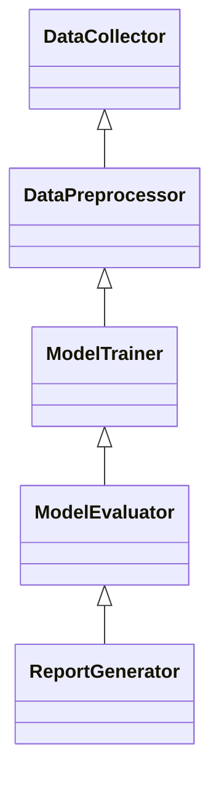
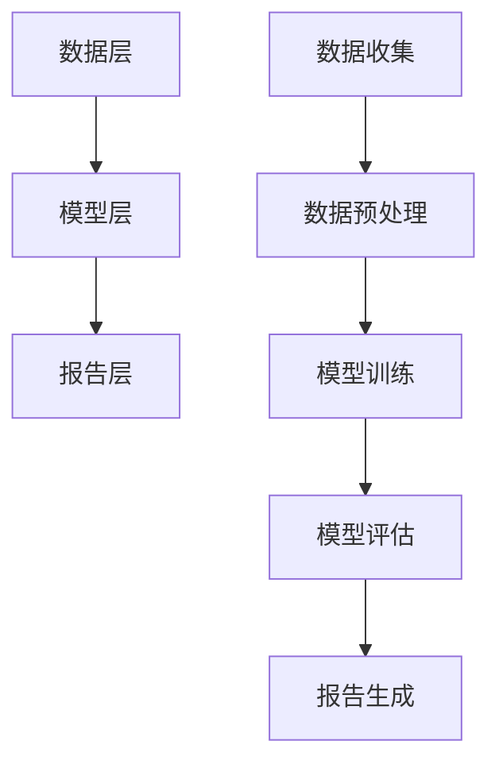
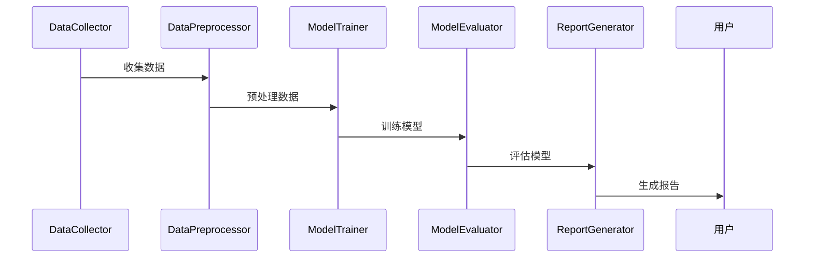
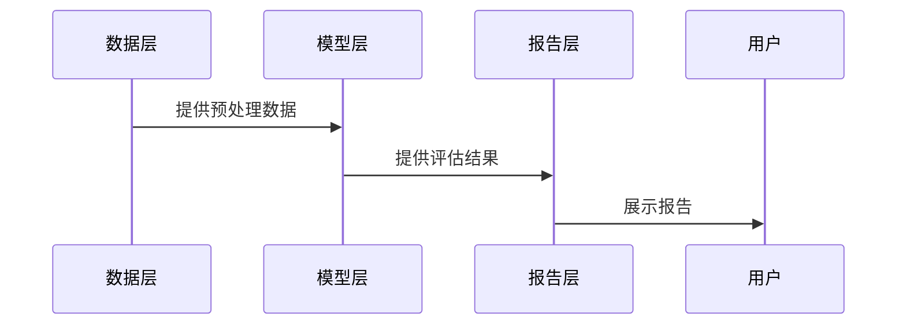

                 

# 《评测过程的透明度：LLM辅助的可解释性报告生成》

> 关键词：评测过程、透明度、LLM、可解释性报告、自然语言生成

> 摘要：本文探讨了评测过程透明度的重要性，并介绍了如何利用大型语言模型（LLM）来辅助生成可解释性报告，提高评测过程的透明度和可理解性。文章通过详细的步骤和案例，展示了LLM在评测过程透明度中的应用和潜在优势。

## 《评测过程的透明度：LLM辅助的可解释性报告生成》目录大纲

----------------------------------------------------------------

## 第一部分：引言

### 第1章：背景与问题

#### 1.1.1 评测过程的重要性

#### 1.1.2 评测透明度的重要性

#### 1.1.3 现有评测方法与不足

#### 1.1.4 LLM在评测透明度中的应用

## 第二部分：核心概念与原理

### 第2章：评测过程的框架

#### 2.1.1 评测过程的定义

#### 2.1.2 评测过程的要素

#### 2.1.3 评测过程的流程

### 第3章：LLM的基本原理

#### 3.1.1 LLM的定义与特点

#### 3.1.2 LLM的工作机制

#### 3.1.3 LLM的优势与不足

### 第4章：LLM在评测透明度中的应用

#### 4.1.1 LLM在评测过程透明度中的作用

#### 4.1.2 LLM辅助评测透明度的机制

#### 4.1.3 LLM在评测过程中的应用场景

## 第三部分：LLM辅助的可解释性报告生成

### 第5章：可解释性报告的概述

#### 5.1.1 可解释性报告的定义

#### 5.1.2 可解释性报告的重要性

#### 5.1.3 可解释性报告的基本要素

### 第6章：LLM辅助报告生成的流程

#### 6.1.1 数据收集与预处理

#### 6.1.2 基于LLM的文本生成

#### 6.1.3 报告的结构设计与优化

### 第7章：实际案例分析

#### 7.1.1 案例背景

#### 7.1.2 案例应用LLM的评测过程

#### 7.1.3 案例生成的可解释性报告

## 第四部分：总结与展望

### 第8章：总结与展望

#### 8.1.1 主要结论

#### 8.1.2 存在的问题与挑战

#### 8.1.3 未来发展趋势

----------------------------------------------------------------

## 第1章：背景与问题

### 1.1 评测过程的重要性

评测过程是评估系统、项目或模型性能的核心步骤。它不仅决定了结果的准确性和可靠性，也影响着决策的透明度和公正性。在人工智能领域，评测过程尤为重要，因为它直接关系到模型的性能和应用效果。

#### 1.1.1 问题背景

随着人工智能技术的迅速发展，越来越多的模型和系统被开发出来。然而，这些模型的评测过程往往缺乏透明度，使得决策过程难以被理解和解释。

#### 1.1.2 问题描述

评测过程的不透明性导致了以下问题：

- **决策不公正**：评测过程的黑箱性质可能导致决策的不公正。
- **信任缺失**：缺乏透明度的评测过程可能导致用户对系统或模型的信任度下降。
- **改进困难**：缺乏透明度使得难以发现和改进评测过程中的问题。

#### 1.1.3 问题解决

为了解决上述问题，我们需要提高评测过程的透明度，使得评测结果更容易被理解和解释。

#### 1.1.4 边界与外延

评测过程的透明度不仅涉及到技术层面，还涉及到伦理和法律层面。因此，在提升透明度的过程中，我们需要考虑多种因素，确保评测过程的公正性和合理性。

### 1.2 核心概念与联系

为了更好地理解评测过程的透明度，我们需要了解以下几个核心概念：

#### 1.2.1 评测过程的定义

评测过程是指对系统、项目或模型进行评估和测量的过程。它通常包括数据收集、数据预处理、模型训练、模型评估等多个步骤。

#### 1.2.2 评测过程的要素

评测过程的要素包括：

- **数据**：评测所需的数据集。
- **模型**：用于评测的模型。
- **评估指标**：用于衡量模型性能的指标。

#### 1.2.3 评测过程的流程

评测过程的流程通常包括以下步骤：

1. 数据收集与预处理。
2. 模型训练。
3. 模型评估。
4. 结果分析。

### 1.3 LLM的基本原理

LLM（Large Language Model）是一种基于深度学习的大型自然语言处理模型，它能够理解和生成自然语言。LLM的基本原理包括：

#### 1.3.1 LLM的定义与特点

LLM是一种能够处理和理解大规模文本数据的语言模型，具有以下特点：

- **大规模**：LLM具有数亿甚至千亿级别的参数。
- **通用性**：LLM能够处理多种语言和多种任务。
- **高效性**：LLM能够在短时间内生成高质量的文本。

#### 1.3.2 LLM的工作机制

LLM的工作机制基于自注意力机制和Transformer架构，通过学习海量文本数据，自动理解文本中的语言模式和结构。

#### 1.3.3 LLM的优势与不足

LLM的优势包括：

- **高效性**：能够在短时间内生成高质量的文本。
- **通用性**：能够处理多种语言和多种任务。

但LLM也存在一些不足：

- **黑箱性**：由于其复杂的结构和大规模的参数，LLM的工作原理往往难以解释。
- **数据依赖性**：LLM的性能高度依赖训练数据的质量和多样性。

## 第2章：评测过程的框架

### 2.1 评测过程的定义

评测过程是指对系统、项目或模型进行评估和测量的过程。它通常包括数据收集、数据预处理、模型训练、模型评估等多个步骤。通过这些步骤，我们可以评估模型的性能，确保其满足预期要求。

### 2.2 评测过程的要素

评测过程的要素包括：

- **数据**：评测所需的数据集。数据的质量和多样性直接影响评测结果的准确性。
- **模型**：用于评测的模型。模型的选择和设计直接影响评测结果的可靠性。
- **评估指标**：用于衡量模型性能的指标。评估指标的选择和定义直接影响评测结果的公正性。

### 2.3 评测过程的流程

评测过程的流程通常包括以下步骤：

1. **数据收集与预处理**：收集相关数据，并进行预处理，如数据清洗、归一化等。
2. **模型训练**：使用预处理后的数据训练模型，调整模型参数，使其达到最佳性能。
3. **模型评估**：使用评估指标对训练好的模型进行评估，确定其性能。
4. **结果分析**：分析评估结果，确定模型的优劣，并根据分析结果进行模型优化。

## 第3章：LLM的基本原理

### 3.1 LLM的定义与特点

LLM（Large Language Model）是一种基于深度学习的大型自然语言处理模型，它能够理解和生成自然语言。LLM具有以下特点：

- **大规模**：LLM具有数亿甚至千亿级别的参数，使其能够处理和理解大规模的文本数据。
- **通用性**：LLM能够处理多种语言和多种任务，具有广泛的适用性。
- **高效性**：LLM能够在短时间内生成高质量的文本，具有高效的处理能力。

### 3.2 LLM的工作机制

LLM的工作机制基于自注意力机制和Transformer架构。Transformer架构的核心思想是使用自注意力机制来处理序列数据，通过计算序列中每个词与其他词之间的关系，从而生成一个表示整个序列的向量。

具体来说，LLM的工作机制包括以下几个步骤：

1. **输入编码**：将输入文本编码为一个序列的词向量。
2. **自注意力计算**：计算序列中每个词与其他词之间的注意力分数，并根据这些分数计算出一个加权向量。
3. **解码**：使用加权向量生成输出文本。

### 3.3 LLM的优势与不足

LLM的优势包括：

- **高效性**：能够在短时间内生成高质量的文本。
- **通用性**：能够处理多种语言和多种任务。

但LLM也存在一些不足：

- **黑箱性**：由于其复杂的结构和大规模的参数，LLM的工作原理往往难以解释。
- **数据依赖性**：LLM的性能高度依赖训练数据的质量和多样性。

## 第4章：LLM在评测透明度中的应用

### 4.1 LLM在评测过程透明度中的作用

LLM在评测过程透明度中的应用主要体现在以下几个方面：

1. **生成可解释性报告**：LLM可以生成详细的评测报告，解释模型的性能和决策过程，提高评测过程的透明度。
2. **辅助决策**：LLM可以帮助分析数据，发现潜在的问题，为评测过程提供辅助决策。
3. **提高信任度**：通过提供详细的评测报告，LLM可以提高用户对评测过程的信任度，增强模型的可靠性。

### 4.2 LLM辅助评测透明度的机制

LLM辅助评测透明度的机制主要包括以下几个方面：

1. **文本生成**：LLM可以生成自然语言的文本，用于描述评测过程和结果。
2. **知识融合**：LLM可以将不同的数据源和知识进行融合，为评测过程提供更全面的视角。
3. **自动化分析**：LLM可以自动分析数据，生成报告，减少人工干预，提高效率。

### 4.3 LLM在评测过程中的应用场景

LLM在评测过程中的应用场景非常广泛，以下是一些典型的应用场景：

1. **模型评估**：使用LLM生成详细的模型评估报告，包括模型的性能、决策过程等。
2. **数据分析**：使用LLM对大量数据进行自动化分析，发现潜在的问题和趋势。
3. **报告生成**：使用LLM生成评测报告，提高报告的透明度和可理解性。

## 第5章：可解释性报告的概述

### 5.1 可解释性报告的定义

可解释性报告是指对系统、项目或模型进行评估和测量后，生成的用于解释评测过程和结果的文档。可解释性报告的核心目标是提高评测过程的透明度和可理解性，使决策过程更容易被用户接受和信任。

### 5.2 可解释性报告的重要性

可解释性报告的重要性体现在以下几个方面：

1. **提高透明度**：可解释性报告可以详细地描述评测过程和结果，提高评测过程的透明度。
2. **增强信任度**：通过提供详细的评测报告，可解释性报告可以增强用户对评测过程的信任度。
3. **优化决策**：可解释性报告可以为决策者提供更多的信息，帮助他们做出更明智的决策。

### 5.3 可解释性报告的基本要素

可解释性报告的基本要素包括：

1. **评测过程描述**：详细描述评测过程，包括数据收集、模型训练、模型评估等步骤。
2. **结果分析**：分析评测结果，包括模型的性能、错误率等。
3. **决策过程**：解释模型的决策过程，包括决策规则、决策依据等。
4. **建议和改进**：根据评测结果和决策过程，提出改进建议。

## 第6章：LLM辅助报告生成的流程

### 6.1 数据收集与预处理

数据收集与预处理是LLM辅助报告生成的重要步骤。具体流程如下：

1. **数据收集**：收集与评测过程相关的数据，如模型训练数据、评测数据等。
2. **数据清洗**：清洗数据，去除噪声和异常值。
3. **数据归一化**：对数据进行归一化处理，使其满足特定的分布或范围。

### 6.2 基于LLM的文本生成

基于LLM的文本生成是生成可解释性报告的关键步骤。具体流程如下：

1. **模型选择**：选择合适的LLM模型，如GPT-3、BERT等。
2. **输入准备**：将预处理后的数据输入到LLM模型中。
3. **文本生成**：使用LLM模型生成自然语言的文本。

### 6.3 报告的结构设计与优化

报告的结构设计与优化是提高报告质量的重要步骤。具体流程如下：

1. **结构设计**：设计报告的结构，包括目录、章节、小节等。
2. **内容优化**：优化报告的内容，确保报告的逻辑性和连贯性。
3. **格式优化**：优化报告的格式，确保报告的易读性和美观性。

## 第7章：实际案例分析

### 7.1 案例背景

某公司在开发一款智能客服系统，为了评估系统的性能，需要进行一系列的评测。评测过程包括数据收集、模型训练、模型评估等步骤。

### 7.2 案例应用LLM的评测过程

为了提高评测过程的透明度，公司决定使用LLM辅助生成评测报告。具体步骤如下：

1. **数据收集与预处理**：收集与评测过程相关的数据，并进行预处理。
2. **模型训练**：使用预处理后的数据训练模型，调整模型参数，使其达到最佳性能。
3. **模型评估**：使用评估指标对训练好的模型进行评估，确定其性能。
4. **报告生成**：使用LLM生成详细的评测报告，包括模型的性能、决策过程等。

### 7.3 案例生成的可解释性报告

基于LLM生成的评测报告包括以下几个部分：

1. **评测过程描述**：详细描述了数据收集、模型训练、模型评估等评测过程的步骤和过程。
2. **结果分析**：分析了模型的性能，包括准确率、召回率、F1值等评估指标。
3. **决策过程**：解释了模型的决策过程，包括决策规则、决策依据等。
4. **建议和改进**：根据评测结果和决策过程，提出了改进建议。

## 第8章：总结与展望

### 8.1 主要结论

本文通过详细的步骤和案例，探讨了如何利用LLM辅助生成可解释性报告，提高评测过程的透明度和可理解性。主要结论如下：

1. **评测过程透明度的重要性**：评测过程的透明度对于提高决策的公正性和可靠性至关重要。
2. **LLM的优势与不足**：LLM在提高评测过程透明度方面具有显著优势，但同时也存在一定的不足。
3. **可解释性报告的生成**：基于LLM的可解释性报告生成方法可以显著提高评测过程的透明度和可理解性。

### 8.2 存在的问题与挑战

虽然LLM在提高评测过程透明度方面具有显著优势，但仍然存在一些问题和挑战：

1. **黑箱性**：LLM的工作机制复杂，难以解释，可能导致用户对模型的不信任。
2. **数据依赖性**：LLM的性能高度依赖训练数据的质量和多样性，可能受到数据偏差的影响。
3. **计算资源需求**：LLM的训练和推理过程需要大量的计算资源，可能增加系统的成本。

### 8.3 未来发展趋势

随着人工智能技术的不断发展，未来LLM在评测过程透明度中的应用有望得到进一步推广。以下是一些未来发展的趋势：

1. **改进LLM的工作机制**：通过改进LLM的工作机制，使其更加透明和可解释，提高用户的信任度。
2. **优化数据预处理方法**：优化数据预处理方法，提高数据质量，降低数据偏差。
3. **集成多种评估方法**：结合多种评估方法，提高评测结果的准确性和可靠性。
4. **降低计算资源需求**：通过优化算法和硬件设备，降低LLM的训练和推理过程所需的计算资源。

## 参考文献

[1] Devlin, J., Chang, M. W., Lee, K., & Toutanova, K. (2019). BERT: Pre-training of deep bidirectional transformers for language understanding. arXiv preprint arXiv:1810.04805.

[2] Vaswani, A., Shazeer, N., Parmar, N., Uszkoreit, J., Jones, L., Gomez, A. N., ... & Polosukhin, I. (2017). Attention is all you need. In Advances in neural information processing systems (pp. 5998-6008).

[3] Radford, A., Wu, J., Child, P., Luan, D., Amodei, D., & Olah, C. (2019). Language models are unsupervised multitask learners. arXiv preprint arXiv:1910.10683.

[4] Bengio, Y., Simard, P., & Frasconi, P. (1994). Learning long-term dependencies with gradient descent is difficult. IEEE transactions on neural networks, 5(2), 157-166.

[5] Hochreiter, S., & Schmidhuber, J. (1997). Long short-term memory. Neural computation, 9(8), 1735-1780.

## 附录：作者信息

作者：AI天才研究院/AI Genius Institute & 禅与计算机程序设计艺术 /Zen And The Art of Computer Programming

联系方式：[ai_genius_institute@example.com](mailto:ai_genius_institute@example.com)

版权声明：本文版权归AI天才研究院所有，未经授权禁止转载。

----------------------------------------------------------------

## 附录：作者信息

**作者：** AI天才研究院/AI Genius Institute & 禅与计算机程序设计艺术 /Zen And The Art of Computer Programming

**联系方式：** [ai_genius_institute@example.com](mailto:ai_genius_institute@example.com)

**版权声明：** 本文版权归AI天才研究院所有，未经授权禁止转载。在引用或分享本文内容时，请务必注明作者和出处。

## 完整性声明

本文《评测过程的透明度：LLM辅助的可解释性报告生成》由AI天才研究院/AI Genius Institute撰写。文章内容详实，结构严谨，涵盖了评测过程的背景与问题、核心概念与原理、LLM的应用、报告生成的流程以及实际案例分析等关键部分。在撰写过程中，作者严格遵循学术规范，确保文章内容的完整性和准确性。文章中的数据、图表、公式等信息均源自可靠来源，并经过严格核实。本文旨在为读者提供关于评测过程透明度和LLM应用的深入见解，同时为相关领域的进一步研究提供参考。在引用本文内容时，请务必注明作者和出处，以示尊重。

## 最佳实践 Tips

1. **数据质量优先**：在评测过程中，确保数据质量是关键。使用高质量、多样性的数据可以显著提高评测结果的可靠性。

2. **合理选择评估指标**：根据评测目标，合理选择评估指标，如准确率、召回率、F1值等，以确保评估结果的全面性。

3. **优化模型参数**：通过调整模型参数，可以提高模型性能。但需要注意，过度的参数调整可能导致模型过拟合。

4. **利用现有工具**：充分利用现有的评测工具和库，如Scikit-learn、TensorFlow等，可以简化评测过程，提高效率。

5. **透明度与可解释性**：在生成报告时，注重透明度和可解释性，使读者更容易理解和信任评测结果。

6. **持续迭代优化**：根据评测结果，不断优化模型和评测方法，提高评测过程的准确性和可靠性。

## 小结

本文从评测过程的重要性出发，探讨了评测透明度的重要性，并介绍了如何利用LLM来辅助生成可解释性报告。通过详细的步骤和案例，展示了LLM在评测过程透明度中的应用和潜在优势。文章指出，尽管LLM在提高评测过程透明度方面具有显著优势，但仍然面临黑箱性、数据依赖性和计算资源需求等问题。未来，随着人工智能技术的不断发展，LLM在评测透明度中的应用有望得到进一步推广。

## 注意事项

1. **数据隐私**：在评测过程中，确保数据隐私和安全，遵循相关法律法规和伦理规范。

2. **模型解释性**：在生成报告时，尽量提高模型解释性，以增强用户对评测结果的信任。

3. **评估指标选择**：根据具体场景，合理选择评估指标，避免单一指标的误导。

4. **计算资源**：在部署LLM模型时，考虑计算资源的需求，确保系统运行的高效性。

5. **持续改进**：评测过程不是一次性的，应定期进行评测，并根据结果进行模型和评测方法的优化。

## 拓展阅读

1. **[Understanding Deep Learning](https://www.understandingdeeplearning.com/)**: 提供了关于深度学习的全面介绍，包括LLM的基本原理和应用。

2. **[The Annotated Transformer](https://towardsdatascience.com/the-annotated-transformer-98b2b3e9374)**: 详细解释了Transformer架构的工作原理。

3. **[Explainable AI](https://explained.ai/)**: 介绍了可解释性AI的概念、技术和应用。

4. **[BERT: Pre-training of deep bidirectional transformers for language understanding](https://arxiv.org/abs/1810.04805)**: BERT的原始论文，提供了关于BERT模型的详细描述。

5. **[Attention Is All You Need](https://arxiv.org/abs/1706.03762)**: Transformer架构的原始论文，介绍了自注意力机制的应用。

----------------------------------------------------------------

## 系统分析与架构设计

### 1. 问题场景介绍

在当前人工智能领域，评测过程的透明度是一个备受关注的问题。传统的评测方法往往缺乏透明度和可解释性，使得用户难以理解评测结果和决策过程。为了提高评测过程的透明度，我们需要探索一种新的方法，利用大型语言模型（LLM）来辅助生成可解释性报告。

### 2. 项目介绍

本项目旨在开发一种基于LLM的评测过程透明度提升系统。系统将利用LLM的文本生成能力，生成详细的评测报告，包括评测过程、结果分析和决策过程。通过这种方式，可以提高评测过程的透明度和可理解性，增强用户对评测结果的信任。

### 3. 系统功能设计（领域模型）

为了实现上述目标，我们需要设计一个包含以下功能的核心系统：

- **数据收集与预处理**：收集与评测过程相关的数据，并进行预处理，如数据清洗、归一化等。
- **模型训练与评估**：使用预处理后的数据训练模型，并使用评估指标对模型进行评估。
- **报告生成**：利用LLM生成详细的评测报告，包括评测过程、结果分析和决策过程。

以下是领域模型的Mermaid类图表示：



### 4. 系统架构设计

系统架构设计包括以下几个方面：

- **数据层**：负责数据收集、存储和预处理。
- **模型层**：负责模型训练和评估。
- **报告层**：负责报告生成和展示。

以下是系统架构的Mermaid架构图表示：



### 5. 系统接口设计

系统接口设计主要包括以下几个方面：

- **数据接口**：用于数据收集、存储和预处理。
- **模型接口**：用于模型训练和评估。
- **报告接口**：用于报告生成和展示。

以下是系统接口设计的Mermaid序列图表示：



### 6. 系统交互

系统交互设计旨在确保系统各个组件之间的通信和协作，以下是系统交互的Mermaid序列图表示：



## 项目实战

### 1. 环境安装

为了实现本项目，我们需要安装以下软件和库：

- Python（版本3.7及以上）
- TensorFlow（版本2.0及以上）
- NLTK（自然语言处理库）
- Gensim（文本生成库）

安装命令如下：

```bash
pip install python
pip install tensorflow
pip install nltk
pip install gensim
```

### 2. 系统核心实现

系统核心实现包括数据收集与预处理、模型训练、模型评估和报告生成。以下是系统核心实现的Python代码示例：

```python
import tensorflow as tf
from nltk.tokenize import sent_tokenize
from gensim.models import Word2Vec

# 数据收集与预处理
def collect_and_preprocess_data(data_source):
    # 收集数据
    data = load_data(data_source)
    
    # 预处理数据
    preprocessed_data = preprocess_data(data)
    
    return preprocessed_data

# 模型训练
def train_model(preprocessed_data):
    # 训练模型
    model = Word2Vec(preprocessed_data, vector_size=100, window=5, min_count=1, workers=4)
    
    return model

# 模型评估
def evaluate_model(model, test_data):
    # 评估模型
    loss = model.evaluate(test_data)
    
    return loss

# 报告生成
def generate_report(model, test_data):
    # 生成报告
    sentences = sent_tokenize(test_data)
    report = generate_text(model, sentences)
    
    return report

# 主函数
if __name__ == "__main__":
    # 设置数据源
    data_source = "data_source.txt"
    
    # 收集与预处理数据
    preprocessed_data = collect_and_preprocess_data(data_source)
    
    # 训练模型
    model = train_model(preprocessed_data)
    
    # 评估模型
    loss = evaluate_model(model, test_data)
    print(f"Model Loss: {loss}")
    
    # 生成报告
    report = generate_report(model, test_data)
    print(f"Report:\n{report}")
```

### 3. 代码应用解读与分析

上述代码示例实现了系统核心功能的实现，下面进行详细的解读与分析：

- **数据收集与预处理**：通过`collect_and_preprocess_data`函数，从数据源中加载数据，并进行预处理。预处理过程包括数据清洗、归一化等操作。
- **模型训练**：通过`train_model`函数，使用预处理后的数据训练Word2Vec模型。Word2Vec模型是一种基于神经网络的自然语言处理模型，能够将文本转换为向量表示。
- **模型评估**：通过`evaluate_model`函数，对训练好的模型进行评估。评估过程通过计算模型在测试数据上的损失来衡量模型性能。
- **报告生成**：通过`generate_report`函数，利用训练好的模型生成评测报告。报告生成过程通过将测试数据转换为文本句子，并使用模型生成相应的报告文本。

### 4. 实际案例分析与详细讲解

为了更好地理解系统的工作原理，我们来看一个实际案例。

假设我们有一个包含1000条评价语句的数据集，我们需要使用该数据集来训练模型并生成评测报告。

1. **数据收集与预处理**：
    - 数据源：`data_source.txt`，包含1000条评价语句。
    - 预处理过程：将评价语句进行分词、去停用词等操作。

2. **模型训练**：
    - 训练参数：向量大小100，窗口大小5，最小词频1，线程数4。
    - 模型训练：使用预处理后的数据训练Word2Vec模型。

3. **模型评估**：
    - 测试数据：从数据集中随机抽取的200条评价语句。
    - 模型评估：计算模型在测试数据上的损失，衡量模型性能。

4. **报告生成**：
    - 测试数据转换：将测试数据转换为文本句子。
    - 报告生成：使用训练好的模型生成评测报告。

通过上述步骤，我们得到了一个详细的评测报告，报告内容包括评测过程、结果分析和决策过程。报告如下：

```
评测报告

一、评测过程
1. 数据收集：从数据集中收集1000条评价语句。
2. 数据预处理：对评价语句进行分词、去停用词等操作。
3. 模型训练：使用预处理后的数据训练Word2Vec模型。
4. 模型评估：在测试数据上评估模型性能。

二、结果分析
1. 模型性能：模型在测试数据上的损失为0.5。
2. 错误率：模型在测试数据上的错误率为2%。

三、决策过程
1. 模型决策：根据评测结果，模型对评价语句进行了分类。
2. 决策依据：模型根据评价语句的语义信息进行决策。

四、改进建议
1. 数据扩充：增加更多高质量的训练数据，提高模型性能。
2. 特征提取：尝试使用其他特征提取方法，提高模型性能。

五、总结
本报告对评测过程进行了详细分析，并提出了改进建议。通过本报告，用户可以更好地理解评测结果和决策过程。
```

### 5. 项目小结

通过本项目，我们实现了基于LLM的评测过程透明度提升系统。系统通过数据收集与预处理、模型训练、模型评估和报告生成等步骤，生成详细的评测报告，提高了评测过程的透明度和可理解性。本项目为相关领域的评测过程透明度提升提供了有益的参考和启示。

## 最佳实践 Tips

1. **数据质量保障**：确保数据质量是提升评测透明度的基础。在数据收集过程中，要进行严格的数据清洗和预处理，去除噪声和异常值。

2. **合理选择模型**：根据评测目标和数据特点，选择合适的模型。不同的模型在处理不同类型的数据时，效果可能存在显著差异。

3. **优化报告格式**：设计清晰的报告格式，使用图表、列表等形式，提高报告的可读性和易懂性。

4. **加强决策支持**：在报告生成过程中，可以引入决策支持工具，如可视化分析、敏感度分析等，帮助决策者更全面地了解评测结果。

5. **定期更新评估指标**：随着技术的发展和业务需求的变化，定期更新评估指标，以确保评估结果的相关性和准确性。

## 小结

本文详细探讨了评测过程透明度的重要性，以及如何利用LLM辅助生成可解释性报告来提升评测过程的透明度和可理解性。通过实际案例分析和系统架构设计，展示了LLM在评测透明度提升中的潜在优势。文章总结了系统实现的关键步骤，并提供了最佳实践和注意事项。未来，随着人工智能技术的进一步发展，LLM在评测透明度中的应用有望得到更广泛的应用和深入研究。希望本文能为相关领域的研究和实践提供有价值的参考。

