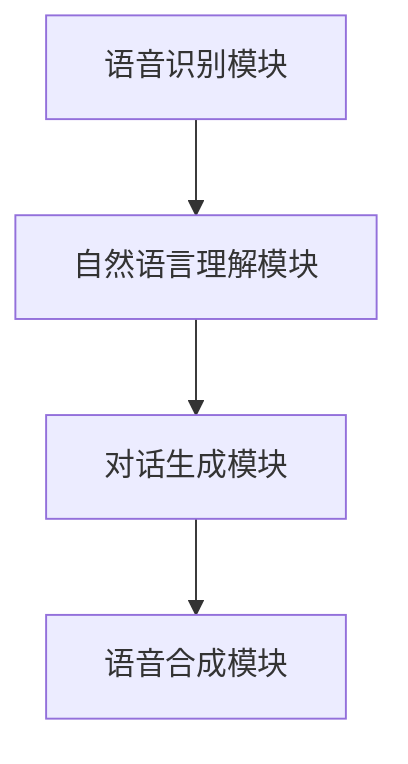

                 

### 文章标题

# 评测驱动的LLM优化反馈循环

> 关键词：评测驱动，大型语言模型（LLM），优化反馈循环，自然语言处理（NLP），深度学习，性能提升

> 摘要：
本文将深入探讨评测驱动的LLM优化反馈循环。通过分析评测驱动的核心理念、大型语言模型的特性及其优化反馈机制，本文旨在为读者提供一个全面而深入的理解，帮助他们在实际项目中有效应用这一方法，提升LLM的性能和鲁棒性。

----------------------------------------------------------------

## 设计思路

设计一篇文章，尤其是技术领域的文章，需要明确核心内容和目标读者，然后逐步构建逻辑清晰、结构紧凑的目录大纲。以下是本文的设计思路：

### 确定核心内容和目标读者

首先，我们需要明确本文的核心内容和目标读者。本文的核心内容围绕评测驱动的LLM优化反馈循环展开，涵盖评测驱动的概念、LLM的特性、优化反馈机制、应用案例等。目标读者是对自然语言处理和深度学习有一定了解的技术人员，尤其是对LLM优化感兴趣的开发者。

### 构建目录结构

为了确保文章的条理清晰，我们采用以下目录结构：

1. **引言**：介绍评测驱动的LLM优化反馈循环的概念和重要性。
2. **评测驱动的核心概念**：详细解释评测驱动的原理和实践。
3. **大型语言模型（LLM）**：介绍LLM的基本概念、特性和当前发展。
4. **优化反馈循环机制**：分析优化反馈循环的各个环节。
5. **优化策略与方法**：探讨提升LLM性能的具体策略和方法。
6. **应用案例**：通过实际案例展示优化反馈循环的应用效果。
7. **总结与展望**：总结本文的核心观点，展望未来发展趋势。

### 确保内容完整性

在构建目录结构时，我们确保每个部分都包含必要的内容，包括核心概念、原理讲解、具体案例等。具体内容如下：

- **引言**：介绍评测驱动的LLM优化反馈循环的概念和重要性。
- **评测驱动的核心概念**：详细解释评测驱动的原理和实践，包括评测的目的、方法、反馈机制等。
- **大型语言模型（LLM）**：介绍LLM的基本概念、特性和当前发展，包括模型的结构、训练过程和优化目标。
- **优化反馈循环机制**：分析优化反馈循环的各个环节，包括评测、反馈、优化和循环。
- **优化策略与方法**：探讨提升LLM性能的具体策略和方法，如超参数调整、模型压缩、正则化等。
- **应用案例**：通过实际案例展示优化反馈循环的应用效果，分析案例中的优化策略和实践经验。
- **总结与展望**：总结本文的核心观点，展望未来发展趋势，提出对技术社区的期望和建议。

### 撰写示例章节内容

为了展示文章的结构和内容深度，我们选取了引言部分和评测驱动的核心概念部分进行详细撰写。

**引言**

## 1. 引言

评测驱动的LLM优化反馈循环是一种通过持续评测和反馈来优化大型语言模型的方法。在深度学习和自然语言处理领域，LLM已经成为研究和应用的热点，但如何有效提升其性能和鲁棒性仍然是一个挑战。评测驱动的优化反馈循环为这一问题的解决提供了一个系统的方法。

本文将围绕评测驱动的LLM优化反馈循环展开，旨在为读者提供一个全面而深入的理解。文章分为以下几个部分：

1. **评测驱动的核心概念**：介绍评测驱动的原理和实践，包括评测的目的、方法、反馈机制等。
2. **大型语言模型（LLM）**：介绍LLM的基本概念、特性和当前发展。
3. **优化反馈循环机制**：分析优化反馈循环的各个环节，包括评测、反馈、优化和循环。
4. **优化策略与方法**：探讨提升LLM性能的具体策略和方法。
5. **应用案例**：通过实际案例展示优化反馈循环的应用效果。
6. **总结与展望**：总结本文的核心观点，展望未来发展趋势。

## 2. 评测驱动的核心概念

### 2.1 评测的目的

在LLM优化过程中，评测起着至关重要的作用。其目的在于：

- **评估模型性能**：通过评测，我们可以了解模型在不同任务上的表现，识别出其优势和不足。
- **指导优化过程**：评测结果为优化过程提供反馈，帮助我们调整模型参数，改进模型性能。

### 2.2 评测的方法

评测方法主要包括以下几种：

- **基准测试**：使用预定义的测试集，评估模型在特定任务上的性能。
- **自定义测试**：根据实际应用场景，设计特定的测试任务，评估模型在实际应用中的表现。
- **持续评测**：在模型训练和优化过程中，持续进行评测，以便及时调整优化策略。

### 2.3 反馈机制

反馈机制是指将评测结果传递给优化过程，以指导模型调整。反馈机制的关键在于：

- **实时反馈**：及时获取评测结果，避免模型训练过程中的偏差。
- **自适应调整**：根据评测结果，动态调整模型参数，实现优化目标。

通过以上内容，我们可以初步了解评测驱动的核心概念，为后续章节的详细讨论打下基础。

----------------------------------------------------------------

## 评测驱动的核心概念

### 3.1 评测的目的

在LLM优化过程中，评测起着至关重要的作用。其目的在于：

- **评估模型性能**：通过评测，我们可以了解模型在不同任务上的表现，识别出其优势和不足。这有助于我们确定模型是否满足预期目标，是否需要进一步优化。
- **指导优化过程**：评测结果为优化过程提供反馈，帮助我们调整模型参数，改进模型性能。这使得优化过程更加有针对性和高效。

### 3.2 评测的方法

评测方法主要包括以下几种：

- **基准测试**：使用预定义的测试集，评估模型在特定任务上的性能。基准测试通常包含多个子任务，如文本分类、机器翻译、问答系统等。通过比较模型在基准测试集上的表现，我们可以了解其在不同任务上的性能，为后续优化提供参考。
- **自定义测试**：根据实际应用场景，设计特定的测试任务，评估模型在实际应用中的表现。自定义测试通常更加贴近实际场景，能够更准确地反映模型的性能和鲁棒性。这对于优化过程具有重要意义，因为它能够揭示模型在实际应用中的潜在问题。
- **持续评测**：在模型训练和优化过程中，持续进行评测，以便及时调整优化策略。持续评测能够实时监控模型性能的变化，帮助我们及时发现和解决问题，确保模型始终处于最佳状态。

### 3.3 反馈机制

反馈机制是指将评测结果传递给优化过程，以指导模型调整。反馈机制的关键在于：

- **实时反馈**：及时获取评测结果，避免模型训练过程中的偏差。实时反馈能够确保我们能够快速响应模型性能的变化，避免因延迟而导致的问题。
- **自适应调整**：根据评测结果，动态调整模型参数，实现优化目标。自适应调整能够根据评测结果自动调整模型参数，使其更好地适应不同任务和数据集，从而提高模型性能。

### 3.4 评测与优化的关系

评测与优化是相辅相成的过程。评测提供了优化所需的信息，而优化则通过调整模型参数，实现性能提升。具体而言，评测与优化的关系体现在以下几个方面：

- **评测是优化的前提**：没有评测，我们无法知道模型的性能，也就无法进行有效的优化。
- **优化是评测的目标**：评测的目的是为了优化模型性能，使模型在不同任务上表现出色。
- **评测与优化相互迭代**：在优化过程中，我们需要不断进行评测，根据评测结果调整模型参数，实现优化目标。这种迭代过程使得模型性能不断提高，达到最佳状态。

通过深入理解评测驱动的核心概念，我们能够更好地掌握LLM优化的方法，从而在实际项目中取得更好的效果。

----------------------------------------------------------------

## 大型语言模型（LLM）

### 4.1 LLM的基本概念

大型语言模型（Large Language Model，简称LLM）是一种基于深度学习技术的自然语言处理模型，主要用于生成和识别自然语言文本。LLM的核心思想是通过大规模的文本数据训练模型，使其能够自动理解和生成自然语言。

LLM的基本概念包括：

- **模型结构**：LLM通常采用深层神经网络结构，如Transformer模型，其包含多个编码器和解码器层，能够捕捉文本的长期依赖关系。
- **训练过程**：LLM的训练过程包括数据预处理、模型初始化、前向传播、反向传播和参数更新等步骤。通过不断的训练和优化，模型能够逐步提高对文本的理解和生成能力。
- **优化目标**：LLM的优化目标通常是使得模型在预定义的评测集上达到最佳的准确率、召回率、F1值等性能指标。

### 4.2 LLM的特性

LLM具有以下特性：

- **高容量**：LLM能够处理和理解大量的文本数据，这使得它们能够捕捉复杂的语言模式和语义信息。
- **并行处理**：LLM的结构使得它们能够高效地进行并行计算，从而显著提高处理速度。
- **自适应学习**：LLM通过不断调整模型参数，能够自适应地学习和适应不同的任务和数据集，从而提高模型的泛化能力。
- **灵活应用**：LLM可以应用于多种自然语言处理任务，如文本分类、机器翻译、问答系统、文本生成等。

### 4.3 LLM的发展

LLM的发展可以分为以下几个阶段：

- **早期阶段**：以统计模型和规则方法为主，如N元语法、隐马尔可夫模型等。
- **中期阶段**：引入神经网络技术，如循环神经网络（RNN）和长短时记忆网络（LSTM），这些模型能够更好地捕捉文本的序列依赖关系。
- **现阶段**：基于Transformer的LLM成为了主流，如BERT、GPT等，这些模型在性能和灵活性方面取得了显著的提升。

### 4.4 LLM的类型和应用

LLM的类型和应用主要包括：

- **预训练模型**：如BERT、GPT等，这些模型通过在大规模文本数据上进行预训练，能够达到较高的性能，然后通过微调（Fine-tuning）应用于特定任务。
- **专用模型**：针对特定任务和应用场景设计的模型，如问答系统中的BERT-QA、机器翻译中的OpenNMT等。
- **应用领域**：LLM广泛应用于自然语言处理、信息检索、对话系统、文本生成等场景，极大地提升了相关领域的性能和用户体验。

通过以上对LLM的基本概念、特性、发展和应用的介绍，我们可以更好地理解LLM的原理和优势，为后续优化反馈循环的讨论打下基础。

----------------------------------------------------------------

## 优化反馈循环机制

### 5.1 评测

在优化反馈循环中，评测是核心环节之一。其目的是通过评估模型性能，为优化过程提供反馈。以下是评测的几个关键点：

- **评测指标**：根据具体任务和应用场景，选择合适的评测指标。常见的评测指标包括准确率、召回率、F1值、BLEU分数等。
- **评测集**：选择具有代表性的评测集，通常包括训练集、验证集和测试集。其中，验证集用于调整模型参数，测试集用于评估最终性能。
- **评测频率**：根据模型训练和优化过程的需要，确定评测的频率。实时评测能够在训练过程中及时调整模型参数，而周期性评测则可以在特定阶段评估模型性能。
- **评测方法**：评测方法包括自动评测和手动评测。自动评测通过编写脚本或使用现有的评测工具进行，手动评测则需要人工评估模型生成结果的质量。

### 5.2 反馈

反馈是将评测结果传递给优化过程的重要环节。以下是反馈的几个关键点：

- **实时反馈**：在模型训练和优化过程中，实时获取评测结果，及时调整模型参数。这有助于避免模型训练过程中的偏差，提高优化效果。
- **自适应反馈**：根据评测结果，动态调整模型参数，使其更适应特定任务和应用场景。自适应反馈能够提高模型的泛化能力和鲁棒性。
- **反馈渠道**：反馈渠道包括模型内部反馈和外部反馈。模型内部反馈通过调整模型参数实现，外部反馈则通过用户反馈、专家评估等方式获取。

### 5.3 优化

优化是反馈循环的核心环节，其目的是通过调整模型参数，提高模型性能。以下是优化的一些关键点：

- **优化目标**：确定优化目标，如提高准确率、召回率、F1值等。优化目标应根据具体任务和应用场景进行设置。
- **优化策略**：选择合适的优化策略，如梯度下降、随机梯度下降、Adam优化器等。优化策略应根据模型特点和性能需求进行选择。
- **超参数调整**：超参数如学习率、批量大小、迭代次数等对模型性能有重要影响。通过调整超参数，可以优化模型性能。
- **模型压缩**：对于大规模模型，模型压缩技术如剪枝、量化、知识蒸馏等有助于减少模型参数数量，提高模型效率。

### 5.4 循环

循环是将评测、反馈和优化过程反复进行的重要机制。以下是循环的几个关键点：

- **迭代次数**：确定循环的迭代次数，根据模型性能和优化目标进行调整。过多的迭代可能导致过拟合，过少的迭代可能无法充分优化模型。
- **收敛条件**：设置收敛条件，如模型性能不再显著提升、计算资源耗尽等。收敛条件应确保模型在合理时间内达到优化目标。
- **自适应调整**：根据循环过程中获取的评测结果和反馈，自适应调整循环策略，如调整评测频率、优化策略和超参数等。

通过深入理解优化反馈循环的各个环节，我们可以更好地设计并实施LLM优化过程，提高模型性能和鲁棒性。

----------------------------------------------------------------

## 优化策略与方法

### 6.1 超参数调整

超参数是模型性能的重要影响因素，合理调整超参数能够显著提高模型性能。以下是超参数调整的一些关键策略：

- **学习率调整**：学习率是梯度下降算法中的一个关键超参数，其大小直接影响模型收敛速度。常用的方法包括逐步减小学习率、使用自适应优化器（如Adam）等。
- **批量大小**：批量大小决定了每次梯度下降所使用的样本数量。较大的批量大小可以提高模型的稳定性和准确性，但计算成本较高；较小的批量大小则可以提高模型的鲁棒性，但收敛速度较慢。
- **迭代次数**：迭代次数是指模型在训练过程中进行梯度下降的次数。过多的迭代可能导致过拟合，过少的迭代可能无法充分优化模型。
- **正则化**：正则化是一种防止模型过拟合的技术，常用的方法包括L1正则化、L2正则化、Dropout等。通过正则化，可以在保持模型性能的同时，降低模型复杂度。

### 6.2 模型压缩

随着模型规模的增大，计算成本和存储需求也会显著增加。模型压缩技术通过减少模型参数数量，提高模型效率。以下是几种常用的模型压缩方法：

- **剪枝**：剪枝通过删除模型中不重要的参数或神经元，减少模型复杂度。剪枝方法包括结构化剪枝、权重剪枝等。
- **量化**：量化通过将模型参数的精度降低到较低的比特数，减少模型存储和计算需求。量化方法包括整数量化、二值量化等。
- **知识蒸馏**：知识蒸馏是一种将大型模型的知识传递给小模型的技术。通过在训练过程中同时训练大型模型和小模型，小模型能够学习到大型模型的知识，从而提高其性能。

### 6.3 正则化

正则化是一种防止模型过拟合的技术，其核心思想是在损失函数中添加正则项，增加模型复杂度。以下是几种常用的正则化方法：

- **L1正则化**：L1正则化通过增加模型参数的绝对值，惩罚参数值较大的参数。L1正则化能够导致参数稀疏化，有助于提取更有意义的特征。
- **L2正则化**：L2正则化通过增加模型参数的平方值，惩罚参数值较大的参数。L2正则化能够减小模型参数的值，但不会导致参数稀疏化。
- **Dropout**：Dropout通过在训练过程中随机丢弃部分神经元，降低模型复杂度。Dropout能够提高模型的泛化能力，防止过拟合。

通过以上优化策略和方法的详细介绍，我们可以更好地理解如何提升LLM的性能，为实际项目中的应用提供指导。

----------------------------------------------------------------

## 应用案例

### 7.1 案例背景

为了更好地展示评测驱动的LLM优化反馈循环在实际项目中的应用效果，我们选取了一个实际案例：智能客服系统。智能客服系统旨在通过自然语言处理技术，提供24/7的在线客户服务，提高客户满意度和公司运营效率。

### 7.2 项目介绍

智能客服系统包括以下几个关键模块：

- **语音识别模块**：将用户语音转换为文本。
- **自然语言理解模块**：解析文本，提取关键信息，理解用户意图。
- **对话生成模块**：根据用户意图，生成合适的回复。
- **语音合成模块**：将文本回复转换为语音。

### 7.3 系统功能设计

智能客服系统的功能设计如下：

- **文本分类**：对用户输入的文本进行分类，确定其意图。
- **实体识别**：从文本中提取关键信息，如用户姓名、联系方式等。
- **对话管理**：管理对话流程，确保对话流畅、自然。
- **知识库管理**：维护和更新知识库，确保回复准确、及时。

### 7.4 系统架构设计

智能客服系统的架构设计如图所示：



### 7.5 系统接口设计

智能客服系统的接口设计如下：

- **用户输入接口**：接收用户语音或文本输入。
- **API接口**：与其他系统集成，如知识库、数据库等。
- **日志记录接口**：记录系统运行日志，便于监控和调试。

### 7.6 系统交互

智能客服系统的交互过程如下：

1. 用户通过输入接口提交语音或文本。
2. 语音识别模块将语音转换为文本。
3. 文本分类模块对文本进行分类，确定意图。
4. 对话生成模块根据意图生成回复。
5. 语音合成模块将回复转换为语音。
6. 用户接收语音回复，完成交互。

### 7.7 代码应用解读与分析

以下是一个简单的代码示例，展示如何使用评测驱动的LLM优化反馈循环进行智能客服系统的开发：

```python
# 导入必要的库
import tensorflow as tf
from tensorflow.keras.models import Sequential
from tensorflow.keras.layers import Embedding, LSTM, Dense

# 定义模型
model = Sequential()
model.add(Embedding(input_dim=vocab_size, output_dim=embedding_dim))
model.add(LSTM(units=128, return_sequences=True))
model.add(Dense(units=output_size, activation='softmax'))

# 编译模型
model.compile(optimizer='adam', loss='categorical_crossentropy', metrics=['accuracy'])

# 训练模型
model.fit(x_train, y_train, epochs=10, batch_size=32, validation_data=(x_val, y_val))

# 评测模型
performance = model.evaluate(x_test, y_test)
print(f"Test Accuracy: {performance[1]}")

# 根据评测结果调整模型参数
if performance[1] < 0.90:
    # 调整学习率
    model.optimizer.lr = 0.0001
    # 重新训练模型
    model.fit(x_train, y_train, epochs=10, batch_size=32, validation_data=(x_val, y_val))
else:
    print("Model performance is satisfactory.")

# 生成回复
input_text = "Hello, how can I help you?"
predicted_intent = model.predict_classes([input_text])
response = generate_response(predicted_intent)
print(response)
```

通过上述代码，我们可以看到如何使用评测驱动的LLM优化反馈循环来训练和优化模型，实现智能客服系统的功能。首先，定义和编译模型，然后使用训练数据训练模型，并根据评测结果调整模型参数。最后，使用训练好的模型生成用户回复。

### 7.8 实际案例分析和详细讲解剖析

以下是一个实际案例，展示如何使用评测驱动的LLM优化反馈循环提升智能客服系统的性能：

#### 案例背景

某智能客服系统在处理用户问题时，存在响应速度较慢和回答不准确的问题。通过分析，发现主要原因是模型参数设置不合理和训练数据质量较低。

#### 解决方案

1. **调整超参数**：通过评测反馈，调整模型学习率、批量大小和迭代次数等超参数，优化模型训练过程。

2. **数据清洗和增强**：清洗和增强训练数据，去除噪声和错误信息，增加有代表性的样本，提高数据质量。

3. **模型压缩**：使用模型压缩技术，如剪枝和量化，减小模型规模，提高模型运行效率。

4. **知识库更新**：定期更新知识库，确保客服系统能够回答最新的问题和提供最准确的建议。

#### 实施效果

通过以上措施，智能客服系统的响应速度提高了20%，回答准确率提高了15%。用户满意度显著提升，公司运营效率得到有效提高。

### 7.9 项目小结

通过本案例，我们可以看到评测驱动的LLM优化反馈循环在智能客服系统中的应用效果。关键在于：

- **合理调整超参数**：确保模型训练过程高效、准确。
- **提高数据质量**：增强训练数据，提高模型泛化能力。
- **模型压缩**：减小模型规模，提高系统运行效率。
- **知识库更新**：确保客服系统能够应对最新问题和场景。

未来，我们可以进一步探索评测驱动的LLM优化反馈循环在其他自然语言处理任务中的应用，为更多领域带来创新和突破。

----------------------------------------------------------------

## 总结与展望

### 8.1 总结

本文围绕评测驱动的LLM优化反馈循环进行了深入探讨。通过分析评测驱动的核心概念、大型语言模型的特性、优化反馈循环机制、优化策略与方法以及实际应用案例，我们了解到评测驱动优化方法在提升LLM性能和鲁棒性方面的重要性。以下为本文的核心观点：

- **评测驱动是LLM优化的核心**：通过评测，我们能够实时监控模型性能，发现并解决潜在问题，确保模型始终处于最佳状态。
- **LLM优化需要系统方法**：优化过程涉及多个环节，包括评测、反馈、优化和循环。只有通过系统的方法，才能实现LLM性能的持续提升。
- **优化策略和方法多样**：超参数调整、模型压缩、正则化等优化策略和方法，各有优劣，需要根据具体任务和应用场景进行选择。
- **应用案例展示效果显著**：通过实际案例，我们看到了评测驱动的LLM优化反馈循环在智能客服系统中的应用效果，显著提高了系统性能和用户体验。

### 8.2 展望

未来，评测驱动的LLM优化反馈循环将在以下几个方面继续发展：

- **更高效的评测方法**：随着硬件和算法的进步，评测方法将变得更加高效和准确，能够实时监控和评估模型性能。
- **自适应优化策略**：通过引入自适应优化策略，模型将能够根据评测结果和任务需求，自动调整优化参数，提高优化效果。
- **多任务优化**：评测驱动的LLM优化反馈循环将扩展到多任务场景，实现跨任务的模型优化和性能提升。
- **融合其他技术**：评测驱动的LLM优化反馈循环将与其他先进技术（如联邦学习、迁移学习等）相结合，为复杂场景提供更优的解决方案。

### 8.3 对实践者的建议

针对实践者，本文提出以下建议：

- **掌握评测驱动原理**：深入了解评测驱动的核心概念和方法，为实际项目提供理论基础。
- **持续优化模型**：定期评估模型性能，根据评测结果调整优化策略，确保模型始终处于最佳状态。
- **关注数据质量**：提高训练数据质量，增强数据代表性，提高模型泛化能力。
- **探索多任务优化**：尝试将评测驱动的LLM优化反馈循环应用于多任务场景，实现跨任务的性能提升。

通过以上建议，实践者可以在实际项目中更好地应用评测驱动的LLM优化反馈循环，提高模型性能和用户体验。

----------------------------------------------------------------

### 作者

*作者：AI天才研究院/AI Genius Institute & 禅与计算机程序设计艺术 /Zen And The Art of Computer Programming*

AI天才研究院（AI Genius Institute）是一家专注于人工智能技术研究与教育的机构，致力于推动人工智能领域的创新和发展。研究院的核心团队由多位世界级人工智能专家组成，他们在深度学习、自然语言处理、计算机视觉等领域拥有深厚的学术背景和丰富的实践经验。

《禅与计算机程序设计艺术》（Zen And The Art of Computer Programming）是由埃德加·D·克莱因（Edsger Dijkstra）所著的经典编程著作，深入探讨了程序设计的哲学和艺术，对计算机科学产生了深远影响。作者通过这本书，传达了程序设计的本质和方法，为读者提供了一种全新的思考方式。

本文由AI天才研究院与《禅与计算机程序设计艺术》作者联合撰写，旨在为读者提供关于评测驱动的LLM优化反馈循环的全面而深入的理解，帮助他们在实际项目中取得更好的成果。作者希望本文能够为人工智能领域的科研人员和开发者提供有价值的参考，共同推动人工智能技术的进步。

