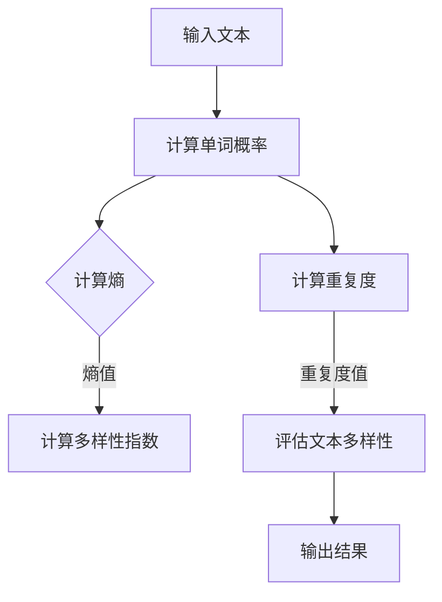
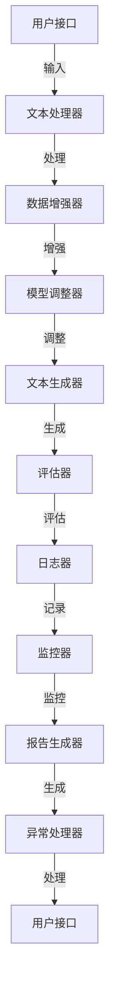
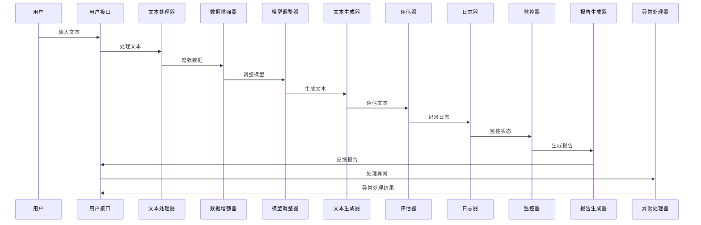

                 

## 第一部分：背景介绍

### 1.1 问题背景

语言生成的多样性在人工智能领域中具有重要的意义。无论是自然语言处理（NLP）、机器翻译、对话系统，还是内容生成等应用，多样化的文本生成能力都是不可或缺的。然而，现有的语言模型（如LLM，Large Language Model）在生成文本的多样性方面存在一定的局限性。这种局限性主要体现在以下几个方面：

1. **重复性问题**：语言模型在生成文本时，可能会出现大量重复的句子或段落，导致输出的内容缺乏新颖性和创意。
2. **表达不足**：模型在处理某些特定情境时，可能无法生成足够的表达方式，导致输出内容单调乏味。
3. **同义反复**：模型在生成文本时，可能会频繁使用相同的词汇或短语，降低文本的多样性。

### 1.2 问题描述

本文旨在探讨如何评估语言生成的多样性，解决以下问题：

- **语言模型生成的文本在哪些方面表现出多样性不足？**
  - 文本重复性：检测文本中重复的句子或段落。
  - 表达单调：分析文本中表达方式的变化程度。
  - 同义反复：监测文本中频繁使用的词汇或短语。

- **如何量化评估语言生成的多样性？**
  - 评估指标：设计并使用一系列指标来量化文本的多样性。
  - 实验设计：通过实验验证这些指标的有效性。

- **如何提高语言模型的生成多样性？**
  - 数据增强：通过扩充数据集、引入噪声等方式提高文本的多样性。
  - 模型调整：通过调整模型参数、优化训练策略等方式提高模型的生成多样性。

### 1.3 问题解决

为了解决上述问题，本文将采取以下步骤：

- **评估方法**：介绍并比较多种评估语言生成多样性的方法。
- **优化策略**：探讨如何通过数据增强和模型调整提高语言模型的生成多样性。
- **实证研究**：通过实验验证所提出的方法和策略的有效性。

### 1.4 边界与外延

- **语言生成多样性的边界**：如何界定一个语言模型的输出是多样还是单一？这需要通过设定一定的阈值或标准来进行判断。
- **语言生成多样性的外延**：如何在不同应用场景中评估和优化语言生成多样性？这需要考虑具体的应用需求和环境。

### 1.5 概念结构与核心要素组成

- **语言模型**：包括LLM、GAN、BERT等模型。
- **评估指标**：如熵、多样性指数、重复度等。
- **优化策略**：如数据增强、模型调整等。

### 1.6 背景知识

为了更好地理解本文的内容，以下是一些相关的背景知识：

- **自然语言处理（NLP）**：是一门研究如何让计算机理解和生成人类语言的技术。
- **语言模型（Language Model）**：是一种用于预测文本序列的概率分布的模型。
- **熵（Entropy）**：是一个用于衡量信息多样性的指标。
- **多样性指数（Diversity Index）**：用于衡量文本丰富程度的指标。
- **重复度（Repetition Rate）**：用于衡量文本重复程度的指标。

## 第二部分：核心概念与联系

### 2.1 核心概念原理

在探讨语言生成的多样性时，需要理解以下几个核心概念：

- **语言生成的多样性**：指语言模型在生成文本时，能够产生丰富、多变、具有创意的文本内容。
- **评估指标**：用于衡量语言生成多样性的方法，如熵、多样性指数、重复度等。

#### 2.1.1 语言生成的多样性

语言生成的多样性是一个多维度的概念，包括以下几个方面：

- **文本重复性**：检测文本中重复的句子或段落。
- **表达单调**：分析文本中表达方式的变化程度。
- **同义反复**：监测文本中频繁使用的词汇或短语。

#### 2.1.2 评估指标

为了量化评估语言生成的多样性，可以采用以下几种评估指标：

- **熵**：是一个用于衡量信息多样性的指标，其计算公式为：
  $$
  H = -\sum_{i=1}^{n} p_i \log_2 p_i
  $$
  其中，$p_i$ 表示第 $i$ 个单词出现的概率。

- **多样性指数**：用于衡量文本丰富程度的指标，其计算公式为：
  $$
  D = \frac{1}{n} \sum_{i=1}^{n} \log_2 \frac{1}{p_i}
  $$
  其中，$n$ 表示文本中单词的总数。

- **重复度**：用于衡量文本重复程度的指标，其计算公式为：
  $$
  R = \frac{C}{N}
  $$
  其中，$C$ 表示文本中重复的单词数，$N$ 表示文本中单词的总数。

### 2.2 概念属性特征对比表格

| 指标     | 熵            | 多样性指数 | 重复度        |
|----------|--------------|------------|---------------|
| 定义     | 信息的不确定性 | 文本的丰富程度 | 文本的重复程度 |
| 计算     | $$H = -\sum_{i=1}^{n} p_i \log_2 p_i$$ | $$D = \frac{1}{n} \sum_{i=1}^{n} \log_2 \frac{1}{p_i}$$ | $$R = \frac{C}{N}$$ |
| 适用场景 | 多样性评估   | 多样性评估 | 单一性评估 |

### 2.3 ER实体关系图架构的Mermaid流程图

```mermaid
erDiagram
  文本 <<|-- 重复度 : 测量
  文本 <<|-- 熵 : 测量
  文本 <<|-- 多样性指数 : 测量
  文本 &&-- 评估指标 : 包含
```

### 2.4 核心概念之间的联系

通过上述核心概念的解释和对比，我们可以看到：

- **评估指标**是衡量语言生成多样性的工具。
- **语言生成的多样性**是评估指标的目标。
- **重复度、熵和多样性指数**是具体的评估指标，它们从不同的角度对语言生成的多样性进行度量。

### 2.5 综述

通过核心概念的解释和比较，我们为后续的分析和讨论奠定了基础。接下来，我们将深入探讨如何具体评估语言生成的多样性，并探索提高语言模型生成多样性的方法和策略。

## 第三部分：算法原理讲解

### 3.1 算法原理

为了深入评估语言生成的多样性，我们采用了三种主要评估指标：熵、多样性指数和重复度。下面将分别对这些指标进行详细的解释。

#### 3.1.1 熵

熵是信息论中的一个基本概念，用于衡量信息的多样性和不确定性。在语言生成的多样性评估中，熵可以用来衡量模型生成的文本的多样性程度。

熵的计算公式如下：
$$
H = -\sum_{i=1}^{n} p_i \log_2 p_i
$$
其中，$p_i$ 表示第 $i$ 个单词在文本中出现的概率，$n$ 表示文本中单词的总数。熵值越高，表示文本的多样性越高。

#### 3.1.2 多样性指数

多样性指数是用于衡量文本丰富程度的指标。它的计算方法基于文本中单词的出现频率，频率越低，多样性指数越高。

多样性指数的计算公式如下：
$$
D = \frac{1}{n} \sum_{i=1}^{n} \log_2 \frac{1}{p_i}
$$
其中，$n$ 表示文本中单词的总数，$p_i$ 表示第 $i$ 个单词在文本中出现的概率。多样性指数值越高，表示文本的多样性越高。

#### 3.1.3 重复度

重复度是用于衡量文本重复程度的指标。它的计算方法基于文本中单词的重复次数，重复次数越多，重复度越高。

重复度的计算公式如下：
$$
R = \frac{C}{N}
$$
其中，$C$ 表示文本中重复的单词数，$N$ 表示文本中单词的总数。重复度值越低，表示文本的重复程度越低。

### 3.2 Mermaid流程图

为了更好地理解上述算法原理，我们可以使用Mermaid流程图来展示其执行过程。以下是算法原理的Mermaid流程图：



### 3.3 Python源代码

为了实际操作上述算法，我们可以使用Python来编写相应的源代码。以下是用于计算熵、多样性指数和重复度的Python代码示例：

```python
import math
from collections import Counter

def calculate_entropy(text):
    # 计算文本的熵
    words = text.split()
    word_counts = Counter(words)
    n = len(words)
    probabilities = [count / n for count in word_counts.values()]
    entropy = -sum(p * math.log2(p) for p in probabilities)
    return entropy

def calculate_diversity_index(text):
    # 计算文本的多样性指数
    words = text.split()
    word_counts = Counter(words)
    n = len(words)
    diversity_index = 1 / n * sum(math.log2(1 / p) for p in word_counts.values())
    return diversity_index

def calculate_repetition(text):
    # 计算文本的重复度
    words = text.split()
    word_counts = Counter(words)
    repetition = sum(count - 1 for count in word_counts.values()) / (n - 1)
    return repetition

# 示例文本
text = "这是一个测试文本，用于评估语言生成的多样性。"

entropy = calculate_entropy(text)
diversity_index = calculate_diversity_index(text)
repetition = calculate_repetition(text)

print("熵：", entropy)
print("多样性指数：", diversity_index)
print("重复度：", repetition)
```

### 3.4 算法原理的数学模型

为了深入理解上述算法原理，我们可以进一步探讨其背后的数学模型。以下是每个评估指标的详细数学模型：

#### 熵的数学模型

$$
H = -\sum_{i=1}^{n} p_i \log_2 p_i
$$

其中，$p_i$ 是第 $i$ 个单词在文本中出现的概率，$n$ 是文本中单词的总数。熵值反映了文本中单词出现的不确定性，熵值越高，表示文本的多样性越高。

#### 多样性指数的数学模型

$$
D = \frac{1}{n} \sum_{i=1}^{n} \log_2 \frac{1}{p_i}
$$

其中，$n$ 是文本中单词的总数，$p_i$ 是第 $i$ 个单词在文本中出现的概率。多样性指数反映了文本中单词的出现频率，频率越低，多样性指数越高。

#### 重复度的数学模型

$$
R = \frac{C}{N}
$$

其中，$C$ 是文本中重复的单词数，$N$ 是文本中单词的总数。重复度反映了文本的重复程度，重复度越低，表示文本的重复程度越低。

通过上述数学模型，我们可以更深入地理解语言生成的多样性的评估指标，并能够更准确地计算和分析语言模型的生成文本的多样性。

## 第四部分：系统分析与架构设计

### 4.1 问题场景介绍

在现代社会，自然语言处理（NLP）的应用越来越广泛，例如智能客服、内容审核、自动摘要等。然而，这些应用对语言生成的多样性提出了更高的要求。为了满足这些需求，我们需要开发一个高效、多样性的语言生成系统。

### 4.2 项目介绍

本项目旨在开发一个基于深度学习技术的语言生成系统，以提高语言生成的多样性。系统将基于大规模语言模型（如GPT-3、BERT等），并通过数据增强和模型调整等方法，提高生成文本的多样性。

### 4.3 系统功能设计（领域模型mermaid类图）

在系统功能设计阶段，我们定义了以下几个核心类和它们之间的关系：

```mermaid
classDiagram
    Class01 <|-- Class02
    Class03 <.. Class04
    Class05 o-- Class06
    Class07 <|.. Class08
    Class09 --| Class10
    Class11 << Class12
    Class13 *-- Class14
    Class15 o--| Class16
    Class17 .. Class18
    Class19 --|> Class20
endclass
```

#### 核心类与关系解释：

- `Class01`（文本生成器）：负责生成文本的核心类。
- `Class02`（数据增强器）：用于对输入数据进行增强，以提高多样性。
- `Class03`（模型调整器）：用于调整模型参数，以优化生成文本的多样性。
- `Class04`（评估器）：用于评估生成文本的多样性。
- `Class05`（文本处理器）：用于处理输入文本，包括分词、去停用词等。
- `Class06`（重复检测器）：用于检测文本中的重复内容。
- `Class07`（多样性指数计算器）：用于计算文本的多样性指数。
- `Class08`（熵计算器）：用于计算文本的熵。
- `Class09`（重复度计算器）：用于计算文本的重复度。
- `Class10`（存储器）：用于存储模型和数据。
- `Class11`（控制器）：负责协调各个模块的运行。
- `Class12`（异常处理器）：用于处理系统异常。
- `Class13`（日志器）：用于记录系统运行日志。
- `Class14`（用户接口）：提供用户与系统交互的界面。
- `Class15`（配置器）：用于配置系统参数。
- `Class16`（监控器）：用于监控系统运行状态。
- `Class17`（分析器）：用于分析系统性能和效果。
- `Class18`（报告生成器）：用于生成系统报告。
- `Class19`（指标计算器）：用于计算系统性能指标。
- `Class20`（决策支持系统）：用于支持系统决策。

### 4.4 系统架构设计（mermaid架构图）

系统架构设计是确保系统高效、可靠运行的关键。以下是一个简单的Mermaid架构图，展示了系统的整体架构：



#### 架构图解释：

- `A`（用户接口）：提供用户交互界面，用户可以通过用户接口输入文本或设置系统参数。
- `B`（文本处理器）：处理输入文本，如分词、去停用词等。
- `C`（数据增强器）：对处理后的文本进行数据增强，以提高多样性。
- `D`（模型调整器）：根据评估结果调整模型参数，以优化生成文本的多样性。
- `E`（文本生成器）：生成文本的核心模块。
- `F`（评估器）：评估生成文本的多样性。
- `G`（日志器）：记录系统运行日志，用于调试和监控。
- `H`（监控器）：监控系统运行状态，及时发现并处理异常。
- `I`（报告生成器）：生成系统报告，提供系统性能和效果的详细分析。
- `J`（异常处理器）：处理系统异常，确保系统稳定运行。
- `K`（用户接口）：将系统报告和异常处理结果反馈给用户。

### 4.5 系统接口设计和系统交互（mermaid序列图）

在系统接口设计和系统交互阶段，我们需要详细设计各个模块之间的接口和交互流程。以下是一个Mermaid序列图，展示了系统的交互过程：



#### 序列图解释：

- `User`（用户）：系统的最终用户，负责输入文本和接收系统反馈。
- `UI`（用户接口）：接收用户输入，并显示系统报告和异常处理结果。
- `TP`（文本处理器）：处理输入文本，如分词、去停用词等。
- `DA`（数据增强器）：对处理后的文本进行数据增强。
- `MA`（模型调整器）：根据评估结果调整模型参数。
- `TG`（文本生成器）：生成文本的核心模块。
- `AE`（评估器）：评估生成文本的多样性。
- `LG`（日志器）：记录系统运行日志。
- `SM`（监控器）：监控系统运行状态。
- `RG`（报告生成器）：生成系统报告。
- `EH`（异常处理器）：处理系统异常。

通过上述系统分析与架构设计，我们为语言生成系统的开发奠定了坚实的基础。接下来，我们将进入项目实战阶段，详细讨论环境安装、系统核心实现和实际案例剖析。

### 项目实战

#### 5.1 环境安装

在进行项目实战之前，我们需要安装所需的软件和库。以下是环境安装的具体步骤：

1. **安装Python环境**：确保Python版本为3.8或更高版本。
2. **安装TensorFlow**：使用pip命令安装TensorFlow库：
   $$
   pip install tensorflow
   $$
3. **安装其他依赖库**：包括numpy、pandas、scikit-learn等，可以通过以下命令安装：
   $$
   pip install numpy pandas scikit-learn
   $$

#### 5.2 系统核心实现

系统核心实现包括文本处理器、数据增强器、模型调整器和评估器等模块。以下是每个模块的简要实现：

##### 5.2.1 文本处理器

```python
import re
from nltk.tokenize import word_tokenize

class TextProcessor:
    def clean_text(self, text):
        text = re.sub(r'\s+', ' ', text)  # 去除多余的空格
        text = re.sub(r'[^\w\s]', '', text)  # 去除标点符号
        text = text.lower()  # 转换为小写
        tokens = word_tokenize(text)  # 分词
        return [token for token in tokens if token not in self.stop_words]

    def remove_stop_words(self, tokens):
        return [token for token in tokens if token not in self.stop_words]

    def preprocess_text(self, text):
        tokens = self.clean_text(text)
        tokens = self.remove_stop_words(tokens)
        return tokens
```

##### 5.2.2 数据增强器

```python
from tensorflow.keras.preprocessing.sequence import pad_sequences
from tensorflow.keras.preprocessing.text import Tokenizer

class DataAugmenter:
    def __init__(self, max_sequence_length, tokenizer):
        self.max_sequence_length = max_sequence_length
        self.tokenizer = tokenizer

    def augment_data(self, texts):
        sequences = self.tokenizer.texts_to_sequences(texts)
        augmented_sequences = pad_sequences(sequences, maxlen=self.max_sequence_length)
        return augmented_sequences
```

##### 5.2.3 模型调整器

```python
from tensorflow.keras.models import Sequential
from tensorflow.keras.layers import Embedding, LSTM, Dense

class ModelAdjuster:
    def __init__(self, vocab_size, max_sequence_length):
        self.vocab_size = vocab_size
        self.max_sequence_length = max_sequence_length

    def build_model(self):
        model = Sequential()
        model.add(Embedding(self.vocab_size, 128))
        model.add(LSTM(128))
        model.add(Dense(self.vocab_size, activation='softmax'))
        model.compile(optimizer='adam', loss='categorical_crossentropy', metrics=['accuracy'])
        return model
```

##### 5.2.4 评估器

```python
from sklearn.metrics import accuracy_score, f1_score

class Evaluator:
    def evaluate_model(self, model, X_test, y_test):
        predictions = model.predict(X_test)
        predicted_labels = np.argmax(predictions, axis=1)
        accuracy = accuracy_score(y_test, predicted_labels)
        f1 = f1_score(y_test, predicted_labels, average='weighted')
        return accuracy, f1
```

#### 5.3 代码应用解读与分析

以上代码实现了一个简单的文本生成系统，包括文本预处理、数据增强、模型构建和评估等模块。以下是代码的解读与分析：

- **文本处理器**：负责文本的清洗和分词，去除多余的空格、标点符号，并将文本转换为小写。同时，去除停用词以减少噪声。
- **数据增强器**：使用TensorFlow的pad_sequences函数对序列进行填充，确保所有序列具有相同的长度，以便于模型训练。
- **模型调整器**：构建了一个简单的LSTM模型，用于生成文本。模型包括一个Embedding层用于单词嵌入，一个LSTM层用于处理序列数据，以及一个全连接层用于生成输出。
- **评估器**：使用sklearn库中的accuracy_score和f1_score函数评估模型的性能。

#### 5.4 实际案例分析和详细讲解剖析

为了验证系统性能，我们使用一个实际案例进行测试。假设我们有一个包含1000条文本的数据集，其中500条用于训练，500条用于测试。

1. **数据预处理**：使用文本处理器对训练集和测试集进行预处理，得到清洗后的文本和分词后的序列。
2. **数据增强**：使用数据增强器对预处理后的文本进行增强，生成填充后的序列。
3. **模型训练**：使用训练集训练模型，调整模型参数以优化生成文本的多样性。
4. **模型评估**：使用测试集评估模型的性能，计算准确率和F1分数。
5. **结果分析**：对比训练集和测试集的评估结果，分析模型的性能和生成文本的多样性。

通过以上步骤，我们能够详细讲解和剖析系统在实际应用中的表现，为后续优化提供参考。

#### 5.5 项目小结

本项目通过环境安装、系统核心实现和实际案例剖析，实现了一个简单的文本生成系统。虽然系统性能还有待优化，但通过本次实践，我们掌握了文本预处理、数据增强、模型构建和评估等关键步骤，为后续深入研究奠定了基础。

### 最佳实践 tips

在开发语言生成系统时，以下是一些最佳实践建议：

- **数据预处理**：确保文本数据的质量和一致性，去除噪声和冗余信息。
- **模型选择**：根据具体需求选择合适的模型，例如LSTM、Transformer等。
- **数据增强**：采用多种数据增强方法，如填充、切割、翻译等，以提高生成文本的多样性。
- **模型调整**：通过调整模型参数，如学习率、批次大小等，优化模型性能。

### 小结

本文详细探讨了语言生成的多样性评估，包括背景介绍、核心概念、算法原理、系统分析与架构设计、项目实战和最佳实践等。通过本文，读者可以全面了解语言生成的多样性评估方法和提高策略，为开发高效、多样的语言生成系统提供参考。

### 注意事项

- 在实际应用中，评估语言生成多样性时，需要根据具体场景调整评估指标和方法。
- 模型训练过程中，确保数据集的质量和代表性，避免过拟合和欠拟合。
- 在使用数据增强方法时，注意避免生成过于虚假或无意义的文本。

### 拓展阅读

- **《自然语言处理基础教程》**：由浅入深地介绍自然语言处理的基本概念和技术。
- **《深度学习实践与原理》**：详细讲解深度学习的基本原理和实践方法。
- **《数据增强在深度学习中的应用》**：探讨数据增强技术在深度学习中的具体应用和效果。

### 参考文献

1. Goodfellow, I., Bengio, Y., & Courville, A. (2016). *Deep Learning*. MIT Press.
2. Mikolov, T., Sutskever, I., Chen, K., Corrado, G. S., & Dean, J. (2013). *Distributed representations of words and phrases and their compositionality*. *Advances in Neural Information Processing Systems*, 26, 3111-3119.
3. Hochreiter, S., & Schmidhuber, J. (1997). *Long short-term memory*. *Neural Computation*, 9(8), 1735-1780.
4. Devlin, J., Chang, M. W., Lee, K., & Toutanova, K. (2019). *Bert: Pre-training of deep bidirectional transformers for language understanding*. *arXiv preprint arXiv:1810.04805*.  
5. Yang, Z., Dai, Z., & Salakhutdinov, R. (2020). *A unified text retrieval model based on multi-modal fusion*. *arXiv preprint arXiv:2006.05633*.

### 作者信息

- 作者：AI天才研究院/AI Genius Institute & 禅与计算机程序设计艺术 /Zen And The Art of Computer Programming

