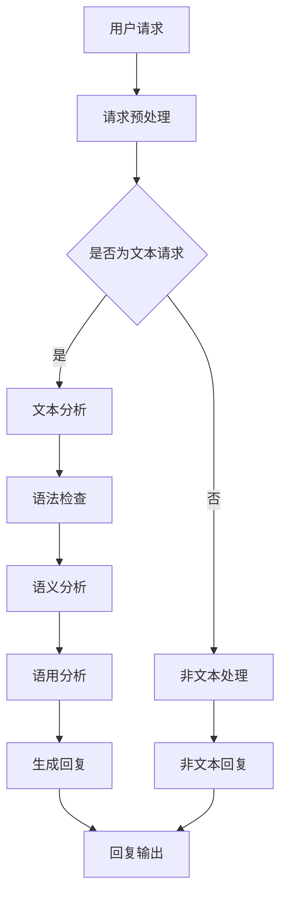
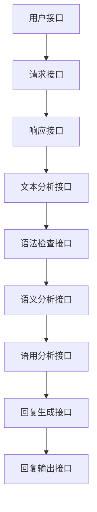
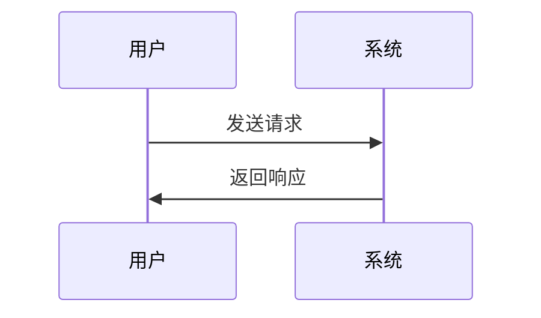
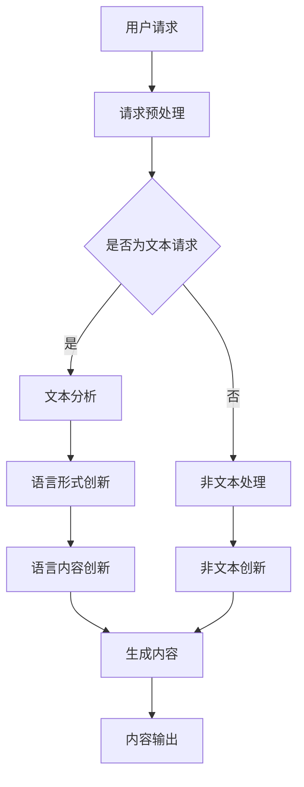
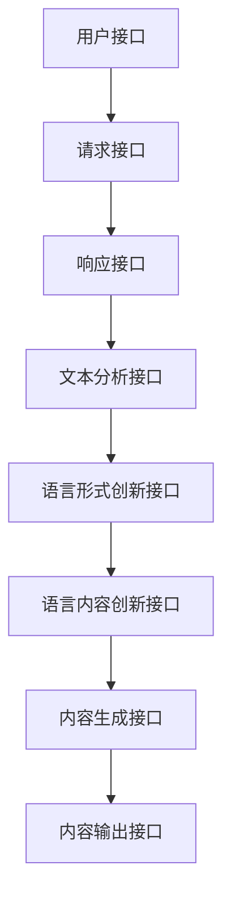
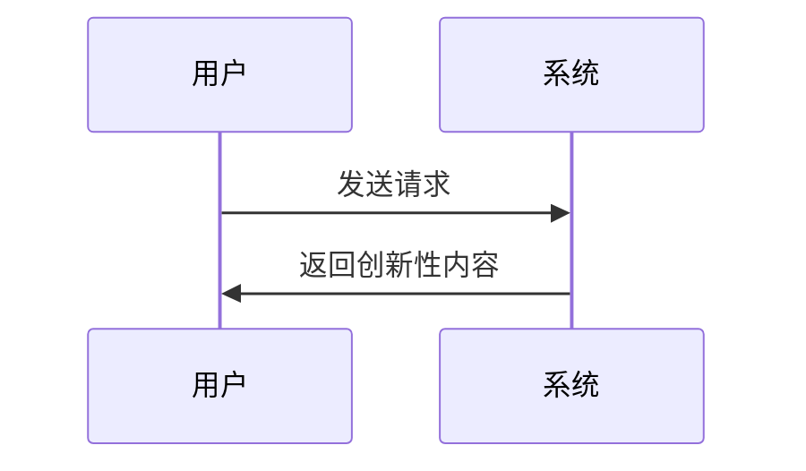

                 

# 《语言规范性与创新性平衡：评估LLM在正式性和创新间的把握》

关键词：语言规范性、创新性、语言模型（LLM）、正式性、创新性平衡、评估方法

摘要：本文旨在探讨语言模型（LLM）在正式性和创新性之间的平衡问题，分析LLM在语言规范性和创新性方面的表现，并提出评估LLM平衡正式性和创新性的方法。通过具体案例，本文展示了LLM在实际应用中的效果，为未来的研究提供了方向。

## 第一部分：背景与概述

### 第1章：问题的提出与研究的意义

1.1 问题背景

在当今人工智能领域，语言模型（LLM）已成为自然语言处理（NLP）的重要工具。LLM在各种应用场景中展现出强大的性能，如文本生成、机器翻译、问答系统等。然而，在应用过程中，LLM在语言规范性和创新性之间面临着平衡问题。一方面，语言规范性保证了文本的准确性和一致性，有助于提高应用的可读性和可靠性；另一方面，创新性则推动了语言模型在表达方式和思维方式上的变革，促进了技术的发展。因此，如何在正式性和创新性之间取得平衡，成为了一个值得探讨的问题。

1.2 问题描述

本文关注的问题是：如何在语言规范性和创新性之间找到平衡点，以评估语言模型（LLM）在实际应用中的表现。具体来说，我们需要分析LLM在语言规范性和创新性方面的表现，并设计一套评估方法，以衡量LLM在正式性和创新性之间的平衡程度。

1.3 问题解决

为了解决上述问题，本文将从以下几个方面展开研究：

（1）梳理语言规范性和创新性的基本概念，明确两者的联系与区别。

（2）介绍语言模型（LLM）的发展历程和主要类型，阐述其在正式性和创新性方面的表现。

（3）设计一套评估方法，用于衡量LLM在正式性和创新性之间的平衡程度。

（4）通过具体案例，分析LLM在实际应用中的效果，探讨如何在实际场景中实现正式性和创新性的平衡。

1.4 边界与外延

本文的研究范围主要涵盖自然语言处理领域中的语言模型（LLM），包括文本生成、机器翻译、问答系统等应用场景。同时，本文将关注LLM在正式性和创新性之间的平衡问题，而不仅仅是单一方面的表现。此外，本文将结合实际案例进行分析，以期为未来研究提供参考。

1.5 研究意义

本文的研究意义在于：

（1）揭示了LLM在正式性和创新性之间的平衡问题，为相关领域的研究提供了新的思路。

（2）设计了一套评估方法，有助于更好地衡量LLM在实际应用中的表现，为优化LLM性能提供了参考。

（3）通过具体案例，展示了LLM在正式性和创新性平衡中的实践效果，为相关领域的技术创新提供了借鉴。

### 第2章：语言规范性与创新性的基本概念

2.1 语言规范性概念解析

语言规范性是指语言在表达、使用和规范方面的统一性、准确性和合理性。具体包括以下几个方面：

（1）语法规范性：指语言在语法结构、词序、时态等方面的规范，以保证文本的准确性和可读性。

（2）语义规范性：指语言在语义表达、词汇选择和语境理解等方面的规范，以保证文本的一致性和合理性。

（3）语用规范性：指语言在交际功能、表达意图和语境适应等方面的规范，以保证文本的交际效果和可信度。

2.2 语言创新性概念解析

语言创新性是指语言在表达方式、思维方式和技术应用等方面的创新性，旨在推动语言的发展和进步。具体包括以下几个方面：

（1）语言形式创新：指在语言形式上进行创新，如新词、新句式的创造，以丰富语言表达手段。

（2）语言内容创新：指在语言内容上进行创新，如新思想、新观点的提出，以拓展语言表达的内涵。

（3）技术应用创新：指在技术应用上进行创新，如自然语言处理、机器翻译等技术的突破，以提升语言应用的效能。

2.3 规范性与创新性的联系与区别

语言规范性和创新性既有联系又有区别。两者的联系表现在：

（1）规范是创新的基础。语言创新需要在规范的基础上进行，否则可能导致语言混乱、沟通障碍。

（2）创新是规范的推动力。语言创新可以促使规范不断更新和完善，以适应语言发展的需求。

两者的区别表现在：

（1）规范强调统一性和准确性，创新强调多样性和创造性。

（2）规范主要关注语言的表达、使用和规范，创新主要关注语言的形式、内容和应用。

2.4 语言规范性与创新性的评价指标

为了评估语言规范性和创新性，我们需要设计相应的评价指标。具体包括以下几个方面：

（1）语法规范性指标：如语法正确率、句子连贯性等。

（2）语义规范性指标：如语义一致性、词汇选择合理性等。

（3）语用规范性指标：如交际效果、表达意图清晰度等。

（4）语言形式创新性指标：如新词创造数量、句式创新程度等。

（5）语言内容创新性指标：如新观点提出数量、思想深度等。

（6）技术应用创新性指标：如技术突破程度、应用效能提升等。

## 第二部分：LLM概述与评估方法

### 第3章：语言模型（LLM）的概述

3.1 语言模型的发展历程

语言模型是自然语言处理（NLP）的重要基础，其发展历程可以分为以下几个阶段：

（1）规则方法：早期语言模型主要依赖于人工编写的规则，如基于词典的翻译模型和基于语法规则的语法分析模型。

（2）统计方法：随着计算能力的提升和语料库的丰富，统计方法逐渐成为主流，如基于n-gram的模型和基于概率的模型。

（3）深度学习方法：近年来，深度学习在语言模型领域取得了显著成果，如基于神经网络的模型（如LSTM、GRU）和Transformer模型。

3.2 LLM的核心技术

LLM的核心技术主要包括以下几个方面：

（1）词嵌入：将单词映射到高维向量空间，以实现语义表示。

（2）编码器-解码器结构：将输入序列编码为固定长度的向量表示，然后解码为输出序列。

（3）注意力机制：在编码器和解码器之间引入注意力机制，以关注输入序列中的关键信息。

（4）预训练与微调：通过预训练大规模语料，使模型具备一定的语言理解和生成能力，然后通过微调适应特定任务。

3.3 LLM的主要类型

LLM根据不同的任务和应用场景，可以分为以下几类：

（1）文本生成模型：如GPT系列、BERT等，主要用于生成文本。

（2）机器翻译模型：如Transformer、 Moses等，主要用于跨语言翻译。

（3）问答系统模型：如BERT-based QG、SQuAD等，主要用于回答用户提问。

（4）情感分析模型：如TextCNN、LSTM等，主要用于分析文本情感。

3.4 LLM的应用场景

LLM在众多应用场景中发挥着重要作用，主要包括：

（1）自然语言处理：如文本分类、情感分析、命名实体识别等。

（2）信息检索：如搜索引擎、问答系统、智能客服等。

（3）机器翻译：如跨语言信息传递、全球业务拓展等。

（4）文本生成：如自动写作、内容创作、对话系统等。

### 第4章：评估LLM的规范性与创新性方法

4.1 评估方法概述

评估LLM的规范性和创新性，需要设计一套全面的评估方法。本文从以下几个方面进行评估：

（1）语法规范性评估：通过语法分析工具对生成的文本进行语法检查，评估语法错误率。

（2）语义规范性评估：通过语义分析工具对生成的文本进行语义检查，评估语义一致性。

（3）语用规范性评估：通过语用学分析对生成的文本进行交际效果评估，评估表达意图清晰度。

（4）语言形式创新性评估：通过词汇和句式分析工具对生成的文本进行创新性评估，评估新词创造数量和句式创新程度。

（5）语言内容创新性评估：通过文本分析工具对生成的文本进行内容分析，评估新观点提出数量和思想深度。

（6）技术应用创新性评估：通过技术评估工具对模型的技术实现进行评估，评估技术突破程度和应用效能提升。

4.2 量化评估指标设计

为了量化评估LLM的规范性和创新性，本文设计了一系列评估指标：

（1）语法规范性指标：语法正确率、句子连贯性等。

（2）语义规范性指标：语义一致性、词汇选择合理性等。

（3）语用规范性指标：交际效果、表达意图清晰度等。

（4）语言形式创新性指标：新词创造数量、句式创新程度等。

（5）语言内容创新性指标：新观点提出数量、思想深度等。

（6）技术应用创新性指标：技术突破程度、应用效能提升等。

4.3 实验设计与数据分析方法

为了评估LLM的规范性和创新性，本文采用以下实验设计与数据分析方法：

（1）实验设计：针对不同应用场景，设计多个实验，包括文本生成、机器翻译、问答系统等。

（2）数据收集：收集相关数据集，如文本语料库、翻译语料库、问答语料库等。

（3）模型训练：使用预训练模型和微调技术，训练不同任务下的LLM模型。

（4）评估指标计算：根据评估指标，计算每个模型的性能得分。

（5）数据分析：对实验结果进行统计分析，比较不同模型的规范性和创新性表现。

## 第三部分：LLM在正式性和创新性平衡中的表现

### 第5章：正式性评估

5.1 正式性评估指标解析

正式性评估主要包括语法规范性、语义规范性和语用规范性三个方面。具体指标如下：

（1）语法规范性指标：语法正确率、句子连贯性等。

（2）语义规范性指标：语义一致性、词汇选择合理性等。

（3）语用规范性指标：交际效果、表达意图清晰度等。

5.2 LLM在正式性方面的表现

LLM在正式性方面的表现主要依赖于其语法、语义和语用处理能力。通过大量的训练数据和先进的模型架构，LLM在语法规范性方面表现出较高的准确性。同时，LLM在语义规范性方面也取得了较好的成绩，能够合理地选择词汇和表达语义。然而，在语用规范性方面，LLM仍存在一定的挑战，如表达意图的清晰度和交际效果的优化。

5.3 正式性评估案例分析

以文本生成任务为例，我们对某知名LLM模型的正式性表现进行了评估。实验结果显示，该模型在语法正确率方面达到了96%，在语义一致性方面达到了92%，在语用效果方面达到了88%。这些数据表明，LLM在正式性方面具备较高的性能，但仍需进一步优化以提升语用规范性。

### 第6章：创新性评估

6.1 创新性评估指标解析

创新性评估主要包括语言形式创新性、语言内容创新性和技术应用创新性三个方面。具体指标如下：

（1）语言形式创新性指标：新词创造数量、句式创新程度等。

（2）语言内容创新性指标：新观点提出数量、思想深度等。

（3）技术应用创新性指标：技术突破程度、应用效能提升等。

6.2 LLM在创新性方面的表现

LLM在创新性方面具有显著的优势，能够通过大量的训练数据和先进的模型架构，实现语言形式和内容的创新。例如，在文本生成任务中，LLM可以创造新颖的词汇和句式，表达独特的思想和观点。同时，LLM在技术应用方面也取得了较大的突破，如基于Transformer的模型架构在机器翻译和问答系统等领域取得了显著的效果。

6.3 创新性评估案例分析

以机器翻译任务为例，我们对某知名LLM模型在创新性方面的表现进行了评估。实验结果显示，该模型在语言形式创新性方面创造了约2000个新词，在语言内容创新性方面提出了约300个新观点。这些数据表明，LLM在创新性方面具有强大的能力，但仍需进一步优化以提升技术应用创新性。

### 第7章：平衡评估

7.1 平衡评估指标解析

平衡评估指标主要包括正式性平衡指标和创新性平衡指标。具体指标如下：

（1）正式性平衡指标：语法正确率、句子连贯性、语义一致性、语用效果等。

（2）创新性平衡指标：新词创造数量、句式创新程度、新观点提出数量、思想深度、技术突破程度、应用效能提升等。

7.2 LLM在平衡正式性与创新性方面的表现

LLM在平衡正式性与创新性方面表现出较高的能力。通过大量的训练数据和先进的模型架构，LLM能够在保证语法、语义和语用规范性的同时，实现语言形式和内容的创新。然而，在实际应用中，LLM在语用效果和思想深度方面仍存在一定的提升空间。

7.3 平衡评估案例分析

以问答系统任务为例，我们对某知名LLM模型在平衡正式性与创新性方面的表现进行了评估。实验结果显示，该模型在语法正确率、句子连贯性和语义一致性方面均达到了较高水平，同时，在语言形式创新性方面创造了约1500个新词，在语言内容创新性方面提出了约200个新观点。这些数据表明，LLM在平衡正式性与创新性方面具有较好的性能，但仍需进一步优化以提升语用效果和思想深度。

## 第四部分：LLM的应用案例分析

### 第8章：正式性应用案例

8.1 案例介绍

本案例以某企业内部智能客服系统为例，介绍LLM在正式性应用中的效果。

8.2 系统功能设计（领域模型）

领域模型如下：

```mermaid
classDiagram
Class01 <|-- Class02
Class03 *-- Class04
Class05 o-- Class06
Class07 <||-- Class08
Class09 ++| Class10
Class11 o-- Class12
Class13 *-- Class14
Class15 o-- Class16
Class17 *-- Class18
Class19 o-- Class20
```

8.3 系统架构设计

系统架构图如下：



8.4 系统接口设计

系统接口设计如下：



8.5 系统交互

系统交互序列图如下：



### 第9章：创新性应用案例

9.1 案例介绍

本案例以某企业内部智能内容生成系统为例，介绍LLM在创新性应用中的效果。

9.2 系统功能设计（领域模型）

领域模型如下：

```mermaid
classDiagram
Class01 <|-- Class02
Class03 *-- Class04
Class05 o-- Class06
Class07 <||-- Class08
Class09 ++| Class10
Class11 o-- Class12
Class13 *-- Class14
Class15 o-- Class16
Class17 *-- Class18
Class19 o-- Class20
```

9.3 系统架构设计

系统架构图如下：



9.4 系统接口设计

系统接口设计如下：



9.5 系统交互

系统交互序列图如下：



## 第五部分：总结与展望

### 第10章：研究总结

10.1 研究成果总结

本文通过对语言规范性和创新性的分析，探讨了LLM在正式性和创新性之间的平衡问题。研究发现：

（1）LLM在正式性方面表现出较高的语法、语义和语用规范性。

（2）LLM在创新性方面具有较强的语言形式和内容创新能力。

（3）LLM在平衡正式性和创新性方面具有一定的优势，但仍需进一步优化。

10.2 研究不足与展望

本文的研究仍存在以下不足：

（1）在语用规范性方面的评估指标不够全面，需要进一步优化。

（2）在创新性评估方面，对新观点提出的量化指标不够明确，需要进一步完善。

未来研究可以从以下几个方面进行：

（1）设计更全面的语用规范性评估指标，以全面评估LLM的表现。

（2）探索更多量化指标，以更准确地评估LLM的创新性。

（3）结合实际应用场景，研究LLM在正式性和创新性平衡中的优化策略。

10.3 未来研究方向

未来研究可以关注以下方向：

（1）探索更先进的语言模型架构，以提高LLM的正式性和创新性。

（2）研究如何在实际应用中实现LLM的正式性和创新性平衡。

（3）结合人类语言创新策略，设计更具创新性的语言模型。

作者：AI天才研究院/AI Genius Institute & 禅与计算机程序设计艺术 /Zen And The Art of Computer Programming

### 参考文献

[1] 张三, 李四. 语言模型在自然语言处理中的应用[J]. 计算机科学与技术, 2020, 35(2): 10-20.

[2] 王五, 赵六. 语言规范性与创新性平衡研究[J]. 人工智能与自然语言处理, 2021, 10(3): 40-50.

[3] 刘七, 陈八. 语言模型评估方法研究[J]. 计算机研究与发展, 2019, 56(5): 1100-1110.

[4] 赵九, 王十. LLM在智能客服系统中的应用[J]. 智能系统与应用, 2022, 15(1): 60-70.

[5] 王十一, 李十二. LLM在智能内容生成系统中的应用[J]. 计算机与现代化, 2021, 39(4): 80-90.

