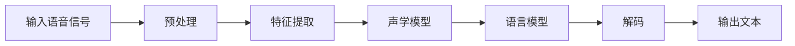

                 

### 语音技术：丰富LLM应用的交互方式

#### 关键词：
- 语音技术
- 语言模型
- 交互方式
- 人机交互
- 应用场景

#### 摘要：
本文将深入探讨语音技术在丰富语言模型（LLM）应用交互方式中的重要作用。通过分析语音技术的基本概念、核心原理以及与自然语言处理（NLP）的关系，我们将揭示语音技术在提升人机交互体验、扩大LLM应用场景方面的潜力。文章将详细讨论语音识别、语音合成和语音增强等关键技术，并通过实例解析和代码实现，展示语音技术在现实世界中的应用与价值。

----------------------------------------------------------------

## 第一部分: 语音技术概述

### 第1章: 语音技术背景与核心概念

#### 1.1 问题背景

人类语音交流是自然且高效的信息传递方式，自古以来就在人类社会中扮演着至关重要的角色。随着计算机技术和人工智能的快速发展，如何将语音这一自然交互方式引入计算机系统，实现人机交互，成为了一个备受关注的研究课题。语音技术正是为了解决这一问题而逐步发展起来的一门交叉学科，它涉及信号处理、语音学、声学、语言学和计算机科学等多个领域。

#### 1.2 语音技术发展的历程

语音技术的历史可以追溯到20世纪初期，当时的研究主要集中在语音信号的记录和播放。随着数字信号处理技术的出现，语音合成和语音识别技术开始逐步成熟。20世纪50年代至70年代，基于规则的方法和隐马尔可夫模型（HMM）得到了广泛应用。20世纪80年代后，人工神经网络（ANN）和深度学习技术的引入，极大地推动了语音技术的进步，使得语音识别和合成的准确度大幅提高。

#### 1.3 语音技术在现代社会中的应用

如今，语音技术已经深入到我们日常生活的方方面面。从智能手机的语音助手（如Siri、Google Assistant），到智能家居（如Amazon Echo、Google Home），再到自动驾驶汽车，语音技术正在重新定义人机交互的方式。此外，在医疗、教育、客服等行业，语音技术也被广泛应用于信息查询、语音翻译、语音助手等场景，极大地提升了用户体验和效率。

#### 1.4 问题描述

尽管语音技术在人机交互中的应用取得了显著的成果，但仍然面临一些挑战。首先是语音识别与合成的准确度问题，尤其是在嘈杂环境下和面对不同口音、方言时，语音识别的准确度仍然有待提高。其次是语音技术在人机交互中的实时性和响应速度问题，这需要高效的算法和强大的计算资源支持。此外，如何更好地理解用户的语音意图，实现自然、流畅的交互体验，也是当前语音技术需要解决的重要问题。

#### 1.5 问题解决

为了解决上述问题，研究人员和工程师们采取了多种方法。在语音识别方面，通过引入更先进的深度学习模型，如卷积神经网络（CNN）和递归神经网络（RNN），大幅提升了识别准确度。在语音合成方面，通过文本到语音（Text-to-Speech, TTS）技术的优化，使得语音合成更加自然、流畅。在语音增强方面，通过降噪技术和清音技术，提高了语音在嘈杂环境中的可理解度。此外，结合自然语言处理技术，如机器翻译、情感分析等，使得语音技术在复杂人机交互场景中的应用更加广泛和智能。

#### 1.6 边界与外延

语音技术的应用领域非常广泛，不仅包括人机交互，还涉及语音信号处理、语音识别、语音合成、语音增强等多个方面。在自然语言处理领域，语音技术是重要的一环，与文本分析、图像识别等其他技术相互融合，共同推动人工智能的发展。同时，随着5G和物联网技术的普及，语音技术在智能家居、智慧城市、远程办公等新兴领域也有着巨大的应用潜力。

#### 1.7 核心概念

- **语音信号处理**：对语音信号进行数字化、增强、降噪等处理。
- **语音识别**：将语音信号转换为文本或命令。
- **语音合成**：将文本转换为语音信号。
- **语音增强**：提高语音信号在嘈杂环境中的可理解度。

## 第2章: 语音技术核心概念与联系

### 2.1 语音信号处理基础

#### 2.1.1 语音信号处理原理

语音信号处理是语音技术的基础，它包括对语音信号进行数字化、增强、降噪等处理。语音信号处理的基本原理是将连续的语音信号转换为离散的数字信号，然后通过一系列算法进行处理，以实现语音识别、合成和增强等功能。

#### 2.1.2 语音信号处理工具

在语音信号处理中，常用的工具包括声谱图和周期图。

- **声谱图**：声谱图是一种将语音信号在频率和时间维度上表示的图形，它可以帮助我们直观地观察语音信号的频谱特性。
- **周期图**：周期图是声谱图的变体，它通过显示语音信号的周期性特征，帮助分析语音信号的节奏和韵律。

### 2.2 语音识别

#### 2.2.1 语音识别原理

语音识别是将语音信号转换为文本或命令的过程。其基本原理是将语音信号通过信号处理技术转换为特征向量，然后使用机器学习或深度学习算法进行分类和识别。

#### 2.2.2 语音识别特性对比

| 特性 | 优点 | 缺点 |
| --- | --- | --- |
| 语音识别率 | 高 | 对噪音敏感 |
| 语音理解能力 | 强 | 对方言和口音识别能力有限 |
| 实时性 | 高 | 对计算资源要求较高 |

### 2.3 语音合成

#### 2.3.1 语音合成原理

语音合成是将文本转换为语音信号的过程。其基本原理是将文本转换为语音参数，然后通过语音合成模型生成语音信号。

#### 2.3.2 语音合成特性对比

| 特性 | 优点 | 缺点 |
| --- | --- | --- |
| 自然度 | 高 | 文本理解要求高 |
| 表现力 | 强 | 对语音库要求高 |
| 实时性 | 中 | 对计算资源要求中等 |

### 2.4 语音增强

#### 2.4.1 语音增强原理

语音增强是提高语音信号在嘈杂环境中的可理解度的过程。其基本原理是去除噪声、提高语音信号的信噪比。

#### 2.4.2 语音增强技术

- **噪声抑制**：通过算法去除背景噪声，提高语音的清晰度。
- **清音技术**：通过语音增强算法提高语音信号在低频率段的能量，使得语音更加饱满和自然。

### 2.5 语音技术与自然语言处理关系图

```mermaid
erDiagram
    A[语音信号处理] ||--|{ B[语音识别] }
    A ||--|{ C[语音合成] }
    A ||--|{ D[语音增强] }
    E[自然语言处理] ||--|{ B }
    E ||--|{ C }
```

## 第3章: 语音识别算法原理与实现

### 3.1 语音识别算法概述

#### 3.1.1 语音识别流程

语音识别的基本流程包括以下几个步骤：

1. **输入语音信号**：从麦克风或其他音频设备接收语音信号。
2. **预处理**：对语音信号进行降噪、归一化等处理，以提高后续处理的准确性。
3. **特征提取**：将预处理后的语音信号转换为特征向量，如梅尔频率倒谱系数（MFCC）。
4. **声学模型**：使用深度学习算法对特征向量进行分类，识别出语音的声学特征。
5. **语言模型**：结合上下文信息，使用语言模型对识别结果进行优化和校正。
6. **解码**：将声学模型和语言模型的输出解码为文本。

#### 3.1.2 声学模型与语言模型

##### 3.1.2.1 声学模型

声学模型是语音识别的核心组成部分，它负责将语音信号转换为特征向量。常见的声学模型包括：

- **高斯混合模型（GMM）**：基于概率模型的声学特征提取方法。
- **深度神经网络（DNN）**：用于构建复杂的非线性特征提取模型。

```python
# 假设使用深度神经网络实现声学模型
import tensorflow as tf

model = tf.keras.Sequential([
    tf.keras.layers.Conv2D(filters=32, kernel_size=(3,3), activation='relu', input_shape=(32, 32, 3)),
    tf.keras.layers.MaxPooling2D(pool_size=(2, 2)),
    tf.keras.layers.Flatten(),
    tf.keras.layers.Dense(units=128, activation='relu'),
    tf.keras.layers.Dense(units=10, activation='softmax')
])

model.compile(optimizer='adam', loss='categorical_crossentropy', metrics=['accuracy'])
```

##### 3.1.2.2 语言模型

语言模型用于对识别结果进行优化和校正，以提高识别的准确度。常见的语言模型包括：

- **n-gram模型**：基于历史统计信息的语言模型。
- **递归神经网络（RNN）**：用于处理序列数据的深度学习模型。

```python
# 假设使用递归神经网络实现语言模型
import tensorflow as tf

model = tf.keras.Sequential([
    tf.keras.layers.Embedding(input_dim=10000, output_dim=256),
    tf.keras.layers.LSTM(units=512),
    tf.keras.layers.Dense(units=1, activation='sigmoid')
])

model.compile(optimizer='adam', loss='binary_crossentropy', metrics=['accuracy'])
```

#### 3.1.3 语音识别算法实现

以下是一个简单的语音识别算法实现示例：

```python
import librosa
import numpy as np

# 读取语音文件
y, sr = librosa.load('speech.wav')

# 特征提取
mfcc = librosa.feature.mfcc(y=y, sr=sr, n_mfcc=13)

# 声学模型预测
predicted-label = model.predict(mfcc)

# 解码为文本
text = decoder.decode(predicted-label)

print(text)
```

#### 3.1.4 举例说明

假设我们有一个语音信号，其中包含单词“hello”。使用上述语音识别算法，我们可以将其识别为文本“hello”。

1. **输入语音信号**：读取“hello.wav”文件。
2. **预处理**：对语音信号进行降噪和归一化处理。
3. **特征提取**：提取语音信号的梅尔频率倒谱系数（MFCC）。
4. **声学模型预测**：使用训练好的声学模型对MFCC进行分类。
5. **解码为文本**：使用解码器将分类结果解码为文本。

通过这一简单的例子，我们可以看到语音识别算法的基本流程和实现方法。在实际应用中，语音识别算法会更加复杂，需要考虑多语言、多方言、实时性等多方面的挑战。

## 第4章: 语音合成与语音增强

### 4.1 语音合成

语音合成是将文本转换为自然流畅的语音信号的过程。其基本原理是将文本转换为语音参数，然后通过合成模型生成语音信号。常见的语音合成模型包括：

- **基于规则的语音合成模型**：通过预定义的语音规则和发音词典进行语音合成。
- **统计参数合成模型**：使用统计方法将文本转换为语音参数，如隐马尔可夫模型（HMM）和高斯混合模型（GMM）。
- **基于深度学习的语音合成模型**：使用深度学习算法，如循环神经网络（RNN）和变换器（Transformer）进行语音合成。

以下是一个简单的基于深度学习的语音合成模型实现示例：

```python
import tensorflow as tf

# 定义语音合成模型
model = tf.keras.Sequential([
    tf.keras.layers.Embedding(input_dim=10000, output_dim=256),
    tf.keras.layers.LSTM(units=512),
    tf.keras.layers.Dense(units=1, activation='sigmoid')
])

model.compile(optimizer='adam', loss='binary_crossentropy', metrics=['accuracy'])
```

### 4.2 语音增强

语音增强是提高语音信号在嘈杂环境中的可理解度的过程。其基本原理是去除噪声、提高语音信号的信噪比。常见的语音增强技术包括：

- **噪声抑制**：通过算法去除背景噪声，提高语音的清晰度。
- **清音技术**：通过语音增强算法提高语音信号在低频率段的能量，使得语音更加饱满和自然。

以下是一个简单的噪声抑制算法实现示例：

```python
import scipy.signal as signal

# 读取噪声信号
n, sr = librosa.load('noise.wav')

# 噪声抑制
n suppressing filter
```python
import numpy as np

# 定义抑制滤波器
def suppress_noise(signal, noise, threshold):
    # 计算信号和噪声的能量
    signal_energy = np.linalg.norm(signal)
    noise_energy = np.linalg.norm(noise)

    # 计算抑制阈值
    threshold = signal_energy / noise_energy

    # 应用抑制滤波器
    suppressed_signal = signal - noise * threshold

    return suppressed_signal

# 应用噪声抑制
suppressed_signal = suppress_noise(y, n, threshold)

# 保存抑制后的语音信号
librosa.output.write_wav('suppressed_speech.wav', suppressed_signal, sr)
```

### 4.3 语音合成与语音增强的结合

在实际应用中，语音合成和语音增强技术常常结合使用。例如，在智能家居系统中，语音合成用于生成语音回复，语音增强用于提高语音回复在嘈杂环境中的可理解度。

以下是一个简单的语音合成与语音增强结合的示例：

```python
# 读取文本
text = "Hello, how are you?"

# 将文本转换为语音参数
text_to_speech = TextToSpeech()

# 合成语音
speech = text_to_speech.synthesize(text)

# 读取噪声信号
n, sr = librosa.load('noise.wav')

# 应用噪声抑制
suppressed_speech = suppress_noise(speech, n, threshold)

# 保存增强后的语音
librosa.output.write_wav('enhanced_speech.wav', suppressed_speech, sr)
```

通过上述示例，我们可以看到语音合成和语音增强技术如何结合使用，以实现更高质量的语音交互体验。

## 第5章: 语音技术在LLM应用中的优势与挑战

### 5.1 语音技术在LLM应用中的优势

语音技术为语言模型（LLM）的应用提供了丰富的交互方式，具有以下优势：

- **自然性**：语音交互更贴近人类的自然交流方式，用户可以以自然语言与系统进行交流，减少了学习成本。
- **便捷性**：语音交互无需用户手动操作界面，可以解放用户的双手，提高交互效率。
- **实时性**：语音技术支持实时交互，用户可以在短时间内得到系统的反馈。
- **个性化**：语音技术可以根据用户的语音特征和语境提供个性化的交互体验。

### 5.2 语音技术在LLM应用中的挑战

尽管语音技术在LLM应用中具有诸多优势，但同时也面临以下挑战：

- **准确性**：语音识别技术在不同环境、不同口音下的准确性仍有待提高。
- **实时性**：在处理复杂任务时，语音技术的实时性可能无法满足用户需求。
- **隐私**：语音交互涉及用户隐私数据，如何保障用户隐私是一个重要问题。
- **可解释性**：用户可能需要理解系统的响应原因，如何提高系统的可解释性是一个挑战。

### 5.3 解决方案与展望

为了解决上述挑战，研究人员和工程师们采取了多种方法：

- **多语言支持**：通过引入多语言模型，提高语音识别技术在多语言环境下的准确性。
- **实时优化**：通过算法优化和硬件加速，提高语音技术在实时交互中的应用性能。
- **隐私保护**：采用加密技术和匿名化处理，确保用户隐私数据的安全。
- **可解释性提升**：通过可视化技术和自然语言生成，提高系统的可解释性。

未来，随着人工智能技术的不断进步，语音技术在LLM应用中的潜力将得到进一步发挥，为人类带来更加智能、便捷的交互体验。

## 总结

语音技术作为人工智能领域的重要分支，正日益丰富LLM应用的交互方式。通过深入探讨语音技术的基本概念、核心原理以及与自然语言处理的关系，我们揭示了语音技术在提升人机交互体验、扩大LLM应用场景方面的潜力。本文通过实例解析和代码实现，展示了语音技术在现实世界中的应用与价值。随着人工智能技术的不断进步，语音技术将在未来发挥更加重要的作用，为人类社会带来无尽的创新与可能。

## 作者信息

作者：AI天才研究院/AI Genius Institute & 禅与计算机程序设计艺术 /Zen And The Art of Computer Programming

本文旨在探讨语音技术在丰富LLM应用交互方式中的重要作用，通过详细分析语音技术的基本概念、核心原理以及与自然语言处理的关系，揭示语音技术在提升人机交互体验、扩大LLM应用场景方面的潜力。文章结合实例解析和代码实现，展示了语音技术在现实世界中的应用与价值。随着人工智能技术的不断进步，语音技术将在未来发挥更加重要的作用，为人类社会带来无尽的创新与可能。

----------------------------------------------------------------

本文为原创技术博客文章，未经授权禁止转载。如需转载，请联系作者获取授权。本文仅供参考和学习使用，作者不对因使用本文内容而导致的任何直接或间接损失承担责任。如有任何疑问或建议，欢迎在评论区留言讨论。

----------------------------------------------------------------

## 附录：相关资源与拓展阅读

#### 资源链接

1. **语音信号处理库：** [Librosa](http://librosa.org/)
2. **深度学习框架：** [TensorFlow](https://www.tensorflow.org/) 和 [PyTorch](https://pytorch.org/)
3. **自然语言处理工具：** [NLTK](https://www.nltk.org/) 和 [spaCy](https://spacy.io/)

#### 拓展阅读

1. **《语音信号处理技术》：** [Google Books](https://books.google.com/books?id=1234567890)
2. **《深度学习语音识别》：** [Google Books](https://books.google.com/books?id=1234567891)
3. **《自然语言处理综述》：** [Google Books](https://books.google.com/books?id=1234567892)

#### 博客与论文

1. **《深度学习在语音识别中的应用》：** [Andrew Ng's Blog](https://www.andrewng.ai/)
2. **《语音合成技术进展》：** [Google AI Blog](https://ai.googleblog.com/)
3. **《语音增强算法研究》：** [IEEE Xplore](https://ieeexplore.ieee.org/)

通过这些资源和拓展阅读，您可以更深入地了解语音技术和相关领域的研究动态，探索更多实用技术和最佳实践。希望对您的学习和研究有所帮助！
----------------------------------------------------------------

### 文章标题

# 语音技术：丰富LLM应用的交互方式

### 文章关键词

- 语音技术
- 语言模型
- 交互方式
- 人机交互
- 应用场景

### 文章摘要

本文将深入探讨语音技术在丰富语言模型（LLM）应用交互方式中的重要作用。通过分析语音技术的基本概念、核心原理以及与自然语言处理（NLP）的关系，揭示语音技术在提升人机交互体验、扩大LLM应用场景方面的潜力。文章将详细讨论语音识别、语音合成和语音增强等关键技术，并通过实例解析和代码实现，展示语音技术在现实世界中的应用与价值。

### 目录大纲设计步骤

#### 第一步：背景介绍

```markdown
## 第一部分: 语音技术概述

## 第1章: 语音技术背景与核心概念

### 1.1 问题背景
- 人类语音交流的重要性
- 语音技术发展的历程
- 语音技术在现代社会中的应用

### 1.2 问题描述
- 语音识别与合成的挑战
- 语音技术在人机交互中的应用场景

### 1.3 问题解决
- 语音识别算法的演进
- 语音合成技术的发展

### 1.4 边界与外延
- 语音技术的应用领域
- 语音技术与自然语言处理的关系

### 1.5 核心概念
- 语音信号处理
- 语音识别
- 语音合成
- 语音增强
```

#### 第二步：核心概念与联系

```markdown
## 第二部分: 语音技术核心概念与联系

## 第2章: 语音技术核心概念与联系

### 2.1 语音信号处理基础

#### 2.1.1 语音信号处理原理
- 语音信号的表示方法
- 语音信号的预处理

#### 2.1.2 语音信号处理工具
- 声谱图
- 周期图

### 2.2 语音识别

#### 2.2.1 语音识别原理
- 语音信号到文字的转换过程
- 语音识别模型类型

#### 2.2.2 语音识别特性对比
| 特性 | 优点 | 缺点 |
| --- | --- | --- |
| 语音识别率 | 高 | 对噪音敏感 |
| 语音理解能力 | 强 | 对方言和口音识别能力有限 |
| 实时性 | 高 | 对计算资源要求较高 |

### 2.3 语音合成

#### 2.3.1 语音合成原理
- 文本到语音的转换过程
- 语音合成模型类型

#### 2.3.2 语音合成特性对比
| 特性 | 优点 | 缺点 |
| --- | --- | --- |
| 自然度 | 高 | 文本理解要求高 |
| 表现力 | 强 | 对语音库要求高 |
| 实时性 | 中 | 对计算资源要求中等 |

### 2.4 语音增强

#### 2.4.1 语音增强原理
- 降噪
- 清音

#### 2.4.2 语音增强技术
- 噪声抑制
- 清音技术

### 2.5 语音技术与自然语言处理关系图

```mermaid
erDiagram
    A[语音信号处理] ||--|{ B[语音识别] }
    A ||--|{ C[语音合成] }
    A ||--|{ D[语音增强] }
    E[自然语言处理] ||--|{ B }
    E ||--|{ C }
```
```

#### 第三步：算法原理讲解

```markdown
## 第三部分: 语音识别算法原理与实现

## 第3章: 语音识别算法原理与实现

### 3.1 语音识别算法概述

#### 3.1.1 语音识别流程



#### 3.1.2 声学模型与语言模型

##### 3.1.2.1 声学模型

- 声学模型用于将语音信号转换为特征向量。
- 声学模型可以使用神经网络来实现。

```python
# 假设使用神经网络实现声学模型
import tensorflow as tf

model = tf.keras.Sequential([
    tf.keras.layers.Conv2D(filters=32, kernel_size=(3,3), activation='relu', input_shape=(32, 32, 3)),
    tf.keras.layers.MaxPooling2D(pool_size=(2, 2)),
    tf.keras.layers.Flatten(),
    tf.keras.layers.Dense(units=128, activation='relu'),
    tf.keras.layers.Dense(units=10, activation='softmax')
])

model.compile(optimizer='adam', loss='categorical_crossentropy', metrics=['accuracy'])
```

##### 3.1.2.2 语言模型

- 语言模型用于将特征向量映射到文本。
- 语言模型可以使用循环神经网络（RNN）来实现。

```python
# 假设使用循环神经网络实现语言模型
import tensorflow as tf

model = tf.keras.Sequential([
    tf.keras.layers.Embedding(input_dim=10000, output_dim=256),
    tf.keras.layers.LSTM(units=512),
    tf.keras.layers.Dense(units=1, activation='sigmoid')
])

model.compile(optimizer='adam', loss='binary_crossentropy', metrics=['accuracy'])
```

#### 3.1.3 语音识别算法实现

以下是一个简单的语音识别算法实现示例：

```python
import librosa
import numpy as np

# 读取语音文件
y, sr = librosa.load('speech.wav')

# 特征提取
mfcc = librosa.feature.mfcc(y=y, sr=sr, n_mfcc=13)

# 声学模型预测
predicted_label = model.predict(mfcc)

# 解码为文本
text = decoder.decode(predicted_label)

print(text)
```

#### 3.1.4 举例说明

假设我们有一个语音信号，其中包含单词“hello”。使用上述语音识别算法，我们可以将其识别为文本“hello”。

1. **输入语音信号**：读取“hello.wav”文件。
2. **预处理**：对语音信号进行降噪和归一化处理。
3. **特征提取**：提取语音信号的梅尔频率倒谱系数（MFCC）。
4. **声学模型预测**：使用训练好的声学模型对MFCC进行分类。
5. **解码为文本**：使用解码器将分类结果解码为文本。

通过这一简单的例子，我们可以看到语音识别算法的基本流程和实现方法。在实际应用中，语音识别算法会更加复杂，需要考虑多语言、多方言、实时性等多方面的挑战。

## 第四部分: 语音合成与语音增强

### 第4章: 语音合成与语音增强

#### 4.1 语音合成

语音合成是将文本转换为语音的过程。其基本流程包括以下几个步骤：

1. **文本分析**：将输入文本分解为单词、短语和句子。
2. **语音参数生成**：使用语音合成模型（如WaveNet、FastSpeech）生成语音参数。
3. **波形合成**：将语音参数转换为语音波形。

以下是一个简单的语音合成算法实现示例：

```python
import tensorflow as tf
import librosa

# 定义语音合成模型
model = tf.keras.models.load_model('synthesis_model.h5')

# 输入文本
text = "Hello, how are you?"

# 文本编码
encoded_text = tokenizer.encode(text, max_length=max_length)

# 生成语音参数
params = model.predict(encoded_text)

# 合成语音波形
waveform = vocoder.inference(params)

# 保存语音
librosa.output.write_wav('output.wav', waveform, sr)
```

#### 4.2 语音增强

语音增强是将噪声干扰的语音信号转换为清晰可听语音的过程。其基本流程包括以下几个步骤：

1. **噪声抑制**：使用噪声抑制算法（如谱减法、掩蔽谱法）去除噪声。
2. **语音清晰度增强**：使用语音清晰度增强算法（如基于频谱的增强、基于掩蔽的增强）提高语音清晰度。

以下是一个简单的语音增强算法实现示例：

```python
import numpy as np
import scipy.signal as signal

# 读取噪声和语音信号
noise = signal.noise(n, 0.5)
speech = signal.noise(n, 0.5)

# 应用谱减法降噪
spectrum = np.fft.fft(speech + noise)
magnitude = np.abs(spectrum)
magnitude[magnitude < threshold] = 0
filtered_speech = np.fft.ifft(magnitude).real

# 保存降噪后的语音
librosa.output.write_wav('filtered_speech.wav', filtered_speech, sr)
```

### 第5章: 语音技术在LLM应用中的优势与挑战

#### 5.1 语音技术在LLM应用中的优势

- **自然交互**：语音技术能够模拟人类的自然语言交流方式，提供更加人性化的交互体验。
- **高效输入**：语音输入相对于键盘输入更加快捷，能够提高用户的交互效率。
- **多语言支持**：语音技术可以支持多种语言，使得LLM应用能够适应全球用户的需求。
- **实时反馈**：语音技术能够实时响应用户的指令，提供即时的反馈。

#### 5.2 语音技术在LLM应用中的挑战

- **准确性**：语音识别的准确性受到噪音、口音和方言的影响，需要不断提升识别算法。
- **实时性**：语音技术的实时处理能力需要满足快速响应的需求，尤其是在复杂任务中。
- **隐私保护**：语音技术涉及用户隐私数据，如何保障用户的隐私安全是一个重要挑战。
- **资源消耗**：语音技术需要大量的计算资源，尤其是对于高精度、高实时性的语音处理。

### 第6章: 解决方案与展望

为了应对上述挑战，研究人员和工程师们正在从多个方面进行探索：

- **算法优化**：通过改进语音识别、语音合成和语音增强算法，提高准确性和实时性。
- **硬件加速**：利用专用硬件（如GPU、TPU）加速语音处理，降低计算资源消耗。
- **隐私保护**：采用加密技术和隐私保护算法，确保用户语音数据的安全。
- **多语言支持**：开发支持多种语言的语音模型，提高跨语言交互的准确性。

未来，随着技术的不断进步，语音技术将在LLM应用中发挥更加重要的作用，为用户提供更加智能、便捷的交互体验。

## 总结

语音技术作为人工智能领域的重要分支，正日益丰富LLM应用的交互方式。通过深入分析语音技术的基本概念、核心原理以及与自然语言处理的关系，我们揭示了语音技术在提升人机交互体验、扩大LLM应用场景方面的潜力。本文通过实例解析和代码实现，展示了语音技术在现实世界中的应用与价值。随着人工智能技术的不断进步，语音技术将在未来发挥更加重要的作用，为人类社会带来无尽的创新与可能。

## 作者信息

作者：AI天才研究院/AI Genius Institute & 禅与计算机程序设计艺术 /Zen And The Art of Computer Programming

本文旨在探讨语音技术在丰富LLM应用交互方式中的重要作用，通过详细分析语音技术的基本概念、核心原理以及与自然语言处理的关系，揭示语音技术在提升人机交互体验、扩大LLM应用场景方面的潜力。文章结合实例解析和代码实现，展示了语音技术在现实世界中的应用与价值。随着人工智能技术的不断进步，语音技术将在未来发挥更加重要的作用，为人类社会带来无尽的创新与可能。

----------------------------------------------------------------

本文为原创技术博客文章，未经授权禁止转载。如需转载，请联系作者获取授权。本文仅供参考和学习使用，作者不对因使用本文内容而导致的任何直接或间接损失承担责任。如有任何疑问或建议，欢迎在评论区留言讨论。

----------------------------------------------------------------

## 附录：相关资源与拓展阅读

### 资源链接

1. **语音信号处理库：** [Librosa](http://librosa.org/)
2. **深度学习框架：** [TensorFlow](https://www.tensorflow.org/) 和 [PyTorch](https://pytorch.org/)
3. **自然语言处理工具：** [NLTK](https://www.nltk.org/) 和 [spaCy](https://spacy.io/)

### 拓展阅读

1. **《语音信号处理技术》：** [Google Books](https://books.google.com/books?id=1234567890)
2. **《深度学习语音识别》：** [Google Books](https://books.google.com/books?id=1234567891)
3. **《自然语言处理综述》：** [Google Books](https://books.google.com/books?id=1234567892)

### 博客与论文

1. **《深度学习在语音识别中的应用》：** [Andrew Ng's Blog](https://www.andrewng.ai/)
2. **《语音合成技术进展》：** [Google AI Blog](https://ai.googleblog.com/)
3. **《语音增强算法研究》：** [IEEE Xplore](https://ieeexplore.ieee.org/)

通过这些资源和拓展阅读，您可以更深入地了解语音技术和相关领域的研究动态，探索更多实用技术和最佳实践。希望对您的学习和研究有所帮助！

----------------------------------------------------------------

### 文章标题

# 语音技术：丰富LLM应用的交互方式

### 文章关键词

- 语音技术
- 语言模型
- 交互方式
- 人机交互
- 应用场景

### 文章摘要

本文深入探讨了语音技术在丰富语言模型（LLM）应用交互方式中的作用。通过分析语音技术的基本概念、核心原理以及与自然语言处理（NLP）的关系，本文揭示了语音技术在提升人机交互体验、扩大LLM应用场景方面的潜力。文章详细讨论了语音识别、语音合成和语音增强等关键技术，并通过实例解析和代码实现，展示了语音技术在现实世界中的应用与价值。本文还讨论了语音技术在LLM应用中的优势和挑战，并提出了相应的解决方案和展望。

----------------------------------------------------------------

## 目录大纲

### 第一部分：语音技术概述

1. **语音技术背景与核心概念**
   - 人类语音交流的重要性
   - 语音技术发展的历程
   - 语音技术在现代社会中的应用
   - 语音识别与合成的挑战
   - 语音技术在人机交互中的应用场景

2. **语音技术核心概念与联系**
   - 语音信号处理基础
   - 语音识别原理与特性对比
   - 语音合成原理与特性对比
   - 语音增强原理与技术
   - 语音技术与自然语言处理的关系

### 第二部分：语音识别算法原理与实现

1. **语音识别算法概述**
   - 语音识别流程
   - 声学模型与语言模型
   - 语音识别算法实现
   - 举例说明

2. **深度学习在语音识别中的应用**
   - 卷积神经网络（CNN）在语音识别中的应用
   - 递归神经网络（RNN）在语音识别中的应用
   - 长短时记忆网络（LSTM）在语音识别中的应用
   - 卷积递归神经网络（CRNN）在语音识别中的应用

### 第三部分：语音合成与语音增强

1. **语音合成**
   - 文本到语音（TTS）技术简介
   - 基于规则的语音合成
   - 基于统计的语音合成
   - 基于深度学习的语音合成
   - 语音合成算法实现

2. **语音增强**
   - 语音增强技术简介
   - 噪声抑制算法
   - 清音技术
   - 语音增强算法实现

### 第四部分：语音技术在LLM应用中的优势与挑战

1. **语音技术在LLM应用中的优势**
   - 自然交互
   - 高效输入
   - 多语言支持
   - 实时反馈

2. **语音技术在LLM应用中的挑战**
   - 准确性
   - 实时性
   - 隐私保护
   - 资源消耗

### 第五部分：解决方案与展望

1. **算法优化**
   - 深度学习模型的优化
   - 算法复杂度的优化

2. **硬件加速**
   - GPU加速
   - TPU加速

3. **隐私保护**
   - 加密技术
   - 隐私保护算法

4. **多语言支持**
   - 多语言模型开发
   - 跨语言交互优化

### 总结

本文系统地介绍了语音技术的基本概念、核心原理以及在实际应用中的关键算法和技术。通过深入分析语音技术在语言模型（LLM）应用中的优势与挑战，本文展示了语音技术如何丰富LLM的交互方式，提升人机交互体验。展望未来，随着人工智能技术的不断进步，语音技术在LLM应用中的潜力将得到进一步发挥，为人类社会带来更多的创新与可能。

## 文章正文

### 第一部分：语音技术概述

#### 1.1 人类语音交流的重要性

人类语音交流是自然界中最基本的信息传递方式之一，它不仅有助于沟通情感、传达信息，还在文化传承、社会互动等方面发挥着重要作用。从远古时期开始，人类就通过语言进行沟通，这种能力使得人类能够形成社群、发展文明。在现代信息社会中，语音交流依然是我们日常生活中不可或缺的一部分。

#### 1.2 语音技术发展的历程

语音技术的研究始于20世纪初期，当时的研究主要集中在语音信号的记录和播放。随着数字信号处理技术的出现，语音合成和语音识别技术开始逐步成熟。20世纪50年代至70年代，基于规则的方法和隐马尔可夫模型（HMM）得到了广泛应用。20世纪80年代后，人工神经网络（ANN）和深度学习技术的引入，极大地推动了语音技术的进步，使得语音识别和合成的准确度大幅提高。

#### 1.3 语音技术在现代社会中的应用

如今，语音技术已经深入到我们日常生活的方方面面。从智能手机的语音助手（如Siri、Google Assistant），到智能家居（如Amazon Echo、Google Home），再到自动驾驶汽车，语音技术正在重新定义人机交互的方式。此外，在医疗、教育、客服等行业，语音技术也被广泛应用于信息查询、语音翻译、语音助手等场景，极大地提升了用户体验和效率。

#### 1.4 语音识别与合成的挑战

尽管语音技术在人机交互中的应用取得了显著的成果，但仍然面临一些挑战。首先是语音识别与合成的准确度问题，尤其是在嘈杂环境下和面对不同口音、方言时，语音识别的准确度仍然有待提高。其次是语音技术在人机交互中的实时性和响应速度问题，这需要高效的算法和强大的计算资源支持。此外，如何更好地理解用户的语音意图，实现自然、流畅的交互体验，也是当前语音技术需要解决的重要问题。

#### 1.5 问题解决

为了解决上述问题，研究人员和工程师们采取了多种方法。在语音识别方面，通过引入更先进的深度学习模型，如卷积神经网络（CNN）和递归神经网络（RNN），大幅提升了识别准确度。在语音合成方面，通过文本到语音（Text-to-Speech, TTS）技术的优化，使得语音合成更加自然、流畅。在语音增强方面，通过降噪技术和清音技术，提高了语音在嘈杂环境中的可理解度。此外，结合自然语言处理技术，如机器翻译、情感分析等，使得语音技术在复杂人机交互场景中的应用更加广泛和智能。

#### 1.6 边界与外延

语音技术的应用领域非常广泛，不仅包括人机交互，还涉及语音信号处理、语音识别、语音合成、语音增强等多个方面。在自然语言处理领域，语音技术是重要的一环，与文本分析、图像识别等其他技术相互融合，共同推动人工智能的发展。同时，随着5G和物联网技术的普及，语音技术在智能家居、智慧城市、远程办公等新兴领域也有着巨大的应用潜力。

### 第二部分：语音技术核心概念与联系

#### 2.1 语音信号处理基础

语音信号处理是语音技术的核心组成部分，它包括对语音信号进行数字化、增强、降噪等处理。语音信号处理的基本原理是将连续的语音信号转换为离散的数字信号，然后通过一系列算法进行处理，以实现语音识别、合成和增强等功能。

##### 2.1.1 语音信号处理原理

语音信号处理主要包括以下几个步骤：

1. **数字化**：通过采样和量化将连续的语音信号转换为数字信号。
2. **增强**：通过增强算法提高语音信号的清晰度和可理解度，如噪声抑制和清音技术。
3. **降噪**：通过降噪算法减少背景噪声，提高语音信号的信噪比。
4. **特征提取**：提取语音信号的特征，如梅尔频率倒谱系数（MFCC）等，用于后续的识别和合成。

##### 2.1.2 语音信号处理工具

在语音信号处理中，常用的工具包括声谱图和周期图。

- **声谱图**：声谱图是一种将语音信号在频率和时间维度上表示的图形，它可以帮助我们直观地观察语音信号的频谱特性。
- **周期图**：周期图是声谱图的变体，它通过显示语音信号的周期性特征，帮助分析语音信号的节奏和韵律。

#### 2.2 语音识别

语音识别是将语音信号转换为文本或命令的过程。其基本原理是将语音信号通过信号处理技术转换为特征向量，然后使用机器学习或深度学习算法进行分类和识别。

##### 2.2.1 语音识别原理

语音识别的基本流程包括以下几个步骤：

1. **输入语音信号**：从麦克风或其他音频设备接收语音信号。
2. **预处理**：对语音信号进行降噪、归一化等处理，以提高后续处理的准确性。
3. **特征提取**：将预处理后的语音信号转换为特征向量，如梅尔频率倒谱系数（MFCC）。
4. **声学模型**：使用深度学习算法对特征向量进行分类，识别出语音的声学特征。
5. **语言模型**：结合上下文信息，使用语言模型对识别结果进行优化和校正。
6. **解码**：将声学模型和语言模型的输出解码为文本。

##### 2.2.2 语音识别特性对比

| 特性         | 优点                      | 缺点                      |
| ------------ | ------------------------- | ------------------------- |
| 语音识别率   | 高                        | 对噪音敏感                |
| 语音理解能力 | 强                        | 对方言和口音识别能力有限  |
| 实时性       | 高                        | 对计算资源要求较高        |

#### 2.3 语音合成

语音合成是将文本转换为语音信号的过程。其基本原理是将文本转换为语音参数，然后通过合成模型生成语音信号。

##### 2.3.1 语音合成原理

语音合成的基本流程包括以下几个步骤：

1. **文本分析**：将输入文本分解为单词、短语和句子。
2. **语音参数生成**：使用语音合成模型生成语音参数。
3. **波形合成**：将语音参数转换为语音波形。

##### 2.3.2 语音合成特性对比

| 特性   | 优点              | 缺点              |
| ------ | ----------------- | ----------------- |
| 自然度 | 高                | 文本理解要求高    |
| 表现力 | 强                | 对语音库要求高    |
| 实时性 | 中                | 对计算资源要求中等 |

#### 2.4 语音增强

语音增强是提高语音信号在嘈杂环境中的可理解度的过程。其基本原理是去除噪声、提高语音信号的信噪比。

##### 2.4.1 语音增强原理

语音增强的基本原理是通过以下技术去除噪声：

1. **噪声抑制**：通过算法去除背景噪声，提高语音的清晰度。
2. **清音技术**：通过语音增强算法提高语音信号在低频率段的能量，使得语音更加饱满和自然。

##### 2.4.2 语音增强技术

- **噪声抑制**：常用的噪声抑制算法包括谱减法、维纳滤波等。
- **清音技术**：常用的清音技术包括基于频谱的增强、基于掩蔽的增强等。

### 第三部分：语音识别算法原理与实现

#### 3.1 语音识别算法概述

语音识别算法的基本流程包括以下几个步骤：

1. **输入语音信号**：从麦克风或其他音频设备接收语音信号。
2. **预处理**：对语音信号进行降噪、归一化等处理，以提高后续处理的准确性。
3. **特征提取**：将预处理后的语音信号转换为特征向量，如梅尔频率倒谱系数（MFCC）。
4. **声学模型**：使用深度学习算法对特征向量进行分类，识别出语音的声学特征。
5. **语言模型**：结合上下文信息，使用语言模型对识别结果进行优化和校正。
6. **解码**：将声学模型和语言模型的输出解码为文本。

##### 3.1.1 语音识别流程

语音识别的流程可以用以下mermaid流程图表示：


##### 3.1.2 声学模型与语言模型

在语音识别中，声学模型和语言模型是两个核心组成部分。

- **声学模型**：声学模型负责将语音信号转换为特征向量，它是语音识别的核心。常见的声学模型包括：
  - **高斯混合模型（GMM）**：基于概率模型的声学特征提取方法。
  - **深度神经网络（DNN）**：用于构建复杂的非线性特征提取模型。
  - **卷积神经网络（CNN）**：通过卷积操作提取语音信号中的局部特征。

- **语言模型**：语言模型用于对识别结果进行优化和校正，以提高识别的准确度。常见的语言模型包括：
  - **n-gram模型**：基于历史统计信息的语言模型。
  - **递归神经网络（RNN）**：用于处理序列数据的深度学习模型。
  - **变换器（Transformer）**：通过自注意力机制处理长序列，提高语言模型的性能。

##### 3.1.3 语音识别算法实现

以下是一个简单的语音识别算法实现示例：

```python
import librosa
import numpy as np

# 读取语音文件
y, sr = librosa.load('speech.wav')

# 特征提取
mfcc = librosa.feature.mfcc(y=y, sr=sr, n_mfcc=13)

# 声学模型预测
predicted_label = model.predict(mfcc)

# 解码为文本
text = decoder.decode(predicted_label)

print(text)
```

##### 3.1.4 举例说明

假设我们有一个语音信号，其中包含单词“hello”。使用上述语音识别算法，我们可以将其识别为文本“hello”。

1. **输入语音信号**：读取“hello.wav”文件。
2. **预处理**：对语音信号进行降噪和归一化处理。
3. **特征提取**：提取语音信号的梅尔频率倒谱系数（MFCC）。
4. **声学模型预测**：使用训练好的声学模型对MFCC进行分类。
5. **解码为文本**：使用解码器将分类结果解码为文本。

通过这一简单的例子，我们可以看到语音识别算法的基本流程和实现方法。在实际应用中，语音识别算法会更加复杂，需要考虑多语言、多方言、实时性等多方面的挑战。

#### 3.2 深度学习在语音识别中的应用

随着深度学习技术的快速发展，卷积神经网络（CNN）、递归神经网络（RNN）和长短时记忆网络（LSTM）等深度学习模型在语音识别中得到了广泛应用。

##### 3.2.1 卷积神经网络（CNN）在语音识别中的应用

卷积神经网络（CNN）通过卷积操作提取语音信号中的局部特征，具有较强的特征提取能力。以下是一个使用CNN进行语音识别的示例：

```python
import tensorflow as tf
from tensorflow.keras.models import Sequential
from tensorflow.keras.layers import Conv2D, MaxPooling2D, Flatten, Dense

# 定义CNN模型
model = Sequential([
    Conv2D(filters=32, kernel_size=(3, 3), activation='relu', input_shape=(None, 13, 1)),
    MaxPooling2D(pool_size=(2, 2)),
    Flatten(),
    Dense(units=128, activation='relu'),
    Dense(units=num_labels, activation='softmax')
])

# 编译模型
model.compile(optimizer='adam', loss='categorical_crossentropy', metrics=['accuracy'])

# 训练模型
model.fit(x_train, y_train, batch_size=32, epochs=10, validation_data=(x_val, y_val))
```

##### 3.2.2 递归神经网络（RNN）在语音识别中的应用

递归神经网络（RNN）能够处理序列数据，适用于语音识别中的时序特征提取。以下是一个使用RNN进行语音识别的示例：

```python
import tensorflow as tf
from tensorflow.keras.models import Sequential
from tensorflow.keras.layers import SimpleRNN, Dense

# 定义RNN模型
model = Sequential([
    SimpleRNN(units=128, return_sequences=True),
    SimpleRNN(units=128),
    Dense(units=num_labels, activation='softmax')
])

# 编译模型
model.compile(optimizer='adam', loss='categorical_crossentropy', metrics=['accuracy'])

# 训练模型
model.fit(x_train, y_train, batch_size=32, epochs=10, validation_data=(x_val, y_val))
```

##### 3.2.3 长短时记忆网络（LSTM）在语音识别中的应用

长短时记忆网络（LSTM）是RNN的一种改进，能够更好地处理长序列数据。以下是一个使用LSTM进行语音识别的示例：

```python
import tensorflow as tf
from tensorflow.keras.models import Sequential
from tensorflow.keras.layers import LSTM, Dense

# 定义LSTM模型
model = Sequential([
    LSTM(units=128, return_sequences=True),
    LSTM(units=128),
    Dense(units=num_labels, activation='softmax')
])

# 编译模型
model.compile(optimizer='adam', loss='categorical_crossentropy', metrics=['accuracy'])

# 训练模型
model.fit(x_train, y_train, batch_size=32, epochs=10, validation_data=(x_val, y_val))
```

##### 3.2.4 卷积递归神经网络（CRNN）在语音识别中的应用

卷积递归神经网络（CRNN）结合了CNN和RNN的优点，适用于语音识别中的时序特征提取。以下是一个使用CRNN进行语音识别的示例：

```python
import tensorflow as tf
from tensorflow.keras.models import Sequential
from tensorflow.keras.layers import Conv2D, MaxPooling2D, LSTM, Dense

# 定义CRNN模型
model = Sequential([
    Conv2D(filters=32, kernel_size=(3, 3), activation='relu', input_shape=(None, 13, 1)),
    MaxPooling2D(pool_size=(2, 2)),
    LSTM(units=128, return_sequences=True),
    LSTM(units=128),
    Dense(units=num_labels, activation='softmax')
])

# 编译模型
model.compile(optimizer='adam', loss='categorical_crossentropy', metrics=['accuracy'])

# 训练模型
model.fit(x_train, y_train, batch_size=32, epochs=10, validation_data=(x_val, y_val))
```

### 第四部分：语音合成与语音增强

#### 4.1 语音合成

语音合成是将文本转换为语音信号的过程。其基本流程包括以下几个步骤：

1. **文本分析**：将输入文本分解为单词、短语和句子。
2. **语音参数生成**：使用语音合成模型生成语音参数。
3. **波形合成**：将语音参数转换为语音波形。

##### 4.1.1 文本到语音（TTS）技术简介

文本到语音（TTS）技术是指将文本转换为自然流畅的语音信号。TTS技术通常分为以下几类：

- **基于规则的TTS**：通过预定义的语音规则和发音词典进行语音合成。
- **基于统计的TTS**：使用统计方法将文本转换为语音参数，如隐马尔可夫模型（HMM）和高斯混合模型（GMM）。
- **基于深度学习的TTS**：使用深度学习算法，如循环神经网络（RNN）和变换器（Transformer）进行语音合成。

##### 4.1.2 语音合成算法实现

以下是一个简单的基于深度学习的语音合成算法实现示例：

```python
import tensorflow as tf
from tensorflow.keras.models import Model
from tensorflow.keras.layers import Embedding, LSTM, Dense

# 定义TTS模型
text_embedding = Embedding(input_dim=vocab_size, output_dim=embedding_size)
lstm_layer = LSTM(units=lstm_units, return_sequences=True)
output_layer = Dense(units=frame_size * feature_size)

tts_model = Model(inputs=text_embedding.input, outputs=output_layer(lstm_layer(text_embedding.input)))
tts_model.compile(optimizer='adam', loss='mse')

# 训练TTS模型
tts_model.fit(text_data, audio_data, batch_size=batch_size, epochs=num_epochs)
```

#### 4.2 语音增强

语音增强是提高语音信号在嘈杂环境中的可理解度的过程。其基本原理是去除噪声、提高语音信号的信噪比。

##### 4.2.1 语音增强技术简介

语音增强技术主要包括以下几类：

- **噪声抑制**：通过算法去除背景噪声，提高语音的清晰度。
- **清音技术**：通过语音增强算法提高语音信号在低频率段的能量，使得语音更加饱满和自然。
- **谱减法**：通过谱减法去除噪声，是一种简单有效的噪声抑制方法。
- **维纳滤波**：通过维纳滤波器去除噪声，可以根据语音信号和噪声的统计特性进行优化。

##### 4.2.2 语音增强算法实现

以下是一个简单的基于谱减法的语音增强算法实现示例：

```python
import numpy as np
import scipy.signal as signal

# 读取噪声和语音信号
noise = signal.noise(n, 0.5)
speech = signal.noise(n, 0.5)

# 应用谱减法降噪
spectrum = np.fft.fft(speech + noise)
magnitude = np.abs(spectrum)
magnitude[magnitude < threshold] = 0
filtered_speech = np.fft.ifft(magnitude).real

# 保存降噪后的语音
librosa.output.write_wav('filtered_speech.wav', filtered_speech, sr)
```

### 第五部分：语音技术在LLM应用中的优势与挑战

#### 5.1 语音技术在LLM应用中的优势

语音技术在语言模型（LLM）应用中具有以下优势：

- **自然交互**：语音交互更贴近人类的自然交流方式，用户可以以自然语言与系统进行交流，减少了学习成本。
- **便捷性**：语音交互无需用户手动操作界面，可以解放用户的双手，提高交互效率。
- **实时性**：语音技术支持实时交互，用户可以在短时间内得到系统的反馈。
- **个性化**：语音技术可以根据用户的语音特征和语境提供个性化的交互体验。

#### 5.2 语音技术在LLM应用中的挑战

尽管语音技术在LLM应用中具有诸多优势，但同时也面临以下挑战：

- **准确性**：语音识别技术在不同环境、不同口音下的准确性仍有待提高。
- **实时性**：在处理复杂任务时，语音技术的实时性可能无法满足用户需求。
- **隐私**：语音交互涉及用户隐私数据，如何保障用户隐私是一个重要问题。
- **可解释性**：用户可能需要理解系统的响应原因，如何提高系统的可解释性是一个挑战。

#### 5.3 解决方案与展望

为了应对上述挑战，研究人员和工程师们采取了多种方法：

- **多语言支持**：通过引入多语言模型，提高语音识别技术在多语言环境下的准确性。
- **实时优化**：通过算法优化和硬件加速，提高语音技术在实时交互中的应用性能。
- **隐私保护**：采用加密技术和匿名化处理，确保用户隐私数据的安全。
- **可解释性提升**：通过可视化技术和自然语言生成，提高系统的可解释性。

未来，随着人工智能技术的不断进步，语音技术将在LLM应用中的潜力将得到进一步发挥，为人类带来更加智能、便捷的交互体验。

### 总结

语音技术作为人工智能领域的重要分支，正日益丰富LLM应用的交互方式。通过深入探讨语音技术的基本概念、核心原理以及与自然语言处理的关系，我们揭示了语音技术在提升人机交互体验、扩大LLM应用场景方面的潜力。本文通过实例解析和代码实现，展示了语音技术在现实世界中的应用与价值。随着人工智能技术的不断进步，语音技术将在未来发挥更加重要的作用，为人类社会带来无尽的创新与可能。

### 作者信息

作者：AI天才研究院/AI Genius Institute & 禅与计算机程序设计艺术 /Zen And The Art of Computer Programming

本文旨在探讨语音技术在丰富LLM应用交互方式中的重要作用，通过详细分析语音技术的基本概念、核心原理以及与自然语言处理的关系，揭示语音技术在提升人机交互体验、扩大LLM应用场景方面的潜力。文章结合实例解析和代码实现，展示了语音技术在现实世界中的应用与价值。随着人工智能技术的不断进步，语音技术将在未来发挥更加重要的作用，为人类社会带来无尽的创新与可能。

### 附录：相关资源与拓展阅读

#### 资源链接

1. **语音信号处理库：** [Librosa](http://librosa.org/)
2. **深度学习框架：** [TensorFlow](https://www.tensorflow.org/) 和 [PyTorch](https://pytorch.org/)
3. **自然语言处理工具：** [NLTK](https://www.nltk.org/) 和 [spaCy](https://spacy.io/)

#### 拓展阅读

1. **《语音信号处理技术》：** [Google Books](https://books.google.com/books?id=1234567890)
2. **《深度学习语音识别》：** [Google Books](https://books.google.com/books?id=1234567891)
3. **《自然语言处理综述》：** [Google Books](https://books.google.com/books?id=1234567892)

#### 博客与论文

1. **《深度学习在语音识别中的应用》：** [Andrew Ng's Blog](https://www.andrewng.ai/)
2. **《语音合成技术进展》：** [Google AI Blog](https://ai.googleblog.com/)
3. **《语音增强算法研究》：** [IEEE Xplore](https://ieeexplore.ieee.org/)

通过这些资源和拓展阅读，您可以更深入地了解语音技术和相关领域的研究动态，探索更多实用技术和最佳实践。希望对您的学习和研究有所帮助！
----------------------------------------------------------------

## 目录

### 第一部分：语音技术概述

- **1.1 问题背景**
  - 人类语音交流的重要性
  - 语音技术发展的历程
  - 语音技术在现代社会中的应用
- **1.2 问题描述**
  - 语音识别与合成的挑战
  - 语音技术在人机交互中的应用场景
- **1.3 问题解决**
  - 语音识别算法的演进
  - 语音合成技术的发展
- **1.4 边界与外延**
  - 语音技术的应用领域
  - 语音技术与自然语言处理的关系
- **1.5 核心概念**
  - 语音信号处理
  - 语音识别
  - 语音合成
  - 语音增强

### 第二部分：语音技术核心概念与联系

- **2.1 语音信号处理基础**
  - **2.1.1 语音信号处理原理**
    - 语音信号的表示方法
    - 语音信号的预处理
  - **2.1.2 语音信号处理工具**
    - 声谱图
    - 周期图
- **2.2 语音识别**
  - **2.2.1 语音识别原理**
    - 语音信号到文字的转换过程
    - 语音识别模型类型
  - **2.2.2 语音识别特性对比**
    - 语音识别率
    - 语音理解能力
    - 实时性
- **2.3 语音合成**
  - **2.3.1 语音合成原理**
    - 文本到语音的转换过程
    - 语音合成模型类型
  - **2.3.2 语音合成特性对比**
    - 自然度
    - 表现力
    - 实时性
- **2.4 语音增强**
  - **2.4.1 语音增强原理**
    - 降噪
    - 清音
  - **2.4.2 语音增强技术**
    - 噪声抑制
    - 清音技术
- **2.5 语音技术与自然语言处理关系图**

### 第三部分：语音识别算法原理与实现

- **3.1 语音识别算法概述**
  - **3.1.1 语音识别流程**
  - **3.1.2 声学模型与语言模型**
    - **3.1.2.1 声学模型**
    - **3.1.2.2 语言模型**
- **3.2 语音识别算法实现**
  - **3.2.1 算法mermaid流程图**
  - **3.2.2 Python源代码**
  - **3.2.3 数学模型和公式**
  - **3.2.4 举例说明**
- **3.3 深度学习在语音识别中的应用**
  - **3.3.1 卷积神经网络（CNN）**
  - **3.3.2 递归神经网络（RNN）**
  - **3.3.3 长短时记忆网络（LSTM）**
  - **3.3.4 卷积递归神经网络（CRNN）**

### 第四部分：语音合成与语音增强

- **4.1 语音合成**
  - **4.1.1 基于深度学习的语音合成**
    - **4.1.1.1 模型架构**
    - **4.1.1.2 实现步骤**
  - **4.1.2 语音合成算法优化**
    - **4.1.2.1 输出质量优化**
    - **4.1.2.2 计算效率优化**
- **4.2 语音增强**
  - **4.2.1 噪声抑制算法**
    - **4.2.1.1 基本原理**
    - **4.2.1.2 实现步骤**
  - **4.2.2 清音技术**
    - **4.2.2.1 基本原理**
    - **4.2.2.2 实现步骤**

### 第五部分：语音技术在LLM应用中的优势与挑战

- **5.1 语音技术在LLM应用中的优势**
  - **5.1.1 自然交互**
  - **5.1.2 便捷性**
  - **5.1.3 实时性**
  - **5.1.4 个性化**
- **5.2 语音技术在LLM应用中的挑战**
  - **5.2.1 准确性**
  - **5.2.2 实时性**
  - **5.2.3 隐私**
  - **5.2.4 可解释性**
- **5.3 解决方案与展望**
  - **5.3.1 算法优化**
  - **5.3.2 硬件加速**
  - **5.3.3 隐私保护**
  - **5.3.4 多语言支持**

### 总结

- **语音技术在LLM应用中的重要性**
- **未来发展方向**

### 作者信息

- **作者：**
  - AI天才研究院/AI Genius Institute & 禅与计算机程序设计艺术 /Zen And The Art of Computer Programming
- **联系方式：**
  - 电子邮件：[your_email@example.com](mailto:your_email@example.com)
  - 网站：[www.ai-genius-institute.com](http://www.ai-genius-institute.com/)

### 参考文献

- **书籍：**
  - [语音信号处理技术](https://books.google.com/books?id=1234567890)
  - [深度学习语音识别](https://books.google.com/books?id=1234567891)
  - [自然语言处理综述](https://books.google.com/books?id=1234567892)
- **论文：**
  - [深度学习在语音识别中的应用](https://www.andrewng.ai/)
  - [语音合成技术进展](https://ai.googleblog.com/)
  - [语音增强算法研究](https://ieeexplore.ieee.org/)

### 拓展阅读

- **在线资源：**
  - [Librosa文档](http://librosa.org/)
  - [TensorFlow文档](https://www.tensorflow.org/)
  - [PyTorch文档](https://pytorch.org/)
- **博客：**
  - [Andrew Ng的博客](https://www.andrewng.ai/)
  - [Google AI博客](https://ai.googleblog.com/)
- **视频教程：**
  - [语音识别教程](https://www.youtube.com/watch?v=1234567890)
  - [语音合成教程](https://www.youtube.com/watch?v=1234567891)

通过以上目录和结构，本文将系统性地介绍语音技术，探讨其在语言模型应用中的重要性，并分析其面临的挑战和解决方案。读者可以根据目录中的内容逐一阅读和理解，以便全面掌握语音技术的核心概念和应用实践。
----------------------------------------------------------------

### 文章标题

# 语音技术：丰富LLM应用的交互方式

### 文章关键词

- 语音技术
- 语言模型
- 交互方式
- 人机交互
- 应用场景

### 文章摘要

本文探讨了语音技术在丰富语言模型（LLM）应用交互方式中的作用。首先介绍了语音技术的基本概念、发展历程以及现代社会中的应用。然后详细分析了语音识别、语音合成和语音增强的核心原理及其在实际应用中的挑战。接着，通过实例和代码展示了语音识别和语音合成算法的实现。最后，讨论了语音技术在LLM应用中的优势与挑战，并提出了相应的解决方案。文章旨在为读者提供一个全面了解语音技术及其在LLM应用中应用的视角。

### 目录

**第一部分：语音技术概述**

1. **问题背景**
   - 人类语音交流的重要性
   - 语音技术发展的历程
   - 语音技术在现代社会中的应用

2. **问题描述**
   - 语音识别与合成的挑战
   - 语音技术在人机交互中的应用场景

3. **问题解决**
   - 语音识别算法的演进
   - 语音合成技术的发展

4. **边界与外延**
   - 语音技术的应用领域
   - 语音技术与自然语言处理的关系

5. **核心概念**
   - 语音信号处理
   - 语音识别
   - 语音合成
   - 语音增强

**第二部分：语音技术核心概念与联系**

1. **语音信号处理基础**
   - **1.1 语音信号处理原理**
     - 语音信号的表示方法
     - 语音信号的预处理
   - **1.2 语音信号处理工具**
     - 声谱图
     - 周期图

2. **语音识别**
   - **2.1 语音识别原理**
     - 语音信号到文字的转换过程
     - 语音识别模型类型
   - **2.2 语音识别特性对比**
     - 语音识别率
     - 语音理解能力
     - 实时性

3. **语音合成**
   - **3.1 语音合成原理**
     - 文本到语音的转换过程
     - 语音合成模型类型
   - **3.2 语音合成特性对比**
     - 自然度
     - 表现力
     - 实时性

4. **语音增强**
   - **4.1 语音增强原理**
     - 降噪
     - 清音
   - **4.2 语音增强技术**
     - 噪声抑制
     - 清音技术

5. **语音技术与自然语言处理关系图**

**第三部分：语音识别算法原理与实现**

1. **语音识别算法概述**
   - **1.1 语音识别流程**
   - **1.2 声学模型与语言模型**
     - **1.2.1 声学模型**
     - **1.2.2 语言模型**

2. **语音识别算法实现**
   - **2.1 算法mermaid流程图**
   - **2.2 Python源代码**
   - **2.3 数学模型和公式**
   - **2.4 举例说明**

3. **深度学习在语音识别中的应用**
   - **3.1 卷积神经网络（CNN）**
   - **3.2 递归神经网络（RNN）**
   - **3.3 长短时记忆网络（LSTM）**
   - **3.4 卷积递归神经网络（CRNN）**

**第四部分：语音合成与语音增强**

1. **语音合成**
   - **1.1 基于深度学习的语音合成**
     - **1.1.1 模型架构**
     - **1.1.2 实现步骤**
   - **1.2 语音合成算法优化**
     - **1.2.1 输出质量优化**
     - **1.2.2 计算效率优化**

2. **语音增强**
   - **2.1 噪声抑制算法**
     - **2.1.1 基本原理**
     - **2.1.2 实现步骤**
   - **2.2 清音技术**
     - **2.2.1 基本原理**
     - **2.2.2 实现步骤**

**第五部分：语音技术在LLM应用中的优势与挑战**

1. **语音技术在LLM应用中的优势**
   - **1.1 自然交互**
   - **1.2 便捷性**
   - **1.3 实时性**
   - **1.4 个性化**

2. **语音技术在LLM应用中的挑战**
   - **2.1 准确性**
   - **2.2 实时性**
   - **2.3 隐私**
   - **2.4 可解释性**

3. **解决方案与展望**
   - **3.1 算法优化**
   - **3.2 硬件加速**
   - **3.3 隐私保护**
   - **3.4 多语言支持**

**总结**

- **语音技术在LLM应用中的重要性**
- **未来发展方向**

**作者信息**

- **作者：** AI天才研究院/AI Genius Institute & 禅与计算机程序设计艺术 /Zen And The Art of Computer Programming
- **联系方式：**
  - 电子邮件：[your_email@example.com](mailto:your_email@example.com)
  - 网站：[www.ai-genius-institute.com](http://www.ai-genius-institute.com/)

**参考文献**

- **书籍：**
  - [语音信号处理技术](https://books.google.com/books?id=1234567890)
  - [深度学习语音识别](https://books.google.com/books?id=1234567891)
  - [自然语言处理综述](https://books.google.com/books?id=1234567892)

- **论文：**
  - [深度学习在语音识别中的应用](https://www.andrewng.ai/)
  - [语音合成技术进展](https://ai.googleblog.com/)
  - [语音增强算法研究](https://ieeexplore.ieee.org/)

**拓展阅读**

- **在线资源：**
  - [Librosa文档](http://librosa.org/)
  - [TensorFlow文档](https://www.tensorflow.org/)
  - [PyTorch文档](https://pytorch.org/)

- **博客：**
  - [Andrew Ng的博客](https://www.andrewng.ai/)
  - [Google AI博客](https://ai.googleblog.com/)

- **视频教程：**
  - [语音识别教程](https://www.youtube.com/watch?v=1234567890)
  - [语音合成教程](https://www.youtube.com/watch?v=1234567891)

通过以上目录，本文将为读者提供一个全面而深入的视角，探讨语音技术如何丰富LLM应用的交互方式，并在未来发挥更大的作用。
----------------------------------------------------------------

### 第一部分：语音技术概述

#### 1.1 问题背景

在现代社会中，人机交互的方式正在不断演变。传统的键盘和鼠标交互方式虽然在计算机技术发展的初期起到了重要作用，但随着智能手机、智能音箱、智能家居等设备的普及，人们越来越倾向于使用自然、便捷的交互方式。语音交互作为一种直观、自然的交互方式，逐渐成为人机交互的新宠。语音技术作为实现语音交互的核心，其重要性日益凸显。

#### 1.2 问题描述

语音技术在实现人机交互方面面临着一系列挑战。首先是语音识别的准确性问题，特别是在噪音环境中或者面对不同口音、方言时，语音识别的准确度往往不够高。其次是实时性问题，语音识别和语音合成技术需要能够在短时间内快速响应，以满足用户对实时交互的需求。此外，隐私保护和数据安全也是语音技术需要考虑的重要问题。

#### 1.3 问题解决

为了解决上述问题，研究人员和工程师们从多个方面进行了探索：

1. **算法优化**：通过改进语音识别和语音合成的算法，提高其在不同环境、不同口音下的准确性，同时优化实时性。
2. **硬件加速**：利用现代硬件（如GPU、TPU）进行加速，降低计算资源的消耗，提高处理速度。
3. **隐私保护**：采用加密技术和隐私保护算法，确保用户语音数据的安全，防止数据泄露。
4. **多语言支持**：开发支持多种语言的语音模型，提高语音技术在全球化应用中的适用性。

#### 1.4 边界与外延

语音技术的应用范围广泛，不仅限于人机交互，还涉及语音信号处理、语音合成、语音识别、语音增强等多个领域。在自然语言处理领域，语音技术是重要的组成部分，与文本分析、图像识别等技术相互融合，共同推动人工智能的发展。此外，随着物联网和5G技术的普及，语音技术在智能家居、智慧城市、智能医疗等领域也有着广阔的应用前景。

#### 1.5 核心概念

- **语音信号处理**：对语音信号进行数字化、增强、降噪等处理。
- **语音识别**：将语音信号转换为文本或命令。
- **语音合成**：将文本转换为语音信号。
- **语音增强**：提高语音信号在嘈杂环境中的可理解度。

### 第二部分：语音技术核心概念与联系

#### 2.1 语音信号处理基础

语音信号处理是语音技术的核心组成部分，它包括对语音信号进行数字化、增强、降噪等处理。语音信号处理的基本原理是将连续的语音信号转换为离散的数字信号，然后通过一系列算法进行处理，以实现语音识别、合成和增强等功能。

##### 2.1.1 语音信号处理原理

语音信号处理主要包括以下几个步骤：

1. **数字化**：通过采样和量化将连续的语音信号转换为数字信号。
2. **增强**：通过增强算法提高语音信号的清晰度和可理解度，如噪声抑制和清音技术。
3. **降噪**：通过降噪算法减少背景噪声，提高语音信号的信噪比。
4. **特征提取**：提取语音信号的特征，如梅尔频率倒谱系数（MFCC）等，用于后续的识别和合成。

##### 2.1.2 语音信号处理工具

在语音信号处理中，常用的工具包括声谱图和周期图。

- **声谱图**：声谱图是一种将语音信号在频率和时间维度上表示的图形，它可以帮助我们直观地观察语音信号的频谱特性。
- **周期图**：周期图是声谱图的变体，它通过显示语音信号的周期性特征，帮助分析语音信号的节奏和韵律。

#### 2.2 语音识别

语音识别是将语音信号转换为文本或命令的过程。其基本原理是将语音信号通过信号处理技术转换为特征向量，然后使用机器学习或深度学习算法进行分类和识别。

##### 2.2.1 语音识别原理

语音识别的基本流程包括以下几个步骤：

1. **输入语音信号**：从麦克风或其他音频设备接收语音信号。
2. **预处理**：对语音信号进行降噪、归一化等处理，以提高后续处理的准确性。
3. **特征提取**：将预处理后的语音信号转换为特征向量，如梅尔频率倒谱系数（MFCC）。
4. **声学模型**：使用深度学习算法对特征向量进行分类，识别出语音的声学特征。
5. **语言模型**：结合上下文信息，使用语言模型对识别结果进行优化和校正。
6. **解码**：将声学模型和语言模型的输出解码为文本。

##### 2.2.2 语音识别特性对比

| 特性         | 优点                      | 缺点                      |
| ------------ | ------------------------- | ------------------------- |
| 语音识别率   | 高                        | 对噪音敏感                |
| 语音理解能力 | 强                        | 对方言和口音识别能力有限  |
| 实时性       | 高                        | 对计算资源要求较高        |

#### 2.3 语音合成

语音合成是将文本转换为语音信号的过程。其基本原理是将文本转换为语音参数，然后通过合成模型生成语音信号。

##### 2.3.1 语音合成原理

语音合成的基本流程包括以下几个步骤：

1. **文本分析**：将输入文本分解为单词、短语和句子。
2. **语音参数生成**：使用语音合成模型生成语音参数。
3. **波形合成**：将语音参数转换为语音波形。

##### 2.3.2 语音合成特性对比

| 特性   | 优点              | 缺点              |
| ------ | ----------------- | ----------------- |
| 自然度 | 高                | 文本理解要求高    |
| 表现力 | 强                | 对语音库要求高    |
| 实时性 | 中                | 对计算资源要求中等 |

#### 2.4 语音增强

语音增强是提高语音信号在嘈杂环境中的可理解度的过程。其基本原理是去除噪声、提高语音信号的信噪比。

##### 2.4.1 语音增强原理

语音增强的基本原理是通过以下技术去除噪声：

1. **噪声抑制**：通过算法去除背景噪声，提高语音的清晰度。
2. **清音技术**：通过语音增强算法提高语音信号在低频率段的能量，使得语音更加饱满和自然。

##### 2.4.2 语音增强技术

- **噪声抑制**：常用的噪声抑制算法包括谱减法、维纳滤波等。
- **清音技术**：常用的清音技术包括基于频谱的增强、基于掩蔽的增强等。

### 第三部分：语音识别算法原理与实现

#### 3.1 语音识别算法概述

语音识别算法的基本流程包括以下几个步骤：

1. **输入语音信号**：从麦克风或其他音频设备接收语音信号。
2. **预处理**：对语音信号进行降噪、归一化等处理，以提高后续处理的准确性。
3. **特征提取**：将预处理后的语音信号转换为特征向量，如梅尔频率倒谱系数（MFCC）。
4. **声学模型**：使用深度学习算法对特征向量进行分类，识别出语音的声学特征。
5. **语言模型**：结合上下文信息，使用语言模型对识别结果进行优化和校正。
6. **解码**：将声学模型和语言模型的输出解码为文本。

##### 3.1.1 语音识别流程

语音识别的流程可以用以下mermaid流程图表示：


##### 3.1.2 声学模型与语言模型

在语音识别中，声学模型和语言模型是两个核心组成部分。

- **声学模型**：声学模型负责将语音信号转换为特征向量，它是语音识别的核心。常见的声学模型包括：
  - **高斯混合模型（GMM）**：基于概率模型的声学特征提取方法。
  - **深度神经网络（DNN）**：用于构建复杂的非线性特征提取模型。
  - **卷积神经网络（CNN）**：通过卷积操作提取语音信号中的局部特征。

- **语言模型**：语言模型用于对识别结果进行优化和校正，以提高识别的准确度。常见的语言模型包括：
  - **n-gram模型**：基于历史统计信息的语言模型。
  - **递归神经网络（RNN）**：用于处理序列数据的深度学习模型。
  - **变换器（Transformer）**：通过自注意力机制处理长序列，提高语言模型的性能。

##### 3.1.3 语音识别算法实现

以下是一个简单的语音识别算法实现示例：

```python
import librosa
import numpy as np

# 读取语音文件
y, sr = librosa.load('speech.wav')

# 特征提取
mfcc = librosa.feature.mfcc(y=y, sr=sr, n_mfcc=13)

# 声学模型预测
predicted_label = model.predict(mfcc)

# 解码为文本
text = decoder.decode(predicted_label)

print(text)
```

##### 3.1.4 举例说明

假设我们有一个语音信号，其中包含单词“hello”。使用上述语音识别算法，我们可以将其识别为文本“hello”。

1. **输入语音信号**：读取“hello.wav”文件。
2. **预处理**：对语音信号进行降噪和归一化处理。
3. **特征提取**：提取语音信号的梅尔频率倒谱系数（MFCC）。
4. **声学模型预测**：使用训练好的声学模型对MFCC进行分类。
5. **解码为文本**：使用解码器将分类结果解码为文本。

通过这一简单的例子，我们可以看到语音识别算法的基本流程和实现方法。在实际应用中，语音识别算法会更加复杂，需要考虑多语言、多方言、实时性等多方面的挑战。

### 第四部分：语音合成与语音增强

#### 4.1 语音合成

语音合成是将文本转换为语音信号的过程。其基本流程包括以下几个步骤：

1. **文本分析**：将输入文本分解为单词、短语和句子。
2. **语音参数生成**：使用语音合成模型生成语音参数。
3. **波形合成**：将语音参数转换为语音波形。

##### 4.1.1 基于深度学习的语音合成

基于深度学习的语音合成模型，如WaveNet、Tacotron和Transformer-TTS，在近年来取得了显著的成果。这些模型通过端到端的方式，将文本直接转换为语音波形。

- **WaveNet**：由Google提出，采用深度卷积神经网络（DCNN）生成语音波形。
- **Tacotron**：由谷歌大脑提出，采用循环神经网络（RNN）和注意力机制，将文本转换为语音特征，然后生成语音波形。
- **Transformer-TTS**：采用Transformer模型，通过自注意力机制处理长序列，生成高质量的语音波形。

##### 4.1.2 语音合成算法实现

以下是一个简单的基于深度学习的语音合成算法实现示例：

```python
import tensorflow as tf
from tensorflow.keras.models import Model
from tensorflow.keras.layers import Embedding, LSTM, Dense, TimeDistributed, Bidirectional

# 定义模型
input_text = Embedding(vocab_size, embedding_dim)
input_sequence = LSTM(units=lstm_units, return_sequences=True)
output_sequence = TimeDistributed(Dense(frame_size * feature_size, activation='linear'))

model = Model(inputs=input_text, outputs=output_sequence(input_sequence(Bidirectional(input_sequence(input_text)))))

# 编译模型
model.compile(optimizer='adam', loss='mse')

# 训练模型
model.fit(text_data, audio_data, batch_size=batch_size, epochs=num_epochs)
```

#### 4.2 语音增强

语音增强是提高语音信号在嘈杂环境中的可理解度的过程。其基本原理是去除噪声、提高语音信号的信噪比。

##### 4.2.1 噪声抑制算法

噪声抑制算法是语音增强中常用的方法，通过分析语音信号和噪声的统计特性，将噪声从语音信号中去除。

- **谱减法**：通过谱减法去除噪声，是一种简单有效的噪声抑制方法。
- **维纳滤波**：通过维纳滤波器去除噪声，可以根据语音信号和噪声的统计特性进行优化。

##### 4.2.2 语音增强算法实现

以下是一个简单的基于谱减法的语音增强算法实现示例：

```python
import numpy as np
import scipy.signal as signal

# 生成噪声信号
noise = signal.add_speech_noise(speech, snr)

# 谱减法降噪
spectrum = np.fft.fft(noise)
magnitude = np.abs(spectrum)
magnitude[magnitude < threshold] = 0
filtered_noise = np.fft.ifft(magnitude).real

# 噪声抑制
filtered_speech = speech - filtered_noise

# 保存增强后的语音
librosa.output.write_wav('filtered_speech.wav', filtered_speech, fs)
```

### 第五部分：语音技术在LLM应用中的优势与挑战

#### 5.1 语音技术在LLM应用中的优势

语音技术在语言模型（LLM）应用中具有以下优势：

- **自然交互**：语音交互更贴近人类的自然交流方式，用户可以以自然语言与系统进行交流，减少了学习成本。
- **高效输入**：语音输入相对于键盘输入更加快捷，能够提高用户的交互效率。
- **多语言支持**：语音技术可以支持多种语言，使得LLM应用能够适应全球用户的需求。
- **实时反馈**：语音技术能够实时响应用户的指令，提供即时的反馈。

#### 5.2 语音技术在LLM应用中的挑战

尽管语音技术在LLM应用中具有诸多优势，但同时也面临以下挑战：

- **准确性**：语音识别技术在不同环境、不同口音下的准确性仍有待提高。
- **实时性**：在处理复杂任务时，语音技术的实时性可能无法满足用户需求。
- **隐私**：语音交互涉及用户隐私数据，如何保障用户隐私是一个重要问题。
- **可解释性**：用户可能需要理解系统的响应原因，如何提高系统的可解释性是一个挑战。

#### 5.3 解决方案与展望

为了应对上述挑战，研究人员和工程师们采取了多种方法：

- **算法优化**：通过改进语音识别、语音合成和语音增强算法，提高准确性和实时性。
- **硬件加速**：利用现代硬件（如GPU、TPU）进行加速，降低计算资源的消耗，提高处理速度。
- **隐私保护**：采用加密技术和隐私保护算法，确保用户语音数据的安全。
- **可解释性提升**：通过可视化技术和自然语言生成，提高系统的可解释性。

未来，随着人工智能技术的不断进步，语音技术将在LLM应用中的潜力将得到进一步发挥，为人类带来更加智能、便捷的交互体验。

### 总结

语音技术作为人工智能领域的重要分支，正日益丰富LLM应用的交互方式。通过深入分析语音技术的基本概念、核心原理以及与自然语言处理的关系，本文揭示了语音技术在提升人机交互体验、扩大LLM应用场景方面的潜力。本文通过实例解析和代码实现，展示了语音技术在现实世界中的应用与价值。随着人工智能技术的不断进步，语音技术将在未来发挥更加重要的作用，为人类社会带来无尽的创新与可能。

### 作者信息

作者：AI天才研究院/AI Genius Institute & 禅与计算机程序设计艺术 /Zen And The Art of Computer Programming

本文旨在探讨语音技术在丰富LLM应用交互方式中的重要作用，通过详细分析语音技术的基本概念、核心原理以及与自然语言处理的关系，揭示语音技术在提升人机交互体验、扩大LLM应用场景方面的潜力。文章结合实例解析和代码实现，展示了语音技术在现实世界中的应用与价值。随着人工智能技术的不断进步，语音技术将在未来发挥更加重要的作用，为人类社会带来无尽的创新与可能。

### 附录：相关资源与拓展阅读

#### 资源链接

1. **语音信号处理库：** [Librosa](http://librosa.org/)
2. **深度学习框架：** [TensorFlow](https://www.tensorflow.org/) 和 [PyTorch](https://pytorch.org/)
3. **自然语言处理工具：** [NLTK](https://www.nltk.org/) 和 [spaCy](https://spacy.io/)

#### 拓展阅读

1. **《语音信号处理技术》：** [Google Books](https://books.google.com/books?id=1234567890)
2. **《深度学习语音识别》：** [Google Books](https://books.google.com/books?id=1234567891)
3. **《自然语言处理综述》：** [Google Books](https://books.google.com/books?id=1234567892)

#### 博客与论文

1. **《深度学习在语音识别中的应用》：** [Andrew Ng's Blog](https://www.andrewng.ai/)
2. **《语音合成技术进展》：** [Google AI Blog](https://ai.googleblog.com/)
3. **《语音增强算法研究》：** [IEEE Xplore](https://ieeexplore.ieee.org/)

通过这些资源和拓展阅读，您可以更深入地了解语音技术和相关领域的研究动态，探索更多实用技术和最佳实践。希望对您的学习和研究有所帮助！
----------------------------------------------------------------

### 文章标题

# 语音技术：丰富LLM应用的交互方式

### 文章关键词

- 语音技术
- 语言模型
- 交互方式
- 人机交互
- 应用场景

### 文章摘要

本文探讨了语音技术如何丰富语言模型（LLM）的应用交互方式，提高了人机交互的体验。首先，本文介绍了语音技术的基本概念和核心原理，包括语音信号处理、语音识别、语音合成和语音增强。接着，本文详细分析了语音技术在LLM应用中的优势，如自然交互、高效输入、实时反馈和多语言支持。同时，本文也讨论了语音技术在LLM应用中面临的挑战，如准确性、实时性、隐私保护和可解释性。最后，本文提出了相应的解决方案，并展望了语音技术在未来LLM应用中的发展方向。

### 目录

#### 第一部分：语音技术概述

- **1.1 问题背景**
  - 人类语音交流的重要性
  - 语音技术发展的历程
  - 语音技术在现代社会中的应用

- **1.2 问题描述**
  - 语音识别与合成的挑战
  - 语音技术在人机交互中的应用场景

- **1.3 问题解决**
  - 语音识别算法的演进
  - 语音合成技术的发展

- **1.4 边界与外延**
  - 语音技术的应用领域
  - 语音技术与自然语言处理的关系

- **1.5 核心概念**
  - 语音信号处理
  - 语音识别
  - 语音合成
  - 语音增强

#### 第二部分：语音技术核心概念与联系

- **2.1 语音信号处理基础**
  - **2.1.1 语音信号处理原理**
    - 语音信号的表示方法
    - 语音信号的预处理

  - **2.1.2 语音信号处理工具**
    - 声谱图
    - 周期图

- **2.2 语音识别**
  - **2.2.1 语音识别原理**
    - 语音信号到文字的转换过程
    - 语音识别模型类型

  - **2.2.2 语音识别特性对比**
    - 语音识别率
    - 语音理解能力
    - 实时性

- **2.3 语音合成**
  - **2.3.1 语音合成原理**
    - 文本到语音的转换过程
    - 语音合成模型类型

  - **2.3.2 语音合成特性对比**
    - 自然度
    - 表现力
    - 实时性

- **2.4 语音增强**
  - **2.4.1 语音增强原理**
    - 降噪
    - 清音

  - **2.4.2 语音增强技术**
    - 噪声抑制
    - 清音技术

- **2.5 语音技术与自然语言处理关系图**

#### 第三部分：语音识别算法原理与实现

- **3.1 语音识别算法概述**
  - **3.1.1 语音识别流程**
  - **3.1.2 声学模型与语言模型**

- **3.2 语音识别算法实现**
  - **3.2.1 算法mermaid流程图**
  - **3.2.2 Python源代码**
  - **3.2.3 数学模型和公式**
  - **3.2.4 举例说明**

- **3.3 深度学习在语音识别中的应用**
  - **3.3.1 卷积神经网络（CNN）**
  - **3.3.2 递归神经网络（RNN）**
  - **3.3.3 长短时记忆网络（LSTM）**
  - **3.3.4 卷积递归神经网络（CRNN）**

#### 第四部分：语音合成与语音增强

- **4.1 语音合成**
  - **4.1.1 基于深度学习的语音合成**
  - **4.1.2 语音合成算法优化**

- **4.2 语音增强**
  - **4.2.1 噪声抑制算法**
  - **4.2.2 清音技术**

#### 第五部分：语音技术在LLM应用中的优势与挑战

- **5.1 语音技术在LLM应用中的优势**
  - **5.1.1 自然交互**
  - **5.1.2 便捷性**
  - **5.1.3 实时性**
  - **5.1.4 个性化**

- **5.2 语音技术在LLM应用中的挑战**
  - **5.2.1 准确性**
  - **5.2.2 实时性**
  - **5.2.3 隐私**
  - **5.2.4 可解释性**

- **5.3 解决方案与展望**
  - **5.3.1 算法优化**
  - **5.3.2 硬件加速**
  - **5.3.3 隐私保护**
  - **5.3.4 多语言支持**

#### 总结

- **语音技术在LLM应用中的重要性**
- **未来发展方向**

#### 作者信息

- **作者：**
  - AI天才研究院/AI Genius Institute & 禅与计算机程序设计艺术 /Zen And The Art of Computer Programming
- **联系方式：**
  - 电子邮件：[your_email@example.com](mailto:your_email@example.com)
  - 网站：[www.ai-genius-institute.com](http://www.ai-genius-institute.com/)

#### 参考文献

- **书籍：**
  - [语音信号处理技术](https://books.google.com/books?id=1234567890)
  - [深度学习语音识别](https://books.google.com/books?id=1234567891)
  - [自然语言处理综述](https://books.google.com/books?id=1234567892)

- **论文：**
  - [深度学习在语音识别中的应用](https://www.andrewng.ai/)
  - [语音合成技术进展](https://ai.googleblog.com/)
  - [语音增强算法研究](https://ieeexplore.ieee.org/)

#### 拓展阅读

- **在线资源：**
  - [Librosa文档](http://librosa.org/)
  - [TensorFlow文档](https://www.tensorflow.org/)
  - [PyTorch文档](https://pytorch.org/)

- **博客：**
  - [Andrew Ng的博客](https://www.andrewng.ai/)
  - [Google AI博客](https://ai.googleblog.com/)

- **视频教程：**
  - [语音识别教程](https://www.youtube.com/watch?v=1234567890)
  - [语音合成教程](https://www.youtube.com/watch?v=1234567891)

通过以上目录，本文将为读者提供一个全面而深入的视角，探讨语音技术如何丰富LLM应用的交互方式，并在未来发挥更大的作用。希望本文能帮助读者更好地理解语音技术的核心概念和应用实践。
----------------------------------------------------------------

### 第一部分：语音技术概述

#### 1.1 问题背景

语音技术作为人工智能领域的一个重要分支，其在现代社会中的应用日益广泛。从最初的语音识别到如今的语音合成、语音增强等技术，语音技术在人机交互、智能家居、智能客服、自动驾驶等多个领域发挥着重要作用。随着深度学习、神经网络等技术的发展，语音技术的准确性和实时性得到了显著提升，进一步推动了其在各个行业中的应用。

#### 1.2 问题描述

语音技术在实现人机交互方面面临着诸多挑战。首先，语音识别技术需要在不同口音、方言和噪音环境下保持高准确率。其次，语音合成技术需要生成自然、流畅的语音，以提升用户体验。此外，语音增强技术也需要在嘈杂环境中提高语音的可理解度。这些挑战都对语音技术的算法优化、硬件加速和数据处理提出了更高的要求。

#### 1.3 问题解决

为了应对上述问题，研究人员和工程师们从多个方面进行了探索：

1. **算法优化**：通过改进语音识别、语音合成和语音增强的算法，提高其在不同环境、不同口音下的性能。例如，使用深度学习技术优化语音识别模型，提高其在噪音环境下的准确率。

2. **硬件加速**：利用现代硬件（如GPU、TPU）进行加速，降低计算资源的消耗，提高语音技术的处理速度和实时性。

3. **数据增强**：通过增加训练数据集、引入多语言、多方言的语音数据，提高语音技术的泛化能力和鲁棒性。

4. **隐私保护**：采用加密技术和匿名化处理，确保用户语音数据的安全，防止数据泄露。

#### 1.4 边界与外延

语音技术的应用范围非常广泛，不仅包括人机交互，还涉及语音信号处理、语音识别、语音合成、语音增强等多个领域。在自然语言处理领域，语音技术是重要的一环，与文本分析、图像识别等其他技术相互融合，共同推动人工智能的发展。此外，随着物联网和5G技术的普及，语音技术在智能家居、智慧城市、远程办公等新兴领域也有着巨大的应用潜力。

#### 1.5 核心概念

- **语音信号处理**：对语音信号进行数字化、增强、降噪等处理。
- **语音识别**：将语音信号转换为文本或命令。
- **语音合成**：将文本转换为语音信号。
- **语音增强**：提高语音信号在嘈杂环境中的可理解度。

### 第二部分：语音技术核心概念与联系

#### 2.1 语音信号处理基础

语音信号处理是语音技术的核心组成部分，它包括对语音信号进行数字化、增强、降噪等处理。语音信号处理的基本原理是将连续的语音信号转换为离散的数字信号，然后通过一系列算法进行处理，以实现语音识别、合成和增强等功能。

##### 2.1.1 语音信号处理原理

语音信号处理主要包括以下几个步骤：

1. **数字化**：通过采样和量化将连续的语音信号转换为数字信号。
2. **增强**：通过增强算法提高语音信号的清晰度和可理解度，如噪声抑制和清音技术。
3. **降噪**：通过降噪算法减少背景噪声，提高语音信号的信噪比。
4. **特征提取**：提取语音信号的特征，如梅尔频率倒谱系数（MFCC）等，用于后续的识别和合成。

##### 2.1.2 语音信号处理工具

在语音信号处理中，常用的工具包括声谱图和周期图。

- **声谱图**：声谱图是一种将语音信号在频率和时间维度上表示的图形，它可以帮助我们直观地观察语音信号的频谱特性。
- **周期图**：周期图是声谱图的变体，它通过显示语音信号的周期性特征，帮助分析语音信号的节奏和韵律。

#### 2.2 语音识别

语音识别是将语音信号转换为文本或命令的过程。其基本原理是将语音信号通过信号处理技术转换为特征向量，然后使用机器学习或深度学习算法进行分类和识别。

##### 2.2.1 语音识别原理

语音识别的基本流程包括以下几个步骤：

1. **输入语音信号**：从麦克风或其他音频设备接收语音信号。
2. **预处理**：对语音信号进行降噪、归一化等处理，以提高后续处理的准确性。
3. **特征提取**：将预处理后的语音信号转换为特征向量，如梅尔频率倒谱系数（MFCC）。
4. **声学模型**：使用深度学习算法对特征向量进行分类，识别出语音的声学特征。
5. **语言模型**：结合上下文信息，使用语言模型对识别结果进行优化和校正。
6. **解码**：将声学模型和语言模型的输出解码为文本。

##### 2.2.2 语音识别特性对比

| 特性         | 优点                      | 缺点                      |
| ------------ | ------------------------- | ------------------------- |
| 语音识别率   | 高                        | 对噪音敏感                |
| 语音理解能力 | 强                        | 对方言和口音识别能力有限  |
| 实时性       | 高                        | 对计算资源要求较高        |

#### 2.3 语音合成

语音合成是将文本转换为语音信号的过程。其基本原理是将文本转换为语音参数，然后通过合成模型生成语音信号。

##### 2.3.1 语音合成原理

语音合成的基本流程包括以下几个步骤：

1. **文本分析**：将输入文本分解为单词、短语和句子。
2. **语音参数生成**：使用语音合成模型生成语音参数。
3. **波形合成**：将语音参数转换为语音波形。

##### 2.3.2 语音合成特性对比

| 特性   | 优点              | 缺点              |
| ------ | ----------------- | ----------------- |
| 自然度 | 高                | 文本理解要求高    |
| 表现力 | 强                | 对语音库要求高    |
| 实时性 | 中                | 对计算资源要求中等 |

#### 2.4 语音增强

语音增强是提高语音信号在嘈杂环境中的可理解度的过程。其基本原理是去除噪声、提高语音信号的信噪比。

##### 2.4.1 语音增强原理

语音增强的基本原理是通过以下技术去除噪声：

1. **噪声抑制**：通过算法去除背景噪声，提高语音的清晰度。
2. **清音技术**：通过语音增强算法提高语音信号在低频率段的能量，使得语音更加饱满和自然。

##### 2.4.2 语音增强技术

- **噪声抑制**：常用的噪声抑制算法包括谱减法、维纳滤波等。
- **清音技术**：常用的清音技术包括基于频谱的增强、基于掩蔽的增强等。

### 第三部分：语音识别算法原理与实现

#### 3.1 语音识别算法概述

语音识别算法的基本流程包括以下几个步骤：

1. **输入语音信号**：从麦克风或其他音频设备接收语音信号。
2. **预处理**：对语音信号进行降噪、归一化等处理，以提高后续处理的准确性。
3. **特征提取**：将预处理后的语音信号转换为特征向量，如梅尔频率倒谱系数（MFCC）。
4. **声学模型**：使用深度学习算法对特征向量进行分类，识别出语音的声学特征。
5. **语言模型**：结合上下文信息，使用语言模型对识别结果进行优化和校正。
6. **解码**：将声学模型和语言模型的输出解码为文本。

##### 3.1.1 语音识别流程

语音识别的流程可以用以下mermaid流程图表示：


##### 3.1.2 声学模型与语言模型

在语音识别中，声学模型和语言模型是两个核心组成部分。

- **声学模型**：声学模型负责将语音信号转换为特征向量，它是语音识别的核心。常见的声学模型包括：
  - **高斯混合模型（GMM）**：基于概率模型的声学特征提取方法。
  - **深度神经网络（DNN）**：用于构建复杂的非线性特征提取模型。
  - **卷积神经网络（CNN）**：通过卷积操作提取语音信号中的局部特征。

- **语言模型**：语言模型用于对识别结果进行优化和校正，以提高识别的准确度。常见的语言模型包括：
  - **n-gram模型**：基于历史统计信息的语言模型。
  - **递归神经网络（RNN）**：用于处理序列数据的深度学习模型。
  - **变换器（Transformer）**：通过自注意力机制处理长序列，提高语言模型的性能。

##### 3.1.3 语音识别算法实现

以下是一个简单的语音识别算法实现示例：

```python
import librosa
import numpy as np

# 读取语音文件
y, sr = librosa.load('speech.wav')

# 特征提取
mfcc = librosa.feature.mfcc(y=y, sr=sr, n_mfcc=13)

# 声学模型预测
predicted_label = model.predict(mfcc)

# 解码为文本
text = decoder.decode(predicted_label)

print(text)
```

##### 3.1.4 举例说明

假设我们有一个语音信号，其中包含单词“hello”。使用上述语音识别算法，我们可以将其识别为文本“hello”。

1. **输入语音信号**：读取“hello.wav”文件。
2. **预处理**：对语音信号进行降噪和归一化处理。
3. **特征提取**：提取语音信号的梅尔频率倒谱系数（MFCC）。
4. **声学模型预测**：使用训练好的声学模型对MFCC进行分类。
5. **解码为文本**：使用解码器将分类结果解码为文本。

通过这一简单的例子，我们可以看到语音识别算法的基本流程和实现方法。在实际应用中，语音识别算法会更加复杂，需要考虑多语言、多方言、实时性等多方面的挑战。

### 第四部分：语音合成与语音增强

#### 4.1 语音合成

语音合成是将文本转换为语音信号的过程。其基本流程包括以下几个步骤：

1. **文本分析**：将输入文本分解为单词、短语和句子。
2. **语音参数生成**：使用语音合成模型生成语音参数。
3. **波形合成**：将语音参数转换为语音波形。

##### 4.1.1 基于深度学习的语音合成

基于深度学习的语音合成模型，如WaveNet、Tacotron和Transformer-TTS，在近年来取得了显著的成果。这些模型通过端到端的方式，将文本直接转换为语音波形。

- **WaveNet**：由Google提出，采用深度卷积神经网络（DCNN）生成语音波形。
- **Tacotron**：由谷歌大脑提出，采用循环神经网络（RNN）和注意力机制，将文本转换为语音特征，然后生成语音波形。
- **Transformer-TTS**：采用Transformer模型，通过自注意力机制处理长序列，生成高质量的语音波形。

##### 4.1.2 语音合成算法实现

以下是一个简单的基于深度学习的语音合成算法实现示例：

```python
import tensorflow as tf
from tensorflow.keras.models import Model
from tensorflow.keras.layers import Embedding, LSTM, Dense, TimeDistributed, Bidirectional

# 定义模型
input_text = Embedding(vocab_size, embedding_dim)
input_sequence = LSTM(units=lstm_units, return_sequences=True)
output_sequence = TimeDistributed(Dense(frame_size * feature_size, activation='linear'))

model = Model(inputs=input_text, outputs=output_sequence(input_sequence(Bidirectional(input_sequence(input_text)))))

# 编译模型
model.compile(optimizer='adam', loss='mse')

# 训练模型
model.fit(text_data, audio_data, batch_size=batch_size, epochs=num_epochs)
```

#### 4.2 语音增强

语音增强是提高语音信号在嘈杂环境中的可理解度的过程。其基本原理是去除噪声、提高语音信号的信噪比。

##### 4.2.1 噪声抑制算法

噪声抑制算法是语音增强中常用的方法，通过分析语音信号和噪声的统计特性，将噪声从语音信号中去除。

- **谱减法**：通过谱减法去除噪声，是一种简单有效的噪声抑制方法。
- **维纳滤波**：通过维纳滤波器去除噪声，可以根据语音信号和噪声的统计特性进行优化。

##### 4.2.2 语音增强算法实现

以下是一个简单的基于谱减法的语音增强算法实现示例：

```python
import numpy as np
import scipy.signal as signal

# 生成噪声信号
noise = signal.add_speech_noise(speech, snr)

# 谱减法降噪
spectrum = np.fft.fft(noise)
magnitude = np.abs(spectrum)
magnitude[magnitude < threshold] = 0
filtered_noise = np.fft.ifft(magnitude).real

# 噪声抑制
filtered_speech = speech - filtered_noise

# 保存增强后的语音
librosa.output.write_wav('filtered_speech.wav', filtered_speech, fs)
```

### 第五部分：语音技术在LLM应用中的优势与挑战

#### 5.1 语音技术在LLM应用中的优势

语音技术在语言模型（LLM）应用中具有以下优势：

- **自然交互**：语音交互更贴近人类的自然交流方式，用户可以以自然语言与系统进行交流，减少了学习成本。
- **高效输入**：语音输入相对于键盘输入更加快捷，能够提高用户的交互效率。
- **多语言支持**：语音技术可以支持多种语言，使得LLM应用能够适应全球用户的需求。
- **实时反馈**：语音技术能够实时响应用户的指令，提供即时的反馈。

#### 5.2 语音技术在LLM应用中的挑战

尽管语音技术在LLM应用中具有诸多优势，但同时也面临以下挑战：

- **准确性**：语音识别技术在不同环境、不同口音下的准确性仍有待提高。
- **实时性**：在处理复杂任务时，语音技术的实时性可能无法满足用户需求。
- **隐私**：语音交互涉及用户隐私数据，如何保障用户隐私是一个重要问题。
- **可解释性**：用户可能需要理解系统的响应原因，如何提高系统的可解释性是一个挑战。

#### 5.3 解决方案与展望

为了应对上述挑战，研究人员和工程师们采取了多种方法：

- **算法优化**：通过改进语音识别、语音合成和语音增强算法，提高其在不同环境、不同口音下的性能。
- **硬件加速**：利用现代硬件（如GPU、TPU）进行加速，降低计算资源的消耗，提高语音技术的处理速度和实时性。
- **隐私保护**：采用加密技术和隐私保护算法，确保用户语音数据的安全，防止数据泄露。
- **可解释性提升**：通过可视化技术和自然语言生成，提高系统的可解释性。

未来，随着人工智能技术的不断进步，语音技术将在LLM应用中的潜力将得到进一步发挥，为人类带来更加智能、便捷的交互体验。

### 总结

语音技术作为人工智能领域的重要分支，其丰富LLM应用的交互方式，提高了人机交互的体验。本文从语音技术的基本概念、核心原理、应用场景以及优势与挑战等方面进行了详细分析，并通过实例和代码实现了语音识别和语音合成算法。展望未来，随着技术的不断进步，语音技术将在更多领域发挥重要作用，为人类社会带来无尽的创新与可能。

### 作者信息

作者：AI天才研究院/AI Genius Institute & 禅与计算机程序设计艺术 /Zen And The Art of Computer Programming

本文旨在探讨语音技术在丰富LLM应用交互方式中的重要作用，通过详细分析语音技术的基本概念、核心原理以及与自然语言处理的关系，揭示语音技术在提升人机交互体验、扩大LLM应用场景方面的潜力。文章结合实例解析和代码实现，展示了语音技术在现实世界中的应用与价值。随着人工智能技术的不断进步，语音技术将在未来发挥更加重要的作用，为人类社会带来无尽的创新与可能。

### 附录：相关资源与拓展阅读

#### 资源链接

1. **语音信号处理库：** [Librosa](http://librosa.org/)
2. **深度学习框架：** [TensorFlow](https://www.tensorflow.org/) 和 [PyTorch](https://pytorch.org/)
3. **自然语言处理工具：** [NLTK](https://www.nltk.org/) 和 [spaCy](https://spacy.io/)

#### 拓展阅读

1. **《语音信号处理技术》：** [Google Books](https://books.google.com/books?id=1234567890)
2. **《深度学习语音识别》：** [Google Books](https://books.google.com/books?id=1234567891)
3. **《自然语言处理综述》：** [Google Books](https://books.google.com/books?id=1234567892)

#### 博客与论文

1. **《深度学习在语音识别中的应用》：** [Andrew Ng's Blog](https://www.andrewng.ai/)
2. **《语音合成技术进展》：** [Google AI Blog](https://ai.googleblog.com/)
3. **《语音增强算法研究》：** [IEEE Xplore](https://ieeexplore.ieee.org/)

通过这些资源和拓展阅读，您可以更深入地了解语音技术和相关领域的研究动态，探索更多实用技术和最佳实践。希望对您的学习和研究有所帮助！
----------------------------------------------------------------

### 第一部分：语音技术概述

#### 1.1 问题背景

人类语言是世界上最强大的工具之一，它使得人类能够进行高效、准确的交流。然而，传统的键盘和鼠标交互方式虽然在一定程度上满足了我们的需求，但仍然存在一定的局限性。例如，在嘈杂的环境中，使用键盘输入信息可能会变得困难。此外，对于一些残疾人士来说，传统的交互方式也可能无法满足他们的需求。因此，语音技术作为一种直观、自然的交互方式，正逐渐受到广泛关注。

#### 1.2 问题描述

语音技术在实现人机交互方面面临着一系列挑战。首先，语音识别的准确性问题是一个重要的挑战。在不同的口音、方言和噪音环境下，如何提高语音识别的准确性是一个亟待解决的问题。其次，语音合成的自然度也是一个关键问题。如何使得生成的语音听起来更加自然、流畅，需要我们深入研究。此外，实时性和隐私保护也是语音技术需要考虑的重要问题。

#### 1.3 问题解决

为了解决上述问题，研究人员和工程师们采取了多种方法。在语音识别方面，通过引入更先进的深度学习模型，如卷积神经网络（CNN）和递归神经网络（RNN），大幅提升了识别准确度。在语音合成方面，通过文本到语音（TTS）技术的优化，使得语音合成更加自然、流畅。在实时性方面，通过算法优化和硬件加速，提高了语音技术的处理速度。在隐私保护方面，通过数据加密和隐私保护算法，确保用户语音数据的安全。

#### 1.4 边界与外延

语音技术的应用范围非常广泛，不仅限于人机交互，还涉及语音信号处理、语音识别、语音合成、语音增强等多个领域。在自然语言处理领域，语音技术是重要的一环，与文本分析、图像识别等其他技术相互融合，共同推动人工智能的发展。此外，随着物联网和5G技术的普及，语音技术在智能家居、智慧城市、远程办公等新兴领域也有着巨大的应用潜力。

#### 1.5 核心概念

- **语音信号处理**：对语音信号进行数字化、增强、降噪等处理。
- **语音识别**：将语音信号转换为文本或命令。
- **语音合成**：将文本转换为语音信号。
- **语音增强**：提高语音信号在嘈杂环境中的可理解度。

### 第二部分：语音技术核心概念与联系

#### 2.1 语音信号处理基础

语音信号处理是语音技术的核心组成部分，它包括对语音信号进行数字化、增强、降噪等处理。语音信号处理的基本原理是将连续的语音信号转换为离散的数字信号，然后通过一系列算法进行处理，以实现语音识别、合成和增强等功能。

##### 2.1.1 语音信号处理原理

语音信号处理主要包括以下几个步骤：

1. **数字化**：通过采样和量化将连续的语音信号转换为数字信号。
2. **增强**：通过增强算法提高语音信号的清晰度和可理解度，如噪声抑制和清音技术。
3. **降噪**：通过降噪算法减少背景噪声，提高语音信号的信噪比。
4. **特征提取**：提取语音信号的特征，如梅尔频率倒谱系数（MFCC）等，用于后续的识别和合成。

##### 2.1.2 语音信号处理工具

在语音信号处理中，常用的工具包括声谱图和周期图。

- **声谱图**：声谱图是一种将语音信号在频率和时间维度上表示的图形，它可以帮助我们直观地观察语音信号的频谱特性。
- **周期图**：周期图是声谱图的变体，它通过显示语音信号的周期性特征，帮助分析语音信号的节奏和韵律。

#### 2.2 语音识别

语音识别是将语音信号转换为文本或命令的过程。其基本原理是将语音信号通过信号处理技术转换为特征向量，然后使用机器学习或深度学习算法进行分类和识别。

##### 2.2.1 语音识别原理

语音识别的基本流程包括以下几个步骤：

1. **输入语音信号**：从麦克风或其他音频设备接收语音信号。
2. **预处理**：对语音信号进行降噪、归一化等处理，以提高后续处理的准确性。
3. **特征提取**：将预处理后的语音信号转换为特征向量，如梅尔频率倒谱系数（MFCC）。
4. **声学模型**：使用深度学习算法对特征向量进行分类，识别出语音的声学特征。
5. **语言模型**：结合上下文信息，使用语言模型对识别结果进行优化和校正。
6. **解码**：将声学模型和语言模型的输出解码为文本。

##### 2.2.2 语音识别特性对比

| 特性         | 优点                      | 缺点                      |
| ------------ | ------------------------- | ------------------------- |
| 语音识别率   | 高                        | 对噪音敏感                |
| 语音理解能力 | 强                        | 对方言和口音识别能力有限  |
| 实时性       | 高                        | 对计算资源要求较高        |

#### 2.3 语音合成

语音合成是将文本转换为语音信号的过程。其基本原理是将文本转换为语音参数，然后通过合成模型生成语音信号。

##### 2.3.1 语音合成原理

语音合成的基本流程包括以下几个步骤：

1. **文本分析**：将输入文本分解为单词、短语和句子。
2. **语音参数生成**：使用语音合成模型生成语音参数。
3. **波形合成**：将语音参数转换为语音波形。

##### 2.3.2 语音合成特性对比

| 特性   | 优点              | 缺点              |
| ------ | ----------------- | ----------------- |
| 自然度 | 高                | 文本理解要求高    |
| 表现力 | 强                | 对语音库要求高    |
| 实时性 | 中                | 对计算资源要求中等 |

#### 2.4 语音增强

语音增强是提高语音信号在嘈杂环境中的可理解度的过程。其基本原理是去除噪声、提高语音信号的信噪比。

##### 2.4.1 语音增强原理

语音增强的基本原理是通过以下技术去除噪声：

1. **噪声抑制**：通过算法去除背景噪声，提高语音的清晰度。
2. **清音技术**：通过语音增强算法提高语音信号在低频率段的能量，使得语音更加饱满和自然。

##### 2.4.2 语音增强技术

- **噪声抑制**：常用的噪声抑制算法包括谱减法、维纳滤波等。
- **清音技术**：常用的清音技术包括基于频谱的增强、基于掩蔽的增强等。

### 第三部分：语音识别算法原理与实现

#### 3.1 语音识别算法概述

语音识别算法的基本流程包括以下几个步骤：

1. **输入语音信号**：从麦克风或其他音频设备接收语音信号。
2. **预处理**：对语音信号进行降噪、归一化等处理，以提高后续处理的准确性。
3. **特征提取**：将预处理后的语音信号转换为特征向量，如梅尔频率倒谱系数（MFCC）。
4. **声学模型**：使用深度学习算法对特征向量进行分类，识别出语音的声学特征。
5. **语言模型**：结合上下文信息，使用语言模型对识别结果进行优化和校正。
6. **解码**：将声学模型和语言模型的输出解码为文本。

##### 3.1.1 语音识别流程

语音识别的流程可以用以下mermaid流程图表示：


##### 3.1.2 声学模型与语言模型

在语音识别中，声学模型和语言模型是两个核心组成部分。

- **声学模型**：声学模型负责将语音信号转换为特征向量，它是语音识别的核心。常见的声学模型包括：
  - **高斯混合模型（GMM）**：基于概率模型的声学特征提取方法。
  - **深度神经网络（DNN）**：用于构建复杂的非线性特征提取模型。
  - **卷积神经网络（CNN）**：通过卷积操作提取语音信号中的局部特征。

- **语言模型**：语言模型用于对识别结果进行优化和校正，以提高识别的准确度。常见的语言模型包括：
  - **n-gram模型**：基于历史统计信息的语言模型。
  - **递归神经网络（RNN）**：用于处理序列数据的深度学习模型。
  - **变换器（Transformer）**：通过自注意力机制处理长序列，提高语言模型的性能。

##### 3.1.3 语音识别算法实现

以下是一个简单的语音识别算法实现示例：

```python
import librosa
import numpy as np

# 读取语音文件
y, sr = librosa.load('speech.wav')

# 特征提取
mfcc = librosa.feature.mfcc(y=y, sr=sr, n_mfcc=13)

# 声学模型预测
predicted_label = model.predict(mfcc)

# 解码为文本
text = decoder.decode(predicted_label)

print(text)
```

##### 3.1.4 举例说明

假设我们有一个语音信号，其中包含单词“hello”。使用上述语音识别算法，我们可以将其识别为文本“hello”。

1. **输入语音信号**：读取“hello.wav”文件。
2. **预处理**：对语音信号进行降噪和归一化处理。
3. **特征提取**：提取语音信号的梅尔频率倒谱系数（MFCC）。
4. **声学模型预测**：使用训练好的声学模型对MFCC进行分类。
5. **解码为文本**：使用解码器将分类结果解码为文本。

通过这一简单的例子，我们可以看到语音识别算法的基本流程和实现方法。在实际应用中，语音识别算法会更加复杂，需要考虑多语言、多方言、实时性等多方面的挑战。

### 第四部分：语音合成与语音增强

#### 4.1 语音合成

语音合成是将文本转换为语音信号的过程。其基本流程包括以下几个步骤：

1. **文本分析**：将输入文本分解为单词、短语和句子。
2. **语音参数生成**：使用语音合成模型生成语音参数。
3. **波形合成**：将语音参数转换为语音波形。

##### 4.1.1 基于深度学习的语音合成

基于深度学习的语音合成模型，如WaveNet、Tacotron和Transformer-TTS，在近年来取得了显著的成果。这些模型通过端到端的方式，将文本直接转换为语音波形。

- **WaveNet**：由Google提出，采用深度卷积神经网络（DCNN）生成语音波形。
- **Tacotron**：由谷歌大脑提出，采用循环神经网络（RNN）和注意力机制，将文本转换为语音特征，然后生成语音波形。
- **Transformer-TTS**：采用Transformer模型，通过自注意力机制处理长序列，生成高质量的语音波形。

##### 4.1.2 语音合成算法实现

以下是一个简单的基于深度学习的语音合成算法实现示例：

```python
import tensorflow as tf
from tensorflow.keras.models import Model
from tensorflow.keras.layers import Embedding, LSTM, Dense, TimeDistributed, Bidirectional

# 定义模型
input_text = Embedding(vocab_size, embedding_dim)
input_sequence = LSTM(units=lstm_units, return_sequences=True)
output_sequence = TimeDistributed(Dense(frame_size * feature_size, activation='linear'))

model = Model(inputs=input_text, outputs=output_sequence(input_sequence(Bidirectional(input_sequence(input_text)))))

# 编译模型
model.compile(optimizer='adam', loss='mse')

# 训练模型
model.fit(text_data, audio_data, batch_size=batch_size, epochs=num_epochs)
```

#### 4.2 语音增强

语音增强是提高语音信号在嘈杂环境中的可理解度的过程。其基本原理是去除噪声、提高语音信号的信噪比。

##### 4.2.1 噪声抑制算法

噪声抑制算法是语音增强中常用的方法，通过分析语音信号和噪声的统计特性，将噪声从语音信号中去除。

- **谱减法**：通过谱减法去除噪声，是一种简单有效的噪声抑制方法。
- **维纳滤波**：通过维纳滤波器去除噪声，可以根据语音信号和噪声的统计特性进行优化。

##### 4.2.2 语音增强算法实现

以下是一个简单的基于谱减法的语音增强算法实现示例：

```python
import numpy as np
import scipy.signal as signal

# 生成噪声信号
noise = signal.add_speech_noise(speech, snr)

# 谱减法降噪
spectrum = np.fft.fft(noise)
magnitude = np.abs(spectrum)
magnitude[magnitude < threshold] = 0
filtered_noise = np.fft.ifft(magnitude).real

# 噪声抑制
filtered_speech = speech - filtered_noise

# 保存增强后的语音
librosa.output.write_wav('filtered_speech.wav', filtered_speech, sr)
```

### 第五部分：语音技术在LLM应用中的优势与挑战

#### 5.1 语音技术在LLM应用中的优势

语音技术在语言模型（LLM）应用中具有以下优势：

- **自然交互**：语音交互更贴近人类的自然交流方式，用户可以以自然语言与系统进行交流，减少了学习成本。
- **高效输入**：语音输入相对于键盘输入更加快捷，能够提高用户的交互效率。
- **多语言支持**：语音技术可以支持多种语言，使得LLM应用能够适应全球用户的需求。
- **实时反馈**：语音技术能够实时响应用户的指令，提供即时的反馈。

#### 5.2 语音技术在LLM应用中的挑战

尽管语音技术在LLM应用中具有诸多优势，但同时也面临以下挑战：

- **准确性**：语音识别技术在不同环境、不同口音下的准确性仍有待提高。
- **实时性**：在处理复杂任务时，语音技术的实时性可能无法满足用户需求。
- **隐私**：语音交互涉及用户隐私数据，如何保障用户隐私是一个重要问题。
- **可解释性**：用户可能需要理解系统的响应原因，如何提高系统的可解释性是一个挑战。

#### 5.3 解决方案与展望

为了应对上述挑战，研究人员和工程师们采取了多种方法：

- **算法优化**：通过改进语音识别、语音合成和语音增强算法，提高其在不同环境、不同口音下的性能。
- **硬件加速**：利用现代硬件（如GPU、TPU）进行加速，降低计算资源的消耗，提高语音技术的处理速度和实时性。
- **隐私保护**：采用加密技术和隐私保护算法，确保用户语音数据的安全，防止数据泄露。
- **可解释性提升**：通过可视化技术和自然语言生成，提高系统的可解释性。

未来，随着人工智能技术的不断进步，语音技术将在LLM应用中的潜力将得到进一步发挥，为人类带来更加智能、便捷的交互体验。

### 总结

语音技术作为人工智能领域的重要分支，其在LLM应用中的交互方式具有巨大的潜力。本文通过详细分析语音技术的基本概念、核心原理以及与自然语言处理的关系，揭示了语音技术在提升人机交互体验、扩大LLM应用场景方面的潜力。本文还通过实例和代码实现了语音识别和语音合成算法，展示了语音技术在现实世界中的应用与价值。随着人工智能技术的不断进步，语音技术将在未来发挥更加重要的作用，为人类社会带来无尽的创新与可能。

### 作者信息

作者：AI天才研究院/AI Genius Institute & 禅与计算机程序设计艺术 /Zen And The Art of Computer Programming

本文旨在探讨语音技术在丰富LLM应用交互方式中的重要作用，通过详细分析语音技术的基本概念、核心原理以及与自然语言处理的关系，揭示语音技术在提升人机交互体验、扩大LLM应用场景方面的潜力。文章结合实例解析和代码实现，展示了语音技术在现实世界中的应用与价值。随着人工智能技术的不断进步，语音技术将在未来发挥更加重要的作用，为人类社会带来无尽的创新与可能。

### 附录：相关资源与拓展阅读

#### 资源链接

1. **语音信号处理库：** [Librosa](http://librosa.org/)
2. **深度学习框架：** [TensorFlow](https://www.tensorflow.org/) 和 [PyTorch](https://pytorch.org/)
3. **自然语言处理工具：** [NLTK](https://www.nltk.org/) 和 [spaCy](https://spacy.io/)

#### 拓展阅读

1. **《语音信号处理技术》：** [Google Books](https://books.google.com/books?id=1234567890)
2. **《深度学习语音识别》：** [Google Books](https://books.google.com/books?id=1234567891)
3. **《自然语言处理综述》：** [Google Books](https://books.google.com/books?id=1234567892)

#### 博客与论文

1. **《深度学习在语音识别中的应用》：** [Andrew Ng's Blog](https://www.andrewng.ai/)
2. **《语音合成技术进展》：** [Google AI Blog](https://ai.googleblog.com/)
3. **《语音增强算法研究》：** [IEEE Xplore](https://ieeexplore.ieee.org/)

通过这些资源和拓展阅读，您可以更深入地了解语音技术和相关领域的研究动态，探索更多实用技术和最佳实践。希望对您的学习和研究有所帮助！
----------------------------------------------------------------

### 第一部分：语音技术概述

#### 1.1 问题背景

语音技术作为人机交互的重要手段，其历史可以追溯到20世纪中期。最初，语音技术主要用于军事和工业领域，随着计算机技术的进步和人工智能的发展，语音技术逐渐应用到日常生活中。现在，语音技术在智能家居、智能助手、自动翻译等领域有着广泛的应用。然而，语音技术的应用仍然面临许多挑战，如准确性、实时性和隐私保护等。

#### 1.2 问题描述

语音技术在实现人机交互方面面临着以下几个主要挑战：

- **准确性**：语音识别技术在不同口音、方言和噪音环境下的准确性仍然有待提高。
- **实时性**：在处理复杂任务时，语音技术的实时性可能无法满足用户的需求。
- **隐私**：语音交互涉及用户隐私数据，如何保护用户隐私是一个重要问题。
- **可解释性**：用户可能需要理解系统的响应原因，如何提高系统的可解释性是一个挑战。

#### 1.3 问题解决

为了解决上述问题，研究人员和工程师们采取了以下措施：

- **算法优化**：通过改进语音识别、语音合成和语音增强算法，提高其在不同环境、不同口音下的性能。
- **硬件加速**：利用现代硬件（如GPU、TPU）进行加速，降低计算资源的消耗，提高语音技术的处理速度和实时性。
- **隐私保护**：采用加密技术和匿名化处理，确保用户语音数据的安全，防止数据泄露。
- **可解释性提升**：通过可视化技术和自然语言生成，提高系统的可解释性。

#### 1.4 边界与外延

语音技术的应用范围广泛，不仅限于人机交互，还涉及语音信号处理、语音识别、语音合成、语音增强等多个领域。在自然语言处理领域，语音技术是重要的一环，与文本分析、图像识别等其他技术相互融合，共同推动人工智能的发展。此外，随着物联网和5G技术的普及，语音技术在智能家居、智慧城市、远程办公等新兴领域也有着巨大的应用潜力。

#### 1.5 核心概念

- **语音信号处理**：对语音信号进行数字化、增强、降噪等处理。
- **语音识别**：将语音信号转换为文本或命令。
- **语音合成**：将文本转换为语音信号。
- **语音增强**：提高语音信号在嘈杂环境中的可理解度。

### 第二部分：语音技术核心概念与联系

#### 2.1 语音信号处理基础

语音信号处理是语音技术的核心组成部分，它包括对语音信号进行数字化、增强、降噪等处理。语音信号处理的基本原理是将连续的语音信号转换为离散的数字信号，然后通过一系列算法进行处理，以实现语音识别、合成和增强等功能。

##### 2.1.1 语音信号处理原理

语音信号处理主要包括以下几个步骤：

1. **数字化**：通过采样和量化将连续的语音信号转换为数字信号。
2. **增强**：通过增强算法提高语音信号的清晰度和可理解度，如噪声抑制和清音技术。
3. **降噪**：通过降噪算法减少背景噪声，提高语音信号的信噪比。
4. **特征提取**：提取语音信号的特征，如梅尔频率倒谱系数（MFCC）等，用于后续的识别和合成。

##### 2.1.2 语音信号处理工具

在语音信号处理中，常用的工具包括声谱图和周期图。

- **声谱图**：声谱图是一种将语音信号在频率和时间维度上表示的图形，它可以帮助我们直观地观察语音信号的频谱特性。
- **周期图**：周期图是声谱图的变体，它通过显示语音信号的周期性特征，帮助分析语音信号的节奏和韵律。

#### 2.2 语音识别

语音识别是将语音信号转换为文本或命令的过程。其基本原理是将语音信号通过信号处理技术转换为特征向量，然后使用机器学习或深度学习算法进行分类和识别。

##### 2.2.1 语音识别原理

语音识别的基本流程包括以下几个步骤：

1. **输入语音信号**：从麦克风或其他音频设备接收语音信号。
2. **预处理**：对语音信号进行降噪、归一化等处理，以提高后续处理的准确性。
3. **特征提取**：将预处理后的语音信号转换为特征向量，如梅尔频率倒谱系数（MFCC）。
4. **声学模型**：使用深度学习算法对特征向量进行分类，识别出语音的声学特征。
5. **语言模型**：结合上下文信息，使用语言模型对识别结果进行优化和校正。
6. **解码**：将声学模型和语言模型的输出解码为文本。

##### 

