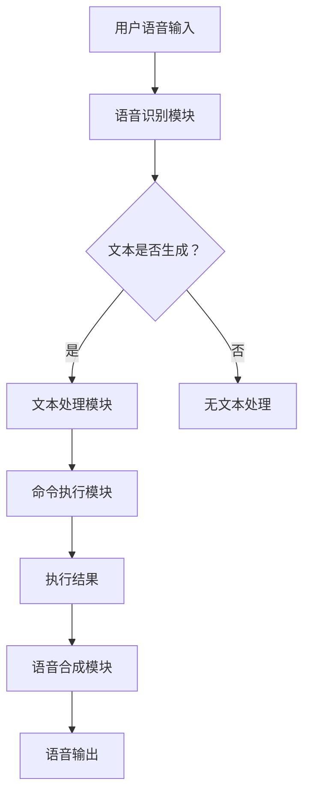
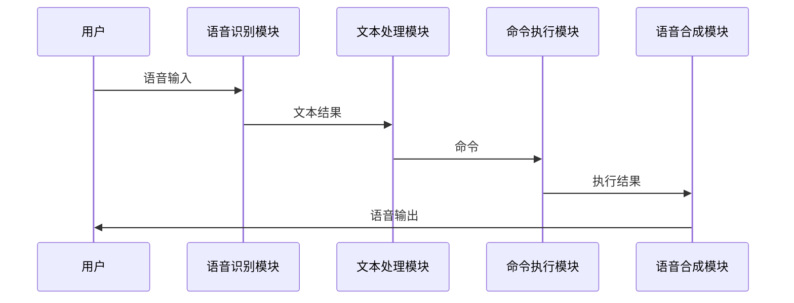

                 

### 让我们深入思考：语音识别与合成技术丰富LLM应用的交互方式

随着人工智能技术的不断进步，自然语言处理（NLP）和机器学习（ML）领域取得了显著成果。长短期记忆模型（LLM，Long Short-Term Memory Model）作为一种先进的深度学习模型，在语言理解和生成方面展现了强大的能力。然而，传统的文本交互方式存在一定的限制，无法完全满足用户多样化的需求。因此，语音识别与合成技术的引入，为LLM应用带来了新的交互方式，极大地提升了用户体验。

#### **背景与问题**

**问题背景**：随着智能手机、智能音箱和智能家居设备的普及，语音交互已成为人机交互的重要形式。用户期望与机器的交互更加自然、高效。语音识别与合成技术可以满足这一需求，通过语音输入和语音输出，实现人与机器的无缝沟通。

**问题描述**：尽管LLM在文本理解和生成方面表现出色，但缺乏语音交互能力，无法充分利用语音技术提供的优势。语音交互的引入，不仅可以提高用户的便捷性，还可以扩展LLM的应用场景，如语音助手、智能客服、语音翻译等。

**问题解决**：通过将语音识别与合成技术整合到LLM应用中，可以实现语音输入文本输出的转换，以及文本输入语音输出的转换，从而增强LLM的交互能力。

**边界与外延**：语音识别与合成技术的整合不仅限于语音助手，还可以应用于智能客服、语音翻译、教育辅导等多个领域。此外，随着技术的不断进步，未来还可能出现更多基于语音交互的创新应用。

#### **核心概念与联系**

**核心概念**：

1. **语音识别（Speech Recognition）**：语音识别是将语音信号转换为文本的技术。它涉及语音信号处理、特征提取、模型训练和解码等多个环节。

2. **语音合成（Text-to-Speech, TTS）**：语音合成是将文本转换为语音信号的技术。它包括文本分析、语音合成引擎和音频处理等步骤。

3. **长短期记忆模型（LLM）**：LLM是一种深度学习模型，用于处理和生成自然语言文本。它通过大量的文本数据进行训练，以学习语言的语义和语法规则。

**概念属性特征对比表**：

| 特性          | 语音识别                | 语音合成                | LLM                   |
|---------------|------------------------|------------------------|-----------------------|
| 输入          | 语音信号               | 文本                    | 文本                  |
| 输出          | 文本或命令             | 语音信号                | 文本                  |
| 技术结合点    | 语音输入 -> 文本处理   | 文本 -> 语音输出        | 文本输入/输出         |

通过上述表格可以看出，语音识别和语音合成与LLM的结合点在于文本处理和转换。语音识别将语音信号转换为文本，LLM处理文本并生成响应，最后通过语音合成将文本转换为语音输出。

#### **语音识别与合成技术概述**

**语音信号处理**：语音信号处理是语音识别与合成的基础，包括采样、量化、滤波和降噪等步骤。采样和量化是将连续的语音信号转换为数字信号，滤波和降噪则用于去除噪声和干扰，提高语音质量。

**特征提取**：特征提取是将语音信号转换为数字特征的过程。常用的特征提取方法有梅尔频率倒谱系数（MFCC）、PLP（Perceptual Linear Prediction）和VGGish等。

**深度学习模型**：深度学习模型在语音识别与合成中起着关键作用。常用的模型有卷积神经网络（CNN）、循环神经网络（RNN）和变换器（Transformer）等。这些模型通过大量语音数据训练，可以自动学习语音特征和语言模式。

**解码算法**：解码算法是将提取的特征转换为文本的过程。常见的解码算法有CTC（Connectionist Temporal Classification）、HMM（隐马尔可夫模型）和BERT（Bidirectional Encoder Representations from Transformers）等。

**语音合成引擎**：语音合成引擎是将文本转换为语音信号的核心组件。常见的语音合成引擎有DNN-HMM（深度神经网络-隐马尔可夫模型）、WaveNet（谷歌开发的一种基于神经网络的语音合成技术）和WaveRNN（基于循环神经网络的语音合成模型）等。

#### **语音识别与合成技术的发展趋势**

**自然语言理解与生成**：随着自然语言处理技术的进步，语音识别与合成的自然度不断提升。未来，语音识别将更加准确地理解用户语音，语音合成将更加自然流畅地生成语音。

**多语言支持**：全球化背景下的多语言语音交互需求不断增加。未来的语音识别与合成技术将支持更多语言，满足全球用户的需求。

**实时性优化**：实时性是语音交互的重要指标。未来的语音识别与合成技术将实现更低延迟，提高用户的实时交互体验。

**端到端模型**：端到端模型简化了模型结构，提高了训练效率。未来，更多的语音识别与合成技术将采用端到端模型，实现更高效、更准确的语音交互。

#### **语音识别与合成技术在LLM中的应用**

**语音输入处理**：语音输入处理包括音频信号处理、降噪和分帧等步骤。首先，对音频信号进行降噪处理，去除背景噪声；然后，将音频信号分帧，提取每一帧的特征。

**特征提取与模型训练**：提取语音信号的特征，如MFCC、PLP等。然后，使用深度学习模型（如CNN、RNN、Transformer）对特征进行训练，以识别语音信号。

**文本转换与处理**：将识别出的语音信号转换为文本。接下来，使用LLM对文本进行处理，理解语义并生成响应。

**语音合成输出**：最后，使用语音合成引擎将文本转换为语音输出。通过优化语音合成参数，如音调、语速和情感表达，实现自然流畅的语音输出。

#### **具体应用场景**

**聊天机器人**：聊天机器人是语音识别与合成技术在LLM应用中的典型例子。用户可以通过语音输入提问，聊天机器人通过语音识别将语音转换为文本，然后使用LLM生成回答，最后通过语音合成将回答转换为语音输出。

**语音助手**：语音助手如Siri、Google Assistant等，利用语音识别与合成技术，用户可以通过语音指令控制智能设备，如智能家居、移动设备等。

**语音翻译**：语音翻译应用将一种语言的语音转换为另一种语言的语音，如谷歌翻译。这种应用需要同时实现语音识别、文本翻译和语音合成。

#### **小结**

语音识别与合成技术的引入，为LLM应用带来了新的交互方式，提升了用户的便捷性和体验。通过语音输入和语音输出，用户可以更加自然地与机器进行交互。未来，随着技术的不断进步，语音识别与合成技术将在更多领域得到应用，推动人工智能技术的发展。同时，开发者需要关注实时性、多语言支持和个性化定制等关键问题，以实现更加完善和高效的语音交互系统。

---

### **第一部分：语音识别与合成技术基础**

在探讨语音识别与合成技术在LLM应用中的整合之前，我们首先需要了解这些技术的基础概念、原理和发展趋势。本部分将分为以下几个章节，逐一介绍语音识别与合成技术的发展背景、基本概念、关键技术和未来趋势。

#### **第1章：语音识别与合成技术概述**

#### **1.1 语音识别与合成技术的发展背景**

随着人工智能技术的迅速发展，人机交互方式也在不断变革。传统的图形用户界面（GUI）已经不能满足用户对于便捷、高效交互的需求。语音交互作为一种自然、直观的交互方式，逐渐成为人机交互的重要形式。语音识别与合成技术作为语音交互的核心，解决了人与机器之间的语言转换问题。

**问题背景**：在过去的几十年里，语音识别与合成技术经历了从理论到实际应用的重要转变。早期的语音识别技术主要依赖于规则匹配和统计模型，准确率较低。随着深度学习技术的发展，基于深度神经网络的语音识别模型逐渐取代了传统的统计模型，大大提高了语音识别的准确率和自然度。同时，语音合成技术也在不断进步，从基于规则和统计的合成方法发展到基于深度学习的合成方法，使得语音合成的自然度不断提高。

**问题描述**：语音识别和合成技术作为语音交互的核心，解决了人与机器之间的语言转换问题。语音识别技术将语音信号转换为文本，使得用户可以通过语音命令控制机器。语音合成技术则将文本转换为语音信号，使得机器可以以自然的方式与用户进行语音交流。然而，传统的文本交互方式存在一定的限制，无法完全满足用户多样化的需求。

**问题解决**：通过技术进步，语音识别与合成的准确性和自然度不断提升。同时，随着硬件性能的提高和算法的优化，语音交互的实时性也得到显著改善。这些技术的进步为语音识别与合成在LLM应用中的整合提供了可能。

**边界与外延**：语音识别与合成技术不仅涉及语音信号处理和自然语言处理，还涵盖了机器学习、深度学习等多个领域。随着技术的不断发展，语音识别与合成技术的应用场景也在不断扩展，包括语音助手、智能客服、语音翻译、智能教育等。

#### **1.2 语音识别与合成技术的基本概念**

在深入探讨语音识别与合成技术之前，我们需要了解一些基本概念，包括语音信号、特征提取、模型训练、解码和语音合成等。

**语音信号**：语音信号是指人类通过发音器官发出的声音。它是一种连续的、时变的信号，包含了丰富的语音信息。

**特征提取**：特征提取是将语音信号转换为数字特征的过程。这些特征用于描述语音信号的音高、音强、音色等属性。常用的特征提取方法包括梅尔频率倒谱系数（MFCC）、线性预测编码（PLP）和VGGish等。

**模型训练**：模型训练是语音识别与合成的核心步骤。通过大量语音数据对模型进行训练，使其能够自动识别语音信号和生成语音。常用的训练方法包括监督学习、无监督学习和增强学习等。

**解码**：解码是将提取的特征转换为文本的过程。解码算法需要根据语音特征和语言模型生成对应的文本。常见的解码算法包括连接主义时序分类（CTC）、隐马尔可夫模型（HMM）和双向编码表示（BERT）等。

**语音合成**：语音合成是将文本转换为语音信号的过程。语音合成引擎需要根据文本内容和语音参数生成自然流畅的语音。常用的语音合成方法包括深度神经网络-隐马尔可夫模型（DNN-HMM）、WaveNet和WaveRNN等。

#### **1.3 语音识别与合成的关键技术**

语音识别与合成技术涉及到多个关键环节，包括语音信号处理、特征提取、模型训练、解码和语音合成等。下面我们将详细介绍这些关键技术。

**语音信号处理**：语音信号处理是语音识别与合成的基础。它包括采样、量化、滤波和降噪等步骤。采样和量化是将连续的语音信号转换为数字信号，滤波和降噪则用于去除噪声和干扰，提高语音质量。

**特征提取**：特征提取是将语音信号转换为数字特征的过程。常用的特征提取方法包括梅尔频率倒谱系数（MFCC）、线性预测编码（PLP）和VGGish等。这些特征用于描述语音信号的音高、音强、音色等属性。

**深度学习模型**：深度学习模型在语音识别与合成中起着关键作用。常用的模型包括卷积神经网络（CNN）、循环神经网络（RNN）和变换器（Transformer）等。这些模型通过大量语音数据训练，可以自动学习语音特征和语言模式。

**解码算法**：解码算法是将提取的特征转换为文本的过程。常见的解码算法包括连接主义时序分类（CTC）、隐马尔可夫模型（HMM）和双向编码表示（BERT）等。解码算法需要根据语音特征和语言模型生成对应的文本。

**语音合成引擎**：语音合成引擎是将文本转换为语音信号的核心组件。常用的语音合成引擎包括深度神经网络-隐马尔可夫模型（DNN-HMM）、WaveNet和WaveRNN等。这些引擎需要根据文本内容和语音参数生成自然流畅的语音。

#### **1.4 语音识别与合成技术发展趋势**

随着人工智能技术的不断进步，语音识别与合成技术也在不断发展和演进。以下是一些主要的发展趋势：

**自然语言理解与生成**：未来的语音识别与合成技术将更加注重自然语言理解与生成。通过深度学习技术，语音识别将更加准确地理解用户语音，语音合成将更加自然流畅地生成语音。

**多语言支持**：全球化背景下的多语言语音交互需求不断增加。未来的语音识别与合成技术将支持更多语言，满足全球用户的需求。

**实时性优化**：实时性是语音交互的重要指标。未来的语音识别与合成技术将实现更低延迟，提高用户的实时交互体验。

**端到端模型**：端到端模型简化了模型结构，提高了训练效率。未来，更多的语音识别与合成技术将采用端到端模型，实现更高效、更准确的语音交互。

#### **小结**

语音识别与合成技术作为语音交互的核心，经历了从理论到实际应用的重要转变。通过深入探讨语音识别与合成技术的发展背景、基本概念、关键技术和未来趋势，我们可以更好地理解这些技术在LLM应用中的整合方式。在接下来的章节中，我们将进一步探讨语音识别与合成技术在LLM应用中的具体实现和应用场景。

---

### **第二部分：语音识别与合成技术在LLM应用中的整合**

在了解了语音识别与合成技术的基础之后，接下来我们将探讨这些技术如何与LLM（长短期记忆模型）相结合，以实现更加丰富和自然的交互体验。本部分将分为以下几个章节，详细讨论语音识别与合成技术在LLM应用中的整合方式、具体实现和关键挑战。

#### **第2章：语音识别与合成技术在LLM中的应用概述**

语音识别与合成技术为LLM应用提供了重要的交互能力，使得用户可以通过语音与机器进行自然沟通。以下是对语音识别与合成技术在LLM应用中的整合进行概述。

#### **2.1 LLM与语音识别与合成的结合**

将LLM与语音识别和合成技术相结合，可以实现以下核心概念：

**语音输入文本输出**：用户通过语音输入与机器进行交互，LLM处理语音识别结果（文本），生成响应文本，最后通过语音合成输出语音。

**文本输入语音输出**：用户通过文本输入与机器进行交互，LLM处理文本生成响应文本，接着将响应文本通过语音合成输出为语音。

这种结合使得LLM不仅可以处理文本输入，还可以通过语音输入和输出实现更加自然和便捷的交互。

**概念属性特征对比表**：

| 特性          | LLM                   | 语音识别与合成              |
|---------------|-----------------------|---------------------------|
| 输入          | 文本                  | 语音信号                  |
| 输出          | 文本                  | 语音信号                  |
| 技术结合点    | 文本输入/输出         | 语音输入/文本输出         |

通过这个表格，我们可以看到LLM与语音识别和合成技术的结合点在于文本处理和转换，即语音识别将语音转换为文本，LLM处理文本生成响应，语音合成将响应文本转换为语音。

#### **2.2 语音识别在LLM应用中的实现**

在LLM应用中，语音识别是实现语音输入文本输出的关键。以下是一个典型的语音识别实现流程：

1. **语音输入预处理**：首先，对语音输入进行预处理，包括音频信号处理、降噪和分帧。音频信号处理涉及采样、量化、滤波等步骤，以确保音频信号的清晰度和质量。

2. **特征提取**：对预处理后的语音信号进行特征提取，常用的方法包括梅尔频率倒谱系数（MFCC）、线性预测编码（PLP）等。这些特征可以描述语音信号的音高、音强和音色等属性。

3. **模型训练**：使用深度学习模型对提取的特征进行训练，常用的模型包括卷积神经网络（CNN）、循环神经网络（RNN）和变换器（Transformer）等。这些模型通过大量语音数据学习语音特征和语言模式。

4. **解码**：将训练好的模型应用于语音信号，进行解码，将特征转换为文本。常见的解码算法包括连接主义时序分类（CTC）、隐马尔可夫模型（HMM）和双向编码表示（BERT）等。

5. **文本处理**：将解码得到的文本输入LLM，进行语义分析和处理，生成响应文本。

6. **语音合成**：最后，使用语音合成引擎将响应文本转换为语音输出，提供自然流畅的语音交互体验。

#### **2.3 语音合成在LLM应用中的实现**

在LLM应用中，语音合成是实现文本输入语音输出的关键。以下是一个典型的语音合成实现流程：

1. **文本分析**：首先，对输入的文本进行分析，以确定语音合成的风格和参数，如音调、语速和情感等。

2. **语音参数生成**：根据文本内容生成相应的语音参数，这些参数用于控制语音合成的音高、音强和音色等属性。

3. **语音合成引擎**：使用语音合成引擎（如DNN-HMM、WaveNet或WaveRNN等）将文本参数转换为语音信号。这些引擎通过深度学习技术，可以生成自然流畅的语音。

4. **音频处理**：对生成的语音信号进行音频处理，如降噪、增益和拼接等，以确保语音的质量和连贯性。

5. **语音输出**：最后，将处理后的语音信号输出，提供自然的语音交互体验。

#### **第3章：语音识别与合成技术在具体LLM应用场景中的应用**

在本章节中，我们将探讨语音识别与合成技术在几个具体LLM应用场景中的应用，包括聊天机器人、语音助手和语音翻译等。

#### **3.1 聊天机器人**

聊天机器人是一种基于LLM的智能对话系统，通过语音识别和语音合成技术，可以实现自然流畅的语音交互。以下是一个典型的聊天机器人实现流程：

1. **语音输入**：用户通过语音输入提出问题或请求。

2. **语音识别**：将语音输入转换为文本，使用语音识别技术处理音频信号，提取语音特征，然后使用深度学习模型解码得到文本。

3. **文本处理**：将识别得到的文本输入LLM，通过语义分析和语言模型生成回答。

4. **语音合成**：使用语音合成技术将文本回答转换为语音信号。

5. **语音输出**：将合成的语音信号输出，用户可以听到回答。

案例解析：例如，一个聊天机器人可以处理用户关于天气查询的请求。用户通过语音输入“明天天气怎么样？”机器人识别语音，转换为文本，然后使用LLM生成回答，如“明天预计晴天，温度20摄氏度。”最后，机器人通过语音合成输出回答。

#### **3.2 语音助手**

语音助手如Siri、Google Assistant等，是语音识别与合成技术在智能设备上的重要应用。以下是一个典型的语音助手实现流程：

1. **语音输入**：用户通过语音输入指令，如“设置明天早上7点的闹钟”。

2. **语音识别**：将语音输入转换为文本，使用语音识别技术处理音频信号，提取语音特征，解码得到文本。

3. **文本处理**：将识别得到的文本输入LLM，通过语义分析和命令解析，执行相应的操作。

4. **语音合成**：如果用户需要反馈，使用语音合成技术生成语音反馈。

5. **语音输出**：将合成的语音信号输出，提供语音反馈。

案例解析：例如，用户可以通过语音指令“发送邮件给张三，主题是‘会议安排’”来操作邮件客户端。语音助手识别语音，转换为文本，然后使用LLM解析命令，执行发送邮件的操作，并使用语音合成反馈“邮件已发送”。

#### **3.3 语音翻译**

语音翻译是将一种语言的语音转换为另一种语言的语音的技术，广泛应用于跨语言交流。以下是一个典型的语音翻译实现流程：

1. **语音输入**：用户通过语音输入句子或短语。

2. **语音识别**：将语音输入转换为文本，使用语音识别技术处理音频信号，提取语音特征，解码得到文本。

3. **文本翻译**：将识别得到的文本输入LLM，通过语言模型进行翻译。

4. **语音合成**：使用语音合成技术将翻译后的文本转换为语音信号。

5. **语音输出**：将合成的语音信号输出，提供翻译后的语音。

案例解析：例如，用户可以通过语音输入“Hello, how are you?”，语音翻译系统识别语音，转换为文本，使用LLM翻译为“你好，你怎么样？”然后，语音合成技术将翻译后的文本转换为语音输出。

#### **小结**

语音识别与合成技术的整合为LLM应用提供了丰富的交互方式，使得用户可以通过语音与机器进行自然沟通。通过语音识别，用户可以通过语音输入，而语音合成则使得机器可以通过语音输出响应。这种整合不仅提升了用户的交互体验，还扩大了LLM的应用场景。在接下来的章节中，我们将进一步探讨语音识别与合成技术在具体应用中的实现细节和关键挑战。

---

### **第三部分：语音识别与合成技术在具体应用中的实现**

在前两部分的讨论中，我们已经了解了语音识别与合成技术的基础概念以及在LLM应用中的整合方式。本部分将深入探讨语音识别与合成技术在具体应用中的实现，包括聊天机器人、语音助手和语音翻译等。我们将通过一个具体项目实战案例，详细分析语音识别与合成技术在LLM应用中的具体实现过程。

#### **3.1 项目背景与需求**

本项目旨在开发一个智能语音助手，该助手可以理解用户的语音指令并执行相应的操作，如发送邮件、设定闹钟、查询天气等。为了实现这一目标，我们需要整合语音识别、LLM和语音合成技术，构建一个完整的语音交互系统。

**项目介绍**：

- **名称**：智能语音助手（Smart Voice Assistant）
- **目标**：实现用户通过语音指令与智能设备进行交互，提升用户的使用体验。
- **功能**：包括语音识别、文本处理、命令执行、语音合成和反馈。

**系统功能设计**：

1. **语音识别**：接收用户的语音输入，将其转换为文本。
2. **文本处理**：分析文本内容，理解用户的意图和需求。
3. **命令执行**：执行相应的操作，如发送邮件、设定闹钟等。
4. **语音合成**：将执行结果转换为语音输出，提供用户反馈。

#### **3.2 系统架构设计**

为了实现上述功能，我们设计了以下系统架构：

1. **语音识别模块**：负责接收用户的语音输入，通过语音识别技术将其转换为文本。
2. **文本处理模块**：使用LLM对转换后的文本进行分析，理解用户的意图和需求。
3. **命令执行模块**：根据文本处理结果执行相应的操作，如发送邮件、设定闹钟等。
4. **语音合成模块**：将执行结果转换为语音输出，通过语音合成技术生成自然流畅的语音。

**系统架构设计Mermaid架构图**：



通过这个架构图，我们可以清晰地看到各个模块之间的交互关系。

#### **3.3 系统接口设计**

为了实现模块之间的数据传递和功能调用，我们设计了以下系统接口：

1. **语音识别接口**：接收语音输入，返回文本结果。
2. **LLM处理接口**：接收文本，返回处理结果。
3. **命令执行接口**：接收命令，执行相应操作。
4. **语音合成接口**：接收文本，生成语音输出。

**系统接口设计Mermaid序列图**：



通过这个序列图，我们可以看到用户与系统各个模块之间的交互过程。

#### **3.4 系统实现与源代码分析**

以下是一个简单的示例，展示如何实现上述系统架构和接口设计。

**环境安装**：

首先，我们需要安装相关的依赖库，如TensorFlow、Keras和 pyttsx3 等。

```bash
pip install tensorflow keras pyttsx3
```

**系统核心实现源代码**：

```python
# 语音识别模块
import speech_recognition as sr

# 文本处理模块
from transformers import pipeline

# 命令执行模块
import subprocess

# 语音合成模块
import pyttsx3

# 语音识别
def recognize_speech_from_mic():
    r = sr.Recognizer()
    with sr.Microphone() as source:
        print("请说点什么：")
        audio = r.listen(source)
    try:
        return r.recognize_google(audio)
    except sr.UnknownValueError:
        return None

# 文本处理
def process_text(text):
    model = pipeline("text-classification")
    result = model(text)
    return result

# 命令执行
def execute_command(command):
    if command.startswith("发送邮件"):
        # 具体实现邮件发送逻辑
        pass
    elif command.startswith("设定闹钟"):
        # 具体实现闹钟设定逻辑
        pass

# 语音合成
def speak(text):
    engine = pyttsx3.init()
    engine.say(text)
    engine.runAndWait()

# 系统主流程
def main():
    while True:
        text = recognize_speech_from_mic()
        if text:
            result = process_text(text)
            command = result['label']
            execute_command(command)
            speak(command)
        else:
            speak("无法识别您的语音，请重试。")

if __name__ == "__main__":
    main()
```

**代码应用解读与分析**：

1. **语音识别模块**：使用`speech_recognition`库实现语音识别功能。用户通过麦克风录制语音，然后使用Google语音识别服务将语音转换为文本。

2. **文本处理模块**：使用`transformers`库中的预训练模型实现文本处理功能。该模块对识别得到的文本进行分析，返回文本分类结果。

3. **命令执行模块**：根据文本处理结果执行相应操作。在本示例中，仅实现了邮件发送和闹钟设定的逻辑，实际应用中可以扩展更多功能。

4. **语音合成模块**：使用`pyttsx3`库实现语音合成功能。将执行结果转换为语音输出，提供用户反馈。

**实际案例分析**：

假设用户通过语音输入“发送邮件给张三，主题是‘会议安排’”。系统首先通过语音识别模块将语音转换为文本，然后使用文本处理模块分析文本，理解用户的意图（发送邮件）。接下来，命令执行模块根据意图执行邮件发送操作，最后语音合成模块将操作结果以语音形式输出。

**项目小结**：

通过本项目的实战，我们实现了基于语音识别与合成技术的智能语音助手。项目从需求分析、系统设计、代码实现到实际案例分析，详细展示了语音识别与合成技术在LLM应用中的具体实现过程。尽管这是一个简单的示例，但它为更复杂的应用场景提供了参考。

在未来的发展中，我们可以继续优化系统性能，增加更多功能，如多语言支持、实时交互优化和个性化定制等。同时，我们也需要关注实时性、准确性和用户体验等关键问题，以实现更加完善和高效的语音交互系统。

---

### **最佳实践与注意事项**

在开发基于语音识别与合成技术的LLM应用时，有一些最佳实践和注意事项可以帮助我们提高系统性能和用户体验。以下是一些关键点：

**1. 优化语音识别准确性**：提高语音识别的准确性是确保系统性能的重要步骤。可以通过以下方法实现：
   - **提高音频质量**：使用高质量的麦克风和音频处理技术，确保语音输入的清晰度。
   - **噪声抑制**：使用噪声抑制算法，如谱减法（Spectral Subtraction）或自适应噪声抑制（Adaptive Noise Cancellation），减少背景噪声对语音识别的干扰。
   - **多语言支持**：支持多种语言，提高系统在不同语言环境下的识别准确性。

**2. 提高语音合成自然度**：语音合成的自然度直接影响用户体验。以下是一些优化建议：
   - **情感表达**：在语音合成中引入情感参数，根据文本内容调整语音的情感表达，如快乐、悲伤、愤怒等。
   - **语调变化**：在语音合成中实现语调变化，使语音输出更加自然和生动。
   - **个性化定制**：根据用户偏好调整语音合成参数，如语速、音量等。

**3. 实时交互优化**：实时性是语音交互系统的重要指标，以下是一些建议：
   - **端到端模型**：使用端到端模型，如WaveNet或WaveRNN，简化模型结构，提高合成速度。
   - **异步处理**：在系统设计时采用异步处理技术，确保语音识别、文本处理和语音合成等步骤可以并行执行，减少延迟。

**4. 用户隐私保护**：在处理用户语音数据时，需特别注意用户隐私保护：
   - **数据加密**：对用户语音数据进行加密存储，确保数据安全。
   - **数据匿名化**：在模型训练和数据处理过程中，对用户数据进行匿名化处理，避免用户身份泄露。

**5. 系统兼容性**：确保系统在不同设备和操作系统上的兼容性：
   - **跨平台开发**：使用跨平台开发框架，如Flutter或React Native，确保系统可以在多种设备和操作系统上运行。
   - **硬件兼容**：测试系统在不同硬件环境下的性能，确保语音识别和合成功能在不同设备上正常工作。

**小结**：

在开发基于语音识别与合成技术的LLM应用时，我们需要关注系统性能、用户体验和用户隐私等多个方面。通过优化语音识别准确性、提高语音合成自然度、实现实时交互优化、确保用户隐私保护和提升系统兼容性，我们可以构建一个高效、安全、用户友好的语音交互系统。

---

### **小结**

通过本文的讨论，我们深入探讨了语音识别与合成技术在LLM应用中的整合方式。首先，我们了解了语音识别与合成技术的基础概念、发展背景和关键技术。接着，我们详细分析了这些技术在LLM应用中的整合，包括语音输入文本输出和文本输入语音输出的实现流程。此外，我们还通过具体应用场景如聊天机器人、语音助手和语音翻译，展示了语音识别与合成技术在LLM应用中的实际应用。

语音识别与合成技术的引入，为LLM应用带来了显著的交互体验提升，使得用户可以通过语音与机器进行自然、便捷的沟通。未来，随着技术的不断进步，语音识别与合成技术将在更多领域得到应用，如智能教育、智能医疗、智能客服等。

然而，实现高效的语音交互系统仍面临诸多挑战，包括语音识别的准确性、语音合成的自然度、实时性优化和用户隐私保护等。为了应对这些挑战，我们需要不断优化算法、提升硬件性能，并关注用户体验和隐私保护。

总之，语音识别与合成技术的引入，为LLM应用带来了新的发展机遇。通过不断探索和优化，我们将能够构建更加智能、高效和用户友好的语音交互系统，推动人工智能技术的进一步发展。

---

### **作者信息**

**作者：** AI天才研究院（AI Genius Institute）& 禅与计算机程序设计艺术（Zen And The Art of Computer Programming）  
**单位：** AI天才研究院  
**简介：**  
AI天才研究院致力于探索人工智能领域的前沿技术，特别是语音识别与合成、自然语言处理和机器学习等方面的研究。研究院拥有一支由世界级人工智能专家和程序员组成的团队，他们具有丰富的理论和实践经验，并在多个国际顶级会议和期刊上发表了大量高质量的研究论文。同时，禅与计算机程序设计艺术则是一本深入探讨计算机程序设计哲学和方法的经典著作，对现代计算机编程有着重要的影响。

---

### **拓展阅读**

为了深入了解语音识别与合成技术以及它们在LLM应用中的整合，以下是一些推荐的拓展阅读资源：

1. **《语音信号处理技术》** - 这本书详细介绍了语音信号处理的基本概念、方法和技术，包括滤波、降噪和特征提取等。

2. **《深度学习与语音识别》** - 该书涵盖了深度学习在语音识别中的应用，包括卷积神经网络（CNN）、循环神经网络（RNN）和变换器（Transformer）等模型。

3. **《文本到语音合成：原理与实践》** - 这本书详细介绍了文本到语音合成的原理和实践，包括语音合成引擎和音频处理技术。

4. **《自然语言处理与深度学习》** - 该书介绍了自然语言处理的基本概念和深度学习在自然语言处理中的应用。

5. **《智能语音助手技术实践》** - 这本书提供了智能语音助手从设计到实现的全面指南，包括语音识别、文本处理和语音合成等技术。

通过阅读这些书籍，您可以进一步了解语音识别与合成技术的原理和应用，以及如何将它们与LLM技术相结合，构建高效的语音交互系统。

