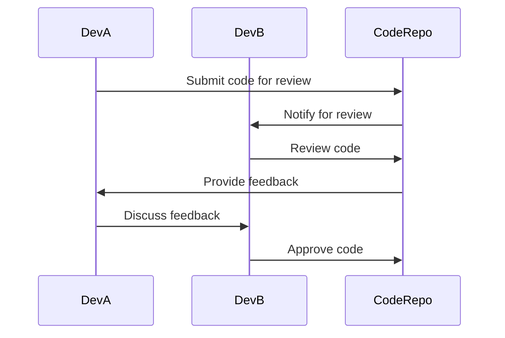
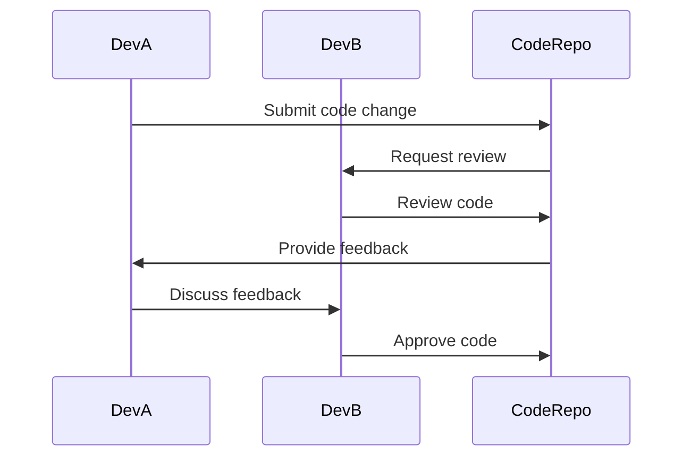

                 

### Introduction and Background

#### Importance of Cross-Team Code Review

In the modern software development landscape, cross-team code review has emerged as a critical practice for ensuring high-quality deliverables. As projects grow in complexity and teams become more distributed, the need for a structured approach to code review becomes even more pronounced. Cross-team code review serves several vital purposes:

1. **Quality Assurance**: It helps identify bugs, code smells, and potential issues before the code is merged, ensuring that the final product is of high quality.
2. **Knowledge Sharing**: It facilitates knowledge transfer across teams, enabling developers to learn from each other's code and adopt best practices.
3. **Collaboration**: It encourages collaboration and communication among team members, fostering a culture of shared responsibility and collective accountability.
4. **Standardization**: It helps establish coding standards and guidelines, ensuring consistency across the codebase.
5. **Security**: It enhances security by identifying vulnerabilities and ensuring that security best practices are followed.

#### Background of Requirements in Implementation

Effective cross-team code review is closely tied to the requirements phase of the software development lifecycle. The requirements define what the software should do and provide a clear set of expectations that guide the implementation process. Here's how requirements play a crucial role:

1. **Alignment**: Requirements help align the code with the desired functionality, ensuring that the implementation meets the business needs.
2. **Clarity**: Clear and well-defined requirements provide a clear direction for developers, reducing ambiguity and potential misinterpretations.
3. **Validation**: Requirements can be used to validate the code during the review process, ensuring that the implementation adheres to the specified requirements.
4. **Risk Mitigation**: By involving stakeholders early in the review process, potential risks and issues can be identified and mitigated before they become significant problems.
5. **Traceability**: Requirements provide traceability, allowing developers to understand the context and rationale behind specific code implementations.

#### Basic Concepts of Cross-Team Code Review

Cross-team code review involves developers from different teams reviewing each other's code. This process typically includes the following steps:

1. **Code Submission**: Developers submit their code for review, usually through a version control system.
2. **Review Request**: The reviewer is notified and given access to the code.
3. **Code Analysis**: The reviewer analyzes the code, looking for issues, bugs, and areas for improvement.
4. **Feedback**: The reviewer provides feedback on the code, highlighting any concerns or suggestions for changes.
5. **Discussion**: Developers discuss the feedback, making necessary changes and resolving any disputes.
6. **Approval**: Once the code is approved, it is merged into the main codebase.

The following diagram illustrates the basic process of cross-team code review:

In summary, cross-team code review is a vital practice that enhances the quality of software deliverables. By aligning the code with requirements and involving multiple teams in the review process, it ensures that the final product meets both technical and business expectations.

### Core Concepts and Framework

#### Code Review Process

The code review process is a systematic approach to evaluating code changes before they are merged into the main codebase. This process typically involves the following steps:

1. **Code Submission**: Developers submit their code changes to a version control system, such as Git. The submission includes a pull request (PR) or a merge request (MR), which serves as a formal request for the code to be reviewed.
2. **Review Request**: The reviewer is notified and granted access to the code. This can be done manually or automatically by the version control system.
3. **Code Analysis**: The reviewer thoroughly examines the code, looking for potential bugs, performance issues, code smells, and adherence to coding standards.
4. **Feedback**: The reviewer provides detailed feedback on the code, pointing out areas that require improvement and suggesting changes. This feedback is typically documented in the version control system or a separate issue tracker.
5. **Discussion**: Developers and reviewers discuss the feedback, clarifying any concerns and determining the best course of action. This may involve additional iterations of the review process.
6. **Approval**: Once all issues have been addressed and the code is deemed acceptable, it is merged into the main codebase.

The following diagram illustrates the typical process of a code review:

#### Types of Code Reviews

There are several types of code reviews, each with its own advantages and use cases. The choice of code review type often depends on the project's requirements, team size, and development methodology. Here are some common types of code reviews:

1. **Peer Review**: This is the most common type of code review, where developers from the same team or department review each other's code. Peer review promotes collaboration, knowledge sharing, and adherence to coding standards.
2. **Pair Review**: In a pair review, two developers work together to review code. This can help improve code quality and facilitate a deeper understanding of the codebase.
3. **Formal Review**: A formal review is a structured process where code changes are reviewed by a designated group of reviewers. Formal reviews are often used in industries with stringent compliance requirements.
4. **Pull Request Review**: This is a type of peer review that is integrated into version control systems like Git. Developers submit their code changes as a pull request, and other team members can review and provide feedback.
5. **External Review**: An external review involves bringing in external developers or domain experts to review the code. This can be useful for gaining an unbiased perspective and ensuring that the code meets industry standards.

#### The Role of Requirements in Code Reviews

Requirements play a crucial role in code reviews, as they provide the foundation for evaluating the quality and completeness of the code. Here are some key ways in which requirements influence the code review process:

1. **Alignment**: Requirements ensure that the code aligns with the project's objectives and business needs. During the review, the code is compared against the requirements to ensure that it meets the specified functionality.
2. **Validation**: Requirements serve as a benchmark for validating the code. Reviewers can use the requirements to verify that the code implements the desired features and behaves as expected.
3. **Traceability**: Requirements provide traceability, allowing reviewers to understand the context and purpose of specific code changes. This helps in identifying the rationale behind certain design decisions and facilitates better discussions during the review process.
4. **Risk Mitigation**: By reviewing the code against requirements, potential issues and risks can be identified early on. This helps in mitigating problems before they escalate into more significant issues.
5. **Documentation**: Requirements can be used to document the expected behavior of the code. This documentation can be helpful during the review process to provide clarity and context to the reviewers.

In summary, the code review process is a critical component of software development, and requirements play a vital role in guiding and enhancing this process. By ensuring that the code aligns with the specified requirements, cross-team code reviews help in delivering high-quality software that meets both technical and business expectations.

### Principles and Methods of Conducting Effective Cross-Team Code Reviews

#### Principles of Cross-Team Code Reviews

Effective cross-team code reviews require a set of well-defined principles to ensure that the process is productive and beneficial for all parties involved. These principles include:

1. **Objectivity**: Reviewers should approach the code with an objective mindset, focusing on the code's quality rather than the author's identity or background.
2. **Timeliness**: Code reviews should be conducted promptly to catch issues early in the development cycle. Delayed reviews can lead to increased costs and rework.
3. **Constructive Feedback**: Feedback should be constructive and focused on improving the code rather than attacking the author. It's important to maintain a professional and respectful tone.
4. **Mutual Respect**: All team members should respect each other's opinions and be open to suggestions and critiques. This fosters a collaborative and positive working environment.
5. **Communication**: Clear and open communication is essential throughout the review process. Reviewers should provide detailed feedback, and developers should be responsive to questions and concerns.
6. **Balance**: While it's important to catch as many issues as possible, it's also essential to balance thoroughness with efficiency. Reviewers should prioritize high-risk areas and avoid unnecessary nitpicking.

#### Methods of Conducting Cross-Team Code Reviews

There are several methods for conducting cross-team code reviews, each with its own advantages and use cases. Here are some common methods:

1. **Pull Request Reviews**: This method integrates code reviews into the version control system, such as Git. Developers submit their code changes as a pull request, and other team members can review and provide feedback. Pull request reviews are efficient and provide a centralized location for all discussions and feedback.

2. **Pair Reviews**: In pair reviews, two developers work together to review code. One developer acts as the driver, writing the code, while the other acts as the navigator, providing feedback and guidance. This method promotes knowledge sharing and can lead to improved code quality.

3. **Formal Code Reviews**: Formal code reviews are a structured process where a designated group of reviewers evaluates code changes. This method is often used in industries with stringent compliance requirements. Formal reviews ensure that all aspects of the code are thoroughly examined and that the code adheres to organizational standards.

4. **Ad Hoc Reviews**: Ad hoc reviews are informal and spontaneous reviews where developers review each other's code on an as-needed basis. This method can be effective for small teams or projects with a tight deadline.

5. **Review Meetings**: In review meetings, a group of developers and stakeholders gather to discuss code changes. This method is useful for addressing complex issues and ensuring that all concerns are addressed. Review meetings can be held in person or virtually.

#### Best Practices for Conducting Code Reviews

To ensure the effectiveness of cross-team code reviews, it's important to follow best practices. Here are some key recommendations:

1. **Define Review Criteria**: Clearly define the criteria for what constitutes a high-quality code review. This includes factors such as code readability, adherence to coding standards, and potential performance issues.
2. **Set Reviewer Expectations**: Communicate the expectations for reviewers, including the scope of the review, the level of detail required, and the timeline for providing feedback.
3. **Conduct Regular Reviews**: Schedule regular code reviews to ensure that they become an integral part of the development process. This helps in maintaining code quality and catching issues early.
4. **Provide Timely Feedback**: Aim to provide feedback within a reasonable timeframe to ensure that developers can address issues promptly.
5. **Encourage Open Communication**: Encourage developers to ask questions and seek clarification during the review process. This helps in resolving ambiguities and ensuring a thorough understanding of the code.
6. **Focus on Business Value**: Prioritize reviews based on the potential impact on business value. Focus on high-risk areas and critical code paths first.
7. **Celebrate Successes**: Recognize and celebrate successful code reviews and improvements. This helps in fostering a positive culture of code review and encourages ongoing participation.

In conclusion, effective cross-team code reviews are essential for maintaining high code quality and fostering a collaborative development environment. By following established principles and best practices, teams can ensure that their code reviews are productive, efficient, and beneficial for all stakeholders.

### Successful Case Studies of Cross-Team Code Reviews

#### Case Study 1: The Experience of an Internet Company

One prominent example of the successful implementation of cross-team code reviews is a leading internet company. This company, known for its rapid development cycles and high-quality standards, has incorporated cross-team code reviews into its development workflow. The following highlights the key aspects of their approach:

**Challenges Faced**:

1. **Diverse Teams**: The company operates with diverse teams working on various projects simultaneously. Each team has its own set of technologies and coding practices.
2. **Fast-paced Development**: With multiple product releases every month, the company needed a fast and efficient code review process to ensure timely delivery without compromising quality.
3. **Communication Barriers**: Given the distributed nature of the teams, communication barriers posed a significant challenge during code reviews.

**Solution and Results**:

1. **Standardized Review Process**: The company established a standardized review process, including clear criteria for what constitutes a high-quality code review. This process ensured consistency across all teams and helped mitigate communication barriers.
2. **Automated Tools**: The company leveraged automated code review tools to streamline the process. These tools provided real-time feedback on code quality, catching issues early and allowing developers to address them promptly.
3. **Regular Review Meetings**: To address communication barriers, the company organized regular review meetings where team leads and key developers gathered to discuss code changes and resolve any issues.
4. **Positive Outcomes**: The implementation of cross-team code reviews led to several positive outcomes. The company observed a significant reduction in the number of bugs and code smells in the production environment. Additionally, the practice fostered a culture of collaboration and knowledge sharing among team members.

#### Case Study 2: The Case of a Financial Technology Company

Another successful example comes from a financial technology (FinTech) company. This company, operating in a highly regulated industry, emphasizes security and compliance in its development process. The following outlines their approach to cross-team code reviews:

**Challenges Faced**:

1. **Stringent Compliance Requirements**: The FinTech industry has strict compliance requirements that necessitate thorough code reviews to ensure adherence to regulations.
2. **Complex Systems**: The company's systems are highly complex, with multiple layers of code interacting with each other. This complexity made it challenging to identify potential issues during development.
3. **Inadequate Documentation**: Prior to implementing cross-team code reviews, the company had inadequate documentation, making it difficult for reviewers to understand the code and its context.

**Solution and Results**:

1. **Formal Review Process**: The company adopted a formal review process, involving a designated group of reviewers with expertise in various areas of the system. This group was responsible for ensuring that the code met both technical and compliance standards.
2. **Comprehensive Documentation**: To address the issue of inadequate documentation, the company invested in improving its documentation practices. This included creating detailed documentation for each component of the system and providing clear context for the code changes.
3. **Regular Training Sessions**: To ensure that reviewers were well-versed in both the technical aspects and compliance requirements, the company conducted regular training sessions. These sessions covered best practices for code review and the specific regulations that applied to the company's industry.
4. **Positive Outcomes**: The implementation of cross-team code reviews had a significant impact on the company's development process. The number of compliance violations and critical bugs in the production environment decreased significantly. Moreover, the practice helped in building a repository of knowledge and best practices that could be leveraged across the organization.

#### Common Lessons Learned

From these case studies, several key lessons can be derived:

1. **Standardization and Consistency**: Establishing a standardized review process and maintaining consistency in the review criteria are crucial for the success of cross-team code reviews.
2. **Investment in Tools and Training**: Leveraging automated tools and investing in training for reviewers can greatly enhance the efficiency and effectiveness of the code review process.
3. **Documentation**: Comprehensive documentation provides valuable context for reviewers, helping them understand the code and its purpose.
4. **Regular Communication**: Regular review meetings and open communication channels are essential for resolving issues and maintaining a collaborative atmosphere.

In conclusion, successful cross-team code reviews can significantly enhance the quality of software deliverables. By addressing challenges and implementing best practices, organizations can foster a culture of collaboration and ensure that their code meets both technical and business requirements.

### Practical Steps for Implementing Cross-Team Code Reviews

#### Preparation Phase

The first step in implementing cross-team code reviews is thorough preparation. This phase involves several key activities:

1. **Define Review Criteria**: Establish clear criteria for what constitutes a high-quality code review. This includes factors such as code readability, adherence to coding standards, potential performance issues, and security considerations.
2. **Establish Roles and Responsibilities**: Clearly define the roles and responsibilities of reviewers and developers. Reviewers should be assigned based on their expertise and availability, ensuring a balanced distribution of review tasks.
3. **Create Review Workflow**: Develop a structured workflow for the code review process, including steps such as code submission, review request, feedback collection, and code approval.
4. **Select Review Tools**: Choose appropriate tools for conducting code reviews. These tools can range from simple comment systems integrated with version control systems to more sophisticated platforms with advanced features like automated code analysis and collaboration tools.

#### Execution Phase

Once the preparation phase is complete, the execution phase begins. This phase focuses on actually conducting the code reviews:

1. **Code Submission**: Developers submit their code changes as pull requests or merge requests, including a description of the changes and any relevant documentation.
2. **Review Request**: The reviewer is notified and granted access to the code. The reviewer should prioritize reviews based on risk factors, such as the complexity of the code and the potential impact on the system.
3. **Code Analysis**: The reviewer thoroughly examines the code, looking for potential bugs, performance issues, code smells, and adherence to coding standards. They should document any issues or suggestions for improvement in the version control system or a separate issue tracker.
4. **Feedback**: The reviewer provides detailed feedback on the code, highlighting areas for improvement and suggesting specific changes. It's important to maintain a constructive and respectful tone in the feedback.
5. **Discussion**: Developers and reviewers discuss the feedback, addressing any questions or concerns. This may involve additional iterations of the review process to ensure all issues are resolved.
6. **Approval**: Once all issues have been addressed and the code is deemed acceptable, it is merged into the main codebase. The reviewer should provide final approval, ensuring that all changes meet the established criteria.

#### Follow-up Phase

The follow-up phase is crucial for ensuring the ongoing effectiveness of the code review process:

1. **Review Feedback**: Collect and analyze feedback from the code review process. This can help identify common issues or areas for improvement in the development process.
2. **Continuous Improvement**: Use the feedback to refine the review process, such as by updating review criteria, improving documentation, or providing additional training for reviewers.
3. **Monitor Code Quality**: Regularly monitor the quality of the codebase to ensure that the benefits of cross-team code reviews are sustained. This can involve conducting periodic audits or using automated tools to track code quality metrics.
4. **Recognition and Incentives**: Recognize and reward developers and reviewers who consistently contribute to high code quality. This can help foster a culture of excellence and encourage ongoing participation in the code review process.

By following these practical steps, organizations can effectively implement cross-team code reviews, leading to improved code quality, reduced bugs, and enhanced collaboration among teams.

### Challenges and Solutions in Cross-Team Code Reviews

#### Common Challenges

While cross-team code reviews offer numerous benefits, they are not without challenges. Here are some of the most common challenges and their potential solutions:

1. **Time Management**: One of the primary challenges in cross-team code reviews is managing time effectively. Reviewers may have limited availability, and delays in providing feedback can hinder the development process.

   **Solution**: Implement a time-boxed review process, where reviewers are given a specific time frame (e.g., 24-48 hours) to provide feedback. Additionally, prioritize reviews based on urgency and impact, focusing on high-risk areas first.

2. **Communication Barriers**: With teams often working across different time zones and cultures, communication barriers can make it difficult to conduct effective code reviews.

   **Solution**: Use collaboration tools and establish clear communication channels. Encourage regular communication through video calls, instant messaging, and email updates. Also, provide training on cross-cultural communication to improve understanding and collaboration.

3. **Differing Coding Standards**: Different teams may have varying coding standards and practices, which can lead to conflicts and confusion during code reviews.

   **Solution**: Establish a unified set of coding standards and guidelines that all teams must follow. Conduct workshops or training sessions to ensure that all team members are aware of and adhere to these standards.

4. **Overwhelming Review Load**: Reviewing large code changes can be overwhelming, leading to fatigue and reduced effectiveness.

   **Solution**: Break down large code changes into smaller, manageable pieces. Encourage reviewers to focus on specific aspects of the code, such as functionality, performance, or security, to make the process more manageable.

5. **Inadequate Documentation**: Insufficient documentation can make it difficult for reviewers to understand the code and its context, reducing the effectiveness of the review.

   **Solution**: Invest in comprehensive documentation, including code comments, documentation files, and context-sensitive help. Encourage developers to write clear and informative commit messages and pull request descriptions.

6. **Bias and Subjectivity**: Reviewers may bring their personal biases and preferences into the code review process, leading to subjective evaluations and potential conflicts.

   **Solution**: Foster a culture of objectivity and fairness in the review process. Clearly define review criteria and evaluate code based on objective standards rather than personal preferences.

#### Additional Strategies

In addition to addressing these common challenges, here are some additional strategies for overcoming obstacles in cross-team code reviews:

1. **Regular Training and Feedback**: Conduct regular training sessions to improve reviewers' skills and knowledge. Provide feedback on their performance and encourage them to seek feedback from peers.
2. **Incentives and Recognition**: Offer incentives and recognition for developers and reviewers who contribute to high code quality. This can help motivate team members and encourage ongoing participation in the code review process.
3. **Automated Tools**: Leverage automated code review tools to identify potential issues early. These tools can free up reviewers' time, allowing them to focus on more complex problems.
4. **Foster a Collaborative Culture**: Encourage open communication, collaboration, and a sense of shared responsibility among team members. This can help resolve conflicts and build a positive working environment.

By addressing these challenges and implementing these strategies, organizations can enhance the effectiveness of their cross-team code reviews, leading to improved code quality and a more collaborative development process.

### Conclusion and Future Directions

In conclusion, cross-team code review is a critical practice in modern software development, ensuring high-quality deliverables and fostering collaboration among diverse teams. This comprehensive guide has covered the importance of cross-team code reviews, the principles and methods for conducting effective reviews, case studies of successful implementations, practical steps for implementation, challenges and solutions, and the future directions of this practice.

Key takeaways include the importance of clear and standardized review processes, the role of requirements in guiding code reviews, the benefits of leveraging automated tools, and the need for ongoing training and feedback to improve reviewer skills. The insights shared in this guide can help organizations optimize their code review processes, leading to better software quality and more cohesive team collaboration.

Looking to the future, we can expect continued advancements in code review tools and methodologies. Automation will play an increasingly significant role in identifying potential issues, freeing up reviewers' time to focus on more complex problems. Additionally, the rise of more collaborative and intelligent code review platforms will further enhance the efficiency and effectiveness of code reviews. As software development continues to evolve, so too will the practices and tools that support it, making cross-team code review an indispensable part of the software development lifecycle. For further reading on this topic, consider exploring resources on modern code review platforms, best practices in code quality assurance, and emerging trends in collaborative development practices.

