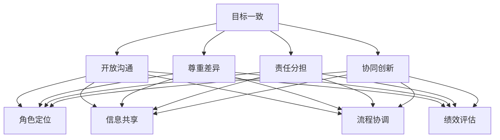

                 

### 引言与背景

#### 1.1 跨团队协作的重要性与挑战

跨团队协作在当今复杂的应用开发项目中显得尤为重要。随着信息技术的快速发展，大型应用系统的开发已经成为企业获取竞争优势的关键。这些大型应用项目往往涉及多个技术领域，需要多个团队的共同参与，因此跨团队协作的质量直接影响到项目的成功与否。

首先，让我们定义什么是跨团队协作。跨团队协作指的是不同职能团队之间的协作，例如开发团队、测试团队、产品团队等。在大型应用开发中，这些团队需要紧密合作，才能确保项目按时、按质完成。跨团队协作的重要性体现在以下几个方面：

1. **资源整合**：大型应用项目需要不同技能、知识和经验的整合。跨团队协作有助于发挥每个团队成员的专业优势，提高资源利用效率。
2. **风险分散**：在跨团队协作中，可以及时发现和解决潜在的问题，降低项目的风险。
3. **质量保障**：通过跨团队协作，可以确保项目各个环节的高效运行，从而提高整体项目质量。
4. **创新推动**：不同团队之间的碰撞和交流，往往能激发新的创意和想法，推动项目的创新。

然而，跨团队协作也面临着诸多挑战。首先，不同团队之间的文化差异和沟通障碍是一个常见问题。其次，信息不对称和利益冲突也可能导致团队之间的不信任和矛盾。此外，跨团队协作还面临协调难度大、责任不明确等挑战。

#### 1.2 背景介绍

在探讨跨团队协作的挑战之前，我们需要了解当前大型应用开发的现状和趋势。随着云计算、大数据、物联网等新兴技术的普及，大型应用系统变得更加复杂和庞大。这些应用不仅需要高效的开发流程，还需要强大的数据处理和存储能力。

当前，大型应用开发普遍采用敏捷开发方法，强调迭代、快速反馈和持续改进。这种开发方法虽然有助于提高项目的灵活性和响应速度，但同时也增加了跨团队协作的难度。敏捷开发要求团队成员之间保持高频、高效的沟通和协作，这对团队的沟通能力和协作效率提出了更高的要求。

另外，随着项目规模的扩大和复杂度的增加，团队之间的信息不对称和协调难度也随之加大。不同团队往往关注不同的业务领域和技术细节，导致信息传递的滞后和误解。此外，不同团队之间的利益冲突和责任不明确，也可能导致项目进度的延迟和质量的下降。

为了应对这些挑战，我们需要寻找有效的跨团队协作策略和方法。接下来的章节将详细探讨这些策略和方法，帮助团队在大型应用开发中实现高效协作，从而提高项目的成功率。

#### 1.3 解决方案概述

针对跨团队协作在大型应用开发中面临的问题和挑战，我们可以采取一系列解决方案来提升协作效率和项目成功率。以下是一些核心的策略和方法：

1. **明确角色与责任**：在项目开始前，明确每个团队成员的角色和职责，确保每个团队成员都清楚自己的任务和期望成果。通过制定详细的职责分配表和任务清单，可以减少模糊职责带来的冲突和责任推卸。

2. **加强沟通与协作**：建立高效的沟通机制，包括定期会议、即时通讯工具、项目管理平台等。通过这些工具，确保信息传递的及时性和准确性，减少误解和冲突。同时，鼓励团队成员之间的跨部门交流，促进不同技能和知识的共享。

3. **统一项目管理**：使用统一的项目管理工具，如Jira、Trello等，来协调不同团队的任务进度和资源分配。这些工具可以帮助团队跟踪项目进度，及时发现问题并进行调整。

4. **建立信任机制**：通过建立共同的愿景和目标，加强团队之间的信任。信任是跨团队协作的基础，可以减少冲突和误解。此外，通过奖励机制激励团队成员积极参与协作，增强团队凝聚力。

5. **优化工作流程**：对现有工作流程进行优化，减少不必要的步骤和等待时间，提高工作效率。通过流程标准化，确保每个团队成员都遵循相同的工作方法，减少因流程差异导致的协作问题。

6. **技术培训与分享**：定期组织技术培训和分享会，提高团队成员的技术能力和协作意识。通过培训，团队成员可以了解不同团队的工作方式和需求，增强协作的默契。

7. **设立协作委员会**：设立跨团队协作委员会，由来自各个团队的核心成员组成，负责协调和处理跨团队协作中的问题。这个委员会可以定期召开会议，讨论协作策略和改进方案，确保协作机制的持续优化。

通过上述解决方案，可以有效提升跨团队协作效率，降低协作风险，从而提高大型应用开发项目的成功率。接下来，我们将进一步探讨这些解决方案的具体实施方法和最佳实践。

#### 1.4 本书结构概述

本书旨在为大型应用开发中的跨团队协作提供全面而深入的指导。全书分为五个主要部分，每一部分都针对跨团队协作的不同方面进行详细探讨。

**第一部分：引言与背景**

这一部分主要介绍跨团队协作的重要性与挑战。首先，定义了跨团队协作的基本概念和重要性，随后分析了大型应用开发中跨团队协作的背景和现状。接着，概述了本书的解决方案，为后续章节的讨论奠定了基础。

**第二部分：核心概念与联系**

在这一部分中，我们将深入探讨跨团队协作的核心概念和原理。首先，介绍了团队协作的定义与分类，详细解释了跨团队协作的基本原则和关键要素。随后，通过对比分析，探讨了团队沟通与协作的差异，并提出了应对策略。这部分内容为理解和实施跨团队协作提供了理论支持。

**第三部分：大型应用开发中的跨团队协作**

这部分内容聚焦于大型应用开发中的具体协作模式和方法。首先，分析了大型应用开发中的传统和现代协作模式，随后详细讨论了跨团队协作在关键环节中的应用，如需求分析、设计与开发、测试与部署等。此外，还介绍了跨团队协作的工具与技术，帮助团队提高协作效率。

**第四部分：成功的跨团队协作实践案例**

这部分通过实际案例，展示了跨团队协作在大型应用开发中的成功应用。首先，介绍了案例背景和项目目标，随后详细分析了跨团队协作策略、遇到的问题与解决方法，并评估了项目效果。最后，总结了案例启示，为其他项目提供借鉴。

**第五部分：跨团队协作的障碍与解决方案**

这部分重点讨论跨团队协作中的常见障碍及其解决方案。首先，列举了文化差异、信息不对称、利益冲突和沟通障碍等常见问题，并分析了这些障碍的产生原因和影响。随后，提出了一系列解决方案和最佳实践，帮助团队克服这些障碍，实现高效协作。

通过本书的结构安排，读者可以逐步了解跨团队协作的核心概念、实践方法、成功案例和解决方案，为实际项目中的跨团队协作提供有力的指导。希望本书能帮助读者在复杂的大型应用开发项目中，实现高效协作，提高项目成功率。

### 第1章小结

本章我们详细探讨了跨团队协作在大型应用开发中的重要性及其面临的挑战。首先，明确了跨团队协作的定义和重要性，强调了其在资源整合、风险分散、质量保障和创新推动方面的关键作用。接着，分析了当前大型应用开发的背景和趋势，以及跨团队协作中可能遇到的文化差异、沟通障碍、信息不对称和利益冲突等问题。

为了解决这些挑战，我们提出了一系列解决方案，包括明确角色与责任、加强沟通与协作、统一项目管理、建立信任机制、优化工作流程、技术培训与分享以及设立协作委员会等。这些解决方案为团队在大型应用开发中的高效协作提供了理论支持和实践指导。

通过本章的学习，读者可以初步了解跨团队协作的基本概念和重要性，认识大型应用开发中协作面临的挑战，并掌握一些应对策略。在接下来的章节中，我们将进一步深入探讨跨团队协作的核心概念、实践方法、成功案例和解决方案，帮助读者在实际项目中更好地实施跨团队协作，提高项目成功率。

### 核心概念与原理

#### 2.1 团队协作的定义与分类

团队协作是指团队成员为了共同的目标，通过沟通、协调和合作，共同完成任务的过程。团队协作的核心在于打破个体之间的界限，实现资源的最优配置，提高整体效率。团队协作的分类可以从多个维度进行，包括功能型团队、项目型团队、虚拟团队等。

1. **功能型团队**：基于企业职能部门构建，如开发团队、测试团队、市场团队等。功能型团队通常负责特定的职能领域，具有相对固定的成员和职责。
   
2. **项目型团队**：为完成特定项目而组建，成员通常来自不同职能部门。项目型团队具有临时性和目标导向性，其成员在项目期间协同工作，任务完成后团队解散。

3. **虚拟团队**：通过远程沟通工具和技术手段进行协作的团队，成员可能分布在不同的地理位置。虚拟团队在现代社会中越来越常见，尤其在全球化背景下，能够跨越地域限制，实现高效协作。

#### 2.2 跨团队协作的基本原则与要素

跨团队协作的基本原则是为了确保团队之间的协调和合作能够顺利进行，具体包括：

1. **目标一致**：所有团队成员都应明确共同的目标，确保协作的方向和努力的一致性。
   
2. **开放沟通**：建立有效的沟通渠道，确保信息的及时传递和准确理解，减少误解和冲突。

3. **尊重差异**：尊重不同团队的文化和背景，理解彼此的需求和期望，促进协作的和谐。

4. **责任分担**：明确每个团队成员的职责和任务，确保工作分工合理，避免责任推卸。

5. **协同创新**：鼓励团队成员之间的思想碰撞和知识共享，激发创新和创造力的发挥。

跨团队协作的关键要素包括：

1. **角色定位**：明确每个团队成员的角色和职责，确保每个成员都清楚自己的任务和目标。
   
2. **信息共享**：建立信息共享机制，确保团队间的信息透明和畅通。

3. **流程协调**：优化工作流程，确保不同团队之间的协作流畅，减少等待和重复工作。

4. **绩效评估**：建立科学的绩效评估体系，公正评价团队成员的贡献，激励团队合作。

#### 2.3 跨团队协作的核心概念联系图

为了更好地理解跨团队协作的核心概念，我们可以通过一个联系图来展示这些概念之间的关系（使用Mermaid绘制）：

这个联系图展示了跨团队协作中的核心概念及其相互之间的关系，帮助我们更清晰地理解这些概念在协作中的重要性。

通过以上对团队协作定义、分类、基本原则和要素的详细解释，我们为后续章节的探讨奠定了理论基础。接下来，我们将对比分析团队沟通与协作的差异，并探讨跨团队协作中的难点和应对策略，进一步深化对跨团队协作的理解。

### 团队沟通与协作的差异

在探讨跨团队协作时，我们必须首先区分团队沟通和团队协作这两个概念。沟通是协作的基础，但两者在目标、内容和形式上有所不同。

#### 2.2.1 团队沟通的核心要素

**1. 目标一致性**：团队沟通的首要目标是确保信息传递的一致性和目标的一致性。无论是内部汇报、会议讨论还是文档共享，沟通的目标都是为了让团队成员对项目目标有清晰的理解，减少因目标不明确导致的误解和偏差。

**2. 信息传递的准确性**：团队沟通需要保证信息的准确传递，防止信息在传递过程中失真。为此，沟通时需使用明确、具体的语言，并采用多种渠道进行信息验证，确保信息的可靠性。

**3. 沟通的频率**：团队沟通的频率取决于项目的需求和复杂度。高频沟通有助于快速解决问题，减少信息滞后，但也要避免过度沟通造成成员的疲劳。

**4. 沟通渠道的选择**：团队沟通可以通过会议、邮件、即时通讯工具等多种渠道进行。选择合适的沟通渠道能提高沟通效率，例如，紧急问题可以通过即时通讯工具解决，而复杂问题则适合通过会议讨论。

#### 2.2.2 团队协作的核心要素

**1. 资源共享**：团队协作的核心是资源的共享，包括知识、技能、工具和资源等。通过共享资源，团队可以更高效地完成任务，避免重复劳动和资源浪费。

**2. 责任分配**：在团队协作中，明确每个成员的责任和任务是至关重要的。通过责任分配，可以确保每个成员知道自己的具体任务和目标，减少责任推卸现象，提高团队的整体效率。

**3. 协同工作**：团队协作强调团队成员之间的协同工作，通过分工合作，实现任务的共同完成。协同工作不仅提高了工作效率，还能促进团队成员之间的相互理解和信任。

**4. 创新与反馈**：团队协作鼓励团队成员之间的思想碰撞和创新，通过不断的反馈和改进，优化工作流程和方法，提高项目质量。

#### 2.2.3 跨团队协作的难点与应对策略

跨团队协作相较于单一团队协作，面临着更多的挑战和难点。以下是一些常见的难点及其应对策略：

**1. 文化差异**：不同团队之间可能存在文化差异，导致沟通和理解上的障碍。应对策略是加强团队间的文化认同，建立共同的价值观和目标，并通过跨部门交流活动促进文化融合。

**2. 信息不对称**：信息不对称会导致团队之间的信任问题和工作效率降低。应对策略是建立透明、开放的信息共享机制，确保信息在团队间的及时传递和共享。

**3. 利益冲突**：不同团队可能因为利益分配不均而产生矛盾和冲突。应对策略是通过公平、透明的利益分配机制，确保每个团队的贡献得到合理的回报。

**4. 沟通障碍**：跨团队协作中的沟通障碍可能导致误解和冲突。应对策略是建立高效的沟通渠道，确保信息的准确传递，同时鼓励团队成员积极参与沟通，提高沟通的效率。

通过以上对团队沟通与协作的差异及其难点和应对策略的探讨，我们可以更好地理解跨团队协作的核心要素和挑战。接下来，我们将进一步探讨跨团队协作在大型应用开发中的关键环节和工具技术，帮助团队实现高效协作。

### 第2章小结

本章深入探讨了跨团队协作的核心概念和原理，首先明确了团队协作的定义与分类，详细介绍了功能型团队、项目型团队和虚拟团队的不同特点。接着，探讨了跨团队协作的基本原则和关键要素，包括目标一致、开放沟通、尊重差异、责任分担和协同创新。

随后，通过对比分析团队沟通与协作的核心要素，我们了解了沟通在信息传递中的重要性，以及协作在资源共享、责任分配、协同工作和创新反馈中的作用。此外，本章还列举了跨团队协作中常见的难点，如文化差异、信息不对称、利益冲突和沟通障碍，并提出了相应的应对策略。

通过本章的学习，读者可以全面理解跨团队协作的核心概念、原理和挑战，为实际项目中的高效协作奠定了理论基础。在接下来的章节中，我们将进一步探讨跨团队协作在大型应用开发中的具体应用和实践方法，帮助团队在实际项目中实现高效协作。

### 大型应用开发中的跨团队协作模式

在大型应用开发中，跨团队协作的模式对于项目的成功至关重要。随着应用系统的复杂度不断增加，传统的协作模式已经难以满足高效协作的需求。因此，现代协作模式应运而生，以更好地适应大型应用开发的挑战。以下将分别介绍传统协作模式和现代协作模式，并探讨它们在大型应用开发中的应用。

#### 3.1 传统协作模式

传统协作模式主要依赖于线性流程和明确分工，典型的代表包括瀑布模型和V模型。这些模式强调阶段性的任务分配和明确的职责划分，但往往存在以下局限性：

1. **阶段分割明显**：传统模式将项目分为不同的阶段，如需求分析、设计、开发、测试等，每个阶段的工作相对独立。这导致在项目进展过程中，各阶段之间的信息传递和协调存在滞后，容易造成资源浪费。

2. **灵活性不足**：传统模式在项目开始前就需要详细规划和明确任务，缺乏应对突发情况和变更的能力。这导致在项目开发过程中，一旦出现需求变更或技术难题，整个项目进度可能会受到严重影响。

3. **职责划分明确**：传统模式强调每个团队成员的明确职责，但在大型项目中，这种分工往往导致信息不对称和沟通障碍，影响协作效率。

#### 3.2 现代协作模式

随着敏捷开发方法的发展，现代协作模式逐渐取代了传统模式，成为大型应用开发的主流。现代协作模式强调迭代、快速反馈和持续改进，典型的代表包括Scrum和Kanban。以下是其主要特点：

1. **迭代开发**：现代协作模式将项目分为多个迭代周期，每个迭代周期内完成一部分功能。这种方法使得团队能够快速响应需求变更，提高项目的灵活性。

2. **持续交付**：现代协作模式强调持续交付，即在每个迭代周期结束后，将可用的功能交付给用户进行测试和反馈。这样可以确保项目始终保持在可交付状态，减少项目延期和风险。

3. **团队自组织**：现代协作模式鼓励团队自组织，即团队成员可以根据项目需求自主分配任务和角色。这种方法提高了团队的工作积极性，减少了因职责划分明确导致的沟通障碍。

4. **透明沟通**：现代协作模式强调透明沟通，通过定期会议、任务看板和即时通讯工具，确保团队成员之间的信息畅通，减少误解和冲突。

#### 3.3 跨团队协作在大型应用开发中的关键环节

在现代协作模式下，跨团队协作在大型应用开发中扮演着关键角色。以下是在关键环节中跨团队协作的具体应用：

1. **需求分析与规划**：在需求分析阶段，产品团队、开发团队和测试团队需要紧密协作，确保需求的理解和实现一致。通过定期会议和需求文档的共享，团队成员可以共同讨论需求，确保需求的完整性和可行性。

2. **设计与开发**：在设计和开发阶段，UI/UX设计团队、后端开发团队和前端开发团队需要协同工作，确保设计和技术方案的一致性。通过版本控制工具和协作平台，团队成员可以实时更新代码和设计文件，减少冲突和重复工作。

3. **测试与部署**：在测试与部署阶段，测试团队、运维团队和开发团队需要共同参与，确保应用的稳定性和性能。通过自动化测试工具和部署平台，团队成员可以实时监控和反馈测试结果，快速解决问题并部署新版本。

4. **维护与优化**：在维护与优化阶段，开发团队、运维团队和产品团队需要持续协作，确保应用的长期稳定运行和持续改进。通过用户反馈和监控数据，团队成员可以共同分析应用性能，制定优化方案并实施。

#### 3.4 跨团队协作的工具与技术

为了提高跨团队协作的效率，现代协作模式中广泛应用了各种工具和技术。以下是一些关键的工具：

1. **项目管理工具**：如Jira、Trello等，可以帮助团队跟踪任务进度、管理项目资源和分配任务，确保项目的有序推进。

2. **版本控制工具**：如Git、SVN等，可以确保代码和设计文件的一致性，避免多人协作中的冲突和重复工作。

3. **协作平台**：如Slack、Microsoft Teams等，提供即时通讯、文件共享和会议功能，促进团队成员之间的实时沟通和协作。

4. **自动化测试工具**：如Selenium、JMeter等，可以帮助测试团队自动化执行测试用例，提高测试效率和覆盖范围。

5. **部署平台**：如Docker、Kubernetes等，可以自动化部署和扩展应用，提高运维效率和系统稳定性。

通过上述工具和技术的应用，现代协作模式在大型应用开发中实现了高效的跨团队协作，确保项目能够快速响应需求变更，持续交付高质量的应用。

### 跨团队协作中的难点与解决方法

在大型应用开发过程中，跨团队协作不仅带来了效率的提升，同时也伴随着一系列挑战。以下将探讨跨团队协作中常见的难点，包括文化差异、信息不对称、利益冲突和沟通障碍，并详细分析这些难点产生的原因及其对项目的影响。最后，我们将提出一系列解决方法，帮助团队克服这些挑战，实现高效协作。

#### 3.4.1 挑战分析

**1. 文化差异**

文化差异是跨团队协作中的一个常见难点，特别是在国际化的团队中更为明显。不同团队可能有着不同的工作习惯、沟通风格和价值观念，这些差异可能导致以下问题：

- **误解和冲突**：团队成员对任务理解不同，可能导致工作方向的偏差和冲突。
- **沟通效率降低**：由于文化差异，团队成员可能无法有效沟通和协作，导致信息传递的滞后和错误。
- **效率下降**：文化差异可能导致团队成员在完成任务时效率降低，影响项目进度。

**2. 信息不对称**

信息不对称是指不同团队之间的信息传递不均衡，导致某些团队在项目进展中缺乏必要的信息支持。这种情况可能导致以下问题：

- **决策失误**：信息不对称可能导致团队做出基于不完全信息的决策，从而影响项目质量。
- **效率降低**：由于缺乏关键信息，团队可能需要反复沟通和确认，导致项目进度延迟。
- **协作困难**：信息不对称会增加团队之间的依赖性，导致协作效率降低。

**3. 利益冲突**

利益冲突是跨团队协作中另一个潜在的问题，特别是在大型项目中，不同团队的职责和目标可能不完全一致。利益冲突可能导致以下问题：

- **资源争夺**：不同团队可能会为了自身的利益争夺资源，导致资源分配不均。
- **协作障碍**：利益冲突可能导致团队之间的不信任和对抗，阻碍协作的顺利进行。
- **项目风险增加**：利益冲突可能导致项目决策的拖延和错误，增加项目风险。

**4. 沟通障碍**

沟通障碍是跨团队协作中最直接和常见的问题，包括沟通频率不足、沟通渠道不畅、沟通内容不明确等。沟通障碍可能导致以下问题：

- **误解和冲突**：沟通障碍可能导致团队成员对任务和目标的理解出现偏差，增加误解和冲突的风险。
- **信息滞后**：沟通障碍可能导致关键信息无法及时传递，影响项目决策和进度。
- **协作效率降低**：沟通障碍会降低团队之间的协作效率，影响项目整体进度。

#### 3.4.2 解决方法与最佳实践

针对上述跨团队协作中的难点，以下提出了一系列解决方法与最佳实践，帮助团队克服这些挑战：

**1. 文化差异**

- **文化培训**：组织跨部门的文化培训，提高团队成员对不同文化的理解和尊重。
- **建立共同价值观**：通过建立共同的价值观和目标，促进团队之间的文化融合。
- **跨文化沟通策略**：在沟通中采用适当的方式，如明确表达、尊重差异、避免敏感话题等，减少文化冲突。

**2. 信息不对称**

- **信息共享机制**：建立透明的信息共享机制，确保关键信息在团队之间及时传递。
- **定期信息同步**：通过定期会议和报告，确保团队成员了解项目的最新进展和关键信息。
- **信息反馈机制**：建立信息反馈机制，确保团队成员能够及时获得反馈和调整信息。

**3. 利益冲突**

- **利益平衡机制**：建立利益平衡机制，确保资源分配公平，减少资源争夺。
- **利益协调委员会**：设立利益协调委员会，负责处理团队之间的利益冲突，确保项目整体利益最大化。
- **明确责任和目标**：通过明确每个团队的职责和目标，减少因利益冲突导致的协作障碍。

**4. 沟通障碍**

- **多样化的沟通渠道**：提供多样化的沟通渠道，如会议、即时通讯、邮件等，确保团队成员有充分的沟通选择。
- **沟通规范**：制定沟通规范，确保沟通内容明确、简洁、有针对性。
- **沟通反馈机制**：建立沟通反馈机制，确保团队成员能够及时反馈沟通中的问题和建议，持续改进沟通效果。

通过上述解决方法和最佳实践，团队可以有效克服跨团队协作中的难点，实现高效协作，提高项目的成功率。接下来，我们将通过实际案例展示这些解决方法在项目中的应用效果。

### 第3章小结

本章详细探讨了大型应用开发中的跨团队协作模式及其在关键环节中的应用。首先，介绍了传统协作模式和现代协作模式的基本特点，分析了它们在项目中的优缺点。接着，讨论了跨团队协作在大型应用开发中的重要性，以及其在需求分析、设计与开发、测试与部署、维护与优化等关键环节中的应用。

本章还深入分析了跨团队协作中的常见难点，包括文化差异、信息不对称、利益冲突和沟通障碍，并提出了相应的解决方法和最佳实践。通过具体案例展示了这些解决方法在项目中的应用效果，为团队在实际项目中的高效协作提供了宝贵的经验。

通过本章的学习，读者可以全面了解跨团队协作在大型应用开发中的具体应用和挑战，掌握解决难点的方法和最佳实践。在接下来的章节中，我们将继续探讨跨团队协作的成功实践和障碍解决方案，帮助读者在实际项目中实现高效协作，提高项目成功率。

### 成功的跨团队协作实践案例

为了更好地理解跨团队协作在大型应用开发中的实际应用，我们来看一个成功的跨团队协作实践案例。这个案例来自某知名互联网公司，他们开发了一款涉及多个领域的复杂应用——一个综合性电商平台。

#### 4.1 案例介绍

**4.1.1 案例背景**

该电商平台旨在为用户提供一站式购物体验，包括商品浏览、购物车、订单处理、支付、物流跟踪等功能。这个项目涉及多个团队，包括前端开发团队、后端开发团队、测试团队、产品团队、设计团队、运维团队等。由于项目复杂度高，团队数量多，跨团队协作显得尤为重要。

**4.1.2 项目目标**

项目的主要目标是：
1. 在短时间内完成产品开发，确保平台能够在预定时间内上线。
2. 提供稳定、高效的用户体验，确保用户满意度。
3. 确保系统的高可用性和安全性，减少故障和风险。

**4.1.3 项目团队结构**

项目团队分为以下主要部分：
1. **产品团队**：负责需求分析、产品规划和用户体验设计。
2. **前端开发团队**：负责电商平台的前端界面开发，确保用户体验。
3. **后端开发团队**：负责电商平台的后端逻辑处理，包括数据库管理、订单处理等。
4. **测试团队**：负责自动化和手动测试，确保系统的稳定性和性能。
5. **设计团队**：负责电商平台的美工设计和用户界面设计。
6. **运维团队**：负责平台的部署、维护和监控，确保系统的稳定运行。

#### 4.2 跨团队协作策略

为了实现高效跨团队协作，项目团队采取了以下策略：

**4.2.1 沟通与协作模式**

1. **定期会议**：每周举行一次跨团队会议，由产品经理主持，各团队负责人汇报工作进展，讨论遇到的问题和解决方案。
2. **即时沟通工具**：使用Slack等即时通讯工具，确保团队成员能够实时沟通和协作，快速解决突发问题。
3. **项目管理平台**：使用Jira等项目管理工具，跟踪任务进度、管理项目资源和分配任务，确保项目有序推进。

**4.2.2 团队间协作流程**

1. **需求分析**：产品团队定期收集用户需求，编写需求文档，并与后端、前端和测试团队进行讨论和确认，确保需求明确和可执行。
2. **设计与开发**：设计团队完成UI/UX设计后，前端和后端团队根据设计文档进行开发和实现。在开发过程中，设计团队和开发团队保持密切沟通，确保设计和技术实现的一致性。
3. **测试与部署**：测试团队在开发和设计阶段就参与进来，编写测试用例并执行自动化测试。在测试阶段，测试团队与开发团队紧密合作，修复问题和优化功能。在准备上线前，运维团队进行部署和最终测试，确保系统稳定上线。

**4.2.3 项目管理方法**

1. **敏捷开发**：项目采用敏捷开发方法，每两周进行一个迭代周期。在每个迭代结束时，团队评估和调整工作计划，确保项目进度和目标的实现。
2. **关键里程碑**：在项目过程中设定关键里程碑，如初步设计完成、核心功能实现、内部测试完成等，确保项目在关键节点上按计划推进。
3. **质量保证**：通过代码审查、自动化测试和用户测试，确保每个迭代周期交付的功能和质量。

#### 4.3 案例分析

**4.3.1 成功要素**

该电商平台项目取得成功的主要原因包括：

1. **明确的沟通和协作模式**：通过定期会议、即时沟通工具和项目管理平台，确保团队成员之间信息传递的及时性和准确性。
2. **敏捷开发方法**：敏捷开发方法提高了项目的灵活性和响应速度，使团队能够快速适应需求变化和解决技术难题。
3. **跨团队协作**：不同团队之间的紧密合作，确保了项目各个环节的顺利推进，避免了信息不对称和协作障碍。
4. **质量保证**：通过多层次的测试和质量控制，确保了平台的高稳定性和高性能。

**4.3.2 遇到的问题与解决方法**

在项目开发过程中，团队也遇到了一些问题，并采取了相应的解决方法：

1. **需求变更**：由于市场变化和用户反馈，需求频繁变更，导致项目进度波动。解决方法是加强需求管理和沟通，确保变更的合理性和可执行性。
2. **技术难题**：在开发过程中，团队遇到了一些技术难题，如高并发处理、数据存储和安全性问题。解决方法是组织技术分享和头脑风暴，集思广益，寻求解决方案。
3. **沟通障碍**：由于团队成员分布在不同的地理位置，沟通存在一定的障碍。解决方法是使用多种沟通工具，并设立沟通规范，确保信息的准确传递。

**4.3.3 效果评估**

通过跨团队协作，该电商平台项目取得了显著的效果：

1. **项目按时上线**：在预定时间内，平台成功上线，用户数量迅速增长。
2. **用户满意度高**：用户对平台的稳定性和用户体验表示满意，平台好评度提高。
3. **系统稳定性和性能**：通过持续测试和优化，平台在上线后保持了高稳定性和高性能。
4. **团队协作效率**：跨团队协作模式提高了团队的协作效率，团队成员之间的默契和信任增强。

#### 4.4 案例启示

从该电商平台项目的成功中，我们可以得到以下启示：

1. **明确的沟通和协作模式**：高效的跨团队协作需要明确的沟通和协作模式，确保团队成员之间的信息传递和协作顺畅。
2. **敏捷开发方法**：敏捷开发方法可以提高项目的灵活性和响应速度，帮助团队快速适应变化和解决问题。
3. **跨团队协作**：跨团队协作是大型应用开发成功的关键，通过紧密合作，可以确保项目各个环节的高效运行。
4. **质量保证**：通过多层次的测试和质量控制，确保平台的高稳定性和高性能，提高用户满意度。

通过这个案例，我们可以看到，成功的跨团队协作不仅能提高项目成功率，还能增强团队的凝聚力和协作能力，为未来的项目奠定坚实的基础。

### 第4章小结

本章通过一个实际案例，详细展示了跨团队协作在大型应用开发中的成功实践。首先，我们介绍了该电商平台的背景和项目目标，以及涉及的主要团队结构。接着，分析了项目采用的跨团队协作策略，包括定期会议、即时沟通工具、项目管理平台、敏捷开发方法等，这些策略帮助团队实现了高效的沟通和协作。

在案例分析部分，我们详细讨论了项目成功的主要要素，如明确的沟通和协作模式、敏捷开发方法、跨团队协作以及质量保证。同时，也提到了项目过程中遇到的问题和解决方法，展示了团队如何通过协作克服挑战，确保项目的顺利进行。

通过这个案例，我们得到了宝贵的启示，强调了明确沟通协作模式、敏捷开发方法、跨团队协作和质量保证在大型应用开发中的重要性。这些经验和教训对其他项目的跨团队协作具有很好的借鉴意义，有助于团队在实际工作中提高协作效率和项目成功率。

### 跨团队协作的障碍与解决方案

在大型应用开发中，跨团队协作面临诸多障碍，这些障碍可能会影响项目的进度和质量。以下将详细分析跨团队协作中的常见障碍，包括文化差异、信息不对称、利益冲突和沟通障碍，并探讨相应的解决方案和最佳实践。

#### 5.1 文化差异

文化差异是跨团队协作中一个普遍存在的问题，特别是在全球化背景下，不同文化背景的团队成员之间的协作更需要关注。文化差异可能体现在工作习惯、沟通方式、价值观等方面。

**障碍产生原因**：

- **工作习惯差异**：不同的团队可能有不同的工作方式和文化习惯，例如，一些团队可能更注重细节和计划性，而另一些团队可能更灵活和开放。
- **沟通方式差异**：文化背景不同的团队成员可能在沟通时使用不同的语言和表达方式，导致信息传递不畅。

**对项目的影响**：

- **协作效率降低**：文化差异可能导致团队成员之间的协作效率降低，因为他们可能不熟悉对方的工作方式和期望。
- **误解和冲突**：文化差异可能导致团队成员之间的误解和冲突，影响团队的凝聚力。

**解决方案与最佳实践**：

- **文化培训**：组织跨文化培训，帮助团队成员了解不同文化的特点和习惯，提高文化意识。
- **共同价值观**：建立共同的价值观和目标，确保团队成员在协作时有一个共同的基准。
- **沟通策略**：在沟通中采用简洁、具体和明确的语言，减少因文化差异导致的误解。

#### 5.2 信息不对称

信息不对称是指不同团队之间的信息传递不均衡，导致某些团队在项目进展中缺乏必要的信息支持。这种情况可能导致项目决策失误、进度延迟和质量下降。

**障碍产生原因**：

- **信息传递渠道不畅**：不同团队可能使用不同的信息传递渠道，导致信息传递不及时或存在障碍。
- **信息共享机制不完善**：团队之间缺乏有效的信息共享机制，导致关键信息无法及时传递。

**对项目的影响**：

- **决策失误**：信息不对称可能导致团队做出基于不完全信息的决策，影响项目质量。
- **效率降低**：由于信息不对称，团队可能需要反复沟通和确认，导致项目进度延迟。

**解决方案与最佳实践**：

- **建立透明的信息共享机制**：确保关键信息在团队之间及时传递，减少信息不对称。
- **定期信息同步**：通过定期会议和报告，确保团队成员了解项目的最新进展和关键信息。
- **信息反馈机制**：建立信息反馈机制，确保团队成员能够及时获得反馈和调整信息。

#### 5.3 利益冲突

在大型应用开发中，不同团队可能因为目标不一致、资源争夺或利益分配不均而产生利益冲突。这种冲突如果处理不当，会影响团队的协作效率和项目的整体进度。

**障碍产生原因**：

- **目标不一致**：不同团队可能有不同的目标和期望，导致在项目推进过程中出现分歧。
- **资源争夺**：在资源有限的情况下，不同团队可能会为了自身的利益争夺资源，导致资源分配不均。
- **利益分配不均**：利益分配不公可能引发团队之间的不满和冲突。

**对项目的影响**：

- **协作障碍**：利益冲突可能导致团队之间的不信任和对抗，影响协作的顺利进行。
- **项目风险增加**：利益冲突可能导致项目决策的拖延和错误，增加项目风险。

**解决方案与最佳实践**：

- **利益平衡机制**：建立利益平衡机制，确保资源分配公平，减少资源争夺。
- **利益协调委员会**：设立利益协调委员会，负责处理团队之间的利益冲突，确保项目整体利益最大化。
- **明确责任和目标**：通过明确每个团队的职责和目标，减少因利益冲突导致的协作障碍。

#### 5.4 沟通障碍

沟通障碍是跨团队协作中最直接和常见的问题，包括沟通频率不足、沟通渠道不畅、沟通内容不明确等。沟通障碍可能导致误解和冲突，降低协作效率。

**障碍产生原因**：

- **沟通频率不足**：团队之间缺乏定期沟通，导致信息传递滞后。
- **沟通渠道不畅**：团队之间缺乏有效的沟通渠道，导致信息传递不畅。
- **沟通内容不明确**：沟通内容不明确或表达不清晰，导致误解和错误。

**对项目的影响**：

- **误解和冲突**：沟通障碍可能导致团队成员对任务和目标的理解出现偏差，增加误解和冲突的风险。
- **效率降低**：沟通障碍会降低团队之间的协作效率，影响项目进度。

**解决方案与最佳实践**：

- **多样化的沟通渠道**：提供多样化的沟通渠道，如会议、即时通讯、邮件等，确保团队成员有充分的沟通选择。
- **沟通规范**：制定沟通规范，确保沟通内容明确、简洁、有针对性。
- **沟通反馈机制**：建立沟通反馈机制，确保团队成员能够及时反馈沟通中的问题和建议，持续改进沟通效果。

通过以上对跨团队协作障碍的详细分析及其解决方案和最佳实践的探讨，团队可以在实际项目中更好地应对这些障碍，实现高效协作，提高项目成功率。

### 第5章小结

本章深入探讨了跨团队协作中常见的障碍，包括文化差异、信息不对称、利益冲突和沟通障碍，并详细分析了这些障碍产生的原因及其对项目的影响。首先，我们阐述了文化差异带来的误解和冲突，并提出了通过文化培训和建立共同价值观来解决问题的方法。接着，我们讨论了信息不对称导致的决策失误和效率降低，并建议通过建立透明信息共享机制和定期信息同步来克服这一问题。随后，分析了利益冲突可能导致的协作障碍和项目风险，并提出了利益平衡机制和设立利益协调委员会等解决方案。最后，我们讨论了沟通障碍的影响，并给出了多样化沟通渠道、沟通规范和沟通反馈机制的优化建议。

通过本章的学习，读者可以全面理解跨团队协作中的障碍及其解决方法，为在实际项目中实施高效协作提供了宝贵的指导。希望读者能够结合这些方法和最佳实践，在实际工作中提高跨团队协作的质量和效率，从而提升项目的成功率。

### 结论与展望

通过本文的探讨，我们系统地分析了跨团队协作在大型应用开发中的重要性、核心概念、实践案例及障碍与解决方案。首先，明确了跨团队协作的定义及其在资源整合、风险分散、质量保障和创新推动方面的关键作用。接着，介绍了传统和现代协作模式，并探讨了它们在大型应用开发中的应用。此外，我们深入分析了文化差异、信息不对称、利益冲突和沟通障碍等常见障碍，并提出了相应的解决方案和最佳实践。

跨团队协作的高效实施不仅能提高项目成功率，还能增强团队的凝聚力和创新能力。未来，随着技术的不断进步和项目管理方法的演变，跨团队协作将面临新的挑战和机遇。以下是一些建议和展望：

1. **技术融合**：利用人工智能、大数据和区块链等新兴技术，提高跨团队协作的智能化水平，优化协作流程，提升协作效率。
2. **敏捷实践的深化**：在大型应用开发中进一步深化敏捷实践，如Scrum和Kanban，以更好地适应快速变化的需求和市场需求。
3. **多元化团队文化**：建立多元化、包容性的团队文化，鼓励团队成员之间的文化交流和融合，减少文化差异带来的冲突和误解。
4. **持续学习和优化**：定期组织跨团队协作培训和研讨会，分享最佳实践和成功案例，持续改进协作方法和工具，提高团队协作能力。

总之，跨团队协作在大型应用开发中至关重要。通过不断优化协作流程、技术手段和文化氛围，团队可以实现更高效、更创新的项目成果，为企业带来持续的竞争优势。

### 作者信息

**作者：AI天才研究院/AI Genius Institute & 禅与计算机程序设计艺术 /Zen And The Art of Computer Programming**

