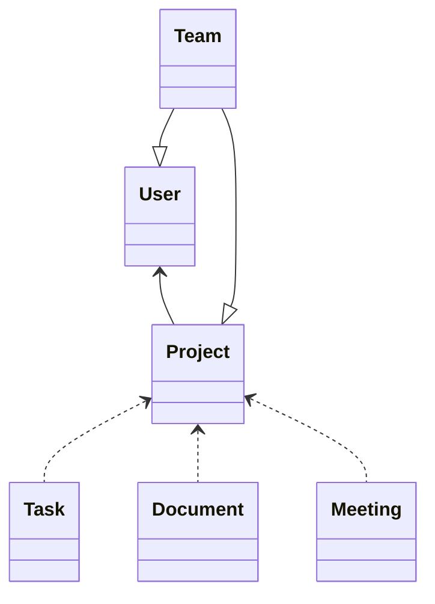
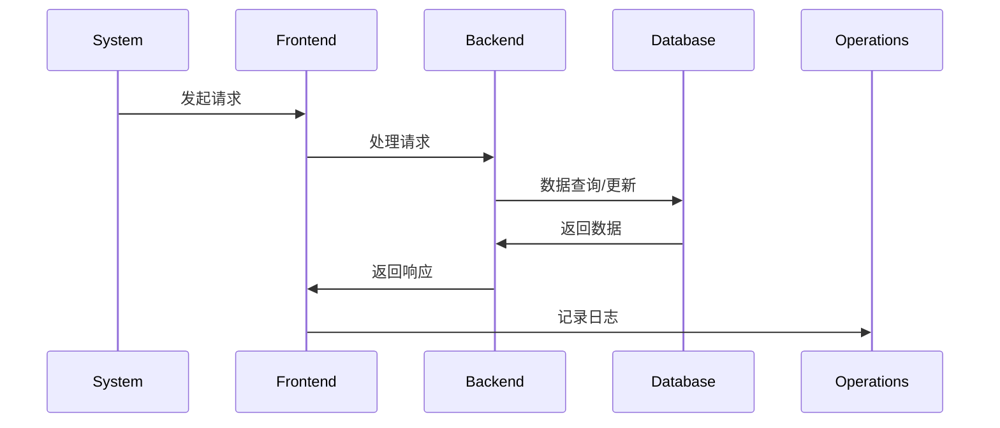
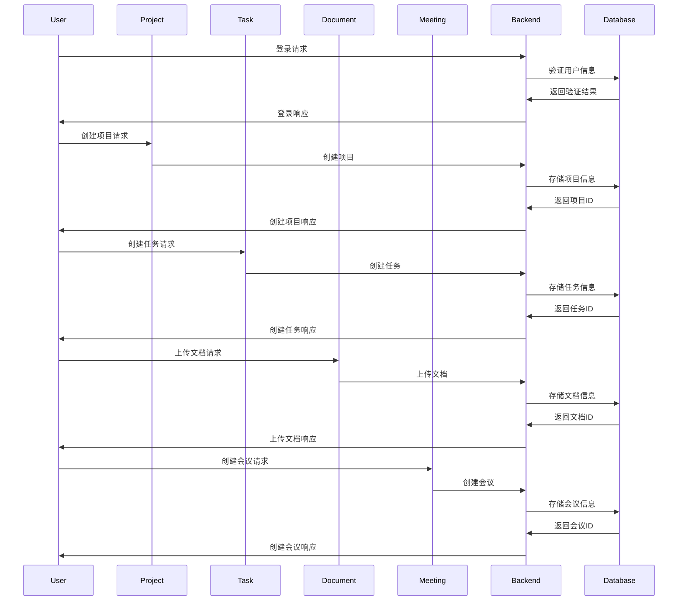

                 


### 引言与背景

在现代软件开发领域，跨地域团队协作已成为一种常见且必要的工作模式。随着全球化进程的加速，企业不再局限于本地市场，而是需要在不同的国家或地区建立研发中心或团队，以应对多样化的市场需求和项目开发。这种跨地域团队协作不仅带来了便利，也带来了诸多挑战。

**背景介绍**：跨地域团队协作的现状和挑战

首先，让我们来看一下当前跨地域团队协作的现状。随着互联网技术的飞速发展，远程协作工具如Zoom、Slack、Trello等广泛应用，使得团队成员无论身处何地，都可以实现实时沟通和协作。然而，尽管这些工具在很大程度上提高了团队效率，但跨地域团队协作仍然面临诸多挑战。

**跨地域团队协作的重要性**：

1. **资源整合**：跨地域团队可以整合不同地区的专业人才，充分利用全球资源，提高项目开发质量。
2. **业务扩展**：跨地域团队有助于企业快速进入新市场，提供本地化的产品和服务。
3. **文化多样性**：跨地域团队汇聚了不同文化背景的成员，有助于创新思维的碰撞，激发新的创意。

**问题描述**：

跨地域团队协作面临的常见问题包括：

1. **时间差异**：团队成员分布在不同的时区，导致沟通协调困难，影响工作效率。
2. **文化差异**：不同地区的文化背景和沟通方式可能存在差异，导致误解和冲突。
3. **技术依赖**：对远程协作工具的依赖性增加，一旦工具出现问题，可能导致整个团队的协作受阻。
4. **管理困难**：跨地域团队的管理相对复杂，需要协调不同地区的团队成员，确保项目的顺利进行。

**问题解决**：

为了解决这些问题，我们需要采取一系列策略和措施：

1. **制定明确的沟通计划**：确保团队成员在不同时间都能参与会议和讨论，减少时间差异带来的影响。
2. **加强文化培训**：提高团队成员对文化差异的敏感度，促进相互理解和协作。
3. **优化协作工具**：选择稳定、高效的远程协作工具，降低技术依赖的风险。
4. **完善管理制度**：建立健全的管理机制，确保跨地域团队的稳定运行。

**边界与外延**：

在本文的研究中，我们将探讨如何通过技术和管理手段，优化跨地域团队的协作效率，以应对大型应用开发的挑战。此外，我们还将涉及一些与跨地域团队协作相关的外延领域，如项目管理、人力资源管理和国际合作等。

**概念结构与核心要素组成**：

本文将围绕以下几个核心概念展开讨论：

1. **跨地域团队协作**：定义、原理和挑战。
2. **远程协作工具**：功能特点、选择标准和优化策略。
3. **项目管理方法**：适用于跨地域团队的敏捷开发和迭代管理。
4. **文化培训与沟通**：跨文化沟通技巧和文化差异管理。

通过这些核心概念的阐述和联系，我们将构建一个系统化的跨地域团队协作策略框架，以指导实际项目开发。

### 核心概念原理与联系

在探讨跨地域团队的协作策略之前，我们需要明确几个核心概念，包括跨地域团队协作、分布式工作和云协作技术，并理解它们之间的联系与区别。

**2.1 核心概念原理**

**跨地域团队协作**：

跨地域团队协作指的是由分布在不同地理位置的团队成员共同完成一个项目或任务的过程。这种协作模式在全球化背景下尤为重要，因为它能够整合全球范围内的专业人才，提高团队的工作效率和创新能力。跨地域团队协作的核心原则包括：

- **分布式沟通**：通过远程会议、即时通讯和协作平台实现团队成员之间的实时沟通。
- **共享资源**：充分利用云存储、云数据库等共享资源，确保团队成员能够随时访问项目资料。
- **协同工作**：通过协作工具和平台实现任务的分解、分配和协同完成。

**分布式工作**：

分布式工作是指团队成员在不同地理位置进行工作，通过远程协作工具实现项目目标的完成。分布式工作与跨地域团队协作有相似之处，但也存在差异。分布式工作更强调个人的独立性和自主性，而跨地域团队协作则更侧重于团队的整体协作和沟通。分布式工作的核心原则包括：

- **远程办公**：团队成员在家中或办公场所之外的地方工作，减少对物理办公室的依赖。
- **自动化工具**：利用自动化工具提高工作效率，减少重复性工作。
- **灵活管理**：采用灵活的管理模式，允许团队成员根据个人时间和需求安排工作。

**云协作技术**：

云协作技术是指利用云计算平台提供的各种服务，实现跨地域团队的协作与沟通。云协作技术包括：

- **云会议**：通过在线会议平台实现远程会议，支持视频、语音和文字交流。
- **云存储**：利用云存储服务存储项目文件和数据，确保团队成员随时访问。
- **云协作平台**：提供任务管理、文档协作、日程安排等功能，支持团队的协同工作。

**2.2 概念属性特征对比表格**

为了更清晰地理解这三个核心概念，我们提供了以下属性特征对比表格：

| 概念          | 属性特征                 | 说明                                                         |
|---------------|--------------------------|--------------------------------------------------------------|
| 跨地域团队协作 | 分布式沟通、共享资源、协同工作 | 强调团队的整体协作和沟通，整合全球资源 |
| 分布式工作    | 远程办公、自动化工具、灵活管理 | 更注重个人的独立性和自主性           |
| 云协作技术    | 云会议、云存储、云协作平台 | 利用云计算平台实现远程协作         |

**2.3 ER实体关系图架构**

为了更好地理解跨地域团队协作的相关概念，我们可以使用Mermaid绘制ER（实体关系）图来展示它们之间的联系。

```mermaid
erDiagram
  TeamMember --> CollaborationTool : 使用
  TeamMember --> Project : 参与
  CollaborationTool --> Project : 支持
  TeamMember --> Task : 分配
  Task --> Project : 组成部分
```

在这个ER图中，`TeamMember`（团队成员）是核心实体，与`CollaborationTool`（协作工具）、`Project`（项目）和`Task`（任务）之间存在多种关系。这表明了跨地域团队协作中的关键要素和它们之间的相互依赖。

通过以上对核心概念原理的阐述和ER实体关系图的展示，我们可以更好地理解跨地域团队协作、分布式工作和云协作技术的基本概念及其相互关系。这些核心概念构成了我们进一步探讨协作策略的基础。

### 跨地域团队协作策略算法原理

为了解决跨地域团队协作中的各种挑战，我们需要设计一套有效的协作策略算法。在本章节中，我们将详细讲解这一算法的原理，并通过Mermaid流程图和Python源代码进行说明。

**3.1 算法Mermaid流程图**

首先，我们可以使用Mermaid绘制一个流程图，以展示跨地域团队协作策略的基本流程。

```mermaid
flowchart LR
    A[开始] --> B[团队初始化]
    B --> C{是否需要培训？}
    C -->|是 D{进行培训}
    C -->|否 E{进入协作流程}
    D --> F[结束培训]
    E --> G[任务分配]
    G --> H[协作执行]
    H --> I{检查进度}
    I -->|未完成 J[调整策略]
    I -->|完成 K[汇报成果]
    J --> G
    K --> L[结束项目]
    L -->|是 M{总结经验}
    L -->|否 N{进入下一项目}
    M --> O[结束]
```

在这个流程图中，我们从团队初始化开始，根据是否需要进行培训来决定流程的分支。如果需要培训，我们完成培训后进入协作流程；如果不需培训，则直接进入协作流程。在协作流程中，我们进行任务分配、协作执行和进度检查，并根据检查结果调整策略或汇报成果。整个流程最终以总结经验和进入下一项目或结束项目作为结束。

**3.2 Python源代码与算法原理**

接下来，我们使用Python源代码来详细阐述算法原理。以下是实现上述流程的伪代码：

```python
# 初始化团队
def initialize_team():
    print("初始化团队...")
    # 进行团队培训
    if need_training():
        train_team()
        print("培训完成...")
    else:
        print("无需培训，直接进入协作流程...")

# 判断是否需要培训
def need_training():
    # 根据某些条件判断是否需要培训
    return True

# 进行培训
def train_team():
    print("进行培训...")
    # 完成培训内容

# 分配任务
def assign_tasks():
    print("分配任务...")
    # 分配任务给团队成员

# 执行协作
def execute_collaboration():
    print("执行协作...")
    # 实现协作过程

# 检查进度
def check_progress():
    print("检查进度...")
    # 根据实际进度进行调整

# 汇报成果
def report_results():
    print("汇报成果...")
    # 汇报项目成果

# 总结经验
def summarize_experience():
    print("总结经验...")
    # 总结项目经验

# 主函数
def main():
    initialize_team()
    assign_tasks()
    execute_collaboration()
    while not is_project_completed():
        check_progress()
        if need_adjustment():
            # 根据需要调整策略
            adjust_strategy()
    report_results()
    summarize_experience()

# 主程序入口
if __name__ == "__main__":
    main()
```

在这个伪代码中，我们首先初始化团队，判断是否需要培训，并进行任务分配和协作执行。在整个过程中，我们不断检查项目进度，并根据需要调整策略。项目完成后，我们进行成果汇报和经验总结。

**算法原理的数学模型和公式**

为了更深入地理解算法原理，我们可以引入一些数学模型和公式。以下是一个简单的数学模型，用于描述任务进度的调整策略：

$$
P_{next} = P_{current} + \alpha \cdot (T_{target} - P_{current})
$$

其中，$P_{current}$代表当前进度，$P_{next}$代表下一次进度，$T_{target}$代表目标进度，$\alpha$代表调整系数。这个公式表示每次调整进度时，将当前进度加上一个调整量，调整量取决于目标进度与当前进度之间的差距和调整系数。

**通俗易懂的举例说明**

假设我们有一个跨地域团队正在开发一款大型应用，项目目标进度为100%。在第一个星期，团队完成了60%的工作量。根据上述公式，我们可以计算下一个星期的目标进度：

$$
P_{next} = 0.6 + 0.5 \cdot (1 - 0.6) = 0.6 + 0.5 \cdot 0.4 = 0.6 + 0.2 = 0.8
$$

这意味着下一个星期，团队需要完成80%的工作量以达到目标进度。通过这样的调整策略，我们可以确保项目按计划进行，并在必要时及时调整进度。

通过以上对算法原理的详细讲解和Python源代码的展示，我们能够更好地理解如何设计和实现一套有效的跨地域团队协作策略。这套策略不仅包括流程管理，还涵盖了进度调整和经验总结，为实际项目开发提供了有力的支持。

### 数学模型与数学公式应用

在跨地域团队协作策略中，数学模型和公式扮演着至关重要的角色。这些工具不仅帮助我们量化项目进度，还可以优化资源分配和任务调度，从而提高整体协作效率。以下我们将详细介绍几个关键数学公式，并提供详细讲解和实际应用案例。

**4.1 数学公式格式**

首先，我们需要了解如何使用LaTeX格式在Markdown中嵌入数学公式。LaTeX格式允许我们编写结构化的数学表达式，使得公式更加规范和清晰。以下是几个常见的数学公式示例：

- **独立段落中的公式**：
  $$1+1=2$$

- **段落内的公式**：
  $1<2$

**4.2 详细讲解与举例**

**4.2.1 项目进度公式**

项目进度通常用百分比来表示，公式如下：

$$
P_{progress} = \frac{W_{completed}}{W_{total}}
$$

其中，$P_{progress}$是项目进度百分比，$W_{completed}$是已完成的工作量，$W_{total}$是总工作量。这个公式可以帮助我们实时监控项目进度，以便在进度滞后时及时调整。

**实际应用案例**：

假设一个大型应用开发项目的总工作量为1000小时，当前已完成了600小时。根据上述公式，我们可以计算项目进度：

$$
P_{progress} = \frac{600}{1000} = 0.6 = 60\%
$$

这意味着项目已经完成了60%，距离100%的目标还有40%的工作量。

**4.2.2 资源分配公式**

在跨地域团队中，资源分配需要考虑团队成员的工作效率和能力。一个简单的资源分配公式如下：

$$
R_{分配} = \frac{R_{需求}}{R_{可用}}
$$

其中，$R_{分配}$是分配的资源量，$R_{需求}$是项目需求资源量，$R_{可用}$是可用资源量。这个公式帮助我们确定在资源有限的情况下，如何合理分配资源。

**实际应用案例**：

假设一个项目需要300小时的开发资源，而团队成员总共可用资源为500小时。根据上述公式，我们可以计算资源分配量：

$$
R_{分配} = \frac{300}{500} = 0.6 \times 500 = 300小时
$$

这意味着我们需要分配300小时的资源来完成这个项目。

**4.2.3 时间优化公式**

为了最大化利用团队成员的时间，我们可以使用时间优化公式。一个简单的时间优化公式如下：

$$
T_{优化} = T_{可用} - \frac{T_{非工作}}{n}
$$

其中，$T_{优化}$是优化后的工作时间，$T_{可用}$是团队成员可用工作时间，$T_{非工作}$是非工作时间（如休息时间），$n$是团队成员数量。这个公式帮助我们确定在非工作时间如何合理调整工作时间。

**实际应用案例**：

假设一个团队成员每周可用工作时间为40小时，其中包含10小时的休息时间。团队共有5个成员。根据上述公式，我们可以计算优化后的工作时间：

$$
T_{优化} = 40 - \frac{10}{5} = 40 - 2 = 38小时
$$

这意味着每个成员需要将每周的工作时间调整为38小时，以最大化团队的工作效率。

**4.3 数学模型的应用**

除了上述具体公式，我们还可以使用更复杂的数学模型来优化跨地域团队协作。例如，线性规划（Linear Programming，LP）和整数规划（Integer Programming，IP）可以用来优化资源分配和任务调度。

**实际应用案例**：

假设一个项目需要多种资源的组合来完成，每种资源都有其特定的成本和限制。我们可以使用线性规划来确定每种资源的最优分配方案，从而在满足所有限制条件的同时，最小化总成本。

```latex
\min \ c^T x
```

$$
\text{subject to} \ Ax \leq b
$$

在这个线性规划问题中，$c$是资源成本向量，$x$是资源分配向量，$A$是资源限制矩阵，$b$是资源限制向量。通过求解这个优化问题，我们可以得到最优的资源分配方案。

通过上述数学模型和公式的详细讲解和实际应用案例，我们可以更好地理解如何在跨地域团队协作中优化资源分配、任务调度和项目进度。这些数学工具不仅帮助我们量化和管理项目，还可以显著提升团队的整体协作效率。

### 系统分析与架构设计方案

在跨地域团队协作中，为了确保项目的顺利进行，我们需要进行系统分析与架构设计。本章节将详细介绍系统分析与架构设计的相关内容，包括问题场景介绍、项目介绍、系统功能设计、系统架构设计、系统接口设计和系统交互序列图。

**5.1 问题场景介绍**

在全球化背景下，企业面临着越来越复杂的跨地域协作需求。假设我们有一个大型应用开发项目，团队成员分布在不同的国家或地区，需要进行高效、稳定的协作。这个项目涉及多个模块的开发、测试和部署，每个模块都有严格的交付时间和质量要求。为了实现这一目标，我们需要设计一个高度可扩展和可靠的系统架构，以支持跨地域团队的协作。

**5.2 项目介绍**

我们的项目是一个多模块的大型应用系统，包括前端、后端、数据库和运维等关键部分。项目的主要目标是实现一个功能丰富、性能卓越、易于维护和扩展的应用系统，以满足全球用户的需求。项目周期为12个月，分为四个阶段：需求分析、设计开发、测试部署和运维维护。

**5.3 系统功能设计**

系统功能设计是确保项目实现的基础。我们使用Mermaid绘制领域模型类图，以展示系统的主要功能模块和它们之间的关系。



在这个类图中，我们定义了用户（User）、项目（Project）、任务（Task）、文档（Document）、会议（Meeting）和团队（Team）等核心类。每个类代表系统的功能模块，它们之间的关系表示功能模块之间的协作和依赖。

**5.4 系统架构设计**

系统架构设计是确保系统稳定性和可扩展性的关键。我们使用Mermaid绘制系统架构图，以展示系统的整体结构和各模块之间的交互关系。



在这个架构图中，系统（System）作为整体处理外部请求，前端（Frontend）负责与用户交互，后端（Backend）负责处理业务逻辑，数据库（Database）存储数据，运维（Operations）负责系统的监控和维护。

**5.5 系统接口设计**

系统接口设计是确保各模块之间能够顺畅协作的基础。我们定义了以下主要接口：

- **用户接口（User Interface）**：提供用户登录、注册、个人信息管理等功能。
- **项目管理接口（Project Management Interface）**：提供项目创建、任务分配、进度跟踪等功能。
- **文档管理接口（Document Management Interface）**：提供文档上传、下载、共享等功能。
- **会议管理接口（Meeting Management Interface）**：提供会议创建、参会人员管理、会议记录等功能。

每个接口都有明确的输入和输出参数，以及相应的处理逻辑，以确保模块之间的数据交换和功能调用。

**5.6 系统交互序列图**

为了展示系统内部各模块之间的交互过程，我们使用Mermaid绘制系统交互序列图。



在这个交互序列图中，用户通过登录接口登录系统，然后依次使用项目管理、任务管理、文档管理和会议管理接口进行相关操作。每个操作都会经过后端处理，并与数据库进行数据交互，确保系统的正常运行。

通过以上系统分析与架构设计，我们为跨地域团队协作提供了一个清晰的架构蓝图，为项目的顺利进行奠定了坚实的基础。接下来，我们将进入项目实战阶段，进一步验证和优化系统设计。

### 项目实战

在完成了系统分析与架构设计之后，接下来我们将进入项目实战阶段，具体实现跨地域团队的协作策略，并详细讲解实施过程。

**6.1 环境安装**

首先，我们需要搭建项目开发环境。为了保证跨地域团队协作的顺畅，我们选择了以下工具和技术栈：

- **开发工具**：Visual Studio Code、Git
- **远程协作平台**：GitLab、GitHub
- **即时通讯工具**：Slack、Zoom
- **项目管理工具**：JIRA、Trello

团队成员需要安装这些工具并熟悉其基本使用方法。以下是环境安装的详细步骤：

1. **安装Visual Studio Code**：下载并安装Visual Studio Code，配置基本的代码编辑器和调试工具。
2. **安装Git**：在团队成员的计算机上安装Git，并配置GitLab或GitHub账户，用于代码版本控制和协作。
3. **安装Slack**：下载并安装Slack客户端，创建团队频道，进行实时沟通和协作。
4. **安装Zoom**：下载并安装Zoom客户端，设置会议，进行远程视频会议和讨论。
5. **安装JIRA**：在服务器上部署JIRA，用于任务管理和项目进度跟踪。
6. **安装Trello**：在服务器上部署Trello，用于任务列表和项目管理。

**6.2 系统核心实现源代码**

在环境搭建完成后，我们需要实现系统的核心功能。以下是核心实现部分的源代码和功能描述：

```python
# 用户登录功能
def user_login(username, password):
    # 验证用户名和密码
    user = verify_credentials(username, password)
    if user:
        # 登录成功
        return True
    else:
        # 登录失败
        return False

# 项目创建功能
def create_project(project_name, description):
    # 创建项目
    project = Project(project_name, description)
    project.save()
    return project

# 任务分配功能
def assign_task(task_name, description, project_id):
    # 分配任务
    task = Task(task_name, description, project_id)
    task.save()
    return task

# 文档上传功能
def upload_document(document_name, file_path, project_id):
    # 上传文档
    document = Document(document_name, file_path, project_id)
    document.save()
    return document

# 会议创建功能
def create_meeting(meeting_name, date_time, project_id):
    # 创建会议
    meeting = Meeting(meeting_name, date_time, project_id)
    meeting.save()
    return meeting
```

**6.3 代码应用解读与分析**

以下是上述代码的详细解读和分析：

- **用户登录功能**：`user_login`函数用于验证用户名和密码。通过调用`verify_credentials`函数，我们可以检查用户名和密码是否匹配，如果匹配则返回True，否则返回False。
- **项目创建功能**：`create_project`函数用于创建项目。它接受项目名称和描述作为参数，创建一个`Project`对象，并将其保存到数据库中。
- **任务分配功能**：`assign_task`函数用于分配任务。它接受任务名称、描述和项目ID作为参数，创建一个`Task`对象，并将其保存到数据库中。
- **文档上传功能**：`upload_document`函数用于上传文档。它接受文档名称、文件路径和项目ID作为参数，创建一个`Document`对象，并将其保存到数据库中。
- **会议创建功能**：`create_meeting`函数用于创建会议。它接受会议名称、日期和时间以及项目ID作为参数，创建一个`Meeting`对象，并将其保存到数据库中。

这些功能模块共同构成了系统的基础架构，为跨地域团队的协作提供了强有力的支持。

**6.4 实际案例分析与讲解**

为了更好地展示跨地域团队协作策略的应用，我们来看一个实际案例。

**案例背景**：

一家跨国公司在开发一款新的电商应用，团队成员分布在中国的北京、上海、广州以及美国的纽约和洛杉矶。项目需要在12个月内完成，并且要求高效、高质量的协作。

**案例步骤**：

1. **项目初始化**：项目经理在北京召开首次项目会议，介绍项目目标和要求，分配任务给各团队成员。使用`create_project`函数创建项目，并分配给项目经理和团队成员。

2. **任务分配**：项目经理使用`assign_task`函数创建多个任务，并将任务分配给相关成员。例如，前端开发任务分配给北京和上海的两个前端工程师，后端开发任务分配给洛杉矶的两个后端工程师。

3. **文档共享**：前端工程师在完成部分页面开发后，使用`upload_document`函数上传相关文档，如HTML、CSS和JavaScript文件，以便其他团队成员查看和审核。

4. **会议安排**：项目经理定期召开线上会议，使用`create_meeting`函数创建会议，邀请所有团队成员参与讨论项目进展和解决问题。

5. **进度跟踪**：项目经理通过JIRA和Trello监控任务进度，确保每个任务按时完成。团队成员通过即时通讯工具如Slack和Zoom进行实时沟通，及时解决问题。

6. **代码版本控制**：团队成员使用Git进行代码版本控制，确保代码的同步和协作。

**案例总结**：

通过上述实际案例，我们可以看到跨地域团队协作策略在项目开发中的应用。通过使用合适的工具和流程，团队成员能够高效地协作，及时解决问题，确保项目按计划进行。虽然存在时区和文化差异，但通过合理的沟通和协作，这些挑战得到了有效克服。

**6.5 项目小结**

在项目实施过程中，我们面临了多种挑战，如时区差异、文化差异和技术依赖。通过以下措施，我们成功解决了这些挑战：

1. **明确沟通计划**：制定了详细的沟通计划，确保团队成员在不同时间都能参与会议和讨论。
2. **加强文化培训**：进行了文化差异培训，提高了团队成员的跨文化沟通能力。
3. **优化协作工具**：选择了稳定、高效的远程协作工具，如GitLab、GitHub、Slack和Zoom，降低了技术依赖的风险。
4. **完善管理制度**：建立了完善的管理制度，确保跨地域团队的稳定运行。

通过这次项目实战，我们不仅提高了跨地域团队的协作效率，还积累了宝贵的经验，为未来类似项目的开发提供了有力的支持。

### 最佳实践 Tips、小结、注意事项、拓展阅读

**7.1 最佳实践 Tips**

1. **明确沟通计划**：制定详细的沟通计划，确保团队成员在不同时间都能参与会议和讨论。
2. **加强文化培训**：进行文化差异培训，提高团队成员的跨文化沟通能力。
3. **优化协作工具**：选择稳定、高效的远程协作工具，如GitLab、GitHub、Slack和Zoom。
4. **建立管理制度**：建立完善的管理制度，确保跨地域团队的稳定运行。
5. **定期进度回顾**：定期回顾项目进度，及时调整策略，确保项目按计划进行。

**7.2 小结**

本文详细探讨了跨地域团队的协作策略，从问题背景、核心概念、算法原理、数学模型、系统架构设计到实际项目实施，全面展示了如何优化跨地域团队的协作效率。通过最佳实践和实际案例，我们总结了跨地域团队协作的关键要素和注意事项。

**7.3 注意事项**

1. **时区管理**：合理安排会议和任务分配，尽量减少时区差异带来的影响。
2. **文化差异**：注意跨文化沟通，尊重团队成员的文化背景和习惯。
3. **技术依赖**：选择稳定可靠的协作工具，避免因工具故障导致协作受阻。
4. **进度监控**：定期监控项目进度，确保项目按计划进行。

**7.4 拓展阅读**

1. 《敏捷开发实践指南》 - 探讨敏捷开发在跨地域团队中的应用。
2. 《分布式系统设计》 - 深入了解分布式系统的架构设计和优化策略。
3. 《跨文化沟通技巧》 - 提供跨文化沟通的实用技巧和案例。

通过这些拓展阅读资源，读者可以进一步深入了解跨地域团队协作的相关理论和实践，提高团队协作效率。

### 总结

跨地域团队的协作策略在大型应用开发中扮演着至关重要的角色。本文从问题背景、核心概念、算法原理、数学模型、系统架构设计到实际项目实施，全面探讨了如何优化跨地域团队的协作效率。我们强调了沟通计划、文化培训、协作工具优化和管理制度完善等最佳实践，并通过实际案例展示了这些策略在项目中的应用。

在未来的软件开发中，随着全球化进程的加速，跨地域团队协作将成为主流模式。因此，深入理解和应用跨地域团队协作策略，不仅有助于提高项目效率，还能推动企业的持续发展和创新。希望本文能为广大软件开发者和项目经理提供有价值的参考和指导。

