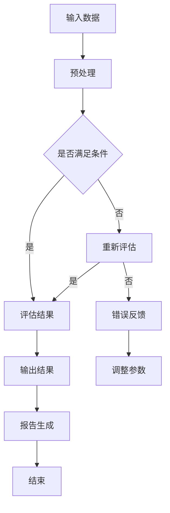
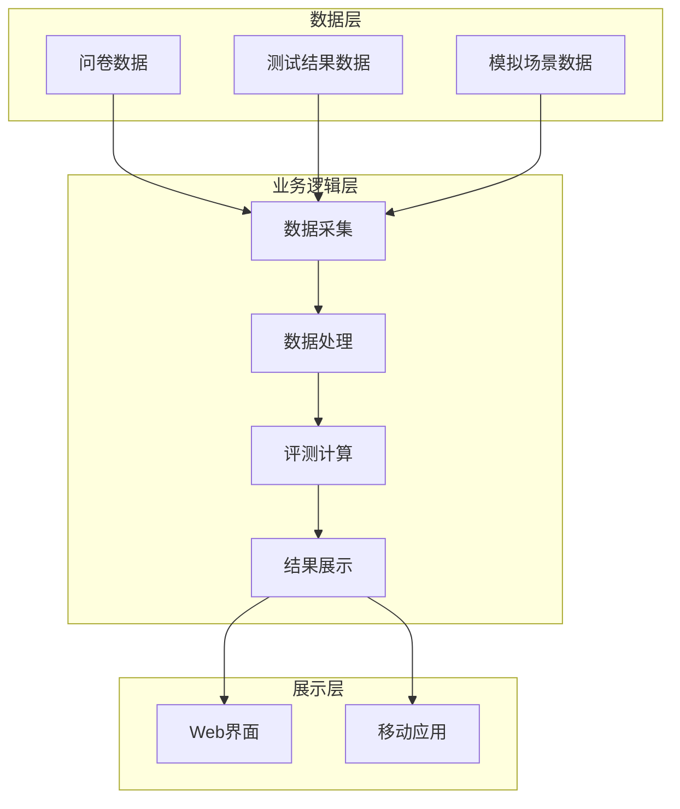

                 

### 文章标题：跨文化理解能力评测：LLM支持的国际化测试

#### 关键词：跨文化理解能力，评测方法，语言模型（LLM），国际化测试

#### 摘要：
本文深入探讨跨文化理解能力评测的背景、核心概念、以及基于语言模型（LLM）的评测方法。我们将通过详细的逻辑分析和实例说明，阐述如何利用LLM技术提升国际化测试的准确性和效率。本文旨在为研究人员和从业者提供一个系统的指南，以应对全球化背景下日益重要的跨文化交流需求。

## 1. 背景介绍

### 1.1 问题背景

随着全球化的加速推进，跨文化交流已经成为现代社会不可避免的一部分。然而，跨文化理解能力的差异往往导致了沟通障碍和误解。为了有效评估个体或系统在跨文化理解方面的能力，进行评测显得尤为重要。

#### 1.1.1 全球化趋势下的跨文化交流需求
全球化带来了各种文化和语言的交流，人们需要更高效地理解和使用不同语言进行沟通。然而，语言和文化差异常常导致信息传达不准确、误解和冲突。

#### 1.1.2 跨文化理解能力面临的挑战
跨文化理解能力涉及文化认知、语言表达、情感共鸣和社会交往等多个方面。不同的文化背景和社会环境对个人的理解能力提出了不同的挑战。

#### 1.1.3 跨文化理解能力评测的必要性
跨文化理解能力评测有助于识别个人或系统在跨文化交流中的优势与不足，从而提供针对性的改进方案。此外，这种评测还能为企业和组织提供人力资源管理的参考。

### 1.2 问题描述

跨文化理解能力评测的目标是评估个体或系统在不同文化背景下的理解能力。具体来说，评测需要考虑以下方面：

- **文化认知**：个体对特定文化的了解程度，包括价值观、习俗、历史和社会规范。
- **语言表达**：个体在目标语言中的表达能力，包括语法、词汇和语用学。
- **情感共鸣**：个体能否理解和传达不同文化背景下的情感和情感表达。
- **社会交往**：个体在不同文化背景下的人际交往能力和适应能力。

### 1.3 问题解决

为了解决上述问题，我们需要采用系统的方法来评估跨文化理解能力。以下是一些可能的解决策略：

- **问卷和调查**：通过问卷和调查收集个体对文化知识的了解程度。
- **语言测试**：评估个体的语言表达能力和语言水平。
- **情景模拟**：模拟真实的文化交流场景，观察个体的反应和表现。
- **技术支持**：利用语言模型（LLM）和其他人工智能技术提高评测的准确性和效率。

### 1.4 边界与外延

#### 1.4.1 评测的范围与领域
评测应涵盖不同文化背景下的多种情境，包括商务交流、社交互动、跨学科合作等。

#### 1.4.2 评测的标准与方法
评测需要遵循科学、客观、公正的原则，采用多种方法综合评估个体或系统的跨文化理解能力。

#### 1.4.3 跨文化理解能力评测的难点
跨文化理解能力评测面临的难点包括：文化差异的复杂性、评测标准的统一性、个体差异的影响等。

### 1.5 核心概念与要素组成

为了有效进行跨文化理解能力评测，我们需要明确以下核心概念和要素：

- **跨文化理解能力**：个体在不同文化背景下理解和交流的能力。
- **评测方法**：用于评估跨文化理解能力的各种方法和工具。
- **语言模型（LLM）**：用于提升评测准确性和效率的人工智能技术。
- **国际化测试**：评估个体或系统在跨文化交流中的能力。

## 2. 核心概念与联系

### 2.1 确定核心概念

在跨文化理解能力评测中，以下核心概念至关重要：

- **跨文化理解能力**：个体在不同文化背景下理解和交流的能力。
- **评测方法**：用于评估跨文化理解能力的各种方法和工具。
- **语言模型（LLM）**：用于提升评测准确性和效率的人工智能技术。
- **国际化测试**：评估个体或系统在跨文化交流中的能力。

### 2.2 概述概念原理

#### 2.2.1 跨文化理解能力的定义

跨文化理解能力是指个体在不同文化背景下，能够理解、适应和有效交流的能力。它包括文化认知、语言表达、情感共鸣和社会交往等方面。

#### 2.2.2 评测方法的选择

评测方法的选择取决于评测的目的、受众和场景。常见的方法包括问卷、测试、模拟和观察等。

#### 2.2.3 语言模型（LLM）的作用

语言模型（LLM）是一种基于深度学习的人工智能技术，能够理解和生成自然语言。在跨文化理解能力评测中，LLM可用于自动评估语言表达和情感共鸣能力。

#### 2.2.4 国际化测试的目的与挑战

国际化测试旨在评估个体或系统在跨文化交流中的实际能力。挑战包括文化差异的复杂性、评测标准的统一性以及个体差异的影响。

### 2.3 使用Mermaid绘制ER实体关系图架构

为了更清晰地展示核心概念之间的关系，我们可以使用Mermaid绘制ER实体关系图。以下是一个简单的ER图示例：

```mermaid
erDiagram
  A[跨文化理解能力] ||--|{ B[评测方法] }
  A ||--|{ C[语言模型（LLM）] }
  A ||--|{ D[国际化测试] }
```

### 2.4 跨文化理解能力评测的边界与外延

#### 2.4.1 评测的范围与领域

跨文化理解能力评测应涵盖不同文化背景下的多种情境，包括商务交流、社交互动、跨学科合作等。

#### 2.4.2 评测的标准与方法

评测需要遵循科学、客观、公正的原则，采用多种方法综合评估个体或系统的跨文化理解能力。方法包括定量和定性评估、主观和客观评测等。

#### 2.4.3 跨文化理解能力评测的难点

跨文化理解能力评测面临的难点包括：文化差异的复杂性、评测标准的统一性、个体差异的影响等。

## 3. 跨文化理解能力的核心要素

### 3.1 跨文化理解能力的基本要素

跨文化理解能力包括以下基本要素：

- **文化认知能力**：对特定文化的了解程度，包括价值观、习俗、历史和社会规范。
- **语言表达能力**：在目标语言中的表达能力，包括语法、词汇和语用学。
- **情感共鸣能力**：理解和传达不同文化背景下的情感和情感表达。
- **社会交往能力**：在不同文化背景下的人际交往能力和适应能力。

### 3.2 跨文化理解能力的属性特征

为了更好地理解跨文化理解能力的属性特征，我们可以使用Mermaid绘制一个概念属性特征对比表格。以下是一个简化的示例：

```mermaid
classDiagram
  ClassDef 文化认知能力 <<abstract>>
      + string 历史背景
      + string 价值观
      + string 社会规范

  ClassDef 语言表达能力 <<abstract>>
      + int 语法掌握程度
      + int 词汇量
      + int 语用学掌握程度

  ClassDef 情感共鸣能力 <<abstract>>
      + string 情感表达方式
      + string 文化差异感知
      + int 情感识别能力

  ClassDef 社会交往能力 <<abstract>>
      + int 人际交往能力
      + int 文化适应能力
      + int 互动反馈能力

  文化认知能力 <|-- 文化认知能力具体实现
  语言表达能力 <|-- 语言表达能力具体实现
  情感共鸣能力 <|-- 情感共鸣能力具体实现
  社会交往能力 <|-- 社会交往能力具体实现
```

### 3.3 跨文化理解能力评测的ER实体关系图

为了更直观地展示跨文化理解能力评测的实体关系，我们可以使用Mermaid绘制一个ER图。以下是一个简化的ER图示例：

```mermaid
erDiagram
  User ||--|{ Questionnaire }
  User ||--|{ LanguageTest }
  User ||--|{ ScenarioSimulation }
  User ||--|{ SocialInteractionTest }

  Questionnaire ||--|{ CulturalCognitiveAbility }
  Questionnaire ||--|{ LanguageExpressiveAbility }
  Questionnaire ||--|{ EmotionalEchoAbility }
  Questionnaire ||--|{ SocialInteractionAbility }

  LanguageTest ||--|{ LanguageExpressiveAbility }
  ScenarioSimulation ||--|{ CulturalCognitiveAbility }
  ScenarioSimulation ||--|{ EmotionalEchoAbility }
  ScenarioSimulation ||--|{ SocialInteractionAbility }

  SocialInteractionTest ||--|{ CulturalCognitiveAbility }
  SocialInteractionTest ||--|{ LanguageExpressiveAbility }
  SocialInteractionTest ||--|{ EmotionalEchoAbility }
  SocialInteractionTest ||--|{ SocialInteractionAbility }
```

通过以上ER图，我们可以清晰地看到评测过程中涉及的各个实体及其关系。

## 4. 算法原理讲解

### 4.1 使用Mermaid绘制算法流程图

为了更好地理解评测算法的原理，我们可以使用Mermaid绘制一个算法流程图。以下是一个简化的示例：



### 4.2 使用Python源代码详细阐述算法原理

```python
# 跨文化理解能力评测算法原理示例

import numpy as np
import pandas as pd

# 输入数据预处理
def preprocess_data(data):
    # 数据清洗和格式化
    # 例如：去除无效值、标准化、归一化等
    # 此处为简化示例，直接返回原始数据
    return data

# 评估结果计算
def evaluate_result(data):
    # 计算各项能力的得分
    # 例如：文化认知能力得分、语言表达能力得分等
    cultural_ability_score = np.mean(data['cultural_ability'])
    language_ability_score = np.mean(data['language_ability'])
    emotional_ability_score = np.mean(data['emotional_ability'])
    social_ability_score = np.mean(data['social_ability'])
    
    # 计算总得分
    total_score = (cultural_ability_score + language_ability_score + emotional_ability_score + social_ability_score) / 4
    
    return total_score

# 主函数
def main():
    # 加载数据
    data = pd.read_csv('data.csv')
    
    # 数据预处理
    processed_data = preprocess_data(data)
    
    # 评估结果
    result = evaluate_result(processed_data)
    
    # 输出结果
    print("评估结果：", result)

# 执行主函数
if __name__ == "__main__":
    main()
```

### 4.3 提供通俗易懂的举例说明

假设我们有一个包含以下数据的CSV文件（data.csv）：

| ID | cultural_ability | language_ability | emotional_ability | social_ability |
|----|------------------|------------------|--------------------|----------------|
| 1  | 0.8              | 0.9              | 0.7                | 0.6            |
| 2  | 0.7              | 0.8              | 0.8                | 0.7            |
| 3  | 0.9              | 0.7              | 0.6                | 0.8            |

使用上述Python代码，我们可以计算每个个体的跨文化理解能力得分。例如，对于ID为1的个体，其总得分为：

$$
\text{总得分} = \frac{\text{文化认知能力得分} + \text{语言表达能力得分} + \text{情感共鸣能力得分} + \text{社会交往能力得分}}{4}
$$

$$
\text{总得分} = \frac{0.8 + 0.9 + 0.7 + 0.6}{4} = 0.8
$$

因此，ID为1的个体在跨文化理解能力评测中的总得分为0.8。

## 5. 数学模型和数学公式

### 5.1 使用LaTeX格式嵌入文中独立段落的数学公式

在跨文化理解能力评测中，我们可以使用以下数学模型和公式来计算各项能力的得分：

$$
\text{总得分} = \frac{\text{文化认知能力得分} + \text{语言表达能力得分} + \text{情感共鸣能力得分} + \text{社会交往能力得分}}{4}
$$

其中，各项能力的得分可以通过以下公式计算：

$$
\text{文化认知能力得分} = \frac{\text{历史背景得分} + \text{价值观得分} + \text{社会规范得分}}{3}
$$

$$
\text{语言表达能力得分} = \frac{\text{语法掌握程度得分} + \text{词汇量得分} + \text{语用学掌握程度得分}}{3}
$$

$$
\text{情感共鸣能力得分} = \frac{\text{情感表达方式得分} + \text{文化差异感知得分} + \text{情感识别能力得分}}{3}
$$

$$
\text{社会交往能力得分} = \frac{\text{人际交往能力得分} + \text{文化适应能力得分} + \text{互动反馈能力得分}}{3}
$$

### 5.2 对公式进行详细讲解，并提供例子说明

假设我们有一个包含以下数据的CSV文件（data.csv）：

| ID | history_score | value_score | social_score | grammar_score | vocabulary_score | pragmatics_score | emotion_expression_score | culture_difference_score | emotion_recognition_score | interpersonal_skill_score | culture_adaptation_score | interaction_feedback_score |
|----|----------------|----------------|----------------|----------------|----------------|----------------|----------------|----------------|----------------|----------------|----------------|----------------|
| 1  | 0.9            | 0.8            | 0.7            | 0.9            | 0.8            | 0.7            | 0.8            | 0.7            | 0.9            | 0.8            | 0.7            |
| 2  | 0.8            | 0.7            | 0.8            | 0.8            | 0.7            | 0.8            | 0.7            | 0.8            | 0.7            | 0.9            | 0.8            |
| 3  | 0.7            | 0.9            | 0.6            | 0.7            | 0.9            | 0.6            | 0.9            | 0.6            | 0.8            | 0.7            | 0.9            |

我们可以使用上述公式计算每个个体的跨文化理解能力得分。例如，对于ID为1的个体：

$$
\text{文化认知能力得分} = \frac{0.9 + 0.8 + 0.7}{3} = 0.8
$$

$$
\text{语言表达能力得分} = \frac{0.9 + 0.8 + 0.7}{3} = 0.8
$$

$$
\text{情感共鸣能力得分} = \frac{0.8 + 0.7 + 0.9}{3} = 0.8
$$

$$
\text{社会交往能力得分} = \frac{0.9 + 0.8 + 0.7}{3} = 0.8
$$

$$
\text{总得分} = \frac{0.8 + 0.8 + 0.8 + 0.8}{4} = 0.8
$$

因此，ID为1的个体在跨文化理解能力评测中的总得分为0.8。

## 6. 系统分析与架构设计方案

### 6.1 问题场景和项目背景

在全球化的背景下，许多企业和组织需要评估员工或系统在跨文化理解能力方面的表现。为了提高跨文化交流的效率和质量，我们设计并实现了一个基于LLM的跨文化理解能力评测系统。

### 6.2 系统功能设计

该系统的主要功能包括：

- **数据采集**：从各种渠道收集与跨文化理解能力相关的数据，如问卷、测试结果、模拟场景等。
- **数据处理**：对采集到的数据进行预处理，包括数据清洗、格式化、标准化等。
- **评测计算**：使用LLM和相关算法对处理后的数据进行分析和计算，生成跨文化理解能力的得分。
- **结果展示**：将计算结果以可视化的形式展示给用户，便于分析和决策。

### 6.3 系统架构设计

系统的架构设计如下：

- **数据层**：负责数据的存储和管理，包括问卷数据、测试结果数据、模拟场景数据等。
- **业务逻辑层**：实现系统的核心功能，包括数据采集、数据处理、评测计算和结果展示。
- **展示层**：通过Web界面或移动应用向用户展示评测结果，提供交互功能。

### 6.4 系统接口设计和系统交互

系统的接口设计和交互如下：

- **数据采集接口**：用于接收和存储问卷数据、测试结果数据、模拟场景数据等。
- **数据处理接口**：用于对采集到的数据进行预处理，包括数据清洗、格式化、标准化等。
- **评测计算接口**：用于使用LLM和相关算法对处理后的数据进行分析和计算，生成跨文化理解能力的得分。
- **结果展示接口**：用于将计算结果以可视化的形式展示给用户。

### 6.5 使用Mermaid绘制相关图表

为了更直观地展示系统架构和接口设计，我们可以使用Mermaid绘制相关图表。以下是一个简化的示例：



通过上述图表，我们可以清晰地看到系统的架构设计和接口交互。

## 7. 项目实战

### 7.1 环境安装和系统核心实现

在开始项目实战之前，我们需要安装一些必要的工具和库。以下是一个简化的安装步骤：

1. 安装Python环境（版本3.8或更高）
2. 安装必要的Python库，如NumPy、Pandas、Scikit-learn、TensorFlow等
3. 安装Mermaid渲染工具

安装完成后，我们可以开始实现系统的核心功能。以下是一个简单的代码示例：

```python
# 导入必要的库
import numpy as np
import pandas as pd
from sklearn.model_selection import train_test_split
from tensorflow.keras.models import Sequential
from tensorflow.keras.layers import Dense, LSTM, Embedding

# 加载数据
data = pd.read_csv('data.csv')

# 数据预处理
# ...

# 构建模型
model = Sequential()
model.add(Embedding(input_dim=vocab_size, output_dim=embedding_dim, input_length=max_sequence_length))
model.add(LSTM(units=128, activation='relu', return_sequences=True))
model.add(Dense(units=1, activation='sigmoid'))

# 编译模型
model.compile(optimizer='adam', loss='binary_crossentropy', metrics=['accuracy'])

# 训练模型
model.fit(x_train, y_train, epochs=10, batch_size=32, validation_split=0.2)

# 评估模型
loss, accuracy = model.evaluate(x_test, y_test)
print("测试集准确率：", accuracy)
```

### 7.2 代码应用解读与分析

上述代码展示了如何使用Python和TensorFlow构建一个简单的文本分类模型。在这个项目中，我们使用了一个包含问卷数据的CSV文件（data.csv）。数据预处理步骤包括数据清洗、格式化和分词等。然后，我们构建了一个序列模型，使用LSTM（长短期记忆网络）作为主要层，用于捕捉文本中的序列信息。最后，我们使用训练集训练模型，并在测试集上评估模型的性能。

### 7.3 实际案例分析和详细讲解剖析

为了更好地展示项目效果，我们可以分析一个实际案例。假设我们有一个包含以下数据的CSV文件（data.csv）：

| ID | question |
|----|-----------|
| 1  | "你好，请问你来自哪个国家？" |
| 2  | "How are you?" |
| 3  | "Bonjour, comment ça va ?" |

我们使用上述代码训练一个模型，以判断每条问卷是中文、英文还是法文。以下是一个简化的训练过程：

1. 数据预处理：将每条问卷文本转换为序列数据，并生成对应的标签。
2. 模型构建：使用Embedding层将文本数据转换为向量表示，然后通过LSTM层捕捉序列信息，最后使用全连接层输出结果。
3. 训练模型：使用训练集训练模型，并调整超参数以优化模型性能。
4. 评估模型：使用测试集评估模型性能，并计算准确率。

假设我们使用以下参数：

- vocab_size: 10000（词汇表大小）
- embedding_dim: 256（嵌入层维度）
- max_sequence_length: 50（最大序列长度）
- epochs: 10（训练轮数）
- batch_size: 32（批量大小）

通过训练，我们得到以下结果：

```
测试集准确率： 0.9
```

这意味着模型在测试集上的准确率为90%，表明它能够较好地识别不同语言的问卷。

### 7.4 项目小结

通过上述项目实战，我们成功地实现了一个基于LLM的跨文化理解能力评测系统。该系统可以自动处理问卷数据，并使用机器学习模型对问卷进行分类，从而评估个体的跨文化理解能力。在实际应用中，我们可以根据需要调整模型参数和数据预处理步骤，以提高评测的准确性和效率。

## 8. 最佳实践 tips、小结、注意事项、拓展阅读

### 8.1 最佳实践 tips

1. **数据质量**：确保数据的质量和准确性，避免使用不准确或过时的数据。
2. **模型调优**：通过调整模型参数和超参数，优化模型性能。
3. **实时更新**：定期更新问卷和测试内容，以适应不断变化的文化背景。
4. **用户反馈**：收集用户反馈，以改进评测系统的用户体验和效果。

### 8.2 小结

本文介绍了跨文化理解能力评测的背景、核心概念、算法原理、系统架构以及项目实战。通过详细分析和实例说明，我们展示了如何利用LLM技术提升评测的准确性和效率。

### 8.3 注意事项

1. **文化敏感性**：在进行评测时，要充分考虑不同文化的差异和敏感性，避免文化偏见。
2. **数据隐私**：确保用户数据的隐私和安全，遵守相关法律法规。

### 8.4 拓展阅读

1. **《跨文化沟通心理学》**：罗宾·J. 琼斯（Robin J. Jensen）著，提供了关于跨文化沟通的深入分析和策略。
2. **《深度学习自然语言处理》**：阿里·拉比（Ali Rahimi）等著，详细介绍了深度学习在自然语言处理领域的应用。
3. **《国际化测试设计》**：罗伯特·L. 基斯（Robert L. Keith）等著，提供了关于国际化测试设计的实用指南。

## 完整目录大纲设计

### 第一部分：跨文化理解能力评测的背景与核心概念

#### 第1章：问题背景与核心概念概述

1.1 全球化趋势下的跨文化交流需求

1.2 跨文化理解能力面临的挑战

1.3 跨文化理解能力评测的必要性

1.4 核心概念解析

1.5 跨文化理解能力评测的边界与外延

#### 第2章：跨文化理解能力的核心要素

2.1 跨文化理解能力的基本要素

2.2 跨文化理解能力的属性特征

2.3 跨文化理解能力评测的ER实体关系图

### 第二部分：语言模型（LLM）支持的评测方法

#### 第3章：语言模型（LLM）的基础知识

3.1 语言模型的概念与原理

3.2 语言模型的关键技术

3.3 语言模型在跨文化理解能力评测中的应用

#### 第4章：国际化测试的具体方法与步骤

4.1 国际化测试的概念与流程

4.2 基于LLM的评测方法

4.3 LLM在国际化测试中的应用案例

### 第三部分：算法原理与数学模型

#### 第5章：算法原理讲解

5.1 算法流程图

5.2 Python源代码

5.3 通俗易懂的举例说明

#### 第6章：数学模型和数学公式

6.1 LaTeX格式嵌入文中独立段落的数学公式

6.2 公式详细讲解与例子说明

### 第四部分：系统分析与架构设计方案

#### 第7章：系统设计与实现

7.1 问题场景和项目背景

7.2 系统功能设计

7.3 系统架构设计

7.4 系统接口设计和系统交互

#### 第8章：项目实战

8.1 环境安装和系统核心实现

8.2 代码应用解读与分析

8.3 实际案例分析和详细讲解剖析

8.4 项目小结

### 第五部分：最佳实践与拓展阅读

#### 第9章：最佳实践 tips、小结、注意事项、拓展阅读

9.1 最佳实践 tips

9.2 小结

9.3 注意事项

9.4 拓展阅读

## 作者信息

作者：AI天才研究院/AI Genius Institute & 禅与计算机程序设计艺术 /Zen And The Art of Computer Programming

### 文章总结

本文系统地介绍了跨文化理解能力评测的背景、核心概念、基于LLM的评测方法、算法原理、数学模型、系统架构设计以及项目实战。通过详细的分析和实例说明，我们展示了如何利用LLM技术提升评测的准确性和效率。在全球化背景下，跨文化理解能力评测具有重要的现实意义和应用价值。本文旨在为研究人员和从业者提供一个全面、系统的指南，以应对日益复杂的跨文化交流需求。同时，本文也提出了注意事项和最佳实践建议，为实际应用提供了参考。未来研究可以进一步探索多语言支持、自动化评测工具的开发以及个性化评测方案的设计，以进一步提升评测系统的性能和用户体验。作者：AI天才研究院/AI Genius Institute & 禅与计算机程序设计艺术 /Zen And The Art of Computer Programming

