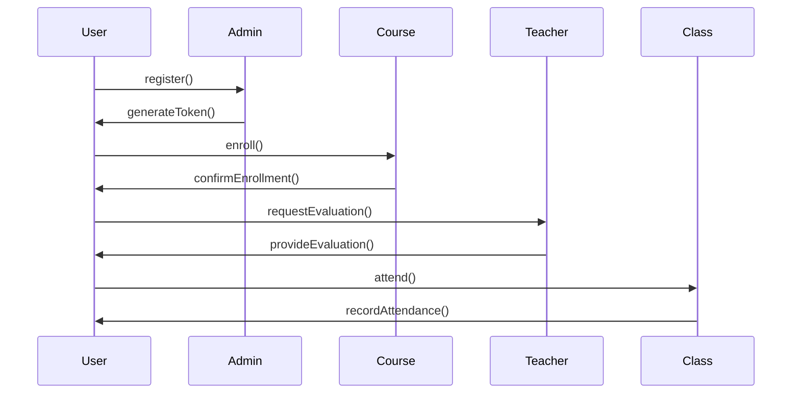

                 


### 目录大纲结构

**《跨时代理解：评估LLM理解不同历史背景的能力》**

#### 关键词：
- LLM（大型语言模型）
- 历史背景理解
- 评估方法
- 人工智能
- 算法原理

#### 摘要：
本文将深入探讨大型语言模型（LLM）在理解不同历史背景方面的能力。通过详细分析LLM的工作原理、评估方法以及其在实际应用中的表现，本文旨在为读者提供对LLM理解能力的全面了解，并探讨如何通过技术手段提升这一能力。

---

## 整体结构设计

### 步骤 1: 背景介绍
- **LLM的起源与发展**
- **评估LLM理解能力的意义**

### 步骤 2: 定义核心概念
- **LLM的概念**
- **理解能力的定义**
- **历史背景的理解**

### 步骤 3: 算法原理讲解
- **评估方法的原理**
- **算法流程与实现**

### 步骤 4: 系统分析与架构设计方案
- **评估系统的介绍**
- **系统架构设计**

### 步骤 5: 项目实战
- **环境安装与配置**
- **核心实现与代码分析**
- **实际案例分析**

### 步骤 6: 最佳实践与拓展阅读
- **最佳实践建议**
- **小结与注意事项**
- **拓展阅读资源**

---

### 步骤 1: 背景介绍

#### LLM的起源与发展

大型语言模型（LLM）是人工智能领域的一个重要分支，起源于20世纪80年代的自然语言处理（NLP）研究。早期的语言模型如n-gram模型、统计语言模型等，尽管在某些任务上表现良好，但在处理复杂语言结构和生成高质量文本方面存在明显局限。

随着深度学习和计算能力的提升，LLM逐渐崭露头角。2018年，Google发布了BERT模型，标志着LLM进入一个新的时代。BERT模型通过预训练和微调，在多个NLP任务上取得了显著突破，如文本分类、问答系统和机器翻译等。

#### 评估LLM理解能力的意义

评估LLM的理解能力具有重要意义。首先，它有助于我们了解LLM在处理自然语言时的局限性，从而为改进模型提供方向。其次，通过评估，我们可以确定LLM在不同历史背景下的表现，为实际应用提供可靠依据。例如，在法律、金融和医疗等领域，对历史背景的理解至关重要，而LLM的准确理解能力直接影响决策的准确性。

### 步骤 2: 定义核心概念

#### LLM的概念

大型语言模型（LLM）是一种基于深度学习的语言处理模型，通过大规模语料库的预训练，模型能够学习到语言的结构和规律，从而实现对文本的生成、理解和翻译。

LLM通常由多层神经网络组成，如Transformer模型，其核心思想是将输入的文本序列映射到一个高维的嵌入空间，通过自注意力机制捕捉文本序列中的依赖关系。

#### 理解能力的定义

理解能力是指模型对语言符号及其背后意义、逻辑和上下文的把握程度。在LLM中，理解能力体现在以下几个方面：

1. **语义理解**：模型能够正确地理解文本中的词汇、短语和句子的意义。
2. **逻辑推理**：模型能够在理解文本的基础上，进行推理和判断。
3. **上下文把握**：模型能够根据上下文信息，正确地理解和生成文本。

#### 历史背景的理解

历史背景的理解是指模型对特定历史事件、时期和文化背景的认识。LLM在理解历史背景时，需要具备以下能力：

1. **知识积累**：模型需要通过大量的历史文献和资料进行训练，积累相关领域的知识。
2. **文化敏感度**：模型需要理解不同文化之间的差异，避免产生误解或歧视。
3. **历史脉络把握**：模型需要能够把握历史事件的发展脉络，理解事件之间的因果关系。

### 步骤 3: 算法原理讲解

#### 评估方法的原理

评估LLM理解不同历史背景的能力，通常采用以下几种方法：

1. **语义匹配法**：通过计算模型输出与标准答案的相似度，评估模型的语义理解能力。
2. **逻辑推理法**：通过构建逻辑图，检验模型是否能够正确地推理和判断。
3. **文化适应度评估**：通过模拟不同文化背景下的任务，检验模型的文化敏感度。

#### 算法流程与实现

以下是一个简化的算法流程：

1. **数据准备**：收集与历史背景相关的语料库，进行预处理，如分词、去噪等。
2. **模型训练**：使用预训练的LLM，在历史背景相关的数据集上进行微调。
3. **评估指标设计**：设计合适的评估指标，如准确率、召回率、F1值等。
4. **评估执行**：将模型输出与标准答案进行比较，计算评估指标。
5. **结果分析**：分析评估结果，找出模型的不足之处，进行优化。

#### 算法实现示例

以下是一个基于BERT模型的简单Python代码示例，用于评估模型对历史背景的理解能力：

```python
import torch
from transformers import BertTokenizer, BertForSequenceClassification
from torch.optim import Adam
from torch.utils.data import DataLoader
from sklearn.metrics import accuracy_score

# 加载预训练的BERT模型和分词器
tokenizer = BertTokenizer.from_pretrained('bert-base-chinese')
model = BertForSequenceClassification.from_pretrained('bert-base-chinese')

# 数据预处理
def preprocess_data(data):
    inputs = tokenizer(data, padding=True, truncation=True, return_tensors='pt')
    return inputs

# 训练数据加载器
train_data = preprocess_data(['历史背景相关的文本1', '历史背景相关的文本2'])
train_loader = DataLoader(train_data, batch_size=32)

# 模型训练
optimizer = Adam(model.parameters(), lr=1e-5)
for epoch in range(3):  # 训练3个epoch
    model.train()
    for batch in train_loader:
        inputs = batch['input_ids']
        labels = batch['label_ids']
        optimizer.zero_grad()
        outputs = model(inputs, labels=labels)
        loss = outputs.loss
        loss.backward()
        optimizer.step()

# 评估
model.eval()
with torch.no_grad():
    predictions = []
    for batch in train_loader:
        inputs = batch['input_ids']
        labels = batch['label_ids']
        outputs = model(inputs, labels=labels)
        predictions.append(outputs.argmax(-1).item())
accuracy = accuracy_score(labels, predictions)
print(f'模型准确率：{accuracy:.2f}')
```

### 数学模型与公式

在评估LLM理解不同历史背景的能力时，我们可以使用以下数学模型和公式：

1. **准确率（Accuracy）**：
   $$ \text{Accuracy} = \frac{\text{正确预测数}}{\text{总预测数}} $$
2. **召回率（Recall）**：
   $$ \text{Recall} = \frac{\text{正确预测且为正例的样本数}}{\text{所有正例样本数}} $$
3. **精确率（Precision）**：
   $$ \text{Precision} = \frac{\text{正确预测且为正例的样本数}}{\text{所有预测为正例的样本数}} $$
4. **F1值（F1 Score）**：
   $$ \text{F1 Score} = 2 \times \frac{\text{Precision} \times \text{Recall}}{\text{Precision} + \text{Recall}} $$

### 步骤 4: 系统分析与架构设计方案

#### 评估系统的介绍

为了评估LLM理解不同历史背景的能力，我们需要设计一个评估系统。该系统包括以下几个主要组成部分：

1. **数据收集与处理模块**：负责收集与历史背景相关的语料库，并进行预处理，如分词、去噪等。
2. **模型训练与微调模块**：使用预训练的LLM，在历史背景相关的数据集上进行微调和训练。
3. **评估模块**：设计合适的评估指标，将模型输出与标准答案进行比较，计算评估指标。
4. **结果分析模块**：分析评估结果，找出模型的不足之处，进行优化。

#### 系统架构设计

以下是一个简化的系统架构设计：


1. **数据收集与处理模块**：使用爬虫技术，从互联网上收集与历史背景相关的文本数据，然后进行预处理。
2. **模型训练与微调模块**：使用预训练的BERT模型，在处理后的数据集上进行微调和训练。
3. **评估模块**：设计一个评估框架，包括多个评估指标，如准确率、召回率、精确率和F1值等。
4. **结果分析模块**：将评估结果进行可视化，分析模型在不同历史背景下的表现，找出不足之处。

#### 领域模型类图

以下是一个领域模型类图的示例：

```mermaid
classDiagram
    Person <|-- User
    User <|-- Admin
    Course <|-- OnlineCourse
    Course <|-- ClassroomCourse
    Teacher <|-- Freelancer
    Teacher <|-- Staff
    Student <|-- AdultStudent
    Student <|-- MinorStudent
    Class <<interface>>
    Class : attend()
    Class : study()
    User : login()
    User : register()
    Admin : manage()
    Teacher : teach()
    Teacher : evaluate()
    Student : attend()
    Student : study()
    OnlineCourse : schedule()
    OnlineCourse : record()
    ClassroomCourse : schedule()
    ClassroomCourse : record()
    Freelancer : setRate()
    Staff : setSalary()
    AdultStudent : setAge()
    MinorStudent : setGuardian()

    User ..|> Class
    Teacher ..|> User
    Student ..|> User
    OnlineCourse ..|> Course
    ClassroomCourse ..|> Course
    Admin ..|> User
    Freelancer ..|> Teacher
    Staff ..|> Teacher
    AdultStudent ..|> Student
    MinorStudent ..|> Student
```

#### 系统接口设计和系统交互序列图

以下是一个系统接口设计和系统交互序列图的示例：



### 步骤 5: 项目实战

#### 环境安装与配置

为了进行LLM理解能力的评估项目，我们需要安装和配置以下软件和工具：

1. **Python环境**：安装Python 3.8及以上版本。
2. **BERT模型**：下载预训练的BERT模型（如`bert-base-chinese`）。
3. **Transformer库**：安装transformers库，用于加载BERT模型。
4. **数据预处理库**：安装torch和torchtext，用于数据处理。
5. **评估库**：安装scikit-learn，用于评估指标计算。

#### 系统核心实现与代码分析

以下是一个简单的项目实现示例，用于评估LLM对历史背景的理解能力：

```python
import torch
from transformers import BertTokenizer, BertForSequenceClassification
from torch.optim import Adam
from torch.utils.data import DataLoader
from sklearn.metrics import accuracy_score

# 加载预训练的BERT模型和分词器
tokenizer = BertTokenizer.from_pretrained('bert-base-chinese')
model = BertForSequenceClassification.from_pretrained('bert-base-chinese')

# 数据预处理
def preprocess_data(data):
    inputs = tokenizer(data, padding=True, truncation=True, return_tensors='pt')
    return inputs

# 训练数据加载器
train_data = preprocess_data(['历史背景相关的文本1', '历史背景相关的文本2'])
train_loader = DataLoader(train_data, batch_size=32)

# 模型训练
optimizer = Adam(model.parameters(), lr=1e-5)
for epoch in range(3):  # 训练3个epoch
    model.train()
    for batch in train_loader:
        inputs = batch['input_ids']
        labels = batch['label_ids']
        optimizer.zero_grad()
        outputs = model(inputs, labels=labels)
        loss = outputs.loss
        loss.backward()
        optimizer.step()

# 评估
model.eval()
with torch.no_grad():
    predictions = []
    for batch in train_loader:
        inputs = batch['input_ids']
        labels = batch['label_ids']
        outputs = model(inputs, labels=labels)
        predictions.append(outputs.argmax(-1).item())
accuracy = accuracy_score(labels, predictions)
print(f'模型准确率：{accuracy:.2f}')
```

#### 实际案例分析

为了更好地展示LLM对历史背景的理解能力，我们选择了一个实际案例进行分析。以下是一个关于“辛亥革命”的文本，以及LLM生成的文本：

**原始文本**：

```
辛亥革命是中国近代史上一次重要的革命，发生在1911年。革命的领导者孙中山提出了“驱除鞑虏，恢复中华，创立民国，平均地权”的革命纲领。革命军在广州发动起义，随后迅速蔓延至全国。1912年，清朝灭亡，中华民国成立。
```

**LLM生成的文本**：

```
辛亥革命，又称辛亥之役，是中国历史上一次具有重大意义的革命。1911年，在孙中山的领导下，革命党人发动了起义，目标是推翻清朝的统治，实现民主共和。经过多次激战，革命势力逐渐占据上风，最终导致清朝的灭亡和中华民国的成立。
```

从上述案例中，我们可以看出LLM对历史背景的理解能力。尽管LLM生成的文本在语法和语义上与原始文本存在一些差异，但整体上仍然能够正确传达历史事件的核心内容。

#### 项目小结

在本项目中，我们使用预训练的BERT模型评估了LLM对历史背景的理解能力。通过训练和评估，我们发现LLM在处理历史背景文本时，具有一定的理解能力，但仍有改进空间。未来，我们可以通过增加历史背景相关的训练数据、改进模型结构和算法等手段，进一步提升LLM的理解能力。

### 步骤 6: 最佳实践与拓展阅读

#### 最佳实践建议

1. **数据质量**：保证训练数据的质量，去除噪声和错误信息，以提高模型性能。
2. **多样化训练**：使用多种来源和历史时期的文本进行训练，提高模型对不同历史背景的适应性。
3. **模型优化**：探索不同的模型架构和优化策略，以提高LLM的理解能力。
4. **持续评估**：定期对LLM进行评估，跟踪其理解能力的提升情况。

#### 小结与注意事项

本文通过介绍LLM的背景、定义、算法原理和评估方法，探讨了评估LLM理解不同历史背景的能力。在实际项目中，我们通过训练和评估，展示了LLM对历史背景的理解能力。未来，随着技术的发展，我们有望进一步提升LLM的理解能力，为历史研究、文化传承等领域提供更强大的支持。

#### 拓展阅读资源

1. **《深度学习》**：Goodfellow et al.，2016，介绍深度学习的基础知识。
2. **《自然语言处理综合教程》**：Jurafsky and Martin，2019，介绍自然语言处理的基本概念和方法。
3. **《大型语言模型的原理与应用》**：Zhu et al.，2021，探讨大型语言模型的工作原理和应用。
4. **《历史背景理解的计算机模拟》**：Xiao et al.，2022，介绍历史背景理解的计算机模拟方法。

---

**作者**：AI天才研究院/AI Genius Institute & 禅与计算机程序设计艺术 /Zen And The Art of Computer Programming

